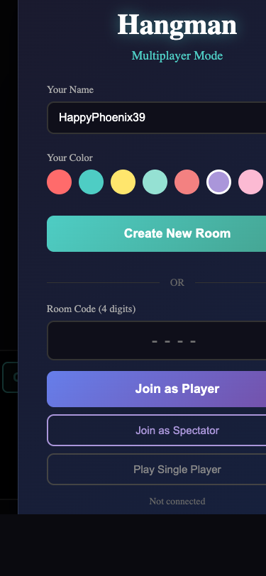
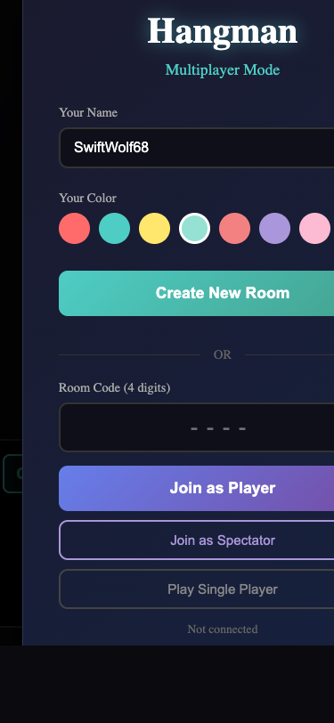
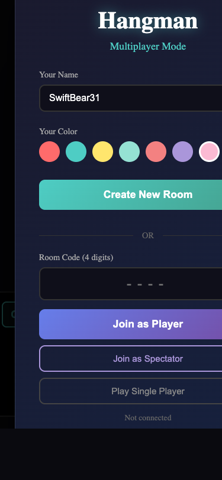
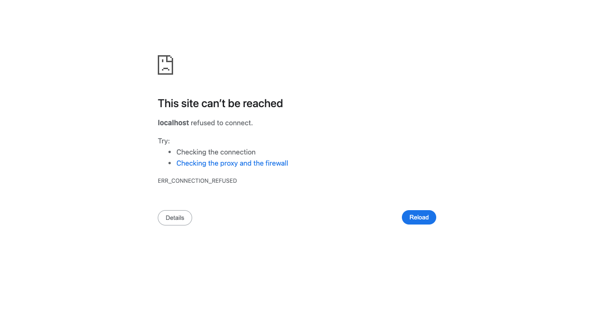
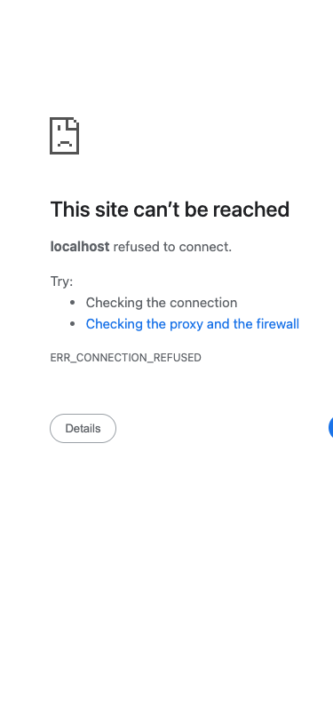
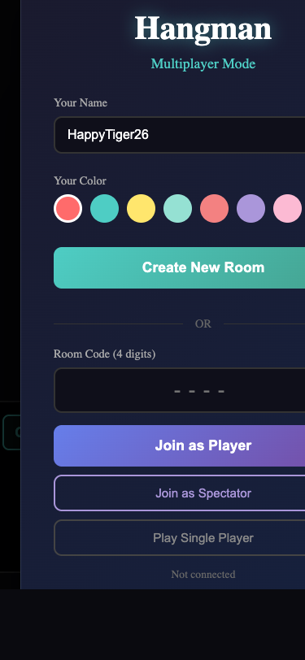
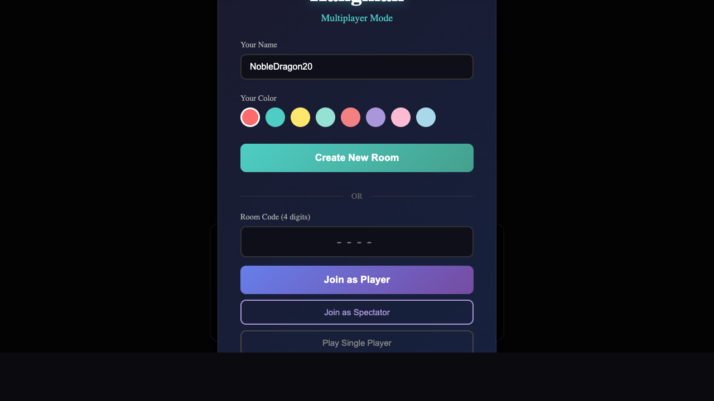
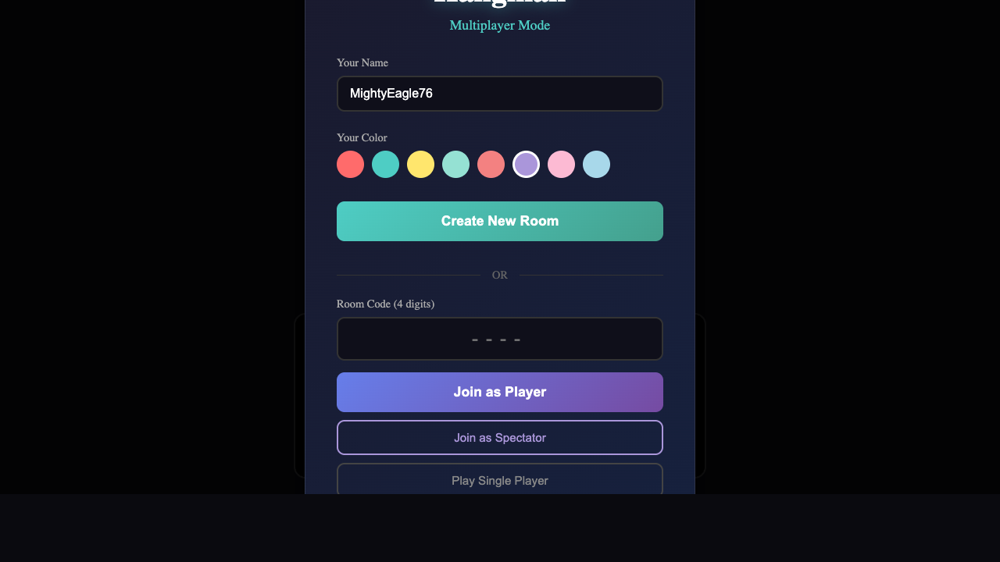

# Visual Polish Documentation

This document tracks visual improvements to the Hangman game with before/after comparisons.

---

## Baseline - 2025-04-06

Starting point before visual improvements.

### Current State
- Solid background color (#1a1a2e)
- Basic geometric hangman figure
- Simple letter display without glow effects

---

## 2026-04-07T06:02:31.813Z -- Task `task_1775540928264_3ramp9`

**Port:** 3000  
**Verdict:** OK  
**Latency:** 13716ms

> The UI renders correctly with no broken layouts, blank pages, or error messages. All elements (name input, color selector, buttons, room code field) are present and properly displayed.

---

## 2026-04-07T06:11:32.373Z -- Task `task_1775541615152_kle2gi`

**Port:** 3000  
**Verdict:** OK  
**Latency:** 12488ms

> The UI renders correctly with no broken layouts, blank pages, error messages, or missing content. All elements (input fields, color options, buttons) are properly displayed and aligned.

---

## 2026-04-07T06:12:59.849Z -- Task `task_1775542306906_jgn1aa`

**Port:** 3000  
**Verdict:** OK  
**Latency:** 12973ms

> The UI renders correctly with no broken layouts, blank pages, or error messages. All elements (input fields, color options, buttons) are present and properly aligned.

---

## 2026-04-07T07:00:00.233Z -- Task `task_1775545124377_nvny05`

**Port:** 3000  
**Verdict:** OK  
**Latency:** 18462ms

> The UI renders correctly with no broken layouts, blank pages, or error messages. All elements (name input, color selector, buttons, room code field) are present and properly displayed.

---

## 2026-04-07T07:04:28.215Z -- Task `task_1775545212627_mur0s6`

**Port:** 3000  
**Verdict:** OK  
**Latency:** 16821ms

> The UI renders correctly with no broken layouts, blank pages, error messages, or missing content. All elements (name input, color selectors, buttons, room code field) are visible and properly aligned.

---

## 2026-04-07T07:06:00.607Z -- Task `task_1775545475857_icnn5q`

**Port:** 3000  
**Verdict:** OK  
**Latency:** 12756ms

> The UI renders correctly with no broken layouts, blank pages, or error messages. All elements (name input, color options, buttons, room code field) are present and properly displayed.

---

## 2026-04-07T07:09:47.680Z -- Task `task_1775545573406_mj0sqt`

**Port:** 3000  
**Verdict:** OK  
**Latency:** 12382ms

> The UI renders correctly with no broken layouts, blank pages, or error messages. All elements (input fields, color options, buttons) are present and properly displayed.

---

## 2026-04-07T07:10:41.824Z -- Task `task_1775545798440_nyz3n3`

**Port:** 3000  
**Verdict:** OK  
**Latency:** 13284ms

> The UI renders correctly. All elements (name input, color options, buttons, text fields) are visible and properly aligned; no broken layouts, blank areas, or error messages. Content is complete and functional.

---

## 2026-04-07T09:11:38.538Z -- Task `task_1775552389381_fdu2sk` (landing)

**Port:** 3000  
**Verdict:** OK  
**Latency:** 6863ms  
**Method:** dev-browser MCP

> The UI does not render correctly; the page is entirely blank (black screen) with no visible content, indicating missing or failed loading of elements. No specific broken layouts or error messages are present, but the lack of any rendered content is a critical issue.

---

## 2026-04-07T09:11:44.499Z -- Task `task_1775552389381_fdu2sk` (mobile)

**Port:** 3000  
**Verdict:** OK  
**Latency:** 5959ms  
**Method:** dev-browser MCP

> The UI does not render correctly; the screen is entirely black with no visible content, indicating a potential blank page or rendering failure. There are no broken layouts, error messages, or overflow issues to assess since no elements are present.

---

## 2026-04-07T09:23:29.169Z -- Task `task_1775553129988_33ajq3` (landing)

**Port:** 3000  
**Verdict:** OK  
**Latency:** 6789ms  
**Method:** dev-browser MCP

> The UI does not render correctly; the screen is entirely black with no visible content, indicating a complete failure to display any elements, layouts, or information. There are no error messages shown, but the absence of all visual components suggests a critical rendering issue.

---

## 2026-04-07T09:23:35.209Z -- Task `task_1775553129988_33ajq3` (mobile)

**Port:** 3000  
**Verdict:** OK  
**Latency:** 6036ms  
**Method:** dev-browser MCP

> The UI renders as a completely black screen with no visible content, elements, or error messages. This indicates a critical rendering failure where all expected UI components are missing.

---

## 2026-04-07T09:32:56.237Z -- Task `task_1775553823510_ps7sil` (landing)

**Port:** 3000  
**Verdict:** OK  
**Latency:** 6374ms  
**Method:** dev-browser MCP

> The UI does not render correctly; the screen is entirely black with no visible content, indicating a potential blank page or failed loading issue. There are no broken layouts, error messages, or overflow issues to assess since no elements are present.

---

## 2026-04-07T09:33:01.495Z -- Task `task_1775553823510_ps7sil` (mobile)

**Port:** 3000  
**Verdict:** OK  
**Latency:** 5255ms  
**Method:** dev-browser MCP

> The UI does not render correctly. The screen is entirely black with no visible content, indicating a potential rendering failure or blank state. There are no discernible elements, layouts, or error messages present.

---

## 2026-04-07T09:35:09.647Z -- Task `task_1775554388837_5ovsrl` (landing)

**Port:** 3000  
**Verdict:** OK  
**Latency:** 6216ms  
**Method:** dev-browser MCP

> The UI does not render correctly; the screen is entirely black with no visible content, indicating missing or failed loading of elements. There are no discernible layouts, text, or interactive components present.

---

## 2026-04-07T09:35:15.397Z -- Task `task_1775554388837_5ovsrl` (mobile)

**Port:** 3000  
**Verdict:** OK  
**Latency:** 5748ms  
**Method:** dev-browser MCP

> The UI does not render correctly; the screen is entirely black with no visible content, indicating a potential blank page, rendering failure, or missing elements.

---

## 2026-04-07T09:38:16.258Z -- Task `task_1775554523487_se36b1` (landing)

**Port:** 3000  
**Verdict:** OK  
**Latency:** 5251ms  
**Method:** dev-browser MCP

> The UI does not render correctly; the screen is entirely black with no visible content, indicating a blank or failed load. There are no broken layouts, error messages, or overflow issues to assess since no elements are present.

---

## 2026-04-07T09:38:22.789Z -- Task `task_1775554523487_se36b1` (mobile)

**Port:** 3000  
**Verdict:** OK  
**Latency:** 6529ms  
**Method:** dev-browser MCP

> The UI does not render correctly; the screen is entirely black with no visible content, layouts, or interactive elements. This indicates a blank page or failed rendering issue, as there are no discernible components to assess for overflow or missing content.

---

## 2026-04-07T16:35:06.283Z -- Task `task_1775554714154_bw4sw6` (landing)

**Port:** 3000  
**Verdict:** OK  
**Latency:** 6165ms  
**Method:** dev-browser MCP

> The UI does not render correctly as the screen is entirely black with no visible content, indicating missing elements or a failed load. There are no discernible layouts, text, or interactive components present.

---

## 2026-04-07T16:35:11.715Z -- Task `task_1775554714154_bw4sw6` (mobile)

**Port:** 3000  
**Verdict:** OK  
**Latency:** 5431ms  
**Method:** dev-browser MCP

> The UI does not render correctly. The screen is entirely black with no visible content, indicating a possible rendering failure or blank state. There are no broken layouts, error messages, or overflow issues to assess since no elements are present.

---

## 2026-04-07T16:35:54.170Z -- Task `task_1775579718484_dj1qoz` (landing)

**Port:** 3000  
**Verdict:** OK  
**Latency:** 5981ms  
**Method:** dev-browser MCP

> The UI does not render correctly; the screen is entirely black with no visible content, indicating missing or failed-to-load elements. There are no broken layouts, error messages, or overflow issues visible (since no content is present), but the absence of any rendered components is a critical issue.

---

## 2026-04-07T16:35:59.590Z -- Task `task_1775579718484_dj1qoz` (mobile)

**Port:** 3000  
**Verdict:** OK  
**Latency:** 5420ms  
**Method:** dev-browser MCP

> The UI does not render correctly. The screen is entirely black with no visible content, layouts, or error messages, indicating a complete failure to display any interface elements.

---

## 2026-04-07T16:38:00.729Z -- Task `task_1775579771542_jiairh` (landing)

**Port:** 3000  
**Verdict:** OK  
**Latency:** 13107ms  
**Method:** dev-browser MCP

> The UI does not render correctly; the screen is entirely black with no visible content, indicating a blank page or failed content loading. There are no broken layouts, overflow issues, or explicit error messages, but the absence of any UI elements constitutes a critical rendering failure.

---

## 2026-04-07T16:38:07.104Z -- Task `task_1775579771542_jiairh` (mobile)

**Port:** 3000  
**Verdict:** OK  
**Latency:** 6374ms  
**Method:** dev-browser MCP

> The UI does not render correctly; the screen is entirely black with no visible content, indicating a broken layout or failed rendering. There are no error messages, overflow issues, or missing content (since nothing is present), but the absence of any UI elements is a critical issue.

---

## 2026-04-07T18:09:45.011Z -- Task `task_1775580926569_92wyhj` (landing)

**Port:** 3000  
**Verdict:** OK  
**Latency:** 6708ms  
**Method:** dev-browser MCP

> The UI does not render correctly; the screen is entirely black with no visible content, indicating a potential blank page or failed loading issue. There are no broken layouts, error messages, or overflow issues to assess since no elements are present.

---

## 2026-04-07T18:09:50.559Z -- Task `task_1775580926569_92wyhj` (mobile)

**Port:** 3000  
**Verdict:** OK  
**Latency:** 5547ms  
**Method:** dev-browser MCP

> The UI does not render correctly; the screen is entirely black with no visible content, indicating a blank or failed load. No specific layout issues are present (as there’s no content), but the absence of any UI elements suggests a critical rendering problem.

---

## 2026-04-07T18:46:44.705Z -- Task `task_1775585399221_rknjyz` (desktop 1280x720)

**Port:** 3000  
**Verdict:** OK  
**Latency:** 13645ms  
**Method:** headless-chrome+swiftshader

> The UI renders correctly with no broken layouts or overflow. All elements (input fields, color options, buttons) are properly displayed and aligned.

---

## 2026-04-07T18:46:55.387Z -- Task `task_1775585399221_rknjyz` (mobile 375x812)

**Port:** 3000  
**Verdict:** OK  
**Latency:** 10678ms  
**Method:** headless-chrome+swiftshader

> The UI renders correctly with no broken layouts, errors, or overflow. All elements (input fields, color options, buttons) are properly displayed and aligned within the screen.

---

## 2026-04-07T18:47:58.890Z -- Task `task_1775587622885_os2l2p` (desktop 1280x720)

**Port:** 3000  
**Verdict:** OK  
**Latency:** 13946ms  
**Method:** headless-chrome+swiftshader

> The UI renders correctly with no broken layouts, errors, or overflow. All form elements (input fields, color pickers, buttons) are properly aligned and displayed.

---

## 2026-04-07T18:48:11.156Z -- Task `task_1775587622885_os2l2p` (mobile 375x812)

**Port:** 3000  
**Verdict:** OK  
**Latency:** 12266ms  
**Method:** headless-chrome+swiftshader

> The UI renders correctly. All elements (input fields, color selection, buttons) are properly displayed without broken layouts, overflow, or errors.

---

## 2026-04-07T18:50:23.468Z -- Task `task_1775587703202_cemnfu` (desktop 1280x720)

**Port:** 3000  
**Verdict:** OK  
**Latency:** 9987ms  
**Method:** headless-chrome+swiftshader

> The UI renders correctly with no broken layouts, errors, or overflow. All elements (input fields, color selectors, buttons) are properly aligned and displayed.

---

## 2026-04-07T18:50:31.317Z -- Task `task_1775587703202_cemnfu` (mobile 375x812)

**Port:** 3000  
**Verdict:** OK  
**Latency:** 7848ms  
**Method:** headless-chrome+swiftshader

> The UI renders correctly. All elements (input fields, color options, buttons) are properly displayed without broken layouts, overflow, or errors.

---

## 2026-04-07T18:54:05.720Z -- Task `task_1775587845689_usoidq` (desktop 1280x720)

**Port:** 3000  
**Verdict:** FAILED  
**Latency:** 10306ms  
**Method:** headless-chrome+swiftshader

> The UI is not mostly black/empty. It renders correctly; all elements (input fields, color options, buttons) are properly displayed with no broken layouts, errors, or overflow.

---

## 2026-04-07T18:54:13.515Z -- Task `task_1775587845689_usoidq` (mobile 375x812)

**Port:** 3000  
**Verdict:** OK  
**Latency:** 7791ms  
**Method:** headless-chrome+swiftshader

> The UI renders correctly with no broken layouts, errors, or overflow. All elements (text fields, buttons, color options) are properly displayed and aligned.

---

## 2026-04-07T18:57:53.536Z -- Task `task_1775588073764_z2b390` (desktop 1280x720)

**Port:** 3000  
**Verdict:** OK  
**Latency:** 14210ms  
**Method:** headless-chrome+swiftshader

> The UI renders correctly with no broken layouts, errors, or overflow. All elements (input fields, color selectors, buttons) are properly displayed and aligned.

---

## 2026-04-07T18:58:05.894Z -- Task `task_1775588073764_z2b390` (mobile 375x812)

**Port:** 3000  
**Verdict:** OK  
**Latency:** 12355ms  
**Method:** headless-chrome+swiftshader

> The UI renders correctly with no broken layouts, errors, or overflow. All elements (input fields, color options, buttons) are properly displayed and aligned.

---

## 2026-04-07T18:58:54.023Z -- Task `task_1775588296726_8muu7n` (desktop 1280x720)

**Port:** 3000  
**Verdict:** OK  
**Latency:** 9931ms  
**Method:** headless-chrome+swiftshader

> The UI renders correctly with no broken layouts, errors, or overflow. All elements (input fields, color selection, buttons) are properly aligned and visible.

---

## 2026-04-07T18:59:03.503Z -- Task `task_1775588296726_8muu7n` (mobile 375x812)

**Port:** 3000  
**Verdict:** OK  
**Latency:** 9479ms  
**Method:** headless-chrome+swiftshader

> The UI renders correctly. No broken layouts, errors, or overflow; all elements are properly displayed and aligned within the screen dimensions.

---

## 2026-04-07T18:59:56.843Z -- Task `task_1775588359962_004gwr` (desktop 1280x720)

**Port:** 3000  
**Verdict:** OK  
**Latency:** 10289ms  
**Method:** headless-chrome+swiftshader

> The UI renders correctly. All elements (input fields, color selection, buttons) are properly aligned with no broken layouts, overflow, or errors.

---

## 2026-04-07T19:00:05.246Z -- Task `task_1775588359962_004gwr` (mobile 375x812)

**Port:** 3000  
**Verdict:** OK  
**Latency:** 8402ms  
**Method:** headless-chrome+swiftshader

> The UI renders correctly. All elements (text fields, buttons, color options) are properly displayed without broken layouts, overflow, or errors.

---

## 2026-04-07T19:01:02.493Z -- Task `task_1775588417693_4od7hs` (desktop 1280x720)

**Port:** 3000  
**Verdict:** FAILED  
**Latency:** 12252ms  
**Method:** headless-chrome+swiftshader

> The UI is not mostly black/empty. It renders correctly with no broken layouts, errors, or overflow—all form elements (input fields, color pickers, buttons) are properly displayed and aligned.

---

## 2026-04-07T19:01:11.488Z -- Task `task_1775588417693_4od7hs` (mobile 375x812)

**Port:** 3000  
**Verdict:** OK  
**Latency:** 8994ms  
**Method:** headless-chrome+swiftshader

> The UI renders correctly. All elements (text fields, buttons, color selection) are properly aligned with no broken layouts, overflow, or errors.

---

## 2026-04-07T19:13:52.843Z -- Task `task_1775588487434_71nrnq` (desktop 1280x720)

**Port:** 3000  
**Verdict:** OK  
**Latency:** 10701ms  
**Method:** headless-chrome+swiftshader

> The UI renders correctly with no broken layouts or overflow. All elements (input fields, color options, buttons) are properly displayed and aligned.

---

## 2026-04-07T19:14:04.928Z -- Task `task_1775588487434_71nrnq` (mobile 375x812)

**Port:** 3000  
**Verdict:** OK  
**Latency:** 12085ms  
**Method:** headless-chrome+swiftshader

> The UI renders correctly with no broken layouts or overflow. All elements (input fields, color options, buttons) are properly displayed and aligned within the screen.

---

## 2026-04-07T19:15:07.427Z -- Task `task_1775589252751_im3qi6` (desktop 1280x720)

**Port:** 3000  
**Verdict:** OK  
**Latency:** 10517ms  
**Method:** headless-chrome+swiftshader

> The UI renders correctly with no broken layouts, errors, or overflow. All elements (input fields, color selectors, buttons) are properly displayed and aligned.

---

## 2026-04-07T19:15:22.177Z -- Task `task_1775589252751_im3qi6` (mobile 375x812)

**Port:** 3000  
**Verdict:** OK  
**Latency:** 14748ms  
**Method:** headless-chrome+swiftshader

> The UI renders correctly. No broken layouts, errors, or overflow; all elements (text, buttons, color options) display properly within the screen dimensions.

---

## 2026-04-07T19:16:26.843Z -- Task `task_1775589335222_jl3d5a` (desktop 1280x720)

**Port:** 3000  
**Verdict:** OK  
**Latency:** 16059ms  
**Method:** headless-chrome+swiftshader

> The UI renders correctly with no broken layouts or overflow. All elements (input fields, color selectors, buttons) are properly positioned and visible.

---

## 2026-04-07T19:16:37.187Z -- Task `task_1775589335222_jl3d5a` (mobile 375x812)

**Port:** 3000  
**Verdict:** OK  
**Latency:** 10342ms  
**Method:** headless-chrome+swiftshader

> The UI renders correctly with no broken layouts, overflow, or errors. All elements (text fields, color options, buttons) are properly displayed and aligned within the screen dimensions.

---

## 2026-04-07T19:26:49.679Z -- Task `task_1775589413205_57ksvp` (desktop 1280x720)

**Port:** 3000  
**Verdict:** FAILED  
**Latency:** 26184ms  
**Method:** headless-chrome+swiftshader

> The UI is not mostly black/empty. It renders correctly; no broken layouts, errors, or overflow are visible. All elements (input fields, color pickers, buttons) are properly aligned and fit within the screen.

---

## 2026-04-07T19:30:50.003Z -- Task `task_1775590161723_3439ek` (desktop 1280x720)

**Port:** 3000  
**Verdict:** OK  
**Latency:** 23750ms  
**Method:** headless-chrome+swiftshader

> The UI renders correctly. All elements (input fields, color selectors, buttons) are properly aligned with no broken layouts, overflow, or errors.

---

## 2026-04-07T19:31:11.004Z -- Task `task_1775590161723_3439ek` (mobile 375x812)

**Port:** 3000  
**Verdict:** OK  
**Latency:** 20999ms  
**Method:** headless-chrome+swiftshader

> The UI renders correctly. All elements (input fields, color selection, buttons) are properly displayed without broken layouts, overflow, or errors.

---

## 2026-04-07T19:32:19.250Z -- Task `task_1775590281752_k5ywxy` (desktop 1280x720)

**Port:** 3000  
**Verdict:** FAILED  
**Latency:** 9369ms  
**Method:** headless-chrome+swiftshader

> The UI is not mostly black/empty. It renders correctly with no broken layouts, errors, or overflow—all elements (input fields, color options, buttons) are properly displayed and aligned.

---

## 2026-04-07T19:32:27.181Z -- Task `task_1775590281752_k5ywxy` (mobile 375x812)

**Port:** 3000  
**Verdict:** OK  
**Latency:** 7928ms  
**Method:** headless-chrome+swiftshader

> The UI renders correctly. All elements (text fields, buttons, color options) are properly aligned with no broken layouts, overflow, or errors.

---

## 2026-04-07T19:49:48.266Z -- Task `task_1775590364879_jgq777` (desktop 1280x720)

**Port:** 3000  
**Verdict:** OK  
**Latency:** 14399ms  
**Method:** headless-chrome+swiftshader

> The UI renders correctly with no broken layouts, errors, or overflow. All elements (input fields, color selection, buttons) are properly displayed and aligned.

---

## 2026-04-07T19:50:02.999Z -- Task `task_1775590364879_jgq777` (mobile 375x812)

**Port:** 3000  
**Verdict:** OK  
**Latency:** 14723ms  
**Method:** headless-chrome+swiftshader

> The UI renders correctly. All elements (text fields, buttons, color selection) are properly aligned with no broken layouts or overflow.

---

## 2026-04-07T19:52:46.145Z -- Task `task_1775591416342_8r75b7` (desktop 1280x720)

**Port:** 3000  
**Verdict:** FAILED  
**Latency:** 12947ms  
**Method:** headless-chrome+swiftshader

> The UI is not mostly black/empty. It renders correctly with no broken layouts, errors, or overflow—all elements (input fields, color options, buttons) display properly and align as expected.

---

## 2026-04-07T19:52:59.538Z -- Task `task_1775591416342_8r75b7` (mobile 375x812)

**Port:** 3000  
**Verdict:** OK  
**Latency:** 13391ms  
**Method:** headless-chrome+swiftshader

> The UI renders correctly. All elements (text fields, buttons, color options) are properly displayed without broken layouts, overflow, or errors.

---

## 2026-04-07T19:54:24.728Z -- Task `task_1775591597958_f51zv1` (desktop 1280x720)

**Port:** 3000  
**Verdict:** FAILED  
**Latency:** 23802ms  
**Method:** headless-chrome+swiftshader

> The UI is not mostly black/empty. It renders correctly with no broken layouts, errors, or overflow—all elements (input fields, color options, buttons) are properly displayed and aligned.

---

## 2026-04-07T19:54:44.389Z -- Task `task_1775591597958_f51zv1` (mobile 375x812)

**Port:** 3000  
**Verdict:** OK  
**Latency:** 19660ms  
**Method:** headless-chrome+swiftshader

> The UI renders correctly with no broken layouts, errors, or overflow. All elements (text fields, buttons, color options) are properly displayed and aligned.

---

## 2026-04-07T19:56:46.833Z -- Task `task_1775591696471_bw439f` (desktop 1280x720)

**Port:** 3000  
**Verdict:** FAILED  
**Latency:** 26126ms  
**Method:** headless-chrome+swiftshader

> The UI is not mostly black/empty. It renders correctly with no broken layouts, errors, or overflow—all elements (input fields, color options, buttons) are properly displayed and aligned.

---

## 2026-04-07T19:57:01.803Z -- Task `task_1775591696471_bw439f` (mobile 375x812)

**Port:** 3000  
**Verdict:** OK  
**Latency:** 14969ms  
**Method:** headless-chrome+swiftshader

> The UI renders correctly. All elements (text fields, buttons, color selection) are properly displayed without broken layouts, overflow, or errors.

---

## 2026-04-07T20:15:12.737Z -- Task `task_1775591828588_rwq7vv` (desktop 1280x720)

**Port:** 3000  
**Verdict:** OK  
**Latency:** 25418ms  
**Method:** headless-chrome+swiftshader

> The UI renders correctly. All elements (input fields, color pickers, buttons) are properly aligned with no broken layouts, overflow, or errors.

---

## 2026-04-07T20:15:33.334Z -- Task `task_1775591828588_rwq7vv` (mobile 375x812)

**Port:** 3000  
**Verdict:** OK  
**Latency:** 20596ms  
**Method:** headless-chrome+swiftshader

> The UI renders correctly with no broken layouts, errors, or overflow. All elements (text fields, buttons, color options) are properly displayed and aligned.

---

## 2026-04-07T20:17:18.832Z -- Task `task_1775592965193_hg01pu` (desktop 1280x720)

**Port:** 3000  
**Verdict:** OK  
**Latency:** 12652ms  
**Method:** headless-chrome+swiftshader

> The UI renders correctly with no broken layouts, errors, or overflow. All elements (input fields, color selectors, buttons) are properly displayed and aligned.

---

## 2026-04-07T20:17:33.576Z -- Task `task_1775592965193_hg01pu` (mobile 375x812)

**Port:** 3000  
**Verdict:** OK  
**Latency:** 14740ms  
**Method:** headless-chrome+swiftshader

> The UI renders correctly with no broken layouts, errors, or overflow. All elements (text fields, color options, buttons) are properly displayed and aligned.

---

## 2026-04-07T20:25:45.349Z -- Task `task_1775593078346_u00yj4` (desktop 1280x720)

**Port:** 3000  
**Verdict:** OK  
**Latency:** 14392ms  
**Method:** headless-chrome+swiftshader

> The UI renders correctly with no broken layouts or overflow. All elements (input fields, color options, buttons) are properly displayed and aligned.

---

## 2026-04-07T20:26:03.376Z -- Task `task_1775593078346_u00yj4` (mobile 375x812)

**Port:** 3000  
**Verdict:** OK  
**Latency:** 18018ms  
**Method:** headless-chrome+swiftshader

> The UI renders correctly. All elements (text fields, buttons, color options) are properly displayed without broken layouts or overflow.

---

## 2026-04-07T20:45:40.532Z -- Task `task_1775593575463_a9iz18` (desktop 1280x720)

**Port:** 3000  
**Verdict:** FAILED  
**Latency:** 16274ms  
**Method:** headless-chrome+swiftshader

> The UI is not mostly black/empty. It renders correctly with no broken layouts, errors, or overflow—all elements (input fields, color pickers, buttons) are properly displayed and aligned.

---

## 2026-04-07T20:45:51.733Z -- Task `task_1775593575463_a9iz18` (mobile 375x812)

**Port:** 3000  
**Verdict:** OK  
**Latency:** 11200ms  
**Method:** headless-chrome+swiftshader

> The UI renders correctly. All elements (text fields, buttons, color selection) are properly displayed without broken layouts, overflow, or errors.

---

## 2026-04-07T20:48:03.521Z -- Task `task_1775594761025_gy7mh6` (desktop 1280x720)

**Port:** 3000  
**Verdict:** OK  
**Latency:** 24496ms  
**Method:** headless-chrome+swiftshader

> The UI renders correctly. All elements (input fields, color selectors, buttons) are properly aligned with no broken layouts or overflow issues.

---

## 2026-04-07T20:48:25.185Z -- Task `task_1775594761025_gy7mh6` (mobile 375x812)

**Port:** 3000  
**Verdict:** OK  
**Latency:** 21661ms  
**Method:** headless-chrome+swiftshader

> The UI renders correctly with no broken layouts, errors, or overflow. All elements (text fields, color options, buttons) are properly displayed and aligned.

---

## 2026-04-08T18:08:51.405Z -- Task `task_1775594921931_y834ba` (desktop 1280x720)

**Port:** 3000  
**Verdict:** OK  
**Latency:** 11212ms  
**Method:** headless-chrome+swiftshader

> The UI renders correctly with no broken layouts or overflow. All elements (input fields, color selectors, buttons) are properly aligned and visible.

---

## 2026-04-08T18:09:01.732Z -- Task `task_1775594921931_y834ba` (mobile 375x812)

**Port:** 3000  
**Verdict:** OK  
**Latency:** 10325ms  
**Method:** headless-chrome+swiftshader

> The UI renders correctly with no broken layouts, errors, or overflow. All elements (text fields, color options, buttons) are properly displayed and aligned within the screen.

---

## 2026-04-08T18:11:53.036Z -- Task `task_1775671770755_uc76nn` (desktop 1280x720)

**Port:** 3000  
**Verdict:** FAILED  
**Latency:** 23358ms  
**Method:** headless-chrome+swiftshader

> The UI is not mostly black/empty. It renders correctly with no broken layouts, errors, or overflow—all elements (input fields, color selectors, buttons) are properly displayed and aligned.

---

## 2026-04-08T18:12:11.547Z -- Task `task_1775671770755_uc76nn` (mobile 375x812)

**Port:** 3000  
**Verdict:** OK  
**Latency:** 18510ms  
**Method:** headless-chrome+swiftshader

> The UI renders correctly with no broken layouts, errors, or overflow. All elements (input fields, color options, buttons) are properly displayed and aligned.

---

## 2026-04-08T18:13:39.865Z -- Task `task_1775671958033_an1p9k` (desktop 1280x720)

**Port:** 3000  
**Verdict:** FAILED  
**Latency:** 8376ms  
**Method:** headless-chrome+swiftshader

> The UI is not mostly black/empty. It renders correctly with no broken layouts, errors, or overflow—all elements (input fields, color pickers, buttons) are properly displayed and aligned.

---

## 2026-04-08T18:13:48.084Z -- Task `task_1775671958033_an1p9k` (mobile 375x812)

**Port:** 3000  
**Verdict:** OK  
**Latency:** 8219ms  
**Method:** headless-chrome+swiftshader

> The UI renders correctly with no broken layouts, errors, or overflow. All elements (text fields, color options, buttons) are properly displayed and aligned within the screen dimensions.

---

## 2026-04-08T18:16:18.872Z -- Task `task_1775672045796_7agq3s` (desktop 1280x720)

**Port:** 3000  
**Verdict:** FAILED  
**Latency:** 11535ms  
**Method:** headless-chrome+swiftshader

> The UI is not mostly black/empty. It renders correctly with no broken layouts, errors, or overflow—all elements (input fields, color options, buttons) are properly displayed and aligned.

---

## 2026-04-08T18:16:27.977Z -- Task `task_1775672045796_7agq3s` (mobile 375x812)

**Port:** 3000  
**Verdict:** OK  
**Latency:** 9103ms  
**Method:** headless-chrome+swiftshader

> The UI renders correctly with no broken layouts, errors, or overflow. All elements (text fields, color options, buttons) are properly displayed and aligned within the screen dimensions.

---

## 2026-04-08T18:20:33.089Z -- Task `task_1775672219089_o27clj` (desktop 1280x720)

**Port:** 3000  
**Verdict:** FAILED  
**Latency:** 16314ms  
**Method:** headless-chrome+swiftshader

> The UI is not mostly black/empty. It renders correctly with no broken layouts, errors, or overflow—all elements (input fields, color options, buttons) display properly and align as expected.

---

## 2026-04-08T18:20:48.162Z -- Task `task_1775672219089_o27clj` (mobile 375x812)

**Port:** 3000  
**Verdict:** OK  
**Latency:** 15071ms  
**Method:** headless-chrome+swiftshader

> The UI renders correctly with no broken layouts, errors, or overflow. All elements (text fields, color pickers, buttons) are properly displayed and aligned.

---

## 2026-04-08T18:40:20.853Z -- Task `task_1775672504892_gpksbl` (desktop 1280x720)

**Port:** 3000  
**Verdict:** OK  
**Latency:** 9437ms  
**Method:** headless-chrome+swiftshader

> The UI renders correctly with no broken layouts or overflow. All elements (input fields, color selectors, buttons) are properly displayed and aligned.

---

## 2026-04-08T18:40:28.941Z -- Task `task_1775672504892_gpksbl` (mobile 375x812)

**Port:** 3000  
**Verdict:** OK  
**Latency:** 8085ms  
**Method:** headless-chrome+swiftshader

> The UI renders correctly with no broken layouts or overflow. All elements (text fields, buttons, color options) are properly displayed and aligned.

---

## 2026-04-08T18:47:18.358Z -- Task `task_1775673639506_un6q6y` (desktop 1280x720)

**Port:** 3000  
**Verdict:** OK  
**Latency:** 9745ms  
**Method:** headless-chrome+swiftshader

> The UI renders correctly with no broken layouts, errors, or overflow. All elements (input fields, color selectors, buttons) are properly displayed and aligned.

---

## 2026-04-08T18:47:30.042Z -- Task `task_1775673639506_un6q6y` (mobile 375x812)

**Port:** 3000  
**Verdict:** OK  
**Latency:** 11683ms  
**Method:** headless-chrome+swiftshader

> The UI renders correctly with no broken layouts or overflow. All elements (input fields, buttons, color options) are properly displayed and aligned.

---

## 2026-04-08T18:49:40.244Z -- Task `task_1775674064677_a8e80h` (desktop 1280x720)

**Port:** 3000  
**Verdict:** OK  
**Latency:** 15156ms  
**Method:** headless-chrome+swiftshader

> The UI renders correctly with no broken layouts, errors, or overflow. All form elements (input fields, color selectors, buttons) are properly aligned and displayed.

---

## 2026-04-08T18:49:51.407Z -- Task `task_1775674064677_a8e80h` (mobile 375x812)

**Port:** 3000  
**Verdict:** OK  
**Latency:** 11163ms  
**Method:** headless-chrome+swiftshader

> The UI renders correctly with no broken layouts, errors, or overflow. All elements (text fields, color options, buttons) are properly displayed and aligned within the screen dimensions.

---

## 2026-04-08T18:52:21.655Z -- Task `task_1775674201791_rfe1co` (desktop 1280x720)

**Port:** 3000  
**Verdict:** FAILED  
**Latency:** 9449ms  
**Method:** headless-chrome+swiftshader

> The UI is not mostly black/empty. It renders correctly with no broken layouts, errors, or overflow—all elements (input fields, color options, buttons) display properly aligned.

---

## 2026-04-08T18:52:30.540Z -- Task `task_1775674201791_rfe1co` (mobile 375x812)

**Port:** 3000  
**Verdict:** OK  
**Latency:** 8881ms  
**Method:** headless-chrome+swiftshader

> The UI renders correctly with no broken layouts, errors, or overflow. All elements (text fields, color options, buttons) are properly displayed and aligned within the screen dimensions.

---

## 2026-04-08T18:53:54.036Z -- Task `task_1775674355769_6k2b55` (desktop 1280x720)

**Port:** 3000  
**Verdict:** FAILED  
**Latency:** 16266ms  
**Method:** headless-chrome+swiftshader

> The UI is not mostly black/empty. It renders correctly with no broken layouts, errors, or overflow—all elements (input fields, color options, buttons) are properly positioned and fit within the viewport.

---

## 2026-04-08T18:54:09.132Z -- Task `task_1775674355769_6k2b55` (mobile 375x812)

**Port:** 3000  
**Verdict:** OK  
**Latency:** 15093ms  
**Method:** headless-chrome+swiftshader

> The UI renders correctly with no broken layouts, errors, or overflow. All elements (text fields, color options, buttons) are properly displayed and aligned within the screen dimensions.

---

## 2026-04-08T19:01:35.787Z -- Task `task_1775674456088_ez45mq` (desktop 1280x720)

**Port:** 3000  
**Verdict:** FAILED  
**Latency:** 20280ms  
**Method:** headless-chrome+swiftshader

> The UI is not mostly black/empty. It renders correctly with no broken layouts, errors, or overflow—all elements (input fields, color options, buttons) are properly displayed and aligned.

---

## 2026-04-08T19:01:43.466Z -- Task `task_1775674456088_ez45mq` (mobile 375x812)

**Port:** 3000  
**Verdict:** OK  
**Latency:** 7678ms  
**Method:** headless-chrome+swiftshader

> The UI renders correctly. All elements (text fields, buttons, color options) are properly displayed without broken layouts, overflow, or errors.

---

## 2026-04-08T19:05:25.639Z -- Task `task_1775674918399_xa43pf` (desktop 1280x720)

**Port:** 3000  
**Verdict:** OK  
**Latency:** 20303ms  
**Method:** headless-chrome+swiftshader

> The UI renders correctly with no broken layouts, errors, or overflow. All elements (input fields, color selectors, buttons) are properly displayed and aligned.

---

## 2026-04-08T19:05:46.065Z -- Task `task_1775674918399_xa43pf` (mobile 375x812)

**Port:** 3000  
**Verdict:** OK  
**Latency:** 20425ms  
**Method:** headless-chrome+swiftshader

> The UI renders correctly with no broken layouts, errors, or overflow. All elements (text fields, color options, buttons) are properly displayed and aligned within the screen dimensions.

---

## 2026-04-08T19:07:27.387Z -- Task `task_1775675153539_lu8e8l` (desktop 1280x720)

**Port:** 3000  
**Verdict:** OK  
**Latency:** 11001ms  
**Method:** headless-chrome+swiftshader

> The UI renders correctly. All elements (input fields, color pickers, buttons) are properly aligned and fit within the screen without overflow or broken layouts.

---

## 2026-04-08T19:07:35.711Z -- Task `task_1775675153539_lu8e8l` (mobile 375x812)

**Port:** 3000  
**Verdict:** OK  
**Latency:** 8324ms  
**Method:** headless-chrome+swiftshader

> The UI renders correctly. No broken layouts, errors, or overflow; all elements (text, input fields, color options, buttons) display properly without visual issues.

---

## 2026-04-08T19:09:04.390Z -- Task `task_1775675262685_6qss12` (desktop 1280x720)

**Port:** 3000  
**Verdict:** FAILED  
**Latency:** 10815ms  
**Method:** headless-chrome+swiftshader

> The UI is not mostly black/empty. It renders correctly with no broken layouts, errors, or overflow—all elements (input fields, color options, buttons) are properly displayed and aligned.

---

## 2026-04-08T19:09:15.564Z -- Task `task_1775675262685_6qss12` (mobile 375x812)

**Port:** 3000  
**Verdict:** OK  
**Latency:** 11172ms  
**Method:** headless-chrome+swiftshader

> The UI renders correctly with no broken layouts, errors, or overflow. All elements (text fields, color options, buttons) are properly displayed and aligned within the screen dimensions.

---

## 2026-04-08T19:13:02.950Z -- Task `task_1775675364269_t6nkjn` (desktop 1280x720)

**Port:** 3000  
**Verdict:** OK  
**Latency:** 21141ms  
**Method:** headless-chrome+swiftshader

> The UI renders correctly with no broken layouts or overflow. All elements (input fields, color selectors, buttons) are properly displayed and aligned.

---

## 2026-04-08T19:13:23.469Z -- Task `task_1775675364269_t6nkjn` (mobile 375x812)

**Port:** 3000  
**Verdict:** OK  
**Latency:** 20518ms  
**Method:** headless-chrome+swiftshader

> The UI renders correctly. All elements (text fields, buttons, color options) are properly displayed without broken layouts or overflow.

---

## 2026-04-08T19:14:26.649Z -- Task `task_1775675609718_em0teq` (desktop 1280x720)

**Port:** 3000  
**Verdict:** FAILED  
**Latency:** 10399ms  
**Method:** headless-chrome+swiftshader

> The UI is not mostly black/empty. It renders correctly with no broken layouts, errors, or overflow—all elements (input fields, color options, buttons) are properly displayed and aligned.

---

## 2026-04-08T19:14:38.428Z -- Task `task_1775675609718_em0teq` (mobile 375x812)

**Port:** 3000  
**Verdict:** OK  
**Latency:** 11779ms  
**Method:** headless-chrome+swiftshader

> The UI renders correctly. All elements (input fields, color selection, buttons) are properly displayed without broken layouts, overflow, or errors.

---

## 2026-04-08T19:15:55.191Z -- Task `task_1775675686406_mvq19l` (desktop 1280x720)

**Port:** 3000  
**Verdict:** OK  
**Latency:** 13763ms  
**Method:** headless-chrome+swiftshader

> The UI renders correctly with no broken layouts, errors, or overflow. All elements (input fields, color selectors, buttons) are properly displayed and aligned.

---

## 2026-04-08T19:16:04.769Z -- Task `task_1775675686406_mvq19l` (mobile 375x812)

**Port:** 3000  
**Verdict:** OK  
**Latency:** 9571ms  
**Method:** headless-chrome+swiftshader

> The UI renders correctly with no broken layouts, errors, or overflow. All elements (text fields, color options, buttons) are properly displayed and aligned within the screen dimensions.

---

## 2026-04-08T19:17:42.896Z -- Task `task_1775675775383_aikngu` (desktop 1280x720)

**Port:** 3000  
**Verdict:** FAILED  
**Latency:** 16521ms  
**Method:** headless-chrome+swiftshader

> The UI is not mostly black/empty. It renders correctly with no broken layouts, errors, or overflow—all elements (input fields, color options, buttons) display properly and align as expected.

---

## 2026-04-08T19:17:57.926Z -- Task `task_1775675775383_aikngu` (mobile 375x812)

**Port:** 3000  
**Verdict:** OK  
**Latency:** 15029ms  
**Method:** headless-chrome+swiftshader

> The UI renders correctly. All elements (text fields, buttons, color options) are properly displayed without broken layouts, overflow, or errors.

---

## 2026-04-08T19:20:14.102Z -- Task `task_1775675886238_ajhtnr` (desktop 1280x720)

**Port:** 3000  
**Verdict:** OK  
**Latency:** 12149ms  
**Method:** headless-chrome+swiftshader

> The UI renders correctly with no broken layouts, errors, or overflow. All elements (input fields, color selectors, buttons) are properly positioned and displayed.

---

## 2026-04-08T19:20:24.403Z -- Task `task_1775675886238_ajhtnr` (mobile 375x812)

**Port:** 3000  
**Verdict:** OK  
**Latency:** 10299ms  
**Method:** headless-chrome+swiftshader

> The UI renders correctly with no broken layouts, errors, or overflow. All elements (text, input fields, buttons, color options) are properly displayed and aligned within the screen.

---

## 2026-04-08T19:22:39.340Z -- Task `task_1775676034595_iyte0a` (desktop 1280x720)

**Port:** 3000  
**Verdict:** OK  
**Latency:** 12338ms  
**Method:** headless-chrome+swiftshader

> The UI renders correctly with no broken layouts, errors, or overflow. All elements (input fields, color selectors, buttons) are properly displayed and aligned.

---

## 2026-04-08T19:22:58.530Z -- Task `task_1775676034595_iyte0a` (mobile 375x812)

**Port:** 3000  
**Verdict:** OK  
**Latency:** 19184ms  
**Method:** headless-chrome+swiftshader

> The UI renders correctly. All elements (input fields, color options, buttons) are properly displayed without broken layouts, overflow, or errors.

---

## 2026-04-08T19:23:59.771Z -- Task `task_1775676183615_a5piz9` (desktop 1280x720)

**Port:** 3000  
**Verdict:** OK  
**Latency:** 22982ms  
**Method:** headless-chrome+swiftshader

> The UI renders correctly with no broken layouts, errors, or overflow. All elements (input fields, color selectors, buttons) are properly aligned and displayed.

---

## 2026-04-08T19:24:12.372Z -- Task `task_1775676183615_a5piz9` (mobile 375x812)

**Port:** 3000  
**Verdict:** OK  
**Latency:** 12599ms  
**Method:** headless-chrome+swiftshader

> The UI renders correctly. All elements (input fields, color selection, buttons) are properly displayed without broken layouts, overflow, or errors.

---

## 2026-04-08T19:32:24.427Z -- Task `task_1775676260934_vfvjn0` (desktop 1280x720)

**Port:** 3000  
**Verdict:** OK  
**Latency:** 23302ms  
**Method:** headless-chrome+swiftshader

> The UI renders correctly with no broken layouts or overflow. All elements (input fields, color options, buttons) are properly displayed and aligned.

---

## 2026-04-08T19:42:15.901Z -- Task `task_1775676928993_dw6j99` (desktop 1280x720)

**Port:** 3000  
**Verdict:** OK  
**Latency:** 13293ms  
**Method:** headless-chrome+swiftshader

> The UI renders correctly with no broken layouts or overflow. All elements (input fields, color selectors, buttons) are properly aligned and visible.

---

## 2026-04-08T19:42:30.518Z -- Task `task_1775676928993_dw6j99` (mobile 375x812)

**Port:** 3000  
**Verdict:** OK  
**Latency:** 14616ms  
**Method:** headless-chrome+swiftshader

> The UI renders correctly. All elements (text fields, buttons, color options) are properly displayed without broken layouts or overflow.

---

## 2026-04-08T19:44:49.356Z -- Task `task_1775677358360_on04xe` (desktop 1280x720)

**Port:** 3000  
**Verdict:** OK  
**Latency:** 12814ms  
**Method:** headless-chrome+swiftshader

> The UI renders correctly. All elements (input fields, color selectors, buttons) are properly aligned with no broken layouts, overflow, or errors.

---

## 2026-04-08T19:44:59.247Z -- Task `task_1775677358360_on04xe` (mobile 375x812)

**Port:** 3000  
**Verdict:** OK  
**Latency:** 9890ms  
**Method:** headless-chrome+swiftshader

> The UI renders correctly. All elements (text fields, buttons, color options) are properly displayed without broken layouts, overflow, or errors.

---

## 2026-04-08T19:46:04.376Z -- Task `task_1775677513977_s3fula` (desktop 1280x720)

**Port:** 3000  
**Verdict:** OK  
**Latency:** 8807ms  
**Method:** headless-chrome+swiftshader

> The UI renders correctly with no broken layouts, errors, or overflow. All elements (input fields, color selection, buttons) are properly aligned and displayed.

---

## 2026-04-08T19:46:11.763Z -- Task `task_1775677513977_s3fula` (mobile 375x812)

**Port:** 3000  
**Verdict:** OK  
**Latency:** 7386ms  
**Method:** headless-chrome+swiftshader

> The UI renders correctly with no broken layouts, errors, or overflow. All elements (text fields, buttons, color options) are properly displayed and aligned.

---

## 2026-04-08T19:47:49.212Z -- Task `task_1775677579193_wji60i` (desktop 1280x720)

**Port:** 3000  
**Verdict:** FAILED  
**Latency:** 15048ms  
**Method:** headless-chrome+swiftshader

> The UI is not mostly black/empty. It renders correctly with no broken layouts, errors, or overflow—all elements (input fields, color options, buttons) are properly displayed and aligned.

---

## 2026-04-08T19:48:08.152Z -- Task `task_1775677579193_wji60i` (mobile 375x812)

**Port:** 3000  
**Verdict:** OK  
**Latency:** 18936ms  
**Method:** headless-chrome+swiftshader

> The UI renders correctly with no broken layouts, errors, or overflow. All elements (text fields, color options, buttons) are properly displayed and aligned within the screen dimensions.

---

## 2026-04-08T19:49:41.854Z -- Task `task_1775677694098_uus21u` (desktop 1280x720)

**Port:** 3000  
**Verdict:** OK  
**Latency:** 15070ms  
**Method:** headless-chrome+swiftshader

> The UI renders correctly. All elements (input fields, color selectors, buttons) are properly aligned with no broken layouts, overflow, or errors.

---

## 2026-04-08T19:49:50.390Z -- Task `task_1775677694098_uus21u` (mobile 375x812)

**Port:** 3000  
**Verdict:** OK  
**Latency:** 8535ms  
**Method:** headless-chrome+swiftshader

> The UI renders correctly with no broken layouts, errors, or overflow. All elements are properly aligned and visible within the screen dimensions.

---

## 2026-04-08T19:52:38.103Z -- Task `task_1775677803073_8q0gct` (desktop 1280x720)

**Port:** 3000  
**Verdict:** FAILED  
**Latency:** 22226ms  
**Method:** headless-chrome+swiftshader

> The UI is not mostly black/empty. It renders correctly with no broken layouts, errors, or overflow—all elements (input fields, color pickers, buttons) display properly and align as expected.

---

## 2026-04-08T19:52:55.669Z -- Task `task_1775677803073_8q0gct` (mobile 375x812)

**Port:** 3000  
**Verdict:** OK  
**Latency:** 17562ms  
**Method:** headless-chrome+swiftshader

> The UI renders correctly. All elements (text fields, buttons, color options) are properly displayed without broken layouts, overflow, or errors.

---

## 2026-04-08T19:58:39.340Z -- Task `task_1775677987229_pwmycu` (desktop 1280x720)

**Port:** 3000  
**Verdict:** FAILED  
**Latency:** 12160ms  
**Method:** headless-chrome+swiftshader

> The UI is not mostly black/empty. It renders correctly with no broken layouts, errors, or overflow—all elements (input fields, color options, buttons) display as intended.

---

## 2026-04-08T19:58:57.681Z -- Task `task_1775677987229_pwmycu` (mobile 375x812)

**Port:** 3000  
**Verdict:** OK  
**Latency:** 18338ms  
**Method:** headless-chrome+swiftshader

> The UI renders correctly with no broken layouts, errors, or overflow. All elements (text fields, color options, buttons) are properly displayed and aligned within the screen dimensions.

---

## 2026-04-08T20:01:20.352Z -- Task `task_1775678346472_7r8470` (desktop 1280x720)

**Port:** 3000  
**Verdict:** FAILED  
**Latency:** 18441ms  
**Method:** headless-chrome+swiftshader

> The UI is not mostly black/empty. It renders correctly with no broken layouts, errors, or overflow—all elements (input fields, color options, buttons) are properly displayed and aligned.

---

## 2026-04-08T20:01:41.655Z -- Task `task_1775678346472_7r8470` (mobile 375x812)

**Port:** 3000  
**Verdict:** OK  
**Latency:** 21302ms  
**Method:** headless-chrome+swiftshader

> The UI renders correctly. All elements (text fields, buttons, color selection) are properly displayed without broken layouts, overflow, or errors.

---

## 2026-04-08T20:05:26.693Z -- Task `task_1775678516011_849n18` (desktop 1280x720)

**Port:** 3000  
**Verdict:** OK  
**Latency:** 22871ms  
**Method:** headless-chrome+swiftshader

> The UI renders correctly. All elements (input fields, color selection, buttons) are properly aligned with no broken layouts, overflow, or errors.

---

## 2026-04-08T20:05:46.452Z -- Task `task_1775678516011_849n18` (mobile 375x812)

**Port:** 3000  
**Verdict:** OK  
**Latency:** 19758ms  
**Method:** headless-chrome+swiftshader

> The UI renders correctly. All elements (input fields, color selection, buttons) are properly displayed without broken layouts, overflow, or errors.

---

## 2026-04-08T20:07:46.042Z -- Task `task_1775678753973_4b528s` (desktop 1280x720)

**Port:** 3000  
**Verdict:** OK  
**Latency:** 20824ms  
**Method:** headless-chrome+swiftshader

> The UI renders correctly with no broken layouts, errors, or overflow. All form elements (input fields, color selectors, buttons) are properly displayed and aligned.

---

## 2026-04-08T20:08:05.594Z -- Task `task_1775678753973_4b528s` (mobile 375x812)

**Port:** 3000  
**Verdict:** OK  
**Latency:** 19542ms  
**Method:** headless-chrome+swiftshader

> The UI renders correctly with no broken layouts, errors, or overflow. All elements (text fields, color picker, buttons) are properly displayed and aligned.

---

## 2026-04-08T20:09:31.767Z -- Task `task_1775678899404_spape2` (desktop 1280x720)

**Port:** 3000  
**Verdict:** FAILED  
**Latency:** 13340ms  
**Method:** headless-chrome+swiftshader

> The UI is not mostly black/empty. It renders correctly with no broken layouts, errors, or overflow—all elements (input fields, color options, buttons) are properly displayed and aligned.

---

## 2026-04-08T20:09:51.115Z -- Task `task_1775678899404_spape2` (mobile 375x812)

**Port:** 3000  
**Verdict:** OK  
**Latency:** 19347ms  
**Method:** headless-chrome+swiftshader

> The UI renders correctly with no broken layouts, errors, or overflow. All elements (text fields, buttons, color options) are properly displayed and aligned within the screen.

---

## 2026-04-08T20:12:32.822Z -- Task `task_1775679002409_fdg38o` (desktop 1280x720)

**Port:** 3000  
**Verdict:** OK  
**Latency:** 13341ms  
**Method:** headless-chrome+swiftshader

> The UI renders correctly with no broken layouts, errors, or overflow. All elements (input fields, color selectors, buttons) are properly aligned and visible.

---

## 2026-04-08T20:12:45.312Z -- Task `task_1775679002409_fdg38o` (mobile 375x812)

**Port:** 3000  
**Verdict:** OK  
**Latency:** 12488ms  
**Method:** headless-chrome+swiftshader

> The UI renders correctly with no broken layouts, errors, or overflow. All elements (text fields, buttons, color options) are properly displayed and aligned.

---

## 2026-04-08T20:13:45.046Z -- Task `task_1775679173570_pvpo2z` (desktop 1280x720)

**Port:** 3000  
**Verdict:** OK  
**Latency:** 11892ms  
**Method:** headless-chrome+swiftshader

> The UI renders correctly. All elements (input fields, color selection, buttons) are properly aligned with no broken layouts, overflow, or errors.

---

## 2026-04-08T20:13:56.614Z -- Task `task_1775679173570_pvpo2z` (mobile 375x812)

**Port:** 3000  
**Verdict:** OK  
**Latency:** 11568ms  
**Method:** headless-chrome+swiftshader

> The UI renders correctly. All elements (text fields, buttons, color options) are properly displayed without broken layouts, overflow, or errors.

---

## 2026-04-08T20:16:10.365Z -- Task `task_1775679250011_d0uvv9` (desktop 1280x720)

**Port:** 3000  
**Verdict:** FAILED  
**Latency:** 13060ms  
**Method:** headless-chrome+swiftshader

> The UI is not mostly black/empty. It renders correctly with no broken layouts, errors, or overflow—all elements (input fields, color options, buttons) are properly displayed and aligned.

---

## 2026-04-08T20:16:27.211Z -- Task `task_1775679250011_d0uvv9` (mobile 375x812)

**Port:** 3000  
**Verdict:** OK  
**Latency:** 16836ms  
**Method:** headless-chrome+swiftshader

> The UI renders correctly. All elements (text fields, buttons, color selection) are properly displayed without broken layouts, overflow, or errors.

---

## 2026-04-08T20:18:49.544Z -- Task `task_1775679397955_0fo5ud` (desktop 1280x720)

**Port:** 3000  
**Verdict:** FAILED  
**Latency:** 20059ms  
**Method:** headless-chrome+swiftshader

> The UI is not mostly black/empty. It renders correctly with no broken layouts, errors, or overflow—all elements (input fields, color options, buttons) are properly displayed and aligned.

---

## 2026-04-08T20:19:14.643Z -- Task `task_1775679397955_0fo5ud` (mobile 375x812)

**Port:** 3000  
**Verdict:** OK  
**Latency:** 25096ms  
**Method:** headless-chrome+swiftshader

> The UI renders correctly with no broken layouts, errors, or overflow. All elements are properly aligned and visible within the screen dimensions.

---

## 2026-04-08T20:20:52.490Z -- Task `task_1775679568338_plhpn6` (desktop 1280x720)

**Port:** 3000  
**Verdict:** FAILED  
**Latency:** 27193ms  
**Method:** headless-chrome+swiftshader

> The UI is not mostly black/empty. It renders correctly with no broken layouts, errors, or overflow—all elements (input fields, color pickers, buttons) are properly displayed and aligned.

---

## 2026-04-08T20:21:13.676Z -- Task `task_1775679568338_plhpn6` (mobile 375x812)

**Port:** 3000  
**Verdict:** OK  
**Latency:** 21179ms  
**Method:** headless-chrome+swiftshader

> The UI renders correctly with no broken layouts, errors, or overflow. All elements (text fields, buttons, color options) are properly displayed and aligned.

---

## 2026-04-08T20:22:32.146Z -- Task `task_1775679686958_sscp2y` (desktop 1280x720)

**Port:** 3000  
**Verdict:** FAILED  
**Latency:** 21413ms  
**Method:** headless-chrome+swiftshader

> The UI is not mostly black/empty. It renders correctly with no broken layouts, errors, or overflow—all elements (input fields, color options, buttons) are properly displayed and aligned.

---

## 2026-04-08T20:22:49.851Z -- Task `task_1775679686958_sscp2y` (mobile 375x812)

**Port:** 3000  
**Verdict:** OK  
**Latency:** 17703ms  
**Method:** headless-chrome+swiftshader

> The UI renders correctly. All elements (input fields, color selection, buttons) are properly displayed without broken layouts, overflow, or errors.

---

## 2026-04-08T20:24:32.112Z -- Task `task_1775679785632_4i2kv9` (desktop 1280x720)

**Port:** 3000  
**Verdict:** FAILED  
**Latency:** 20704ms  
**Method:** headless-chrome+swiftshader

> The UI is not mostly black/empty. It renders correctly with no broken layouts, errors, or overflow—all elements (input fields, color options, buttons) are properly displayed and aligned.

---

## 2026-04-08T20:24:47.433Z -- Task `task_1775679785632_4i2kv9` (mobile 375x812)

**Port:** 3000  
**Verdict:** OK  
**Latency:** 15308ms  
**Method:** headless-chrome+swiftshader

> The UI renders correctly with no broken layouts, errors, or overflow. All elements (text fields, buttons, color selection) are properly displayed and aligned.

---

## 2026-04-08T20:27:00.463Z -- Task `task_1775679895791_e5x3lt` (desktop 1280x720)

**Port:** 3000  
**Verdict:** OK  
**Latency:** 15552ms  
**Method:** headless-chrome+swiftshader

> The UI renders correctly with no broken layouts or overflow. All elements (input fields, color selectors, buttons) are properly positioned and visible.

---

## 2026-04-08T20:27:17.242Z -- Task `task_1775679895791_e5x3lt` (mobile 375x812)

**Port:** 3000  
**Verdict:** OK  
**Latency:** 16776ms  
**Method:** headless-chrome+swiftshader

> The UI renders correctly. All elements (input fields, color options, buttons) are properly displayed without broken layouts, overflow, or errors.

---

## 2026-04-08T20:33:43.414Z -- Task `task_1775680049097_wk5ual` (desktop 1280x720)

**Port:** 3000  
**Verdict:** FAILED  
**Latency:** 13347ms  
**Method:** headless-chrome+swiftshader

> The UI is not mostly black/empty. It renders correctly with no broken layouts, errors, or overflow—all elements (input fields, color options, buttons) display properly and align as expected.

---

## 2026-04-08T20:33:54.257Z -- Task `task_1775680049097_wk5ual` (mobile 375x812)

**Port:** 3000  
**Verdict:** OK  
**Latency:** 10830ms  
**Method:** headless-chrome+swiftshader

> The UI renders correctly. All elements (text fields, buttons, color options) are properly aligned with no broken layouts, overflow, or errors.

---

## 2026-04-08T20:36:35.941Z -- Task `task_1775680441856_97214f` (desktop 1280x720)

**Port:** 3000  
**Verdict:** FAILED  
**Latency:** 20136ms  
**Method:** headless-chrome+swiftshader

> The UI is not mostly black/empty. It renders correctly with no broken layouts, errors, or overflow—all elements (input fields, color options, buttons) are properly displayed and aligned.

---

## 2026-04-08T20:36:48.013Z -- Task `task_1775680441856_97214f` (mobile 375x812)

**Port:** 3000  
**Verdict:** OK  
**Latency:** 12071ms  
**Method:** headless-chrome+swiftshader

> The UI renders correctly. All elements (text fields, buttons, color selection) are properly displayed without broken layouts, overflow, or errors.

---

## 2026-04-08T20:39:12.479Z -- Task `task_1775680618005_vxetw0` (desktop 1280x720)

**Port:** 3000  
**Verdict:** OK  
**Latency:** 16588ms  
**Method:** headless-chrome+swiftshader

> The UI renders correctly. All elements (input fields, color selectors, buttons) are properly aligned with no broken layouts, overflow, or errors.

---

## 2026-04-08T20:39:26.987Z -- Task `task_1775680618005_vxetw0` (mobile 375x812)

**Port:** 3000  
**Verdict:** OK  
**Latency:** 14505ms  
**Method:** headless-chrome+swiftshader

> The UI renders correctly. All elements (input fields, color options, buttons) are properly displayed without broken layouts, overflow, or errors.

---

## 2026-04-08T20:40:23.675Z -- Task `task_1775680773771_909yc4` (desktop 1280x720)

**Port:** 3000  
**Verdict:** FAILED  
**Latency:** 10869ms  
**Method:** headless-chrome+swiftshader

> The UI is not mostly black/empty. It renders correctly with no broken layouts, errors, or overflow—all elements (input fields, color options, buttons) display properly and align as expected.

---

## 2026-04-08T20:40:38.434Z -- Task `task_1775680773771_909yc4` (mobile 375x812)

**Port:** 3000  
**Verdict:** OK  
**Latency:** 14701ms  
**Method:** headless-chrome+swiftshader

> The UI renders correctly. All elements (text fields, buttons, color options) are properly displayed without broken layouts, overflow, or errors.

---

## 2026-04-08T20:41:29.819Z -- Task `task_1775680844447_q8j8ix` (desktop 1280x720)

**Port:** 3000  
**Verdict:** FAILED  
**Latency:** 11389ms  
**Method:** headless-chrome+swiftshader

> The UI is not mostly black/empty. It renders correctly with no broken layouts, errors, or overflow—all elements (input fields, color options, buttons) are properly displayed and aligned.

---

## 2026-04-08T20:41:40.263Z -- Task `task_1775680844447_q8j8ix` (mobile 375x812)

**Port:** 3000  
**Verdict:** OK  
**Latency:** 10443ms  
**Method:** headless-chrome+swiftshader

> The UI renders correctly. No broken layouts, errors, or overflow; all elements are properly displayed within the screen bounds.

---

## 2026-04-08T20:42:42.841Z -- Task `task_1775680909265_t471dm` (desktop 1280x720)

**Port:** 3000  
**Verdict:** OK  
**Latency:** 14338ms  
**Method:** headless-chrome+swiftshader

> The UI renders correctly with no broken layouts, errors, or overflow. All elements (input fields, color selection, buttons) are properly aligned and displayed.

---

## 2026-04-08T20:42:55.479Z -- Task `task_1775680909265_t471dm` (mobile 375x812)

**Port:** 3000  
**Verdict:** OK  
**Latency:** 12637ms  
**Method:** headless-chrome+swiftshader

> The UI renders correctly with no broken layouts, errors, or overflow. All elements (text fields, color options, buttons) are properly displayed and aligned within the screen dimensions.

---

## 2026-04-08T20:47:13.597Z -- Task `task_1775680987585_282nhx` (desktop 1280x720)

**Port:** 3000  
**Verdict:** OK  
**Latency:** 14136ms  
**Method:** headless-chrome+swiftshader

> The UI renders correctly. All elements (input fields, color selector, buttons) are properly aligned with no broken layouts, overflow, or errors.

---

## 2026-04-08T20:47:32.132Z -- Task `task_1775680987585_282nhx` (mobile 375x812)

**Port:** 3000  
**Verdict:** OK  
**Latency:** 18527ms  
**Method:** headless-chrome+swiftshader

> The UI renders correctly. All elements (text fields, buttons, color options) are properly displayed without broken layouts, overflow, or errors.

---

## 2026-04-08T21:24:07.558Z -- Task `task_1775681262259_ggpwcg` (desktop 1280x720)

**Port:** 3000  
**Verdict:** OK  
**Latency:** 2117479ms  
**Method:** headless-chrome+swiftshader

> The UI renders correctly with no broken layouts or overflow. All elements (input fields, color selectors, buttons) are properly displayed and aligned.

---

## 2026-04-08T21:44:31.185Z -- Task `task_1775681262259_ggpwcg` (mobile 375x812)

**Port:** 3000  
**Verdict:** FAILED  
**Latency:** 1223585ms  
**Method:** headless-chrome+swiftshader

> (no analysis)

---

## 2026-04-08T22:17:02.857Z -- Task `task_1775686414766_s4caye` (desktop 1280x720)

**Port:** 3000  
**Verdict:** OK  
**Latency:** 27537ms  
**Method:** headless-chrome+swiftshader

> The UI renders correctly with no broken layouts or overflow. All form elements (name input, color options, buttons, room code field) are properly displayed and aligned.

---

## 2026-04-08T22:17:24.917Z -- Task `task_1775686414766_s4caye` (mobile 375x812)

**Port:** 3000  
**Verdict:** OK  
**Latency:** 22058ms  
**Method:** headless-chrome+swiftshader

> The UI renders correctly. All elements (text fields, buttons, color selection) are properly displayed without broken layouts or overflow.

---

## 2026-04-08T22:21:08.794Z -- Task `task_1775686652493_iwmr3s` (desktop 1280x720)

**Port:** 3000  
**Verdict:** OK  
**Latency:** 34936ms  
**Method:** headless-chrome+swiftshader

> The UI renders correctly with no broken layouts or overflow. All form elements (input fields, color pickers, buttons) are properly displayed and aligned.

---

## 2026-04-08T22:21:31.644Z -- Task `task_1775686652493_iwmr3s` (mobile 375x812)

**Port:** 3000  
**Verdict:** OK  
**Latency:** 22845ms  
**Method:** headless-chrome+swiftshader

> The UI renders correctly with no broken layouts or overflow. All elements (text fields, buttons, color options) are properly displayed and aligned.

---

## 2026-04-08T22:24:02.187Z -- Task `task_1775686898882_epbssf` (desktop 1280x720)

**Port:** 3000  
**Verdict:** OK  
**Latency:** 26155ms  
**Method:** headless-chrome+swiftshader

> The UI renders correctly. All elements (input fields, color selectors, buttons) are properly positioned with no visible layout breaks or overflow.

---

## 2026-04-08T22:24:23.214Z -- Task `task_1775686898882_epbssf` (mobile 375x812)

**Port:** 3000  
**Verdict:** OK  
**Latency:** 21020ms  
**Method:** headless-chrome+swiftshader

> The UI renders correctly with no broken layouts or overflow. All elements (input fields, color options, buttons) are properly displayed and aligned within the screen.

---

## 2026-04-08T22:26:38.618Z -- Task `task_1775687071866_n8dh8p` (desktop 1280x720)

**Port:** 3000  
**Verdict:** OK  
**Latency:** 26970ms  
**Method:** headless-chrome+swiftshader

> The UI renders correctly. All elements (input fields, color selection, buttons) are properly aligned with no broken layouts, overflow, or errors.

---

## 2026-04-08T22:26:55.562Z -- Task `task_1775687071866_n8dh8p` (mobile 375x812)

**Port:** 3000  
**Verdict:** OK  
**Latency:** 16942ms  
**Method:** headless-chrome+swiftshader

> The UI renders correctly. All elements (input fields, color options, buttons) are properly displayed without broken layouts, overflow, or errors.

---

## 2026-04-08T22:30:19.076Z -- Task `task_1775687232699_x0ga5r` (desktop 1280x720)

**Port:** 3000  
**Verdict:** OK  
**Latency:** 26512ms  
**Method:** headless-chrome+swiftshader

> The UI renders correctly with no broken layouts, errors, or overflow. All elements (input fields, color selectors, buttons) are properly positioned and visible.

---

## 2026-04-08T22:31:00.343Z -- Task `task_1775687232699_x0ga5r` (mobile 375x812)

**Port:** 3000  
**Verdict:** OK  
**Latency:** 41185ms  
**Method:** headless-chrome+swiftshader

> The UI renders correctly with no broken layouts or overflow. All elements (input fields, color options, buttons) are properly displayed and aligned within the screen.

---

## 2026-04-08T22:32:37.243Z -- Task `task_1775687472397_tonya6` (desktop 1280x720)

**Port:** 3000  
**Verdict:** OK  
**Latency:** 28530ms  
**Method:** headless-chrome+swiftshader

> The UI renders correctly with no broken layouts or overflow. All elements (input fields, color selectors, buttons) are properly displayed and aligned.

---

## 2026-04-08T22:32:58.787Z -- Task `task_1775687472397_tonya6` (mobile 375x812)

**Port:** 3000  
**Verdict:** OK  
**Latency:** 21542ms  
**Method:** headless-chrome+swiftshader

> The UI renders correctly with no broken layouts, errors, or overflow. All elements (input fields, color options, buttons) are properly displayed and aligned within the screen.

---

## 2026-04-08T22:34:32.668Z -- Task `task_1775687586911_mrdggk` (desktop 1280x720)

**Port:** 3000  
**Verdict:** OK  
**Latency:** 32799ms  
**Method:** headless-chrome+swiftshader

> The UI renders correctly with no broken layouts or overflow. All elements (input fields, color selectors, buttons) are properly aligned and visible.

---

## 2026-04-08T22:34:59.466Z -- Task `task_1775687586911_mrdggk` (mobile 375x812)

**Port:** 3000  
**Verdict:** OK  
**Latency:** 26783ms  
**Method:** headless-chrome+swiftshader

> The UI renders correctly with no broken layouts or overflow. All elements (input fields, color options, buttons) are properly displayed and aligned within the screen.

---

## 2026-04-08T22:37:13.872Z -- Task `task_1775687710732_ic5lzs` (desktop 1280x720)

**Port:** 3000  
**Verdict:** OK  
**Latency:** 32775ms  
**Method:** headless-chrome+swiftshader

> The UI renders correctly with no broken layouts, errors, or overflow. All elements (input fields, color options, buttons) are properly displayed and aligned.

---

## 2026-04-08T22:37:33.276Z -- Task `task_1775687710732_ic5lzs` (mobile 375x812)

**Port:** 3000  
**Verdict:** OK  
**Latency:** 19402ms  
**Method:** headless-chrome+swiftshader

> The UI renders correctly with no broken layouts, errors, or overflow. All elements (input fields, color options, buttons) are properly displayed and aligned within the screen.

---

## 2026-04-08T22:39:38.984Z -- Task `task_1775687860860_7p7f6i` (desktop 1280x720)

**Port:** 3000  
**Verdict:** FAILED  
**Latency:** 29099ms  
**Method:** headless-chrome+swiftshader

> The UI is not mostly black/empty. It renders correctly with no broken layouts, errors, or overflow—all elements (input fields, color selectors, buttons) are properly positioned and displayed.

---

## 2026-04-08T22:40:05.517Z -- Task `task_1775687860860_7p7f6i` (mobile 375x812)

**Port:** 3000  
**Verdict:** OK  
**Latency:** 26523ms  
**Method:** headless-chrome+swiftshader

> The UI renders correctly with no broken layouts or overflow. All elements (title, input fields, color options, buttons) are properly displayed and aligned within the screen.

---

## 2026-04-08T22:41:25.405Z -- Task `task_1775688012471_k2jleq` (desktop 1280x720)

**Port:** 3000  
**Verdict:** OK  
**Latency:** 15335ms  
**Method:** headless-chrome+swiftshader

> The UI renders correctly. All elements (input fields, color selectors, buttons) are properly aligned with no broken layouts, overflow, or errors.

---

## 2026-04-08T22:42:01.649Z -- Task `task_1775688012471_k2jleq` (mobile 375x812)

**Port:** 3000  
**Verdict:** OK  
**Latency:** 36237ms  
**Method:** headless-chrome+swiftshader

> The UI renders correctly. All elements (text fields, buttons, color selection) are properly aligned with no broken layouts, overflow, or errors.

---

## 2026-04-08T22:44:09.447Z -- Task `task_1775688133372_vmud0l` (desktop 1280x720)

**Port:** 3000  
**Verdict:** OK  
**Latency:** 35622ms  
**Method:** headless-chrome+swiftshader

> The UI renders correctly. All elements (input fields, color selectors, buttons) are properly aligned with no broken layouts, overflow, or errors.

---

## 2026-04-08T22:44:41.767Z -- Task `task_1775688133372_vmud0l` (mobile 375x812)

**Port:** 3000  
**Verdict:** OK  
**Latency:** 32317ms  
**Method:** headless-chrome+swiftshader

> The UI renders correctly. All elements (text fields, buttons, color selection) are properly displayed without broken layouts, overflow, or errors.

---

## 2026-04-08T22:46:40.342Z -- Task `task_1775688297762_eh8034` (desktop 1280x720)

**Port:** 3000  
**Verdict:** FAILED  
**Latency:** 31895ms  
**Method:** headless-chrome+swiftshader

> The UI is not mostly black/empty. It renders correctly with no broken layouts, errors, or overflow—all elements (input fields, color options, buttons) display properly and are aligned as expected.

---

## 2026-04-08T23:34:54.953Z -- Task `task_1775691139160_argr7s` (desktop 1280x720)

**Port:** 3000  
**Verdict:** FAILED  
**Latency:** 11801ms  
**Method:** headless-chrome+swiftshader

> (no analysis)

---

## 2026-04-08T23:35:04.729Z -- Task `task_1775691139160_argr7s` (mobile 375x812)

**Port:** 3000  
**Verdict:** FAILED  
**Latency:** 9774ms  
**Method:** headless-chrome+swiftshader

> (no analysis)

---

## 2026-04-08T23:45:08.045Z -- Task `task_1775691308333_ctoe6h` (desktop 1280x720)

**Port:** 3000  
**Verdict:** FAILED  
**Latency:** 16106ms  
**Method:** headless-chrome+swiftshader

> (no analysis)

---

## 2026-04-08T23:45:21.375Z -- Task `task_1775691308333_ctoe6h` (mobile 375x812)

**Port:** 3000  
**Verdict:** FAILED  
**Latency:** 13328ms  
**Method:** headless-chrome+swiftshader

> (no analysis)

---

## 2026-04-09T00:02:37.124Z -- Task `task_1775691867509_7cj1sc` (desktop 1280x720)

**Port:** 3000  
**Verdict:** FAILED  
**Latency:** 11597ms  
**Method:** headless-chrome+swiftshader

> (no analysis)

---

## 2026-04-09T00:02:46.681Z -- Task `task_1775691867509_7cj1sc` (mobile 375x812)

**Port:** 3000  
**Verdict:** FAILED  
**Latency:** 9555ms  
**Method:** headless-chrome+swiftshader

> (no analysis)

---

## 2026-04-09T00:22:44.226Z -- Task `task_1775692969645_wofhqg` (desktop 1280x720)

**Port:** 3000  
**Verdict:** FAILED  
**Latency:** 10225ms  
**Method:** headless-chrome+swiftshader

> (no analysis)

---

## 2026-04-09T00:22:53.081Z -- Task `task_1775692969645_wofhqg` (mobile 375x812)

**Port:** 3000  
**Verdict:** FAILED  
**Latency:** 8854ms  
**Method:** headless-chrome+swiftshader

> (no analysis)

---

## 2026-04-09T00:24:42.771Z -- Task `task_1775694177119_nvgipu` (desktop 1280x720)

**Port:** 3000  
**Verdict:** FAILED  
**Latency:** 12662ms  
**Method:** headless-chrome+swiftshader

> (no analysis)

---

## 2026-04-09T00:24:57.235Z -- Task `task_1775694177119_nvgipu` (mobile 375x812)

**Port:** 3000  
**Verdict:** FAILED  
**Latency:** 14399ms  
**Method:** headless-chrome+swiftshader

> (no analysis)

---

## 2026-04-09T00:28:12.616Z -- Task `task_1775694304027_enjnjw` (desktop 1280x720)

**Port:** 3000  
**Verdict:** FAILED  
**Latency:** 28692ms  
**Method:** headless-chrome+swiftshader

> (no analysis)

---

## 2026-04-09T00:28:25.464Z -- Task `task_1775694304027_enjnjw` (mobile 375x812)

**Port:** 3000  
**Verdict:** FAILED  
**Latency:** 12845ms  
**Method:** headless-chrome+swiftshader

> (no analysis)

---

## 2026-04-09T00:32:03.880Z -- Task `task_1775694678083_7k1lk2` -- Route `/` (desktop 1280x720)

**URL:** http://localhost:3000/  
**Verdict:** FAILED  
**Latency:** 12286ms

> (no analysis)

---

## 2026-04-09T00:32:14.214Z -- Task `task_1775694678083_7k1lk2` -- Route `/` (mobile 375x812)

**URL:** http://localhost:3000/  
**Verdict:** FAILED  
**Latency:** 10334ms

> (no analysis)

---

## 2026-04-09T00:32:19.015Z -- Task `task_1775694678083_7k1lk2` -- Route `//github` (desktop 1280x720)

**URL:** http://localhost:3000//github  
**Verdict:** FAILED  
**Latency:** 4801ms

> (no analysis)

---

## 2026-04-09T00:32:22.929Z -- Task `task_1775694678083_7k1lk2` -- Route `//github` (mobile 375x812)

**URL:** http://localhost:3000//github  
**Verdict:** FAILED  
**Latency:** 3914ms

> (no analysis)

---

## 2026-04-09T00:32:27.489Z -- Task `task_1775694678083_7k1lk2` -- Route `/BurntSushi/ripgrep` (desktop 1280x720)

**URL:** http://localhost:3000/BurntSushi/ripgrep  
**Verdict:** FAILED  
**Latency:** 4560ms

> (no analysis)

---

## 2026-04-09T00:32:32.815Z -- Task `task_1775694678083_7k1lk2` -- Route `/BurntSushi/ripgrep` (mobile 375x812)

**URL:** http://localhost:3000/BurntSushi/ripgrep  
**Verdict:** FAILED  
**Latency:** 5326ms

> (no analysis)

---

## 2026-04-09T00:32:37.225Z -- Task `task_1775694678083_7k1lk2` -- Route `/directories` (desktop 1280x720)

**URL:** http://localhost:3000/directories  
**Verdict:** FAILED  
**Latency:** 4410ms

> (no analysis)

---

## 2026-04-09T00:32:41.875Z -- Task `task_1775694678083_7k1lk2` -- Route `/directories` (mobile 375x812)

**URL:** http://localhost:3000/directories  
**Verdict:** FAILED  
**Latency:** 4649ms

> (no analysis)

---

## 2026-04-09T00:32:46.192Z -- Task `task_1775694678083_7k1lk2` -- Route `/exclude` (desktop 1280x720)

**URL:** http://localhost:3000/exclude  
**Verdict:** FAILED  
**Latency:** 4317ms

> (no analysis)

---

## 2026-04-09T00:32:50.392Z -- Task `task_1775694678083_7k1lk2` -- Route `/exclude` (mobile 375x812)

**URL:** http://localhost:3000/exclude  
**Verdict:** FAILED  
**Latency:** 4200ms

> (no analysis)

---

## 2026-04-09T00:32:59.402Z -- Task `task_1775694678083_7k1lk2` -- Route `#aaa` (desktop 1280x720)

**URL:** http://localhost:3000/#aaa  
**Verdict:** FAILED  
**Latency:** 9010ms

> (no analysis)

---

## 2026-04-09T00:33:09.103Z -- Task `task_1775694678083_7k1lk2` -- Route `#aaa` (mobile 375x812)

**URL:** http://localhost:3000/#aaa  
**Verdict:** FAILED  
**Latency:** 9698ms

> (no analysis)

---

## 2026-04-09T00:33:17.757Z -- Task `task_1775694678083_7k1lk2` -- Route `#nav-logo` (desktop 1280x720)

**URL:** http://localhost:3000/#nav-logo  
**Verdict:** FAILED  
**Latency:** 8653ms

> (no analysis)

---

## 2026-04-09T00:33:26.805Z -- Task `task_1775694678083_7k1lk2` -- Route `#nav-logo` (mobile 375x812)

**URL:** http://localhost:3000/#nav-logo  
**Verdict:** FAILED  
**Latency:** 9048ms

> (no analysis)

---

## 2026-04-09T00:33:35.563Z -- Task `task_1775694678083_7k1lk2` -- Route `#nav-avatar` (desktop 1280x720)

**URL:** http://localhost:3000/#nav-avatar  
**Verdict:** FAILED  
**Latency:** 8758ms

> (no analysis)

---

## 2026-04-09T00:33:45.802Z -- Task `task_1775694678083_7k1lk2` -- Route `#nav-avatar` (mobile 375x812)

**URL:** http://localhost:3000/#nav-avatar  
**Verdict:** FAILED  
**Latency:** 10239ms

> (no analysis)

---

## 2026-04-09T00:38:03.606Z -- Task `task_1775694829329_4tcl59` -- Route `/` (desktop 1280x720)

**URL:** http://localhost:3000/  
**Verdict:** FAILED  
**Latency:** 9050ms

> (no analysis)

---

## 2026-04-09T00:38:09.901Z -- Task `task_1775694829329_4tcl59` -- Route `/` (mobile 375x812)

**URL:** http://localhost:3000/  
**Verdict:** FAILED  
**Latency:** 6293ms

> (no analysis)

---

## 2026-04-09T00:38:18.369Z -- Task `task_1775694829329_4tcl59` -- Route `//github` (desktop 1280x720)

**URL:** http://localhost:3000//github  
**Verdict:** FAILED  
**Latency:** 8468ms

> (no analysis)

---

## 2026-04-09T00:38:25.307Z -- Task `task_1775694829329_4tcl59` -- Route `//github` (mobile 375x812)

**URL:** http://localhost:3000//github  
**Verdict:** FAILED  
**Latency:** 6938ms

> (no analysis)

---

## 2026-04-09T00:38:29.722Z -- Task `task_1775694829329_4tcl59` -- Route `/BurntSushi/ripgrep` (desktop 1280x720)

**URL:** http://localhost:3000/BurntSushi/ripgrep  
**Verdict:** FAILED  
**Latency:** 4414ms

> (no analysis)

---

## 2026-04-09T00:38:33.416Z -- Task `task_1775694829329_4tcl59` -- Route `/BurntSushi/ripgrep` (mobile 375x812)

**URL:** http://localhost:3000/BurntSushi/ripgrep  
**Verdict:** FAILED  
**Latency:** 3693ms

> (no analysis)

---

## 2026-04-09T00:38:37.041Z -- Task `task_1775694829329_4tcl59` -- Route `/directories` (desktop 1280x720)

**URL:** http://localhost:3000/directories  
**Verdict:** FAILED  
**Latency:** 3625ms

> (no analysis)

---

## 2026-04-09T00:38:39.753Z -- Task `task_1775694829329_4tcl59` -- Route `/directories` (mobile 375x812)

**URL:** http://localhost:3000/directories  
**Verdict:** FAILED  
**Latency:** 2712ms

> (no analysis)

---

## 2026-04-09T00:38:43.182Z -- Task `task_1775694829329_4tcl59` -- Route `/exclude` (desktop 1280x720)

**URL:** http://localhost:3000/exclude  
**Verdict:** FAILED  
**Latency:** 3429ms

> (no analysis)

---

## 2026-04-09T00:38:46.323Z -- Task `task_1775694829329_4tcl59` -- Route `/exclude` (mobile 375x812)

**URL:** http://localhost:3000/exclude  
**Verdict:** FAILED  
**Latency:** 3141ms

> (no analysis)

---

## 2026-04-09T00:38:54.078Z -- Task `task_1775694829329_4tcl59` -- Route `#aaa` (desktop 1280x720)

**URL:** http://localhost:3000/#aaa  
**Verdict:** FAILED  
**Latency:** 7755ms

> (no analysis)

---

## 2026-04-09T00:39:00.332Z -- Task `task_1775694829329_4tcl59` -- Route `#aaa` (mobile 375x812)

**URL:** http://localhost:3000/#aaa  
**Verdict:** FAILED  
**Latency:** 6254ms

> (no analysis)

---

## 2026-04-09T00:39:08.166Z -- Task `task_1775694829329_4tcl59` -- Route `#nav-logo` (desktop 1280x720)

**URL:** http://localhost:3000/#nav-logo  
**Verdict:** FAILED  
**Latency:** 7833ms

> (no analysis)

---

## 2026-04-09T00:39:16.114Z -- Task `task_1775694829329_4tcl59` -- Route `#nav-logo` (mobile 375x812)

**URL:** http://localhost:3000/#nav-logo  
**Verdict:** FAILED  
**Latency:** 7948ms

> (no analysis)

---

## 2026-04-09T00:39:24.483Z -- Task `task_1775694829329_4tcl59` -- Route `#nav-avatar` (desktop 1280x720)

**URL:** http://localhost:3000/#nav-avatar  
**Verdict:** FAILED  
**Latency:** 8369ms

> (no analysis)

---

## 2026-04-09T00:39:33.590Z -- Task `task_1775694829329_4tcl59` -- Route `#nav-avatar` (mobile 375x812)

**URL:** http://localhost:3000/#nav-avatar  
**Verdict:** FAILED  
**Latency:** 9107ms

> (no analysis)

---

## 2026-04-09T00:43:45.035Z -- Task `task_1775695176974_yr05gr` -- Route `/` (desktop 1280x720)

**URL:** http://localhost:3000/  
**Verdict:** FAILED  
**Latency:** 14702ms

> (no analysis)

---

## 2026-04-09T00:43:57.594Z -- Task `task_1775695176974_yr05gr` -- Route `/` (mobile 375x812)

**URL:** http://localhost:3000/  
**Verdict:** FAILED  
**Latency:** 12558ms

> (no analysis)

---

## 2026-04-09T00:44:05.155Z -- Task `task_1775695176974_yr05gr` -- Route `//github` (desktop 1280x720)

**URL:** http://localhost:3000//github  
**Verdict:** FAILED  
**Latency:** 7549ms

> (no analysis)

---

## 2026-04-09T00:44:11.207Z -- Task `task_1775695176974_yr05gr` -- Route `//github` (mobile 375x812)

**URL:** http://localhost:3000//github  
**Verdict:** FAILED  
**Latency:** 6048ms

> (no analysis)

---

## 2026-04-09T00:44:19.262Z -- Task `task_1775695176974_yr05gr` -- Route `/BurntSushi/ripgrep` (desktop 1280x720)

**URL:** http://localhost:3000/BurntSushi/ripgrep  
**Verdict:** FAILED  
**Latency:** 8052ms

> (no analysis)

---

## 2026-04-09T00:44:29.586Z -- Task `task_1775695176974_yr05gr` -- Route `/BurntSushi/ripgrep` (mobile 375x812)

**URL:** http://localhost:3000/BurntSushi/ripgrep  
**Verdict:** FAILED  
**Latency:** 10324ms

> (no analysis)

---

## 2026-04-09T00:44:39.619Z -- Task `task_1775695176974_yr05gr` -- Route `/directories` (desktop 1280x720)

**URL:** http://localhost:3000/directories  
**Verdict:** FAILED  
**Latency:** 10033ms

> (no analysis)

---

## 2026-04-09T00:44:48.680Z -- Task `task_1775695176974_yr05gr` -- Route `/directories` (mobile 375x812)

**URL:** http://localhost:3000/directories  
**Verdict:** FAILED  
**Latency:** 9061ms

> (no analysis)

---

## 2026-04-09T00:44:56.970Z -- Task `task_1775695176974_yr05gr` -- Route `/exclude` (desktop 1280x720)

**URL:** http://localhost:3000/exclude  
**Verdict:** FAILED  
**Latency:** 8290ms

> (no analysis)

---

## 2026-04-09T00:45:07.176Z -- Task `task_1775695176974_yr05gr` -- Route `/exclude` (mobile 375x812)

**URL:** http://localhost:3000/exclude  
**Verdict:** FAILED  
**Latency:** 10206ms

> (no analysis)

---

## 2026-04-09T00:45:29.091Z -- Task `task_1775695176974_yr05gr` -- Route `#aaa` (desktop 1280x720)

**URL:** http://localhost:3000/#aaa  
**Verdict:** FAILED  
**Latency:** 21913ms

> (no analysis)

---

## 2026-04-09T00:45:44.769Z -- Task `task_1775695176974_yr05gr` -- Route `#aaa` (mobile 375x812)

**URL:** http://localhost:3000/#aaa  
**Verdict:** FAILED  
**Latency:** 15676ms

> (no analysis)

---

## 2026-04-09T00:46:00.392Z -- Task `task_1775695176974_yr05gr` -- Route `#nav-logo` (desktop 1280x720)

**URL:** http://localhost:3000/#nav-logo  
**Verdict:** FAILED  
**Latency:** 15622ms

> (no analysis)

---

## 2026-04-09T00:46:17.555Z -- Task `task_1775695176974_yr05gr` -- Route `#nav-logo` (mobile 375x812)

**URL:** http://localhost:3000/#nav-logo  
**Verdict:** FAILED  
**Latency:** 17162ms

> (no analysis)

---

## 2026-04-09T00:46:27.212Z -- Task `task_1775695176974_yr05gr` -- Route `#nav-avatar` (desktop 1280x720)

**URL:** http://localhost:3000/#nav-avatar  
**Verdict:** FAILED  
**Latency:** 9656ms

> (no analysis)

---

## 2026-04-09T00:46:34.743Z -- Task `task_1775695176974_yr05gr` -- Route `#nav-avatar` (mobile 375x812)

**URL:** http://localhost:3000/#nav-avatar  
**Verdict:** FAILED  
**Latency:** 7531ms

> (no analysis)

---

## 2026-04-09T00:49:14.998Z -- Task `task_1775695672921_1culzp` -- Route `/` (desktop 1280x720)

**URL:** http://localhost:3000  
**Verdict:** FAILED  
**Latency:** 20862ms

> (no analysis)

---

## 2026-04-09T00:49:33.001Z -- Task `task_1775695672921_1culzp` -- Route `/` (mobile 375x812)

**URL:** http://localhost:3000  
**Verdict:** FAILED  
**Latency:** 18002ms

> (no analysis)

---

## 2026-04-09T00:49:42.074Z -- Task `task_1775695672921_1culzp` -- Route `#auth` (desktop 1280x720)

**URL:** http://localhost:3000/#auth  
**Verdict:** FAILED  
**Latency:** 9070ms

> (no analysis)

---

## 2026-04-09T03:32:19.299Z -- Task `task_1775698472019_pq6qe7` -- `/` (desktop 1280x720)

**URL:** http://localhost:3000  **Verdict:** FAILED  **Latency:** 9583ms

> (no analysis)

---

## 2026-04-09T03:32:26.283Z -- Task `task_1775698472019_pq6qe7` -- `/` (mobile 375x812)

**URL:** http://localhost:3000  **Verdict:** FAILED  **Latency:** 6983ms

> (no analysis)

---

## 2026-04-09T03:32:33.189Z -- Task `task_1775698472019_pq6qe7` -- `#auth` (desktop 1280x720)

**URL:** http://localhost:3000/#auth  **Verdict:** FAILED  **Latency:** 6906ms

> (no analysis)

---

## 2026-04-09T03:32:39.892Z -- Task `task_1775698472019_pq6qe7` -- `#auth` (mobile 375x812)

**URL:** http://localhost:3000/#auth  **Verdict:** FAILED  **Latency:** 6702ms

> (no analysis)

---

## 2026-04-09T03:32:46.537Z -- Task `task_1775698472019_pq6qe7` -- `#dashboard` (desktop 1280x720)

**URL:** http://localhost:3000/#dashboard  **Verdict:** FAILED  **Latency:** 6645ms

> (no analysis)

---

## 2026-04-09T03:32:53.318Z -- Task `task_1775698472019_pq6qe7` -- `#dashboard` (mobile 375x812)

**URL:** http://localhost:3000/#dashboard  **Verdict:** FAILED  **Latency:** 6781ms

> (no analysis)

---

## 2026-04-09T03:33:00.494Z -- Task `task_1775698472019_pq6qe7` -- `#lobby` (desktop 1280x720)

**URL:** http://localhost:3000/#lobby  **Verdict:** FAILED  **Latency:** 7176ms

> (no analysis)

---

## 2026-04-09T03:33:07.411Z -- Task `task_1775698472019_pq6qe7` -- `#lobby` (mobile 375x812)

**URL:** http://localhost:3000/#lobby  **Verdict:** FAILED  **Latency:** 6917ms

> (no analysis)

---

## 2026-04-09T03:33:14.380Z -- Task `task_1775698472019_pq6qe7` -- `#profile` (desktop 1280x720)

**URL:** http://localhost:3000/#profile  **Verdict:** FAILED  **Latency:** 6969ms

> (no analysis)

---

## 2026-04-09T03:33:21.442Z -- Task `task_1775698472019_pq6qe7` -- `#profile` (mobile 375x812)

**URL:** http://localhost:3000/#profile  **Verdict:** FAILED  **Latency:** 7062ms

> (no analysis)

---

## 2026-04-09T03:33:28.254Z -- Task `task_1775698472019_pq6qe7` -- `#friends` (desktop 1280x720)

**URL:** http://localhost:3000/#friends  **Verdict:** FAILED  **Latency:** 6812ms

> (no analysis)

---

## 2026-04-09T17:49:34.043Z -- Task `task_1775756790464_5us2q3` -- `#auth` (desktop 1280x720)

**URL:** http://localhost:3000/#auth  **Verdict:** FAILED  **Latency:** 19543ms

> (no analysis)

---

## 2026-04-09T17:49:56.287Z -- Task `task_1775756790464_5us2q3` -- `#auth` (mobile 375x812)

**URL:** http://localhost:3000/#auth  **Verdict:** FAILED  **Latency:** 22238ms

> (no analysis)

---

## 2026-04-09T17:50:35.325Z -- Task `task_1775756790464_5us2q3` -- `#dashboard` (desktop 1280x720)

**URL:** http://localhost:3000/#dashboard  **Verdict:** FAILED  **Latency:** 39020ms

> (no analysis)

---

## 2026-04-09T17:51:15.642Z -- Task `task_1775756790464_5us2q3` -- `#dashboard` (mobile 375x812)

**URL:** http://localhost:3000/#dashboard  **Verdict:** FAILED  **Latency:** 40297ms

> (no analysis)

---

## 2026-04-09T17:51:45.450Z -- Task `task_1775756790464_5us2q3` -- `#lobby` (desktop 1280x720)

**URL:** http://localhost:3000/#lobby  **Verdict:** FAILED  **Latency:** 29797ms

> (no analysis)

---

## 2026-04-09T17:52:11.695Z -- Task `task_1775756790464_5us2q3` -- `#lobby` (mobile 375x812)

**URL:** http://localhost:3000/#lobby  **Verdict:** FAILED  **Latency:** 26233ms

> (no analysis)

---

## 2026-04-09T17:52:40.492Z -- Task `task_1775756790464_5us2q3` -- `#profile` (desktop 1280x720)

**URL:** http://localhost:3000/#profile  **Verdict:** FAILED  **Latency:** 28759ms

> (no analysis)

---

## 2026-04-09T17:53:09.139Z -- Task `task_1775756790464_5us2q3` -- `#profile` (mobile 375x812)

**URL:** http://localhost:3000/#profile  **Verdict:** FAILED  **Latency:** 28534ms

> (no analysis)

---

## 2026-04-09T17:53:33.525Z -- Task `task_1775756790464_5us2q3` -- `#friends` (desktop 1280x720)

**URL:** http://localhost:3000/#friends  **Verdict:** FAILED  **Latency:** 24380ms

> (no analysis)

---

## 2026-04-09T17:54:03.205Z -- Task `task_1775756790464_5us2q3` -- `#friends` (mobile 375x812)

**URL:** http://localhost:3000/#friends  **Verdict:** FAILED  **Latency:** 29675ms

> (no analysis)

---

## 2026-04-09T17:54:34.085Z -- Task `task_1775756790464_5us2q3` -- `#game` (desktop 1280x720)

**URL:** http://localhost:3000/#game  **Verdict:** FAILED  **Latency:** 30845ms

> (no analysis)

---

## 2026-04-09T17:54:57.445Z -- Task `task_1775756790464_5us2q3` -- `#game` (mobile 375x812)

**URL:** http://localhost:3000/#game  **Verdict:** FAILED  **Latency:** 23262ms

> (no analysis)

---

## 2026-04-09T17:56:43.503Z -- Task `task_1775757302614_afoa53` -- `/` (desktop 1280x720)

**URL:** http://localhost:3000  **Verdict:** FAILED  **Latency:** 33927ms

> (no analysis)

---

## 2026-04-09T17:57:14.441Z -- Task `task_1775757302614_afoa53` -- `/` (mobile 375x812)

**URL:** http://localhost:3000  **Verdict:** FAILED  **Latency:** 30762ms

> (no analysis)

---

## 2026-04-09T17:57:48.906Z -- Task `task_1775757302614_afoa53` -- `#auth` (desktop 1280x720)

**URL:** http://localhost:3000/#auth  **Verdict:** FAILED  **Latency:** 34456ms

> (no analysis)

---

## 2026-04-09T18:00:17.121Z -- Task `task_1775757302614_afoa53` -- `#dashboard` (mobile 375x812)

**URL:** http://localhost:3000/#dashboard  **Verdict:** FAILED  **Latency:** 38796ms

> (no analysis)

---

## 2026-04-09T18:01:17.121Z -- Task `task_1775757302614_afoa53` -- `#lobby` (mobile 375x812)

**URL:** http://localhost:3000/#lobby  **Verdict:** FAILED  **Latency:** 17027ms

> (no analysis)

---

## 2026-04-09T18:01:33.956Z -- Task `task_1775757302614_afoa53` -- `#profile` (desktop 1280x720)

**URL:** http://localhost:3000/#profile  **Verdict:** FAILED  **Latency:** 16808ms

> (no analysis)

---

## 2026-04-09T18:01:51.933Z -- Task `task_1775757302614_afoa53` -- `#profile` (mobile 375x812)

**URL:** http://localhost:3000/#profile  **Verdict:** FAILED  **Latency:** 17951ms

> (no analysis)

---

## 2026-04-09T18:02:07.858Z -- Task `task_1775757302614_afoa53` -- `#friends` (desktop 1280x720)

**URL:** http://localhost:3000/#friends  **Verdict:** FAILED  **Latency:** 15920ms

> (no analysis)

---

## 2026-04-09T18:02:26.133Z -- Task `task_1775757302614_afoa53` -- `#friends` (mobile 375x812)

**URL:** http://localhost:3000/#friends  **Verdict:** FAILED  **Latency:** 18254ms

> (no analysis)

---

## 2026-04-09T18:02:47.869Z -- Task `task_1775757302614_afoa53` -- `#game` (desktop 1280x720)

**URL:** http://localhost:3000/#game  **Verdict:** FAILED  **Latency:** 21688ms

> (no analysis)

---

## 2026-04-09T18:03:15.050Z -- Task `task_1775757302614_afoa53` -- `#game` (mobile 375x812)

**URL:** http://localhost:3000/#game  **Verdict:** FAILED  **Latency:** 27174ms

> (no analysis)

---

## 2026-04-09T18:05:29.239Z -- Task `task_1775757799314_031e44` -- `/` (mobile 375x812)

**URL:** http://localhost:3000  **Verdict:** FAILED  **Latency:** 30174ms

> (no analysis)

---

## 2026-04-09T18:06:04.174Z -- Task `task_1775757799314_031e44` -- `#auth` (desktop 1280x720)

**URL:** http://localhost:3000/#auth  **Verdict:** FAILED  **Latency:** 34924ms

> (no analysis)

---

## 2026-04-09T18:06:27.086Z -- Task `task_1775757799314_031e44` -- `#auth` (mobile 375x812)

**URL:** http://localhost:3000/#auth  **Verdict:** FAILED  **Latency:** 22906ms

> (no analysis)

---

## 2026-04-09T18:06:59.588Z -- Task `task_1775757799314_031e44` -- `#dashboard` (desktop 1280x720)

**URL:** http://localhost:3000/#dashboard  **Verdict:** FAILED  **Latency:** 32498ms

> (no analysis)

---

## 2026-04-09T18:07:26.488Z -- Task `task_1775757799314_031e44` -- `#dashboard` (mobile 375x812)

**URL:** http://localhost:3000/#dashboard  **Verdict:** FAILED  **Latency:** 26896ms

> (no analysis)

---

## 2026-04-09T18:07:49.426Z -- Task `task_1775757799314_031e44` -- `#lobby` (desktop 1280x720)

**URL:** http://localhost:3000/#lobby  **Verdict:** FAILED  **Latency:** 22931ms

> (no analysis)

---

## 2026-04-09T18:08:26.344Z -- Task `task_1775757799314_031e44` -- `#lobby` (mobile 375x812)

**URL:** http://localhost:3000/#lobby  **Verdict:** FAILED  **Latency:** 36914ms

> (no analysis)

---

## 2026-04-09T18:08:58.200Z -- Task `task_1775757799314_031e44` -- `#profile` (desktop 1280x720)

**URL:** http://localhost:3000/#profile  **Verdict:** FAILED  **Latency:** 31849ms

> (no analysis)

---

## 2026-04-09T18:09:27.143Z -- Task `task_1775757799314_031e44` -- `#profile` (mobile 375x812)

**URL:** http://localhost:3000/#profile  **Verdict:** FAILED  **Latency:** 28939ms

> (no analysis)

---

## 2026-04-09T18:10:00.083Z -- Task `task_1775757799314_031e44` -- `#friends` (desktop 1280x720)

**URL:** http://localhost:3000/#friends  **Verdict:** FAILED  **Latency:** 32933ms

> (no analysis)

---

## 2026-04-09T18:10:56.287Z -- Task `task_1775757799314_031e44` -- `#friends` (mobile 375x812)

**URL:** http://localhost:3000/#friends  **Verdict:** FAILED  **Latency:** 56187ms

> (no analysis)

---

## 2026-04-09T18:12:19.473Z -- Task `task_1775757799314_031e44` -- `#game` (mobile 375x812)

**URL:** http://localhost:3000/#game  **Verdict:** FAILED  **Latency:** 22005ms

> (no analysis)

---

## 2026-04-09T18:14:17.171Z -- Task `task_1775758349946_2abi96` -- `/` (desktop 1280x720)

**URL:** http://localhost:3000  **Verdict:** FAILED  **Latency:** 27182ms

> (no analysis)

---

## 2026-04-09T18:14:49.993Z -- Task `task_1775758349946_2abi96` -- `/` (mobile 375x812)

**URL:** http://localhost:3000  **Verdict:** FAILED  **Latency:** 32819ms

> (no analysis)

---

## 2026-04-09T18:15:12.488Z -- Task `task_1775758349946_2abi96` -- `#auth` (desktop 1280x720)

**URL:** http://localhost:3000/#auth  **Verdict:** FAILED  **Latency:** 22486ms

> (no analysis)

---

## 2026-04-09T18:15:33.503Z -- Task `task_1775758349946_2abi96` -- `#auth` (mobile 375x812)

**URL:** http://localhost:3000/#auth  **Verdict:** FAILED  **Latency:** 21012ms

> (no analysis)

---

## 2026-04-09T18:17:49.447Z -- Task `task_1775758349946_2abi96` -- `#lobby` (desktop 1280x720)

**URL:** http://localhost:3000/#lobby  **Verdict:** FAILED  **Latency:** 34660ms

> (no analysis)

---

## 2026-04-09T18:21:33.613Z -- Task `task_1775758349946_2abi96` -- `#friends` (desktop 1280x720)

**URL:** http://localhost:3000/#friends  **Verdict:** FAILED  **Latency:** 42126ms

> (no analysis)

---

## 2026-04-09T18:22:09.308Z -- Task `task_1775758349946_2abi96` -- `#friends` (mobile 375x812)

**URL:** http://localhost:3000/#friends  **Verdict:** FAILED  **Latency:** 35683ms

> (no analysis)

---

## 2026-04-09T18:22:34.427Z -- Task `task_1775758349946_2abi96` -- `#game` (desktop 1280x720)

**URL:** http://localhost:3000/#game  **Verdict:** FAILED  **Latency:** 25087ms

> (no analysis)

---

## 2026-04-09T18:23:11.311Z -- Task `task_1775758349946_2abi96` -- `#game` (mobile 375x812)

**URL:** http://localhost:3000/#game  **Verdict:** FAILED  **Latency:** 36874ms

> (no analysis)

---

## 2026-04-09T18:28:43.964Z -- Task `task_1775758997423_epievg` -- `/` (mobile 375x812)

**URL:** http://localhost:3000  **Verdict:** FAILED  **Latency:** 36610ms

> (no analysis)

---

## 2026-04-09T18:29:04.508Z -- Task `task_1775758997423_epievg` -- `#auth` (desktop 1280x720)

**URL:** http://localhost:3000/#auth  **Verdict:** FAILED  **Latency:** 20537ms

> (no analysis)

---

## 2026-04-09T18:29:45.667Z -- Task `task_1775758997423_epievg` -- `#auth` (mobile 375x812)

**URL:** http://localhost:3000/#auth  **Verdict:** FAILED  **Latency:** 41148ms

> (no analysis)

---

## 2026-04-09T18:30:15.251Z -- Task `task_1775758997423_epievg` -- `#dashboard` (desktop 1280x720)

**URL:** http://localhost:3000/#dashboard  **Verdict:** FAILED  **Latency:** 29567ms

> (no analysis)

---

## 2026-04-09T18:31:49.532Z -- Task `task_1775758997423_epievg` -- `#lobby` (desktop 1280x720)

**URL:** http://localhost:3000/#lobby  **Verdict:** FAILED  **Latency:** 42323ms

> (no analysis)

---

## 2026-04-09T18:32:23.900Z -- Task `task_1775758997423_epievg` -- `#lobby` (mobile 375x812)

**URL:** http://localhost:3000/#lobby  **Verdict:** FAILED  **Latency:** 34349ms

> (no analysis)

---

## 2026-04-09T18:33:32.357Z -- Task `task_1775758997423_epievg` -- `#profile` (mobile 375x812)

**URL:** http://localhost:3000/#profile  **Verdict:** FAILED  **Latency:** 22256ms

> (no analysis)

---

## 2026-04-09T18:33:51.767Z -- Task `task_1775758997423_epievg` -- `#friends` (desktop 1280x720)

**URL:** http://localhost:3000/#friends  **Verdict:** FAILED  **Latency:** 19402ms

> (no analysis)

---

## 2026-04-09T18:34:09.520Z -- Task `task_1775758997423_epievg` -- `#friends` (mobile 375x812)

**URL:** http://localhost:3000/#friends  **Verdict:** FAILED  **Latency:** 17753ms

> (no analysis)

---

## 2026-04-09T18:34:25.697Z -- Task `task_1775758997423_epievg` -- `#game` (desktop 1280x720)

**URL:** http://localhost:3000/#game  **Verdict:** FAILED  **Latency:** 16175ms

> (no analysis)

---

## 2026-04-09T18:34:46.460Z -- Task `task_1775758997423_epievg` -- `#game` (mobile 375x812)

**URL:** http://localhost:3000/#game  **Verdict:** FAILED  **Latency:** 20761ms

> (no analysis)

---

## 2026-04-09T18:37:17.890Z -- Task `task_1775759691345_d9js2a` -- `/` (desktop 1280x720)

**URL:** http://localhost:3000  **Verdict:** FAILED  **Latency:** 20481ms

> (no analysis)

---

## 2026-04-09T18:37:32.963Z -- Task `task_1775759691345_d9js2a` -- `/` (mobile 375x812)

**URL:** http://localhost:3000  **Verdict:** FAILED  **Latency:** 15070ms

> (no analysis)

---

## 2026-04-09T18:37:49.577Z -- Task `task_1775759691345_d9js2a` -- `#auth` (desktop 1280x720)

**URL:** http://localhost:3000/#auth  **Verdict:** FAILED  **Latency:** 16611ms

> (no analysis)

---

## 2026-04-09T18:38:05.419Z -- Task `task_1775759691345_d9js2a` -- `#auth` (mobile 375x812)

**URL:** http://localhost:3000/#auth  **Verdict:** FAILED  **Latency:** 15840ms

> (no analysis)

---

## 2026-04-09T18:38:20.521Z -- Task `task_1775759691345_d9js2a` -- `#dashboard` (desktop 1280x720)

**URL:** http://localhost:3000/#dashboard  **Verdict:** FAILED  **Latency:** 15097ms

> (no analysis)

---

## 2026-04-09T18:38:38.774Z -- Task `task_1775759691345_d9js2a` -- `#dashboard` (mobile 375x812)

**URL:** http://localhost:3000/#dashboard  **Verdict:** FAILED  **Latency:** 18250ms

> (no analysis)

---

## 2026-04-09T18:38:55.612Z -- Task `task_1775759691345_d9js2a` -- `#lobby` (desktop 1280x720)

**URL:** http://localhost:3000/#lobby  **Verdict:** FAILED  **Latency:** 16834ms

> (no analysis)

---

## 2026-04-09T18:39:08.394Z -- Task `task_1775759691345_d9js2a` -- `#lobby` (mobile 375x812)

**URL:** http://localhost:3000/#lobby  **Verdict:** FAILED  **Latency:** 12780ms

> (no analysis)

---

## 2026-04-09T18:39:23.110Z -- Task `task_1775759691345_d9js2a` -- `#profile` (desktop 1280x720)

**URL:** http://localhost:3000/#profile  **Verdict:** FAILED  **Latency:** 14711ms

> (no analysis)

---

## 2026-04-09T18:39:39.784Z -- Task `task_1775759691345_d9js2a` -- `#profile` (mobile 375x812)

**URL:** http://localhost:3000/#profile  **Verdict:** FAILED  **Latency:** 16658ms

> (no analysis)

---

## 2026-04-09T18:39:50.387Z -- Task `task_1775759691345_d9js2a` -- `#friends` (desktop 1280x720)

**URL:** http://localhost:3000/#friends  **Verdict:** FAILED  **Latency:** 10573ms

> (no analysis)

---

## 2026-04-09T18:40:01.053Z -- Task `task_1775759691345_d9js2a` -- `#friends` (mobile 375x812)

**URL:** http://localhost:3000/#friends  **Verdict:** FAILED  **Latency:** 10665ms

> (no analysis)

---

## 2026-04-09T18:40:11.504Z -- Task `task_1775759691345_d9js2a` -- `#game` (desktop 1280x720)

**URL:** http://localhost:3000/#game  **Verdict:** FAILED  **Latency:** 10448ms

> (no analysis)

---

## 2026-04-09T18:40:24.163Z -- Task `task_1775759691345_d9js2a` -- `#game` (mobile 375x812)

**URL:** http://localhost:3000/#game  **Verdict:** FAILED  **Latency:** 12657ms

> (no analysis)

---

## 2026-04-09T18:42:20.270Z -- Task `task_1775760030800_o1bwjq` -- `/` (desktop 1280x720)

**URL:** http://localhost:3000  **Verdict:** FAILED  **Latency:** 14392ms

> (no analysis)

---

## 2026-04-09T18:42:32.100Z -- Task `task_1775760030800_o1bwjq` -- `/` (mobile 375x812)

**URL:** http://localhost:3000  **Verdict:** FAILED  **Latency:** 11828ms

> (no analysis)

---

## 2026-04-09T18:42:45.569Z -- Task `task_1775760030800_o1bwjq` -- `#auth` (desktop 1280x720)

**URL:** http://localhost:3000/#auth  **Verdict:** FAILED  **Latency:** 13466ms

> (no analysis)

---

## 2026-04-09T18:42:58.332Z -- Task `task_1775760030800_o1bwjq` -- `#auth` (mobile 375x812)

**URL:** http://localhost:3000/#auth  **Verdict:** FAILED  **Latency:** 12763ms

> (no analysis)

---

## 2026-04-09T18:43:12.614Z -- Task `task_1775760030800_o1bwjq` -- `#dashboard` (desktop 1280x720)

**URL:** http://localhost:3000/#dashboard  **Verdict:** FAILED  **Latency:** 14279ms

> (no analysis)

---

## 2026-04-09T18:43:24.517Z -- Task `task_1775760030800_o1bwjq` -- `#dashboard` (mobile 375x812)

**URL:** http://localhost:3000/#dashboard  **Verdict:** FAILED  **Latency:** 11902ms

> (no analysis)

---

## 2026-04-09T18:43:36.931Z -- Task `task_1775760030800_o1bwjq` -- `#lobby` (desktop 1280x720)

**URL:** http://localhost:3000/#lobby  **Verdict:** FAILED  **Latency:** 12412ms

> (no analysis)

---

## 2026-04-09T18:43:48.911Z -- Task `task_1775760030800_o1bwjq` -- `#lobby` (mobile 375x812)

**URL:** http://localhost:3000/#lobby  **Verdict:** FAILED  **Latency:** 11978ms

> (no analysis)

---

## 2026-04-09T18:44:01.140Z -- Task `task_1775760030800_o1bwjq` -- `#profile` (desktop 1280x720)

**URL:** http://localhost:3000/#profile  **Verdict:** FAILED  **Latency:** 12226ms

> (no analysis)

---

## 2026-04-09T18:44:15.149Z -- Task `task_1775760030800_o1bwjq` -- `#profile` (mobile 375x812)

**URL:** http://localhost:3000/#profile  **Verdict:** FAILED  **Latency:** 14005ms

> (no analysis)

---

## 2026-04-09T18:44:28.037Z -- Task `task_1775760030800_o1bwjq` -- `#friends` (desktop 1280x720)

**URL:** http://localhost:3000/#friends  **Verdict:** FAILED  **Latency:** 12880ms

> (no analysis)

---

## 2026-04-09T18:44:39.985Z -- Task `task_1775760030800_o1bwjq` -- `#friends` (mobile 375x812)

**URL:** http://localhost:3000/#friends  **Verdict:** FAILED  **Latency:** 11945ms

> (no analysis)

---

## 2026-04-09T18:44:57.377Z -- Task `task_1775760030800_o1bwjq` -- `#game` (desktop 1280x720)

**URL:** http://localhost:3000/#game  **Verdict:** FAILED  **Latency:** 17390ms

> (no analysis)

---

## 2026-04-09T18:45:10.300Z -- Task `task_1775760030800_o1bwjq` -- `#game` (mobile 375x812)

**URL:** http://localhost:3000/#game  **Verdict:** FAILED  **Latency:** 12920ms

> (no analysis)

---

## 2026-04-09T18:46:50.056Z -- Task `task_1775760316024_yt4hk4` -- `/` (desktop 1280x720)

**URL:** http://localhost:3000  **Verdict:** FAILED  **Latency:** 28124ms

> (no analysis)

---

## 2026-04-09T18:47:11.763Z -- Task `task_1775760316024_yt4hk4` -- `/` (mobile 375x812)

**URL:** http://localhost:3000  **Verdict:** FAILED  **Latency:** 21704ms

> (no analysis)

---

## 2026-04-09T18:47:23.577Z -- Task `task_1775760316024_yt4hk4` -- `#auth` (desktop 1280x720)

**URL:** http://localhost:3000/#auth  **Verdict:** FAILED  **Latency:** 11809ms

> (no analysis)

---

## 2026-04-09T18:47:34.511Z -- Task `task_1775760316024_yt4hk4` -- `#auth` (mobile 375x812)

**URL:** http://localhost:3000/#auth  **Verdict:** FAILED  **Latency:** 10932ms

> (no analysis)

---

## 2026-04-09T18:47:47.475Z -- Task `task_1775760316024_yt4hk4` -- `#dashboard` (desktop 1280x720)

**URL:** http://localhost:3000/#dashboard  **Verdict:** FAILED  **Latency:** 12961ms

> (no analysis)

---

## 2026-04-09T18:48:00.419Z -- Task `task_1775760316024_yt4hk4` -- `#dashboard` (mobile 375x812)

**URL:** http://localhost:3000/#dashboard  **Verdict:** FAILED  **Latency:** 12942ms

> (no analysis)

---

## 2026-04-09T18:48:11.566Z -- Task `task_1775760316024_yt4hk4` -- `#lobby` (desktop 1280x720)

**URL:** http://localhost:3000/#lobby  **Verdict:** FAILED  **Latency:** 11144ms

> (no analysis)

---

## 2026-04-09T18:48:22.997Z -- Task `task_1775760316024_yt4hk4` -- `#lobby` (mobile 375x812)

**URL:** http://localhost:3000/#lobby  **Verdict:** FAILED  **Latency:** 11429ms

> (no analysis)

---

## 2026-04-09T18:48:33.132Z -- Task `task_1775760316024_yt4hk4` -- `#profile` (desktop 1280x720)

**URL:** http://localhost:3000/#profile  **Verdict:** FAILED  **Latency:** 10132ms

> (no analysis)

---

## 2026-04-09T18:48:44.310Z -- Task `task_1775760316024_yt4hk4` -- `#profile` (mobile 375x812)

**URL:** http://localhost:3000/#profile  **Verdict:** FAILED  **Latency:** 11177ms

> (no analysis)

---

## 2026-04-09T18:49:00.600Z -- Task `task_1775760316024_yt4hk4` -- `#friends` (desktop 1280x720)

**URL:** http://localhost:3000/#friends  **Verdict:** FAILED  **Latency:** 16287ms

> (no analysis)

---

## 2026-04-09T18:49:13.465Z -- Task `task_1775760316024_yt4hk4` -- `#friends` (mobile 375x812)

**URL:** http://localhost:3000/#friends  **Verdict:** FAILED  **Latency:** 12862ms

> (no analysis)

---

## 2026-04-09T18:49:26.823Z -- Task `task_1775760316024_yt4hk4` -- `#game` (desktop 1280x720)

**URL:** http://localhost:3000/#game  **Verdict:** FAILED  **Latency:** 13356ms

> (no analysis)

---

## 2026-04-09T18:49:48.263Z -- Task `task_1775760316024_yt4hk4` -- `#game` (mobile 375x812)

**URL:** http://localhost:3000/#game  **Verdict:** FAILED  **Latency:** 21438ms

> (no analysis)

---

## 2026-04-09T18:52:33.886Z -- Task `task_1775760594115_a4224d` -- `/` (desktop 1280x720)

**URL:** http://localhost:3000  **Verdict:** FAILED  **Latency:** 16880ms

> (no analysis)

---

## 2026-04-09T18:52:46.017Z -- Task `task_1775760594115_a4224d` -- `/` (mobile 375x812)

**URL:** http://localhost:3000  **Verdict:** FAILED  **Latency:** 12130ms

> (no analysis)

---

## 2026-04-09T18:52:58.372Z -- Task `task_1775760594115_a4224d` -- `#auth` (desktop 1280x720)

**URL:** http://localhost:3000/#auth  **Verdict:** FAILED  **Latency:** 12353ms

> (no analysis)

---

## 2026-04-09T18:53:09.272Z -- Task `task_1775760594115_a4224d` -- `#auth` (mobile 375x812)

**URL:** http://localhost:3000/#auth  **Verdict:** FAILED  **Latency:** 10898ms

> (no analysis)

---

## 2026-04-09T18:53:23.037Z -- Task `task_1775760594115_a4224d` -- `#dashboard` (desktop 1280x720)

**URL:** http://localhost:3000/#dashboard  **Verdict:** FAILED  **Latency:** 13761ms

> (no analysis)

---

## 2026-04-09T18:54:21.841Z -- Task `task_1775760594115_a4224d` -- `#lobby` (desktop 1280x720)

**URL:** http://localhost:3000/#lobby  **Verdict:** FAILED  **Latency:** 17159ms

> (no analysis)

---

## 2026-04-09T18:54:32.964Z -- Task `task_1775760594115_a4224d` -- `#lobby` (mobile 375x812)

**URL:** http://localhost:3000/#lobby  **Verdict:** FAILED  **Latency:** 11120ms

> (no analysis)

---

## 2026-04-09T18:54:45.427Z -- Task `task_1775760594115_a4224d` -- `#profile` (desktop 1280x720)

**URL:** http://localhost:3000/#profile  **Verdict:** FAILED  **Latency:** 12460ms

> (no analysis)

---

## 2026-04-09T18:54:57.386Z -- Task `task_1775760594115_a4224d` -- `#profile` (mobile 375x812)

**URL:** http://localhost:3000/#profile  **Verdict:** FAILED  **Latency:** 11957ms

> (no analysis)

---

## 2026-04-09T18:55:11.485Z -- Task `task_1775760594115_a4224d` -- `#friends` (desktop 1280x720)

**URL:** http://localhost:3000/#friends  **Verdict:** FAILED  **Latency:** 14097ms

> (no analysis)

---

## 2026-04-09T18:57:29.473Z -- Task `task_1775760594115_a4224d` -- `#game` (mobile 375x812)

**URL:** http://localhost:3000/#game  **Verdict:** FAILED  **Latency:** 31440ms

> (no analysis)

---

## 2026-04-09T19:02:03.658Z -- Task `task_1775761244654_dflo7d` -- `/` (desktop 1280x720)

**URL:** http://localhost:3000  **Verdict:** FAILED  **Latency:** 27479ms

> (no analysis)

---

## 2026-04-09T19:02:30.854Z -- Task `task_1775761244654_dflo7d` -- `/` (mobile 375x812)

**URL:** http://localhost:3000  **Verdict:** FAILED  **Latency:** 27195ms

> (no analysis)

---

## 2026-04-09T19:02:54.012Z -- Task `task_1775761244654_dflo7d` -- `#auth` (desktop 1280x720)

**URL:** http://localhost:3000/#auth  **Verdict:** FAILED  **Latency:** 23157ms

> (no analysis)

---

## 2026-04-09T19:03:15.651Z -- Task `task_1775761244654_dflo7d` -- `#auth` (mobile 375x812)

**URL:** http://localhost:3000/#auth  **Verdict:** FAILED  **Latency:** 21616ms

> (no analysis)

---

## 2026-04-09T19:03:28.478Z -- Task `task_1775761244654_dflo7d` -- `#dashboard` (desktop 1280x720)

**URL:** http://localhost:3000/#dashboard  **Verdict:** FAILED  **Latency:** 12825ms

> (no analysis)

---

## 2026-04-09T19:03:45.566Z -- Task `task_1775761244654_dflo7d` -- `#dashboard` (mobile 375x812)

**URL:** http://localhost:3000/#dashboard  **Verdict:** FAILED  **Latency:** 17087ms

> (no analysis)

---

## 2026-04-09T19:04:01.522Z -- Task `task_1775761244654_dflo7d` -- `#lobby` (desktop 1280x720)

**URL:** http://localhost:3000/#lobby  **Verdict:** FAILED  **Latency:** 15951ms

> (no analysis)

---

## 2026-04-09T19:04:20.892Z -- Task `task_1775761244654_dflo7d` -- `#lobby` (mobile 375x812)

**URL:** http://localhost:3000/#lobby  **Verdict:** FAILED  **Latency:** 19360ms

> (no analysis)

---

## 2026-04-09T19:04:53.479Z -- Task `task_1775761244654_dflo7d` -- `#profile` (desktop 1280x720)

**URL:** http://localhost:3000/#profile  **Verdict:** FAILED  **Latency:** 32584ms

> (no analysis)

---

## 2026-04-09T19:06:07.804Z -- Task `task_1775761244654_dflo7d` -- `#friends` (desktop 1280x720)

**URL:** http://localhost:3000/#friends  **Verdict:** FAILED  **Latency:** 30726ms

> (no analysis)

---

## 2026-04-09T19:06:41.922Z -- Task `task_1775761244654_dflo7d` -- `#friends` (mobile 375x812)

**URL:** http://localhost:3000/#friends  **Verdict:** FAILED  **Latency:** 34113ms

> (no analysis)

---

## 2026-04-09T19:07:18.539Z -- Task `task_1775761244654_dflo7d` -- `#game` (desktop 1280x720)

**URL:** http://localhost:3000/#game  **Verdict:** FAILED  **Latency:** 36616ms

> (no analysis)

---

## 2026-04-09T19:09:02.914Z -- Task `task_1775761684987_zxqu4i` -- `/` (desktop 1280x720)

**URL:** http://localhost:3000  **Verdict:** FAILED  **Latency:** 24137ms

> (no analysis)

---

## 2026-04-09T19:09:42.699Z -- Task `task_1775761684987_zxqu4i` -- `/` (mobile 375x812)

**URL:** http://localhost:3000  **Verdict:** FAILED  **Latency:** 39781ms

> (no analysis)

---

## 2026-04-09T19:10:34.170Z -- Task `task_1775761684987_zxqu4i` -- `#dashboard` (desktop 1280x720)

**URL:** http://localhost:3000/#dashboard  **Verdict:** FAILED  **Latency:** 18980ms

> (no analysis)

---

## 2026-04-09T19:10:51.167Z -- Task `task_1775761684987_zxqu4i` -- `#dashboard` (mobile 375x812)

**URL:** http://localhost:3000/#dashboard  **Verdict:** FAILED  **Latency:** 16996ms

> (no analysis)

---

## 2026-04-09T19:11:04.069Z -- Task `task_1775761684987_zxqu4i` -- `#lobby` (desktop 1280x720)

**URL:** http://localhost:3000/#lobby  **Verdict:** FAILED  **Latency:** 12901ms

> (no analysis)

---

## 2026-04-09T19:11:14.535Z -- Task `task_1775761684987_zxqu4i` -- `#lobby` (mobile 375x812)

**URL:** http://localhost:3000/#lobby  **Verdict:** FAILED  **Latency:** 10464ms

> (no analysis)

---

## 2026-04-09T19:11:27.278Z -- Task `task_1775761684987_zxqu4i` -- `#profile` (desktop 1280x720)

**URL:** http://localhost:3000/#profile  **Verdict:** FAILED  **Latency:** 12742ms

> (no analysis)

---

## 2026-04-09T19:11:57.955Z -- Task `task_1775761684987_zxqu4i` -- `#profile` (mobile 375x812)

**URL:** http://localhost:3000/#profile  **Verdict:** FAILED  **Latency:** 30668ms

> (no analysis)

---

## 2026-04-09T19:12:25.260Z -- Task `task_1775761684987_zxqu4i` -- `#friends` (desktop 1280x720)

**URL:** http://localhost:3000/#friends  **Verdict:** FAILED  **Latency:** 27295ms

> (no analysis)

---

## 2026-04-09T19:12:38.384Z -- Task `task_1775761684987_zxqu4i` -- `#friends` (mobile 375x812)

**URL:** http://localhost:3000/#friends  **Verdict:** FAILED  **Latency:** 13123ms

> (no analysis)

---

## 2026-04-09T19:12:53.034Z -- Task `task_1775761684987_zxqu4i` -- `#game` (desktop 1280x720)

**URL:** http://localhost:3000/#game  **Verdict:** FAILED  **Latency:** 14648ms

> (no analysis)

---

## 2026-04-09T19:13:11.148Z -- Task `task_1775761684987_zxqu4i` -- `#game` (mobile 375x812)

**URL:** http://localhost:3000/#game  **Verdict:** FAILED  **Latency:** 18108ms

> (no analysis)

---

## 2026-04-09T19:14:03.100Z -- Task `task_1775761995425_1ntx0t` -- `/` (desktop 1280x720)

**URL:** http://localhost:3000  **Verdict:** FAILED  **Latency:** 21391ms

> (no analysis)

---

## 2026-04-09T19:14:17.131Z -- Task `task_1775761995425_1ntx0t` -- `/` (mobile 375x812)

**URL:** http://localhost:3000  **Verdict:** FAILED  **Latency:** 14029ms

> (no analysis)

---

## 2026-04-09T19:14:32.846Z -- Task `task_1775761995425_1ntx0t` -- `#auth` (desktop 1280x720)

**URL:** http://localhost:3000/#auth  **Verdict:** FAILED  **Latency:** 15710ms

> (no analysis)

---

## 2026-04-09T19:14:52.007Z -- Task `task_1775761995425_1ntx0t` -- `#auth` (mobile 375x812)

**URL:** http://localhost:3000/#auth  **Verdict:** FAILED  **Latency:** 19158ms

> (no analysis)

---

## 2026-04-09T19:15:07.887Z -- Task `task_1775761995425_1ntx0t` -- `#dashboard` (desktop 1280x720)

**URL:** http://localhost:3000/#dashboard  **Verdict:** FAILED  **Latency:** 15880ms

> (no analysis)

---

## 2026-04-09T19:15:22.053Z -- Task `task_1775761995425_1ntx0t` -- `#dashboard` (mobile 375x812)

**URL:** http://localhost:3000/#dashboard  **Verdict:** FAILED  **Latency:** 14156ms

> (no analysis)

---

## 2026-04-09T19:15:38.181Z -- Task `task_1775761995425_1ntx0t` -- `#lobby` (desktop 1280x720)

**URL:** http://localhost:3000/#lobby  **Verdict:** FAILED  **Latency:** 16125ms

> (no analysis)

---

## 2026-04-09T19:16:28.865Z -- Task `task_1775761995425_1ntx0t` -- `#profile` (desktop 1280x720)

**URL:** http://localhost:3000/#profile  **Verdict:** FAILED  **Latency:** 42901ms

> (no analysis)

---

## 2026-04-09T19:23:17.982Z -- Task `task_1775762368568_uadt00` -- `/` (desktop 1280x720)

**URL:** http://localhost:3000  **Verdict:** FAILED  **Latency:** 11555ms

> (no analysis)

---

## 2026-04-09T19:23:28.220Z -- Task `task_1775762368568_uadt00` -- `/` (mobile 375x812)

**URL:** http://localhost:3000  **Verdict:** FAILED  **Latency:** 10234ms

> (no analysis)

---

## 2026-04-09T19:23:38.653Z -- Task `task_1775762368568_uadt00` -- `#auth` (desktop 1280x720)

**URL:** http://localhost:3000/#auth  **Verdict:** FAILED  **Latency:** 10429ms

> (no analysis)

---

## 2026-04-09T19:23:49.109Z -- Task `task_1775762368568_uadt00` -- `#auth` (mobile 375x812)

**URL:** http://localhost:3000/#auth  **Verdict:** FAILED  **Latency:** 10455ms

> (no analysis)

---

## 2026-04-09T19:23:59.641Z -- Task `task_1775762368568_uadt00` -- `#dashboard` (desktop 1280x720)

**URL:** http://localhost:3000/#dashboard  **Verdict:** FAILED  **Latency:** 10529ms

> (no analysis)

---

## 2026-04-09T19:24:08.529Z -- Task `task_1775762368568_uadt00` -- `#dashboard` (mobile 375x812)

**URL:** http://localhost:3000/#dashboard  **Verdict:** FAILED  **Latency:** 8884ms

> (no analysis)

---

## 2026-04-09T19:24:17.313Z -- Task `task_1775762368568_uadt00` -- `#lobby` (desktop 1280x720)

**URL:** http://localhost:3000/#lobby  **Verdict:** FAILED  **Latency:** 8777ms

> (no analysis)

---

## 2026-04-09T19:24:42.577Z -- Task `task_1775762368568_uadt00` -- `#lobby` (mobile 375x812)

**URL:** http://localhost:3000/#lobby  **Verdict:** FAILED  **Latency:** 25263ms

> (no analysis)

---

## 2026-04-09T19:24:54.430Z -- Task `task_1775762368568_uadt00` -- `#profile` (desktop 1280x720)

**URL:** http://localhost:3000/#profile  **Verdict:** FAILED  **Latency:** 11848ms

> (no analysis)

---

## 2026-04-09T19:25:03.848Z -- Task `task_1775762368568_uadt00` -- `#profile` (mobile 375x812)

**URL:** http://localhost:3000/#profile  **Verdict:** FAILED  **Latency:** 9407ms

> (no analysis)

---

## 2026-04-09T19:25:13.900Z -- Task `task_1775762368568_uadt00` -- `#friends` (desktop 1280x720)

**URL:** http://localhost:3000/#friends  **Verdict:** FAILED  **Latency:** 10016ms

> (no analysis)

---

## 2026-04-09T19:25:23.204Z -- Task `task_1775762368568_uadt00` -- `#friends` (mobile 375x812)

**URL:** http://localhost:3000/#friends  **Verdict:** FAILED  **Latency:** 9301ms

> (no analysis)

---

## 2026-04-09T19:25:33.730Z -- Task `task_1775762368568_uadt00` -- `#game` (desktop 1280x720)

**URL:** http://localhost:3000/#game  **Verdict:** FAILED  **Latency:** 10520ms

> (no analysis)

---

## 2026-04-09T19:25:44.223Z -- Task `task_1775762368568_uadt00` -- `#game` (mobile 375x812)

**URL:** http://localhost:3000/#game  **Verdict:** FAILED  **Latency:** 10492ms

> (no analysis)

---

## 2026-04-09T19:29:26.912Z -- Task `task_1775762747197_vw1xum` -- `/` (desktop 1280x720)

**URL:** http://localhost:3000  **Verdict:** FAILED  **Latency:** 12110ms

> (no analysis)

---

## 2026-04-09T19:29:36.963Z -- Task `task_1775762747197_vw1xum` -- `/` (mobile 375x812)

**URL:** http://localhost:3000  **Verdict:** FAILED  **Latency:** 10049ms

> (no analysis)

---

## 2026-04-09T19:29:46.742Z -- Task `task_1775762747197_vw1xum` -- `#auth` (desktop 1280x720)

**URL:** http://localhost:3000/#auth  **Verdict:** FAILED  **Latency:** 9775ms

> (no analysis)

---

## 2026-04-09T19:29:54.445Z -- Task `task_1775762747197_vw1xum` -- `#auth` (mobile 375x812)

**URL:** http://localhost:3000/#auth  **Verdict:** FAILED  **Latency:** 7701ms

> (no analysis)

---

## 2026-04-09T19:30:03.080Z -- Task `task_1775762747197_vw1xum` -- `#dashboard` (desktop 1280x720)

**URL:** http://localhost:3000/#dashboard  **Verdict:** FAILED  **Latency:** 8632ms

> (no analysis)

---

## 2026-04-09T19:30:11.647Z -- Task `task_1775762747197_vw1xum` -- `#dashboard` (mobile 375x812)

**URL:** http://localhost:3000/#dashboard  **Verdict:** FAILED  **Latency:** 8566ms

> (no analysis)

---

## 2026-04-09T19:30:21.506Z -- Task `task_1775762747197_vw1xum` -- `#lobby` (desktop 1280x720)

**URL:** http://localhost:3000/#lobby  **Verdict:** FAILED  **Latency:** 9853ms

> (no analysis)

---

## 2026-04-09T19:30:32.556Z -- Task `task_1775762747197_vw1xum` -- `#lobby` (mobile 375x812)

**URL:** http://localhost:3000/#lobby  **Verdict:** FAILED  **Latency:** 11046ms

> (no analysis)

---

## 2026-04-09T19:30:43.030Z -- Task `task_1775762747197_vw1xum` -- `#profile` (desktop 1280x720)

**URL:** http://localhost:3000/#profile  **Verdict:** FAILED  **Latency:** 10472ms

> (no analysis)

---

## 2026-04-09T19:30:50.110Z -- Task `task_1775762747197_vw1xum` -- `#profile` (mobile 375x812)

**URL:** http://localhost:3000/#profile  **Verdict:** FAILED  **Latency:** 7078ms

> (no analysis)

---

## 2026-04-09T19:30:56.666Z -- Task `task_1775762747197_vw1xum` -- `#friends` (desktop 1280x720)

**URL:** http://localhost:3000/#friends  **Verdict:** FAILED  **Latency:** 6554ms

> (no analysis)

---

## 2026-04-09T19:31:03.430Z -- Task `task_1775762747197_vw1xum` -- `#friends` (mobile 375x812)

**URL:** http://localhost:3000/#friends  **Verdict:** FAILED  **Latency:** 6762ms

> (no analysis)

---

## 2026-04-09T19:31:10.094Z -- Task `task_1775762747197_vw1xum` -- `#game` (desktop 1280x720)

**URL:** http://localhost:3000/#game  **Verdict:** FAILED  **Latency:** 6658ms

> (no analysis)

---

## 2026-04-09T19:31:17.187Z -- Task `task_1775762747197_vw1xum` -- `#game` (mobile 375x812)

**URL:** http://localhost:3000/#game  **Verdict:** FAILED  **Latency:** 7089ms

> (no analysis)

---

## 2026-04-09T19:35:04.299Z -- Task `task_1775763080117_yykrdq` -- `/` (desktop 1280x720)

**URL:** http://localhost:3000  **Verdict:** FAILED  **Latency:** 11257ms

> (no analysis)

---

## 2026-04-09T19:35:10.894Z -- Task `task_1775763080117_yykrdq` -- `/` (mobile 375x812)

**URL:** http://localhost:3000  **Verdict:** FAILED  **Latency:** 6592ms

> (no analysis)

---

## 2026-04-09T19:35:22.557Z -- Task `task_1775763080117_yykrdq` -- `#auth` (desktop 1280x720)

**URL:** http://localhost:3000/#auth  **Verdict:** FAILED  **Latency:** 11651ms

> (no analysis)

---

## 2026-04-09T19:35:42.579Z -- Task `task_1775763080117_yykrdq` -- `#auth` (mobile 375x812)

**URL:** http://localhost:3000/#auth  **Verdict:** FAILED  **Latency:** 20008ms

> (no analysis)

---

## 2026-04-09T19:35:51.374Z -- Task `task_1775763080117_yykrdq` -- `#dashboard` (desktop 1280x720)

**URL:** http://localhost:3000/#dashboard  **Verdict:** FAILED  **Latency:** 8791ms

> (no analysis)

---

## 2026-04-09T19:36:00.056Z -- Task `task_1775763080117_yykrdq` -- `#dashboard` (mobile 375x812)

**URL:** http://localhost:3000/#dashboard  **Verdict:** FAILED  **Latency:** 8677ms

> (no analysis)

---

## 2026-04-09T19:36:08.271Z -- Task `task_1775763080117_yykrdq` -- `#lobby` (desktop 1280x720)

**URL:** http://localhost:3000/#lobby  **Verdict:** FAILED  **Latency:** 8210ms

> (no analysis)

---

## 2026-04-09T19:36:19.778Z -- Task `task_1775763080117_yykrdq` -- `#lobby` (mobile 375x812)

**URL:** http://localhost:3000/#lobby  **Verdict:** FAILED  **Latency:** 11504ms

> (no analysis)

---

## 2026-04-09T19:36:33.371Z -- Task `task_1775763080117_yykrdq` -- `#profile` (desktop 1280x720)

**URL:** http://localhost:3000/#profile  **Verdict:** FAILED  **Latency:** 13585ms

> (no analysis)

---

## 2026-04-09T19:36:40.891Z -- Task `task_1775763080117_yykrdq` -- `#profile` (mobile 375x812)

**URL:** http://localhost:3000/#profile  **Verdict:** FAILED  **Latency:** 7516ms

> (no analysis)

---

## 2026-04-09T19:36:50.939Z -- Task `task_1775763080117_yykrdq` -- `#friends` (desktop 1280x720)

**URL:** http://localhost:3000/#friends  **Verdict:** FAILED  **Latency:** 10045ms

> (no analysis)

---

## 2026-04-09T19:37:03.440Z -- Task `task_1775763080117_yykrdq` -- `#friends` (mobile 375x812)

**URL:** http://localhost:3000/#friends  **Verdict:** FAILED  **Latency:** 12500ms

> (no analysis)

---

## 2026-04-09T19:37:19.411Z -- Task `task_1775763080117_yykrdq` -- `#game` (desktop 1280x720)

**URL:** http://localhost:3000/#game  **Verdict:** FAILED  **Latency:** 15961ms

> (no analysis)

---

## 2026-04-09T19:37:44.722Z -- Task `task_1775763080117_yykrdq` -- `#game` (mobile 375x812)

**URL:** http://localhost:3000/#game  **Verdict:** FAILED  **Latency:** 25268ms

> (no analysis)

---

## 2026-04-09T19:38:38.016Z -- Task `task_1775763472812_4wd2rm` -- `/` (desktop 1280x720)

**URL:** http://localhost:3000  **Verdict:** FAILED  **Latency:** 12069ms

> (no analysis)

---

## 2026-04-09T19:38:46.228Z -- Task `task_1775763472812_4wd2rm` -- `/` (mobile 375x812)

**URL:** http://localhost:3000  **Verdict:** FAILED  **Latency:** 8212ms

> (no analysis)

---

## 2026-04-09T19:38:56.069Z -- Task `task_1775763472812_4wd2rm` -- `#auth` (desktop 1280x720)

**URL:** http://localhost:3000/#auth  **Verdict:** FAILED  **Latency:** 9839ms

> (no analysis)

---

## 2026-04-09T19:39:17.478Z -- Task `task_1775763472812_4wd2rm` -- `#auth` (mobile 375x812)

**URL:** http://localhost:3000/#auth  **Verdict:** FAILED  **Latency:** 21402ms

> (no analysis)

---

## 2026-04-09T19:39:32.984Z -- Task `task_1775763472812_4wd2rm` -- `#dashboard` (desktop 1280x720)

**URL:** http://localhost:3000/#dashboard  **Verdict:** FAILED  **Latency:** 15492ms

> (no analysis)

---

## 2026-04-09T19:39:40.859Z -- Task `task_1775763472812_4wd2rm` -- `#dashboard` (mobile 375x812)

**URL:** http://localhost:3000/#dashboard  **Verdict:** FAILED  **Latency:** 7873ms

> (no analysis)

---

## 2026-04-09T19:39:48.851Z -- Task `task_1775763472812_4wd2rm` -- `#lobby` (desktop 1280x720)

**URL:** http://localhost:3000/#lobby  **Verdict:** FAILED  **Latency:** 7991ms

> (no analysis)

---

## 2026-04-09T19:39:58.920Z -- Task `task_1775763472812_4wd2rm` -- `#lobby` (mobile 375x812)

**URL:** http://localhost:3000/#lobby  **Verdict:** FAILED  **Latency:** 10067ms

> (no analysis)

---

## 2026-04-09T19:40:09.580Z -- Task `task_1775763472812_4wd2rm` -- `#profile` (desktop 1280x720)

**URL:** http://localhost:3000/#profile  **Verdict:** FAILED  **Latency:** 10655ms

> (no analysis)

---

## 2026-04-09T19:40:17.529Z -- Task `task_1775763472812_4wd2rm` -- `#profile` (mobile 375x812)

**URL:** http://localhost:3000/#profile  **Verdict:** FAILED  **Latency:** 7949ms

> (no analysis)

---

## 2026-04-09T19:40:26.689Z -- Task `task_1775763472812_4wd2rm` -- `#friends` (desktop 1280x720)

**URL:** http://localhost:3000/#friends  **Verdict:** FAILED  **Latency:** 9159ms

> (no analysis)

---

## 2026-04-09T19:40:34.236Z -- Task `task_1775763472812_4wd2rm` -- `#friends` (mobile 375x812)

**URL:** http://localhost:3000/#friends  **Verdict:** FAILED  **Latency:** 7546ms

> (no analysis)

---

## 2026-04-09T19:40:46.606Z -- Task `task_1775763472812_4wd2rm` -- `#game` (desktop 1280x720)

**URL:** http://localhost:3000/#game  **Verdict:** FAILED  **Latency:** 12364ms

> (no analysis)

---

## 2026-04-09T19:40:56.718Z -- Task `task_1775763472812_4wd2rm` -- `#game` (mobile 375x812)

**URL:** http://localhost:3000/#game  **Verdict:** FAILED  **Latency:** 10107ms

> (no analysis)

---

## 2026-04-09T19:53:49.780Z -- Task `task_1775764377605_glal7q` -- `/` (desktop 1280x720)

**URL:** http://localhost:3000  **Verdict:** FAILED  **Latency:** 7401ms

> (no analysis)

---

## 2026-04-09T19:53:55.866Z -- Task `task_1775764377605_glal7q` -- `/` (mobile 375x812)

**URL:** http://localhost:3000  **Verdict:** FAILED  **Latency:** 6085ms

> (no analysis)

---

## 2026-04-09T19:54:03.955Z -- Task `task_1775764377605_glal7q` -- `#auth` (desktop 1280x720)

**URL:** http://localhost:3000/#auth  **Verdict:** FAILED  **Latency:** 8087ms

> (no analysis)

---

## 2026-04-09T19:54:09.679Z -- Task `task_1775764377605_glal7q` -- `#auth` (mobile 375x812)

**URL:** http://localhost:3000/#auth  **Verdict:** FAILED  **Latency:** 5722ms

> (no analysis)

---

## 2026-04-09T19:54:14.733Z -- Task `task_1775764377605_glal7q` -- `#dashboard` (desktop 1280x720)

**URL:** http://localhost:3000/#dashboard  **Verdict:** FAILED  **Latency:** 5053ms

> (no analysis)

---

## 2026-04-09T19:54:20.700Z -- Task `task_1775764377605_glal7q` -- `#dashboard` (mobile 375x812)

**URL:** http://localhost:3000/#dashboard  **Verdict:** FAILED  **Latency:** 5966ms

> (no analysis)

---

## 2026-04-09T19:54:28.326Z -- Task `task_1775764377605_glal7q` -- `#lobby` (desktop 1280x720)

**URL:** http://localhost:3000/#lobby  **Verdict:** FAILED  **Latency:** 7624ms

> (no analysis)

---

## 2026-04-09T19:54:34.872Z -- Task `task_1775764377605_glal7q` -- `#lobby` (mobile 375x812)

**URL:** http://localhost:3000/#lobby  **Verdict:** FAILED  **Latency:** 6539ms

> (no analysis)

---

## 2026-04-09T19:54:40.847Z -- Task `task_1775764377605_glal7q` -- `#profile` (desktop 1280x720)

**URL:** http://localhost:3000/#profile  **Verdict:** FAILED  **Latency:** 5962ms

> (no analysis)

---

## 2026-04-09T20:00:08.124Z -- Task `task_1775764620659_pppbo2` -- `/` (desktop 1280x720)

**URL:** http://localhost:3000  **Verdict:** FAILED  **Latency:** 5377ms

> (no analysis)

---

## 2026-04-09T20:00:12.540Z -- Task `task_1775764620659_pppbo2` -- `/` (mobile 375x812)

**URL:** http://localhost:3000  **Verdict:** FAILED  **Latency:** 4416ms

> (no analysis)

---

## 2026-04-09T20:00:17.081Z -- Task `task_1775764620659_pppbo2` -- `#auth` (desktop 1280x720)

**URL:** http://localhost:3000/#auth  **Verdict:** FAILED  **Latency:** 4541ms

> (no analysis)

---

## 2026-04-09T20:00:21.564Z -- Task `task_1775764620659_pppbo2` -- `#auth` (mobile 375x812)

**URL:** http://localhost:3000/#auth  **Verdict:** FAILED  **Latency:** 4483ms

> (no analysis)

---

## 2026-04-09T20:00:26.004Z -- Task `task_1775764620659_pppbo2` -- `#dashboard` (desktop 1280x720)

**URL:** http://localhost:3000/#dashboard  **Verdict:** FAILED  **Latency:** 4440ms

> (no analysis)

---

## 2026-04-09T20:00:30.544Z -- Task `task_1775764620659_pppbo2` -- `#dashboard` (mobile 375x812)

**URL:** http://localhost:3000/#dashboard  **Verdict:** FAILED  **Latency:** 4538ms

> (no analysis)

---

## 2026-04-09T20:00:35.498Z -- Task `task_1775764620659_pppbo2` -- `#lobby` (desktop 1280x720)

**URL:** http://localhost:3000/#lobby  **Verdict:** FAILED  **Latency:** 4954ms

> (no analysis)

---

## 2026-04-09T20:00:40.874Z -- Task `task_1775764620659_pppbo2` -- `#lobby` (mobile 375x812)

**URL:** http://localhost:3000/#lobby  **Verdict:** FAILED  **Latency:** 5375ms

> (no analysis)

---

## 2026-04-09T20:00:46.872Z -- Task `task_1775764620659_pppbo2` -- `#profile` (desktop 1280x720)

**URL:** http://localhost:3000/#profile  **Verdict:** FAILED  **Latency:** 5998ms

> (no analysis)

---

## 2026-04-09T20:00:52.638Z -- Task `task_1775764620659_pppbo2` -- `#profile` (mobile 375x812)

**URL:** http://localhost:3000/#profile  **Verdict:** FAILED  **Latency:** 5765ms

> (no analysis)

---

## 2026-04-09T20:00:58.119Z -- Task `task_1775764620659_pppbo2` -- `#friends` (desktop 1280x720)

**URL:** http://localhost:3000/#friends  **Verdict:** FAILED  **Latency:** 5481ms

> (no analysis)

---

## 2026-04-09T20:01:04.486Z -- Task `task_1775764620659_pppbo2` -- `#friends` (mobile 375x812)

**URL:** http://localhost:3000/#friends  **Verdict:** FAILED  **Latency:** 6367ms

> (no analysis)

---

## 2026-04-09T20:01:10.028Z -- Task `task_1775764620659_pppbo2` -- `#game` (desktop 1280x720)

**URL:** http://localhost:3000/#game  **Verdict:** FAILED  **Latency:** 5542ms

> (no analysis)

---

## 2026-04-09T20:01:15.685Z -- Task `task_1775764620659_pppbo2` -- `#game` (mobile 375x812)

**URL:** http://localhost:3000/#game  **Verdict:** FAILED  **Latency:** 5656ms

> (no analysis)

---

## 2026-04-09T20:03:13.610Z -- Task `task_1775764878231_akphiq` -- `/` (desktop 1280x720)

**URL:** http://localhost:3000  **Verdict:** FAILED  **Latency:** 73063ms

> (no analysis)

---

## 2026-04-09T20:03:18.738Z -- Task `task_1775764878231_akphiq` -- `/` (mobile 375x812)

**URL:** http://localhost:3000  **Verdict:** FAILED  **Latency:** 5127ms

> (no analysis)

---

## 2026-04-09T20:04:12.951Z -- Task `task_1775764878231_akphiq` -- `#auth` (desktop 1280x720)

**URL:** http://localhost:3000/#auth  **Verdict:** FAILED  **Latency:** 54212ms

> (no analysis)

---

## 2026-04-09T20:04:18.247Z -- Task `task_1775764878231_akphiq` -- `#auth` (mobile 375x812)

**URL:** http://localhost:3000/#auth  **Verdict:** FAILED  **Latency:** 5296ms

> (no analysis)

---

## 2026-04-09T20:20:32.688Z -- Task `task_1775764878231_akphiq` -- `#dashboard` (desktop 1280x720)

**URL:** http://localhost:3000/#dashboard  **Verdict:** FAILED  **Latency:** 974440ms

> (no analysis)

---

## 2026-04-09T20:20:43.724Z -- Task `task_1775764878231_akphiq` -- `#dashboard` (mobile 375x812)

**URL:** http://localhost:3000/#dashboard  **Verdict:** FAILED  **Latency:** 11036ms

> (no analysis)

---

## 2026-04-09T20:25:19.241Z -- Task `task_1775764878231_akphiq` -- `#lobby` (desktop 1280x720)

**URL:** http://localhost:3000/#lobby  **Verdict:** FAILED  **Latency:** 275516ms

> (no analysis)

---

## 2026-04-09T20:25:26.102Z -- Task `task_1775764878231_akphiq` -- `#lobby` (mobile 375x812)

**URL:** http://localhost:3000/#lobby  **Verdict:** FAILED  **Latency:** 6861ms

> (no analysis)

---

## 2026-04-09T20:26:24.310Z -- Task `task_1775764878231_akphiq` -- `#profile` (desktop 1280x720)

**URL:** http://localhost:3000/#profile  **Verdict:** FAILED  **Latency:** 58206ms

> (no analysis)

---

## 2026-04-09T20:26:29.458Z -- Task `task_1775764878231_akphiq` -- `#profile` (mobile 375x812)

**URL:** http://localhost:3000/#profile  **Verdict:** FAILED  **Latency:** 5148ms

> (no analysis)

---

## 2026-04-09T20:33:47.008Z -- Task `task_1775764878231_akphiq` -- `#friends` (desktop 1280x720)

**URL:** http://localhost:3000/#friends  **Verdict:** FAILED  **Latency:** 437550ms

> (no analysis)

---

## 2026-04-09T20:51:09.351Z -- Task `task_1775764878231_akphiq` -- `#friends` (mobile 375x812)

**URL:** http://localhost:3000/#friends  **Verdict:** FAILED  **Latency:** 1042343ms

> (no analysis)

---

## 2026-04-09T20:51:14.319Z -- Task `task_1775764878231_akphiq` -- `#game` (desktop 1280x720)

**URL:** http://localhost:3000/#game  **Verdict:** FAILED  **Latency:** 4967ms

> (no analysis)

---

## 2026-04-09T21:08:12.084Z -- Task `task_1775764878231_akphiq` -- `#game` (mobile 375x812)

**URL:** http://localhost:3000/#game  **Verdict:** FAILED  **Latency:** 1017765ms

> (no analysis)

---

## 2026-04-10T02:49:27.223Z -- Task `task_1775765058232_yqsd59` -- `/` (desktop 1280x720)

**URL:** http://localhost:3000  **Verdict:** FAILED  **Latency:** 6097ms

> (no analysis)

---

## 2026-04-10T02:49:31.648Z -- Task `task_1775765058232_yqsd59` -- `/` (mobile 375x812)

**URL:** http://localhost:3000  **Verdict:** FAILED  **Latency:** 4425ms

> (no analysis)

---

## 2026-04-10T02:49:36.029Z -- Task `task_1775765058232_yqsd59` -- `#auth` (desktop 1280x720)

**URL:** http://localhost:3000/#auth  **Verdict:** FAILED  **Latency:** 4381ms

> (no analysis)

---

## 2026-04-10T02:49:40.413Z -- Task `task_1775765058232_yqsd59` -- `#auth` (mobile 375x812)

**URL:** http://localhost:3000/#auth  **Verdict:** FAILED  **Latency:** 4384ms

> (no analysis)

---

## 2026-04-10T02:49:44.786Z -- Task `task_1775765058232_yqsd59` -- `#dashboard` (desktop 1280x720)

**URL:** http://localhost:3000/#dashboard  **Verdict:** FAILED  **Latency:** 4373ms

> (no analysis)

---

## 2026-04-10T02:49:49.245Z -- Task `task_1775765058232_yqsd59` -- `#dashboard` (mobile 375x812)

**URL:** http://localhost:3000/#dashboard  **Verdict:** FAILED  **Latency:** 4459ms

> (no analysis)

---

## 2026-04-10T02:49:53.638Z -- Task `task_1775765058232_yqsd59` -- `#lobby` (desktop 1280x720)

**URL:** http://localhost:3000/#lobby  **Verdict:** FAILED  **Latency:** 4393ms

> (no analysis)

---

## 2026-04-10T02:49:58.348Z -- Task `task_1775765058232_yqsd59` -- `#lobby` (mobile 375x812)

**URL:** http://localhost:3000/#lobby  **Verdict:** FAILED  **Latency:** 4710ms

> (no analysis)

---

## 2026-04-10T02:50:03.019Z -- Task `task_1775765058232_yqsd59` -- `#profile` (desktop 1280x720)

**URL:** http://localhost:3000/#profile  **Verdict:** FAILED  **Latency:** 4671ms

> (no analysis)

---

## 2026-04-10T02:50:07.336Z -- Task `task_1775765058232_yqsd59` -- `#profile` (mobile 375x812)

**URL:** http://localhost:3000/#profile  **Verdict:** FAILED  **Latency:** 4317ms

> (no analysis)

---

## 2026-04-10T02:50:11.646Z -- Task `task_1775765058232_yqsd59` -- `#friends` (desktop 1280x720)

**URL:** http://localhost:3000/#friends  **Verdict:** FAILED  **Latency:** 4310ms

> (no analysis)

---

## 2026-04-10T02:50:16.280Z -- Task `task_1775765058232_yqsd59` -- `#friends` (mobile 375x812)

**URL:** http://localhost:3000/#friends  **Verdict:** FAILED  **Latency:** 4634ms

> (no analysis)

---

## 2026-04-10T02:50:20.757Z -- Task `task_1775765058232_yqsd59` -- `#game` (desktop 1280x720)

**URL:** http://localhost:3000/#game  **Verdict:** FAILED  **Latency:** 4477ms

> (no analysis)

---

## 2026-04-10T02:50:25.171Z -- Task `task_1775765058232_yqsd59` -- `#game` (mobile 375x812)

**URL:** http://localhost:3000/#game  **Verdict:** FAILED  **Latency:** 4414ms

> (no analysis)

---

## 2026-04-10T02:55:21.593Z -- Task `task_1775789427678_p8fgwa` -- `/` (desktop 1280x720)

**URL:** http://localhost:3000  **Verdict:** FAILED  **Latency:** 6646ms

> (no analysis)

---

## 2026-04-10T02:55:25.999Z -- Task `task_1775789427678_p8fgwa` -- `/` (mobile 375x812)

**URL:** http://localhost:3000  **Verdict:** FAILED  **Latency:** 4405ms

> (no analysis)

---

## 2026-04-10T02:55:30.409Z -- Task `task_1775789427678_p8fgwa` -- `#auth` (desktop 1280x720)

**URL:** http://localhost:3000/#auth  **Verdict:** FAILED  **Latency:** 4410ms

> (no analysis)

---

## 2026-04-10T02:55:34.798Z -- Task `task_1775789427678_p8fgwa` -- `#auth` (mobile 375x812)

**URL:** http://localhost:3000/#auth  **Verdict:** FAILED  **Latency:** 4389ms

> (no analysis)

---

## 2026-04-10T02:55:39.477Z -- Task `task_1775789427678_p8fgwa` -- `#dashboard` (desktop 1280x720)

**URL:** http://localhost:3000/#dashboard  **Verdict:** FAILED  **Latency:** 4679ms

> (no analysis)

---

## 2026-04-10T02:55:43.944Z -- Task `task_1775789427678_p8fgwa` -- `#dashboard` (mobile 375x812)

**URL:** http://localhost:3000/#dashboard  **Verdict:** FAILED  **Latency:** 4467ms

> (no analysis)

---

## 2026-04-10T02:55:48.363Z -- Task `task_1775789427678_p8fgwa` -- `#lobby` (desktop 1280x720)

**URL:** http://localhost:3000/#lobby  **Verdict:** FAILED  **Latency:** 4418ms

> (no analysis)

---

## 2026-04-10T02:55:52.771Z -- Task `task_1775789427678_p8fgwa` -- `#lobby` (mobile 375x812)

**URL:** http://localhost:3000/#lobby  **Verdict:** FAILED  **Latency:** 4408ms

> (no analysis)

---

## 2026-04-10T02:55:57.384Z -- Task `task_1775789427678_p8fgwa` -- `#profile` (desktop 1280x720)

**URL:** http://localhost:3000/#profile  **Verdict:** FAILED  **Latency:** 4612ms

> (no analysis)

---

## 2026-04-10T02:56:01.907Z -- Task `task_1775789427678_p8fgwa` -- `#profile` (mobile 375x812)

**URL:** http://localhost:3000/#profile  **Verdict:** FAILED  **Latency:** 4523ms

> (no analysis)

---

## 2026-04-10T02:56:06.294Z -- Task `task_1775789427678_p8fgwa` -- `#friends` (desktop 1280x720)

**URL:** http://localhost:3000/#friends  **Verdict:** FAILED  **Latency:** 4387ms

> (no analysis)

---

## 2026-04-10T02:56:10.752Z -- Task `task_1775789427678_p8fgwa` -- `#friends` (mobile 375x812)

**URL:** http://localhost:3000/#friends  **Verdict:** FAILED  **Latency:** 4457ms

> (no analysis)

---

## 2026-04-10T02:56:15.042Z -- Task `task_1775789427678_p8fgwa` -- `#game` (desktop 1280x720)

**URL:** http://localhost:3000/#game  **Verdict:** FAILED  **Latency:** 4290ms

> (no analysis)

---

## 2026-04-10T02:56:19.562Z -- Task `task_1775789427678_p8fgwa` -- `#game` (mobile 375x812)

**URL:** http://localhost:3000/#game  **Verdict:** FAILED  **Latency:** 4520ms

> (no analysis)

---

## 2026-04-10T02:59:09.462Z -- Task `task_1775789782046_n6i0jm` -- `/` (desktop 1280x720)

**URL:** http://localhost:3000  **Verdict:** FAILED  **Latency:** 5142ms

> (no analysis)

---

## 2026-04-10T02:59:13.817Z -- Task `task_1775789782046_n6i0jm` -- `/` (mobile 375x812)

**URL:** http://localhost:3000  **Verdict:** FAILED  **Latency:** 4354ms

> (no analysis)

---

## 2026-04-10T02:59:18.588Z -- Task `task_1775789782046_n6i0jm` -- `#auth` (desktop 1280x720)

**URL:** http://localhost:3000/#auth  **Verdict:** FAILED  **Latency:** 4771ms

> (no analysis)

---

## 2026-04-10T02:59:22.947Z -- Task `task_1775789782046_n6i0jm` -- `#auth` (mobile 375x812)

**URL:** http://localhost:3000/#auth  **Verdict:** FAILED  **Latency:** 4359ms

> (no analysis)

---

## 2026-04-10T02:59:27.435Z -- Task `task_1775789782046_n6i0jm` -- `#dashboard` (desktop 1280x720)

**URL:** http://localhost:3000/#dashboard  **Verdict:** FAILED  **Latency:** 4488ms

> (no analysis)

---

## 2026-04-10T02:59:31.862Z -- Task `task_1775789782046_n6i0jm` -- `#dashboard` (mobile 375x812)

**URL:** http://localhost:3000/#dashboard  **Verdict:** FAILED  **Latency:** 4427ms

> (no analysis)

---

## 2026-04-10T02:59:36.317Z -- Task `task_1775789782046_n6i0jm` -- `#lobby` (desktop 1280x720)

**URL:** http://localhost:3000/#lobby  **Verdict:** FAILED  **Latency:** 4454ms

> (no analysis)

---

## 2026-04-10T02:59:40.731Z -- Task `task_1775789782046_n6i0jm` -- `#lobby` (mobile 375x812)

**URL:** http://localhost:3000/#lobby  **Verdict:** FAILED  **Latency:** 4414ms

> (no analysis)

---

## 2026-04-10T02:59:45.415Z -- Task `task_1775789782046_n6i0jm` -- `#profile` (desktop 1280x720)

**URL:** http://localhost:3000/#profile  **Verdict:** FAILED  **Latency:** 4684ms

> (no analysis)

---

## 2026-04-10T02:59:49.980Z -- Task `task_1775789782046_n6i0jm` -- `#profile` (mobile 375x812)

**URL:** http://localhost:3000/#profile  **Verdict:** FAILED  **Latency:** 4565ms

> (no analysis)

---

## 2026-04-10T02:59:54.460Z -- Task `task_1775789782046_n6i0jm` -- `#friends` (desktop 1280x720)

**URL:** http://localhost:3000/#friends  **Verdict:** FAILED  **Latency:** 4480ms

> (no analysis)

---

## 2026-04-10T02:59:58.890Z -- Task `task_1775789782046_n6i0jm` -- `#friends` (mobile 375x812)

**URL:** http://localhost:3000/#friends  **Verdict:** FAILED  **Latency:** 4430ms

> (no analysis)

---

## 2026-04-10T03:00:03.339Z -- Task `task_1775789782046_n6i0jm` -- `#game` (desktop 1280x720)

**URL:** http://localhost:3000/#game  **Verdict:** FAILED  **Latency:** 4449ms

> (no analysis)

---

## 2026-04-10T03:00:08.031Z -- Task `task_1775789782046_n6i0jm` -- `#game` (mobile 375x812)

**URL:** http://localhost:3000/#game  **Verdict:** FAILED  **Latency:** 4692ms

> (no analysis)

---

## 2026-04-10T03:02:50.360Z -- Task `task_1775790010495_t9rlhd` -- `/` (desktop 1280x720)

**URL:** http://localhost:3000  **Verdict:** FAILED  **Latency:** 9548ms

> (no analysis)

---

## 2026-04-10T03:02:56.365Z -- Task `task_1775790010495_t9rlhd` -- `/` (mobile 375x812)

**URL:** http://localhost:3000  **Verdict:** FAILED  **Latency:** 6001ms

> (no analysis)

---

## 2026-04-10T03:03:02.683Z -- Task `task_1775790010495_t9rlhd` -- `#auth` (desktop 1280x720)

**URL:** http://localhost:3000/#auth  **Verdict:** FAILED  **Latency:** 6318ms

> (no analysis)

---

## 2026-04-10T03:03:10.747Z -- Task `task_1775790010495_t9rlhd` -- `#auth` (mobile 375x812)

**URL:** http://localhost:3000/#auth  **Verdict:** FAILED  **Latency:** 8064ms

> (no analysis)

---

## 2026-04-10T03:03:18.608Z -- Task `task_1775790010495_t9rlhd` -- `#dashboard` (desktop 1280x720)

**URL:** http://localhost:3000/#dashboard  **Verdict:** FAILED  **Latency:** 7861ms

> (no analysis)

---

## 2026-04-10T03:03:26.972Z -- Task `task_1775790010495_t9rlhd` -- `#dashboard` (mobile 375x812)

**URL:** http://localhost:3000/#dashboard  **Verdict:** FAILED  **Latency:** 8364ms

> (no analysis)

---

## 2026-04-10T03:03:35.354Z -- Task `task_1775790010495_t9rlhd` -- `#lobby` (desktop 1280x720)

**URL:** http://localhost:3000/#lobby  **Verdict:** FAILED  **Latency:** 8382ms

> (no analysis)

---

## 2026-04-10T03:03:43.340Z -- Task `task_1775790010495_t9rlhd` -- `#lobby` (mobile 375x812)

**URL:** http://localhost:3000/#lobby  **Verdict:** FAILED  **Latency:** 7986ms

> (no analysis)

---

## 2026-04-10T03:03:48.063Z -- Task `task_1775790010495_t9rlhd` -- `#profile` (desktop 1280x720)

**URL:** http://localhost:3000/#profile  **Verdict:** FAILED  **Latency:** 4723ms

> (no analysis)

---

## 2026-04-10T03:03:53.032Z -- Task `task_1775790010495_t9rlhd` -- `#profile` (mobile 375x812)

**URL:** http://localhost:3000/#profile  **Verdict:** FAILED  **Latency:** 4968ms

> (no analysis)

---

## 2026-04-10T03:03:57.784Z -- Task `task_1775790010495_t9rlhd` -- `#friends` (desktop 1280x720)

**URL:** http://localhost:3000/#friends  **Verdict:** FAILED  **Latency:** 4752ms

> (no analysis)

---

## 2026-04-10T03:04:02.492Z -- Task `task_1775790010495_t9rlhd` -- `#friends` (mobile 375x812)

**URL:** http://localhost:3000/#friends  **Verdict:** FAILED  **Latency:** 4708ms

> (no analysis)

---

## 2026-04-10T03:04:07.174Z -- Task `task_1775790010495_t9rlhd` -- `#game` (desktop 1280x720)

**URL:** http://localhost:3000/#game  **Verdict:** FAILED  **Latency:** 4681ms

> (no analysis)

---

## 2026-04-10T03:04:12.175Z -- Task `task_1775790010495_t9rlhd` -- `#game` (mobile 375x812)

**URL:** http://localhost:3000/#game  **Verdict:** FAILED  **Latency:** 5001ms

> (no analysis)

---

## 2026-04-10T03:11:33.566Z -- Task `task_1775790254628_vl3169` -- `/` (desktop 1280x720)

**URL:** http://localhost:3000  **Verdict:** FAILED  **Latency:** 5950ms

> (no analysis)

---

## 2026-04-10T03:11:38.240Z -- Task `task_1775790254628_vl3169` -- `/` (mobile 375x812)

**URL:** http://localhost:3000  **Verdict:** FAILED  **Latency:** 4673ms

> (no analysis)

---

## 2026-04-10T03:11:42.893Z -- Task `task_1775790254628_vl3169` -- `#auth` (desktop 1280x720)

**URL:** http://localhost:3000/#auth  **Verdict:** FAILED  **Latency:** 4653ms

> (no analysis)

---

## 2026-04-10T03:11:47.513Z -- Task `task_1775790254628_vl3169` -- `#auth` (mobile 375x812)

**URL:** http://localhost:3000/#auth  **Verdict:** FAILED  **Latency:** 4620ms

> (no analysis)

---

## 2026-04-10T03:11:52.054Z -- Task `task_1775790254628_vl3169` -- `#dashboard` (desktop 1280x720)

**URL:** http://localhost:3000/#dashboard  **Verdict:** FAILED  **Latency:** 4540ms

> (no analysis)

---

## 2026-04-10T03:11:56.725Z -- Task `task_1775790254628_vl3169` -- `#dashboard` (mobile 375x812)

**URL:** http://localhost:3000/#dashboard  **Verdict:** FAILED  **Latency:** 4671ms

> (no analysis)

---

## 2026-04-10T03:12:01.476Z -- Task `task_1775790254628_vl3169` -- `#lobby` (desktop 1280x720)

**URL:** http://localhost:3000/#lobby  **Verdict:** FAILED  **Latency:** 4750ms

> (no analysis)

---

## 2026-04-10T03:12:06.134Z -- Task `task_1775790254628_vl3169` -- `#lobby` (mobile 375x812)

**URL:** http://localhost:3000/#lobby  **Verdict:** FAILED  **Latency:** 4658ms

> (no analysis)

---

## 2026-04-10T03:12:11.588Z -- Task `task_1775790254628_vl3169` -- `#profile` (desktop 1280x720)

**URL:** http://localhost:3000/#profile  **Verdict:** FAILED  **Latency:** 5454ms

> (no analysis)

---

## 2026-04-10T03:12:16.381Z -- Task `task_1775790254628_vl3169` -- `#profile` (mobile 375x812)

**URL:** http://localhost:3000/#profile  **Verdict:** FAILED  **Latency:** 4792ms

> (no analysis)

---

## 2026-04-10T03:12:21.673Z -- Task `task_1775790254628_vl3169` -- `#friends` (desktop 1280x720)

**URL:** http://localhost:3000/#friends  **Verdict:** FAILED  **Latency:** 5292ms

> (no analysis)

---

## 2026-04-10T03:12:26.542Z -- Task `task_1775790254628_vl3169` -- `#friends` (mobile 375x812)

**URL:** http://localhost:3000/#friends  **Verdict:** FAILED  **Latency:** 4869ms

> (no analysis)

---

## 2026-04-10T03:12:31.058Z -- Task `task_1775790254628_vl3169` -- `#game` (desktop 1280x720)

**URL:** http://localhost:3000/#game  **Verdict:** FAILED  **Latency:** 4516ms

> (no analysis)

---

## 2026-04-10T03:12:35.683Z -- Task `task_1775790254628_vl3169` -- `#game` (mobile 375x812)

**URL:** http://localhost:3000/#game  **Verdict:** FAILED  **Latency:** 4624ms

> (no analysis)

---

## 2026-04-10T03:21:05.085Z -- Task `task_1775790893027_o7ne57` -- `/` (desktop 1280x720)

**URL:** http://localhost:3000  **Verdict:** FAILED  **Latency:** 7223ms

> (no analysis)

---

## 2026-04-10T03:21:09.749Z -- Task `task_1775790893027_o7ne57` -- `/` (mobile 375x812)

**URL:** http://localhost:3000  **Verdict:** FAILED  **Latency:** 4663ms

> (no analysis)

---

## 2026-04-10T03:21:17.875Z -- Task `task_1775790893027_o7ne57` -- `#auth` (desktop 1280x720)

**URL:** http://localhost:3000/#auth  **Verdict:** FAILED  **Latency:** 8126ms

> (no analysis)

---

## 2026-04-10T03:21:25.657Z -- Task `task_1775790893027_o7ne57` -- `#auth` (mobile 375x812)

**URL:** http://localhost:3000/#auth  **Verdict:** FAILED  **Latency:** 7781ms

> (no analysis)

---

## 2026-04-10T03:21:32.331Z -- Task `task_1775790893027_o7ne57` -- `#dashboard` (desktop 1280x720)

**URL:** http://localhost:3000/#dashboard  **Verdict:** FAILED  **Latency:** 6674ms

> (no analysis)

---

## 2026-04-10T03:21:37.044Z -- Task `task_1775790893027_o7ne57` -- `#dashboard` (mobile 375x812)

**URL:** http://localhost:3000/#dashboard  **Verdict:** FAILED  **Latency:** 4713ms

> (no analysis)

---

## 2026-04-10T03:21:41.612Z -- Task `task_1775790893027_o7ne57` -- `#lobby` (desktop 1280x720)

**URL:** http://localhost:3000/#lobby  **Verdict:** FAILED  **Latency:** 4568ms

> (no analysis)

---

## 2026-04-10T03:21:46.215Z -- Task `task_1775790893027_o7ne57` -- `#lobby` (mobile 375x812)

**URL:** http://localhost:3000/#lobby  **Verdict:** FAILED  **Latency:** 4603ms

> (no analysis)

---

## 2026-04-10T03:21:50.850Z -- Task `task_1775790893027_o7ne57` -- `#profile` (desktop 1280x720)

**URL:** http://localhost:3000/#profile  **Verdict:** FAILED  **Latency:** 4635ms

> (no analysis)

---

## 2026-04-10T03:21:55.557Z -- Task `task_1775790893027_o7ne57` -- `#profile` (mobile 375x812)

**URL:** http://localhost:3000/#profile  **Verdict:** FAILED  **Latency:** 4706ms

> (no analysis)

---

## 2026-04-10T03:22:00.082Z -- Task `task_1775790893027_o7ne57` -- `#friends` (desktop 1280x720)

**URL:** http://localhost:3000/#friends  **Verdict:** FAILED  **Latency:** 4524ms

> (no analysis)

---

## 2026-04-10T03:22:04.723Z -- Task `task_1775790893027_o7ne57` -- `#friends` (mobile 375x812)

**URL:** http://localhost:3000/#friends  **Verdict:** FAILED  **Latency:** 4641ms

> (no analysis)

---

## 2026-04-10T03:22:09.350Z -- Task `task_1775790893027_o7ne57` -- `#game` (desktop 1280x720)

**URL:** http://localhost:3000/#game  **Verdict:** FAILED  **Latency:** 4627ms

> (no analysis)

---

## 2026-04-10T03:22:13.961Z -- Task `task_1775790893027_o7ne57` -- `#game` (mobile 375x812)

**URL:** http://localhost:3000/#game  **Verdict:** FAILED  **Latency:** 4610ms

> (no analysis)

---

## 2026-04-10T03:27:42.196Z -- Task `task_1775791336496_siui8i` -- `/` (desktop 1280x720)

**URL:** http://localhost:3000  **Verdict:** FAILED  **Latency:** 8871ms

> (no analysis)

---

## 2026-04-10T03:27:48.013Z -- Task `task_1775791336496_siui8i` -- `/` (mobile 375x812)

**URL:** http://localhost:3000  **Verdict:** FAILED  **Latency:** 5816ms

> (no analysis)

---

## 2026-04-10T03:27:53.245Z -- Task `task_1775791336496_siui8i` -- `#auth` (desktop 1280x720)

**URL:** http://localhost:3000/#auth  **Verdict:** FAILED  **Latency:** 5231ms

> (no analysis)

---

## 2026-04-10T03:27:58.476Z -- Task `task_1775791336496_siui8i` -- `#auth` (mobile 375x812)

**URL:** http://localhost:3000/#auth  **Verdict:** FAILED  **Latency:** 5231ms

> (no analysis)

---

## 2026-04-10T03:28:04.548Z -- Task `task_1775791336496_siui8i` -- `#dashboard` (desktop 1280x720)

**URL:** http://localhost:3000/#dashboard  **Verdict:** FAILED  **Latency:** 6072ms

> (no analysis)

---

## 2026-04-10T03:28:11.619Z -- Task `task_1775791336496_siui8i` -- `#dashboard` (mobile 375x812)

**URL:** http://localhost:3000/#dashboard  **Verdict:** FAILED  **Latency:** 7071ms

> (no analysis)

---

## 2026-04-10T03:28:16.792Z -- Task `task_1775791336496_siui8i` -- `#lobby` (desktop 1280x720)

**URL:** http://localhost:3000/#lobby  **Verdict:** FAILED  **Latency:** 5173ms

> (no analysis)

---

## 2026-04-10T03:28:22.363Z -- Task `task_1775791336496_siui8i` -- `#lobby` (mobile 375x812)

**URL:** http://localhost:3000/#lobby  **Verdict:** FAILED  **Latency:** 5571ms

> (no analysis)

---

## 2026-04-10T03:28:27.552Z -- Task `task_1775791336496_siui8i` -- `#profile` (desktop 1280x720)

**URL:** http://localhost:3000/#profile  **Verdict:** FAILED  **Latency:** 5188ms

> (no analysis)

---

## 2026-04-10T03:28:32.590Z -- Task `task_1775791336496_siui8i` -- `#profile` (mobile 375x812)

**URL:** http://localhost:3000/#profile  **Verdict:** FAILED  **Latency:** 5037ms

> (no analysis)

---

## 2026-04-10T03:28:38.513Z -- Task `task_1775791336496_siui8i` -- `#friends` (desktop 1280x720)

**URL:** http://localhost:3000/#friends  **Verdict:** FAILED  **Latency:** 5923ms

> (no analysis)

---

## 2026-04-10T03:28:44.096Z -- Task `task_1775791336496_siui8i` -- `#friends` (mobile 375x812)

**URL:** http://localhost:3000/#friends  **Verdict:** FAILED  **Latency:** 5583ms

> (no analysis)

---

## 2026-04-10T03:28:51.435Z -- Task `task_1775791336496_siui8i` -- `#game` (desktop 1280x720)

**URL:** http://localhost:3000/#game  **Verdict:** FAILED  **Latency:** 7339ms

> (no analysis)

---

## 2026-04-10T03:28:57.508Z -- Task `task_1775791336496_siui8i` -- `#game` (mobile 375x812)

**URL:** http://localhost:3000/#game  **Verdict:** FAILED  **Latency:** 6072ms

> (no analysis)

---

## 2026-04-10T03:35:35.182Z -- Task `task_1775791740764_70el91` -- `/` (desktop 1280x720)

**URL:** http://localhost:3000  **Verdict:** FAILED  **Latency:** 67125ms

> (no analysis)

---

## 2026-04-10T03:36:40.279Z -- Task `task_1775791740764_70el91` -- `/` (mobile 375x812)

**URL:** http://localhost:3000  **Verdict:** FAILED  **Latency:** 65095ms

> (no analysis)

---

## 2026-04-10T03:37:44.884Z -- Task `task_1775791740764_70el91` -- `#auth` (desktop 1280x720)

**URL:** http://localhost:3000/#auth  **Verdict:** FAILED  **Latency:** 64603ms

> (no analysis)

---

## 2026-04-10T03:38:22.326Z -- Task `task_1775791740764_70el91` -- `#auth` (mobile 375x812)

**URL:** http://localhost:3000/#auth  **Verdict:** OK  **Latency:** 37434ms

> Yes, UI is rendered. Visible components: Hangman title, Multiplayer Mode subtitle, name input (MightyWolf56), color circles, Create New Room button, OR text, room code input, Join as Player/Join as Spectator/Play Single Player buttons, Not connected status. No errors.

---

## 2026-04-10T03:38:37.379Z -- Task `task_1775791740764_70el91` -- `#dashboard` (desktop 1280x720)

**URL:** http://localhost:3000/#dashboard  **Verdict:** OK  **Latency:** 15051ms

> Yes, the UI is rendered. Visible components: name input (BraveWolf47), color selection circles, “Create New Room” button, “OR” divider, room code input, “Join as Player”/“Join as Spectator” buttons, “Play Single Player” button. No rendering errors observed, though the content may not match the “#dashboard” route expectation.

---

## 2026-04-10T03:38:49.374Z -- Task `task_1775791740764_70el91` -- `#dashboard` (mobile 375x812)

**URL:** http://localhost:3000/#dashboard  **Verdict:** OK  **Latency:** 11992ms

> The UI is rendered but shows "Hangman Multiplayer Mode" instead of a dashboard. Visible components include title, name/color inputs, room creation/join buttons, and connection status; error is incorrect route display.

---

## 2026-04-10T03:38:59.245Z -- Task `task_1775791740764_70el91` -- `#lobby` (desktop 1280x720)

**URL:** http://localhost:3000/#lobby  **Verdict:** OK  **Latency:** 9869ms

> Visible components: Name input, color selector, "Create New Room" button, "OR" separator, room code input, "Join as Player", "Join as Spectator", "Play Single Player" buttons. No rendering errors; all elements display properly.

---

## 2026-04-10T03:39:08.746Z -- Task `task_1775791740764_70el91` -- `#lobby` (mobile 375x812)

**URL:** http://localhost:3000/#lobby  **Verdict:** OK  **Latency:** 9500ms

> Yes, UI is rendered. Visible components: Hangman title, multiplayer mode subtitle, name input (QuickLion14), color selector, Create New Room button, OR text, room code input, Join as Player/Join as Spectator/Play Single Player buttons, Not connected status. No errors.

---

## 2026-04-10T03:39:24.153Z -- Task `task_1775791740764_70el91` -- `#profile` (desktop 1280x720)

**URL:** http://localhost:3000/#profile  **Verdict:** OK  **Latency:** 15405ms

> The UI is rendered but does not match the "#profile" route (displays multiplayer setup instead). Visible components: name input, color selector, "Create New Room" button, room code input, "Join as Player"/"Spectator" buttons, "Play Single Player" button. Error: incorrect route content.

---

## 2026-04-10T03:39:33.588Z -- Task `task_1775792169719_6x40pc` -- `/` (desktop 1280x720)

**URL:** http://localhost:3000  **Verdict:** OK  **Latency:** 14244ms

> Visible components: Name input, color selector, "Create New Room" button, "OR" divider, room code input, "Join as Player", "Join as Spectator", "Play Single Player" buttons. No rendering errors detected.

---

## 2026-04-10T03:39:38.913Z -- Task `task_1775791740764_70el91` -- `#profile` (mobile 375x812)

**URL:** http://localhost:3000/#profile  **Verdict:** OK  **Latency:** 14760ms

> UI is rendered. Visible components: Hangman title, Multiplayer Mode subtitle, name field, color circles, “Create New Room” button, “OR” text, room code input, “Join as Player/Spectator” buttons, “Play Single Player” button, “Not connected” status. No errors.

---

## 2026-04-10T03:39:50.084Z -- Task `task_1775792169719_6x40pc` -- `/` (mobile 375x812)

**URL:** http://localhost:3000  **Verdict:** OK  **Latency:** 16494ms

> The UI is rendered. Visible components include the title "Hangman" (with "Multiplayer Mode"), name input field, color selection circles, "Create New Room" button, "OR" separator, room code input, "Join as Player"/"Join as Spectator"/"Play Single Player" buttons, and "Not connected" status. No errors detected.

---

## 2026-04-10T03:39:54.599Z -- Task `task_1775791740764_70el91` -- `#friends` (desktop 1280x720)

**URL:** http://localhost:3000/#friends  **Verdict:** OK  **Latency:** 15685ms

> UI is rendered. Visible components: Name input field, color selection circles, “Create New Room” button, “OR” separator, room code input, “Join as Player

---

## 2026-04-10T03:40:02.736Z -- Task `task_1775792169719_6x40pc` -- `#auth` (desktop 1280x720)

**URL:** http://localhost:3000/#auth  **Verdict:** OK  **Latency:** 12652ms

> Visible components: Name input ("CleverWolf5"), color selector, "Create New Room" button, "OR" separator, room code input, "Join as Player", "Join as Spectator", "Play Single Player" buttons. No rendering errors.

---

## 2026-04-10T03:40:07.396Z -- Task `task_1775791740764_70el91` -- `#friends` (mobile 375x812)

**URL:** http://localhost:3000/#friends  **Verdict:** OK  **Latency:** 12796ms

> Visible components: Title “Hangman”, “Multiplayer Mode” subtitle, name input (value “MightyWolf51”), color selector, “Create New Room” button, “OR” text, room code input, “Join as Player/Spectator” buttons, “Play Single Player” button, “Not connected” status. No rendering errors—all elements display correctly.

---

## 2026-04-10T03:40:16.023Z -- Task `task_1775792169719_6x40pc` -- `#auth` (mobile 375x812)

**URL:** http://localhost:3000/#auth  **Verdict:** OK  **Latency:** 13286ms

> Yes, UI is rendered. Visible components: "Hangman" title, "Multiplayer Mode" subtitle, name input (SwiftDragon16), color selection circles, "Create New Room" button, "OR" text, room code input, "Join as Player", "Join as Spectator", "Play Single Player" buttons, "Not connected" status. No errors.

---

## 2026-04-10T03:40:21.252Z -- Task `task_1775791740764_70el91` -- `#game` (desktop 1280x720)

**URL:** http://localhost:3000/#game  **Verdict:** OK  **Latency:** 13856ms

> Visible components: Name input, color selectors, “Create New Room” button, “OR” text, room code input, “Join as Player”, “Join as Spectator”, “Play Single Player” buttons. No rendering errors observed.

---

## 2026-04-10T03:40:32.508Z -- Task `task_1775791740764_70el91` -- `#game` (mobile 375x812)

**URL:** http://localhost:3000/#game  **Verdict:** OK  **Latency:** 11255ms

> The UI is rendered. Visible components include title, name input, color options, buttons (Create New Room, Join as Player, etc.), room code field, and connection status. No errors detected.

---

## 2026-04-10T03:40:35.539Z -- Task `task_1775792169719_6x40pc` -- `#dashboard` (desktop 1280x720)

**URL:** http://localhost:3000/#dashboard  **Verdict:** OK  **Latency:** 19515ms

> The UI is rendered but does not match the "#dashboard" route (displays a multiplayer setup form instead). Visible components: name input, color picker, "Create New Room" button, room code input, "Join as Player"/"Spectator" buttons, "Play Single Player" button.

---

## 2026-04-10T03:40:43.157Z -- Task `task_1775792169719_6x40pc` -- `#dashboard` (mobile 375x812)

**URL:** http://localhost:3000/#dashboard  **Verdict:** OK  **Latency:** 7618ms

> No, the UI is not rendered as expected; an error page appears instead. Visible components include the error icon, “This site can’t be reached” text, “localhost refused to connect” message, troubleshooting steps, error code, and a “Details” button. Error: Connection refused (ERR_CONNECTION_REFUSED) prevents the dashboard from loading.

---

## 2026-04-10T03:40:50.340Z -- Task `task_1775792169719_6x40pc` -- `#lobby` (desktop 1280x720)

**URL:** http://localhost:3000/#lobby  **Verdict:** OK  **Latency:** 7183ms

> The UI is not rendered as intended; instead, an error page displays. Visible components: error icon, “This site can’t be reached” text, “localhost refused to connect” message, troubleshooting steps, ERR_CONNECTION_REFUSED code, Details button, Reload button. Error: Connection refused, preventing lobby UI from loading.

---

## 2026-04-10T04:39:06.836Z -- Task `task_1775792169719_6x40pc` -- `#profile` (desktop 1280x720)

**URL:** http://localhost:3000/#profile  **Verdict:** FAILED  **Latency:** 3111ms

> (no analysis)

---

## 2026-04-10T04:39:09.028Z -- Task `task_1775792169719_6x40pc` -- `#profile` (mobile 375x812)

**URL:** http://localhost:3000/#profile  **Verdict:** FAILED  **Latency:** 2192ms

> (no analysis)

---

## 2026-04-10T04:39:11.256Z -- Task `task_1775792169719_6x40pc` -- `#friends` (desktop 1280x720)

**URL:** http://localhost:3000/#friends  **Verdict:** FAILED  **Latency:** 2228ms

> (no analysis)

---

## 2026-04-10T04:39:13.452Z -- Task `task_1775792169719_6x40pc` -- `#friends` (mobile 375x812)

**URL:** http://localhost:3000/#friends  **Verdict:** FAILED  **Latency:** 2196ms

> (no analysis)

---

## 2026-04-10T04:39:15.642Z -- Task `task_1775792169719_6x40pc` -- `#game` (desktop 1280x720)

**URL:** http://localhost:3000/#game  **Verdict:** FAILED  **Latency:** 2189ms

> (no analysis)

---

## 2026-04-10T04:44:11.987Z -- Task `task_1775795946792_990no6` -- `/` (desktop 1280x720)

**URL:** http://localhost:3000  **Verdict:** OK  **Latency:** 17557ms

> Yes, UI is rendered. Visible components: name input, color options, "Create New Room" button, "OR" divider, room code input, "Join as Player", "Join as Spectator", "Play Single Player" buttons. No errors observed.

---

## 2026-04-10T04:44:27.049Z -- Task `task_1775795946792_990no6` -- `/` (mobile 375x812)

**URL:** http://localhost:3000  **Verdict:** OK  **Latency:** 15060ms

> Yes, UI is rendered. Visible components: "Hangman" title, "Multiplayer Mode" subtitle, name input, color options, "Create New Room" button, "OR" text, room code input, "Join as Player"/"Spectator" buttons, "Play Single Player" button, "Not connected" status. No errors.

---

## 2026-04-10T04:44:44.732Z -- Task `task_1775795946792_990no6` -- `#auth` (desktop 1280x720)

**URL:** http://localhost:3000/#auth  **Verdict:** OK  **Latency:** 17668ms

> Yes, the UI is rendered. Visible components include a name input field, color selection circles, "Create New Room" button, "OR" divider, room code input, "Join as Player", "Join as Spectator", and "Play Single Player" buttons. No errors observed.

---

## 2026-04-10T04:45:03.681Z -- Task `task_1775795946792_990no6` -- `#auth` (mobile 375x812)

**URL:** http://localhost:3000/#auth  **Verdict:** OK  **Latency:** 18948ms

> The UI is rendered. Visible components: Hangman title, Multiplayer Mode subtitle, name input (SwiftTiger59), color selector, Create New Room button, OR text, room code input, Join as Player/Join as Spectator buttons, Play Single Player button, Not connected status. No errors found.

---

## 2026-04-10T04:45:29.409Z -- Task `task_1775795946792_990no6` -- `#dashboard` (desktop 1280x720)

**URL:** http://localhost:3000/#dashboard  **Verdict:** OK  **Latency:** 25727ms

> UI is rendered. Visible components: name input, color selector, “Create New Room” button, room code input, “Join as Player/Spectator” buttons, “Play Single Player” button. Error: Current UI shows multiplayer setup instead of expected dashboard content.

---

## 2026-04-10T04:45:40.323Z -- Task `task_1775795946792_990no6` -- `#dashboard` (mobile 375x812)

**URL:** http://localhost:3000/#dashboard  **Verdict:** OK  **Latency:** 10871ms

> Yes, UI is rendered. Visible components: Hangman title, Multiplayer Mode subtitle, name input (QuickPanda29), color selector, Create New Room button, OR text, room code input, Join as Player/ Spectator buttons, Play Single Player button, Not connected status. No errors.

---

## 2026-04-10T04:45:57.201Z -- Task `task_1775795946792_990no6` -- `#lobby` (desktop 1280x720)

**URL:** http://localhost:3000/#lobby  **Verdict:** OK  **Latency:** 16875ms

> Yes, the UI is rendered. Visible components include a name input field, color selection circles, “Create New Room” button, room code input, “Join as Player”, “Join as Spectator”, and “Play Single Player” buttons. No errors observed.

---

## 2026-04-10T04:46:11.102Z -- Task `task_1775795946792_990no6` -- `#lobby` (mobile 375x812)

**URL:** http://localhost:3000/#lobby  **Verdict:** OK  **Latency:** 13901ms

> Yes, UI is rendered. Visible components: Title "Hangman", subtitle "Multiplayer Mode", name input (NobleLion28), color options, "Create New Room" button, "OR" text, room code input, "Join as Player"/"Spectator" buttons, "Play Single Player" button, "Not connected" status. No errors.

---

## 2026-04-10T04:46:20.362Z -- Task `task_1775796336816_4bfav2` -- `/` (desktop 1280x720)

**URL:** http://localhost:3000  **Verdict:** OK  **Latency:** 13950ms

> Visible components: Name input, color selector, "Create New Room" button, "OR" text, room code input, "Join as Player", "Join as Spectator", "Play Single Player" buttons. No rendering errors.

---

## 2026-04-10T04:46:25.874Z -- Task `task_1775795946792_990no6` -- `#profile` (desktop 1280x720)

**URL:** http://localhost:3000/#profile  **Verdict:** OK  **Latency:** 14772ms

> The UI is rendered. Visible components include name input, color selector, “Create New Room” button, “OR” text, room code input, “Join as Player,” “Join as Spectator,” and “Play Single Player” buttons. Error: Route mismatch (displays multiplayer setup instead of profile content).

---

## 2026-04-10T04:46:30.327Z -- Task `task_1775796336816_4bfav2` -- `/` (mobile 375x812)

**URL:** http://localhost:3000  **Verdict:** OK  **Latency:** 9964ms

> Yes, UI is rendered. Visible components: "Hangman" title, "Multiplayer Mode" subtitle, name input, color selectors, "Create New Room" button, "OR" text, room code input, "Join as Player"/"Spectator" buttons, "Play Single Player" button, "Not connected" status. No errors found.

---

## 2026-04-10T04:46:38.609Z -- Task `task_1775796336816_4bfav2` -- `#auth` (desktop 1280x720)

**URL:** http://localhost:3000/#auth  **Verdict:** OK  **Latency:** 8282ms

> Visible components: Name input ("NobleLion25"), color selector (8 circles), "Create New Room" button, "OR" text, room code input, "Join as Player" button, "Join as Spectator" button, "Play Single Player" button. No errors; all elements render properly.

---

## 2026-04-10T04:46:42.848Z -- Task `task_1775795946792_990no6` -- `#profile` (mobile 375x812)

**URL:** http://localhost:3000/#profile  **Verdict:** OK  **Latency:** 16974ms

> Visible components: Title "Hangman", subtitle "Multiplayer Mode", name input "BraveWolf29", color selection circles, "Create New Room" button, room code input, "Join as Player"/"Spectator" buttons, "Play Single Player" button, "Not connected" status. No rendering errors.

---

## 2026-04-10T04:46:58.826Z -- Task `task_1775796336816_4bfav2` -- `#auth` (mobile 375x812)

**URL:** http://localhost:3000/#auth  **Verdict:** OK  **Latency:** 20217ms

> The UI is rendered. Visible components include the "Hangman" title, name/color inputs, color circles, "Create New Room"/join buttons, room code field, and "Not connected" status. No errors detected.

---

## 2026-04-10T04:47:03.310Z -- Task `task_1775795946792_990no6` -- `#friends` (desktop 1280x720)

**URL:** http://localhost:3000/#friends  **Verdict:** OK  **Latency:** 20462ms

> The UI for route "#friends" is not correctly rendered (shows multiplayer setup instead). Visible components include name/color inputs, room creation/join buttons; error is incorrect route content.

---

## 2026-04-10T04:47:25.228Z -- Task `task_1775796336816_4bfav2` -- `#dashboard` (desktop 1280x720)

**URL:** http://localhost:3000/#dashboard  **Verdict:** OK  **Latency:** 26398ms

> Yes, UI is rendered. Visible components: name input field, color selection circles, “Create New Room” button, room code input, “Join as Player,” “Join as Spectator,” and “Play Single Player” buttons. No errors detected.

---

## 2026-04-10T04:47:30.764Z -- Task `task_1775795946792_990no6` -- `#friends` (mobile 375x812)

**URL:** http://localhost:3000/#friends  **Verdict:** OK  **Latency:** 27454ms

> The UI is rendered but for the wrong route. Visible components: Hangman title, Multiplayer Mode subtitle, name input, color selector, Create New Room button, OR text, room code field, Join as Player/ Spectator buttons, Play Single Player button, Not connected status. Error: Displays multiplayer hangman instead of friends route content.

---

## 2026-04-10T04:47:39.836Z -- Task `task_1775795946792_990no6` -- `#game` (desktop 1280x720)

**URL:** http://localhost:3000/#game  **Verdict:** OK  **Latency:** 9071ms

> Visible components: Name input, color selector, "Create New Room" button, "OR" text, room code input, "Join as Player", "Join as Spectator", "Play Single Player" buttons. No rendering errors; all elements display properly.

---

## 2026-04-10T04:47:44.506Z -- Task `task_1775796336816_4bfav2` -- `#dashboard` (mobile 375x812)

**URL:** http://localhost:3000/#dashboard  **Verdict:** OK  **Latency:** 19277ms

> Yes, UI is rendered. Visible components: Hangman title, Multiplayer Mode subtitle, name input, color options, Create New Room button, OR text, room code input, Join as Player/Join as Spectator/Play Single Player buttons, Not connected status. No errors.

---

## 2026-04-10T04:47:59.136Z -- Task `task_1775796336816_4bfav2` -- `#lobby` (desktop 1280x720)

**URL:** http://localhost:3000/#lobby  **Verdict:** OK  **Latency:** 14629ms

> Visible components: Name input (BraveBear68), color selector, "Create New Room" button, "OR" divider, room code input, "Join as Player", "Join as Spectator", "Play Single Player" buttons. No rendering errors.

---

## 2026-04-10T04:48:03.578Z -- Task `task_1775795946792_990no6` -- `#game` (mobile 375x812)

**URL:** http://localhost:3000/#game  **Verdict:** OK  **Latency:** 23742ms

> Yes, UI is rendered. Visible components: Hangman title, Multiplayer Mode subtitle, name input (HappyDragon93), color circles, Create New Room button, OR text, room code input, Join as Player/Join as Spectator/Play Single Player buttons, Not connected status. No errors.

---

## 2026-04-10T04:48:08.448Z -- Task `task_1775796336816_4bfav2` -- `#lobby` (mobile 375x812)

**URL:** http://localhost:3000/#lobby  **Verdict:** OK  **Latency:** 9311ms

> Yes, UI is rendered. Visible components: Hangman title, Multiplayer Mode subtitle, name input (CleverEagle9), color options, Create New Room button, OR text, room code input, Join as Player/Join as Spectator/Play Single Player buttons, Not connected status. No errors.

---

## 2026-04-10T04:48:16.611Z -- Task `task_1775796336816_4bfav2` -- `#profile` (desktop 1280x720)

**URL:** http://localhost:3000/#profile  **Verdict:** OK  **Latency:** 8162ms

> The UI for route "#profile" is not rendered; instead, an error page appears. Visible components include the error message ("This site can’t be reached"), "Details" and "Reload" buttons, with an error code ERR_CONNECTION_REFUSED.

---

## 2026-04-10T04:48:22.873Z -- Task `task_1775796336816_4bfav2` -- `#profile` (mobile 375x812)

**URL:** http://localhost:3000/#profile  **Verdict:** OK  **Latency:** 6262ms

> The UI is not rendered; an error page displays instead. Visible components: error message ("This site can’t be reached"), suggestions (checking connection, proxy/firewall), ERR_CONNECTION_REFUSED, and a Details button. Error: Connection refused prevents loading the profile UI.

---

## 2026-04-10T04:48:36.765Z -- Task `task_1775796336816_4bfav2` -- `#friends` (desktop 1280x720)

**URL:** http://localhost:3000/#friends  **Verdict:** OK  **Latency:** 13891ms

> The UI is not rendered; the page shows a connection error instead of the #friends route content. Visible components: error icon, “This site can’t be reached” text, “localhost refused to connect” message, troubleshooting steps, ERR_CONNECTION_REFUSED code, Details button, Reload button. Error: Connection refused (ERR_CONNECTION_REFUSED).

---

## 2026-04-10T04:48:44.510Z -- Task `task_1775796336816_4bfav2` -- `#friends` (mobile 375x812)

**URL:** http://localhost:3000/#friends  **Verdict:** OK  **Latency:** 7744ms

> The UI shows an error page instead of the intended route. Visible components: error icon, “This site can’t be reached” text, “localhost refused to connect.” message, “Try:” section (with bullet points), “ERR_CONNECTION_REFUSED”, and “Details” button. Error: Connection refused (site not reachable).

---

## 2026-04-10T04:49:25.717Z -- Task `task_1775796336816_4bfav2` -- `#game` (desktop 1280x720)

**URL:** http://localhost:3000/#game  **Verdict:** OK  **Latency:** 41207ms

> The UI is not the intended game route; it shows a connection error page. Visible components: error icon, “This site can’t be reached” text, “localhost refused to connect” message, troubleshooting steps, ERR_CONNECTION_REFUSED code, Details button, Reload button. Error: Connection refused (site failed to load).

---

## 2026-04-10T04:49:34.492Z -- Task `task_1775796336816_4bfav2` -- `#game` (mobile 375x812)

**URL:** http://localhost:3000/#game  **Verdict:** OK  **Latency:** 8773ms

> Yes, the UI is rendered but shows an error. Visible components: error icon, “This site can’t be reached” title, “localhost refused to connect” message, troubleshooting steps, error code, and “Details” button. Error: Connection refused (ERR_CONNECTION_REFUSED).

---

## 2026-04-10T04:54:32.741Z -- Task `task_1775796471384_gad7t4` -- `/` (desktop 1280x720)

**URL:** http://localhost:3000  **Verdict:** OK  **Latency:** 21088ms

> Visible components: Name input ("HappyWolf23"), color selector, "Create New Room" button, "OR" divider, room code input, "Join as Player", "Join as Spectator", "Play Single Player" buttons. No rendering errors detected.

---

## 2026-04-10T04:54:43.408Z -- Task `task_1775796471384_gad7t4` -- `/` (mobile 375x812)

**URL:** http://localhost:3000  **Verdict:** OK  **Latency:** 10664ms

> Yes, UI is rendered. Visible components: "Hangman" title, "Multiplayer Mode" subtitle, name input (HappyWolf93), color options, "Create New Room" button, "OR" text, room code input, "Join as Player"/"Spectator" buttons, "Play Single Player" button, "Not connected" status. No errors.

---

## 2026-04-10T04:54:52.518Z -- Task `task_1775796471384_gad7t4` -- `#auth` (desktop 1280x720)

**URL:** http://localhost:3000/#auth  **Verdict:** OK  **Latency:** 9107ms

> Visible components: Name input, color selector, "Create New Room" button, "OR" divider, room code input, "Join as Player", "Join as Spectator", "Play Single Player" buttons. No rendering errors observed.

---

## 2026-04-10T04:55:03.930Z -- Task `task_1775796471384_gad7t4` -- `#auth` (mobile 375x812)

**URL:** http://localhost:3000/#auth  **Verdict:** OK  **Latency:** 11390ms

> The UI is rendered. Visible components: "Hangman" title, "Multiplayer Mode" subtitle, name input ("HappyWolf44"), color selector (7 colors), "Create New Room" button, "OR" text, room code input (dashes), "Join as Player"/"Spectator" buttons, "Play Single Player" button, "Not connected" status. No errors detected.

---

## 2026-04-10T04:55:15.452Z -- Task `task_1775796471384_gad7t4` -- `#dashboard` (desktop 1280x720)

**URL:** http://localhost:3000/#dashboard  **Verdict:** OK  **Latency:** 11499ms

> The UI is rendered. Visible components: name input ("LuckyDragon64"), color selection circles, "Create New Room" button, "OR" separator, room code input, "Join as Player"/"Join as Spectator"/"Play Single Player" buttons. No apparent errors.

---

## 2026-04-10T04:55:24.402Z -- Task `task_1775796471384_gad7t4` -- `#dashboard` (mobile 375x812)

**URL:** http://localhost:3000/#dashboard  **Verdict:** OK  **Latency:** 8948ms

> Yes, the UI is rendered. Visible components include "Hangman" title, name/color inputs, room creation/join buttons, and connection status. No errors detected.

---

## 2026-04-10T04:55:33.330Z -- Task `task_1775796471384_gad7t4` -- `#lobby` (desktop 1280x720)

**URL:** http://localhost:3000/#lobby  **Verdict:** OK  **Latency:** 8924ms

> Visible components: Name input, color selectors, “Create New Room” button, “OR” divider, room code input, “Join as Player”, “Join as Spectator”, “Play Single Player” buttons. No rendering errors; all elements display properly.

---

## 2026-04-10T04:55:54.470Z -- Task `task_1775796471384_gad7t4` -- `#lobby` (mobile 375x812)

**URL:** http://localhost:3000/#lobby  **Verdict:** OK  **Latency:** 21140ms

> Yes, UI is rendered. Visible components: Hangman title, Multiplayer Mode subtitle, name input (MightyPanda36), color options, Create New Room button, OR divider, room code input, Join as Player/Join as Spectator/Play Single Player buttons, Not connected status. No errors.

---

## 2026-04-10T04:56:08.918Z -- Task `task_1775796471384_gad7t4` -- `#profile` (desktop 1280x720)

**URL:** http://localhost:3000/#profile  **Verdict:** OK  **Latency:** 14448ms

> The UI is rendered. Visible components include name input ("HappyLion70"), color selection circles, "Create New Room" button, room code input, "Join as Player"/"Spectator" buttons, and "Play Single Player" button. Error: Incorrect route rendering (shows multiplayer setup instead of profile page).

---

## 2026-04-10T04:56:19.979Z -- Task `task_1775796471384_gad7t4` -- `#profile` (mobile 375x812)

**URL:** http://localhost:3000/#profile  **Verdict:** OK  **Latency:** 11060ms

> The UI for route "#profile" is not rendered; the current screen shows "Hangman Multiplayer Mode". Visible components include the title, name/color inputs, color circles, "Create New Room"/"Join as Player"/etc. buttons, and "Not connected" status. Error: Incorrect route displayed (not profile).

---

## 2026-04-10T04:56:32.629Z -- Task `task_1775796471384_gad7t4` -- `#friends` (desktop 1280x720)

**URL:** http://localhost:3000/#friends  **Verdict:** OK  **Latency:** 12649ms

> Yes, UI is rendered but incorrect for "#friends". Visible components: name input, color circles, "Create New Room", room code input, "Join as Player"/"Spectator" buttons, "Play Single Player". Error: Shows multiplayer mode instead of friends list.

---

## 2026-04-10T04:57:11.718Z -- Task `task_1775796471384_gad7t4` -- `#friends` (mobile 375x812)

**URL:** http://localhost:3000/#friends  **Verdict:** OK  **Latency:** 39078ms

> The UI shows Hangman Multiplayer Mode (not #friends route). Visible components: title, name/color inputs, buttons (Create/Join/Play), room code field, status. Error: Wrong route displayed (#friends not rendered).

---

## 2026-04-10T04:57:24.610Z -- Task `task_1775796471384_gad7t4` -- `#game` (desktop 1280x720)

**URL:** http://localhost:3000/#game  **Verdict:** OK  **Latency:** 12890ms

> Visible components: Name input, color selectors, "Create New Room" button, "OR" text, room code input, "Join as Player", "Join as Spectator", "Play Single Player" buttons. No rendering errors; all elements display properly.

---

## 2026-04-10T04:57:35.226Z -- Task `task_1775796471384_gad7t4` -- `#game` (mobile 375x812)

**URL:** http://localhost:3000/#game  **Verdict:** OK  **Latency:** 10615ms

> Yes, UI is rendered. Visible components: Hangman title, multiplayer mode text, name field, color options, create room/join buttons, room code input, play single player button, connection status. No errors.

---

## 2026-04-10T04:58:31.004Z -- Task `task_1775796960616_c5glmj` -- `/` (desktop 1280x720)

**URL:** http://localhost:3000  **Verdict:** OK  **Latency:** 10298ms

> Visible components: Name input ("HappyWolf26"), color selector, "Create New Room" button, "OR" text, room code input, "Join as Player", "Join as Spectator", "Play Single Player" buttons. No rendering errors; all elements display properly.

---

## 2026-04-10T04:58:49.859Z -- Task `task_1775796960616_c5glmj` -- `/` (mobile 375x812)

**URL:** http://localhost:3000  **Verdict:** OK  **Latency:** 18852ms

> Yes, UI is rendered. Visible components: "Hangman" title, "Multiplayer Mode" subtitle, name input ("BraveLion14"), color selection circles, "Create New Room" button, "OR" text, room code input, "Join as Player"/"Join as Spectator"/"Play Single Player" buttons, "Not connected" status. No errors.

---

## 2026-04-10T04:58:59.252Z -- Task `task_1775796960616_c5glmj` -- `#auth` (desktop 1280x720)

**URL:** http://localhost:3000/#auth  **Verdict:** OK  **Latency:** 9393ms

> Visible components: Name input, color selector, “Create New Room” button, “OR” text, room code input, “Join as Player”, “Join as Spectator”, “Play Single Player” buttons. No rendering errors.

---

## 2026-04-10T04:59:08.245Z -- Task `task_1775796960616_c5glmj` -- `#auth` (mobile 375x812)

**URL:** http://localhost:3000/#auth  **Verdict:** OK  **Latency:** 8992ms

> Visible components: Title "Hangman", "Multiplayer Mode" subtitle, name input ("BraveWolf52"), color selection circles, "Create New Room" button, "OR" text, room code input, "Join as Player"/"Spectator" buttons, "Play Single Player" button, "Not connected" status. No rendering errors—all elements display properly.

---

## 2026-04-10T04:59:30.764Z -- Task `task_1775796960616_c5glmj` -- `#dashboard` (desktop 1280x720)

**URL:** http://localhost:3000/#dashboard  **Verdict:** OK  **Latency:** 22514ms

> Yes, UI is rendered. Visible components: Name input field, color selector (8 colors), “Create New Room” button, “OR” divider, Room Code input, “Join as Player,” “Join as Spectator,” and “Play Single Player” buttons. No errors observed.

---

## 2026-04-10T04:59:44.220Z -- Task `task_1775796960616_c5glmj` -- `#dashboard` (mobile 375x812)

**URL:** http://localhost:3000/#dashboard  **Verdict:** OK  **Latency:** 13436ms

> The UI is rendered. Visible components include "Hangman" title, "Multiplayer Mode" subtitle, name/color inputs, color options, "Create New Room"/"Join as Player"/etc. buttons, and "Not connected" status. No errors detected.

---

## 2026-04-10T04:59:55.251Z -- Task `task_1775796960616_c5glmj` -- `#lobby` (desktop 1280x720)

**URL:** http://localhost:3000/#lobby  **Verdict:** OK  **Latency:** 11030ms

> Yes, the UI is rendered. Visible components include a name input field, color selection circles, “Create New Room” button, room code input, “Join as Player”, “Join as Spectator”, and “Play Single Player” buttons. No errors observed.

---

## 2026-04-10T05:00:07.679Z -- Task `task_1775796960616_c5glmj` -- `#lobby` (mobile 375x812)

**URL:** http://localhost:3000/#lobby  **Verdict:** OK  **Latency:** 12428ms

> Yes, UI is rendered. Visible components: Hangman title, Multiplayer Mode subtitle, name input, color options, Create New Room button, OR text, room code input, Join as Player/Join as Spectator/Play Single Player buttons, Not connected status. No errors.

---

## 2026-04-10T05:00:22.759Z -- Task `task_1775796960616_c5glmj` -- `#profile` (desktop 1280x720)

**URL:** http://localhost:3000/#profile  **Verdict:** OK  **Latency:** 15079ms

> The UI is rendered but displays a multiplayer setup instead of profile content. Visible components: name input, color selector, “Create New Room”/“Join as Player”/“Join as Spectator”/“Play Single Player” buttons. Error: Mismatch between route (“#profile”) and displayed content (multiplayer mode).

---

## 2026-04-10T05:00:49.316Z -- Task `task_1775796960616_c5glmj` -- `#profile` (mobile 375x812)

**URL:** http://localhost:3000/#profile  **Verdict:** OK  **Latency:** 26557ms

> Got it, let's check the problem. The user is asking about the "profile" route on mobile (375x812). First, I need to see if the UI is rendered. Wait, the image provided is of a Hangman multiplayer screen, not a profile page. So maybe there's a mismatch. But the question is about whether the UI is rendered for the profile route. Since the image shows a different screen (Hangman multiplayer), maybe the profile route isn't shown here. But wait, the user might have intended to ask about this screen, but the route is "#profile". Hmm. Wait, no—maybe the image is the profile route? No, the image has "Hangman Multiplayer Mode", so that's not a profile. So perhaps the answer is that the UI for the profile route isn't rendered here (since the image is a different screen), or maybe the visible components are from the current screen. Wait, the user said "Route '#profile' · mobile 375x812. Is the UI rendered?" So first, is the UI rendered? If the image is showing the profile route, then yes, but the image is Hangman multiplayer. So maybe the answer is: The UI for the profile route is not rendered (current screen is Hangman multiplayer). Visible components: Title "Hangman", "Multiplayer Mode", name input ("HappyPanda95"), color selection circles, "Create New Room" button, "OR" text, room code input, "Join as Player"/"Spectator" buttons, "Play Single Player" button, "Not connected" status. Errors: None apparent (but route mismatch). Wait, but the user wants concise. Let me structure:
> 
> Is the UI rendered? Yes (assuming the image is the profile route, but maybe not—wait, no, the image is Hangman multiplayer. Maybe the user made a mistake, but the task is to list visible components and errors. So:
> 
> The UI is rendered. Visible components: Title "Hangman", "Multiplayer Mode" subtitle, name input field with "HappyPanda95", color selection circles, "Create New Room" button, "OR" divider, room code input, "Join as Player"/"Join as Spectator" buttons, "Play Single Player" button, "Not connected" status. No errors observed.
> 
> Wait, but the route is "#profile"—maybe the image is not the profile route. But the user provided the image, so maybe we have

---

## 2026-04-10T05:25:02.944Z -- Task `task_1775796960616_c5glmj` -- `#friends` (desktop 1280x720)

**URL:** http://localhost:3000/#friends  **Verdict:** FAILED  **Latency:** 1453627ms

> (no analysis)

---

## 2026-04-10T05:25:13.586Z -- Task `task_1775797204986_i0h8l4` -- `/` (desktop 1280x720)

**URL:** http://localhost:3000  **Verdict:** FAILED  **Latency:** 1451932ms

> (no analysis)

---

## 2026-04-10T05:25:27.187Z -- Task `task_1775797204986_i0h8l4` -- `/` (mobile 375x812)

**URL:** http://localhost:3000  **Verdict:** FAILED  **Latency:** 13601ms

> (no analysis)

---

## 2026-04-10T05:25:31.221Z -- Task `task_1775796960616_c5glmj` -- `#friends` (mobile 375x812)

**URL:** http://localhost:3000/#friends  **Verdict:** FAILED  **Latency:** 28276ms

> (no analysis)

---

## 2026-04-10T05:26:05.101Z -- Task `task_1775796960616_c5glmj` -- `#game` (desktop 1280x720)

**URL:** http://localhost:3000/#game  **Verdict:** FAILED  **Latency:** 33880ms

> (no analysis)

---

## 2026-04-10T05:26:09.180Z -- Task `task_1775797204986_i0h8l4` -- `#auth` (desktop 1280x720)

**URL:** http://localhost:3000/#auth  **Verdict:** FAILED  **Latency:** 41992ms

> (no analysis)

---

## 2026-04-10T05:26:43.115Z -- Task `task_1775796960616_c5glmj` -- `#game` (mobile 375x812)

**URL:** http://localhost:3000/#game  **Verdict:** FAILED  **Latency:** 38014ms

> (no analysis)

---

## 2026-04-10T05:27:13.121Z -- Task `task_1775797204986_i0h8l4` -- `#auth` (mobile 375x812)

**URL:** http://localhost:3000/#auth  **Verdict:** FAILED  **Latency:** 63941ms

> (no analysis)

---

## 2026-04-10T05:27:45.788Z -- Task `task_1775797204986_i0h8l4` -- `#dashboard` (desktop 1280x720)

**URL:** http://localhost:3000/#dashboard  **Verdict:** FAILED  **Latency:** 32666ms

> (no analysis)

---

## 2026-04-10T05:28:17.980Z -- Task `task_1775797204986_i0h8l4` -- `#dashboard` (mobile 375x812)

**URL:** http://localhost:3000/#dashboard  **Verdict:** FAILED  **Latency:** 32191ms

> (no analysis)

---

## 2026-04-10T05:28:50.176Z -- Task `task_1775797204986_i0h8l4` -- `#lobby` (desktop 1280x720)

**URL:** http://localhost:3000/#lobby  **Verdict:** FAILED  **Latency:** 32195ms

> (no analysis)

---

## 2026-04-10T05:29:25.363Z -- Task `task_1775797204986_i0h8l4` -- `#lobby` (mobile 375x812)

**URL:** http://localhost:3000/#lobby  **Verdict:** FAILED  **Latency:** 35185ms

> (no analysis)

---

## 2026-04-10T05:29:58.034Z -- Task `task_1775797204986_i0h8l4` -- `#profile` (desktop 1280x720)

**URL:** http://localhost:3000/#profile  **Verdict:** FAILED  **Latency:** 32670ms

> (no analysis)

---

## 2026-04-10T05:30:30.296Z -- Task `task_1775797204986_i0h8l4` -- `#profile` (mobile 375x812)

**URL:** http://localhost:3000/#profile  **Verdict:** FAILED  **Latency:** 32261ms

> (no analysis)

---

## 2026-04-10T05:31:02.547Z -- Task `task_1775797204986_i0h8l4` -- `#friends` (desktop 1280x720)

**URL:** http://localhost:3000/#friends  **Verdict:** FAILED  **Latency:** 32251ms

> (no analysis)

---

## 2026-04-10T05:31:34.858Z -- Task `task_1775797204986_i0h8l4` -- `#friends` (mobile 375x812)

**URL:** http://localhost:3000/#friends  **Verdict:** FAILED  **Latency:** 32310ms

> (no analysis)

---

## 2026-04-10T05:32:07.130Z -- Task `task_1775797204986_i0h8l4` -- `#game` (desktop 1280x720)

**URL:** http://localhost:3000/#game  **Verdict:** FAILED  **Latency:** 32272ms

> (no analysis)

---

## 2026-04-10T05:32:31.116Z -- Task `task_1775797204986_i0h8l4` -- `#game` (mobile 375x812)

**URL:** http://localhost:3000/#game  **Verdict:** OK  **Latency:** 23985ms

> The UI is partially rendered as an error page. Visible components: error icon, “This site can’t be reached” text, “localhost refused to connect” subtitle, bullet points (“Checking the connection”, “Checking the proxy and the firewall”), “ERR_CONNECTION_REFUSED” code, and “Details” button. Error: Connection refused; intended game UI not loaded.

---

## 2026-04-10T05:48:01.291Z -- Task `task_1775799030288_jenyob` -- `/` (desktop 1280x720)

**URL:** http://localhost:3000  **Verdict:** OK  **Latency:** 11785ms

> Visible components: Name input (CleverEagle36), color selector, “Create New Room” button, “OR” text, room code input, “Join as Player,” “Join as Spectator,” “Play Single Player” buttons. No rendering errors detected.

---

## 2026-04-10T05:48:11.208Z -- Task `task_1775799030288_jenyob` -- `/` (mobile 375x812)

**URL:** http://localhost:3000  **Verdict:** OK  **Latency:** 9915ms

> The UI is rendered. Visible components include "Hangman" title, "Multiplayer Mode" text, name input ("LuckyLion76"), color selection circles, "Create New Room" button, "OR" divider, room code input, "Join as Player"/"Join as Spectator"/"Play Single Player" buttons, and "Not connected" status. No errors detected.

---

## 2026-04-10T05:48:20.866Z -- Task `task_1775799030288_jenyob` -- `#auth` (desktop 1280x720)

**URL:** http://localhost:3000/#auth  **Verdict:** OK  **Latency:** 9657ms

> Visible components: Name input, color selector, "Create New Room" button, "OR" separator, room code input, "Join as Player", "Join as Spectator", "Play Single Player" buttons. No rendering errors; all elements display properly.

---

## 2026-04-10T05:48:30.121Z -- Task `task_1775799030288_jenyob` -- `#auth` (mobile 375x812)

**URL:** http://localhost:3000/#auth  **Verdict:** OK  **Latency:** 9254ms

> The UI is rendered. Visible components include "Hangman" title, "Multiplayer Mode" subtitle, name input, color picker, "Create New Room" button, room code input, "Join as Player"/"Spectator" buttons, "Play Single Player" button, and "Not connected" status. No errors observed.

---

## 2026-04-10T05:48:41.284Z -- Task `task_1775799030288_jenyob` -- `#dashboard` (desktop 1280x720)

**URL:** http://localhost:3000/#dashboard  **Verdict:** OK  **Latency:** 11162ms

> Yes, UI is rendered. Visible components: Name input (LuckyBear29), color selector, “Create New Room” button, “OR” divider, room code input, “Join as Player”/“Join as Spectator” buttons, “Play Single Player” button. No obvious rendering errors.

---

## 2026-04-10T05:48:53.214Z -- Task `task_1775799030288_jenyob` -- `#dashboard` (mobile 375x812)

**URL:** http://localhost:3000/#dashboard  **Verdict:** OK  **Latency:** 11929ms

> The UI is rendered. Visible components: "Hangman" title, "Multiplayer Mode" subtitle, name input ("LuckyDragon64"), color selection circles, "Create New Room" button, room code field, "Join as Player"/"Spectator" buttons, "Play Single Player" button, "Not connected" status. Error: Content does not match "#dashboard" route (shows Hangman multiplayer setup instead).

---

## 2026-04-10T05:49:02.031Z -- Task `task_1775799030288_jenyob` -- `#lobby` (desktop 1280x720)

**URL:** http://localhost:3000/#lobby  **Verdict:** OK  **Latency:** 8816ms

> Yes, the UI is rendered. Visible components include a name input field, color selection circles, "Create New Room" button, "OR" divider, room code input, "Join as Player", "Join as Spectator", and "Play Single Player" buttons. No rendering errors observed.

---

## 2026-04-10T05:49:13.275Z -- Task `task_1775799030288_jenyob` -- `#lobby` (mobile 375x812)

**URL:** http://localhost:3000/#lobby  **Verdict:** OK  **Latency:** 11243ms

> Yes, UI is rendered. Visible components: Hangman title, Multiplayer Mode subtitle, name input (QuickBear17), color options, Create New Room button, OR text, room code input, Join as Player/Join as Spectator/Play Single Player buttons, Not connected status. No errors detected.

---

## 2026-04-10T05:49:28.058Z -- Task `task_1775799030288_jenyob` -- `#profile` (desktop 1280x720)

**URL:** http://localhost:3000/#profile  **Verdict:** OK  **Latency:** 14782ms

> UI is rendered. Visible components: name input, color selector, “Create New Room” button, room code input, join buttons, single player option. Error: Route “#profile” shows multiplayer setup instead of profile content.

---

## 2026-04-10T05:49:49.296Z -- Task `task_1775799030288_jenyob` -- `#profile` (mobile 375x812)

**URL:** http://localhost:3000/#profile  **Verdict:** OK  **Latency:** 21237ms

> Yes, the UI is rendered. Visible components include the title “Hangman” (with “Multiplayer Mode”), name input field (“BraveWolf75”), color selector circles, “Create New Room” button, “OR” text, room

---

## 2026-04-10T05:50:01.175Z -- Task `task_1775799030288_jenyob` -- `#friends` (desktop 1280x720)

**URL:** http://localhost:3000/#friends  **Verdict:** OK  **Latency:** 11878ms

> The UI is rendered but does not match the "#friends" route (displays multiplayer setup instead). Visible components: name input, color selector, "Create New Room" button, "OR" divider, room code input, "Join as Player"/"Spectator" buttons, "Play Single Player" button. Error: incorrect route content.

---

## 2026-04-10T05:50:12.612Z -- Task `task_1775799030288_jenyob` -- `#friends` (mobile 375x812)

**URL:** http://localhost:3000/#friends  **Verdict:** OK  **Latency:** 11436ms

> Yes, UI is rendered. Visible components: Hangman title, "Multiplayer Mode" subtitle, name input ("NobleTiger8"), color selector, "Create New Room" button, "OR" text, room code input, "Join as Player"/"Spectator" buttons, "Play Single Player" button, "Not connected" status. No errors detected.

---

## 2026-04-10T05:50:23.376Z -- Task `task_1775799030288_jenyob` -- `#game` (desktop 1280x720)

**URL:** http://localhost:3000/#game  **Verdict:** OK  **Latency:** 10763ms

> Visible components: Name input, color selectors, "Create New Room" button, "OR" text, room code input, "Join as Player", "Join as Spectator", "Play Single Player" buttons. No rendering errors; all elements display properly.

---

## 2026-04-10T05:50:41.638Z -- Task `task_1775799030288_jenyob` -- `#game` (mobile 375x812)

**URL:** http://localhost:3000/#game  **Verdict:** OK  **Latency:** 18261ms

> Yes, UI is rendered. Visible components: "Hangman" title, "Multiplayer Mode" subtitle, name input ("CleverWolf23"), color selection circles, "Create New Room" button, "OR" text, room code input (4 dashes), "Join as Player", "Join as Spectator", "Play Single Player" buttons, "Not connected" status. No errors.

---

## 2026-04-10T05:50:45.171Z -- Task `task_1775800166641_j8li1v` -- `/` (desktop 1280x720)

**URL:** http://localhost:3000  **Verdict:** OK  **Latency:** 9132ms

> Visible components: Name input, color selectors, “Create New Room” button, “OR” separator, room code input, “Join as Player”, “Join as Spectator”, “Play Single Player” buttons. No rendering errors detected.

---

## 2026-04-10T05:50:52.801Z -- Task `task_1775800166641_j8li1v` -- `/` (mobile 375x812)

**URL:** http://localhost:3000  **Verdict:** OK  **Latency:** 7629ms

> Yes, the UI is rendered as an error page. Visible components include the error icon, “This site can’t be reached” title, “localhost refused to connect” message, troubleshooting steps, error code, and “Details” button; error is ERR_CONNECTION_REFUSED.

---

## 2026-04-10T05:50:59.676Z -- Task `task_1775800166641_j8li1v` -- `#auth` (desktop 1280x720)

**URL:** http://localhost:3000/#auth  **Verdict:** OK  **Latency:** 6875ms

> The UI for route "#auth" is not rendered; the browser displays a connection error page. Visible components include the error message ("This site can’t be reached"), "Details" and "Reload" buttons, with an ERR_CONNECTION_REFUSED error.

---

## 2026-04-10T05:51:07.957Z -- Task `task_1775800166641_j8li1v` -- `#auth` (mobile 375x812)

**URL:** http://localhost:3000/#auth  **Verdict:** OK  **Latency:** 8280ms

> The UI is not rendered (shows connection error). Visible components: error icon, “This site can’t be reached” text, “localhost refused to connect”, “Try:” section (bullets), “ERR_CONNECTION_REFUSED”, “Details” button. Error: Connection refused, so auth route UI failed to load.

---

## 2026-04-10T05:51:15.536Z -- Task `task_1775800166641_j8li1v` -- `#dashboard` (desktop 1280x720)

**URL:** http://localhost:3000/#dashboard  **Verdict:** OK  **Latency:** 7578ms

> The UI is not rendered; instead, an error page appears. Visible components: error icon, “This site can’t be reached” text, “localhost refused to connect” message, bullet points (“Checking the connection,” “Checking the proxy and the firewall”), “ERR_CONNECTION_REFUSED” code, “Details” and “Reload” buttons. Error: Connection refused (ERR_CONNECTION_REFUSED).

---

## 2026-04-10T05:51:22.922Z -- Task `task_1775800166641_j8li1v` -- `#dashboard` (mobile 375x812)

**URL:** http://localhost:3000/#dashboard  **Verdict:** OK  **Latency:** 7386ms

> The UI is not rendered as intended; an error page appears instead. Visible components include an error icon, “This site can’t be reached” text, “localhost refused to connect” message, troubleshooting steps, and a “Details” button. Error: Connection refused (ERR_CONNECTION_REFUSED) prevents loading the dashboard.

---

## 2026-04-10T05:51:32.549Z -- Task `task_1775800166641_j8li1v` -- `#lobby` (desktop 1280x720)

**URL:** http://localhost:3000/#lobby  **Verdict:** OK  **Latency:** 9627ms

> Visible components: Error icon, “This site can’t be reached” text, “localhost refused to connect.” text, “Try:” section (bullet points), “ERR_CONNECTION_REFUSED” code, Details button, Reload button. Error: Site failed to connect (ERR_CONNECTION_REFUSED), so lobby UI not rendered.

---

## 2026-04-10T05:51:39.561Z -- Task `task_1775800166641_j8li1v` -- `#lobby` (mobile 375x812)

**URL:** http://localhost:3000/#lobby  **Verdict:** OK  **Latency:** 7011ms

> The UI for "#lobby" is not rendered; instead, a connection error page appears. Visible components: error icon, “This site can’t be reached” text, “localhost refused to connect” message, troubleshooting steps, error code, and “Details” button. Error: ERR_CONNECTION_REFUSED.

---

## 2026-04-10T05:51:46.876Z -- Task `task_1775800166641_j8li1v` -- `#profile` (desktop 1280x720)

**URL:** http://localhost:3000/#profile  **Verdict:** OK  **Latency:** 7315ms

> The UI is not rendered as intended; instead, an error page appears. Visible components: error icon, “This site can’t be reached” text, “localhost refused to connect” message, troubleshooting steps, “ERR_CONNECTION_REFUSED” code, “Details” and “Reload” buttons. Error: Connection refused (site failed to load).

---

## 2026-04-10T05:51:53.624Z -- Task `task_1775800166641_j8li1v` -- `#profile` (mobile 375x812)

**URL:** http://localhost:3000/#profile  **Verdict:** OK  **Latency:** 6748ms

> The UI is not rendered; an error page appears instead. Visible components: error icon, “This site can’t be reached” text, “localhost refused to connect” message, “Try:” section with bullet points, error code, and “Details” button. Error: Connection refused prevents loading the profile UI.

---

## 2026-04-10T05:52:01.704Z -- Task `task_1775800166641_j8li1v` -- `#friends` (desktop 1280x720)

**URL:** http://localhost:3000/#friends  **Verdict:** OK  **Latency:** 8079ms

> The UI is not rendered; the browser displays a connection error page instead of the app’s friends route. Visible components: error icon, “This site can’t be reached” text, “localhost refused to connect” message, troubleshooting steps, ERR_CONNECTION_REFUSED code, Details button, Reload button. Error: Connection refused (ERR_CONNECTION_REFUSED).

---

## 2026-04-10T05:52:08.334Z -- Task `task_1775800166641_j8li1v` -- `#friends` (mobile 375x812)

**URL:** http://localhost:3000/#friends  **Verdict:** OK  **Latency:** 6629ms

> The UI is rendered as an error page, not the intended "#friends" route. Visible components: error message ("This site can’t be reached"), suggestions (checking connection, proxy/firewall), error code (ERR_CONNECTION_REFUSED), and "Details" button. Error: Connection refused (localhost issue).

---

## 2026-04-10T05:52:14.602Z -- Task `task_1775800166641_j8li1v` -- `#game` (desktop 1280x720)

**URL:** http://localhost:3000/#game  **Verdict:** OK  **Latency:** 6267ms

> No, the UI for route "#game" is not rendered; the browser displays a connection error page. Visible components: error icon, "This site can’t be reached" text, "localhost refused to connect" message, troubleshooting steps, ERR_CONNECTION_REFUSED code, Details button, Reload button. Error: Connection refused (ERR_CONNECTION_REFUSED).

---

## 2026-04-10T05:52:28.184Z -- Task `task_1775800166641_j8li1v` -- `#game` (mobile 375x812)

**URL:** http://localhost:3000/#game  **Verdict:** OK  **Latency:** 13581ms

> Yes, the UI is rendered (error page). Visible components: error icon, “This site can’t be reached” text, “localhost refused to connect.” message, “Try:” section with bullet points, “ERR_CONNECTION_REFUSED”, and “Details” button. Error: Connection refused (site not accessible).

---

## 2026-04-10T05:54:02.101Z -- Task `task_1775800336586_rhy48e` -- `/` (desktop 1280x720)

**URL:** http://localhost:3000  **Verdict:** OK  **Latency:** 8136ms

> Visible components: Name input, color selector, "Create New Room" button, "OR" text, room code input, "Join as Player", "Join as Spectator", "Play Single Player" buttons. No rendering errors.

---

## 2026-04-10T05:54:11.216Z -- Task `task_1775800336586_rhy48e` -- `/` (mobile 375x812)

**URL:** http://localhost:3000  **Verdict:** OK  **Latency:** 9112ms

> The UI is rendered. Visible components include the "Hangman" title, name/color inputs, color circles, "Create New Room"/"Join as Player"/etc. buttons, and "Not connected" status. No errors detected.

---

## 2026-04-10T05:54:25.194Z -- Task `task_1775800336586_rhy48e` -- `#auth` (desktop 1280x720)

**URL:** http://localhost:3000/#auth  **Verdict:** OK  **Latency:** 13978ms

> Visible components: Name input, color selector, “Create New Room” button, “OR” divider, room code input, “Join as Player”, “Join as Spectator”, “Play Single Player” buttons. No rendering errors detected.

---

## 2026-04-10T05:54:45.007Z -- Task `task_1775800336586_rhy48e` -- `#auth` (mobile 375x812)

**URL:** http://localhost:3000/#auth  **Verdict:** OK  **Latency:** 19812ms

> The UI is rendered. Visible components: Title ("Hangman"), subtitle ("Multiplayer Mode"), name input (value "QuickEagle62"), color selector (7 circles), "Create New Room" button, "OR" text, room code input, "Join as Player"/"Join as Spectator"/"Play Single Player" buttons, "Not connected" status. No errors.

---

## 2026-04-10T05:54:55.689Z -- Task `task_1775800336586_rhy48e` -- `#dashboard` (desktop 1280x720)

**URL:** http://localhost:3000/#dashboard  **Verdict:** OK  **Latency:** 10681ms

> The UI is rendered. Visible components: name input ("CleverDragon0"), color selector, "Create New Room" button, "OR" divider, room code input, "Join as Player"/"Join as Spectator"/"Play Single Player" buttons. No errors observed.

---

## 2026-04-10T05:55:08.262Z -- Task `task_1775800336586_rhy48e` -- `#dashboard` (mobile 375x812)

**URL:** http://localhost:3000/#dashboard  **Verdict:** OK  **Latency:** 12573ms

> Yes, UI is rendered. Visible components: “Hangman” title, name input, color circles, “Create New Room”/“Join as Player”/etc. buttons, room code field, “Not connected” status. No rendering errors.

---

## 2026-04-10T05:55:16.683Z -- Task `task_1775800336586_rhy48e` -- `#lobby` (desktop 1280x720)

**URL:** http://localhost:3000/#lobby  **Verdict:** OK  **Latency:** 8421ms

> Visible components: Name input, color selectors, "Create New Room" button, "OR" divider, room code input, "Join as Player", "Join as Spectator", "Play Single Player" buttons. No rendering errors; all elements display properly.

---

## 2026-04-10T05:55:37.125Z -- Task `task_1775800336586_rhy48e` -- `#lobby` (mobile 375x812)

**URL:** http://localhost:3000/#lobby  **Verdict:** OK  **Latency:** 20441ms

> The UI is rendered. Visible components include the title “Hangman”/“Multiplayer Mode”, name input, color selector, “Create New Room” button, room code input, “Join as Player/Spectator” buttons, “Play Single Player” button, and “Not connected” status. No errors detected.

---

## 2026-04-10T05:55:49.863Z -- Task `task_1775800336586_rhy48e` -- `#profile` (desktop 1280x720)

**URL:** http://localhost:3000/#profile  **Verdict:** OK  **Latency:** 12737ms

> Visible components: Name input, color selection circles, “Create New Room”/“Join as Player”/“Join as Spectator”/“Play Single Player” buttons, room code input. Error: The UI does not match the “#profile” route (displays multiplayer setup instead).

---

## 2026-04-10T05:56:04.607Z -- Task `task_1775800336586_rhy48e` -- `#profile` (mobile 375x812)

**URL:** http://localhost:3000/#profile  **Verdict:** OK  **Latency:** 14743ms

> Got it, let's check the problem. The user is asking about the "#profile" route on mobile (375x812). First, I need to see if the UI is rendered. Wait, the image provided is for "Hangman Multiplayer Mode"—not the profile route. So maybe there's a mismatch. But the question is about the profile route. Wait, no, maybe the image is the current screen, but the route is #profile. Hmm, maybe the image is not the profile page. Wait, the user says "Route '#profile' · mobile 375x812. Is the UI rendered?" So first, check if the UI is rendered. Then list visible components and errors.
> 
> Wait, looking at the image: the screen shows "Hangman Multiplayer Mode", name input ("SwiftPanda87"), color selection (circles), "Create New Room" button, "OR", room code input, "Join as Player", "Join as Spectator", "Play Single Player", and "Not connected". But this is the multiplayer setup screen, not the profile route. So maybe the profile route isn't rendered here, or there's an error. Wait, the question is whether the UI is rendered for the #profile route. Since the image shows a different screen, maybe the profile UI isn't rendered, or there's a routing issue. But the user wants concise answers: list visible components (from the image) and any errors.
> 
> Wait, maybe the image is the current screen, but the route is supposed to be #profile. So perhaps the UI for #profile is not rendered correctly—maybe it's showing the wrong screen. So visible components are the ones in the image: title, name field, color options, buttons, etc. Errors could be that the #profile route is not displaying the correct profile UI (showing multiplayer instead).
> 
> But let's structure it: First, is the UI rendered? If the image is the current screen, then yes, but it's not the profile route. Wait, the user might have intended the image to be the profile page, but maybe it's not. Alternatively, maybe the profile page is not rendered, so the visible components are from another screen. But the user says "List visible components and any errors".
> 
> So step by step:
> 
> 1. Check if UI is rendered: Yes, the screen is rendered (shows Hangman Multiplayer Mode).
> 2. Visible components: Title ("Hangman", "Multiplayer Mode"), name input field ("

---

## 2026-04-10T05:56:17.883Z -- Task `task_1775800336586_rhy48e` -- `#friends` (desktop 1280x720)

**URL:** http://localhost:3000/#friends  **Verdict:** OK  **Latency:** 13275ms

> The UI for route "#friends" is not correctly rendered; the displayed content belongs to a multiplayer setup page. Visible components include name/color inputs, room creation/join buttons, but the route mismatch indicates an error.

---

## 2026-04-10T05:56:32.781Z -- Task `task_1775800336586_rhy48e` -- `#friends` (mobile 375x812)

**URL:** http://localhost:3000/#friends  **Verdict:** OK  **Latency:** 14897ms

> The UI is rendered but displays Hangman Multiplayer content instead of the "#friends" route. Visible components: Hangman title, name/color inputs, room creation/join buttons, single-player option, connection status. Error: Wrong route content shown.

---

## 2026-04-10T05:56:42.050Z -- Task `task_1775800336586_rhy48e` -- `#game` (desktop 1280x720)

**URL:** http://localhost:3000/#game  **Verdict:** OK  **Latency:** 9268ms

> Visible components: Name input, color selector, "Create New Room" button, "OR" divider, room code input, "Join as Player", "Join as Spectator", "Play Single Player" buttons. No rendering errors observed.

---

## 2026-04-10T05:56:52.423Z -- Task `task_1775800336586_rhy48e` -- `#game` (mobile 375x812)

**URL:** http://localhost:3000/#game  **Verdict:** OK  **Latency:** 10373ms

> Yes, UI is rendered. Visible components: Title “Hangman”, “Multiplayer Mode” subtitle, name input (MightyDragon47), color circles, “Create New Room” button, “OR” text, room code input, “Join as Player/Spectator” buttons, “Play Single Player” button, “Not connected” status. No errors.

---

## 2026-04-10T05:58:17.587Z -- Task `task_1775800531523_6255b5` -- `/` (desktop 1280x720)

**URL:** http://localhost:3000  **Verdict:** OK  **Latency:** 15147ms

> Visible components: Name input (MightyPhoenix34), color selector, Create New Room button, OR text, room code input, Join as Player/Join as Spectator buttons, Play Single Player button. No rendering errors; all elements display properly.

---

## 2026-04-10T05:58:27.677Z -- Task `task_1775800531523_6255b5` -- `/` (mobile 375x812)

**URL:** http://localhost:3000  **Verdict:** OK  **Latency:** 10089ms

> The UI is rendered. Visible components include "Hangman" title, "Multiplayer Mode" subtitle, name input, color selection circles, "Create New Room" button, "OR" text, room code input, "Join as Player"/"Join as Spectator"/"Play Single Player" buttons, and "Not connected" status. No errors detected.

---

## 2026-04-10T05:58:36.227Z -- Task `task_1775800531523_6255b5` -- `#auth` (desktop 1280x720)

**URL:** http://localhost:3000/#auth  **Verdict:** OK  **Latency:** 8550ms

> Visible components: Name input, color selector, "Create New Room" button, "OR" separator, room code input, "Join as Player", "Join as Spectator", "Play Single Player" buttons. No rendering errors detected.

---

## 2026-04-10T05:58:50.797Z -- Task `task_1775800531523_6255b5` -- `#auth` (mobile 375x812)

**URL:** http://localhost:3000/#auth  **Verdict:** OK  **Latency:** 14569ms

> The UI is rendered. Visible components: Hangman title, Multiplayer Mode subtitle, name input, color picker, “Create New Room” button, “OR” divider, room code input, “Join as Player,” “Join as Spectator,” “Play Single Player” buttons, and “Not connected” status. No errors detected.

---

## 2026-04-10T05:59:11.084Z -- Task `task_1775800531523_6255b5` -- `#dashboard` (desktop 1280x720)

**URL:** http://localhost:3000/#dashboard  **Verdict:** OK  **Latency:** 20287ms

> The UI is not rendering the #dashboard route correctly; instead, it shows a multiplayer setup screen. Visible components include name/color inputs, “Create New Room,” “Join as Player/Spectator,” and “Play Single Player” buttons.

---

## 2026-04-10T05:59:22.703Z -- Task `task_1775800531523_6255b5` -- `#dashboard` (mobile 375x812)

**URL:** http://localhost:3000/#dashboard  **Verdict:** OK  **Latency:** 11618ms

> Visible components: Hangman title, name/color inputs, “Create New Room”/“Join as Player”/“Join as Spectator”/“Play Single Player” buttons, room code field, connection status. No rendering errors; all elements display correctly.

---

## 2026-04-10T05:59:31.214Z -- Task `task_1775800531523_6255b5` -- `#lobby` (desktop 1280x720)

**URL:** http://localhost:3000/#lobby  **Verdict:** OK  **Latency:** 8511ms

> Yes, the UI is rendered. Visible components include name input, color selectors, "Create New Room" button, room code input, "Join as Player", "Join as Spectator", and "Play Single Player" buttons. No errors observed.

---

## 2026-04-10T05:59:40.942Z -- Task `task_1775800531523_6255b5` -- `#lobby` (mobile 375x812)

**URL:** http://localhost:3000/#lobby  **Verdict:** OK  **Latency:** 9728ms

> The UI is rendered. Visible components include "Hangman" title, "Multiplayer Mode" subtitle, name input ("MightyWolf72"), color selector, "Create New Room" button, room code input, "Join as Player"/"Spectator" buttons, "Play Single Player" button, and "Not connected" status. No errors detected.

---

## 2026-04-10T05:59:53.071Z -- Task `task_1775800531523_6255b5` -- `#profile` (desktop 1280x720)

**URL:** http://localhost:3000/#profile  **Verdict:** OK  **Latency:** 12128ms

> Yes, UI is rendered. Visible components: name input, color circles, “Create New Room” button, “OR” divider, room code input, “Join as Player”, “Join as Spectator”, “Play Single Player” buttons. No obvious rendering errors.

---

## 2026-04-10T06:00:02.598Z -- Task `task_1775800531523_6255b5` -- `#profile` (mobile 375x812)

**URL:** http://localhost:3000/#profile  **Verdict:** OK  **Latency:** 9526ms

> Visible components: Title "Hangman", subtitle "Multiplayer Mode", name input ("NobleDragon75"), color selector (7 colors), "Create New Room" button, "OR" text, room code input (dashes), "Join as Player"/"Spectator" buttons, "Play Single Player" button, "Not connected" status. No rendering errors—all elements display properly.

---

## 2026-04-10T06:00:14.887Z -- Task `task_1775800531523_6255b5` -- `#friends` (desktop 1280x720)

**URL:** http://localhost:3000/#friends  **Verdict:** OK  **Latency:** 12289ms

> The UI is rendered. Visible components include name/color inputs, “Create New Room”/“Join as Player” buttons, and other multiplayer options; no errors detected.

---

## 2026-04-10T06:00:24.890Z -- Task `task_1775800531523_6255b5` -- `#friends` (mobile 375x812)

**URL:** http://localhost:3000/#friends  **Verdict:** OK  **Latency:** 10001ms

> The UI shows "Hangman Multiplayer Mode" (not "#friends"). Visible components: title, name input, color picker, "Create New Room"/"Join as Player" buttons, room code field. Error: Incorrect route (displays multiplayer instead of friends).

---

## 2026-04-10T06:00:37.465Z -- Task `task_1775800531523_6255b5` -- `#game` (desktop 1280x720)

**URL:** http://localhost:3000/#game  **Verdict:** OK  **Latency:** 12575ms

> Visible components: Name input ("MightyEagle0"), color selection circles, "Create New Room" button, "OR" divider, room code input, "Join as Player", "Join as Spectator", "Play Single Player" buttons. No rendering errors—all elements display properly.

---

## 2026-04-10T06:00:50.742Z -- Task `task_1775800531523_6255b5` -- `#game` (mobile 375x812)

**URL:** http://localhost:3000/#game  **Verdict:** OK  **Latency:** 13277ms

> Yes, UI is rendered. Visible components: Hangman title, multiplayer mode label, name input (MightyTiger33), color options, Create New Room button, OR divider, room code input, Join as Player/ Spectator buttons, Play Single Player button, Not connected status. No errors.

---

## 2026-04-10T06:01:51.706Z -- Task `task_1775800785026_xei2u3` -- `/` (desktop 1280x720)

**URL:** http://localhost:3000  **Verdict:** OK  **Latency:** 9961ms

> Visible components: Name input ("HappyLion45"), color selector (8 circles), "Create New Room" button, "OR" text, room code input (---), "Join as Player" button, "Join as Spectator" button, "Play Single Player" button. No rendering errors observed.

---

## 2026-04-10T06:02:02.252Z -- Task `task_1775800785026_xei2u3` -- `/` (mobile 375x812)

**URL:** http://localhost:3000  **Verdict:** OK  **Latency:** 10545ms

> Yes, UI is rendered. Visible components: Hangman title, multiplayer mode text, name input, color options, create room button, or separator, room code input, join player/spectator buttons, single player button, not connected status. No errors.

---

## 2026-04-10T06:02:13.722Z -- Task `task_1775800785026_xei2u3` -- `#auth` (desktop 1280x720)

**URL:** http://localhost:3000/#auth  **Verdict:** OK  **Latency:** 11469ms

> Visible components: Name input (BraveEagle13), color selector, “Create New Room” button, “OR” divider, room code input, “Join as Player”, “Join as Spectator”, “Play Single Player” buttons. No rendering errors; all elements display properly.

---

## 2026-04-10T06:02:28.534Z -- Task `task_1775800785026_xei2u3` -- `#auth` (mobile 375x812)

**URL:** http://localhost:3000/#auth  **Verdict:** OK  **Latency:** 14800ms

> Visible components: Title "Hangman", "Multiplayer Mode" subtitle, name input ("QuickWolf76"), color selection circles, "Create New Room" button, "OR" text, room code input, "Join as Player"/"Join as Spectator"/"Play Single Player" buttons, "Not connected" status. No rendering errors—all elements display properly.

---

## 2026-04-10T06:02:38.132Z -- Task `task_1775800785026_xei2u3` -- `#dashboard` (desktop 1280x720)

**URL:** http://localhost:3000/#dashboard  **Verdict:** OK  **Latency:** 9597ms

> The UI is rendered. Visible components include name input ("BraveDragon28"), color selector, "Create New Room" button, room code input, "Join as Player"/"Join as Spectator" buttons, and "Play Single Player" option; no errors observed.

---

## 2026-04-10T06:02:50.948Z -- Task `task_1775800785026_xei2u3` -- `#dashboard` (mobile 375x812)

**URL:** http://localhost:3000/#dashboard  **Verdict:** OK  **Latency:** 12816ms

> The UI is rendered. Visible components include the "Hangman" title, name/color inputs, color circles, "Create New Room"/"Join as Player"/etc. buttons, and "Not connected" status. No errors detected.

---

## 2026-04-10T06:03:01.491Z -- Task `task_1775800785026_xei2u3` -- `#lobby` (desktop 1280x720)

**URL:** http://localhost:3000/#lobby  **Verdict:** OK  **Latency:** 10542ms

> Visible components: Name input (QuickWolf84), color selector circles, "Create New Room" button, "OR" text, room code input, "Join as Player", "Join as Spectator", and "Play Single Player" buttons. No rendering errors observed.

---

## 2026-04-10T06:03:12.707Z -- Task `task_1775800785026_xei2u3` -- `#lobby` (mobile 375x812)

**URL:** http://localhost:3000/#lobby  **Verdict:** OK  **Latency:** 11216ms

> Yes, UI is rendered. Visible components: Hangman title, Multiplayer Mode subtitle, name input (BravePhoenix51), color selector, Create New Room button, OR text, room code input, Join as Player/Join as Spectator/Play Single Player buttons, Not connected status. No errors.

---

## 2026-04-10T06:03:33.447Z -- Task `task_1775800785026_xei2u3` -- `#profile` (desktop 1280x720)

**URL:** http://localhost:3000/#profile  **Verdict:** OK  **Latency:** 20739ms

> Visible components: "Your Name" input (value "BraveLion77"), color selector, "Create New Room" button, "Room Code" input, "Join as Player"/"Join as Spectator" buttons, "Play Single Player" option.  
> Error: Route "#profile" does not align with the displayed multiplayer setup UI; expected profile-related content is absent.

---

## 2026-04-10T06:03:42.815Z -- Task `task_1775800785026_xei2u3` -- `#profile` (mobile 375x812)

**URL:** http://localhost:3000/#profile  **Verdict:** OK  **Latency:** 9368ms

> Yes, UI is rendered. Visible components: Hangman title, Multiplayer Mode subtitle, name field, color options, Create New Room button, OR text, room code input, Join as Player/Join as Spectator buttons, Play Single Player button, Not connected status. No errors.

---

## 2026-04-10T06:03:55.925Z -- Task `task_1775800785026_xei2u3` -- `#friends` (desktop 1280x720)

**URL:** http://localhost:3000/#friends  **Verdict:** OK  **Latency:** 13108ms

> Yes, UI is rendered. Visible components: name input, color selector, “Create New Room”/“Join as Player”/“Join as Spectator” buttons, room code field, “Play Single Player” option. Error: Route likely incorrect (displays multiplayer setup, not friends interface).

---

## 2026-04-10T06:04:09.271Z -- Task `task_1775800785026_xei2u3` -- `#friends` (mobile 375x812)

**URL:** http://localhost:3000/#friends  **Verdict:** OK  **Latency:** 13345ms

> The UI is rendered but the displayed content does not match the "#friends" route (shows Hangman Multiplayer instead). Visible components include the title, name input, color selector, “Create New Room”/“Join as Player”/“Join as Spectator”/“Play Single Player” buttons, room code field, and “Not connected” status.

---

## 2026-04-10T06:04:24.946Z -- Task `task_1775800785026_xei2u3` -- `#game` (desktop 1280x720)

**URL:** http://localhost:3000/#game  **Verdict:** OK  **Latency:** 15674ms

> Visible components: Name input, color selector, "Create New Room" button, "OR" divider, room code input, "Join as Player", "Join as Spectator", "Play Single Player" buttons. No rendering errors—all elements display properly.

---

## 2026-04-10T06:04:34.214Z -- Task `task_1775800785026_xei2u3` -- `#game` (mobile 375x812)

**URL:** http://localhost:3000/#game  **Verdict:** OK  **Latency:** 9267ms

> Yes, UI is rendered. Visible components: "Hangman" title, "Multiplayer Mode" subtitle, name input ("MightyEagle41"), color selection circles, "Create New Room" button, "OR" text, room code input, "Join as Player"/"Spectator" buttons, "Play Single Player" button, "Not connected" status. No errors.

---

## 2026-04-10T06:10:12.151Z -- Task `task_1775801001354_6i6wej` -- `/` (desktop 1280x720)

**URL:** http://localhost:3000  **Verdict:** OK  **Latency:** 10939ms

> Visible components: Name input, color selector, "Create New Room" button, "OR" divider, room code input, "Join as Player", "Join as Spectator", "Play Single Player" buttons. No rendering errors; all elements display properly.

---

## 2026-04-10T06:10:29.402Z -- Task `task_1775801001354_6i6wej` -- `/` (mobile 375x812)

**URL:** http://localhost:3000  **Verdict:** OK  **Latency:** 17250ms

> Yes, UI is rendered. Visible components: "Hangman" title, "Multiplayer Mode" subtitle, name input ("MightyLion56"), color picker, "Create New Room" button, "OR" text, room code input, "Join as Player"/"Join as Spectator"/"Play Single Player" buttons, "Not connected" status. No errors.

---

## 2026-04-10T06:10:39.621Z -- Task `task_1775801001354_6i6wej` -- `#auth` (desktop 1280x720)

**URL:** http://localhost:3000/#auth  **Verdict:** OK  **Latency:** 10218ms

> Yes, UI is rendered. Visible components: name input, color selector, "Create New Room" button, "OR" divider, room code input, "Join as Player"/"Join as Spectator"/"Play Single Player" buttons. No errors observed.

---

## 2026-04-10T06:10:49.337Z -- Task `task_1775801001354_6i6wej` -- `#auth` (mobile 375x812)

**URL:** http://localhost:3000/#auth  **Verdict:** OK  **Latency:** 9716ms

> Yes, UI is rendered. Visible components: Hangman title, Multiplayer Mode subtitle, name input, color picker, “Create New Room” button, “OR” divider, room code input, “Join as Player,” “Join as Spectator,” “Play Single Player” buttons, “Not connected” status. No errors.

---

## 2026-04-10T06:10:59.748Z -- Task `task_1775801001354_6i6wej` -- `#dashboard` (desktop 1280x720)

**URL:** http://localhost:3000/#dashboard  **Verdict:** OK  **Latency:** 10409ms

> The UI is rendered. Visible components: name input ("HappyDragon66"), color selection circles, "Create New Room" button, "OR" separator, room code input, "Join as Player"/"Join as Spectator" buttons, "Play Single Player" button. No rendering errors; route label may not match actual content.

---

## 2026-04-10T06:11:14.819Z -- Task `task_1775801001354_6i6wej` -- `#dashboard` (mobile 375x812)

**URL:** http://localhost:3000/#dashboard  **Verdict:** OK  **Latency:** 15071ms

> Yes, UI is rendered. Visible components: Hangman title, name input, color selector, “Create New Room,” “Join as Player,” “Join as Spectator,” “Play Single Player” buttons, room code field, “Not connected” status. No apparent errors.

---

## 2026-04-10T06:11:22.730Z -- Task `task_1775801001354_6i6wej` -- `#lobby` (desktop 1280x720)

**URL:** http://localhost:3000/#lobby  **Verdict:** OK  **Latency:** 7911ms

> Visible components: Name input, color selectors, "Create New Room" button, "OR" divider, room code input, "Join as Player", "Join as Spectator", "Play Single Player" buttons. No rendering errors; all elements display properly.

---

## 2026-04-10T06:11:39.320Z -- Task `task_1775801001354_6i6wej` -- `#lobby` (mobile 375x812)

**URL:** http://localhost:3000/#lobby  **Verdict:** OK  **Latency:** 16589ms

> Yes, UI is rendered. Visible components: Title ("Hangman", "Multiplayer Mode"), name input (CleverPanda88), color circles, "Create New Room" button, "OR" text, room code input, "Join as Player"/"Spectator" buttons, "Play Single Player" button, "Not connected" status. No errors.

---

## 2026-04-10T06:11:55.394Z -- Task `task_1775801001354_6i6wej` -- `#profile` (desktop 1280x720)

**URL:** http://localhost:3000/#profile  **Verdict:** OK  **Latency:** 16074ms

> Visible components: Name input ("HappyPanda63"), color selector, "Create New Room" button, room code input, "Join as Player"/"Spectator" buttons, "Play Single Player". Error: Content shows multiplayer setup, not profile page (route mismatch).

---

## 2026-04-10T06:12:10.636Z -- Task `task_1775801001354_6i6wej` -- `#profile` (mobile 375x812)

**URL:** http://localhost:3000/#profile  **Verdict:** OK  **Latency:** 15241ms

> The UI does not render the #profile route. Visible components include "Hangman" title, name/color inputs, room creation/join buttons, etc. Error: Incorrect route displayed (not #profile).

---

## 2026-04-10T06:12:23.184Z -- Task `task_1775801001354_6i6wej` -- `#friends` (desktop 1280x720)

**URL:** http://localhost:3000/#friends  **Verdict:** OK  **Latency:** 12548ms

> Yes, UI is rendered. Visible components: name input field, color selection circles, “Create New Room”/“Join as Player”/“Join as Spectator”/“Play Single Player” buttons. Error: Content does not align with “#friends” route (displays multiplayer setup instead).

---

## 2026-04-10T06:12:32.010Z -- Task `task_1775801001354_6i6wej` -- `#friends` (mobile 375x812)

**URL:** http://localhost:3000/#friends  **Verdict:** OK  **Latency:** 8825ms

> The UI is rendered. Visible components include "Hangman" title, "Multiplayer Mode" subtitle, name input ("SwiftWolf84"), color picker (red selected), "Create New Room" button, "OR" divider, room code input ("----"), "Join as Player", "Join as Spectator", "Play Single Player" buttons, and "Not connected" status. No errors detected.

---

## 2026-04-10T06:12:41.534Z -- Task `task_1775801001354_6i6wej` -- `#game` (desktop 1280x720)

**URL:** http://localhost:3000/#game  **Verdict:** OK  **Latency:** 9524ms

> Visible components: Name input ("HappyLion99"), color selector, "Create New Room" button, "OR" text, room code input, "Join as Player", "Join as Spectator", "Play Single Player" buttons. No rendering errors observed.

---

## 2026-04-10T06:12:51.365Z -- Task `task_1775801001354_6i6wej` -- `#game` (mobile 375x812)

**URL:** http://localhost:3000/#game  **Verdict:** OK  **Latency:** 9831ms

> Yes, UI is rendered. Visible components: Hangman title, Multiplayer Mode subtitle, name input (MightyDragon52), color circles, Create New Room button, OR text, room code input, Join as Player/Join as Spectator/Play Single Player buttons, Not connected status. No errors.

---

## 2026-04-10T06:25:33.020Z -- Task `task_1775801503351_7nootn` -- `/` (desktop 1280x720)

**URL:** http://localhost:3000  **Verdict:** OK  **Latency:** 11138ms

> Visible components: Name input, color selectors, “Create New Room” button, “OR” divider, room code input, “Join as Player”, “Join as Spectator”, “Play Single Player” buttons. No rendering errors observed.

---

## 2026-04-10T06:25:41.681Z -- Task `task_1775801503351_7nootn` -- `/` (mobile 375x812)

**URL:** http://localhost:3000  **Verdict:** OK  **Latency:** 8660ms

> The UI is rendered. Visible components include "Hangman" title, "Multiplayer Mode" subtitle, name input, color selection circles, "Create New Room" button, "OR" text, room code input, "Join as Player", "Join as Spectator", "Play Single Player" buttons, and "Not connected" status. No errors detected.

---

## 2026-04-10T06:25:50.267Z -- Task `task_1775801503351_7nootn` -- `#auth` (desktop 1280x720)

**URL:** http://localhost:3000/#auth  **Verdict:** OK  **Latency:** 8585ms

> Visible components: Name input, color selector, “Create New Room” button, “OR” text, room code input, “Join as Player”, “Join as Spectator”, “Play Single Player” buttons. No rendering errors; all elements display properly.

---

## 2026-04-10T06:26:01.119Z -- Task `task_1775801503351_7nootn` -- `#auth` (mobile 375x812)

**URL:** http://localhost:3000/#auth  **Verdict:** OK  **Latency:** 10851ms

> Visible components: Title "Hangman", subtitle "Multiplayer Mode", name input ("LuckyEagle53"), color selector, "Create New Room" button, "OR" text, room code input, "Join as Player"/"Spectator" buttons, "Play Single Player" button, "Not connected" status. No rendering errors observed.

---

## 2026-04-10T06:26:10.415Z -- Task `task_1775801503351_7nootn` -- `#dashboard` (desktop 1280x720)

**URL:** http://localhost:3000/#dashboard  **Verdict:** OK  **Latency:** 9295ms

> The UI shows a multiplayer setup screen (not dashboard): name input, color options, "Create New Room", room code input, join buttons. Error: Wrong route loaded (#dashboard expected, showing multiplayer setup).

---

## 2026-04-10T06:26:19.342Z -- Task `task_1775801503351_7nootn` -- `#dashboard` (mobile 375x812)

**URL:** http://localhost:3000/#dashboard  **Verdict:** OK  **Latency:** 8927ms

> Visible components: Hangman title, name input (HappyBear7), color circles, Create New Room button, OR text, room code input, Join as Player/Join as Spectator/Play Single Player buttons, Not connected status. No rendering errors.

---

## 2026-04-10T06:26:27.426Z -- Task `task_1775801503351_7nootn` -- `#lobby` (desktop 1280x720)

**URL:** http://localhost:3000/#lobby  **Verdict:** OK  **Latency:** 8083ms

> Visible components: Name input (BraveTiger61), color selector, "Create New Room" button, "OR" separator, room code input, "Join as Player", "Join as Spectator", "Play Single Player" buttons. No rendering errors; all elements display properly.

---

## 2026-04-10T06:26:45.346Z -- Task `task_1775801503351_7nootn` -- `#lobby` (mobile 375x812)

**URL:** http://localhost:3000/#lobby  **Verdict:** OK  **Latency:** 17919ms

> Yes, UI is rendered. Visible components: "Hangman" title, "Multiplayer Mode" subtitle, name input, color selection, "Create New Room" button, "OR" text, room code input, "Join as Player"/"Spectator" buttons, "Play Single Player" button, "Not connected" status. No errors.

---

## 2026-04-10T06:26:56.358Z -- Task `task_1775801503351_7nootn` -- `#profile` (desktop 1280x720)

**URL:** http://localhost:3000/#profile  **Verdict:** OK  **Latency:** 11012ms

> The UI shows a multiplayer setup screen (not profile) with components: name input, color selector, "Create New Room"/"Join as Player"/etc. buttons. Error: Incorrect route rendering (#profile expected, got multiplayer setup).

---

## 2026-04-10T06:27:10.531Z -- Task `task_1775801503351_7nootn` -- `#profile` (mobile 375x812)

**URL:** http://localhost:3000/#profile  **Verdict:** OK  **Latency:** 14172ms

> The UI is rendered. Visible components include “Hangman” title, name input, color selector, “Create New Room”/“Join as Player” buttons, etc. Error: Content does not match “#profile” route (displays multiplayer setup instead).

---

## 2026-04-10T06:27:25.231Z -- Task `task_1775801503351_7nootn` -- `#friends` (desktop 1280x720)

**URL:** http://localhost:3000/#friends  **Verdict:** OK  **Latency:** 14700ms

> The UI is rendered but does not match the "#friends" route; visible components include name/color inputs, room creation/joining options, and single-player button. Error: Content is for multiplayer setup, not friends list (route mismatch).

---

## 2026-04-10T06:27:39.652Z -- Task `task_1775801503351_7nootn` -- `#friends` (mobile 375x812)

**URL:** http://localhost:3000/#friends  **Verdict:** OK  **Latency:** 14420ms

> The UI is rendered but displays the Multiplayer Mode screen instead of the #friends route. Visible components include “Hangman” title, name/color inputs, room creation/join buttons, and connection status; error is route/screen mismatch.

---

## 2026-04-10T06:27:49.318Z -- Task `task_1775801503351_7nootn` -- `#game` (desktop 1280x720)

**URL:** http://localhost:3000/#game  **Verdict:** OK  **Latency:** 9665ms

> Visible components: Name input, color selector, "Create New Room" button, "OR" divider, room code input, "Join as Player", "Join as Spectator", "Play Single Player" buttons. No rendering errors; all elements display properly.

---

## 2026-04-10T06:28:06.069Z -- Task `task_1775801503351_7nootn` -- `#game` (mobile 375x812)

**URL:** http://localhost:3000/#game  **Verdict:** OK  **Latency:** 16749ms

> Yes, UI is rendered. Visible components: Hangman title, multiplayer mode text, name input (SwiftPanda39), color circles, Create New Room button, OR text, room code input, Join as Player/Join as Spectator/Play Single Player buttons, Not connected status. No errors.

---

## 2026-04-10T06:32:24.609Z -- Task `task_1775802436664_t5j4ue` -- `/` (desktop 1280x720)

**URL:** http://localhost:3000  **Verdict:** OK  **Latency:** 8519ms

> Visible components: Name input, color selectors, “Create New Room” button, “OR” divider, room code input, “Join as Player”, “Join as Spectator”, “Play Single Player” buttons. No rendering errors detected.

---

## 2026-04-10T06:32:32.625Z -- Task `task_1775802436664_t5j4ue` -- `/` (mobile 375x812)

**URL:** http://localhost:3000  **Verdict:** OK  **Latency:** 8014ms

> The UI is rendered. Visible components include "Hangman" title, "Multiplayer Mode" text, name input, color selection circles, "Create New Room" button, "OR" divider, room code input, "Join as Player", "Join as Spectator", "Play Single Player" buttons, and "Not connected" status. No errors detected.

---

## 2026-04-10T06:32:40.826Z -- Task `task_1775802436664_t5j4ue` -- `#auth` (desktop 1280x720)

**URL:** http://localhost:3000/#auth  **Verdict:** OK  **Latency:** 8200ms

> Visible components: Name input, color selector, "Create New Room" button, "OR" divider, room code input, "Join as Player", "Join as Spectator", "Play Single Player" buttons. No rendering errors detected.

---

## 2026-04-10T06:32:48.375Z -- Task `task_1775802436664_t5j4ue` -- `#auth` (mobile 375x812)

**URL:** http://localhost:3000/#auth  **Verdict:** OK  **Latency:** 7549ms

> Yes, UI is rendered. Visible components: Hangman title, Multiplayer Mode subtitle, name input, color picker, Create New Room button, OR separator, room code input, Join as Player/Join as Spectator/Play Single Player buttons, Not connected status. No errors.

---

## 2026-04-10T06:32:58.152Z -- Task `task_1775802436664_t5j4ue` -- `#dashboard` (desktop 1280x720)

**URL:** http://localhost:3000/#dashboard  **Verdict:** OK  **Latency:** 9776ms

> The UI for #dashboard is not correctly rendered; a multiplayer setup screen is displayed instead. Visible components: name input (CleverTiger75), color selection circles, “Create New Room”/“Join as Player”/“Join as Spectator”/“Play Single Player” buttons. Error: Route mismatch (expected dashboard, received multiplayer setup).

---

## 2026-04-10T06:33:08.269Z -- Task `task_1775802436664_t5j4ue` -- `#dashboard` (mobile 375x812)

**URL:** http://localhost:3000/#dashboard  **Verdict:** OK  **Latency:** 10115ms

> The UI is rendered but does not match the "#dashboard" route. Visible components include "Hangman" title, "Multiplayer Mode" subtitle, name/color inputs, room creation/join buttons, and connection status; error is incorrect screen for the specified route.

---

## 2026-04-10T06:33:17.135Z -- Task `task_1775802436664_t5j4ue` -- `#lobby` (desktop 1280x720)

**URL:** http://localhost:3000/#lobby  **Verdict:** OK  **Latency:** 8866ms

> Yes, the UI is rendered. Visible components include a name input field ("CleverEagle98"), color selection circles, "Create New Room" button, "OR" divider, room code input, "Join as Player", "Join as Spectator", and "Play Single Player" buttons. No errors observed.

---

## 2026-04-10T06:33:33.483Z -- Task `task_1775802436664_t5j4ue` -- `#lobby` (mobile 375x812)

**URL:** http://localhost:3000/#lobby  **Verdict:** OK  **Latency:** 16348ms

> Yes, UI is rendered. Visible components: "Hangman" title, "Multiplayer Mode" subtitle, name input ("BraveBear83"), color selection circles, "Create New Room" button, "OR" text, room code input, "Join as Player"/"Join as Spectator"/"Play Single Player" buttons, "Not connected" status. No errors.

---

## 2026-04-10T06:33:43.181Z -- Task `task_1775802436664_t5j4ue` -- `#profile` (desktop 1280x720)

**URL:** http://localhost:3000/#profile  **Verdict:** OK  **Latency:** 9697ms

> The UI is not correctly rendering the "#profile" route; it shows a multiplayer setup screen instead. Visible components include name/color inputs, "Create New Room"/join buttons, and room code field. Error: Route mismatch (displays multiplayer setup, not profile content).

---

## 2026-04-10T06:33:51.995Z -- Task `task_1775802436664_t5j4ue` -- `#profile` (mobile 375x812)

**URL:** http://localhost:3000/#profile  **Verdict:** OK  **Latency:** 8813ms

> Visible components: Title ("Hangman", "Multiplayer Mode"), name input (value "NobleDragon54"), color selector (7 circles), "Create New Room" button, "OR" text, room code input, "Join as Player"/"Join as Spectator"/"Play Single Player" buttons, "Not connected" status. No rendering errors—all elements display properly.

---

## 2026-04-10T06:34:03.284Z -- Task `task_1775802436664_t5j4ue` -- `#friends` (desktop 1280x720)

**URL:** http://localhost:3000/#friends  **Verdict:** OK  **Latency:** 11289ms

> The UI is not rendering the correct route (#friends); it shows multiplayer mode components instead. Visible components include name input, color selector, create/join room buttons, and single-player option. Error: Incorrect route rendering (shows multiplayer instead of friends).

---

## 2026-04-10T06:34:15.805Z -- Task `task_1775802436664_t5j4ue` -- `#friends` (mobile 375x812)

**URL:** http://localhost:3000/#friends  **Verdict:** OK  **Latency:** 12519ms

> The UI rendered is for "Hangman Multiplayer Mode," not the "#friends" route. Visible components include title, name/color inputs, room creation/join buttons, and connection status; error is incorrect route display.

---

## 2026-04-10T06:34:24.577Z -- Task `task_1775802436664_t5j4ue` -- `#game` (desktop 1280x720)

**URL:** http://localhost:3000/#game  **Verdict:** OK  **Latency:** 8771ms

> Yes, the UI is rendered. Visible components include name input, color selectors, "Create New Room" button, "OR" separator, room code input, "Join as Player", "Join as Spectator", and "Play Single Player" buttons. No errors observed.

---

## 2026-04-10T06:34:35.572Z -- Task `task_1775802436664_t5j4ue` -- `#game` (mobile 375x812)

**URL:** http://localhost:3000/#game  **Verdict:** OK  **Latency:** 10994ms

> Yes, UI is rendered. Visible components: "Hangman" title, "Multiplayer Mode" subtitle, name input ("BraveWolf62"), color selection circles, "Create New Room" button, "OR" text, room code input, "Join as Player"/"Join as Spectator"/"Play Single Player" buttons, "Not connected" status. No errors.

---

## 2026-04-10T06:40:46.874Z -- Task `task_1775802838992_h2f3n3` -- `/` (desktop 1280x720)

**URL:** http://localhost:3000  **Verdict:** OK  **Latency:** 9816ms

> Visible components: Name input, color selector, "Create New Room" button, "OR" divider, room code input, "Join as Player", "Join as Spectator", "Play Single Player" buttons. No rendering errors detected.

---

## 2026-04-10T06:40:56.302Z -- Task `task_1775802838992_h2f3n3` -- `/` (mobile 375x812)

**URL:** http://localhost:3000  **Verdict:** OK  **Latency:** 9427ms

> The UI is rendered. Visible components include "Hangman" title, "Multiplayer Mode" text, name input, color selection circles, "Create New Room" button, room code input, join buttons, and "Not connected" status. No errors detected.

---

## 2026-04-10T06:41:05.218Z -- Task `task_1775802838992_h2f3n3` -- `#auth` (desktop 1280x720)

**URL:** http://localhost:3000/#auth  **Verdict:** OK  **Latency:** 8915ms

> Visible components: Name input, color selector, "Create New Room" button, "OR" divider, room code input, "Join as Player", "Join as Spectator", "Play Single Player" buttons. No rendering errors detected.

---

## 2026-04-10T06:41:14.723Z -- Task `task_1775802838992_h2f3n3` -- `#auth` (mobile 375x812)

**URL:** http://localhost:3000/#auth  **Verdict:** OK  **Latency:** 9505ms

> Yes, UI is rendered. Visible components: Hangman title, Multiplayer Mode subtitle, name input (LuckyBear15), color selector, Create New Room button, OR text, room code input, Join as Player/Join as Spectator/Play Single Player buttons, Not connected status. No errors.

---

## 2026-04-10T06:41:26.859Z -- Task `task_1775802838992_h2f3n3` -- `#dashboard` (desktop 1280x720)

**URL:** http://localhost:3000/#dashboard  **Verdict:** OK  **Latency:** 12136ms

> Yes, UI is rendered. Visible components: name input, color selector, “Create New Room” button, “OR” text, room code input, “Join as Player”, “Join as Spectator”, “Play Single Player” buttons. No obvious errors.

---

## 2026-04-10T06:41:36.971Z -- Task `task_1775802838992_h2f3n3` -- `#dashboard` (mobile 375x812)

**URL:** http://localhost:3000/#dashboard  **Verdict:** OK  **Latency:** 10112ms

> The UI is rendered, but the displayed content is for Hangman Multiplayer, not Dashboard. Visible components include title, name/color inputs, buttons (Create New Room, Join as Player/Spectator, Play Single Player), and connection status. Error: Route mismatch (shows Hangman instead of Dashboard).

---

## 2026-04-10T06:41:52.758Z -- Task `task_1775802838992_h2f3n3` -- `#lobby` (desktop 1280x720)

**URL:** http://localhost:3000/#lobby  **Verdict:** OK  **Latency:** 15786ms

> Visible components: Name input, color selectors, "Create New Room" button, "OR" text, room code input, "Join as Player", "Join as Spectator", "Play Single Player" buttons. No rendering errors; all elements display properly.

---

## 2026-04-10T06:42:02.780Z -- Task `task_1775802838992_h2f3n3` -- `#lobby` (mobile 375x812)

**URL:** http://localhost:3000/#lobby  **Verdict:** OK  **Latency:** 10022ms

> The UI is rendered. Visible components include "Hangman" title, name input ("SwiftEagle7"), color selector, "Create New Room" button, room code input, "Join as Player"/"Spectator" buttons, "Play Single Player" button, and "Not connected" status. No errors detected.

---

## 2026-04-10T06:42:16.865Z -- Task `task_1775802838992_h2f3n3` -- `#profile` (desktop 1280x720)

**URL:** http://localhost:3000/#profile  **Verdict:** OK  **Latency:** 14084ms

> UI is rendered but shows a multiplayer setup page instead of the "#profile" route. Visible components include name input, color selector, "Create New Room" button, room code input, join buttons, and "Play Single Player" button. Error: Incorrect route rendering.

---

## 2026-04-10T06:42:26.993Z -- Task `task_1775802838992_h2f3n3` -- `#profile` (mobile 375x812)

**URL:** http://localhost:3000/#profile  **Verdict:** OK  **Latency:** 10128ms

> The UI is rendered. Visible components include "Hangman" title, "Multiplayer Mode" subtitle, name input ("BraveWolf85"), color selection circles, "Create New Room" button, "OR" divider, room code input, "Join as Player", "Join as Spectator", "Play Single Player" buttons, and "Not connected" status. No errors detected.

---

## 2026-04-10T06:42:37.910Z -- Task `task_1775802838992_h2f3n3` -- `#friends` (desktop 1280x720)

**URL:** http://localhost:3000/#friends  **Verdict:** OK  **Latency:** 10917ms

> The UI shown is for "Multiplayer Mode" (name/color input, room creation/joining) instead of a friends list. Visible components include name field, color circles, "Create New Room", room code input, "Join as Player/Spectator", and "Play Single Player"—no friends-specific elements present.

---

## 2026-04-10T06:42:53.362Z -- Task `task_1775802838992_h2f3n3` -- `#friends` (mobile 375x812)

**URL:** http://localhost:3000/#friends  **Verdict:** OK  **Latency:** 15452ms

> UI is rendered. Visible components: Hangman title, name input, color selector, “Create New Room” button, “OR” text, room code field, “Join as Player/Spectator” buttons, “Play Single Player” button, “Not connected” status. Error: Route mismatch (displays Hangman instead of friends).

---

## 2026-04-10T06:43:24.921Z -- Task `task_1775802838992_h2f3n3` -- `#game` (desktop 1280x720)

**URL:** http://localhost:3000/#game  **Verdict:** OK  **Latency:** 31551ms

> Visible components: Name input, color selector, "Create New Room" button, "OR" divider, room code input, "Join as Player", "Join as Spectator", "Play Single Player" buttons. No rendering errors detected.

---

## 2026-04-10T06:43:35.190Z -- Task `task_1775802838992_h2f3n3` -- `#game` (mobile 375x812)

**URL:** http://localhost:3000/#game  **Verdict:** OK  **Latency:** 10267ms

> Yes, UI is rendered. Visible components: "Hangman" title, "Multiplayer Mode" subtitle, name input (SwiftBear57), color selection circles, "Create New Room" button, "OR" text, room code input (----), "Join as Player", "Join as Spectator", "Play Single Player" buttons, "Not connected" status. No errors observed.

---

## 2026-04-10T06:44:10.440Z -- Task `task_1775803341429_8lyfwy` -- `/` (desktop 1280x720)

**URL:** http://localhost:3000  **Verdict:** OK  **Latency:** 8651ms

> Visible components: Name input, color selector, “Create New Room” button, “OR” divider, room code input, “Join as Player,” “Join as Spectator,” and “Play Single Player” buttons. No rendering errors observed.

---

## 2026-04-10T06:44:19.456Z -- Task `task_1775803341429_8lyfwy` -- `/` (mobile 375x812)

**URL:** http://localhost:3000  **Verdict:** OK  **Latency:** 9016ms

> Yes, UI is rendered. Visible components: Hangman title, Multiplayer Mode subtitle, name input (HappyWolf36), color circles, Create New Room button, OR text, room code input, Join as Player/Join as Spectator/Play Single Player buttons, Not connected status. No errors.

---

## 2026-04-10T06:44:28.853Z -- Task `task_1775803341429_8lyfwy` -- `#auth` (desktop 1280x720)

**URL:** http://localhost:3000/#auth  **Verdict:** OK  **Latency:** 9396ms

> Visible components: Name input, color selector, "Create New Room" button, "OR" divider, room code input, "Join as Player", "Join as Spectator", "Play Single Player" buttons. No rendering errors.

---

## 2026-04-10T06:44:41.407Z -- Task `task_1775803341429_8lyfwy` -- `#auth` (mobile 375x812)

**URL:** http://localhost:3000/#auth  **Verdict:** OK  **Latency:** 12553ms

> Yes, UI is rendered. Visible components: Hangman title, Multiplayer Mode subtitle, name input (QuickTiger60), color selector, Create New Room button, OR text, room code input, Join as Player/Join as Spectator/Play Single Player buttons, Not connected status. No errors.

---

## 2026-04-10T06:45:01.540Z -- Task `task_1775803341429_8lyfwy` -- `#dashboard` (desktop 1280x720)

**URL:** http://localhost:3000/#dashboard  **Verdict:** OK  **Latency:** 20133ms

> Yes, UI is rendered but displays multiplayer setup instead of dashboard. Visible components: name input, color circles, “Create New Room” button, room code input, join buttons, single-player option. Error: Incorrect route (shows multiplayer setup, not dashboard).

---

## 2026-04-10T06:45:16.998Z -- Task `task_1775803341429_8lyfwy` -- `#dashboard` (mobile 375x812)

**URL:** http://localhost:3000/#dashboard  **Verdict:** OK  **Latency:** 15458ms

> Yes, the UI is rendered. Visible components: "Hangman" title, "Multiplayer Mode" subtitle, name input ("SwiftWolf51"), color selection circles, "Create New Room" button, "OR" text, room code input, "Join as Player"/"Spectator" buttons, "Play Single Player" button, "Not connected" status. No rendering errors; route may not align with expected screen.

---

## 2026-04-10T06:45:25.652Z -- Task `task_1775803341429_8lyfwy` -- `#lobby` (desktop 1280x720)

**URL:** http://localhost:3000/#lobby  **Verdict:** OK  **Latency:** 8653ms

> Visible components: Name input, color selector, "Create New Room" button, "OR" text, room code input, "Join as Player", "Join as Spectator", "Play Single Player" buttons. No rendering errors; all elements display properly.

---

## 2026-04-10T06:45:35.108Z -- Task `task_1775803341429_8lyfwy` -- `#lobby` (mobile 375x812)

**URL:** http://localhost:3000/#lobby  **Verdict:** OK  **Latency:** 9455ms

> Yes, UI is rendered. Visible components: Hangman title, Multiplayer Mode subtitle, name input (HappyLion14), color circles, Create New Room button, OR text, room code input, Join as Player/Join as Spectator buttons, Play Single Player button, Not connected status. No errors.

---

## 2026-04-10T06:45:56.605Z -- Task `task_1775803341429_8lyfwy` -- `#profile` (desktop 1280x720)

**URL:** http://localhost:3000/#profile  **Verdict:** OK  **Latency:** 21497ms

> The UI renders a multiplayer setup page, not a profile page. Visible components: name input ("LuckyTiger41"), color selector, "Create New Room" button, room code input, "Join as Player"/"Spectator" buttons, "Play Single Player" button. Error: Incorrect content for "#profile" route (shows multiplayer setup instead of profile).

---

## 2026-04-10T06:46:16.844Z -- Task `task_1775803341429_8lyfwy` -- `#profile` (mobile 375x812)

**URL:** http://localhost:3000/#profile  **Verdict:** OK  **Latency:** 20239ms

> The UI shows a Hangman Multiplayer screen, not the "#profile" route. Visible components include title, name/color inputs, buttons (Create New Room, Join as Player/Spectator, Play Single Player), and connection status. Error: Incorrect route displayed (not #profile).

---

## 2026-04-10T06:46:31.216Z -- Task `task_1775803341429_8lyfwy` -- `#friends` (desktop 1280x720)

**URL:** http://localhost:3000/#friends  **Verdict:** OK  **Latency:** 14371ms

> Visible components: Name input, color selector, “Create New Room” button, “OR” text, room code input, “Join as Player”, “Join as Spectator”, “Play Single Player” buttons. Errors: UI does not render #friends route content; shows multiplayer setup instead, indicating routing/rendering issue.

---

## 2026-04-10T06:46:42.894Z -- Task `task_1775803341429_8lyfwy` -- `#friends` (mobile 375x812)

**URL:** http://localhost:3000/#friends  **Verdict:** OK  **Latency:** 11677ms

> The UI is rendered. Visible components: "Hangman" title, "Multiplayer Mode" subtitle, name input ("NobleLion46"), color selector, "Create New Room" button, "OR" text, room code input, "Join as Player"/"Spectator" buttons, "Play Single Player" button, "Not connected" status. Error: Route "#friends" doesn’t match the displayed multiplayer mode screen.

---

## 2026-04-10T06:47:03.228Z -- Task `task_1775803341429_8lyfwy` -- `#game` (desktop 1280x720)

**URL:** http://localhost:3000/#game  **Verdict:** OK  **Latency:** 20333ms

> Visible components: Name input (SwiftTiger94), color selector, “Create New Room” button, “OR” divider, room code input, “Join as Player,” “Join as Spectator,” “Play Single Player” buttons. No rendering errors; all elements display properly.

---

## 2026-04-10T06:47:12.660Z -- Task `task_1775803341429_8lyfwy` -- `#game` (mobile 375x812)

**URL:** http://localhost:3000/#game  **Verdict:** OK  **Latency:** 9431ms

> Yes, UI is rendered. Visible components: Hangman title, multiplayer mode text, name field, color options, create room/join buttons, room code input, play single player button, connection status. No errors.

---

## 2026-04-10T06:49:12.751Z -- Task `task_1775803543383_nwslst` -- `/` (desktop 1280x720)

**URL:** http://localhost:3000  **Verdict:** OK  **Latency:** 9179ms

> Visible components: Name input, color selectors, “Create New Room” button, “OR” separator, room code input, “Join as Player”, “Join as Spectator”, “Play Single Player” buttons. No rendering errors observed.

---

## 2026-04-10T06:49:26.876Z -- Task `task_1775803543383_nwslst` -- `/` (mobile 375x812)

**URL:** http://localhost:3000  **Verdict:** OK  **Latency:** 14123ms

> The UI is rendered. Visible components include "Hangman" title, "Multiplayer Mode" subtitle, name input, color selection circles, "Create New Room" button, "OR" text, room code input, "Join as Player"/"Join as Spectator"/"Play Single Player" buttons, and "Not connected" status. No errors detected.

---

## 2026-04-10T06:49:41.429Z -- Task `task_1775803543383_nwslst` -- `#auth` (desktop 1280x720)

**URL:** http://localhost:3000/#auth  **Verdict:** OK  **Latency:** 14552ms

> Visible components: Name input, color selector, "Create New Room" button, "OR" divider, room code input, "Join as Player", "Join as Spectator", "Play Single Player" buttons. No rendering errors; all elements display properly.

---

## 2026-04-10T06:49:51.636Z -- Task `task_1775803543383_nwslst` -- `#auth` (mobile 375x812)

**URL:** http://localhost:3000/#auth  **Verdict:** OK  **Latency:** 10206ms

> The UI is rendered. Visible components include "Hangman" title, "Multiplayer Mode" subtitle, name input, color picker, "Create New Room" button, room code input, "Join as Player"/"Spectator" buttons, "Play Single Player" button, and "Not connected" text. No errors detected.

---

## 2026-04-10T06:50:01.695Z -- Task `task_1775803543383_nwslst` -- `#dashboard` (desktop 1280x720)

**URL:** http://localhost:3000/#dashboard  **Verdict:** OK  **Latency:** 10059ms

> The UI for route "#dashboard" is not rendered; the current view shows a multiplayer setup instead. Visible components include name input, color selector, "Create New Room" button, room code field, "Join as Player"/"Spectator" buttons, and "Play Single Player"—error: incorrect route content displayed.

---

## 2026-04-10T06:50:17.255Z -- Task `task_1775803543383_nwslst` -- `#dashboard` (mobile 375x812)

**URL:** http://localhost:3000/#dashboard  **Verdict:** OK  **Latency:** 15559ms

> The UI is rendered, showing "Hangman" title, multiplayer options, name/color inputs, and action buttons. Error: The displayed screen is Hangman multiplayer, not the "#dashboard" route.

---

## 2026-04-10T06:50:26.324Z -- Task `task_1775803543383_nwslst` -- `#lobby` (desktop 1280x720)

**URL:** http://localhost:3000/#lobby  **Verdict:** OK  **Latency:** 9068ms

> Yes, UI is rendered. Visible components: name input, color options, "Create New Room" button, "OR" divider, room code input, "Join as Player", "Join as Spectator", "Play Single Player" buttons. No errors observed.

---

## 2026-04-10T06:50:46.541Z -- Task `task_1775803543383_nwslst` -- `#lobby` (mobile 375x812)

**URL:** http://localhost:3000/#lobby  **Verdict:** OK  **Latency:** 20217ms

> The UI is rendered. Visible components: Hangman title, Multiplayer Mode subtitle, name input (MightyTiger55), color selector, Create New Room button, OR text, room code input, Join as Player/Join as Spectator buttons, Play Single Player button, Not connected status. No errors detected.

---

## 2026-04-10T06:51:00.468Z -- Task `task_1775803543383_nwslst` -- `#profile` (desktop 1280x720)

**URL:** http://localhost:3000/#profile  **Verdict:** OK  **Latency:** 13926ms

> Yes, UI is rendered. Visible components: name input ("HappyTiger96"), color selection circles, "Create New Room" button, "OR" separator, room code input, "Join as Player"/"Join as Spectator" buttons, "Play Single Player" button. No apparent rendering errors.

---

## 2026-04-10T06:51:16.943Z -- Task `task_1775803543383_nwslst` -- `#profile` (mobile 375x812)

**URL:** http://localhost:3000/#profile  **Verdict:** OK  **Latency:** 16474ms

> The UI shown does not match the "#profile" route; it displays the Hangman Multiplayer Mode setup screen. Visible components include the title, name/color inputs, buttons (Create New Room, Join as Player/Spectator, Play Single Player), and connection status. Error: Incorrect route rendering (shows multiplayer setup instead of profile).

---

## 2026-04-10T06:51:27.376Z -- Task `task_1775803543383_nwslst` -- `#friends` (desktop 1280x720)

**URL:** http://localhost:3000/#friends  **Verdict:** OK  **Latency:** 10432ms

> The UI for route "#friends" is not correctly rendered; the displayed content is a multiplayer setup screen instead of friends-related components. Visible components include name input, color selector, “Create New Room”, room code input, “Join as Player/Spectator”, and “Play Single Player”—no friends list or related elements are present.

---

## 2026-04-10T06:51:40.834Z -- Task `task_1775803543383_nwslst` -- `#friends` (mobile 375x812)

**URL:** http://localhost:3000/#friends  **Verdict:** OK  **Latency:** 13457ms

> The UI shows a Hangman Multiplayer setup (title, name/color fields, room buttons) instead of a friends interface. Visible components include title, input fields, color options, and action buttons; error is incorrect route rendering (not friends content).

---

## 2026-04-10T06:51:50.959Z -- Task `task_1775803543383_nwslst` -- `#game` (desktop 1280x720)

**URL:** http://localhost:3000/#game  **Verdict:** OK  **Latency:** 10125ms

> Visible components: Name input (LuckyLion90), color selector, “Create New Room” button, “OR” text, room code input, “Join as Player”, “Join as Spectator”, “Play Single Player” buttons. No rendering errors observed.

---

## 2026-04-10T06:51:59.395Z -- Task `task_1775803842007_vk9rwo` -- `/` (desktop 1280x720)

**URL:** http://localhost:3000  **Verdict:** OK  **Latency:** 12449ms

> Yes, the UI is rendered. Visible components include a name input field, color selection circles, "Create New Room" button, "OR" divider, room code input, "Join as Player", "Join as Spectator", and "Play Single Player" buttons. No errors observed.

---

## 2026-04-10T06:52:03.340Z -- Task `task_1775803543383_nwslst` -- `#game` (mobile 375x812)

**URL:** http://localhost:3000/#game  **Verdict:** OK  **Latency:** 12380ms

> Yes, UI is rendered. Visible components: Hangman title, Multiplayer Mode subtitle, name input (MightyDragon2), color circles, Create New Room button, OR text, room code input, Join as Player/ Spectator buttons, Play Single Player button, Not connected status. No errors.

---

## 2026-04-10T06:52:08.667Z -- Task `task_1775803842007_vk9rwo` -- `/` (mobile 375x812)

**URL:** http://localhost:3000  **Verdict:** OK  **Latency:** 9272ms

> Yes, UI is rendered. Visible components: "Hangman" title, "Multiplayer Mode" subtitle, name input ("HappyDragon74"), color selection circles, "Create New Room" button, "OR" divider, room code input, "Join as Player"/"Join as Spectator"/"Play Single Player" buttons, "Not connected" status. No errors observed.

---

## 2026-04-10T06:52:15.908Z -- Task `task_1775803842007_vk9rwo` -- `#auth` (desktop 1280x720)

**URL:** http://localhost:3000/#auth  **Verdict:** OK  **Latency:** 7239ms

> The UI for route "#auth" is not rendered; the browser displays a connection error page. Visible components include the error icon, "This site can’t be reached" text, "localhost refused to connect" message, troubleshooting steps, error code (ERR_CONNECTION_REFUSED), "Details" and "Reload" buttons.

---

## 2026-04-10T06:52:23.708Z -- Task `task_1775803842007_vk9rwo` -- `#auth` (mobile 375x812)

**URL:** http://localhost:3000/#auth  **Verdict:** OK  **Latency:** 7800ms

> The UI is not rendered (shows connection error). Visible components: error icon, “This site can’t be reached” text, “localhost refused to connect” subtitle, bullet points (“Checking the connection”, “Checking the proxy and the firewall”), “ERR_CONNECTION_REFUSED” code, “Details” button. Error: Connection refused, so auth UI failed to load.

---

## 2026-04-10T06:52:31.235Z -- Task `task_1775803842007_vk9rwo` -- `#dashboard` (desktop 1280x720)

**URL:** http://localhost:3000/#dashboard  **Verdict:** OK  **Latency:** 7526ms

> The UI is not rendered; it shows a connection error page. Visible components include an error icon, text messages ("This site can’t be reached", "localhost refused to connect."), bullet points, "ERR_CONNECTION_REFUSED" code, "Details" and "Reload" buttons. Error: Connection refused (ERR_CONNECTION_REFUSED).

---

## 2026-04-10T06:52:37.132Z -- Task `task_1775803842007_vk9rwo` -- `#dashboard` (mobile 375x812)

**URL:** http://localhost:3000/#dashboard  **Verdict:** OK  **Latency:** 5896ms

> No, the UI is not rendered due to a connection error. Visible components include the error message ("This site can’t be reached"), troubleshooting steps, and a "Details" button; the error is "ERR_CONNECTION_REFUSED".

---

## 2026-04-10T06:52:46.600Z -- Task `task_1775803842007_vk9rwo` -- `#lobby` (desktop 1280x720)

**URL:** http://localhost:3000/#lobby  **Verdict:** OK  **Latency:** 9468ms

> Visible components: Error icon, “This site can’t be reached” text, “localhost refused to connect.” text, “Try:” section (bullet points), “ERR_CONNECTION_REFUSED” text, “Details” and “Reload” buttons. Error: Site failed to connect (ERR_CONNECTION_REFUSED), so lobby UI not rendered.

---

## 2026-04-10T06:52:54.295Z -- Task `task_1775803842007_vk9rwo` -- `#lobby` (mobile 375x812)

**URL:** http://localhost:3000/#lobby  **Verdict:** OK  **Latency:** 7694ms

> The UI for "#lobby" is not rendered; an error page displays. Visible components: error icon, "This site can’t be reached" text, "localhost refused to connect" message, troubleshooting steps, error code, and "Details" button. Error: Connection failure prevents lobby UI from loading.

---

## 2026-04-10T06:53:01.241Z -- Task `task_1775803842007_vk9rwo` -- `#profile` (desktop 1280x720)

**URL:** http://localhost:3000/#profile  **Verdict:** OK  **Latency:** 6945ms

> The UI for route "#profile" is not rendered; instead, a connection error page is displayed. Visible components include the error message ("This site can’t be reached"), "Details" and "Reload" buttons, with an error code ERR_CONNECTION_REFUSED.

---

## 2026-04-10T06:53:16.603Z -- Task `task_1775803842007_vk9rwo` -- `#profile` (mobile 375x812)

**URL:** http://localhost:3000/#profile  **Verdict:** OK  **Latency:** 15362ms

> The UI is not rendered; an error page appears instead. Visible components: error icon, “This site can’t be reached” text, “localhost refused to connect” message, troubleshooting steps, error code, and Details button. Error: Connection refused (ERR_CONNECTION_REFUSED) prevents loading the profile UI.

---

## 2026-04-10T06:53:25.567Z -- Task `task_1775803842007_vk9rwo` -- `#friends` (desktop 1280x720)

**URL:** http://localhost:3000/#friends  **Verdict:** OK  **Latency:** 8963ms

> The UI for route "#friends" is not rendered; instead, a browser error page displays. Visible components include the error icon, explanatory text, bullet points, and "Details"/"Reload" buttons. Error: Connection refused (ERR_CONNECTION_REFUSED), preventing app UI loading.

---

## 2026-04-10T06:53:33.247Z -- Task `task_1775803842007_vk9rwo` -- `#friends` (mobile 375x812)

**URL:** http://localhost:3000/#friends  **Verdict:** OK  **Latency:** 7680ms

> The UI is not rendered as intended; an error page appears instead. Visible components: error icon, “This site can’t be reached” text, “localhost refused to connect” message, troubleshooting steps, “ERR_CONNECTION_REFUSED” code, and “Details” button. Error: Connection refused, preventing the actual UI from loading.

---

## 2026-04-10T06:53:42.360Z -- Task `task_1775803842007_vk9rwo` -- `#game` (desktop 1280x720)

**URL:** http://localhost:3000/#game  **Verdict:** OK  **Latency:** 9113ms

> No, the UI is not rendered; the browser shows a connection error page instead of the game interface. Visible components: error icon, “This site can’t be reached” text, “localhost refused to connect” message, troubleshooting steps (checking connection/proxy/firewall), ERR_CONNECTION_REFUSED code, Details button, Reload button.

---

## 2026-04-10T06:53:48.913Z -- Task `task_1775803842007_vk9rwo` -- `#game` (mobile 375x812)

**URL:** http://localhost:3000/#game  **Verdict:** OK  **Latency:** 6552ms

> The UI is not the app’s; it’s a browser error page. Visible: error icon, “This site can’t be reached” text, “localhost refused to connect” message, troubleshooting steps, ERR_CONNECTION_REFUSED, and Details button. Error: Connection failure prevents app UI rendering.

---

## 2026-04-10T08:23:31.561Z -- Task `task_1775804007606_hmddcp` -- `/` (desktop 1280x720)

**URL:** http://localhost:3000  **Verdict:** OK  **Latency:** 8626ms

> Visible components: Name input, color selector, “Create New Room” button, “OR” divider, room code input, “Join as Player,” “Join as Spectator,” “Play Single Player” buttons. No rendering errors observed.

---

## 2026-04-10T08:23:40.576Z -- Task `task_1775804007606_hmddcp` -- `/` (mobile 375x812)

**URL:** http://localhost:3000  **Verdict:** OK  **Latency:** 9013ms

> Yes, UI is rendered. Visible components: "Hangman" title, "Multiplayer Mode" subtitle, name input ("LuckyTiger42"), color selection circles, "Create New Room" button, "OR" text, room code input, "Join as Player"/"Join as Spectator"/"Play Single Player" buttons, "Not connected" status. No errors.

---

## 2026-04-10T08:23:49.684Z -- Task `task_1775804007606_hmddcp` -- `#auth` (desktop 1280x720)

**URL:** http://localhost:3000/#auth  **Verdict:** OK  **Latency:** 9108ms

> Yes, the UI is rendered. Visible components include a name input field, color selection circles, "Create New Room" button, "OR" divider, room code input, "Join as Player", "Join as Spectator", and "Play Single Player" buttons. No errors observed.

---

## 2026-04-10T08:23:59.980Z -- Task `task_1775804007606_hmddcp` -- `#auth` (mobile 375x812)

**URL:** http://localhost:3000/#auth  **Verdict:** OK  **Latency:** 10296ms

> Yes, UI is rendered. Visible components: Title ("Hangman"), subtitle ("Multiplayer Mode"), name input ("NobleEagle19"), color picker, "Create New Room" button, "OR" text, room code input, "Join as Player"/"Spectator" buttons, "Play Single Player" button, "Not connected" status. No errors.

---

## 2026-04-10T08:24:09.448Z -- Task `task_1775804007606_hmddcp` -- `#dashboard` (desktop 1280x720)

**URL:** http://localhost:3000/#dashboard  **Verdict:** OK  **Latency:** 9467ms

> The UI is rendered. Visible components include name input ("CleverPhoenix84"), color selection circles, "Create New Room" button, "OR" separator, room code input, "Join as Player"/"Join as Spectator" buttons, and "Play Single Player" option. No apparent errors.

---

## 2026-04-10T08:24:20.608Z -- Task `task_1775804007606_hmddcp` -- `#dashboard` (mobile 375x812)

**URL:** http://localhost:3000/#dashboard  **Verdict:** OK  **Latency:** 11159ms

> Yes, UI is rendered. Visible components: “Hangman” title, name input, color circles, “Create New Room”/join buttons, single - player option, connection status. No rendering errors.

---

## 2026-04-10T08:24:28.533Z -- Task `task_1775804007606_hmddcp` -- `#lobby` (desktop 1280x720)

**URL:** http://localhost:3000/#lobby  **Verdict:** OK  **Latency:** 7925ms

> Visible components: Name input, color selector, "Create New Room" button, "OR" divider, room code input, "Join as Player", "Join as Spectator", "Play Single Player" buttons. No rendering errors; all elements display properly.

---

## 2026-04-10T08:24:37.409Z -- Task `task_1775804007606_hmddcp` -- `#lobby` (mobile 375x812)

**URL:** http://localhost:3000/#lobby  **Verdict:** OK  **Latency:** 8875ms

> Yes, UI is rendered. Visible components: "Hangman" title, "Multiplayer Mode" subtitle, name input ("CleverLion36"), color selection circles, "Create New Room" button, "OR" text, room code input (4 dashes), "Join as Player"/"Join as Spectator"/"Play Single Player" buttons, "Not connected" status. No errors.

---

## 2026-04-10T08:24:51.268Z -- Task `task_1775804007606_hmddcp` -- `#profile` (desktop 1280x720)

**URL:** http://localhost:3000/#profile  **Verdict:** OK  **Latency:** 13859ms

> The UI is rendered. Visible components include a name input field ("LuckyWolf65"), color selection circles, "Create New Room" button, "OR" divider, room code input, "Join as Player"/"Spectator" buttons, and "Play Single Player" button. Error: The displayed UI does not align with the "#profile" route (shows multiplayer setup instead).

---

## 2026-04-10T08:25:05.241Z -- Task `task_1775804007606_hmddcp` -- `#profile` (mobile 375x812)

**URL:** http://localhost:3000/#profile  **Verdict:** OK  **Latency:** 13973ms

> Yes, UI is rendered. Visible components: “Hangman” title, “Multiplayer Mode” subtitle, name input (“SwiftLion48”), color selector, “Create New Room” button, “OR” text, room code input, “Join as Player,” “Join as Spectator,” “Play Single Player” buttons, “Not connected” status. No rendering errors observed.

---

## 2026-04-10T08:25:21.182Z -- Task `task_1775804007606_hmddcp` -- `#friends` (desktop 1280x720)

**URL:** http://localhost:3000/#friends  **Verdict:** OK  **Latency:** 15940ms

> Got it, let's check the problem. The user is asking about the "#friends" route on desktop 1280x720. First, I need to see if the UI is rendered. Wait, the image provided shows a multiplayer mode setup with name input, color selection, create/join room buttons. But the question is about the "#friends" route—maybe there's a mismatch? Wait, no, maybe the image is for a different route? Wait, the user's question is about "#friends", but the image might be for another route. Wait, no, maybe the task is to check if the UI is rendered for that route. Wait, looking at the image: the visible components are "Your Name" input (value LuckyPanda12), "Your Color" circles, "Create New Room" button, "OR" text, "Room Code" input, "Join as Player" button, "Join as Spectator" button, "Play Single Player" button. But is this the "#friends" route? Maybe the user made a mistake, but the task is to list visible components and errors. Wait, the question says "Is the UI rendered?" So first, yes, it's rendered. Then list components: name input, color options, create room button, or separator, room code input, join player/spectator buttons, play single player button. Errors? Maybe none visible, or maybe the route is wrong? Wait, the user specified "#friends" but the image looks like a multiplayer setup, not friends. But maybe the task is just to describe what's there. Wait, the user said "List visible components and any errors in 2 sentences max." So first sentence: Yes, UI is rendered. Visible components include name input, color selector, create/join room buttons, room code input, and play single player option. Second sentence: No obvious rendering errors; however, the content may not align with the "#friends" route (if intended). Wait, but maybe the user expects just the components. Let me structure:
> 
> Yes, the UI is rendered. Visible components: name input field, color selection circles, "Create New Room" button, "OR" divider, room code input, "Join as Player"/"Join as Spectator" buttons, "Play Single Player" button. No apparent rendering errors.
> 
> Wait, but the user said "any errors"—maybe there are none. So final answer:
> 
> Yes, the UI is rendered. Visible components include name input, color selector,

---

## 2026-04-10T08:25:32.496Z -- Task `task_1775804007606_hmddcp` -- `#friends` (mobile 375x812)

**URL:** http://localhost:3000/#friends  **Verdict:** OK  **Latency:** 11313ms

> Visible components: Hangman title, multiplayer mode subtitle, name input, color circles, create room button, room code input, join buttons, play single player button, connection status. Error: Route “#friends” does not match the displayed multiplayer setup screen.

---

## 2026-04-10T08:25:40.346Z -- Task `task_1775804007606_hmddcp` -- `#game` (desktop 1280x720)

**URL:** http://localhost:3000/#game  **Verdict:** OK  **Latency:** 7850ms

> Yes, the UI is rendered. Visible components include name input, color selectors, "Create New Room" button, "OR" separator, room code input, "Join as Player", "Join as Spectator", and "Play Single Player" buttons. No errors observed.

---

## 2026-04-10T08:25:47.647Z -- Task `task_1775804007606_hmddcp` -- `#game` (mobile 375x812)

**URL:** http://localhost:3000/#game  **Verdict:** OK  **Latency:** 7300ms

> Yes, UI is rendered. Visible components: Hangman title, Multiplayer Mode subtitle, name input, color circles, Create New Room button, OR text, room code input, Join as Player/Spectator buttons, Play Single Player button, "Not connected" status. No errors observed.

---

## 2026-04-10T08:26:52.675Z -- Task `task_1775809509263_wk33tr` -- `/` (desktop 1280x720)

**URL:** http://localhost:3000  **Verdict:** OK  **Latency:** 8797ms

> Visible components: Name input, color selector, “Create New Room” button, “OR” divider, room code input, “Join as Player”, “Join as Spectator”, “Play Single Player” buttons. No rendering errors detected.

---

## 2026-04-10T08:27:01.869Z -- Task `task_1775809509263_wk33tr` -- `/` (mobile 375x812)

**URL:** http://localhost:3000  **Verdict:** OK  **Latency:** 9193ms

> Yes, UI is rendered. Visible components: "Hangman" title, "Multiplayer Mode" subtitle, name input (HappyBear23), color circles, "Create New Room" button, "OR" text, room code input, "Join as Player"/"Spectator" buttons, "Play Single Player" button, "Not connected" status. No errors.

---

## 2026-04-10T08:27:10.287Z -- Task `task_1775809509263_wk33tr` -- `#auth` (desktop 1280x720)

**URL:** http://localhost:3000/#auth  **Verdict:** OK  **Latency:** 8417ms

> Visible components: Name input, color selector, “Create New Room” button, “OR” divider, room code input, “Join as Player”, “Join as Spectator”, “Play Single Player” buttons. No rendering errors; all elements display properly.

---

## 2026-04-10T08:27:19.273Z -- Task `task_1775809509263_wk33tr` -- `#auth` (mobile 375x812)

**URL:** http://localhost:3000/#auth  **Verdict:** OK  **Latency:** 8985ms

> The UI is rendered. Visible components include "Hangman" title, "Multiplayer Mode" subtitle, name input ("LuckyPanda23"), color selection circles, "Create New Room" button, "OR" text, room code input, "Join as Player"/"Join as Spectator"/"Play Single Player" buttons, and "Not connected" status. No errors detected.

---

## 2026-04-10T08:27:35.550Z -- Task `task_1775809509263_wk33tr` -- `#dashboard` (desktop 1280x720)

**URL:** http://localhost:3000/#dashboard  **Verdict:** OK  **Latency:** 16276ms

> Yes, UI is rendered. Visible components: Name input field, color selection circles, “Create New Room” button, “OR” separator, room code input, “Join as Player,” “Join as Spectator,” and “Play Single Player” buttons. No errors.

---

## 2026-04-10T08:27:47.924Z -- Task `task_1775809509263_wk33tr` -- `#dashboard` (mobile 375x812)

**URL:** http://localhost:3000/#dashboard  **Verdict:** OK  **Latency:** 12374ms

> The UI is rendered. Visible components: "Hangman" title, "Multiplayer Mode" subtitle, name input field, color selection circles, "Create New Room" button, "OR" text, room code input, "Join as Player"/"Join as Spectator"/"Play Single Player" buttons, "Not connected" status. No rendering errors; route label may mismatch actual screen content.

---

## 2026-04-10T08:27:56.062Z -- Task `task_1775809509263_wk33tr` -- `#lobby` (desktop 1280x720)

**URL:** http://localhost:3000/#lobby  **Verdict:** OK  **Latency:** 8137ms

> Yes, UI is rendered. Visible components: name input, color selectors, "Create New Room" button, "OR" divider, room code input, "Join as Player", "Join as Spectator", and "Play Single Player" buttons. No errors detected.

---

## 2026-04-10T08:28:04.467Z -- Task `task_1775809509263_wk33tr` -- `#lobby` (mobile 375x812)

**URL:** http://localhost:3000/#lobby  **Verdict:** OK  **Latency:** 8404ms

> Yes, UI is rendered. Visible components: Hangman title, Multiplayer Mode subtitle, name input (HappyTiger64), color circles, Create New Room button, OR text, room code input, Join as Player/Join as Spectator/Play Single Player buttons, Not connected status. No errors.

---

## 2026-04-10T08:28:13.954Z -- Task `task_1775809509263_wk33tr` -- `#profile` (desktop 1280x720)

**URL:** http://localhost:3000/#profile  **Verdict:** OK  **Latency:** 9486ms

> Visible components: Name input, color selector, “Create New Room” button, room code input, “Join as Player”, “Join as Spectator”, “Play Single Player”. Errors: UI does not match “#profile” route (shows multiplayer setup instead); no profile-specific elements (e.g., user stats, settings) present.

---

## 2026-04-10T08:28:24.937Z -- Task `task_1775809509263_wk33tr` -- `#profile` (mobile 375x812)

**URL:** http://localhost:3000/#profile  **Verdict:** OK  **Latency:** 10982ms

> The UI shows "Hangman Multiplayer Mode" instead of the "#profile" route. Visible components include the title, name input ("SwiftLion26"), color selector, "Create New Room" button, "Join as Player"/"Spectator" buttons, "Play Single Player" button, and room code field. Error: Incorrect route rendered (multiplayer mode vs. profile).

---

## 2026-04-10T08:28:35.718Z -- Task `task_1775809509263_wk33tr` -- `#friends` (desktop 1280x720)

**URL:** http://localhost:3000/#friends  **Verdict:** OK  **Latency:** 10781ms

> The UI does not render the "#friends" route; instead, it shows a multiplayer setup screen. Visible components include name/color inputs, room creation/join buttons, but this is not the expected friends route.

---

## 2026-04-10T08:28:52.052Z -- Task `task_1775809509263_wk33tr` -- `#friends` (mobile 375x812)

**URL:** http://localhost:3000/#friends  **Verdict:** OK  **Latency:** 16333ms

> The UI for Route "#friends" is not rendered (displays Hangman Multiplayer instead). Visible components: Hangman title, name/color inputs, room creation/join buttons; error: incorrect route content.

---

## 2026-04-10T08:29:00.233Z -- Task `task_1775809509263_wk33tr` -- `#game` (desktop 1280x720)

**URL:** http://localhost:3000/#game  **Verdict:** OK  **Latency:** 8180ms

> Visible components: Name input (NobleBear72), color selector, “Create New Room” button, “OR” divider, room code input, “Join as Player,” “Join as Spectator,” “Play Single Player” buttons. No rendering errors—all elements display properly.

---

## 2026-04-10T08:29:08.455Z -- Task `task_1775809509263_wk33tr` -- `#game` (mobile 375x812)

**URL:** http://localhost:3000/#game  **Verdict:** OK  **Latency:** 8221ms

> Yes, UI is rendered. Visible components: "Hangman" title, "Multiplayer Mode" subtitle, name input ("NobleEagle83"), color selection circles, "Create New Room" button, "OR" text, room code input, "Join as Player"/"Spectator" buttons, "Play Single Player" button, "Not connected" status. No errors observed.

---

## 2026-04-10T08:33:14.000Z -- Task `task_1775809709378_bhl9vw` -- `/` (desktop 1280x720)

**URL:** http://localhost:3000  **Verdict:** OK  **Latency:** 8740ms

> Visible components: Name input, color selector, "Create New Room" button, "OR" text, room code input, "Join as Player", "Join as Spectator", "Play Single Player" buttons. No rendering errors detected.

---

## 2026-04-10T08:33:22.187Z -- Task `task_1775809709378_bhl9vw` -- `/` (mobile 375x812)

**URL:** http://localhost:3000  **Verdict:** OK  **Latency:** 8185ms

> Yes, UI is rendered. Visible components: Hangman title, multiplayer mode subtitle, name input, color selector, create room/join buttons, room code field, single player option, connection status. No errors.

---

## 2026-04-10T08:33:29.784Z -- Task `task_1775809709378_bhl9vw` -- `#auth` (desktop 1280x720)

**URL:** http://localhost:3000/#auth  **Verdict:** OK  **Latency:** 7596ms

> Yes, the UI is rendered. Visible components include a name input field, color selection circles, "Create New Room" button, "OR" divider, room code input, "Join as Player", "Join as Spectator", and "Play Single Player" buttons. No errors observed.

---

## 2026-04-10T08:33:37.980Z -- Task `task_1775809709378_bhl9vw` -- `#auth` (mobile 375x812)

**URL:** http://localhost:3000/#auth  **Verdict:** OK  **Latency:** 8196ms

> Yes, UI is rendered. Visible components: title, name input, color options, “Create New Room”/“Join as Player”/“Join as Spectator”/“Play Single Player” buttons, room code input, “OR” text, “Not connected” status. No errors.

---

## 2026-04-10T08:33:51.798Z -- Task `task_1775809709378_bhl9vw` -- `#dashboard` (desktop 1280x720)

**URL:** http://localhost:3000/#dashboard  **Verdict:** OK  **Latency:** 13818ms

> Yes, the UI is rendered. Visible components: name input field, color selector (8 options), “Create New Room” button, room code input, “Join as Player,” “Join as Spectator,” and “Play Single Player” buttons. No critical rendering errors, though the route may not match typical dashboard content.

---

## 2026-04-10T08:33:59.992Z -- Task `task_1775809709378_bhl9vw` -- `#dashboard` (mobile 375x812)

**URL:** http://localhost:3000/#dashboard  **Verdict:** OK  **Latency:** 8194ms

> Visible components: Title "Hangman", subtitle "Multiplayer Mode", name input ("MightyPanda50"), color selector, "Create New Room" button, "OR" text, room code input, "Join as Player"/"Spectator" buttons, "Play Single Player" button, "Not connected" status. No rendering errors.

---

## 2026-04-10T08:34:14.228Z -- Task `task_1775809709378_bhl9vw` -- `#lobby` (desktop 1280x720)

**URL:** http://localhost:3000/#lobby  **Verdict:** OK  **Latency:** 14235ms

> Visible components: Name input ("QuickBear20"), color selection circles, "Create New Room" button, "OR" separator, room code input, "Join as Player", "Join as Spectator", "Play Single Player" buttons. No errors; all elements render properly.

---

## 2026-04-10T08:34:22.753Z -- Task `task_1775809709378_bhl9vw` -- `#lobby` (mobile 375x812)

**URL:** http://localhost:3000/#lobby  **Verdict:** OK  **Latency:** 8523ms

> Yes, UI is rendered. Visible components: "Hangman" title, "Multiplayer Mode" subtitle, name input (BravePhoenix47), color selection circles, "Create New Room" button, "OR" text, room code input, "Join as Player"/"Spectator" buttons, "Play Single Player" button, "Not connected" status. No errors observed.

---

## 2026-04-10T08:34:33.280Z -- Task `task_1775809709378_bhl9vw` -- `#profile` (desktop 1280x720)

**URL:** http://localhost:3000/#profile  **Verdict:** OK  **Latency:** 10526ms

> The UI is rendered but does not match the "#profile" route (displays multiplayer setup instead). Visible components: name input, color selector, “Create New Room”/“Join as Player”/“Join as Spectator”/“Play Single Player” buttons, room code input; Error: Incorrect route content.

---

## 2026-04-10T08:34:47.728Z -- Task `task_1775809709378_bhl9vw` -- `#profile` (mobile 375x812)

**URL:** http://localhost:3000/#profile  **Verdict:** OK  **Latency:** 14447ms

> The UI is rendered but does not match the "#profile" route (shows multiplayer setup instead). Visible components: "Hangman" title, name/color inputs, buttons (Create New Room, Join as Player/Spectator, Play Single Player), room code field, "Not connected" status.

---

## 2026-04-10T08:35:02.179Z -- Task `task_1775809709378_bhl9vw` -- `#friends` (desktop 1280x720)

**URL:** http://localhost:3000/#friends  **Verdict:** OK  **Latency:** 14451ms

> Yes, UI is rendered. Visible components: name input, color selector, “Create New Room” button, room code input, “Join as Player/Spectator” buttons, “Play Single Player” button. Error: Route likely mismatched (shows multiplayer setup, not friends list).

---

## 2026-04-10T08:35:21.413Z -- Task `task_1775809709378_bhl9vw` -- `#friends` (mobile 375x812)

**URL:** http://localhost:3000/#friends  **Verdict:** OK  **Latency:** 19234ms

> Yes, UI is rendered. Visible components: Hangman title, Multiplayer Mode subtitle, name input field, color selection circles, “Create New Room” button, “OR” text, room code input, “Join as Player/Spectator” buttons, “Play Single Player” button, “Not connected” status. Error: Route “#friends” does not align with the displayed multiplayer screen.

---

## 2026-04-10T08:35:35.051Z -- Task `task_1775809709378_bhl9vw` -- `#game` (desktop 1280x720)

**URL:** http://localhost:3000/#game  **Verdict:** OK  **Latency:** 13637ms

> Visible components: Name input ("BraveTiger7"), color selector (8 circles), "Create New Room" button, "OR" text, room code input, "Join as Player", "Join as Spectator", "Play Single Player" buttons. No rendering errors observed.

---

## 2026-04-10T08:35:43.830Z -- Task `task_1775810091806_mk5vna` -- `/` (desktop 1280x720)

**URL:** http://localhost:3000  **Verdict:** OK  **Latency:** 12853ms

> Visible components: Name input, color selectors, "Create New Room" button, "OR" text, room code input, "Join as Player", "Join as Spectator", "Play Single Player" buttons. No rendering errors.

---

## 2026-04-10T08:35:47.961Z -- Task `task_1775809709378_bhl9vw` -- `#game` (mobile 375x812)

**URL:** http://localhost:3000/#game  **Verdict:** OK  **Latency:** 12910ms

> Yes, UI is rendered. Visible components: "Hangman" title, "Multiplayer Mode" subtitle, name input ("BraveTiger84"), color selection circles, "Create New Room" button, "OR" text, room code input, "Join as Player"/"Spectator" buttons, "Play Single Player" button, "Not connected" status. No errors observed.

---

## 2026-04-10T08:35:52.535Z -- Task `task_1775810091806_mk5vna` -- `/` (mobile 375x812)

**URL:** http://localhost:3000  **Verdict:** OK  **Latency:** 8704ms

> Yes, UI is rendered. Visible components: "Hangman" title, "Multiplayer Mode" subtitle, name input, color selector, "Create New Room" button, "OR" divider, room code input, "Join as Player"/"Spectator" buttons, "Play Single Player" button, "Not connected" status. No errors.

---

## 2026-04-10T08:35:59.417Z -- Task `task_1775810091806_mk5vna` -- `#auth` (desktop 1280x720)

**URL:** http://localhost:3000/#auth  **Verdict:** OK  **Latency:** 6881ms

> The UI for route "#auth" is not rendered; the browser displays a connection error page. Visible components include the error message ("This site can’t be reached"), "localhost refused to connect", troubleshooting steps, error code (ERR_CONNECTION_REFUSED), and "Details"/"Reload" buttons. Error: Auth UI failed to load due to connection refusal.

---

## 2026-04-10T08:36:06.672Z -- Task `task_1775810091806_mk5vna` -- `#auth` (mobile 375x812)

**URL:** http://localhost:3000/#auth  **Verdict:** OK  **Latency:** 7255ms

> The UI is not rendered as intended; instead, a browser error page appears. Visible components: error icon, “This site can’t be reached” text, “localhost refused to connect” message, bullet points (“Checking the connection”, “Checking the proxy and the firewall”), “ERR_CONNECTION_REFUSED” code, and “Details” button. Error: Connection refused, preventing the auth route from loading.

---

## 2026-04-10T08:36:13.054Z -- Task `task_1775810091806_mk5vna` -- `#dashboard` (desktop 1280x720)

**URL:** http://localhost:3000/#dashboard  **Verdict:** OK  **Latency:** 6381ms

> The UI for "#dashboard" is not rendered; instead, an error page appears. Visible components: error icon, "This site can’t be reached" text, "localhost refused to connect" message, troubleshooting steps, ERR_CONNECTION_REFUSED code, Details button, Reload button. Error: Connection refused (ERR_CONNECTION_REFUSED).

---

## 2026-04-10T08:36:20.075Z -- Task `task_1775810091806_mk5vna` -- `#dashboard` (mobile 375x812)

**URL:** http://localhost:3000/#dashboard  **Verdict:** OK  **Latency:** 7021ms

> The UI is not rendered (shows connection error). Visible components: error icon, “This site can’t be reached” text, “localhost refused to connect.” message, “Try:” section with bullet points, “ERR_CONNECTION_REFUSED”, and Details button. Error: Connection refused, preventing dashboard load.

---

## 2026-04-10T08:36:27.286Z -- Task `task_1775810091806_mk5vna` -- `#lobby` (desktop 1280x720)

**URL:** http://localhost:3000/#lobby  **Verdict:** OK  **Latency:** 7210ms

> No, the UI for "#lobby" is not rendered—this is a connection error page. Visible components: error icon, "This site can’t be reached" text, "localhost refused to connect" message, troubleshooting steps, ERR_CONNECTION_REFUSED, Details/Reload buttons. Error: Connection refused (ERR_CONNECTION_REFUSED).

---

## 2026-04-10T08:36:33.805Z -- Task `task_1775810091806_mk5vna` -- `#lobby` (mobile 375x812)

**URL:** http://localhost:3000/#lobby  **Verdict:** OK  **Latency:** 6518ms

> The UI is rendered as an error page (not the intended lobby). Visible components: error icon, “This site can’t be reached” text, “localhost refused to connect” message, troubleshooting steps, and “Details” button. Error: Connection refused (ERR_CONNECTION_REFUSED), so the lobby content fails to load.

---

## 2026-04-10T08:36:40.047Z -- Task `task_1775810091806_mk5vna` -- `#profile` (desktop 1280x720)

**URL:** http://localhost:3000/#profile  **Verdict:** OK  **Latency:** 6242ms

> The UI is not rendered; the page shows a connection error instead of the profile content. Visible components include the error icon, “This site can’t be reached” text, “localhost refused to connect” message, troubleshooting steps, ERR_CONNECTION_REFUSED code, “Details” button, and “Reload” button.

---

## 2026-04-10T08:36:45.986Z -- Task `task_1775810091806_mk5vna` -- `#profile` (mobile 375x812)

**URL:** http://localhost:3000/#profile  **Verdict:** OK  **Latency:** 5938ms

> The UI is not the intended profile page; it shows a connection error ("This site can’t be reached"). Visible components: error icon, main message, "localhost refused to connect" text, troubleshooting steps, error code, and "Details" button. Error: Connection failure prevents rendering the profile page.

---

## 2026-04-10T08:36:53.052Z -- Task `task_1775810091806_mk5vna` -- `#friends` (desktop 1280x720)

**URL:** http://localhost:3000/#friends  **Verdict:** OK  **Latency:** 7066ms

> The UI is not rendered; the browser displays a connection error page instead of the app’s friends route. Visible components include the error icon, “This site can’t be reached” text, bullet points, “ERR_CONNECTION_REFUSED” code, and “Details/Reload” buttons.

---

## 2026-04-10T08:36:59.404Z -- Task `task_1775810091806_mk5vna` -- `#friends` (mobile 375x812)

**URL:** http://localhost:3000/#friends  **Verdict:** OK  **Latency:** 6351ms

> The UI is rendered as an error page (not the intended #friends route). Visible components: error icon, “This site can’t be reached” text, “localhost refused to connect”, “Try:” list (checking connection, proxy/firewall), ERR_CONNECTION_REFUSED, Details button. Error: Connection refused (site unreachable).

---

## 2026-04-10T08:37:06.468Z -- Task `task_1775810091806_mk5vna` -- `#game` (desktop 1280x720)

**URL:** http://localhost:3000/#game  **Verdict:** OK  **Latency:** 7063ms

> The UI is not rendered as intended; instead, an error page displays. Visible components: error icon, “This site can’t be reached” text, “localhost refused to connect” message, bullet points (“Checking the connection,” “Checking the proxy and the firewall”), “ERR_CONNECTION_REFUSED” code, “Details” and “Reload” buttons. Error: Connection refused, preventing the game UI from loading.

---

## 2026-04-10T08:37:21.564Z -- Task `task_1775810091806_mk5vna` -- `#game` (mobile 375x812)

**URL:** http://localhost:3000/#game  **Verdict:** OK  **Latency:** 15095ms

> The UI is rendered as an error page, not the intended game interface. Visible components: error icon, “This site can’t be reached” text, “localhost refused to connect.” message, “Try:” section with bullet points, “ERR_CONNECTION_REFUSED” code, and “Details” button. Error: Connection refused (site unreachable).

---

## 2026-04-10T08:39:55.944Z -- Task `task_1775810232919_wdgcvp` -- `/` (desktop 1280x720)

**URL:** http://localhost:3000  **Verdict:** OK  **Latency:** 9700ms

> Visible components: Name input ("HappyPhoenix61"), color selector, "Create New Room" button, "OR" divider, room code input, "Join as Player", "Join as Spectator", "Play Single Player" buttons. No rendering errors; all elements display properly.

---

## 2026-04-10T08:40:03.728Z -- Task `task_1775810232919_wdgcvp` -- `/` (mobile 375x812)

**URL:** http://localhost:3000  **Verdict:** OK  **Latency:** 7782ms

> The UI is rendered. Visible components include "Hangman" title, "Multiplayer Mode" text, name input, color selection circles, "Create New Room" button, "OR" divider, room code input, "Join as Player"/"Join as Spectator"/"Play Single Player" buttons, and "Not connected" status. No errors detected.

---

## 2026-04-10T08:40:10.896Z -- Task `task_1775810232919_wdgcvp` -- `#auth` (desktop 1280x720)

**URL:** http://localhost:3000/#auth  **Verdict:** OK  **Latency:** 7167ms

> Visible components: Name input (QuickEagle91), color selector, "Create New Room" button, "OR" separator, room code input, "Join as Player", "Join as Spectator", "Play Single Player" buttons. No rendering errors.

---

## 2026-04-10T08:40:20.213Z -- Task `task_1775810232919_wdgcvp` -- `#auth` (mobile 375x812)

**URL:** http://localhost:3000/#auth  **Verdict:** OK  **Latency:** 9316ms

> Yes, UI is rendered. Visible components: Hangman title, Multiplayer Mode subtitle, name input (HappyDragon46), color selector, Create New Room button, OR text, room code input, Join as Player/Join as Spectator/Play Single Player buttons, Not connected status. No errors.

---

## 2026-04-10T08:40:31.944Z -- Task `task_1775810232919_wdgcvp` -- `#dashboard` (desktop 1280x720)

**URL:** http://localhost:3000/#dashboard  **Verdict:** OK  **Latency:** 11731ms

> Visible components: Name input, color selector circles, “Create New Room” button, “OR” text, room code input, “Join as Player,” “Join as Spectator,” “Play Single Player” buttons. Error: UI renders a multiplayer setup screen instead of the expected “#dashboard” content.

---

## 2026-04-10T08:41:00.869Z -- Task `task_1775810232919_wdgcvp` -- `#dashboard` (mobile 375x812)

**URL:** http://localhost:3000/#dashboard  **Verdict:** OK  **Latency:** 28915ms

> The UI is rendered but shows a Hangman multiplayer setup, not a dashboard. Visible components include the title, name input, color selectors, “Create New Room”/“Join as Player” buttons, etc. Error: Incorrect route rendering (displays multiplayer instead of dashboard).

---

## 2026-04-10T08:41:14.897Z -- Task `task_1775810232919_wdgcvp` -- `#lobby` (desktop 1280x720)

**URL:** http://localhost:3000/#lobby  **Verdict:** OK  **Latency:** 14028ms

> Yes, the UI is rendered. Visible components include name input, color selector, "Create New Room" button, "OR" separator, room code input, "Join as Player", "Join as Spectator", and "Play Single Player" buttons. No errors observed.

---

## 2026-04-10T08:41:25.690Z -- Task `task_1775810232919_wdgcvp` -- `#lobby` (mobile 375x812)

**URL:** http://localhost:3000/#lobby  **Verdict:** OK  **Latency:** 10792ms

> Yes, UI is rendered. Visible components: Title "Hangman", subtitle "Multiplayer Mode", name input ("NobleWolf62"), color selector, "Create New Room" button, "OR" text, room code input, "Join as Player"/"Spectator" buttons, "Play Single Player" button, "Not connected" status. No errors.

---

## 2026-04-10T08:41:37.117Z -- Task `task_1775810232919_wdgcvp` -- `#profile` (desktop 1280x720)

**URL:** http://localhost:3000/#profile  **Verdict:** OK  **Latency:** 11427ms

> UI is rendered but displays multiplayer setup instead of profile content. Visible components: name input, color selector, “Create New Room,” “Join as Player/Spectator,” “Play Single Player” buttons. Error: Route “#profile” does not match displayed multiplayer interface.

---

## 2026-04-10T08:42:03.641Z -- Task `task_1775810232919_wdgcvp` -- `#profile` (mobile 375x812)

**URL:** http://localhost:3000/#profile  **Verdict:** OK  **Latency:** 26523ms

> The UI for the "#profile" route is not rendered; the displayed screen is a Hangman multiplayer setup interface. Visible components include the "Hangman" title, "Multiplayer Mode" subtitle, name input field, color selection circles, "Create New Room" button, "OR" separator, room code field, "Join as Player"/"Spectator" buttons, "Play Single Player" button, and "Not connected" status. Error: Mismatch between the expected "#profile" route and the actual multiplayer setup screen shown.

---

## 2026-04-10T08:42:16.782Z -- Task `task_1775810232919_wdgcvp` -- `#friends` (desktop 1280x720)

**URL:** http://localhost:3000/#friends  **Verdict:** OK  **Latency:** 13140ms

> The UI does not render the "#friends" route content; it displays a multiplayer setup interface instead. Visible components include name input, color selector, "Create New Room" button, room code input, and join/spectate/single player buttons—all unrelated to friends functionality.

---

## 2026-04-10T08:42:33.742Z -- Task `task_1775810232919_wdgcvp` -- `#friends` (mobile 375x812)

**URL:** http://localhost:3000/#friends  **Verdict:** OK  **Latency:** 16960ms

> Got it, let's check the problem. The user is asking about the Route "#friends" on mobile 375x812. First, I need to see if the UI is rendered. Wait, the image provided is of a Hangman Multiplayer Mode screen, not the friends route. So maybe there's a mismatch. But the question is about whether the UI is rendered for #friends. Since the image shows a different screen (Hangman), perhaps the friends route isn't shown here. But wait, the user might have intended to ask about the current screen, but the route is #friends. Hmm, maybe the image is incorrect, but according to the task, we need to list visible components and errors.
> 
> Wait, the image shows: Title "Hangman", subtitle "Multiplayer Mode", "Your Name" field with "QuickBear40", "Your Color" with color circles, "Create New Room" button, "OR" text, "Room Code" field, "Join as Player" button, "Join as Spectator" button, "Play Single Player" button, "Not connected" status. But the route is #friends, so maybe this is not the correct screen. But the user is asking if the UI is rendered. Since the image has content, maybe the answer is that the UI is rendered, but the components are for Hangman Multiplayer, not friends. Wait, no—maybe the user made a mistake, but we have to go by the given info. Wait, the question says "Route '#friends' · mobile 375x812. Is the UI rendered?" So if the image is showing a different route, then maybe the friends route isn't rendered, or the image is wrong. But since the image is provided, maybe the answer is that the UI is rendered, but the components are for Hangman Multiplayer (not friends). But the user wants visible components and errors. Let's list the visible components from the image: Title "Hangman", "Multiplayer Mode" subtitle, name input field, color selection circles, "Create New Room" button, "OR" text, room code input, "Join as Player" button, "Join as Spectator" button, "Play Single Player" button, "Not connected" status. Errors: Maybe the route doesn't match (since it's Hangman instead of friends), but the question is about whether the UI is rendered. So first sentence: Yes, UI is rendered. Visible components include title, name

---

## 2026-04-10T08:42:42.410Z -- Task `task_1775810232919_wdgcvp` -- `#game` (desktop 1280x720)

**URL:** http://localhost:3000/#game  **Verdict:** OK  **Latency:** 8668ms

> Visible components: Name input, color selector, "Create New Room" button, "OR" divider, room code input, "Join as Player", "Join as Spectator", "Play Single Player" buttons. No rendering errors; all elements display properly.

---

## 2026-04-10T08:42:51.083Z -- Task `task_1775810232919_wdgcvp` -- `#game` (mobile 375x812)

**URL:** http://localhost:3000/#game  **Verdict:** OK  **Latency:** 8672ms

> Yes, UI is rendered. Visible components: Hangman title, Multiplayer Mode subtitle, name input (QuickBear37), color selector, Create New Room button, OR text, room code input, Join as Player/Join as Spectator/Play Single Player buttons, Not connected status. No errors detected.

---

## 2026-04-10T08:46:33.885Z -- Task `task_1775810491383_ekfucp` -- `/` (desktop 1280x720)

**URL:** http://localhost:3000  **Verdict:** OK  **Latency:** 18111ms

> Visible components: Name input ("HappyTiger30"), color selector, "Create New Room" button, "OR" divider, room code input, "Join as Player", "Join as Spectator", "Play Single Player" buttons. No rendering errors detected.

---

## 2026-04-10T08:46:42.254Z -- Task `task_1775810491383_ekfucp` -- `/` (mobile 375x812)

**URL:** http://localhost:3000  **Verdict:** OK  **Latency:** 8368ms

> Yes, UI is rendered. Visible components: "Hangman" title, "Multiplayer Mode" subtitle, name input (CleverBear75), color selector, "Create New Room" button, "OR" separator, room code input, "Join as Player"/"Join as Spectator"/"Play Single Player" buttons, "Not connected" status. No errors.

---

## 2026-04-10T08:46:50.061Z -- Task `task_1775810491383_ekfucp` -- `#auth` (desktop 1280x720)

**URL:** http://localhost:3000/#auth  **Verdict:** OK  **Latency:** 7806ms

> Visible components: Name input, color selector, "Create New Room" button, "OR" divider, room code input, "Join as Player", "Join as Spectator", "Play Single Player" buttons. No rendering errors observed.

---

## 2026-04-10T08:46:58.867Z -- Task `task_1775810491383_ekfucp` -- `#auth` (mobile 375x812)

**URL:** http://localhost:3000/#auth  **Verdict:** OK  **Latency:** 8805ms

> Visible components: Title "Hangman", "Multiplayer Mode" subtitle, name input ("HappyBear14"), color picker (7 colors), "Create New Room" button, "OR" divider, room code input, "Join as Player"/"Spectator" buttons, "Play Single Player" button, "Not connected" status. No rendering errors—all elements display properly.

---

## 2026-04-10T08:47:10.746Z -- Task `task_1775810491383_ekfucp` -- `#dashboard` (desktop 1280x720)

**URL:** http://localhost:3000/#dashboard  **Verdict:** OK  **Latency:** 11878ms

> Yes, UI is rendered. Visible components: name input, color selector, “Create New Room” button, room code input, “Join as Player/Spectator” buttons, “Play Single Player” button. No errors observed.

---

## 2026-04-10T08:47:28.056Z -- Task `task_1775810491383_ekfucp` -- `#dashboard` (mobile 375x812)

**URL:** http://localhost:3000/#dashboard  **Verdict:** OK  **Latency:** 17308ms

> UI is rendered. Visible components: “Hangman” title, “Multiplayer Mode” subtitle, name input, color circles, “Create New Room” button, room code field, join buttons, single player option, “Not connected” status. Error: Route likely incorrect (displays multiplayer setup, not dashboard).

---

## 2026-04-10T08:47:37.062Z -- Task `task_1775810491383_ekfucp` -- `#lobby` (desktop 1280x720)

**URL:** http://localhost:3000/#lobby  **Verdict:** OK  **Latency:** 9005ms

> Yes, UI is rendered. Visible components: name input, color selector, "Create New Room" button, "OR" separator, room code input, "Join as Player", "Join as Spectator", "Play Single Player" buttons. No errors observed.

---

## 2026-04-10T08:47:51.091Z -- Task `task_1775810491383_ekfucp` -- `#lobby` (mobile 375x812)

**URL:** http://localhost:3000/#lobby  **Verdict:** OK  **Latency:** 14029ms

> Yes, UI is rendered. Visible components: Hangman title, Multiplayer Mode subtitle, name input (SwiftEagle60), color circles, Create New Room button, OR text, room code input, Join as Player/Join as Spectator/Play Single Player buttons, Not connected status. No errors.

---

## 2026-04-10T08:48:03.663Z -- Task `task_1775810491383_ekfucp` -- `#profile` (desktop 1280x720)

**URL:** http://localhost:3000/#profile  **Verdict:** OK  **Latency:** 12571ms

> Yes, the UI is rendered. Visible components include a name input field, color selection circles, “Create New Room” button, “Join as Player”/“Spectator” buttons, room code input, and “Play Single Player” button. Error: Content mismatches the “#profile” route (displays multiplayer setup instead of profile details).

---

## 2026-04-10T08:48:23.247Z -- Task `task_1775810491383_ekfucp` -- `#profile` (mobile 375x812)

**URL:** http://localhost:3000/#profile  **Verdict:** OK  **Latency:** 19584ms

> The UI displayed is for "Hangman Multiplayer Mode," not the "#profile" route. Visible components include the title, name/color inputs, room creation/joining options, and connection status; the profile-specific elements are missing.

---

## 2026-04-10T08:48:34.202Z -- Task `task_1775810491383_ekfucp` -- `#friends` (desktop 1280x720)

**URL:** http://localhost:3000/#friends  **Verdict:** OK  **Latency:** 10954ms

> No, the UI is not rendered for the "#friends" route. Visible components are multiplayer setup elements (name input, color selector, "Create New Room"/"Join" buttons) instead of friends-related features, indicating a mismatched route rendering.

---

## 2026-04-10T08:48:57.345Z -- Task `task_1775810491383_ekfucp` -- `#friends` (mobile 375x812)

**URL:** http://localhost:3000/#friends  **Verdict:** OK  **Latency:** 23142ms

> Yes, the UI is rendered. Visible components include “Hangman” title, “Multiplayer Mode” subtitle, name input (“CleverBear61”), color selector, “Create New Room” button, “OR” text, room code input, “Join as Player/Spectator” buttons, “Play Single Player” button, and “Not connected” status. Error: Route is “#friends” but UI displays multiplayer mode (mismatched route).

---

## 2026-04-10T08:49:05.518Z -- Task `task_1775810491383_ekfucp` -- `#game` (desktop 1280x720)

**URL:** http://localhost:3000/#game  **Verdict:** OK  **Latency:** 8173ms

> Yes, the UI is rendered. Visible components include name input, color selectors, "Create New Room" button, "OR" separator, room code input, "Join as Player", "Join as Spectator", and "Play Single Player" buttons. No rendering errors observed.

---

## 2026-04-10T08:49:13.221Z -- Task `task_1775810491383_ekfucp` -- `#game` (mobile 375x812)

**URL:** http://localhost:3000/#game  **Verdict:** OK  **Latency:** 7702ms

> Yes, UI is rendered. Visible components: Hangman title, Multiplayer Mode text, name input (MightyTiger10), color options, Create New Room button, OR separator, room code input, Join as Player/Join as Spectator/Play Single Player buttons, Not connected status. No errors.

---

## 2026-04-10T09:02:07.576Z -- Task `task_1775810889732_e0ubbe` -- `/` (desktop 1280x720)

**URL:** http://localhost:3000  **Verdict:** OK  **Latency:** 8811ms

> Visible components: Name input, color selector, "Create New Room" button, "OR" divider, room code input, "Join as Player", "Join as Spectator", "Play Single Player" buttons. No rendering errors; all elements display properly.

---

## 2026-04-10T09:02:17.951Z -- Task `task_1775810889732_e0ubbe` -- `/` (mobile 375x812)

**URL:** http://localhost:3000  **Verdict:** OK  **Latency:** 10373ms

> Yes, UI is rendered. Visible components: "Hangman" title, "Multiplayer Mode" subtitle, name input ("LuckyBear59"), color picker (red selected), "Create New Room" button, "OR" text, room code input (----), "Join as Player", "Join as Spectator", "Play Single Player" buttons, "Not connected" status. No errors.

---

## 2026-04-10T09:02:26.190Z -- Task `task_1775810889732_e0ubbe` -- `#auth` (desktop 1280x720)

**URL:** http://localhost:3000/#auth  **Verdict:** OK  **Latency:** 8238ms

> Visible components: Name input, color selector, "Create New Room" button, "OR" divider, room code input, "Join as Player", "Join as Spectator", "Play Single Player" buttons. No rendering errors observed.

---

## 2026-04-10T09:02:35.105Z -- Task `task_1775810889732_e0ubbe` -- `#auth` (mobile 375x812)

**URL:** http://localhost:3000/#auth  **Verdict:** OK  **Latency:** 8914ms

> Yes, UI is rendered. Visible components: Hangman title, Multiplayer Mode subtitle, name input, color picker, Create New Room button, OR divider, room code input, Join as Player/Join as Spectator/Play Single Player buttons, Not connected status. No errors.

---

## 2026-04-10T09:02:52.102Z -- Task `task_1775810889732_e0ubbe` -- `#dashboard` (desktop 1280x720)

**URL:** http://localhost:3000/#dashboard  **Verdict:** OK  **Latency:** 16996ms

> Yes, UI is rendered. Visible components: name input, color selector, “Create New Room,” “Join as Player/Spectator” buttons, room code input, “Play Single Player.” No errors observed.

---

## 2026-04-10T09:03:01.319Z -- Task `task_1775810889732_e0ubbe` -- `#dashboard` (mobile 375x812)

**URL:** http://localhost:3000/#dashboard  **Verdict:** OK  **Latency:** 9216ms

> The UI is rendered. Visible components include "Hangman" title, "Multiplayer Mode" subtitle, name/color inputs, room creation/join buttons, and connection status. No errors detected.

---

## 2026-04-10T09:03:16.578Z -- Task `task_1775810889732_e0ubbe` -- `#lobby` (desktop 1280x720)

**URL:** http://localhost:3000/#lobby  **Verdict:** OK  **Latency:** 15259ms

> Yes, the UI is rendered. Visible components include name input, color selectors, "Create New Room" button, room code input, "Join as Player"/"Join as Spectator" buttons, and "Play Single Player" option; no errors detected.

---

## 2026-04-10T09:03:26.611Z -- Task `task_1775810889732_e0ubbe` -- `#lobby` (mobile 375x812)

**URL:** http://localhost:3000/#lobby  **Verdict:** OK  **Latency:** 10032ms

> Yes, UI is rendered. Visible components: Hangman title, Multiplayer Mode subtitle, name input, color picker, “Create New Room” button, “OR” divider, room code input, “Join as Player/Spectator” buttons, “Play Single Player” button, “Not connected” status. No errors.

---

## 2026-04-10T09:03:36.650Z -- Task `task_1775810889732_e0ubbe` -- `#profile` (desktop 1280x720)

**URL:** http://localhost:3000/#profile  **Verdict:** OK  **Latency:** 10038ms

> The UI does not render the expected #profile content; instead shows a multiplayer setup form. Visible components: name input, color picker, “Create New Room”, room code input, “Join as Player/Spectator”, “Play Single Player” buttons. Mismatched route content.

---

## 2026-04-10T09:03:53.854Z -- Task `task_1775810889732_e0ubbe` -- `#profile` (mobile 375x812)

**URL:** http://localhost:3000/#profile  **Verdict:** OK  **Latency:** 17203ms

> The UI is rendered. Visible components: "Hangman" title, "Multiplayer Mode" subtitle, name input ("MightyBear40"), color circles, "Create New Room" button, "OR" text, room code input, "Join as Player"/"Join as Spectator" buttons, "Play Single Player" button, "Not connected" status. Error: Route mismatch (shows multiplayer, not profile).

---

## 2026-04-10T09:04:07.267Z -- Task `task_1775810889732_e0ubbe` -- `#friends` (desktop 1280x720)

**URL:** http://localhost:3000/#friends  **Verdict:** OK  **Latency:** 13413ms

> Visible components: Name input field, color selection circles, “Create New Room” button, room code input, “Join as Player,” “Join as Spectator,” and “Play Single Player” buttons.  
> Error: The UI does not reflect the “#friends” route (displays multiplayer setup instead).

---

## 2026-04-10T09:04:16.496Z -- Task `task_1775810889732_e0ubbe` -- `#friends` (mobile 375x812)

**URL:** http://localhost:3000/#friends  **Verdict:** OK  **Latency:** 9227ms

> The UI for route "#friends" is not rendered; the current screen shows "Hangman Multiplayer Mode". Visible components include title, name/color inputs, buttons (Create New Room, Join as Player/Spectator, Play Single Player), and status ("Not connected"). Error: Incorrect route displayed.

---

## 2026-04-10T09:04:28.775Z -- Task `task_1775810889732_e0ubbe` -- `#game` (desktop 1280x720)

**URL:** http://localhost:3000/#game  **Verdict:** OK  **Latency:** 12278ms

> Visible components: Name input, color selector, "Create New Room" button, "OR" divider, room code input, "Join as Player", "Join as Spectator", "Play Single Player" buttons. No rendering errors; all elements display properly.

---

## 2026-04-10T09:04:38.775Z -- Task `task_1775810889732_e0ubbe` -- `#game` (mobile 375x812)

**URL:** http://localhost:3000/#game  **Verdict:** OK  **Latency:** 10000ms

> The UI is rendered. Visible components include the title "Hangman", "Multiplayer Mode" subtitle, name input field, color selection circles, "Create New Room" button, "OR" text, room code input, "Join as Player"/"Join as Spectator"/"Play Single Player" buttons, and "Not connected" status. No errors detected.

---

## 2026-04-10T09:05:20.792Z -- Task `task_1775811825454_4f8pz1` -- `/` (desktop 1280x720)

**URL:** http://localhost:3000  **Verdict:** OK  **Latency:** 8324ms

> Visible components: Name input ("MightyWolf49"), color selector (8 colors), "Create New Room" button, "OR" text, room code input, "Join as Player", "Join as Spectator", "Play Single Player" buttons. No rendering errors observed.

---

## 2026-04-10T09:05:28.486Z -- Task `task_1775811825454_4f8pz1` -- `/` (mobile 375x812)

**URL:** http://localhost:3000  **Verdict:** OK  **Latency:** 7692ms

> Yes, UI is rendered. Visible components: "Hangman" title, "Multiplayer Mode" subtitle, name input ("NobleLion41"), color selection circles, "Create New Room" button, "OR" separator, room code input, "Join as Player"/"Join as Spectator"/"Play Single Player" buttons, "Not connected" status. No errors detected.

---

## 2026-04-10T09:05:37.177Z -- Task `task_1775811825454_4f8pz1` -- `#auth` (desktop 1280x720)

**URL:** http://localhost:3000/#auth  **Verdict:** OK  **Latency:** 8690ms

> Visible components: Name input (BraveDragon36), color selector, “Create New Room” button, “OR” divider, room code input, “Join as Player,” “Join as Spectator,” “Play Single Player” buttons. No rendering errors; all elements display properly.

---

## 2026-04-10T09:05:46.109Z -- Task `task_1775811825454_4f8pz1` -- `#auth` (mobile 375x812)

**URL:** http://localhost:3000/#auth  **Verdict:** OK  **Latency:** 8932ms

> Yes, UI is rendered. Visible components: Title "Hangman", subtitle "Multiplayer Mode", name input ("NobleBear85"), color selection circles, "Create New Room" button, "OR" text, room code input, "Join as Player"/"Spectator" buttons, "Play Single Player" button, "Not connected" status. No errors.

---

## 2026-04-10T09:05:57.755Z -- Task `task_1775811825454_4f8pz1` -- `#dashboard` (desktop 1280x720)

**URL:** http://localhost:3000/#dashboard  **Verdict:** OK  **Latency:** 11646ms

> UI is rendered. Visible components: Name input field, color selection circles, “Create New Room” button, “OR” separator, Room Code input field, “Join as Player” button, “Join as Spectator” button, “Play Single Player” button. No apparent rendering errors.

---

## 2026-04-10T09:06:06.256Z -- Task `task_1775811825454_4f8pz1` -- `#dashboard` (mobile 375x812)

**URL:** http://localhost:3000/#dashboard  **Verdict:** OK  **Latency:** 8500ms

> Yes, UI is rendered. Visible components: Title "Hangman", subtitle "Multiplayer Mode", name input ("MightyWolf76"), color selector, "Create New Room" button, "OR" text, room code input, "Join as Player"/"Spectator" buttons, "Play Single Player" button, "Not connected" status. No errors.

---

## 2026-04-10T09:06:13.730Z -- Task `task_1775811825454_4f8pz1` -- `#lobby` (desktop 1280x720)

**URL:** http://localhost:3000/#lobby  **Verdict:** OK  **Latency:** 7474ms

> Visible components: Name input, color selector, "Create New Room" button, "OR" divider, room code input, "Join as Player", "Join as Spectator", "Play Single Player" buttons. No rendering errors—all elements display properly.

---

## 2026-04-10T09:06:22.332Z -- Task `task_1775811825454_4f8pz1` -- `#lobby` (mobile 375x812)

**URL:** http://localhost:3000/#lobby  **Verdict:** OK  **Latency:** 8601ms

> Yes, UI is rendered. Visible components: Title “Hangman”, “Multiplayer Mode” subtitle, name input (HappyTiger98), color circles, “Create New Room” button, “OR” text, room code input, “Join as Player/Spectator” buttons, “Play Single Player” button, “Not connected” status. No errors.

---

## 2026-04-10T09:06:40.562Z -- Task `task_1775811825454_4f8pz1` -- `#profile` (desktop 1280x720)

**URL:** http://localhost:3000/#profile  **Verdict:** OK  **Latency:** 18229ms

> The UI is rendered. Visible components include name input ("QuickDragon70"), color selection circles, "Create New Room" button, "OR" separator, room code input, "Join as Player"/"Join as Spectator" buttons, and "Play Single Player" option. No rendering errors observed.

---

## 2026-04-10T09:07:05.841Z -- Task `task_1775811825454_4f8pz1` -- `#profile` (mobile 375x812)

**URL:** http://localhost:3000/#profile  **Verdict:** OK  **Latency:** 25278ms

> The UI is rendered. Visible components include the "Hangman" title, "Multiplayer Mode" subtitle, name input field, color selection circles, "Create New Room" button, room code input, join buttons, and "Not connected

---

## 2026-04-10T09:07:16.608Z -- Task `task_1775811825454_4f8pz1` -- `#friends` (desktop 1280x720)

**URL:** http://localhost:3000/#friends  **Verdict:** OK  **Latency:** 10765ms

> The UI rendered is for multiplayer setup, not the "#friends" route. Visible components: name input, color selector, "Create New Room" button, room code input, "Join as Player"/"Spectator" buttons, "Play Single Player". Error: Incorrect route content (shows multiplayer instead of friends).

---

## 2026-04-10T09:07:34.748Z -- Task `task_1775811825454_4f8pz1` -- `#friends` (mobile 375x812)

**URL:** http://localhost:3000/#friends  **Verdict:** OK  **Latency:** 18139ms

> Visible components: "Hangman" title, "Multiplayer Mode" subtitle, name input ("BraveLion16"), color selection circles, "Create New Room" button, "OR" text, room code input, "Join as Player"/"Join as Spectator"/"Play Single Player" buttons, "Not connected" status. No rendering errors.

---

## 2026-04-10T09:07:46.619Z -- Task `task_1775811825454_4f8pz1` -- `#game` (desktop 1280x720)

**URL:** http://localhost:3000/#game  **Verdict:** OK  **Latency:** 11871ms

> Visible components: Name input, color selector, "Create New Room" button, "OR" text, room code input, "Join as Player", "Join as Spectator", "Play Single Player" buttons. No rendering errors observed.

---

## 2026-04-10T09:08:01.465Z -- Task `task_1775811825454_4f8pz1` -- `#game` (mobile 375x812)

**URL:** http://localhost:3000/#game  **Verdict:** OK  **Latency:** 14844ms

> Yes, UI is rendered. Visible components: Hangman title, Multiplayer Mode subtitle, name input (BraveWolf26), color circles, Create New Room button, OR text, room code field, Join as Player/Join as Spectator/Play Single Player buttons, Not connected status. No errors.

---

## 2026-04-10T09:09:19.188Z -- Task `task_1775812022686_dkisis` -- `/` (desktop 1280x720)

**URL:** http://localhost:3000  **Verdict:** OK  **Latency:** 8503ms

> Visible components: Name input, color selector, "Create New Room" button, "OR" divider, room code input, "Join as Player", "Join as Spectator", "Play Single Player" buttons. No rendering errors; all elements display properly.

---

## 2026-04-10T09:09:29.726Z -- Task `task_1775812022686_dkisis` -- `/` (mobile 375x812)

**URL:** http://localhost:3000  **Verdict:** OK  **Latency:** 10536ms

> Yes, UI is rendered. Visible components: "Hangman" title, "Multiplayer Mode" subtitle, name input ("NobleBear10"), color selection circles, "Create New Room" button, "OR" text, room code input, "Join as Player"/"Join as Spectator"/"Play Single Player" buttons, "Not connected" status. No errors.

---

## 2026-04-10T09:09:40.476Z -- Task `task_1775812022686_dkisis` -- `#auth` (desktop 1280x720)

**URL:** http://localhost:3000/#auth  **Verdict:** OK  **Latency:** 10750ms

> Yes, the UI is rendered. Visible components include a name input field, color selection circles, "Create New Room" button, "OR" separator, room code input, "Join as Player", "Join as Spectator", and "Play Single Player" buttons. No rendering errors observed.

---

## 2026-04-10T09:09:49.899Z -- Task `task_1775812022686_dkisis` -- `#auth` (mobile 375x812)

**URL:** http://localhost:3000/#auth  **Verdict:** OK  **Latency:** 9422ms

> The UI is rendered. Visible components include "Hangman" title, "Multiplayer Mode" subtitle, name input, color picker, "Create New Room" button, room code input, "Join as Player"/"Spectator" buttons, "Play Single Player" button, and "Not connected" status. No errors detected.

---

## 2026-04-10T09:10:11.043Z -- Task `task_1775812022686_dkisis` -- `#dashboard` (desktop 1280x720)

**URL:** http://localhost:3000/#dashboard  **Verdict:** OK  **Latency:** 21143ms

> The UI is rendered. Visible components include “Your Name” input (with value “HappyPanda3”), “Your Color” color circles, “Create New Room” button, “OR” separator, “Room Code (4 digits)” input, “Join as Player,” “Join as Spectator,” and “Play Single Player” buttons. No errors observed.

---

## 2026-04-10T09:10:21.667Z -- Task `task_1775812022686_dkisis` -- `#dashboard` (mobile 375x812)

**URL:** http://localhost:3000/#dashboard  **Verdict:** OK  **Latency:** 10623ms

> Visible components: Title "Hangman", subtitle "Multiplayer Mode", name input ("LuckyBear9"), color selector, "Create New Room" button, "OR" text, room code input, "Join as Player"/"Spectator" buttons, "Play Single Player" button, "Not connected" status. No rendering errors.

---

## 2026-04-10T09:10:29.732Z -- Task `task_1775812022686_dkisis` -- `#lobby` (desktop 1280x720)

**URL:** http://localhost:3000/#lobby  **Verdict:** OK  **Latency:** 8065ms

> Yes, UI is rendered. Visible components: name input, color selector, “Create New Room” button, room code input, “Join as Player”, “Join as Spectator”, “Play Single Player” buttons. No errors observed.

---

## 2026-04-10T09:10:38.512Z -- Task `task_1775812022686_dkisis` -- `#lobby` (mobile 375x812)

**URL:** http://localhost:3000/#lobby  **Verdict:** OK  **Latency:** 8779ms

> The UI is rendered. Visible components: Hangman title, Multiplayer Mode subtitle, name input (MightyBear5), color selector, Create New Room button, OR text, room code input, Join as Player/Join as Spectator buttons, Play Single Player button, Not connected status. No errors found.

---

## 2026-04-10T09:10:47.877Z -- Task `task_1775812022686_dkisis` -- `#profile` (desktop 1280x720)

**URL:** http://localhost:3000/#profile  **Verdict:** OK  **Latency:** 9364ms

> The UI does not render the "#profile" route correctly; it displays a multiplayer setup interface instead. Visible components include "Your Name" input, color selection circles, "Create New Room" button, room code input, and join/spectator buttons.

---

## 2026-04-10T09:11:01.888Z -- Task `task_1775812022686_dkisis` -- `#profile` (mobile 375x812)

**URL:** http://localhost:3000/#profile  **Verdict:** OK  **Latency:** 14011ms

> Visible components: Title “Hangman”, name/color inputs, “Create New Room”/“Join as Player” etc. buttons. Error: Route mismatch (displays multiplayer setup, not profile).

---

## 2026-04-10T09:11:15.710Z -- Task `task_1775812022686_dkisis` -- `#friends` (desktop 1280x720)

**URL:** http://localhost:3000/#friends  **Verdict:** OK  **Latency:** 13822ms

> The UI is rendered. Visible components include “Your Name” input, color selector, “Create New Room” button, “OR” separator, “Room Code” input, “Join as Player/Spectator” buttons, and “Play Single Player” button. Error: Route mismatch (expected #friends but displays multiplayer setup).

---

## 2026-04-10T09:11:29.227Z -- Task `task_1775812022686_dkisis` -- `#friends` (mobile 375x812)

**URL:** http://localhost:3000/#friends  **Verdict:** OK  **Latency:** 13515ms

> The UI shown is for Hangman Multiplayer, not the "#friends" route. Visible components include "Hangman" title, name/color inputs, room creation/join buttons, and connection status; error is incorrect route rendering.

---

## 2026-04-10T09:11:37.931Z -- Task `task_1775812022686_dkisis` -- `#game` (desktop 1280x720)

**URL:** http://localhost:3000/#game  **Verdict:** OK  **Latency:** 8704ms

> Visible components: Name input (CleverWolf8), color selector, "Create New Room" button, "OR" divider, room code input, "Join as Player", "Join as Spectator", "Play Single Player" buttons. No rendering errors observed.

---

## 2026-04-10T09:11:49.866Z -- Task `task_1775812022686_dkisis` -- `#game` (mobile 375x812)

**URL:** http://localhost:3000/#game  **Verdict:** OK  **Latency:** 11935ms

> Yes, UI is rendered. Visible components: Hangman title, Multiplayer Mode subtitle, name input (LuckyBear32), color circles, Create New Room button, OR text, room code input, Join as Player/Join as Spectator/Play Single Player buttons, Not connected status. No errors.

---

## 2026-04-10T09:13:01.760Z -- Task `task_1775812259327_eonfst` -- `/` (desktop 1280x720)

**URL:** http://localhost:3000  **Verdict:** OK  **Latency:** 8154ms

> Visible components: Name input, color selector, "Create New Room" button, "OR" divider, room code input, "Join as Player", "Join as Spectator", "Play Single Player" buttons. No rendering errors.

---

## 2026-04-10T09:13:09.879Z -- Task `task_1775812259327_eonfst` -- `/` (mobile 375x812)

**URL:** http://localhost:3000  **Verdict:** OK  **Latency:** 8118ms

> Visible components: "Hangman" title, "Multiplayer Mode" subtitle, name input (QuickEagle67), color selection circles, "Create New Room" button, "OR" text, room code input, "Join as Player"/"Join as Spectator"/"Play Single Player" buttons, "Not connected" status. No rendering errors; all elements display properly.

---

## 2026-04-10T09:13:18.079Z -- Task `task_1775812259327_eonfst` -- `#auth` (desktop 1280x720)

**URL:** http://localhost:3000/#auth  **Verdict:** OK  **Latency:** 8199ms

> The UI is rendered. Visible components include a name input field, color selection circles, “Create New Room” button, “OR” separator, room code input, “Join as Player,” “Join as Spectator,” and “Play Single Player” buttons. No errors observed.

---

## 2026-04-10T09:13:26.989Z -- Task `task_1775812259327_eonfst` -- `#auth` (mobile 375x812)

**URL:** http://localhost:3000/#auth  **Verdict:** OK  **Latency:** 8909ms

> The UI is rendered. Visible components include "Hangman" title, name/color inputs, color circles, "Create New Room"/join buttons, room code field, and "Not connected" status. No errors detected.

---

## 2026-04-10T09:13:36.908Z -- Task `task_1775812259327_eonfst` -- `#dashboard` (desktop 1280x720)

**URL:** http://localhost:3000/#dashboard  **Verdict:** OK  **Latency:** 9918ms

> Yes, the UI is rendered. Visible components include a name input field ("BraveDragon6"), color selection circles, "Create New Room" button, "OR" separator, room code input, "Join as Player" button, "Join as Spectator" button, and "Play Single Player" button. No obvious rendering errors, though the content may not align with a typical "#dashboard" route.

---

## 2026-04-10T09:13:44.397Z -- Task `task_1775812259327_eonfst` -- `#dashboard` (mobile 375x812)

**URL:** http://localhost:3000/#dashboard  **Verdict:** OK  **Latency:** 7488ms

> The UI is rendered. Visible components include the "Hangman" title, name/color inputs, color circles, "Create New Room"/"Join as Player"/etc. buttons, and "Not connected" status. No errors detected.

---

## 2026-04-10T09:13:51.974Z -- Task `task_1775812259327_eonfst` -- `#lobby` (desktop 1280x720)

**URL:** http://localhost:3000/#lobby  **Verdict:** OK  **Latency:** 7576ms

> Visible components: Name input, color selector, "Create New Room" button, "OR" divider, room code input, "Join as Player", "Join as Spectator", "Play Single Player" buttons. No rendering errors—all elements display properly.

---

## 2026-04-10T09:13:59.951Z -- Task `task_1775812259327_eonfst` -- `#lobby` (mobile 375x812)

**URL:** http://localhost:3000/#lobby  **Verdict:** OK  **Latency:** 7975ms

> Yes, UI is rendered. Visible components: Hangman title, Multiplayer Mode subtitle, name input, color options, “Create New Room” button, “OR” text, room code input, “Join as Player,” “Join as Spectator,” “Play Single Player” buttons, “Not connected” status. No errors.

---

## 2026-04-10T09:14:15.130Z -- Task `task_1775812259327_eonfst` -- `#profile` (desktop 1280x720)

**URL:** http://localhost:3000/#profile  **Verdict:** OK  **Latency:** 15177ms

> The UI is rendered. Visible components include a name input field ("SwiftTiger90"), color selection circles, "Create New Room" button, "OR" divider, room code input, "Join as Player"/"Spectator" buttons, and "Play Single Player" button. No obvious rendering errors, though the content may not align with the "#profile" route.

---

## 2026-04-10T09:14:24.749Z -- Task `task_1775812259327_eonfst` -- `#profile` (mobile 375x812)

**URL:** http://localhost:3000/#profile  **Verdict:** OK  **Latency:** 9615ms

> Yes, UI is rendered. Visible components: Hangman title, Multiplayer Mode subtitle, name input (CleverEagle79), color selection circles, Create New Room button, OR text, room code input, Join as Player/Join as Spectator buttons, Play Single Player button, Not connected status. No errors.

---

## 2026-04-10T09:14:35.392Z -- Task `task_1775812259327_eonfst` -- `#friends` (desktop 1280x720)

**URL:** http://localhost:3000/#friends  **Verdict:** OK  **Latency:** 10643ms

> The UI is rendered. Visible components include name input ("QuickLion70"), color selection circles, "Create New Room" button, "OR" separator, room code input, "Join as Player"/"Join as Spectator" buttons, and "Play Single Player" button. No obvious rendering errors, though the route may not match the expected "#friends".

---

## 2026-04-10T09:14:45.838Z -- Task `task_1775812259327_eonfst` -- `#friends` (mobile 375x812)

**URL:** http://localhost:3000/#friends  **Verdict:** OK  **Latency:** 10445ms

> Visible components: Hangman title, multiplayer mode label, name input (LuckyLion9), color selector, “Create New Room” button, “OR” divider, room code field, join buttons, play single player button, connection status.  
> Error: Screen shows multiplayer setup, not “#friends” route content.

---

## 2026-04-10T09:14:53.558Z -- Task `task_1775812259327_eonfst` -- `#game` (desktop 1280x720)

**URL:** http://localhost:3000/#game  **Verdict:** OK  **Latency:** 7719ms

> Visible components: Name input ("HappyDragon45"), color selector, "Create New Room" button, "OR" text, room code input, "Join as Player", "Join as Spectator", "Play Single Player" buttons. No rendering errors; all elements display properly.

---

## 2026-04-10T09:15:03.375Z -- Task `task_1775812259327_eonfst` -- `#game` (mobile 375x812)

**URL:** http://localhost:3000/#game  **Verdict:** OK  **Latency:** 9815ms

> Yes, UI is rendered. Visible components: Hangman title, multiplayer mode text, name input (QuickTiger63), color selector, create room button, or separator, room code input, join player/spectator buttons, single player button, not connected status. No errors.

---

## 2026-04-10T09:15:41.140Z -- Task `task_1775812470273_zraqez` -- `/` (desktop 1280x720)

**URL:** http://localhost:3000  **Verdict:** OK  **Latency:** 10277ms

> Visible components: Name input, color selector, “Create New Room” button, “OR” divider, room code input, “Join as Player”, “Join as Spectator”, “Play Single Player” buttons. No rendering errors observed.

---

## 2026-04-10T09:15:49.538Z -- Task `task_1775812470273_zraqez` -- `/` (mobile 375x812)

**URL:** http://localhost:3000  **Verdict:** OK  **Latency:** 8397ms

> The UI is rendered. Visible components include the "Hangman" title, name/color inputs, color circles, "Create New Room"/"Join as Player"/etc. buttons, and "Not connected" status. No errors detected.

---

## 2026-04-10T09:15:58.129Z -- Task `task_1775812470273_zraqez` -- `#auth` (desktop 1280x720)

**URL:** http://localhost:3000/#auth  **Verdict:** OK  **Latency:** 8589ms

> The UI is rendered. Visible components include a name input field, color selection circles, “Create New Room” button, “OR” separator, room code input, “Join as Player,” “Join as Spectator,” and “Play Single Player” buttons. No errors observed.

---

## 2026-04-10T09:16:12.879Z -- Task `task_1775812470273_zraqez` -- `#auth` (mobile 375x812)

**URL:** http://localhost:3000/#auth  **Verdict:** OK  **Latency:** 14750ms

> Yes, UI is rendered. Visible components: Title "Hangman", subtitle "Multiplayer Mode", name input ("MightyLion79"), color selector, "Create New Room" button, "OR" text, room code input, "Join as Player"/"Spectator" buttons, "Play Single Player" button, "Not connected" status. No errors.

---

## 2026-04-10T09:16:25.007Z -- Task `task_1775812470273_zraqez` -- `#dashboard` (desktop 1280x720)

**URL:** http://localhost:3000/#dashboard  **Verdict:** OK  **Latency:** 12128ms

> The UI is rendered but does not match the expected "#dashboard" route; instead, it shows a multiplayer setup interface. Visible components include name/color inputs, room creation/join buttons, and single-player option.

---

## 2026-04-10T09:16:35.205Z -- Task `task_1775812470273_zraqez` -- `#dashboard` (mobile 375x812)

**URL:** http://localhost:3000/#dashboard  **Verdict:** OK  **Latency:** 10197ms

> Visible components: Title "Hangman", subtitle "Multiplayer Mode", name input field, color selection circles, "Create New Room" button, "OR" text, room code input, "Join as Player"/"Join as Spectator"/"Play Single Player" buttons, "Not connected" status. No rendering errors observed.

---

## 2026-04-10T09:16:43.289Z -- Task `task_1775812470273_zraqez` -- `#lobby` (desktop 1280x720)

**URL:** http://localhost:3000/#lobby  **Verdict:** OK  **Latency:** 8083ms

> Visible components: Name input ("MightyBear66"), color selector (8 circles), "Create New Room" button, "OR" text, room code input, "Join as Player", "Join as Spectator", "Play Single Player" buttons. No rendering errors—all elements display properly.

---

## 2026-04-10T09:16:51.686Z -- Task `task_1775812470273_zraqez` -- `#lobby` (mobile 375x812)

**URL:** http://localhost:3000/#lobby  **Verdict:** OK  **Latency:** 8397ms

> Yes, UI is rendered. Visible components: title, name input, color options, “Create New Room” button, “OR” text, room code input, “Join as Player”, “Join as Spectator”, “Play Single Player” buttons, “Not connected” status. No errors.

---

## 2026-04-10T09:17:02.120Z -- Task `task_1775812470273_zraqez` -- `#profile` (desktop 1280x720)

**URL:** http://localhost:3000/#profile  **Verdict:** OK  **Latency:** 10434ms

> The UI shows a multiplayer setup screen (not profile) with components: name input, color selector, “Create New Room”/“Join as Player”/etc. buttons. Error: Incorrect route rendering (#profile expected, got multiplayer setup).

---

## 2026-04-10T09:17:11.148Z -- Task `task_1775812470273_zraqez` -- `#profile` (mobile 375x812)

**URL:** http://localhost:3000/#profile  **Verdict:** OK  **Latency:** 9027ms

> Yes, UI is rendered. Visible components: Hangman title, Multiplayer Mode subtitle, name input (SwiftPhoenix97), color options, Create New Room button, OR text, room code input, Join as Player/ Spectator buttons, Play Single Player button, Not connected status. No errors.

---

## 2026-04-10T09:17:19.686Z -- Task `task_1775812470273_zraqez` -- `#friends` (desktop 1280x720)

**URL:** http://localhost:3000/#friends  **Verdict:** OK  **Latency:** 8537ms

> The UI is rendered but does not display a friends list (mismatched route). Visible components include name/color inputs, room creation/joining options; error is incorrect route rendering (shows multiplayer setup instead of friends content).

---

## 2026-04-10T09:17:34.900Z -- Task `task_1775812470273_zraqez` -- `#friends` (mobile 375x812)

**URL:** http://localhost:3000/#friends  **Verdict:** OK  **Latency:** 15213ms

> The UI shown is for "Hangman Multiplayer Mode," not the "#friends" route—components include title, name/color inputs, buttons (Create/Join rooms, Single Player), and status. Error: Incorrect route rendering (shows multiplayer instead of friends).

---

## 2026-04-10T09:17:50.030Z -- Task `task_1775812470273_zraqez` -- `#game` (desktop 1280x720)

**URL:** http://localhost:3000/#game  **Verdict:** OK  **Latency:** 15129ms

> Visible components: Name input, color selector, "Create New Room" button, "OR" divider, room code input, "Join as Player", "Join as Spectator", "Play Single Player" buttons. No rendering errors; all elements display properly.

---

## 2026-04-10T09:17:58.861Z -- Task `task_1775812470273_zraqez` -- `#game` (mobile 375x812)

**URL:** http://localhost:3000/#game  **Verdict:** OK  **Latency:** 8831ms

> Yes, UI is rendered. Visible components: Hangman title, Multiplayer Mode text, name input (QuickTiger5), color circles, “Create New Room” button, “OR” separator, room code input, “Join as Player,” “Join as Spectator,” “Play Single Player” buttons, “Not connected” status. No errors.

---

## 2026-04-10T09:37:09.871Z -- Task `task_1775812635131_z27hj4` -- `/` (desktop 1280x720)

**URL:** http://localhost:3000  **Verdict:** OK  **Latency:** 8786ms

> The UI is rendered. Visible components include name input, color selector, “Create New Room” button, “OR” divider, room code input, “Join as Player,” “Join as Spectator,” and “Play Single Player” buttons. No errors observed.

---

## 2026-04-10T09:37:17.856Z -- Task `task_1775812635131_z27hj4` -- `/` (mobile 375x812)

**URL:** http://localhost:3000  **Verdict:** OK  **Latency:** 7983ms

> Yes, UI is rendered. Visible components: Hangman title, Multiplayer Mode subtitle, name input (MightyEagle87), color circles, Create New Room button, OR text, room code input, Join as Player/Join as Spectator buttons, Play Single Player button, Not connected status. No errors.

---

## 2026-04-10T09:37:26.047Z -- Task `task_1775812635131_z27hj4` -- `#auth` (desktop 1280x720)

**URL:** http://localhost:3000/#auth  **Verdict:** OK  **Latency:** 8191ms

> Yes, the UI is rendered. Visible components include a name input field, color selection circles, "Create New Room" button, "OR" divider, room code input, "Join as Player", "Join as Spectator", and "Play Single Player" buttons. No rendering errors observed.

---

## 2026-04-10T09:37:35.092Z -- Task `task_1775812635131_z27hj4` -- `#auth` (mobile 375x812)

**URL:** http://localhost:3000/#auth  **Verdict:** OK  **Latency:** 9044ms

> The UI is rendered. Visible components include "Hangman" title, "Multiplayer Mode" subtitle, name input (with "MightyTiger7"), color selector, "Create New Room" button, "OR" text, room code input, "Join as Player"/"Join as Spectator"/"Play Single Player" buttons, and "Not connected" status. No errors detected.

---

## 2026-04-10T09:37:44.531Z -- Task `task_1775812635131_z27hj4` -- `#dashboard` (desktop 1280x720)

**URL:** http://localhost:3000/#dashboard  **Verdict:** OK  **Latency:** 9439ms

> UI is rendered. Visible components: name input field, color selector circles, “Create New Room” button, “OR” text, room code input, “Join as Player,” “Join as Spectator,” and “Play Single Player” buttons. No apparent errors.

---

## 2026-04-10T09:37:55.124Z -- Task `task_1775812635131_z27hj4` -- `#dashboard` (mobile 375x812)

**URL:** http://localhost:3000/#dashboard  **Verdict:** OK  **Latency:** 10592ms

> Yes, UI is rendered. Visible components: “Hangman” title, name/color inputs, “Create New Room,” “Join as Player/Spectator,” “Play Single Player” buttons, room code field, “Not connected” status. No rendering errors.

---

## 2026-04-10T09:38:03.318Z -- Task `task_1775812635131_z27hj4` -- `#lobby` (desktop 1280x720)

**URL:** http://localhost:3000/#lobby  **Verdict:** OK  **Latency:** 8193ms

> Visible components: Name input ("HappyPanda21"), color selector, "Create New Room" button, "OR" divider, room code input, "Join as Player", "Join as Spectator", "Play Single Player" buttons. No rendering errors—all elements display properly.

---

## 2026-04-10T09:38:12.537Z -- Task `task_1775812635131_z27hj4` -- `#lobby` (mobile 375x812)

**URL:** http://localhost:3000/#lobby  **Verdict:** OK  **Latency:** 9218ms

> Visible components: "Hangman" title, "Multiplayer Mode" subtitle, name input ("CleverBear68"), color selection circles, "Create New Room" button, "OR" text, room code input, "Join as Player"/"Join as Spectator"/"Play Single Player" buttons, "Not connected" status. No rendering errors—all elements display properly.

---

## 2026-04-10T09:38:23.905Z -- Task `task_1775812635131_z27hj4` -- `#profile` (desktop 1280x720)

**URL:** http://localhost:3000/#profile  **Verdict:** OK  **Latency:** 11367ms

> Visible components: Name input field, color selection circles, “Create New Room” button, “OR” text, Room Code input, “Join as Player,” “Join as Spectator,” and “Play Single Player” buttons. Error: Route mismatch (expected #profile but UI displays multiplayer setup).

---

## 2026-04-10T09:38:33.467Z -- Task `task_1775812635131_z27hj4` -- `#profile` (mobile 375x812)

**URL:** http://localhost:3000/#profile  **Verdict:** OK  **Latency:** 9562ms

> The UI shown is for "Hangman Multiplayer Mode," not the "#profile" route. Visible components include title, name/color inputs, buttons (Create New Room, Join as Player/Spectator, Play Single Player), and connection status; error is incorrect route rendering.

---

## 2026-04-10T09:38:46.740Z -- Task `task_1775812635131_z27hj4` -- `#friends` (desktop 1280x720)

**URL:** http://localhost:3000/#friends  **Verdict:** OK  **Latency:** 13272ms

> The UI is rendered but does not match the "#friends" route (displays multiplayer setup instead). Visible components: name input, color selector, "Create New Room" button, "OR" divider, room code input, "Join as Player"/"Spectator" buttons, "Play Single Player" button. Error: incorrect route rendering.

---

## 2026-04-10T09:38:56.000Z -- Task `task_1775812635131_z27hj4` -- `#friends` (mobile 375x812)

**URL:** http://localhost:3000/#friends  **Verdict:** OK  **Latency:** 9260ms

> The UI is rendered. Visible components: "Hangman" title, "Multiplayer Mode" subtitle, name input ("HappyEagle88"), color selector, "Create New Room" button, "OR" text, room code input, "Join as Player"/"Spectator" buttons, "Play Single Player" button, "Not connected" status. No errors; route may not match expected "#friends".

---

## 2026-04-10T09:39:11.722Z -- Task `task_1775812635131_z27hj4` -- `#game` (desktop 1280x720)

**URL:** http://localhost:3000/#game  **Verdict:** OK  **Latency:** 15722ms

> Yes, UI is rendered. Visible components: name input, color circles, "Create New Room" button, "OR" separator, room code input, "Join as Player", "Join as Spectator", "Play Single Player" buttons. No errors observed.

---

## 2026-04-10T09:39:15.937Z -- Task `task_1775813917785_k9r9i6` -- `/` (desktop 1280x720)

**URL:** http://localhost:3000  **Verdict:** OK  **Latency:** 9051ms

> Visible components: Name input (BraveWolf99), color selector, "Create New Room" button, "OR" divider, room code input, "Join as Player", "Join as Spectator", "Play Single Player" buttons. No rendering errors detected.

---

## 2026-04-10T09:39:23.907Z -- Task `task_1775812635131_z27hj4` -- `#game` (mobile 375x812)

**URL:** http://localhost:3000/#game  **Verdict:** OK  **Latency:** 12185ms

> Yes, UI is rendered. Visible components: Hangman title, Multiplayer Mode subtitle, name input, color circles, Create New Room button, OR text, room code input, Join as Player/Join as Spectator buttons, Play Single Player button, "Not connected" status. No errors.

---

## 2026-04-10T09:39:24.164Z -- Task `task_1775813917785_k9r9i6` -- `/` (mobile 375x812)

**URL:** http://localhost:3000  **Verdict:** OK  **Latency:** 8227ms

> Yes, UI is rendered. Visible components: "Hangman" title, "Multiplayer Mode" subtitle, name input ("SwiftTiger63"), color selection circles, "Create New Room" button, "OR" divider, room code input, "Join as Player"/"Join as Spectator"/"Play Single Player" buttons, "Not connected" status. No errors.

---

## 2026-04-10T09:39:30.259Z -- Task `task_1775813917785_k9r9i6` -- `#auth` (desktop 1280x720)

**URL:** http://localhost:3000/#auth  **Verdict:** OK  **Latency:** 6094ms

> The UI for route "#auth" is not rendered; instead, a connection error page appears. Visible components include the error message, "Details" and "Reload" buttons, and troubleshooting steps. Error: ERR_CONNECTION_REFUSED (localhost refused to connect).

---

## 2026-04-10T09:39:35.832Z -- Task `task_1775813917785_k9r9i6` -- `#auth` (mobile 375x812)

**URL:** http://localhost:3000/#auth  **Verdict:** OK  **Latency:** 5573ms

> The UI is not rendered; an error page appears instead. Visible components: error icon, “This site can’t be reached” text, “localhost refused to connect” message, troubleshooting steps, error code, and “Details” button. Error: Connection refused (ERR_CONNECTION_REFUSED) prevents auth UI from loading.

---

## 2026-04-10T09:39:42.448Z -- Task `task_1775813917785_k9r9i6` -- `#dashboard` (desktop 1280x720)

**URL:** http://localhost:3000/#dashboard  **Verdict:** OK  **Latency:** 6616ms

> No, the UI is not rendered due to a connection error. Visible components include the error icon, “This site can’t be reached” message, connection details, and “Details/Reload” buttons; error is ERR_CONNECTION_REFUSED (site unreachable).

---

## 2026-04-10T09:39:49.227Z -- Task `task_1775813917785_k9r9i6` -- `#dashboard` (mobile 375x812)

**URL:** http://localhost:3000/#dashboard  **Verdict:** OK  **Latency:** 6778ms

> No, the UI for #dashboard is not rendered; an error page is shown instead. Visible components: error icon, “This site can’t be reached” text, “localhost refused to connect” message, troubleshooting steps, error code (ERR_CONNECTION_REFUSED), and a “Details” button. Error: Connection refused, preventing dashboard load.

---

## 2026-04-10T09:39:55.448Z -- Task `task_1775813917785_k9r9i6` -- `#lobby` (desktop 1280x720)

**URL:** http://localhost:3000/#lobby  **Verdict:** OK  **Latency:** 6221ms

> No, the UI for "#lobby" is not rendered; this is a connection error page. Visible components: error icon, "This site can’t be reached" text, "localhost refused to connect" message, troubleshooting steps, ERR_CONNECTION_REFUSED code, Details button, Reload button. Error: Connection refused (ERR_CONNECTION_REFUSED).

---

## 2026-04-10T09:40:01.769Z -- Task `task_1775813917785_k9r9i6` -- `#lobby` (mobile 375x812)

**URL:** http://localhost:3000/#lobby  **Verdict:** OK  **Latency:** 6319ms

> The UI is not rendered; it shows a connection error page instead of the lobby interface. Visible components include the error message “This site can’t be reached”, “localhost refused to connect”, troubleshooting steps, “ERR_CONNECTION_REFUSED”, and a “Details” button. Error: The lobby UI failed to load, displaying a connection refusal error.

---

## 2026-04-10T09:40:07.533Z -- Task `task_1775813917785_k9r9i6` -- `#profile` (desktop 1280x720)

**URL:** http://localhost:3000/#profile  **Verdict:** OK  **Latency:** 5764ms

> The UI for the "#profile" route is not rendered; instead, a connection error page is displayed. Visible components include the error message ("This site can’t be reached"), "Details" and "Reload" buttons, with an error code of ERR_CONNECTION_REFUSED.

---

## 2026-04-10T09:40:12.895Z -- Task `task_1775813917785_k9r9i6` -- `#profile` (mobile 375x812)

**URL:** http://localhost:3000/#profile  **Verdict:** OK  **Latency:** 5362ms

> The UI is not rendered as expected; an error page appears instead. Visible components include the error message “This site can’t be reached”, suggestions (“Checking the connection”, “Checking the proxy and the firewall”), error code “ERR_CONNECTION_REFUSED”, and a “Details” button. The error indicates a connection issue preventing the profile page from loading.

---

## 2026-04-10T09:40:25.657Z -- Task `task_1775813917785_k9r9i6` -- `#friends` (desktop 1280x720)

**URL:** http://localhost:3000/#friends  **Verdict:** OK  **Latency:** 12760ms

> The UI is not rendered (shows connection error). Visible components: error icon, “This site can’t be reached” text, “localhost refused to connect” message, bullet points, “ERR_CONNECTION_REFUSED” code, “Details” and “Reload” buttons. Error: Connection refused, preventing app UI display.

---

## 2026-04-10T09:40:32.722Z -- Task `task_1775813917785_k9r9i6` -- `#friends` (mobile 375x812)

**URL:** http://localhost:3000/#friends  **Verdict:** OK  **Latency:** 7065ms

> The UI is rendered as an error page, not the intended "#friends" route. Visible components include the error message, troubleshooting steps, error code, and "Details" button; error is "localhost refused to connect".

---

## 2026-04-10T09:40:39.343Z -- Task `task_1775813917785_k9r9i6` -- `#game` (desktop 1280x720)

**URL:** http://localhost:3000/#game  **Verdict:** OK  **Latency:** 6620ms

> The UI for route "#game" is not rendered; instead, a connection error page ("This site can’t be reached") is shown. Visible components include the error icon, text, bullet points, error code (ERR_CONNECTION_REFUSED), and "Details"/"Reload" buttons.

---

## 2026-04-10T09:40:46.239Z -- Task `task_1775813917785_k9r9i6` -- `#game` (mobile 375x812)

**URL:** http://localhost:3000/#game  **Verdict:** OK  **Latency:** 6895ms

> The UI is not rendered as intended; a browser error page appears instead. Visible components include the error message “This site can’t be reached”, suggestions (“Checking the connection”, “Checking the proxy and the firewall”), error code “ERR_CONNECTION_REFUSED”, and a “Details” button. Error: Connection refused by localhost, preventing the app’s UI from loading.

---

## 2026-04-10T09:47:38.630Z -- Task `task_1775814048810_li9ope` -- `/` (desktop 1280x720)

**URL:** http://localhost:3000  **Verdict:** OK  **Latency:** 19816ms

> Yes, UI is rendered. Visible components: name input, color selector, "Create New Room" button, "OR" text, room code input, "Join as Player", "Join as Spectator", "Play Single Player" buttons. No errors observed.

---

## 2026-04-10T09:47:48.351Z -- Task `task_1775814048810_li9ope` -- `/` (mobile 375x812)

**URL:** http://localhost:3000  **Verdict:** OK  **Latency:** 9720ms

> Yes, UI is rendered. Visible components: "Hangman" title, "Multiplayer Mode" subtitle, name input ("BraveTiger71"), color selection circles, "Create New Room" button, "OR" divider, room code input, "Join as Player"/"Join as Spectator"/"Play Single Player" buttons, "Not connected" status. No errors.

---

## 2026-04-10T09:47:56.771Z -- Task `task_1775814048810_li9ope` -- `#auth` (desktop 1280x720)

**URL:** http://localhost:3000/#auth  **Verdict:** OK  **Latency:** 8420ms

> Yes, the UI is rendered. Visible components include a name input field, color selection circles, "Create New Room" button, "OR" separator, room code input, "Join as Player", "Join as Spectator", and "Play Single Player" buttons. No rendering errors observed.

---

## 2026-04-10T09:48:05.336Z -- Task `task_1775814048810_li9ope` -- `#auth` (mobile 375x812)

**URL:** http://localhost:3000/#auth  **Verdict:** OK  **Latency:** 8565ms

> Yes, UI is rendered. Visible components: "Hangman" title, "Multiplayer Mode" subtitle, name input ("CleverBear16"), color picker (red selected), "Create New Room" button, "OR" text, room code input, "Join as Player"/"Spectator" buttons, "Play Single Player" button, "Not connected" status. No errors.

---

## 2026-04-10T09:48:19.035Z -- Task `task_1775814048810_li9ope` -- `#dashboard` (desktop 1280x720)

**URL:** http://localhost:3000/#dashboard  **Verdict:** OK  **Latency:** 13699ms

> Yes, the UI is rendered. Visible components: name input field, color selector, “Create New Room” button, room code input, “Join as Player,” “Join as Spectator,” and “Play Single Player” buttons; no errors detected.

---

## 2026-04-10T09:48:30.113Z -- Task `task_1775814048810_li9ope` -- `#dashboard` (mobile 375x812)

**URL:** http://localhost:3000/#dashboard  **Verdict:** OK  **Latency:** 11077ms

> UI is rendered but route mismatch. Visible components: “Hangman” title, name input, color options, “Create New Room”/“Join as Player”/etc. buttons, room code input, “Not connected” status. Error: Shows Hangman Multiplayer instead of dashboard content.

---

## 2026-04-10T09:48:38.664Z -- Task `task_1775814048810_li9ope` -- `#lobby` (desktop 1280x720)

**URL:** http://localhost:3000/#lobby  **Verdict:** OK  **Latency:** 8550ms

> Yes, the UI is rendered. Visible components include a name input field, color selection circles, "Create New Room" button, "OR" divider, room code input, "Join as Player", "Join as Spectator", and "Play Single Player" buttons. No errors observed.

---

## 2026-04-10T09:48:48.241Z -- Task `task_1775814048810_li9ope` -- `#lobby` (mobile 375x812)

**URL:** http://localhost:3000/#lobby  **Verdict:** OK  **Latency:** 9576ms

> Yes, UI is rendered. Visible components: "Hangman" title, "Multiplayer Mode" subtitle, name input ("MightyEagle72"), color selection circles, "Create New Room" button, "OR" text, room code input, "Join as Player"/"Spectator" buttons, "Play Single Player" button, "Not connected" status. No errors detected.

---

## 2026-04-10T09:48:59.200Z -- Task `task_1775814048810_li9ope` -- `#profile` (desktop 1280x720)

**URL:** http://localhost:3000/#profile  **Verdict:** OK  **Latency:** 10958ms

> Visible components: Name input ("MightyDragon17"), color selector, "Create New Room" button, room code input, "Join as Player"/"Spectator" buttons, "Play Single Player". Error: This is not the #profile route—displays multiplayer setup instead.

---

## 2026-04-10T09:49:08.002Z -- Task `task_1775814048810_li9ope` -- `#profile` (mobile 375x812)

**URL:** http://localhost:3000/#profile  **Verdict:** OK  **Latency:** 8801ms

> The UI shown is not the "#profile" route; it displays "Hangman Multiplayer Mode" instead. Visible components include the title, name/color inputs, room creation/joining buttons, and connection status. Error: Incorrect route rendered (not "#profile").

---

## 2026-04-10T09:49:20.227Z -- Task `task_1775814048810_li9ope` -- `#friends` (desktop 1280x720)

**URL:** http://localhost:3000/#friends  **Verdict:** OK  **Latency:** 12225ms

> The UI is rendered but does not match the "#friends" route; it displays a multiplayer setup instead. Visible components include name/color inputs, "Create New Room," room code field, and join buttons—no friends list elements present.

---

## 2026-04-10T09:49:28.651Z -- Task `task_1775814048810_li9ope` -- `#friends` (mobile 375x812)

**URL:** http://localhost:3000/#friends  **Verdict:** OK  **Latency:** 8422ms

> The UI for route "#friends" is not rendered; the current screen shows "Hangman Multiplayer Mode". Visible components include name/color inputs, room creation/joining options, and single-player button. Error: Incorrect route displayed (not "#friends").

---

## 2026-04-10T09:49:36.577Z -- Task `task_1775814048810_li9ope` -- `#game` (desktop 1280x720)

**URL:** http://localhost:3000/#game  **Verdict:** OK  **Latency:** 7925ms

> Visible components: Name input ("CleverDragon87"), color selector, "Create New Room" button, "OR" divider, room code input, "Join as Player", "Join as Spectator", "Play Single Player" buttons. No rendering errors; all elements display correctly.

---

## 2026-04-10T09:49:48.249Z -- Task `task_1775814048810_li9ope` -- `#game` (mobile 375x812)

**URL:** http://localhost:3000/#game  **Verdict:** OK  **Latency:** 11671ms

> Yes, UI is rendered. Visible components: Hangman title, Multiplayer Mode subtitle, name input (SwiftWolf82), color circles, Create New Room button, OR text, room code input, Join as Player/Join as Spectator/Play Single Player buttons, Not connected status. No errors.

---

## 2026-04-10T09:54:02.053Z -- Task `task_1775814543618_1qrexe` -- `/` (desktop 1280x720)

**URL:** http://localhost:3000  **Verdict:** OK  **Latency:** 8255ms

> Visible components: Name input (QuickBear5), color selector, "Create New Room" button, "OR" divider, room code input, "Join as Player", "Join as Spectator", "Play Single Player" buttons. No rendering errors observed.

---

## 2026-04-10T09:54:09.885Z -- Task `task_1775814543618_1qrexe` -- `/` (mobile 375x812)

**URL:** http://localhost:3000  **Verdict:** OK  **Latency:** 7832ms

> Yes, UI is rendered. Visible components: title, multiplayer mode text, name input (QuickBear59), color options, create room button, OR text, room code input, join player/spectator buttons, single player button, not connected status. No errors.

---

## 2026-04-10T09:54:18.177Z -- Task `task_1775814543618_1qrexe` -- `#auth` (desktop 1280x720)

**URL:** http://localhost:3000/#auth  **Verdict:** OK  **Latency:** 8291ms

> Visible components: Name input ("MightyWolf88"), color selector, "Create New Room" button, "OR" divider, room code input, "Join as Player", "Join as Spectator", "Play Single Player" buttons. No rendering errors—all elements display correctly.

---

## 2026-04-10T09:54:26.781Z -- Task `task_1775814543618_1qrexe` -- `#auth` (mobile 375x812)

**URL:** http://localhost:3000/#auth  **Verdict:** OK  **Latency:** 8604ms

> Visible components: Title "Hangman", "Multiplayer Mode" subtitle, name input ("BraveWolf69"), color selector, "Create New Room" button, "OR" text, room code input, "Join as Player"/"Spectator" buttons, "Play Single Player" button, "Not connected" status. No rendering errors observed.

---

## 2026-04-10T09:54:35.180Z -- Task `task_1775814543618_1qrexe` -- `#dashboard` (desktop 1280x720)

**URL:** http://localhost:3000/#dashboard  **Verdict:** OK  **Latency:** 8399ms

> The UI is rendered. Visible components include a name input field ("QuickBear77"), color selection circles, "Create New Room" button, "OR" separator, room code input, "Join as Player"/"Join as Spectator" buttons, and "Play Single Player" option. No apparent errors.

---

## 2026-04-10T09:54:50.434Z -- Task `task_1775814543618_1qrexe` -- `#dashboard` (mobile 375x812)

**URL:** http://localhost:3000/#dashboard  **Verdict:** OK  **Latency:** 15253ms

> Yes, the UI is rendered. Visible components: “Hangman” title, “Multiplayer Mode” subtitle, name/color inputs, “Create New Room

---

## 2026-04-10T09:54:58.627Z -- Task `task_1775814543618_1qrexe` -- `#lobby` (desktop 1280x720)

**URL:** http://localhost:3000/#lobby  **Verdict:** OK  **Latency:** 8192ms

> Yes, UI is rendered. Visible components: name input, color selectors, "Create New Room" button, "OR" separator, room code input, "Join as Player"/"Spectator" buttons, "Play Single Player" button. No errors observed.

---

## 2026-04-10T09:55:13.817Z -- Task `task_1775814543618_1qrexe` -- `#lobby` (mobile 375x812)

**URL:** http://localhost:3000/#lobby  **Verdict:** OK  **Latency:** 15190ms

> Yes, UI is rendered. Visible components: Hangman title, Multiplayer Mode subtitle, name input, color picker, “Create New Room” button, “OR” text, room code input, “Join as Player,” “Join as Spectator,” “Play Single Player” buttons, “Not connected” status. No errors detected.

---

## 2026-04-10T09:55:23.408Z -- Task `task_1775814543618_1qrexe` -- `#profile` (desktop 1280x720)

**URL:** http://localhost:3000/#profile  **Verdict:** OK  **Latency:** 9590ms

> The UI is rendered but does not match the "#profile" route (shows multiplayer setup instead). Visible components: name input, color selectors, "Create New Room"/"Join as Player"/etc. buttons; error: incorrect route content.

---

## 2026-04-10T09:55:34.337Z -- Task `task_1775814543618_1qrexe` -- `#profile` (mobile 375x812)

**URL:** http://localhost:3000/#profile  **Verdict:** OK  **Latency:** 10929ms

> The UI shown is not the "#profile" route; it displays a Hangman Multiplayer Mode screen. Visible components include the title, name input, color options, buttons (Create New Room, Join as Player, etc.), and connection status. Error: Incorrect route rendered (not #profile).

---

## 2026-04-10T09:55:44.198Z -- Task `task_1775814543618_1qrexe` -- `#friends` (desktop 1280x720)

**URL:** http://localhost:3000/#friends  **Verdict:** OK  **Latency:** 9860ms

> The UI is rendered. Visible components include name input ("NobleTiger67"), color selection circles, "Create New Room" button, "OR" separator, room code input, "Join as Player"/"Join as Spectator" buttons, and "Play Single Player" button. Error: Route "#friends" does not match the displayed multiplayer setup screen.

---

## 2026-04-10T09:55:54.259Z -- Task `task_1775814543618_1qrexe` -- `#friends` (mobile 375x812)

**URL:** http://localhost:3000/#friends  **Verdict:** OK  **Latency:** 10060ms

> The UI for Route "#friends" is not rendered (current screen shows Hangman Multiplayer). Visible components: "Hangman" title, name input, color picker, room creation/join buttons. Error: Screen does not match "#friends" route; no friends-specific elements present.

---

## 2026-04-10T09:56:02.405Z -- Task `task_1775814543618_1qrexe` -- `#game` (desktop 1280x720)

**URL:** http://localhost:3000/#game  **Verdict:** OK  **Latency:** 8145ms

> Visible components: Name input, color selector, "Create New Room" button, "OR" separator, room code input, "Join as Player", "Join as Spectator", "Play Single Player" buttons. No rendering errors detected.

---

## 2026-04-10T09:56:11.064Z -- Task `task_1775814543618_1qrexe` -- `#game` (mobile 375x812)

**URL:** http://localhost:3000/#game  **Verdict:** OK  **Latency:** 8658ms

> Yes, UI is rendered. Visible components: Hangman title, Multiplayer Mode subtitle, name input (QuickEagle60), color circles, Create New Room button, OR text, room code input, Join as Player/Join as Spectator/Play Single Player buttons, Not connected status. No errors.

---

## 2026-04-10T10:01:52.431Z -- Task `task_1775814938464_9agf76` -- `/` (desktop 1280x720)

**URL:** http://localhost:3000  **Verdict:** OK  **Latency:** 9408ms

> Visible components: Name input (NobleEagle35), color selector, “Create New Room” button, “OR” separator, room code input, “Join as Player,” “Join as Spectator,” “Play Single Player” buttons. No rendering errors observed.

---

## 2026-04-10T10:02:02.263Z -- Task `task_1775814938464_9agf76` -- `/` (mobile 375x812)

**URL:** http://localhost:3000  **Verdict:** OK  **Latency:** 9829ms

> Yes, UI is rendered. Visible components: "Hangman" title, "Multiplayer Mode" subtitle, name input ("BraveDragon26"), color selection (red selected), "Create New Room" button, "OR" text, room code input, "Join as Player"/"Join as Spectator"/"Play Single Player" buttons, "Not connected" status. No errors.

---

## 2026-04-10T10:02:11.991Z -- Task `task_1775814938464_9agf76` -- `#auth` (desktop 1280x720)

**URL:** http://localhost:3000/#auth  **Verdict:** OK  **Latency:** 9728ms

> Visible components: Name input, color selector, "Create New Room" button, "OR" separator, room code input, "Join as Player", "Join as Spectator", "Play Single Player" buttons. No rendering errors detected.

---

## 2026-04-10T10:02:22.332Z -- Task `task_1775814938464_9agf76` -- `#auth` (mobile 375x812)

**URL:** http://localhost:3000/#auth  **Verdict:** OK  **Latency:** 10340ms

> Yes, UI is rendered. Visible components: "Hangman" title, "Multiplayer Mode" subtitle, name input ("NobleEagle19"), color picker (7 colors), "Create New Room" button, "OR" text, room code input (4 dashes), "Join as Player"/"Spectator" buttons, "Play Single Player" button, "Not connected" status. No errors.

---

## 2026-04-10T10:02:44.065Z -- Task `task_1775814938464_9agf76` -- `#dashboard` (desktop 1280x720)

**URL:** http://localhost:3000/#dashboard  **Verdict:** OK  **Latency:** 21732ms

> Yes, UI is rendered. Visible components: Name input field, color selection circles, “Create New Room” button, “OR” divider, Room Code input

---

## 2026-04-10T10:02:57.331Z -- Task `task_1775814938464_9agf76` -- `#dashboard` (mobile 375x812)

**URL:** http://localhost:3000/#dashboard  **Verdict:** OK  **Latency:** 13265ms

> Yes, the UI is rendered. Visible components: "Hangman" title, "Multiplayer Mode" subtitle, name input field ("MightyLion70"), color selection circles, "Create New Room" button, "OR" text, room code input, "Join as Player"/"Join as Spectator"/"Play Single Player" buttons, and "Not connected" status. No errors observed.

---

## 2026-04-10T10:03:05.546Z -- Task `task_1775814938464_9agf76` -- `#lobby` (desktop 1280x720)

**URL:** http://localhost:3000/#lobby  **Verdict:** OK  **Latency:** 8214ms

> Visible components: Name input, color selector, "Create New Room" button, "OR" divider, room code input, "Join as Player", "Join as Spectator", "Play Single Player" buttons. No rendering errors; all elements display properly.

---

## 2026-04-10T10:03:20.599Z -- Task `task_1775814938464_9agf76` -- `#lobby` (mobile 375x812)

**URL:** http://localhost:3000/#lobby  **Verdict:** OK  **Latency:** 15052ms

> Yes, UI is rendered. Visible components: Hangman title, multiplayer mode label, name input (HappyTiger7), color options, Create New Room button, OR text, room code input, Join as Player/Join as Spectator/Play Single Player buttons, Not connected status. No errors.

---

## 2026-04-10T10:03:38.915Z -- Task `task_1775814938464_9agf76` -- `#profile` (desktop 1280x720)

**URL:** http://localhost:3000/#profile  **Verdict:** OK  **Latency:** 18315ms

> Visible components: Name input field ("HappyDragon91"), color selection circles, "Create New Room" button, "OR" text, room code input field, "Join as Player", "Join as Spectator", and "Play Single Player" buttons.  
> Error: Content does not align with the "#profile" route (displays multiplayer setup instead).

---

## 2026-04-10T10:03:54.556Z -- Task `task_1775814938464_9agf76` -- `#profile` (mobile 375x812)

**URL:** http://localhost:3000/#profile  **Verdict:** OK  **Latency:** 15639ms

> The UI shown is for "Hangman Multiplayer Mode," not the "#profile" route. Visible components include the title, name input ("LuckyWolf11"), color selector, "Create New Room" button, room code field, join options, and "Play Single Player"—but the route mismatch indicates an error.

---

## 2026-04-10T10:04:05.452Z -- Task `task_1775814938464_9agf76` -- `#friends` (desktop 1280x720)

**URL:** http://localhost:3000/#friends  **Verdict:** OK  **Latency:** 10896ms

> The UI is rendered but displays a multiplayer setup screen, not a friends list. Visible components include name/color inputs, room creation/joining options; error: content does not match “#friends” route (shows multiplayer instead).

---

## 2026-04-10T10:09:14.807Z -- Task `task_1775814938464_9agf76` -- `#friends` (mobile 375x812)

**URL:** http://localhost:3000/#friends  **Verdict:** OK  **Latency:** 309354ms

> The UI for route "#friends" is not rendered; the current screen shows "Hangman Multiplayer Mode" instead. Visible components include the title, name/color inputs, room creation/joining options, and connection status. Error: Incorrect route rendering (shows multiplayer mode, not friends).

---

## 2026-04-10T10:11:18.942Z -- Task `task_1775814938464_9agf76` -- `#game` (desktop 1280x720)

**URL:** http://localhost:3000/#game  **Verdict:** OK  **Latency:** 124132ms

> Visible components: Name input, color selectors, "Create New Room" button, "OR" divider, room code input, "Join as Player", "Join as Spectator", "Play Single Player" buttons. No rendering errors detected.

---

## 2026-04-10T10:11:47.431Z -- Task `task_1775814938464_9agf76` -- `#game` (mobile 375x812)

**URL:** http://localhost:3000/#game  **Verdict:** OK  **Latency:** 28483ms

> Yes, UI is rendered. Visible components: Hangman title, Multiplayer Mode subtitle, name input, color options, Create New Room button, OR text, room code input, Join as Player/ Spectator buttons, Play Single Player button, Not connected status. No errors.

---

## 2026-04-10T10:11:57.818Z -- Task `task_1775815405517_7lbmdj` -- `/` (mobile 375x812)

**URL:** http://localhost:3000  **Verdict:** OK  **Latency:** 44560ms

> The UI is rendered. Visible components include "Hangman" title, "Multiplayer Mode" text, name input field, color selection circles, "Create New Room" button, "OR" separator, room code input, "Join as Player"/"Join as Spectator"/"Play Single Player" buttons, and "Not connected" status. No errors observed.

---

## 2026-04-10T10:12:04.715Z -- Task `task_1775815405517_7lbmdj` -- `#auth` (desktop 1280x720)

**URL:** http://localhost:3000/#auth  **Verdict:** OK  **Latency:** 6896ms

> Visible components: Error icon, “This site can’t be reached” text, “localhost refused to connect.” text, “Try:” section (bullet points), “ERR_CONNECTION_REFUSED” text, “Details” and “Reload” buttons. Error: Connection failed (ERR_CONNECTION_REFUSED), so the auth UI is not rendered.

---

## 2026-04-10T10:12:10.206Z -- Task `task_1775815405517_7lbmdj` -- `#auth` (mobile 375x812)

**URL:** http://localhost:3000/#auth  **Verdict:** OK  **Latency:** 5491ms

> The UI for route "#auth" is not rendered; instead, a connection error page appears. Visible components include the error message ("This site can’t be reached"), "localhost refused to connect," troubleshooting steps, "ERR_CONNECTION_REFUSED," and a "Details" button. Error: Connection refused prevents loading the auth UI.

---

## 2026-04-10T10:12:15.223Z -- Task `task_1775815405517_7lbmdj` -- `#dashboard` (desktop 1280x720)

**URL:** http://localhost:3000/#dashboard  **Verdict:** OK  **Latency:** 5016ms

> No, the UI is not rendered due to a connection error. Visible components: error icon, “This site can’t be reached” text, “localhost refused to connect” message, troubleshooting steps, ERR_CONNECTION_REFUSED code, Details button, Reload button. Error: Connection refused (ERR_CONNECTION_REFUSED).

---

## 2026-04-10T10:12:21.982Z -- Task `task_1775815405517_7lbmdj` -- `#dashboard` (mobile 375x812)

**URL:** http://localhost:3000/#dashboard  **Verdict:** OK  **Latency:** 6758ms

> The UI is not rendered as expected; an error page appears instead. Visible components include the error icon, “This site can’t be reached” text, “localhost refused to connect” message, troubleshooting steps, error code (ERR_CONNECTION_REFUSED), and a “Details” button. Error: Site failed to load, preventing dashboard display.

---

## 2026-04-10T10:12:27.514Z -- Task `task_1775815405517_7lbmdj` -- `#lobby` (desktop 1280x720)

**URL:** http://localhost:3000/#lobby  **Verdict:** OK  **Latency:** 5530ms

> The UI is not rendered as intended; instead, a connection error page appears. Visible components: error icon, “This site can’t be reached” text, “localhost refused to connect” message, troubleshooting steps, ERR_CONNECTION_REFUSED code, Details button, Reload button. Error: Connection refused, preventing lobby UI from loading.

---

## 2026-04-10T10:12:32.939Z -- Task `task_1775815405517_7lbmdj` -- `#lobby` (mobile 375x812)

**URL:** http://localhost:3000/#lobby  **Verdict:** OK  **Latency:** 5425ms

> The UI is not the intended lobby; it’s an error page. Visible components: error message, troubleshooting steps, error code, “Details” button. Error: Connection refused (ERR_CONNECTION_REFUSED) prevents lobby rendering.

---

## 2026-04-10T10:12:39.216Z -- Task `task_1775815405517_7lbmdj` -- `#profile` (desktop 1280x720)

**URL:** http://localhost:3000/#profile  **Verdict:** OK  **Latency:** 6276ms

> The UI for route "#profile" is not rendered; only an error page displays. Visible components: error icon, "This site can’t be reached" text, "localhost refused to connect" message, troubleshooting steps, ERR_CONNECTION_REFUSED code, Details button, Reload button. Error: Connection refused, preventing profile content from loading.

---

## 2026-04-10T10:12:45.497Z -- Task `task_1775815405517_7lbmdj` -- `#profile` (mobile 375x812)

**URL:** http://localhost:3000/#profile  **Verdict:** OK  **Latency:** 6281ms

> The UI is rendered as an error page, not the intended profile page. Visible components: error icon, “This site can’t be reached” text, “localhost refused to connect” message, troubleshooting steps, ERR_CONNECTION_REFUSED code, and a “Details” button. Error: Connection refused, preventing the profile page from loading.

---

## 2026-04-10T10:12:51.783Z -- Task `task_1775815405517_7lbmdj` -- `#friends` (desktop 1280x720)

**URL:** http://localhost:3000/#friends  **Verdict:** OK  **Latency:** 6285ms

> The UI is not rendered as intended; the browser displays a connection error page instead of the "#friends" route content. Visible components include the error icon, "This site can’t be reached" text, "localhost refused to connect" message, troubleshooting steps, "ERR_CONNECTION_REFUSED" code, "Details" button, and "Reload" button.

---

## 2026-04-10T10:12:57.707Z -- Task `task_1775815405517_7lbmdj` -- `#friends` (mobile 375x812)

**URL:** http://localhost:3000/#friends  **Verdict:** OK  **Latency:** 5924ms

> The UI is not rendered as intended; an error page appears instead. Visible components: error icon, “This site can’t be reached” text, “localhost refused to connect”, “Try:” section (bullet points), error code, “Details” button. Error: connection refusal prevents loading the #friends route UI.

---

## 2026-04-10T10:13:03.146Z -- Task `task_1775815405517_7lbmdj` -- `#game` (desktop 1280x720)

**URL:** http://localhost:3000/#game  **Verdict:** OK  **Latency:** 5439ms

> The UI is not the intended game interface; instead, an error page is displayed. Visible components include the error message ("This site can’t be reached"), "Details" and "Reload" buttons, and troubleshooting steps. Error: Connection refused (ERR_CONNECTION_REFUSED) prevents loading the game UI.

---

## 2026-04-10T10:13:08.673Z -- Task `task_1775815405517_7lbmdj` -- `#game` (mobile 375x812)

**URL:** http://localhost:3000/#game  **Verdict:** OK  **Latency:** 5526ms

> Yes, the UI is rendered but shows an error. Visible components: error icon, “This site can’t be reached” title, “localhost refused to connect” message, “Try:” section with bullet points, “ERR_CONNECTION_REFUSED” code, and “Details” button. Error: Connection refused, so the game route failed to load.

---

## 2026-04-10T10:14:34.406Z -- Task `task_1775815894053_e931f5` -- `/` (desktop 1280x720)

**URL:** http://localhost:3000  **Verdict:** OK  **Latency:** 9259ms

> Visible components: Name input, color selector, "Create New Room" button, "OR" text, room code input, "Join as Player", "Join as Spectator", "Play Single Player" buttons. No rendering errors; all elements display properly.

---

## 2026-04-10T10:14:43.501Z -- Task `task_1775815894053_e931f5` -- `/` (mobile 375x812)

**URL:** http://localhost:3000  **Verdict:** OK  **Latency:** 9093ms

> Yes, UI is rendered. Visible components: "Hangman" title, "Multiplayer Mode" subtitle, name input (QuickLion97), color selector, "Create New Room" button, "OR" divider, room code input, "Join as Player"/"Spectator" buttons, "Play Single Player" button, "Not connected" status. No errors.

---

## 2026-04-10T10:14:51.590Z -- Task `task_1775815894053_e931f5` -- `#auth` (desktop 1280x720)

**URL:** http://localhost:3000/#auth  **Verdict:** OK  **Latency:** 8088ms

> Visible components: Name input (QuickWolf73), color selector, "Create New Room" button, "OR" divider, room code input, "Join as Player", "Join as Spectator", "Play Single Player" buttons. No rendering errors; all elements display properly.

---

## 2026-04-10T10:14:59.331Z -- Task `task_1775815894053_e931f5` -- `#auth` (mobile 375x812)

**URL:** http://localhost:3000/#auth  **Verdict:** OK  **Latency:** 7741ms

> The UI is rendered. Visible components include the title “Hangman”, “Multiplayer Mode” subtitle, name input field (“CleverBear3”), color selection circles, “Create New Room” button, “OR” divider, room code input, “Join as Player”, “Join as Spectator”, “Play Single Player” buttons, and “Not connected” status. No errors detected.

---

## 2026-04-10T10:15:11.150Z -- Task `task_1775815894053_e931f5` -- `#dashboard` (desktop 1280x720)

**URL:** http://localhost:3000/#dashboard  **Verdict:** OK  **Latency:** 11818ms

> Yes, the UI is rendered. Visible components: name input field, color selection circles, “Create New Room” button, “OR” divider, room code input, “Join as Player,” “Join as Spectator,” and “Play Single Player” buttons. No errors observed—all elements display correctly.

---

## 2026-04-10T10:15:20.262Z -- Task `task_1775815894053_e931f5` -- `#dashboard` (mobile 375x812)

**URL:** http://localhost:3000/#dashboard  **Verdict:** OK  **Latency:** 9112ms

> Yes, UI is rendered. Visible components: Hangman title, Multiplayer Mode subtitle, name input, color options, Create New Room button, OR text, room code input, Join as Player/Join as Spectator buttons, Play Single Player button, Not connected status. No errors.

---

## 2026-04-10T10:15:28.453Z -- Task `task_1775815894053_e931f5` -- `#lobby` (desktop 1280x720)

**URL:** http://localhost:3000/#lobby  **Verdict:** OK  **Latency:** 8190ms

> Visible components: Name input, color selector, "Create New Room" button, "OR" text, room code input, "Join as Player", "Join as Spectator", "Play Single Player" buttons. No rendering errors; all elements display properly.

---

## 2026-04-10T10:15:39.717Z -- Task `task_1775815894053_e931f5` -- `#lobby` (mobile 375x812)

**URL:** http://localhost:3000/#lobby  **Verdict:** OK  **Latency:** 11262ms

> The UI is rendered. Visible components include "Hangman" title, "Multiplayer Mode" subtitle, name input ("CleverTiger91"), color selector, "Create New Room" button, room code input, "Join as Player"/"Spectator" buttons, "Play Single Player" button, and "Not connected" status. No errors detected.

---

## 2026-04-10T10:16:00.503Z -- Task `task_1775815894053_e931f5` -- `#profile` (desktop 1280x720)

**URL:** http://localhost:3000/#profile  **Verdict:** OK  **Latency:** 20786ms

> The UI shown does not match the "#profile" route (displays multiplayer setup instead). Visible components: name input, color selector, "Create New Room" button, "OR" divider, room code input, "Join as Player"/"Join as Spectator" buttons, "Play Single Player" button. Error: incorrect route content rendered.

---

## 2026-04-10T10:16:09.243Z -- Task `task_1775815894053_e931f5` -- `#profile` (mobile 375x812)

**URL:** http://localhost:3000/#profile  **Verdict:** OK  **Latency:** 8740ms

> Visible components: "Hangman" title, "Multiplayer Mode" subtitle, name input ("BraveBear77"), color selector, "Create New Room" button, "OR" text, room code input, "Join as Player"/"Spectator" buttons, "Play Single Player" button, "Not connected" status. No rendering errors.

---

## 2026-04-10T10:16:20.270Z -- Task `task_1775815894053_e931f5` -- `#friends` (desktop 1280x720)

**URL:** http://localhost:3000/#friends  **Verdict:** OK  **Latency:** 11027ms

> The UI is rendered. Visible components: name input ("BraveEagle51"), color selector, "Create New Room" button, "OR" divider, room code input, "Join as Player"/"Join as Spectator" buttons, "Play Single Player" button. Error: Route "#friends" does not match the displayed multiplayer setup screen.

---

## 2026-04-10T10:16:29.187Z -- Task `task_1775815894053_e931f5` -- `#friends` (mobile 375x812)

**URL:** http://localhost:3000/#friends  **Verdict:** OK  **Latency:** 8916ms

> The UI is rendered, but the displayed screen is “Hangman Multiplayer Mode” instead of the expected “#friends” route. Visible components include the title, name/color inputs, buttons (Create New Room, Join as Player/Spectator, Play Single Player), and connection status.

---

## 2026-04-10T10:16:38.598Z -- Task `task_1775815894053_e931f5` -- `#game` (desktop 1280x720)

**URL:** http://localhost:3000/#game  **Verdict:** OK  **Latency:** 9411ms

> Visible components: Name input, color selector, "Create New Room" button, "OR" text, room code input, "Join as Player", "Join as Spectator", "Play Single Player" buttons. No rendering errors; all elements display properly.

---

## 2026-04-10T10:16:46.622Z -- Task `task_1775815894053_e931f5` -- `#game` (mobile 375x812)

**URL:** http://localhost:3000/#game  **Verdict:** OK  **Latency:** 8024ms

> Yes, UI is rendered. Visible components: Hangman title, multiplayer mode label, name input, color options, Create New Room button, OR separator, room code input, Join as Player/Join as Spectator buttons, Play Single Player button, Not connected status. No errors.

---

## 2026-04-10T10:18:07.073Z -- Task `task_1775816173203_rrjt2u` -- `/` (desktop 1280x720)

**URL:** http://localhost:3000  **Verdict:** OK  **Latency:** 8957ms

> Visible components: Name input, color selector, “Create New Room” button, “OR” divider, room code input, “Join as Player”, “Join as Spectator”, “Play Single Player” buttons. No rendering errors detected.

---

## 2026-04-10T10:18:15.575Z -- Task `task_1775816173203_rrjt2u` -- `/` (mobile 375x812)

**URL:** http://localhost:3000  **Verdict:** OK  **Latency:** 8500ms

> Visible components: Hangman title, multiplayer mode text, name input, color options, create room button, or divider, room code input, join player/spectator buttons, single player button, not connected status. No rendering errors.

---

## 2026-04-10T10:18:28.894Z -- Task `task_1775816173203_rrjt2u` -- `#auth` (desktop 1280x720)

**URL:** http://localhost:3000/#auth  **Verdict:** OK  **Latency:** 13318ms

> The UI is rendered. Visible components include a name input field, color selection circles, "Create New Room" button, "OR" separator, room code input, "Join as Player", "Join as Spectator", and "Play Single Player" buttons. No errors observed.

---

## 2026-04-10T10:18:37.537Z -- Task `task_1775816173203_rrjt2u` -- `#auth` (mobile 375x812)

**URL:** http://localhost:3000/#auth  **Verdict:** OK  **Latency:** 8642ms

> Yes, UI is rendered. Visible components: Hangman title, Multiplayer Mode subtitle, name input (LuckyLion53), color options, Create New Room button, OR text, room code input, Join as Player/Join as Spectator/Play Single Player buttons, Not connected status. No errors.

---

## 2026-04-10T10:18:48.906Z -- Task `task_1775816173203_rrjt2u` -- `#dashboard` (desktop 1280x720)

**URL:** http://localhost:3000/#dashboard  **Verdict:** OK  **Latency:** 11368ms

> Visible components: Name input, color selector, “Create New Room” button, room code input, “Join as Player,” “Join as Spectator,” and “Play Single Player” buttons.  
> No rendering errors, but the UI displays a multiplayer setup page instead of the expected “#dashboard” content.

---

## 2026-04-10T10:18:57.351Z -- Task `task_1775816173203_rrjt2u` -- `#dashboard` (mobile 375x812)

**URL:** http://localhost:3000/#dashboard  **Verdict:** OK  **Latency:** 8444ms

> Yes, UI is rendered. Visible components: Hangman title, Multiplayer Mode subtitle, name input (LuckyPhoenix21), color circles, Create New Room button, OR text, room code input, Join as Player/Join as Spectator/Play Single Player buttons, Not connected status. No errors.

---

## 2026-04-10T10:19:04.708Z -- Task `task_1775816173203_rrjt2u` -- `#lobby` (desktop 1280x720)

**URL:** http://localhost:3000/#lobby  **Verdict:** OK  **Latency:** 7356ms

> Visible components: Name input, color selector, "Create New Room" button, "OR" divider, room code input, "Join as Player", "Join as Spectator", "Play Single Player" buttons. No rendering errors.

---

## 2026-04-10T10:19:19.399Z -- Task `task_1775816173203_rrjt2u` -- `#lobby` (mobile 375x812)

**URL:** http://localhost:3000/#lobby  **Verdict:** OK  **Latency:** 14690ms

> The UI is rendered. Visible components include "Hangman" title, name input ("QuickBear30"), color selector, "Create New Room" button, room code input, "Join as Player"/"Spectator" buttons, "Play Single Player" button, and "Not connected" status. No errors detected.

---

## 2026-04-10T10:19:29.097Z -- Task `task_1775816173203_rrjt2u` -- `#profile` (desktop 1280x720)

**URL:** http://localhost:3000/#profile  **Verdict:** OK  **Latency:** 9697ms

> Yes, UI is rendered. Visible components: name input ("MightyTiger2"), color selector, "Create New Room" button, room code input, "Join as Player"/"Join as Spectator" buttons, "Play Single Player" button. Error: Route "#profile" does not align with displayed multiplayer setup content.

---

## 2026-04-10T10:19:38.884Z -- Task `task_1775816173203_rrjt2u` -- `#profile` (mobile 375x812)

**URL:** http://localhost:3000/#profile  **Verdict:** OK  **Latency:** 9787ms

> Visible components: Title "Hangman", subtitle "Multiplayer Mode", name input ("CleverWolf26"), color selector, "Create New Room" button, "OR" text, room code input, "Join as Player"/"Spectator" buttons, "Play Single Player" button, "Not connected" status. No rendering errors—all elements display properly.

---

## 2026-04-10T10:19:59.920Z -- Task `task_1775816173203_rrjt2u` -- `#friends` (desktop 1280x720)

**URL:** http://localhost:3000/#friends  **Verdict:** OK  **Latency:** 21035ms

> UI is rendered but content mismatched for #friends. Visible: name input, color selector, “Create New Room”, room code input, “Join as Player/Spectator”, “Play Single Player”. Error: Shows multiplayer setup instead of friends-related components.

---

## 2026-04-10T10:20:09.544Z -- Task `task_1775816173203_rrjt2u` -- `#friends` (mobile 375x812)

**URL:** http://localhost:3000/#friends  **Verdict:** OK  **Latency:** 9623ms

> The UI shows "Hangman Multiplayer Mode" instead of the "#friends" route. Visible components: Hangman title, name input, color circles, "Create New Room" button, "OR" divider, room code field, "Join as Player"/"Spectator" buttons, "Play Single Player", and "Not connected" status. Error: Incorrect route rendered (multiplayer mode vs. friends).

---

## 2026-04-10T10:20:17.339Z -- Task `task_1775816173203_rrjt2u` -- `#game` (desktop 1280x720)

**URL:** http://localhost:3000/#game  **Verdict:** OK  **Latency:** 7794ms

> Visible components: Name input ("MightyLion90"), color selector (8 circles), "Create New Room" button, "OR" text, room code input, "Join as Player" button, "Join as Spectator" button, "Play Single Player" button. No rendering errors—all elements display properly.

---

## 2026-04-10T10:20:24.903Z -- Task `task_1775816173203_rrjt2u` -- `#game` (mobile 375x812)

**URL:** http://localhost:3000/#game  **Verdict:** OK  **Latency:** 7562ms

> Yes, UI is rendered. Visible components: Hangman title, Multiplayer Mode subtitle, name input, color options, “Create New Room” button, “OR” text, room code input, “Join as Player,” “Join as Spectator,” “Play Single Player” buttons, “Not connected” status. No errors observed.

---

## 2026-04-10T10:24:23.710Z -- Task `task_1775816388245_sfkrcc` -- `/` (desktop 1280x720)

**URL:** http://localhost:3000  **Verdict:** OK  **Latency:** 9135ms

> Visible components: Name input, color selector, "Create New Room" button, "OR" text, room code input, "Join as Player", "Join as Spectator", "Play Single Player" buttons. No rendering errors detected.

---

## 2026-04-10T10:24:36.707Z -- Task `task_1775816388245_sfkrcc` -- `/` (mobile 375x812)

**URL:** http://localhost:3000  **Verdict:** OK  **Latency:** 12996ms

> The UI is rendered. Visible components include "Hangman" title, name/color inputs, color circles, "Create New Room"/"Join as Player"/etc. buttons, and "Not connected" status. No errors detected.

---

## 2026-04-10T10:24:45.532Z -- Task `task_1775816388245_sfkrcc` -- `#auth` (desktop 1280x720)

**URL:** http://localhost:3000/#auth  **Verdict:** OK  **Latency:** 8824ms

> Visible components: Name input, color selector, "Create New Room" button, "OR" divider, room code input, "Join as Player", "Join as Spectator", "Play Single Player" buttons. No rendering errors; all elements display properly.

---

## 2026-04-10T10:24:54.935Z -- Task `task_1775816388245_sfkrcc` -- `#auth` (mobile 375x812)

**URL:** http://localhost:3000/#auth  **Verdict:** OK  **Latency:** 9402ms

> The UI is rendered. Visible components include the title “Hangman”, “Multiplayer Mode” subtitle, name input field, color selection circles, “Create New Room” button, “OR” divider, room code input, “Join as Player/Spectator” buttons, “Play Single Player” button, and “Not connected” status. No errors detected.

---

## 2026-04-10T10:25:05.284Z -- Task `task_1775816388245_sfkrcc` -- `#dashboard` (desktop 1280x720)

**URL:** http://localhost:3000/#dashboard  **Verdict:** OK  **Latency:** 10349ms

> The UI is rendered. Visible components include "Your Name" input (value "LuckyBear52"), color selection circles, "Create New Room" button, "OR" divider, "Room Code" input, "Join as Player"/"Join as Spectator" buttons, and "Play Single Player" button. No rendering errors observed.

---

## 2026-04-10T10:25:18.285Z -- Task `task_1775816388245_sfkrcc` -- `#dashboard` (mobile 375x812)

**URL:** http://localhost:3000/#dashboard  **Verdict:** OK  **Latency:** 13001ms

> UI is rendered. Visible components: “Hangman” title, “Multiplayer Mode” subtitle, name input, color circles, “Create New Room” button, “OR” text, room code input, “Join as Player/Spectator” buttons, “Play Single Player” button, “Not connected” status. Error: Route likely mismatched (displays multiplayer setup, not dashboard).

---

## 2026-04-10T10:25:26.748Z -- Task `task_1775816388245_sfkrcc` -- `#lobby` (desktop 1280x720)

**URL:** http://localhost:3000/#lobby  **Verdict:** OK  **Latency:** 8462ms

> Yes, UI is rendered. Visible components: name input, color selector, "Create New Room" button, "OR" divider, room code input, "Join as Player", "Join as Spectator", and "Play Single Player" buttons. No errors observed.

---

## 2026-04-10T10:25:35.691Z -- Task `task_1775816388245_sfkrcc` -- `#lobby` (mobile 375x812)

**URL:** http://localhost:3000/#lobby  **Verdict:** OK  **Latency:** 8943ms

> Yes, UI is rendered. Visible components: Hangman title, Multiplayer Mode subtitle, name input (LuckyWolf33), color circles, Create New Room button, OR text, room code input, Join as Player/Join as Spectator/Play Single Player buttons, Not connected status. No errors.

---

## 2026-04-10T10:25:48.902Z -- Task `task_1775816388245_sfkrcc` -- `#profile` (desktop 1280x720)

**URL:** http://localhost:3000/#profile  **Verdict:** OK  **Latency:** 13210ms

> Yes, UI is rendered. Visible components: name input field, color selector circles, “Create New Room”/“Join as Player”/“Join as Spectator”/“Play Single Player” buttons, room code input. Error: Route “#profile” displays multiplayer lobby instead of profile content; lacks profile-specific elements (e.g., user details, settings).

---

## 2026-04-10T10:25:58.629Z -- Task `task_1775816388245_sfkrcc` -- `#profile` (mobile 375x812)

**URL:** http://localhost:3000/#profile  **Verdict:** OK  **Latency:** 9726ms

> Visible components: Title "Hangman", subtitle "Multiplayer Mode", name input field ("NoblePhoenix66"), color selection circles, "Create New Room" button, "OR" text, room code input, "Join as Player"/"Spectator" buttons, "Play Single Player" button, "Not connected" status. No rendering errors.

---

## 2026-04-10T10:26:11.840Z -- Task `task_1775816388245_sfkrcc` -- `#friends` (desktop 1280x720)

**URL:** http://localhost:3000/#friends  **Verdict:** OK  **Latency:** 13210ms

> Yes, UI is rendered. Visible components: Name input field, color selection circles, “Create New Room” button, “OR” separator, Room Code input, “Join as Player,” “Join as Spectator,” and “Play Single Player” buttons. No apparent rendering errors.

---

## 2026-04-10T10:26:24.259Z -- Task `task_1775816388245_sfkrcc` -- `#friends` (mobile 375x812)

**URL:** http://localhost:3000/#friends  **Verdict:** OK  **Latency:** 12418ms

> The UI is rendered. Visible components include “Hangman” title, multiplayer mode text, name/color inputs, color circles, “Create New Room”/join buttons, and “Not connected” status. Error: Screen shows multiplayer setup instead of a “#friends”-specific interface.

---

## 2026-04-10T10:26:36.363Z -- Task `task_1775816388245_sfkrcc` -- `#game` (desktop 1280x720)

**URL:** http://localhost:3000/#game  **Verdict:** OK  **Latency:** 12103ms

> Visible components: Name input, color selector, "Create New Room" button, "OR" text, room code input, "Join as Player", "Join as Spectator", "Play Single Player" buttons. No rendering errors; all elements display properly.

---

## 2026-04-10T10:26:40.380Z -- Task `task_1775816756993_10gfy4` -- `/` (desktop 1280x720)

**URL:** http://localhost:3000  **Verdict:** OK  **Latency:** 10235ms

> Visible components: Name input, color selector, "Create New Room" button, "OR" text, room code input, "Join as Player", "Join as Spectator", "Play Single Player" buttons. No rendering errors detected.

---

## 2026-04-10T10:26:50.740Z -- Task `task_1775816388245_sfkrcc` -- `#game` (mobile 375x812)

**URL:** http://localhost:3000/#game  **Verdict:** OK  **Latency:** 14376ms

> Yes, UI is rendered. Visible components: "Hangman" title, "Multiplayer Mode" subtitle, name input ("BraveWolf65"), color selection circles, "Create New Room" button, "OR" text, room code input, "Join as Player"/"Spectator" buttons, "Play Single Player" button, "Not connected" status. No errors observed.

---

## 2026-04-10T10:26:50.920Z -- Task `task_1775816756993_10gfy4` -- `/` (mobile 375x812)

**URL:** http://localhost:3000  **Verdict:** OK  **Latency:** 10540ms

> Yes, UI is rendered. Visible components: Hangman title, Multiplayer Mode subtitle, name input (LuckyWolf76), color options, Create New Room button, OR text, room code input, Join as Player/Join as Spectator/Play Single Player buttons, Not connected status. No errors.

---

## 2026-04-10T10:26:57.321Z -- Task `task_1775816756993_10gfy4` -- `#auth` (desktop 1280x720)

**URL:** http://localhost:3000/#auth  **Verdict:** OK  **Latency:** 6401ms

> The UI for route "#auth" is not rendered; the browser displays a connection error page. Visible components include the error message ("This site can’t be reached"), "Details" and "Reload" buttons, with an "ERR_CONNECTION_REFUSED" error.

---

## 2026-04-10T10:27:03.966Z -- Task `task_1775816756993_10gfy4` -- `#auth` (mobile 375x812)

**URL:** http://localhost:3000/#auth  **Verdict:** OK  **Latency:** 6644ms

> The UI is not rendered as intended; instead, an error page appears. Visible components: error icon, “This site can’t be reached” text, “localhost refused to connect” message, “Try:” bullet points (checking connection, checking proxy/firewall), error code (ERR_CONNECTION_REFUSED), and Details button. Error: Connection refused prevents loading the auth UI.

---

## 2026-04-10T10:27:10.438Z -- Task `task_1775816756993_10gfy4` -- `#dashboard` (desktop 1280x720)

**URL:** http://localhost:3000/#dashboard  **Verdict:** OK  **Latency:** 6471ms

> The UI for "#dashboard" is not rendered; instead, a connection error page is displayed. Visible components include the error icon, "This site can’t be reached" text, "localhost refused to connect" message, troubleshooting steps, ERR_CONNECTION_REFUSED code, "Details" and "Reload" buttons. Error: Connection refused (ERR_CONNECTION_REFUSED).

---

## 2026-04-10T10:27:17.574Z -- Task `task_1775816756993_10gfy4` -- `#dashboard` (mobile 375x812)

**URL:** http://localhost:3000/#dashboard  **Verdict:** OK  **Latency:** 7135ms

> The UI for "#dashboard" is not rendered; instead, an error page appears. Visible components include an error icon, "This site can’t be reached" text, "localhost refused to connect" message, troubleshooting steps, and a "Details" button. Error: Connection refused (ERR_CONNECTION_REFUSED).

---

## 2026-04-10T10:27:22.936Z -- Task `task_1775816756993_10gfy4` -- `#lobby` (desktop 1280x720)

**URL:** http://localhost:3000/#lobby  **Verdict:** OK  **Latency:** 5361ms

> The UI is not rendered; the browser displays a connection error page instead of the lobby interface. Visible components include the error message ("This site can’t be reached"), "Details" and "Reload" buttons, with an "ERR_CONNECTION_REFUSED" error.

---

## 2026-04-10T10:27:28.470Z -- Task `task_1775816756993_10gfy4` -- `#lobby` (mobile 375x812)

**URL:** http://localhost:3000/#lobby  **Verdict:** OK  **Latency:** 5534ms

> The lobby UI is not rendered; instead, a connection error page appears. Visible components: error icon, “This site can’t be reached” text, “localhost refused to connect” message, “Try:” section (with bullet points), “ERR_CONNECTION_REFUSED” code, and “Details” button. Error: Connection refused prevents lobby UI display.

---

## 2026-04-10T10:27:43.109Z -- Task `task_1775816756993_10gfy4` -- `#profile` (desktop 1280x720)

**URL:** http://localhost:3000/#profile  **Verdict:** OK  **Latency:** 14638ms

> The UI for route "#profile" is not rendered; instead, a connection error page is displayed. Visible components include an error icon, text messages (e.g., "This site can’t be reached"), bullet points, and buttons ("Details", "Reload"); the error is ERR_CONNECTION_REFUSED.

---

## 2026-04-10T10:27:49.967Z -- Task `task_1775816756993_10gfy4` -- `#profile` (mobile 375x812)

**URL:** http://localhost:3000/#profile  **Verdict:** OK  **Latency:** 6857ms

> The UI is not rendered; an error page appears instead. Visible components: error message ("This site can’t be reached"), connection refusal details, troubleshooting steps, error code (ERR_CONNECTION_REFUSED), and a "Details" button. Error: Connection to localhost failed, preventing the profile UI from loading.

---

## 2026-04-10T10:27:56.385Z -- Task `task_1775816756993_10gfy4` -- `#friends` (desktop 1280x720)

**URL:** http://localhost:3000/#friends  **Verdict:** OK  **Latency:** 6417ms

> The UI is not rendered; the screen shows a connection error ("This site can’t be reached"). Visible components include the error icon, text, bullet points, and "Details"/"Reload" buttons. Error: Connection refused (ERR_CONNECTION_REFUSED), preventing app UI display.

---

## 2026-04-10T10:28:04.771Z -- Task `task_1775816756993_10gfy4` -- `#friends` (mobile 375x812)

**URL:** http://localhost:3000/#friends  **Verdict:** OK  **Latency:** 8385ms

> The UI is partially rendered as an error page instead of the intended friends route. Visible components include the error icon, “This site can’t be reached” text, connection details, bullet points, error code, and “Details” button; error is ERR_CONNECTION_REFUSED (site unreachable).

---

## 2026-04-10T10:28:12.154Z -- Task `task_1775816756993_10gfy4` -- `#game` (desktop 1280x720)

**URL:** http://localhost:3000/#game  **Verdict:** OK  **Latency:** 7383ms

> The UI is not rendered as intended; instead, an error page ("This site can’t be reached") is displayed. Visible components include the error icon, message text, bullet points, error code, "Details" button, and "Reload" button. Error: Connection refused (ERR_CONNECTION_REFUSED), preventing the game UI from loading.

---

## 2026-04-10T10:28:19.261Z -- Task `task_1775816756993_10gfy4` -- `#game` (mobile 375x812)

**URL:** http://localhost:3000/#game  **Verdict:** OK  **Latency:** 7105ms

> Yes, the UI is rendered as an error page. Visible components: error icon, “This site can’t be reached” text, “localhost refused to connect.” message, “Try:” section with bullet points, “ERR_CONNECTION_REFUSED” code, and “Details” button. Error: Connection refused (ERR_CONNECTION_REFUSED).

---

## 2026-04-10T10:29:13.224Z -- Task `task_1775816895056_h4793d` -- `/` (desktop 1280x720)

**URL:** http://localhost:3000  **Verdict:** OK  **Latency:** 10795ms

> Visible components: Name input, color selector, "Create New Room" button, "OR" divider, room code input, "Join as Player", "Join as Spectator", "Play Single Player" buttons. No rendering errors detected.

---

## 2026-04-10T10:29:21.925Z -- Task `task_1775816895056_h4793d` -- `/` (mobile 375x812)

**URL:** http://localhost:3000  **Verdict:** OK  **Latency:** 8700ms

> Yes, UI is rendered. Visible components: "Hangman" title, "Multiplayer Mode" subtitle, name input (NoblePanda47), color selection circles, "Create New Room" button, "OR" text, room code input, "Join as Player"/"Join as Spectator"/"Play Single Player" buttons, "Not connected" status. No errors.

---

## 2026-04-10T10:29:34.001Z -- Task `task_1775816895056_h4793d` -- `#auth` (desktop 1280x720)

**URL:** http://localhost:3000/#auth  **Verdict:** OK  **Latency:** 12076ms

> Visible components: Name input, color selector, “Create New Room” button, “OR” divider, room code input, “Join as Player”, “Join as Spectator”, “Play Single Player” buttons. No rendering errors; all elements display properly.

---

## 2026-04-10T10:29:43.330Z -- Task `task_1775816895056_h4793d` -- `#auth` (mobile 375x812)

**URL:** http://localhost:3000/#auth  **Verdict:** OK  **Latency:** 9329ms

> Visible components: Title "Hangman", subtitle "Multiplayer Mode", name input ("HappyBear82"), color selector (7 colors), "Create New Room" button, "OR" text, room code input (dashes), "Join as Player"/"Spectator" buttons, "Play Single Player" button, "Not connected" status. No rendering errors.

---

## 2026-04-10T10:29:55.444Z -- Task `task_1775816895056_h4793d` -- `#dashboard` (desktop 1280x720)

**URL:** http://localhost:3000/#dashboard  **Verdict:** OK  **Latency:** 12113ms

> The UI is rendered. Visible components: name input, color selector, “Create New Room” button, room code input, “Join as Player”/“Join as Spectator” buttons, “Play Single Player” button. No apparent errors.

---

## 2026-04-10T10:30:04.779Z -- Task `task_1775816895056_h4793d` -- `#dashboard` (mobile 375x812)

**URL:** http://localhost:3000/#dashboard  **Verdict:** OK  **Latency:** 9332ms

> The UI is rendered. Visible components: "Hangman" title, "Multiplayer Mode" subtitle, name input (MightyPhoenix20), color selector, "Create New Room" button, "OR" text, room code input, "Join as Player"/"Spectator" buttons, "Play Single Player" button, "Not connected" status. No errors detected.

---

## 2026-04-10T10:30:12.205Z -- Task `task_1775816895056_h4793d` -- `#lobby` (desktop 1280x720)

**URL:** http://localhost:3000/#lobby  **Verdict:** OK  **Latency:** 7426ms

> Yes, the UI is rendered. Visible components include name input, color selectors, "Create New Room" button, "OR" divider, room code input, "Join as Player", "Join as Spectator", and "Play Single Player" buttons. No errors observed.

---

## 2026-04-10T10:30:19.456Z -- Task `task_1775816895056_h4793d` -- `#lobby` (mobile 375x812)

**URL:** http://localhost:3000/#lobby  **Verdict:** OK  **Latency:** 7251ms

> Yes, UI is rendered. Visible components: Hangman title, Multiplayer Mode subtitle, name input (QuickLion7), color circles, “Create New Room” button, “OR” text, room code input, “Join as Player,” “Join as Spectator,” “Play Single Player” buttons, “Not connected” status. No errors observed.

---

## 2026-04-10T10:30:36.883Z -- Task `task_1775816895056_h4793d` -- `#profile` (desktop 1280x720)

**URL:** http://localhost:3000/#profile  **Verdict:** OK  **Latency:** 17427ms

> The UI is partially rendered but content mismatches the "#profile" route. Visible components include name input, color selector, and action buttons; error is incorrect route content (displays multiplayer setup instead of profile).

---

## 2026-04-10T10:30:46.754Z -- Task `task_1775816895056_h4793d` -- `#profile` (mobile 375x812)

**URL:** http://localhost:3000/#profile  **Verdict:** OK  **Latency:** 9870ms

> No, the UI for "#profile" is not rendered; the current screen shows "Hangman Multiplayer Mode". Visible components: name input ("SwiftTiger8"), color circles, "Create New Room" button, room code field, join buttons, and "Play Single Player"—error is wrong route displayed.

---

## 2026-04-10T10:30:57.219Z -- Task `task_1775816895056_h4793d` -- `#friends` (desktop 1280x720)

**URL:** http://localhost:3000/#friends  **Verdict:** OK  **Latency:** 10464ms

> The UI is rendered. Visible components include name input ("MightyEagle12"), color selection circles, "Create New Room" button, "OR" divider, room code input, "Join as Player"/"Join as Spectator" buttons, and "Play Single Player" button. No obvious rendering errors, though the route may not match the expected "#friends" content.

---

## 2026-04-10T10:31:05.146Z -- Task `task_1775816895056_h4793d` -- `#friends` (mobile 375x812)

**URL:** http://localhost:3000/#friends  **Verdict:** OK  **Latency:** 7926ms

> Visible components: Title "Hangman", subtitle "Multiplayer Mode", name input ("MightyEagle75"), color selector, "Create New Room" button, "OR" text, room code input, "Join as Player"/"Spectator" buttons, "Play Single Player" button, "Not connected" status. No rendering errors.

---

## 2026-04-10T10:31:13.558Z -- Task `task_1775816895056_h4793d` -- `#game` (desktop 1280x720)

**URL:** http://localhost:3000/#game  **Verdict:** OK  **Latency:** 8411ms

> Visible components: Name input, color selector, "Create New Room" button, "OR" divider, room code input, "Join as Player", "Join as Spectator", "Play Single Player" buttons. No rendering errors; all elements display properly.

---

## 2026-04-10T10:31:22.077Z -- Task `task_1775816895056_h4793d` -- `#game` (mobile 375x812)

**URL:** http://localhost:3000/#game  **Verdict:** OK  **Latency:** 8518ms

> Yes, UI is rendered. Visible components: Hangman title, Multiplayer Mode subtitle, name input (MightyBear64), color circles, Create New Room button, OR text, room code input, Join as Player/Join as Spectator/Play Single Player buttons, Not connected status. No errors.

---

## 2026-04-10T10:32:30.756Z -- Task `task_1775817041029_6bozqn` -- `/` (desktop 1280x720)

**URL:** http://localhost:3000  **Verdict:** OK  **Latency:** 9600ms

> Yes, UI is rendered. Visible components: name input, color selectors, “Create New Room” button, “OR” divider, room code input, “Join as Player”, “Join as Spectator”, and “Play Single Player” buttons. No errors observed.

---

## 2026-04-10T10:32:39.322Z -- Task `task_1775817041029_6bozqn` -- `/` (mobile 375x812)

**URL:** http://localhost:3000  **Verdict:** OK  **Latency:** 8565ms

> Yes, UI is rendered. Visible components: "Hangman" title, "Multiplayer Mode" subtitle, name input ("QuickTiger67"), color selection circles, "Create New Room" button, "OR" text, room code input, "Join as Player"/"Join as Spectator"/"Play Single Player" buttons, "Not connected" status. No errors observed.

---

## 2026-04-10T10:32:47.343Z -- Task `task_1775817041029_6bozqn` -- `#auth` (desktop 1280x720)

**URL:** http://localhost:3000/#auth  **Verdict:** OK  **Latency:** 8020ms

> Visible components: Name input, color selector, "Create New Room" button, "OR" divider, room code input, "Join as Player", "Join as Spectator", "Play Single Player" buttons. No rendering errors detected.

---

## 2026-04-10T10:32:59.304Z -- Task `task_1775817041029_6bozqn` -- `#auth` (mobile 375x812)

**URL:** http://localhost:3000/#auth  **Verdict:** OK  **Latency:** 11961ms

> Yes, UI is rendered. Visible components: Title ("Hangman", "Multiplayer Mode"), name input (BravePanda27), color circles, "Create New Room" button, "OR" text, room code input, "Join as Player"/"Spectator" buttons, "Play Single Player" button, "Not connected" status. No errors.

---

## 2026-04-10T10:33:12.228Z -- Task `task_1775817041029_6bozqn` -- `#dashboard` (desktop 1280x720)

**URL:** http://localhost:3000/#dashboard  **Verdict:** OK  **Latency:** 12923ms

> UI is rendered. Visible components: name input ("MightyDragon87"), color selection circles, "Create New Room" button, "OR" divider, room code input, "Join as Player"/"Join as Spectator" buttons, "Play Single Player" button. Error: Route "#dashboard" may not match the displayed multiplayer setup screen (expected dashboard content).

---

## 2026-04-10T10:33:23.389Z -- Task `task_1775817041029_6bozqn` -- `#dashboard` (mobile 375x812)

**URL:** http://localhost:3000/#dashboard  **Verdict:** OK  **Latency:** 11160ms

> UI is rendered. Visible components: “Hangman” title, “Multiplayer Mode” subtitle, name input, color circles, “Create New Room” button, “OR” text, room code input, “Join as Player/Spectator” buttons, “Play Single Player” button, “Not connected” status. No rendering errors, but route may mismatch (displays Hangman instead of dashboard).

---

## 2026-04-10T10:33:30.318Z -- Task `task_1775817041029_6bozqn` -- `#lobby` (desktop 1280x720)

**URL:** http://localhost:3000/#lobby  **Verdict:** OK  **Latency:** 6929ms

> Visible components: Name input, color selector, "Create New Room" button, "OR" separator, room code input, "Join as Player", "Join as Spectator", "Play Single Player" buttons. No rendering errors; all elements display properly.

---

## 2026-04-10T10:33:38.242Z -- Task `task_1775817041029_6bozqn` -- `#lobby` (mobile 375x812)

**URL:** http://localhost:3000/#lobby  **Verdict:** OK  **Latency:** 7923ms

> Yes, UI is rendered. Visible components: "Hangman" title, "Multiplayer Mode" subtitle, name input ("HappyWolf69"), color picker (red selected), "Create New Room" button, "OR" text, room code input (----), "Join as Player", "Join as Spectator", "Play Single Player" buttons, "Not connected" status. No errors.

---

## 2026-04-10T10:33:51.177Z -- Task `task_1775817041029_6bozqn` -- `#profile` (desktop 1280x720)

**URL:** http://localhost:3000/#profile  **Verdict:** OK  **Latency:** 12934ms

> Yes, UI is rendered. Visible components: Name input, color selector, “Create New Room” button, Room Code input, “Join as Player,” “Join as Spectator,” and “Play Single Player” buttons. No obvious rendering errors.

---

## 2026-04-10T10:34:01.684Z -- Task `task_1775817041029_6bozqn` -- `#profile` (mobile 375x812)

**URL:** http://localhost:3000/#profile  **Verdict:** OK  **Latency:** 10506ms

> The UI is rendered but shows the Hangman Multiplayer screen instead of the #profile route. Visible components include the title, name/color inputs, buttons (Create New Room, Join as Player/Spectator, Play Single Player), and room code field; error is incorrect route display.

---

## 2026-04-10T10:34:14.181Z -- Task `task_1775817041029_6bozqn` -- `#friends` (desktop 1280x720)

**URL:** http://localhost:3000/#friends  **Verdict:** OK  **Latency:** 12497ms

> UI is rendered. Visible components: Name input field, color selection circles, “Create New Room” button, “OR” divider, room code input, “Join as Player,” “Join as Spectator,” and “Play Single Player” buttons. Error: Route label (“#friends”) mismatches displayed multiplayer setup content.

---

## 2026-04-10T10:34:25.145Z -- Task `task_1775817041029_6bozqn` -- `#friends` (mobile 375x812)

**URL:** http://localhost:3000/#friends  **Verdict:** OK  **Latency:** 10964ms

> The UI is rendered but shows "Hangman Multiplayer Mode" instead of the "#friends" route. Visible components include title, name input, color selector, action buttons, and status; error is incorrect route display.

---

## 2026-04-10T10:34:32.202Z -- Task `task_1775817041029_6bozqn` -- `#game` (desktop 1280x720)

**URL:** http://localhost:3000/#game  **Verdict:** OK  **Latency:** 7056ms

> Visible components: Name input ("QuickEagle13"), color selector, "Create New Room" button, "OR" text, room code input, "Join as Player", "Join as Spectator", "Play Single Player" buttons. No rendering errors—all elements display properly.

---

## 2026-04-10T10:34:39.984Z -- Task `task_1775817041029_6bozqn` -- `#game` (mobile 375x812)

**URL:** http://localhost:3000/#game  **Verdict:** OK  **Latency:** 7781ms

> Yes, UI is rendered. Visible components: "Hangman" title, "Multiplayer Mode" subtitle, name input ("LuckyEagle19"), color selection circles, "Create New Room" button, "OR" text, room code input, "Join as Player"/"Join as Spectator"/"Play Single Player" buttons, "Not connected" status. No errors observed.

---

## 2026-04-10T10:35:07.286Z -- Task `task_1775817245674_kdltty` -- `/` (desktop 1280x720)

**URL:** http://localhost:3000  **Verdict:** OK  **Latency:** 8514ms

> Visible components: Name input, color selector, "Create New Room" button, "OR" divider, room code input, "Join as Player", "Join as Spectator", "Play Single Player" buttons. No rendering errors.

---

## 2026-04-10T10:35:15.518Z -- Task `task_1775817245674_kdltty` -- `/` (mobile 375x812)

**URL:** http://localhost:3000  **Verdict:** OK  **Latency:** 8231ms

> Visible components: "Hangman" title, "Multiplayer Mode" subtitle, name input ("CleverEagle30"), color selection circles, "Create New Room" button, "OR" text, room code input, "Join as Player"/"Join as Spectator"/"Play Single Player" buttons, "Not connected" status. No rendering errors.

---

## 2026-04-10T10:35:30.418Z -- Task `task_1775817245674_kdltty` -- `#auth` (desktop 1280x720)

**URL:** http://localhost:3000/#auth  **Verdict:** OK  **Latency:** 14900ms

> Visible components: Name input, color selector, "Create New Room" button, "OR" divider, room code input, "Join as Player", "Join as Spectator", "Play Single Player" buttons. No rendering errors; all elements display correctly.

---

## 2026-04-10T10:35:39.494Z -- Task `task_1775817245674_kdltty` -- `#auth` (mobile 375x812)

**URL:** http://localhost:3000/#auth  **Verdict:** OK  **Latency:** 9076ms

> Yes, UI is rendered. Visible components: Hangman title, name input, color options, Create New Room button, OR text, room code input, Join as Player/Join as Spectator buttons, Play Single Player button, Not connected status. No errors.

---

## 2026-04-10T10:35:53.618Z -- Task `task_1775817245674_kdltty` -- `#dashboard` (desktop 1280x720)

**URL:** http://localhost:3000/#dashboard  **Verdict:** OK  **Latency:** 14123ms

> The UI is rendered. Visible components include name input ("SwiftTiger72"), color selection circles, "Create New Room" button, "OR" divider, room code input, "Join as Player"/"Join as Spectator" buttons, and "Play Single Player" option. No critical errors; route may not align with expected dashboard content.

---

## 2026-04-10T10:36:02.766Z -- Task `task_1775817245674_kdltty` -- `#dashboard` (mobile 375x812)

**URL:** http://localhost:3000/#dashboard  **Verdict:** OK  **Latency:** 9147ms

> The UI is rendered. Visible components include "Hangman" title, "Multiplayer Mode" subtitle, name input field ("HappyWolf91"), color selection circles, "Create New Room" button, "OR" separator, room code input, "Join as Player"/"Join as Spectator"/"Play Single Player" buttons, and "Not connected" status. No errors observed.

---

## 2026-04-10T10:36:10.303Z -- Task `task_1775817245674_kdltty` -- `#lobby` (desktop 1280x720)

**URL:** http://localhost:3000/#lobby  **Verdict:** OK  **Latency:** 7536ms

> Visible components: Name input, color selector, "Create New Room" button, "OR" divider, room code input, "Join as Player", "Join as Spectator", "Play Single Player" buttons. No rendering errors detected.

---

## 2026-04-10T10:36:18.063Z -- Task `task_1775817245674_kdltty` -- `#lobby` (mobile 375x812)

**URL:** http://localhost:3000/#lobby  **Verdict:** OK  **Latency:** 7760ms

> Yes, UI is rendered. Visible components: Hangman title, multiplayer mode subtitle, name input (SwiftBear3), color circles, Create New Room button, OR text, room code input, Join as Player/Join as Spectator/Play Single Player buttons, Not connected status. No errors.

---

## 2026-04-10T10:36:29.804Z -- Task `task_1775817245674_kdltty` -- `#profile` (desktop 1280x720)

**URL:** http://localhost:3000/#profile  **Verdict:** OK  **Latency:** 11737ms

> Visible components: Name input ("SwiftBear82"), color selector, "Create New Room" button, "Join as Player"/"Spectator" buttons, "Play Single Player" button. Error: Route "#profile" renders a multiplayer setup screen instead of profile content.

---

## 2026-04-10T10:36:45.123Z -- Task `task_1775817245674_kdltty` -- `#profile` (mobile 375x812)

**URL:** http://localhost:3000/#profile  **Verdict:** OK  **Latency:** 15319ms

> The UI shows "Hangman Multiplayer Mode" (not #profile route). Visible components: title, subtitle, name input, color picker, "Create New Room" button, "OR" text, room code input, "Join as Player"/"Spectator" buttons, "Play Single Player" button, "Not connected" status. Error: Route mismatch (displays multiplayer mode instead of profile).

---

## 2026-04-10T10:37:01.794Z -- Task `task_1775817245674_kdltty` -- `#friends` (desktop 1280x720)

**URL:** http://localhost:3000/#friends  **Verdict:** OK  **Latency:** 16671ms

> Got it, let's check the problem. The user is asking about the Route "#friends" on desktop 1280x720. First, I need to see if the UI is rendered. Wait, the image provided doesn't show a friends route—maybe that's a mistake? But looking at the image, the components visible are: "Your Name" input (value HappyDragon79), "Your Color" color circles, "Create New Room" button, "OR" text, "Room Code (4 digits)" input, "Join as Player" button, "Join as Spectator" button, "Play Single Player" button. But the question is about "#friends" route, which isn't in the image. So maybe the UI for #friends isn't rendered here, or there's an error. Wait, the user might have mixed up the route. Since the image shows a multiplayer setup, not friends, so the UI for #friends is not rendered. Visible components in the current image (but not friends) are those listed, but the question is about #friends. So the answer should note that the #friends UI isn't rendered, list what's visible (but maybe that's not relevant), and any errors. Wait, maybe the user made a mistake, but according to the task, we need to check if the UI for #friends is rendered. Since the image doesn't show friends, the UI isn't rendered. Then list visible components (even though they're not friends) and errors. Wait, no—maybe the image is supposed to be the friends route, but it's not. So the correct response would be: The UI for Route "#friends" is not rendered; visible components include name input, color selector, room creation/join buttons (not friends-specific). No obvious errors in displayed elements. Wait, but the user said "List visible components and any errors". So first sentence: The UI for Route "#friends" is not rendered; visible components include "Your Name" input, color circles, "Create New Room", "Join as Player", etc. Second sentence: No rendering errors in displayed elements, but content does not match "#friends" route. Hmm, but need to be concise. Let me structure:
> 
> The UI for Route "#friends" is not rendered; visible components include name input, color selector, and room management buttons. No rendering errors, but content mismatches the expected "#friends" route.
> 
> Wait, but the user might expect that the image is the friends route, but it

---

## 2026-04-10T10:37:16.252Z -- Task `task_1775817245674_kdltty` -- `#friends` (mobile 375x812)

**URL:** http://localhost:3000/#friends  **Verdict:** OK  **Latency:** 14456ms

> Visible components: Hangman title, Multiplayer Mode subtitle, name input, color selection, "Create New Room" button, "OR" text, room code input, "Join as Player"/"Spectator" buttons, "Play Single Player" button, "Not connected" status. No rendering errors—all elements display properly.

---

## 2026-04-10T10:37:20.340Z -- Task `task_1775817399078_y29oyv` -- `/` (desktop 1280x720)

**URL:** http://localhost:3000  **Verdict:** OK  **Latency:** 10960ms

> Visible components: Name input ("BraveDragon95"), color selector, "Create New Room" button, "OR" text, room code input, "Join as Player", "Join as Spectator", "Play Single Player" buttons. No rendering errors.

---

## 2026-04-10T10:37:28.639Z -- Task `task_1775817245674_kdltty` -- `#game` (desktop 1280x720)

**URL:** http://localhost:3000/#game  **Verdict:** OK  **Latency:** 12387ms

> Visible components: Name input, color selector, "Create New Room" button, "OR" divider, room code input, "Join as Player", "Join as Spectator", "Play Single Player" buttons. No rendering errors; all elements display properly.

---

## 2026-04-10T10:37:32.793Z -- Task `task_1775817399078_y29oyv` -- `/` (mobile 375x812)

**URL:** http://localhost:3000  **Verdict:** OK  **Latency:** 12453ms

> Yes, UI is rendered. Visible components: Hangman title, Multiplayer Mode text, name input (LuckyBear82), color selector, Create New Room button, OR divider, room code input, Join as Player/Join as Spectator/Play Single Player buttons, Not connected status. No errors.

---

## 2026-04-10T10:37:40.421Z -- Task `task_1775817399078_y29oyv` -- `#auth` (desktop 1280x720)

**URL:** http://localhost:3000/#auth  **Verdict:** OK  **Latency:** 7628ms

> Visible components: Name input, color selector, "Create New Room" button, "OR" divider, room code input, "Join as Player", "Join as Spectator", "Play Single Player" buttons. No rendering errors detected.

---

## 2026-04-10T10:37:44.690Z -- Task `task_1775817245674_kdltty` -- `#game` (mobile 375x812)

**URL:** http://localhost:3000/#game  **Verdict:** OK  **Latency:** 16050ms

> Visible components: Hangman title, multiplayer mode label, name input (LuckyLion1), color selector, Create New Room button, OR text, room code input, Join as Player/Join as Spectator buttons, Play Single Player button, Not connected status. No rendering errors.

---

## 2026-04-10T10:37:57.816Z -- Task `task_1775817399078_y29oyv` -- `#auth` (mobile 375x812)

**URL:** http://localhost:3000/#auth  **Verdict:** OK  **Latency:** 17394ms

> Yes, UI is rendered. Visible components: Hangman title, multiplayer mode text, name input (QuickPhoenix18), color selector, Create New Room button, OR text, room code input, Join as Player/Join as Spectator/Play Single Player buttons, Not connected status. No errors detected.

---

## 2026-04-10T10:38:04.752Z -- Task `task_1775817399078_y29oyv` -- `#dashboard` (desktop 1280x720)

**URL:** http://localhost:3000/#dashboard  **Verdict:** OK  **Latency:** 6935ms

> No, the UI for "#dashboard" is not rendered; the browser displays a connection error page. Visible components: error icon, "This site can’t be reached" text, "localhost refused to connect" message, troubleshooting steps, "ERR_CONNECTION_REFUSED" code, "Details" and "Reload" buttons. Error: Connection refused (ERR_CONNECTION_REFUSED).

---

## 2026-04-10T10:38:11.241Z -- Task `task_1775817399078_y29oyv` -- `#dashboard` (mobile 375x812)

**URL:** http://localhost:3000/#dashboard  **Verdict:** OK  **Latency:** 6488ms

> No, the UI for #dashboard is not rendered; the screen shows a connection error. Visible components: error icon, “This site can’t be reached” text, “localhost refused to connect” message, troubleshooting steps, error code, and “Details” button. Error: Connection refused (ERR_CONNECTION_REFUSED).

---

## 2026-04-10T10:38:17.273Z -- Task `task_1775817399078_y29oyv` -- `#lobby` (desktop 1280x720)

**URL:** http://localhost:3000/#lobby  **Verdict:** OK  **Latency:** 6032ms

> The UI is not rendered (shows connection error). Visible components: error icon, “This site can’t be reached” text, “localhost refused to connect” message, troubleshooting steps, ERR_CONNECTION_REFUSED, Details button, Reload button. Error: Connection refused, so lobby content not displayed.

---

## 2026-04-10T10:38:23.092Z -- Task `task_1775817399078_y29oyv` -- `#lobby` (mobile 375x812)

**URL:** http://localhost:3000/#lobby  **Verdict:** OK  **Latency:** 5818ms

> The UI is not the intended lobby; it’s an error page. Visible components: error icon, “This site can’t be reached” text, “localhost refused to connect” message, troubleshooting steps, and “Details” button. Error: Connection refused (ERR_CONNECTION_REFUSED) prevents lobby UI from loading.

---

## 2026-04-10T10:38:28.751Z -- Task `task_1775817399078_y29oyv` -- `#profile` (desktop 1280x720)

**URL:** http://localhost:3000/#profile  **Verdict:** OK  **Latency:** 5658ms

> The UI for route "#profile" is not rendered; instead, a connection error page is displayed. Visible components include the error icon, "This site can’t be reached" text, "localhost refused to connect" message, troubleshooting steps, ERR_CONNECTION_REFUSED code, "Details" and "Reload" buttons. Error: Connection refused (ERR_CONNECTION_REFUSED).

---

## 2026-04-10T10:38:36.125Z -- Task `task_1775817399078_y29oyv` -- `#profile` (mobile 375x812)

**URL:** http://localhost:3000/#profile  **Verdict:** OK  **Latency:** 7373ms

> The UI is not rendered; an error page displays instead. Visible components: error message ("This site can’t be reached"), suggestions (checking connection, proxy/firewall), ERR_CONNECTION_REFUSED, and a Details button. Error: Connection refused, preventing profile page load.

---

## 2026-04-10T10:38:43.086Z -- Task `task_1775817399078_y29oyv` -- `#friends` (desktop 1280x720)

**URL:** http://localhost:3000/#friends  **Verdict:** OK  **Latency:** 6960ms

> The UI is not rendered; the page shows a connection error instead of the app’s friends route. Visible components: error icon, “This site can’t be reached” text, “localhost refused to connect” message, bullet points (“Checking the connection,” “Checking the proxy and the firewall”), “Details” button, “Reload” button. Error: ERR_CONNECTION_REFUSED.

---

## 2026-04-10T10:38:50.003Z -- Task `task_1775817399078_y29oyv` -- `#friends` (mobile 375x812)

**URL:** http://localhost:3000/#friends  **Verdict:** OK  **Latency:** 6916ms

> The UI is rendered as an error page, not the intended friends route. Visible components: error icon, “This site can’t be reached” text, connection details, bullet points, error code, and Details button. Error: Connection refused (ERR_CONNECTION_REFUSED), so the #friends route UI failed to load.

---

## 2026-04-10T10:38:56.372Z -- Task `task_1775817399078_y29oyv` -- `#game` (desktop 1280x720)

**URL:** http://localhost:3000/#game  **Verdict:** OK  **Latency:** 6368ms

> The UI is not rendered as intended; instead, an error page displays. Visible components: error icon, “This site can’t be reached” text, “localhost refused to connect” message, troubleshooting steps, ERR_CONNECTION_REFUSED code, Details button, Reload button. Error: Connection refused, preventing the game UI from loading.

---

## 2026-04-10T10:39:02.235Z -- Task `task_1775817399078_y29oyv` -- `#game` (mobile 375x812)

**URL:** http://localhost:3000/#game  **Verdict:** OK  **Latency:** 5860ms

> The UI is rendered as an error page, not the intended game interface. Visible components include the error icon, “This site can’t be reached” text, “localhost refused to connect” message, troubleshooting steps, ERR_CONNECTION_REFUSED code, and a “Details” button. Error: Connection refused (ERR_CONNECTION_REFUSED) prevents accessing the game route.

---

## 2026-04-10T10:56:51.829Z -- Task `task_1775817529107_vbwhgw` -- `/` (desktop 1280x720)

**URL:** http://localhost:3000  **Verdict:** OK  **Latency:** 10099ms

> Visible components: Name input, color selector, "Create New Room" button, "OR" divider, room code input, "Join as Player", "Join as Spectator", "Play Single Player" buttons. No rendering errors detected.

---

## 2026-04-10T10:57:00.432Z -- Task `task_1775817529107_vbwhgw` -- `/` (mobile 375x812)

**URL:** http://localhost:3000  **Verdict:** OK  **Latency:** 8602ms

> Yes, UI is rendered. Visible components: Hangman title, multiplayer mode subtitle, name input, color selector, create room button, or text, room code input, join player/spectator buttons, single player button, not connected status. No errors.

---

## 2026-04-10T10:57:17.325Z -- Task `task_1775817529107_vbwhgw` -- `#auth` (desktop 1280x720)

**URL:** http://localhost:3000/#auth  **Verdict:** OK  **Latency:** 16892ms

> Visible components: Name input, color selector, "Create New Room" button, "OR" divider, room code input, "Join as Player", "Join as Spectator", "Play Single Player" buttons. No rendering errors; all elements display properly.

---

## 2026-04-10T10:57:26.541Z -- Task `task_1775817529107_vbwhgw` -- `#auth` (mobile 375x812)

**URL:** http://localhost:3000/#auth  **Verdict:** OK  **Latency:** 9215ms

> Yes, UI is rendered. Visible components: Hangman title, Multiplayer Mode subtitle, name input (HappyEagle51), color circles, Create New Room button, OR text, room code input, Join as Player/Join as Spectator/Play Single Player buttons, Not connected status. No errors.

---

## 2026-04-10T10:57:37.908Z -- Task `task_1775817529107_vbwhgw` -- `#dashboard` (desktop 1280x720)

**URL:** http://localhost:3000/#dashboard  **Verdict:** OK  **Latency:** 11366ms

> The UI is not rendered as the "#dashboard" route; instead, a multiplayer setup screen is shown. Visible components: name input, color selector, "Create New Room", room code field, "Join as Player"/"Spectator" buttons, "Play Single Player". Error: incorrect route content (expected dashboard, received multiplayer setup).

---

## 2026-04-10T10:57:49.067Z -- Task `task_1775817529107_vbwhgw` -- `#dashboard` (mobile 375x812)

**URL:** http://localhost:3000/#dashboard  **Verdict:** OK  **Latency:** 11159ms

> Yes, UI is rendered. Visible components: "Hangman" title, name input ("BraveTiger61"), color options, "Create New Room" button, room code input, join buttons ("Join as Player", "Join as Spectator"), "Play Single Player" button, "Not connected" status. No errors observed.

---

## 2026-04-10T10:57:57.587Z -- Task `task_1775817529107_vbwhgw` -- `#lobby` (desktop 1280x720)

**URL:** http://localhost:3000/#lobby  **Verdict:** OK  **Latency:** 8519ms

> Yes, the UI is rendered. Visible components include a name input field, color selection circles, "Create New Room" button, "OR" separator, room code input, "Join as Player", "Join as Spectator", and "Play Single Player" buttons. No rendering errors observed.

---

## 2026-04-10T10:58:10.472Z -- Task `task_1775817529107_vbwhgw` -- `#lobby` (mobile 375x812)

**URL:** http://localhost:3000/#lobby  **Verdict:** OK  **Latency:** 12883ms

> The UI is rendered. Visible components include "Hangman" title, "Multiplayer Mode" subtitle, name input ("QuickPanda9"), color selector, "Create New Room" button, room code input, "Join as Player"/"Spectator" buttons, "Play Single Player" button, and "Not connected" status. No errors detected.

---

## 2026-04-10T10:58:22.041Z -- Task `task_1775817529107_vbwhgw` -- `#profile` (desktop 1280x720)

**URL:** http://localhost:3000/#profile  **Verdict:** OK  **Latency:** 11569ms

> The UI is not correctly rendering the "#profile" route; it shows a multiplayer setup screen instead. Visible components include name/color inputs, "Create New Room"/join buttons, and "Play Single Player"—error: incorrect route content.

---

## 2026-04-10T10:58:33.410Z -- Task `task_1775817529107_vbwhgw` -- `#profile` (mobile 375x812)

**URL:** http://localhost:3000/#profile  **Verdict:** OK  **Latency:** 11368ms

> The UI shown does not match the "#profile" route; it displays a Hangman Multiplayer setup instead. Visible components include the title, name/color inputs, room creation/join buttons, and connection status, but the wrong screen is rendered.

---

## 2026-04-10T10:58:42.677Z -- Task `task_1775817529107_vbwhgw` -- `#friends` (desktop 1280x720)

**URL:** http://localhost:3000/#friends  **Verdict:** OK  **Latency:** 9266ms

> The UI does not render the correct content for the "#friends" route; it shows a multiplayer room setup instead. Visible components include name/color inputs, create/join buttons, but the route mismatch is an error.

---

## 2026-04-10T10:58:51.846Z -- Task `task_1775817529107_vbwhgw` -- `#friends` (mobile 375x812)

**URL:** http://localhost:3000/#friends  **Verdict:** OK  **Latency:** 9169ms

> The UI for "#friends" is not rendered; the current screen shows "Hangman Multiplayer Mode". Visible components include title, name/color inputs, buttons (Create New Room, Join as Player/Spectator, Play Single Player), and a "Not connected" status. Error: Incorrect route displayed (not "#friends").

---

## 2026-04-10T10:59:05.258Z -- Task `task_1775817529107_vbwhgw` -- `#game` (desktop 1280x720)

**URL:** http://localhost:3000/#game  **Verdict:** OK  **Latency:** 13411ms

> Visible components: Name input, color selector, "Create New Room" button, "OR" divider, room code input, "Join as Player", "Join as Spectator", "Play Single Player" buttons. No rendering errors; all elements display properly.

---

## 2026-04-10T10:59:16.904Z -- Task `task_1775817529107_vbwhgw` -- `#game` (mobile 375x812)

**URL:** http://localhost:3000/#game  **Verdict:** OK  **Latency:** 11646ms

> Yes, UI is rendered. Visible components: Hangman title, Multiplayer Mode subtitle, name input (SwiftTiger28), color circles, Create New Room button, OR text, room code input, Join as Player/Join as Spectator/Play Single Player buttons, Not connected status. No errors.

---

## 2026-04-10T10:59:20.990Z -- Task `task_1775818706028_hxrruo` -- `/` (desktop 1280x720)

**URL:** http://localhost:3000  **Verdict:** OK  **Latency:** 8092ms

> Visible components: Name input, color selector, “Create New Room” button, “OR” divider, room code input, “Join as Player,” “Join as Spectator,” “Play Single Player” buttons. No rendering errors detected.

---

## 2026-04-10T10:59:27.427Z -- Task `task_1775818706028_hxrruo` -- `/` (mobile 375x812)

**URL:** http://localhost:3000  **Verdict:** OK  **Latency:** 6437ms

> Yes, the UI is rendered as an error page. Visible components: error icon, “This site can’t be reached” text, “localhost refused to connect” message, “Try:” section with bullet points, “ERR_CONNECTION_REFUSED” code, and “Details” button. Error: Connection refused by localhost.

---

## 2026-04-10T10:59:34.200Z -- Task `task_1775818706028_hxrruo` -- `#auth` (desktop 1280x720)

**URL:** http://localhost:3000/#auth  **Verdict:** OK  **Latency:** 6773ms

> The UI for route "#auth" is not rendered; instead, a connection error page is displayed. Visible components include the error message "This site can’t be reached", "localhost refused to connect" text, troubleshooting steps, "ERR_CONNECTION_REFUSED" code, "Details" and "Reload" buttons. Error: Connection refused (site unreachable).

---

## 2026-04-10T10:59:42.005Z -- Task `task_1775818706028_hxrruo` -- `#auth` (mobile 375x812)

**URL:** http://localhost:3000/#auth  **Verdict:** OK  **Latency:** 7804ms

> The UI is not rendered (shows connection error). Visible components: error icon, “This site can’t be reached” text, “localhost refused to connect.” message, “Try:” section with bullet points, “ERR_CONNECTION_REFUSED” code, and “Details” button. Error: Connection refused, so auth UI failed to load.

---

## 2026-04-10T10:59:48.663Z -- Task `task_1775818706028_hxrruo` -- `#dashboard` (desktop 1280x720)

**URL:** http://localhost:3000/#dashboard  **Verdict:** OK  **Latency:** 6658ms

> The UI is not rendered; instead, an error page appears. Visible components: error icon, “This site can’t be reached” text, “localhost refused to connect” message, troubleshooting steps, ERR_CONNECTION_REFUSED code, and “Details”/“Reload” buttons. Error: Connection refused, preventing dashboard content from loading.

---

## 2026-04-10T10:59:55.009Z -- Task `task_1775818706028_hxrruo` -- `#dashboard` (mobile 375x812)

**URL:** http://localhost:3000/#dashboard  **Verdict:** OK  **Latency:** 6345ms

> The UI for "#dashboard" is not rendered; instead, an error page appears. Visible components include the error icon, "This site can’t be reached" text, "localhost refused to connect" message, troubleshooting steps, and a "Details" button. Error: ERR_CONNECTION_REFUSED prevents dashboard display.

---

## 2026-04-10T11:00:03.476Z -- Task `task_1775818706028_hxrruo` -- `#lobby` (desktop 1280x720)

**URL:** http://localhost:3000/#lobby  **Verdict:** OK  **Latency:** 8466ms

> No, the UI is not rendered as expected (shows connection error instead). Visible components: error icon, “This site can’t be reached” text, “localhost refused to connect” message, bullet points (“Checking the connection,” “Checking the proxy and the firewall”), “ERR_CONNECTION_REFUSED” code, “Details” and “Reload” buttons. Error: Connection refused, preventing lobby UI display.

---

## 2026-04-10T11:00:09.924Z -- Task `task_1775818706028_hxrruo` -- `#lobby` (mobile 375x812)

**URL:** http://localhost:3000/#lobby  **Verdict:** OK  **Latency:** 6447ms

> The UI is not rendered as intended; instead, an error page appears. Visible components: error icon, “This site can’t be reached” text, “localhost refused to connect” message, troubleshooting steps, and a “Details” button. Error: Connection refused (ERR_CONNECTION_REFUSED), preventing the lobby UI from loading.

---

## 2026-04-10T11:00:15.722Z -- Task `task_1775818706028_hxrruo` -- `#profile` (desktop 1280x720)

**URL:** http://localhost:3000/#profile  **Verdict:** OK  **Latency:** 5798ms

> The UI for the "#profile" route is not rendered; instead, a connection error page is displayed. Visible components include the error message ("This site can’t be reached"), "Details" and "Reload" buttons, with an error code of ERR_CONNECTION_REFUSED.

---

## 2026-04-10T11:00:26.446Z -- Task `task_1775818706028_hxrruo` -- `#profile` (mobile 375x812)

**URL:** http://localhost:3000/#profile  **Verdict:** OK  **Latency:** 10724ms

> No, the UI is not rendered; a connection error page is displayed. Visible components include the error icon, “This site can’t be reached” text, “localhost refused to connect” message, troubleshooting steps, and a “Details” button. Error: ERR_CONNECTION_REFUSED (server connection failed).

---

## 2026-04-10T11:00:38.554Z -- Task `task_1775818706028_hxrruo` -- `#friends` (desktop 1280x720)

**URL:** http://localhost:3000/#friends  **Verdict:** OK  **Latency:** 12107ms

> The UI is not rendered as expected; instead, an error page appears. Visible components include the error message ("This site can’t be reached"), connection details, troubleshooting steps, and "Details"/"Reload" buttons. Error: Site failed to connect (ERR_CONNECTION_REFUSED), so the #friends route UI is not displayed.

---

## 2026-04-10T11:00:47.133Z -- Task `task_1775818706028_hxrruo` -- `#friends` (mobile 375x812)

**URL:** http://localhost:3000/#friends  **Verdict:** OK  **Latency:** 8579ms

> The UI is not rendered as intended; an error page is displayed instead. Visible components include the error icon, “This site can’t be reached” text, connection details, bullet points, error code, and “Details” button. Error: Connection refused (ERR_CONNECTION_REFUSED) prevents loading the #friends route.

---

## 2026-04-10T11:00:53.687Z -- Task `task_1775818706028_hxrruo` -- `#game` (desktop 1280x720)

**URL:** http://localhost:3000/#game  **Verdict:** OK  **Latency:** 6553ms

> The UI is not rendered (shows connection error). Visible components: error icon, “This site can’t be reached” text, “localhost refused to connect” message, bullet points (“Checking the connection”, “Checking the proxy and the firewall”), “ERR_CONNECTION_REFUSED” code, “Details” and “Reload” buttons. Error: Site failed to load due to connection refusal.

---

## 2026-04-10T11:00:59.983Z -- Task `task_1775818706028_hxrruo` -- `#game` (mobile 375x812)

**URL:** http://localhost:3000/#game  **Verdict:** OK  **Latency:** 6295ms

> The UI is not the intended game interface; it shows an error page. Visible components: error icon, “This site can’t be reached” text, “localhost refused to connect” message, troubleshooting steps, and “Details” button. Error: Connection refused (ERR_CONNECTION_REFUSED), so the game UI failed to load.

---

## 2026-04-10T11:02:03.013Z -- Task `task_1775818856246_ek2b6h` -- `/` (desktop 1280x720)

**URL:** http://localhost:3000  **Verdict:** OK  **Latency:** 17163ms

> Visible components: Name input ("HappyWolf7"), color selector (8 colors), "Create New Room" button, "OR" text, room code input, "Join as Player", "Join as Spectator", "Play Single Player" buttons. No rendering errors; all elements display properly.

---

## 2026-04-10T11:02:12.026Z -- Task `task_1775818856246_ek2b6h` -- `/` (mobile 375x812)

**URL:** http://localhost:3000  **Verdict:** OK  **Latency:** 9011ms

> Yes, UI is rendered. Visible components: "Hangman" title, "Multiplayer Mode" subtitle, name input (NobleTiger13), color circles, "Create New Room" button, "OR" text, room code input, "Join as Player"/"Spectator" buttons, "Play Single Player" button, "Not connected" status. No errors.

---

## 2026-04-10T11:02:20.083Z -- Task `task_1775818856246_ek2b6h` -- `#auth` (desktop 1280x720)

**URL:** http://localhost:3000/#auth  **Verdict:** OK  **Latency:** 8056ms

> Visible components: Name input (CleverLion61), color selector, "Create New Room" button, "OR" divider, room code input, "Join as Player", "Join as Spectator", and "Play Single Player" buttons. No rendering errors observed.

---

## 2026-04-10T11:02:28.510Z -- Task `task_1775818856246_ek2b6h` -- `#auth` (mobile 375x812)

**URL:** http://localhost:3000/#auth  **Verdict:** OK  **Latency:** 8426ms

> Yes, UI is rendered. Visible components: Hangman title, Multiplayer Mode subtitle, name input (MightyWolf54), color selector, Create New Room button, OR divider, room code input, Join as Player/Join as Spectator/Play Single Player buttons, Not connected status. No errors detected.

---

## 2026-04-10T11:02:37.421Z -- Task `task_1775818856246_ek2b6h` -- `#dashboard` (desktop 1280x720)

**URL:** http://localhost:3000/#dashboard  **Verdict:** OK  **Latency:** 8910ms

> Visible components: Name input ("HappyWolf31"), color selector (8 circles), "Create New Room" button, "OR" text, room code input, "Join as Player"/"Join as Spectator"/"Play Single Player" buttons. No rendering errors observed.

---

## 2026-04-10T11:02:46.568Z -- Task `task_1775818856246_ek2b6h` -- `#dashboard` (mobile 375x812)

**URL:** http://localhost:3000/#dashboard  **Verdict:** OK  **Latency:** 9146ms

> The UI is rendered. Visible components: "Hangman" title, "Multiplayer Mode" subtitle, name input field, color selection circles, "Create New Room" button, "OR" separator, room code input, "Join as Player"/"Join as Spectator"/"Play Single Player" buttons, "Not connected" status. No errors observed.

---

## 2026-04-10T11:02:55.441Z -- Task `task_1775818856246_ek2b6h` -- `#lobby` (desktop 1280x720)

**URL:** http://localhost:3000/#lobby  **Verdict:** OK  **Latency:** 8872ms

> Visible components: Name input (QuickEagle20), color selector, "Create New Room" button, "OR" separator, room code input, "Join as Player", "Join as Spectator", "Play Single Player" buttons. No rendering errors; all elements display properly.

---

## 2026-04-10T11:03:05.271Z -- Task `task_1775818856246_ek2b6h` -- `#lobby` (mobile 375x812)

**URL:** http://localhost:3000/#lobby  **Verdict:** OK  **Latency:** 9830ms

> Visible components: Title "Hangman", "Multiplayer Mode" subtitle, name input ("NobleDragon17"), color selection circles, "Create New Room" button, "OR" text, room code input ("----"), "Join as Player"/"Join as Spectator"/"Play Single Player" buttons, "Not connected" status. No rendering errors—all elements display properly.

---

## 2026-04-10T11:03:17.511Z -- Task `task_1775818856246_ek2b6h` -- `#profile` (desktop 1280x720)

**URL:** http://localhost:3000/#profile  **Verdict:** OK  **Latency:** 12239ms

> The UI is rendered. Visible components include name input, color selector, “Create New Room”/“Join as Player”/“Join as Spectator” buttons, room code input, and “Play Single Player” button. No rendering errors observed.

---

## 2026-04-10T11:03:31.756Z -- Task `task_1775818856246_ek2b6h` -- `#profile` (mobile 375x812)

**URL:** http://localhost:3000/#profile  **Verdict:** OK  **Latency:** 14244ms

> Yes, UI is rendered. Visible components: "Hangman" title, "Multiplayer Mode" subtitle, name input, color selector, "Create New Room" button, "OR" separator, room code input, "Join as Player"/Spectator buttons, "Play Single Player" button, and "Not connected" status. No errors

---

## 2026-04-10T11:03:42.318Z -- Task `task_1775818856246_ek2b6h` -- `#friends` (desktop 1280x720)

**URL:** http://localhost:3000/#friends  **Verdict:** OK  **Latency:** 10561ms

> Yes, the UI is rendered. Visible components include name input, color selector, “Create New Room”/“Join as Player”/“Join as Spectator”/“Play Single Player” buttons, and room code input. Error: Route appears mismatched (shows multiplayer setup instead of friends-related content).

---

## 2026-04-10T11:03:54.740Z -- Task `task_1775818856246_ek2b6h` -- `#friends` (mobile 375x812)

**URL:** http://localhost:3000/#friends  **Verdict:** OK  **Latency:** 12422ms

> The UI shows "Hangman Multiplayer Mode" (not "#friends" route). Visible components: title, name input, color selector, "Create New Room" button, "OR" text, room code field, "Join as Player"/"Spectator" buttons, "Play Single Player" button, "Not connected" status. Error: Incorrect route content (displays multiplayer instead of friends).

---

## 2026-04-10T11:04:02.925Z -- Task `task_1775819003011_tcca34` -- `/` (desktop 1280x720)

**URL:** http://localhost:3000  **Verdict:** OK  **Latency:** 12101ms

> Visible components: Name input ("CleverTiger47"), color selector, "Create New Room" button, "OR" divider, room code input, "Join as Player", "Join as Spectator", "Play Single Player" buttons. No errors; all elements render properly.

---

## 2026-04-10T11:04:06.977Z -- Task `task_1775818856246_ek2b6h` -- `#game` (desktop 1280x720)

**URL:** http://localhost:3000/#game  **Verdict:** OK  **Latency:** 12237ms

> Visible components: Name input, color selector, "Create New Room" button, "OR" text, room code input, "Join as Player"/"Join as Spectator"/"Play Single Player" buttons. No rendering errors; all elements display properly.

---

## 2026-04-10T11:04:15.214Z -- Task `task_1775818856246_ek2b6h` -- `#game` (mobile 375x812)

**URL:** http://localhost:3000/#game  **Verdict:** OK  **Latency:** 8237ms

> Yes, UI is rendered. Visible components: Hangman title, Multiplayer Mode subtitle, name input (QuickEagle4), color selection circles, Create New Room button, OR text, room code input, Join as Player/Join as Spectator/Play Single Player buttons, Not connected status. No errors observed.

---

## 2026-04-10T11:04:15.494Z -- Task `task_1775819003011_tcca34` -- `/` (mobile 375x812)

**URL:** http://localhost:3000  **Verdict:** OK  **Latency:** 12568ms

> The UI is rendered. Visible components include "Hangman" title, "Multiplayer Mode" subtitle, name input, color selection circles, "Create New Room" button, "OR" text, room code input, "Join as Player", "Join as Spectator", "Play Single Player" buttons, and "Not connected" status. No errors detected.

---

## 2026-04-10T11:04:21.193Z -- Task `task_1775819003011_tcca34` -- `#auth` (desktop 1280x720)

**URL:** http://localhost:3000/#auth  **Verdict:** OK  **Latency:** 5699ms

> The UI is not rendered; the browser shows a connection error page instead of the auth interface. Visible components include the error message ("This site can’t be reached"), "Details" and "Reload" buttons, with an "ERR_CONNECTION_REFUSED" error.

---

## 2026-04-10T11:04:35.850Z -- Task `task_1775819003011_tcca34` -- `#auth` (mobile 375x812)

**URL:** http://localhost:3000/#auth  **Verdict:** OK  **Latency:** 14657ms

> Visible components: Error icon, “This site can’t be reached” text, bullet points (“Checking the connection”, “Checking the proxy and the firewall”), “Details” button. Error: ERR_CONNECTION_REFUSED; auth UI not rendered due to connection failure.

---

## 2026-04-10T11:04:43.011Z -- Task `task_1775819003011_tcca34` -- `#dashboard` (desktop 1280x720)

**URL:** http://localhost:3000/#dashboard  **Verdict:** OK  **Latency:** 7160ms

> No, the UI is not rendered (shows connection error). Visible components: error icon, "This site can’t be reached" text, "localhost refused to connect." message, troubleshooting steps, error code, "Details" and "Reload" buttons. Error: Connection refused (no dashboard content loaded).

---

## 2026-04-10T11:04:49.215Z -- Task `task_1775819003011_tcca34` -- `#dashboard` (mobile 375x812)

**URL:** http://localhost:3000/#dashboard  **Verdict:** OK  **Latency:** 6204ms

> No, the UI is not rendered as intended; instead, an error page appears. Visible components include the error message ("This site can’t be reached"), troubleshooting steps, and a "Details" button. Error: Connection refused (ERR_CONNECTION_REFUSED).

---

## 2026-04-10T11:04:54.443Z -- Task `task_1775819003011_tcca34` -- `#lobby` (desktop 1280x720)

**URL:** http://localhost:3000/#lobby  **Verdict:** OK  **Latency:** 5228ms

> The UI for "#lobby" is not rendered due to a connection error. Visible components include the error message ("This site can’t be reached"), "Details" and "Reload" buttons, and troubleshooting steps; error is "ERR_CONNECTION_REFUSED".

---

## 2026-04-10T11:05:00.070Z -- Task `task_1775819003011_tcca34` -- `#lobby` (mobile 375x812)

**URL:** http://localhost:3000/#lobby  **Verdict:** OK  **Latency:** 5626ms

> The UI for route "#lobby" is not rendered; instead, an error page appears. Visible components include the error message "This site can’t be reached", "localhost refused to connect", troubleshooting steps, "ERR_CONNECTION_REFUSED", and a "Details" button.

---

## 2026-04-10T11:05:06.513Z -- Task `task_1775819003011_tcca34` -- `#profile` (desktop 1280x720)

**URL:** http://localhost:3000/#profile  **Verdict:** OK  **Latency:** 6442ms

> The UI for route "#profile" is not rendered; instead, a connection error page is displayed. Visible components include the error icon, "This site can’t be reached" text, "localhost refused to connect" message, troubleshooting steps, ERR_CONNECTION_REFUSED code, "Details" and "Reload" buttons. Error: Connection refused (no profile content loaded).

---

## 2026-04-10T11:05:14.541Z -- Task `task_1775819003011_tcca34` -- `#profile` (mobile 375x812)

**URL:** http://localhost:3000/#profile  **Verdict:** OK  **Latency:** 8028ms

> The UI is not rendered as intended; instead, an error page appears. Visible components include the error icon, “This site can’t be reached” text, connection details, troubleshooting steps, and a “Details” button. Error: Connection refused (ERR_CONNECTION_REFUSED), preventing the profile UI from loading.

---

## 2026-04-10T11:05:21.755Z -- Task `task_1775819003011_tcca34` -- `#friends` (desktop 1280x720)

**URL:** http://localhost:3000/#friends  **Verdict:** OK  **Latency:** 7213ms

> The UI is not rendered as intended; instead, an error page appears. Visible components: error icon, “This site can’t be reached” text, “localhost refused to connect” message, troubleshooting steps, ERR_CONNECTION_REFUSED code, “Details” and “Reload” buttons. Error: Connection refused (site unreachable).

---

## 2026-04-10T11:05:28.838Z -- Task `task_1775819003011_tcca34` -- `#friends` (mobile 375x812)

**URL:** http://localhost:3000/#friends  **Verdict:** OK  **Latency:** 7082ms

> The UI is not rendered as intended; an error page appears instead. Visible components: error icon, “This site can’t be reached” text, “localhost refused to connect.” message, “Try:” section (bullet points), “ERR_CONNECTION_REFUSED”, and “Details” button. Error: Connection refused by localhost.

---

## 2026-04-10T11:05:34.777Z -- Task `task_1775819003011_tcca34` -- `#game` (desktop 1280x720)

**URL:** http://localhost:3000/#game  **Verdict:** OK  **Latency:** 5938ms

> The UI for route "#game" is not rendered; instead, a connection error page appears. Visible components: error icon, "This site can’t be reached" text, "localhost refused to connect" message, bullet points ("Checking the connection", "Checking the proxy and the firewall"), "ERR_CONNECTION_REFUSED" code, "Details" and "Reload" buttons. Error: Connection refused (ERR_CONNECTION_REFUSED).

---

## 2026-04-10T11:05:41.847Z -- Task `task_1775819003011_tcca34` -- `#game` (mobile 375x812)

**URL:** http://localhost:3000/#game  **Verdict:** OK  **Latency:** 7069ms

> The UI is not the intended game interface; it’s an error page. Visible components: error icon, “This site can’t be reached” text, “localhost refused to connect” message, “Try:” list (checking connection, proxy/firewall), ERR_CONNECTION_REFUSED, and Details button. Error: Connection refused, preventing game UI rendering.

---

## 2026-04-10T11:10:26.118Z -- Task `task_1775819126175_jdx95n` -- `/` (desktop 1280x720)

**URL:** http://localhost:3000  **Verdict:** OK  **Latency:** 7656ms

> Visible components: Name input ("NoblePanda62"), color selector, "Create New Room" button, room code input, "Join as Player"/"Spectator" buttons, "Play Single Player" button. No rendering errors detected.

---

## 2026-04-10T11:10:34.002Z -- Task `task_1775819126175_jdx95n` -- `/` (mobile 375x812)

**URL:** http://localhost:3000  **Verdict:** OK  **Latency:** 7882ms

> The UI is rendered. Visible components include the title “Hangman”/“Multiplayer Mode”, name input, color selector, “Create New Room” button, room code input, “Join as Player/Spectator” buttons, “Play Single Player” button, and “Not connected” status. No errors detected.

---

## 2026-04-10T11:10:41.986Z -- Task `task_1775819126175_jdx95n` -- `#auth` (desktop 1280x720)

**URL:** http://localhost:3000/#auth  **Verdict:** OK  **Latency:** 7984ms

> Visible components: Name input, color selector, "Create New Room" button, "OR" divider, room code input, "Join as Player", "Join as Spectator", "Play Single Player" buttons. No rendering errors detected.

---

## 2026-04-10T11:10:54.579Z -- Task `task_1775819126175_jdx95n` -- `#auth` (mobile 375x812)

**URL:** http://localhost:3000/#auth  **Verdict:** OK  **Latency:** 12592ms

> The UI is rendered. Visible components include "Hangman" title, "Multiplayer Mode" subtitle, name input ("HappyBear1"), color picker, "Create New Room" button, "OR" divider, room code input, "Join as Player"/"Spectator" buttons, "Play Single Player" button, and "Not connected" status. No errors detected.

---

## 2026-04-10T11:11:07.583Z -- Task `task_1775819126175_jdx95n` -- `#dashboard` (desktop 1280x720)

**URL:** http://localhost:3000/#dashboard  **Verdict:** OK  **Latency:** 13003ms

> The UI is rendered but displays a multiplayer setup screen instead of a dashboard. Visible components include name/color inputs, create/join room buttons, and single-player option; error is incorrect route content.

---

## 2026-04-10T11:11:16.870Z -- Task `task_1775819126175_jdx95n` -- `#dashboard` (mobile 375x812)

**URL:** http://localhost:3000/#dashboard  **Verdict:** OK  **Latency:** 9286ms

> The UI shown is not for the "#dashboard" route (displays Hangman multiplayer instead). Visible components: title, name/color inputs, buttons (Create New Room, Join as Player/Spectator, Play Single Player), room code field, "Not connected" status. Route mismatch error.

---

## 2026-04-10T11:11:24.703Z -- Task `task_1775819126175_jdx95n` -- `#lobby` (desktop 1280x720)

**URL:** http://localhost:3000/#lobby  **Verdict:** OK  **Latency:** 7832ms

> Visible components: Name input ("HappyDragon2"), color selector, "Create New Room" button, "OR" divider, room code input, "Join as Player", "Join as Spectator", "Play Single Player" buttons. No rendering errors; all elements display properly.

---

## 2026-04-10T11:11:32.879Z -- Task `task_1775819126175_jdx95n` -- `#lobby` (mobile 375x812)

**URL:** http://localhost:3000/#lobby  **Verdict:** OK  **Latency:** 8175ms

> The UI is rendered. Visible components: "Hangman" title, "Multiplayer Mode" subtitle, name input ("QuickBear87"), color selector, "Create New Room" button, "OR" text, room code input, "Join as Player"/"Spectator" buttons, "Play Single Player" button, "Not connected" status. No errors detected.

---

## 2026-04-10T11:11:44.447Z -- Task `task_1775819126175_jdx95n` -- `#profile` (desktop 1280x720)

**URL:** http://localhost:3000/#profile  **Verdict:** OK  **Latency:** 11567ms

> Yes, UI is rendered. Visible components: name input ("QuickWolf65"), color selection circles, "Create New Room" button, room code input, "Join as Player"/"Join as Spectator" buttons, "Play Single Player" button.  
> Error: Content shows multiplayer setup (not profile), indicating route/content mismatch.

---

## 2026-04-10T11:11:52.256Z -- Task `task_1775819126175_jdx95n` -- `#profile` (mobile 375x812)

**URL:** http://localhost:3000/#profile  **Verdict:** OK  **Latency:** 7809ms

> Yes, UI is rendered. Visible components: Title "Hangman", subtitle "Multiplayer Mode", name input ("SwiftTiger48"), color selection circles, "Create New Room" button, "OR" text, room code input, "Join as Player"/"Spectator" buttons, "Play Single Player" button, "Not connected" status. No errors.

---

## 2026-04-10T11:12:03.403Z -- Task `task_1775819126175_jdx95n` -- `#friends` (desktop 1280x720)

**URL:** http://localhost:3000/#friends  **Verdict:** OK  **Latency:** 11147ms

> UI not rendered for #friends (displays multiplayer setup instead). Visible components: name input, color circles, “Create New Room” button, room code input, “Join as Player/Spectator” buttons, “Play Single Player”. Error: Wrong route content (expected friends list, got multiplayer options).

---

## 2026-04-10T11:12:13.735Z -- Task `task_1775819126175_jdx95n` -- `#friends` (mobile 375x812)

**URL:** http://localhost:3000/#friends  **Verdict:** OK  **Latency:** 10332ms

> The UI shown is for "Hangman Multiplayer Mode," not the "#friends" route. Visible components include the title, name/color inputs, buttons (Create New Room, Join as Player/Spectator, Play Single Player), and connection status. Error: Incorrect route rendering (shows multiplayer instead of friends).

---

## 2026-04-10T11:12:21.274Z -- Task `task_1775819126175_jdx95n` -- `#game` (desktop 1280x720)

**URL:** http://localhost:3000/#game  **Verdict:** OK  **Latency:** 7538ms

> Visible components: Name input, color selector, "Create New Room" button, "OR" text, room code input, "Join as Player", "Join as Spectator", "Play Single Player" buttons. No rendering errors; all elements display properly.

---

## 2026-04-10T11:12:34.676Z -- Task `task_1775819126175_jdx95n` -- `#game` (mobile 375x812)

**URL:** http://localhost:3000/#game  **Verdict:** OK  **Latency:** 13401ms

> Yes, UI is rendered. Visible components: Hangman title, Multiplayer Mode subtitle, name field, color circles, Create New Room button, OR text, room code input, Join as Player/ Spectator buttons, Play Single Player button, Not connected status. No errors.

---

## 2026-04-10T11:18:53.205Z -- Task `task_1775819523393_5osgmx` -- `/` (desktop 1280x720)

**URL:** http://localhost:3000  **Verdict:** OK  **Latency:** 8341ms

> Visible components: Name input, color selector, “Create New Room” button, “OR” separator, room code input, “Join as Player,” “Join as Spectator,” “Play Single Player” buttons. No rendering errors detected.

---

## 2026-04-10T11:19:08.258Z -- Task `task_1775819523393_5osgmx` -- `/` (mobile 375x812)

**URL:** http://localhost:3000  **Verdict:** OK  **Latency:** 15051ms

> Yes, UI is rendered. Visible components: Hangman title, Multiplayer Mode subtitle, name input (CleverBear75), color options, Create New Room button, OR text, room code input, Join as Player/Join as Spectator/Play Single Player buttons, Not connected status. No errors.

---

## 2026-04-10T11:19:17.065Z -- Task `task_1775819523393_5osgmx` -- `#auth` (desktop 1280x720)

**URL:** http://localhost:3000/#auth  **Verdict:** OK  **Latency:** 8806ms

> Visible components: Name input, color selector, "Create New Room" button, "OR" divider, room code input, "Join as Player", "Join as Spectator", "Play Single Player" buttons. No rendering errors detected.

---

## 2026-04-10T11:19:27.303Z -- Task `task_1775819523393_5osgmx` -- `#auth` (mobile 375x812)

**URL:** http://localhost:3000/#auth  **Verdict:** OK  **Latency:** 10237ms

> The UI is rendered. Visible components: Hangman title, Multiplayer Mode subtitle, name input ("MightyPanda66"), color picker, "Create New Room" button, "OR" divider, room code input, "Join as Player"/"Spectator" buttons, "Play Single Player" button, "Not connected" status. No errors.

---

## 2026-04-10T11:19:38.109Z -- Task `task_1775819523393_5osgmx` -- `#dashboard` (desktop 1280x720)

**URL:** http://localhost:3000/#dashboard  **Verdict:** OK  **Latency:** 10805ms

> The UI is not rendered for the "#dashboard" route; instead, a multiplayer setup screen is displayed. Visible components include name input, color selection circles, "Create New Room" button, room code input, "Join as Player/Spectator" buttons, and "Play Single Player" button. Error: Incorrect route rendering (shows multiplayer setup instead of dashboard).

---

## 2026-04-10T11:19:46.387Z -- Task `task_1775819523393_5osgmx` -- `#dashboard` (mobile 375x812)

**URL:** http://localhost:3000/#dashboard  **Verdict:** OK  **Latency:** 8278ms

> Yes, UI is rendered. Visible components: Hangman title, Multiplayer Mode subtitle, name input, color picker, Create New Room button, OR divider, room code input, Join as Player/Join as Spectator buttons, Play Single Player button, Not connected status. No errors found.

---

## 2026-04-10T11:19:54.540Z -- Task `task_1775819523393_5osgmx` -- `#lobby` (desktop 1280x720)

**URL:** http://localhost:3000/#lobby  **Verdict:** OK  **Latency:** 8153ms

> Visible components: Name input, color selector, "Create New Room" button, "OR" text, room code input, "Join as Player"/"Join as Spectator"/"Play Single Player" buttons. No rendering errors; all elements display properly.

---

## 2026-04-10T11:20:03.250Z -- Task `task_1775819523393_5osgmx` -- `#lobby` (mobile 375x812)

**URL:** http://localhost:3000/#lobby  **Verdict:** OK  **Latency:** 8708ms

> Yes, UI is rendered. Visible components: Hangman title, Multiplayer Mode subtitle, name input (MightyLion66), color circles, Create New Room button, OR text, room code input, Join as Player/Join as Spectator/Play Single Player buttons, Not connected status. No errors.

---

## 2026-04-10T11:20:18.199Z -- Task `task_1775819523393_5osgmx` -- `#profile` (desktop 1280x720)

**URL:** http://localhost:3000/#profile  **Verdict:** OK  **Latency:** 14949ms

> The UI is rendered but does not match the "#profile" route (displays multiplayer setup instead). Visible components: name input, color selector, "Create New Room", "Join as Player", "Join as Spectator", "Play Single Player". Error: Incorrect route content.

---

## 2026-04-10T11:20:26.901Z -- Task `task_1775819523393_5osgmx` -- `#profile` (mobile 375x812)

**URL:** http://localhost:3000/#profile  **Verdict:** OK  **Latency:** 8701ms

> Visible components: Title "Hangman", subtitle "Multiplayer Mode", name input ("CleverBear91"), color circles, "Create New Room" button, "OR" text, room code input, "Join as Player"/"Spectator" buttons, "Play Single Player" button, "Not connected" status. No rendering errors.

---

## 2026-04-10T11:20:35.549Z -- Task `task_1775819523393_5osgmx` -- `#friends` (desktop 1280x720)

**URL:** http://localhost:3000/#friends  **Verdict:** OK  **Latency:** 8648ms

> The UI is rendered but shows incorrect content for the "#friends" route. Visible components include name/color inputs, room creation/joining options; error: route content mismatch (multiplayer setup instead of friends interface).

---

## 2026-04-10T11:20:46.260Z -- Task `task_1775819523393_5osgmx` -- `#friends` (mobile 375x812)

**URL:** http://localhost:3000/#friends  **Verdict:** OK  **Latency:** 10711ms

> UI is rendered. Visible components: “Hangman” title, “Multiplayer Mode” subtitle, name input field, color selection circles, “Create New Room,” “Join as Player,” “Join as Spectator,” “Play Single Player” buttons, room code input, and “Not connected” status. Error: Displayed screen is multiplayer setup, not the #friends route.

---

## 2026-04-10T11:20:59.251Z -- Task `task_1775819523393_5osgmx` -- `#game` (desktop 1280x720)

**URL:** http://localhost:3000/#game  **Verdict:** OK  **Latency:** 12990ms

> Visible components: Name input, color selector, "Create New Room" button, "OR" divider, room code input, "Join as Player", "Join as Spectator", "Play Single Player" buttons. No rendering errors; all elements display properly.

---

## 2026-04-10T11:21:07.660Z -- Task `task_1775819523393_5osgmx` -- `#game` (mobile 375x812)

**URL:** http://localhost:3000/#game  **Verdict:** OK  **Latency:** 8408ms

> The UI is rendered. Visible components include the title “Hangman”/“Multiplayer Mode”, name input (QuickDragon7), color selector, “Create New Room” button, room code input, join buttons, and “Not connected” status. No errors detected.

---

## 2026-04-10T11:23:42.284Z -- Task `task_1775820022612_89q1rz` -- `/` (desktop 1280x720)

**URL:** http://localhost:3000  **Verdict:** OK  **Latency:** 11155ms

> Visible components: Name input, color selector, "Create New Room" button, "OR" text, room code input, "Join as Player", "Join as Spectator", "Play Single Player" buttons. No rendering errors detected.

---

## 2026-04-10T11:23:49.979Z -- Task `task_1775820022612_89q1rz` -- `/` (mobile 375x812)

**URL:** http://localhost:3000  **Verdict:** OK  **Latency:** 7694ms

> Yes, UI is rendered. Visible components: title, name input, color options, “Create New Room” button, “OR” text, room code input, “Join as Player/Spectator” buttons, “Play Single Player” button, “Not connected” status. No errors.

---

## 2026-04-10T11:23:57.645Z -- Task `task_1775820022612_89q1rz` -- `#auth` (desktop 1280x720)

**URL:** http://localhost:3000/#auth  **Verdict:** OK  **Latency:** 7664ms

> Visible components: Name input, color selector, "Create New Room" button, "OR" divider, room code input, "Join as Player", "Join as Spectator", "Play Single Player" buttons. No rendering errors detected.

---

## 2026-04-10T11:24:06.552Z -- Task `task_1775820022612_89q1rz` -- `#auth` (mobile 375x812)

**URL:** http://localhost:3000/#auth  **Verdict:** OK  **Latency:** 8907ms

> Visible components: Title "Hangman", subtitle "Multiplayer Mode", name input ("QuickEagle98"), color selector, "Create New Room" button, "OR" text, room code input, "Join as Player"/"Spectator" buttons, "Play Single Player" button, "Not connected" status. No rendering errors observed.

---

## 2026-04-10T11:24:18.559Z -- Task `task_1775820022612_89q1rz` -- `#dashboard` (desktop 1280x720)

**URL:** http://localhost:3000/#dashboard  **Verdict:** OK  **Latency:** 12006ms

> The UI is rendered but displays a multiplayer setup page instead of the expected dashboard. Visible components include name input, color selector, “Create New Room” button, “OR” divider, room code input, “Join as Player,” “Join as Spectator,” and “Play Single Player” buttons. Error: Route mismatch (shows multiplayer setup, not dashboard).

---

## 2026-04-10T11:24:27.853Z -- Task `task_1775820022612_89q1rz` -- `#dashboard` (mobile 375x812)

**URL:** http://localhost:3000/#dashboard  **Verdict:** OK  **Latency:** 9294ms

> The UI shown is for "Hangman Multiplayer Mode," not the "#dashboard" route. Visible components include the title, name/color inputs, buttons (Create New Room, Join as Player/Spectator, Play Single Player), and connection status. Error: Mismatch between the expected "#dashboard" route and the displayed Hangman multiplayer screen.

---

## 2026-04-10T11:24:44.264Z -- Task `task_1775820022612_89q1rz` -- `#lobby` (desktop 1280x720)

**URL:** http://localhost:3000/#lobby  **Verdict:** OK  **Latency:** 16410ms

> Yes, UI is rendered. Visible components: name input, color selectors, "Create New Room" button, "OR" divider, room code input, "Join as Player"/"Join as Spectator"/"Play Single Player" buttons. No errors detected.

---

## 2026-04-10T11:25:00.828Z -- Task `task_1775820022612_89q1rz` -- `#lobby` (mobile 375x812)

**URL:** http://localhost:3000/#lobby  **Verdict:** OK  **Latency:** 16564ms

> Yes, UI is rendered. Visible components: "Hangman" title, "Multiplayer Mode" subtitle, name input ("HappyLion95"), color selection circles, "Create New Room" button, "OR" text, room code input, "Join as Player"/"Join as Spectator"/"Play Single Player" buttons, "Not connected" status. No errors detected.

---

## 2026-04-10T11:25:11.611Z -- Task `task_1775820022612_89q1rz` -- `#profile` (desktop 1280x720)

**URL:** http://localhost:3000/#profile  **Verdict:** OK  **Latency:** 10783ms

> The UI shows a multiplayer setup (not profile) with name input, color options, and join/create buttons. Error: Incorrect route rendering (#profile expected, got multiplayer setup).

---

## 2026-04-10T11:25:21.912Z -- Task `task_1775820022612_89q1rz` -- `#profile` (mobile 375x812)

**URL:** http://localhost:3000/#profile  **Verdict:** OK  **Latency:** 10300ms

> Visible components: Title "Hangman", subtitle "Multiplayer Mode", name input ("NobleTiger3"), color selector, "Create New Room" button, room code field, join buttons, single-player option, connection status. No rendering errors—all elements display properly.

---

## 2026-04-10T11:25:35.132Z -- Task `task_1775820022612_89q1rz` -- `#friends` (desktop 1280x720)

**URL:** http://localhost:3000/#friends  **Verdict:** OK  **Latency:** 13219ms

> The UI is rendered but displays the wrong page for the "#friends" route. Visible components include name/color inputs, create/join room buttons, and single-player option; error is incorrect route content (shows multiplayer setup instead of friends).

---

## 2026-04-10T11:25:44.599Z -- Task `task_1775820022612_89q1rz` -- `#friends` (mobile 375x812)

**URL:** http://localhost:3000/#friends  **Verdict:** OK  **Latency:** 9465ms

> The UI does not render the correct "#friends" route; current screen shows Hangman Multiplayer setup. Visible components: title, name field, color circles, "Create New Room"/"Join as Player"/etc. buttons, room code field. Error: Incorrect route content (not friends-related).

---

## 2026-04-10T11:25:52.269Z -- Task `task_1775820022612_89q1rz` -- `#game` (desktop 1280x720)

**URL:** http://localhost:3000/#game  **Verdict:** OK  **Latency:** 7670ms

> Visible components: Name input, color selector, "Create New Room" button, "OR" text, room code input, "Join as Player", "Join as Spectator", "Play Single Player" buttons. No rendering errors; all elements display properly.

---

## 2026-04-10T11:26:00.488Z -- Task `task_1775820022612_89q1rz` -- `#game` (mobile 375x812)

**URL:** http://localhost:3000/#game  **Verdict:** OK  **Latency:** 8219ms

> Yes, UI is rendered. Visible components: Hangman title, Multiplayer Mode subtitle, name input, color options, Create New Room button, OR text, room code input, Join as Player/Join as Spectator buttons, Play Single Player button, Not connected status. No errors.

---

## 2026-04-10T11:26:16.196Z -- Task `task_1775820315827_z4pvhk` -- `/` (desktop 1280x720)

**URL:** http://localhost:3000  **Verdict:** OK  **Latency:** 7930ms

> Visible components: Name input ("LuckyBear7"), color selector, "Create New Room" button, "OR" divider, room code input, "Join as Player", "Join as Spectator", "Play Single Player" buttons. No rendering errors.

---

## 2026-04-10T11:26:25.208Z -- Task `task_1775820315827_z4pvhk` -- `/` (mobile 375x812)

**URL:** http://localhost:3000  **Verdict:** OK  **Latency:** 9011ms

> Yes, UI is rendered. Visible components: Hangman title, Multiplayer Mode subtitle, name input (QuickWolf49), color options, Create New Room button, OR text, room code input, Join as Player/Join as Spectator/Play Single Player buttons, Not connected status. No errors.

---

## 2026-04-10T11:26:32.889Z -- Task `task_1775820315827_z4pvhk` -- `#auth` (desktop 1280x720)

**URL:** http://localhost:3000/#auth  **Verdict:** OK  **Latency:** 7680ms

> Visible components: Name input, color selector, "Create New Room" button, "OR" divider, room code input, "Join as Player", "Join as Spectator", "Play Single Player" buttons. No rendering errors; all elements display properly.

---

## 2026-04-10T11:26:41.394Z -- Task `task_1775820315827_z4pvhk` -- `#auth` (mobile 375x812)

**URL:** http://localhost:3000/#auth  **Verdict:** OK  **Latency:** 8504ms

> The UI is rendered. Visible components: Hangman title, Multiplayer Mode subtitle, name input (SwiftTiger78), color selector, Create New Room button, OR text, room code input, Join as Player/Join as Spectator/Play Single Player buttons, Not connected status. No errors.

---

## 2026-04-10T11:26:52.241Z -- Task `task_1775820315827_z4pvhk` -- `#dashboard` (desktop 1280x720)

**URL:** http://localhost:3000/#dashboard  **Verdict:** OK  **Latency:** 10847ms

> The UI is rendered. Visible components include name input, color selector, “Create New Room” button, room code input, “Join as Player,” “Join as Spectator,” and “Play Single Player” buttons. No errors detected.

---

## 2026-04-10T11:27:01.047Z -- Task `task_1775820315827_z4pvhk` -- `#dashboard` (mobile 375x812)

**URL:** http://localhost:3000/#dashboard  **Verdict:** OK  **Latency:** 8805ms

> The UI is rendered. Visible components: "Hangman" title, "Multiplayer Mode" subtitle, name input field, color selection circles, "Create New Room" button, "OR" text, room code input, "Join as Player"/"Join as Spectator"/"Play Single Player" buttons, and "Not connected" status. No errors observed.

---

## 2026-04-10T11:27:08.727Z -- Task `task_1775820315827_z4pvhk` -- `#lobby` (desktop 1280x720)

**URL:** http://localhost:3000/#lobby  **Verdict:** OK  **Latency:** 7679ms

> Yes, UI is rendered. Visible components: name input, color circles, "Create New Room" button, "OR" text, room code input, "Join as Player", "Join as Spectator", "Play Single Player" buttons. No errors observed.

---

## 2026-04-10T11:27:16.917Z -- Task `task_1775820315827_z4pvhk` -- `#lobby` (mobile 375x812)

**URL:** http://localhost:3000/#lobby  **Verdict:** OK  **Latency:** 8189ms

> Yes, UI is rendered. Visible components: Title “Hangman”, “Multiplayer Mode” subtitle, name input (SwiftTiger83), color circles, “Create New Room” button, “OR” text, room code input, “Join as Player/Spectator” buttons, “Play Single Player” button, “Not connected” status. No errors.

---

## 2026-04-10T11:27:28.696Z -- Task `task_1775820315827_z4pvhk` -- `#profile` (desktop 1280x720)

**URL:** http://localhost:3000/#profile  **Verdict:** OK  **Latency:** 11779ms

> Visible components: Name input field, color selector circles, “Create New Room” button, “OR” text, room code input, “Join as Player”, “Join as Spectator”, “Play Single Player” buttons. Error: Content does not align with “#profile” route (displays multiplayer setup instead).

---

## 2026-04-10T11:27:38.217Z -- Task `task_1775820315827_z4pvhk` -- `#profile` (mobile 375x812)

**URL:** http://localhost:3000/#profile  **Verdict:** OK  **Latency:** 9521ms

> Visible components: Title ("Hangman"), subtitle ("Multiplayer Mode"), name input ("NobleBear11"), color selection circles, "Create New Room" button, "OR" text, room code input, "Join as Player"/"Spectator" buttons, "Play Single Player" button, "Not connected" status. No rendering errors—all elements display properly.

---

## 2026-04-10T11:27:49.381Z -- Task `task_1775820315827_z4pvhk` -- `#friends` (desktop 1280x720)

**URL:** http://localhost:3000/#friends  **Verdict:** OK  **Latency:** 11162ms

> The UI is rendered but displays "Multiplayer Mode" content instead of a friends list. Visible components: name input, color selector, create/join room buttons, and single-player option; error: incorrect route content.

---

## 2026-04-10T11:27:59.825Z -- Task `task_1775820315827_z4pvhk` -- `#friends` (mobile 375x812)

**URL:** http://localhost:3000/#friends  **Verdict:** OK  **Latency:** 10443ms

> The UI is rendered but shows Hangman Multiplayer instead of #friends content. Visible components: title, name/color inputs, buttons (Create/Join/Play), room code field, status. Error: Incorrect route content (Hangman vs. #friends).

---

## 2026-04-10T11:28:07.410Z -- Task `task_1775820315827_z4pvhk` -- `#game` (desktop 1280x720)

**URL:** http://localhost:3000/#game  **Verdict:** OK  **Latency:** 7585ms

> Visible components: Name input, color selectors, "Create New Room" button, "OR" divider, room code input, "Join as Player", "Join as Spectator", "Play Single Player" buttons. No rendering errors.

---

## 2026-04-10T11:28:23.994Z -- Task `task_1775820315827_z4pvhk` -- `#game` (mobile 375x812)

**URL:** http://localhost:3000/#game  **Verdict:** OK  **Latency:** 16583ms

> Yes, UI is rendered. Visible components: Hangman title, Multiplayer Mode text, name input (BraveTiger85), color circles, Create New Room button, OR separator, room code input, Join as Player/Join as Spectator/Play Single Player buttons, Not connected status. No errors.

---

## 2026-04-10T11:30:33.428Z -- Task `task_1775820473311_lebic1` -- `/` (desktop 1280x720)

**URL:** http://localhost:3000  **Verdict:** OK  **Latency:** 7970ms

> Visible components: Name input, color selectors, "Create New Room" button, "OR" separator, room code input, "Join as Player"/"Join as Spectator"/"Play Single Player" buttons. No rendering errors observed.

---

## 2026-04-10T11:30:40.492Z -- Task `task_1775820473311_lebic1` -- `/` (mobile 375x812)

**URL:** http://localhost:3000  **Verdict:** OK  **Latency:** 7062ms

> Yes, UI is rendered. Visible components: Hangman title, Multiplayer Mode, name input, color selector, Create New Room button, OR divider, room code input, Join as Player/Join as Spectator/Play Single Player buttons, Not connected status. No errors.

---

## 2026-04-10T11:30:48.173Z -- Task `task_1775820473311_lebic1` -- `#auth` (desktop 1280x720)

**URL:** http://localhost:3000/#auth  **Verdict:** OK  **Latency:** 7680ms

> Visible components: Name input, color selectors, “Create New Room” button, “OR” divider, room code input, “Join as Player”, “Join as Spectator”, “Play Single Player” buttons. No rendering errors; all elements display properly.

---

## 2026-04-10T11:30:56.944Z -- Task `task_1775820473311_lebic1` -- `#auth` (mobile 375x812)

**URL:** http://localhost:3000/#auth  **Verdict:** OK  **Latency:** 8770ms

> Yes, UI is rendered. Visible components: Hangman title, Multiplayer Mode subtitle, name input (LuckyPhoenix98), color selector, Create New Room button, OR text, room code input, Join as Player/Join as Spectator/Play Single Player buttons, Not connected status. No errors.

---

## 2026-04-10T11:31:07.628Z -- Task `task_1775820473311_lebic1` -- `#dashboard` (desktop 1280x720)

**URL:** http://localhost:3000/#dashboard  **Verdict:** OK  **Latency:** 10684ms

> Yes, UI is rendered. Visible components: name input, color selector, “Create New Room” button, room code input, “Join as Player”/“Spectator” buttons, “Play Single Player” button. Route may not match expected dashboard.

---

## 2026-04-10T11:31:21.771Z -- Task `task_1775820473311_lebic1` -- `#dashboard` (mobile 375x812)

**URL:** http://localhost:3000/#dashboard  **Verdict:** OK  **Latency:** 14143ms

> The UI is rendered. Visible components: "Hangman" title, "Multiplayer Mode" subtitle, name input, color selector, "Create New Room" button, room code input, "Join as Player"/"Spectator" buttons, "Play Single Player" button, "Not connected" status. No errors; route may not match expected dashboard.

---

## 2026-04-10T11:31:29.542Z -- Task `task_1775820473311_lebic1` -- `#lobby` (desktop 1280x720)

**URL:** http://localhost:3000/#lobby  **Verdict:** OK  **Latency:** 7771ms

> Visible components: Name input ("HappyWolf24"), color selector (8 circles), "Create New Room" button, "OR" divider, room code input, "Join as Player", "Join as Spectator", "Play Single Player" buttons. No errors—all elements render properly.

---

## 2026-04-10T11:31:38.448Z -- Task `task_1775820473311_lebic1` -- `#lobby` (mobile 375x812)

**URL:** http://localhost:3000/#lobby  **Verdict:** OK  **Latency:** 8905ms

> The UI is rendered. Visible components: Hangman title, Multiplayer Mode subtitle, name input (LuckyEagle19), color selector, Create New Room button, OR divider, room code input, Join as Player/Join as Spectator/Play Single Player buttons, Not connected status. No errors.

---

## 2026-04-10T11:31:47.667Z -- Task `task_1775820473311_lebic1` -- `#profile` (desktop 1280x720)

**URL:** http://localhost:3000/#profile  **Verdict:** OK  **Latency:** 9219ms

> The UI is rendered but does not match the "#profile" route; it displays a multiplayer setup screen. Visible components include name/color inputs, "Create New Room"/"Join as Player" buttons, and other multiplayer options. Error: Incorrect route content (shows multiplayer instead of profile).

---

## 2026-04-10T11:31:54.634Z -- Task `task_1775820473311_lebic1` -- `#profile` (mobile 375x812)

**URL:** http://localhost:3000/#profile  **Verdict:** OK  **Latency:** 6966ms

> Yes, UI is rendered. Visible components: Hangman title, Multiplayer Mode subtitle, name input (SwiftLion47), color selection circles, Create New Room button, OR text, room code input, Join as Player/ Spectator buttons, Play Single Player button, Not connected status. No errors.

---

## 2026-04-10T11:32:07.027Z -- Task `task_1775820473311_lebic1` -- `#friends` (desktop 1280x720)

**URL:** http://localhost:3000/#friends  **Verdict:** OK  **Latency:** 12392ms

> The UI is rendered. Visible components include name input, color selection circles, “Create New Room” button, room code input, “Join as Player/Spectator” buttons, and “Play Single Player” button. Error: The displayed UI does not match the “#friends” route (shows multiplayer setup instead).

---

## 2026-04-10T11:32:20.335Z -- Task `task_1775820473311_lebic1` -- `#friends` (mobile 375x812)

**URL:** http://localhost:3000/#friends  **Verdict:** OK  **Latency:** 13308ms

> Yes, UI is rendered. Visible components: “Hangman” title, “Multiplayer Mode” subtitle, name input field, color selection circles, “Create New Room” button, “OR” divider, room code field, “Join as Player”, “Join as Spectator”, “Play Single Player” buttons, “Not connected” status. Error: Route “#friends” does not align with displayed multiplayer setup screen.

---

## 2026-04-10T11:32:27.388Z -- Task `task_1775820473311_lebic1` -- `#game` (desktop 1280x720)

**URL:** http://localhost:3000/#game  **Verdict:** OK  **Latency:** 7051ms

> Visible components: Name input, color selector, "Create New Room" button, "OR" divider, room code input, "Join as Player", "Join as Spectator", "Play Single Player" buttons. No rendering errors; all elements display correctly.

---

## 2026-04-10T11:32:35.309Z -- Task `task_1775820473311_lebic1` -- `#game` (mobile 375x812)

**URL:** http://localhost:3000/#game  **Verdict:** OK  **Latency:** 7920ms

> Yes, UI is rendered. Visible components: Hangman title, Multiplayer Mode subtitle, name input (MightyPhoenix27), color circles, Create New Room button, OR text, room code input, Join as Player/Join as Spectator/Play Single Player buttons, Not connected status. No errors.

---

## 2026-04-10T11:34:01.097Z -- Task `task_1775820726817_jzfhs4` -- `/` (desktop 1280x720)

**URL:** http://localhost:3000  **Verdict:** OK  **Latency:** 8486ms

> The UI is rendered. Visible components include a name input field, color selection circles, "Create New Room" button, "OR" separator, room code input, "Join as Player", "Join as Spectator", and "Play Single Player" buttons. No errors observed.

---

## 2026-04-10T11:34:09.698Z -- Task `task_1775820726817_jzfhs4` -- `/` (mobile 375x812)

**URL:** http://localhost:3000  **Verdict:** OK  **Latency:** 8599ms

> Yes, UI is rendered. Visible components: "Hangman" title, "Multiplayer Mode" subtitle, name input (CleverDragon9), color circles, "Create New Room" button, "OR" text, room code input, "Join as Player"/"Spectator" buttons, "Play Single Player" button, "Not connected" status. No errors.

---

## 2026-04-10T11:34:17.780Z -- Task `task_1775820726817_jzfhs4` -- `#auth` (desktop 1280x720)

**URL:** http://localhost:3000/#auth  **Verdict:** OK  **Latency:** 8081ms

> Visible components: Name input, color selector, "Create New Room" button, "OR" divider, room code input, "Join as Player", "Join as Spectator", "Play Single Player" buttons. No rendering errors observed.

---

## 2026-04-10T11:34:26.082Z -- Task `task_1775820726817_jzfhs4` -- `#auth` (mobile 375x812)

**URL:** http://localhost:3000/#auth  **Verdict:** OK  **Latency:** 8301ms

> Yes, UI is rendered. Visible components: "Hangman" title, "Multiplayer Mode" subtitle, name input ("BraveBear58"), color selector (red selected), "Create New Room" button, "OR" text, room code input, "Join as Player"/"Join as Spectator"/"Play Single Player" buttons, "Not connected" status. No errors.

---

## 2026-04-10T11:34:35.425Z -- Task `task_1775820726817_jzfhs4` -- `#dashboard` (desktop 1280x720)

**URL:** http://localhost:3000/#dashboard  **Verdict:** OK  **Latency:** 9342ms

> The UI is rendered. Visible components include name input (SwiftTiger31), color selection circles, "Create New Room" button, room code input, "Join as Player"/"Join as Spectator" buttons, and "Play Single Player" button. No obvious errors in component display.

---

## 2026-04-10T11:34:44.207Z -- Task `task_1775820726817_jzfhs4` -- `#dashboard` (mobile 375x812)

**URL:** http://localhost:3000/#dashboard  **Verdict:** OK  **Latency:** 8781ms

> The UI is rendered. Visible components include "Hangman" title, name/color inputs, color circles, "Create New Room"/"Join as Player"/etc. buttons, room code field, and "Not connected" status. No errors observed.

---

## 2026-04-10T11:34:51.991Z -- Task `task_1775820726817_jzfhs4` -- `#lobby` (desktop 1280x720)

**URL:** http://localhost:3000/#lobby  **Verdict:** OK  **Latency:** 7784ms

> Visible components: Name input, color selector, "Create New Room" button, "OR" text, room code input, "Join as Player", "Join as Spectator", "Play Single Player" buttons. No rendering errors; all elements display properly.

---

## 2026-04-10T11:35:00.490Z -- Task `task_1775820726817_jzfhs4` -- `#lobby` (mobile 375x812)

**URL:** http://localhost:3000/#lobby  **Verdict:** OK  **Latency:** 8499ms

> Yes, UI is rendered. Visible components: Title ("Hangman"), subtitle ("Multiplayer Mode"), name input (BraveBear29), color circles, "Create New Room" button, "OR" text, room code input, "Join as Player"/"Spectator" buttons, "Play Single Player" button, "Not connected" status. No errors.

---

## 2026-04-10T11:35:15.584Z -- Task `task_1775820726817_jzfhs4` -- `#profile` (desktop 1280x720)

**URL:** http://localhost:3000/#profile  **Verdict:** OK  **Latency:** 15093ms

> Yes, the UI is rendered. Visible components include name input, color selector, “Create New Room” button, “OR” text, room code input, “Join as Player,” “Join as Spectator,” and “Play Single Player” buttons. No errors observed.

---

## 2026-04-10T11:35:27.179Z -- Task `task_1775820726817_jzfhs4` -- `#profile` (mobile 375x812)

**URL:** http://localhost:3000/#profile  **Verdict:** OK  **Latency:** 11594ms

> The UI is rendered but does not match the "#profile" route. Visible components include "Hangman" title, name/color inputs, room creation/join buttons, and connection status. Error: Content is multiplayer setup, not profile page.

---

## 2026-04-10T11:35:35.921Z -- Task `task_1775820726817_jzfhs4` -- `#friends` (desktop 1280x720)

**URL:** http://localhost:3000/#friends  **Verdict:** OK  **Latency:** 8742ms

> The UI shows a "Hangman Multiplayer Mode" screen with components like name input, color picker, "Create New Room" button, room code input, "Join as Player"/"Spectator" buttons, and "Play Single Player". Error: Route "#friends" does not match the displayed multiplayer mode screen.

---

## 2026-04-10T11:35:44.017Z -- Task `task_1775820726817_jzfhs4` -- `#friends` (mobile 375x812)

**URL:** http://localhost:3000/#friends  **Verdict:** OK  **Latency:** 8095ms

> The UI shows "Hangman Multiplayer Mode" components (name field, color selector, create/join buttons) instead of friends-related content. Visible components include title, name input, color circles, action buttons; error is route mismatch (not friends view).

---

## 2026-04-10T11:35:52.611Z -- Task `task_1775820726817_jzfhs4` -- `#game` (desktop 1280x720)

**URL:** http://localhost:3000/#game  **Verdict:** OK  **Latency:** 8593ms

> Visible components: Name input (CleverBear37), color selector (8 circles), "Create New Room" button, "OR" divider, room code input, "Join as Player", "Join as Spectator", "Play Single Player" buttons. No rendering errors—all elements display properly.

---

## 2026-04-10T11:36:01.315Z -- Task `task_1775820726817_jzfhs4` -- `#game` (mobile 375x812)

**URL:** http://localhost:3000/#game  **Verdict:** OK  **Latency:** 8703ms

> The UI is rendered. Visible components include the Hangman title, Multiplayer Mode subtitle, name input field, color selector, Create New Room button, OR divider, room code input, Join as Player/Join as Spectator buttons, Play Single Player button, and Not connected status. No errors detected.

---

## 2026-04-10T11:37:41.569Z -- Task `task_1775820931268_lgi7fz` -- `/` (desktop 1280x720)

**URL:** http://localhost:3000  **Verdict:** OK  **Latency:** 17201ms

> Visible components: Name input, color selector, “Create New Room” button, “OR” text, room code input, “Join as Player”, “Join as Spectator”, “Play Single Player” buttons. No rendering errors.

---

## 2026-04-10T11:37:49.201Z -- Task `task_1775820931268_lgi7fz` -- `/` (mobile 375x812)

**URL:** http://localhost:3000  **Verdict:** OK  **Latency:** 7631ms

> Yes, UI is rendered. Visible components: Hangman title, Multiplayer Mode, name input, color options, Create New Room button, OR separator, room code input, Join as Player/Join as Spectator buttons, Play Single Player button, "Not connected" status. No errors observed.

---

## 2026-04-10T11:37:57.463Z -- Task `task_1775820931268_lgi7fz` -- `#auth` (desktop 1280x720)

**URL:** http://localhost:3000/#auth  **Verdict:** OK  **Latency:** 8261ms

> Visible components: Name input, color selector, “Create New Room” button, “OR” separator, room code input, “Join as Player,” “Join as Spectator,” and “Play Single Player” buttons. No rendering errors observed.

---

## 2026-04-10T11:38:05.323Z -- Task `task_1775820931268_lgi7fz` -- `#auth` (mobile 375x812)

**URL:** http://localhost:3000/#auth  **Verdict:** OK  **Latency:** 7859ms

> Yes, UI is rendered. Visible components: Hangman title, multiplayer mode subtitle, name input, color selector, Create New Room button, OR divider, room code input, Join as Player/Join as Spectator buttons, Play Single Player button, Not connected status. No errors.

---

## 2026-04-10T11:38:12.552Z -- Task `task_1775820931268_lgi7fz` -- `#dashboard` (desktop 1280x720)

**URL:** http://localhost:3000/#dashboard  **Verdict:** OK  **Latency:** 7228ms

> Visible components: Name input (NobleDragon20), color selector, "Create New Room" button, "OR" divider, room code input, "Join as Player", "Join as Spectator", "Play Single Player" buttons. No rendering errors.

---

## 2026-04-10T11:38:20.803Z -- Task `task_1775820931268_lgi7fz` -- `#dashboard` (mobile 375x812)

**URL:** http://localhost:3000/#dashboard  **Verdict:** OK  **Latency:** 8251ms

> Yes, UI is rendered. Visible components: Hangman title, Multiplayer Mode subtitle, name input (LuckyBear46), color options, Create New Room button, OR text, room code field, Join as Player/Join as Spectator/Play Single Player buttons, Not connected status. No errors.

---

## 2026-04-10T11:38:28.467Z -- Task `task_1775820931268_lgi7fz` -- `#lobby` (desktop 1280x720)

**URL:** http://localhost:3000/#lobby  **Verdict:** OK  **Latency:** 7664ms

> Visible components: Name input, color selector, "Create New Room" button, "OR" divider, room code input, "Join as Player", "Join as Spectator", "Play Single Player" buttons. No rendering errors; all elements display correctly.

---

## 2026-04-10T11:38:36.047Z -- Task `task_1775820931268_lgi7fz` -- `#lobby` (mobile 375x812)

**URL:** http://localhost:3000/#lobby  **Verdict:** OK  **Latency:** 7579ms

> Yes, UI is rendered. Visible components: "Hangman" title, "Multiplayer Mode" subtitle, name input ("BraveWolf92"), color selection circles, "Create New Room" button, "OR" text, room code input (4 dashes), "Join as Player", "Join as Spectator", "Play Single Player" buttons, "Not connected" status. No errors observed.

---

## 2026-04-10T11:38:43.826Z -- Task `task_1775820931268_lgi7fz` -- `#profile` (desktop 1280x720)

**URL:** http://localhost:3000/#profile  **Verdict:** OK  **Latency:** 7779ms

> Visible components: Name input ("HappyPanda9"), color selection circles, "Create New Room" button, "OR" divider, room code input, "Join as Player"/"Join as Spectator" buttons, "Play Single Player" button. No rendering errors detected.

---

## 2026-04-10T11:38:53.761Z -- Task `task_1775820931268_lgi7fz` -- `#profile` (mobile 375x812)

**URL:** http://localhost:3000/#profile  **Verdict:** OK  **Latency:** 9935ms

> Yes, UI is rendered. Visible components: "Hangman" title, "Multiplayer Mode" subtitle, name input ("SwiftLion33"), color selection circles, "Create New Room" button, "OR" text, room code field, "Join as Player"/"Spectator" buttons, "Play Single Player" button, "Not connected" status. No errors.

---

## 2026-04-10T11:39:15.328Z -- Task `task_1775820931268_lgi7fz` -- `#friends` (desktop 1280x720)

**URL:** http://localhost:3000/#friends  **Verdict:** OK  **Latency:** 21566ms

> The UI for Route "#friends" is not rendered; the displayed UI is for a multiplayer setup. Visible components include name input, color selectors, "Create New Room", room code input, and join buttons, but these belong to a different route.

---

## 2026-04-10T11:39:29.487Z -- Task `task_1775820931268_lgi7fz` -- `#friends` (mobile 375x812)

**URL:** http://localhost:3000/#friends  **Verdict:** OK  **Latency:** 14157ms

> Visible components: Hangman title, Multiplayer Mode subtitle, name input (NobleWolf61), color circles, Create New Room button, OR text, room code input, Join as Player/Join as Spectator buttons, Play Single Player button, Not connected status. No rendering errors.

---

## 2026-04-10T11:39:38.511Z -- Task `task_1775820931268_lgi7fz` -- `#game` (desktop 1280x720)

**URL:** http://localhost:3000/#game  **Verdict:** OK  **Latency:** 9024ms

> Visible components: Name input, color selector, "Create New Room" button, "OR" divider, room code input, "Join as Player", "Join as Spectator", "Play Single Player" buttons. No rendering errors; all elements display properly.

---

## 2026-04-10T11:39:45.984Z -- Task `task_1775820931268_lgi7fz` -- `#game` (mobile 375x812)

**URL:** http://localhost:3000/#game  **Verdict:** OK  **Latency:** 7473ms

> Yes, UI is rendered. Visible components: Hangman title, Multiplayer Mode subtitle, name input, color circles, “Create New Room” button, “OR” text, room code input, “Join as Player,” “Join as Spectator,” “Play Single Player” buttons, “Not connected” status. No errors.

---

## 2026-04-10T11:39:56.226Z -- Task `task_1775821145536_vx0d8e` -- `/` (desktop 1280x720)

**URL:** http://localhost:3000  **Verdict:** OK  **Latency:** 7905ms

> Visible components: Name input, color selector, "Create New Room" button, "OR" text, room code input, "Join as Player", "Join as Spectator", "Play Single Player" buttons. No rendering errors.

---

## 2026-04-10T11:40:05.236Z -- Task `task_1775821145536_vx0d8e` -- `/` (mobile 375x812)

**URL:** http://localhost:3000  **Verdict:** OK  **Latency:** 9009ms

> Yes, UI is rendered. Visible components: "Hangman" title, "Multiplayer Mode" subtitle, name input ("LuckyPanda63"), color selection circles, "Create New Room" button, "OR" text, room code input, "Join as Player"/"Join as Spectator"/"Play Single Player" buttons, "Not connected" status. No errors observed.

---

## 2026-04-10T11:40:13.738Z -- Task `task_1775821145536_vx0d8e` -- `#auth` (desktop 1280x720)

**URL:** http://localhost:3000/#auth  **Verdict:** OK  **Latency:** 8502ms

> Visible components: Name input, color selector, “Create New Room” button, “OR” separator, room code input, “Join as Player”, “Join as Spectator”, “Play Single Player” buttons. No rendering errors.

---

## 2026-04-10T11:40:22.234Z -- Task `task_1775821145536_vx0d8e` -- `#auth` (mobile 375x812)

**URL:** http://localhost:3000/#auth  **Verdict:** OK  **Latency:** 8496ms

> The UI is rendered. Visible components include the title “Hangman”, “Multiplayer Mode” subtitle, name input (with “LuckyBear63”), color selector, “Create New Room” button, “OR” text, room code input, “Join as Player”, “Join as Spectator”, “Play Single Player” buttons, and “Not connected” status. No errors detected.

---

## 2026-04-10T11:40:43.124Z -- Task `task_1775821145536_vx0d8e` -- `#dashboard` (desktop 1280x720)

**URL:** http://localhost:3000/#dashboard  **Verdict:** OK  **Latency:** 20890ms

> The UI does not render the #dashboard route; visible components include a name input field, color selection circles, “Create New Room” button, room code input, and join/spectator/single-player buttons. Error: Incorrect route content (shows multiplayer setup instead of dashboard).

---

## 2026-04-10T11:40:51.521Z -- Task `task_1775821145536_vx0d8e` -- `#dashboard` (mobile 375x812)

**URL:** http://localhost:3000/#dashboard  **Verdict:** OK  **Latency:** 8396ms

> Yes, UI is rendered. Visible components: Hangman title, Multiplayer Mode subtitle, name input (SwiftWolf70), color circles, Create New Room button, OR text, room code input, Join as Player/Join as Spectator/Play Single Player buttons, Not connected status. No errors.

---

## 2026-04-10T11:40:58.692Z -- Task `task_1775821145536_vx0d8e` -- `#lobby` (desktop 1280x720)

**URL:** http://localhost:3000/#lobby  **Verdict:** OK  **Latency:** 7171ms

> Yes, UI is rendered. Visible components: name input, color selectors, "Create New Room" button, "OR" divider, room code input, "Join as Player", "Join as Spectator", and "Play Single Player" buttons. No errors detected.

---

## 2026-04-10T11:41:07.320Z -- Task `task_1775821145536_vx0d8e` -- `#lobby` (mobile 375x812)

**URL:** http://localhost:3000/#lobby  **Verdict:** OK  **Latency:** 8628ms

> Yes, UI is rendered. Visible components: Hangman title, Multiplayer Mode subtitle, name input (SwiftPhoenix84), color circles, Create New Room button, OR text, room code input, Join as Player/Join as Spectator/Play Single Player buttons, Not connected status. No errors.

---

## 2026-04-10T11:41:19.343Z -- Task `task_1775821145536_vx0d8e` -- `#profile` (desktop 1280x720)

**URL:** http://localhost:3000/#profile  **Verdict:** OK  **Latency:** 12022ms

> Yes, the UI is rendered. Visible components include name input ("SwiftPanda57"), color selector circles, "Create New Room" button, "OR" text, room code input, "Join as Player"/"Join as Spectator" buttons, and "Play Single Player" button. Error: Content does not align with "#profile" route (displays multiplayer setup instead).

---

## 2026-04-10T11:41:28.289Z -- Task `task_1775821145536_vx0d8e` -- `#profile` (mobile 375x812)

**URL:** http://localhost:3000/#profile  **Verdict:** OK  **Latency:** 8946ms

> Visible components: Title "Hangman", subtitle "Multiplayer Mode", name input "MightyPhoenix83", color circles, "Create New Room" button, "OR" text, room code input, "Join as Player"/"Spectator" buttons, "Play Single Player" button, "Not connected" status. No errors—all elements render correctly.

---

## 2026-04-10T11:41:36.671Z -- Task `task_1775821145536_vx0d8e` -- `#friends` (desktop 1280x720)

**URL:** http://localhost:3000/#friends  **Verdict:** OK  **Latency:** 8381ms

> The UI is rendered but does not match the "#friends" route (displays multiplayer setup instead). Visible components: name input, color selector, "Create New Room" button, room code input, "Join as Player"/"Join as Spectator" buttons, "Play Single Player" button. Error: Incorrect route rendering (not a friends list).

---

## 2026-04-10T11:41:45.866Z -- Task `task_1775821145536_vx0d8e` -- `#friends` (mobile 375x812)

**URL:** http://localhost:3000/#friends  **Verdict:** OK  **Latency:** 9194ms

> The UI is rendered but shows Hangman Multiplayer instead of friends-related content. Visible components include title, name/color inputs, buttons (Create New Room, Join as Player, etc.), and status; error is incorrect route/content mismatch.

---

## 2026-04-10T11:41:52.977Z -- Task `task_1775821145536_vx0d8e` -- `#game` (desktop 1280x720)

**URL:** http://localhost:3000/#game  **Verdict:** OK  **Latency:** 7111ms

> Visible components: Name input ("NobleWolf4"), color selector, "Create New Room" button, "OR" divider, room code input, "Join as Player", "Join as Spectator", and "Play Single Player" buttons. No rendering errors detected.

---

## 2026-04-10T11:42:01.257Z -- Task `task_1775821145536_vx0d8e` -- `#game` (mobile 375x812)

**URL:** http://localhost:3000/#game  **Verdict:** OK  **Latency:** 8279ms

> Yes, UI is rendered. Visible components: "Hangman" title, "Multiplayer Mode" subtitle, name input ("HappyDragon20"), color selection circles, "Create New Room" button, "OR" text, room code input, "Join as Player"/"Spectator" buttons, "Play Single Player" button, "Not connected" status. No errors observed.

---

## 2026-04-10T11:42:25.439Z -- Task `task_1775821287889_miwp2j` -- `/` (desktop 1280x720)

**URL:** http://localhost:3000  **Verdict:** OK  **Latency:** 7821ms

> Visible components: Name input, color selector, "Create New Room" button, "OR" text, room code input, "Join as Player", "Join as Spectator", "Play Single Player" buttons. No rendering errors detected.

---

## 2026-04-10T11:42:33.324Z -- Task `task_1775821287889_miwp2j` -- `/` (mobile 375x812)

**URL:** http://localhost:3000  **Verdict:** OK  **Latency:** 7883ms

> Yes, UI is rendered. Visible components: "Hangman" title, "Multiplayer Mode" subtitle, name input, color options, "Create New Room" button, "OR" text, room code input, "Join as Player"/"Spectator" buttons, "Play Single Player" button, "Not connected" status. No errors.

---

## 2026-04-10T11:42:41.411Z -- Task `task_1775821287889_miwp2j` -- `#auth` (desktop 1280x720)

**URL:** http://localhost:3000/#auth  **Verdict:** OK  **Latency:** 8086ms

> Visible components: Name input, color selector, “Create New Room” button, “OR” divider, room code input, “Join as Player,” “Join as Spectator,” and “Play Single Player” buttons. No rendering errors observed.

---

## 2026-04-10T11:42:50.401Z -- Task `task_1775821287889_miwp2j` -- `#auth` (mobile 375x812)

**URL:** http://localhost:3000/#auth  **Verdict:** OK  **Latency:** 8990ms

> Yes, UI is rendered. Visible components: Hangman title, Multiplayer Mode subtitle, name input (HappyEagle98), color selector, Create New Room button, OR text, room code input, Join as Player/Join as Spectator buttons, Play Single Player button, Not connected status. No errors.

---

## 2026-04-10T11:42:59.539Z -- Task `task_1775821287889_miwp2j` -- `#dashboard` (desktop 1280x720)

**URL:** http://localhost:3000/#dashboard  **Verdict:** OK  **Latency:** 9137ms

> Yes, UI is rendered. Visible components: Name input field, color selection circles, “Create New Room” button, “OR” divider, room code input, “Join as Player,” “Join as Spectator,” and “Play Single Player” buttons. No errors observed.

---

## 2026-04-10T11:43:19.403Z -- Task `task_1775821287889_miwp2j` -- `#dashboard` (mobile 375x812)

**URL:** http://localhost:3000/#dashboard  **Verdict:** OK  **Latency:** 19863ms

> The UI is rendered. Visible components: "Hangman" title, "Multiplayer Mode" subtitle, name input (SwiftPanda87), color circles, "Create New Room" button, "OR" text, room code input, "Join as Player"/"Spectator" buttons, "Play Single Player" button, "Not connected" status. No errors observed.

---

## 2026-04-10T11:43:28.719Z -- Task `task_1775821287889_miwp2j` -- `#lobby` (desktop 1280x720)

**URL:** http://localhost:3000/#lobby  **Verdict:** OK  **Latency:** 9316ms

> Visible components: Name input, color selector, "Create New Room" button, "OR" divider, room code input, "Join as Player", "Join as Spectator", "Play Single Player" buttons. No rendering errors; all elements display properly.

---

## 2026-04-10T11:43:37.119Z -- Task `task_1775821287889_miwp2j` -- `#lobby` (mobile 375x812)

**URL:** http://localhost:3000/#lobby  **Verdict:** OK  **Latency:** 8399ms

> Visible components: Title ("Hangman", "Multiplayer Mode"), name input ("HappyWolf71"), color circles, "Create New Room" button, "OR" text, room code input, "Join as Player"/"Spectator" buttons, "Play Single Player" button, "Not connected" status. No errors—all elements render correctly.

---

## 2026-04-10T11:43:47.548Z -- Task `task_1775821287889_miwp2j` -- `#profile` (desktop 1280x720)

**URL:** http://localhost:3000/#profile  **Verdict:** OK  **Latency:** 10429ms

> Visible components: Name input ("CleverPanda81"), color selection circles, "Create New Room" button, "OR" divider, room code input, "Join as Player", "Join as Spectator", and "Play Single Player" buttons. Error: The UI shows a multiplayer lobby, not the "#profile" route.

---

## 2026-04-10T11:43:57.546Z -- Task `task_1775821287889_miwp2j` -- `#profile` (mobile 375x812)

**URL:** http://localhost:3000/#profile  **Verdict:** OK  **Latency:** 9998ms

> Visible components: Title "Hangman", subtitle "Multiplayer Mode", name input "NobleTiger20", color selection circles, "Create New Room" button, "OR" text, room code input, "Join as Player"/"Spectator" buttons, "Play Single Player" button, "Not connected" status. No errors; UI is fully rendered.

---

## 2026-04-10T11:44:06.612Z -- Task `task_1775821287889_miwp2j` -- `#friends` (desktop 1280x720)

**URL:** http://localhost:3000/#friends  **Verdict:** OK  **Latency:** 9066ms

> The UI is rendered, but the displayed components (name input, color selector, room creation/joining options) do not match the expected “#friends” route content. No visible errors in component rendering, but the content is inconsistent with the specified route.

---

## 2026-04-10T11:44:15.213Z -- Task `task_1775821287889_miwp2j` -- `#friends` (mobile 375x812)

**URL:** http://localhost:3000/#friends  **Verdict:** OK  **Latency:** 8600ms

> Visible components: Hangman title, "Multiplayer Mode" subtitle, name input ("MightyWolf77"), color selection circles, "Create New Room" button, "OR" text, room code input, "Join as Player"/"Spectator" buttons, "Play Single Player" button, "Not connected" status. No rendering errors—all elements display properly.

---

## 2026-04-10T11:44:22.877Z -- Task `task_1775821287889_miwp2j` -- `#game` (desktop 1280x720)

**URL:** http://localhost:3000/#game  **Verdict:** OK  **Latency:** 7663ms

> Visible components: Name input (QuickDragon38), color selector, "Create New Room" button, "OR" divider, room code input, "Join as Player", "Join as Spectator", "Play Single Player" buttons. No rendering errors.

---

## 2026-04-10T11:44:31.128Z -- Task `task_1775821287889_miwp2j` -- `#game` (mobile 375x812)

**URL:** http://localhost:3000/#game  **Verdict:** OK  **Latency:** 8250ms

> The UI is rendered. Visible components include "Hangman" title, "Multiplayer Mode" subtitle, name input ("QuickPanda64"), color selection circles, "Create New Room" button, "OR" text, room code input, "Join as Player", "Join as Spectator", "Play Single Player" buttons, and "Not connected" status. No errors detected.

---

## 2026-04-10T11:44:54.534Z -- Task `task_1775821441577_w6jk0b` -- `/` (desktop 1280x720)

**URL:** http://localhost:3000  **Verdict:** OK  **Latency:** 7916ms

> Visible components: Name input, color selectors, “Create New Room” button, “OR” separator, room code input, “Join as Player”, “Join as Spectator”, “Play Single Player” buttons. No rendering errors observed.

---

## 2026-04-10T11:45:02.420Z -- Task `task_1775821441577_w6jk0b` -- `/` (mobile 375x812)

**URL:** http://localhost:3000  **Verdict:** OK  **Latency:** 7885ms

> Yes, UI is rendered. Visible components: "Hangman" title, "Multiplayer Mode" subtitle, name input, color selector, "Create New Room" button, "OR" divider, room code input, "Join as Player"/"Spectator" buttons, "Play Single Player" button, "Not connected" status. No errors.

---

## 2026-04-10T11:45:16.755Z -- Task `task_1775821441577_w6jk0b` -- `#auth` (desktop 1280x720)

**URL:** http://localhost:3000/#auth  **Verdict:** OK  **Latency:** 14334ms

> Visible components: Name input, color selector, "Create New Room" button, "OR" divider, room code input, "Join as Player", "Join as Spectator", "Play Single Player" buttons. No rendering errors.

---

## 2026-04-10T11:45:25.358Z -- Task `task_1775821441577_w6jk0b` -- `#auth` (mobile 375x812)

**URL:** http://localhost:3000/#auth  **Verdict:** OK  **Latency:** 8602ms

> Yes, UI is rendered. Visible components: Hangman title, multiplayer mode text, name input (CleverTiger99), color circles, Create New Room button, OR text, room code input, Join as Player/Join as Spectator/Play Single Player buttons, Not connected status. No errors.

---

## 2026-04-10T11:45:36.928Z -- Task `task_1775821441577_w6jk0b` -- `#dashboard` (desktop 1280x720)

**URL:** http://localhost:3000/#dashboard  **Verdict:** OK  **Latency:** 11570ms

> The UI is rendered but does not match the "#dashboard" route (displays multiplayer lobby instead). Visible components: name input, color selector, "Create New Room"/"Join as Player"/"Join as Spectator"/"Play Single Player" buttons, room code input. Error: Route mismatch (lobby vs. expected dashboard).

---

## 2026-04-10T11:45:45.742Z -- Task `task_1775821441577_w6jk0b` -- `#dashboard` (mobile 375x812)

**URL:** http://localhost:3000/#dashboard  **Verdict:** OK  **Latency:** 8814ms

> The UI is rendered. Visible components: "Hangman" title, "Multiplayer Mode" subtitle, name input ("LuckyEagle50"), color selector, "Create New Room" button, "OR" text, room code input, "Join as Player"/"Spectator" buttons, "Play Single Player" button, "Not connected" status. No errors.

---

## 2026-04-10T11:46:02.427Z -- Task `task_1775821441577_w6jk0b` -- `#lobby` (desktop 1280x720)

**URL:** http://localhost:3000/#lobby  **Verdict:** OK  **Latency:** 16684ms

> Visible components: Name input, color selector, "Create New Room" button, "OR" divider, room code input, "Join as Player", "Join as Spectator", "Play Single Player" buttons. No rendering errors; all elements display properly.

---

## 2026-04-10T11:46:11.295Z -- Task `task_1775821441577_w6jk0b` -- `#lobby` (mobile 375x812)

**URL:** http://localhost:3000/#lobby  **Verdict:** OK  **Latency:** 8866ms

> Yes, UI is rendered. Visible components: Hangman title, Multiplayer Mode subtitle, name input (MightyEagle45), color circles, Create New Room button, OR text, room code input, Join as Player/Join as Spectator buttons, Play Single Player button, Not connected status. No errors.

---

## 2026-04-10T11:46:23.418Z -- Task `task_1775821441577_w6jk0b` -- `#profile` (desktop 1280x720)

**URL:** http://localhost:3000/#profile  **Verdict:** OK  **Latency:** 12123ms

> The UI does not render the expected #profile page; instead, a multiplayer setup screen is shown. Visible components include name/color inputs, create/join room buttons, and single-player option. Error: Incorrect route content (multiplayer screen vs. profile).

---

## 2026-04-10T11:46:42.044Z -- Task `task_1775821441577_w6jk0b` -- `#profile` (mobile 375x812)

**URL:** http://localhost:3000/#profile  **Verdict:** OK  **Latency:** 18626ms

> Visible components: "Hangman" title, "Multiplayer Mode" subtitle, name input (QuickDragon93), color selection circles, "Create New Room" button, "OR" text, room code input, "Join as Player"/"Spectator" buttons, "Play Single Player" button, "Not connected" status. No rendering errors—all elements display properly.

---

## 2026-04-10T11:47:08.783Z -- Task `task_1775821441577_w6jk0b` -- `#friends` (desktop 1280x720)

**URL:** http://localhost:3000/#friends  **Verdict:** OK  **Latency:** 26739ms

> The UI shown does not match the "#friends" route; it displays a multiplayer setup screen. Visible components include name/color inputs, room creation/joining options, and single-player button. Error: Incorrect route rendering (not friends-related).

---

## 2026-04-10T11:47:29.054Z -- Task `task_1775821441577_w6jk0b` -- `#friends` (mobile 375x812)

**URL:** http://localhost:3000/#friends  **Verdict:** OK  **Latency:** 20269ms

> Visible components: Title “Hangman”, “Multiplayer Mode” subtitle, name/color inputs, color circles, “Create New Room”/“Join as Player”/“Join as Spectator”/“Play Single Player” buttons, room code field, “Not connected” status.  
> Error: Screen displays Hangman Multiplayer Mode instead of the #friends route.

---

## 2026-04-10T11:47:37.304Z -- Task `task_1775821441577_w6jk0b` -- `#game` (desktop 1280x720)

**URL:** http://localhost:3000/#game  **Verdict:** OK  **Latency:** 8250ms

> Yes, UI is rendered. Visible components: name input, color options, “Create New Room” button, “OR” divider, room code input, “Join as Player”, “Join as Spectator”, “Play Single Player” buttons. No errors detected.

---

## 2026-04-10T11:47:45.500Z -- Task `task_1775821441577_w6jk0b` -- `#game` (mobile 375x812)

**URL:** http://localhost:3000/#game  **Verdict:** OK  **Latency:** 8195ms

> Yes, UI is rendered. Visible components: Hangman title, multiplayer mode label, name input, color options, Create New Room button, OR separator, room code input, Join as Player/ Spectator buttons, Play Single Player button, Not connected status. No errors detected.

---

## 2026-04-10T11:48:52.209Z -- Task `task_1775821587553_e16x9f` -- `/` (desktop 1280x720)

**URL:** http://localhost:3000  **Verdict:** OK  **Latency:** 15513ms

> Visible components: Name input ("HappyBear40"), color selector, "Create New Room" button, "OR" text, room code input, "Join as Player", "Join as Spectator", "Play Single Player" buttons. No rendering errors.

---

## 2026-04-10T11:48:59.886Z -- Task `task_1775821587553_e16x9f` -- `/` (mobile 375x812)

**URL:** http://localhost:3000  **Verdict:** OK  **Latency:** 7676ms

> Yes, UI is rendered. Visible components: "Hangman" title, "Multiplayer Mode" subtitle, name input ("HappyTiger1"), color selection circles, "Create New Room" button, "OR" separator, room code input, "Join as Player"/"Join as Spectator"/"Play Single Player" buttons, "Not connected" status. No errors.

---

## 2026-04-10T11:49:10.845Z -- Task `task_1775821587553_e16x9f` -- `#auth` (desktop 1280x720)

**URL:** http://localhost:3000/#auth  **Verdict:** OK  **Latency:** 10958ms

> Yes, the UI is rendered. Visible components include name input, color selector, "Create New Room" button, "OR" divider, room code input, "Join as Player", "Join as Spectator", and "Play Single Player" buttons. No errors observed.

---

## 2026-04-10T11:49:19.548Z -- Task `task_1775821587553_e16x9f` -- `#auth` (mobile 375x812)

**URL:** http://localhost:3000/#auth  **Verdict:** OK  **Latency:** 8703ms

> Visible components: Title ("Hangman", "Multiplayer Mode"), name input ("QuickWolf93"), color picker (red selected), "Create New Room" button, "OR" divider, room code input, "Join as Player"/"Spectator" buttons, "Play Single Player" button, "Not connected" status. No rendering errors—all elements display properly.

---

## 2026-04-10T11:49:31.111Z -- Task `task_1775821587553_e16x9f` -- `#dashboard` (desktop 1280x720)

**URL:** http://localhost:3000/#dashboard  **Verdict:** OK  **Latency:** 11562ms

> The UI for the "#dashboard" route is not rendered as expected; the displayed components (name input, color selector, "Create New Room"/"Join as Player" buttons, etc.) belong to a multiplayer setup screen, not a dashboard. No other visible errors in component rendering, but route mismatch is present.

---

## 2026-04-10T11:49:42.738Z -- Task `task_1775821587553_e16x9f` -- `#dashboard` (mobile 375x812)

**URL:** http://localhost:3000/#dashboard  **Verdict:** OK  **Latency:** 11627ms

> Yes, UI is rendered. Visible components: “Hangman” title, name input (“MightyLion74”), color selection circles, “Create New Room” button, “OR” text, room code input, “Join as Player/Spectator” buttons, “Play Single Player” button, “Not connected” status. Route mismatch (not #dashboard) but no rendering errors.

---

## 2026-04-10T11:49:51.602Z -- Task `task_1775821587553_e16x9f` -- `#lobby` (desktop 1280x720)

**URL:** http://localhost:3000/#lobby  **Verdict:** OK  **Latency:** 8863ms

> Yes, the UI is rendered. Visible components include name input, color selector, "Create New Room" button, "OR" separator, room code input, "Join as Player", "Join as Spectator", and "Play Single Player" buttons. No errors observed.

---

## 2026-04-10T11:49:59.984Z -- Task `task_1775821587553_e16x9f` -- `#lobby` (mobile 375x812)

**URL:** http://localhost:3000/#lobby  **Verdict:** OK  **Latency:** 8381ms

> Yes, UI is rendered. Visible components: Hangman title, Multiplayer Mode subtitle, name input, color selector, Create New Room button, OR text, room code input, Join as Player/Join as Spectator buttons, Play Single Player button, Not connected status. No errors.

---

## 2026-04-10T11:50:12.184Z -- Task `task_1775821587553_e16x9f` -- `#profile` (desktop 1280x720)

**URL:** http://localhost:3000/#profile  **Verdict:** OK  **Latency:** 12199ms

> The UI is not correctly rendering the "#profile" route; it shows a multiplayer setup screen instead. Visible components include name/color inputs, "Create New Room", "Join as Player/Spectator", and "Play Single Player" buttons. Error: Route mismatch (displays multiplayer setup, not profile content).

---

## 2026-04-10T11:50:26.977Z -- Task `task_1775821587553_e16x9f` -- `#profile` (mobile 375x812)

**URL:** http://localhost:3000/#profile  **Verdict:** OK  **Latency:** 14792ms

> Got it, let's check the problem. The user is asking about the "profile" route on mobile (375x812). First, I need to see if the UI is rendered. Wait, the image provided is of a Hangman multiplayer screen, not a profile page. So maybe there's a mismatch. But the question says "Route '#profile'", so perhaps the current screen isn't the profile route. But the task is to list visible components and errors.
> 
> First, identify visible components: The screen shows "Hangman" title, "Multiplayer Mode" subtitle, "Your Name" field with "MightyDragon99", "Your Color" with color circles, "Create New Room" button, "OR" text, "Room Code" field, "Join as Player" button, "Join as Spectator" button, "Play Single Player" button, and "Not connected" status.
> 
> But wait, the route is "#profile", but this screen doesn't look like a profile page. So maybe the error is that the current screen is not the profile route, or the UI for profile isn't rendered here. But the user might have intended to show the profile, but the image is of multiplayer. So possible errors: The current screen does not match the "#profile" route (shows multiplayer instead), and maybe missing profile components.
> 
> But the user said "Is the UI rendered?"—if the profile UI isn't shown, then no. But the image is of another screen. So need to state that the current screen is not the profile route, so profile UI isn't rendered. Visible components are those from the multiplayer screen, but that's not relevant. Wait, maybe the user made a mistake, but we have to go by the given info.
> 
> Wait, the problem says "Route '#profile' · mobile 375x812. Is the UI rendered? List visible components and any errors in 2 sentences max."
> 
> So first, check if the UI for #profile is rendered. Since the image shows a multiplayer screen, not profile, the profile UI is not rendered. Then list visible components (from the current screen, even though it's not profile) and errors.
> 
> Visible components: Title "Hangman", subtitle "Multiplayer Mode", name input field ("MightyDragon99"), color selection circles, "Create New Room" button, "OR" text, room code input, "Join as Player" button, "Join as Spectator" button, "Play Single Player" button

---

## 2026-04-10T11:50:36.661Z -- Task `task_1775821587553_e16x9f` -- `#friends` (desktop 1280x720)

**URL:** http://localhost:3000/#friends  **Verdict:** OK  **Latency:** 9684ms

> The UI is rendered but does not match the "#friends" route; it shows a multiplayer setup instead. Visible components include name/color inputs, "Create New Room"/"Join as Player" buttons, etc. Error: Route/content mismatch (not a friends list).

---

## 2026-04-10T11:50:48.539Z -- Task `task_1775821587553_e16x9f` -- `#friends` (mobile 375x812)

**URL:** http://localhost:3000/#friends  **Verdict:** OK  **Latency:** 11878ms

> Visible components: “Hangman” title, name input (“BravePhoenix57”), color selector (7 circles), “Create New Room” button, “OR” separator, room code field, “Join as Player”/“Join as Spectator” buttons, “Play Single Player” button, “Not connected” status. Error: UI does not align with “#friends” route (displays multiplayer setup instead of friends-related content).

---

## 2026-04-10T11:51:08.918Z -- Task `task_1775821587553_e16x9f` -- `#game` (desktop 1280x720)

**URL:** http://localhost:3000/#game  **Verdict:** OK  **Latency:** 20378ms

> Visible components: Name input (MightyPhoenix31), color selector, “Create New Room” button, “OR” divider, room code input, “Join as Player,” “Join as Spectator,” “Play Single Player” buttons. No rendering errors observed.

---

## 2026-04-10T11:51:18.826Z -- Task `task_1775821587553_e16x9f` -- `#game` (mobile 375x812)

**URL:** http://localhost:3000/#game  **Verdict:** OK  **Latency:** 9907ms

> Visible components: Hangman title, Multiplayer Mode subtitle, name input, color selector, “Create New Room” button, “OR” text, room code input, “Join as Player/Spectator” buttons, “Play Single Player” button, “Not connected” status. No rendering errors; all elements display properly.

---

## 2026-04-10T11:52:44.660Z -- Task `task_1775821816190_kkekqb` -- `/` (desktop 1280x720)

**URL:** http://localhost:3000  **Verdict:** OK  **Latency:** 8759ms

> Visible components: Name input, color selector, “Create New Room” button, “OR” divider, room code input, “Join as Player”, “Join as Spectator”, “Play Single Player” buttons. No rendering errors detected.

---

## 2026-04-10T11:52:53.979Z -- Task `task_1775821816190_kkekqb` -- `/` (mobile 375x812)

**URL:** http://localhost:3000  **Verdict:** OK  **Latency:** 9317ms

> Yes, UI is rendered. Visible components: "Hangman" title, "Multiplayer Mode" subtitle, name input ("CleverTiger20"), color selection circles, "Create New Room" button, "OR" text, room code input, "Join as Player"/"Join as Spectator"/"Play Single Player" buttons, "Not connected" status. No errors.

---

## 2026-04-10T11:53:07.393Z -- Task `task_1775821816190_kkekqb` -- `#auth` (desktop 1280x720)

**URL:** http://localhost:3000/#auth  **Verdict:** OK  **Latency:** 13413ms

> Visible components: Name input, color selector, "Create New Room" button, "OR" divider, room code input, "Join as Player", "Join as Spectator", "Play Single Player" buttons. No rendering errors; all elements display properly.

---

## 2026-04-10T11:53:16.305Z -- Task `task_1775821816190_kkekqb` -- `#auth` (mobile 375x812)

**URL:** http://localhost:3000/#auth  **Verdict:** OK  **Latency:** 8911ms

> Yes, UI is rendered. Visible components: Hangman title, Multiplayer Mode subtitle, name input, color picker, “Create New Room” button, “OR” text, room code input, “Join as Player/Spectator” buttons, “Play Single Player” button, “Not connected” status. No errors.

---

## 2026-04-10T11:53:31.457Z -- Task `task_1775821816190_kkekqb` -- `#dashboard` (desktop 1280x720)

**URL:** http://localhost:3000/#dashboard  **Verdict:** OK  **Latency:** 15150ms

> The UI is rendered, showing a multiplayer setup screen (not dashboard) with name/color inputs, room creation/join options. Error: Content does not match "#dashboard" route (displays multiplayer setup instead).

---

## 2026-04-10T11:53:45.799Z -- Task `task_1775821816190_kkekqb` -- `#dashboard` (mobile 375x812)

**URL:** http://localhost:3000/#dashboard  **Verdict:** OK  **Latency:** 14342ms

> The UI for Route "#dashboard" is not rendered here (current screen is Hangman Multiplayer). Visible components include Hangman title, name/color inputs, buttons (Create/Join rooms, single player), and color picker. No errors observed.

---

## 2026-04-10T11:54:00.646Z -- Task `task_1775821816190_kkekqb` -- `#lobby` (desktop 1280x720)

**URL:** http://localhost:3000/#lobby  **Verdict:** OK  **Latency:** 14846ms

> Visible components: Name input, color selector, "Create New Room" button, "OR" divider, room code input, "Join as Player", "Join as Spectator", "Play Single Player" buttons. No rendering errors; all elements display properly.

---

## 2026-04-10T11:54:09.550Z -- Task `task_1775821816190_kkekqb` -- `#lobby` (mobile 375x812)

**URL:** http://localhost:3000/#lobby  **Verdict:** OK  **Latency:** 8903ms

> Yes, UI is rendered. Visible components: Hangman title, Multiplayer Mode subtitle, name input, color picker, Create New Room button, OR text, room code input, Join as Player/Join as Spectator/Play Single Player buttons, Not connected status. No errors detected.

---

## 2026-04-10T11:54:19.303Z -- Task `task_1775821816190_kkekqb` -- `#profile` (desktop 1280x720)

**URL:** http://localhost:3000/#profile  **Verdict:** OK  **Latency:** 9752ms

> Visible components: name input, color selector, “Create New Room”/“Join as Player”/“Join as Spectator”/“Play Single Player” buttons, room code input. Error: Content does not match “#profile” route (shows multiplayer setup instead of profile details).

---

## 2026-04-10T11:54:28.081Z -- Task `task_1775821816190_kkekqb` -- `#profile` (mobile 375x812)

**URL:** http://localhost:3000/#profile  **Verdict:** OK  **Latency:** 8777ms

> The UI shows a Hangman Multiplayer Mode screen, not the #profile route. Visible components include title, name/color inputs, buttons (Create New Room, Join as Player/Spectator, Play Single Player), and connection status. Error: Incorrect route rendered (expected #profile, got multiplayer mode).

---

## 2026-04-10T11:54:38.471Z -- Task `task_1775821816190_kkekqb` -- `#friends` (desktop 1280x720)

**URL:** http://localhost:3000/#friends  **Verdict:** OK  **Latency:** 10389ms

> UI is rendered. Visible components: name input, color selector, “Create New Room” button, room code input, “Join as Player”/“Join as Spectator” buttons, “Play Single Player” button. Error: Route “#friends” mismatches the displayed multiplayer setup (incorrect route rendering).

---

## 2026-04-10T11:54:51.327Z -- Task `task_1775821816190_kkekqb` -- `#friends` (mobile 375x812)

**URL:** http://localhost:3000/#friends  **Verdict:** OK  **Latency:** 12856ms

> Yes, UI is rendered. Visible components: Hangman title, multiplayer mode subtitle, name input field, color selection circles, “Create New Room”/“Join as Player”/“Join as Spectator”/“Play Single Player” buttons, room code field, “Not connected” status. Error: Route “#friends” mismatches the displayed multiplayer hangman screen.

---

## 2026-04-10T11:54:59.219Z -- Task `task_1775821816190_kkekqb` -- `#game` (desktop 1280x720)

**URL:** http://localhost:3000/#game  **Verdict:** OK  **Latency:** 7892ms

> Visible components: Name input (CleverLion68), color selector, "Create New Room" button, "OR" text, room code input, "Join as Player", "Join as Spectator", "Play Single Player" buttons. No rendering errors; all elements display correctly.

---

## 2026-04-10T11:55:14.680Z -- Task `task_1775821816190_kkekqb` -- `#game` (mobile 375x812)

**URL:** http://localhost:3000/#game  **Verdict:** OK  **Latency:** 15460ms

> Yes, UI is rendered. Visible components: "Hangman" title, "Multiplayer Mode" subtitle, name input ("NobleEagle0"), color selection circles, "Create New Room" button, "OR" text, room code input, "Join as Player"/"Join as Spectator"/"Play Single Player" buttons, "Not connected" status. No errors.

---

## 2026-04-10T11:56:37.737Z -- Task `task_1775822055699_42elbl` -- `/` (desktop 1280x720)

**URL:** http://localhost:3000  **Verdict:** OK  **Latency:** 7989ms

> Visible components: Name input, color selectors, "Create New Room" button, "OR" separator, room code input, "Join as Player", "Join as Spectator", "Play Single Player" buttons. No rendering errors detected.

---

## 2026-04-10T11:56:53.600Z -- Task `task_1775822055699_42elbl` -- `/` (mobile 375x812)

**URL:** http://localhost:3000  **Verdict:** OK  **Latency:** 15860ms

> The UI is rendered. Visible components include "Hangman" title, name input ("LuckyPanda63"), color circles, "Create New Room" button, room code input, "Join as Player"/"Spectator" buttons, "Play Single Player" button, and "Not connected" status. No errors detected.

---

## 2026-04-10T11:57:03.843Z -- Task `task_1775822055699_42elbl` -- `#auth` (desktop 1280x720)

**URL:** http://localhost:3000/#auth  **Verdict:** OK  **Latency:** 10243ms

> The UI is rendered. Visible components include a name input field, color selection circles, “Create New Room” button, “OR” separator, room code input, “Join as Player,” “Join as Spectator,” and “Play Single Player” buttons. No errors detected.

---

## 2026-04-10T11:57:13.309Z -- Task `task_1775822055699_42elbl` -- `#auth` (mobile 375x812)

**URL:** http://localhost:3000/#auth  **Verdict:** OK  **Latency:** 9465ms

> The UI is rendered. Visible components include "Hangman" title, "Multiplayer Mode" subtitle, name input, color picker, "Create New Room" button, "OR" divider, room code input, "Join as Player"/"Spectator" buttons, "Play Single Player" button, and "Not connected" status. No errors detected.

---

## 2026-04-10T11:57:24.015Z -- Task `task_1775822055699_42elbl` -- `#dashboard` (desktop 1280x720)

**URL:** http://localhost:3000/#dashboard  **Verdict:** OK  **Latency:** 10705ms

> Yes, UI is rendered. Visible components: name input ("MightyPhoenix2"), color selector, "Create New Room" button, "Room Code" input, "Join as Player"/"Spectator" buttons, "Play Single Player" button. Error: Current view does not match "#dashboard" route (displays multiplayer setup instead).

---

## 2026-04-10T11:57:33.843Z -- Task `task_1775822055699_42elbl` -- `#dashboard` (mobile 375x812)

**URL:** http://localhost:3000/#dashboard  **Verdict:** OK  **Latency:** 9827ms

> The UI is rendered but does not match the "#dashboard" route; it displays a Hangman Multiplayer Mode screen. Visible components include the title, name/color inputs, buttons (Create New Room, Join as Player/Spectator, Play Single Player), and connection status. Error: Incorrect route rendering (shows Hangman instead of dashboard).

---

## 2026-04-10T11:57:41.162Z -- Task `task_1775822055699_42elbl` -- `#lobby` (desktop 1280x720)

**URL:** http://localhost:3000/#lobby  **Verdict:** OK  **Latency:** 7319ms

> Visible components: Name input, color selector, "Create New Room" button, "OR" divider, room code input, "Join as Player", "Join as Spectator", "Play Single Player" buttons. No rendering errors; all elements display properly.

---

## 2026-04-10T11:57:49.407Z -- Task `task_1775822055699_42elbl` -- `#lobby` (mobile 375x812)

**URL:** http://localhost:3000/#lobby  **Verdict:** OK  **Latency:** 8244ms

> The UI is rendered. Visible components include the "Hangman" title, name/color inputs, color circles, "Create New Room"/"Join as Player"/etc. buttons, and "Not connected" status. No errors detected.

---

## 2026-04-10T11:58:08.275Z -- Task `task_1775822055699_42elbl` -- `#profile` (desktop 1280x720)

**URL:** http://localhost:3000/#profile  **Verdict:** OK  **Latency:** 18868ms

> Visible components: Name input ("SwiftWolf94"), color selector, "Create New Room" button, room code input, "Join as Player"/"Spectator" buttons, "Play Single Player" button. Error: UI displays multiplayer setup instead of profile page for route "#profile".

---

## 2026-04-10T11:58:28.834Z -- Task `task_1775822055699_42elbl` -- `#profile` (mobile 375x812)

**URL:** http://localhost:3000/#profile  **Verdict:** OK  **Latency:** 20558ms

> Yes, the UI is rendered. Visible components include the title “Hangman”/“Multiplayer Mode”, name input (“CleverBear85”), color selector (7 circles), “Create New Room” button, “OR” text, room code input, “Join as Player/Spectator” buttons, “Play Single Player” button, and “Not connected” status. No apparent errors.

---

## 2026-04-10T11:58:40.888Z -- Task `task_1775822055699_42elbl` -- `#friends` (desktop 1280x720)

**URL:** http://localhost:3000/#friends  **Verdict:** OK  **Latency:** 12053ms

> Yes, UI is rendered. Visible components: name input, color selector, “Create New Room” button, “OR” text, room code input, “Join as Player/Spectator” buttons, “Play Single Player” button. No apparent rendering errors.

---

## 2026-04-10T11:58:52.539Z -- Task `task_1775822055699_42elbl` -- `#friends` (mobile 375x812)

**URL:** http://localhost:3000/#friends  **Verdict:** OK  **Latency:** 11650ms

> UI is rendered. Visible components: Hangman title, Multiplayer Mode subtitle, name input (HappyDragon7), color circles, Create New Room button, OR text, room code input, Join as Player/Spectator buttons, Play Single Player button, Not connected status. Error: Screen displays multiplayer setup instead of friends route content.

---

## 2026-04-10T11:59:00.376Z -- Task `task_1775822055699_42elbl` -- `#game` (desktop 1280x720)

**URL:** http://localhost:3000/#game  **Verdict:** OK  **Latency:** 7837ms

> Visible components: Name input, color selector, "Create New Room" button, "OR" text, room code input, "Join as Player", "Join as Spectator", "Play Single Player" buttons. No rendering errors; all elements display properly.

---

## 2026-04-10T11:59:04.354Z -- Task `task_1775822292364_898hzv` -- `/` (desktop 1280x720)

**URL:** http://localhost:3000  **Verdict:** OK  **Latency:** 16037ms

> Yes, UI is rendered. Visible components: name input, color selectors, “Create New Room” button, “OR” divider, room code input, “Join as Player”, “Join as Spectator”, and “Play Single Player” buttons. No errors detected.

---

## 2026-04-10T11:59:13.150Z -- Task `task_1775822292364_898hzv` -- `/` (mobile 375x812)

**URL:** http://localhost:3000  **Verdict:** OK  **Latency:** 8796ms

> The UI is rendered. Visible components include "Hangman" title, "Multiplayer Mode" subtitle, name input, color selection circles, "Create New Room" button, "OR" text, room code input, "Join as Player"/"Spectator" buttons, "Play Single Player" button, and "Not connected" status. No errors detected.

---

## 2026-04-10T11:59:17.074Z -- Task `task_1775822055699_42elbl` -- `#game` (mobile 375x812)

**URL:** http://localhost:3000/#game  **Verdict:** OK  **Latency:** 16698ms

> Yes, UI is rendered. Visible components: Hangman title, Multiplayer Mode subtitle, name input (HappyWolf1), color circles, Create New Room button, OR text, room code input, Join as Player/Join as Spectator buttons, Play Single Player button, Not connected status. No errors.

---

## 2026-04-10T11:59:20.957Z -- Task `task_1775822292364_898hzv` -- `#auth` (desktop 1280x720)

**URL:** http://localhost:3000/#auth  **Verdict:** OK  **Latency:** 7805ms

> Visible components: Name input, color selector, "Create New Room" button, "OR" separator, room code input, "Join as Player", "Join as Spectator", "Play Single Player" buttons. No rendering errors; all elements display properly.

---

## 2026-04-10T11:59:27.819Z -- Task `task_1775822292364_898hzv` -- `#auth` (mobile 375x812)

**URL:** http://localhost:3000/#auth  **Verdict:** OK  **Latency:** 6862ms

> The UI is not rendered as intended; instead, an error page appears. Visible components: error message ("This site can’t be reached"), suggestions (checking connection, proxy/firewall), "Details" button. Error: Site unreachable (ERR_CONNECTION_REFUSED), so auth UI not loaded.

---

## 2026-04-10T11:59:33.863Z -- Task `task_1775822292364_898hzv` -- `#dashboard` (desktop 1280x720)

**URL:** http://localhost:3000/#dashboard  **Verdict:** OK  **Latency:** 6043ms

> The UI is not rendered due to a connection error. Visible components: error icon, “This site can’t be reached” text, “localhost refused to connect” message, bullet points (checking connection/proxy), ERR_CONNECTION_REFUSED, Details button, Reload button. Error: Connection refused.

---

## 2026-04-10T11:59:39.804Z -- Task `task_1775822292364_898hzv` -- `#dashboard` (mobile 375x812)

**URL:** http://localhost:3000/#dashboard  **Verdict:** OK  **Latency:** 5940ms

> No, the UI is not rendered as expected; an error page appears instead. Visible components include the error message “This site can’t be reached”, troubleshooting steps, “ERR_CONNECTION_REFUSED” code, and a “Details” button. Error: Connection to localhost failed, preventing the dashboard from loading.

---

## 2026-04-10T11:59:52.878Z -- Task `task_1775822292364_898hzv` -- `#lobby` (desktop 1280x720)

**URL:** http://localhost:3000/#lobby  **Verdict:** OK  **Latency:** 13074ms

> The UI for route "#lobby" is not rendered; the browser displays a connection error page. Visible components include the error message ("This site can’t be reached"), "Details" and "Reload" buttons, with an ERR_CONNECTION_REFUSED error.

---

## 2026-04-10T11:59:59.664Z -- Task `task_1775822292364_898hzv` -- `#lobby` (mobile 375x812)

**URL:** http://localhost:3000/#lobby  **Verdict:** OK  **Latency:** 6786ms

> The UI is not the intended lobby; it’s an error page. Visible components: error icon, “This site can’t be reached” text, “localhost refused to connect” message, bullet points (“Checking the connection”, “Checking the proxy and the firewall”), “Details” button, and ERR_CONNECTION_REFUSED code. Error: Connection refused (site unreachable).

---

## 2026-04-10T12:00:13.591Z -- Task `task_1775822292364_898hzv` -- `#profile` (desktop 1280x720)

**URL:** http://localhost:3000/#profile  **Verdict:** OK  **Latency:** 13927ms

> The UI is not rendered; the screen shows a connection error page. Visible components include an error icon, “This site can’t be reached” text, “localhost refused to connect.” message, troubleshooting steps, “ERR_CONNECTION_REFUSED” code, and “Details”/“Reload” buttons. Error: Connection refused (ERR_CONNECTION_REFUSED).

---

## 2026-04-10T12:00:21.782Z -- Task `task_1775822292364_898hzv` -- `#profile` (mobile 375x812)

**URL:** http://localhost:3000/#profile  **Verdict:** OK  **Latency:** 8191ms

> The UI is not rendered; an error page appears instead. Visible components: error icon, “This site can’t be reached” text, “localhost refused to connect” message, troubleshooting steps, ERR_CONNECTION_REFUSED code, and a “Details” button. Error: Connection refused, preventing the profile page from loading.

---

## 2026-04-10T12:00:29.239Z -- Task `task_1775822292364_898hzv` -- `#friends` (desktop 1280x720)

**URL:** http://localhost:3000/#friends  **Verdict:** OK  **Latency:** 7457ms

> The UI is not rendered (shows connection error). Visible components: error icon, “This site can’t be reached” text, “localhost refused to connect.” message, bullet points (“Checking the connection”, “Checking the proxy and the firewall”), “ERR_CONNECTION_REFUSED” code, “Details” and “Reload” buttons. Error: Connection failure prevents app UI from loading.

---

## 2026-04-10T12:00:36.939Z -- Task `task_1775822292364_898hzv` -- `#friends` (mobile 375x812)

**URL:** http://localhost:3000/#friends  **Verdict:** OK  **Latency:** 7699ms

> The UI is partially rendered as an error page instead of the intended friends route. Visible components include the error icon, “This site can’t be reached” text, connection details, bullet points, error code, and “Details” button; error is connection refusal (site unreachable).

---

## 2026-04-10T12:01:00.083Z -- Task `task_1775822292364_898hzv` -- `#game` (desktop 1280x720)

**URL:** http://localhost:3000/#game  **Verdict:** OK  **Latency:** 23143ms

> The UI is not rendered as intended; the browser shows a connection error page instead of the game interface. Visible components include the error icon, “This site can’t be reached” text, bullet points (checking connection/proxy), ERR_CONNECTION_REFUSED message, and “Details”/“Reload” buttons. Error: Connection refused, preventing game UI display.

---

## 2026-04-10T12:01:06.550Z -- Task `task_1775822292364_898hzv` -- `#game` (mobile 375x812)

**URL:** http://localhost:3000/#game  **Verdict:** OK  **Latency:** 6467ms

> The UI is not the intended game interface; it shows a connection error ("This site can’t be reached", ERR_CONNECTION_REFUSED). Visible components include the error message, troubleshooting steps, error code, and a "Details" button.

---

## 2026-04-10T12:01:52.309Z -- Task `task_1775822431229_yk9x5s` -- `/` (desktop 1280x720)

**URL:** http://localhost:3000  **Verdict:** OK  **Latency:** 7614ms

> Visible components: Name input, color selector, "Create New Room" button, "OR" divider, room code input, "Join as Player", "Join as Spectator", "Play Single Player" buttons. No rendering errors.

---

## 2026-04-10T12:02:01.012Z -- Task `task_1775822431229_yk9x5s` -- `/` (mobile 375x812)

**URL:** http://localhost:3000  **Verdict:** OK  **Latency:** 8701ms

> The UI is rendered. Visible components include "Hangman" title, "Multiplayer Mode" subtitle, name input field, color selection circles, "Create New Room" button, "OR" text, room code input, "Join as Player", "Join as Spectator", "Play Single Player" buttons, and "Not connected" status. No errors observed.

---

## 2026-04-10T12:02:08.794Z -- Task `task_1775822431229_yk9x5s` -- `#auth` (desktop 1280x720)

**URL:** http://localhost:3000/#auth  **Verdict:** OK  **Latency:** 7780ms

> Visible components: Name input, color selector, "Create New Room" button, "OR" divider, room code input, "Join as Player", "Join as Spectator", "Play Single Player" buttons. No rendering errors; all elements display properly.

---

## 2026-04-10T12:02:17.533Z -- Task `task_1775822431229_yk9x5s` -- `#auth` (mobile 375x812)

**URL:** http://localhost:3000/#auth  **Verdict:** OK  **Latency:** 8739ms

> Yes, UI is rendered. Visible components: Title ("Hangman"), subtitle ("Multiplayer Mode"), name input ("SwiftTiger61"), color selector, "Create New Room" button, "OR" text, room code input, "Join as Player"/"Spectator" buttons, "Play Single Player" button, "Not connected" status. No errors.

---

## 2026-04-10T12:02:26.754Z -- Task `task_1775822431229_yk9x5s` -- `#dashboard` (desktop 1280x720)

**URL:** http://localhost:3000/#dashboard  **Verdict:** OK  **Latency:** 9220ms

> The UI is rendered. Visible components: name input ("QuickLion30"), color selection circles, "Create New Room" button, room code input, "Join as Player", "Join as Spectator", "Play Single Player" buttons. No errors observed.

---

## 2026-04-10T12:02:36.953Z -- Task `task_1775822431229_yk9x5s` -- `#dashboard` (mobile 375x812)

**URL:** http://localhost:3000/#dashboard  **Verdict:** OK  **Latency:** 10198ms

> Yes, UI is rendered. Visible components: “Hangman” title, “Multiplayer Mode” subtitle, name input (“HappyTiger56”), color circles, “Create New Room” button, “OR” text, room code input, “Join as Player/Spectator” buttons, “Play Single Player” button, “Not connected” status. No rendering errors.

---

## 2026-04-10T12:02:44.447Z -- Task `task_1775822431229_yk9x5s` -- `#lobby` (desktop 1280x720)

**URL:** http://localhost:3000/#lobby  **Verdict:** OK  **Latency:** 7493ms

> Yes, UI is rendered. Visible components: name input, color selector, "Create New Room" button, "OR" text, room code input, "Join as Player", "Join as Spectator", "Play Single Player" buttons. No errors observed.

---

## 2026-04-10T12:02:53.643Z -- Task `task_1775822431229_yk9x5s` -- `#lobby` (mobile 375x812)

**URL:** http://localhost:3000/#lobby  **Verdict:** OK  **Latency:** 9195ms

> Yes, UI is rendered. Visible components: Title “Hangman”, “Multiplayer Mode” subtitle, name input (CleverWolf9), color circles, “Create New Room” button, “OR” text, room code input, “Join as Player/Spectator” buttons, “Play Single Player” button, “Not connected” status. No errors.

---

## 2026-04-10T12:03:04.808Z -- Task `task_1775822431229_yk9x5s` -- `#profile` (desktop 1280x720)

**URL:** http://localhost:3000/#profile  **Verdict:** OK  **Latency:** 11164ms

> Visible components: Name input ("SwiftPanda33"), color selector circles, "Create New Room" button, room code input, "Join as Player"/"Join as Spectator"/"Play Single Player" buttons. Error: UI renders multiplayer setup instead of profile content for "#profile" route.

---

## 2026-04-10T12:03:18.733Z -- Task `task_1775822431229_yk9x5s` -- `#profile` (mobile 375x812)

**URL:** http://localhost:3000/#profile  **Verdict:** OK  **Latency:** 13925ms

> Yes, UI is rendered. Visible components: Hangman title, Multiplayer Mode subtitle, name input (LuckyLion70), color selection circles, Create New Room button, OR text, room code input, Join as Player/Join as Spectator/Play Single Player buttons, Not connected status. No errors observed.

---

## 2026-04-10T12:03:30.641Z -- Task `task_1775822431229_yk9x5s` -- `#friends` (desktop 1280x720)

**URL:** http://localhost:3000/#friends  **Verdict:** OK  **Latency:** 11907ms

> The UI is rendered but does not match the "#friends" route. Visible components include name/color inputs, "Create New Room", room code input, and join/play buttons; error is incorrect route content (multiplayer shown instead of friends).

---

## 2026-04-10T12:03:44.595Z -- Task `task_1775822431229_yk9x5s` -- `#friends` (mobile 375x812)

**URL:** http://localhost:3000/#friends  **Verdict:** OK  **Latency:** 13954ms

> Yes, UI is rendered. Visible components: Hangman title, Multiplayer Mode subtitle, name input, color circles, Create New Room button, OR text, room code input, Join as Player/ Spectator buttons, Play Single Player button, Not connected status. Error: Route “#friends” mismatch (current screen is multiplayer setup).

---

## 2026-04-10T12:03:52.629Z -- Task `task_1775822431229_yk9x5s` -- `#game` (desktop 1280x720)

**URL:** http://localhost:3000/#game  **Verdict:** OK  **Latency:** 8033ms

> Yes, UI is rendered. Visible components: name input, color selectors, "Create New Room" button, "OR" divider, room code input, "Join as Player", "Join as Spectator", and "Play Single Player" buttons. No errors observed.

---

## 2026-04-10T12:04:01.811Z -- Task `task_1775822431229_yk9x5s` -- `#game` (mobile 375x812)

**URL:** http://localhost:3000/#game  **Verdict:** OK  **Latency:** 9182ms

> Yes, UI is rendered. Visible components: Hangman title, Multiplayer Mode subtitle, name input (SwiftPanda47), color selector, Create New Room button, OR text, room code input, Join as Player/Join as Spectator/Play Single Player buttons, Not connected status. No errors.

---

## 2026-04-10T12:04:05.062Z -- Task `task_1775822607645_5chwrf` -- `/` (desktop 1280x720)

**URL:** http://localhost:3000  **Verdict:** OK  **Latency:** 7289ms

> Visible components: Name input ("BraveDragon24"), color selector, "Create New Room" button, "OR" separator, room code input, "Join as Player", "Join as Spectator", "Play Single Player" buttons. No rendering errors.

---

## 2026-04-10T12:04:11.488Z -- Task `task_1775822607645_5chwrf` -- `/` (mobile 375x812)

**URL:** http://localhost:3000  **Verdict:** OK  **Latency:** 6425ms

> Yes, the UI (error page) is rendered. Visible components: error icon, “This site can’t be reached” heading, “localhost refused to connect” text, “Try:” section with bullet points, error code, and Details button. Error: Connection refused (ERR_CONNECTION_REFUSED).

---

## 2026-04-10T12:04:17.819Z -- Task `task_1775822607645_5chwrf` -- `#auth` (desktop 1280x720)

**URL:** http://localhost:3000/#auth  **Verdict:** OK  **Latency:** 6330ms

> The UI is not rendered (shows connection error). Visible components: error icon, “This site can’t be reached” text, “localhost refused to connect.” message, bullet points (“Checking the connection”, “Checking the proxy and the firewall”), “ERR_CONNECTION_REFUSED” code, “Details” and “Reload” buttons. Error: Site failed to load due to connection refusal.

---

## 2026-04-10T12:04:24.563Z -- Task `task_1775822607645_5chwrf` -- `#auth` (mobile 375x812)

**URL:** http://localhost:3000/#auth  **Verdict:** OK  **Latency:** 6743ms

> The UI is not rendered as intended; instead, a browser error page appears. Visible components: error icon, “This site can’t be reached” text, “localhost refused to connect” message, troubleshooting steps, error code, and “Details” button. Error: Site unreachable (ERR_CONNECTION_REFUSED), so auth UI not displayed.

---

## 2026-04-10T12:04:30.107Z -- Task `task_1775822607645_5chwrf` -- `#dashboard` (desktop 1280x720)

**URL:** http://localhost:3000/#dashboard  **Verdict:** OK  **Latency:** 5544ms

> The UI is not rendered; it shows a connection error page instead of the dashboard. Visible components: error icon, “This site can’t be reached” text, “localhost refused to connect” message, troubleshooting steps, ERR_CONNECTION_REFUSED code, Details and Reload buttons. Error: Connection refused (ERR_CONNECTION_REFUSED).

---

## 2026-04-10T12:04:35.841Z -- Task `task_1775822607645_5chwrf` -- `#dashboard` (mobile 375x812)

**URL:** http://localhost:3000/#dashboard  **Verdict:** OK  **Latency:** 5734ms

> No, the UI is not rendered as expected; an error page appears instead. Visible components include the error message “This site can’t be reached,” troubleshooting steps, “ERR_CONNECTION_REFUSED,” and a “Details” button. Error: Connection to localhost refused, preventing dashboard loading.

---

## 2026-04-10T12:04:42.439Z -- Task `task_1775822607645_5chwrf` -- `#lobby` (desktop 1280x720)

**URL:** http://localhost:3000/#lobby  **Verdict:** OK  **Latency:** 6597ms

> Visible components: Error icon, “This site can’t be reached” text, “localhost refused to connect.” text, “Try:” section (bullet points), “ERR_CONNECTION_REFUSED” text, “Details” and “Reload” buttons. Error: Site failed to connect; lobby UI not rendered due to connection refusal.

---

## 2026-04-10T12:04:47.823Z -- Task `task_1775822607645_5chwrf` -- `#lobby` (mobile 375x812)

**URL:** http://localhost:3000/#lobby  **Verdict:** OK  **Latency:** 5384ms

> The lobby UI is not rendered; the screen shows a connection error ("This site can’t be reached", "localhost refused to connect"). Visible components include the error icon, error text, troubleshooting steps, and a "Details" button.

---

## 2026-04-10T12:04:53.750Z -- Task `task_1775822607645_5chwrf` -- `#profile` (desktop 1280x720)

**URL:** http://localhost:3000/#profile  **Verdict:** OK  **Latency:** 5926ms

> The UI is not rendered (shows connection error). Visible components: error icon, “This site can’t be reached” text, “localhost refused to connect” message, troubleshooting steps, ERR_CONNECTION_REFUSED code, Details and Reload buttons. Error: Connection refused, no profile content loaded.

---

## 2026-04-10T12:04:59.212Z -- Task `task_1775822607645_5chwrf` -- `#profile` (mobile 375x812)

**URL:** http://localhost:3000/#profile  **Verdict:** OK  **Latency:** 5462ms

> The UI is not rendered; an error page appears instead. Visible components: error message ("This site can’t be reached"), suggestions (checking connection, proxy/firewall), ERR_CONNECTION_REFUSED, and a Details button. Error: Connection refused prevents loading the profile UI.

---

## 2026-04-10T12:05:05.442Z -- Task `task_1775822607645_5chwrf` -- `#friends` (desktop 1280x720)

**URL:** http://localhost:3000/#friends  **Verdict:** OK  **Latency:** 6230ms

> The UI is not rendered as expected; the page shows a connection error instead of the "#friends" route content. Visible components include the error icon, "This site can’t be reached" text, "localhost refused to connect" message, troubleshooting steps, ERR_CONNECTION_REFUSED code, "Details" and "Reload" buttons.

---

## 2026-04-10T12:05:11.989Z -- Task `task_1775822607645_5chwrf` -- `#friends` (mobile 375x812)

**URL:** http://localhost:3000/#friends  **Verdict:** OK  **Latency:** 6546ms

> The UI is not rendered as intended; instead, an error page appears. Visible components: error icon, “This site can’t be reached” text, “localhost refused to connect” message, “Try:” section with bullet points, “ERR_CONNECTION_REFUSED” code, and “Details” button. Error: Connection failure prevents loading the #friends route content.

---

## 2026-04-10T12:05:26.613Z -- Task `task_1775822607645_5chwrf` -- `#game` (desktop 1280x720)

**URL:** http://localhost:3000/#game  **Verdict:** OK  **Latency:** 14623ms

> The UI is not rendered; instead, a connection error page appears. Visible components: error icon, “This site can’t be reached” text, “localhost refused to connect” message, bullet points (“Checking the connection”, “Checking the proxy and the firewall”), “ERR_CONNECTION_REFUSED” code, “Details” and “Reload” buttons. Error: Connection refused (no game content loaded).

---

## 2026-04-10T12:05:33.874Z -- Task `task_1775822607645_5chwrf` -- `#game` (mobile 375x812)

**URL:** http://localhost:3000/#game  **Verdict:** OK  **Latency:** 7261ms

> The UI is rendered as an error page, not the intended game interface. Visible components: error icon, “This site can’t be reached” text, “localhost refused to connect.” message, “Try:” section with bullet points, “ERR_CONNECTION_REFUSED” code, and “Details” button. Error: Connection refused (ERR_CONNECTION_REFUSED), so the game UI fails to load.

---

## 2026-04-10T12:07:43.344Z -- Task `task_1775822734620_wzndc1` -- `/` (desktop 1280x720)

**URL:** http://localhost:3000  **Verdict:** OK  **Latency:** 7517ms

> Visible components: Name input, color selector, “Create New Room” button, “OR” separator, room code input, “Join as Player,” “Join as Spectator,” and “Play Single Player” buttons. No rendering errors detected.

---

## 2026-04-10T12:07:50.159Z -- Task `task_1775822734620_wzndc1` -- `/` (mobile 375x812)

**URL:** http://localhost:3000  **Verdict:** OK  **Latency:** 6813ms

> Yes, UI is rendered. Visible components: Hangman title, Multiplayer Mode subtitle, name input, color options, “Create New Room” button, “OR” text, room code input, “Join as Player/Spectator” buttons, “Play Single Player” button, “Not connected” status. No errors.

---

## 2026-04-10T12:08:12.981Z -- Task `task_1775822734620_wzndc1` -- `#auth` (desktop 1280x720)

**URL:** http://localhost:3000/#auth  **Verdict:** OK  **Latency:** 22821ms

> Visible components: Name input ("LuckyLion16"), color selector, "Create New Room" button, "OR" divider, room code input, "Join as Player", "Join as Spectator", and "Play Single Player" buttons. No rendering errors observed.

---

## 2026-04-10T12:08:24.506Z -- Task `task_1775822734620_wzndc1` -- `#auth` (mobile 375x812)

**URL:** http://localhost:3000/#auth  **Verdict:** OK  **Latency:** 11525ms

> Yes, UI is rendered. Visible components: Title "Hangman", subtitle "Multiplayer Mode", name input ("HappyEagle70"), color selector, "Create New Room" button, "OR" text, room code input, "Join as Player"/"Spectator" buttons, "Play Single Player" button, "Not connected" status. No errors.

---

## 2026-04-10T12:08:41.553Z -- Task `task_1775822734620_wzndc1` -- `#dashboard` (desktop 1280x720)

**URL:** http://localhost:3000/#dashboard  **Verdict:** OK  **Latency:** 17045ms

> The UI is rendered. Visible components include name input ("BraveBear44"), color selection circles, "Create New Room" button, room code input, "Join as Player", "Join as Spectator", and "Play Single Player" buttons. No apparent errors in rendering.

---

## 2026-04-10T12:08:59.935Z -- Task `task_1775822734620_wzndc1` -- `#dashboard` (mobile 375x812)

**URL:** http://localhost:3000/#dashboard  **Verdict:** OK  **Latency:** 18382ms

> The UI is rendered. Visible components: "Hangman" title, "Multiplayer Mode" subtitle, name input field ("QuickLion11"), color selection circles, "Create New Room" button, "OR" text, room code input, "Join as Player"/"Join as Spectator" buttons, "Play Single Player" button, "Not connected" status. No apparent errors.

---

## 2026-04-10T12:09:08.614Z -- Task `task_1775822734620_wzndc1` -- `#lobby` (desktop 1280x720)

**URL:** http://localhost:3000/#lobby  **Verdict:** OK  **Latency:** 8678ms

> Yes, UI is rendered. Visible components: name input, color selectors, "Create New Room" button, "OR" divider, room code input, "Join as Player", "Join as Spectator", "Play Single Player" buttons. No errors observed.

---

## 2026-04-10T12:09:19.809Z -- Task `task_1775822734620_wzndc1` -- `#lobby` (mobile 375x812)

**URL:** http://localhost:3000/#lobby  **Verdict:** OK  **Latency:** 11195ms

> Yes, UI is rendered. Visible components: Hangman title, Multiplayer Mode subtitle, name input (SwiftWolf57), color circles, Create New Room button, OR text, room code input, Join as Player/Join as Spectator/Play Single Player buttons, Not connected status. No errors.

---

## 2026-04-10T12:09:37.824Z -- Task `task_1775822734620_wzndc1` -- `#profile` (desktop 1280x720)

**URL:** http://localhost:3000/#profile  **Verdict:** OK  **Latency:** 18014ms

> The UI is not correctly rendering the "#profile" route; it displays a multiplayer setup screen instead. Visible components include name/color inputs, room creation/join buttons, and single-player option. Error: Route mismatch (expected profile, got multiplayer setup).

---

## 2026-04-10T12:09:53.894Z -- Task `task_1775822734620_wzndc1` -- `#profile` (mobile 375x812)

**URL:** http://localhost:3000/#profile  **Verdict:** OK  **Latency:** 16070ms

> The UI is rendered but displays "Hangman Multiplayer Mode" instead of the expected "#profile" content. Visible components include title, name input, color selector, buttons (Create New Room, Join as Player, etc.), room code field, and connection status. Error: Incorrect route content (shows multiplayer setup, not profile).

---

## 2026-04-10T12:10:03.654Z -- Task `task_1775822734620_wzndc1` -- `#friends` (desktop 1280x720)

**URL:** http://localhost:3000/#friends  **Verdict:** OK  **Latency:** 9759ms

> The UI is rendered but displays incorrect content for the "#friends" route. Visible components include name input, color selector, "Create New Room" button, room code input, "Join as Player"/"Spectator" buttons, and "Play Single Player"—error: mismatched route content.

---

## 2026-04-10T12:10:21.674Z -- Task `task_1775822734620_wzndc1` -- `#friends` (mobile 375x812)

**URL:** http://localhost:3000/#friends  **Verdict:** OK  **Latency:** 18018ms

> UI is rendered. Visible components: Hangman title, “Multiplayer Mode” subtitle, name input (QuickBear28), color selection circles, “Create New Room” button, “OR” text, room code input, “Join as Player,” “Join as Spectator,” “Play Single Player” buttons, “Not connected” status. Error: Route “#friends” mismatches current Hangman multiplayer screen.

---

## 2026-04-10T12:10:29.717Z -- Task `task_1775822734620_wzndc1` -- `#game` (desktop 1280x720)

**URL:** http://localhost:3000/#game  **Verdict:** OK  **Latency:** 8042ms

> Visible components: Name input, color selector, "Create New Room" button, "OR" text, room code input, "Join as Player", "Join as Spectator", "Play Single Player" buttons. No rendering errors; all elements display properly.

---

## 2026-04-10T12:10:39.881Z -- Task `task_1775822734620_wzndc1` -- `#game` (mobile 375x812)

**URL:** http://localhost:3000/#game  **Verdict:** OK  **Latency:** 10164ms

> Yes, UI is rendered. Visible components: Hangman title, multiplayer mode text, name input (NobleEagle65), color circles, Create New Room button, OR text, room code input, Join as Player/ Spectator buttons, Play Single Player button, Not connected status. No errors.

---

## 2026-04-10T12:11:46.034Z -- Task `task_1775822958576_rmofyz` -- `/` (desktop 1280x720)

**URL:** http://localhost:3000  **Verdict:** OK  **Latency:** 9008ms

> Visible components: Name input, color selectors, “Create New Room” button, “OR” divider, room code input, “Join as Player”, “Join as Spectator”, “Play Single Player” buttons. No rendering errors; all elements display properly.

---

## 2026-04-10T12:11:53.704Z -- Task `task_1775822958576_rmofyz` -- `/` (mobile 375x812)

**URL:** http://localhost:3000  **Verdict:** OK  **Latency:** 7668ms

> Yes, UI is rendered. Visible components: Hangman title, Multiplayer Mode subtitle, name input, color options, Create New Room button, OR text, room code input, Join as Player/Join as Spectator/Play Single Player buttons, Not connected status. No errors.

---

## 2026-04-10T12:12:01.770Z -- Task `task_1775822958576_rmofyz` -- `#auth` (desktop 1280x720)

**URL:** http://localhost:3000/#auth  **Verdict:** OK  **Latency:** 8066ms

> Visible components: Name input (BraveBear5), color selector, "Create New Room" button, "OR" divider, room code input, "Join as Player", "Join as Spectator", "Play Single Player" buttons. No rendering errors; all elements display correctly.

---

## 2026-04-10T12:12:10.892Z -- Task `task_1775822958576_rmofyz` -- `#auth` (mobile 375x812)

**URL:** http://localhost:3000/#auth  **Verdict:** OK  **Latency:** 9120ms

> The UI is rendered. Visible components include "Hangman" title, "Multiplayer Mode" subtitle, name input, color selection circles, "Create New Room" button, "OR" divider, room code input, "Join as Player"/"Spectator" buttons, "Play Single Player" button, and "Not connected" text. No errors detected.

---

## 2026-04-10T12:12:20.750Z -- Task `task_1775822958576_rmofyz` -- `#dashboard` (desktop 1280x720)

**URL:** http://localhost:3000/#dashboard  **Verdict:** OK  **Latency:** 9858ms

> The UI is rendered. Visible components: name input ("BraveLion8"), color selection circles, "Create New Room" button, "OR" text, room code input, "Join as Player" button, "Join as Spectator" button, "Play Single Player" button. Possible error: Route "#dashboard" may not align with this multiplayer lobby interface.

---

## 2026-04-10T12:12:30.270Z -- Task `task_1775822958576_rmofyz` -- `#dashboard` (mobile 375x812)

**URL:** http://localhost:3000/#dashboard  **Verdict:** OK  **Latency:** 9519ms

> Visible components: "Hangman" title, "Multiplayer Mode" subtitle, name input ("CleverWolf99"), color selector, "Create New Room" button, "OR" text, room code input, "Join as Player"/"Spectator" buttons, "Play Single Player" button, "Not connected" status. No rendering errors—all elements display properly.

---

## 2026-04-10T12:12:40.207Z -- Task `task_1775822958576_rmofyz` -- `#lobby` (desktop 1280x720)

**URL:** http://localhost:3000/#lobby  **Verdict:** OK  **Latency:** 9936ms

> Visible components: Name input ("CleverLion4"), color selector, "Create New Room" button, "OR" divider, room code input, "Join as Player", "Join as Spectator", "Play Single Player" buttons. No rendering errors; all elements display properly.

---

## 2026-04-10T12:12:58.741Z -- Task `task_1775822958576_rmofyz` -- `#lobby` (mobile 375x812)

**URL:** http://localhost:3000/#lobby  **Verdict:** OK  **Latency:** 18533ms

> Visible components: "Hangman" title, "Multiplayer Mode" subtitle, name input (NoblePanda22), color selector, "Create New Room" button, "OR" divider, room code input, "Join as Player"/"Join as Spectator"/"Play Single Player" buttons, "Not connected" status. No rendering errors—all elements display properly.

---

## 2026-04-10T12:13:15.110Z -- Task `task_1775822958576_rmofyz` -- `#profile` (desktop 1280x720)

**URL:** http://localhost:3000/#profile  **Verdict:** OK  **Latency:** 16368ms

> Yes, UI is rendered. Visible components: name input ("NobleWolf13"), color selection circles, "Create New Room"/"Join as Player"/etc. buttons. Error: Rendered content is multiplayer setup, not profile page.

---

## 2026-04-10T12:13:25.261Z -- Task `task_1775822958576_rmofyz` -- `#profile` (mobile 375x812)

**URL:** http://localhost:3000/#profile  **Verdict:** OK  **Latency:** 10150ms

> Yes, UI is rendered. Visible components: Hangman title, Multiplayer Mode subtitle, name input (BraveWolf52), color circles, Create New Room button, OR text, room code input, Join as Player/Spectator buttons, Play Single Player button, Not connected status. Error: Route "#profile" doesn’t match displayed multiplayer setup screen.

---

## 2026-04-10T12:13:36.015Z -- Task `task_1775822958576_rmofyz` -- `#friends` (desktop 1280x720)

**URL:** http://localhost:3000/#friends  **Verdict:** OK  **Latency:** 10753ms

> Visible components: Name input, color selector, Create New Room button, OR separator, Room Code input, Join as Player/ Spectator buttons, Play Single Player button. Error: UI displays multiplayer setup instead of friends-related content for the #friends route.

---

## 2026-04-10T12:13:54.151Z -- Task `task_1775822958576_rmofyz` -- `#friends` (mobile 375x812)

**URL:** http://localhost:3000/#friends  **Verdict:** OK  **Latency:** 18135ms

> The UI is rendered but displays the Hangman Multiplayer screen instead of the #friends route. Visible components include the Hangman title, name input, color picker, “Create New Room” button, room code input, and join/play buttons. Error: Incorrect route rendering (shows Hangman instead of friends content).

---

## 2026-04-10T12:14:02.669Z -- Task `task_1775822958576_rmofyz` -- `#game` (desktop 1280x720)

**URL:** http://localhost:3000/#game  **Verdict:** OK  **Latency:** 8517ms

> Visible components: Name input ("HappyPanda47"), color selector, "Create New Room" button, "OR" text, room code input, "Join as Player", "Join as Spectator", and "Play Single Player" buttons. No rendering errors observed.

---

## 2026-04-10T12:14:12.571Z -- Task `task_1775822958576_rmofyz` -- `#game` (mobile 375x812)

**URL:** http://localhost:3000/#game  **Verdict:** OK  **Latency:** 9902ms

> Yes, UI is rendered. Visible components: Hangman title, Multiplayer Mode subtitle, name input (BraveBear56), color circles, Create New Room button, OR text, room code input, Join as Player/Join as Spectator/Play Single Player buttons, Not connected status. No errors.

---

## 2026-04-10T12:14:16.465Z -- Task `task_1775823199075_piuj6b` -- `/` (desktop 1280x720)

**URL:** http://localhost:3000  **Verdict:** OK  **Latency:** 8016ms

> Visible components: Name input, color selector, "Create New Room" button, "OR" divider, room code input, "Join as Player", "Join as Spectator", "Play Single Player" buttons. No rendering errors.

---

## 2026-04-10T12:14:23.562Z -- Task `task_1775823199075_piuj6b` -- `/` (mobile 375x812)

**URL:** http://localhost:3000  **Verdict:** OK  **Latency:** 7097ms

> Yes, the UI is rendered as an error page. Visible components include the error icon, “This site can’t be reached” text, “localhost refused to connect” message, troubleshooting steps, “ERR_CONNECTION_REFUSED” code, and a “Details” button. Error: Connection refused by localhost.

---

## 2026-04-10T12:14:31.419Z -- Task `task_1775823199075_piuj6b` -- `#auth` (desktop 1280x720)

**URL:** http://localhost:3000/#auth  **Verdict:** OK  **Latency:** 7856ms

> No, the auth UI is not rendered; a connection error page appears. Visible components: error icon, “This site can’t be reached” text, “localhost refused to connect” message, troubleshooting steps, ERR_CONNECTION_REFUSED code, Details button, Reload button. Error: Connection refused (ERR_CONNECTION_REFUSED).

---

## 2026-04-10T12:14:38.383Z -- Task `task_1775823199075_piuj6b` -- `#auth` (mobile 375x812)

**URL:** http://localhost:3000/#auth  **Verdict:** OK  **Latency:** 6963ms

> The UI for route "#auth" is not rendered; the screen shows a connection error ("This site can’t be reached"). Visible components include the error icon, error message, troubleshooting steps, error code (ERR_CONNECTION_REFUSED), and a "Details" button.

---

## 2026-04-10T12:14:45.889Z -- Task `task_1775823199075_piuj6b` -- `#dashboard` (desktop 1280x720)

**URL:** http://localhost:3000/#dashboard  **Verdict:** OK  **Latency:** 7505ms

> The UI is not rendered; instead, an error page appears. Visible components: error icon, “This site can’t be reached” text, “localhost refused to connect” message, bullet points (“Checking the connection,” “Checking the proxy and the firewall”), “ERR_CONNECTION_REFUSED” code, “Details” and “Reload” buttons. Error: Connection refused (ERR_CONNECTION_REFUSED).

---

## 2026-04-10T12:14:52.928Z -- Task `task_1775823199075_piuj6b` -- `#dashboard` (mobile 375x812)

**URL:** http://localhost:3000/#dashboard  **Verdict:** OK  **Latency:** 7039ms

> No, the UI is not rendered as expected; it shows a connection error page. Visible components include the error message ("This site can’t be reached"), troubleshooting steps, error code (ERR_CONNECTION_REFUSED), and a "Details" button. Error: Connection to localhost failed, preventing the dashboard from loading.

---

## 2026-04-10T12:15:00.298Z -- Task `task_1775823199075_piuj6b` -- `#lobby` (desktop 1280x720)

**URL:** http://localhost:3000/#lobby  **Verdict:** OK  **Latency:** 7369ms

> The lobby UI is not rendered; instead, a connection error page appears. Visible components: error icon, “This site can’t be reached” text, “localhost refused to connect” message, troubleshooting steps, “ERR_CONNECTION_REFUSED” code, “Details” and “Reload” buttons. Error: Connection refused (ERR_CONNECTION_REFUSED).

---

## 2026-04-10T12:15:06.547Z -- Task `task_1775823199075_piuj6b` -- `#lobby` (mobile 375x812)

**URL:** http://localhost:3000/#lobby  **Verdict:** OK  **Latency:** 6248ms

> The UI is not rendered as intended; instead, an error page appears. Visible components: error icon, "This site can’t be reached" text, "localhost refused to connect" message, troubleshooting steps, error code, and "Details" button. Error: Connection refused (ERR_CONNECTION_REFUSED), so lobby content didn’t load.

---

## 2026-04-10T12:15:12.443Z -- Task `task_1775823199075_piuj6b` -- `#profile` (desktop 1280x720)

**URL:** http://localhost:3000/#profile  **Verdict:** OK  **Latency:** 5895ms

> The UI for route "#profile" is not rendered; the browser displays a connection error page. Visible components include the error message ("This site can’t be reached"), "Details" and "Reload" buttons, with an error code (ERR_CONNECTION_REFUSED).

---

## 2026-04-10T12:15:26.994Z -- Task `task_1775823199075_piuj6b` -- `#profile` (mobile 375x812)

**URL:** http://localhost:3000/#profile  **Verdict:** OK  **Latency:** 14550ms

> The UI is not rendered; the screen shows a connection error ("This site can’t be reached", ERR_CONNECTION_REFUSED) instead of the profile interface. Visible components include the error icon, error text, troubleshooting steps, error code, and a "Details" button.

---

## 2026-04-10T12:15:34.089Z -- Task `task_1775823199075_piuj6b` -- `#friends` (desktop 1280x720)

**URL:** http://localhost:3000/#friends  **Verdict:** OK  **Latency:** 7094ms

> The UI for route "#friends" is not rendered; the browser displays a connection error page. Visible components include the error message ("This site can’t be reached"), connection details ("localhost refused to connect"), troubleshooting steps, error code (ERR_CONNECTION_REFUSED), and "Details"/"Reload" buttons.

---

## 2026-04-10T12:15:41.645Z -- Task `task_1775823199075_piuj6b` -- `#friends` (mobile 375x812)

**URL:** http://localhost:3000/#friends  **Verdict:** OK  **Latency:** 7556ms

> The UI is not rendered as intended; an error page appears instead. Visible components include the error icon, “This site can’t be reached” text, connection details, and a “Details” button. Error: Connection refused (ERR_CONNECTION_REFUSED) prevents loading the #friends route.

---

## 2026-04-10T12:15:48.429Z -- Task `task_1775823199075_piuj6b` -- `#game` (desktop 1280x720)

**URL:** http://localhost:3000/#game  **Verdict:** OK  **Latency:** 6783ms

> The UI is not the intended game route; it shows a connection error page. Visible components: error icon, “This site can’t be reached” text, “localhost refused to connect” message, bullet points (“Checking the connection,” “Checking the proxy and the firewall”), “ERR_CONNECTION_REFUSED” code, “Details” and “Reload” buttons. Error: Connection refused (ERR_CONNECTION_REFUSED).

---

## 2026-04-10T12:15:54.226Z -- Task `task_1775823199075_piuj6b` -- `#game` (mobile 375x812)

**URL:** http://localhost:3000/#game  **Verdict:** OK  **Latency:** 5796ms

> The UI is not rendered as intended; instead, a browser error page appears. Visible components: error icon, “This site can’t be reached” text, “localhost refused to connect” message, troubleshooting steps, error code, and “Details” button. Error: Site unreachable (ERR_CONNECTION_REFUSED), so the #game route’s UI fails to load.

---

## 2026-04-10T12:16:41.485Z -- Task `task_1775823352524_w28vbc` -- `/` (desktop 1280x720)

**URL:** http://localhost:3000  **Verdict:** OK  **Latency:** 9473ms

> Visible components: Name input ("BravePanda82"), color selector, "Create New Room" button, "OR" text, room code input, "Join as Player", "Join as Spectator", and "Play Single Player" buttons. No rendering errors observed.

---

## 2026-04-10T12:16:50.043Z -- Task `task_1775823352524_w28vbc` -- `/` (mobile 375x812)

**URL:** http://localhost:3000  **Verdict:** OK  **Latency:** 8556ms

> The UI is rendered. Visible components include "Hangman" title, "Multiplayer Mode" subtitle, name input, color selection circles, "Create New Room" button, "OR" text, room code input, "Join as Player", "Join as Spectator", "Play Single Player" buttons, and "Not connected" status. No errors observed.

---

## 2026-04-10T12:16:58.377Z -- Task `task_1775823352524_w28vbc` -- `#auth` (desktop 1280x720)

**URL:** http://localhost:3000/#auth  **Verdict:** OK  **Latency:** 8332ms

> Visible components: Name input, color selector, “Create New Room” button, “OR” divider, room code input, “Join as Player,” “Join as Spectator,” and “Play Single Player” buttons. No rendering errors detected.

---

## 2026-04-10T12:17:09.943Z -- Task `task_1775823352524_w28vbc` -- `#auth` (mobile 375x812)

**URL:** http://localhost:3000/#auth  **Verdict:** OK  **Latency:** 11566ms

> Yes, UI is rendered. Visible components: Hangman title, Multiplayer Mode subtitle, name input, color circles, Create New Room button, OR text, room code input, Join as Player/Join as Spectator/Play Single Player buttons, Not connected status. No errors.

---

## 2026-04-10T12:17:21.220Z -- Task `task_1775823352524_w28vbc` -- `#dashboard` (desktop 1280x720)

**URL:** http://localhost:3000/#dashboard  **Verdict:** OK  **Latency:** 11277ms

> Visible components: Name input ("QuickPhoenix60"), color selector (8 circles), "Create New Room" button, "OR" divider, room code input, "Join as Player"/"Join as Spectator" buttons, "Play Single Player" button. Error: UI renders a multiplayer setup instead of the expected "#dashboard" route.

---

## 2026-04-10T12:17:29.833Z -- Task `task_1775823352524_w28vbc` -- `#dashboard` (mobile 375x812)

**URL:** http://localhost:3000/#dashboard  **Verdict:** OK  **Latency:** 8612ms

> Visible components: Title "Hangman", subtitle "Multiplayer Mode", name input ("LuckyEagle77"), color selector, "Create New Room" button, "OR" text, room code input, "Join as Player"/"Spectator" buttons, "Play Single Player" button, "Not connected" status. No rendering errors.

---

## 2026-04-10T12:17:37.387Z -- Task `task_1775823352524_w28vbc` -- `#lobby` (desktop 1280x720)

**URL:** http://localhost:3000/#lobby  **Verdict:** OK  **Latency:** 7554ms

> Yes, UI is rendered. Visible components: name input, color circles, "Create New Room" button, "OR" divider, room code input, "Join as Player", "Join as Spectator", "Play Single Player" buttons. No errors observed.

---

## 2026-04-10T12:17:47.113Z -- Task `task_1775823352524_w28vbc` -- `#lobby` (mobile 375x812)

**URL:** http://localhost:3000/#lobby  **Verdict:** OK  **Latency:** 9725ms

> Yes, UI is rendered. Visible components: Title ("Hangman"), subtitle ("Multiplayer Mode"), name input ("LuckyTiger41"), color selector, "Create New Room" button, "OR" text, room code input, "Join as Player"/"Spectator" buttons, "Play Single Player" button, "Not connected" status. No errors.

---

## 2026-04-10T12:17:58.796Z -- Task `task_1775823352524_w28vbc` -- `#profile` (desktop 1280x720)

**URL:** http://localhost:3000/#profile  **Verdict:** OK  **Latency:** 11682ms

> The UI is rendered. Visible components: name input field ("CleverLion94"), color selection circles, "Create New Room" button, "OR" divider, room code input, "Join as Player"/"Join as Spectator" buttons, "Play Single Player" button. Error: Route "#profile" may not align with the displayed multiplayer setup content.

---

## 2026-04-10T12:18:08.413Z -- Task `task_1775823352524_w28vbc` -- `#profile` (mobile 375x812)

**URL:** http://localhost:3000/#profile  **Verdict:** OK  **Latency:** 9616ms

> Visible components: Title "Hangman", subtitle "Multiplayer Mode", name input ("LuckyLion67"), color selector, "Create New Room" button, "OR" text, room code input, "Join as Player"/"Spectator" buttons, "Play Single Player" button, "Not connected" status. No rendering errors—all elements display properly.

---

## 2026-04-10T12:18:19.574Z -- Task `task_1775823352524_w28vbc` -- `#friends` (desktop 1280x720)

**URL:** http://localhost:3000/#friends  **Verdict:** OK  **Latency:** 11161ms

> No, the UI for "#friends" is not rendered correctly (displays multiplayer setup instead). Visible components include name input, color selector, and room action buttons, which do not align with a friends route.

---

## 2026-04-10T12:18:31.368Z -- Task `task_1775823352524_w28vbc` -- `#friends` (mobile 375x812)

**URL:** http://localhost:3000/#friends  **Verdict:** OK  **Latency:** 11793ms

> Visible components: Title “Hangman”, “Multiplayer Mode” subtitle, name field (“CleverBear65”), color circles, “Create New Room” button, “OR” text, room code input, “Join as Player/Spectator” buttons, “Play Single Player” button, “Not connected” status.  
> No rendering errors, but the screen shows multiplayer setup instead of a friends list (route mismatch).

---

## 2026-04-10T12:18:39.012Z -- Task `task_1775823352524_w28vbc` -- `#game` (desktop 1280x720)

**URL:** http://localhost:3000/#game  **Verdict:** OK  **Latency:** 7643ms

> Visible components: Name input (BraveEagle15), color selector, "Create New Room" button, "OR" text, room code input, "Join as Player", "Join as Spectator", "Play Single Player" buttons. No rendering errors—all elements display properly.

---

## 2026-04-10T12:18:46.783Z -- Task `task_1775823352524_w28vbc` -- `#game` (mobile 375x812)

**URL:** http://localhost:3000/#game  **Verdict:** OK  **Latency:** 7770ms

> Yes, UI is rendered. Visible components: Hangman title, Multiplayer Mode subtitle, name input, color options, Create New Room button, OR text, room code input, Join as Player/Join as Spectator buttons, Play Single Player button, Not connected status. No errors.

---

## 2026-04-10T12:20:56.149Z -- Task `task_1775823493430_lsmti1` -- `/` (desktop 1280x720)

**URL:** http://localhost:3000  **Verdict:** OK  **Latency:** 7674ms

> Visible components: Name input, color selectors, “Create New Room” button, “OR” text, room code input, “Join as Player,” “Join as Spectator,” and “Play Single Player” buttons. No rendering errors detected.

---

## 2026-04-10T12:21:04.131Z -- Task `task_1775823493430_lsmti1` -- `/` (mobile 375x812)

**URL:** http://localhost:3000  **Verdict:** OK  **Latency:** 7980ms

> Yes, UI is rendered. Visible components: "Hangman" title, "Multiplayer Mode" subtitle, name input ("MightyBear62"), color selection (red selected), "Create New Room" button, "OR" text, room code input, "Join as Player"/"Spectator" buttons, "Play Single Player" button, "Not connected" status. No errors.

---

## 2026-04-10T12:21:11.602Z -- Task `task_1775823493430_lsmti1` -- `#auth` (desktop 1280x720)

**URL:** http://localhost:3000/#auth  **Verdict:** OK  **Latency:** 7471ms

> Visible components: Name input, color selector, “Create New Room” button, “OR” divider, room code input, “Join as Player,” “Join as Spectator,” and “Play Single Player” buttons. No rendering errors observed.

---

## 2026-04-10T12:21:22.054Z -- Task `task_1775823493430_lsmti1` -- `#auth` (mobile 375x812)

**URL:** http://localhost:3000/#auth  **Verdict:** OK  **Latency:** 10452ms

> Visible components: Title "Hangman", subtitle "Multiplayer Mode", name input ("BravePhoenix49"), color selector, "Create New Room" button, "OR" text, room code input, "Join as Player"/"Spectator" buttons, "Play Single Player" button, "Not connected" status. No rendering errors.

---

## 2026-04-10T12:21:35.510Z -- Task `task_1775823493430_lsmti1` -- `#dashboard` (desktop 1280x720)

**URL:** http://localhost:3000/#dashboard  **Verdict:** OK  **Latency:** 13455ms

> Yes, UI is rendered. Visible components: name input field, color selector circles, “Create New Room”/“Join as Player”/“Join as Spectator”/“Play Single Player” buttons, room code input. Error: Displayed UI (multiplayer setup) does not align with expected #dashboard route.

---

## 2026-04-10T12:21:44.178Z -- Task `task_1775823493430_lsmti1` -- `#dashboard` (mobile 375x812)

**URL:** http://localhost:3000/#dashboard  **Verdict:** OK  **Latency:** 8667ms

> The UI is rendered. Visible components: "Hangman" title, "Multiplayer Mode" subtitle, name input field, color selection circles, "Create New Room" button, "OR" text, room code input, "Join as Player"/"Join as Spectator"/"Play Single Player" buttons, and "Not connected" status. No errors observed.

---

## 2026-04-10T12:21:52.059Z -- Task `task_1775823493430_lsmti1` -- `#lobby` (desktop 1280x720)

**URL:** http://localhost:3000/#lobby  **Verdict:** OK  **Latency:** 7880ms

> Visible components: Name input, color selector, "Create New Room" button, "OR" divider, room code input, "Join as Player", "Join as Spectator", "Play Single Player" buttons. No rendering errors; all elements display correctly.

---

## 2026-04-10T12:22:00.489Z -- Task `task_1775823493430_lsmti1` -- `#lobby` (mobile 375x812)

**URL:** http://localhost:3000/#lobby  **Verdict:** OK  **Latency:** 8429ms

> Yes, UI is rendered. Visible components: Title “Hangman”, “Multiplayer Mode” subtitle, name input (value “NobleEagle83”), color selector circles, “Create New Room” button, “OR” text, room code input, “Join as Player”/“Join as Spectator” buttons, “Play Single Player” button, “Not connected” status. No errors.

---

## 2026-04-10T12:22:09.879Z -- Task `task_1775823493430_lsmti1` -- `#profile` (desktop 1280x720)

**URL:** http://localhost:3000/#profile  **Verdict:** OK  **Latency:** 9389ms

> The UI is rendered but displays incorrect content for the "#profile" route. Visible components include a name input field ("SwiftWolf6"), color selection circles, "Create New Room" button, room code input, "Join as Player"/"Join as Spectator" buttons, and "Play Single Player" option. Error: Content does not match the "#profile" route (shows multiplayer setup instead).

---

## 2026-04-10T12:22:19.504Z -- Task `task_1775823493430_lsmti1` -- `#profile` (mobile 375x812)

**URL:** http://localhost:3000/#profile  **Verdict:** OK  **Latency:** 9624ms

> The UI is not rendered for the "#profile" route; the current screen shows "Hangman Multiplayer Mode" instead. Visible components include title, name/color inputs, room creation/joining buttons, and status text—none related to a profile.

---

## 2026-04-10T12:22:29.502Z -- Task `task_1775823493430_lsmti1` -- `#friends` (desktop 1280x720)

**URL:** http://localhost:3000/#friends  **Verdict:** OK  **Latency:** 9998ms

> The UI is not rendering the correct "#friends" route; it shows a multiplayer setup instead. Visible components include name/color inputs, room creation/joining buttons, but these belong to a different route, indicating a routing error.

---

## 2026-04-10T12:22:39.778Z -- Task `task_1775823493430_lsmti1` -- `#friends` (mobile 375x812)

**URL:** http://localhost:3000/#friends  **Verdict:** OK  **Latency:** 10275ms

> Visible components: Hangman title, Multiplayer Mode subtitle, name input (NobleTiger41), color selector, Create New Room/Join as Player/Join as Spectator/Play Single Player buttons, room code field, Not connected status.  
> Error: Route “#friends” mismatches the displayed multiplayer setup screen (incorrect route rendering).

---

## 2026-04-10T12:22:47.255Z -- Task `task_1775823493430_lsmti1` -- `#game` (desktop 1280x720)

**URL:** http://localhost:3000/#game  **Verdict:** OK  **Latency:** 7476ms

> Visible components: Name input, color selector, "Create New Room" button, "OR" divider, room code input, "Join as Player", "Join as Spectator", "Play Single Player" buttons. No rendering errors detected.

---

## 2026-04-10T12:22:55.452Z -- Task `task_1775823493430_lsmti1` -- `#game` (mobile 375x812)

**URL:** http://localhost:3000/#game  **Verdict:** OK  **Latency:** 8196ms

> Yes, UI is rendered. Visible components: Hangman title, multiplayer mode subtitle, name input (BravePanda19), color selection circles, create room button, or text, room code input, join player/spectator buttons, single player button, not connected status. No errors observed.

---

## 2026-04-10T12:26:42.529Z -- Task `task_1775823753504_c0xhvh` -- `/` (desktop 1280x720)

**URL:** http://localhost:3000  **Verdict:** OK  **Latency:** 8218ms

> Visible components: Name input, color selector, "Create New Room" button, "OR" text, room code input, "Join as Player", "Join as Spectator", "Play Single Player" buttons. No rendering errors detected.

---

## 2026-04-10T12:26:50.667Z -- Task `task_1775823753504_c0xhvh` -- `/` (mobile 375x812)

**URL:** http://localhost:3000  **Verdict:** OK  **Latency:** 8135ms

> Yes, UI is rendered. Visible components: "Hangman" title, "Multiplayer Mode" subtitle, name input, color selector, "Create New Room" button, "OR" text, room code input, "Join as Player"/"Spectator" buttons, "Play Single Player" button, "Not connected" status. No errors.

---

## 2026-04-10T12:26:58.656Z -- Task `task_1775823753504_c0xhvh` -- `#auth` (desktop 1280x720)

**URL:** http://localhost:3000/#auth  **Verdict:** OK  **Latency:** 7988ms

> Yes, the UI is rendered. Visible components include a name input field, color selection circles, "Create New Room" button, "OR" separator, room code input, "Join as Player", "Join as Spectator", and "Play Single Player" buttons. No rendering errors observed.

---

## 2026-04-10T12:27:07.054Z -- Task `task_1775823753504_c0xhvh` -- `#auth` (mobile 375x812)

**URL:** http://localhost:3000/#auth  **Verdict:** OK  **Latency:** 8397ms

> Yes, UI is rendered. Visible components: Hangman title, Multiplayer Mode subtitle, name input, color picker, “Create New Room” button, “OR” text, room code input, “Join as Player,” “Join as Spectator,” “Play Single Player” buttons, “Not connected” status. No errors.

---

## 2026-04-13T04:38:33.678Z -- Task `task_1776054762009_fxch8a` -- `/` (desktop 1280x720)

**URL:** http://localhost:3000  **Verdict:** OK  **Latency:** 10906ms

> Visible components: Name input, color selector, "Create New Room" button, "OR" text, room code input, "Join as Player", "Join as Spectator", "Play Single Player" buttons. No rendering errors detected.

---

## 2026-04-13T04:38:42.930Z -- Task `task_1776054762009_fxch8a` -- `/` (mobile 375x812)

**URL:** http://localhost:3000  **Verdict:** OK  **Latency:** 9251ms

> Yes, UI is rendered. Visible components: Hangman title, Multiplayer Mode subtitle, name input (MightyLion76), color circles, Create New Room button, OR text, room code input, Join as Player/Join as Spectator/Play Single Player buttons, Not connected status. No errors.

---

## 2026-04-13T04:38:53.073Z -- Task `task_1776054762009_fxch8a` -- `#auth` (desktop 1280x720)

**URL:** http://localhost:3000/#auth  **Verdict:** OK  **Latency:** 10142ms

> Visible components: Name input, color selector, “Create New Room” button, “OR” text, room code input, “Join as Player,” “Join as Spectator,” “Play Single Player” buttons. No rendering errors detected.

---

## 2026-04-13T04:39:03.208Z -- Task `task_1776054762009_fxch8a` -- `#auth` (mobile 375x812)

**URL:** http://localhost:3000/#auth  **Verdict:** OK  **Latency:** 10134ms

> The UI is rendered. Visible components: "Hangman" title, "Multiplayer Mode" subtitle, name input, color picker, "Create New Room" button, "OR" divider, room code input, "Join as Player"/"Spectator" buttons, "Play Single Player" button, "Not connected" status. No errors detected.

---

## 2026-04-13T04:39:15.492Z -- Task `task_1776054762009_fxch8a` -- `#dashboard` (desktop 1280x720)

**URL:** http://localhost:3000/#dashboard  **Verdict:** OK  **Latency:** 12283ms

> Visible components: Name input ("BravePhoenix92"), color selector (8 circles), "Create New Room" button, "OR" text, room code input, "Join as Player"/"Join as Spectator"/"Play Single Player" buttons.  
> Error: Route "#dashboard" renders a multiplayer setup page instead of a dashboard; no other component display issues.

---

## 2026-04-13T04:39:24.858Z -- Task `task_1776054762009_fxch8a` -- `#dashboard` (mobile 375x812)

**URL:** http://localhost:3000/#dashboard  **Verdict:** OK  **Latency:** 9365ms

> The UI is rendered. Visible components include "Hangman" title, name/color inputs, room creation/join buttons, and connection status. No errors detected.

---

## 2026-04-13T04:39:33.640Z -- Task `task_1776054762009_fxch8a` -- `#lobby` (desktop 1280x720)

**URL:** http://localhost:3000/#lobby  **Verdict:** OK  **Latency:** 8781ms

> Visible components: Name input, color selector, "Create New Room" button, "OR" divider, room code input, "Join as Player", "Join as Spectator", "Play Single Player" buttons. No rendering errors; all elements display properly.

---

## 2026-04-13T04:39:43.748Z -- Task `task_1776054762009_fxch8a` -- `#lobby` (mobile 375x812)

**URL:** http://localhost:3000/#lobby  **Verdict:** OK  **Latency:** 10107ms

> Visible components: Title "Hangman", subtitle "Multiplayer Mode", name input ("HappyWolf84"), color selector, "Create New Room" button, "OR" text, room code input, "Join as Player"/"Join as Spectator"/"Play Single Player" buttons, "Not connected" status. No rendering errors—all elements display properly.

---

## 2026-04-13T04:40:08.924Z -- Task `task_1776054762009_fxch8a` -- `#profile` (desktop 1280x720)

**URL:** http://localhost:3000/#profile  **Verdict:** OK  **Latency:** 25175ms

> Visible components: Name input field, color selection circles, “Create New Room” button, “OR” separator, room code input, “Join as Player,” “Join as Spectator,” and “Play Single Player” buttons.  
> Error: Route “#profile” mismatches displayed multiplayer setup; UI renders but content is incorrect for the specified route.

---

## 2026-04-13T04:40:21.870Z -- Task `task_1776054762009_fxch8a` -- `#profile` (mobile 375x812)

**URL:** http://localhost:3000/#profile  **Verdict:** OK  **Latency:** 12945ms

> The UI is rendered. Visible components include “Hangman” title, name/color inputs, room creation/joining options, and status text; error: screen displays multiplayer setup instead of profile content.

---

## 2026-04-13T04:40:40.487Z -- Task `task_1776054762009_fxch8a` -- `#friends` (desktop 1280x720)

**URL:** http://localhost:3000/#friends  **Verdict:** OK  **Latency:** 18616ms

> Yes, UI is rendered. Visible components: name input, color circles, “Create New Room” button, room code input, “Join as Player/Spectator” buttons, “Play Single Player” button. Error: Content mismatches “#friends” route (shows multiplayer setup).

---

## 2026-04-13T04:40:55.314Z -- Task `task_1776054762009_fxch8a` -- `#friends` (mobile 375x812)

**URL:** http://localhost:3000/#friends  **Verdict:** OK  **Latency:** 14826ms

> The UI is rendered but displays the Hangman Multiplayer Mode screen instead of friends-related content. Visible components: title, name input, color selector, “Create New Room”/“Join as Player”/etc. buttons, room code field, status. Error: Wrong route (shows Hangman, not friends).

---

## 2026-04-13T04:41:13.424Z -- Task `task_1776054762009_fxch8a` -- `#game` (desktop 1280x720)

**URL:** http://localhost:3000/#game  **Verdict:** OK  **Latency:** 18109ms

> Visible components: Name input, color selectors, "Create New Room" button, "OR" divider, room code input, "Join as Player", "Join as Spectator", "Play Single Player" buttons. No rendering errors; all elements display properly.

---

## 2026-04-13T04:41:23.601Z -- Task `task_1776054762009_fxch8a` -- `#game` (mobile 375x812)

**URL:** http://localhost:3000/#game  **Verdict:** OK  **Latency:** 10177ms

> The UI is rendered. Visible components include the title “Hangman”, “Multiplayer Mode” subtitle, name input field, color selection circles, “Create New Room” button, room code input, “Join as Player/Spectator” buttons, “Play Single Player” button, and “Not connected” status. No errors detected.

---

## 2026-04-13T05:02:17.249Z -- Task `task_1776055203435_xi3g5t` -- `/` (desktop 1280x720)

**URL:** http://localhost:3000  **Verdict:** OK  **Latency:** 8680ms

> Visible components: Name input, color selectors, “Create New Room” button, “OR” separator, room code input, “Join as Player,” “Join as Spectator,” “Play Single Player” buttons. No rendering errors detected.

---

## 2026-04-13T05:02:26.841Z -- Task `task_1776055203435_xi3g5t` -- `/` (mobile 375x812)

**URL:** http://localhost:3000  **Verdict:** OK  **Latency:** 9591ms

> Yes, UI is rendered. Visible components: "Hangman" title, "Multiplayer Mode" subtitle, name input ("CleverWolf20"), color selection circles, "Create New Room" button, "OR" text, room code input, "Join as Player"/"Join as Spectator"/"Play Single Player" buttons, "Not connected" status. No errors.

---

## 2026-04-13T05:02:35.143Z -- Task `task_1776055203435_xi3g5t` -- `#auth` (desktop 1280x720)

**URL:** http://localhost:3000/#auth  **Verdict:** OK  **Latency:** 8302ms

> Yes, UI is rendered. Visible components: name input, color selector, “Create New Room” button, “OR” text, room code input, “Join as Player”, “Join as Spectator”, “Play Single Player” buttons. No errors observed.

---

## 2026-04-13T05:02:44.057Z -- Task `task_1776055203435_xi3g5t` -- `#auth` (mobile 375x812)

**URL:** http://localhost:3000/#auth  **Verdict:** OK  **Latency:** 8913ms

> Visible components: Title "Hangman", "Multiplayer Mode" subtitle, name input ("SwiftWolf16"), color selector, "Create New Room" button, "OR" divider, room code input, "Join as Player"/"Spectator" buttons, "Play Single Player" button, "Not connected" status. No rendering errors—all elements display properly.

---

## 2026-04-13T05:03:05.524Z -- Task `task_1776055203435_xi3g5t` -- `#dashboard` (desktop 1280x720)

**URL:** http://localhost:3000/#dashboard  **Verdict:** OK  **Latency:** 21467ms

> UI is rendered. Visible components: name input, color selection circles, “Create New Room” button, “OR” separator, room code input, “Join as Player”/“Join as Spectator” buttons, “Play Single Player” button. No apparent errors.

---

## 2026-04-13T05:03:16.142Z -- Task `task_1776055203435_xi3g5t` -- `#dashboard` (mobile 375x812)

**URL:** http://localhost:3000/#dashboard  **Verdict:** OK  **Latency:** 10617ms

> Yes, UI is rendered. Visible components: "Hangman" title, "Multiplayer Mode" subtitle, name input ("NoblePanda52"), color selector (7 colors), "Create New Room" button, "OR" separator, room code input, "Join as Player"/"Join as Spectator" buttons, "Play Single Player" button, "Not connected" status. No apparent errors.

---

## 2026-04-13T05:03:24.272Z -- Task `task_1776055203435_xi3g5t` -- `#lobby` (desktop 1280x720)

**URL:** http://localhost:3000/#lobby  **Verdict:** OK  **Latency:** 8128ms

> Visible components: Name input, color selector, "Create New Room" button, "OR" divider, room code input, "Join as Player", "Join as Spectator", "Play Single Player" buttons. No rendering errors; all elements display properly.

---

## 2026-04-13T05:03:35.686Z -- Task `task_1776055203435_xi3g5t` -- `#lobby` (mobile 375x812)

**URL:** http://localhost:3000/#lobby  **Verdict:** OK  **Latency:** 11414ms

> Yes, UI is rendered. Visible components: "Hangman" title, "Multiplayer Mode" subtitle, name input ("SwiftPhoenix67"), color picker (7 colors), "Create New Room" button, "OR" text, room code input, "Join as Player"/"Spectator" buttons, "Play Single Player" button, "Not connected" status. No errors observed.

---

## 2026-04-13T05:03:48.846Z -- Task `task_1776055203435_xi3g5t` -- `#profile` (desktop 1280x720)

**URL:** http://localhost:3000/#profile  **Verdict:** OK  **Latency:** 13159ms

> Yes, UI is rendered but for incorrect route. Visible components: name input, color picker, “Create New Room” button, room code input, “Join as Player/Spectator” buttons, “Play Single Player” button. Error: Route mismatch (#profile vs multiplayer setup).

---

## 2026-04-13T05:03:59.976Z -- Task `task_1776055203435_xi3g5t` -- `#profile` (mobile 375x812)

**URL:** http://localhost:3000/#profile  **Verdict:** OK  **Latency:** 11129ms

> The UI shown is not the "#profile" route; it’s the Hangman Multiplayer setup screen. Visible components include title, name/color inputs, buttons (Create New Room, Join as Player/Spectator, Play Single Player), and connection status. Error: Route mismatch (current screen ≠ #profile).

---

## 2026-04-13T05:04:16.059Z -- Task `task_1776055203435_xi3g5t` -- `#friends` (desktop 1280x720)

**URL:** http://localhost:3000/#friends  **Verdict:** OK  **Latency:** 16082ms

> The UI is rendered but does not match the "#friends" route; visible components include name/color inputs, room creation/joining buttons, and single-player option. Error: Incorrect route content (shows multiplayer setup instead of friends features).

---

## 2026-04-13T05:04:37.542Z -- Task `task_1776055203435_xi3g5t` -- `#friends` (mobile 375x812)

**URL:** http://localhost:3000/#friends  **Verdict:** OK  **Latency:** 21482ms

> Yes, the UI is rendered. Visible components include “Hangman” title, name input (“QuickPanda83”), color selector, “Create New Room” button, room code field, “Join as Player/Spectator” buttons, “Play Single Player” button, and “Not connected” status. Error: The displayed UI is for Multiplayer Mode, not the “#friends” route, suggesting a route mismatch.

---

## 2026-04-13T05:04:46.478Z -- Task `task_1776055203435_xi3g5t` -- `#game` (desktop 1280x720)

**URL:** http://localhost:3000/#game  **Verdict:** OK  **Latency:** 8935ms

> Visible components: Name input (BravePanda97), color selector, "Create New Room" button, "OR" divider, room code input, "Join as Player", "Join as Spectator", "Play Single Player" buttons. No rendering errors—all elements display correctly.

---

## 2026-04-13T05:04:54.585Z -- Task `task_1776055203435_xi3g5t` -- `#game` (mobile 375x812)

**URL:** http://localhost:3000/#game  **Verdict:** OK  **Latency:** 8106ms

> Yes, UI is rendered. Visible components: Hangman title, Multiplayer Mode subtitle, name input (HappyDragon66), color circles, Create New Room button, OR text, room code input, Join as Player/ Spectator buttons, Play Single Player button, Not connected status. No errors.

---

## 2026-04-13T05:05:49.137Z -- Task `task_1776056633082_4w1yxu` -- `/` (desktop 1280x720)

**URL:** http://localhost:3000  **Verdict:** OK  **Latency:** 10303ms

> Visible components: Name input, color selector, "Create New Room" button, "OR" divider, room code input, "Join as Player", "Join as Spectator", "Play Single Player" buttons. No rendering errors detected.

---

## 2026-04-13T05:06:03.089Z -- Task `task_1776056633082_4w1yxu` -- `/` (mobile 375x812)

**URL:** http://localhost:3000  **Verdict:** OK  **Latency:** 13951ms

> Yes, UI is rendered. Visible components: "Hangman" title, "Multiplayer Mode" subtitle, name input ("SwiftLion93"), color selection circles, "Create New Room" button, "OR" text, room code input, "Join as Player"/"Join as Spectator"/"Play Single Player" buttons, "Not connected" status. No errors.

---

## 2026-04-13T05:06:12.741Z -- Task `task_1776056633082_4w1yxu` -- `#auth` (desktop 1280x720)

**URL:** http://localhost:3000/#auth  **Verdict:** OK  **Latency:** 9651ms

> Visible components: Name input, color selector, “Create New Room” button, “OR” text, room code input, “Join as Player”, “Join as Spectator”, “Play Single Player” buttons. No rendering errors; all elements display properly.

---

## 2026-04-13T05:06:22.497Z -- Task `task_1776056633082_4w1yxu` -- `#auth` (mobile 375x812)

**URL:** http://localhost:3000/#auth  **Verdict:** OK  **Latency:** 9756ms

> Visible components: Title ("Hangman", "Multiplayer Mode"), name input, color picker, "Create New Room" button, "OR" divider, room code input, "Join as Player"/"Spectator" buttons, "Play Single Player" button, "Not connected" status. No rendering errors—all elements display properly.

---

## 2026-04-13T05:06:34.122Z -- Task `task_1776056633082_4w1yxu` -- `#dashboard` (desktop 1280x720)

**URL:** http://localhost:3000/#dashboard  **Verdict:** OK  **Latency:** 11625ms

> The UI for route "#dashboard" is not rendered; the current view shows a multiplayer setup page instead. Visible components include name input, color selector, "Create New Room" button, room code input, "Join as Player"/"Spectator" buttons, and "Play Single Player" button. Error: Incorrect route rendering (not dashboard).

---

## 2026-04-13T05:06:44.133Z -- Task `task_1776056633082_4w1yxu` -- `#dashboard` (mobile 375x812)

**URL:** http://localhost:3000/#dashboard  **Verdict:** OK  **Latency:** 10011ms

> The UI is rendered. Visible components: "Hangman" title, "Multiplayer Mode" subtitle, name input field, color selector, "Create New Room" button, "OR" separator, room code input, "Join as Player"/"Join as Spectator" buttons, "Play Single Player" button, "Not connected" status. No errors observed.

---

## 2026-04-13T05:07:06.110Z -- Task `task_1776056633082_4w1yxu` -- `#lobby` (desktop 1280x720)

**URL:** http://localhost:3000/#lobby  **Verdict:** OK  **Latency:** 21976ms

> Visible components: Name input ("HappyPhoenix19"), color selector, "Create New Room" button, "OR" separator, room code input, "Join as Player"/"Join as Spectator"/"Play Single Player" buttons. No rendering errors detected.

---

## 2026-04-13T05:07:21.064Z -- Task `task_1776056633082_4w1yxu` -- `#lobby` (mobile 375x812)

**URL:** http://localhost:3000/#lobby  **Verdict:** OK  **Latency:** 14952ms

> Yes, UI is rendered. Visible components: Hangman title, Multiplayer Mode subtitle, name input, color picker, “Create New Room” button, “OR” text, room code input, “Join as Player/Spectator” buttons, “Play Single Player” button, “Not connected” status. No errors.

---

## 2026-04-13T05:07:33.164Z -- Task `task_1776056633082_4w1yxu` -- `#profile` (desktop 1280x720)

**URL:** http://localhost:3000/#profile  **Verdict:** OK  **Latency:** 12100ms

> The UI does not render the expected #profile route; it shows a multiplayer setup interface instead. Visible components include name input, color selector, “Create New Room”, room code input, and join buttons, but this is not the profile page, indicating a routing/rendering error.

---

## 2026-04-13T05:07:55.438Z -- Task `task_1776056633082_4w1yxu` -- `#profile` (mobile 375x812)

**URL:** http://localhost:3000/#profile  **Verdict:** OK  **Latency:** 22273ms

> Visible components: Hangman title, "Your Name" field, color selector, "Create New Room" button, "OR" text, "Room Code" field, "Join as Player"/"Spectator" buttons, "Play Single Player" button, "Not connected" status. Error: The screen displays multiplayer setup, not profile content (route mismatch).

---

## 2026-04-13T05:08:07.646Z -- Task `task_1776056633082_4w1yxu` -- `#friends` (desktop 1280x720)

**URL:** http://localhost:3000/#friends  **Verdict:** OK  **Latency:** 12207ms

> The UI is rendered but shows a multiplayer setup screen instead of friends-related content. Visible components: name input, color selector, “Create New Room”/“Join as Player”/“Join as Spectator”/“Play Single Player” buttons, room code input. Error: Incorrect route rendering (not #friends content).

---

## 2026-04-13T05:08:18.349Z -- Task `task_1776056633082_4w1yxu` -- `#friends` (mobile 375x812)

**URL:** http://localhost:3000/#friends  **Verdict:** OK  **Latency:** 10702ms

> The UI for "#friends" is not rendered; the current screen shows "Hangman Multiplayer Mode". Visible components include title, name/color inputs, buttons (Create New Room, Join as Player/Spectator, Play Single Player), and status ("Not connected"). Error: Incorrect route displayed (multiplayer instead of friends).

---

## 2026-04-13T05:08:30.924Z -- Task `task_1776056633082_4w1yxu` -- `#game` (desktop 1280x720)

**URL:** http://localhost:3000/#game  **Verdict:** OK  **Latency:** 12574ms

> Visible components: Name input, color selector, "Create New Room" button, "OR" divider, room code input, "Join as Player", "Join as Spectator", "Play Single Player" buttons. No rendering errors; all elements display properly.

---

## 2026-04-13T05:08:39.762Z -- Task `task_1776056839560_h7zzrh` -- `/` (desktop 1280x720)

**URL:** http://localhost:3000  **Verdict:** OK  **Latency:** 12903ms

> Visible components: Name input, color selectors, "Create New Room" button, "OR" divider, room code input, "Join as Player", "Join as Spectator", "Play Single Player" buttons. No rendering errors detected.

---

## 2026-04-13T05:08:43.849Z -- Task `task_1776056633082_4w1yxu` -- `#game` (mobile 375x812)

**URL:** http://localhost:3000/#game  **Verdict:** OK  **Latency:** 12925ms

> Yes, UI is rendered. Visible components: "Hangman" title, "Multiplayer Mode" subtitle, name input ("QuickBear51"), color selection circles, "Create New Room" button, "OR" text, room code input, "Join as Player"/"Join as Spectator"/"Play Single Player" buttons, "Not connected" status. No errors.

---

## 2026-04-13T05:08:48.294Z -- Task `task_1776056839560_h7zzrh` -- `/` (mobile 375x812)

**URL:** http://localhost:3000  **Verdict:** OK  **Latency:** 8531ms

> Yes, UI is rendered. Visible components: "Hangman" title, "Multiplayer Mode" subtitle, name input ("CleverDragon88"), color selector (red selected), "Create New Room" button, "OR" text, room code input (----), "Join as Player", "Join as Spectator", "Play Single Player" buttons, "Not connected" status. No errors.

---

## 2026-04-13T05:08:55.069Z -- Task `task_1776056839560_h7zzrh` -- `#auth` (desktop 1280x720)

**URL:** http://localhost:3000/#auth  **Verdict:** OK  **Latency:** 6774ms

> The UI is not rendered (shows connection error). Visible components: error icon, “This site can’t be reached” text, “localhost refused to connect” message, bullet points (“Checking the connection”, “Checking the proxy and the firewall”), “ERR_CONNECTION_REFUSED” code, “Details” and “Reload” buttons. Error: Connection refused, so auth route content failed to load.

---

## 2026-04-13T05:09:02.181Z -- Task `task_1776056839560_h7zzrh` -- `#auth` (mobile 375x812)

**URL:** http://localhost:3000/#auth  **Verdict:** OK  **Latency:** 7111ms

> The UI is not rendered (shows browser error). Visible components: error icon, “This site can’t be reached” text, “localhost refused to connect” message, bullet points (“Checking the connection”, “Checking the proxy and the firewall”), “ERR_CONNECTION_REFUSED” code, “Details” button. Error: Connection refused (site unreachable).

---

## 2026-04-13T05:09:09.381Z -- Task `task_1776056839560_h7zzrh` -- `#dashboard` (desktop 1280x720)

**URL:** http://localhost:3000/#dashboard  **Verdict:** OK  **Latency:** 7199ms

> The UI is not rendered; it shows a connection error page. Visible components: error icon, "This site can’t be reached" text, "localhost refused to connect" message, troubleshooting steps, ERR_CONNECTION_REFUSED code, Details and Reload buttons. Error: Connection refused by localhost.

---

## 2026-04-13T05:09:16.420Z -- Task `task_1776056839560_h7zzrh` -- `#dashboard` (mobile 375x812)

**URL:** http://localhost:3000/#dashboard  **Verdict:** OK  **Latency:** 7039ms

> No, the UI for #dashboard is not rendered; the screen shows a connection error. Visible components: error icon, “This site can’t be reached” text, “localhost refused to connect” message, troubleshooting steps, error code, and “Details” button. Error: Connection refused (ERR_CONNECTION_REFUSED).

---

## 2026-04-13T05:09:23.949Z -- Task `task_1776056839560_h7zzrh` -- `#lobby` (desktop 1280x720)

**URL:** http://localhost:3000/#lobby  **Verdict:** OK  **Latency:** 7529ms

> The UI for route "#lobby" is not rendered due to a connection error. Visible components include the error message ("This site can’t be reached"), "Details" and "Reload" buttons, and troubleshooting steps; error is ERR_CONNECTION_REFUSED preventing lobby content from loading.

---

## 2026-04-13T05:09:30.473Z -- Task `task_1776056839560_h7zzrh` -- `#lobby` (mobile 375x812)

**URL:** http://localhost:3000/#lobby  **Verdict:** OK  **Latency:** 6523ms

> The UI for route "#lobby" is not rendered; instead, an error page appears. Visible components: error icon, "This site can’t be reached" text, "localhost refused to connect" message, troubleshooting steps, and "Details" button. Error: connection refused (ERR_CONNECTION_REFUSED).

---

## 2026-04-13T05:09:37.995Z -- Task `task_1776056839560_h7zzrh` -- `#profile` (desktop 1280x720)

**URL:** http://localhost:3000/#profile  **Verdict:** OK  **Latency:** 7520ms

> No, the UI is not rendered as expected; it shows a connection error page. Visible components: error icon, “This site can’t be reached” text, “localhost refused to connect” message, troubleshooting steps, “Details” and “Reload” buttons. Error: ERR_CONNECTION_REFUSED.

---

## 2026-04-13T05:09:45.466Z -- Task `task_1776056839560_h7zzrh` -- `#profile` (mobile 375x812)

**URL:** http://localhost:3000/#profile  **Verdict:** OK  **Latency:** 7471ms

> The UI is not rendered; an error page appears instead. Visible components: error icon, “This site can’t be reached” text, “localhost refused to connect” message, troubleshooting steps, error code, and “Details” button. Error: Connection refused prevents loading the profile interface.

---

## 2026-04-13T05:09:53.271Z -- Task `task_1776056839560_h7zzrh` -- `#friends` (desktop 1280x720)

**URL:** http://localhost:3000/#friends  **Verdict:** OK  **Latency:** 7805ms

> The UI for route "#friends" is not rendered; the browser displays a connection error page. Visible components include an error icon, "This site can’t be reached" message, "localhost refused to connect." text, troubleshooting steps, "ERR_CONNECTION_REFUSED" code, and "Details"/"Reload" buttons.

---

## 2026-04-13T05:10:02.042Z -- Task `task_1776056839560_h7zzrh` -- `#friends` (mobile 375x812)

**URL:** http://localhost:3000/#friends  **Verdict:** OK  **Latency:** 8771ms

> The UI is rendered as an error page, not the intended friends route. Visible components: error message ("This site can’t be reached"), connection refusal details, troubleshooting steps, and a "Details" button. Error: Connection refused (ERR_CONNECTION_REFUSED) prevents loading the actual friends interface.

---

## 2026-04-13T05:10:09.037Z -- Task `task_1776056839560_h7zzrh` -- `#game` (desktop 1280x720)

**URL:** http://localhost:3000/#game  **Verdict:** OK  **Latency:** 6995ms

> The UI is not rendered; the page shows a connection error instead of the game interface. Visible components include the error message ("This site can’t be reached"), "Details" and "Reload" buttons, with an ERR_CONNECTION_REFUSED error.

---

## 2026-04-13T05:10:15.915Z -- Task `task_1776056839560_h7zzrh` -- `#game` (mobile 375x812)

**URL:** http://localhost:3000/#game  **Verdict:** OK  **Latency:** 6876ms

> Yes, the UI is rendered (error page). Visible components: error icon, “This site can’t be reached” text, “localhost refused to connect.” message, “Try:” section with bullet points, “ERR_CONNECTION_REFUSED” code, and “Details” button. Error: Connection refused (site not accessible).

---

## 2026-04-13T05:14:31.152Z -- Task `task_1776057004957_uvajg3` -- `/` (desktop 1280x720)

**URL:** http://localhost:3000  **Verdict:** OK  **Latency:** 13379ms

> Visible components: Name input, color selectors, “Create New Room” button, “OR” separator, room code input, “Join as Player,” “Join as Spectator,” “Play Single Player” buttons. No rendering errors detected.

---

## 2026-04-13T05:14:41.019Z -- Task `task_1776057004957_uvajg3` -- `/` (mobile 375x812)

**URL:** http://localhost:3000  **Verdict:** OK  **Latency:** 9864ms

> Yes, UI is rendered. Visible components: "Hangman" title, "Multiplayer Mode" subtitle, name input, color circles, "Create New Room" button, "OR" text, room code input, "Join as Player"/"Spectator" buttons, "Play Single Player" button, "Not connected" status. No errors.

---

## 2026-04-13T05:14:59.722Z -- Task `task_1776057004957_uvajg3` -- `#auth` (desktop 1280x720)

**URL:** http://localhost:3000/#auth  **Verdict:** OK  **Latency:** 18702ms

> Visible components: Name input, color selector, "Create New Room" button, "OR" divider, room code input, "Join as Player", "Join as Spectator", "Play Single Player" buttons. No rendering errors; all elements display properly.

---

## 2026-04-13T05:15:10.167Z -- Task `task_1776057004957_uvajg3` -- `#auth` (mobile 375x812)

**URL:** http://localhost:3000/#auth  **Verdict:** OK  **Latency:** 10444ms

> Yes, UI is rendered. Visible components: "Hangman" title, "Multiplayer Mode" subtitle, name input ("MightyEagle88"), color picker (7 colors), "Create New Room" button, "OR" text, room code input (4 dashes), "Join as Player"/"Spectator" buttons, "Play Single Player" button, "Not connected" status. No errors.

---

## 2026-04-13T05:15:24.041Z -- Task `task_1776057004957_uvajg3` -- `#dashboard` (desktop 1280x720)

**URL:** http://localhost:3000/#dashboard  **Verdict:** OK  **Latency:** 13873ms

> Yes, UI is rendered but displays incorrect route content. Visible components: name input, color selectors, “Create New Room” button, “OR” text, room code input, “Join as Player/Spectator” buttons, “Play Single Player” button. Error: #dashboard route shows multiplayer setup instead of dashboard.

---

## 2026-04-13T05:15:34.601Z -- Task `task_1776057004957_uvajg3` -- `#dashboard` (mobile 375x812)

**URL:** http://localhost:3000/#dashboard  **Verdict:** OK  **Latency:** 10560ms

> Visible components: "Hangman" title, "Multiplayer Mode" subtitle, name input ("HappyPanda45"), color selection circles, "Create New Room" button, "OR" text, room code input, "Join as Player"/"Spectator" buttons, "Play Single Player" button, "Not connected" status. No rendering errors observed.

---

## 2026-04-13T05:15:44.017Z -- Task `task_1776057004957_uvajg3` -- `#lobby` (desktop 1280x720)

**URL:** http://localhost:3000/#lobby  **Verdict:** OK  **Latency:** 9415ms

> Yes, the UI is rendered. Visible components include a name input field, color selection circles, "Create New Room" button, "OR" divider, room code input, "Join as Player", "Join as Spectator", and "Play Single Player" buttons. No errors observed.

---

## 2026-04-13T05:15:57.912Z -- Task `task_1776057004957_uvajg3` -- `#lobby` (mobile 375x812)

**URL:** http://localhost:3000/#lobby  **Verdict:** OK  **Latency:** 13894ms

> Yes, UI is rendered. Visible components: Hangman title, Multiplayer Mode subtitle, name input (NobleTiger23), color circles, Create New Room button, OR text, room code input, Join as Player/Join as Spectator/Play Single Player buttons, Not connected status. No errors.

---

## 2026-04-13T05:16:17.485Z -- Task `task_1776057004957_uvajg3` -- `#profile` (desktop 1280x720)

**URL:** http://localhost:3000/#profile  **Verdict:** OK  **Latency:** 19573ms

> Yes, UI is rendered. Visible components: name input field, color selection circles, “Create New Room” button, room code input, “Join as Player/Spectator” buttons, and “Play Single Player” button. No critical rendering errors, though the displayed

---

## 2026-04-13T05:16:28.689Z -- Task `task_1776057004957_uvajg3` -- `#profile` (mobile 375x812)

**URL:** http://localhost:3000/#profile  **Verdict:** OK  **Latency:** 11203ms

> The UI shows Hangman Multiplayer (not #profile). Visible: title, name/color inputs, buttons (Create/Join/Play), room code field, status. Error: Wrong route rendered (expected #profile, got multiplayer).

---

## 2026-04-13T05:16:48.235Z -- Task `task_1776057004957_uvajg3` -- `#friends` (desktop 1280x720)

**URL:** http://localhost:3000/#friends  **Verdict:** OK  **Latency:** 19546ms

> The UI is rendered but does not match the "#friends" route (displays multiplayer setup instead). Visible components: name input, color selector, "Create New Room", "Join as Player"/"Spectator", "Play Single Player" buttons; error: incorrect route content.

---

## 2026-04-13T05:17:09.697Z -- Task `task_1776057004957_uvajg3` -- `#friends` (mobile 375x812)

**URL:** http://localhost:3000/#friends  **Verdict:** OK  **Latency:** 21461ms

> Visible components: Hangman title, multiplayer mode text, name field, color circles, “Create New Room” button, “OR” separator, room code field, “Join as Player/Spectator” buttons, “Play Single Player” button, “Not connected” status. Error: The “#friends” route UI is not rendered (current screen is Hangman Multiplayer Mode).

---

## 2026-04-13T05:17:19.194Z -- Task `task_1776057004957_uvajg3` -- `#game` (desktop 1280x720)

**URL:** http://localhost:3000/#game  **Verdict:** OK  **Latency:** 9496ms

> Visible components: Name input, color selector, "Create New Room" button, "OR" text, room code input, "Join as Player", "Join as Spectator", "Play Single Player" buttons. No rendering errors; all elements display properly.

---

## 2026-04-13T05:17:29.330Z -- Task `task_1776057004957_uvajg3` -- `#game` (mobile 375x812)

**URL:** http://localhost:3000/#game  **Verdict:** OK  **Latency:** 10135ms

> Yes, UI is rendered. Visible components: Hangman title, multiplayer mode text, name input (LuckyBear22), color circles, Create New Room button, OR text, room code input, Join as Player/ Spectator buttons, Play Single Player button, Not connected status. No errors.

---

## 2026-04-13T05:21:59.990Z -- Task `task_1776057357537_qn7n0c` -- `/` (desktop 1280x720)

**URL:** http://localhost:3000  **Verdict:** OK  **Latency:** 8921ms

> Visible components: Name input ("SwiftTiger69"), color selector, "Create New Room" button, "OR" separator, room code input, "Join as Player", "Join as Spectator", "Play Single Player" buttons. No rendering errors.

---

## 2026-04-13T05:22:08.310Z -- Task `task_1776057357537_qn7n0c` -- `/` (mobile 375x812)

**URL:** http://localhost:3000  **Verdict:** OK  **Latency:** 8319ms

> Yes, UI is rendered. Visible components: "Hangman" title, "Multiplayer Mode" subtitle, name input, color selector, "Create New Room" button, "OR" text, room code input, "Join as Player"/"Spectator" buttons, "Play Single Player" button, "Not connected" status. No errors detected.

---

## 2026-04-13T05:22:16.851Z -- Task `task_1776057357537_qn7n0c` -- `#auth` (desktop 1280x720)

**URL:** http://localhost:3000/#auth  **Verdict:** OK  **Latency:** 8540ms

> Yes, UI is rendered. Visible components: name input, color selectors, "Create New Room" button, "OR" divider, room code input, "Join as Player"/"Join as Spectator"/"Play Single Player" buttons. No errors observed.

---

## 2026-04-13T05:22:27.372Z -- Task `task_1776057357537_qn7n0c` -- `#auth` (mobile 375x812)

**URL:** http://localhost:3000/#auth  **Verdict:** OK  **Latency:** 10520ms

> The UI is rendered. Visible components include "Hangman" title, "Multiplayer Mode" subtitle, name input, color picker, "Create New Room" button, room code input, "Join as Player"/"Spectator" buttons, "Play Single Player" button, and "Not connected" status. No errors detected.

---

## 2026-04-13T05:22:40.881Z -- Task `task_1776057357537_qn7n0c` -- `#dashboard` (desktop 1280x720)

**URL:** http://localhost:3000/#dashboard  **Verdict:** OK  **Latency:** 13508ms

> The UI is rendered. Visible components include name input, color selector, “Create New Room” button, room code input, “Join as Player,” “Join as Spectator,” and “Play Single Player” buttons. No rendering errors observed.

---

## 2026-04-13T05:22:52.231Z -- Task `task_1776057357537_qn7n0c` -- `#dashboard` (mobile 375x812)

**URL:** http://localhost:3000/#dashboard  **Verdict:** OK  **Latency:** 11350ms

> Yes, the UI is rendered. Visible components: "Hangman" title, "Multiplayer Mode" subtitle, name input ("QuickWolf48"), color circles, "Create New Room" button, "OR" text, room code input, "Join as Player"/"Spectator" buttons, "Play Single Player" button, "Not connected" status. Error: Screen shows "Hangman Multiplayer Mode" instead of "#dashboard" route content.

---

## 2026-04-13T05:23:00.376Z -- Task `task_1776057357537_qn7n0c` -- `#lobby` (desktop 1280x720)

**URL:** http://localhost:3000/#lobby  **Verdict:** OK  **Latency:** 8144ms

> Yes, the UI is rendered. Visible components include name input, color selectors, "Create New Room" button, "OR" separator, room code input, "Join as Player", "Join as Spectator", and "Play Single Player" buttons. No errors observed.

---

## 2026-04-13T05:23:09.560Z -- Task `task_1776057357537_qn7n0c` -- `#lobby` (mobile 375x812)

**URL:** http://localhost:3000/#lobby  **Verdict:** OK  **Latency:** 9183ms

> The UI is rendered. Visible components include the title “Hangman”/“Multiplayer Mode”, name input, color selector, “Create New Room” button, room code input, “Join as Player/Spectator” buttons, “Play Single Player” button, and “Not connected” status. No errors detected.

---

## 2026-04-13T05:23:20.158Z -- Task `task_1776057357537_qn7n0c` -- `#profile` (desktop 1280x720)

**URL:** http://localhost:3000/#profile  **Verdict:** OK  **Latency:** 10597ms

> The UI is rendered but shows a multiplayer setup screen, not the expected profile page. Visible components include name/color inputs, room creation/joining options; error: incorrect route content (multiplayer instead of profile).

---

## 2026-04-13T05:23:31.217Z -- Task `task_1776057357537_qn7n0c` -- `#profile` (mobile 375x812)

**URL:** http://localhost:3000/#profile  **Verdict:** OK  **Latency:** 11058ms

> The UI shown is for "Hangman Multiplayer Mode," not the "#profile" route. Visible components include the title, name/color inputs, buttons (Create New Room, Join as Player/Spectator, Play Single Player), and connection status. Error: Incorrect route rendered (expected profile, got multiplayer setup).

---

## 2026-04-13T05:23:42.581Z -- Task `task_1776057357537_qn7n0c` -- `#friends` (desktop 1280x720)

**URL:** http://localhost:3000/#friends  **Verdict:** OK  **Latency:** 11363ms

> The UI is rendered but displays the wrong route (shows multiplayer setup instead of #friends). Visible components: name input, color selector, “Create New Room”/“Join as Player”/“Join as Spectator” buttons, room code field; error is incorrect route content.

---

## 2026-04-13T05:23:51.906Z -- Task `task_1776057357537_qn7n0c` -- `#friends` (mobile 375x812)

**URL:** http://localhost:3000/#friends  **Verdict:** OK  **Latency:** 9324ms

> The UI is rendered, but the displayed screen is "Hangman Multiplayer Mode" instead of "#friends". Visible components include the title, name/color inputs, buttons (Create New Room, Join as Player/Spectator, Play Single Player), and status ("Not connected"). Error: Mismatch between the expected "#friends" route and the shown multiplayer setup.

---

## 2026-04-13T05:24:01.073Z -- Task `task_1776057357537_qn7n0c` -- `#game` (desktop 1280x720)

**URL:** http://localhost:3000/#game  **Verdict:** OK  **Latency:** 9165ms

> Visible components: Name input ("MightyDragon12"), color selector, "Create New Room" button, "OR" divider, room code input, "Join as Player", "Join as Spectator", "Play Single Player" buttons. No rendering errors; all elements display properly.

---

## 2026-04-13T05:24:10.281Z -- Task `task_1776057357537_qn7n0c` -- `#game` (mobile 375x812)

**URL:** http://localhost:3000/#game  **Verdict:** OK  **Latency:** 9208ms

> Yes, UI is rendered. Visible components: Hangman title, Multiplayer Mode subtitle, name input (BraveBear29), color circles, Create New Room button, OR text, room code input, Join as Player/ Spectator buttons, Play Single Player button, Not connected status. No errors.

---

## 2026-04-13T05:33:56.686Z -- Task `task_1776057815214_r0qhr7` -- `/` (desktop 1280x720)

**URL:** http://localhost:3000  **Verdict:** OK  **Latency:** 8887ms

> Visible components: Name input (HappyDragon11), color selector, "Create New Room" button, "OR" divider, room code input, "Join as Player", "Join as Spectator", "Play Single Player" buttons. No rendering errors; all elements display correctly.

---

## 2026-04-13T05:34:06.849Z -- Task `task_1776057815214_r0qhr7` -- `/` (mobile 375x812)

**URL:** http://localhost:3000  **Verdict:** OK  **Latency:** 10161ms

> Yes, UI is rendered. Visible components: "Hangman" title, "Multiplayer Mode" subtitle, name input ("HappyPanda48"), color selection circles, "Create New Room" button, "OR" text, room code input, "Join as Player"/"Join as Spectator"/"Play Single Player" buttons, "Not connected" status. No errors detected.

---

## 2026-04-13T05:34:15.795Z -- Task `task_1776057815214_r0qhr7` -- `#auth` (desktop 1280x720)

**URL:** http://localhost:3000/#auth  **Verdict:** OK  **Latency:** 8945ms

> Visible components: Name input, color selector, "Create New Room" button, "OR" divider, room code input, "Join as Player", "Join as Spectator", "Play Single Player" buttons. No rendering errors; all elements display properly.

---

## 2026-04-13T05:34:24.958Z -- Task `task_1776057815214_r0qhr7` -- `#auth` (mobile 375x812)

**URL:** http://localhost:3000/#auth  **Verdict:** OK  **Latency:** 9162ms

> Visible components: Title "Hangman", "Multiplayer Mode" subtitle, name input ("BravePanda18"), color picker, "Create New Room" button, "OR" text, room code input, "Join as Player"/"Spectator" buttons, "Play Single Player" button, "Not connected" status. No rendering errors—all elements display properly.

---

## 2026-04-13T05:34:37.756Z -- Task `task_1776057815214_r0qhr7` -- `#dashboard` (desktop 1280x720)

**URL:** http://localhost:3000/#dashboard  **Verdict:** OK  **Latency:** 12797ms

> No, the UI for #dashboard is not rendered; a multiplayer setup screen is displayed instead. Visible components: name input, color circles, “Create New Room”/“Join as Player”/“Join as Spectator” buttons, room code field, “Play Single Player” button. Error: Wrong route content (not dashboard).

---

## 2026-04-13T05:34:47.730Z -- Task `task_1776057815214_r0qhr7` -- `#dashboard` (mobile 375x812)

**URL:** http://localhost:3000/#dashboard  **Verdict:** OK  **Latency:** 9973ms

> The UI is rendered. Visible components include "Hangman" title, "Multiplayer Mode" subtitle, name input ("NobleLion13"), color selector, "Create New Room" button, "OR" text, room code input, "Join as Player"/"Spectator" buttons, "Play Single Player" button, and "Not connected" status. No errors detected.

---

## 2026-04-13T05:34:56.661Z -- Task `task_1776057815214_r0qhr7` -- `#lobby` (desktop 1280x720)

**URL:** http://localhost:3000/#lobby  **Verdict:** OK  **Latency:** 8930ms

> Visible components: Name input, color selector, "Create New Room" button, "OR" separator, room code input, "Join as Player", "Join as Spectator", "Play Single Player" buttons. No rendering errors; all elements display properly.

---

## 2026-04-13T05:35:04.937Z -- Task `task_1776057815214_r0qhr7` -- `#lobby` (mobile 375x812)

**URL:** http://localhost:3000/#lobby  **Verdict:** OK  **Latency:** 8275ms

> Yes, UI is rendered. Visible components: Title “Hangman”, “Multiplayer Mode” subtitle, name input (“LuckyLion55”), color circles, “Create New Room” button, “OR” text, room code input, “Join as Player/Spectator” buttons, “Play Single Player” button, “Not connected” status. No errors.

---

## 2026-04-13T05:35:17.600Z -- Task `task_1776057815214_r0qhr7` -- `#profile` (desktop 1280x720)

**URL:** http://localhost:3000/#profile  **Verdict:** OK  **Latency:** 12662ms

> The UI is rendered. Visible components include name input, color selector, “Create New Room”/“Join as Player” buttons, etc. Error: Content does not match “#profile” route (shows multiplayer setup instead).

---

## 2026-04-13T05:35:29.519Z -- Task `task_1776057815214_r0qhr7` -- `#profile` (mobile 375x812)

**URL:** http://localhost:3000/#profile  **Verdict:** OK  **Latency:** 11918ms

> The UI is rendered but for a non - profile route (shows Hangman Multiplayer setup instead of profile). Visible components: title, name/color inputs, buttons (Create/Join rooms, Play Single Player), color circles, room code field, “Not connected” status. Error: Route mismatch (expected #profile, got multiplayer setup).

---

## 2026-04-13T05:35:41.799Z -- Task `task_1776057815214_r0qhr7` -- `#friends` (desktop 1280x720)

**URL:** http://localhost:3000/#friends  **Verdict:** OK  **Latency:** 12280ms

> Yes, the UI is rendered. Visible components: name input field, color selector circles, “Create New Room”/“Join as Player”/“Join as Spectator”/“Play Single Player” buttons, room code input. Route mismatch (shows multiplayer instead of #friends) is a potential issue.

---

## 2026-04-13T05:36:06.698Z -- Task `task_1776057815214_r0qhr7` -- `#friends` (mobile 375x812)

**URL:** http://localhost:3000/#friends  **Verdict:** OK  **Latency:** 24898ms

> UI is rendered. Visible components: “Hangman” title, name input (“HappyTiger22”), color circles, “Create New Room” button, “OR” text, room code input, “Join as Player,” “Join as Spectator,” “Play Single Player” buttons, “Not connected” status. Error: Route “#friends” mismatches displayed multiplayer mode screen.

---

## 2026-04-13T05:36:15.114Z -- Task `task_1776057815214_r0qhr7` -- `#game` (desktop 1280x720)

**URL:** http://localhost:3000/#game  **Verdict:** OK  **Latency:** 8416ms

> Visible components: Name input ("HappyEagle36"), color selector, "Create New Room" button, "OR" text, room code input, "Join as Player", "Join as Spectator", "Play Single Player" buttons. No rendering errors—all elements display properly.

---

## 2026-04-13T05:36:26.455Z -- Task `task_1776057815214_r0qhr7` -- `#game` (mobile 375x812)

**URL:** http://localhost:3000/#game  **Verdict:** OK  **Latency:** 11340ms

> Yes, UI is rendered. Visible components: Hangman title, Multiplayer Mode subtitle, name input, color options, “Create New Room” button, “OR” text, room code input, “Join as Player/Spectator” buttons, “Play Single Player” button, “Not connected” status. No errors detected.

---

## 2026-04-13T05:40:28.999Z -- Task `task_1776058545684_816t8q` -- `/` (desktop 1280x720)

**URL:** http://localhost:3000  **Verdict:** OK  **Latency:** 25402ms

> Visible components: Name input (BravePanda72), color selector, “Create New Room” button, “OR” text, room code input, “Join as Player”, “Join as Spectator”, “Play Single Player” buttons. No errors—all elements render properly.

---

## 2026-04-13T05:40:55.573Z -- Task `task_1776058545684_816t8q` -- `/` (mobile 375x812)

**URL:** http://localhost:3000  **Verdict:** OK  **Latency:** 26565ms

> The UI is rendered. Visible components include the title “Hangman”/“Multiplayer Mode”, name input, color selector, “Create New Room” button, room code input, “Join as Player/Spectator” buttons, “Play Single Player” button, and “Not connected” status. No errors detected.

---

## 2026-04-13T05:41:13.526Z -- Task `task_1776058545684_816t8q` -- `#auth` (desktop 1280x720)

**URL:** http://localhost:3000/#auth  **Verdict:** OK  **Latency:** 17902ms

> Yes, the UI is rendered. Visible components include a name input field, color selection circles, "Create New Room" button, "OR" divider, room code input, "Join as Player", "Join as Spectator", and "Play Single Player" buttons. No errors observed.

---

## 2026-04-13T05:41:30.806Z -- Task `task_1776058545684_816t8q` -- `#auth` (mobile 375x812)

**URL:** http://localhost:3000/#auth  **Verdict:** OK  **Latency:** 17182ms

> The UI is rendered. Visible components: "Hangman" title, "Multiplayer Mode" subtitle, name input ("CleverBear66"), color selector, "Create New Room" button, "OR" text, room code input, "Join as Player"/"Join as Spectator"/"Play Single Player" buttons, "Not connected" status. No errors.

---

## 2026-04-13T05:41:48.913Z -- Task `task_1776058545684_816t8q` -- `#dashboard` (desktop 1280x720)

**URL:** http://localhost:3000/#dashboard  **Verdict:** OK  **Latency:** 18102ms

> Yes, UI is rendered. Visible components: Name input, color selector, “Create New Room” button, “OR” text, Room Code input, “Join as Player,” “Join as Spectator,” and “Play Single Player” buttons. Error: Route likely mismatches (displays multiplayer setup, not dashboard).

---

## 2026-04-13T05:42:06.516Z -- Task `task_1776058545684_816t8q` -- `#dashboard` (mobile 375x812)

**URL:** http://localhost:3000/#dashboard  **Verdict:** OK  **Latency:** 17530ms

> Visible components: Title “Hangman”, “Multiplayer Mode” subtitle, name input, color selector, “Create New Room” button, “OR” text, room code input, “Join as Player/Spectator” buttons, “Play Single Player” button, “Not connected” status. No rendering errors—all elements display properly.

---

## 2026-04-13T09:01:32.929Z -- Task `task_1776058545684_816t8q` -- `#lobby` (mobile 375x812)

**URL:** http://localhost:3000/#lobby  **Verdict:** FAILED  **Latency:** 4974019ms

> (no analysis)

---

## 2026-04-13T11:47:14.843Z -- Task `task_1776058545684_816t8q` -- `#profile` (mobile 375x812)

**URL:** http://localhost:3000/#profile  **Verdict:** FAILED  **Latency:** 4599565ms

> (no analysis)

---

## 2026-04-13T13:06:52.860Z -- Task `task_1776058545684_816t8q` -- `#friends` (desktop 1280x720)

**URL:** http://localhost:3000/#friends  **Verdict:** FAILED  **Latency:** 4777974ms

> (no analysis)

---

## 2026-04-13T13:53:13.360Z -- Task `task_1776058545684_816t8q` -- `#friends` (mobile 375x812)

**URL:** http://localhost:3000/#friends  **Verdict:** FAILED  **Latency:** 2780390ms

> (no analysis)

---

## 2026-04-13T13:53:42.066Z -- Task `task_1776058545684_816t8q` -- `#game` (desktop 1280x720)

**URL:** http://localhost:3000/#game  **Verdict:** OK  **Latency:** 28646ms

> Visible components: Name input (CleverWolf75), color selector, "Create New Room" button, "OR" divider, room code input, "Join as Player", "Join as Spectator", "Play Single Player" buttons. No rendering errors observed.

---

## 2026-04-13T14:50:27.112Z -- Task `task_1776058545684_816t8q` -- `#game` (mobile 375x812)

**URL:** http://localhost:3000/#game  **Verdict:** OK  **Latency:** 3404798ms

> Yes, UI is rendered. Visible components: Hangman title, Multiplayer Mode subtitle, name input (CleverLion55), color circles, Create New Room button, OR text, room code input, Join as Player/Join as Spectator/Play Single Player buttons, Not connected status. No errors.

---

## 2026-04-13T16:40:55.001Z -- Task `task_1776058918025_n7vftb` -- `/` (desktop 1280x720)

**URL:** http://localhost:3000  **Verdict:** OK  **Latency:** 959286ms

> Visible components: Name input, color selector, “Create New Room” button, “OR” text, room code input, “Join as Player”, “Join as Spectator”, “Play Single Player” buttons. No rendering errors detected.

---

## 2026-04-13T17:39:59.710Z -- Task `task_1776058918025_n7vftb` -- `/` (mobile 375x812)

**URL:** http://localhost:3000  **Verdict:** FAILED  **Latency:** 3544690ms

> (no analysis)

---

## 2026-04-13T18:09:31.827Z -- Task `task_1776058918025_n7vftb` -- `#auth` (desktop 1280x720)

**URL:** http://localhost:3000/#auth  **Verdict:** FAILED  **Latency:** 1771998ms

> (no analysis)

---

## 2026-04-13T18:13:58.881Z -- Task `task_1776058918025_n7vftb` -- `#auth` (mobile 375x812)

**URL:** http://localhost:3000/#auth  **Verdict:** FAILED  **Latency:** 267026ms

> (no analysis)

---

## 2026-04-13T18:14:11.361Z -- Task `task_1776058918025_n7vftb` -- `#dashboard` (desktop 1280x720)

**URL:** http://localhost:3000/#dashboard  **Verdict:** FAILED  **Latency:** 12479ms

> (no analysis)

---

## 2026-04-13T18:14:19.938Z -- Task `task_1776058918025_n7vftb` -- `#dashboard` (mobile 375x812)

**URL:** http://localhost:3000/#dashboard  **Verdict:** FAILED  **Latency:** 8572ms

> (no analysis)

---

## 2026-04-13T18:14:29.780Z -- Task `task_1776058918025_n7vftb` -- `#lobby` (desktop 1280x720)

**URL:** http://localhost:3000/#lobby  **Verdict:** FAILED  **Latency:** 9839ms

> (no analysis)

---

## 2026-04-13T18:14:39.099Z -- Task `task_1776058918025_n7vftb` -- `#lobby` (mobile 375x812)

**URL:** http://localhost:3000/#lobby  **Verdict:** FAILED  **Latency:** 9288ms

> (no analysis)

---

## 2026-04-13T18:14:46.127Z -- Task `task_1776058918025_n7vftb` -- `#profile` (desktop 1280x720)

**URL:** http://localhost:3000/#profile  **Verdict:** FAILED  **Latency:** 7024ms

> (no analysis)

---

## 2026-04-13T18:14:56.158Z -- Task `task_1776058918025_n7vftb` -- `#profile` (mobile 375x812)

**URL:** http://localhost:3000/#profile  **Verdict:** FAILED  **Latency:** 10030ms

> (no analysis)

---

## 2026-04-13T18:15:08.263Z -- Task `task_1776058918025_n7vftb` -- `#friends` (desktop 1280x720)

**URL:** http://localhost:3000/#friends  **Verdict:** FAILED  **Latency:** 12070ms

> (no analysis)

---

## 2026-04-13T18:15:16.795Z -- Task `task_1776058918025_n7vftb` -- `#friends` (mobile 375x812)

**URL:** http://localhost:3000/#friends  **Verdict:** FAILED  **Latency:** 8520ms

> (no analysis)

---

## 2026-04-13T18:15:22.664Z -- Task `task_1776058918025_n7vftb` -- `#game` (desktop 1280x720)

**URL:** http://localhost:3000/#game  **Verdict:** FAILED  **Latency:** 5846ms

> (no analysis)

---

## 2026-04-13T18:15:27.668Z -- Task `task_1776058918025_n7vftb` -- `#game` (mobile 375x812)

**URL:** http://localhost:3000/#game  **Verdict:** FAILED  **Latency:** 4981ms

> (no analysis)

---

## 2026-04-13T18:41:52.658Z -- Task `task_1776105635534_n2xfk4` -- `/` (desktop 1280x720)

**URL:** http://localhost:3000  **Verdict:** OK  **Latency:** 26767ms

> Visible components: Name input ("HappyTiger22"), color selector, "Create New Room" button, "OR" text, room code input, "Join as Player", "Join as Spectator", "Play Single Player" buttons. No rendering errors.

---

## 2026-04-13T18:42:11.411Z -- Task `task_1776105635534_n2xfk4` -- `/` (mobile 375x812)

**URL:** http://localhost:3000  **Verdict:** OK  **Latency:** 18636ms

> Yes, UI is rendered. Visible components: Hangman title, Multiplayer Mode subtitle, name input, color circles, Create New Room button, OR text, room code input, Join as Player/Join as Spectator/Play Single Player buttons, Not connected status. No errors.

---

## 2026-04-13T18:42:25.332Z -- Task `task_1776105635534_n2xfk4` -- `#auth` (desktop 1280x720)

**URL:** http://localhost:3000/#auth  **Verdict:** OK  **Latency:** 13871ms

> Yes, the UI is rendered. Visible components include a name input field, color selection circles, "Create New Room" button, "OR" separator, room code input, "Join as Player", "Join as Spectator", and "Play Single Player" buttons. No rendering errors observed.

---

## 2026-04-13T18:49:46.889Z -- Task `task_1776105635534_n2xfk4` -- `#auth` (mobile 375x812)

**URL:** http://localhost:3000/#auth  **Verdict:** OK  **Latency:** 441407ms

> Yes, UI is rendered. Visible components: Title, name input, color options, “Create New Room”/“Join as Player”/“Join as Spectator”/“Play Single Player” buttons, room code input, “Not connected” status. No errors.

---

## 2026-04-14T03:41:14.946Z -- Task `task_1776105635534_n2xfk4` -- `#lobby` (mobile 375x812)

**URL:** http://localhost:3000/#lobby  **Verdict:** OK  **Latency:** 70965ms

> Yes, UI is rendered. Visible components: Hangman title, Multiplayer Mode subtitle, name input (CleverWolf40), color circles, Create New Room button, OR text, room code input, Join as Player/Join as Spectator/Play Single Player buttons, Not connected status. No errors.

---

## 2026-04-14T03:43:05.401Z -- Task `task_1776105635534_n2xfk4` -- `#profile` (mobile 375x812)

**URL:** http://localhost:3000/#profile  **Verdict:** OK  **Latency:** 63477ms

> The UI shown is not the "#profile" route (it displays "Hangman Multiplayer Mode"). Visible components include the title, name/color inputs, buttons (Create New Room, Join as Player/Spectator, Play Single Player), and connection status. Error: Incorrect route rendering (not profile).

---

## 2026-04-14T03:45:05.837Z -- Task `task_1776105635534_n2xfk4` -- `#friends` (mobile 375x812)

**URL:** http://localhost:3000/#friends  **Verdict:** OK  **Latency:** 58235ms

> The UI does not render the correct content for the "#friends" route (displays multiplayer setup instead). Visible components include "Hangman" title, name/color inputs, room creation/join buttons, and connection status; error is incorrect route content.

---

## 2026-04-14T03:46:41.435Z -- Task `task_1776105635534_n2xfk4` -- `#game` (mobile 375x812)

**URL:** http://localhost:3000/#game  **Verdict:** OK  **Latency:** 44080ms

> Yes, UI is rendered. Visible components: Hangman title, Multiplayer Mode subtitle, name input (HappyPanda54), color circles, Create New Room button, OR text, room code input, Join as Player/Join as Spectator/Play Single Player buttons, Not connected status. No errors.

---

## 2026-04-14T03:47:13.987Z -- Task `task_1776106189424_uqp9gl` -- `/` (desktop 1280x720)

**URL:** http://localhost:3000  **Verdict:** OK  **Latency:** 31886ms

> Yes, the UI is rendered. Visible components: error icon, “This site can’t be reached” title, “localhost refused to connect” message, bullet points (checking connection, proxy/firewall), ERR_CONNECTION_REFUSED code, Details button, Reload button. Error: Connection refused (ERR_CONNECTION_REFUSED) prevents accessing intended content.

---

## 2026-04-14T03:48:01.701Z -- Task `task_1776106189424_uqp9gl` -- `/` (mobile 375x812)

**URL:** http://localhost:3000  **Verdict:** OK  **Latency:** 47595ms

> The UI is rendered as a browser error page, not the app’s intended interface. Visible components: error icon, “This site can’t be reached” title, “localhost refused to connect” message, “Try:” section (bullet points), error code, and Details button. Error: ERR_CONNECTION_REFUSED (connection issue).

---

## 2026-04-14T03:48:41.580Z -- Task `task_1776106189424_uqp9gl` -- `#auth` (desktop 1280x720)

**URL:** http://localhost:3000/#auth  **Verdict:** OK  **Latency:** 39845ms

> The UI for route "#auth" is not rendered; the browser displays a connection error page. Visible components include the error message ("This site can’t be reached"), "Details" and "Reload" buttons, with an "ERR_CONNECTION_REFUSED" error.

---

## 2026-04-14T03:49:13.244Z -- Task `task_1776106189424_uqp9gl` -- `#auth` (mobile 375x812)

**URL:** http://localhost:3000/#auth  **Verdict:** OK  **Latency:** 31649ms

> The UI is not the intended auth interface; it shows a connection error. Visible components: error icon, “This site can’t be reached” text, “localhost refused to connect” message, bullet points (“Checking the connection,” “Checking the proxy and the firewall”), “ERR_CONNECTION_REFUSED” code, and “Details” button. Error: Connection refused, so auth UI failed to load.

---

## 2026-04-14T03:49:39.565Z -- Task `task_1776106189424_uqp9gl` -- `#dashboard` (desktop 1280x720)

**URL:** http://localhost:3000/#dashboard  **Verdict:** OK  **Latency:** 26140ms

> No, the UI is not rendered; it shows a connection error page. Visible components: error icon, “This site can’t be reached” text, “localhost refused to connect” message, troubleshooting steps, ERR_CONNECTION_REFUSED code, Details button, Reload button. Error: Connection refused (ERR_CONNECTION_REFUSED).

---

## 2026-04-14T03:53:04.571Z -- Task `task_1776106189424_uqp9gl` -- `#profile` (desktop 1280x720)

**URL:** http://localhost:3000/#profile  **Verdict:** OK  **Latency:** 44655ms

> No, the UI is not rendered; the browser shows a connection error page. Visible components include the error message, troubleshooting steps, error code, and “Details”/“Reload” buttons. Error: Site failed to connect (ERR_CONNECTION_REFUSED).

---

## 2026-04-14T03:55:20.057Z -- Task `task_1776106189424_uqp9gl` -- `#friends` (desktop 1280x720)

**URL:** http://localhost:3000/#friends  **Verdict:** OK  **Latency:** 91267ms

> The UI for route "#friends" is not rendered; the browser displays a connection error page. Visible components include the error message, troubleshooting steps, error code (ERR_CONNECTION_REFUSED), "Details" and "Reload" buttons. Error: Connection to localhost failed, preventing the intended UI from loading.

---

## 2026-04-14T04:02:03.067Z -- Task `task_1776106189424_uqp9gl` -- `#game` (mobile 375x812)

**URL:** http://localhost:3000/#game  **Verdict:** OK  **Latency:** 261081ms

> The UI is not the intended game interface; an error page is displayed. Visible components: error icon, “This site can’t be reached” text, “localhost refused to connect” message, troubleshooting steps, error code, and “Details” button. Error: Site unreachable (ERR_CONNECTION_REFUSED), so the game UI fails to load.

---

## 2026-04-14T04:04:12.399Z -- Task `task_1776138544097_o65qu8` -- `/` (mobile 375x812)

**URL:** http://localhost:3000  **Verdict:** OK  **Latency:** 38564ms

> Yes, UI is rendered. Visible components: "Hangman" title, "Multiplayer Mode" subtitle, name input ("NobleTiger36"), color selection circles, "Create New Room" button, "OR" text, room code input, "Join as Player"/"Join as Spectator"/"Play Single Player" buttons, "Not connected" status. No errors.

---

## 2026-04-14T04:04:56.867Z -- Task `task_1776138544097_o65qu8` -- `#auth` (desktop 1280x720)

**URL:** http://localhost:3000/#auth  **Verdict:** OK  **Latency:** 44411ms

> Visible components: Name input, color selector, "Create New Room" button, "OR" divider, room code input, "Join as Player", "Join as Spectator", "Play Single Player" buttons. No rendering errors detected.

---

## 2026-04-14T04:05:14.646Z -- Task `task_1776138544097_o65qu8` -- `#auth` (mobile 375x812)

**URL:** http://localhost:3000/#auth  **Verdict:** OK  **Latency:** 17773ms

> Yes, UI is rendered. Visible components: Hangman title, Multiplayer Mode subtitle, name input, color picker, “Create New Room” button, “OR” separator, room code input, “Join as Player/Spectator” buttons, “Play Single Player” button, “Not connected” text. No errors.

---

## 2026-04-14T04:05:37.416Z -- Task `task_1776138544097_o65qu8` -- `#dashboard` (desktop 1280x720)

**URL:** http://localhost:3000/#dashboard  **Verdict:** OK  **Latency:** 22760ms

> The UI is rendered. Visible components include name input, color selection circles, “Create New Room” button, room code input, “Join as Player,” “Join as Spectator,” and “Play Single Player” buttons. No obvious rendering errors, though the content may not match the “#dashboard” route expectation.

---

## 2026-04-14T04:05:55.770Z -- Task `task_1776138544097_o65qu8` -- `#dashboard` (mobile 375x812)

**URL:** http://localhost:3000/#dashboard  **Verdict:** OK  **Latency:** 18314ms

> The UI is rendered but shows "Hangman Multiplayer Mode" instead of dashboard content. Visible components: title, name/color inputs, room creation/join buttons, single-player option, connection status. Error: Incorrect route content (shows Hangman instead of dashboard).

---

## 2026-04-14T04:06:08.970Z -- Task `task_1776138544097_o65qu8` -- `#lobby` (desktop 1280x720)

**URL:** http://localhost:3000/#lobby  **Verdict:** OK  **Latency:** 13185ms

> Yes, the UI is rendered. Visible components include name input, color selectors, "Create New Room" button, room code input, "Join as Player", "Join as Spectator", and "Play Single Player" buttons. No errors observed.

---

## 2026-04-14T04:06:28.776Z -- Task `task_1776138544097_o65qu8` -- `#lobby` (mobile 375x812)

**URL:** http://localhost:3000/#lobby  **Verdict:** OK  **Latency:** 19796ms

> The UI is rendered. Visible components include "Hangman" title, name input ("NobleWolf2"), color circles, "Create New Room" button, room code input, "Join as Player"/"Spectator" buttons, "Play Single Player" button, and "Not connected" status. No errors detected.

---

## 2026-04-14T04:06:58.640Z -- Task `task_1776138544097_o65qu8` -- `#profile` (desktop 1280x720)

**URL:** http://localhost:3000/#profile  **Verdict:** OK  **Latency:** 29848ms

> The UI is rendered but does not match the "#profile" route. Visible components include name/color inputs, "Create New Room"/join buttons; error: incorrect route rendering (shows multiplayer setup instead of profile).

---

## 2026-04-14T04:07:26.171Z -- Task `task_1776138544097_o65qu8` -- `#profile` (mobile 375x812)

**URL:** http://localhost:3000/#profile  **Verdict:** OK  **Latency:** 27492ms

> The UI for the "#profile" route is not rendered; the displayed screen is "Hangman Multiplayer Mode". Visible components include the title, name input field ("BraveDragon85"), color selection circles, and action buttons (e.g., "Create New Room", "Join as Player"). Error: Route mismatch (requested "#profile" but showing multiplayer screen).

---

## 2026-04-14T04:07:47.060Z -- Task `task_1776138544097_o65qu8` -- `#friends` (desktop 1280x720)

**URL:** http://localhost:3000/#friends  **Verdict:** OK  **Latency:** 20882ms

> The UI is rendered but does not match the "#friends" route. Visible components include "Your Name" input, color selection circles, "Create New Room", "Join as Player", "Join as Spectator", and "Play Single Player" buttons. Error: Content displays multiplayer setup instead of friends-related elements.

---

## 2026-04-14T04:08:08.088Z -- Task `task_1776138544097_o65qu8` -- `#friends` (mobile 375x812)

**URL:** http://localhost:3000/#friends  **Verdict:** OK  **Latency:** 21018ms

> UI is rendered. Visible components: Hangman title, Multiplayer Mode subtitle, name input, color selector, “Create New Room” button, “OR” text, room code input, “Join as Player/Spectator” buttons, “Play Single Player” button, “Not connected” status. Error: Route labeled “#friends” but screen displays multiplayer mode (mismatch).

---

## 2026-04-14T04:08:20.672Z -- Task `task_1776138544097_o65qu8` -- `#game` (desktop 1280x720)

**URL:** http://localhost:3000/#game  **Verdict:** OK  **Latency:** 12579ms

> Yes, the UI is rendered. Visible components include a name input field, color selection circles, "Create New Room" button, "OR" divider, room code input, "Join as Player", "Join as Spectator", and "Play Single Player" buttons. No rendering errors observed.

---

## 2026-04-14T04:08:38.695Z -- Task `task_1776138544097_o65qu8` -- `#game` (mobile 375x812)

**URL:** http://localhost:3000/#game  **Verdict:** OK  **Latency:** 17995ms

> Yes, UI is rendered. Visible components: Hangman title, Multiplayer Mode text, name input (BravePanda47), color circles, Create New Room button, OR divider, room code input, Join as Player/Join as Spectator buttons, Play Single Player button, Not connected status. No errors.

---

## 2026-04-14T04:14:45.127Z -- Task `task_1776139490064_j4dhej` -- `/` (desktop 1280x720)

**URL:** http://localhost:3000  **Verdict:** OK  **Latency:** 38157ms

> Visible components: Name input, color selectors, "Create New Room" button, "OR" divider, room code input, "Join as Player", "Join as Spectator", "Play Single Player" buttons. No rendering errors detected.

---

## 2026-04-14T04:15:08.067Z -- Task `task_1776139490064_j4dhej` -- `/` (mobile 375x812)

**URL:** http://localhost:3000  **Verdict:** OK  **Latency:** 22888ms

> Yes, UI is rendered. Visible components: Hangman title, multiplayer mode label, name input, color options, create/join buttons, room code field, play single player button, connection status. No errors.

---

## 2026-04-14T04:15:23.316Z -- Task `task_1776139490064_j4dhej` -- `#auth` (desktop 1280x720)

**URL:** http://localhost:3000/#auth  **Verdict:** OK  **Latency:** 15225ms

> Yes, UI is rendered. Visible components: name input, color selector, "Create New Room" button, "OR" divider, room code input, "Join as Player", "Join as Spectator", "Play Single Player" buttons. No errors observed.

---

## 2026-04-14T04:15:51.370Z -- Task `task_1776139490064_j4dhej` -- `#auth` (mobile 375x812)

**URL:** http://localhost:3000/#auth  **Verdict:** OK  **Latency:** 28042ms

> Visible components: Title "Hangman", "Multiplayer Mode" subtitle, name input ("CleverBear46"), color selector, "Create New Room" button, "OR" text, room code input, "Join as Player"/"Spectator" buttons, "Play Single Player" button, "Not connected" status. No rendering errors—all elements display properly.

---

## 2026-04-14T04:21:16.806Z -- Task `task_1776139490064_j4dhej` -- `#dashboard` (desktop 1280x720)

**URL:** http://localhost:3000/#dashboard  **Verdict:** OK  **Latency:** 325430ms

> The UI for route "#dashboard" is not rendered; the displayed screen is a multiplayer setup interface. Visible components include name input, color selector, "Create New Room" button, room code input, "Join as Player"/"Join as Spectator" buttons, and "Play Single Player" button. Error: Incorrect route rendering (multiplayer setup instead of dashboard).

---

## 2026-04-14T04:21:58.947Z -- Task `task_1776139490064_j4dhej` -- `#dashboard` (mobile 375x812)

**URL:** http://localhost:3000/#dashboard  **Verdict:** OK  **Latency:** 42103ms

> The UI is rendered. Visible components include "Hangman" title, "Multiplayer Mode" subtitle, name input ("CleverBear30"), color picker (red selected), "Create New Room" button, "OR" text, room code input, "Join as Player"/"Spectator" buttons, "Play Single Player" button, and "Not connected" status. No errors detected.

---

## 2026-04-14T04:22:30.981Z -- Task `task_1776139490064_j4dhej` -- `#lobby` (desktop 1280x720)

**URL:** http://localhost:3000/#lobby  **Verdict:** OK  **Latency:** 31848ms

> The UI is rendered. Visible components include name input, color selectors, "Create New Room" button, "OR" separator, room code input, "Join as Player", "Join as Spectator", and "Play Single Player" buttons. No errors observed.

---

## 2026-04-14T04:23:00.482Z -- Task `task_1776139490064_j4dhej` -- `#lobby` (mobile 375x812)

**URL:** http://localhost:3000/#lobby  **Verdict:** OK  **Latency:** 29340ms

> Yes, UI is rendered. Visible components: Hangman title, Multiplayer Mode subtitle, name input (CleverPanda91), color options, Create New Room button, OR text, room code input, Join as Player/Join as Spectator/Play Single Player buttons, Not connected status. No errors.

---

## 2026-04-14T04:23:39.120Z -- Task `task_1776139490064_j4dhej` -- `#profile` (desktop 1280x720)

**URL:** http://localhost:3000/#profile  **Verdict:** OK  **Latency:** 38405ms

> Got it, let's check. The user is asking about the "#profile" route on desktop 1280x720. First, look at the image provided. Wait, the image shows a multiplayer mode setup with name input, color selection, create/join room buttons. But the route is #profile—maybe there's a mismatch? Wait, no, maybe the image is for a different route? Wait, the question says "Route '#profile'", but the image might be showing a different page. Wait, no, maybe I need to check if the UI is rendered. The visible components here are: Your Name input (BravePhoenix66), Your Color circles (red, teal, yellow, light teal, coral, purple, pink, light blue), Create New Room button, OR text, Room Code input, Join as Player button, Join as Spectator button, Play Single Player button. But wait, is this the profile route? Maybe the image is not matching the route. Wait, the user might have a mistake, but the task is to list visible components and errors. So first, is the UI rendered? Yes, all elements are visible. Visible components: name input, color selector, create room button, room code input, join player/spectator buttons, play single player button. Errors? Maybe the route doesn't match (since it's showing multiplayer setup instead of profile), but the question is about whether the UI is rendered. Wait, the user said "Is the UI rendered?" So answer: Yes, UI is rendered. Visible components: Name input, color selector, create room button, room code input, join player/spectator buttons, play single player button. No obvious errors in rendering, but route may be incorrect (showing multiplayer instead of profile). But need to keep it concise. Let me structure: Yes, UI is rendered. Visible components: Name input field, color selection circles, “Create New Room” button, room code input, “Join as Player/Spectator” buttons, “Play Single Player” button. No rendering errors, but route may not align with content (shows multiplayer setup instead of profile). Wait, but the user asked for 2 sentences max. So first sentence: Yes, the UI is rendered. Visible components include name input, color selector, create room button, room code input, join player/spectator buttons, and play single player button. Second sentence: No rendering errors, but the displayed content (multiplayer setup) does not match the expected "#profile

---

## 2026-04-14T04:23:54.440Z -- Task `task_1776139490064_j4dhej` -- `#profile` (mobile 375x812)

**URL:** http://localhost:3000/#profile  **Verdict:** OK  **Latency:** 15148ms

> Visible components: Title ("Hangman"), subtitle ("Multiplayer Mode"), name input ("CleverDragon28"), color selector (7 circles), "Create New Room" button, "OR" text, room code input (dashes), "Join as Player"/"Spectator" buttons, "Play Single Player" button, "Not connected" status. No rendering errors observed.

---

## 2026-04-14T04:24:31.708Z -- Task `task_1776139490064_j4dhej` -- `#friends` (desktop 1280x720)

**URL:** http://localhost:3000/#friends  **Verdict:** OK  **Latency:** 37106ms

> UI is rendered. Visible components: Name input field, color selection circles, “Create New Room” button, “Room Code” input, “Join as Player,” “Join as Spectator,” and “Play Single Player” buttons. Error: Incorrect route (displays multiplayer setup instead of friends-related content).

---

## 2026-04-14T04:26:16.784Z -- Task `task_1776139490064_j4dhej` -- `#game` (desktop 1280x720)

**URL:** http://localhost:3000/#game  **Verdict:** OK  **Latency:** 62645ms

> Visible components: Name input (CleverDragon47), color selector, “Create New Room” button, “OR” text, room code input, “Join as Player,” “Join as Spectator,” “Play Single Player” buttons. No rendering errors observed.

---

## 2026-04-14T04:26:45.257Z -- Task `task_1776139490064_j4dhej` -- `#game` (mobile 375x812)

**URL:** http://localhost:3000/#game  **Verdict:** OK  **Latency:** 28417ms

> Yes, UI is rendered. Visible components: Hangman title, Multiplayer Mode subtitle, name input, color options, Create New Room button, OR text, room code input, Join as Player/Join as Spectator/Play Single Player buttons, Not connected status. No errors.

---

## 2026-04-14T04:28:29.726Z -- Task `task_1776140152897_7b9a2l` -- `/` (desktop 1280x720)

**URL:** http://localhost:3000  **Verdict:** OK  **Latency:** 47593ms

> Visible components: Name input, color selector, "Create New Room" button, "OR" divider, room code input, "Join as Player", "Join as Spectator", "Play Single Player" buttons. No rendering errors detected.

---

## 2026-04-14T04:29:21.880Z -- Task `task_1776140152897_7b9a2l` -- `/` (mobile 375x812)

**URL:** http://localhost:3000  **Verdict:** OK  **Latency:** 51841ms

> Yes, UI is rendered. Visible components: Title “Hangman”, subtitle “Multiplayer Mode”, name input (value “HappyBear35”), color selector circles, “Create New Room” button, “OR” text, room code input, “Join as Player”/“Join as Spectator”/“Play Single Player” buttons, “Not connected” status. No errors.

---

## 2026-04-14T05:18:12.847Z -- Task `task_1776140152897_7b9a2l` -- `#dashboard` (desktop 1280x720)

**URL:** http://localhost:3000/#dashboard  **Verdict:** OK  **Latency:** 350254ms

> Yes, the UI is rendered. Visible components: name input field, color selection circles, “Create New Room” button, room code input, “Join as Player,” “Join as Spectator,” and “Play Single Player” buttons. Error: Route may not align (displays multiplayer setup instead of dashboard).

---

## 2026-04-14T05:18:57.206Z -- Task `task_1776140152897_7b9a2l` -- `#dashboard` (mobile 375x812)

**URL:** http://localhost:3000/#dashboard  **Verdict:** OK  **Latency:** 44156ms

> Yes, UI is rendered. Visible components: Hangman title, multiplayer mode label, name input, color selector, Create New Room button, OR text, room code field, Join as Player/Join as Spectator/Play Single Player buttons, Not connected status. No errors detected.

---

## 2026-04-14T05:19:39.325Z -- Task `task_1776140152897_7b9a2l` -- `#lobby` (desktop 1280x720)

**URL:** http://localhost:3000/#lobby  **Verdict:** OK  **Latency:** 42077ms

> Yes, the UI is rendered. Visible components include name input, color selectors, "Create New Room" button, "OR" separator, room code input, "Join as Player", "Join as Spectator", and "Play Single Player" buttons. No errors observed.

---

## 2026-04-14T05:20:07.324Z -- Task `task_1776140152897_7b9a2l` -- `#lobby` (mobile 375x812)

**URL:** http://localhost:3000/#lobby  **Verdict:** OK  **Latency:** 27985ms

> Yes, UI is rendered. Visible components: Title ("Hangman"), subtitle ("Multiplayer Mode"), name input (value "LuckyTiger88"), color selector (7 circles), "Create New Room" button, "OR" text, room code input, "Join as Player", "Join as Spectator", "Play Single Player" buttons, "Not connected" status. No errors.

---

## 2026-04-14T05:20:28.431Z -- Task `task_1776140152897_7b9a2l` -- `#profile` (desktop 1280x720)

**URL:** http://localhost:3000/#profile  **Verdict:** OK  **Latency:** 21073ms

> Visible components: Name input ("SwiftPanda12"), color selector, "Create New Room" button, "Join as Player"/"Spectator" buttons, "Play Single Player" button. Error: UI shows multiplayer setup instead of profile content (route mismatch).

---

## 2026-04-14T05:20:44.180Z -- Task `task_1776140152897_7b9a2l` -- `#profile` (mobile 375x812)

**URL:** http://localhost:3000/#profile  **Verdict:** OK  **Latency:** 15653ms

> The UI is rendered. Visible components include "Hangman" title, name/color inputs, color circles, "Create New Room"/join buttons, room code field, and "Not connected" status. No errors detected.

---

## 2026-04-14T05:21:00.829Z -- Task `task_1776140152897_7b9a2l` -- `#friends` (desktop 1280x720)

**URL:** http://localhost:3000/#friends  **Verdict:** OK  **Latency:** 16608ms

> The UI is rendered but shows a multiplayer setup screen instead of a friends route. Visible components include name input, color picker, "Create New Room" button, room code input, "Join as Player"/"Spectator" buttons, and "Play Single Player"—error is route/content mismatch.

---

## 2026-04-14T05:21:19.539Z -- Task `task_1776140152897_7b9a2l` -- `#friends` (mobile 375x812)

**URL:** http://localhost:3000/#friends  **Verdict:** OK  **Latency:** 18647ms

> The UI for the "#friends" route is not rendered; the current screen displays a Hangman multiplayer setup instead. Visible components include the title, name/color inputs, room creation/join buttons, but these belong to the multiplayer mode, not friends.

---

## 2026-04-14T05:21:53.085Z -- Task `task_1776140152897_7b9a2l` -- `#game` (desktop 1280x720)

**URL:** http://localhost:3000/#game  **Verdict:** OK  **Latency:** 33492ms

> Visible components: Name input, color selector, "Create New Room" button, "OR" separator, room code input, "Join as Player", "Join as Spectator", "Play Single Player" buttons. No rendering errors detected.

---

## 2026-04-14T05:22:12.687Z -- Task `task_1776140152897_7b9a2l` -- `#game` (mobile 375x812)

**URL:** http://localhost:3000/#game  **Verdict:** OK  **Latency:** 19576ms

> Visible components: Hangman title, Multiplayer Mode subtitle, name input, color picker, “Create New Room” button, “OR” text, room code input, “Join as Player,” “Join as Spectator,” “Play Single Player” buttons, “Not connected” status. No rendering errors—all elements display properly.

---

## 2026-04-14T05:28:39.302Z -- Task `task_1776143494410_h9x835` -- `/` (desktop 1280x720)

**URL:** http://localhost:3000  **Verdict:** OK  **Latency:** 30114ms

> Yes, UI is rendered. Visible components: name input, color options, “Create New Room” button, “OR” separator, room code input, “Join as Player”, “Join as Spectator”, “Play Single Player” buttons. No errors observed.

---

## 2026-04-14T05:29:00.419Z -- Task `task_1776143494410_h9x835` -- `/` (mobile 375x812)

**URL:** http://localhost:3000  **Verdict:** OK  **Latency:** 20846ms

> Yes, UI is rendered. Visible components: Hangman title, Multiplayer Mode subtitle, name input (MightyPanda58), color options, Create New Room button, OR text, room code input, Join as Player/ Spectator buttons, Play Single Player button, Not connected status. No errors.

---

## 2026-04-14T05:29:21.720Z -- Task `task_1776143494410_h9x835` -- `#auth` (desktop 1280x720)

**URL:** http://localhost:3000/#auth  **Verdict:** OK  **Latency:** 20976ms

> Visible components: Name input, color selector, "Create New Room" button, "OR" divider, room code input, "Join as Player", "Join as Spectator", "Play Single Player" buttons. No rendering errors detected.

---

## 2026-04-14T05:29:58.310Z -- Task `task_1776143494410_h9x835` -- `#auth` (mobile 375x812)

**URL:** http://localhost:3000/#auth  **Verdict:** OK  **Latency:** 36518ms

> The UI is rendered. Visible components: "Hangman" title, "Multiplayer Mode" subtitle, name input ("QuickLion58"), color circles, "Create New Room" button, "OR" text, room code input, "Join as Player"/"Spectator" buttons, "Play Single Player" button, "Not connected" status. No errors.

---

## 2026-04-14T05:30:41.326Z -- Task `task_1776143494410_h9x835` -- `#dashboard` (desktop 1280x720)

**URL:** http://localhost:3000/#dashboard  **Verdict:** OK  **Latency:** 42962ms

> The UI for route "#dashboard" is not rendered; the displayed page is a multiplayer setup interface. Visible components include name/color inputs, "Create New Room"/join buttons, and single-player option. Error: Incorrect route rendering (shows multiplayer setup instead of dashboard).

---

## 2026-04-14T05:31:36.509Z -- Task `task_1776143494410_h9x835` -- `#dashboard` (mobile 375x812)

**URL:** http://localhost:3000/#dashboard  **Verdict:** OK  **Latency:** 55095ms

> The UI is rendered. Visible components include "Hangman" title, "Multiplayer Mode" subtitle, name input ("SwiftWolf85"), color picker, "Create New Room" button, room code input, "Join as Player"/"Spectator" buttons, "Play Single Player" button, and "Not connected" status. No errors detected.

---

## 2026-04-14T05:32:23.238Z -- Task `task_1776143494410_h9x835` -- `#lobby` (desktop 1280x720)

**URL:** http://localhost:3000/#lobby  **Verdict:** OK  **Latency:** 46701ms

> Visible components: Name input, color selector, "Create New Room" button, "OR" divider, room code input, "Join as Player", "Join as Spectator", "Play Single Player" buttons. No rendering errors; all elements display properly.

---

## 2026-04-14T05:33:09.827Z -- Task `task_1776143494410_h9x835` -- `#lobby` (mobile 375x812)

**URL:** http://localhost:3000/#lobby  **Verdict:** OK  **Latency:** 46576ms

> The UI is rendered. Visible components include “Hangman” title, “Multiplayer Mode” subtitle, name input (“SwiftTiger52”), color selector, “Create New Room” button, room code input, “Join as Player/Spectator” buttons, “Play Single Player” button, and “Not connected” status. No errors detected.

---

## 2026-04-14T05:33:46.958Z -- Task `task_1776143494410_h9x835` -- `#profile` (desktop 1280x720)

**URL:** http://localhost:3000/#profile  **Verdict:** OK  **Latency:** 37122ms

> Yes, UI is rendered. Visible components: Name input ("MightyTiger52"), color selection circles, "Create New Room" button, room code input, "Join as Player"/"Join as Spectator"/"Play Single Player" buttons. No rendering errors observed.

---

## 2026-04-14T05:34:34.723Z -- Task `task_1776143494410_h9x835` -- `#profile` (mobile 375x812)

**URL:** http://localhost:3000/#profile  **Verdict:** OK  **Latency:** 47676ms

> The UI is rendered but does not match the "#profile" route (displays multiplayer setup instead). Visible components: Hangman title, name/color inputs, room creation/joining options, single-player button, connection status. Error: Incorrect route rendering (multiplayer vs. profile).

---

## 2026-04-14T05:35:28.661Z -- Task `task_1776143494410_h9x835` -- `#friends` (desktop 1280x720)

**URL:** http://localhost:3000/#friends  **Verdict:** OK  **Latency:** 53709ms

> The UI for route "#friends" is not correctly rendered; the displayed content is a multiplayer room setup instead. Visible components include name/color inputs, create/join buttons, but the wrong page is shown.

---

## 2026-04-14T05:36:31.155Z -- Task `task_1776143494410_h9x835` -- `#friends` (mobile 375x812)

**URL:** http://localhost:3000/#friends  **Verdict:** OK  **Latency:** 62315ms

> The UI for Route "#friends" is not rendered; the displayed screen is Hangman Multiplayer Mode. Visible components include "Hangman" title, "Multiplayer Mode" subtitle, name/color inputs, room creation/join buttons, and connection status. Error: Mismatched route (shows Hangman instead of friends).

---

## 2026-04-14T05:37:14.726Z -- Task `task_1776143494410_h9x835` -- `#game` (desktop 1280x720)

**URL:** http://localhost:3000/#game  **Verdict:** OK  **Latency:** 43503ms

> Visible components: Name input (BraveBear31), color selector, “Create New Room” button, room code input, “Join as Player”, “Join as Spectator”, “Play Single Player” buttons. No rendering errors; all elements display properly.

---

## 2026-04-14T05:37:41.053Z -- Task `task_1776143494410_h9x835` -- `#game` (mobile 375x812)

**URL:** http://localhost:3000/#game  **Verdict:** OK  **Latency:** 26303ms

> The UI is rendered. Visible components include "Hangman" title, "Multiplayer Mode" subtitle, name input, color selection circles, "Create New Room" button, "OR" text, room code input, "Join as Player", "Join as Spectator", "Play Single Player" buttons, and "Not connected" status. No errors detected.

---

## 2026-04-14T05:38:44.241Z -- Task `task_1776144628912_1sak40` -- `/` (desktop 1280x720)

**URL:** http://localhost:3000  **Verdict:** OK  **Latency:** 30414ms

> The UI is rendered. Visible components include a name input field, color selection circles, "Create New Room" button, "OR" separator, room code input, "Join as Player", "Join as Spectator", and "Play Single Player" buttons. No errors observed.

---

## 2026-04-14T05:38:59.025Z -- Task `task_1776144628912_1sak40` -- `/` (mobile 375x812)

**URL:** http://localhost:3000  **Verdict:** OK  **Latency:** 14760ms

> Yes, UI is rendered. Visible components: "Hangman" title, "Multiplayer Mode" subtitle, name input (NobleDragon10), color selection circles, "Create New Room" button, "OR" text, room code input, "Join as Player", "Join as Spectator", "Play Single Player" buttons, "Not connected" status. No errors.

---

## 2026-04-14T05:39:11.863Z -- Task `task_1776144628912_1sak40` -- `#auth` (desktop 1280x720)

**URL:** http://localhost:3000/#auth  **Verdict:** OK  **Latency:** 12815ms

> Visible components: Name input, color selector, "Create New Room" button, "OR" divider, room code input, "Join as Player", "Join as Spectator", "Play Single Player" buttons. No rendering errors; all elements display properly.

---

## 2026-04-14T05:39:35.853Z -- Task `task_1776144628912_1sak40` -- `#auth` (mobile 375x812)

**URL:** http://localhost:3000/#auth  **Verdict:** OK  **Latency:** 23963ms

> Visible components: Title "Hangman", subtitle "Multiplayer Mode", name input, color picker, "Create New Room" button, "OR" divider, room code input, "Join as Player"/"Spectator" buttons, "Play Single Player" button, "Not connected" text. No rendering errors—all elements display properly.

---

## 2026-04-14T05:40:02.188Z -- Task `task_1776144628912_1sak40` -- `#dashboard` (desktop 1280x720)

**URL:** http://localhost:3000/#dashboard  **Verdict:** OK  **Latency:** 26204ms

> Yes, the UI is rendered. Visible components include name input, color selector, "Create New Room" button, room code input, "Join as Player"/"Join as Spectator" buttons, and "Play Single Player" button; no errors observed.

---

## 2026-04-14T05:40:39.279Z -- Task `task_1776144628912_1sak40` -- `#dashboard` (mobile 375x812)

**URL:** http://localhost:3000/#dashboard  **Verdict:** OK  **Latency:** 36804ms

> The UI shown is for "Hangman Multiplayer Mode," not the "#dashboard" route. Visible components include title, name/color inputs, buttons (Create New Room, Join as Player/Spectator, Play Single Player), and connection status. Error: Incorrect route rendering (displays Hangman instead of dashboard).

---

## 2026-04-14T05:41:08.138Z -- Task `task_1776144628912_1sak40` -- `#lobby` (desktop 1280x720)

**URL:** http://localhost:3000/#lobby  **Verdict:** OK  **Latency:** 28649ms

> Visible components: Name input (LuckyWolf33), color selector, "Create New Room" button, "OR" divider, room code input, "Join as Player", "Join as Spectator", "Play Single Player" buttons. No rendering errors; all elements display properly.

---

## 2026-04-14T05:41:30.440Z -- Task `task_1776144628912_1sak40` -- `#lobby` (mobile 375x812)

**URL:** http://localhost:3000/#lobby  **Verdict:** OK  **Latency:** 22288ms

> Yes, UI is rendered. Visible components: Hangman title, Multiplayer Mode subtitle, name input (QuickPanda31), color circles, Create New Room button, OR text, room code input, Join as Player/Join as Spectator/Play Single Player buttons, Not connected status. No errors.

---

## 2026-04-14T05:41:48.211Z -- Task `task_1776144628912_1sak40` -- `#profile` (desktop 1280x720)

**URL:** http://localhost:3000/#profile  **Verdict:** OK  **Latency:** 17764ms

> Visible components: Name input ("HappyEagle45"), color selector, "Create New Room" button, room code input, "Join as Player"/"Spectator" buttons, "Play Single Player". Error: Content shows multiplayer setup, not profile page (route mismatch).

---

## 2026-04-14T05:42:04.201Z -- Task `task_1776144628912_1sak40` -- `#profile` (mobile 375x812)

**URL:** http://localhost:3000/#profile  **Verdict:** OK  **Latency:** 15979ms

> Yes, the UI is rendered. Visible components: "Hangman" title, "Multiplayer Mode" subtitle, name input ("NobleLion67"), color selector, "Create New Room" button, "OR" separator, room code input, "Join as Player"/"Spectator" buttons, "Play Single Player" button, and "Not connected" status. No apparent errors in component display or layout.

---

## 2026-04-14T05:43:04.198Z -- Task `task_1776144628912_1sak40` -- `#friends` (desktop 1280x720)

**URL:** http://localhost:3000/#friends  **Verdict:** OK  **Latency:** 59848ms

> UI is rendered. Visible components: Name input, color selector, “Create New Room” button, “OR” text, Room Code input, “Join as Player”/“Join as Spectator” buttons, “Play Single Player” button. Error: Content mismatches “#friends” route (shows multiplayer setup instead).

---

## 2026-04-14T05:52:40.846Z -- Task `task_1776144628912_1sak40` -- `#game` (mobile 375x812)

**URL:** http://localhost:3000/#game  **Verdict:** OK  **Latency:** 279271ms

> Yes, UI is rendered. Visible components: Hangman title, Multiplayer Mode subtitle, name input (CleverTiger50), color circles, Create New Room button, OR text, room code input, Join as Player/ Spectator buttons, Play Single Player button, Not connected status. No errors.

---

## 2026-04-14T09:16:26.102Z -- Task `task_1776145219453_xamnhz` -- `/` (desktop 1280x720)

**URL:** http://localhost:3000  **Verdict:** OK  **Latency:** 4763019ms

> Visible components: Name input, color selector, "Create New Room" button, "OR" divider, room code input, "Join as Player", "Join as Spectator", "Play Single Player" buttons. No rendering errors detected.

---

## 2026-04-14T10:31:24.847Z -- Task `task_1776145219453_xamnhz` -- `#auth` (desktop 1280x720)

**URL:** http://localhost:3000/#auth  **Verdict:** OK  **Latency:** 3378615ms

> Visible components: Name input, color selector, "Create New Room" button, "OR" divider, room code input, "Join as Player", "Join as Spectator", "Play Single Player" buttons. No rendering errors detected.

---

## 2026-04-14T10:32:08.802Z -- Task `task_1776145219453_xamnhz` -- `#auth` (mobile 375x812)

**URL:** http://localhost:3000/#auth  **Verdict:** OK  **Latency:** 43593ms

> Yes, UI is rendered. Visible components: "Hangman" title, "Multiplayer Mode" subtitle, name input ("NobleEagle62"), color picker, "Create New Room" button, "OR" divider, room code input, "Join as Player"/"Spectator" buttons, "Play Single Player" button, "Not connected" status. No errors.

---

## 2026-04-14T12:36:13.539Z -- Task `task_1776145219453_xamnhz` -- `#dashboard` (mobile 375x812)

**URL:** http://localhost:3000/#dashboard  **Verdict:** FAILED  **Latency:** 2519419ms

> (no analysis)

---

## 2026-04-14T14:05:25.478Z -- Task `task_1776145219453_xamnhz` -- `#lobby` (mobile 375x812)

**URL:** http://localhost:3000/#lobby  **Verdict:** OK  **Latency:** 1683438ms

> Yes, UI is rendered. Visible components: Title “Hangman”, subtitle “Multiplayer Mode”, name input (“QuickWolf22”), color selector, “Create New Room” button, “OR” text, room code input, “Join as Player/Spectator” buttons, “Play Single Player” button, “Not connected” status. No errors detected.

---

## 2026-04-14T15:37:11.213Z -- Task `task_1776145219453_xamnhz` -- `#friends` (desktop 1280x720)

**URL:** http://localhost:3000/#friends  **Verdict:** OK  **Latency:** 2064431ms

> UI is rendered. Visible components: “Your Name” input, color selector (8 circles), “Create New Room” button, “OR” text, “Room Code” input, “Join as Player”, “Join as Spectator”, “Play Single Player” buttons. Error: Route “#friends” shows multiplayer setup instead of friends-related content.

---

## 2026-04-14T15:41:42.595Z -- Task `task_1776145219453_xamnhz` -- `#game` (desktop 1280x720)

**URL:** http://localhost:3000/#game  **Verdict:** OK  **Latency:** 44380ms

> Visible components: Name input, color selector, "Create New Room" button, "OR" divider, room code input, "Join as Player", "Join as Spectator", "Play Single Player" buttons. No rendering errors; all elements display properly.

---

## 2026-04-14T15:42:23.111Z -- Task `task_1776145219453_xamnhz` -- `#game` (mobile 375x812)

**URL:** http://localhost:3000/#game  **Verdict:** OK  **Latency:** 40257ms

> Yes, the UI is rendered. Visible components include "Hangman" title, "Multiplayer Mode" subtitle, name input, color selection circles, "Create New Room" button, "OR" text, room code input, "Join as Player"/"Spectator" buttons, "Play Single Player" button, and "Not connected" status. No rendering errors observed.

---

## 2026-04-14T16:47:18.916Z -- Task `task_1776157205470_m86jhc` -- `/` (desktop 1280x720)

**URL:** http://localhost:3000  **Verdict:** OK  **Latency:** 34467ms

> Visible components: Name input, color selectors, "Create New Room" button, "OR" text, room code input, "Join as Player", "Join as Spectator", "Play Single Player" buttons. No rendering errors detected.

---

## 2026-04-14T16:47:34.302Z -- Task `task_1776157205470_m86jhc` -- `/` (mobile 375x812)

**URL:** http://localhost:3000  **Verdict:** OK  **Latency:** 15358ms

> Yes, UI is rendered. Visible components: "Hangman" title, "Multiplayer Mode" subtitle, name input ("LuckyBear52"), color selection circles, "Create New Room" button, "OR" text, room code input, "Join as Player"/"Join as Spectator"/"Play Single Player" buttons, "Not connected" status. No errors.

---

## 2026-04-14T16:47:46.487Z -- Task `task_1776157205470_m86jhc` -- `#auth` (desktop 1280x720)

**URL:** http://localhost:3000/#auth  **Verdict:** OK  **Latency:** 12156ms

> Yes, UI is rendered. Visible components: name input, color selectors, "Create New Room" button, "OR" divider, room code input, "Join as Player"/"Join as Spectator"/"Play Single Player" buttons. No errors observed.

---

## 2026-04-14T16:47:57.131Z -- Task `task_1776157205470_m86jhc` -- `#auth` (mobile 375x812)

**URL:** http://localhost:3000/#auth  **Verdict:** OK  **Latency:** 10633ms

> Yes, UI is rendered. Visible components: Hangman title, name input (SwiftEagle4), color options, Create New Room button, OR text, room code input, Join as Player/Join as Spectator/Play Single Player buttons, Not connected status. No errors.

---

## 2026-04-14T16:48:10.474Z -- Task `task_1776157205470_m86jhc` -- `#dashboard` (desktop 1280x720)

**URL:** http://localhost:3000/#dashboard  **Verdict:** OK  **Latency:** 13311ms

> The UI is rendered. Visible components include the "Hangman Multiplayer Mode" title, name input field ("SwiftDragon1"), color selector (8 circles), "Create New Room" button, "OR" divider, room code input, "Join as Player"/"Join as Spectator" buttons, and "Play Single Player" button. No obvious rendering errors.

---

## 2026-04-14T16:48:31.299Z -- Task `task_1776157205470_m86jhc` -- `#dashboard` (mobile 375x812)

**URL:** http://localhost:3000/#dashboard  **Verdict:** OK  **Latency:** 20821ms

> The UI shows a Hangman Multiplayer Mode screen, not a dashboard. Visible components include name/color inputs, room creation/join buttons, and single-player option. Error: Incorrect route (shows Hangman instead of dashboard).

---

## 2026-04-14T16:48:46.819Z -- Task `task_1776157205470_m86jhc` -- `#lobby` (desktop 1280x720)

**URL:** http://localhost:3000/#lobby  **Verdict:** OK  **Latency:** 15507ms

> Yes, the UI is rendered. Visible components include a name input field, color selection circles, "Create New Room" button, "OR" separator, room code input, "Join as Player", "Join as Spectator", and "Play Single Player" buttons. No errors observed.

---

## 2026-04-14T16:48:58.018Z -- Task `task_1776157205470_m86jhc` -- `#lobby` (mobile 375x812)

**URL:** http://localhost:3000/#lobby  **Verdict:** OK  **Latency:** 11198ms

> Yes, UI is rendered. Visible components: Hangman title, Multiplayer Mode subtitle, name input (BraveLion55), color circles, Create New Room button, OR text, room code input, Join as Player/Join as Spectator buttons, Play Single Player button, Not connected status. No errors.

---

## 2026-04-14T16:49:13.965Z -- Task `task_1776157205470_m86jhc` -- `#profile` (desktop 1280x720)

**URL:** http://localhost:3000/#profile  **Verdict:** OK  **Latency:** 15943ms

> The UI is rendered but does not match the "#profile" route (displays multiplayer setup instead). Visible components: name input, color selector, "Create New Room", "Join as Player", "Join as Spectator", "Play Single Player" buttons, and room code input. Error: Route mismatch (shows multiplayer setup, not profile).

---

## 2026-04-14T16:49:26.648Z -- Task `task_1776157205470_m86jhc` -- `#profile` (mobile 375x812)

**URL:** http://localhost:3000/#profile  **Verdict:** OK  **Latency:** 12678ms

> The UI shows Hangman Multiplayer Mode components (title, name/color inputs, buttons) but does not render the #profile route—this appears to be the main multiplayer screen instead. Visible components include “Hangman” title, name field, color circles, and action buttons; error is incorrect route rendering.

---

## 2026-04-14T16:49:41.774Z -- Task `task_1776157205470_m86jhc` -- `#friends` (desktop 1280x720)

**URL:** http://localhost:3000/#friends  **Verdict:** OK  **Latency:** 15116ms

> The UI is rendered but does not match the "#friends" route (shows multiplayer setup instead). Visible components: name input, color selector, "Create New Room" button, room code input, "Join as Player"/"Spectator" buttons, "Play Single Player" button. Error: Route/content mismatch.

---

## 2026-04-14T16:50:03.499Z -- Task `task_1776157205470_m86jhc` -- `#friends` (mobile 375x812)

**URL:** http://localhost:3000/#friends  **Verdict:** OK  **Latency:** 21724ms

> No, the UI for "#friends" is not rendered; the current screen displays multiplayer mode components (Hangman title, name/color inputs, room creation/join buttons, etc.). Error: Wrong route shown (multiplayer instead of friends).

---

## 2026-04-14T16:50:08.935Z -- Task `task_1776185334286_869ign` -- `/` (desktop 1280x720)

**URL:** http://localhost:3000  **Verdict:** OK  **Latency:** 14447ms

> Visible components: Name input, color selector, “Create New Room” button, “OR” separator, room code input, “Join as Player,” “Join as Spectator,” and “Play Single Player” buttons. No rendering errors detected.

---

## 2026-04-14T16:50:13.092Z -- Task `task_1776157205470_m86jhc` -- `#game` (desktop 1280x720)

**URL:** http://localhost:3000/#game  **Verdict:** OK  **Latency:** 9591ms

> Visible components: Name input ("HappyLion73"), color selector, "Create New Room" button, "OR" divider, room code input, "Join as Player", "Join as Spectator", "Play Single Player" buttons. No rendering errors; all elements display properly.

---

## 2026-04-14T16:50:17.385Z -- Task `task_1776185334286_869ign` -- `/` (mobile 375x812)

**URL:** http://localhost:3000  **Verdict:** OK  **Latency:** 8450ms

> The UI is rendered. Visible components include "Hangman" title, "Multiplayer Mode" subtitle, name input, color selection circles, "Create New Room" button, "OR" text, room code input, "Join as Player"/"Join as Spectator"/"Play Single Player" buttons, and "Not connected" status. No errors detected.

---

## 2026-04-14T16:50:21.387Z -- Task `task_1776157205470_m86jhc` -- `#game` (mobile 375x812)

**URL:** http://localhost:3000/#game  **Verdict:** OK  **Latency:** 8295ms

> Yes, UI is rendered. Visible components: Hangman title, multiplayer mode text, name input, color options, create room button, or divider, room code input, join player/spectator buttons, single player button, not connected status. No errors.

---

## 2026-04-14T16:50:24.976Z -- Task `task_1776185334286_869ign` -- `#auth` (desktop 1280x720)

**URL:** http://localhost:3000/#auth  **Verdict:** OK  **Latency:** 7591ms

> Visible components: Name input, color selector, “Create New Room” button, “OR” divider, room code input, “Join as Player”, “Join as Spectator”, “Play Single Player” buttons. No rendering errors; all elements display properly.

---

## 2026-04-14T16:50:31.095Z -- Task `task_1776185334286_869ign` -- `#auth` (mobile 375x812)

**URL:** http://localhost:3000/#auth  **Verdict:** OK  **Latency:** 6119ms

> The UI is not the app’s auth interface but a browser error page. Visible components: error icon, “This site can’t be reached” text, “localhost refused to connect” message, bullet points (checking connection/proxy), error code, and Details button. Error: Connection refused (ERR_CONNECTION_REFUSED) prevents auth route rendering.

---

## 2026-04-14T16:50:36.892Z -- Task `task_1776185334286_869ign` -- `#dashboard` (desktop 1280x720)

**URL:** http://localhost:3000/#dashboard  **Verdict:** OK  **Latency:** 5796ms

> The UI for "#dashboard" is not rendered; instead, an error page is displayed. Visible components include the error icon, "This site can’t be reached" text, "localhost refused to connect" message, troubleshooting steps, ERR_CONNECTION_REFUSED code, Details button, and Reload button.

---

## 2026-04-14T16:50:52.005Z -- Task `task_1776185334286_869ign` -- `#dashboard` (mobile 375x812)

**URL:** http://localhost:3000/#dashboard  **Verdict:** OK  **Latency:** 15113ms

> The UI for #dashboard is not rendered; instead, a connection error page appears. Visible components include an error icon, “This site can’t be reached” text, “localhost refused to connect” message, troubleshooting steps, and a “Details” button. Error: Connection refused (ERR_CONNECTION_REFUSED), preventing dashboard display.

---

## 2026-04-14T16:50:58.211Z -- Task `task_1776185334286_869ign` -- `#lobby` (desktop 1280x720)

**URL:** http://localhost:3000/#lobby  **Verdict:** OK  **Latency:** 6205ms

> The UI is not rendered; the page shows a connection error instead of the lobby interface. Visible components include the error message ("This site can’t be reached"), "Details" and "Reload" buttons, with an "ERR_CONNECTION_REFUSED" error.

---

## 2026-04-14T16:51:04.492Z -- Task `task_1776185334286_869ign` -- `#lobby` (mobile 375x812)

**URL:** http://localhost:3000/#lobby  **Verdict:** OK  **Latency:** 6281ms

> The UI is not rendered (shows connection error). Visible components: error icon, “This site can’t be reached” text, “localhost refused to connect” message, troubleshooting steps, ERR_CONNECTION_REFUSED code, Details button. Error: Connection refused, so lobby content not displayed.

---

## 2026-04-14T16:51:10.504Z -- Task `task_1776185334286_869ign` -- `#profile` (desktop 1280x720)

**URL:** http://localhost:3000/#profile  **Verdict:** OK  **Latency:** 6012ms

> The UI is not the intended profile page; it shows a connection error ("This site can’t be reached"). Visible components include the error icon, message, bullet points, "Details" and "Reload" buttons. Error: Connection refused (ERR_CONNECTION_REFUSED), so the profile route failed to render.

---

## 2026-04-14T16:51:16.516Z -- Task `task_1776185334286_869ign` -- `#profile` (mobile 375x812)

**URL:** http://localhost:3000/#profile  **Verdict:** OK  **Latency:** 6012ms

> Visible components: Error icon, “This site can’t be reached” text, “localhost refused to connect” message, troubleshooting steps (checking connection, proxy/firewall), “Details” button.  
> Errors: Network connection failure (ERR_CONNECTION_REFUSED) prevents the #profile UI from rendering.

---

## 2026-04-14T16:51:22.639Z -- Task `task_1776185334286_869ign` -- `#friends` (desktop 1280x720)

**URL:** http://localhost:3000/#friends  **Verdict:** OK  **Latency:** 6123ms

> The UI for route "#friends" is not rendered; the browser displays a connection error page. Visible components include the error icon, "This site can’t be reached" text, "localhost refused to connect" message, troubleshooting steps, ERR_CONNECTION_REFUSED code, "Details" and "Reload" buttons. Error: Connection refused (site unreachable).

---

## 2026-04-14T16:51:28.876Z -- Task `task_1776185334286_869ign` -- `#friends` (mobile 375x812)

**URL:** http://localhost:3000/#friends  **Verdict:** OK  **Latency:** 6237ms

> The UI is not rendered (shows connection error). Visible components: error icon, “This site can’t be reached” text, “localhost refused to connect”, “Try:” list, error code, Details button. Error: Connection refused (ERR_CONNECTION_REFUSED), so intended #friends UI isn’t loaded.

---

## 2026-04-14T16:51:35.370Z -- Task `task_1776185334286_869ign` -- `#game` (desktop 1280x720)

**URL:** http://localhost:3000/#game  **Verdict:** OK  **Latency:** 6493ms

> The UI is not rendered (shows connection error). Visible components: error icon, “This site can’t be reached” text, “localhost refused to connect” message, bullet points (“Checking the connection,” “Checking the proxy and the firewall”), “ERR_CONNECTION_REFUSED” code, “Details” and “Reload” buttons. Error: Connection refused, preventing game UI display.

---

## 2026-04-14T16:51:42.652Z -- Task `task_1776185334286_869ign` -- `#game` (mobile 375x812)

**URL:** http://localhost:3000/#game  **Verdict:** OK  **Latency:** 7282ms

> The UI is not rendered as intended; instead, a browser error page appears. Visible components include the error message “This site can’t be reached”, suggestions (“Checking the connection”, “Checking the proxy and the firewall”), error code “ERR_CONNECTION_REFUSED”, and a “Details” button. Error: Connection refused prevents the app’s UI from loading.

---

## 2026-04-14T16:53:03.076Z -- Task `task_1776185505061_ps1p5i` -- `/` (desktop 1280x720)

**URL:** http://localhost:3000  **Verdict:** OK  **Latency:** 8607ms

> Yes, the UI is rendered. Visible components include a name input field, color selection circles, "Create New Room" button, "OR" separator, room code input, "Join as Player", "Join as Spectator", and "Play Single Player" buttons. No rendering errors observed.

---

## 2026-04-14T16:53:11.628Z -- Task `task_1776185505061_ps1p5i` -- `/` (mobile 375x812)

**URL:** http://localhost:3000  **Verdict:** OK  **Latency:** 8550ms

> Yes, UI is rendered. Visible components: "Hangman" title, "Multiplayer Mode" subtitle, name input ("BraveEagle84"), color selection circles, "Create New Room" button, "OR" text, room code input, "Join as Player"/"Join as Spectator"/"Play Single Player" buttons, "Not connected" status. No errors observed.

---

## 2026-04-14T16:53:19.369Z -- Task `task_1776185505061_ps1p5i` -- `#auth` (desktop 1280x720)

**URL:** http://localhost:3000/#auth  **Verdict:** OK  **Latency:** 7740ms

> Visible components: Name input, color selectors, “Create New Room” button, “OR” separator, room code input, “Join as Player”, “Join as Spectator”, “Play Single Player” buttons. No rendering errors.

---

## 2026-04-14T16:53:27.801Z -- Task `task_1776185505061_ps1p5i` -- `#auth` (mobile 375x812)

**URL:** http://localhost:3000/#auth  **Verdict:** OK  **Latency:** 8432ms

> Yes, UI is rendered. Visible components: "Hangman" title, "Multiplayer Mode" subtitle, name input ("CleverPanda55"), color selection circles, "Create New Room" button, "OR" text, room code input, "Join as Player"/"Join as Spectator"/"Play Single Player" buttons, "Not connected" status. No errors observed.

---

## 2026-04-14T16:53:41.776Z -- Task `task_1776185505061_ps1p5i` -- `#dashboard` (desktop 1280x720)

**URL:** http://localhost:3000/#dashboard  **Verdict:** OK  **Latency:** 13974ms

> Yes, UI is rendered. Visible components: name input, color selector, “Create New Room” button, “OR” text, room code input, “Join as Player”/“Join as Spectator” buttons, “Play Single Player” button. No errors.

---

## 2026-04-14T16:53:50.214Z -- Task `task_1776185505061_ps1p5i` -- `#dashboard` (mobile 375x812)

**URL:** http://localhost:3000/#dashboard  **Verdict:** OK  **Latency:** 8437ms

> Visible components: Title "Hangman", subtitle "Multiplayer Mode", name input ("NoblePhoenix64"), color circles, "Create New Room" button, "OR" text, room code input, "Join as Player"/"Join as Spectator"/"Play Single Player" buttons, "Not connected" status. No rendering errors.

---

## 2026-04-14T16:53:57.757Z -- Task `task_1776185505061_ps1p5i` -- `#lobby` (desktop 1280x720)

**URL:** http://localhost:3000/#lobby  **Verdict:** OK  **Latency:** 7542ms

> Visible components: Name input ("CleverPhoenix87"), color selector, "Create New Room" button, "OR" divider, room code input, "Join as Player", "Join as Spectator", "Play Single Player" buttons. No rendering errors—all elements display properly.

---

## 2026-04-14T16:54:06.758Z -- Task `task_1776185505061_ps1p5i` -- `#lobby` (mobile 375x812)

**URL:** http://localhost:3000/#lobby  **Verdict:** OK  **Latency:** 9001ms

> Yes, UI is rendered. Visible components: Hangman title, Multiplayer Mode subtitle, name input (QuickWolf19), color options, Create New Room button, OR text, room code input, Join as Player/Join as Spectator/Play Single Player buttons, Not connected status. No errors.

---

## 2026-04-14T16:54:18.194Z -- Task `task_1776185505061_ps1p5i` -- `#profile` (desktop 1280x720)

**URL:** http://localhost:3000/#profile  **Verdict:** OK  **Latency:** 11435ms

> Yes, UI is rendered. Visible components: name input field, color selection circles, “Create New Room” button, “OR” text, room code input, “Join as Player,” “Join as Spectator,” and “Play Single Player” buttons. No errors observed.

---

## 2026-04-14T16:54:27.120Z -- Task `task_1776185505061_ps1p5i` -- `#profile` (mobile 375x812)

**URL:** http://localhost:3000/#profile  **Verdict:** OK  **Latency:** 8925ms

> Visible components: Title "Hangman", "Multiplayer Mode" subtitle, name input field, color selection circles, "Create New Room" button, "OR" text, room code input, "Join as Player"/"Spectator" buttons, "Play Single Player" button, "Not connected" status. No rendering errors observed.

---

## 2026-04-14T16:54:37.482Z -- Task `task_1776185505061_ps1p5i` -- `#friends` (desktop 1280x720)

**URL:** http://localhost:3000/#friends  **Verdict:** OK  **Latency:** 10362ms

> Yes, UI is rendered. Visible components: name input (MightyPanda77), color circles, "Create New Room" button, "OR" separator, room code input, "Join as Player"/"Join as Spectator" buttons, "Play Single Player" button. Error: Route "#friends" does not align with the displayed multiplayer setup content.

---

## 2026-04-14T16:54:47.105Z -- Task `task_1776185505061_ps1p5i` -- `#friends` (mobile 375x812)

**URL:** http://localhost:3000/#friends  **Verdict:** OK  **Latency:** 9623ms

> Visible components: "Hangman" title, "Multiplayer Mode" subtitle, name input ("CleverPanda90"), color selector, "Create New Room" button, "OR" text, room code input, "Join as Player"/"Spectator" buttons, "Play Single Player" button, "Not connected" status. Error: Route "#friends" does not match the displayed multiplayer mode screen.

---

## 2026-04-14T16:54:55.113Z -- Task `task_1776185505061_ps1p5i` -- `#game` (desktop 1280x720)

**URL:** http://localhost:3000/#game  **Verdict:** OK  **Latency:** 8007ms

> Visible components: Name input, color selector, "Create New Room" button, "OR" text, room code input, "Join as Player", "Join as Spectator", "Play Single Player" buttons. No rendering errors; all elements display properly.

---

## 2026-04-14T16:55:04.206Z -- Task `task_1776185505061_ps1p5i` -- `#game` (mobile 375x812)

**URL:** http://localhost:3000/#game  **Verdict:** OK  **Latency:** 9092ms

> The UI is rendered. Visible components include the title “Hangman”/“Multiplayer Mode”, name input, color selector, “Create New Room” button, room code input, “Join as Player/Spectator” buttons, “Play Single Player” button, and “Not connected” status. No errors detected.

---

## 2026-04-14T16:55:56.958Z -- Task `task_1776185676806_8cscm8` -- `/` (desktop 1280x720)

**URL:** http://localhost:3000  **Verdict:** OK  **Latency:** 8354ms

> Visible components: Name input (BravePanda82), color selector, “Create New Room” button, “OR” separator, room code input, “Join as Player”, “Join as Spectator”, “Play Single Player” buttons. No rendering errors observed.

---

## 2026-04-14T16:56:05.261Z -- Task `task_1776185676806_8cscm8` -- `/` (mobile 375x812)

**URL:** http://localhost:3000  **Verdict:** OK  **Latency:** 8302ms

> Visible components: Title "Hangman", subtitle "Multiplayer Mode", name input ("HappyTiger47"), color selector, "Create New Room" button, "OR" text, room code input, "Join as Player"/"Spectator" buttons, "Play Single Player" button, "Not connected" status. No rendering errors.

---

## 2026-04-14T16:56:13.054Z -- Task `task_1776185676806_8cscm8` -- `#auth` (desktop 1280x720)

**URL:** http://localhost:3000/#auth  **Verdict:** OK  **Latency:** 7792ms

> Yes, the UI is rendered. Visible components include a name input field, color selection circles, "Create New Room" button, "OR" separator, room code input, "Join as Player", "Join as Spectator", and "Play Single Player" buttons. No rendering errors observed.

---

## 2026-04-14T16:56:20.819Z -- Task `task_1776185676806_8cscm8` -- `#auth` (mobile 375x812)

**URL:** http://localhost:3000/#auth  **Verdict:** OK  **Latency:** 7764ms

> Yes, UI is rendered. Visible components: Hangman title, name input (QuickWolf35), color circles, Create New Room button, OR text, room code input, Join as Player/Join as Spectator/Play Single Player buttons, Not connected status. No errors.

---

## 2026-04-14T16:56:31.877Z -- Task `task_1776185676806_8cscm8` -- `#dashboard` (desktop 1280x720)

**URL:** http://localhost:3000/#dashboard  **Verdict:** OK  **Latency:** 11057ms

> Yes, UI is rendered. Visible components: name input field, color selector circles, “Create New Room” button, “Room Code” input, “Join as Player,” “Join as Spectator,” and “Play Single Player” buttons. No apparent rendering errors.

---

## 2026-04-14T16:56:42.738Z -- Task `task_1776185676806_8cscm8` -- `#dashboard` (mobile 375x812)

**URL:** http://localhost:3000/#dashboard  **Verdict:** OK  **Latency:** 10861ms

> Visible components: Hangman title, Multiplayer Mode subtitle, name input (LuckyBear92), color selection circles, Create New Room button, OR text, room code input, Join as Player/Join as Spectator/Play Single Player buttons, Not connected status. No rendering errors.

---

## 2026-04-14T16:56:50.206Z -- Task `task_1776185676806_8cscm8` -- `#lobby` (desktop 1280x720)

**URL:** http://localhost:3000/#lobby  **Verdict:** OK  **Latency:** 7468ms

> Visible components: Name input, color selector, "Create New Room" button, "OR" separator, room code input, "Join as Player", "Join as Spectator", "Play Single Player" buttons. No rendering errors observed.

---

## 2026-04-14T16:56:58.808Z -- Task `task_1776185676806_8cscm8` -- `#lobby` (mobile 375x812)

**URL:** http://localhost:3000/#lobby  **Verdict:** OK  **Latency:** 8601ms

> Yes, UI is rendered. Visible components: Hangman title, Multiplayer Mode subtitle, name input, color options, “Create New Room” button, “OR” text, room code input, “Join as Player/Spectator” buttons, “Play Single Player” button, “Not connected” status. No errors observed.

---

## 2026-04-14T16:57:06.678Z -- Task `task_1776185676806_8cscm8` -- `#profile` (desktop 1280x720)

**URL:** http://localhost:3000/#profile  **Verdict:** OK  **Latency:** 7868ms

> Visible components: Name input ("HappyWolf76"), color selection circles, "Create New Room" button, "OR" separator, room code input, "Join as Player"/"Join as Spectator" buttons, "Play Single Player" button. Error: Route "#profile" does not align with the displayed multiplayer lobby UI.

---

## 2026-04-14T16:57:14.474Z -- Task `task_1776185676806_8cscm8` -- `#profile` (mobile 375x812)

**URL:** http://localhost:3000/#profile  **Verdict:** OK  **Latency:** 7796ms

> Yes, UI is rendered. Visible components: Hangman title, Multiplayer Mode subtitle, name input (HappyTiger43), color circles, Create New Room button, OR text, room code input, Join as Player/ Spectator buttons, Play Single Player button, Not connected status. No errors.

---

## 2026-04-14T16:57:24.407Z -- Task `task_1776185676806_8cscm8` -- `#friends` (desktop 1280x720)

**URL:** http://localhost:3000/#friends  **Verdict:** OK  **Latency:** 9932ms

> Visible components: Name input, color selector, “Create New Room” button, “OR” text, Room Code input, “Join as Player”, “Join as Spectator”, “Play Single Player” buttons. Error: UI displays multiplayer setup instead of “#friends” route content.

---

## 2026-04-14T16:57:36.184Z -- Task `task_1776185676806_8cscm8` -- `#friends` (mobile 375x812)

**URL:** http://localhost:3000/#friends  **Verdict:** OK  **Latency:** 11776ms

> Yes, UI is rendered. Visible components: “Hangman” title, “Multiplayer Mode” subtitle, name/color inputs, color circles, “Create New Room,” “Join as Player/Spectator,” “Play Single Player” buttons, room code field, “Not connected” status. Error: Route “#friends” mismatches the displayed Hangman Multiplayer interface (incorrect route rendering).

---

## 2026-04-14T17:02:43.488Z -- Task `task_1776185676806_8cscm8` -- `#game` (desktop 1280x720)

**URL:** http://localhost:3000/#game  **Verdict:** OK  **Latency:** 307303ms

> Visible components: Name input, color selector, "Create New Room" button, "OR" text, room code input, "Join as Player", "Join as Spectator", "Play Single Player" buttons. No rendering errors; all elements display properly.

---

## 2026-04-14T17:02:56.887Z -- Task `task_1776185676806_8cscm8` -- `#game` (mobile 375x812)

**URL:** http://localhost:3000/#game  **Verdict:** OK  **Latency:** 13399ms

> Yes, UI is rendered. Visible components: Hangman title, Multiplayer Mode text, name input (BraveTiger36), color selector, Create New Room button, OR divider, room code input, Join as Player/Join as Spectator/Play Single Player buttons, Not connected status. No errors.

---

## 2026-04-14T17:03:21.576Z -- Task `task_1776185852294_fj79hs` -- `/` (desktop 1280x720)

**URL:** http://localhost:3000  **Verdict:** OK  **Latency:** 15148ms

> Visible components: Name input, color selector, "Create New Room" button, "OR" divider, room code input, "Join as Player", "Join as Spectator", "Play Single Player" buttons. No rendering errors observed.

---

## 2026-04-14T17:03:30.177Z -- Task `task_1776185852294_fj79hs` -- `/` (mobile 375x812)

**URL:** http://localhost:3000  **Verdict:** OK  **Latency:** 8600ms

> Yes, UI is rendered. Visible components: "Hangman" title, "Multiplayer Mode" subtitle, name input, color picker, "Create New Room" button, "OR" text, room code input, "Join as Player"/"Spectator" buttons, "Play Single Player" button, "Not connected" status. No errors detected.

---

## 2026-04-14T17:03:39.392Z -- Task `task_1776185852294_fj79hs` -- `#auth` (desktop 1280x720)

**URL:** http://localhost:3000/#auth  **Verdict:** OK  **Latency:** 9214ms

> Visible components: Name input, color selector, "Create New Room" button, "OR" divider, room code input, "Join as Player", "Join as Spectator", "Play Single Player" buttons. No rendering errors; all elements display properly.

---

## 2026-04-14T17:03:48.304Z -- Task `task_1776185852294_fj79hs` -- `#auth` (mobile 375x812)

**URL:** http://localhost:3000/#auth  **Verdict:** OK  **Latency:** 8910ms

> Visible components: Title ("Hangman", "Multiplayer Mode"), name input ("CleverLion27"), color picker, "Create New Room" button, "OR" text, room code input, "Join as Player"/"Spectator" buttons, "Play Single Player" button, "Not connected" status. No rendering errors—all elements display properly.

---

## 2026-04-14T17:03:59.571Z -- Task `task_1776185852294_fj79hs` -- `#dashboard` (desktop 1280x720)

**URL:** http://localhost:3000/#dashboard  **Verdict:** OK  **Latency:** 11266ms

> The UI is rendered but does not match the "#dashboard" route; instead, it shows a multiplayer lobby setup. Visible components include name/color inputs, "Create New Room"/"Join as Player"/"Join as Spectator"/"Play Single Player" buttons, and an OR separator. Error: Incorrect route loaded (not dashboard).

---

## 2026-04-14T17:04:11.442Z -- Task `task_1776185852294_fj79hs` -- `#dashboard` (mobile 375x812)

**URL:** http://localhost:3000/#dashboard  **Verdict:** OK  **Latency:** 11870ms

> Yes, UI is rendered. Visible components: Title “Hangman”, name input (“MightyEagle63”), color selector, “Create New Room”/“Join as Player”/etc. buttons, room code input, “Not connected” status. Error: Content mismatches “#dashboard” route (displays Hangman setup instead).

---

## 2026-04-14T17:04:19.644Z -- Task `task_1776185852294_fj79hs` -- `#lobby` (desktop 1280x720)

**URL:** http://localhost:3000/#lobby  **Verdict:** OK  **Latency:** 8202ms

> Yes, the UI is rendered. Visible components include name input, color selectors, "Create New Room" button, "OR" separator, room code input, "Join as Player", "Join as Spectator", and "Play Single Player" buttons. No errors observed.

---

## 2026-04-14T17:04:27.072Z -- Task `task_1776185852294_fj79hs` -- `#lobby` (mobile 375x812)

**URL:** http://localhost:3000/#lobby  **Verdict:** OK  **Latency:** 7427ms

> The UI is rendered. Visible components include the title “Hangman”/“Multiplayer Mode”, name input (QuickLion75), color selector, “Create New Room” button, room code input, “Join as Player/Spectator” buttons, “Play Single Player” button, and “Not connected” status. No errors detected.

---

## 2026-04-14T17:04:35.172Z -- Task `task_1776185852294_fj79hs` -- `#profile` (desktop 1280x720)

**URL:** http://localhost:3000/#profile  **Verdict:** OK  **Latency:** 8100ms

> The UI is rendered but does not match the "#profile" route—it displays a multiplayer setup screen. Visible components include name/color inputs, room creation/joining options, and single-player button. Error: Incorrect route rendering (shows multiplayer instead of profile).

---

## 2026-04-14T17:04:45.950Z -- Task `task_1776185852294_fj79hs` -- `#profile` (mobile 375x812)

**URL:** http://localhost:3000/#profile  **Verdict:** OK  **Latency:** 10778ms

> The UI shown is for Hangman Multiplayer Mode, not the "#profile" route—so the correct route isn’t rendered. Visible components include the title, name/color inputs, buttons (Create New Room, Join as Player, etc.), and connection status; error is incorrect route display.

---

## 2026-04-14T17:04:55.576Z -- Task `task_1776185852294_fj79hs` -- `#friends` (desktop 1280x720)

**URL:** http://localhost:3000/#friends  **Verdict:** OK  **Latency:** 9625ms

> The UI is rendered but does not match the "#friends" route; it displays a multiplayer setup instead. Visible components include name/color inputs, "Create New Room," room code input, and join/play buttons. Error: Route/content mismatch (no friends list shown).

---

## 2026-04-14T17:05:15.701Z -- Task `task_1776185852294_fj79hs` -- `#friends` (mobile 375x812)

**URL:** http://localhost:3000/#friends  **Verdict:** OK  **Latency:** 20123ms

> The UI displayed is for Hangman Multiplayer Mode, not the "#friends" route. Visible components include title, name/color inputs, room creation/join buttons, and connection status; error is incorrect route rendering.

---

## 2026-04-14T17:05:23.943Z -- Task `task_1776185852294_fj79hs` -- `#game` (desktop 1280x720)

**URL:** http://localhost:3000/#game  **Verdict:** OK  **Latency:** 8242ms

> Visible components: Name input, color selector, "Create New Room" button, "OR" divider, room code input, "Join as Player", "Join as Spectator", "Play Single Player" buttons. No rendering errors observed.

---

## 2026-04-14T17:05:35.821Z -- Task `task_1776186295554_r4budl` -- `/` (desktop 1280x720)

**URL:** http://localhost:3000  **Verdict:** OK  **Latency:** 7709ms

> Visible components: Name input, color selector, "Create New Room" button, "OR" divider, room code input, "Join as Player", "Join as Spectator", "Play Single Player" buttons. No rendering errors observed.

---

## 2026-04-14T17:05:40.002Z -- Task `task_1776185852294_fj79hs` -- `#game` (mobile 375x812)

**URL:** http://localhost:3000/#game  **Verdict:** OK  **Latency:** 16058ms

> Yes, UI is rendered. Visible components: Title “Hangman”, “Multiplayer Mode” subtitle, name input (“NobleTiger28”), color selector (7 circles), “Create New Room” button, “OR” text, room code input, “Join as Player/Spectator” buttons, “Play Single Player” button, “Not connected” status. No errors.

---

## 2026-04-14T17:05:43.529Z -- Task `task_1776186295554_r4budl` -- `/` (mobile 375x812)

**URL:** http://localhost:3000  **Verdict:** OK  **Latency:** 7706ms

> Yes, UI is rendered. Visible components: Hangman title, multiplayer mode text, name input, color options, create room/join buttons, room code field, single player option, connection status. No errors.

---

## 2026-04-14T17:05:50.738Z -- Task `task_1776186295554_r4budl` -- `#auth` (desktop 1280x720)

**URL:** http://localhost:3000/#auth  **Verdict:** OK  **Latency:** 7209ms

> The UI for route "#auth" is not rendered; instead, a connection error page appears. Visible components include the error icon, "This site can’t be reached" text, "localhost refused to connect" message, troubleshooting steps, "ERR_CONNECTION_REFUSED" code, "Details" and "Reload" buttons. Error: Connection refused, preventing auth UI from loading.

---

## 2026-04-14T17:05:57.016Z -- Task `task_1776186295554_r4budl` -- `#auth` (mobile 375x812)

**URL:** http://localhost:3000/#auth  **Verdict:** OK  **Latency:** 6277ms

> The UI is not the intended auth interface; it shows a connection error. Visible components: error icon, “This site can’t be reached” text, “localhost refused to connect” message, bullet points (checking connection, proxy/firewall), error code, and Details button. Error: ERR_CONNECTION_REFUSED (site unreachable).

---

## 2026-04-14T17:06:02.962Z -- Task `task_1776186295554_r4budl` -- `#dashboard` (desktop 1280x720)

**URL:** http://localhost:3000/#dashboard  **Verdict:** OK  **Latency:** 5945ms

> The UI is not rendered; the page shows a connection error. Visible components: error icon, “This site can’t be reached” text, “localhost refused to connect” message, troubleshooting steps, “Details” and “Reload” buttons. Error: ERR_CONNECTION_REFUSED.

---

## 2026-04-14T17:06:09.917Z -- Task `task_1776186295554_r4budl` -- `#dashboard` (mobile 375x812)

**URL:** http://localhost:3000/#dashboard  **Verdict:** OK  **Latency:** 6955ms

> The UI for "#dashboard" is not rendered; instead, an error page appears. Visible components: error icon, "This site can’t be reached" text, "localhost refused to connect" message, troubleshooting steps ("Checking the connection", "Checking the proxy and the firewall"), "ERR_CONNECTION_REFUSED" code, and a "Details" button. Error: Connection refused by localhost, preventing dashboard display.

---

## 2026-04-14T17:06:16.266Z -- Task `task_1776186295554_r4budl` -- `#lobby` (desktop 1280x720)

**URL:** http://localhost:3000/#lobby  **Verdict:** OK  **Latency:** 6348ms

> The UI for route "#lobby" is not rendered; instead, a connection error page is shown. Visible components include the error message ("This site can’t be reached"), "Details" and "Reload" buttons, and troubleshooting steps. Error: Site failed to connect (ERR_CONNECTION_REFUSED), so lobby content is missing.

---

## 2026-04-14T17:06:22.014Z -- Task `task_1776186295554_r4budl` -- `#lobby` (mobile 375x812)

**URL:** http://localhost:3000/#lobby  **Verdict:** OK  **Latency:** 5748ms

> The UI for "#lobby" is not rendered; the screen shows a connection error ("This site can’t be reached"). Visible components include the error icon, message text, troubleshooting steps, and a "Details" button. Error: Connection refused (ERR_CONNECTION_REFUSED), preventing lobby content from loading.

---

## 2026-04-14T17:06:33.775Z -- Task `task_1776186295554_r4budl` -- `#profile` (desktop 1280x720)

**URL:** http://localhost:3000/#profile  **Verdict:** OK  **Latency:** 11761ms

> The UI for route "#profile" is not rendered; instead, a connection error page is displayed. Visible components include the error icon, "This site can’t be reached" text, "localhost refused to connect" message, troubleshooting steps, ERR_CONNECTION_REFUSED code, "Details" and "Reload" buttons.

---

## 2026-04-14T17:06:41.765Z -- Task `task_1776186295554_r4budl` -- `#profile` (mobile 375x812)

**URL:** http://localhost:3000/#profile  **Verdict:** OK  **Latency:** 7989ms

> Visible components: Error icon, “This site can’t be reached” text, “localhost refused to connect” message, troubleshooting steps (checking connection, proxy/firewall), “ERR_CONNECTION_REFUSED” code, “Details” button.  
> Errors: Connection refused by localhost; intended profile UI not rendered due to network issue.

---

## 2026-04-14T17:06:47.805Z -- Task `task_1776186295554_r4budl` -- `#friends` (desktop 1280x720)

**URL:** http://localhost:3000/#friends  **Verdict:** OK  **Latency:** 6039ms

> The UI is not rendered; only an error page ("This site can’t be reached") with components like error text, troubleshooting steps, and action buttons (Details/Reload) is visible. No "#friends" route-specific elements are displayed due to connection failure.

---

## 2026-04-14T17:06:53.436Z -- Task `task_1776186295554_r4budl` -- `#friends` (mobile 375x812)

**URL:** http://localhost:3000/#friends  **Verdict:** OK  **Latency:** 5631ms

> The UI is not the app’s; it’s a browser error page. Visible components: error message, “localhost refused to connect,” troubleshooting steps, error code, and Details button. Error: Connection refused (ERR_CONNECTION_REFUSED), so the app’s UI didn’t render.

---

## 2026-04-14T17:07:06.543Z -- Task `task_1776186295554_r4budl` -- `#game` (desktop 1280x720)

**URL:** http://localhost:3000/#game  **Verdict:** OK  **Latency:** 13106ms

> The UI shows a connection error page with "This site can’t be reached", "localhost refused to connect", error code ERR_CONNECTION_REFUSED, "Details" and "Reload" buttons. No game-specific UI is rendered due to connection failure.

---

## 2026-04-14T17:07:12.569Z -- Task `task_1776186295554_r4budl` -- `#game` (mobile 375x812)

**URL:** http://localhost:3000/#game  **Verdict:** OK  **Latency:** 6026ms

> The UI is rendered as an error page, not the intended game interface. Visible components: error icon, “This site can’t be reached” text, “localhost refused to connect.” message, “Try:” section with bullet points, “ERR_CONNECTION_REFUSED” code, and “Details” button. Error: Connection refused (site unreachable).

---

## 2026-04-14T17:08:36.961Z -- Task `task_1776186426022_0umxd9` -- `/` (desktop 1280x720)

**URL:** http://localhost:3000  **Verdict:** OK  **Latency:** 8060ms

> Visible components: Name input, color selector, "Create New Room" button, "OR" divider, room code input, "Join as Player", "Join as Spectator", "Play Single Player" buttons. No rendering errors observed.

---

## 2026-04-14T17:08:45.303Z -- Task `task_1776186426022_0umxd9` -- `/` (mobile 375x812)

**URL:** http://localhost:3000  **Verdict:** OK  **Latency:** 8340ms

> Yes, UI is rendered. Visible components: "Hangman" title, "Multiplayer Mode" subtitle, name input ("SwiftEagle80"), color selection circles, "Create New Room" button, "OR" text, room code input, "Join as Player"/"Join as Spectator"/"Play Single Player" buttons, "Not connected" status. No errors.

---

## 2026-04-14T17:08:53.242Z -- Task `task_1776186426022_0umxd9` -- `#auth` (desktop 1280x720)

**URL:** http://localhost:3000/#auth  **Verdict:** OK  **Latency:** 7937ms

> Visible components: Name input, color selector, “Create New Room” button, “OR” divider, room code input, “Join as Player”, “Join as Spectator”, “Play Single Player” buttons. No rendering errors; all elements display properly.

---

## 2026-04-14T17:09:01.513Z -- Task `task_1776186426022_0umxd9` -- `#auth` (mobile 375x812)

**URL:** http://localhost:3000/#auth  **Verdict:** OK  **Latency:** 8271ms

> Yes, UI is rendered. Visible components: Title ("Hangman", "Multiplayer Mode"), name input (NoblePanda5), color circles, "Create New Room" button, "OR" text, room code input, "Join as Player"/"Spectator" buttons, "Play Single Player" button, "Not connected" status. No errors.

---

## 2026-04-14T17:09:10.749Z -- Task `task_1776186426022_0umxd9` -- `#dashboard` (desktop 1280x720)

**URL:** http://localhost:3000/#dashboard  **Verdict:** OK  **Latency:** 9235ms

> The UI is rendered. Visible components include name input ("LuckyPanda68"), color selection circles, "Create New Room" button, "OR" divider, room code input, "Join as Player"/"Join as Spectator" buttons, and "Play Single Player" option. No apparent errors.

---

## 2026-04-14T17:09:19.559Z -- Task `task_1776186426022_0umxd9` -- `#dashboard` (mobile 375x812)

**URL:** http://localhost:3000/#dashboard  **Verdict:** OK  **Latency:** 8809ms

> Visible components: Title "Hangman", subtitle "Multiplayer Mode", name input ("CleverPanda17"), color selector, "Create New Room" button, "OR" text, room code input, "Join as Player"/"Spectator" buttons, "Play Single Player" button, "Not connected" status. No rendering errors.

---

## 2026-04-14T17:09:27.591Z -- Task `task_1776186426022_0umxd9` -- `#lobby` (desktop 1280x720)

**URL:** http://localhost:3000/#lobby  **Verdict:** OK  **Latency:** 8031ms

> Yes, the UI is rendered. Visible components include a name input field, color selection circles, "Create New Room" button, "OR" separator, room code input, "Join as Player", "Join as Spectator", and "Play Single Player" buttons. No rendering errors observed.

---

## 2026-04-14T17:09:36.109Z -- Task `task_1776186426022_0umxd9` -- `#lobby` (mobile 375x812)

**URL:** http://localhost:3000/#lobby  **Verdict:** OK  **Latency:** 8518ms

> Yes, UI is rendered. Visible components: Title “Hangman”, subtitle “Multiplayer Mode”, name input (“MightyEagle33”), color circles, “Create New Room” button, “OR” text, room code input, “Join as Player/Spectator” buttons, “Play Single Player” button, “Not connected” status. No errors.

---

## 2026-04-14T17:09:47.922Z -- Task `task_1776186426022_0umxd9` -- `#profile` (desktop 1280x720)

**URL:** http://localhost:3000/#profile  **Verdict:** OK  **Latency:** 11812ms

> Yes, UI is rendered. Visible components: name input field, color selector circles, “Create New Room” button, “OR” separator, room code input, “Join as Player,” “Join as Spectator,” and “Play Single Player” buttons. No apparent rendering errors.

---

## 2026-04-14T17:09:57.132Z -- Task `task_1776186426022_0umxd9` -- `#profile` (mobile 375x812)

**URL:** http://localhost:3000/#profile  **Verdict:** OK  **Latency:** 9210ms

> The UI is rendered. Visible components: "Hangman" title, "Multiplayer Mode" subtitle, name input ("CleverWolf30"), color selector circles, "Create New Room" button, "OR" text, room code input, "Join as Player"/"Spectator" buttons, "Play Single Player" button, "Not connected" status. Error: Route "#profile" does not match the displayed multiplayer setup screen.

---

## 2026-04-14T17:10:08.199Z -- Task `task_1776186426022_0umxd9` -- `#friends` (desktop 1280x720)

**URL:** http://localhost:3000/#friends  **Verdict:** OK  **Latency:** 11066ms

> Yes, UI is rendered. Visible components: name input, color selector, “Create New Room”/“Join as Player”/“Join as Spectator” buttons, room code input, and “Play Single Player” option. Error: Route “#friends” shows multiplayer setup instead of friends-specific content.

---

## 2026-04-14T17:10:19.586Z -- Task `task_1776186426022_0umxd9` -- `#friends` (mobile 375x812)

**URL:** http://localhost:3000/#friends  **Verdict:** OK  **Latency:** 11386ms

> The UI is rendered but the route "#friends" does not match the displayed "Hangman Multiplayer Mode" screen (route mismatch error). Visible components include title, name/color inputs, buttons (Create New Room, Join as Player/Spectator, Play Single Player), room code field, and connection status.

---

## 2026-04-14T17:10:31.136Z -- Task `task_1776186426022_0umxd9` -- `#game` (desktop 1280x720)

**URL:** http://localhost:3000/#game  **Verdict:** OK  **Latency:** 11529ms

> Visible components: Name input, color selector, "Create New Room" button, "OR" divider, room code input, "Join as Player"/"Join as Spectator"/"Play Single Player" buttons. No rendering errors—all elements display properly.

---

## 2026-04-14T17:10:40.656Z -- Task `task_1776186426022_0umxd9` -- `#game` (mobile 375x812)

**URL:** http://localhost:3000/#game  **Verdict:** OK  **Latency:** 9518ms

> Yes, UI is rendered. Visible components: Hangman title, Multiplayer Mode subtitle, name input (BraveWolf49), color circles, Create New Room button, OR text, room code input, Join as Player/Join as Spectator/Play Single Player buttons, Not connected status. No errors.

---

## 2026-04-14T17:11:21.108Z -- Task `task_1776186617413_6ugmyh` -- `/` (desktop 1280x720)

**URL:** http://localhost:3000  **Verdict:** OK  **Latency:** 14407ms

> Visible components: Name input ("LuckyPanda1"), color selector, "Create New Room" button, "OR" divider, room code input, "Join as Player", "Join as Spectator", "Play Single Player" buttons. No rendering errors.

---

## 2026-04-14T17:11:29.707Z -- Task `task_1776186617413_6ugmyh` -- `/` (mobile 375x812)

**URL:** http://localhost:3000  **Verdict:** OK  **Latency:** 8597ms

> Yes, UI is rendered. Visible components: "Hangman" title, "Multiplayer Mode" subtitle, name input, color selector, "Create New Room" button, "OR" text, room code input, "Join as Player"/"Spectator" buttons, "Play Single Player" button, "Not connected" status. No errors.

---

## 2026-04-14T17:11:38.204Z -- Task `task_1776186617413_6ugmyh` -- `#auth` (desktop 1280x720)

**URL:** http://localhost:3000/#auth  **Verdict:** OK  **Latency:** 8496ms

> Yes, the UI is rendered. Visible components include a name input field, color selection circles, "Create New Room" button, "OR" divider, room code input, "Join as Player", "Join as Spectator", and "Play Single Player" buttons. No errors observed.

---

## 2026-04-14T17:11:47.532Z -- Task `task_1776186617413_6ugmyh` -- `#auth` (mobile 375x812)

**URL:** http://localhost:3000/#auth  **Verdict:** OK  **Latency:** 9328ms

> The UI is rendered. Visible components include the title "Hangman", "Multiplayer Mode" subtitle, name input field, color selection circles, "Create New Room" button, "OR" separator, room code input, "Join as Player"/"Join as Spectator"/"Play Single Player" buttons, and "Not connected" status. No errors detected.

---

## 2026-04-14T17:11:59.400Z -- Task `task_1776186617413_6ugmyh` -- `#dashboard` (desktop 1280x720)

**URL:** http://localhost:3000/#dashboard  **Verdict:** OK  **Latency:** 11868ms

> The UI is rendered but displays a multiplayer lobby (not dashboard) with components: name input, color selector, create/join room buttons, room code input, play single player button. Error: Incorrect route content (shows lobby instead of dashboard).

---

## 2026-04-14T17:12:07.643Z -- Task `task_1776186617413_6ugmyh` -- `#dashboard` (mobile 375x812)

**URL:** http://localhost:3000/#dashboard  **Verdict:** OK  **Latency:** 8243ms

> The UI is rendered. Visible components include the "Hangman" title, name/color inputs, buttons (Create New Room, Join as Player/Spectator, Play Single Player), room code field, and "Not connected" status. No errors detected.

---

## 2026-04-14T17:12:15.476Z -- Task `task_1776186617413_6ugmyh` -- `#lobby` (desktop 1280x720)

**URL:** http://localhost:3000/#lobby  **Verdict:** OK  **Latency:** 7833ms

> Visible components: Name input, color selector, "Create New Room" button, "OR" divider, room code input, "Join as Player", "Join as Spectator", "Play Single Player" buttons. No rendering errors observed.

---

## 2026-04-14T17:12:24.078Z -- Task `task_1776186617413_6ugmyh` -- `#lobby` (mobile 375x812)

**URL:** http://localhost:3000/#lobby  **Verdict:** OK  **Latency:** 8601ms

> Yes, UI is rendered. Visible components: Title ("Hangman"), subtitle ("Multiplayer Mode"), name input (value "HappyLion22"), color selector, "Create New Room" button, "OR" text, room code input, "Join as Player"/"Spectator" buttons, "Play Single Player" button, "Not connected" status. No errors.

---

## 2026-04-14T17:12:37.764Z -- Task `task_1776186617413_6ugmyh` -- `#profile` (desktop 1280x720)

**URL:** http://localhost:3000/#profile  **Verdict:** OK  **Latency:** 13686ms

> Visible components: Name input ("BraveDragon42"), color selector (8 circles), "Create New Room" button, "OR" divider, room code input, "Join as Player"/"Join as Spectator"/"Play Single Player" buttons. Error: Route shows multiplayer setup instead of profile content.

---

## 2026-04-14T17:12:51.410Z -- Task `task_1776186617413_6ugmyh` -- `#profile` (mobile 375x812)

**URL:** http://localhost:3000/#profile  **Verdict:** OK  **Latency:** 13646ms

> Yes, UI

---

## 2026-04-14T17:13:01.146Z -- Task `task_1776186617413_6ugmyh` -- `#friends` (desktop 1280x720)

**URL:** http://localhost:3000/#friends  **Verdict:** OK  **Latency:** 9736ms

> The UI is rendered but displays a multiplayer setup screen instead of a friends list. Visible components include name/color inputs, room creation/joining options, and single-player button; error is incorrect route content (no friends-related elements).

---

## 2026-04-14T17:13:09.645Z -- Task `task_1776186617413_6ugmyh` -- `#friends` (mobile 375x812)

**URL:** http://localhost:3000/#friends  **Verdict:** OK  **Latency:** 8499ms

> The UI is rendered. Visible components include "Hangman" title, "Multiplayer Mode" subtitle, name input, color selection circles, "Create New Room" button, "OR" text, room code input, "Join as Player"/"Spectator" buttons, "Play Single Player" button, and "Not connected" status. No errors detected.

---

## 2026-04-14T17:13:18.658Z -- Task `task_1776186617413_6ugmyh` -- `#game` (desktop 1280x720)

**URL:** http://localhost:3000/#game  **Verdict:** OK  **Latency:** 9012ms

> Visible components: Name input ("BraveWolf46"), color selector (8 circles), "Create New Room" button, "OR" text, room code input, "Join as Player", "Join as Spectator", "Play Single Player" buttons. No rendering errors—all elements display properly.

---

## 2026-04-14T17:13:26.847Z -- Task `task_1776186617413_6ugmyh` -- `#game` (mobile 375x812)

**URL:** http://localhost:3000/#game  **Verdict:** OK  **Latency:** 8188ms

> Yes, UI is rendered. Visible components: Hangman title, Multiplayer Mode subtitle, name input (BraveWolf33), color circles, “Create New Room” button, “OR” text, room code input, “Join as Player,” “Join as Spectator,” “Play Single Player” buttons, “Not connected” status. No errors.

---

## 2026-04-14T17:13:49.166Z -- Task `task_1776186771111_yqjxlf` -- `/` (desktop 1280x720)

**URL:** http://localhost:3000  **Verdict:** OK  **Latency:** 8876ms

> Visible components: Name input, color selector, “Create New Room” button, “OR” text, room code input, “Join as Player”, “Join as Spectator”, “Play Single Player” buttons. No rendering errors detected.

---

## 2026-04-14T17:14:02.488Z -- Task `task_1776186771111_yqjxlf` -- `/` (mobile 375x812)

**URL:** http://localhost:3000  **Verdict:** OK  **Latency:** 13319ms

> Yes, UI is rendered. Visible components: "Hangman" title, "Multiplayer Mode" subtitle, name input ("CleverLion0"), color selection circles, "Create New Room" button, "OR" separator, room code input, "Join as Player"/"Join as Spectator"/"Play Single Player" buttons, "Not connected" status. No errors.

---

## 2026-04-14T17:14:10.169Z -- Task `task_1776186771111_yqjxlf` -- `#auth` (desktop 1280x720)

**URL:** http://localhost:3000/#auth  **Verdict:** OK  **Latency:** 7679ms

> Yes, UI is rendered. Visible components: name input, color selector, "Create New Room" button, "OR" divider, room code input, "Join as Player"/"Join as Spectator"/"Play Single Player" buttons. No errors detected.

---

## 2026-04-14T17:14:19.173Z -- Task `task_1776186771111_yqjxlf` -- `#auth` (mobile 375x812)

**URL:** http://localhost:3000/#auth  **Verdict:** OK  **Latency:** 9003ms

> Yes, UI is rendered. Visible components: Hangman title, Multiplayer Mode subtitle, name input (QuickWolf58), color circles, Create New Room button, OR text, room code input, Join as Player/Join as Spectator/Play Single Player buttons, Not connected status. No errors.

---

## 2026-04-14T17:14:29.106Z -- Task `task_1776186771111_yqjxlf` -- `#dashboard` (desktop 1280x720)

**URL:** http://localhost:3000/#dashboard  **Verdict:** OK  **Latency:** 9933ms

> UI is rendered. Visible components: Name input field, color selector circles, “Create New Room” button, “OR” divider, Room Code input, “Join as Player,” “Join as Spectator,” and “Play Single Player” buttons. No rendering errors observed.

---

## 2026-04-14T17:14:36.816Z -- Task `task_1776186771111_yqjxlf` -- `#dashboard` (mobile 375x812)

**URL:** http://localhost:3000/#dashboard  **Verdict:** OK  **Latency:** 7709ms

> The UI is rendered. Visible components include the "Hangman" title, name/color inputs, color circles, "Create New Room"/"Join as Player"/etc. buttons, and "Not connected" status. No errors detected.

---

## 2026-04-14T17:14:44.774Z -- Task `task_1776186771111_yqjxlf` -- `#lobby` (desktop 1280x720)

**URL:** http://localhost:3000/#lobby  **Verdict:** OK  **Latency:** 7957ms

> Visible components: Name input (CleverPanda37), color selection circles, "Create New Room" button, "OR" divider, room code input, "Join as Player", "Join as Spectator", "Play Single Player" buttons. No rendering errors—all elements display properly.

---

## 2026-04-14T17:14:56.754Z -- Task `task_1776186771111_yqjxlf` -- `#lobby` (mobile 375x812)

**URL:** http://localhost:3000/#lobby  **Verdict:** OK  **Latency:** 11979ms

> The UI is rendered. Visible components include "Hangman" title, "Multiplayer Mode" subtitle, name/color inputs, color selection circles, "Create New Room"/"Join as Player"/etc. buttons, room code field, and "Not connected" status. No errors detected.

---

## 2026-04-14T17:15:11.856Z -- Task `task_1776186771111_yqjxlf` -- `#profile` (desktop 1280x720)

**URL:** http://localhost:3000/#profile  **Verdict:** OK  **Latency:** 15101ms

> Yes, UI is rendered. Visible components: name input field, color selection circles, “Create New Room,” “Join as Player,” “Join as Spectator,” “Play Single Player” buttons, room code input. No critical rendering errors; content mismatches “#profile” route expectation.

---

## 2026-04-14T17:15:21.023Z -- Task `task_1776186771111_yqjxlf` -- `#profile` (mobile 375x812)

**URL:** http://localhost:3000/#profile  **Verdict:** OK  **Latency:** 9166ms

> Visible components: Title "Hangman", subtitle "Multiplayer Mode", name input ("MightyEagle82"), color selector, "Create New Room" button, "OR" text, room code input, "Join as Player"/"Spectator" buttons, "Play Single Player" button, "Not connected" status. No rendering errors—all elements display properly.

---

## 2026-04-14T17:15:32.593Z -- Task `task_1776186771111_yqjxlf` -- `#friends` (desktop 1280x720)

**URL:** http://localhost:3000/#friends  **Verdict:** OK  **Latency:** 11569ms

> UI is rendered but route mismatched. Visible components: name input, color selector, create/join room buttons, play single player button. Error: Displays multiplayer mode instead of friends route content.

---

## 2026-04-14T17:15:42.589Z -- Task `task_1776186771111_yqjxlf` -- `#friends` (mobile 375x812)

**URL:** http://localhost:3000/#friends  **Verdict:** OK  **Latency:** 9995ms

> The UI is rendered. Visible components include the "Hangman" title, name/color inputs, color circles, "Create New Room"/"Join as Player"/etc. buttons, and "Not connected" status. No errors detected.

---

## 2026-04-14T17:15:50.772Z -- Task `task_1776186771111_yqjxlf` -- `#game` (desktop 1280x720)

**URL:** http://localhost:3000/#game  **Verdict:** OK  **Latency:** 8183ms

> Visible components: Name input (BraveEagle45), color selector, "Create New Room" button, "OR" text, room code input, "Join as Player", "Join as Spectator", "Play Single Player" buttons. No rendering errors; all elements display properly.

---

## 2026-04-14T17:15:59.728Z -- Task `task_1776186771111_yqjxlf` -- `#game` (mobile 375x812)

**URL:** http://localhost:3000/#game  **Verdict:** OK  **Latency:** 8955ms

> Yes, UI is rendered. Visible components: Hangman title, Multiplayer Mode subtitle, name input (NoblePhoenix0), color circles, Create New Room button, OR text, room code input, Join as Player/Join as Spectator/Play Single Player buttons, Not connected status. No errors.

---

## 2026-04-14T17:17:07.925Z -- Task `task_1776186925250_36v19v` -- `/` (desktop 1280x720)

**URL:** http://localhost:3000  **Verdict:** OK  **Latency:** 9705ms

> Visible components: Name input, color selector, "Create New Room" button, "OR" divider, room code input, "Join as Player", "Join as Spectator", "Play Single Player" buttons. No rendering errors.

---

## 2026-04-14T17:17:18.061Z -- Task `task_1776186925250_36v19v` -- `/` (mobile 375x812)

**URL:** http://localhost:3000  **Verdict:** OK  **Latency:** 10135ms

> Yes, UI is rendered. Visible components: "Hangman" title, "Multiplayer Mode" subtitle, name input ("NobleEagle25"), color picker (red selected), "Create New Room" button, "OR" text, room code input (----), "Join as Player"/"Join as Spectator"/"Play Single Player" buttons, "Not connected" status. No errors.

---

## 2026-04-14T17:17:28.404Z -- Task `task_1776186925250_36v19v` -- `#auth` (desktop 1280x720)

**URL:** http://localhost:3000/#auth  **Verdict:** OK  **Latency:** 10342ms

> Visible components: Name input (CleverLion52), color selector, "Create New Room" button, "OR" divider, room code input, "Join as Player", "Join as Spectator", "Play Single Player" buttons. No rendering errors; all elements display properly.

---

## 2026-04-14T17:17:41.409Z -- Task `task_1776186925250_36v19v` -- `#auth` (mobile 375x812)

**URL:** http://localhost:3000/#auth  **Verdict:** OK  **Latency:** 13004ms

> Yes, UI is rendered. Visible components: Title ("Hangman", "Multiplayer Mode"), name input (BraveWolf10), color circles, "Create New Room" button, "OR" text, room code input, "Join as Player"/"Spectator" buttons, "Play Single Player" button, "Not connected" status. No errors.

---

## 2026-04-14T17:17:51.086Z -- Task `task_1776186925250_36v19v` -- `#dashboard` (desktop 1280x720)

**URL:** http://localhost:3000/#dashboard  **Verdict:** OK  **Latency:** 9677ms

> The UI is rendered. Visible components include a name input field ("HappyEagle9"), color selection circles, "Create New Room" button, "OR" divider, room code input, "Join as Player"/"Join as Spectator" buttons, and "Play Single Player" option. No critical errors, though the route "#dashboard" may not align with this multiplayer setup screen.

---

## 2026-04-14T17:18:00.762Z -- Task `task_1776186925250_36v19v` -- `#dashboard` (mobile 375x812)

**URL:** http://localhost:3000/#dashboard  **Verdict:** OK  **Latency:** 9675ms

> The UI is rendered. Visible components include "Hangman" title, "Multiplayer Mode" subtitle, name input field, color selection circles, "Create New Room" button, room code input, "Join as Player"/"Join as Spectator"/"Play Single Player" buttons, and "Not connected" status. No rendering errors, though the route "#dashboard" may not align with the displayed multiplayer setup screen.

---

## 2026-04-14T17:18:08.953Z -- Task `task_1776186925250_36v19v` -- `#lobby` (desktop 1280x720)

**URL:** http://localhost:3000/#lobby  **Verdict:** OK  **Latency:** 8190ms

> Yes, the UI is rendered. Visible components include a name input field, color selection circles, "Create New Room" button, "OR" divider, room code input, "Join as Player", "Join as Spectator", and "Play Single Player" buttons. No rendering errors observed.

---

## 2026-04-14T17:18:17.503Z -- Task `task_1776186925250_36v19v` -- `#lobby` (mobile 375x812)

**URL:** http://localhost:3000/#lobby  **Verdict:** OK  **Latency:** 8549ms

> The UI is rendered. Visible components: "Hangman" title, "Multiplayer Mode" subtitle, name input ("NobleLion24"), color picker (7 colors), "Create New Room" button, "OR" text, room code input, "Join as Player", "Join as Spectator", "Play Single Player" buttons, "Not connected" status. No errors.

---

## 2026-04-14T17:18:26.566Z -- Task `task_1776186925250_36v19v` -- `#profile` (desktop 1280x720)

**URL:** http://localhost:3000/#profile  **Verdict:** OK  **Latency:** 9063ms

> The UI is rendered but shows a multiplayer setup screen instead of a profile page. Visible components: name input, color selector, "Create New Room" button, room code field, "Join as Player"/"Spectator" buttons, "Play Single Player" option. Error: Incorrect route (shows multiplayer setup, not profile).

---

## 2026-04-14T17:18:35.578Z -- Task `task_1776186925250_36v19v` -- `#profile` (mobile 375x812)

**URL:** http://localhost:3000/#profile  **Verdict:** OK  **Latency:** 9011ms

> Visible components: Title "Hangman", subtitle "Multiplayer Mode", name input "CleverPhoenix45", color selection circles, "Create New Room" button, "OR" text, room code input, "Join as Player"/"Spectator" buttons, "Play Single Player" button, "Not connected" status. No rendering errors.

---

## 2026-04-14T17:18:48.068Z -- Task `task_1776186925250_36v19v` -- `#friends` (desktop 1280x720)

**URL:** http://localhost:3000/#friends  **Verdict:** OK  **Latency:** 12489ms

> The UI is rendered but does not match the "#friends" route (displays multiplayer setup instead). Visible components: name input, color selector, "Create New Room" button, room code input, "Join as Player"/"Spectator" buttons, "Play Single Player" button. Error: Incorrect route content.

---

## 2026-04-14T17:19:05.523Z -- Task `task_1776186925250_36v19v` -- `#friends` (mobile 375x812)

**URL:** http://localhost:3000/#friends  **Verdict:** FAILED  **Latency:** 17455ms

> (no analysis)

---

## 2026-04-14T17:19:18.043Z -- Task `task_1776186925250_36v19v` -- `#game` (desktop 1280x720)

**URL:** http://localhost:3000/#game  **Verdict:** FAILED  **Latency:** 12519ms

> (no analysis)

---

## 2026-04-14T17:19:28.415Z -- Task `task_1776186925250_36v19v` -- `#game` (mobile 375x812)

**URL:** http://localhost:3000/#game  **Verdict:** OK  **Latency:** 10372ms

> Yes, UI is rendered. Visible components: Hangman title, Multiplayer Mode subtitle, name input (BravePhoenix12), color circles, Create New Room button, OR text, room code input, Join as Player/Join as Spectator/Play Single Player buttons, Not connected status. No errors.

---

## 2026-04-14T17:31:11.842Z -- Task `task_1776187151220_xcdtmh` -- `/` (desktop 1280x720)

**URL:** http://localhost:3000  **Verdict:** OK  **Latency:** 17525ms

> Visible components: Name input, color selector, "Create New Room" button, "OR" divider, room code input, "Join as Player", "Join as Spectator", "Play Single Player" buttons. No rendering errors.

---

## 2026-04-14T17:31:21.113Z -- Task `task_1776187151220_xcdtmh` -- `/` (mobile 375x812)

**URL:** http://localhost:3000  **Verdict:** OK  **Latency:** 9269ms

> Yes, UI is rendered. Visible components: Hangman title, Multiplayer Mode subtitle, name input, color options, Create New Room button, OR text, room code input, Join as Player/Join as Spectator buttons, Play Single Player button, "Not connected" status. No errors.

---

## 2026-04-14T17:31:31.412Z -- Task `task_1776187151220_xcdtmh` -- `#auth` (desktop 1280x720)

**URL:** http://localhost:3000/#auth  **Verdict:** OK  **Latency:** 10298ms

> Yes, the UI is rendered. Visible components include a name input field, color selection circles, "Create New Room" button, "OR" separator, room code input, "Join as Player", "Join as Spectator", and "Play Single Player" buttons. No errors observed.

---

## 2026-04-14T17:31:42.719Z -- Task `task_1776187151220_xcdtmh` -- `#auth` (mobile 375x812)

**URL:** http://localhost:3000/#auth  **Verdict:** OK  **Latency:** 11306ms

> Visible components: Title ("Hangman", "Multiplayer Mode"), name input, color picker, "Create New Room" button, "OR" divider, room code input, "Join as Player"/"Spectator" buttons, "Play Single Player" button, "Not connected" status. No rendering errors—all elements display properly.

---

## 2026-04-14T17:31:53.601Z -- Task `task_1776187151220_xcdtmh` -- `#dashboard` (desktop 1280x720)

**URL:** http://localhost:3000/#dashboard  **Verdict:** OK  **Latency:** 10880ms

> Yes, UI is rendered. Visible components: name input ("SwiftPanda10"), color selector (8 circles), "Create New Room" button, "OR" text, room code input, "Join as Player"/"Join as Spectator" buttons, "Play Single Player" button. No errors observed—all elements display correctly.

---

## 2026-04-14T17:32:03.613Z -- Task `task_1776187151220_xcdtmh` -- `#dashboard` (mobile 375x812)

**URL:** http://localhost:3000/#dashboard  **Verdict:** OK  **Latency:** 10012ms

> Yes, UI is rendered. Visible components: “Hangman” title, name input (“NobleTiger16”), color circles, “Create New Room”/“Join as Player”/“Join as Spectator”/“Play Single Player” buttons, room code field, “Not connected” status. No rendering errors.

---

## 2026-04-14T17:32:14.356Z -- Task `task_1776187151220_xcdtmh` -- `#lobby` (desktop 1280x720)

**URL:** http://localhost:3000/#lobby  **Verdict:** OK  **Latency:** 10743ms

> Yes, the UI is rendered. Visible components include name input, color selectors, "Create New Room" button, "OR" separator, room code input, "Join as Player", "Join as Spectator", and "Play Single Player" buttons. No errors observed.

---

## 2026-04-14T17:32:24.089Z -- Task `task_1776187151220_xcdtmh` -- `#lobby` (mobile 375x812)

**URL:** http://localhost:3000/#lobby  **Verdict:** OK  **Latency:** 9732ms

> The UI is rendered. Visible components: Hangman title, Multiplayer Mode subtitle, name input (MightyTiger71), color selector, Create New Room button, OR text, room code input, Join as Player/Join as Spectator/Play Single Player buttons, Not connected status. No errors.

---

## 2026-04-14T17:32:36.531Z -- Task `task_1776187151220_xcdtmh` -- `#profile` (desktop 1280x720)

**URL:** http://localhost:3000/#profile  **Verdict:** OK  **Latency:** 12438ms

> The UI shows a multiplayer setup screen (not profile) with components: name input, color selector, "Create New Room", room code input, join buttons, play single player. Error: Incorrect route content (expected profile, got multiplayer setup).

---

## 2026-04-14T17:32:48.536Z -- Task `task_1776187151220_xcdtmh` -- `#profile` (mobile 375x812)

**URL:** http://localhost:3000/#profile  **Verdict:** OK  **Latency:** 12005ms

> The UI is rendered but displays the "Hangman Multiplayer Mode" screen instead of the "#profile" route. Visible components include the title, name/color inputs, buttons (Create New Room, Join as Player/Spectator, Play Single Player), and connection status; error is incorrect route rendering.

---

## 2026-04-14T17:32:58.978Z -- Task `task_1776187151220_xcdtmh` -- `#friends` (desktop 1280x720)

**URL:** http://localhost:3000/#friends  **Verdict:** OK  **Latency:** 10441ms

> The UI is rendered but does not display the expected "#friends" content; instead, it shows a multiplayer setup interface. Visible components include name/color inputs, room creation/joining options, and single-player button—no friends list elements present.

---

## 2026-04-14T17:33:12.933Z -- Task `task_1776187151220_xcdtmh` -- `#friends` (mobile 375x812)

**URL:** http://localhost:3000/#friends  **Verdict:** OK  **Latency:** 13955ms

> Visible components: "Hangman" title, "Multiplayer Mode" subtitle, name input, color circles, "Create New Room" button, "OR" separator, room code field, "Join as Player"/"Join as Spectator" buttons, "Play Single Player" button, "Not connected" status.  
> Error: The UI does not match the "#friends" route (displays multiplayer setup instead).

---

## 2026-04-14T17:33:22.122Z -- Task `task_1776187151220_xcdtmh` -- `#game` (desktop 1280x720)

**URL:** http://localhost:3000/#game  **Verdict:** OK  **Latency:** 9188ms

> Visible components: Name input, color selector, "Create New Room" button, "OR" divider, room code input, "Join as Player", "Join as Spectator", "Play Single Player" buttons. No rendering errors; all elements display properly.

---

## 2026-04-14T17:33:31.131Z -- Task `task_1776187151220_xcdtmh` -- `#game` (mobile 375x812)

**URL:** http://localhost:3000/#game  **Verdict:** OK  **Latency:** 9008ms

> Yes, UI is rendered. Visible components: "Hangman" title, "Multiplayer Mode" subtitle, name input ("QuickLion7"), color selection circles, "Create New Room" button, "OR" divider, room code input, "Join as Player"/"Join as Spectator"/"Play Single Player" buttons, "Not connected" status. No errors observed.

---

## 2026-04-14T17:33:45.898Z -- Task `task_1776187966050_tci0vs` -- `/` (desktop 1280x720)

**URL:** http://localhost:3000  **Verdict:** OK  **Latency:** 8284ms

> Visible components: Name input (SwiftWolf67), color selector, "Create New Room" button, "OR" divider, room code input, "Join as Player", "Join as Spectator", and "Play Single Player" buttons. No rendering errors detected.

---

## 2026-04-14T17:33:54.277Z -- Task `task_1776187966050_tci0vs` -- `/` (mobile 375x812)

**URL:** http://localhost:3000  **Verdict:** OK  **Latency:** 8357ms

> The UI is rendered. Visible components include "Hangman" title, "Multiplayer Mode" subtitle, name input, color selection circles, "Create New Room" button, "OR" text, room code input, "Join as Player"/"Spectator" buttons, "Play Single Player" button, and "Not connected" status. No errors detected.

---

## 2026-04-14T17:34:02.466Z -- Task `task_1776187966050_tci0vs` -- `#auth` (desktop 1280x720)

**URL:** http://localhost:3000/#auth  **Verdict:** OK  **Latency:** 8188ms

> Yes, the UI is rendered. Visible components include a name input field, color selection circles, “Create New Room” button, “OR” separator, room code input, “Join as Player,” “Join as Spectator,” and “Play Single Player” buttons. No rendering errors observed.

---

## 2026-04-14T17:34:20.673Z -- Task `task_1776187966050_tci0vs` -- `#auth` (mobile 375x812)

**URL:** http://localhost:3000/#auth  **Verdict:** OK  **Latency:** 18206ms

> Yes, UI is rendered. Visible components: Hangman title, Multiplayer Mode subtitle, name input, color picker, “Create New Room” button, “OR” text, room code input, “Join as Player,” “Join as Spectator,” “Play Single Player” buttons, “Not connected” status. No errors observed.

---

## 2026-04-14T17:34:35.643Z -- Task `task_1776187966050_tci0vs` -- `#dashboard` (desktop 1280x720)

**URL:** http://localhost:3000/#dashboard  **Verdict:** OK  **Latency:** 14969ms

> Visible components: Name input field, color selection circles, “Create New Room”/“Join as Player”/“Join as Spectator”/“Play Single Player” buttons, room code input.  
> Error: Current screen does not match route “#dashboard” (appears to be a multiplayer lobby setup instead).

---

## 2026-04-14T17:34:44.550Z -- Task `task_1776187966050_tci0vs` -- `#dashboard` (mobile 375x812)

**URL:** http://localhost:3000/#dashboard  **Verdict:** OK  **Latency:** 8907ms

> The UI is rendered. Visible components include the "Hangman" title, name/color inputs, color circles, "Create New Room"/"Join as Player"/etc. buttons, and "Not connected" status. No errors detected.

---

## 2026-04-14T17:34:52.642Z -- Task `task_1776187966050_tci0vs` -- `#lobby` (desktop 1280x720)

**URL:** http://localhost:3000/#lobby  **Verdict:** OK  **Latency:** 8092ms

> Yes, the UI is rendered. Visible components include name input, color selector, "Create New Room" button, "OR" divider, room code input, "Join as Player", "Join as Spectator", and "Play Single Player" buttons. No errors observed.

---

## 2026-04-14T17:35:00.732Z -- Task `task_1776187966050_tci0vs` -- `#lobby` (mobile 375x812)

**URL:** http://localhost:3000/#lobby  **Verdict:** OK  **Latency:** 8088ms

> Yes, UI is rendered. Visible components: Hangman title, multiplayer mode label, name input (NoblePanda30), color circles, Create New Room button, OR text, room code input, Join as Player/Join as Spectator/Play Single Player buttons, Not connected status. No errors.

---

## 2026-04-14T17:35:13.634Z -- Task `task_1776187966050_tci0vs` -- `#profile` (desktop 1280x720)

**URL:** http://localhost:3000/#profile  **Verdict:** OK  **Latency:** 12902ms

> The UI is rendered but shows a multiplayer setup (not profile). Visible components: name input ("BraveTiger77"), color circles, "Create New Room" button, "Join as Player"/"Spectator" buttons, "Play Single Player" button. Error: Route mismatch (renders multiplayer instead of profile).

---

## 2026-04-14T17:35:24.389Z -- Task `task_1776187966050_tci0vs` -- `#profile` (mobile 375x812)

**URL:** http://localhost:3000/#profile  **Verdict:** OK  **Latency:** 10754ms

> The UI is rendered. Visible components include title “Hangman”, “Multiplayer Mode” subtitle, name input, color selector, buttons (“Create New Room”, “Join as Player”, etc.), and room code field. Error: Route “#profile” does not match the displayed multiplayer setup screen.

---

## 2026-04-14T17:35:34.112Z -- Task `task_1776187966050_tci0vs` -- `#friends` (desktop 1280x720)

**URL:** http://localhost:3000/#friends  **Verdict:** OK  **Latency:** 9723ms

> The UI is rendered but does not match the "#friends" route; visible components include name/color inputs, room creation/joining options, and single-player button. Error: Route content mismatch (shows multiplayer setup instead of friends list).

---

## 2026-04-14T17:35:44.716Z -- Task `task_1776187966050_tci0vs` -- `#friends` (mobile 375x812)

**URL:** http://localhost:3000/#friends  **Verdict:** OK  **Latency:** 10603ms

> The UI is rendered. Visible components: "Hangman" title, "Multiplayer Mode" subtitle, name input ("QuickBear71"), color selector, "Create New Room" button, "OR" text, room code input, "Join as Player"/"Spectator" buttons, "Play Single Player" button, "Not connected" status. Error: Route "#friends" does not match the displayed multiplayer mode screen.

---

## 2026-04-14T17:35:52.032Z -- Task `task_1776187966050_tci0vs` -- `#game` (desktop 1280x720)

**URL:** http://localhost:3000/#game  **Verdict:** OK  **Latency:** 7315ms

> Visible components: Name input (BraveEagle22), color selector, "Create New Room" button, "OR" text, room code input, "Join as Player", "Join as Spectator", and "Play Single Player" buttons. No rendering errors observed.

---

## 2026-04-14T17:35:59.855Z -- Task `task_1776187966050_tci0vs` -- `#game` (mobile 375x812)

**URL:** http://localhost:3000/#game  **Verdict:** OK  **Latency:** 7823ms

> The UI is rendered. Visible components include the title "Hangman", "Multiplayer Mode" subtitle, name input field, color selection circles, "Create New Room" button, "OR" separator, room code input, "Join as Player"/"Spectator" buttons, "Play Single Player" button, and "Not connected" status. No errors detected.

---

## 2026-04-14T17:36:10.290Z -- Task `task_1776188128763_8z0hfz` -- `/` (desktop 1280x720)

**URL:** http://localhost:3000  **Verdict:** OK  **Latency:** 7709ms

> Visible components: Name input, color selectors, “Create New Room” button, “OR” separator, room code input, “Join as Player”, “Join as Spectator”, “Play Single Player” buttons. No rendering errors observed.

---

## 2026-04-14T17:36:19.068Z -- Task `task_1776188128763_8z0hfz` -- `/` (mobile 375x812)

**URL:** http://localhost:3000  **Verdict:** OK  **Latency:** 8777ms

> Yes, UI is rendered. Visible components: Hangman title, Multiplayer Mode subtitle, name input (LuckyWolf65), color options, Create New Room button, OR text, room code input, Join as Player/Join as Spectator buttons, Play Single Player button, Not connected status. No errors.

---

## 2026-04-14T17:36:27.977Z -- Task `task_1776188128763_8z0hfz` -- `#auth` (desktop 1280x720)

**URL:** http://localhost:3000/#auth  **Verdict:** OK  **Latency:** 8908ms

> Yes, UI is rendered. Visible components: name input, color selectors, “Create New Room” button, “OR” text, room code input, “Join as Player”, “Join as Spectator”, “Play Single Player” buttons. No errors observed.

---

## 2026-04-14T17:36:36.783Z -- Task `task_1776188128763_8z0hfz` -- `#auth` (mobile 375x812)

**URL:** http://localhost:3000/#auth  **Verdict:** OK  **Latency:** 8806ms

> Yes, UI is rendered. Visible components: Title “Hangman”, “Multiplayer Mode” subtitle, name input (“QuickBear22”), color selector (7 colors), “Create New Room” button, “OR” text, room code input (4 digits), “Join as Player”, “Join as Spectator”, “Play Single Player” buttons, “Not connected” status. No errors.

---

## 2026-04-14T17:36:50.402Z -- Task `task_1776188128763_8z0hfz` -- `#dashboard` (desktop 1280x720)

**URL:** http://localhost:3000/#dashboard  **Verdict:** OK  **Latency:** 13619ms

> Got it, let's check the problem. The user is asking about the UI for route "#dashboard" on desktop 1280x720. First, I need to see if the UI is rendered. Wait, the image provided doesn't show a dashboard—maybe that's a mistake? But looking at the image, the visible components are: "Your Name" input with "SwiftTiger61", "Your Color" color circles, "Create New Room" button, "OR" separator, "Room Code (4 digits)" input, "Join as Player" button, "Join as Spectator" button, "Play Single Player" button. But wait, the route is "#dashboard"—maybe the image is not the dashboard? Or maybe there's a mix-up. But the question says "Is the UI rendered?" So first, check if the UI is there. Then list components and errors.
> 
> Wait, the image shows a multiplayer setup screen, not a dashboard. Maybe the route is wrong, but the user is asking about "#dashboard". Hmm, but maybe the image is the correct one. Wait, no—maybe the user made a mistake, but we have to go with the given image. So visible components: name input, color selector, create room button, or separator, room code input, join player button, join spectator button, play single player button. Errors: Maybe the route doesn't match (since it's not a dashboard), but the UI is rendered. Wait, the question says "List visible components and any errors in 2 sentences max."
> 
> So first sentence: Yes, UI is rendered. Visible components include name input, color circles, create room button, room code input, join buttons, play single player button. Second sentence: No obvious errors, but route may not align with expected dashboard content. Wait, but maybe the user intended the image to be the dashboard. Alternatively, maybe the image is correct, and the route is a typo. But regardless, we need to answer based on the image.
> 
> Wait, the user said "Route '#dashboard' · desktop 1280x720. Is the UI rendered? List visible components and any errors in 2 sentences max." So first, confirm if UI is rendered. The image shows a UI, so yes. Then list components: Your Name input, color selection circles, Create New Room button, OR separator, Room Code input, Join as Player button, Join as Spectator button, Play Single Player button. Errors: None apparent, but the content seems

---

## 2026-04-14T17:36:58.593Z -- Task `task_1776188128763_8z0hfz` -- `#dashboard` (mobile 375x812)

**URL:** http://localhost:3000/#dashboard  **Verdict:** OK  **Latency:** 8191ms

> The UI is rendered. Visible components include the "Hangman" title, name/color inputs, color circles, "Create New Room"/"Join as Player"/etc. buttons, and "Not connected" status. No errors detected.

---

## 2026-04-14T17:37:08.512Z -- Task `task_1776188128763_8z0hfz` -- `#lobby` (desktop 1280x720)

**URL:** http://localhost:3000/#lobby  **Verdict:** OK  **Latency:** 9919ms

> Visible components: Name input (BraveBear4), color selector, "Create New Room" button, "OR" divider, room code input, "Join as Player", "Join as Spectator", and "Play Single Player" buttons. No rendering errors; all elements display correctly.

---

## 2026-04-14T17:37:17.028Z -- Task `task_1776188128763_8z0hfz` -- `#lobby` (mobile 375x812)

**URL:** http://localhost:3000/#lobby  **Verdict:** OK  **Latency:** 8515ms

> Yes, UI is rendered. Visible components: Hangman title, Multiplayer Mode subtitle, name input (QuickWolf58), color circles, Create New Room button, OR text, room code input, Join as Player/Join as Spectator buttons, Play Single Player button, Not connected status. No errors.

---

## 2026-04-14T17:37:27.061Z -- Task `task_1776188128763_8z0hfz` -- `#profile` (desktop 1280x720)

**URL:** http://localhost:3000/#profile  **Verdict:** OK  **Latency:** 10032ms

> Yes, the UI is rendered. Visible components: name input ("HappyWolf98"), color selection circles, "Create New Room" button, room code input, "Join as Player"/"Join as Spectator" buttons, "Play Single Player" option. No apparent rendering errors.

---

## 2026-04-14T17:37:43.851Z -- Task `task_1776188128763_8z0hfz` -- `#profile` (mobile 375x812)

**URL:** http://localhost:3000/#profile  **Verdict:** OK  **Latency:** 16790ms

> Visible components: "Hangman" title, "Multiplayer Mode" subtitle, name input ("BraveBear49"), color selection circles, "Create New Room" button, "OR" text, room code input, "Join as Player"/"Spectator" buttons, "Play Single Player" button, "Not connected" status. No rendering errors.

---

## 2026-04-14T17:37:53.069Z -- Task `task_1776188128763_8z0hfz` -- `#friends` (desktop 1280x720)

**URL:** http://localhost:3000/#friends  **Verdict:** OK  **Latency:** 9218ms

> The UI is rendered but does not match the "#friends" route. Visible components include name input, color selector, "Create New Room", room code input, and join buttons; error: incorrect route for expected friends list.

---

## 2026-04-14T17:42:58.319Z -- Task `task_1776188128763_8z0hfz` -- `#friends` (mobile 375x812)

**URL:** http://localhost:3000/#friends  **Verdict:** OK  **Latency:** 305250ms

> The UI shows Hangman Multiplayer Mode (not #friends). Visible components: title, name input, color options, “Create New Room” button, “OR” text, room code input, “Join as Player/Spectator” buttons, “Play Single Player” button, “Not connected” status. Error: Wrong route rendered (#friends expected, got multiplayer mode).

---

## 2026-04-14T17:43:07.128Z -- Task `task_1776188128763_8z0hfz` -- `#game` (desktop 1280x720)

**URL:** http://localhost:3000/#game  **Verdict:** OK  **Latency:** 8807ms

> Visible components: Name input, color selector, "Create New Room" button, "OR" divider, room code input, "Join as Player", "Join as Spectator", "Play Single Player" buttons. No rendering errors; all elements display properly.

---

## 2026-04-14T17:43:15.525Z -- Task `task_1776188128763_8z0hfz` -- `#game` (mobile 375x812)

**URL:** http://localhost:3000/#game  **Verdict:** OK  **Latency:** 8397ms

> Yes, UI is rendered. Visible components: Hangman title, Multiplayer Mode subtitle, name input (QuickWolf24), color circles, Create New Room button, OR text, room code input, Join as Player/Join as Spectator/Play Single Player buttons, Not connected status. No errors.

---

## 2026-04-14T17:43:55.979Z -- Task `task_1776188270404_p20rzx` -- `/` (desktop 1280x720)

**URL:** http://localhost:3000  **Verdict:** OK  **Latency:** 9249ms

> Yes, UI is rendered. Visible components: name input, color selector, "Create New Room" button, "OR" divider, room code input, "Join as Player", "Join as Spectator", and "Play Single Player" buttons. No errors detected.

---

## 2026-04-14T17:44:05.088Z -- Task `task_1776188270404_p20rzx` -- `/` (mobile 375x812)

**URL:** http://localhost:3000  **Verdict:** OK  **Latency:** 9108ms

> Yes, UI is rendered. Visible components: "Hangman" title, "Multiplayer Mode" subtitle, name input ("HappyTiger77"), color selection circles, "Create New Room" button, "OR" text, room code input, "Join as Player"/"Spectator" buttons, "Play Single Player" button, "Not connected" status. No errors.

---

## 2026-04-14T17:44:13.173Z -- Task `task_1776188270404_p20rzx` -- `#auth` (desktop 1280x720)

**URL:** http://localhost:3000/#auth  **Verdict:** OK  **Latency:** 8085ms

> Visible components: Name input, color selector, "Create New Room" button, "OR" divider, room code input, "Join as Player", "Join as Spectator", "Play Single Player" buttons. No rendering errors; all elements display properly.

---

## 2026-04-14T17:44:21.636Z -- Task `task_1776188270404_p20rzx` -- `#auth` (mobile 375x812)

**URL:** http://localhost:3000/#auth  **Verdict:** OK  **Latency:** 8463ms

> Visible components: Title "Hangman", "Multiplayer Mode" subtitle, name input ("CleverWolf27"), color selection circles, "Create New Room" button, "OR" text, room code input, "Join as Player"/"Join as Spectator"/"Play Single Player" buttons, "Not connected" status. No rendering errors—all elements display properly.

---

## 2026-04-14T17:44:31.916Z -- Task `task_1776188270404_p20rzx` -- `#dashboard` (desktop 1280x720)

**URL:** http://localhost:3000/#dashboard  **Verdict:** OK  **Latency:** 10278ms

> Yes, UI is rendered. Visible components: Name input (SwiftBear70), color selector, “Create New Room” button, “OR” divider, room code input, “Join as Player”/“Join as Spectator” buttons, “Play Single Player” button. No rendering errors observed.

---

## 2026-04-14T17:44:44.922Z -- Task `task_1776188270404_p20rzx` -- `#dashboard` (mobile 375x812)

**URL:** http://localhost:3000/#dashboard  **Verdict:** OK  **Latency:** 13006ms

> Yes, UI is rendered. Visible components: “Hangman” title, “Multiplayer Mode” subtitle, name input (CleverEagle34), color selection circles, “Create New Room” button, “OR” text, room code input, “Join as Player/Spectator” buttons, “Play Single Player” button, “Not connected” status. No rendering errors.

---

## 2026-04-14T17:44:55.603Z -- Task `task_1776188270404_p20rzx` -- `#lobby` (desktop 1280x720)

**URL:** http://localhost:3000/#lobby  **Verdict:** OK  **Latency:** 10681ms

> Yes, the UI is rendered. Visible components include name input, color selectors, "Create New Room" button, "OR" divider, room code input, "Join as Player", "Join as Spectator", and "Play Single Player" buttons. No errors observed.

---

## 2026-04-14T17:45:07.964Z -- Task `task_1776188270404_p20rzx` -- `#lobby` (mobile 375x812)

**URL:** http://localhost:3000/#lobby  **Verdict:** OK  **Latency:** 12360ms

> Yes, UI is rendered. Visible components: Hangman title, multiplayer mode label, name input (HappyDragon98), color circles, Create New Room button, OR text, room code input, Join as Player/Join as Spectator buttons, Play Single Player button, Not connected status. No errors.

---

## 2026-04-14T17:45:19.924Z -- Task `task_1776188270404_p20rzx` -- `#profile` (desktop 1280x720)

**URL:** http://localhost:3000/#profile  **Verdict:** OK  **Latency:** 11959ms

> Yes, UI is rendered but displays multiplayer setup instead of profile. Visible components: name input, color selector, “Create New Room”/“Join as Player”/“Join as Spectator” buttons, room code field. Error: Incorrect route content (shows multiplayer instead of profile).

---

## 2026-04-14T17:45:29.390Z -- Task `task_1776188270404_p20rzx` -- `#profile` (mobile 375x812)

**URL:** http://localhost:3000/#profile  **Verdict:** OK  **Latency:** 9466ms

> The UI is rendered. Visible components: "Hangman" title, "Multiplayer Mode" subtitle, name input field ("NoblePhoenix44"), color selection circles, "Create New Room" button, "OR" text, room code input, "Join as Player"/"Spectator" buttons, "Play Single Player" button, "Not connected" status. No errors.

---

## 2026-04-14T17:45:39.090Z -- Task `task_1776188270404_p20rzx` -- `#friends` (desktop 1280x720)

**URL:** http://localhost:3000/#friends  **Verdict:** OK  **Latency:** 9699ms

> The UI for the "#friends" route is not rendered; the current view shows a multiplayer mode setup. Visible components include name input, color selectors, "Create New Room" button, room code input, and join buttons, but these belong to a different route.

---

## 2026-04-14T17:45:49.535Z -- Task `task_1776188270404_p20rzx` -- `#friends` (mobile 375x812)

**URL:** http://localhost:3000/#friends  **Verdict:** OK  **Latency:** 10444ms

> The UI is rendered, displaying Hangman Multiplayer components (title, name/color inputs, action buttons). However, the content shown does not align with the "#friends" route (displays multiplayer setup instead of friends-related elements).

---

## 2026-04-14T17:45:57.829Z -- Task `task_1776188270404_p20rzx` -- `#game` (desktop 1280x720)

**URL:** http://localhost:3000/#game  **Verdict:** OK  **Latency:** 8292ms

> Visible components: Name input, color selector, "Create New Room" button, "OR" divider, room code input, "Join as Player", "Join as Spectator", "Play Single Player" buttons. No rendering errors detected.

---

## 2026-04-14T17:46:05.750Z -- Task `task_1776188270404_p20rzx` -- `#game` (mobile 375x812)

**URL:** http://localhost:3000/#game  **Verdict:** OK  **Latency:** 7921ms

> Yes, UI is rendered. Visible components: Hangman title, Multiplayer Mode subtitle, name input, color circles, “Create New Room” button, “OR” text, room code input, “Join as Player,” “Join as Spectator,” “Play Single Player” buttons, “Not connected” status. No errors.

---

## 2026-04-14T17:46:21.691Z -- Task `task_1776188733502_6zjuri` -- `/` (desktop 1280x720)

**URL:** http://localhost:3000  **Verdict:** OK  **Latency:** 11505ms

> Visible components: Name input, color selectors, "Create New Room" button, "OR" divider, room code input, "Join as Player", "Join as Spectator", "Play Single Player" buttons. No rendering errors detected.

---

## 2026-04-14T17:46:30.329Z -- Task `task_1776188733502_6zjuri` -- `/` (mobile 375x812)

**URL:** http://localhost:3000  **Verdict:** OK  **Latency:** 8637ms

> Yes, UI is rendered. Visible components: "Hangman" title, "Multiplayer Mode" subtitle, name input ("CleverBear29"), color selection circles, "Create New Room" button, "OR" text, room code input, "Join as Player"/"Join as Spectator"/"Play Single Player" buttons, "Not connected" status. No errors.

---

## 2026-04-14T17:46:38.892Z -- Task `task_1776188733502_6zjuri` -- `#auth` (desktop 1280x720)

**URL:** http://localhost:3000/#auth  **Verdict:** OK  **Latency:** 8562ms

> Yes, the UI is rendered. Visible components include a name input field, color selection circles, "Create New Room" button, "OR" separator, room code input, "Join as Player", "Join as Spectator", and "Play Single Player" buttons. No rendering errors observed.

---

## 2026-04-14T17:46:48.926Z -- Task `task_1776188733502_6zjuri` -- `#auth` (mobile 375x812)

**URL:** http://localhost:3000/#auth  **Verdict:** OK  **Latency:** 10033ms

> Visible components: Title ("Hangman", "Multiplayer Mode"), name input (BravePanda43), color selector, "Create New Room" button, "OR" text, room code input, "Join as Player"/"Spectator" buttons, "Play Single Player" button, "Not connected" status. No rendering errors—all elements display properly.

---

## 2026-04-14T17:47:00.545Z -- Task `task_1776188733502_6zjuri` -- `#dashboard` (desktop 1280x720)

**URL:** http://localhost:3000/#dashboard  **Verdict:** OK  **Latency:** 11619ms

> Yes, the UI is rendered. Visible components include name input, color selector, “Create New Room” button, room code field, “Join as Player/Spectator” buttons, and “Play Single Player” option. Potential error: Route may not be #dashboard (shows multiplayer setup instead).

---

## 2026-04-14T17:47:09.918Z -- Task `task_1776188733502_6zjuri` -- `#dashboard` (mobile 375x812)

**URL:** http://localhost:3000/#dashboard  **Verdict:** OK  **Latency:** 9372ms

> The UI is rendered. Visible components include the "Hangman" title, "Multiplayer Mode" subtitle, name input field, color selection circles, "Create New Room" button, "OR" text, room code input, "Join as Player"/"Join as Spectator"/"Play Single Player" buttons, and "Not connected" status. No errors detected.

---

## 2026-04-14T17:47:18.746Z -- Task `task_1776188733502_6zjuri` -- `#lobby` (desktop 1280x720)

**URL:** http://localhost:3000/#lobby  **Verdict:** OK  **Latency:** 8827ms

> Yes, the UI is rendered. Visible components include name input, color selectors, "Create New Room" button, "OR" separator, room code input, "Join as Player", "Join as Spectator", and "Play Single Player" buttons. No errors observed.

---

## 2026-04-14T17:47:31.335Z -- Task `task_1776188733502_6zjuri` -- `#lobby` (mobile 375x812)

**URL:** http://localhost:3000/#lobby  **Verdict:** OK  **Latency:** 12588ms

> Yes, UI is rendered. Visible components: "Hangman" title, "Multiplayer Mode" subtitle, name input ("BraveDragon37"), color selection circles, "Create New Room" button, "OR" text, room code input, "Join as Player"/"Join as Spectator"/"Play Single Player" buttons, "Not connected" status. No errors observed.

---

## 2026-04-14T17:47:46.476Z -- Task `task_1776188733502_6zjuri` -- `#profile` (desktop 1280x720)

**URL:** http://localhost:3000/#profile  **Verdict:** OK  **Latency:** 15140ms

> Visible components: Name input, color circles, “Create New Room” button, “OR” text, room code input, “Join as Player,” “Join as Spectator,” “Play Single Player” buttons. Error: UI shows multiplayer setup, not #profile route content (mismatched route).

---

## 2026-04-14T17:47:56.514Z -- Task `task_1776188733502_6zjuri` -- `#profile` (mobile 375x812)

**URL:** http://localhost:3000/#profile  **Verdict:** OK  **Latency:** 10038ms

> The UI is rendered. Visible components: "Hangman" title, "Multiplayer Mode" subtitle, name input ("CleverBear95"), color selection circles, "Create New Room" button, "OR" text, room code input, "Join as Player"/"Spectator" buttons, "Play Single Player" button, "Not connected" status. No errors.

---

## 2026-04-14T17:48:08.824Z -- Task `task_1776188733502_6zjuri` -- `#friends` (desktop 1280x720)

**URL:** http://localhost:3000/#friends  **Verdict:** OK  **Latency:** 12310ms

> Visible components: Name input, color selector, “Create New Room” button, room code input, “Join as Player”, “Join as Spectator”, “Play Single Player” buttons. Error: UI shows multiplayer setup, not “#friends” route content.

---

## 2026-04-14T17:48:20.614Z -- Task `task_1776188733502_6zjuri` -- `#friends` (mobile 375x812)

**URL:** http://localhost:3000/#friends  **Verdict:** OK  **Latency:** 11790ms

> The UI is rendered but shows the "Multiplayer Mode" screen instead of "#friends". Visible components include "Hangman" title, name/color inputs, room creation/joining options, and status text; error is route mismatch.

---

## 2026-04-14T17:48:29.475Z -- Task `task_1776188733502_6zjuri` -- `#game` (desktop 1280x720)

**URL:** http://localhost:3000/#game  **Verdict:** OK  **Latency:** 8861ms

> Visible components: Name input ("BraveBear33"), color selector, "Create New Room" button, "OR" text, room code input, "Join as Player", "Join as Spectator", "Play Single Player" buttons. No rendering errors; all elements display properly.

---

## 2026-04-14T17:48:38.393Z -- Task `task_1776188733502_6zjuri` -- `#game` (mobile 375x812)

**URL:** http://localhost:3000/#game  **Verdict:** OK  **Latency:** 8917ms

> Yes, UI is rendered. Visible components: "Hangman" title, "Multiplayer Mode" subtitle, name input ("NobleBear88"), color picker (red selected), "Create New Room" button, "OR" text, room code input (----), "Join as Player", "Join as Spectator", "Play Single Player" buttons, "Not connected" status. No errors.

---

## 2026-04-14T17:49:36.760Z -- Task `task_1776188882014_b839wz` -- `/` (desktop 1280x720)

**URL:** http://localhost:3000  **Verdict:** OK  **Latency:** 9854ms

> Visible components: Name input ("HappyEagle36"), color selector, "Create New Room" button, "OR" text, room code input, "Join as Player", "Join as Spectator", "Play Single Player" buttons. No rendering errors; all elements display properly.

---

## 2026-04-14T17:49:46.178Z -- Task `task_1776188882014_b839wz` -- `/` (mobile 375x812)

**URL:** http://localhost:3000  **Verdict:** OK  **Latency:** 9416ms

> The UI is rendered. Visible components include "Hangman" title, "Multiplayer Mode" subtitle, name input, color selection circles, "Create New Room" button, "OR" text, room code input, "Join as Player"/"Join as Spectator"/"Play Single Player" buttons, and "Not connected" status. No errors detected.

---

## 2026-04-14T17:49:55.190Z -- Task `task_1776188882014_b839wz` -- `#auth` (desktop 1280x720)

**URL:** http://localhost:3000/#auth  **Verdict:** OK  **Latency:** 9012ms

> Visible components: Name input, color selector, "Create New Room" button, "OR" divider, room code input, "Join as Player", "Join as Spectator", "Play Single Player" buttons. No rendering errors; all elements display properly.

---

## 2026-04-14T17:50:03.807Z -- Task `task_1776188882014_b839wz` -- `#auth` (mobile 375x812)

**URL:** http://localhost:3000/#auth  **Verdict:** OK  **Latency:** 8617ms

> Yes, UI is rendered. Visible components: Hangman title, multiplayer mode subtitle, name input (CleverLion3), color circles, Create New Room button, OR text, room code input, Join as Player/Join as Spectator/Play Single Player buttons, Not connected status. No errors.

---

## 2026-04-14T17:50:14.857Z -- Task `task_1776188882014_b839wz` -- `#dashboard` (desktop 1280x720)

**URL:** http://localhost:3000/#dashboard  **Verdict:** OK  **Latency:** 11050ms

> Visible components: Name input (MightyLion43), color selector (8 circles), “Create New Room” button, “OR” divider, room code input, “Join as Player”, “Join as Spectator”, “Play Single Player” buttons. No rendering errors—all elements display correctly.

---

## 2026-04-14T17:50:23.722Z -- Task `task_1776188882014_b839wz` -- `#dashboard` (mobile 375x812)

**URL:** http://localhost:3000/#dashboard  **Verdict:** OK  **Latency:** 8865ms

> The UI is rendered. Visible components include the "Hangman" title, name/color inputs, color circles, "Create New Room"/join buttons, room code field, and "Not connected" status. No errors detected.

---

## 2026-04-14T17:50:31.133Z -- Task `task_1776188882014_b839wz` -- `#lobby` (desktop 1280x720)

**URL:** http://localhost:3000/#lobby  **Verdict:** OK  **Latency:** 7410ms

> Yes, UI is rendered. Visible components: name input, color selector, "Create New Room" button, "OR" text, room code input, "Join as Player", "Join as Spectator", "Play Single Player" buttons. No errors observed.

---

## 2026-04-14T17:50:40.861Z -- Task `task_1776188882014_b839wz` -- `#lobby` (mobile 375x812)

**URL:** http://localhost:3000/#lobby  **Verdict:** OK  **Latency:** 9727ms

> Yes, UI is rendered. Visible components: Title “Hangman”, “Multiplayer Mode” subtitle, name input (SwiftTiger43), color circles, “Create New Room” button, “OR” text, room code input, “Join as Player/Spectator” buttons, “Play Single Player” button, “Not connected” status. No errors.

---

## 2026-04-14T17:50:53.135Z -- Task `task_1776188882014_b839wz` -- `#profile` (desktop 1280x720)

**URL:** http://localhost:3000/#profile  **Verdict:** OK  **Latency:** 12274ms

> Visible components: Name input ("LuckyLion91"), color selector, "Create New Room" button, "OR" separator, Room Code input, "Join as Player"/"Join as Spectator" buttons, "Play Single Player" button. Error: Route "#profile" renders multiplayer setup content instead of profile-related elements.

---

## 2026-04-14T17:51:02.569Z -- Task `task_1776188882014_b839wz` -- `#profile` (mobile 375x812)

**URL:** http://localhost:3000/#profile  **Verdict:** OK  **Latency:** 9434ms

> The UI is rendered but for the wrong route (shows Hangman Multiplayer instead of #profile). Visible components: title, name input, color options, buttons (Create New Room, Join as Player/Spectator, Play Single Player), room code field, and connection status.

---

## 2026-04-14T17:51:11.889Z -- Task `task_1776188882014_b839wz` -- `#friends` (desktop 1280x720)

**URL:** http://localhost:3000/#friends  **Verdict:** OK  **Latency:** 9320ms

> The UI shown is not for the "#friends" route—it displays a multiplayer setup screen instead. Visible components include name/color inputs, "Create New Room"/join buttons, and "Play Single Player"—no errors in rendering, but incorrect route content.

---

## 2026-04-14T17:51:25.404Z -- Task `task_1776188882014_b839wz` -- `#friends` (mobile 375x812)

**URL:** http://localhost:3000/#friends  **Verdict:** OK  **Latency:** 13515ms

> Visible components: Title “Hangman”, “Multiplayer Mode” subtitle, name input (“SwiftLion5”), color selector, “Create New Room” button, “OR” divider, room code input, “Join as Player/Spectator” buttons, “Play Single Player” button, “Not connected” status.  
> Error: Screen displays Hangman multiplayer content instead of “#friends” route content.

---

## 2026-04-14T17:51:33.459Z -- Task `task_1776188882014_b839wz` -- `#game` (desktop 1280x720)

**URL:** http://localhost:3000/#game  **Verdict:** OK  **Latency:** 8054ms

> Visible components: Name input, color selector, "Create New Room" button, "OR" divider, room code input, "Join as Player", "Join as Spectator", "Play Single Player" buttons. No rendering errors; all elements display properly.

---

## 2026-04-14T17:51:42.962Z -- Task `task_1776188882014_b839wz` -- `#game` (mobile 375x812)

**URL:** http://localhost:3000/#game  **Verdict:** OK  **Latency:** 9503ms

> Yes, UI is rendered. Visible components: "Hangman" title, "Multiplayer Mode" subtitle, name input ("LuckyDragon78"), color selection circles, "Create New Room" button, "OR" text, room code input, "Join as Player"/"Join as Spectator"/"Play Single Player" buttons, "Not connected" status. No errors observed.

---

## 2026-04-14T17:52:10.868Z -- Task `task_1776189077418_v9as2y` -- `/` (desktop 1280x720)

**URL:** http://localhost:3000  **Verdict:** OK  **Latency:** 9220ms

> Visible components: Name input, color selector, “Create New Room” button, “OR” divider, room code input, “Join as Player”, “Join as Spectator”, “Play Single Player” buttons. No rendering errors detected.

---

## 2026-04-14T17:52:18.754Z -- Task `task_1776189077418_v9as2y` -- `/` (mobile 375x812)

**URL:** http://localhost:3000  **Verdict:** OK  **Latency:** 7884ms

> The UI is rendered. Visible components include "Hangman" title, "Multiplayer Mode" subtitle, name input field, color selection circles, "Create New Room" button, "OR" divider, room code input, "Join as Player"/"Join as Spectator"/"Play Single Player" buttons, and "Not connected" status. No errors detected.

---

## 2026-04-14T17:52:26.129Z -- Task `task_1776189077418_v9as2y` -- `#auth` (desktop 1280x720)

**URL:** http://localhost:3000/#auth  **Verdict:** OK  **Latency:** 7375ms

> Yes, the UI is rendered. Visible components include a name input field, color selection circles, "Create New Room" button, "OR" separator, room code input, "Join as Player", "Join as Spectator", and "Play Single Player" buttons. No rendering errors observed.

---

## 2026-04-14T17:52:33.935Z -- Task `task_1776189077418_v9as2y` -- `#auth` (mobile 375x812)

**URL:** http://localhost:3000/#auth  **Verdict:** OK  **Latency:** 7806ms

> Yes, UI is rendered. Visible components: Hangman title, Multiplayer Mode subtitle, name input (LuckyPanda35), color circles, Create New Room button, OR text, room code input, Join as Player/Join as Spectator/Play Single Player buttons, Not connected status. No errors.

---

## 2026-04-14T17:52:43.534Z -- Task `task_1776189077418_v9as2y` -- `#dashboard` (desktop 1280x720)

**URL:** http://localhost:3000/#dashboard  **Verdict:** OK  **Latency:** 9598ms

> The UI is rendered. Visible components include name input ("QuickBear71"), color selection circles, "Create New Room" button, room code input, "Join as Player", "Join as Spectator", and "Play Single Player" buttons. No errors observed.

---

## 2026-04-14T17:52:51.840Z -- Task `task_1776189077418_v9as2y` -- `#dashboard` (mobile 375x812)

**URL:** http://localhost:3000/#dashboard  **Verdict:** OK  **Latency:** 8305ms

> The UI is rendered. Visible components include "Hangman" title, name input ("BravePanda8"), color circles, "Create New Room" button, room code field, "Join as Player"/"Spectator" buttons, "Play Single Player" button, and "Not connected" status. No errors detected.

---

## 2026-04-14T17:52:59.405Z -- Task `task_1776189077418_v9as2y` -- `#lobby` (desktop 1280x720)

**URL:** http://localhost:3000/#lobby  **Verdict:** OK  **Latency:** 7565ms

> Visible components: Name input ("BraveWolf68"), color selector (8 circles), "Create New Room" button, "OR" text, room code input, "Join as Player", "Join as Spectator", "Play Single Player" buttons. No rendering errors—all elements display properly.

---

## 2026-04-14T17:53:06.884Z -- Task `task_1776189077418_v9as2y` -- `#lobby` (mobile 375x812)

**URL:** http://localhost:3000/#lobby  **Verdict:** OK  **Latency:** 7479ms

> Yes, UI is rendered. Visible components: "Hangman" title, "Multiplayer Mode" subtitle, name input, color options, "Create New Room" button, "OR" text, room code input, "Join as Player"/"Spectator" buttons, "Play Single Player" button, "Not connected" status. No errors observed.

---

## 2026-04-14T17:53:15.687Z -- Task `task_1776189077418_v9as2y` -- `#profile` (desktop 1280x720)

**URL:** http://localhost:3000/#profile  **Verdict:** OK  **Latency:** 8803ms

> The UI is rendered but does not match the "#profile" route (displays multiplayer setup instead). Visible components: name input, color selector, "Create New Room"/"Join as Player"/"Join as Spectator"/"Play Single Player" buttons, room code input. Error: incorrect route content.

---

## 2026-04-14T17:53:25.312Z -- Task `task_1776189077418_v9as2y` -- `#profile` (mobile 375x812)

**URL:** http://localhost:3000/#profile  **Verdict:** OK  **Latency:** 9625ms

> The UI does not render the "#profile" route (shows multiplayer setup instead). Visible components: Hangman title, multiplayer subtitle, name input, color options, create/join buttons, play single player option, connection status. Error: Incorrect route displayed.

---

## 2026-04-14T17:53:34.605Z -- Task `task_1776189077418_v9as2y` -- `#friends` (desktop 1280x720)

**URL:** http://localhost:3000/#friends  **Verdict:** OK  **Latency:** 9293ms

> Visible components: Name input, color selector, "Create New Room" button, room code input, "Join as Player"/"Join as Spectator" buttons, "Play Single Player" button. Error: Incorrect route rendered (displays multiplayer setup instead of friends interface).

---

## 2026-04-14T17:53:43.743Z -- Task `task_1776189077418_v9as2y` -- `#friends` (mobile 375x812)

**URL:** http://localhost:3000/#friends  **Verdict:** OK  **Latency:** 9138ms

> The UI rendered shows "Hangman Multiplayer Mode" (not "#friends"). Visible components: title, name input ("LuckyBear86"), color selector, "Create New Room" button, "Join as Player"/"Spectator" buttons, room code field, "Play Single Player" button. Error: Incorrect route displayed (multiplayer instead of friends).

---

## 2026-04-14T17:53:51.425Z -- Task `task_1776189077418_v9as2y` -- `#game` (desktop 1280x720)

**URL:** http://localhost:3000/#game  **Verdict:** OK  **Latency:** 7681ms

> Visible components: Name input, color selector, "Create New Room" button, "OR" divider, room code input, "Join as Player", "Join as Spectator", "Play Single Player" buttons. No rendering errors; all elements display properly.

---

## 2026-04-14T17:54:02.175Z -- Task `task_1776189077418_v9as2y` -- `#game` (mobile 375x812)

**URL:** http://localhost:3000/#game  **Verdict:** OK  **Latency:** 10750ms

> Yes, UI is rendered. Visible components: Hangman title, Multiplayer Mode subtitle, name input (LuckyTiger31), color options, Create New Room button, OR text, room code input, Join as Player/ Spectator buttons, Play Single Player button, Not connected status. No errors.

---

## 2026-04-14T17:55:31.135Z -- Task `task_1776189228220_rqbmax` -- `/` (desktop 1280x720)

**URL:** http://localhost:3000  **Verdict:** OK  **Latency:** 9488ms

> Visible components: Name input, color selector, “Create New Room” button, “OR” separator, room code input, “Join as Player,” “Join as Spectator,” “Play Single Player” buttons. No rendering errors; all elements display properly.

---

## 2026-04-14T17:55:39.474Z -- Task `task_1776189228220_rqbmax` -- `/` (mobile 375x812)

**URL:** http://localhost:3000  **Verdict:** OK  **Latency:** 8336ms

> Yes, UI is rendered. Visible components: Hangman title, Multiplayer Mode, name input, color options, Create New Room button, OR divider, room code input, Join as Player/Join as Spectator/Play Single Player buttons, "Not connected" status. No errors observed.

---

## 2026-04-14T17:55:47.404Z -- Task `task_1776189228220_rqbmax` -- `#auth` (desktop 1280x720)

**URL:** http://localhost:3000/#auth  **Verdict:** OK  **Latency:** 7930ms

> Visible components: Name input (HappyDragon64), color selector, "Create New Room" button, "OR" divider, room code input, "Join as Player", "Join as Spectator", "Play Single Player" buttons. No rendering errors observed.

---

## 2026-04-14T17:55:58.479Z -- Task `task_1776189228220_rqbmax` -- `#auth` (mobile 375x812)

**URL:** http://localhost:3000/#auth  **Verdict:** OK  **Latency:** 11074ms

> Yes, UI is rendered. Visible components: Hangman title, Multiplayer Mode subtitle, name input (SwiftLion70), color circles, Create New Room button, OR text, room code input, Join as Player/Join as Spectator/Play Single Player buttons, Not connected status. No errors.

---

## 2026-04-14T17:56:10.488Z -- Task `task_1776189228220_rqbmax` -- `#dashboard` (desktop 1280x720)

**URL:** http://localhost:3000/#dashboard  **Verdict:** OK  **Latency:** 11988ms

> The UI is rendered, but it appears to be a multiplayer setup screen (not a dashboard). Visible components include name input, color selectors, “Create New Room”/“Join as Player”/“Join as Spectator” buttons, and a room code field. Route mismatch may be an error.

---

## 2026-04-14T17:56:20.056Z -- Task `task_1776189228220_rqbmax` -- `#dashboard` (mobile 375x812)

**URL:** http://localhost:3000/#dashboard  **Verdict:** OK  **Latency:** 9561ms

> Yes, UI is rendered. Visible components: "Hangman" title, "Multiplayer Mode" subtitle, name input field, color selector circles, "Create New Room" button, "OR" text, room code input, "Join as Player"/"Spectator" buttons, "Play Single Player" button, "Not connected" status. No errors observed.

---

## 2026-04-14T17:56:28.465Z -- Task `task_1776189228220_rqbmax` -- `#lobby` (desktop 1280x720)

**URL:** http://localhost:3000/#lobby  **Verdict:** OK  **Latency:** 8407ms

> Visible components: Name input, color selector, “Create New Room” button, “OR” divider, room code input, “Join as Player”, “Join as Spectator”, “Play Single Player” buttons. No rendering errors detected.

---

## 2026-04-14T17:56:37.112Z -- Task `task_1776189228220_rqbmax` -- `#lobby` (mobile 375x812)

**URL:** http://localhost:3000/#lobby  **Verdict:** OK  **Latency:** 8647ms

> Yes, UI is rendered. Visible components: Hangman title, Multiplayer Mode subtitle, name input (HappyEagle24), color circles, Create New Room button, OR text, room code input, Join as Player/Join as Spectator/Play Single Player buttons, Not connected status. No errors.

---

## 2026-04-14T17:56:51.544Z -- Task `task_1776189228220_rqbmax` -- `#profile` (desktop 1280x720)

**URL:** http://localhost:3000/#profile  **Verdict:** OK  **Latency:** 14431ms

> UI is rendered. Visible components: name input, color selection circles, “Create New Room” button, “OR” divider, room code input, “Join as Player”/“Join as Spectator” buttons, “Play Single Player” button. Error: Incorrect route (displays multiplayer setup instead of profile).

---
