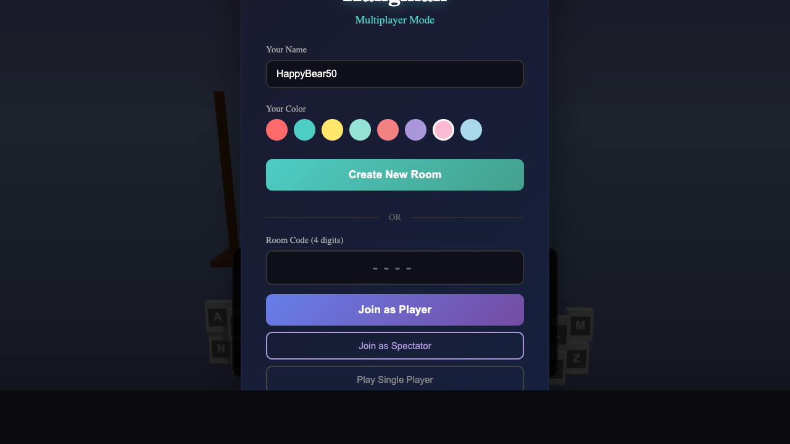
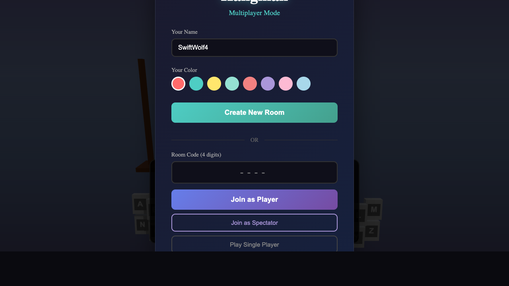
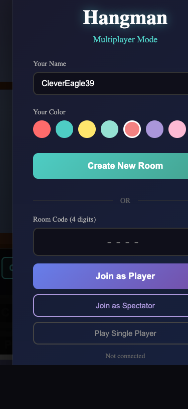
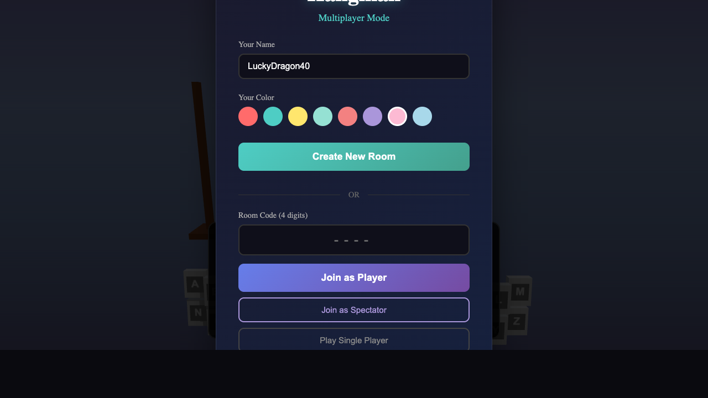
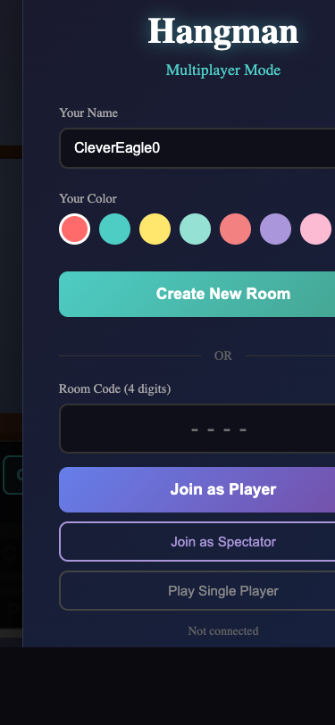

# Visual Polish Documentation

This document tracks visual improvements to the Hangman game with before/after comparisons.

---

## Baseline - 2025-04-06

Starting point before visual improvements.

### Current State
- Solid background color (#1a1a2e)
- Basic geometric hangman figure
- Simple letter display without glow effects

---

## 2026-04-07T06:02:31.813Z -- Task `task_1775540928264_3ramp9`

**Port:** 3000  
**Verdict:** OK  
**Latency:** 13716ms

> The UI renders correctly with no broken layouts, blank pages, or error messages. All elements (name input, color selector, buttons, room code field) are present and properly displayed.

---

## 2026-04-07T06:11:32.373Z -- Task `task_1775541615152_kle2gi`

**Port:** 3000  
**Verdict:** OK  
**Latency:** 12488ms

> The UI renders correctly with no broken layouts, blank pages, error messages, or missing content. All elements (input fields, color options, buttons) are properly displayed and aligned.

---

## 2026-04-07T06:12:59.849Z -- Task `task_1775542306906_jgn1aa`

**Port:** 3000  
**Verdict:** OK  
**Latency:** 12973ms

> The UI renders correctly with no broken layouts, blank pages, or error messages. All elements (input fields, color options, buttons) are present and properly aligned.

---

## 2026-04-07T07:00:00.233Z -- Task `task_1775545124377_nvny05`

**Port:** 3000  
**Verdict:** OK  
**Latency:** 18462ms

> The UI renders correctly with no broken layouts, blank pages, or error messages. All elements (name input, color selector, buttons, room code field) are present and properly displayed.

---

## 2026-04-07T07:04:28.215Z -- Task `task_1775545212627_mur0s6`

**Port:** 3000  
**Verdict:** OK  
**Latency:** 16821ms

> The UI renders correctly with no broken layouts, blank pages, error messages, or missing content. All elements (name input, color selectors, buttons, room code field) are visible and properly aligned.

---

## 2026-04-07T07:06:00.607Z -- Task `task_1775545475857_icnn5q`

**Port:** 3000  
**Verdict:** OK  
**Latency:** 12756ms

> The UI renders correctly with no broken layouts, blank pages, or error messages. All elements (name input, color options, buttons, room code field) are present and properly displayed.

---

## 2026-04-07T07:09:47.680Z -- Task `task_1775545573406_mj0sqt`

**Port:** 3000  
**Verdict:** OK  
**Latency:** 12382ms

> The UI renders correctly with no broken layouts, blank pages, or error messages. All elements (input fields, color options, buttons) are present and properly displayed.

---

## 2026-04-07T07:10:41.824Z -- Task `task_1775545798440_nyz3n3`

**Port:** 3000  
**Verdict:** OK  
**Latency:** 13284ms

> The UI renders correctly. All elements (name input, color options, buttons, text fields) are visible and properly aligned; no broken layouts, blank areas, or error messages. Content is complete and functional.

---

## 2026-04-07T09:11:38.538Z -- Task `task_1775552389381_fdu2sk` (landing)

**Port:** 3000  
**Verdict:** OK  
**Latency:** 6863ms  
**Method:** dev-browser MCP

> The UI does not render correctly; the page is entirely blank (black screen) with no visible content, indicating missing or failed loading of elements. No specific broken layouts or error messages are present, but the lack of any rendered content is a critical issue.

---

## 2026-04-07T09:11:44.499Z -- Task `task_1775552389381_fdu2sk` (mobile)

**Port:** 3000  
**Verdict:** OK  
**Latency:** 5959ms  
**Method:** dev-browser MCP

> The UI does not render correctly; the screen is entirely black with no visible content, indicating a potential blank page or rendering failure. There are no broken layouts, error messages, or overflow issues to assess since no elements are present.

---

## 2026-04-07T09:23:29.169Z -- Task `task_1775553129988_33ajq3` (landing)

**Port:** 3000  
**Verdict:** OK  
**Latency:** 6789ms  
**Method:** dev-browser MCP

> The UI does not render correctly; the screen is entirely black with no visible content, indicating a complete failure to display any elements, layouts, or information. There are no error messages shown, but the absence of all visual components suggests a critical rendering issue.

---

## 2026-04-07T09:23:35.209Z -- Task `task_1775553129988_33ajq3` (mobile)

**Port:** 3000  
**Verdict:** OK  
**Latency:** 6036ms  
**Method:** dev-browser MCP

> The UI renders as a completely black screen with no visible content, elements, or error messages. This indicates a critical rendering failure where all expected UI components are missing.

---

## 2026-04-07T09:32:56.237Z -- Task `task_1775553823510_ps7sil` (landing)

**Port:** 3000  
**Verdict:** OK  
**Latency:** 6374ms  
**Method:** dev-browser MCP

> The UI does not render correctly; the screen is entirely black with no visible content, indicating a potential blank page or failed loading issue. There are no broken layouts, error messages, or overflow issues to assess since no elements are present.

---

## 2026-04-07T09:33:01.495Z -- Task `task_1775553823510_ps7sil` (mobile)

**Port:** 3000  
**Verdict:** OK  
**Latency:** 5255ms  
**Method:** dev-browser MCP

> The UI does not render correctly. The screen is entirely black with no visible content, indicating a potential rendering failure or blank state. There are no discernible elements, layouts, or error messages present.

---

## 2026-04-07T09:35:09.647Z -- Task `task_1775554388837_5ovsrl` (landing)

**Port:** 3000  
**Verdict:** OK  
**Latency:** 6216ms  
**Method:** dev-browser MCP

> The UI does not render correctly; the screen is entirely black with no visible content, indicating missing or failed loading of elements. There are no discernible layouts, text, or interactive components present.

---

## 2026-04-07T09:35:15.397Z -- Task `task_1775554388837_5ovsrl` (mobile)

**Port:** 3000  
**Verdict:** OK  
**Latency:** 5748ms  
**Method:** dev-browser MCP

> The UI does not render correctly; the screen is entirely black with no visible content, indicating a potential blank page, rendering failure, or missing elements.

---

## 2026-04-07T09:38:16.258Z -- Task `task_1775554523487_se36b1` (landing)

**Port:** 3000  
**Verdict:** OK  
**Latency:** 5251ms  
**Method:** dev-browser MCP

> The UI does not render correctly; the screen is entirely black with no visible content, indicating a blank or failed load. There are no broken layouts, error messages, or overflow issues to assess since no elements are present.

---

## 2026-04-07T09:38:22.789Z -- Task `task_1775554523487_se36b1` (mobile)

**Port:** 3000  
**Verdict:** OK  
**Latency:** 6529ms  
**Method:** dev-browser MCP

> The UI does not render correctly; the screen is entirely black with no visible content, layouts, or interactive elements. This indicates a blank page or failed rendering issue, as there are no discernible components to assess for overflow or missing content.

---

## 2026-04-07T16:35:06.283Z -- Task `task_1775554714154_bw4sw6` (landing)

**Port:** 3000  
**Verdict:** OK  
**Latency:** 6165ms  
**Method:** dev-browser MCP

> The UI does not render correctly as the screen is entirely black with no visible content, indicating missing elements or a failed load. There are no discernible layouts, text, or interactive components present.

---

## 2026-04-07T16:35:11.715Z -- Task `task_1775554714154_bw4sw6` (mobile)

**Port:** 3000  
**Verdict:** OK  
**Latency:** 5431ms  
**Method:** dev-browser MCP

> The UI does not render correctly. The screen is entirely black with no visible content, indicating a possible rendering failure or blank state. There are no broken layouts, error messages, or overflow issues to assess since no elements are present.

---

## 2026-04-07T16:35:54.170Z -- Task `task_1775579718484_dj1qoz` (landing)

**Port:** 3000  
**Verdict:** OK  
**Latency:** 5981ms  
**Method:** dev-browser MCP

> The UI does not render correctly; the screen is entirely black with no visible content, indicating missing or failed-to-load elements. There are no broken layouts, error messages, or overflow issues visible (since no content is present), but the absence of any rendered components is a critical issue.

---

## 2026-04-07T16:35:59.590Z -- Task `task_1775579718484_dj1qoz` (mobile)

**Port:** 3000  
**Verdict:** OK  
**Latency:** 5420ms  
**Method:** dev-browser MCP

> The UI does not render correctly. The screen is entirely black with no visible content, layouts, or error messages, indicating a complete failure to display any interface elements.

---

## 2026-04-07T16:38:00.729Z -- Task `task_1775579771542_jiairh` (landing)

**Port:** 3000  
**Verdict:** OK  
**Latency:** 13107ms  
**Method:** dev-browser MCP

> The UI does not render correctly; the screen is entirely black with no visible content, indicating a blank page or failed content loading. There are no broken layouts, overflow issues, or explicit error messages, but the absence of any UI elements constitutes a critical rendering failure.

---

## 2026-04-07T16:38:07.104Z -- Task `task_1775579771542_jiairh` (mobile)

**Port:** 3000  
**Verdict:** OK  
**Latency:** 6374ms  
**Method:** dev-browser MCP

> The UI does not render correctly; the screen is entirely black with no visible content, indicating a broken layout or failed rendering. There are no error messages, overflow issues, or missing content (since nothing is present), but the absence of any UI elements is a critical issue.

---

## 2026-04-07T18:09:45.011Z -- Task `task_1775580926569_92wyhj` (landing)

**Port:** 3000  
**Verdict:** OK  
**Latency:** 6708ms  
**Method:** dev-browser MCP

> The UI does not render correctly; the screen is entirely black with no visible content, indicating a potential blank page or failed loading issue. There are no broken layouts, error messages, or overflow issues to assess since no elements are present.

---

## 2026-04-07T18:09:50.559Z -- Task `task_1775580926569_92wyhj` (mobile)

**Port:** 3000  
**Verdict:** OK  
**Latency:** 5547ms  
**Method:** dev-browser MCP

> The UI does not render correctly; the screen is entirely black with no visible content, indicating a blank or failed load. No specific layout issues are present (as there’s no content), but the absence of any UI elements suggests a critical rendering problem.

---

## 2026-04-07T18:46:44.705Z -- Task `task_1775585399221_rknjyz` (desktop 1280x720)

**Port:** 3000  
**Verdict:** OK  
**Latency:** 13645ms  
**Method:** headless-chrome+swiftshader

> The UI renders correctly with no broken layouts or overflow. All elements (input fields, color options, buttons) are properly displayed and aligned.

---

## 2026-04-07T18:46:55.387Z -- Task `task_1775585399221_rknjyz` (mobile 375x812)

**Port:** 3000  
**Verdict:** OK  
**Latency:** 10678ms  
**Method:** headless-chrome+swiftshader

> The UI renders correctly with no broken layouts, errors, or overflow. All elements (input fields, color options, buttons) are properly displayed and aligned within the screen.

---

## 2026-04-07T18:47:58.890Z -- Task `task_1775587622885_os2l2p` (desktop 1280x720)

**Port:** 3000  
**Verdict:** OK  
**Latency:** 13946ms  
**Method:** headless-chrome+swiftshader

> The UI renders correctly with no broken layouts, errors, or overflow. All form elements (input fields, color pickers, buttons) are properly aligned and displayed.

---

## 2026-04-07T18:48:11.156Z -- Task `task_1775587622885_os2l2p` (mobile 375x812)

**Port:** 3000  
**Verdict:** OK  
**Latency:** 12266ms  
**Method:** headless-chrome+swiftshader

> The UI renders correctly. All elements (input fields, color selection, buttons) are properly displayed without broken layouts, overflow, or errors.

---

## 2026-04-07T18:50:23.468Z -- Task `task_1775587703202_cemnfu` (desktop 1280x720)

**Port:** 3000  
**Verdict:** OK  
**Latency:** 9987ms  
**Method:** headless-chrome+swiftshader

> The UI renders correctly with no broken layouts, errors, or overflow. All elements (input fields, color selectors, buttons) are properly aligned and displayed.

---

## 2026-04-07T18:50:31.317Z -- Task `task_1775587703202_cemnfu` (mobile 375x812)

**Port:** 3000  
**Verdict:** OK  
**Latency:** 7848ms  
**Method:** headless-chrome+swiftshader

> The UI renders correctly. All elements (input fields, color options, buttons) are properly displayed without broken layouts, overflow, or errors.

---

## 2026-04-07T18:54:05.720Z -- Task `task_1775587845689_usoidq` (desktop 1280x720)

**Port:** 3000  
**Verdict:** FAILED  
**Latency:** 10306ms  
**Method:** headless-chrome+swiftshader

> The UI is not mostly black/empty. It renders correctly; all elements (input fields, color options, buttons) are properly displayed with no broken layouts, errors, or overflow.

---

## 2026-04-07T18:54:13.515Z -- Task `task_1775587845689_usoidq` (mobile 375x812)

**Port:** 3000  
**Verdict:** OK  
**Latency:** 7791ms  
**Method:** headless-chrome+swiftshader

> The UI renders correctly with no broken layouts, errors, or overflow. All elements (text fields, buttons, color options) are properly displayed and aligned.

---

## 2026-04-07T18:57:53.536Z -- Task `task_1775588073764_z2b390` (desktop 1280x720)

**Port:** 3000  
**Verdict:** OK  
**Latency:** 14210ms  
**Method:** headless-chrome+swiftshader

> The UI renders correctly with no broken layouts, errors, or overflow. All elements (input fields, color selectors, buttons) are properly displayed and aligned.

---

## 2026-04-07T18:58:05.894Z -- Task `task_1775588073764_z2b390` (mobile 375x812)

**Port:** 3000  
**Verdict:** OK  
**Latency:** 12355ms  
**Method:** headless-chrome+swiftshader

> The UI renders correctly with no broken layouts, errors, or overflow. All elements (input fields, color options, buttons) are properly displayed and aligned.

---

## 2026-04-07T18:58:54.023Z -- Task `task_1775588296726_8muu7n` (desktop 1280x720)

**Port:** 3000  
**Verdict:** OK  
**Latency:** 9931ms  
**Method:** headless-chrome+swiftshader

> The UI renders correctly with no broken layouts, errors, or overflow. All elements (input fields, color selection, buttons) are properly aligned and visible.

---

## 2026-04-07T18:59:03.503Z -- Task `task_1775588296726_8muu7n` (mobile 375x812)

**Port:** 3000  
**Verdict:** OK  
**Latency:** 9479ms  
**Method:** headless-chrome+swiftshader

> The UI renders correctly. No broken layouts, errors, or overflow; all elements are properly displayed and aligned within the screen dimensions.

---

## 2026-04-07T18:59:56.843Z -- Task `task_1775588359962_004gwr` (desktop 1280x720)

**Port:** 3000  
**Verdict:** OK  
**Latency:** 10289ms  
**Method:** headless-chrome+swiftshader

> The UI renders correctly. All elements (input fields, color selection, buttons) are properly aligned with no broken layouts, overflow, or errors.

---

## 2026-04-07T19:00:05.246Z -- Task `task_1775588359962_004gwr` (mobile 375x812)

**Port:** 3000  
**Verdict:** OK  
**Latency:** 8402ms  
**Method:** headless-chrome+swiftshader

> The UI renders correctly. All elements (text fields, buttons, color options) are properly displayed without broken layouts, overflow, or errors.

---

## 2026-04-07T19:01:02.493Z -- Task `task_1775588417693_4od7hs` (desktop 1280x720)

**Port:** 3000  
**Verdict:** FAILED  
**Latency:** 12252ms  
**Method:** headless-chrome+swiftshader

> The UI is not mostly black/empty. It renders correctly with no broken layouts, errors, or overflow—all form elements (input fields, color pickers, buttons) are properly displayed and aligned.

---

## 2026-04-07T19:01:11.488Z -- Task `task_1775588417693_4od7hs` (mobile 375x812)

**Port:** 3000  
**Verdict:** OK  
**Latency:** 8994ms  
**Method:** headless-chrome+swiftshader

> The UI renders correctly. All elements (text fields, buttons, color selection) are properly aligned with no broken layouts, overflow, or errors.

---

## 2026-04-07T19:13:52.843Z -- Task `task_1775588487434_71nrnq` (desktop 1280x720)

**Port:** 3000  
**Verdict:** OK  
**Latency:** 10701ms  
**Method:** headless-chrome+swiftshader

> The UI renders correctly with no broken layouts or overflow. All elements (input fields, color options, buttons) are properly displayed and aligned.

---

## 2026-04-07T19:14:04.928Z -- Task `task_1775588487434_71nrnq` (mobile 375x812)

**Port:** 3000  
**Verdict:** OK  
**Latency:** 12085ms  
**Method:** headless-chrome+swiftshader

> The UI renders correctly with no broken layouts or overflow. All elements (input fields, color options, buttons) are properly displayed and aligned within the screen.

---

## 2026-04-07T19:15:07.427Z -- Task `task_1775589252751_im3qi6` (desktop 1280x720)

**Port:** 3000  
**Verdict:** OK  
**Latency:** 10517ms  
**Method:** headless-chrome+swiftshader

> The UI renders correctly with no broken layouts, errors, or overflow. All elements (input fields, color selectors, buttons) are properly displayed and aligned.

---

## 2026-04-07T19:15:22.177Z -- Task `task_1775589252751_im3qi6` (mobile 375x812)

**Port:** 3000  
**Verdict:** OK  
**Latency:** 14748ms  
**Method:** headless-chrome+swiftshader

> The UI renders correctly. No broken layouts, errors, or overflow; all elements (text, buttons, color options) display properly within the screen dimensions.

---

## 2026-04-07T19:16:26.843Z -- Task `task_1775589335222_jl3d5a` (desktop 1280x720)

**Port:** 3000  
**Verdict:** OK  
**Latency:** 16059ms  
**Method:** headless-chrome+swiftshader

> The UI renders correctly with no broken layouts or overflow. All elements (input fields, color selectors, buttons) are properly positioned and visible.

---

## 2026-04-07T19:16:37.187Z -- Task `task_1775589335222_jl3d5a` (mobile 375x812)

**Port:** 3000  
**Verdict:** OK  
**Latency:** 10342ms  
**Method:** headless-chrome+swiftshader

> The UI renders correctly with no broken layouts, overflow, or errors. All elements (text fields, color options, buttons) are properly displayed and aligned within the screen dimensions.

---

## 2026-04-07T19:26:49.679Z -- Task `task_1775589413205_57ksvp` (desktop 1280x720)

**Port:** 3000  
**Verdict:** FAILED  
**Latency:** 26184ms  
**Method:** headless-chrome+swiftshader

> The UI is not mostly black/empty. It renders correctly; no broken layouts, errors, or overflow are visible. All elements (input fields, color pickers, buttons) are properly aligned and fit within the screen.

---

## 2026-04-07T19:30:50.003Z -- Task `task_1775590161723_3439ek` (desktop 1280x720)

**Port:** 3000  
**Verdict:** OK  
**Latency:** 23750ms  
**Method:** headless-chrome+swiftshader

> The UI renders correctly. All elements (input fields, color selectors, buttons) are properly aligned with no broken layouts, overflow, or errors.

---

## 2026-04-07T19:31:11.004Z -- Task `task_1775590161723_3439ek` (mobile 375x812)

**Port:** 3000  
**Verdict:** OK  
**Latency:** 20999ms  
**Method:** headless-chrome+swiftshader

> The UI renders correctly. All elements (input fields, color selection, buttons) are properly displayed without broken layouts, overflow, or errors.

---

## 2026-04-07T19:32:19.250Z -- Task `task_1775590281752_k5ywxy` (desktop 1280x720)

**Port:** 3000  
**Verdict:** FAILED  
**Latency:** 9369ms  
**Method:** headless-chrome+swiftshader

> The UI is not mostly black/empty. It renders correctly with no broken layouts, errors, or overflow—all elements (input fields, color options, buttons) are properly displayed and aligned.

---

## 2026-04-07T19:32:27.181Z -- Task `task_1775590281752_k5ywxy` (mobile 375x812)

**Port:** 3000  
**Verdict:** OK  
**Latency:** 7928ms  
**Method:** headless-chrome+swiftshader

> The UI renders correctly. All elements (text fields, buttons, color options) are properly aligned with no broken layouts, overflow, or errors.

---

## 2026-04-07T19:49:48.266Z -- Task `task_1775590364879_jgq777` (desktop 1280x720)

**Port:** 3000  
**Verdict:** OK  
**Latency:** 14399ms  
**Method:** headless-chrome+swiftshader

> The UI renders correctly with no broken layouts, errors, or overflow. All elements (input fields, color selection, buttons) are properly displayed and aligned.

---

## 2026-04-07T19:50:02.999Z -- Task `task_1775590364879_jgq777` (mobile 375x812)

**Port:** 3000  
**Verdict:** OK  
**Latency:** 14723ms  
**Method:** headless-chrome+swiftshader

> The UI renders correctly. All elements (text fields, buttons, color selection) are properly aligned with no broken layouts or overflow.

---

## 2026-04-07T19:52:46.145Z -- Task `task_1775591416342_8r75b7` (desktop 1280x720)

**Port:** 3000  
**Verdict:** FAILED  
**Latency:** 12947ms  
**Method:** headless-chrome+swiftshader

> The UI is not mostly black/empty. It renders correctly with no broken layouts, errors, or overflow—all elements (input fields, color options, buttons) display properly and align as expected.

---

## 2026-04-07T19:52:59.538Z -- Task `task_1775591416342_8r75b7` (mobile 375x812)

**Port:** 3000  
**Verdict:** OK  
**Latency:** 13391ms  
**Method:** headless-chrome+swiftshader

> The UI renders correctly. All elements (text fields, buttons, color options) are properly displayed without broken layouts, overflow, or errors.

---

## 2026-04-07T19:54:24.728Z -- Task `task_1775591597958_f51zv1` (desktop 1280x720)

**Port:** 3000  
**Verdict:** FAILED  
**Latency:** 23802ms  
**Method:** headless-chrome+swiftshader

> The UI is not mostly black/empty. It renders correctly with no broken layouts, errors, or overflow—all elements (input fields, color options, buttons) are properly displayed and aligned.

---

## 2026-04-07T19:54:44.389Z -- Task `task_1775591597958_f51zv1` (mobile 375x812)

**Port:** 3000  
**Verdict:** OK  
**Latency:** 19660ms  
**Method:** headless-chrome+swiftshader

> The UI renders correctly with no broken layouts, errors, or overflow. All elements (text fields, buttons, color options) are properly displayed and aligned.

---

## 2026-04-07T19:56:46.833Z -- Task `task_1775591696471_bw439f` (desktop 1280x720)

**Port:** 3000  
**Verdict:** FAILED  
**Latency:** 26126ms  
**Method:** headless-chrome+swiftshader

> The UI is not mostly black/empty. It renders correctly with no broken layouts, errors, or overflow—all elements (input fields, color options, buttons) are properly displayed and aligned.

---

## 2026-04-07T19:57:01.803Z -- Task `task_1775591696471_bw439f` (mobile 375x812)

**Port:** 3000  
**Verdict:** OK  
**Latency:** 14969ms  
**Method:** headless-chrome+swiftshader

> The UI renders correctly. All elements (text fields, buttons, color selection) are properly displayed without broken layouts, overflow, or errors.

---

## 2026-04-07T20:15:12.737Z -- Task `task_1775591828588_rwq7vv` (desktop 1280x720)

**Port:** 3000  
**Verdict:** OK  
**Latency:** 25418ms  
**Method:** headless-chrome+swiftshader

> The UI renders correctly. All elements (input fields, color pickers, buttons) are properly aligned with no broken layouts, overflow, or errors.

---

## 2026-04-07T20:15:33.334Z -- Task `task_1775591828588_rwq7vv` (mobile 375x812)

**Port:** 3000  
**Verdict:** OK  
**Latency:** 20596ms  
**Method:** headless-chrome+swiftshader

> The UI renders correctly with no broken layouts, errors, or overflow. All elements (text fields, buttons, color options) are properly displayed and aligned.

---

## 2026-04-07T20:17:18.832Z -- Task `task_1775592965193_hg01pu` (desktop 1280x720)

**Port:** 3000  
**Verdict:** OK  
**Latency:** 12652ms  
**Method:** headless-chrome+swiftshader

> The UI renders correctly with no broken layouts, errors, or overflow. All elements (input fields, color selectors, buttons) are properly displayed and aligned.

---

## 2026-04-07T20:17:33.576Z -- Task `task_1775592965193_hg01pu` (mobile 375x812)

**Port:** 3000  
**Verdict:** OK  
**Latency:** 14740ms  
**Method:** headless-chrome+swiftshader

> The UI renders correctly with no broken layouts, errors, or overflow. All elements (text fields, color options, buttons) are properly displayed and aligned.

---

## 2026-04-07T20:25:45.349Z -- Task `task_1775593078346_u00yj4` (desktop 1280x720)

**Port:** 3000  
**Verdict:** OK  
**Latency:** 14392ms  
**Method:** headless-chrome+swiftshader

> The UI renders correctly with no broken layouts or overflow. All elements (input fields, color options, buttons) are properly displayed and aligned.

---

## 2026-04-07T20:26:03.376Z -- Task `task_1775593078346_u00yj4` (mobile 375x812)

**Port:** 3000  
**Verdict:** OK  
**Latency:** 18018ms  
**Method:** headless-chrome+swiftshader

> The UI renders correctly. All elements (text fields, buttons, color options) are properly displayed without broken layouts or overflow.

---

## 2026-04-07T20:45:40.532Z -- Task `task_1775593575463_a9iz18` (desktop 1280x720)

**Port:** 3000  
**Verdict:** FAILED  
**Latency:** 16274ms  
**Method:** headless-chrome+swiftshader

> The UI is not mostly black/empty. It renders correctly with no broken layouts, errors, or overflow—all elements (input fields, color pickers, buttons) are properly displayed and aligned.

---

## 2026-04-07T20:45:51.733Z -- Task `task_1775593575463_a9iz18` (mobile 375x812)

**Port:** 3000  
**Verdict:** OK  
**Latency:** 11200ms  
**Method:** headless-chrome+swiftshader

> The UI renders correctly. All elements (text fields, buttons, color selection) are properly displayed without broken layouts, overflow, or errors.

---

## 2026-04-07T20:48:03.521Z -- Task `task_1775594761025_gy7mh6` (desktop 1280x720)

**Port:** 3000  
**Verdict:** OK  
**Latency:** 24496ms  
**Method:** headless-chrome+swiftshader

> The UI renders correctly. All elements (input fields, color selectors, buttons) are properly aligned with no broken layouts or overflow issues.

---

## 2026-04-07T20:48:25.185Z -- Task `task_1775594761025_gy7mh6` (mobile 375x812)

**Port:** 3000  
**Verdict:** OK  
**Latency:** 21661ms  
**Method:** headless-chrome+swiftshader

> The UI renders correctly with no broken layouts, errors, or overflow. All elements (text fields, color options, buttons) are properly displayed and aligned.

---

## 2026-04-08T18:08:51.405Z -- Task `task_1775594921931_y834ba` (desktop 1280x720)

**Port:** 3000  
**Verdict:** OK  
**Latency:** 11212ms  
**Method:** headless-chrome+swiftshader

> The UI renders correctly with no broken layouts or overflow. All elements (input fields, color selectors, buttons) are properly aligned and visible.

---

## 2026-04-08T18:09:01.732Z -- Task `task_1775594921931_y834ba` (mobile 375x812)

**Port:** 3000  
**Verdict:** OK  
**Latency:** 10325ms  
**Method:** headless-chrome+swiftshader

> The UI renders correctly with no broken layouts, errors, or overflow. All elements (text fields, color options, buttons) are properly displayed and aligned within the screen.

---

## 2026-04-08T18:11:53.036Z -- Task `task_1775671770755_uc76nn` (desktop 1280x720)

**Port:** 3000  
**Verdict:** FAILED  
**Latency:** 23358ms  
**Method:** headless-chrome+swiftshader

> The UI is not mostly black/empty. It renders correctly with no broken layouts, errors, or overflow—all elements (input fields, color selectors, buttons) are properly displayed and aligned.

---

## 2026-04-08T18:12:11.547Z -- Task `task_1775671770755_uc76nn` (mobile 375x812)

**Port:** 3000  
**Verdict:** OK  
**Latency:** 18510ms  
**Method:** headless-chrome+swiftshader

> The UI renders correctly with no broken layouts, errors, or overflow. All elements (input fields, color options, buttons) are properly displayed and aligned.

---

## 2026-04-08T18:13:39.865Z -- Task `task_1775671958033_an1p9k` (desktop 1280x720)

**Port:** 3000  
**Verdict:** FAILED  
**Latency:** 8376ms  
**Method:** headless-chrome+swiftshader

> The UI is not mostly black/empty. It renders correctly with no broken layouts, errors, or overflow—all elements (input fields, color pickers, buttons) are properly displayed and aligned.

---

## 2026-04-08T18:13:48.084Z -- Task `task_1775671958033_an1p9k` (mobile 375x812)

**Port:** 3000  
**Verdict:** OK  
**Latency:** 8219ms  
**Method:** headless-chrome+swiftshader

> The UI renders correctly with no broken layouts, errors, or overflow. All elements (text fields, color options, buttons) are properly displayed and aligned within the screen dimensions.

---

## 2026-04-08T18:16:18.872Z -- Task `task_1775672045796_7agq3s` (desktop 1280x720)

**Port:** 3000  
**Verdict:** FAILED  
**Latency:** 11535ms  
**Method:** headless-chrome+swiftshader

> The UI is not mostly black/empty. It renders correctly with no broken layouts, errors, or overflow—all elements (input fields, color options, buttons) are properly displayed and aligned.

---

## 2026-04-08T18:16:27.977Z -- Task `task_1775672045796_7agq3s` (mobile 375x812)

**Port:** 3000  
**Verdict:** OK  
**Latency:** 9103ms  
**Method:** headless-chrome+swiftshader

> The UI renders correctly with no broken layouts, errors, or overflow. All elements (text fields, color options, buttons) are properly displayed and aligned within the screen dimensions.

---

## 2026-04-08T18:20:33.089Z -- Task `task_1775672219089_o27clj` (desktop 1280x720)

**Port:** 3000  
**Verdict:** FAILED  
**Latency:** 16314ms  
**Method:** headless-chrome+swiftshader

> The UI is not mostly black/empty. It renders correctly with no broken layouts, errors, or overflow—all elements (input fields, color options, buttons) display properly and align as expected.

---

## 2026-04-08T18:20:48.162Z -- Task `task_1775672219089_o27clj` (mobile 375x812)

**Port:** 3000  
**Verdict:** OK  
**Latency:** 15071ms  
**Method:** headless-chrome+swiftshader

> The UI renders correctly with no broken layouts, errors, or overflow. All elements (text fields, color pickers, buttons) are properly displayed and aligned.

---

## 2026-04-08T18:40:20.853Z -- Task `task_1775672504892_gpksbl` (desktop 1280x720)

**Port:** 3000  
**Verdict:** OK  
**Latency:** 9437ms  
**Method:** headless-chrome+swiftshader

> The UI renders correctly with no broken layouts or overflow. All elements (input fields, color selectors, buttons) are properly displayed and aligned.

---

## 2026-04-08T18:40:28.941Z -- Task `task_1775672504892_gpksbl` (mobile 375x812)

**Port:** 3000  
**Verdict:** OK  
**Latency:** 8085ms  
**Method:** headless-chrome+swiftshader

> The UI renders correctly with no broken layouts or overflow. All elements (text fields, buttons, color options) are properly displayed and aligned.

---

## 2026-04-08T18:47:18.358Z -- Task `task_1775673639506_un6q6y` (desktop 1280x720)

**Port:** 3000  
**Verdict:** OK  
**Latency:** 9745ms  
**Method:** headless-chrome+swiftshader

> The UI renders correctly with no broken layouts, errors, or overflow. All elements (input fields, color selectors, buttons) are properly displayed and aligned.

---

## 2026-04-08T18:47:30.042Z -- Task `task_1775673639506_un6q6y` (mobile 375x812)

**Port:** 3000  
**Verdict:** OK  
**Latency:** 11683ms  
**Method:** headless-chrome+swiftshader

> The UI renders correctly with no broken layouts or overflow. All elements (input fields, buttons, color options) are properly displayed and aligned.

---

## 2026-04-08T18:49:40.244Z -- Task `task_1775674064677_a8e80h` (desktop 1280x720)

**Port:** 3000  
**Verdict:** OK  
**Latency:** 15156ms  
**Method:** headless-chrome+swiftshader

> The UI renders correctly with no broken layouts, errors, or overflow. All form elements (input fields, color selectors, buttons) are properly aligned and displayed.

---

## 2026-04-08T18:49:51.407Z -- Task `task_1775674064677_a8e80h` (mobile 375x812)

**Port:** 3000  
**Verdict:** OK  
**Latency:** 11163ms  
**Method:** headless-chrome+swiftshader

> The UI renders correctly with no broken layouts, errors, or overflow. All elements (text fields, color options, buttons) are properly displayed and aligned within the screen dimensions.

---

## 2026-04-08T18:52:21.655Z -- Task `task_1775674201791_rfe1co` (desktop 1280x720)

**Port:** 3000  
**Verdict:** FAILED  
**Latency:** 9449ms  
**Method:** headless-chrome+swiftshader

> The UI is not mostly black/empty. It renders correctly with no broken layouts, errors, or overflow—all elements (input fields, color options, buttons) display properly aligned.

---

## 2026-04-08T18:52:30.540Z -- Task `task_1775674201791_rfe1co` (mobile 375x812)

**Port:** 3000  
**Verdict:** OK  
**Latency:** 8881ms  
**Method:** headless-chrome+swiftshader

> The UI renders correctly with no broken layouts, errors, or overflow. All elements (text fields, color options, buttons) are properly displayed and aligned within the screen dimensions.

---

## 2026-04-08T18:53:54.036Z -- Task `task_1775674355769_6k2b55` (desktop 1280x720)

**Port:** 3000  
**Verdict:** FAILED  
**Latency:** 16266ms  
**Method:** headless-chrome+swiftshader

> The UI is not mostly black/empty. It renders correctly with no broken layouts, errors, or overflow—all elements (input fields, color options, buttons) are properly positioned and fit within the viewport.

---

## 2026-04-08T18:54:09.132Z -- Task `task_1775674355769_6k2b55` (mobile 375x812)

**Port:** 3000  
**Verdict:** OK  
**Latency:** 15093ms  
**Method:** headless-chrome+swiftshader

> The UI renders correctly with no broken layouts, errors, or overflow. All elements (text fields, color options, buttons) are properly displayed and aligned within the screen dimensions.

---

## 2026-04-08T19:01:35.787Z -- Task `task_1775674456088_ez45mq` (desktop 1280x720)

**Port:** 3000  
**Verdict:** FAILED  
**Latency:** 20280ms  
**Method:** headless-chrome+swiftshader

> The UI is not mostly black/empty. It renders correctly with no broken layouts, errors, or overflow—all elements (input fields, color options, buttons) are properly displayed and aligned.

---

## 2026-04-08T19:01:43.466Z -- Task `task_1775674456088_ez45mq` (mobile 375x812)

**Port:** 3000  
**Verdict:** OK  
**Latency:** 7678ms  
**Method:** headless-chrome+swiftshader

> The UI renders correctly. All elements (text fields, buttons, color options) are properly displayed without broken layouts, overflow, or errors.

---

## 2026-04-08T19:05:25.639Z -- Task `task_1775674918399_xa43pf` (desktop 1280x720)

**Port:** 3000  
**Verdict:** OK  
**Latency:** 20303ms  
**Method:** headless-chrome+swiftshader

> The UI renders correctly with no broken layouts, errors, or overflow. All elements (input fields, color selectors, buttons) are properly displayed and aligned.

---

## 2026-04-08T19:05:46.065Z -- Task `task_1775674918399_xa43pf` (mobile 375x812)

**Port:** 3000  
**Verdict:** OK  
**Latency:** 20425ms  
**Method:** headless-chrome+swiftshader

> The UI renders correctly with no broken layouts, errors, or overflow. All elements (text fields, color options, buttons) are properly displayed and aligned within the screen dimensions.

---

## 2026-04-08T19:07:27.387Z -- Task `task_1775675153539_lu8e8l` (desktop 1280x720)

**Port:** 3000  
**Verdict:** OK  
**Latency:** 11001ms  
**Method:** headless-chrome+swiftshader

> The UI renders correctly. All elements (input fields, color pickers, buttons) are properly aligned and fit within the screen without overflow or broken layouts.

---

## 2026-04-08T19:07:35.711Z -- Task `task_1775675153539_lu8e8l` (mobile 375x812)

**Port:** 3000  
**Verdict:** OK  
**Latency:** 8324ms  
**Method:** headless-chrome+swiftshader

> The UI renders correctly. No broken layouts, errors, or overflow; all elements (text, input fields, color options, buttons) display properly without visual issues.

---

## 2026-04-08T19:09:04.390Z -- Task `task_1775675262685_6qss12` (desktop 1280x720)

**Port:** 3000  
**Verdict:** FAILED  
**Latency:** 10815ms  
**Method:** headless-chrome+swiftshader

> The UI is not mostly black/empty. It renders correctly with no broken layouts, errors, or overflow—all elements (input fields, color options, buttons) are properly displayed and aligned.

---

## 2026-04-08T19:09:15.564Z -- Task `task_1775675262685_6qss12` (mobile 375x812)

**Port:** 3000  
**Verdict:** OK  
**Latency:** 11172ms  
**Method:** headless-chrome+swiftshader

> The UI renders correctly with no broken layouts, errors, or overflow. All elements (text fields, color options, buttons) are properly displayed and aligned within the screen dimensions.

---

## 2026-04-08T19:13:02.950Z -- Task `task_1775675364269_t6nkjn` (desktop 1280x720)

**Port:** 3000  
**Verdict:** OK  
**Latency:** 21141ms  
**Method:** headless-chrome+swiftshader

> The UI renders correctly with no broken layouts or overflow. All elements (input fields, color selectors, buttons) are properly displayed and aligned.

---

## 2026-04-08T19:13:23.469Z -- Task `task_1775675364269_t6nkjn` (mobile 375x812)

**Port:** 3000  
**Verdict:** OK  
**Latency:** 20518ms  
**Method:** headless-chrome+swiftshader

> The UI renders correctly. All elements (text fields, buttons, color options) are properly displayed without broken layouts or overflow.

---

## 2026-04-08T19:14:26.649Z -- Task `task_1775675609718_em0teq` (desktop 1280x720)

**Port:** 3000  
**Verdict:** FAILED  
**Latency:** 10399ms  
**Method:** headless-chrome+swiftshader

> The UI is not mostly black/empty. It renders correctly with no broken layouts, errors, or overflow—all elements (input fields, color options, buttons) are properly displayed and aligned.

---

## 2026-04-08T19:14:38.428Z -- Task `task_1775675609718_em0teq` (mobile 375x812)

**Port:** 3000  
**Verdict:** OK  
**Latency:** 11779ms  
**Method:** headless-chrome+swiftshader

> The UI renders correctly. All elements (input fields, color selection, buttons) are properly displayed without broken layouts, overflow, or errors.

---

## 2026-04-08T19:15:55.191Z -- Task `task_1775675686406_mvq19l` (desktop 1280x720)

**Port:** 3000  
**Verdict:** OK  
**Latency:** 13763ms  
**Method:** headless-chrome+swiftshader

> The UI renders correctly with no broken layouts, errors, or overflow. All elements (input fields, color selectors, buttons) are properly displayed and aligned.

---

## 2026-04-08T19:16:04.769Z -- Task `task_1775675686406_mvq19l` (mobile 375x812)

**Port:** 3000  
**Verdict:** OK  
**Latency:** 9571ms  
**Method:** headless-chrome+swiftshader

> The UI renders correctly with no broken layouts, errors, or overflow. All elements (text fields, color options, buttons) are properly displayed and aligned within the screen dimensions.

---

## 2026-04-08T19:17:42.896Z -- Task `task_1775675775383_aikngu` (desktop 1280x720)

**Port:** 3000  
**Verdict:** FAILED  
**Latency:** 16521ms  
**Method:** headless-chrome+swiftshader

> The UI is not mostly black/empty. It renders correctly with no broken layouts, errors, or overflow—all elements (input fields, color options, buttons) display properly and align as expected.

---

## 2026-04-08T19:17:57.926Z -- Task `task_1775675775383_aikngu` (mobile 375x812)

**Port:** 3000  
**Verdict:** OK  
**Latency:** 15029ms  
**Method:** headless-chrome+swiftshader

> The UI renders correctly. All elements (text fields, buttons, color options) are properly displayed without broken layouts, overflow, or errors.

---

## 2026-04-08T19:20:14.102Z -- Task `task_1775675886238_ajhtnr` (desktop 1280x720)

**Port:** 3000  
**Verdict:** OK  
**Latency:** 12149ms  
**Method:** headless-chrome+swiftshader

> The UI renders correctly with no broken layouts, errors, or overflow. All elements (input fields, color selectors, buttons) are properly positioned and displayed.

---

## 2026-04-08T19:20:24.403Z -- Task `task_1775675886238_ajhtnr` (mobile 375x812)

**Port:** 3000  
**Verdict:** OK  
**Latency:** 10299ms  
**Method:** headless-chrome+swiftshader

> The UI renders correctly with no broken layouts, errors, or overflow. All elements (text, input fields, buttons, color options) are properly displayed and aligned within the screen.

---

## 2026-04-08T19:22:39.340Z -- Task `task_1775676034595_iyte0a` (desktop 1280x720)

**Port:** 3000  
**Verdict:** OK  
**Latency:** 12338ms  
**Method:** headless-chrome+swiftshader

> The UI renders correctly with no broken layouts, errors, or overflow. All elements (input fields, color selectors, buttons) are properly displayed and aligned.

---

## 2026-04-08T19:22:58.530Z -- Task `task_1775676034595_iyte0a` (mobile 375x812)

**Port:** 3000  
**Verdict:** OK  
**Latency:** 19184ms  
**Method:** headless-chrome+swiftshader

> The UI renders correctly. All elements (input fields, color options, buttons) are properly displayed without broken layouts, overflow, or errors.

---

## 2026-04-08T19:23:59.771Z -- Task `task_1775676183615_a5piz9` (desktop 1280x720)

**Port:** 3000  
**Verdict:** OK  
**Latency:** 22982ms  
**Method:** headless-chrome+swiftshader

> The UI renders correctly with no broken layouts, errors, or overflow. All elements (input fields, color selectors, buttons) are properly aligned and displayed.

---

## 2026-04-08T19:24:12.372Z -- Task `task_1775676183615_a5piz9` (mobile 375x812)

**Port:** 3000  
**Verdict:** OK  
**Latency:** 12599ms  
**Method:** headless-chrome+swiftshader

> The UI renders correctly. All elements (input fields, color selection, buttons) are properly displayed without broken layouts, overflow, or errors.

---

## 2026-04-08T19:32:24.427Z -- Task `task_1775676260934_vfvjn0` (desktop 1280x720)

**Port:** 3000  
**Verdict:** OK  
**Latency:** 23302ms  
**Method:** headless-chrome+swiftshader

> The UI renders correctly with no broken layouts or overflow. All elements (input fields, color options, buttons) are properly displayed and aligned.

---

## 2026-04-08T19:42:15.901Z -- Task `task_1775676928993_dw6j99` (desktop 1280x720)

**Port:** 3000  
**Verdict:** OK  
**Latency:** 13293ms  
**Method:** headless-chrome+swiftshader

> The UI renders correctly with no broken layouts or overflow. All elements (input fields, color selectors, buttons) are properly aligned and visible.

---

## 2026-04-08T19:42:30.518Z -- Task `task_1775676928993_dw6j99` (mobile 375x812)

**Port:** 3000  
**Verdict:** OK  
**Latency:** 14616ms  
**Method:** headless-chrome+swiftshader

> The UI renders correctly. All elements (text fields, buttons, color options) are properly displayed without broken layouts or overflow.

---

## 2026-04-08T19:44:49.356Z -- Task `task_1775677358360_on04xe` (desktop 1280x720)

**Port:** 3000  
**Verdict:** OK  
**Latency:** 12814ms  
**Method:** headless-chrome+swiftshader

> The UI renders correctly. All elements (input fields, color selectors, buttons) are properly aligned with no broken layouts, overflow, or errors.

---

## 2026-04-08T19:44:59.247Z -- Task `task_1775677358360_on04xe` (mobile 375x812)

**Port:** 3000  
**Verdict:** OK  
**Latency:** 9890ms  
**Method:** headless-chrome+swiftshader

> The UI renders correctly. All elements (text fields, buttons, color options) are properly displayed without broken layouts, overflow, or errors.

---

## 2026-04-08T19:46:04.376Z -- Task `task_1775677513977_s3fula` (desktop 1280x720)

**Port:** 3000  
**Verdict:** OK  
**Latency:** 8807ms  
**Method:** headless-chrome+swiftshader

> The UI renders correctly with no broken layouts, errors, or overflow. All elements (input fields, color selection, buttons) are properly aligned and displayed.

---

## 2026-04-08T19:46:11.763Z -- Task `task_1775677513977_s3fula` (mobile 375x812)

**Port:** 3000  
**Verdict:** OK  
**Latency:** 7386ms  
**Method:** headless-chrome+swiftshader

> The UI renders correctly with no broken layouts, errors, or overflow. All elements (text fields, buttons, color options) are properly displayed and aligned.

---

## 2026-04-08T19:47:49.212Z -- Task `task_1775677579193_wji60i` (desktop 1280x720)

**Port:** 3000  
**Verdict:** FAILED  
**Latency:** 15048ms  
**Method:** headless-chrome+swiftshader

> The UI is not mostly black/empty. It renders correctly with no broken layouts, errors, or overflow—all elements (input fields, color options, buttons) are properly displayed and aligned.

---

## 2026-04-08T19:48:08.152Z -- Task `task_1775677579193_wji60i` (mobile 375x812)

**Port:** 3000  
**Verdict:** OK  
**Latency:** 18936ms  
**Method:** headless-chrome+swiftshader

> The UI renders correctly with no broken layouts, errors, or overflow. All elements (text fields, color options, buttons) are properly displayed and aligned within the screen dimensions.

---

## 2026-04-08T19:49:41.854Z -- Task `task_1775677694098_uus21u` (desktop 1280x720)

**Port:** 3000  
**Verdict:** OK  
**Latency:** 15070ms  
**Method:** headless-chrome+swiftshader

> The UI renders correctly. All elements (input fields, color selectors, buttons) are properly aligned with no broken layouts, overflow, or errors.

---

## 2026-04-08T19:49:50.390Z -- Task `task_1775677694098_uus21u` (mobile 375x812)

**Port:** 3000  
**Verdict:** OK  
**Latency:** 8535ms  
**Method:** headless-chrome+swiftshader

> The UI renders correctly with no broken layouts, errors, or overflow. All elements are properly aligned and visible within the screen dimensions.

---

## 2026-04-08T19:52:38.103Z -- Task `task_1775677803073_8q0gct` (desktop 1280x720)

**Port:** 3000  
**Verdict:** FAILED  
**Latency:** 22226ms  
**Method:** headless-chrome+swiftshader

> The UI is not mostly black/empty. It renders correctly with no broken layouts, errors, or overflow—all elements (input fields, color pickers, buttons) display properly and align as expected.

---

## 2026-04-08T19:52:55.669Z -- Task `task_1775677803073_8q0gct` (mobile 375x812)

**Port:** 3000  
**Verdict:** OK  
**Latency:** 17562ms  
**Method:** headless-chrome+swiftshader

> The UI renders correctly. All elements (text fields, buttons, color options) are properly displayed without broken layouts, overflow, or errors.

---

## 2026-04-08T19:58:39.340Z -- Task `task_1775677987229_pwmycu` (desktop 1280x720)

**Port:** 3000  
**Verdict:** FAILED  
**Latency:** 12160ms  
**Method:** headless-chrome+swiftshader

> The UI is not mostly black/empty. It renders correctly with no broken layouts, errors, or overflow—all elements (input fields, color options, buttons) display as intended.

---

## 2026-04-08T19:58:57.681Z -- Task `task_1775677987229_pwmycu` (mobile 375x812)

**Port:** 3000  
**Verdict:** OK  
**Latency:** 18338ms  
**Method:** headless-chrome+swiftshader

> The UI renders correctly with no broken layouts, errors, or overflow. All elements (text fields, color options, buttons) are properly displayed and aligned within the screen dimensions.

---

## 2026-04-08T20:01:20.352Z -- Task `task_1775678346472_7r8470` (desktop 1280x720)

**Port:** 3000  
**Verdict:** FAILED  
**Latency:** 18441ms  
**Method:** headless-chrome+swiftshader

> The UI is not mostly black/empty. It renders correctly with no broken layouts, errors, or overflow—all elements (input fields, color options, buttons) are properly displayed and aligned.

---

## 2026-04-08T20:01:41.655Z -- Task `task_1775678346472_7r8470` (mobile 375x812)

**Port:** 3000  
**Verdict:** OK  
**Latency:** 21302ms  
**Method:** headless-chrome+swiftshader

> The UI renders correctly. All elements (text fields, buttons, color selection) are properly displayed without broken layouts, overflow, or errors.

---

## 2026-04-08T20:05:26.693Z -- Task `task_1775678516011_849n18` (desktop 1280x720)

**Port:** 3000  
**Verdict:** OK  
**Latency:** 22871ms  
**Method:** headless-chrome+swiftshader

> The UI renders correctly. All elements (input fields, color selection, buttons) are properly aligned with no broken layouts, overflow, or errors.

---

## 2026-04-08T20:05:46.452Z -- Task `task_1775678516011_849n18` (mobile 375x812)

**Port:** 3000  
**Verdict:** OK  
**Latency:** 19758ms  
**Method:** headless-chrome+swiftshader

> The UI renders correctly. All elements (input fields, color selection, buttons) are properly displayed without broken layouts, overflow, or errors.

---

## 2026-04-08T20:07:46.042Z -- Task `task_1775678753973_4b528s` (desktop 1280x720)

**Port:** 3000  
**Verdict:** OK  
**Latency:** 20824ms  
**Method:** headless-chrome+swiftshader

> The UI renders correctly with no broken layouts, errors, or overflow. All form elements (input fields, color selectors, buttons) are properly displayed and aligned.

---

## 2026-04-08T20:08:05.594Z -- Task `task_1775678753973_4b528s` (mobile 375x812)

**Port:** 3000  
**Verdict:** OK  
**Latency:** 19542ms  
**Method:** headless-chrome+swiftshader

> The UI renders correctly with no broken layouts, errors, or overflow. All elements (text fields, color picker, buttons) are properly displayed and aligned.

---

## 2026-04-08T20:09:31.767Z -- Task `task_1775678899404_spape2` (desktop 1280x720)

**Port:** 3000  
**Verdict:** FAILED  
**Latency:** 13340ms  
**Method:** headless-chrome+swiftshader

> The UI is not mostly black/empty. It renders correctly with no broken layouts, errors, or overflow—all elements (input fields, color options, buttons) are properly displayed and aligned.

---

## 2026-04-08T20:09:51.115Z -- Task `task_1775678899404_spape2` (mobile 375x812)

**Port:** 3000  
**Verdict:** OK  
**Latency:** 19347ms  
**Method:** headless-chrome+swiftshader

> The UI renders correctly with no broken layouts, errors, or overflow. All elements (text fields, buttons, color options) are properly displayed and aligned within the screen.

---

## 2026-04-08T20:12:32.822Z -- Task `task_1775679002409_fdg38o` (desktop 1280x720)

**Port:** 3000  
**Verdict:** OK  
**Latency:** 13341ms  
**Method:** headless-chrome+swiftshader

> The UI renders correctly with no broken layouts, errors, or overflow. All elements (input fields, color selectors, buttons) are properly aligned and visible.

---

## 2026-04-08T20:12:45.312Z -- Task `task_1775679002409_fdg38o` (mobile 375x812)

**Port:** 3000  
**Verdict:** OK  
**Latency:** 12488ms  
**Method:** headless-chrome+swiftshader

> The UI renders correctly with no broken layouts, errors, or overflow. All elements (text fields, buttons, color options) are properly displayed and aligned.

---

## 2026-04-08T20:13:45.046Z -- Task `task_1775679173570_pvpo2z` (desktop 1280x720)

**Port:** 3000  
**Verdict:** OK  
**Latency:** 11892ms  
**Method:** headless-chrome+swiftshader

> The UI renders correctly. All elements (input fields, color selection, buttons) are properly aligned with no broken layouts, overflow, or errors.

---

## 2026-04-08T20:13:56.614Z -- Task `task_1775679173570_pvpo2z` (mobile 375x812)

**Port:** 3000  
**Verdict:** OK  
**Latency:** 11568ms  
**Method:** headless-chrome+swiftshader

> The UI renders correctly. All elements (text fields, buttons, color options) are properly displayed without broken layouts, overflow, or errors.

---

## 2026-04-08T20:16:10.365Z -- Task `task_1775679250011_d0uvv9` (desktop 1280x720)

**Port:** 3000  
**Verdict:** FAILED  
**Latency:** 13060ms  
**Method:** headless-chrome+swiftshader

> The UI is not mostly black/empty. It renders correctly with no broken layouts, errors, or overflow—all elements (input fields, color options, buttons) are properly displayed and aligned.

---

## 2026-04-08T20:16:27.211Z -- Task `task_1775679250011_d0uvv9` (mobile 375x812)

**Port:** 3000  
**Verdict:** OK  
**Latency:** 16836ms  
**Method:** headless-chrome+swiftshader

> The UI renders correctly. All elements (text fields, buttons, color selection) are properly displayed without broken layouts, overflow, or errors.

---

## 2026-04-08T20:18:49.544Z -- Task `task_1775679397955_0fo5ud` (desktop 1280x720)

**Port:** 3000  
**Verdict:** FAILED  
**Latency:** 20059ms  
**Method:** headless-chrome+swiftshader

> The UI is not mostly black/empty. It renders correctly with no broken layouts, errors, or overflow—all elements (input fields, color options, buttons) are properly displayed and aligned.

---

## 2026-04-08T20:19:14.643Z -- Task `task_1775679397955_0fo5ud` (mobile 375x812)

**Port:** 3000  
**Verdict:** OK  
**Latency:** 25096ms  
**Method:** headless-chrome+swiftshader

> The UI renders correctly with no broken layouts, errors, or overflow. All elements are properly aligned and visible within the screen dimensions.

---

## 2026-04-08T20:20:52.490Z -- Task `task_1775679568338_plhpn6` (desktop 1280x720)

**Port:** 3000  
**Verdict:** FAILED  
**Latency:** 27193ms  
**Method:** headless-chrome+swiftshader

> The UI is not mostly black/empty. It renders correctly with no broken layouts, errors, or overflow—all elements (input fields, color pickers, buttons) are properly displayed and aligned.

---

## 2026-04-08T20:21:13.676Z -- Task `task_1775679568338_plhpn6` (mobile 375x812)

**Port:** 3000  
**Verdict:** OK  
**Latency:** 21179ms  
**Method:** headless-chrome+swiftshader

> The UI renders correctly with no broken layouts, errors, or overflow. All elements (text fields, buttons, color options) are properly displayed and aligned.

---

## 2026-04-08T20:22:32.146Z -- Task `task_1775679686958_sscp2y` (desktop 1280x720)

**Port:** 3000  
**Verdict:** FAILED  
**Latency:** 21413ms  
**Method:** headless-chrome+swiftshader

> The UI is not mostly black/empty. It renders correctly with no broken layouts, errors, or overflow—all elements (input fields, color options, buttons) are properly displayed and aligned.

---

## 2026-04-08T20:22:49.851Z -- Task `task_1775679686958_sscp2y` (mobile 375x812)

**Port:** 3000  
**Verdict:** OK  
**Latency:** 17703ms  
**Method:** headless-chrome+swiftshader

> The UI renders correctly. All elements (input fields, color selection, buttons) are properly displayed without broken layouts, overflow, or errors.

---

## 2026-04-08T20:24:32.112Z -- Task `task_1775679785632_4i2kv9` (desktop 1280x720)

**Port:** 3000  
**Verdict:** FAILED  
**Latency:** 20704ms  
**Method:** headless-chrome+swiftshader

> The UI is not mostly black/empty. It renders correctly with no broken layouts, errors, or overflow—all elements (input fields, color options, buttons) are properly displayed and aligned.

---

## 2026-04-08T20:24:47.433Z -- Task `task_1775679785632_4i2kv9` (mobile 375x812)

**Port:** 3000  
**Verdict:** OK  
**Latency:** 15308ms  
**Method:** headless-chrome+swiftshader

> The UI renders correctly with no broken layouts, errors, or overflow. All elements (text fields, buttons, color selection) are properly displayed and aligned.

---

## 2026-04-08T20:27:00.463Z -- Task `task_1775679895791_e5x3lt` (desktop 1280x720)

**Port:** 3000  
**Verdict:** OK  
**Latency:** 15552ms  
**Method:** headless-chrome+swiftshader

> The UI renders correctly with no broken layouts or overflow. All elements (input fields, color selectors, buttons) are properly positioned and visible.

---

## 2026-04-08T20:27:17.242Z -- Task `task_1775679895791_e5x3lt` (mobile 375x812)

**Port:** 3000  
**Verdict:** OK  
**Latency:** 16776ms  
**Method:** headless-chrome+swiftshader

> The UI renders correctly. All elements (input fields, color options, buttons) are properly displayed without broken layouts, overflow, or errors.

---

## 2026-04-08T20:33:43.414Z -- Task `task_1775680049097_wk5ual` (desktop 1280x720)

**Port:** 3000  
**Verdict:** FAILED  
**Latency:** 13347ms  
**Method:** headless-chrome+swiftshader

> The UI is not mostly black/empty. It renders correctly with no broken layouts, errors, or overflow—all elements (input fields, color options, buttons) display properly and align as expected.

---

## 2026-04-08T20:33:54.257Z -- Task `task_1775680049097_wk5ual` (mobile 375x812)

**Port:** 3000  
**Verdict:** OK  
**Latency:** 10830ms  
**Method:** headless-chrome+swiftshader

> The UI renders correctly. All elements (text fields, buttons, color options) are properly aligned with no broken layouts, overflow, or errors.

---

## 2026-04-08T20:36:35.941Z -- Task `task_1775680441856_97214f` (desktop 1280x720)

**Port:** 3000  
**Verdict:** FAILED  
**Latency:** 20136ms  
**Method:** headless-chrome+swiftshader

> The UI is not mostly black/empty. It renders correctly with no broken layouts, errors, or overflow—all elements (input fields, color options, buttons) are properly displayed and aligned.

---

## 2026-04-08T20:36:48.013Z -- Task `task_1775680441856_97214f` (mobile 375x812)

**Port:** 3000  
**Verdict:** OK  
**Latency:** 12071ms  
**Method:** headless-chrome+swiftshader

> The UI renders correctly. All elements (text fields, buttons, color selection) are properly displayed without broken layouts, overflow, or errors.

---

## 2026-04-08T20:39:12.479Z -- Task `task_1775680618005_vxetw0` (desktop 1280x720)

**Port:** 3000  
**Verdict:** OK  
**Latency:** 16588ms  
**Method:** headless-chrome+swiftshader

> The UI renders correctly. All elements (input fields, color selectors, buttons) are properly aligned with no broken layouts, overflow, or errors.

---

## 2026-04-08T20:39:26.987Z -- Task `task_1775680618005_vxetw0` (mobile 375x812)

**Port:** 3000  
**Verdict:** OK  
**Latency:** 14505ms  
**Method:** headless-chrome+swiftshader

> The UI renders correctly. All elements (input fields, color options, buttons) are properly displayed without broken layouts, overflow, or errors.

---

## 2026-04-08T20:40:23.675Z -- Task `task_1775680773771_909yc4` (desktop 1280x720)

**Port:** 3000  
**Verdict:** FAILED  
**Latency:** 10869ms  
**Method:** headless-chrome+swiftshader

> The UI is not mostly black/empty. It renders correctly with no broken layouts, errors, or overflow—all elements (input fields, color options, buttons) display properly and align as expected.

---

## 2026-04-08T20:40:38.434Z -- Task `task_1775680773771_909yc4` (mobile 375x812)

**Port:** 3000  
**Verdict:** OK  
**Latency:** 14701ms  
**Method:** headless-chrome+swiftshader

> The UI renders correctly. All elements (text fields, buttons, color options) are properly displayed without broken layouts, overflow, or errors.

---

## 2026-04-08T20:41:29.819Z -- Task `task_1775680844447_q8j8ix` (desktop 1280x720)

**Port:** 3000  
**Verdict:** FAILED  
**Latency:** 11389ms  
**Method:** headless-chrome+swiftshader

> The UI is not mostly black/empty. It renders correctly with no broken layouts, errors, or overflow—all elements (input fields, color options, buttons) are properly displayed and aligned.

---

## 2026-04-08T20:41:40.263Z -- Task `task_1775680844447_q8j8ix` (mobile 375x812)

**Port:** 3000  
**Verdict:** OK  
**Latency:** 10443ms  
**Method:** headless-chrome+swiftshader

> The UI renders correctly. No broken layouts, errors, or overflow; all elements are properly displayed within the screen bounds.

---

## 2026-04-08T20:42:42.841Z -- Task `task_1775680909265_t471dm` (desktop 1280x720)

**Port:** 3000  
**Verdict:** OK  
**Latency:** 14338ms  
**Method:** headless-chrome+swiftshader

> The UI renders correctly with no broken layouts, errors, or overflow. All elements (input fields, color selection, buttons) are properly aligned and displayed.

---

## 2026-04-08T20:42:55.479Z -- Task `task_1775680909265_t471dm` (mobile 375x812)

**Port:** 3000  
**Verdict:** OK  
**Latency:** 12637ms  
**Method:** headless-chrome+swiftshader

> The UI renders correctly with no broken layouts, errors, or overflow. All elements (text fields, color options, buttons) are properly displayed and aligned within the screen dimensions.

---

## 2026-04-08T20:47:13.597Z -- Task `task_1775680987585_282nhx` (desktop 1280x720)

**Port:** 3000  
**Verdict:** OK  
**Latency:** 14136ms  
**Method:** headless-chrome+swiftshader

> The UI renders correctly. All elements (input fields, color selector, buttons) are properly aligned with no broken layouts, overflow, or errors.

---

## 2026-04-08T20:47:32.132Z -- Task `task_1775680987585_282nhx` (mobile 375x812)

**Port:** 3000  
**Verdict:** OK  
**Latency:** 18527ms  
**Method:** headless-chrome+swiftshader

> The UI renders correctly. All elements (text fields, buttons, color options) are properly displayed without broken layouts, overflow, or errors.

---

## 2026-04-08T21:24:07.558Z -- Task `task_1775681262259_ggpwcg` (desktop 1280x720)

**Port:** 3000  
**Verdict:** OK  
**Latency:** 2117479ms  
**Method:** headless-chrome+swiftshader

> The UI renders correctly with no broken layouts or overflow. All elements (input fields, color selectors, buttons) are properly displayed and aligned.

---

## 2026-04-08T21:44:31.185Z -- Task `task_1775681262259_ggpwcg` (mobile 375x812)

**Port:** 3000  
**Verdict:** FAILED  
**Latency:** 1223585ms  
**Method:** headless-chrome+swiftshader

> (no analysis)

---

## 2026-04-08T22:17:02.857Z -- Task `task_1775686414766_s4caye` (desktop 1280x720)

**Port:** 3000  
**Verdict:** OK  
**Latency:** 27537ms  
**Method:** headless-chrome+swiftshader

> The UI renders correctly with no broken layouts or overflow. All form elements (name input, color options, buttons, room code field) are properly displayed and aligned.

---

## 2026-04-08T22:17:24.917Z -- Task `task_1775686414766_s4caye` (mobile 375x812)

**Port:** 3000  
**Verdict:** OK  
**Latency:** 22058ms  
**Method:** headless-chrome+swiftshader

> The UI renders correctly. All elements (text fields, buttons, color selection) are properly displayed without broken layouts or overflow.

---

## 2026-04-08T22:21:08.794Z -- Task `task_1775686652493_iwmr3s` (desktop 1280x720)

**Port:** 3000  
**Verdict:** OK  
**Latency:** 34936ms  
**Method:** headless-chrome+swiftshader

> The UI renders correctly with no broken layouts or overflow. All form elements (input fields, color pickers, buttons) are properly displayed and aligned.

---

## 2026-04-08T22:21:31.644Z -- Task `task_1775686652493_iwmr3s` (mobile 375x812)

**Port:** 3000  
**Verdict:** OK  
**Latency:** 22845ms  
**Method:** headless-chrome+swiftshader

> The UI renders correctly with no broken layouts or overflow. All elements (text fields, buttons, color options) are properly displayed and aligned.

---

## 2026-04-08T22:24:02.187Z -- Task `task_1775686898882_epbssf` (desktop 1280x720)

**Port:** 3000  
**Verdict:** OK  
**Latency:** 26155ms  
**Method:** headless-chrome+swiftshader

> The UI renders correctly. All elements (input fields, color selectors, buttons) are properly positioned with no visible layout breaks or overflow.

---

## 2026-04-08T22:24:23.214Z -- Task `task_1775686898882_epbssf` (mobile 375x812)

**Port:** 3000  
**Verdict:** OK  
**Latency:** 21020ms  
**Method:** headless-chrome+swiftshader

> The UI renders correctly with no broken layouts or overflow. All elements (input fields, color options, buttons) are properly displayed and aligned within the screen.

---

## 2026-04-08T22:26:38.618Z -- Task `task_1775687071866_n8dh8p` (desktop 1280x720)

**Port:** 3000  
**Verdict:** OK  
**Latency:** 26970ms  
**Method:** headless-chrome+swiftshader

> The UI renders correctly. All elements (input fields, color selection, buttons) are properly aligned with no broken layouts, overflow, or errors.

---

## 2026-04-08T22:26:55.562Z -- Task `task_1775687071866_n8dh8p` (mobile 375x812)

**Port:** 3000  
**Verdict:** OK  
**Latency:** 16942ms  
**Method:** headless-chrome+swiftshader

> The UI renders correctly. All elements (input fields, color options, buttons) are properly displayed without broken layouts, overflow, or errors.

---

## 2026-04-08T22:30:19.076Z -- Task `task_1775687232699_x0ga5r` (desktop 1280x720)

**Port:** 3000  
**Verdict:** OK  
**Latency:** 26512ms  
**Method:** headless-chrome+swiftshader

> The UI renders correctly with no broken layouts, errors, or overflow. All elements (input fields, color selectors, buttons) are properly positioned and visible.

---

## 2026-04-08T22:31:00.343Z -- Task `task_1775687232699_x0ga5r` (mobile 375x812)

**Port:** 3000  
**Verdict:** OK  
**Latency:** 41185ms  
**Method:** headless-chrome+swiftshader

> The UI renders correctly with no broken layouts or overflow. All elements (input fields, color options, buttons) are properly displayed and aligned within the screen.

---

## 2026-04-08T22:32:37.243Z -- Task `task_1775687472397_tonya6` (desktop 1280x720)

**Port:** 3000  
**Verdict:** OK  
**Latency:** 28530ms  
**Method:** headless-chrome+swiftshader

> The UI renders correctly with no broken layouts or overflow. All elements (input fields, color selectors, buttons) are properly displayed and aligned.

---

## 2026-04-08T22:32:58.787Z -- Task `task_1775687472397_tonya6` (mobile 375x812)

**Port:** 3000  
**Verdict:** OK  
**Latency:** 21542ms  
**Method:** headless-chrome+swiftshader

> The UI renders correctly with no broken layouts, errors, or overflow. All elements (input fields, color options, buttons) are properly displayed and aligned within the screen.

---

## 2026-04-08T22:34:32.668Z -- Task `task_1775687586911_mrdggk` (desktop 1280x720)

**Port:** 3000  
**Verdict:** OK  
**Latency:** 32799ms  
**Method:** headless-chrome+swiftshader

> The UI renders correctly with no broken layouts or overflow. All elements (input fields, color selectors, buttons) are properly aligned and visible.

---

## 2026-04-08T22:34:59.466Z -- Task `task_1775687586911_mrdggk` (mobile 375x812)

**Port:** 3000  
**Verdict:** OK  
**Latency:** 26783ms  
**Method:** headless-chrome+swiftshader

> The UI renders correctly with no broken layouts or overflow. All elements (input fields, color options, buttons) are properly displayed and aligned within the screen.

---

## 2026-04-08T22:37:13.872Z -- Task `task_1775687710732_ic5lzs` (desktop 1280x720)

**Port:** 3000  
**Verdict:** OK  
**Latency:** 32775ms  
**Method:** headless-chrome+swiftshader

> The UI renders correctly with no broken layouts, errors, or overflow. All elements (input fields, color options, buttons) are properly displayed and aligned.

---

## 2026-04-08T22:37:33.276Z -- Task `task_1775687710732_ic5lzs` (mobile 375x812)

**Port:** 3000  
**Verdict:** OK  
**Latency:** 19402ms  
**Method:** headless-chrome+swiftshader

> The UI renders correctly with no broken layouts, errors, or overflow. All elements (input fields, color options, buttons) are properly displayed and aligned within the screen.

---

## 2026-04-08T22:39:38.984Z -- Task `task_1775687860860_7p7f6i` (desktop 1280x720)

**Port:** 3000  
**Verdict:** FAILED  
**Latency:** 29099ms  
**Method:** headless-chrome+swiftshader

> The UI is not mostly black/empty. It renders correctly with no broken layouts, errors, or overflow—all elements (input fields, color selectors, buttons) are properly positioned and displayed.

---

## 2026-04-08T22:40:05.517Z -- Task `task_1775687860860_7p7f6i` (mobile 375x812)

**Port:** 3000  
**Verdict:** OK  
**Latency:** 26523ms  
**Method:** headless-chrome+swiftshader

> The UI renders correctly with no broken layouts or overflow. All elements (title, input fields, color options, buttons) are properly displayed and aligned within the screen.

---

## 2026-04-08T22:41:25.405Z -- Task `task_1775688012471_k2jleq` (desktop 1280x720)

**Port:** 3000  
**Verdict:** OK  
**Latency:** 15335ms  
**Method:** headless-chrome+swiftshader

> The UI renders correctly. All elements (input fields, color selectors, buttons) are properly aligned with no broken layouts, overflow, or errors.

---

## 2026-04-08T22:42:01.649Z -- Task `task_1775688012471_k2jleq` (mobile 375x812)

**Port:** 3000  
**Verdict:** OK  
**Latency:** 36237ms  
**Method:** headless-chrome+swiftshader

> The UI renders correctly. All elements (text fields, buttons, color selection) are properly aligned with no broken layouts, overflow, or errors.

---

## 2026-04-08T22:44:09.447Z -- Task `task_1775688133372_vmud0l` (desktop 1280x720)

**Port:** 3000  
**Verdict:** OK  
**Latency:** 35622ms  
**Method:** headless-chrome+swiftshader

> The UI renders correctly. All elements (input fields, color selectors, buttons) are properly aligned with no broken layouts, overflow, or errors.

---

## 2026-04-08T22:44:41.767Z -- Task `task_1775688133372_vmud0l` (mobile 375x812)

**Port:** 3000  
**Verdict:** OK  
**Latency:** 32317ms  
**Method:** headless-chrome+swiftshader

> The UI renders correctly. All elements (text fields, buttons, color selection) are properly displayed without broken layouts, overflow, or errors.

---

## 2026-04-08T22:46:40.342Z -- Task `task_1775688297762_eh8034` (desktop 1280x720)

**Port:** 3000  
**Verdict:** FAILED  
**Latency:** 31895ms  
**Method:** headless-chrome+swiftshader

> The UI is not mostly black/empty. It renders correctly with no broken layouts, errors, or overflow—all elements (input fields, color options, buttons) display properly and are aligned as expected.

---

## 2026-04-08T23:34:54.953Z -- Task `task_1775691139160_argr7s` (desktop 1280x720)

**Port:** 3000  
**Verdict:** FAILED  
**Latency:** 11801ms  
**Method:** headless-chrome+swiftshader

> (no analysis)

---

## 2026-04-08T23:35:04.729Z -- Task `task_1775691139160_argr7s` (mobile 375x812)

**Port:** 3000  
**Verdict:** FAILED  
**Latency:** 9774ms  
**Method:** headless-chrome+swiftshader

> (no analysis)

---
