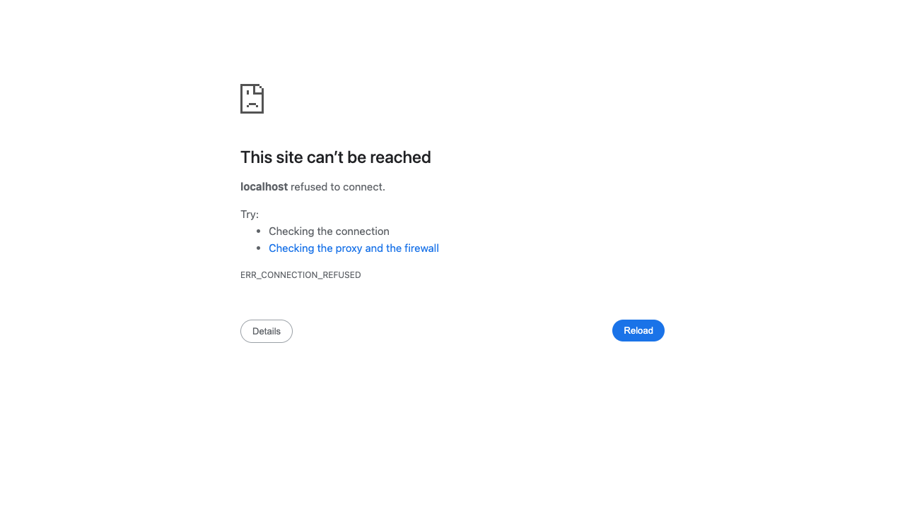

# Hangman Project Visual Documentation

## Project Overview

The Hangman project is a comprehensive 3D spelling prediction game built with TypeScript and Three.js. It features both single-player and multiplayer modes with a full SaaS platform architecture.


## Key Features

### 🎮 Game Modes
- **Single Player**: Progressive difficulty, hints system, particle effects
- **Multiplayer**: Real-time WebSocket sync, turn-based gameplay, tournaments

### 🏗️ SaaS Platform
- User authentication
- Dashboard with stats and leaderboard
- Friends system
- Profile management
- Tournament brackets

### ♿ Accessibility
- Full keyboard navigation
- Screen reader support
- ARIA labels
- Focus management

## Architecture

```
src/
├── main.ts                    # Entry point & game initialization
├── dashboard.ts               # Home page (no tests)
├── word-display.ts           # 3D word display (no tests)
├── letter-tiles.ts            # Interactive letter board
├── hangman-logic.ts           # Core game logic
├── multiplayer/               # Multiplayer features
├── components/                # UI components
└── types.ts                   # TypeScript definitions
```

## Technology Stack
- **Three.js** - 3D graphics and animations
- **Bun** - Runtime and bundler
- **TypeScript** - Type safety
- **WebSocket** - Real-time multiplayer
- **Vitest** - Testing framework
- **jsdom** - DOM testing environment

## Build Status
✅ Build passes (bun run build)
⚠️ TypeScript errors in test files (不影响构建)
🎯 Server running at http://localhost:3000

## 2026-04-14T20:19:18.421Z -- Task `task_1776197270128_vx7uoc` -- `#auth` (mobile 375x812)

**URL:** http://localhost:3000/#auth  **Verdict:** FAILED  **Latency:** 399061ms


> (no analysis)

---

## 2026-04-14T20:19:49.351Z -- Task `task_1776196987466_lkfi5z` -- `#leaderboard` (desktop 1280x720)

**URL:** http://localhost:3000/#leaderboard  **Verdict:** OK  **Latency:** 69610ms


> The UI for route "#leaderboard" is not rendered; this image shows a "Multiplayer Mode" setup screen instead. Visible components include name input, color selectors, "Create New Room", "Join as Player/Spectator", and "Play Single Player" buttons. Error: Incorrect route displayed (not "#leaderboard").

---

## 2026-04-14T20:20:52.845Z -- Task `task_1776197270128_vx7uoc` -- `#dashboard` (desktop 1280x720)

**URL:** http://localhost:3000/#dashboard  **Verdict:** FAILED  **Latency:** 94374ms


> (no analysis)

---

## 2026-04-14T20:23:37.494Z -- Task `task_1776196987466_lkfi5z` -- `#game` (mobile 375x812)

**URL:** http://localhost:3000/#game  **Verdict:** OK  **Latency:** 119405ms


> The UI is rendered. Visible components include "Hangman" title, "Multiplayer Mode" subtitle, name input, color selection circles, "Create New Room" button, "OR" text, room code input, "Join as Player"/"Join as Spectator"/"Play Single Player" buttons, and "Not connected" status. No errors detected.

---

## 2026-04-14T20:23:38.336Z -- Task `task_1776197270128_vx7uoc` -- `#lobby` (desktop 1280x720)

**URL:** http://localhost:3000/#lobby  **Verdict:** OK  **Latency:** 74238ms


> Visible components: Name input, color selector, "Create New Room" button, "OR" divider, room code input, "Join as Player", "Join as Spectator", "Play Single Player" buttons. No rendering errors; all elements display properly.

---

## 2026-04-14T20:24:06.531Z -- Task `task_1776197270128_vx7uoc` -- `#lobby` (mobile 375x812)

**URL:** http://localhost:3000/#lobby  **Verdict:** OK  **Latency:** 28190ms


> The UI is not rendered (shows connection error). Visible components: error icon, “This site can’t be reached” text, “localhost refused to connect” message, troubleshooting steps, error code, and “Details” button. Error: Connection refused (ERR_CONNECTION_REFUSED), so lobby content isn’t displayed.

---

## 2026-04-14T20:24:25.061Z -- Task `task_1776197270128_vx7uoc` -- `#profile` (desktop 1280x720)

**URL:** http://localhost:3000/#profile  **Verdict:** OK  **Latency:** 18478ms


> The UI is not rendered; the browser displays a connection error page instead of the profile route. Visible components include the error message ("This site can’t be reached"), "localhost refused to connect," troubleshooting steps, "ERR_CONNECTION_REFUSED," and "Details"/"Reload" buttons.

---

## 2026-04-14T20:25:55.084Z -- Task `task_1776197270128_vx7uoc` -- `#friends` (desktop 1280x720)

**URL:** http://localhost:3000/#friends  **Verdict:** OK  **Latency:** 30890ms


> Visible components: Error icon, “This site can’t be reached” text, “localhost refused to connect.” message, bullet points (“Checking the connection”, “Checking the proxy and the firewall”), “ERR_CONNECTION_REFUSED” code, “Details” and “Reload” buttons.  
> Errors: Site failed to load (connection refused); no app UI for “#friends” route is rendered.

---

## 2026-04-14T20:26:54.411Z -- Task `task_1776197270128_vx7uoc` -- `#friends` (mobile 375x812)

**URL:** http://localhost:3000/#friends  **Verdict:** OK  **Latency:** 59224ms


> The UI is not rendered as intended; instead, a connection error page appears. Visible components include the error icon, “This site can’t be reached” text, “localhost refused to connect” message, troubleshooting steps, error code (ERR_CONNECTION_REFUSED), and a “Details” button. Error: Connection refused, preventing access to the #friends route content.

---

## 2026-04-14T20:27:58.953Z -- Task `task_1776197270128_vx7uoc` -- `#leaderboard` (desktop 1280x720)

**URL:** http://localhost:3000/#leaderboard  **Verdict:** OK  **Latency:** 64334ms


> The UI is not rendered as expected; instead, a connection error page appears. Visible components include the error message “This site can’t be reached”, “localhost refused to connect”, troubleshooting steps, “ERR_CONNECTION_REFUSED” code, “Details” and “Reload” buttons. Error: Connection failure prevents accessing the leaderboard route.

---

## 2026-04-14T20:28:33.793Z -- Task `task_1776197270128_vx7uoc` -- `#leaderboard` (mobile 375x812)

**URL:** http://localhost:3000/#leaderboard  **Verdict:** OK  **Latency:** 34819ms


> The UI is not rendered as intended; an error page appears. Visible components: error icon, “This site can’t be reached” text, “localhost refused to connect” message, “Try:” section with bullet points, error code, and “Details” button. Error: Connection refused (ERR_CONNECTION_REFUSED) prevents loading the #leaderboard UI.

---

## 2026-04-14T20:29:17.829Z -- Task `task_1776197270128_vx7uoc` -- `#game` (desktop 1280x720)

**URL:** http://localhost:3000/#game  **Verdict:** OK  **Latency:** 44019ms


> No, the UI for route "#game" is not rendered—it displays a "This site can’t be reached" error page. Visible components include the error icon, message text, bullet points ("Checking the connection," "Checking the proxy and the firewall"), "ERR_CONNECTION_REFUSED" code, and "Details"/"Reload" buttons. Error: Connection refused (site unreachable).

---

## 2026-04-14T20:31:41.821Z -- Task `task_1776197544233_3a19sn` -- `/` (mobile 375x812)

**URL:** http://localhost:3000  **Verdict:** OK  **Latency:** 92497ms


> The UI is not rendered; it shows a browser error page. Visible components: error icon, “This site can’t be reached” text, “localhost refused to connect” message, “Try:” section with bullet points, error code, and “Details” button.

---

## 2026-04-14T20:32:26.856Z -- Task `task_1776197544233_3a19sn` -- `#auth` (desktop 1280x720)

**URL:** http://localhost:3000/#auth  **Verdict:** OK  **Latency:** 44994ms


> The UI for route "#auth" is not rendered; instead, a connection error page appears. Visible components include the error icon, "This site can’t be reached" text, "localhost refused to connect" message, troubleshooting steps, "ERR_CONNECTION_REFUSED" code, and "Details"/"Reload" buttons. Error: Connection failure prevents auth UI from loading.

---

## 2026-04-14T20:33:11.915Z -- Task `task_1776197544233_3a19sn` -- `#auth` (mobile 375x812)

**URL:** http://localhost:3000/#auth  **Verdict:** OK  **Latency:** 45049ms


> The UI is not rendered (shows connection error). Visible components: error icon, “This site can’t be reached” text, “localhost refused to connect”, “Try:” section (bullets), “ERR_CONNECTION_REFUSED”, “Details” button. Error: Connection refused, so auth route UI failed to load.

---

## 2026-04-14T20:33:49.745Z -- Task `task_1776197544233_3a19sn` -- `#dashboard` (desktop 1280x720)

**URL:** http://localhost:3000/#dashboard  **Verdict:** OK  **Latency:** 37815ms


> The UI is not rendered; it shows a connection error page. Visible components: error icon, “This site can’t be reached” text, “localhost refused to connect” message, troubleshooting steps, ERR_CONNECTION_REFUSED code, Details button, Reload button. Error: Connection refused (ERR_CONNECTION_REFUSED).

---

## 2026-04-14T20:34:20.555Z -- Task `task_1776197544233_3a19sn` -- `#dashboard` (mobile 375x812)

**URL:** http://localhost:3000/#dashboard  **Verdict:** OK  **Latency:** 30799ms


> The UI for #dashboard is not rendered; an error page displays instead. Visible components: error icon, “This site can’t be reached” text, “localhost refused to connect.” message, “Try:” section (bullet points), “ERR_CONNECTION_REFUSED”, and a “Details” button. Error: Connection refused, preventing dashboard load.

---

## 2026-04-14T20:34:51.801Z -- Task `task_1776197544233_3a19sn` -- `#lobby` (desktop 1280x720)

**URL:** http://localhost:3000/#lobby  **Verdict:** OK  **Latency:** 31233ms


> The UI is not rendered; it shows a connection error page. Visible components: error icon, “This site can’t be reached” text, “localhost refused to connect” message, troubleshooting steps, ERR_CONNECTION_REFUSED code, Details button, Reload button. Error: Connection refused (site unreachable).

---

## 2026-04-14T20:35:32.954Z -- Task `task_1776197544233_3a19sn` -- `#lobby` (mobile 375x812)

**URL:** http://localhost:3000/#lobby  **Verdict:** OK  **Latency:** 41111ms


> The UI is not the intended lobby; it’s an error page. Visible components: error icon, “This site can’t be reached” text, “localhost refused to connect” message, troubleshooting steps, error code, and “Details” button. Error: Connection refused (ERR_CONNECTION_REFUSED), so lobby content isn’t rendered.

---

## 2026-04-14T20:36:00.780Z -- Task `task_1776197544233_3a19sn` -- `#profile` (desktop 1280x720)

**URL:** http://localhost:3000/#profile  **Verdict:** OK  **Latency:** 27725ms


> The UI is not rendered; only an error page with “This site can’t be reached” message, “Details” and “Reload” buttons are visible. Error: ERR_CONNECTION_REFUSED (localhost refused to connect).

---

## 2026-04-14T20:36:29.791Z -- Task `task_1776197544233_3a19sn` -- `#profile` (mobile 375x812)

**URL:** http://localhost:3000/#profile  **Verdict:** OK  **Latency:** 28981ms


> The UI is not rendered; an error page appears instead. Visible components: error message ("This site can’t be reached"), suggestions (checking connection, proxy/firewall), error code (ERR_CONNECTION_REFUSED), and a "Details" button. Error: Connection refused, preventing the profile UI from loading.

---

## 2026-04-14T20:36:57.719Z -- Task `task_1776197544233_3a19sn` -- `#friends` (desktop 1280x720)

**URL:** http://localhost:3000/#friends  **Verdict:** OK  **Latency:** 27852ms


> The UI is not rendered (shows connection error). Visible components: error icon, “This site can’t be reached” text, “localhost refused to connect” message, bullet points, “ERR_CONNECTION_REFUSED”, Details button, Reload button. Error: Connection refused, so app UI failed to load.

---

## 2026-04-14T20:37:11.355Z -- Task `task_1776197544233_3a19sn` -- `#friends` (mobile 375x812)

**URL:** http://localhost:3000/#friends  **Verdict:** OK  **Latency:** 13579ms


> The UI is not rendered as intended; an error page appears. Visible components: error icon, “This site can’t be reached” text, “localhost refused to connect.” message, “Try:” section (with bullet points), “ERR_CONNECTION_REFUSED” code, and “Details” button. Error: Connection failure prevents loading the #friends route UI.

---

## 2026-04-14T20:37:36.149Z -- Task `task_1776197544233_3a19sn` -- `#leaderboard` (desktop 1280x720)

**URL:** http://localhost:3000/#leaderboard  **Verdict:** OK  **Latency:** 24767ms


> No, the UI is not rendered; it shows a connection error page. Visible components: error icon, “This site can’t be reached” text, “localhost refused to connect.” message, bullet points (“Checking the connection”, “Checking the proxy and the firewall”), “ERR_CONNECTION_REFUSED” code, “Details” and “Reload” buttons. Error: Connection refused (ERR_CONNECTION_REFUSED).

---

## 2026-04-14T20:38:12.017Z -- Task `task_1776197544233_3a19sn` -- `#leaderboard` (mobile 375x812)

**URL:** http://localhost:3000/#leaderboard  **Verdict:** OK  **Latency:** 35854ms


> The UI is not rendered as intended; an error page appears instead. Visible components include the error icon, “This site can’t be reached” text, “localhost refused to connect” message, troubleshooting steps, error code, and a “Details” button. Error: The site failed to load, preventing the leaderboard UI from displaying.

---

## 2026-04-14T20:38:36.593Z -- Task `task_1776197544233_3a19sn` -- `#game` (desktop 1280x720)

**URL:** http://localhost:3000/#game  **Verdict:** OK  **Latency:** 24490ms


> No, the UI is not rendered; the browser shows a connection error page. Visible components: error icon, “This site can’t be reached” text, “localhost refused to connect” message, troubleshooting steps, ERR_CONNECTION_REFUSED code, Details button, Reload button. Error: Connection refused prevents loading the game UI.

---

## 2026-04-14T20:38:54.762Z -- Task `task_1776197544233_3a19sn` -- `#game` (mobile 375x812)

**URL:** http://localhost:3000/#game  **Verdict:** OK  **Latency:** 18142ms


> Yes, but it’s an error page. Visible components: error icon, “This site can’t be reached” text, “localhost refused to connect” message, “Try:” bullet points, “ERR_CONNECTION_REFUSED” code, and “Details” button. Error: connection refused, so the intended game UI isn’t loaded.

---

## 2026-04-14T20:44:41.991Z -- Task `task_1776198736620_7ge1ff` -- `/` (desktop 1280x720)

**URL:** http://localhost:3000  **Verdict:** OK  **Latency:** 29087ms


> Visible components: Name input, color selector, "Create New Room" button, "OR" divider, room code input, "Join as Player", "Join as Spectator", "Play Single Player" buttons. No rendering errors observed.

---

## 2026-04-14T20:45:00.075Z -- Task `task_1776198736620_7ge1ff` -- `/` (mobile 375x812)

**URL:** http://localhost:3000  **Verdict:** OK  **Latency:** 18042ms


> Yes, UI is rendered. Visible components: Hangman title, Multiplayer Mode subtitle, name input, color circles, “Create New Room” button, “OR” text, room code input, “Join as Player/Spectator” buttons, “Play Single Player” button, “Not connected” status. No errors.

---

## 2026-04-14T20:45:38.599Z -- Task `task_1776198736620_7ge1ff` -- `#auth` (desktop 1280x720)

**URL:** http://localhost:3000/#auth  **Verdict:** OK  **Latency:** 38419ms


> Visible components: Name input, color selector, "Create New Room" button, "OR" separator, room code input, "Join as Player", "Join as Spectator", "Play Single Player" buttons. No rendering errors detected.

---

## 2026-04-14T20:45:53.533Z -- Task `task_1776198736620_7ge1ff` -- `#auth` (mobile 375x812)

**URL:** http://localhost:3000/#auth  **Verdict:** OK  **Latency:** 14930ms


> Yes, UI is rendered. Visible components: Hangman title, Multiplayer Mode subtitle, name input, color picker, Create New Room button, OR divider, room code input, Join as Player/Join as Spectator/Play Single Player buttons, Not connected status. No errors.

---

## 2026-04-14T20:51:14.247Z -- Task `task_1776198736620_7ge1ff` -- `#dashboard` (desktop 1280x720)

**URL:** http://localhost:3000/#dashboard  **Verdict:** OK  **Latency:** 320693ms


> The UI does not render the expected #dashboard; it shows a multiplayer setup interface. Visible components include name input, color selector, “Create New Room” button, room code input, “Join as Player,” “Join as Spectator,” and “Play Single Player.” Error: Route mismatch (incorrect UI for #dashboard).

---

## 2026-04-15T03:53:31.947Z -- Task `task_1776198736620_7ge1ff` -- `#profile` (mobile 375x812)

**URL:** http://localhost:3000/#profile  **Verdict:** FAILED  **Latency:** 67950ms


> (no analysis)

---

## 2026-04-15T03:55:37.415Z -- Task `task_1776198736620_7ge1ff` -- `#friends` (mobile 375x812)

**URL:** http://localhost:3000/#friends  **Verdict:** FAILED  **Latency:** 80346ms


> (no analysis)

---

## 2026-04-15T16:49:13.811Z -- Task `task_1776227469843_xg7ywl` -- `/` (desktop 1280x720)

**URL:** http://localhost:3000  **Verdict:** OK  **Latency:** 10679ms


> Visible components: Name input ("LuckyTiger12"), color selector, "Create New Room" button, "OR" divider, room code input, "Join as Player"/"Join as Spectator"/"Play Single Player" buttons. No rendering errors detected.

---

## 2026-04-15T16:49:22.925Z -- Task `task_1776227469843_xg7ywl` -- `/` (mobile 375x812)

**URL:** http://localhost:3000  **Verdict:** OK  **Latency:** 9112ms


> Yes, UI is rendered. Visible components: Hangman title, Multiplayer Mode subtitle, name input (SwiftDragon14), color circles, Create New Room button, OR text, room code input, Join as Player/Join as Spectator buttons, Play Single Player button, Not connected status. No errors.

---

## 2026-04-15T16:49:31.320Z -- Task `task_1776227469843_xg7ywl` -- `#auth` (desktop 1280x720)

**URL:** http://localhost:3000/#auth  **Verdict:** OK  **Latency:** 8394ms


> Visible components: Name input, color selector, "Create New Room" button, "OR" divider, room code input, "Join as Player", "Join as Spectator", "Play Single Player" buttons. No rendering errors; all elements display properly.

---

## 2026-04-15T16:49:40.165Z -- Task `task_1776227469843_xg7ywl` -- `#auth` (mobile 375x812)

**URL:** http://localhost:3000/#auth  **Verdict:** OK  **Latency:** 8845ms


> Visible components: Title "Hangman", subtitle "Multiplayer Mode", name input ("BraveLion62"), color picker (7 colors), "Create New Room" button, "OR" divider, room code input, "Join as Player"/"Spectator" buttons, "Play Single Player" button, "Not connected" status. No rendering errors.

---

## 2026-04-15T16:49:50.904Z -- Task `task_1776227469843_xg7ywl` -- `#dashboard` (desktop 1280x720)

**URL:** http://localhost:3000/#dashboard  **Verdict:** OK  **Latency:** 10739ms


> The UI is rendered but may not match the "#dashboard" route (shows multiplayer setup instead). Visible components: name input, color selector, "Create New Room", "Join as Player", "Join as Spectator", "Play Single Player" buttons, room code input. Error: Incorrect route content (expected dashboard, got multiplayer setup).

---

## 2026-04-15T16:50:00.406Z -- Task `task_1776227469843_xg7ywl` -- `#dashboard` (mobile 375x812)

**URL:** http://localhost:3000/#dashboard  **Verdict:** OK  **Latency:** 9501ms


> The UI is not the expected "#dashboard"—it’s a Hangman multiplayer setup screen. Visible components include the title, name/color inputs, buttons (Create New Room, Join as Player/Spectator, Play Single Player), and connection status. Error: Route mismatch (shows Hangman instead of dashboard).

---

## 2026-04-15T16:50:08.292Z -- Task `task_1776227469843_xg7ywl` -- `#lobby` (desktop 1280x720)

**URL:** http://localhost:3000/#lobby  **Verdict:** OK  **Latency:** 7883ms


> Yes, the UI is rendered. Visible components include a name input field, color selection circles, "Create New Room" button, "OR" divider, room code input, "Join as Player", "Join as Spectator", and "Play Single Player" buttons. No errors observed.

---

## 2026-04-15T16:50:17.216Z -- Task `task_1776227469843_xg7ywl` -- `#lobby` (mobile 375x812)

**URL:** http://localhost:3000/#lobby  **Verdict:** OK  **Latency:** 8923ms


> The UI is rendered. Visible components: "Hangman" title, "Multiplayer Mode" subtitle, name input ("MightyTiger99"), color selector, "Create New Room" button, "OR" text, room code input, "Join as Player"/"Join as Spectator"/"Play Single Player" buttons, "Not connected" status. No errors detected.

---

## 2026-04-15T16:50:26.928Z -- Task `task_1776227469843_xg7ywl` -- `#profile` (desktop 1280x720)

**URL:** http://localhost:3000/#profile  **Verdict:** OK  **Latency:** 9711ms


> The UI renders a multiplayer setup screen (not profile). Visible: name input, color circles, “Create New Room”/“Join as Player”/etc. buttons. Error: Content mismatches “#profile” route (shows multiplayer setup instead).

---

## 2026-04-15T16:50:40.740Z -- Task `task_1776227469843_xg7ywl` -- `#profile` (mobile 375x812)

**URL:** http://localhost:3000/#profile  **Verdict:** OK  **Latency:** 13812ms


> Yes, UI is rendered. Visible components: “Hangman” title, “Multiplayer Mode” subtitle, name input, color circles, action buttons, room code field, and connection status; no errors detected.

---

## 2026-04-15T16:50:55.296Z -- Task `task_1776227469843_xg7ywl` -- `#friends` (desktop 1280x720)

**URL:** http://localhost:3000/#friends  **Verdict:** OK  **Latency:** 14555ms


> Got it, let's check the problem. The user is asking about the "#friends" route on desktop 1280x720. First, I need to see if the UI is rendered. Wait, the image provided shows a multiplayer mode screen with name input, color selection, create/join room buttons. But the question is about the "#friends" route—maybe there's a mismatch? Wait, no, maybe the image is for a different route? Wait, the user said "Route '#friends'", but the image shows a multiplayer setup. So first, is the UI rendered? The image has components: name input (CleverPanda74), color circles, Create New Room button, OR text, Room Code input, Join as Player/ Spectator buttons, Play Single Player. But wait, is this the #friends route? Maybe the image is not matching the route. But the user might have a mistake, but we need to answer based on the given info. Wait, the question says "Is the UI rendered?"—yes, because there are visible components. Then list visible components: Name input field, color selection circles, Create New Room button, OR separator, Room Code input field, Join as Player button, Join as Spectator button, Play Single Player button. Errors? Maybe the route doesn't match (since it's showing multiplayer instead of friends), but the user asked for errors. Wait, maybe the image is correct, but the route is wrong? Or maybe the UI is rendered but the content is for a different route. But the user wants concise answers. Let me structure:
> 
> First sentence: Yes, UI is rendered. Visible components include name input, color selector, Create New Room button, OR divider, room code input, join player/spectator buttons, play single player button.
> 
> Second sentence: No obvious rendering errors, but content may not align with "#friends" route (shows multiplayer setup instead).
> 
> Wait, but the user said "any errors"—so maybe the route is incorrect, but that's a content error. Alternatively, maybe the image is for a different route, so the UI is rendered but the content is wrong. But the user wants to know if the UI is rendered (yes) and list components, then errors. Let me make sure:
> 
> Visible components: Your Name input (with value CleverPanda74), Your Color circle options, Create New Room button, OR text, Room Code (4 digits) input, Join as Player button, Join as Spectator button, Play Single Player

---

## 2026-04-15T16:51:06.253Z -- Task `task_1776227469843_xg7ywl` -- `#friends` (mobile 375x812)

**URL:** http://localhost:3000/#friends  **Verdict:** OK  **Latency:** 10957ms


> The UI for route "#friends" is not rendered; the current view shows "Hangman Multiplayer Mode" instead. Visible components include name/color inputs, room creation/joining options, and single-player button—mismatched with the "#friends" route.

---

## 2026-04-15T16:51:16.186Z -- Task `task_1776227469843_xg7ywl` -- `#leaderboard` (desktop 1280x720)

**URL:** http://localhost:3000/#leaderboard  **Verdict:** OK  **Latency:** 9932ms


> The UI shown is not the #leaderboard route; it displays a multiplayer setup screen. Visible components include name/color inputs, create/join room buttons, and single-player option. Error: Incorrect route rendered (not leaderboard).

---

## 2026-04-15T16:51:26.221Z -- Task `task_1776227469843_xg7ywl` -- `#leaderboard` (mobile 375x812)

**URL:** http://localhost:3000/#leaderboard  **Verdict:** OK  **Latency:** 10035ms


> The UI shown is for Hangman Multiplayer Mode, not the #leaderboard route. Visible components include the title, name/color inputs, buttons (Create New Room, Join as Player/Spectator, Play Single Player), and connection status. Error: Incorrect route content (shows multiplayer setup instead of leaderboard).

---

## 2026-04-15T16:51:34.750Z -- Task `task_1776227469843_xg7ywl` -- `#game` (desktop 1280x720)

**URL:** http://localhost:3000/#game  **Verdict:** OK  **Latency:** 8528ms


> Visible components: Name input ("CleverDragon14"), color selector, "Create New Room" button, "OR" text, room code input, "Join as Player", "Join as Spectator", "Play Single Player" buttons. No rendering errors—all elements display properly.

---

## 2026-04-15T16:51:42.811Z -- Task `task_1776227469843_xg7ywl` -- `#game` (mobile 375x812)

**URL:** http://localhost:3000/#game  **Verdict:** OK  **Latency:** 8060ms


> The UI is rendered. Visible components include title, name input, color options, buttons (Create New Room, Join as Player/Spectator, Play Single Player), room code field, and connection status. No errors detected.

---

## 2026-04-15T16:53:17.638Z -- Task `task_1776271844862_6tgkc3` -- `/` (desktop 1280x720)

**URL:** http://localhost:3000  **Verdict:** OK  **Latency:** 8218ms


> Visible components: Name input (QuickPhoenix78), color selector, "Create New Room" button, "OR" divider, room code input, "Join as Player", "Join as Spectator", "Play Single Player" buttons. No rendering errors.

---

## 2026-04-15T16:53:26.548Z -- Task `task_1776271844862_6tgkc3` -- `/` (mobile 375x812)

**URL:** http://localhost:3000  **Verdict:** OK  **Latency:** 8906ms


> Yes, UI is rendered. Visible components: "Hangman" title, "Multiplayer Mode" subtitle, name input ("CleverEagle15"), color selection circles, "Create New Room" button, "OR" separator, room code input, "Join as Player"/"Join as Spectator"/"Play Single Player" buttons, "Not connected" status. No errors detected.

---

## 2026-04-15T16:53:34.740Z -- Task `task_1776271844862_6tgkc3` -- `#auth` (desktop 1280x720)

**URL:** http://localhost:3000/#auth  **Verdict:** OK  **Latency:** 8192ms


> Visible components: Name input, color selector, “Create New Room” button, “OR” divider, room code input, “Join as Player,” “Join as Spectator,” “Play Single Player” buttons. No rendering errors; all elements display properly.

---

## 2026-04-15T16:53:44.161Z -- Task `task_1776271844862_6tgkc3` -- `#auth` (mobile 375x812)

**URL:** http://localhost:3000/#auth  **Verdict:** OK  **Latency:** 9420ms


> Visible components: Title “Hangman”, “Multiplayer Mode” subtitle, name input (“BraveBear45”), color selector, “Create New Room” button, “OR” text, room code input, “Join as Player/Spectator” buttons, “Play Single Player” button, “Not connected” status. No rendering errors—all elements display properly.

---

## 2026-04-15T16:53:53.070Z -- Task `task_1776271844862_6tgkc3` -- `#dashboard` (desktop 1280x720)

**URL:** http://localhost:3000/#dashboard  **Verdict:** OK  **Latency:** 8908ms


> Visible components: Name input (MightyWolf89), color selection circles, "Create New Room" button, "OR" divider, room code input, "Join as Player", "Join as Spectator", "Play Single Player" buttons. No rendering errors.

---

## 2026-04-15T16:54:01.791Z -- Task `task_1776271844862_6tgkc3` -- `#dashboard` (mobile 375x812)

**URL:** http://localhost:3000/#dashboard  **Verdict:** OK  **Latency:** 8720ms


> The UI is rendered. Visible components include the "Hangman" title, name/color inputs, buttons ("Create New Room", "Join as Player", etc.), and "Not connected" status. No errors detected.

---

## 2026-04-15T16:54:09.968Z -- Task `task_1776271844862_6tgkc3` -- `#lobby` (desktop 1280x720)

**URL:** http://localhost:3000/#lobby  **Verdict:** OK  **Latency:** 8173ms


> Visible components: Name input, color selector, "Create New Room" button, "OR" divider, room code input, "Join as Player", "Join as Spectator", "Play Single Player" buttons. No rendering errors; all elements display properly.

---

## 2026-04-15T16:54:18.796Z -- Task `task_1776271844862_6tgkc3` -- `#lobby` (mobile 375x812)

**URL:** http://localhost:3000/#lobby  **Verdict:** OK  **Latency:** 8826ms


> The UI is rendered. Visible components include the "Hangman" title, name/color inputs, color circles, "Create New Room"/"Join as Player"/etc. buttons, and "Not connected" status. No errors detected.

---

## 2026-04-15T16:54:29.117Z -- Task `task_1776271844862_6tgkc3` -- `#profile` (desktop 1280x720)

**URL:** http://localhost:3000/#profile  **Verdict:** OK  **Latency:** 10321ms


> The UI shows a multiplayer setup screen (not profile) with components: name input, color selector, "Create New Room" button, room code input, and join/play buttons. Error: Mismatched route—#profile renders multiplayer setup instead of profile content.

---

## 2026-04-15T16:54:38.947Z -- Task `task_1776271844862_6tgkc3` -- `#profile` (mobile 375x812)

**URL:** http://localhost:3000/#profile  **Verdict:** OK  **Latency:** 9829ms


> The UI is rendered. Visible components: "Hangman" title, "Multiplayer Mode" subtitle, name input field ("HappyDragon23"), color selection circles, "Create New Room" button, "OR" text, room code input, "Join as Player"/"Spectator" buttons, "Play Single Player" button, "Not connected" status. No errors.

---

## 2026-04-15T16:54:53.284Z -- Task `task_1776271844862_6tgkc3` -- `#friends` (desktop 1280x720)

**URL:** http://localhost:3000/#friends  **Verdict:** OK  **Latency:** 14336ms


> Yes, the UI is rendered. Visible components: name input ("CleverLion23"), color selection circles, "Create New Room" button, "OR" divider, room code input, "Join as Player"/"Join as Spectator" buttons, "Play Single Player" button. No obvious rendering errors, though the displayed content (multiplayer setup) may not align with the "#friends" route intent.

---

## 2026-04-15T16:55:01.887Z -- Task `task_1776271844862_6tgkc3` -- `#friends` (mobile 375x812)

**URL:** http://localhost:3000/#friends  **Verdict:** OK  **Latency:** 8601ms


> Visible components: Hangman title, Multiplayer Mode subtitle, name input, color selector, Create New Room button, OR text, room code input, Join as Player/Join as Spectator buttons, Play Single Player button, Not connected status. No rendering errors observed.

---

## 2026-04-15T16:55:12.638Z -- Task `task_1776271844862_6tgkc3` -- `#leaderboard` (desktop 1280x720)

**URL:** http://localhost:3000/#leaderboard  **Verdict:** OK  **Latency:** 10751ms


> The UI for "#leaderboard" is not rendered (current view is multiplayer room setup). Visible components: name input, color circles, "Create New Room", "Join as Player", etc. Error: Route mismatch (shows room setup instead of leaderboard).

---

## 2026-04-15T16:55:26.823Z -- Task `task_1776271844862_6tgkc3` -- `#leaderboard` (mobile 375x812)

**URL:** http://localhost:3000/#leaderboard  **Verdict:** OK  **Latency:** 14184ms


> The UI is not rendering the #leaderboard route; instead, it shows a Hangman multiplayer setup screen. Visible components include the title, name/color inputs, buttons (Create New Room, Join as Player/Spectator, Play Single Player), and status text. Error: Incorrect route displayed (not leaderboard).

---

## 2026-04-15T16:55:34.759Z -- Task `task_1776271844862_6tgkc3` -- `#game` (desktop 1280x720)

**URL:** http://localhost:3000/#game  **Verdict:** OK  **Latency:** 7933ms


> Visible components: Name input, color selector, "Create New Room" button, "OR" divider, room code input, "Join as Player", "Join as Spectator", "Play Single Player" buttons. No rendering errors; all elements display properly.

---

## 2026-04-15T16:55:38.827Z -- Task `task_1776272091801_vwu2q5` -- `/` (desktop 1280x720)

**URL:** http://localhost:3000  **Verdict:** OK  **Latency:** 16034ms


> Yes, the UI is rendered. Visible components include a name input field ("HappyWolf31"), color selection circles, "Create New Room" button, "OR" separator, room code input, "Join as Player", "Join as Spectator", and "Play Single Player" buttons. No errors observed.

---

## 2026-04-15T16:55:47.761Z -- Task `task_1776271844862_6tgkc3` -- `#game` (mobile 375x812)

**URL:** http://localhost:3000/#game  **Verdict:** OK  **Latency:** 13002ms


> Yes, UI is rendered. Visible components: "Hangman" title, "Multiplayer Mode" subtitle, name input ("LuckyPanda31"), color selection circles, "Create New Room" button, "OR" text, room code input, "Join as Player"/"Join as Spectator"/"Play Single Player" buttons, "Not connected" status. No errors observed.

---

## 2026-04-15T16:55:47.840Z -- Task `task_1776272091801_vwu2q5` -- `/` (mobile 375x812)

**URL:** http://localhost:3000  **Verdict:** OK  **Latency:** 9013ms


> The UI is rendered. Visible components include "Hangman" title, "Multiplayer Mode" text, name input, color selection circles, "Create New Room" button, "OR" separator, room code input, "Join as Player"/"Join as Spectator"/"Play Single Player" buttons, and "Not connected" status. No errors detected.

---

## 2026-04-15T16:55:54.625Z -- Task `task_1776272091801_vwu2q5` -- `#auth` (desktop 1280x720)

**URL:** http://localhost:3000/#auth  **Verdict:** OK  **Latency:** 6785ms


> The UI is not rendered; the browser shows a connection error page instead of the auth interface. Visible components: error icon, “This site can’t be reached” text, “localhost refused to connect” message, troubleshooting steps, “ERR_CONNECTION_REFUSED” code, “Details” and “Reload” buttons. Error: Connection refused, preventing auth UI from loading.

---

## 2026-04-15T16:56:01.281Z -- Task `task_1776272091801_vwu2q5` -- `#auth` (mobile 375x812)

**URL:** http://localhost:3000/#auth  **Verdict:** OK  **Latency:** 6655ms


> The UI is not rendered (shows connection error). Visible components: error icon, “This site can’t be reached” text, “localhost refused to connect”, “Try:” section (bullets), “ERR_CONNECTION_REFUSED”, Details button. Error: Connection refused, so auth UI fails to load.

---

## 2026-04-15T16:56:07.425Z -- Task `task_1776272091801_vwu2q5` -- `#dashboard` (desktop 1280x720)

**URL:** http://localhost:3000/#dashboard  **Verdict:** OK  **Latency:** 6143ms


> The UI is not rendered; it shows a connection error page. Visible components: error icon, “This site can’t be reached” text, “localhost refused to connect” message, troubleshooting steps, ERR_CONNECTION_REFUSED code, Details and Reload buttons. Error: Connection refused.

---

## 2026-04-15T16:56:14.081Z -- Task `task_1776272091801_vwu2q5` -- `#dashboard` (mobile 375x812)

**URL:** http://localhost:3000/#dashboard  **Verdict:** OK  **Latency:** 6656ms


> The UI for "#dashboard" is not rendered; instead, an error page appears. Visible components include the error icon, "This site can’t be reached" text, "localhost refused to connect" message, troubleshooting steps, and a "Details" button. Error: Connection refused (ERR_CONNECTION_REFUSED).

---

## 2026-04-15T16:56:20.225Z -- Task `task_1776272091801_vwu2q5` -- `#lobby` (desktop 1280x720)

**URL:** http://localhost:3000/#lobby  **Verdict:** OK  **Latency:** 6143ms


> The UI is not rendered as intended; it shows a connection error page instead. Visible components: error icon, "This site can’t be reached" text, "localhost refused to connect" message, troubleshooting steps, ERR_CONNECTION_REFUSED code, Details button, Reload button. Error: Connection refused (ERR_CONNECTION_REFUSED).

---

## 2026-04-15T16:56:27.086Z -- Task `task_1776272091801_vwu2q5` -- `#lobby` (mobile 375x812)

**URL:** http://localhost:3000/#lobby  **Verdict:** OK  **Latency:** 6861ms


> The UI is not rendered; it shows a connection error page instead of the lobby interface. Visible components include the error message “This site can’t be reached”, “localhost refused to connect” text, troubleshooting steps, “ERR_CONNECTION_REFUSED” code, and a “Details” button. Error: The lobby UI failed to load, displaying a connection refusal error.

---

## 2026-04-15T16:56:34.051Z -- Task `task_1776272091801_vwu2q5` -- `#profile` (desktop 1280x720)

**URL:** http://localhost:3000/#profile  **Verdict:** OK  **Latency:** 6963ms



> The UI for route "#profile" is not rendered; instead, an error page displays. Visible components: error icon, "This site can’t be reached" text, "localhost refused to connect" message, troubleshooting steps, ERR_CONNECTION_REFUSED code, Details button, Reload button. Error: Connection refused (ERR_CONNECTION_REFUSED).

---

## 2026-04-15T16:56:41.524Z -- Task `task_1776272091801_vwu2q5` -- `#profile` (mobile 375x812)

**URL:** http://localhost:3000/#profile  **Verdict:** OK  **Latency:** 7473ms


> The UI is not rendered; an error page appears instead. Visible components: error icon, “This site can’t be reached” text, “localhost refused to connect” message, troubleshooting steps, ERR_CONNECTION_REFUSED code, and a “Details” button. Error: Connection refused, preventing profile page loading.

---

## 2026-04-15T16:56:47.977Z -- Task `task_1776272091801_vwu2q5` -- `#friends` (desktop 1280x720)

**URL:** http://localhost:3000/#friends  **Verdict:** OK  **Latency:** 6452ms


> The UI is not rendered as intended; instead, a connection error page appears. Visible components include the error icon, “This site can’t be reached” text, bullet points, and “Details/Reload” buttons. Error: Site connection refused (ERR_CONNECTION_REFUSED), preventing the #friends route UI from loading.

---

## 2026-04-15T16:56:56.375Z -- Task `task_1776272091801_vwu2q5` -- `#friends` (mobile 375x812)

**URL:** http://localhost:3000/#friends  **Verdict:** OK  **Latency:** 8397ms


> The UI is not rendered; an error page appears instead. Visible components: error message ("This site can’t be reached"), suggestions (checking connection, proxy/firewall), ERR_CONNECTION_REFUSED, and a Details button. Error: Connection refused by localhost, preventing the intended friends route UI from loading.

---

## 2026-04-15T16:57:03.031Z -- Task `task_1776272091801_vwu2q5` -- `#leaderboard` (desktop 1280x720)

**URL:** http://localhost:3000/#leaderboard  **Verdict:** OK  **Latency:** 6655ms


> The UI is not rendered; the page shows a connection error instead of the leaderboard. Visible components: error icon, “This site can’t be reached” text, “localhost refused to connect” message, troubleshooting steps, ERR_CONNECTION_REFUSED code, Details and Reload buttons. Error: Connection refused (ERR_CONNECTION_REFUSED).

---

## 2026-04-15T16:57:09.585Z -- Task `task_1776272091801_vwu2q5` -- `#leaderboard` (mobile 375x812)

**URL:** http://localhost:3000/#leaderboard  **Verdict:** OK  **Latency:** 6554ms


> The UI is not rendered as intended; an error page appears instead. Visible components include the error message “This site can’t be reached”, suggestions (“Checking the connection”, “Checking the proxy and the firewall”), the error code “ERR_CONNECTION_REFUSED”, and a “Details” button. The error indicates a connection issue preventing the leaderboard from loading.

---

## 2026-04-15T16:57:16.446Z -- Task `task_1776272091801_vwu2q5` -- `#game` (desktop 1280x720)

**URL:** http://localhost:3000/#game  **Verdict:** OK  **Latency:** 6860ms


> The UI is not the intended game interface; it shows a connection error page. Visible components: error icon, “This site can’t be reached” text, “localhost refused to connect” message, bullet points (“Checking the connection,” “Checking the proxy and the firewall”), “ERR_CONNECTION_REFUSED” code, “Details” and “Reload” buttons. Error: Connection refused by localhost.

---

## 2026-04-15T16:57:23.066Z -- Task `task_1776272091801_vwu2q5` -- `#game` (mobile 375x812)

**URL:** http://localhost:3000/#game  **Verdict:** OK  **Latency:** 6619ms


> The UI is not rendered (shows browser error). Visible components: error icon, “This site can’t be reached” text, “localhost refused to connect” subtext, bullet points (“Checking the connection”, “Checking the proxy and the firewall”), “Details” button. Error: ERR_CONNECTION_REFUSED (site unreachable).

---

## 2026-04-15T16:57:41.228Z -- Task `task_1776272221793_qqtwvd` -- `/` (desktop 1280x720)

**URL:** http://localhost:3000  **Verdict:** OK  **Latency:** 7901ms


> Visible components: Name input, color selectors, “Create New Room” button, “OR” text, room code input, “Join as Player”, “Join as Spectator”, “Play Single Player” buttons. No rendering errors observed.

---

## 2026-04-15T16:57:49.831Z -- Task `task_1776272221793_qqtwvd` -- `/` (mobile 375x812)

**URL:** http://localhost:3000  **Verdict:** OK  **Latency:** 8601ms


> The UI is rendered. Visible components include "Hangman" title, "Multiplayer Mode" subtitle, name input ("BraveBear5"), color selection circles, "Create New Room" button, "OR" text, room code input, "Join as Player"/"Join as Spectator"/"Play Single Player" buttons, and "Not connected" status. No errors detected.

---

## 2026-04-15T16:57:58.381Z -- Task `task_1776272221793_qqtwvd` -- `#auth` (desktop 1280x720)

**URL:** http://localhost:3000/#auth  **Verdict:** OK  **Latency:** 8549ms


> The UI is rendered. Visible components include a name input field, color selection circles, “Create New Room” button, “OR” separator, room code input, “Join as Player,” “Join as Spectator,” and “Play Single Player” buttons. No errors observed.

---

## 2026-04-15T16:58:07.033Z -- Task `task_1776272221793_qqtwvd` -- `#auth` (mobile 375x812)

**URL:** http://localhost:3000/#auth  **Verdict:** OK  **Latency:** 8651ms


> Yes, UI is rendered. Visible components: Hangman title, Multiplayer Mode subtitle, name input, color circles, Create New Room button, OR text, room code input, Join as Player/Join as Spectator/Play Single Player buttons, Not connected status. No errors.

---

## 2026-04-15T16:58:17.892Z -- Task `task_1776272221793_qqtwvd` -- `#dashboard` (desktop 1280x720)

**URL:** http://localhost:3000/#dashboard  **Verdict:** OK  **Latency:** 10859ms


> The UI is rendered. Visible components include name input, color selector, “Create New Room” button, room code input, “Join as Player,” “Join as Spectator,” and “Play Single Player” buttons. No errors observed.

---

## 2026-04-15T16:58:27.096Z -- Task `task_1776272221793_qqtwvd` -- `#dashboard` (mobile 375x812)

**URL:** http://localhost:3000/#dashboard  **Verdict:** OK  **Latency:** 9203ms


> Visible components: Title "Hangman", subtitle "Multiplayer Mode", name input ("SwiftDragon88"), color selector (7 colors), "Create New Room" button, "OR" text, room code input, "Join as Player"/"Join as Spectator"/"Play Single Player" buttons, "Not connected" status. No rendering errors.

---

## 2026-04-15T16:58:36.062Z -- Task `task_1776272221793_qqtwvd` -- `#lobby` (desktop 1280x720)

**URL:** http://localhost:3000/#lobby  **Verdict:** OK  **Latency:** 8966ms


> Visible components: Name input, color selector, "Create New Room" button, "OR" text, room code input, "Join as Player", "Join as Spectator", "Play Single Player" buttons. No rendering errors; all elements display properly.

---

## 2026-04-15T16:58:45.075Z -- Task `task_1776272221793_qqtwvd` -- `#lobby` (mobile 375x812)

**URL:** http://localhost:3000/#lobby  **Verdict:** OK  **Latency:** 9012ms


> Yes, UI is rendered. Visible components: Title “Hangman”, “Multiplayer Mode” subtitle, name input (“MightyLion17”), color circles, “Create New Room” button, “OR” text, room code input, “Join as Player/Spectator” buttons, “Play Single Player” button, “Not connected” status. No errors.

---

## 2026-04-15T16:58:55.109Z -- Task `task_1776272221793_qqtwvd` -- `#profile` (desktop 1280x720)

**URL:** http://localhost:3000/#profile  **Verdict:** OK  **Latency:** 10033ms


> The UI for route "#profile" is not rendered; the current view shows a multiplayer setup screen. Visible components include name input, color selectors, "Create New Room" button, room code input, and join buttons. Error: Incorrect route displayed (not #profile).

---

## 2026-04-15T16:59:07.396Z -- Task `task_1776272221793_qqtwvd` -- `#profile` (mobile 375x812)

**URL:** http://localhost:3000/#profile  **Verdict:** OK  **Latency:** 12286ms


> Yes, UI is rendered. Visible components: Title “Hangman”, “Multiplayer Mode” subtitle, name input, color options, “Create New Room”/“Join as Player”/etc. buttons, room code input, “Not connected” status. Error: Route “#profile” displays multiplayer setup instead of profile content.

---

## 2026-04-15T16:59:19.938Z -- Task `task_1776272221793_qqtwvd` -- `#friends` (desktop 1280x720)

**URL:** http://localhost:3000/#friends  **Verdict:** OK  **Latency:** 12542ms


> Yes, UI is rendered. Visible components: Name input, color selector, “Create New Room” button, Room Code input, “Join as Player/Spectator” buttons, “Play Single Player” button. Error: Route “#friends” mismatches displayed multiplayer setup.

---

## 2026-04-15T16:59:28.388Z -- Task `task_1776272221793_qqtwvd` -- `#friends` (mobile 375x812)

**URL:** http://localhost:3000/#friends  **Verdict:** OK  **Latency:** 8450ms


> Visible components: Title “Hangman”, “Multiplayer Mode” subtitle, name input (SwiftWolf55), color selector, “Create New Room” button, “OR” text, room code input, “Join as Player/Spectator” buttons, “Play Single Player” button, “Not connected” status. No rendering errors—all elements display properly.

---

## 2026-04-15T16:59:39.450Z -- Task `task_1776272221793_qqtwvd` -- `#leaderboard` (desktop 1280x720)

**URL:** http://localhost:3000/#leaderboard  **Verdict:** OK  **Latency:** 11061ms


> No, the UI for "#leaderboard" is not rendered; the current view shows a multiplayer setup page. Visible components include name/color inputs, "Create New Room", room code input, and join buttons. Error: Incorrect page displayed (not leaderboard).

---

## 2026-04-15T16:59:49.749Z -- Task `task_1776272221793_qqtwvd` -- `#leaderboard` (mobile 375x812)

**URL:** http://localhost:3000/#leaderboard  **Verdict:** OK  **Latency:** 10298ms


> The UI for the "#leaderboard" route is not rendered in the provided image (which shows the "Hangman Multiplayer Mode" setup screen instead). Visible components are those of the multiplayer setup (name input, color selector, room creation/join options) — no leaderboard-specific elements are present.

---

## 2026-04-15T16:59:57.470Z -- Task `task_1776272221793_qqtwvd` -- `#game` (desktop 1280x720)

**URL:** http://localhost:3000/#game  **Verdict:** OK  **Latency:** 7721ms


> Visible components: Name input, color selector, "Create New Room" button, "OR" divider, room code input, "Join as Player", "Join as Spectator", "Play Single Player" buttons. No rendering errors detected.

---

## 2026-04-15T17:00:06.277Z -- Task `task_1776272221793_qqtwvd` -- `#game` (mobile 375x812)

**URL:** http://localhost:3000/#game  **Verdict:** OK  **Latency:** 8807ms


> Yes, UI is rendered. Visible components: Hangman title, Multiplayer Mode subtitle, name input (QuickDragon62), color circles, Create New Room button, OR text, room code input, Join as Player/Join as Spectator/Play Single Player buttons, Not connected status. No errors.

---

## 2026-04-15T17:00:58.196Z -- Task `task_1776272351522_11jn6n` -- `/` (desktop 1280x720)

**URL:** http://localhost:3000  **Verdict:** OK  **Latency:** 8251ms


> Yes, UI is rendered. Visible components: name input, color selector, "Create New Room" button, "OR" text, room code input, "Join as Player", "Join as Spectator", "Play Single Player" buttons. No errors observed.

---

## 2026-04-15T17:01:07.103Z -- Task `task_1776272351522_11jn6n` -- `/` (mobile 375x812)

**URL:** http://localhost:3000  **Verdict:** OK  **Latency:** 8906ms


> Visible components: Title "Hangman", "Multiplayer Mode" subtitle, name input ("HappyEagle25"), color selection circles, "Create New Room" button, "OR" text, room code input, "Join as Player"/"Join as Spectator"/"Play Single Player" buttons, "Not connected" status. No rendering errors—all elements display properly.

---

## 2026-04-15T17:01:15.808Z -- Task `task_1776272351522_11jn6n` -- `#auth` (desktop 1280x720)

**URL:** http://localhost:3000/#auth  **Verdict:** OK  **Latency:** 8705ms


> Visible components: Name input (BraveEagle81), color selector, “Create New Room” button, “OR” divider, room code input, “Join as Player”, “Join as Spectator”, “Play Single Player” buttons. No rendering errors observed.

---

## 2026-04-15T17:01:24.717Z -- Task `task_1776272351522_11jn6n` -- `#auth` (mobile 375x812)

**URL:** http://localhost:3000/#auth  **Verdict:** OK  **Latency:** 8908ms


> The UI is rendered. Visible components include the title “Hangman”, “Multiplayer Mode” subtitle, name input field, color selection circles, “Create New Room”/“Join as Player”/“Join as Spectator”/“Play Single Player” buttons, room code input, and “Not connected” status. No errors detected.

---

## 2026-04-15T17:01:33.728Z -- Task `task_1776272351522_11jn6n` -- `#dashboard` (desktop 1280x720)

**URL:** http://localhost:3000/#dashboard  **Verdict:** OK  **Latency:** 9010ms


> The UI for "#dashboard" is not rendered; the current view shows a multiplayer setup page. Visible components include name input, color selector, "Create New Room" button, room code field, and join/spectate/single player options. Error: Incorrect route rendering (not dashboard).

---

## 2026-04-15T17:01:43.911Z -- Task `task_1776272351522_11jn6n` -- `#dashboard` (mobile 375x812)

**URL:** http://localhost:3000/#dashboard  **Verdict:** OK  **Latency:** 10182ms


> The UI is rendered. Visible components: "Hangman" title, "Multiplayer Mode" subtitle, name input, color circles, "Create New Room" button, "OR" text, room code input, "Join as Player"/"Spectator"/"Single Player" buttons, "Not connected" status. Error: Route may not align (shows multiplayer setup, not dashboard).

---

## 2026-04-15T17:01:51.543Z -- Task `task_1776272351522_11jn6n` -- `#lobby` (desktop 1280x720)

**URL:** http://localhost:3000/#lobby  **Verdict:** OK  **Latency:** 7631ms


> The UI is rendered. Visible components: name input (CleverTiger84), color selector, “Create New Room” button, room code input, “Join as Player”, “Join as Spectator”, “Play Single Player” buttons. No errors observed.

---

## 2026-04-15T17:01:59.224Z -- Task `task_1776272351522_11jn6n` -- `#lobby` (mobile 375x812)

**URL:** http://localhost:3000/#lobby  **Verdict:** OK  **Latency:** 7680ms


> Yes, UI is rendered. Visible components: "Hangman" title, "Multiplayer Mode" subtitle, name input ("BraveLion87"), color selection circles, "Create New Room" button, "OR" text, room code input, "Join as Player"/"Join as Spectator"/"Play Single Player" buttons, "Not connected" status. No errors observed.

---

## 2026-04-15T17:02:14.866Z -- Task `task_1776272351522_11jn6n` -- `#profile` (desktop 1280x720)

**URL:** http://localhost:3000/#profile  **Verdict:** OK  **Latency:** 15642ms


> Yes, UI is rendered. Visible components: name input ("MightyBear42"), color selection circles, "Create New Room" button, "OR" separator, room code input, "Join as

---

## 2026-04-15T17:02:23.597Z -- Task `task_1776272351522_11jn6n` -- `#profile` (mobile 375x812)

**URL:** http://localhost:3000/#profile  **Verdict:** OK  **Latency:** 8731ms


> Visible components: Title ("Hangman"), subtitle ("Multiplayer Mode"), name input ("BravePhoenix31"), color selector, "Create New Room" button, "OR" text, room code input, "Join as Player"/"Spectator" buttons, "Play Single Player" button, "Not connected" status. No rendering errors—all elements display properly.

---

## 2026-04-15T17:02:37.930Z -- Task `task_1776272351522_11jn6n` -- `#friends` (desktop 1280x720)

**URL:** http://localhost:3000/#friends  **Verdict:** OK  **Latency:** 14332ms


> UI is rendered. Visible components: Name input field, color selection circles, “Create New Room” button, “OR” separator, room code input, “Join as Player,” “Join as Spectator,” and “Play Single Player” buttons. Error: Route likely mismatched (expected #friends but displays multiplayer setup).

---

## 2026-04-15T17:02:48.067Z -- Task `task_1776272351522_11jn6n` -- `#friends` (mobile 375x812)

**URL:** http://localhost:3000/#friends  **Verdict:** OK  **Latency:** 10136ms


> The UI is rendered. Visible components include title “Hangman”, “Multiplayer Mode” subtitle, name/color inputs, buttons (“Create New Room”, “Join as Player”, etc.), and status “Not connected”. Error: Content does not align with “#friends” route (shows multiplayer setup instead).

---

## 2026-04-15T17:02:59.279Z -- Task `task_1776272351522_11jn6n` -- `#leaderboard` (desktop 1280x720)

**URL:** http://localhost:3000/#leaderboard  **Verdict:** OK  **Latency:** 11212ms


> No, the UI for "#leaderboard" is not rendered. Visible components are from a multiplayer setup route (name input, color selectors, "Create New Room"/"Join" buttons), indicating a routing error.

---

## 2026-04-15T17:03:09.438Z -- Task `task_1776272351522_11jn6n` -- `#leaderboard` (mobile 375x812)

**URL:** http://localhost:3000/#leaderboard  **Verdict:** OK  **Latency:** 10159ms


> The UI rendered is not the "#leaderboard" route (shows Hangman multiplayer setup instead). Visible components: "Hangman" title, "Multiplayer Mode" subtitle, name input ("LuckyWolf94"), color selector, "Create New Room" button, "OR" text, room code input, "Join as Player"/"Join as Spectator"/"Play Single Player" buttons, "Not connected" status. Error: Mismatched route (expected leaderboard, got multiplayer setup).

---

## 2026-04-15T17:03:20.632Z -- Task `task_1776272351522_11jn6n` -- `#game` (desktop 1280x720)

**URL:** http://localhost:3000/#game  **Verdict:** OK  **Latency:** 11194ms


> Visible components: Name input, color selector, "Create New Room" button, "OR" divider, room code input, "Join as Player", "Join as Spectator", "Play Single Player" buttons. No rendering errors; all elements display properly.

---

## 2026-04-15T17:03:35.925Z -- Task `task_1776272547605_rdc1sj` -- `/` (desktop 1280x720)

**URL:** http://localhost:3000  **Verdict:** OK  **Latency:** 11238ms


> Visible components: Name input (SwiftBear40), color selector, "Create New Room" button, "OR" text, room code input, "Join as Player", "Join as Spectator", "Play Single Player" buttons. No rendering errors detected.

---

## 2026-04-15T17:03:40.935Z -- Task `task_1776272351522_11jn6n` -- `#game` (mobile 375x812)

**URL:** http://localhost:3000/#game  **Verdict:** OK  **Latency:** 20302ms


> Yes, UI is rendered. Visible components: Hangman title, multiplayer mode text, name input, color circles, Create New Room button, OR text, room code input, Join as Player/ Spectator buttons, Play Single Player button, Not connected status. No errors.

---

## 2026-04-15T17:03:45.650Z -- Task `task_1776272547605_rdc1sj` -- `/` (mobile 375x812)

**URL:** http://localhost:3000  **Verdict:** OK  **Latency:** 9724ms


> Yes, UI is rendered. Visible components: "Hangman" title, "Multiplayer Mode" subtitle, name input (QuickEagle47), color selection circles, "Create New Room" button, "OR" text, room code input, "Join as Player"/"Spectator" buttons, "Play Single Player" button, "Not connected" status. No errors.

---

## 2026-04-15T17:03:52.008Z -- Task `task_1776272547605_rdc1sj` -- `#auth` (desktop 1280x720)

**URL:** http://localhost:3000/#auth  **Verdict:** OK  **Latency:** 6357ms


> The UI for route "#auth" is not rendered; instead, a connection error page is displayed. Visible components include the error message "This site can’t be reached", "Details" and "Reload" buttons, with an error of "ERR_CONNECTION_REFUSED".

---

## 2026-04-15T17:03:58.724Z -- Task `task_1776272547605_rdc1sj` -- `#auth` (mobile 375x812)

**URL:** http://localhost:3000/#auth  **Verdict:** OK  **Latency:** 6716ms


> Visible components: Error icon, “This site can’t be reached” text, “localhost refused to connect” message, “Try:” section with bullet points, “ERR_CONNECTION_REFUSED” code, “Details” button. Errors: Connection refused (site not reachable, auth UI not rendered).

---

## 2026-04-15T17:04:05.174Z -- Task `task_1776272547605_rdc1sj` -- `#dashboard` (desktop 1280x720)

**URL:** http://localhost:3000/#dashboard  **Verdict:** OK  **Latency:** 6450ms


> No, the UI is not rendered; it shows a connection error page. Visible components: error icon, “This site can’t be reached” text, “localhost refused to connect” message, troubleshooting steps, ERR_CONNECTION_REFUSED code, Details and Reload buttons. Error: Connection refused (site unreachable).

---

## 2026-04-15T17:04:11.798Z -- Task `task_1776272547605_rdc1sj` -- `#dashboard` (mobile 375x812)

**URL:** http://localhost:3000/#dashboard  **Verdict:** OK  **Latency:** 6623ms


> No, the UI for #dashboard is not rendered; the screen shows a connection error. Visible components: error icon, “This site can’t be reached” text, “localhost refused to connect” message, troubleshooting steps, and “Details” button. Error: ERR_CONNECTION_REFUSED (site unreachable).

---

## 2026-04-15T17:04:18.487Z -- Task `task_1776272547605_rdc1sj` -- `#lobby` (desktop 1280x720)

**URL:** http://localhost:3000/#lobby  **Verdict:** OK  **Latency:** 6689ms


> The UI for "#lobby" is not rendered; the browser displays a connection error page. Visible components: error icon, "This site can’t be reached" text, "localhost refused to connect" message, troubleshooting steps, "ERR_CONNECTION_REFUSED" code, "Details" and "Reload" buttons. Error: Connection refused by localhost.

---

## 2026-04-15T17:04:25.000Z -- Task `task_1776272547605_rdc1sj` -- `#lobby` (mobile 375x812)

**URL:** http://localhost:3000/#lobby  **Verdict:** OK  **Latency:** 6513ms


> The UI is not rendered as intended; an error page displays instead. Visible components include the error message, troubleshooting steps, error code, and a “Details” button. Error: Connection refused (ERR_CONNECTION_REFUSED) prevents loading the lobby interface.

---

## 2026-04-15T17:04:31.833Z -- Task `task_1776272547605_rdc1sj` -- `#profile` (desktop 1280x720)

**URL:** http://localhost:3000/#profile  **Verdict:** OK  **Latency:** 6832ms


> The UI for the #profile route is not rendered; instead, a connection error page is displayed. Visible components include the error icon, “This site can’t be reached” text, “localhost refused to connect” message, troubleshooting steps, ERR_CONNECTION_REFUSED code, “Details” and “Reload” buttons. Error: Connection refused (ERR_CONNECTION_REFUSED).

---

## 2026-04-15T17:04:37.942Z -- Task `task_1776272547605_rdc1sj` -- `#profile` (mobile 375x812)

**URL:** http://localhost:3000/#profile  **Verdict:** OK  **Latency:** 6109ms


> The UI is not rendered; an error page appears instead. Visible components: error message ("This site can’t be reached"), connection refusal details, troubleshooting steps, error code (ERR_CONNECTION_REFUSED), and a "Details" button. Error: Connection to localhost failed, preventing the profile UI from loading.

---

## 2026-04-15T17:04:44.600Z -- Task `task_1776272547605_rdc1sj` -- `#friends` (desktop 1280x720)

**URL:** http://localhost:3000/#friends  **Verdict:** OK  **Latency:** 6657ms


> The UI is not rendered as intended; instead, a connection error page appears. Visible components: error icon, “This site can’t be reached” text, “localhost refused to connect” message, troubleshooting steps, ERR_CONNECTION_REFUSED code, “Details” and “Reload” buttons. Error: Connection refused (site unreachable).

---

## 2026-04-15T17:04:52.585Z -- Task `task_1776272547605_rdc1sj` -- `#friends` (mobile 375x812)

**URL:** http://localhost:3000/#friends  **Verdict:** OK  **Latency:** 7984ms


> The UI is not rendered as intended; an error page displays. Visible components: error icon, “This site can’t be reached” text, connection details, bullet points, “ERR_CONNECTION_REFUSED”, and “Details” button. Error: Connection refused (site unreachable).

---

## 2026-04-15T17:04:58.729Z -- Task `task_1776272547605_rdc1sj` -- `#leaderboard` (desktop 1280x720)

**URL:** http://localhost:3000/#leaderboard  **Verdict:** OK  **Latency:** 6144ms


> The UI is not rendered; only an error page with “This site can’t be reached” message, “Details” and “Reload” buttons is visible. Error: ERR_CONNECTION_REFUSED (localhost refused to connect).

---

## 2026-04-15T17:05:06.307Z -- Task `task_1776272547605_rdc1sj` -- `#leaderboard` (mobile 375x812)

**URL:** http://localhost:3000/#leaderboard  **Verdict:** OK  **Latency:** 7577ms


> The UI is not rendered as intended; it shows a connection error instead of the leaderboard. Visible components include the error icon, “This site can’t be reached” text, “localhost refused to connect” message, troubleshooting steps, and a “Details” button. Error: Site failed to load due to connection refusal.

---

## 2026-04-15T17:05:12.861Z -- Task `task_1776272547605_rdc1sj` -- `#game` (desktop 1280x720)

**URL:** http://localhost:3000/#game  **Verdict:** OK  **Latency:** 6553ms


> No, the UI is not rendered (shows connection error). Visible components: error icon, “This site can’t be reached” text, bullet points, “ERR_CONNECTION_REFUSED”, Details/Reload buttons. Error: localhost connection refused, preventing game UI load.

---

## 2026-04-15T17:05:19.592Z -- Task `task_1776272547605_rdc1sj` -- `#game` (mobile 375x812)

**URL:** http://localhost:3000/#game  **Verdict:** OK  **Latency:** 6731ms


> Yes, the UI is rendered (error page). Visible components: error icon, “This site can’t be reached” title, “localhost refused to connect” message, “Try:” section with bullet points, “ERR_CONNECTION_REFUSED” code, and “Details” button. Error: Connection refused, not the expected game interface.

---

## 2026-04-15T17:06:10.102Z -- Task `task_1776272698116_td3sl6` -- `/` (desktop 1280x720)

**URL:** http://localhost:3000  **Verdict:** OK  **Latency:** 8259ms


> Yes, UI is rendered. Visible components: name input ("QuickTiger64"), color selector (8 circles), "Create New Room" button, "OR" text, room code input, "Join as Player", "Join as Spectator", "Play Single Player" buttons. No errors observed.

---

## 2026-04-15T17:06:19.830Z -- Task `task_1776272698116_td3sl6` -- `/` (mobile 375x812)

**URL:** http://localhost:3000  **Verdict:** OK  **Latency:** 9727ms


> Yes, UI is rendered. Visible components: Hangman title, multiplayer mode label, name input, color options, Create New Room button, OR divider, room code input, Join as Player/Join as Spectator buttons, Play Single Player button, Not connected status. No errors.

---

## 2026-04-15T17:06:28.841Z -- Task `task_1776272698116_td3sl6` -- `#auth` (desktop 1280x720)

**URL:** http://localhost:3000/#auth  **Verdict:** OK  **Latency:** 9010ms


> Yes, the UI is rendered. Visible components include a name input field, color selection circles, "Create New Room" button, "OR" separator, room code input, "Join as Player", "Join as Spectator", and "Play Single Player" buttons. No rendering errors observed.

---

## 2026-04-15T17:06:38.467Z -- Task `task_1776272698116_td3sl6` -- `#auth` (mobile 375x812)

**URL:** http://localhost:3000/#auth  **Verdict:** OK  **Latency:** 9626ms


> Yes, UI is rendered. Visible components: Title ("Hangman", "Multiplayer Mode"), name input, color selector, "Create New Room" button, "OR" text, room code input, "Join as Player"/"Spectator" buttons, "Play Single Player" button, "Not connected" status. No errors detected.

---

## 2026-04-15T17:06:52.160Z -- Task `task_1776272698116_td3sl6` -- `#dashboard` (desktop 1280x720)

**URL:** http://localhost:3000/#dashboard  **Verdict:** OK  **Latency:** 13692ms


> The UI is rendered. Visible components: name input field, color selector (8 colors), “Create New Room,” “Join as Player,” “Join as Spectator,” “Play Single Player” buttons, and room code input. Error: Route mismatch (shows multiplayer lobby, not dashboard).

---

## 2026-04-15T17:07:03.862Z -- Task `task_1776272698116_td3sl6` -- `#dashboard` (mobile 375x812)

**URL:** http://localhost:3000/#dashboard  **Verdict:** OK  **Latency:** 11702ms


> The UI is rendered. Visible components: "Hangman" title, "Multiplayer Mode" subtitle, name input ("LuckyLion4"), color options, "Create New Room" button, "OR" text, room code input, "Join as Player"/"Spectator" buttons, "Play Single Player" button, "Not connected" status. Error: Route mismatch (shows Hangman, not dashboard).

---

## 2026-04-15T17:07:12.975Z -- Task `task_1776272698116_td3sl6` -- `#lobby` (desktop 1280x720)

**URL:** http://localhost:3000/#lobby  **Verdict:** OK  **Latency:** 9112ms


> Visible components: Name input, color selector, "Create New Room" button, "OR" divider, room code input, "Join as Player", "Join as Spectator", "Play Single Player" buttons. No rendering errors detected.

---

## 2026-04-15T17:07:22.192Z -- Task `task_1776272698116_td3sl6` -- `#lobby` (mobile 375x812)

**URL:** http://localhost:3000/#lobby  **Verdict:** OK  **Latency:** 9216ms


> The UI is rendered. Visible components include the title "Hangman", "Multiplayer Mode" subtitle, name input (with "HappyWolf94"), color selector, "Create New Room" button, "OR" separator, room code input, "Join as Player"/"Spectator" buttons, "Play Single Player" button, and "Not connected" status. No errors detected.

---

## 2026-04-15T17:07:33.250Z -- Task `task_1776272698116_td3sl6` -- `#profile` (desktop 1280x720)

**URL:** http://localhost:3000/#profile  **Verdict:** OK  **Latency:** 11058ms


> The UI is rendered but does not match the "#profile" route (displays multiplayer setup instead). Visible components: name input, color selector, "Create New Room", "Join as Player", "Join as Spectator", "Play Single Player" buttons, and room code input. Error: Incorrect route rendering (not profile page).

---

## 2026-04-15T17:07:43.592Z -- Task `task_1776272698116_td3sl6` -- `#profile` (mobile 375x812)

**URL:** http://localhost:3000/#profile  **Verdict:** OK  **Latency:** 10341ms


> Visible components: Title "Hangman", subtitle "Multiplayer Mode", name input ("MightyEagle61"), color circles, "Create New Room" button, "OR" text, room code input, "Join as Player"/"Spectator" buttons, "Play Single Player" button, "Not connected" status. No errors—all elements render correctly.

---

## 2026-04-15T17:07:58.999Z -- Task `task_1776272698116_td3sl6` -- `#friends` (desktop 1280x720)

**URL:** http://localhost:3000/#friends  **Verdict:** OK  **Latency:** 15406ms


> UI is rendered. Visible components: name input, color circles, “Create New Room” button, “OR” text, room code input, “Join as Player”, “

---

## 2026-04-15T17:13:17.895Z -- Task `task_1776272698116_td3sl6` -- `#friends` (mobile 375x812)

**URL:** http://localhost:3000/#friends  **Verdict:** OK  **Latency:** 318893ms


> The UI is not rendering the correct route (#friends); visible components include "Hangman" title, name input, color selector, "Create New Room"/"Join as Player" etc. buttons, but no friends-specific elements (e.g., friend list) are present.

---

## 2026-04-15T17:14:09.017Z -- Task `task_1776272698116_td3sl6` -- `#leaderboard` (desktop 1280x720)

**URL:** http://localhost:3000/#leaderboard  **Verdict:** OK  **Latency:** 51088ms


> The UI is not rendering the correct route ("#leaderboard" shows a multiplayer setup instead). Visible components include name input, color picker, "Create New Room"/"Join as Player" buttons; error is incorrect route rendering.

---

## 2026-04-15T17:14:41.211Z -- Task `task_1776272698116_td3sl6` -- `#leaderboard` (mobile 375x812)

**URL:** http://localhost:3000/#leaderboard  **Verdict:** OK  **Latency:** 32163ms


> The UI does not render the "#leaderboard" content; it shows a multiplayer setup screen. Visible components: "Hangman" title, name input, color picker, "Create New Room" button, room code field, "Join as Player"/"Spectator" buttons, "Play Single Player" button, and "Not connected" status.

---

## 2026-04-15T17:15:10.251Z -- Task `task_1776272873525_01hxjp` -- `/` (desktop 1280x720)

**URL:** http://localhost:3000  **Verdict:** OK  **Latency:** 31690ms


> Yes, UI is rendered. Visible components: name input, color options, “Create New Room” button, “OR” separator, room code input, “Join as Player”, “Join as Spectator”, “Play Single Player” buttons. No errors detected.

---

## 2026-04-15T17:15:10.655Z -- Task `task_1776272698116_td3sl6` -- `#game` (desktop 1280x720)

**URL:** http://localhost:3000/#game  **Verdict:** OK  **Latency:** 29403ms


> Visible components: Name input (BraveLion47), color selector, "Create New Room" button, "OR" divider, room code input, "Join as Player", "Join as Spectator", "Play Single Player" buttons. No rendering errors; all elements display properly.

---

## 2026-04-15T17:15:31.975Z -- Task `task_1776272873525_01hxjp` -- `/` (mobile 375x812)

**URL:** http://localhost:3000  **Verdict:** OK  **Latency:** 21664ms


> Yes, UI is rendered. Visible components: "Hangman" title, "Multiplayer Mode" subtitle, name input ("LuckyLion70"), color picker, "Create New Room" button, "OR" text, room code input, "Join as Player"/"Join as Spectator"/"Play Single Player" buttons, "Not connected" status. No errors.

---

## 2026-04-15T17:15:32.374Z -- Task `task_1776272698116_td3sl6` -- `#game` (mobile 375x812)

**URL:** http://localhost:3000/#game  **Verdict:** OK  **Latency:** 21718ms


> Yes, UI is rendered. Visible components: "Hangman" title, "Multiplayer Mode" subtitle, name input ("MightyEagle96"), color picker, "Create New Room" button, "OR" text, room code input, "Join as Player"/"Spectator" buttons, "Play Single Player" button, "Not connected" status. No errors.

---

## 2026-04-15T17:15:42.123Z -- Task `task_1776272873525_01hxjp` -- `#auth` (desktop 1280x720)

**URL:** http://localhost:3000/#auth  **Verdict:** OK  **Latency:** 10128ms


> The UI for route "#auth" is not rendered; the browser displays a connection error page. Visible components include the error message ("This site can’t be reached"), "Details" and "Reload" buttons, with an ERR_CONNECTION_REFUSED error.

---

## 2026-04-15T17:15:50.804Z -- Task `task_1776272873525_01hxjp` -- `#auth` (mobile 375x812)

**URL:** http://localhost:3000/#auth  **Verdict:** OK  **Latency:** 8678ms


> The UI is not rendered (shows connection error). Visible components: error icon, “This site can’t be reached” text, “localhost refused to connect” message, troubleshooting steps, error code, and “Details” button. Error: Connection refused (ERR_CONNECTION_REFUSED), so auth page failed to load.

---

## 2026-04-15T17:16:01.261Z -- Task `task_1776272873525_01hxjp` -- `#dashboard` (desktop 1280x720)

**URL:** http://localhost:3000/#dashboard  **Verdict:** OK  **Latency:** 10403ms


> The UI for #dashboard is not rendered due to a connection error. Visible components include an error icon, “This site can’t be reached” message, “localhost refused to connect” text, troubleshooting steps, ERR_CONNECTION_REFUSED error code, “Details” and “Reload” buttons; error is the failed connection preventing dashboard display.

---

## 2026-04-15T17:16:11.472Z -- Task `task_1776272873525_01hxjp` -- `#dashboard` (mobile 375x812)

**URL:** http://localhost:3000/#dashboard  **Verdict:** OK  **Latency:** 10207ms


> No, the UI is not rendered as intended; it shows a connection error page. Visible components include an error icon, “This site can’t be reached” text, “localhost refused to connect” message, troubleshooting steps, error code, and a “Details” button. Error: Connection refused (ERR_CONNECTION_REFUSED) prevents loading the dashboard.

---

## 2026-04-15T17:16:22.754Z -- Task `task_1776272873525_01hxjp` -- `#lobby` (desktop 1280x720)

**URL:** http://localhost:3000/#lobby  **Verdict:** OK  **Latency:** 11279ms


> The lobby UI is not rendered; a connection error page is displayed. Visible components: error icon, “This site can’t be reached” text, “localhost refused to connect” message, troubleshooting steps, “ERR_CONNECTION_REFUSED” code, and “Details/Reload” buttons. Error: Connection refusal prevents lobby UI from loading.

---

## 2026-04-15T17:16:31.079Z -- Task `task_1776272873525_01hxjp` -- `#lobby` (mobile 375x812)

**URL:** http://localhost:3000/#lobby  **Verdict:** OK  **Latency:** 8304ms


> The UI is not rendered as intended; instead, an error page appears. Visible components include the error icon, “This site can’t be reached” text, “localhost refused to connect” message, troubleshooting steps, error code, and “Details” button. Error: Connection failure prevents loading the lobby UI.

---

## 2026-04-15T17:16:39.119Z -- Task `task_1776272873525_01hxjp` -- `#profile` (desktop 1280x720)

**URL:** http://localhost:3000/#profile  **Verdict:** OK  **Latency:** 8038ms


> The UI for route "#profile" is not rendered; instead, a connection error page is displayed. Visible components include the error icon, "This site can’t be reached" text, "localhost refused to connect" message, troubleshooting steps, ERR_CONNECTION_REFUSED code, "Details" button, and "Reload" button.

---

## 2026-04-15T17:16:47.331Z -- Task `task_1776272873525_01hxjp` -- `#profile` (mobile 375x812)

**URL:** http://localhost:3000/#profile  **Verdict:** OK  **Latency:** 8199ms


> The UI shows an error page (not the intended profile page). Visible components: error icon, “This site can’t be reached” text, “localhost refused to connect.”, “Try:” section with bullet points, “ERR_CONNECTION_REFUSED”, and “Details” button. Error: Connection refused (site unreachable).

---

## 2026-04-15T17:17:24.485Z -- Task `task_1776272873525_01hxjp` -- `#friends` (desktop 1280x720)

**URL:** http://localhost:3000/#friends  **Verdict:** OK  **Latency:** 37107ms


> No, the UI is not rendered (shows connection error). Visible components: error icon, “This site can’t be reached” text, bullet points, “ERR_CONNECTION_REFUSED”, Details/Reload buttons. Error: localhost refused connection, preventing the #friends route UI from loading.

---

## 2026-04-15T17:18:04.227Z -- Task `task_1776272873525_01hxjp` -- `#friends` (mobile 375x812)

**URL:** http://localhost:3000/#friends  **Verdict:** OK  **Latency:** 39735ms


> The UI is not rendered as intended; an error page appears instead. Visible components: error icon, “This site can’t be reached” text, “localhost refused to connect.” message, “Try:” section (with bullet points), “ERR_CONNECTION_REFUSED”, and “Details” button. Error: Connection refused by localhost.

---

## 2026-04-15T17:18:43.215Z -- Task `task_1776272873525_01hxjp` -- `#leaderboard` (desktop 1280x720)

**URL:** http://localhost:3000/#leaderboard  **Verdict:** OK  **Latency:** 38910ms


> No, the UI is not rendered as expected; the page shows a connection error instead. Visible components: error icon, “This site can’t be reached” text, “localhost refused to connect” message, troubleshooting steps, “Details” and “Reload” buttons. Error: ERR_CONNECTION_REFUSED (connection failed).

---

## 2026-04-15T17:18:51.826Z -- Task `task_1776273379432_vfo0ps` -- `/` (desktop 1280x720)

**URL:** http://localhost:3000  **Verdict:** OK  **Latency:** 26581ms


> Visible components: Name input ("BraveBear45"), color selector, "Create New Room" button, "OR" text, room code input, "Join as Player", "Join as Spectator", and "Play Single Player" buttons. No rendering errors observed.

---

## 2026-04-15T17:19:05.156Z -- Task `task_1776272873525_01hxjp` -- `#leaderboard` (mobile 375x812)

**URL:** http://localhost:3000/#leaderboard  **Verdict:** OK  **Latency:** 21899ms


> No visible components; UI not rendered (all-black screen). Error: Content fails to load/display.

---

## 2026-04-15T17:19:06.482Z -- Task `task_1776273379432_vfo0ps` -- `/` (mobile 375x812)

**URL:** http://localhost:3000  **Verdict:** OK  **Latency:** 14294ms


> No, the UI is not rendered—only a black screen is visible. No components are displayed, indicating a rendering issue.

---

## 2026-04-15T17:19:11.806Z -- Task `task_1776272873525_01hxjp` -- `#game` (desktop 1280x720)

**URL:** http://localhost:3000/#game  **Verdict:** OK  **Latency:** 6643ms


> No, the UI is not rendered—only a black screen is visible. No components are displayed; this indicates a rendering error or missing content.

---

## 2026-04-15T17:19:13.860Z -- Task `task_1776273379432_vfo0ps` -- `#auth` (desktop 1280x720)

**URL:** http://localhost:3000/#auth  **Verdict:** FAILED  **Latency:** 7360ms


> No UI components are visible; the screen is entirely black. Error: UI failed to render for route "#auth".

---

## 2026-04-15T17:19:15.602Z -- Task `task_1776272873525_01hxjp` -- `#game` (mobile 375x812)

**URL:** http://localhost:3000/#game  **Verdict:** OK  **Latency:** 3794ms


> No visible components; UI not rendered (blank screen).

---

## 2026-04-15T17:19:18.710Z -- Task `task_1776273379432_vfo0ps` -- `#auth` (mobile 375x812)

**URL:** http://localhost:3000/#auth  **Verdict:** FAILED  **Latency:** 4849ms


> No visible components are rendered; the screen is entirely black, indicating a rendering error or missing content for the "#auth" route on mobile 375x812.

---

## 2026-04-15T17:19:52.895Z -- Task `task_1776273379432_vfo0ps` -- `#dashboard` (desktop 1280x720)

**URL:** http://localhost:3000/#dashboard  **Verdict:** OK  **Latency:** 34178ms


> The UI is not rendered; it shows a connection error page instead of the dashboard. Visible components include an error icon, text messages ("This site can’t be reached", "localhost refused to connect."), bullet points, the error code "ERR_CONNECTION_REFUSED", and "Details"/"Reload" buttons. Error: Connection refused (ERR_CONNECTION_REFUSED).

---

## 2026-04-15T17:20:33.168Z -- Task `task_1776273379432_vfo0ps` -- `#dashboard` (mobile 375x812)

**URL:** http://localhost:3000/#dashboard  **Verdict:** OK  **Latency:** 40227ms


> No, the dashboard UI is not rendered; the page shows a connection error. Visible components: error icon, “This site can’t be reached” text, “localhost refused to connect” message, troubleshooting steps, error code, and “Details” button. Error: Connection refused (ERR_CONNECTION_REFUSED) prevents dashboard loading.

---

## 2026-04-15T17:21:01.750Z -- Task `task_1776273379432_vfo0ps` -- `#lobby` (desktop 1280x720)

**URL:** http://localhost:3000/#lobby  **Verdict:** OK  **Latency:** 28577ms


> The UI for "#lobby" is not rendered; the browser displays a connection error page. Visible components: error icon, "This site can’t be reached" text, "localhost refused to connect" message, troubleshooting steps, "Details" and "Reload" buttons. Error: ERR_CONNECTION_REFUSED.

---

## 2026-04-15T17:22:07.463Z -- Task `task_1776273379432_vfo0ps` -- `#lobby` (mobile 375x812)

**URL:** http://localhost:3000/#lobby  **Verdict:** OK  **Latency:** 65693ms


> The UI is not rendered; an error page appears instead. Visible components: error icon, “This site can’t be reached” text, “localhost refused to connect” message, troubleshooting steps, error code, and “Details” button. Error: Connection refused, so lobby UI fails to load.

---

## 2026-04-15T17:22:35.374Z -- Task `task_1776273379432_vfo0ps` -- `#profile` (desktop 1280x720)

**URL:** http://localhost:3000/#profile  **Verdict:** OK  **Latency:** 27782ms


> The UI is not rendered (shows connection error). Visible components: error icon, “This site can’t be reached” text, “localhost refused to connect” message, bullet points, “ERR_CONNECTION_REFUSED”, Details button, Reload button. Error: Connection refused, preventing profile page load.

---

## 2026-04-15T17:22:56.401Z -- Task `task_1776273379432_vfo0ps` -- `#profile` (mobile 375x812)

**URL:** http://localhost:3000/#profile  **Verdict:** OK  **Latency:** 21016ms


> The UI is not properly rendered as it shows a connection error instead of the profile content. Visible components include the error icon, “This site can’t be reached” text, connection details, and a “Details” button; the main issue is ERR_CONNECTION_REFUSED preventing the profile from loading.

---

## 2026-04-15T17:23:26.484Z -- Task `task_1776273379432_vfo0ps` -- `#friends` (mobile 375x812)

**URL:** http://localhost:3000/#friends  **Verdict:** OK  **Latency:** 22703ms


> The UI is rendered as an error page (not the intended #friends route). Visible components: error icon, “This site can’t be reached” text, “localhost refused to connect”, “Try:” list (checking connection, proxy/firewall), ERR_CONNECTION_REFUSED, Details button. Error: connection refused, so the #friends UI didn’t load.

---

## 2026-04-15T17:23:54.524Z -- Task `task_1776273379432_vfo0ps` -- `#leaderboard` (desktop 1280x720)

**URL:** http://localhost:3000/#leaderboard  **Verdict:** OK  **Latency:** 27428ms


> The UI is not rendered; the page shows a connection error instead of the leaderboard. Visible components: error icon, “This site can’t be reached” text, “localhost refused to connect” message, troubleshooting steps, ERR_CONNECTION_REFUSED code, Details button, Reload button. Error: Connection refused (site unreachable).

---

## 2026-04-15T17:24:21.816Z -- Task `task_1776273379432_vfo0ps` -- `#leaderboard` (mobile 375x812)

**URL:** http://localhost:3000/#leaderboard  **Verdict:** OK  **Latency:** 27266ms


> The UI is not rendered; an error page appears instead. Visible components: error icon, “This site can’t be reached” text, “localhost refused to connect” message, troubleshooting steps, ERR_CONNECTION_REFUSED code, and a “Details” button. Error: Connection refused, preventing the leaderboard UI from loading.

---

## 2026-04-15T17:24:44.849Z -- Task `task_1776273379432_vfo0ps` -- `#game` (desktop 1280x720)

**URL:** http://localhost:3000/#game  **Verdict:** OK  **Latency:** 22884ms


> The UI is not rendered; an error page is shown. Visible components: error icon, “This site can’t be reached” text, “localhost refused to connect.” message, bullet points (“Checking the connection”, “Checking the proxy and the firewall”), “ERR_CONNECTION_REFUSED” code, “Details” and “Reload” buttons. Error: Site connection failed (ERR_CONNECTION_REFUSED).

---

## 2026-04-15T17:25:01.235Z -- Task `task_1776273379432_vfo0ps` -- `#game` (mobile 375x812)

**URL:** http://localhost:3000/#game  **Verdict:** OK  **Latency:** 16376ms


> The UI is rendered as an error page, not the intended game interface. Visible components: error icon, “This site can’t be reached” text, “localhost refused to connect” message, troubleshooting steps, error code, and “Details” button. Error: Connection refused (ERR_CONNECTION_REFUSED) prevents loading the game UI.

---

## 2026-04-15T17:39:00.600Z -- Task `task_1776273628160_giocug` -- `/` (desktop 1280x720)

**URL:** http://localhost:3000  **Verdict:** FAILED  **Latency:** 21309ms


> No UI components are rendered; the screen is entirely black, indicating a rendering failure.

---

## 2026-04-15T17:39:09.692Z -- Task `task_1776273628160_giocug` -- `/` (mobile 375x812)

**URL:** http://localhost:3000  **Verdict:** FAILED  **Latency:** 9047ms


> No UI elements are visible; the screen is entirely black. Error: No content is rendered for the specified route and device.

---

## 2026-04-15T17:39:15.582Z -- Task `task_1776273628160_giocug` -- `#auth` (desktop 1280x720)

**URL:** http://localhost:3000/#auth  **Verdict:** FAILED  **Latency:** 5861ms


> No UI components are visible; the screen is entirely black. Error: UI failed to render (no content displayed).

---

## 2026-04-15T17:39:27.265Z -- Task `task_1776273628160_giocug` -- `#auth` (mobile 375x812)

**URL:** http://localhost:3000/#auth  **Verdict:** OK  **Latency:** 11609ms


> No visible components; UI not rendered (black screen indicates rendering issue).

---

## 2026-04-15T17:39:34.709Z -- Task `task_1776273628160_giocug` -- `#dashboard` (desktop 1280x720)

**URL:** http://localhost:3000/#dashboard  **Verdict:** FAILED  **Latency:** 7406ms


> No UI components are visible; the screen is entirely black. Error: UI failed to render (no content displayed).

---

## 2026-04-15T17:39:40.058Z -- Task `task_1776273628160_giocug` -- `#dashboard` (mobile 375x812)

**URL:** http://localhost:3000/#dashboard  **Verdict:** FAILED  **Latency:** 5328ms


> No, the UI is not rendered; the screen is entirely black with no visible components. Error: Blank/black screen indicates failed rendering or missing content.

---

## 2026-04-15T17:39:46.547Z -- Task `task_1776273628160_giocug` -- `#lobby` (desktop 1280x720)

**URL:** http://localhost:3000/#lobby  **Verdict:** FAILED  **Latency:** 6455ms


> No UI components are visible; the screen is entirely black. Error: UI not rendered (blank/black screen).

---

## 2026-04-15T17:39:52.319Z -- Task `task_1776273628160_giocug` -- `#lobby` (mobile 375x812)

**URL:** http://localhost:3000/#lobby  **Verdict:** FAILED  **Latency:** 5772ms


> No visible components are rendered; the screen is entirely black. Error: UI not displayed (blank screen).

---

## 2026-04-15T17:39:57.525Z -- Task `task_1776273628160_giocug` -- `#profile` (desktop 1280x720)

**URL:** http://localhost:3000/#profile  **Verdict:** FAILED  **Latency:** 5205ms


> No UI elements are visible; the screen is entirely black. This indicates a rendering error or missing content for the #profile route.

---

## 2026-04-15T17:40:16.780Z -- Task `task_1776273628160_giocug` -- `#profile` (mobile 375x812)

**URL:** http://localhost:3000/#profile  **Verdict:** FAILED  **Latency:** 19099ms


> No UI components are visible; the screen is entirely black, indicating the UI is not rendered.

---

## 2026-04-15T17:40:29.888Z -- Task `task_1776273628160_giocug` -- `#friends` (desktop 1280x720)

**URL:** http://localhost:3000/#friends  **Verdict:** FAILED  **Latency:** 12877ms


> No UI components are visible; the screen is entirely black. Error: UI failed to render (no content displayed).

---

## 2026-04-15T17:40:37.480Z -- Task `task_1776273628160_giocug` -- `#friends` (mobile 375x812)

**URL:** http://localhost:3000/#friends  **Verdict:** OK  **Latency:** 7582ms


> No visible components; UI not rendered (blank screen).

---

## 2026-04-15T17:42:46.905Z -- Task `task_1776273628160_giocug` -- `#leaderboard` (desktop 1280x720)

**URL:** http://localhost:3000/#leaderboard  **Verdict:** FAILED  **Latency:** 129413ms


> No UI components are visible; the screen is entirely black. Error: No content renders for the #leaderboard route.

---

## 2026-04-15T17:43:26.474Z -- Task `task_1776273628160_giocug` -- `#leaderboard` (mobile 375x812)

**URL:** http://localhost:3000/#leaderboard  **Verdict:** FAILED  **Latency:** 39498ms


> No visible components are rendered; the screen is entirely black, indicating a rendering error.

---

## 2026-04-15T17:43:55.845Z -- Task `task_1776273628160_giocug` -- `#game` (desktop 1280x720)

**URL:** http://localhost:3000/#game  **Verdict:** FAILED  **Latency:** 29361ms


> No UI components are visible; the screen is entirely black. Error: UI failed to render (no content displayed).

---

## 2026-04-15T17:44:14.904Z -- Task `task_1776273628160_giocug` -- `#game` (mobile 375x812)

**URL:** http://localhost:3000/#game  **Verdict:** FAILED  **Latency:** 18972ms


> No UI components are rendered; the screen is entirely black, indicating a rendering error.

---

## 2026-04-15T17:44:55.266Z -- Task `task_1776274822703_w6ckje` -- `/` (desktop 1280x720)

**URL:** http://localhost:3000  **Verdict:** OK  **Latency:** 42317ms


> Visible components: Error icon, “This site can’t be reached” title, “localhost refused to connect.” message, bullet points (“Checking the connection”, “Checking the proxy and the firewall”), “ERR_CONNECTION_REFUSED” code, “Details” and “Reload” buttons. Error: Site failed to load (connection refused).

---

## 2026-04-15T17:45:29.554Z -- Task `task_1776274822703_w6ckje` -- `/` (mobile 375x812)

**URL:** http://localhost:3000  **Verdict:** OK  **Latency:** 34218ms


> Yes, the UI is rendered. Visible components include an error icon, “This site can’t be reached” title, “localhost refused to connect” text, bullet points (“Checking the connection,” “Checking the proxy and the firewall”), “ERR_CONNECTION_REFUSED” error code, and a “Details” button. Error: Connection refused by localhost.

---

## 2026-04-15T17:45:47.837Z -- Task `task_1776274822703_w6ckje` -- `#auth` (desktop 1280x720)

**URL:** http://localhost:3000/#auth  **Verdict:** OK  **Latency:** 18252ms


> The UI is not rendered (shows connection error). Visible components: error icon, “This site can’t be reached” text, “localhost refused to connect” message, bullet points, “ERR_CONNECTION_REFUSED”, Details and Reload buttons. Error: Connection refused, so auth UI failed to load.

---

## 2026-04-15T17:46:26.908Z -- Task `task_1776274822703_w6ckje` -- `#auth` (mobile 375x812)

**URL:** http://localhost:3000/#auth  **Verdict:** OK  **Latency:** 39067ms


> The UI is not rendered (shows connection error). Visible components: error icon, “This site can’t be reached” text, “localhost refused to connect.” message, “Try:” section with bullet points, “ERR_CONNECTION_REFUSED”, and “Details” button. Error: Connection refused, so auth page didn’t load.

---

## 2026-04-15T17:47:28.839Z -- Task `task_1776274822703_w6ckje` -- `#dashboard` (desktop 1280x720)

**URL:** http://localhost:3000/#dashboard  **Verdict:** OK  **Latency:** 61906ms


> No, the UI is not rendered; it shows a connection error page. Visible components include the error icon, error message text, troubleshooting steps, and “Details”/“Reload” buttons. Error: Connection refused (ERR_CONNECTION_REFUSED) prevents loading the dashboard.

---

## 2026-04-15T17:48:17.040Z -- Task `task_1776274822703_w6ckje` -- `#dashboard` (mobile 375x812)

**URL:** http://localhost:3000/#dashboard  **Verdict:** OK  **Latency:** 48135ms


> The UI is not rendered due to a connection error. Visible components include the error icon, “This site can’t be reached” text, connection details, and a “Details” button; error is ERR_CONNECTION_REFUSED preventing dashboard display.

---

## 2026-04-15T17:48:45.742Z -- Task `task_1776274822703_w6ckje` -- `#lobby` (desktop 1280x720)

**URL:** http://localhost:3000/#lobby  **Verdict:** OK  **Latency:** 28677ms


> The UI for "#lobby" is not rendered; instead, an error page appears. Visible components: error icon, "This site can’t be reached" text, "localhost refused to connect" message, troubleshooting steps, "ERR_CONNECTION_REFUSED" code, "Details" and "Reload" buttons. Error: Connection refused, preventing lobby content from loading.

---

## 2026-04-15T17:49:04.955Z -- Task `task_1776274822703_w6ckje` -- `#lobby` (mobile 375x812)

**URL:** http://localhost:3000/#lobby  **Verdict:** OK  **Latency:** 19202ms


> The UI for "#lobby" is not rendered; instead, an error page appears. Visible components: error icon, "This site can’t be reached" text, "localhost refused to connect" message, troubleshooting steps, and "Details" button. Error: Connection refused (ERR_CONNECTION_REFUSED), so lobby content fails to load.

---

## 2026-04-15T17:50:30.079Z -- Task `task_1776274822703_w6ckje` -- `#profile` (desktop 1280x720)

**URL:** http://localhost:3000/#profile  **Verdict:** OK  **Latency:** 85069ms


> The UI for route "#profile" is not rendered; the screen shows a connection error instead. Visible components: error icon, "This site can’t be reached" text, "localhost refused to connect" message, troubleshooting steps, "ERR_CONNECTION_REFUSED" code, "Details" and "Reload" buttons. Error: Connection refused (site unreachable).

---

## 2026-04-15T17:53:22.259Z -- Task `task_1776274822703_w6ckje` -- `#profile` (mobile 375x812)

**URL:** http://localhost:3000/#profile  **Verdict:** OK  **Latency:** 171958ms


> The UI is not rendered as intended; it shows a connection error page instead of the profile content. Visible components include the error icon, “This site can’t be reached” text, “localhost refused to connect” message, troubleshooting steps, error code, and “Details” button. Error: Connection failure prevents profile page from loading.

---

## 2026-04-15T17:54:46.745Z -- Task `task_1776274822703_w6ckje` -- `#friends` (desktop 1280x720)

**URL:** http://localhost:3000/#friends  **Verdict:** OK  **Latency:** 84469ms


> The UI is not rendered (shows connection error). Visible components: error icon, “This site can’t be reached” text, “localhost refused to connect” message, bullet points (“Checking the connection”, “Checking the proxy and the firewall”), “ERR_CONNECTION_REFUSED” code, “Details” and “Reload” buttons. Error: Site failed to load due to connection refusal.

---

## 2026-04-15T17:57:43.495Z -- Task `task_1776274822703_w6ckje` -- `#friends` (mobile 375x812)

**URL:** http://localhost:3000/#friends  **Verdict:** OK  **Latency:** 176652ms


> The UI for route "#friends" is not rendered; instead, a connection error page appears. Visible components include the error icon, "This site can’t be reached" text, "localhost refused to connect" message, troubleshooting steps, and "Details" button. Error: ERR_CONNECTION_REFUSED.

---

## 2026-04-15T17:59:07.660Z -- Task `task_1776274822703_w6ckje` -- `#leaderboard` (desktop 1280x720)

**URL:** http://localhost:3000/#leaderboard  **Verdict:** FAILED  **Latency:** 83584ms


> (no analysis)

---

## 2026-04-15T17:59:08.247Z -- Task `task_1776275157701_wqi9ce` -- `/` (desktop 1280x720)

**URL:** http://localhost:3000  **Verdict:** FAILED  **Latency:** 69901ms


> (no analysis)

---

## 2026-04-15T17:59:19.422Z -- Task `task_1776274822703_w6ckje` -- `#leaderboard` (mobile 375x812)

**URL:** http://localhost:3000/#leaderboard  **Verdict:** FAILED  **Latency:** 11503ms


> No, the UI is not rendered—the screen is entirely black with no visible components. Error: Blank/black screen suggests rendering failure or missing content.

---

## 2026-04-15T17:59:36.040Z -- Task `task_1776274822703_w6ckje` -- `#game` (desktop 1280x720)

**URL:** http://localhost:3000/#game  **Verdict:** FAILED  **Latency:** 16579ms


> No UI components are visible; the screen is entirely black. Error: UI failed to render (no content displayed).

---

## 2026-04-15T17:59:36.046Z -- Task `task_1776275157701_wqi9ce` -- `/` (mobile 375x812)

**URL:** http://localhost:3000  **Verdict:** FAILED  **Latency:** 27766ms


> No visible components; the UI shows a solid black screen, indicating a rendering issue or empty state.

---

## 2026-04-15T17:59:41.055Z -- Task `task_1776274822703_w6ckje` -- `#game` (mobile 375x812)

**URL:** http://localhost:3000/#game  **Verdict:** FAILED  **Latency:** 5013ms


> No UI components are rendered (screen is entirely black). Error: No visible elements detected, indicating a rendering issue.

---

## 2026-04-15T17:59:43.919Z -- Task `task_1776275157701_wqi9ce` -- `#auth` (desktop 1280x720)

**URL:** http://localhost:3000/#auth  **Verdict:** FAILED  **Latency:** 7865ms


> No UI components are visible; the screen is entirely black. Error: UI failed to render (no content displayed).

---

## 2026-04-15T17:59:48.378Z -- Task `task_1776275157701_wqi9ce` -- `#auth` (mobile 375x812)

**URL:** http://localhost:3000/#auth  **Verdict:** FAILED  **Latency:** 4459ms


> No UI components are rendered; the screen is entirely black, indicating a rendering error.

---

## 2026-04-15T17:59:54.369Z -- Task `task_1776275157701_wqi9ce` -- `#dashboard` (desktop 1280x720)

**URL:** http://localhost:3000/#dashboard  **Verdict:** FAILED  **Latency:** 5991ms


> No UI components are visible; the screen is entirely black. Error: UI failed to render (no content displayed).

---

## 2026-04-15T17:59:58.807Z -- Task `task_1776275157701_wqi9ce` -- `#dashboard` (mobile 375x812)

**URL:** http://localhost:3000/#dashboard  **Verdict:** FAILED  **Latency:** 4438ms


> No UI components are visible; the screen is entirely black. The UI failed to render, showing a blank/black screen instead of dashboard content.

---

## 2026-04-15T18:00:03.686Z -- Task `task_1776275157701_wqi9ce` -- `#lobby` (desktop 1280x720)

**URL:** http://localhost:3000/#lobby  **Verdict:** FAILED  **Latency:** 4879ms


> No UI components are visible; the screen is entirely black, indicating a rendering error.

---

## 2026-04-15T18:00:09.424Z -- Task `task_1776275157701_wqi9ce` -- `#lobby` (mobile 375x812)

**URL:** http://localhost:3000/#lobby  **Verdict:** FAILED  **Latency:** 5734ms


> No visible components are rendered; the screen is entirely black. Error: No UI elements displayed on the route "#lobby".

---

## 2026-04-15T18:00:14.472Z -- Task `task_1776275157701_wqi9ce` -- `#profile` (desktop 1280x720)

**URL:** http://localhost:3000/#profile  **Verdict:** FAILED  **Latency:** 5047ms


> No UI components are visible; the screen is entirely black. Error: UI failed to render (no content displayed).

---

## 2026-04-15T18:00:18.803Z -- Task `task_1776275157701_wqi9ce` -- `#profile` (mobile 375x812)

**URL:** http://localhost:3000/#profile  **Verdict:** FAILED  **Latency:** 4331ms


> No UI components are visible; the screen is entirely black. The UI fails to render on this route.

---

## 2026-04-15T18:00:23.855Z -- Task `task_1776275157701_wqi9ce` -- `#friends` (desktop 1280x720)

**URL:** http://localhost:3000/#friends  **Verdict:** FAILED  **Latency:** 5046ms


> No UI components are visible; the screen is entirely black. Error: UI failed to render for the "#friends" route.

---

## 2026-04-15T18:00:29.914Z -- Task `task_1776275157701_wqi9ce` -- `#friends` (mobile 375x812)

**URL:** http://localhost:3000/#friends  **Verdict:** FAILED  **Latency:** 6054ms


> No visible components; the screen is entirely black. Error: No UI elements are rendered for the "#friends" route.

---

## 2026-04-15T18:00:36.804Z -- Task `task_1776275157701_wqi9ce` -- `#leaderboard` (desktop 1280x720)

**URL:** http://localhost:3000/#leaderboard  **Verdict:** OK  **Latency:** 6890ms


> The UI is not rendered; no visible components are present. Error: Blank screen with no leaderboard content displayed.

---

## 2026-04-15T18:00:42.401Z -- Task `task_1776275157701_wqi9ce` -- `#leaderboard` (mobile 375x812)

**URL:** http://localhost:3000/#leaderboard  **Verdict:** FAILED  **Latency:** 5597ms


> No visible components; screen is entirely black. Error—UI not rendered (no content displayed).

---

## 2026-04-15T18:00:49.011Z -- Task `task_1776275157701_wqi9ce` -- `#game` (desktop 1280x720)

**URL:** http://localhost:3000/#game  **Verdict:** OK  **Latency:** 6603ms


> No, the UI is not rendered—only a black screen is visible. No components are displayed; this indicates a rendering failure or missing content.

---

## 2026-04-15T18:01:24.724Z -- Task `task_1776275157701_wqi9ce` -- `#game` (mobile 375x812)

**URL:** http://localhost:3000/#game  **Verdict:** OK  **Latency:** 35654ms


> No, the UI is not rendered—only a solid black screen is visible with no components displayed. Error: No visible elements or content, indicating a rendering issue.

---

## 2026-04-15T18:04:36.864Z -- Task `task_1776275984924_u0y7oy` -- `/` (desktop 1280x720)

**URL:** http://localhost:3000  **Verdict:** OK  **Latency:** 13323ms


> No, the UI is not rendered—only a blank black screen is visible. No components are present; this indicates a rendering issue (e.g., missing content or failed load).

---

## 2026-04-15T18:04:42.425Z -- Task `task_1776275984924_u0y7oy` -- `/` (mobile 375x812)

**URL:** http://localhost:3000  **Verdict:** FAILED  **Latency:** 5482ms


> No UI components are visible; the screen is entirely black, indicating a rendering error or missing content.

---

## 2026-04-15T18:04:48.289Z -- Task `task_1776275984924_u0y7oy` -- `#auth` (desktop 1280x720)

**URL:** http://localhost:3000/#auth  **Verdict:** FAILED  **Latency:** 5850ms


> No UI elements are rendered; the screen is entirely black. Possible rendering error or missing content for the auth route.

---

## 2026-04-15T18:04:58.844Z -- Task `task_1776275984924_u0y7oy` -- `#auth` (mobile 375x812)

**URL:** http://localhost:3000/#auth  **Verdict:** FAILED  **Latency:** 10552ms


> No UI elements are visible; the screen is entirely black. This indicates a rendering issue (e.g., missing content or failed load).

---

## 2026-04-15T18:05:07.457Z -- Task `task_1776275984924_u0y7oy` -- `#dashboard` (desktop 1280x720)

**URL:** http://localhost:3000/#dashboard  **Verdict:** FAILED  **Latency:** 8586ms


> No UI is rendered; the screen is entirely black. No visible components exist, indicating a rendering failure.

---

## 2026-04-15T18:05:13.690Z -- Task `task_1776275984924_u0y7oy` -- `#dashboard` (mobile 375x812)

**URL:** http://localhost:3000/#dashboard  **Verdict:** FAILED  **Latency:** 6202ms


> No, the UI is not rendered—the screen is entirely black with no visible components. Error: Likely failed component loading or missing content for the "#dashboard" route.

---

## 2026-04-15T18:05:18.618Z -- Task `task_1776275984924_u0y7oy` -- `#lobby` (desktop 1280x720)

**URL:** http://localhost:3000/#lobby  **Verdict:** FAILED  **Latency:** 4927ms


> No UI components are visible; the screen is entirely black. Error: UI failed to render (no content displayed).

---

## 2026-04-15T18:05:22.856Z -- Task `task_1776275984924_u0y7oy` -- `#lobby` (mobile 375x812)

**URL:** http://localhost:3000/#lobby  **Verdict:** OK  **Latency:** 4233ms


> No visible components; UI not rendered (blank screen).

---

## 2026-04-15T18:05:27.278Z -- Task `task_1776275984924_u0y7oy` -- `#profile` (desktop 1280x720)

**URL:** http://localhost:3000/#profile  **Verdict:** FAILED  **Latency:** 4422ms


> No UI components are visible; the screen is entirely black. Error: UI failed to render (no content displayed).

---

## 2026-04-15T18:05:32.241Z -- Task `task_1776275984924_u0y7oy` -- `#profile` (mobile 375x812)

**URL:** http://localhost:3000/#profile  **Verdict:** FAILED  **Latency:** 4959ms


> No visible components are rendered; the screen is entirely black, indicating a failure to display the profile UI.

---

## 2026-04-15T18:05:42.934Z -- Task `task_1776275984924_u0y7oy` -- `#friends` (desktop 1280x720)

**URL:** http://localhost:3000/#friends  **Verdict:** FAILED  **Latency:** 10692ms


> No UI components are visible; the screen is entirely black. The UI failed to render, showing a blank state instead of expected elements for the "#friends" route.

---

## 2026-04-15T18:05:47.846Z -- Task `task_1776275984924_u0y7oy` -- `#friends` (mobile 375x812)

**URL:** http://localhost:3000/#friends  **Verdict:** OK  **Latency:** 4897ms


> No visible components; UI not rendered (black screen). Error: No content displayed for the "#friends" route.

---

## 2026-04-15T18:05:53.281Z -- Task `task_1776275984924_u0y7oy` -- `#leaderboard` (desktop 1280x720)

**URL:** http://localhost:3000/#leaderboard  **Verdict:** FAILED  **Latency:** 5428ms


> No UI components are rendered; the screen is entirely black. Error: No visible elements or content displayed for the #leaderboard route.

---

## 2026-04-15T18:06:01.207Z -- Task `task_1776275984924_u0y7oy` -- `#leaderboard` (mobile 375x812)

**URL:** http://localhost:3000/#leaderboard  **Verdict:** FAILED  **Latency:** 7925ms


> No visible components are rendered; the screen is entirely black. Error: UI fails to display any content for the "#leaderboard" route.

---

## 2026-04-15T18:06:13.634Z -- Task `task_1776275984924_u0y7oy` -- `#game` (desktop 1280x720)

**URL:** http://localhost:3000/#game  **Verdict:** FAILED  **Latency:** 12421ms


> No UI components are visible; the screen is entirely black, indicating a rendering or loading error.

---

## 2026-04-15T18:06:19.815Z -- Task `task_1776275984924_u0y7oy` -- `#game` (mobile 375x812)

**URL:** http://localhost:3000/#game  **Verdict:** OK  **Latency:** 6161ms


> No visible components; UI not rendered (black screen).

---

## 2026-04-15T18:07:51.501Z -- Task `task_1776276366700_k1wdlo` -- `/` (desktop 1280x720)

**URL:** http://localhost:3000  **Verdict:** FAILED  **Latency:** 8095ms


> No UI components are visible; the screen is entirely black. Error: UI failed to render (no content displayed).

---

## 2026-04-15T18:07:56.558Z -- Task `task_1776276366700_k1wdlo` -- `/` (mobile 375x812)

**URL:** http://localhost:3000  **Verdict:** OK  **Latency:** 4941ms


> No, the UI is not rendered—only a black screen is visible. No components are displayed, indicating a rendering issue.

---

## 2026-04-15T18:08:06.590Z -- Task `task_1776276366700_k1wdlo` -- `#auth` (desktop 1280x720)

**URL:** http://localhost:3000/#auth  **Verdict:** OK  **Latency:** 10012ms


> No visible components; UI appears unrendered (black screen). Possible error in component loading or display logic.

---

## 2026-04-15T18:08:15.001Z -- Task `task_1776276366700_k1wdlo` -- `#auth` (mobile 375x812)

**URL:** http://localhost:3000/#auth  **Verdict:** FAILED  **Latency:** 8401ms


> No visible components are rendered; the screen is entirely black, indicating a rendering error.

---

## 2026-04-15T18:08:21.081Z -- Task `task_1776276366700_k1wdlo` -- `#dashboard` (desktop 1280x720)

**URL:** http://localhost:3000/#dashboard  **Verdict:** FAILED  **Latency:** 6049ms


> No UI components are visible; the screen is entirely black. Error: UI failed to render (no content displayed).

---

## 2026-04-15T18:08:26.789Z -- Task `task_1776276366700_k1wdlo` -- `#dashboard` (mobile 375x812)

**URL:** http://localhost:3000/#dashboard  **Verdict:** FAILED  **Latency:** 5707ms


> No UI elements are visible; the screen is entirely black. This indicates a rendering issue where the dashboard content failed to load or display.

---

## 2026-04-15T18:08:31.104Z -- Task `task_1776276366700_k1wdlo` -- `#lobby` (desktop 1280x720)

**URL:** http://localhost:3000/#lobby  **Verdict:** FAILED  **Latency:** 4314ms


> No UI components are visible; the screen is entirely black, indicating a rendering error.

---

## 2026-04-15T18:08:37.062Z -- Task `task_1776276366700_k1wdlo` -- `#lobby` (mobile 375x812)

**URL:** http://localhost:3000/#lobby  **Verdict:** FAILED  **Latency:** 5935ms


> No UI elements are visible; the screen is entirely black. Error—no content rendered for the #lobby route.

---

## 2026-04-15T18:08:43.375Z -- Task `task_1776276366700_k1wdlo` -- `#profile` (desktop 1280x720)

**URL:** http://localhost:3000/#profile  **Verdict:** FAILED  **Latency:** 6305ms


> No UI components are visible; the screen is entirely black. Error: UI failed to render (blank screen).

---

## 2026-04-15T18:08:48.700Z -- Task `task_1776276366700_k1wdlo` -- `#profile` (mobile 375x812)

**URL:** http://localhost:3000/#profile  **Verdict:** FAILED  **Latency:** 5324ms


> No UI components are visible; the screen is entirely black. Error: The UI fails to render, showing a blank display.

---

## 2026-04-15T18:08:53.499Z -- Task `task_1776276366700_k1wdlo` -- `#friends` (desktop 1280x720)

**URL:** http://localhost:3000/#friends  **Verdict:** FAILED  **Latency:** 4751ms


> No UI components are visible; the screen is entirely black. The UI failed to render for the "#friends" route.

---

## 2026-04-15T18:08:57.887Z -- Task `task_1776276366700_k1wdlo` -- `#friends` (mobile 375x812)

**URL:** http://localhost:3000/#friends  **Verdict:** FAILED  **Latency:** 4388ms


> No visible components; the screen is entirely black, indicating a rendering issue where the UI failed to display any content.

---

## 2026-04-15T18:09:03.505Z -- Task `task_1776276366700_k1wdlo` -- `#leaderboard` (desktop 1280x720)

**URL:** http://localhost:3000/#leaderboard  **Verdict:** FAILED  **Latency:** 5618ms


> No UI components are visible; the screen is entirely black. Error: Leaderboard content did not render or load.

---

## 2026-04-15T18:09:09.261Z -- Task `task_1776276366700_k1wdlo` -- `#leaderboard` (mobile 375x812)

**URL:** http://localhost:3000/#leaderboard  **Verdict:** OK  **Latency:** 5756ms


> No visible components; UI not rendered (all-black screen indicates rendering issue).

---

## 2026-04-15T18:09:24.152Z -- Task `task_1776276366700_k1wdlo` -- `#game` (desktop 1280x720)

**URL:** http://localhost:3000/#game  **Verdict:** FAILED  **Latency:** 14885ms


> No UI components are visible; the screen is entirely black. Error: UI failed to render (no content displayed).

---

## 2026-04-15T18:09:29.433Z -- Task `task_1776276366700_k1wdlo` -- `#game` (mobile 375x812)

**URL:** http://localhost:3000/#game  **Verdict:** OK  **Latency:** 5268ms


> No visible components are rendered. Error: The UI is not displayed (entire screen is black).

---

## 2026-04-15T18:15:58.965Z -- Task `task_1776276574563_2u8mpk` -- `/` (desktop 1280x720)

**URL:** http://localhost:3000  **Verdict:** FAILED  **Latency:** 37275ms


> No UI components are visible; the screen is entirely black. The UI failed to render, indicating an error.

---

## 2026-04-15T18:16:13.375Z -- Task `task_1776276574563_2u8mpk` -- `/` (mobile 375x812)

**URL:** http://localhost:3000  **Verdict:** FAILED  **Latency:** 14384ms


> No visible components; the screen is entirely black, indicating a rendering issue or empty state.

---

## 2026-04-15T18:16:20.311Z -- Task `task_1776276574563_2u8mpk` -- `#auth` (desktop 1280x720)

**URL:** http://localhost:3000/#auth  **Verdict:** FAILED  **Latency:** 6912ms


> No UI components are visible; the screen is entirely black. Error: UI failed to render (no content displayed).

---

## 2026-04-15T18:16:25.034Z -- Task `task_1776276574563_2u8mpk` -- `#auth` (mobile 375x812)

**URL:** http://localhost:3000/#auth  **Verdict:** OK  **Latency:** 4723ms


> No visible components; UI not rendered (black screen indicates rendering issue).

---

## 2026-04-15T18:16:30.621Z -- Task `task_1776276574563_2u8mpk` -- `#dashboard` (desktop 1280x720)

**URL:** http://localhost:3000/#dashboard  **Verdict:** FAILED  **Latency:** 5569ms


> No UI components are visible; the screen is entirely black. Error: UI failed to render on route "#dashboard".

---

## 2026-04-15T18:16:35.754Z -- Task `task_1776276574563_2u8mpk` -- `#dashboard` (mobile 375x812)

**URL:** http://localhost:3000/#dashboard  **Verdict:** OK  **Latency:** 5114ms


> No visible components; UI not rendered (all-black screen). Error: Content failed to load or render.

---

## 2026-04-15T18:16:40.981Z -- Task `task_1776276574563_2u8mpk` -- `#lobby` (desktop 1280x720)

**URL:** http://localhost:3000/#lobby  **Verdict:** FAILED  **Latency:** 5226ms


> No UI components are visible; the screen is entirely black. Error: UI failed to render (no content displayed).

---

## 2026-04-15T18:16:46.679Z -- Task `task_1776276574563_2u8mpk` -- `#lobby` (mobile 375x812)

**URL:** http://localhost:3000/#lobby  **Verdict:** OK  **Latency:** 5696ms


> No visible components are rendered. Error: The UI is not displayed (completely black screen).

---

## 2026-04-15T18:17:11.727Z -- Task `task_1776276574563_2u8mpk` -- `#profile` (desktop 1280x720)

**URL:** http://localhost:3000/#profile  **Verdict:** FAILED  **Latency:** 25042ms


> No UI components are visible; the screen is entirely black. Error: No content rendered for the "#profile" route.

---

## 2026-04-15T18:17:35.780Z -- Task `task_1776276574563_2u8mpk` -- `#profile` (mobile 375x812)

**URL:** http://localhost:3000/#profile  **Verdict:** OK  **Latency:** 24010ms


> No visible components; UI not rendered (black screen). Error: Content failed to load or render.

---

## 2026-04-15T18:17:44.978Z -- Task `task_1776276574563_2u8mpk` -- `#friends` (desktop 1280x720)

**URL:** http://localhost:3000/#friends  **Verdict:** FAILED  **Latency:** 9187ms


> No visible components are rendered; the screen is entirely black, indicating a potential rendering error or missing content.

---

## 2026-04-15T18:17:54.979Z -- Task `task_1776276574563_2u8mpk` -- `#friends` (mobile 375x812)

**URL:** http://localhost:3000/#friends  **Verdict:** FAILED  **Latency:** 10000ms


> No visible components; UI not rendered (entirely black screen).

---

## 2026-04-15T18:18:00.354Z -- Task `task_1776276574563_2u8mpk` -- `#leaderboard` (desktop 1280x720)

**URL:** http://localhost:3000/#leaderboard  **Verdict:** OK  **Latency:** 5366ms


> No, the UI is not rendered. No visible components; error: blank/black screen indicates missing or failed rendering of leaderboard content.

---

## 2026-04-15T18:18:11.544Z -- Task `task_1776276574563_2u8mpk` -- `#leaderboard` (mobile 375x812)

**URL:** http://localhost:3000/#leaderboard  **Verdict:** FAILED  **Latency:** 11187ms


> No UI components are visible; the screen is entirely black. Error: Leaderboard content did not render or load.

---

## 2026-04-15T18:18:20.157Z -- Task `task_1776276574563_2u8mpk` -- `#game` (desktop 1280x720)

**URL:** http://localhost:3000/#game  **Verdict:** FAILED  **Latency:** 8600ms


> No UI components are rendered; the screen is entirely black, indicating a rendering error.

---

## 2026-04-15T18:18:25.162Z -- Task `task_1776276574563_2u8mpk` -- `#game` (mobile 375x812)

**URL:** http://localhost:3000/#game  **Verdict:** FAILED  **Latency:** 4995ms


> No UI components are rendered; the screen is entirely black. This indicates a rendering error where expected elements (e.g., game interface, buttons) are missing.

---
