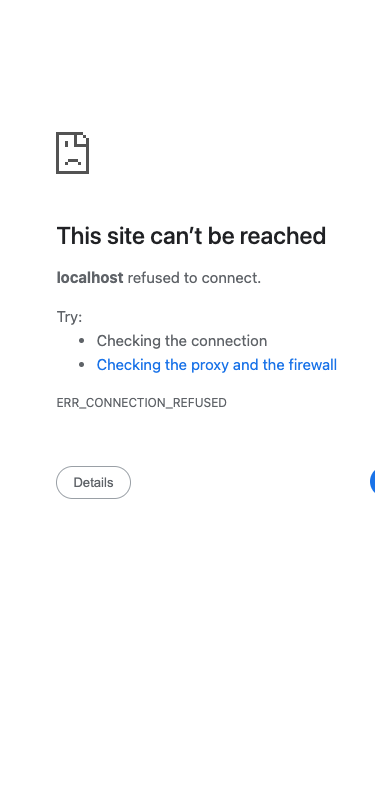

# Hangman Project Visual Documentation

## Project Overview

The Hangman project is a comprehensive 3D spelling prediction game built with TypeScript and Three.js. It features both single-player and multiplayer modes with a full SaaS platform architecture.


## Key Features

### 🎮 Game Modes
- **Single Player**: Progressive difficulty, hints system, particle effects
- **Multiplayer**: Real-time WebSocket sync, turn-based gameplay, tournaments

### 🏗️ SaaS Platform
- User authentication
- Dashboard with stats and leaderboard
- Friends system
- Profile management
- Tournament brackets

### ♿ Accessibility
- Full keyboard navigation
- Screen reader support
- ARIA labels
- Focus management

## Architecture

```
src/
├── main.ts                    # Entry point & game initialization
├── dashboard.ts               # Home page (no tests)
├── word-display.ts           # 3D word display (no tests)
├── letter-tiles.ts            # Interactive letter board
├── hangman-logic.ts           # Core game logic
├── multiplayer/               # Multiplayer features
├── components/                # UI components
└── types.ts                   # TypeScript definitions
```

## Technology Stack
- **Three.js** - 3D graphics and animations
- **Bun** - Runtime and bundler
- **TypeScript** - Type safety
- **WebSocket** - Real-time multiplayer
- **Vitest** - Testing framework
- **jsdom** - DOM testing environment

## Build Status
✅ Build passes (bun run build)
⚠️ TypeScript errors in test files (不影响构建)
🎯 Server running at http://localhost:3000

## 2026-04-14T20:19:18.421Z -- Task `task_1776197270128_vx7uoc` -- `#auth` (mobile 375x812)

**URL:** http://localhost:3000/#auth  **Verdict:** FAILED  **Latency:** 399061ms


> (no analysis)

---

## 2026-04-14T20:19:49.351Z -- Task `task_1776196987466_lkfi5z` -- `#leaderboard` (desktop 1280x720)

**URL:** http://localhost:3000/#leaderboard  **Verdict:** OK  **Latency:** 69610ms


> The UI for route "#leaderboard" is not rendered; this image shows a "Multiplayer Mode" setup screen instead. Visible components include name input, color selectors, "Create New Room", "Join as Player/Spectator", and "Play Single Player" buttons. Error: Incorrect route displayed (not "#leaderboard").

---

## 2026-04-14T20:20:52.845Z -- Task `task_1776197270128_vx7uoc` -- `#dashboard` (desktop 1280x720)

**URL:** http://localhost:3000/#dashboard  **Verdict:** FAILED  **Latency:** 94374ms


> (no analysis)

---

## 2026-04-14T20:23:37.494Z -- Task `task_1776196987466_lkfi5z` -- `#game` (mobile 375x812)

**URL:** http://localhost:3000/#game  **Verdict:** OK  **Latency:** 119405ms


> The UI is rendered. Visible components include "Hangman" title, "Multiplayer Mode" subtitle, name input, color selection circles, "Create New Room" button, "OR" text, room code input, "Join as Player"/"Join as Spectator"/"Play Single Player" buttons, and "Not connected" status. No errors detected.

---

## 2026-04-14T20:23:38.336Z -- Task `task_1776197270128_vx7uoc` -- `#lobby` (desktop 1280x720)

**URL:** http://localhost:3000/#lobby  **Verdict:** OK  **Latency:** 74238ms


> Visible components: Name input, color selector, "Create New Room" button, "OR" divider, room code input, "Join as Player", "Join as Spectator", "Play Single Player" buttons. No rendering errors; all elements display properly.

---

## 2026-04-14T20:24:06.531Z -- Task `task_1776197270128_vx7uoc` -- `#lobby` (mobile 375x812)

**URL:** http://localhost:3000/#lobby  **Verdict:** OK  **Latency:** 28190ms


> The UI is not rendered (shows connection error). Visible components: error icon, “This site can’t be reached” text, “localhost refused to connect” message, troubleshooting steps, error code, and “Details” button. Error: Connection refused (ERR_CONNECTION_REFUSED), so lobby content isn’t displayed.

---

## 2026-04-14T20:24:25.061Z -- Task `task_1776197270128_vx7uoc` -- `#profile` (desktop 1280x720)

**URL:** http://localhost:3000/#profile  **Verdict:** OK  **Latency:** 18478ms


> The UI is not rendered; the browser displays a connection error page instead of the profile route. Visible components include the error message ("This site can’t be reached"), "localhost refused to connect," troubleshooting steps, "ERR_CONNECTION_REFUSED," and "Details"/"Reload" buttons.

---

## 2026-04-14T20:25:55.084Z -- Task `task_1776197270128_vx7uoc` -- `#friends` (desktop 1280x720)

**URL:** http://localhost:3000/#friends  **Verdict:** OK  **Latency:** 30890ms


> Visible components: Error icon, “This site can’t be reached” text, “localhost refused to connect.” message, bullet points (“Checking the connection”, “Checking the proxy and the firewall”), “ERR_CONNECTION_REFUSED” code, “Details” and “Reload” buttons.  
> Errors: Site failed to load (connection refused); no app UI for “#friends” route is rendered.

---

## 2026-04-14T20:26:54.411Z -- Task `task_1776197270128_vx7uoc` -- `#friends` (mobile 375x812)

**URL:** http://localhost:3000/#friends  **Verdict:** OK  **Latency:** 59224ms


> The UI is not rendered as intended; instead, a connection error page appears. Visible components include the error icon, “This site can’t be reached” text, “localhost refused to connect” message, troubleshooting steps, error code (ERR_CONNECTION_REFUSED), and a “Details” button. Error: Connection refused, preventing access to the #friends route content.

---

## 2026-04-14T20:27:58.953Z -- Task `task_1776197270128_vx7uoc` -- `#leaderboard` (desktop 1280x720)

**URL:** http://localhost:3000/#leaderboard  **Verdict:** OK  **Latency:** 64334ms


> The UI is not rendered as expected; instead, a connection error page appears. Visible components include the error message “This site can’t be reached”, “localhost refused to connect”, troubleshooting steps, “ERR_CONNECTION_REFUSED” code, “Details” and “Reload” buttons. Error: Connection failure prevents accessing the leaderboard route.

---

## 2026-04-14T20:28:33.793Z -- Task `task_1776197270128_vx7uoc` -- `#leaderboard` (mobile 375x812)

**URL:** http://localhost:3000/#leaderboard  **Verdict:** OK  **Latency:** 34819ms


> The UI is not rendered as intended; an error page appears. Visible components: error icon, “This site can’t be reached” text, “localhost refused to connect” message, “Try:” section with bullet points, error code, and “Details” button. Error: Connection refused (ERR_CONNECTION_REFUSED) prevents loading the #leaderboard UI.

---

## 2026-04-14T20:29:17.829Z -- Task `task_1776197270128_vx7uoc` -- `#game` (desktop 1280x720)

**URL:** http://localhost:3000/#game  **Verdict:** OK  **Latency:** 44019ms


> No, the UI for route "#game" is not rendered—it displays a "This site can’t be reached" error page. Visible components include the error icon, message text, bullet points ("Checking the connection," "Checking the proxy and the firewall"), "ERR_CONNECTION_REFUSED" code, and "Details"/"Reload" buttons. Error: Connection refused (site unreachable).

---

## 2026-04-14T20:31:41.821Z -- Task `task_1776197544233_3a19sn` -- `/` (mobile 375x812)

**URL:** http://localhost:3000  **Verdict:** OK  **Latency:** 92497ms


> The UI is not rendered; it shows a browser error page. Visible components: error icon, “This site can’t be reached” text, “localhost refused to connect” message, “Try:” section with bullet points, error code, and “Details” button.

---

## 2026-04-14T20:32:26.856Z -- Task `task_1776197544233_3a19sn` -- `#auth` (desktop 1280x720)

**URL:** http://localhost:3000/#auth  **Verdict:** OK  **Latency:** 44994ms


> The UI for route "#auth" is not rendered; instead, a connection error page appears. Visible components include the error icon, "This site can’t be reached" text, "localhost refused to connect" message, troubleshooting steps, "ERR_CONNECTION_REFUSED" code, and "Details"/"Reload" buttons. Error: Connection failure prevents auth UI from loading.

---

## 2026-04-14T20:33:11.915Z -- Task `task_1776197544233_3a19sn` -- `#auth` (mobile 375x812)

**URL:** http://localhost:3000/#auth  **Verdict:** OK  **Latency:** 45049ms


> The UI is not rendered (shows connection error). Visible components: error icon, “This site can’t be reached” text, “localhost refused to connect”, “Try:” section (bullets), “ERR_CONNECTION_REFUSED”, “Details” button. Error: Connection refused, so auth route UI failed to load.

---

## 2026-04-14T20:33:49.745Z -- Task `task_1776197544233_3a19sn` -- `#dashboard` (desktop 1280x720)

**URL:** http://localhost:3000/#dashboard  **Verdict:** OK  **Latency:** 37815ms


> The UI is not rendered; it shows a connection error page. Visible components: error icon, “This site can’t be reached” text, “localhost refused to connect” message, troubleshooting steps, ERR_CONNECTION_REFUSED code, Details button, Reload button. Error: Connection refused (ERR_CONNECTION_REFUSED).

---

## 2026-04-14T20:34:20.555Z -- Task `task_1776197544233_3a19sn` -- `#dashboard` (mobile 375x812)

**URL:** http://localhost:3000/#dashboard  **Verdict:** OK  **Latency:** 30799ms


> The UI for #dashboard is not rendered; an error page displays instead. Visible components: error icon, “This site can’t be reached” text, “localhost refused to connect.” message, “Try:” section (bullet points), “ERR_CONNECTION_REFUSED”, and a “Details” button. Error: Connection refused, preventing dashboard load.

---

## 2026-04-14T20:34:51.801Z -- Task `task_1776197544233_3a19sn` -- `#lobby` (desktop 1280x720)

**URL:** http://localhost:3000/#lobby  **Verdict:** OK  **Latency:** 31233ms


> The UI is not rendered; it shows a connection error page. Visible components: error icon, “This site can’t be reached” text, “localhost refused to connect” message, troubleshooting steps, ERR_CONNECTION_REFUSED code, Details button, Reload button. Error: Connection refused (site unreachable).

---

## 2026-04-14T20:35:32.954Z -- Task `task_1776197544233_3a19sn` -- `#lobby` (mobile 375x812)

**URL:** http://localhost:3000/#lobby  **Verdict:** OK  **Latency:** 41111ms


> The UI is not the intended lobby; it’s an error page. Visible components: error icon, “This site can’t be reached” text, “localhost refused to connect” message, troubleshooting steps, error code, and “Details” button. Error: Connection refused (ERR_CONNECTION_REFUSED), so lobby content isn’t rendered.

---

## 2026-04-14T20:36:00.780Z -- Task `task_1776197544233_3a19sn` -- `#profile` (desktop 1280x720)

**URL:** http://localhost:3000/#profile  **Verdict:** OK  **Latency:** 27725ms


> The UI is not rendered; only an error page with “This site can’t be reached” message, “Details” and “Reload” buttons are visible. Error: ERR_CONNECTION_REFUSED (localhost refused to connect).

---

## 2026-04-14T20:36:29.791Z -- Task `task_1776197544233_3a19sn` -- `#profile` (mobile 375x812)

**URL:** http://localhost:3000/#profile  **Verdict:** OK  **Latency:** 28981ms


> The UI is not rendered; an error page appears instead. Visible components: error message ("This site can’t be reached"), suggestions (checking connection, proxy/firewall), error code (ERR_CONNECTION_REFUSED), and a "Details" button. Error: Connection refused, preventing the profile UI from loading.

---

## 2026-04-14T20:36:57.719Z -- Task `task_1776197544233_3a19sn` -- `#friends` (desktop 1280x720)

**URL:** http://localhost:3000/#friends  **Verdict:** OK  **Latency:** 27852ms


> The UI is not rendered (shows connection error). Visible components: error icon, “This site can’t be reached” text, “localhost refused to connect” message, bullet points, “ERR_CONNECTION_REFUSED”, Details button, Reload button. Error: Connection refused, so app UI failed to load.

---

## 2026-04-14T20:37:11.355Z -- Task `task_1776197544233_3a19sn` -- `#friends` (mobile 375x812)

**URL:** http://localhost:3000/#friends  **Verdict:** OK  **Latency:** 13579ms


> The UI is not rendered as intended; an error page appears. Visible components: error icon, “This site can’t be reached” text, “localhost refused to connect.” message, “Try:” section (with bullet points), “ERR_CONNECTION_REFUSED” code, and “Details” button. Error: Connection failure prevents loading the #friends route UI.

---

## 2026-04-14T20:37:36.149Z -- Task `task_1776197544233_3a19sn` -- `#leaderboard` (desktop 1280x720)

**URL:** http://localhost:3000/#leaderboard  **Verdict:** OK  **Latency:** 24767ms


> No, the UI is not rendered; it shows a connection error page. Visible components: error icon, “This site can’t be reached” text, “localhost refused to connect.” message, bullet points (“Checking the connection”, “Checking the proxy and the firewall”), “ERR_CONNECTION_REFUSED” code, “Details” and “Reload” buttons. Error: Connection refused (ERR_CONNECTION_REFUSED).

---

## 2026-04-14T20:38:12.017Z -- Task `task_1776197544233_3a19sn` -- `#leaderboard` (mobile 375x812)

**URL:** http://localhost:3000/#leaderboard  **Verdict:** OK  **Latency:** 35854ms


> The UI is not rendered as intended; an error page appears instead. Visible components include the error icon, “This site can’t be reached” text, “localhost refused to connect” message, troubleshooting steps, error code, and a “Details” button. Error: The site failed to load, preventing the leaderboard UI from displaying.

---

## 2026-04-14T20:38:36.593Z -- Task `task_1776197544233_3a19sn` -- `#game` (desktop 1280x720)

**URL:** http://localhost:3000/#game  **Verdict:** OK  **Latency:** 24490ms


> No, the UI is not rendered; the browser shows a connection error page. Visible components: error icon, “This site can’t be reached” text, “localhost refused to connect” message, troubleshooting steps, ERR_CONNECTION_REFUSED code, Details button, Reload button. Error: Connection refused prevents loading the game UI.

---

## 2026-04-14T20:38:54.762Z -- Task `task_1776197544233_3a19sn` -- `#game` (mobile 375x812)

**URL:** http://localhost:3000/#game  **Verdict:** OK  **Latency:** 18142ms


> Yes, but it’s an error page. Visible components: error icon, “This site can’t be reached” text, “localhost refused to connect” message, “Try:” bullet points, “ERR_CONNECTION_REFUSED” code, and “Details” button. Error: connection refused, so the intended game UI isn’t loaded.

---

## 2026-04-14T20:44:41.991Z -- Task `task_1776198736620_7ge1ff` -- `/` (desktop 1280x720)

**URL:** http://localhost:3000  **Verdict:** OK  **Latency:** 29087ms


> Visible components: Name input, color selector, "Create New Room" button, "OR" divider, room code input, "Join as Player", "Join as Spectator", "Play Single Player" buttons. No rendering errors observed.

---

## 2026-04-14T20:45:00.075Z -- Task `task_1776198736620_7ge1ff` -- `/` (mobile 375x812)

**URL:** http://localhost:3000  **Verdict:** OK  **Latency:** 18042ms


> Yes, UI is rendered. Visible components: Hangman title, Multiplayer Mode subtitle, name input, color circles, “Create New Room” button, “OR” text, room code input, “Join as Player/Spectator” buttons, “Play Single Player” button, “Not connected” status. No errors.

---

## 2026-04-14T20:45:38.599Z -- Task `task_1776198736620_7ge1ff` -- `#auth` (desktop 1280x720)

**URL:** http://localhost:3000/#auth  **Verdict:** OK  **Latency:** 38419ms


> Visible components: Name input, color selector, "Create New Room" button, "OR" separator, room code input, "Join as Player", "Join as Spectator", "Play Single Player" buttons. No rendering errors detected.

---

## 2026-04-14T20:45:53.533Z -- Task `task_1776198736620_7ge1ff` -- `#auth` (mobile 375x812)

**URL:** http://localhost:3000/#auth  **Verdict:** OK  **Latency:** 14930ms


> Yes, UI is rendered. Visible components: Hangman title, Multiplayer Mode subtitle, name input, color picker, Create New Room button, OR divider, room code input, Join as Player/Join as Spectator/Play Single Player buttons, Not connected status. No errors.

---

## 2026-04-14T20:51:14.247Z -- Task `task_1776198736620_7ge1ff` -- `#dashboard` (desktop 1280x720)

**URL:** http://localhost:3000/#dashboard  **Verdict:** OK  **Latency:** 320693ms


> The UI does not render the expected #dashboard; it shows a multiplayer setup interface. Visible components include name input, color selector, “Create New Room” button, room code input, “Join as Player,” “Join as Spectator,” and “Play Single Player.” Error: Route mismatch (incorrect UI for #dashboard).

---

## 2026-04-15T03:53:31.947Z -- Task `task_1776198736620_7ge1ff` -- `#profile` (mobile 375x812)

**URL:** http://localhost:3000/#profile  **Verdict:** FAILED  **Latency:** 67950ms


> (no analysis)

---

## 2026-04-15T03:55:37.415Z -- Task `task_1776198736620_7ge1ff` -- `#friends` (mobile 375x812)

**URL:** http://localhost:3000/#friends  **Verdict:** FAILED  **Latency:** 80346ms


> (no analysis)

---

## 2026-04-15T16:49:13.811Z -- Task `task_1776227469843_xg7ywl` -- `/` (desktop 1280x720)

**URL:** http://localhost:3000  **Verdict:** OK  **Latency:** 10679ms


> Visible components: Name input ("LuckyTiger12"), color selector, "Create New Room" button, "OR" divider, room code input, "Join as Player"/"Join as Spectator"/"Play Single Player" buttons. No rendering errors detected.

---

## 2026-04-15T16:49:22.925Z -- Task `task_1776227469843_xg7ywl` -- `/` (mobile 375x812)

**URL:** http://localhost:3000  **Verdict:** OK  **Latency:** 9112ms


> Yes, UI is rendered. Visible components: Hangman title, Multiplayer Mode subtitle, name input (SwiftDragon14), color circles, Create New Room button, OR text, room code input, Join as Player/Join as Spectator buttons, Play Single Player button, Not connected status. No errors.

---

## 2026-04-15T16:49:31.320Z -- Task `task_1776227469843_xg7ywl` -- `#auth` (desktop 1280x720)

**URL:** http://localhost:3000/#auth  **Verdict:** OK  **Latency:** 8394ms


> Visible components: Name input, color selector, "Create New Room" button, "OR" divider, room code input, "Join as Player", "Join as Spectator", "Play Single Player" buttons. No rendering errors; all elements display properly.

---

## 2026-04-15T16:49:40.165Z -- Task `task_1776227469843_xg7ywl` -- `#auth` (mobile 375x812)

**URL:** http://localhost:3000/#auth  **Verdict:** OK  **Latency:** 8845ms


> Visible components: Title "Hangman", subtitle "Multiplayer Mode", name input ("BraveLion62"), color picker (7 colors), "Create New Room" button, "OR" divider, room code input, "Join as Player"/"Spectator" buttons, "Play Single Player" button, "Not connected" status. No rendering errors.

---

## 2026-04-15T16:49:50.904Z -- Task `task_1776227469843_xg7ywl` -- `#dashboard` (desktop 1280x720)

**URL:** http://localhost:3000/#dashboard  **Verdict:** OK  **Latency:** 10739ms


> The UI is rendered but may not match the "#dashboard" route (shows multiplayer setup instead). Visible components: name input, color selector, "Create New Room", "Join as Player", "Join as Spectator", "Play Single Player" buttons, room code input. Error: Incorrect route content (expected dashboard, got multiplayer setup).

---

## 2026-04-15T16:50:00.406Z -- Task `task_1776227469843_xg7ywl` -- `#dashboard` (mobile 375x812)

**URL:** http://localhost:3000/#dashboard  **Verdict:** OK  **Latency:** 9501ms


> The UI is not the expected "#dashboard"—it’s a Hangman multiplayer setup screen. Visible components include the title, name/color inputs, buttons (Create New Room, Join as Player/Spectator, Play Single Player), and connection status. Error: Route mismatch (shows Hangman instead of dashboard).

---

## 2026-04-15T16:50:08.292Z -- Task `task_1776227469843_xg7ywl` -- `#lobby` (desktop 1280x720)

**URL:** http://localhost:3000/#lobby  **Verdict:** OK  **Latency:** 7883ms


> Yes, the UI is rendered. Visible components include a name input field, color selection circles, "Create New Room" button, "OR" divider, room code input, "Join as Player", "Join as Spectator", and "Play Single Player" buttons. No errors observed.

---

## 2026-04-15T16:50:17.216Z -- Task `task_1776227469843_xg7ywl` -- `#lobby` (mobile 375x812)

**URL:** http://localhost:3000/#lobby  **Verdict:** OK  **Latency:** 8923ms


> The UI is rendered. Visible components: "Hangman" title, "Multiplayer Mode" subtitle, name input ("MightyTiger99"), color selector, "Create New Room" button, "OR" text, room code input, "Join as Player"/"Join as Spectator"/"Play Single Player" buttons, "Not connected" status. No errors detected.

---

## 2026-04-15T16:50:26.928Z -- Task `task_1776227469843_xg7ywl` -- `#profile` (desktop 1280x720)

**URL:** http://localhost:3000/#profile  **Verdict:** OK  **Latency:** 9711ms


> The UI renders a multiplayer setup screen (not profile). Visible: name input, color circles, “Create New Room”/“Join as Player”/etc. buttons. Error: Content mismatches “#profile” route (shows multiplayer setup instead).

---

## 2026-04-15T16:50:40.740Z -- Task `task_1776227469843_xg7ywl` -- `#profile` (mobile 375x812)

**URL:** http://localhost:3000/#profile  **Verdict:** OK  **Latency:** 13812ms


> Yes, UI is rendered. Visible components: “Hangman” title, “Multiplayer Mode” subtitle, name input, color circles, action buttons, room code field, and connection status; no errors detected.

---

## 2026-04-15T16:50:55.296Z -- Task `task_1776227469843_xg7ywl` -- `#friends` (desktop 1280x720)

**URL:** http://localhost:3000/#friends  **Verdict:** OK  **Latency:** 14555ms


> Got it, let's check the problem. The user is asking about the "#friends" route on desktop 1280x720. First, I need to see if the UI is rendered. Wait, the image provided shows a multiplayer mode screen with name input, color selection, create/join room buttons. But the question is about the "#friends" route—maybe there's a mismatch? Wait, no, maybe the image is for a different route? Wait, the user said "Route '#friends'", but the image shows a multiplayer setup. So first, is the UI rendered? The image has components: name input (CleverPanda74), color circles, Create New Room button, OR text, Room Code input, Join as Player/ Spectator buttons, Play Single Player. But wait, is this the #friends route? Maybe the image is not matching the route. But the user might have a mistake, but we need to answer based on the given info. Wait, the question says "Is the UI rendered?"—yes, because there are visible components. Then list visible components: Name input field, color selection circles, Create New Room button, OR separator, Room Code input field, Join as Player button, Join as Spectator button, Play Single Player button. Errors? Maybe the route doesn't match (since it's showing multiplayer instead of friends), but the user asked for errors. Wait, maybe the image is correct, but the route is wrong? Or maybe the UI is rendered but the content is for a different route. But the user wants concise answers. Let me structure:
> 
> First sentence: Yes, UI is rendered. Visible components include name input, color selector, Create New Room button, OR divider, room code input, join player/spectator buttons, play single player button.
> 
> Second sentence: No obvious rendering errors, but content may not align with "#friends" route (shows multiplayer setup instead).
> 
> Wait, but the user said "any errors"—so maybe the route is incorrect, but that's a content error. Alternatively, maybe the image is for a different route, so the UI is rendered but the content is wrong. But the user wants to know if the UI is rendered (yes) and list components, then errors. Let me make sure:
> 
> Visible components: Your Name input (with value CleverPanda74), Your Color circle options, Create New Room button, OR text, Room Code (4 digits) input, Join as Player button, Join as Spectator button, Play Single Player

---

## 2026-04-15T16:51:06.253Z -- Task `task_1776227469843_xg7ywl` -- `#friends` (mobile 375x812)

**URL:** http://localhost:3000/#friends  **Verdict:** OK  **Latency:** 10957ms


> The UI for route "#friends" is not rendered; the current view shows "Hangman Multiplayer Mode" instead. Visible components include name/color inputs, room creation/joining options, and single-player button—mismatched with the "#friends" route.

---

## 2026-04-15T16:51:16.186Z -- Task `task_1776227469843_xg7ywl` -- `#leaderboard` (desktop 1280x720)

**URL:** http://localhost:3000/#leaderboard  **Verdict:** OK  **Latency:** 9932ms


> The UI shown is not the #leaderboard route; it displays a multiplayer setup screen. Visible components include name/color inputs, create/join room buttons, and single-player option. Error: Incorrect route rendered (not leaderboard).

---

## 2026-04-15T16:51:26.221Z -- Task `task_1776227469843_xg7ywl` -- `#leaderboard` (mobile 375x812)

**URL:** http://localhost:3000/#leaderboard  **Verdict:** OK  **Latency:** 10035ms


> The UI shown is for Hangman Multiplayer Mode, not the #leaderboard route. Visible components include the title, name/color inputs, buttons (Create New Room, Join as Player/Spectator, Play Single Player), and connection status. Error: Incorrect route content (shows multiplayer setup instead of leaderboard).

---

## 2026-04-15T16:51:34.750Z -- Task `task_1776227469843_xg7ywl` -- `#game` (desktop 1280x720)

**URL:** http://localhost:3000/#game  **Verdict:** OK  **Latency:** 8528ms


> Visible components: Name input ("CleverDragon14"), color selector, "Create New Room" button, "OR" text, room code input, "Join as Player", "Join as Spectator", "Play Single Player" buttons. No rendering errors—all elements display properly.

---

## 2026-04-15T16:51:42.811Z -- Task `task_1776227469843_xg7ywl` -- `#game` (mobile 375x812)

**URL:** http://localhost:3000/#game  **Verdict:** OK  **Latency:** 8060ms


> The UI is rendered. Visible components include title, name input, color options, buttons (Create New Room, Join as Player/Spectator, Play Single Player), room code field, and connection status. No errors detected.

---

## 2026-04-15T16:53:17.638Z -- Task `task_1776271844862_6tgkc3` -- `/` (desktop 1280x720)

**URL:** http://localhost:3000  **Verdict:** OK  **Latency:** 8218ms


> Visible components: Name input (QuickPhoenix78), color selector, "Create New Room" button, "OR" divider, room code input, "Join as Player", "Join as Spectator", "Play Single Player" buttons. No rendering errors.

---

## 2026-04-15T16:53:26.548Z -- Task `task_1776271844862_6tgkc3` -- `/` (mobile 375x812)

**URL:** http://localhost:3000  **Verdict:** OK  **Latency:** 8906ms


> Yes, UI is rendered. Visible components: "Hangman" title, "Multiplayer Mode" subtitle, name input ("CleverEagle15"), color selection circles, "Create New Room" button, "OR" separator, room code input, "Join as Player"/"Join as Spectator"/"Play Single Player" buttons, "Not connected" status. No errors detected.

---

## 2026-04-15T16:53:34.740Z -- Task `task_1776271844862_6tgkc3` -- `#auth` (desktop 1280x720)

**URL:** http://localhost:3000/#auth  **Verdict:** OK  **Latency:** 8192ms


> Visible components: Name input, color selector, “Create New Room” button, “OR” divider, room code input, “Join as Player,” “Join as Spectator,” “Play Single Player” buttons. No rendering errors; all elements display properly.

---

## 2026-04-15T16:53:44.161Z -- Task `task_1776271844862_6tgkc3` -- `#auth` (mobile 375x812)

**URL:** http://localhost:3000/#auth  **Verdict:** OK  **Latency:** 9420ms


> Visible components: Title “Hangman”, “Multiplayer Mode” subtitle, name input (“BraveBear45”), color selector, “Create New Room” button, “OR” text, room code input, “Join as Player/Spectator” buttons, “Play Single Player” button, “Not connected” status. No rendering errors—all elements display properly.

---

## 2026-04-15T16:53:53.070Z -- Task `task_1776271844862_6tgkc3` -- `#dashboard` (desktop 1280x720)

**URL:** http://localhost:3000/#dashboard  **Verdict:** OK  **Latency:** 8908ms


> Visible components: Name input (MightyWolf89), color selection circles, "Create New Room" button, "OR" divider, room code input, "Join as Player", "Join as Spectator", "Play Single Player" buttons. No rendering errors.

---

## 2026-04-15T16:54:01.791Z -- Task `task_1776271844862_6tgkc3` -- `#dashboard` (mobile 375x812)

**URL:** http://localhost:3000/#dashboard  **Verdict:** OK  **Latency:** 8720ms


> The UI is rendered. Visible components include the "Hangman" title, name/color inputs, buttons ("Create New Room", "Join as Player", etc.), and "Not connected" status. No errors detected.

---

## 2026-04-15T16:54:09.968Z -- Task `task_1776271844862_6tgkc3` -- `#lobby` (desktop 1280x720)

**URL:** http://localhost:3000/#lobby  **Verdict:** OK  **Latency:** 8173ms


> Visible components: Name input, color selector, "Create New Room" button, "OR" divider, room code input, "Join as Player", "Join as Spectator", "Play Single Player" buttons. No rendering errors; all elements display properly.

---

## 2026-04-15T16:54:18.796Z -- Task `task_1776271844862_6tgkc3` -- `#lobby` (mobile 375x812)

**URL:** http://localhost:3000/#lobby  **Verdict:** OK  **Latency:** 8826ms


> The UI is rendered. Visible components include the "Hangman" title, name/color inputs, color circles, "Create New Room"/"Join as Player"/etc. buttons, and "Not connected" status. No errors detected.

---

## 2026-04-15T16:54:29.117Z -- Task `task_1776271844862_6tgkc3` -- `#profile` (desktop 1280x720)

**URL:** http://localhost:3000/#profile  **Verdict:** OK  **Latency:** 10321ms


> The UI shows a multiplayer setup screen (not profile) with components: name input, color selector, "Create New Room" button, room code input, and join/play buttons. Error: Mismatched route—#profile renders multiplayer setup instead of profile content.

---

## 2026-04-15T16:54:38.947Z -- Task `task_1776271844862_6tgkc3` -- `#profile` (mobile 375x812)

**URL:** http://localhost:3000/#profile  **Verdict:** OK  **Latency:** 9829ms


> The UI is rendered. Visible components: "Hangman" title, "Multiplayer Mode" subtitle, name input field ("HappyDragon23"), color selection circles, "Create New Room" button, "OR" text, room code input, "Join as Player"/"Spectator" buttons, "Play Single Player" button, "Not connected" status. No errors.

---

## 2026-04-15T16:54:53.284Z -- Task `task_1776271844862_6tgkc3` -- `#friends` (desktop 1280x720)

**URL:** http://localhost:3000/#friends  **Verdict:** OK  **Latency:** 14336ms


> Yes, the UI is rendered. Visible components: name input ("CleverLion23"), color selection circles, "Create New Room" button, "OR" divider, room code input, "Join as Player"/"Join as Spectator" buttons, "Play Single Player" button. No obvious rendering errors, though the displayed content (multiplayer setup) may not align with the "#friends" route intent.

---

## 2026-04-15T16:55:01.887Z -- Task `task_1776271844862_6tgkc3` -- `#friends` (mobile 375x812)

**URL:** http://localhost:3000/#friends  **Verdict:** OK  **Latency:** 8601ms


> Visible components: Hangman title, Multiplayer Mode subtitle, name input, color selector, Create New Room button, OR text, room code input, Join as Player/Join as Spectator buttons, Play Single Player button, Not connected status. No rendering errors observed.

---

## 2026-04-15T16:55:12.638Z -- Task `task_1776271844862_6tgkc3` -- `#leaderboard` (desktop 1280x720)

**URL:** http://localhost:3000/#leaderboard  **Verdict:** OK  **Latency:** 10751ms


> The UI for "#leaderboard" is not rendered (current view is multiplayer room setup). Visible components: name input, color circles, "Create New Room", "Join as Player", etc. Error: Route mismatch (shows room setup instead of leaderboard).

---

## 2026-04-15T16:55:26.823Z -- Task `task_1776271844862_6tgkc3` -- `#leaderboard` (mobile 375x812)

**URL:** http://localhost:3000/#leaderboard  **Verdict:** OK  **Latency:** 14184ms


> The UI is not rendering the #leaderboard route; instead, it shows a Hangman multiplayer setup screen. Visible components include the title, name/color inputs, buttons (Create New Room, Join as Player/Spectator, Play Single Player), and status text. Error: Incorrect route displayed (not leaderboard).

---

## 2026-04-15T16:55:34.759Z -- Task `task_1776271844862_6tgkc3` -- `#game` (desktop 1280x720)

**URL:** http://localhost:3000/#game  **Verdict:** OK  **Latency:** 7933ms


> Visible components: Name input, color selector, "Create New Room" button, "OR" divider, room code input, "Join as Player", "Join as Spectator", "Play Single Player" buttons. No rendering errors; all elements display properly.

---

## 2026-04-15T16:55:38.827Z -- Task `task_1776272091801_vwu2q5` -- `/` (desktop 1280x720)

**URL:** http://localhost:3000  **Verdict:** OK  **Latency:** 16034ms


> Yes, the UI is rendered. Visible components include a name input field ("HappyWolf31"), color selection circles, "Create New Room" button, "OR" separator, room code input, "Join as Player", "Join as Spectator", and "Play Single Player" buttons. No errors observed.

---

## 2026-04-15T16:55:47.761Z -- Task `task_1776271844862_6tgkc3` -- `#game` (mobile 375x812)

**URL:** http://localhost:3000/#game  **Verdict:** OK  **Latency:** 13002ms


> Yes, UI is rendered. Visible components: "Hangman" title, "Multiplayer Mode" subtitle, name input ("LuckyPanda31"), color selection circles, "Create New Room" button, "OR" text, room code input, "Join as Player"/"Join as Spectator"/"Play Single Player" buttons, "Not connected" status. No errors observed.

---

## 2026-04-15T16:55:47.840Z -- Task `task_1776272091801_vwu2q5` -- `/` (mobile 375x812)

**URL:** http://localhost:3000  **Verdict:** OK  **Latency:** 9013ms


> The UI is rendered. Visible components include "Hangman" title, "Multiplayer Mode" text, name input, color selection circles, "Create New Room" button, "OR" separator, room code input, "Join as Player"/"Join as Spectator"/"Play Single Player" buttons, and "Not connected" status. No errors detected.

---

## 2026-04-15T16:55:54.625Z -- Task `task_1776272091801_vwu2q5` -- `#auth` (desktop 1280x720)

**URL:** http://localhost:3000/#auth  **Verdict:** OK  **Latency:** 6785ms


> The UI is not rendered; the browser shows a connection error page instead of the auth interface. Visible components: error icon, “This site can’t be reached” text, “localhost refused to connect” message, troubleshooting steps, “ERR_CONNECTION_REFUSED” code, “Details” and “Reload” buttons. Error: Connection refused, preventing auth UI from loading.

---

## 2026-04-15T16:56:01.281Z -- Task `task_1776272091801_vwu2q5` -- `#auth` (mobile 375x812)

**URL:** http://localhost:3000/#auth  **Verdict:** OK  **Latency:** 6655ms


> The UI is not rendered (shows connection error). Visible components: error icon, “This site can’t be reached” text, “localhost refused to connect”, “Try:” section (bullets), “ERR_CONNECTION_REFUSED”, Details button. Error: Connection refused, so auth UI fails to load.

---

## 2026-04-15T16:56:07.425Z -- Task `task_1776272091801_vwu2q5` -- `#dashboard` (desktop 1280x720)

**URL:** http://localhost:3000/#dashboard  **Verdict:** OK  **Latency:** 6143ms


> The UI is not rendered; it shows a connection error page. Visible components: error icon, “This site can’t be reached” text, “localhost refused to connect” message, troubleshooting steps, ERR_CONNECTION_REFUSED code, Details and Reload buttons. Error: Connection refused.

---

## 2026-04-15T16:56:14.081Z -- Task `task_1776272091801_vwu2q5` -- `#dashboard` (mobile 375x812)

**URL:** http://localhost:3000/#dashboard  **Verdict:** OK  **Latency:** 6656ms


> The UI for "#dashboard" is not rendered; instead, an error page appears. Visible components include the error icon, "This site can’t be reached" text, "localhost refused to connect" message, troubleshooting steps, and a "Details" button. Error: Connection refused (ERR_CONNECTION_REFUSED).

---

## 2026-04-15T16:56:20.225Z -- Task `task_1776272091801_vwu2q5` -- `#lobby` (desktop 1280x720)

**URL:** http://localhost:3000/#lobby  **Verdict:** OK  **Latency:** 6143ms


> The UI is not rendered as intended; it shows a connection error page instead. Visible components: error icon, "This site can’t be reached" text, "localhost refused to connect" message, troubleshooting steps, ERR_CONNECTION_REFUSED code, Details button, Reload button. Error: Connection refused (ERR_CONNECTION_REFUSED).

---

## 2026-04-15T16:56:27.086Z -- Task `task_1776272091801_vwu2q5` -- `#lobby` (mobile 375x812)

**URL:** http://localhost:3000/#lobby  **Verdict:** OK  **Latency:** 6861ms


> The UI is not rendered; it shows a connection error page instead of the lobby interface. Visible components include the error message “This site can’t be reached”, “localhost refused to connect” text, troubleshooting steps, “ERR_CONNECTION_REFUSED” code, and a “Details” button. Error: The lobby UI failed to load, displaying a connection refusal error.

---

## 2026-04-15T16:56:34.051Z -- Task `task_1776272091801_vwu2q5` -- `#profile` (desktop 1280x720)

**URL:** http://localhost:3000/#profile  **Verdict:** OK  **Latency:** 6963ms


> The UI for route "#profile" is not rendered; instead, an error page displays. Visible components: error icon, "This site can’t be reached" text, "localhost refused to connect" message, troubleshooting steps, ERR_CONNECTION_REFUSED code, Details button, Reload button. Error: Connection refused (ERR_CONNECTION_REFUSED).

---

## 2026-04-15T16:56:41.524Z -- Task `task_1776272091801_vwu2q5` -- `#profile` (mobile 375x812)

**URL:** http://localhost:3000/#profile  **Verdict:** OK  **Latency:** 7473ms


> The UI is not rendered; an error page appears instead. Visible components: error icon, “This site can’t be reached” text, “localhost refused to connect” message, troubleshooting steps, ERR_CONNECTION_REFUSED code, and a “Details” button. Error: Connection refused, preventing profile page loading.

---

## 2026-04-15T16:56:47.977Z -- Task `task_1776272091801_vwu2q5` -- `#friends` (desktop 1280x720)

**URL:** http://localhost:3000/#friends  **Verdict:** OK  **Latency:** 6452ms


> The UI is not rendered as intended; instead, a connection error page appears. Visible components include the error icon, “This site can’t be reached” text, bullet points, and “Details/Reload” buttons. Error: Site connection refused (ERR_CONNECTION_REFUSED), preventing the #friends route UI from loading.

---

## 2026-04-15T16:56:56.375Z -- Task `task_1776272091801_vwu2q5` -- `#friends` (mobile 375x812)

**URL:** http://localhost:3000/#friends  **Verdict:** OK  **Latency:** 8397ms


> The UI is not rendered; an error page appears instead. Visible components: error message ("This site can’t be reached"), suggestions (checking connection, proxy/firewall), ERR_CONNECTION_REFUSED, and a Details button. Error: Connection refused by localhost, preventing the intended friends route UI from loading.

---

## 2026-04-15T16:57:03.031Z -- Task `task_1776272091801_vwu2q5` -- `#leaderboard` (desktop 1280x720)

**URL:** http://localhost:3000/#leaderboard  **Verdict:** OK  **Latency:** 6655ms


> The UI is not rendered; the page shows a connection error instead of the leaderboard. Visible components: error icon, “This site can’t be reached” text, “localhost refused to connect” message, troubleshooting steps, ERR_CONNECTION_REFUSED code, Details and Reload buttons. Error: Connection refused (ERR_CONNECTION_REFUSED).

---

## 2026-04-15T16:57:09.585Z -- Task `task_1776272091801_vwu2q5` -- `#leaderboard` (mobile 375x812)

**URL:** http://localhost:3000/#leaderboard  **Verdict:** OK  **Latency:** 6554ms


> The UI is not rendered as intended; an error page appears instead. Visible components include the error message “This site can’t be reached”, suggestions (“Checking the connection”, “Checking the proxy and the firewall”), the error code “ERR_CONNECTION_REFUSED”, and a “Details” button. The error indicates a connection issue preventing the leaderboard from loading.

---

## 2026-04-15T16:57:16.446Z -- Task `task_1776272091801_vwu2q5` -- `#game` (desktop 1280x720)

**URL:** http://localhost:3000/#game  **Verdict:** OK  **Latency:** 6860ms


> The UI is not the intended game interface; it shows a connection error page. Visible components: error icon, “This site can’t be reached” text, “localhost refused to connect” message, bullet points (“Checking the connection,” “Checking the proxy and the firewall”), “ERR_CONNECTION_REFUSED” code, “Details” and “Reload” buttons. Error: Connection refused by localhost.

---

## 2026-04-15T16:57:23.066Z -- Task `task_1776272091801_vwu2q5` -- `#game` (mobile 375x812)

**URL:** http://localhost:3000/#game  **Verdict:** OK  **Latency:** 6619ms


> The UI is not rendered (shows browser error). Visible components: error icon, “This site can’t be reached” text, “localhost refused to connect” subtext, bullet points (“Checking the connection”, “Checking the proxy and the firewall”), “Details” button. Error: ERR_CONNECTION_REFUSED (site unreachable).

---

## 2026-04-15T16:57:41.228Z -- Task `task_1776272221793_qqtwvd` -- `/` (desktop 1280x720)

**URL:** http://localhost:3000  **Verdict:** OK  **Latency:** 7901ms


> Visible components: Name input, color selectors, “Create New Room” button, “OR” text, room code input, “Join as Player”, “Join as Spectator”, “Play Single Player” buttons. No rendering errors observed.

---

## 2026-04-15T16:57:49.831Z -- Task `task_1776272221793_qqtwvd` -- `/` (mobile 375x812)

**URL:** http://localhost:3000  **Verdict:** OK  **Latency:** 8601ms


> The UI is rendered. Visible components include "Hangman" title, "Multiplayer Mode" subtitle, name input ("BraveBear5"), color selection circles, "Create New Room" button, "OR" text, room code input, "Join as Player"/"Join as Spectator"/"Play Single Player" buttons, and "Not connected" status. No errors detected.

---

## 2026-04-15T16:57:58.381Z -- Task `task_1776272221793_qqtwvd` -- `#auth` (desktop 1280x720)

**URL:** http://localhost:3000/#auth  **Verdict:** OK  **Latency:** 8549ms


> The UI is rendered. Visible components include a name input field, color selection circles, “Create New Room” button, “OR” separator, room code input, “Join as Player,” “Join as Spectator,” and “Play Single Player” buttons. No errors observed.

---

## 2026-04-15T16:58:07.033Z -- Task `task_1776272221793_qqtwvd` -- `#auth` (mobile 375x812)

**URL:** http://localhost:3000/#auth  **Verdict:** OK  **Latency:** 8651ms


> Yes, UI is rendered. Visible components: Hangman title, Multiplayer Mode subtitle, name input, color circles, Create New Room button, OR text, room code input, Join as Player/Join as Spectator/Play Single Player buttons, Not connected status. No errors.

---

## 2026-04-15T16:58:17.892Z -- Task `task_1776272221793_qqtwvd` -- `#dashboard` (desktop 1280x720)

**URL:** http://localhost:3000/#dashboard  **Verdict:** OK  **Latency:** 10859ms


> The UI is rendered. Visible components include name input, color selector, “Create New Room” button, room code input, “Join as Player,” “Join as Spectator,” and “Play Single Player” buttons. No errors observed.

---

## 2026-04-15T16:58:27.096Z -- Task `task_1776272221793_qqtwvd` -- `#dashboard` (mobile 375x812)

**URL:** http://localhost:3000/#dashboard  **Verdict:** OK  **Latency:** 9203ms


> Visible components: Title "Hangman", subtitle "Multiplayer Mode", name input ("SwiftDragon88"), color selector (7 colors), "Create New Room" button, "OR" text, room code input, "Join as Player"/"Join as Spectator"/"Play Single Player" buttons, "Not connected" status. No rendering errors.

---

## 2026-04-15T16:58:36.062Z -- Task `task_1776272221793_qqtwvd` -- `#lobby` (desktop 1280x720)

**URL:** http://localhost:3000/#lobby  **Verdict:** OK  **Latency:** 8966ms


> Visible components: Name input, color selector, "Create New Room" button, "OR" text, room code input, "Join as Player", "Join as Spectator", "Play Single Player" buttons. No rendering errors; all elements display properly.

---

## 2026-04-15T16:58:45.075Z -- Task `task_1776272221793_qqtwvd` -- `#lobby` (mobile 375x812)

**URL:** http://localhost:3000/#lobby  **Verdict:** OK  **Latency:** 9012ms


> Yes, UI is rendered. Visible components: Title “Hangman”, “Multiplayer Mode” subtitle, name input (“MightyLion17”), color circles, “Create New Room” button, “OR” text, room code input, “Join as Player/Spectator” buttons, “Play Single Player” button, “Not connected” status. No errors.

---

## 2026-04-15T16:58:55.109Z -- Task `task_1776272221793_qqtwvd` -- `#profile` (desktop 1280x720)

**URL:** http://localhost:3000/#profile  **Verdict:** OK  **Latency:** 10033ms


> The UI for route "#profile" is not rendered; the current view shows a multiplayer setup screen. Visible components include name input, color selectors, "Create New Room" button, room code input, and join buttons. Error: Incorrect route displayed (not #profile).

---

## 2026-04-15T16:59:07.396Z -- Task `task_1776272221793_qqtwvd` -- `#profile` (mobile 375x812)

**URL:** http://localhost:3000/#profile  **Verdict:** OK  **Latency:** 12286ms


> Yes, UI is rendered. Visible components: Title “Hangman”, “Multiplayer Mode” subtitle, name input, color options, “Create New Room”/“Join as Player”/etc. buttons, room code input, “Not connected” status. Error: Route “#profile” displays multiplayer setup instead of profile content.

---

## 2026-04-15T16:59:19.938Z -- Task `task_1776272221793_qqtwvd` -- `#friends` (desktop 1280x720)

**URL:** http://localhost:3000/#friends  **Verdict:** OK  **Latency:** 12542ms


> Yes, UI is rendered. Visible components: Name input, color selector, “Create New Room” button, Room Code input, “Join as Player/Spectator” buttons, “Play Single Player” button. Error: Route “#friends” mismatches displayed multiplayer setup.

---

## 2026-04-15T16:59:28.388Z -- Task `task_1776272221793_qqtwvd` -- `#friends` (mobile 375x812)

**URL:** http://localhost:3000/#friends  **Verdict:** OK  **Latency:** 8450ms


> Visible components: Title “Hangman”, “Multiplayer Mode” subtitle, name input (SwiftWolf55), color selector, “Create New Room” button, “OR” text, room code input, “Join as Player/Spectator” buttons, “Play Single Player” button, “Not connected” status. No rendering errors—all elements display properly.

---

## 2026-04-15T16:59:39.450Z -- Task `task_1776272221793_qqtwvd` -- `#leaderboard` (desktop 1280x720)

**URL:** http://localhost:3000/#leaderboard  **Verdict:** OK  **Latency:** 11061ms


> No, the UI for "#leaderboard" is not rendered; the current view shows a multiplayer setup page. Visible components include name/color inputs, "Create New Room", room code input, and join buttons. Error: Incorrect page displayed (not leaderboard).

---

## 2026-04-15T16:59:49.749Z -- Task `task_1776272221793_qqtwvd` -- `#leaderboard` (mobile 375x812)

**URL:** http://localhost:3000/#leaderboard  **Verdict:** OK  **Latency:** 10298ms


> The UI for the "#leaderboard" route is not rendered in the provided image (which shows the "Hangman Multiplayer Mode" setup screen instead). Visible components are those of the multiplayer setup (name input, color selector, room creation/join options) — no leaderboard-specific elements are present.

---

## 2026-04-15T16:59:57.470Z -- Task `task_1776272221793_qqtwvd` -- `#game` (desktop 1280x720)

**URL:** http://localhost:3000/#game  **Verdict:** OK  **Latency:** 7721ms


> Visible components: Name input, color selector, "Create New Room" button, "OR" divider, room code input, "Join as Player", "Join as Spectator", "Play Single Player" buttons. No rendering errors detected.

---

## 2026-04-15T17:00:06.277Z -- Task `task_1776272221793_qqtwvd` -- `#game` (mobile 375x812)

**URL:** http://localhost:3000/#game  **Verdict:** OK  **Latency:** 8807ms


> Yes, UI is rendered. Visible components: Hangman title, Multiplayer Mode subtitle, name input (QuickDragon62), color circles, Create New Room button, OR text, room code input, Join as Player/Join as Spectator/Play Single Player buttons, Not connected status. No errors.

---

## 2026-04-15T17:00:58.196Z -- Task `task_1776272351522_11jn6n` -- `/` (desktop 1280x720)

**URL:** http://localhost:3000  **Verdict:** OK  **Latency:** 8251ms


> Yes, UI is rendered. Visible components: name input, color selector, "Create New Room" button, "OR" text, room code input, "Join as Player", "Join as Spectator", "Play Single Player" buttons. No errors observed.

---

## 2026-04-15T17:01:07.103Z -- Task `task_1776272351522_11jn6n` -- `/` (mobile 375x812)

**URL:** http://localhost:3000  **Verdict:** OK  **Latency:** 8906ms


> Visible components: Title "Hangman", "Multiplayer Mode" subtitle, name input ("HappyEagle25"), color selection circles, "Create New Room" button, "OR" text, room code input, "Join as Player"/"Join as Spectator"/"Play Single Player" buttons, "Not connected" status. No rendering errors—all elements display properly.

---

## 2026-04-15T17:01:15.808Z -- Task `task_1776272351522_11jn6n` -- `#auth` (desktop 1280x720)

**URL:** http://localhost:3000/#auth  **Verdict:** OK  **Latency:** 8705ms


> Visible components: Name input (BraveEagle81), color selector, “Create New Room” button, “OR” divider, room code input, “Join as Player”, “Join as Spectator”, “Play Single Player” buttons. No rendering errors observed.

---

## 2026-04-15T17:01:24.717Z -- Task `task_1776272351522_11jn6n` -- `#auth` (mobile 375x812)

**URL:** http://localhost:3000/#auth  **Verdict:** OK  **Latency:** 8908ms


> The UI is rendered. Visible components include the title “Hangman”, “Multiplayer Mode” subtitle, name input field, color selection circles, “Create New Room”/“Join as Player”/“Join as Spectator”/“Play Single Player” buttons, room code input, and “Not connected” status. No errors detected.

---

## 2026-04-15T17:01:33.728Z -- Task `task_1776272351522_11jn6n` -- `#dashboard` (desktop 1280x720)

**URL:** http://localhost:3000/#dashboard  **Verdict:** OK  **Latency:** 9010ms


> The UI for "#dashboard" is not rendered; the current view shows a multiplayer setup page. Visible components include name input, color selector, "Create New Room" button, room code field, and join/spectate/single player options. Error: Incorrect route rendering (not dashboard).

---

## 2026-04-15T17:01:43.911Z -- Task `task_1776272351522_11jn6n` -- `#dashboard` (mobile 375x812)

**URL:** http://localhost:3000/#dashboard  **Verdict:** OK  **Latency:** 10182ms


> The UI is rendered. Visible components: "Hangman" title, "Multiplayer Mode" subtitle, name input, color circles, "Create New Room" button, "OR" text, room code input, "Join as Player"/"Spectator"/"Single Player" buttons, "Not connected" status. Error: Route may not align (shows multiplayer setup, not dashboard).

---

## 2026-04-15T17:01:51.543Z -- Task `task_1776272351522_11jn6n` -- `#lobby` (desktop 1280x720)

**URL:** http://localhost:3000/#lobby  **Verdict:** OK  **Latency:** 7631ms


> The UI is rendered. Visible components: name input (CleverTiger84), color selector, “Create New Room” button, room code input, “Join as Player”, “Join as Spectator”, “Play Single Player” buttons. No errors observed.

---

## 2026-04-15T17:01:59.224Z -- Task `task_1776272351522_11jn6n` -- `#lobby` (mobile 375x812)

**URL:** http://localhost:3000/#lobby  **Verdict:** OK  **Latency:** 7680ms


> Yes, UI is rendered. Visible components: "Hangman" title, "Multiplayer Mode" subtitle, name input ("BraveLion87"), color selection circles, "Create New Room" button, "OR" text, room code input, "Join as Player"/"Join as Spectator"/"Play Single Player" buttons, "Not connected" status. No errors observed.

---

## 2026-04-15T17:02:14.866Z -- Task `task_1776272351522_11jn6n` -- `#profile` (desktop 1280x720)

**URL:** http://localhost:3000/#profile  **Verdict:** OK  **Latency:** 15642ms


> Yes, UI is rendered. Visible components: name input ("MightyBear42"), color selection circles, "Create New Room" button, "OR" separator, room code input, "Join as

---

## 2026-04-15T17:02:23.597Z -- Task `task_1776272351522_11jn6n` -- `#profile` (mobile 375x812)

**URL:** http://localhost:3000/#profile  **Verdict:** OK  **Latency:** 8731ms


> Visible components: Title ("Hangman"), subtitle ("Multiplayer Mode"), name input ("BravePhoenix31"), color selector, "Create New Room" button, "OR" text, room code input, "Join as Player"/"Spectator" buttons, "Play Single Player" button, "Not connected" status. No rendering errors—all elements display properly.

---

## 2026-04-15T17:02:37.930Z -- Task `task_1776272351522_11jn6n` -- `#friends` (desktop 1280x720)

**URL:** http://localhost:3000/#friends  **Verdict:** OK  **Latency:** 14332ms


> UI is rendered. Visible components: Name input field, color selection circles, “Create New Room” button, “OR” separator, room code input, “Join as Player,” “Join as Spectator,” and “Play Single Player” buttons. Error: Route likely mismatched (expected #friends but displays multiplayer setup).

---

## 2026-04-15T17:02:48.067Z -- Task `task_1776272351522_11jn6n` -- `#friends` (mobile 375x812)

**URL:** http://localhost:3000/#friends  **Verdict:** OK  **Latency:** 10136ms


> The UI is rendered. Visible components include title “Hangman”, “Multiplayer Mode” subtitle, name/color inputs, buttons (“Create New Room”, “Join as Player”, etc.), and status “Not connected”. Error: Content does not align with “#friends” route (shows multiplayer setup instead).

---

## 2026-04-15T17:02:59.279Z -- Task `task_1776272351522_11jn6n` -- `#leaderboard` (desktop 1280x720)

**URL:** http://localhost:3000/#leaderboard  **Verdict:** OK  **Latency:** 11212ms


> No, the UI for "#leaderboard" is not rendered. Visible components are from a multiplayer setup route (name input, color selectors, "Create New Room"/"Join" buttons), indicating a routing error.

---

## 2026-04-15T17:03:09.438Z -- Task `task_1776272351522_11jn6n` -- `#leaderboard` (mobile 375x812)

**URL:** http://localhost:3000/#leaderboard  **Verdict:** OK  **Latency:** 10159ms


> The UI rendered is not the "#leaderboard" route (shows Hangman multiplayer setup instead). Visible components: "Hangman" title, "Multiplayer Mode" subtitle, name input ("LuckyWolf94"), color selector, "Create New Room" button, "OR" text, room code input, "Join as Player"/"Join as Spectator"/"Play Single Player" buttons, "Not connected" status. Error: Mismatched route (expected leaderboard, got multiplayer setup).

---

## 2026-04-15T17:03:20.632Z -- Task `task_1776272351522_11jn6n` -- `#game` (desktop 1280x720)

**URL:** http://localhost:3000/#game  **Verdict:** OK  **Latency:** 11194ms


> Visible components: Name input, color selector, "Create New Room" button, "OR" divider, room code input, "Join as Player", "Join as Spectator", "Play Single Player" buttons. No rendering errors; all elements display properly.

---

## 2026-04-15T17:03:35.925Z -- Task `task_1776272547605_rdc1sj` -- `/` (desktop 1280x720)

**URL:** http://localhost:3000  **Verdict:** OK  **Latency:** 11238ms


> Visible components: Name input (SwiftBear40), color selector, "Create New Room" button, "OR" text, room code input, "Join as Player", "Join as Spectator", "Play Single Player" buttons. No rendering errors detected.

---

## 2026-04-15T17:03:40.935Z -- Task `task_1776272351522_11jn6n` -- `#game` (mobile 375x812)

**URL:** http://localhost:3000/#game  **Verdict:** OK  **Latency:** 20302ms


> Yes, UI is rendered. Visible components: Hangman title, multiplayer mode text, name input, color circles, Create New Room button, OR text, room code input, Join as Player/ Spectator buttons, Play Single Player button, Not connected status. No errors.

---

## 2026-04-15T17:03:45.650Z -- Task `task_1776272547605_rdc1sj` -- `/` (mobile 375x812)

**URL:** http://localhost:3000  **Verdict:** OK  **Latency:** 9724ms


> Yes, UI is rendered. Visible components: "Hangman" title, "Multiplayer Mode" subtitle, name input (QuickEagle47), color selection circles, "Create New Room" button, "OR" text, room code input, "Join as Player"/"Spectator" buttons, "Play Single Player" button, "Not connected" status. No errors.

---

## 2026-04-15T17:03:52.008Z -- Task `task_1776272547605_rdc1sj` -- `#auth` (desktop 1280x720)

**URL:** http://localhost:3000/#auth  **Verdict:** OK  **Latency:** 6357ms


> The UI for route "#auth" is not rendered; instead, a connection error page is displayed. Visible components include the error message "This site can’t be reached", "Details" and "Reload" buttons, with an error of "ERR_CONNECTION_REFUSED".

---

## 2026-04-15T17:03:58.724Z -- Task `task_1776272547605_rdc1sj` -- `#auth` (mobile 375x812)

**URL:** http://localhost:3000/#auth  **Verdict:** OK  **Latency:** 6716ms


> Visible components: Error icon, “This site can’t be reached” text, “localhost refused to connect” message, “Try:” section with bullet points, “ERR_CONNECTION_REFUSED” code, “Details” button. Errors: Connection refused (site not reachable, auth UI not rendered).

---

## 2026-04-15T17:04:05.174Z -- Task `task_1776272547605_rdc1sj` -- `#dashboard` (desktop 1280x720)

**URL:** http://localhost:3000/#dashboard  **Verdict:** OK  **Latency:** 6450ms


> No, the UI is not rendered; it shows a connection error page. Visible components: error icon, “This site can’t be reached” text, “localhost refused to connect” message, troubleshooting steps, ERR_CONNECTION_REFUSED code, Details and Reload buttons. Error: Connection refused (site unreachable).

---

## 2026-04-15T17:04:11.798Z -- Task `task_1776272547605_rdc1sj` -- `#dashboard` (mobile 375x812)

**URL:** http://localhost:3000/#dashboard  **Verdict:** OK  **Latency:** 6623ms


> No, the UI for #dashboard is not rendered; the screen shows a connection error. Visible components: error icon, “This site can’t be reached” text, “localhost refused to connect” message, troubleshooting steps, and “Details” button. Error: ERR_CONNECTION_REFUSED (site unreachable).

---

## 2026-04-15T17:04:18.487Z -- Task `task_1776272547605_rdc1sj` -- `#lobby` (desktop 1280x720)

**URL:** http://localhost:3000/#lobby  **Verdict:** OK  **Latency:** 6689ms


> The UI for "#lobby" is not rendered; the browser displays a connection error page. Visible components: error icon, "This site can’t be reached" text, "localhost refused to connect" message, troubleshooting steps, "ERR_CONNECTION_REFUSED" code, "Details" and "Reload" buttons. Error: Connection refused by localhost.

---

## 2026-04-15T17:04:25.000Z -- Task `task_1776272547605_rdc1sj` -- `#lobby` (mobile 375x812)

**URL:** http://localhost:3000/#lobby  **Verdict:** OK  **Latency:** 6513ms


> The UI is not rendered as intended; an error page displays instead. Visible components include the error message, troubleshooting steps, error code, and a “Details” button. Error: Connection refused (ERR_CONNECTION_REFUSED) prevents loading the lobby interface.

---

## 2026-04-15T17:04:31.833Z -- Task `task_1776272547605_rdc1sj` -- `#profile` (desktop 1280x720)

**URL:** http://localhost:3000/#profile  **Verdict:** OK  **Latency:** 6832ms


> The UI for the #profile route is not rendered; instead, a connection error page is displayed. Visible components include the error icon, “This site can’t be reached” text, “localhost refused to connect” message, troubleshooting steps, ERR_CONNECTION_REFUSED code, “Details” and “Reload” buttons. Error: Connection refused (ERR_CONNECTION_REFUSED).

---

## 2026-04-15T17:04:37.942Z -- Task `task_1776272547605_rdc1sj` -- `#profile` (mobile 375x812)

**URL:** http://localhost:3000/#profile  **Verdict:** OK  **Latency:** 6109ms


> The UI is not rendered; an error page appears instead. Visible components: error message ("This site can’t be reached"), connection refusal details, troubleshooting steps, error code (ERR_CONNECTION_REFUSED), and a "Details" button. Error: Connection to localhost failed, preventing the profile UI from loading.

---

## 2026-04-15T17:04:44.600Z -- Task `task_1776272547605_rdc1sj` -- `#friends` (desktop 1280x720)

**URL:** http://localhost:3000/#friends  **Verdict:** OK  **Latency:** 6657ms


> The UI is not rendered as intended; instead, a connection error page appears. Visible components: error icon, “This site can’t be reached” text, “localhost refused to connect” message, troubleshooting steps, ERR_CONNECTION_REFUSED code, “Details” and “Reload” buttons. Error: Connection refused (site unreachable).

---

## 2026-04-15T17:04:52.585Z -- Task `task_1776272547605_rdc1sj` -- `#friends` (mobile 375x812)

**URL:** http://localhost:3000/#friends  **Verdict:** OK  **Latency:** 7984ms


> The UI is not rendered as intended; an error page displays. Visible components: error icon, “This site can’t be reached” text, connection details, bullet points, “ERR_CONNECTION_REFUSED”, and “Details” button. Error: Connection refused (site unreachable).

---

## 2026-04-15T17:04:58.729Z -- Task `task_1776272547605_rdc1sj` -- `#leaderboard` (desktop 1280x720)

**URL:** http://localhost:3000/#leaderboard  **Verdict:** OK  **Latency:** 6144ms


> The UI is not rendered; only an error page with “This site can’t be reached” message, “Details” and “Reload” buttons is visible. Error: ERR_CONNECTION_REFUSED (localhost refused to connect).

---

## 2026-04-15T17:05:06.307Z -- Task `task_1776272547605_rdc1sj` -- `#leaderboard` (mobile 375x812)

**URL:** http://localhost:3000/#leaderboard  **Verdict:** OK  **Latency:** 7577ms


> The UI is not rendered as intended; it shows a connection error instead of the leaderboard. Visible components include the error icon, “This site can’t be reached” text, “localhost refused to connect” message, troubleshooting steps, and a “Details” button. Error: Site failed to load due to connection refusal.

---

## 2026-04-15T17:05:12.861Z -- Task `task_1776272547605_rdc1sj` -- `#game` (desktop 1280x720)

**URL:** http://localhost:3000/#game  **Verdict:** OK  **Latency:** 6553ms


> No, the UI is not rendered (shows connection error). Visible components: error icon, “This site can’t be reached” text, bullet points, “ERR_CONNECTION_REFUSED”, Details/Reload buttons. Error: localhost connection refused, preventing game UI load.

---

## 2026-04-15T17:05:19.592Z -- Task `task_1776272547605_rdc1sj` -- `#game` (mobile 375x812)

**URL:** http://localhost:3000/#game  **Verdict:** OK  **Latency:** 6731ms


> Yes, the UI is rendered (error page). Visible components: error icon, “This site can’t be reached” title, “localhost refused to connect” message, “Try:” section with bullet points, “ERR_CONNECTION_REFUSED” code, and “Details” button. Error: Connection refused, not the expected game interface.

---

## 2026-04-15T17:06:10.102Z -- Task `task_1776272698116_td3sl6` -- `/` (desktop 1280x720)

**URL:** http://localhost:3000  **Verdict:** OK  **Latency:** 8259ms


> Yes, UI is rendered. Visible components: name input ("QuickTiger64"), color selector (8 circles), "Create New Room" button, "OR" text, room code input, "Join as Player", "Join as Spectator", "Play Single Player" buttons. No errors observed.

---

## 2026-04-15T17:06:19.830Z -- Task `task_1776272698116_td3sl6` -- `/` (mobile 375x812)

**URL:** http://localhost:3000  **Verdict:** OK  **Latency:** 9727ms


> Yes, UI is rendered. Visible components: Hangman title, multiplayer mode label, name input, color options, Create New Room button, OR divider, room code input, Join as Player/Join as Spectator buttons, Play Single Player button, Not connected status. No errors.

---

## 2026-04-15T17:06:28.841Z -- Task `task_1776272698116_td3sl6` -- `#auth` (desktop 1280x720)

**URL:** http://localhost:3000/#auth  **Verdict:** OK  **Latency:** 9010ms


> Yes, the UI is rendered. Visible components include a name input field, color selection circles, "Create New Room" button, "OR" separator, room code input, "Join as Player", "Join as Spectator", and "Play Single Player" buttons. No rendering errors observed.

---

## 2026-04-15T17:06:38.467Z -- Task `task_1776272698116_td3sl6` -- `#auth` (mobile 375x812)

**URL:** http://localhost:3000/#auth  **Verdict:** OK  **Latency:** 9626ms


> Yes, UI is rendered. Visible components: Title ("Hangman", "Multiplayer Mode"), name input, color selector, "Create New Room" button, "OR" text, room code input, "Join as Player"/"Spectator" buttons, "Play Single Player" button, "Not connected" status. No errors detected.

---

## 2026-04-15T17:06:52.160Z -- Task `task_1776272698116_td3sl6` -- `#dashboard` (desktop 1280x720)

**URL:** http://localhost:3000/#dashboard  **Verdict:** OK  **Latency:** 13692ms


> The UI is rendered. Visible components: name input field, color selector (8 colors), “Create New Room,” “Join as Player,” “Join as Spectator,” “Play Single Player” buttons, and room code input. Error: Route mismatch (shows multiplayer lobby, not dashboard).

---

## 2026-04-15T17:07:03.862Z -- Task `task_1776272698116_td3sl6` -- `#dashboard` (mobile 375x812)

**URL:** http://localhost:3000/#dashboard  **Verdict:** OK  **Latency:** 11702ms


> The UI is rendered. Visible components: "Hangman" title, "Multiplayer Mode" subtitle, name input ("LuckyLion4"), color options, "Create New Room" button, "OR" text, room code input, "Join as Player"/"Spectator" buttons, "Play Single Player" button, "Not connected" status. Error: Route mismatch (shows Hangman, not dashboard).

---

## 2026-04-15T17:07:12.975Z -- Task `task_1776272698116_td3sl6` -- `#lobby` (desktop 1280x720)

**URL:** http://localhost:3000/#lobby  **Verdict:** OK  **Latency:** 9112ms


> Visible components: Name input, color selector, "Create New Room" button, "OR" divider, room code input, "Join as Player", "Join as Spectator", "Play Single Player" buttons. No rendering errors detected.

---

## 2026-04-15T17:07:22.192Z -- Task `task_1776272698116_td3sl6` -- `#lobby` (mobile 375x812)

**URL:** http://localhost:3000/#lobby  **Verdict:** OK  **Latency:** 9216ms


> The UI is rendered. Visible components include the title "Hangman", "Multiplayer Mode" subtitle, name input (with "HappyWolf94"), color selector, "Create New Room" button, "OR" separator, room code input, "Join as Player"/"Spectator" buttons, "Play Single Player" button, and "Not connected" status. No errors detected.

---

## 2026-04-15T17:07:33.250Z -- Task `task_1776272698116_td3sl6` -- `#profile` (desktop 1280x720)

**URL:** http://localhost:3000/#profile  **Verdict:** OK  **Latency:** 11058ms


> The UI is rendered but does not match the "#profile" route (displays multiplayer setup instead). Visible components: name input, color selector, "Create New Room", "Join as Player", "Join as Spectator", "Play Single Player" buttons, and room code input. Error: Incorrect route rendering (not profile page).

---

## 2026-04-15T17:07:43.592Z -- Task `task_1776272698116_td3sl6` -- `#profile` (mobile 375x812)

**URL:** http://localhost:3000/#profile  **Verdict:** OK  **Latency:** 10341ms


> Visible components: Title "Hangman", subtitle "Multiplayer Mode", name input ("MightyEagle61"), color circles, "Create New Room" button, "OR" text, room code input, "Join as Player"/"Spectator" buttons, "Play Single Player" button, "Not connected" status. No errors—all elements render correctly.

---

## 2026-04-15T17:07:58.999Z -- Task `task_1776272698116_td3sl6` -- `#friends` (desktop 1280x720)

**URL:** http://localhost:3000/#friends  **Verdict:** OK  **Latency:** 15406ms


> UI is rendered. Visible components: name input, color circles, “Create New Room” button, “OR” text, room code input, “Join as Player”, “

---

## 2026-04-15T17:13:17.895Z -- Task `task_1776272698116_td3sl6` -- `#friends` (mobile 375x812)

**URL:** http://localhost:3000/#friends  **Verdict:** OK  **Latency:** 318893ms


> The UI is not rendering the correct route (#friends); visible components include "Hangman" title, name input, color selector, "Create New Room"/"Join as Player" etc. buttons, but no friends-specific elements (e.g., friend list) are present.

---

## 2026-04-15T17:14:09.017Z -- Task `task_1776272698116_td3sl6` -- `#leaderboard` (desktop 1280x720)

**URL:** http://localhost:3000/#leaderboard  **Verdict:** OK  **Latency:** 51088ms


> The UI is not rendering the correct route ("#leaderboard" shows a multiplayer setup instead). Visible components include name input, color picker, "Create New Room"/"Join as Player" buttons; error is incorrect route rendering.

---

## 2026-04-15T17:14:41.211Z -- Task `task_1776272698116_td3sl6` -- `#leaderboard` (mobile 375x812)

**URL:** http://localhost:3000/#leaderboard  **Verdict:** OK  **Latency:** 32163ms


> The UI does not render the "#leaderboard" content; it shows a multiplayer setup screen. Visible components: "Hangman" title, name input, color picker, "Create New Room" button, room code field, "Join as Player"/"Spectator" buttons, "Play Single Player" button, and "Not connected" status.

---

## 2026-04-15T17:15:10.251Z -- Task `task_1776272873525_01hxjp` -- `/` (desktop 1280x720)

**URL:** http://localhost:3000  **Verdict:** OK  **Latency:** 31690ms


> Yes, UI is rendered. Visible components: name input, color options, “Create New Room” button, “OR” separator, room code input, “Join as Player”, “Join as Spectator”, “Play Single Player” buttons. No errors detected.

---

## 2026-04-15T17:15:10.655Z -- Task `task_1776272698116_td3sl6` -- `#game` (desktop 1280x720)

**URL:** http://localhost:3000/#game  **Verdict:** OK  **Latency:** 29403ms


> Visible components: Name input (BraveLion47), color selector, "Create New Room" button, "OR" divider, room code input, "Join as Player", "Join as Spectator", "Play Single Player" buttons. No rendering errors; all elements display properly.

---

## 2026-04-15T17:15:31.975Z -- Task `task_1776272873525_01hxjp` -- `/` (mobile 375x812)

**URL:** http://localhost:3000  **Verdict:** OK  **Latency:** 21664ms


> Yes, UI is rendered. Visible components: "Hangman" title, "Multiplayer Mode" subtitle, name input ("LuckyLion70"), color picker, "Create New Room" button, "OR" text, room code input, "Join as Player"/"Join as Spectator"/"Play Single Player" buttons, "Not connected" status. No errors.

---

## 2026-04-15T17:15:32.374Z -- Task `task_1776272698116_td3sl6` -- `#game` (mobile 375x812)

**URL:** http://localhost:3000/#game  **Verdict:** OK  **Latency:** 21718ms


> Yes, UI is rendered. Visible components: "Hangman" title, "Multiplayer Mode" subtitle, name input ("MightyEagle96"), color picker, "Create New Room" button, "OR" text, room code input, "Join as Player"/"Spectator" buttons, "Play Single Player" button, "Not connected" status. No errors.

---

## 2026-04-15T17:15:42.123Z -- Task `task_1776272873525_01hxjp` -- `#auth` (desktop 1280x720)

**URL:** http://localhost:3000/#auth  **Verdict:** OK  **Latency:** 10128ms


> The UI for route "#auth" is not rendered; the browser displays a connection error page. Visible components include the error message ("This site can’t be reached"), "Details" and "Reload" buttons, with an ERR_CONNECTION_REFUSED error.

---

## 2026-04-15T17:15:50.804Z -- Task `task_1776272873525_01hxjp` -- `#auth` (mobile 375x812)

**URL:** http://localhost:3000/#auth  **Verdict:** OK  **Latency:** 8678ms


> The UI is not rendered (shows connection error). Visible components: error icon, “This site can’t be reached” text, “localhost refused to connect” message, troubleshooting steps, error code, and “Details” button. Error: Connection refused (ERR_CONNECTION_REFUSED), so auth page failed to load.

---

## 2026-04-15T17:16:01.261Z -- Task `task_1776272873525_01hxjp` -- `#dashboard` (desktop 1280x720)

**URL:** http://localhost:3000/#dashboard  **Verdict:** OK  **Latency:** 10403ms


> The UI for #dashboard is not rendered due to a connection error. Visible components include an error icon, “This site can’t be reached” message, “localhost refused to connect” text, troubleshooting steps, ERR_CONNECTION_REFUSED error code, “Details” and “Reload” buttons; error is the failed connection preventing dashboard display.

---

## 2026-04-15T17:16:11.472Z -- Task `task_1776272873525_01hxjp` -- `#dashboard` (mobile 375x812)

**URL:** http://localhost:3000/#dashboard  **Verdict:** OK  **Latency:** 10207ms


> No, the UI is not rendered as intended; it shows a connection error page. Visible components include an error icon, “This site can’t be reached” text, “localhost refused to connect” message, troubleshooting steps, error code, and a “Details” button. Error: Connection refused (ERR_CONNECTION_REFUSED) prevents loading the dashboard.

---

## 2026-04-15T17:16:22.754Z -- Task `task_1776272873525_01hxjp` -- `#lobby` (desktop 1280x720)

**URL:** http://localhost:3000/#lobby  **Verdict:** OK  **Latency:** 11279ms


> The lobby UI is not rendered; a connection error page is displayed. Visible components: error icon, “This site can’t be reached” text, “localhost refused to connect” message, troubleshooting steps, “ERR_CONNECTION_REFUSED” code, and “Details/Reload” buttons. Error: Connection refusal prevents lobby UI from loading.

---

## 2026-04-15T17:16:31.079Z -- Task `task_1776272873525_01hxjp` -- `#lobby` (mobile 375x812)

**URL:** http://localhost:3000/#lobby  **Verdict:** OK  **Latency:** 8304ms


> The UI is not rendered as intended; instead, an error page appears. Visible components include the error icon, “This site can’t be reached” text, “localhost refused to connect” message, troubleshooting steps, error code, and “Details” button. Error: Connection failure prevents loading the lobby UI.

---

## 2026-04-15T17:16:39.119Z -- Task `task_1776272873525_01hxjp` -- `#profile` (desktop 1280x720)

**URL:** http://localhost:3000/#profile  **Verdict:** OK  **Latency:** 8038ms


> The UI for route "#profile" is not rendered; instead, a connection error page is displayed. Visible components include the error icon, "This site can’t be reached" text, "localhost refused to connect" message, troubleshooting steps, ERR_CONNECTION_REFUSED code, "Details" button, and "Reload" button.

---

## 2026-04-15T17:16:47.331Z -- Task `task_1776272873525_01hxjp` -- `#profile` (mobile 375x812)

**URL:** http://localhost:3000/#profile  **Verdict:** OK  **Latency:** 8199ms


> The UI shows an error page (not the intended profile page). Visible components: error icon, “This site can’t be reached” text, “localhost refused to connect.”, “Try:” section with bullet points, “ERR_CONNECTION_REFUSED”, and “Details” button. Error: Connection refused (site unreachable).

---

## 2026-04-15T17:17:24.485Z -- Task `task_1776272873525_01hxjp` -- `#friends` (desktop 1280x720)

**URL:** http://localhost:3000/#friends  **Verdict:** OK  **Latency:** 37107ms


> No, the UI is not rendered (shows connection error). Visible components: error icon, “This site can’t be reached” text, bullet points, “ERR_CONNECTION_REFUSED”, Details/Reload buttons. Error: localhost refused connection, preventing the #friends route UI from loading.

---

## 2026-04-15T17:18:04.227Z -- Task `task_1776272873525_01hxjp` -- `#friends` (mobile 375x812)

**URL:** http://localhost:3000/#friends  **Verdict:** OK  **Latency:** 39735ms


> The UI is not rendered as intended; an error page appears instead. Visible components: error icon, “This site can’t be reached” text, “localhost refused to connect.” message, “Try:” section (with bullet points), “ERR_CONNECTION_REFUSED”, and “Details” button. Error: Connection refused by localhost.

---

## 2026-04-15T17:18:43.215Z -- Task `task_1776272873525_01hxjp` -- `#leaderboard` (desktop 1280x720)

**URL:** http://localhost:3000/#leaderboard  **Verdict:** OK  **Latency:** 38910ms


> No, the UI is not rendered as expected; the page shows a connection error instead. Visible components: error icon, “This site can’t be reached” text, “localhost refused to connect” message, troubleshooting steps, “Details” and “Reload” buttons. Error: ERR_CONNECTION_REFUSED (connection failed).

---

## 2026-04-15T17:18:51.826Z -- Task `task_1776273379432_vfo0ps` -- `/` (desktop 1280x720)

**URL:** http://localhost:3000  **Verdict:** OK  **Latency:** 26581ms


> Visible components: Name input ("BraveBear45"), color selector, "Create New Room" button, "OR" text, room code input, "Join as Player", "Join as Spectator", and "Play Single Player" buttons. No rendering errors observed.

---

## 2026-04-15T17:19:05.156Z -- Task `task_1776272873525_01hxjp` -- `#leaderboard` (mobile 375x812)

**URL:** http://localhost:3000/#leaderboard  **Verdict:** OK  **Latency:** 21899ms


> No visible components; UI not rendered (all-black screen). Error: Content fails to load/display.

---

## 2026-04-15T17:19:06.482Z -- Task `task_1776273379432_vfo0ps` -- `/` (mobile 375x812)

**URL:** http://localhost:3000  **Verdict:** OK  **Latency:** 14294ms


> No, the UI is not rendered—only a black screen is visible. No components are displayed, indicating a rendering issue.

---

## 2026-04-15T17:19:11.806Z -- Task `task_1776272873525_01hxjp` -- `#game` (desktop 1280x720)

**URL:** http://localhost:3000/#game  **Verdict:** OK  **Latency:** 6643ms


> No, the UI is not rendered—only a black screen is visible. No components are displayed; this indicates a rendering error or missing content.

---

## 2026-04-15T17:19:13.860Z -- Task `task_1776273379432_vfo0ps` -- `#auth` (desktop 1280x720)

**URL:** http://localhost:3000/#auth  **Verdict:** FAILED  **Latency:** 7360ms


> No UI components are visible; the screen is entirely black. Error: UI failed to render for route "#auth".

---

## 2026-04-15T17:19:15.602Z -- Task `task_1776272873525_01hxjp` -- `#game` (mobile 375x812)

**URL:** http://localhost:3000/#game  **Verdict:** OK  **Latency:** 3794ms


> No visible components; UI not rendered (blank screen).

---

## 2026-04-15T17:19:18.710Z -- Task `task_1776273379432_vfo0ps` -- `#auth` (mobile 375x812)

**URL:** http://localhost:3000/#auth  **Verdict:** FAILED  **Latency:** 4849ms


> No visible components are rendered; the screen is entirely black, indicating a rendering error or missing content for the "#auth" route on mobile 375x812.

---

## 2026-04-15T17:19:52.895Z -- Task `task_1776273379432_vfo0ps` -- `#dashboard` (desktop 1280x720)

**URL:** http://localhost:3000/#dashboard  **Verdict:** OK  **Latency:** 34178ms


> The UI is not rendered; it shows a connection error page instead of the dashboard. Visible components include an error icon, text messages ("This site can’t be reached", "localhost refused to connect."), bullet points, the error code "ERR_CONNECTION_REFUSED", and "Details"/"Reload" buttons. Error: Connection refused (ERR_CONNECTION_REFUSED).

---

## 2026-04-15T17:20:33.168Z -- Task `task_1776273379432_vfo0ps` -- `#dashboard` (mobile 375x812)

**URL:** http://localhost:3000/#dashboard  **Verdict:** OK  **Latency:** 40227ms


> No, the dashboard UI is not rendered; the page shows a connection error. Visible components: error icon, “This site can’t be reached” text, “localhost refused to connect” message, troubleshooting steps, error code, and “Details” button. Error: Connection refused (ERR_CONNECTION_REFUSED) prevents dashboard loading.

---

## 2026-04-15T17:21:01.750Z -- Task `task_1776273379432_vfo0ps` -- `#lobby` (desktop 1280x720)

**URL:** http://localhost:3000/#lobby  **Verdict:** OK  **Latency:** 28577ms


> The UI for "#lobby" is not rendered; the browser displays a connection error page. Visible components: error icon, "This site can’t be reached" text, "localhost refused to connect" message, troubleshooting steps, "Details" and "Reload" buttons. Error: ERR_CONNECTION_REFUSED.

---

## 2026-04-15T17:22:07.463Z -- Task `task_1776273379432_vfo0ps` -- `#lobby` (mobile 375x812)

**URL:** http://localhost:3000/#lobby  **Verdict:** OK  **Latency:** 65693ms


> The UI is not rendered; an error page appears instead. Visible components: error icon, “This site can’t be reached” text, “localhost refused to connect” message, troubleshooting steps, error code, and “Details” button. Error: Connection refused, so lobby UI fails to load.

---

## 2026-04-15T17:22:35.374Z -- Task `task_1776273379432_vfo0ps` -- `#profile` (desktop 1280x720)

**URL:** http://localhost:3000/#profile  **Verdict:** OK  **Latency:** 27782ms


> The UI is not rendered (shows connection error). Visible components: error icon, “This site can’t be reached” text, “localhost refused to connect” message, bullet points, “ERR_CONNECTION_REFUSED”, Details button, Reload button. Error: Connection refused, preventing profile page load.

---

## 2026-04-15T17:22:56.401Z -- Task `task_1776273379432_vfo0ps` -- `#profile` (mobile 375x812)

**URL:** http://localhost:3000/#profile  **Verdict:** OK  **Latency:** 21016ms


> The UI is not properly rendered as it shows a connection error instead of the profile content. Visible components include the error icon, “This site can’t be reached” text, connection details, and a “Details” button; the main issue is ERR_CONNECTION_REFUSED preventing the profile from loading.

---

## 2026-04-15T17:23:26.484Z -- Task `task_1776273379432_vfo0ps` -- `#friends` (mobile 375x812)

**URL:** http://localhost:3000/#friends  **Verdict:** OK  **Latency:** 22703ms


> The UI is rendered as an error page (not the intended #friends route). Visible components: error icon, “This site can’t be reached” text, “localhost refused to connect”, “Try:” list (checking connection, proxy/firewall), ERR_CONNECTION_REFUSED, Details button. Error: connection refused, so the #friends UI didn’t load.

---

## 2026-04-15T17:23:54.524Z -- Task `task_1776273379432_vfo0ps` -- `#leaderboard` (desktop 1280x720)

**URL:** http://localhost:3000/#leaderboard  **Verdict:** OK  **Latency:** 27428ms


> The UI is not rendered; the page shows a connection error instead of the leaderboard. Visible components: error icon, “This site can’t be reached” text, “localhost refused to connect” message, troubleshooting steps, ERR_CONNECTION_REFUSED code, Details button, Reload button. Error: Connection refused (site unreachable).

---

## 2026-04-15T17:24:21.816Z -- Task `task_1776273379432_vfo0ps` -- `#leaderboard` (mobile 375x812)

**URL:** http://localhost:3000/#leaderboard  **Verdict:** OK  **Latency:** 27266ms


> The UI is not rendered; an error page appears instead. Visible components: error icon, “This site can’t be reached” text, “localhost refused to connect” message, troubleshooting steps, ERR_CONNECTION_REFUSED code, and a “Details” button. Error: Connection refused, preventing the leaderboard UI from loading.

---

## 2026-04-15T17:24:44.849Z -- Task `task_1776273379432_vfo0ps` -- `#game` (desktop 1280x720)

**URL:** http://localhost:3000/#game  **Verdict:** OK  **Latency:** 22884ms


> The UI is not rendered; an error page is shown. Visible components: error icon, “This site can’t be reached” text, “localhost refused to connect.” message, bullet points (“Checking the connection”, “Checking the proxy and the firewall”), “ERR_CONNECTION_REFUSED” code, “Details” and “Reload” buttons. Error: Site connection failed (ERR_CONNECTION_REFUSED).

---

## 2026-04-15T17:25:01.235Z -- Task `task_1776273379432_vfo0ps` -- `#game` (mobile 375x812)

**URL:** http://localhost:3000/#game  **Verdict:** OK  **Latency:** 16376ms


> The UI is rendered as an error page, not the intended game interface. Visible components: error icon, “This site can’t be reached” text, “localhost refused to connect” message, troubleshooting steps, error code, and “Details” button. Error: Connection refused (ERR_CONNECTION_REFUSED) prevents loading the game UI.

---

## 2026-04-15T17:39:00.600Z -- Task `task_1776273628160_giocug` -- `/` (desktop 1280x720)

**URL:** http://localhost:3000  **Verdict:** FAILED  **Latency:** 21309ms


> No UI components are rendered; the screen is entirely black, indicating a rendering failure.

---

## 2026-04-15T17:39:09.692Z -- Task `task_1776273628160_giocug` -- `/` (mobile 375x812)

**URL:** http://localhost:3000  **Verdict:** FAILED  **Latency:** 9047ms


> No UI elements are visible; the screen is entirely black. Error: No content is rendered for the specified route and device.

---

## 2026-04-15T17:39:15.582Z -- Task `task_1776273628160_giocug` -- `#auth` (desktop 1280x720)

**URL:** http://localhost:3000/#auth  **Verdict:** FAILED  **Latency:** 5861ms


> No UI components are visible; the screen is entirely black. Error: UI failed to render (no content displayed).

---

## 2026-04-15T17:39:27.265Z -- Task `task_1776273628160_giocug` -- `#auth` (mobile 375x812)

**URL:** http://localhost:3000/#auth  **Verdict:** OK  **Latency:** 11609ms


> No visible components; UI not rendered (black screen indicates rendering issue).

---

## 2026-04-15T17:39:34.709Z -- Task `task_1776273628160_giocug` -- `#dashboard` (desktop 1280x720)

**URL:** http://localhost:3000/#dashboard  **Verdict:** FAILED  **Latency:** 7406ms


> No UI components are visible; the screen is entirely black. Error: UI failed to render (no content displayed).

---

## 2026-04-15T17:39:40.058Z -- Task `task_1776273628160_giocug` -- `#dashboard` (mobile 375x812)

**URL:** http://localhost:3000/#dashboard  **Verdict:** FAILED  **Latency:** 5328ms


> No, the UI is not rendered; the screen is entirely black with no visible components. Error: Blank/black screen indicates failed rendering or missing content.

---

## 2026-04-15T17:39:46.547Z -- Task `task_1776273628160_giocug` -- `#lobby` (desktop 1280x720)

**URL:** http://localhost:3000/#lobby  **Verdict:** FAILED  **Latency:** 6455ms


> No UI components are visible; the screen is entirely black. Error: UI not rendered (blank/black screen).

---

## 2026-04-15T17:39:52.319Z -- Task `task_1776273628160_giocug` -- `#lobby` (mobile 375x812)

**URL:** http://localhost:3000/#lobby  **Verdict:** FAILED  **Latency:** 5772ms


> No visible components are rendered; the screen is entirely black. Error: UI not displayed (blank screen).

---

## 2026-04-15T17:39:57.525Z -- Task `task_1776273628160_giocug` -- `#profile` (desktop 1280x720)

**URL:** http://localhost:3000/#profile  **Verdict:** FAILED  **Latency:** 5205ms


> No UI elements are visible; the screen is entirely black. This indicates a rendering error or missing content for the #profile route.

---

## 2026-04-15T17:40:16.780Z -- Task `task_1776273628160_giocug` -- `#profile` (mobile 375x812)

**URL:** http://localhost:3000/#profile  **Verdict:** FAILED  **Latency:** 19099ms


> No UI components are visible; the screen is entirely black, indicating the UI is not rendered.

---

## 2026-04-15T17:40:29.888Z -- Task `task_1776273628160_giocug` -- `#friends` (desktop 1280x720)

**URL:** http://localhost:3000/#friends  **Verdict:** FAILED  **Latency:** 12877ms


> No UI components are visible; the screen is entirely black. Error: UI failed to render (no content displayed).

---

## 2026-04-15T17:40:37.480Z -- Task `task_1776273628160_giocug` -- `#friends` (mobile 375x812)

**URL:** http://localhost:3000/#friends  **Verdict:** OK  **Latency:** 7582ms


> No visible components; UI not rendered (blank screen).

---

## 2026-04-15T17:42:46.905Z -- Task `task_1776273628160_giocug` -- `#leaderboard` (desktop 1280x720)

**URL:** http://localhost:3000/#leaderboard  **Verdict:** FAILED  **Latency:** 129413ms


> No UI components are visible; the screen is entirely black. Error: No content renders for the #leaderboard route.

---

## 2026-04-15T17:43:26.474Z -- Task `task_1776273628160_giocug` -- `#leaderboard` (mobile 375x812)

**URL:** http://localhost:3000/#leaderboard  **Verdict:** FAILED  **Latency:** 39498ms


> No visible components are rendered; the screen is entirely black, indicating a rendering error.

---

## 2026-04-15T17:43:55.845Z -- Task `task_1776273628160_giocug` -- `#game` (desktop 1280x720)

**URL:** http://localhost:3000/#game  **Verdict:** FAILED  **Latency:** 29361ms


> No UI components are visible; the screen is entirely black. Error: UI failed to render (no content displayed).

---

## 2026-04-15T17:44:14.904Z -- Task `task_1776273628160_giocug` -- `#game` (mobile 375x812)

**URL:** http://localhost:3000/#game  **Verdict:** FAILED  **Latency:** 18972ms


> No UI components are rendered; the screen is entirely black, indicating a rendering error.

---

## 2026-04-15T17:44:55.266Z -- Task `task_1776274822703_w6ckje` -- `/` (desktop 1280x720)

**URL:** http://localhost:3000  **Verdict:** OK  **Latency:** 42317ms


> Visible components: Error icon, “This site can’t be reached” title, “localhost refused to connect.” message, bullet points (“Checking the connection”, “Checking the proxy and the firewall”), “ERR_CONNECTION_REFUSED” code, “Details” and “Reload” buttons. Error: Site failed to load (connection refused).

---

## 2026-04-15T17:45:29.554Z -- Task `task_1776274822703_w6ckje` -- `/` (mobile 375x812)

**URL:** http://localhost:3000  **Verdict:** OK  **Latency:** 34218ms


> Yes, the UI is rendered. Visible components include an error icon, “This site can’t be reached” title, “localhost refused to connect” text, bullet points (“Checking the connection,” “Checking the proxy and the firewall”), “ERR_CONNECTION_REFUSED” error code, and a “Details” button. Error: Connection refused by localhost.

---

## 2026-04-15T17:45:47.837Z -- Task `task_1776274822703_w6ckje` -- `#auth` (desktop 1280x720)

**URL:** http://localhost:3000/#auth  **Verdict:** OK  **Latency:** 18252ms


> The UI is not rendered (shows connection error). Visible components: error icon, “This site can’t be reached” text, “localhost refused to connect” message, bullet points, “ERR_CONNECTION_REFUSED”, Details and Reload buttons. Error: Connection refused, so auth UI failed to load.

---

## 2026-04-15T17:46:26.908Z -- Task `task_1776274822703_w6ckje` -- `#auth` (mobile 375x812)

**URL:** http://localhost:3000/#auth  **Verdict:** OK  **Latency:** 39067ms


> The UI is not rendered (shows connection error). Visible components: error icon, “This site can’t be reached” text, “localhost refused to connect.” message, “Try:” section with bullet points, “ERR_CONNECTION_REFUSED”, and “Details” button. Error: Connection refused, so auth page didn’t load.

---

## 2026-04-15T17:47:28.839Z -- Task `task_1776274822703_w6ckje` -- `#dashboard` (desktop 1280x720)

**URL:** http://localhost:3000/#dashboard  **Verdict:** OK  **Latency:** 61906ms


> No, the UI is not rendered; it shows a connection error page. Visible components include the error icon, error message text, troubleshooting steps, and “Details”/“Reload” buttons. Error: Connection refused (ERR_CONNECTION_REFUSED) prevents loading the dashboard.

---

## 2026-04-15T17:48:17.040Z -- Task `task_1776274822703_w6ckje` -- `#dashboard` (mobile 375x812)

**URL:** http://localhost:3000/#dashboard  **Verdict:** OK  **Latency:** 48135ms


> The UI is not rendered due to a connection error. Visible components include the error icon, “This site can’t be reached” text, connection details, and a “Details” button; error is ERR_CONNECTION_REFUSED preventing dashboard display.

---

## 2026-04-15T17:48:45.742Z -- Task `task_1776274822703_w6ckje` -- `#lobby` (desktop 1280x720)

**URL:** http://localhost:3000/#lobby  **Verdict:** OK  **Latency:** 28677ms


> The UI for "#lobby" is not rendered; instead, an error page appears. Visible components: error icon, "This site can’t be reached" text, "localhost refused to connect" message, troubleshooting steps, "ERR_CONNECTION_REFUSED" code, "Details" and "Reload" buttons. Error: Connection refused, preventing lobby content from loading.

---

## 2026-04-15T17:49:04.955Z -- Task `task_1776274822703_w6ckje` -- `#lobby` (mobile 375x812)

**URL:** http://localhost:3000/#lobby  **Verdict:** OK  **Latency:** 19202ms


> The UI for "#lobby" is not rendered; instead, an error page appears. Visible components: error icon, "This site can’t be reached" text, "localhost refused to connect" message, troubleshooting steps, and "Details" button. Error: Connection refused (ERR_CONNECTION_REFUSED), so lobby content fails to load.

---

## 2026-04-15T17:50:30.079Z -- Task `task_1776274822703_w6ckje` -- `#profile` (desktop 1280x720)

**URL:** http://localhost:3000/#profile  **Verdict:** OK  **Latency:** 85069ms


> The UI for route "#profile" is not rendered; the screen shows a connection error instead. Visible components: error icon, "This site can’t be reached" text, "localhost refused to connect" message, troubleshooting steps, "ERR_CONNECTION_REFUSED" code, "Details" and "Reload" buttons. Error: Connection refused (site unreachable).

---

## 2026-04-15T17:53:22.259Z -- Task `task_1776274822703_w6ckje` -- `#profile` (mobile 375x812)

**URL:** http://localhost:3000/#profile  **Verdict:** OK  **Latency:** 171958ms


> The UI is not rendered as intended; it shows a connection error page instead of the profile content. Visible components include the error icon, “This site can’t be reached” text, “localhost refused to connect” message, troubleshooting steps, error code, and “Details” button. Error: Connection failure prevents profile page from loading.

---

## 2026-04-15T17:54:46.745Z -- Task `task_1776274822703_w6ckje` -- `#friends` (desktop 1280x720)

**URL:** http://localhost:3000/#friends  **Verdict:** OK  **Latency:** 84469ms


> The UI is not rendered (shows connection error). Visible components: error icon, “This site can’t be reached” text, “localhost refused to connect” message, bullet points (“Checking the connection”, “Checking the proxy and the firewall”), “ERR_CONNECTION_REFUSED” code, “Details” and “Reload” buttons. Error: Site failed to load due to connection refusal.

---

## 2026-04-15T17:57:43.495Z -- Task `task_1776274822703_w6ckje` -- `#friends` (mobile 375x812)

**URL:** http://localhost:3000/#friends  **Verdict:** OK  **Latency:** 176652ms


> The UI for route "#friends" is not rendered; instead, a connection error page appears. Visible components include the error icon, "This site can’t be reached" text, "localhost refused to connect" message, troubleshooting steps, and "Details" button. Error: ERR_CONNECTION_REFUSED.

---

## 2026-04-15T17:59:07.660Z -- Task `task_1776274822703_w6ckje` -- `#leaderboard` (desktop 1280x720)

**URL:** http://localhost:3000/#leaderboard  **Verdict:** FAILED  **Latency:** 83584ms


> (no analysis)

---

## 2026-04-15T17:59:08.247Z -- Task `task_1776275157701_wqi9ce` -- `/` (desktop 1280x720)

**URL:** http://localhost:3000  **Verdict:** FAILED  **Latency:** 69901ms


> (no analysis)

---

## 2026-04-15T17:59:19.422Z -- Task `task_1776274822703_w6ckje` -- `#leaderboard` (mobile 375x812)

**URL:** http://localhost:3000/#leaderboard  **Verdict:** FAILED  **Latency:** 11503ms


> No, the UI is not rendered—the screen is entirely black with no visible components. Error: Blank/black screen suggests rendering failure or missing content.

---

## 2026-04-15T17:59:36.040Z -- Task `task_1776274822703_w6ckje` -- `#game` (desktop 1280x720)

**URL:** http://localhost:3000/#game  **Verdict:** FAILED  **Latency:** 16579ms


> No UI components are visible; the screen is entirely black. Error: UI failed to render (no content displayed).

---

## 2026-04-15T17:59:36.046Z -- Task `task_1776275157701_wqi9ce` -- `/` (mobile 375x812)

**URL:** http://localhost:3000  **Verdict:** FAILED  **Latency:** 27766ms


> No visible components; the UI shows a solid black screen, indicating a rendering issue or empty state.

---

## 2026-04-15T17:59:41.055Z -- Task `task_1776274822703_w6ckje` -- `#game` (mobile 375x812)

**URL:** http://localhost:3000/#game  **Verdict:** FAILED  **Latency:** 5013ms


> No UI components are rendered (screen is entirely black). Error: No visible elements detected, indicating a rendering issue.

---

## 2026-04-15T17:59:43.919Z -- Task `task_1776275157701_wqi9ce` -- `#auth` (desktop 1280x720)

**URL:** http://localhost:3000/#auth  **Verdict:** FAILED  **Latency:** 7865ms


> No UI components are visible; the screen is entirely black. Error: UI failed to render (no content displayed).

---

## 2026-04-15T17:59:48.378Z -- Task `task_1776275157701_wqi9ce` -- `#auth` (mobile 375x812)

**URL:** http://localhost:3000/#auth  **Verdict:** FAILED  **Latency:** 4459ms


> No UI components are rendered; the screen is entirely black, indicating a rendering error.

---

## 2026-04-15T17:59:54.369Z -- Task `task_1776275157701_wqi9ce` -- `#dashboard` (desktop 1280x720)

**URL:** http://localhost:3000/#dashboard  **Verdict:** FAILED  **Latency:** 5991ms


> No UI components are visible; the screen is entirely black. Error: UI failed to render (no content displayed).

---

## 2026-04-15T17:59:58.807Z -- Task `task_1776275157701_wqi9ce` -- `#dashboard` (mobile 375x812)

**URL:** http://localhost:3000/#dashboard  **Verdict:** FAILED  **Latency:** 4438ms


> No UI components are visible; the screen is entirely black. The UI failed to render, showing a blank/black screen instead of dashboard content.

---

## 2026-04-15T18:00:03.686Z -- Task `task_1776275157701_wqi9ce` -- `#lobby` (desktop 1280x720)

**URL:** http://localhost:3000/#lobby  **Verdict:** FAILED  **Latency:** 4879ms


> No UI components are visible; the screen is entirely black, indicating a rendering error.

---

## 2026-04-15T18:00:09.424Z -- Task `task_1776275157701_wqi9ce` -- `#lobby` (mobile 375x812)

**URL:** http://localhost:3000/#lobby  **Verdict:** FAILED  **Latency:** 5734ms


> No visible components are rendered; the screen is entirely black. Error: No UI elements displayed on the route "#lobby".

---

## 2026-04-15T18:00:14.472Z -- Task `task_1776275157701_wqi9ce` -- `#profile` (desktop 1280x720)

**URL:** http://localhost:3000/#profile  **Verdict:** FAILED  **Latency:** 5047ms


> No UI components are visible; the screen is entirely black. Error: UI failed to render (no content displayed).

---

## 2026-04-15T18:00:18.803Z -- Task `task_1776275157701_wqi9ce` -- `#profile` (mobile 375x812)

**URL:** http://localhost:3000/#profile  **Verdict:** FAILED  **Latency:** 4331ms


> No UI components are visible; the screen is entirely black. The UI fails to render on this route.

---

## 2026-04-15T18:00:23.855Z -- Task `task_1776275157701_wqi9ce` -- `#friends` (desktop 1280x720)

**URL:** http://localhost:3000/#friends  **Verdict:** FAILED  **Latency:** 5046ms


> No UI components are visible; the screen is entirely black. Error: UI failed to render for the "#friends" route.

---

## 2026-04-15T18:00:29.914Z -- Task `task_1776275157701_wqi9ce` -- `#friends` (mobile 375x812)

**URL:** http://localhost:3000/#friends  **Verdict:** FAILED  **Latency:** 6054ms


> No visible components; the screen is entirely black. Error: No UI elements are rendered for the "#friends" route.

---

## 2026-04-15T18:00:36.804Z -- Task `task_1776275157701_wqi9ce` -- `#leaderboard` (desktop 1280x720)

**URL:** http://localhost:3000/#leaderboard  **Verdict:** OK  **Latency:** 6890ms


> The UI is not rendered; no visible components are present. Error: Blank screen with no leaderboard content displayed.

---

## 2026-04-15T18:00:42.401Z -- Task `task_1776275157701_wqi9ce` -- `#leaderboard` (mobile 375x812)

**URL:** http://localhost:3000/#leaderboard  **Verdict:** FAILED  **Latency:** 5597ms


> No visible components; screen is entirely black. Error—UI not rendered (no content displayed).

---

## 2026-04-15T18:00:49.011Z -- Task `task_1776275157701_wqi9ce` -- `#game` (desktop 1280x720)

**URL:** http://localhost:3000/#game  **Verdict:** OK  **Latency:** 6603ms


> No, the UI is not rendered—only a black screen is visible. No components are displayed; this indicates a rendering failure or missing content.

---

## 2026-04-15T18:01:24.724Z -- Task `task_1776275157701_wqi9ce` -- `#game` (mobile 375x812)

**URL:** http://localhost:3000/#game  **Verdict:** OK  **Latency:** 35654ms


> No, the UI is not rendered—only a solid black screen is visible with no components displayed. Error: No visible elements or content, indicating a rendering issue.

---

## 2026-04-15T18:04:36.864Z -- Task `task_1776275984924_u0y7oy` -- `/` (desktop 1280x720)

**URL:** http://localhost:3000  **Verdict:** OK  **Latency:** 13323ms


> No, the UI is not rendered—only a blank black screen is visible. No components are present; this indicates a rendering issue (e.g., missing content or failed load).

---

## 2026-04-15T18:04:42.425Z -- Task `task_1776275984924_u0y7oy` -- `/` (mobile 375x812)

**URL:** http://localhost:3000  **Verdict:** FAILED  **Latency:** 5482ms


> No UI components are visible; the screen is entirely black, indicating a rendering error or missing content.

---

## 2026-04-15T18:04:48.289Z -- Task `task_1776275984924_u0y7oy` -- `#auth` (desktop 1280x720)

**URL:** http://localhost:3000/#auth  **Verdict:** FAILED  **Latency:** 5850ms


> No UI elements are rendered; the screen is entirely black. Possible rendering error or missing content for the auth route.

---

## 2026-04-15T18:04:58.844Z -- Task `task_1776275984924_u0y7oy` -- `#auth` (mobile 375x812)

**URL:** http://localhost:3000/#auth  **Verdict:** FAILED  **Latency:** 10552ms


> No UI elements are visible; the screen is entirely black. This indicates a rendering issue (e.g., missing content or failed load).

---

## 2026-04-15T18:05:07.457Z -- Task `task_1776275984924_u0y7oy` -- `#dashboard` (desktop 1280x720)

**URL:** http://localhost:3000/#dashboard  **Verdict:** FAILED  **Latency:** 8586ms


> No UI is rendered; the screen is entirely black. No visible components exist, indicating a rendering failure.

---

## 2026-04-15T18:05:13.690Z -- Task `task_1776275984924_u0y7oy` -- `#dashboard` (mobile 375x812)

**URL:** http://localhost:3000/#dashboard  **Verdict:** FAILED  **Latency:** 6202ms


> No, the UI is not rendered—the screen is entirely black with no visible components. Error: Likely failed component loading or missing content for the "#dashboard" route.

---

## 2026-04-15T18:05:18.618Z -- Task `task_1776275984924_u0y7oy` -- `#lobby` (desktop 1280x720)

**URL:** http://localhost:3000/#lobby  **Verdict:** FAILED  **Latency:** 4927ms


> No UI components are visible; the screen is entirely black. Error: UI failed to render (no content displayed).

---

## 2026-04-15T18:05:22.856Z -- Task `task_1776275984924_u0y7oy` -- `#lobby` (mobile 375x812)

**URL:** http://localhost:3000/#lobby  **Verdict:** OK  **Latency:** 4233ms


> No visible components; UI not rendered (blank screen).

---

## 2026-04-15T18:05:27.278Z -- Task `task_1776275984924_u0y7oy` -- `#profile` (desktop 1280x720)

**URL:** http://localhost:3000/#profile  **Verdict:** FAILED  **Latency:** 4422ms


> No UI components are visible; the screen is entirely black. Error: UI failed to render (no content displayed).

---

## 2026-04-15T18:05:32.241Z -- Task `task_1776275984924_u0y7oy` -- `#profile` (mobile 375x812)

**URL:** http://localhost:3000/#profile  **Verdict:** FAILED  **Latency:** 4959ms


> No visible components are rendered; the screen is entirely black, indicating a failure to display the profile UI.

---

## 2026-04-15T18:05:42.934Z -- Task `task_1776275984924_u0y7oy` -- `#friends` (desktop 1280x720)

**URL:** http://localhost:3000/#friends  **Verdict:** FAILED  **Latency:** 10692ms


> No UI components are visible; the screen is entirely black. The UI failed to render, showing a blank state instead of expected elements for the "#friends" route.

---

## 2026-04-15T18:05:47.846Z -- Task `task_1776275984924_u0y7oy` -- `#friends` (mobile 375x812)

**URL:** http://localhost:3000/#friends  **Verdict:** OK  **Latency:** 4897ms


> No visible components; UI not rendered (black screen). Error: No content displayed for the "#friends" route.

---

## 2026-04-15T18:05:53.281Z -- Task `task_1776275984924_u0y7oy` -- `#leaderboard` (desktop 1280x720)

**URL:** http://localhost:3000/#leaderboard  **Verdict:** FAILED  **Latency:** 5428ms


> No UI components are rendered; the screen is entirely black. Error: No visible elements or content displayed for the #leaderboard route.

---

## 2026-04-15T18:06:01.207Z -- Task `task_1776275984924_u0y7oy` -- `#leaderboard` (mobile 375x812)

**URL:** http://localhost:3000/#leaderboard  **Verdict:** FAILED  **Latency:** 7925ms


> No visible components are rendered; the screen is entirely black. Error: UI fails to display any content for the "#leaderboard" route.

---

## 2026-04-15T18:06:13.634Z -- Task `task_1776275984924_u0y7oy` -- `#game` (desktop 1280x720)

**URL:** http://localhost:3000/#game  **Verdict:** FAILED  **Latency:** 12421ms


> No UI components are visible; the screen is entirely black, indicating a rendering or loading error.

---

## 2026-04-15T18:06:19.815Z -- Task `task_1776275984924_u0y7oy` -- `#game` (mobile 375x812)

**URL:** http://localhost:3000/#game  **Verdict:** OK  **Latency:** 6161ms


> No visible components; UI not rendered (black screen).

---

## 2026-04-15T18:07:51.501Z -- Task `task_1776276366700_k1wdlo` -- `/` (desktop 1280x720)

**URL:** http://localhost:3000  **Verdict:** FAILED  **Latency:** 8095ms


> No UI components are visible; the screen is entirely black. Error: UI failed to render (no content displayed).

---

## 2026-04-15T18:07:56.558Z -- Task `task_1776276366700_k1wdlo` -- `/` (mobile 375x812)

**URL:** http://localhost:3000  **Verdict:** OK  **Latency:** 4941ms


> No, the UI is not rendered—only a black screen is visible. No components are displayed, indicating a rendering issue.

---

## 2026-04-15T18:08:06.590Z -- Task `task_1776276366700_k1wdlo` -- `#auth` (desktop 1280x720)

**URL:** http://localhost:3000/#auth  **Verdict:** OK  **Latency:** 10012ms


> No visible components; UI appears unrendered (black screen). Possible error in component loading or display logic.

---

## 2026-04-15T18:08:15.001Z -- Task `task_1776276366700_k1wdlo` -- `#auth` (mobile 375x812)

**URL:** http://localhost:3000/#auth  **Verdict:** FAILED  **Latency:** 8401ms


> No visible components are rendered; the screen is entirely black, indicating a rendering error.

---

## 2026-04-15T18:08:21.081Z -- Task `task_1776276366700_k1wdlo` -- `#dashboard` (desktop 1280x720)

**URL:** http://localhost:3000/#dashboard  **Verdict:** FAILED  **Latency:** 6049ms


> No UI components are visible; the screen is entirely black. Error: UI failed to render (no content displayed).

---

## 2026-04-15T18:08:26.789Z -- Task `task_1776276366700_k1wdlo` -- `#dashboard` (mobile 375x812)

**URL:** http://localhost:3000/#dashboard  **Verdict:** FAILED  **Latency:** 5707ms


> No UI elements are visible; the screen is entirely black. This indicates a rendering issue where the dashboard content failed to load or display.

---

## 2026-04-15T18:08:31.104Z -- Task `task_1776276366700_k1wdlo` -- `#lobby` (desktop 1280x720)

**URL:** http://localhost:3000/#lobby  **Verdict:** FAILED  **Latency:** 4314ms


> No UI components are visible; the screen is entirely black, indicating a rendering error.

---

## 2026-04-15T18:08:37.062Z -- Task `task_1776276366700_k1wdlo` -- `#lobby` (mobile 375x812)

**URL:** http://localhost:3000/#lobby  **Verdict:** FAILED  **Latency:** 5935ms


> No UI elements are visible; the screen is entirely black. Error—no content rendered for the #lobby route.

---

## 2026-04-15T18:08:43.375Z -- Task `task_1776276366700_k1wdlo` -- `#profile` (desktop 1280x720)

**URL:** http://localhost:3000/#profile  **Verdict:** FAILED  **Latency:** 6305ms


> No UI components are visible; the screen is entirely black. Error: UI failed to render (blank screen).

---

## 2026-04-15T18:08:48.700Z -- Task `task_1776276366700_k1wdlo` -- `#profile` (mobile 375x812)

**URL:** http://localhost:3000/#profile  **Verdict:** FAILED  **Latency:** 5324ms


> No UI components are visible; the screen is entirely black. Error: The UI fails to render, showing a blank display.

---

## 2026-04-15T18:08:53.499Z -- Task `task_1776276366700_k1wdlo` -- `#friends` (desktop 1280x720)

**URL:** http://localhost:3000/#friends  **Verdict:** FAILED  **Latency:** 4751ms


> No UI components are visible; the screen is entirely black. The UI failed to render for the "#friends" route.

---

## 2026-04-15T18:08:57.887Z -- Task `task_1776276366700_k1wdlo` -- `#friends` (mobile 375x812)

**URL:** http://localhost:3000/#friends  **Verdict:** FAILED  **Latency:** 4388ms


> No visible components; the screen is entirely black, indicating a rendering issue where the UI failed to display any content.

---

## 2026-04-15T18:09:03.505Z -- Task `task_1776276366700_k1wdlo` -- `#leaderboard` (desktop 1280x720)

**URL:** http://localhost:3000/#leaderboard  **Verdict:** FAILED  **Latency:** 5618ms


> No UI components are visible; the screen is entirely black. Error: Leaderboard content did not render or load.

---

## 2026-04-15T18:09:09.261Z -- Task `task_1776276366700_k1wdlo` -- `#leaderboard` (mobile 375x812)

**URL:** http://localhost:3000/#leaderboard  **Verdict:** OK  **Latency:** 5756ms


> No visible components; UI not rendered (all-black screen indicates rendering issue).

---

## 2026-04-15T18:09:24.152Z -- Task `task_1776276366700_k1wdlo` -- `#game` (desktop 1280x720)

**URL:** http://localhost:3000/#game  **Verdict:** FAILED  **Latency:** 14885ms


> No UI components are visible; the screen is entirely black. Error: UI failed to render (no content displayed).

---

## 2026-04-15T18:09:29.433Z -- Task `task_1776276366700_k1wdlo` -- `#game` (mobile 375x812)

**URL:** http://localhost:3000/#game  **Verdict:** OK  **Latency:** 5268ms


> No visible components are rendered. Error: The UI is not displayed (entire screen is black).

---

## 2026-04-15T18:15:58.965Z -- Task `task_1776276574563_2u8mpk` -- `/` (desktop 1280x720)

**URL:** http://localhost:3000  **Verdict:** FAILED  **Latency:** 37275ms


> No UI components are visible; the screen is entirely black. The UI failed to render, indicating an error.

---

## 2026-04-15T18:16:13.375Z -- Task `task_1776276574563_2u8mpk` -- `/` (mobile 375x812)

**URL:** http://localhost:3000  **Verdict:** FAILED  **Latency:** 14384ms


> No visible components; the screen is entirely black, indicating a rendering issue or empty state.

---

## 2026-04-15T18:16:20.311Z -- Task `task_1776276574563_2u8mpk` -- `#auth` (desktop 1280x720)

**URL:** http://localhost:3000/#auth  **Verdict:** FAILED  **Latency:** 6912ms


> No UI components are visible; the screen is entirely black. Error: UI failed to render (no content displayed).

---

## 2026-04-15T18:16:25.034Z -- Task `task_1776276574563_2u8mpk` -- `#auth` (mobile 375x812)

**URL:** http://localhost:3000/#auth  **Verdict:** OK  **Latency:** 4723ms


> No visible components; UI not rendered (black screen indicates rendering issue).

---

## 2026-04-15T18:16:30.621Z -- Task `task_1776276574563_2u8mpk` -- `#dashboard` (desktop 1280x720)

**URL:** http://localhost:3000/#dashboard  **Verdict:** FAILED  **Latency:** 5569ms


> No UI components are visible; the screen is entirely black. Error: UI failed to render on route "#dashboard".

---

## 2026-04-15T18:16:35.754Z -- Task `task_1776276574563_2u8mpk` -- `#dashboard` (mobile 375x812)

**URL:** http://localhost:3000/#dashboard  **Verdict:** OK  **Latency:** 5114ms


> No visible components; UI not rendered (all-black screen). Error: Content failed to load or render.

---

## 2026-04-15T18:16:40.981Z -- Task `task_1776276574563_2u8mpk` -- `#lobby` (desktop 1280x720)

**URL:** http://localhost:3000/#lobby  **Verdict:** FAILED  **Latency:** 5226ms


> No UI components are visible; the screen is entirely black. Error: UI failed to render (no content displayed).

---

## 2026-04-15T18:16:46.679Z -- Task `task_1776276574563_2u8mpk` -- `#lobby` (mobile 375x812)

**URL:** http://localhost:3000/#lobby  **Verdict:** OK  **Latency:** 5696ms


> No visible components are rendered. Error: The UI is not displayed (completely black screen).

---

## 2026-04-15T18:17:11.727Z -- Task `task_1776276574563_2u8mpk` -- `#profile` (desktop 1280x720)

**URL:** http://localhost:3000/#profile  **Verdict:** FAILED  **Latency:** 25042ms


> No UI components are visible; the screen is entirely black. Error: No content rendered for the "#profile" route.

---

## 2026-04-15T18:17:35.780Z -- Task `task_1776276574563_2u8mpk` -- `#profile` (mobile 375x812)

**URL:** http://localhost:3000/#profile  **Verdict:** OK  **Latency:** 24010ms


> No visible components; UI not rendered (black screen). Error: Content failed to load or render.

---

## 2026-04-15T18:17:44.978Z -- Task `task_1776276574563_2u8mpk` -- `#friends` (desktop 1280x720)

**URL:** http://localhost:3000/#friends  **Verdict:** FAILED  **Latency:** 9187ms


> No visible components are rendered; the screen is entirely black, indicating a potential rendering error or missing content.

---

## 2026-04-15T18:17:54.979Z -- Task `task_1776276574563_2u8mpk` -- `#friends` (mobile 375x812)

**URL:** http://localhost:3000/#friends  **Verdict:** FAILED  **Latency:** 10000ms


> No visible components; UI not rendered (entirely black screen).

---

## 2026-04-15T18:18:00.354Z -- Task `task_1776276574563_2u8mpk` -- `#leaderboard` (desktop 1280x720)

**URL:** http://localhost:3000/#leaderboard  **Verdict:** OK  **Latency:** 5366ms


> No, the UI is not rendered. No visible components; error: blank/black screen indicates missing or failed rendering of leaderboard content.

---

## 2026-04-15T18:18:11.544Z -- Task `task_1776276574563_2u8mpk` -- `#leaderboard` (mobile 375x812)

**URL:** http://localhost:3000/#leaderboard  **Verdict:** FAILED  **Latency:** 11187ms


> No UI components are visible; the screen is entirely black. Error: Leaderboard content did not render or load.

---

## 2026-04-15T18:18:20.157Z -- Task `task_1776276574563_2u8mpk` -- `#game` (desktop 1280x720)

**URL:** http://localhost:3000/#game  **Verdict:** FAILED  **Latency:** 8600ms


> No UI components are rendered; the screen is entirely black, indicating a rendering error.

---

## 2026-04-15T18:18:25.162Z -- Task `task_1776276574563_2u8mpk` -- `#game` (mobile 375x812)

**URL:** http://localhost:3000/#game  **Verdict:** FAILED  **Latency:** 4995ms


> No UI components are rendered; the screen is entirely black. This indicates a rendering error where expected elements (e.g., game interface, buttons) are missing.

---

## 2026-04-15T18:27:51.155Z -- Task `task_1776277036705_yhzpjx` -- `/` (mobile 375x812)

**URL:** http://localhost:3000  **Verdict:** OK  **Latency:** 38134ms


> No visible components; the UI appears as a blank (black) screen, indicating a potential rendering error or missing content.

---

## 2026-04-15T18:28:04.949Z -- Task `task_1776277036705_yhzpjx` -- `#auth` (desktop 1280x720)

**URL:** http://localhost:3000/#auth  **Verdict:** FAILED  **Latency:** 13748ms


> No UI components are visible; the screen is entirely black. Error: UI not rendered (blank/black screen).

---

## 2026-04-15T18:30:16.123Z -- Task `task_1776277036705_yhzpjx` -- `#auth` (mobile 375x812)

**URL:** http://localhost:3000/#auth  **Verdict:** OK  **Latency:** 131166ms


> No visible components; UI not rendered (blank screen).

---

## 2026-04-15T18:32:31.978Z -- Task `task_1776277036705_yhzpjx` -- `#dashboard` (desktop 1280x720)

**URL:** http://localhost:3000/#dashboard  **Verdict:** FAILED  **Latency:** 135657ms


> No UI components are visible; the screen is entirely black. Error: UI failed to render (no content displayed).

---

## 2026-04-15T18:32:44.353Z -- Task `task_1776277036705_yhzpjx` -- `#dashboard` (mobile 375x812)

**URL:** http://localhost:3000/#dashboard  **Verdict:** OK  **Latency:** 12369ms


> No, the UI is not rendered—only a black screen is visible. No components are displayed; this indicates a rendering error or missing content.

---

## 2026-04-15T18:32:49.596Z -- Task `task_1776277036705_yhzpjx` -- `#lobby` (desktop 1280x720)

**URL:** http://localhost:3000/#lobby  **Verdict:** FAILED  **Latency:** 5229ms


> No UI components are visible; the screen is entirely black. Error: UI not rendered (blank display).

---

## 2026-04-15T18:32:54.929Z -- Task `task_1776277036705_yhzpjx` -- `#lobby` (mobile 375x812)

**URL:** http://localhost:3000/#lobby  **Verdict:** OK  **Latency:** 5296ms


> No visible components; UI not rendered (blank screen).

---

## 2026-04-15T18:32:59.906Z -- Task `task_1776277036705_yhzpjx` -- `#profile` (desktop 1280x720)

**URL:** http://localhost:3000/#profile  **Verdict:** FAILED  **Latency:** 4976ms


> No UI components are visible; the screen is entirely black, indicating a rendering error or missing content.

---

## 2026-04-15T18:34:34.272Z -- Task `task_1776277036705_yhzpjx` -- `#profile` (mobile 375x812)

**URL:** http://localhost:3000/#profile  **Verdict:** FAILED  **Latency:** 94358ms


> No, the UI is not rendered—screen is entirely black with no visible components. Error: Missing profile-related content (e.g., header, avatar, stats) due to failed rendering.

---

## 2026-04-15T18:34:59.718Z -- Task `task_1776277036705_yhzpjx` -- `#friends` (desktop 1280x720)

**URL:** http://localhost:3000/#friends  **Verdict:** FAILED  **Latency:** 25387ms


> No UI components are rendered; the screen is entirely black. Error: No visible elements or content displayed for the "#friends" route.

---

## 2026-04-15T18:35:17.375Z -- Task `task_1776277036705_yhzpjx` -- `#friends` (mobile 375x812)

**URL:** http://localhost:3000/#friends  **Verdict:** FAILED  **Latency:** 17657ms


> The UI is not rendered; the screen is entirely black with no visible components. Error: Blank/black screen indicates failed rendering or missing content.

---

## 2026-04-15T18:35:28.129Z -- Task `task_1776277036705_yhzpjx` -- `#leaderboard` (desktop 1280x720)

**URL:** http://localhost:3000/#leaderboard  **Verdict:** FAILED  **Latency:** 10748ms


> No UI components are visible; the screen is entirely black. Error—no leaderboard content or elements are rendered.

---

## 2026-04-15T18:35:35.470Z -- Task `task_1776277036705_yhzpjx` -- `#leaderboard` (mobile 375x812)

**URL:** http://localhost:3000/#leaderboard  **Verdict:** OK  **Latency:** 7336ms


> No visible components; UI not rendered (blank screen). Error: No content displayed for "#leaderboard" route.

---

## 2026-04-15T18:35:43.541Z -- Task `task_1776277036705_yhzpjx` -- `#game` (desktop 1280x720)

**URL:** http://localhost:3000/#game  **Verdict:** FAILED  **Latency:** 8068ms


> No UI components are rendered; the screen is entirely black, indicating a rendering error.

---

## 2026-04-15T18:35:53.689Z -- Task `task_1776277036705_yhzpjx` -- `#game` (mobile 375x812)

**URL:** http://localhost:3000/#game  **Verdict:** OK  **Latency:** 10143ms


> No, the UI is not rendered—only a black screen is visible. No components are displayed, indicating a rendering issue.

---

## 2026-04-15T18:35:54.067Z -- Task `task_1776277667845_5pd15e` -- `/` (desktop 1280x720)

**URL:** http://localhost:3000  **Verdict:** FAILED  **Latency:** 10747ms


> No visible UI components; screen is entirely black. No rendering errors detected as no content is displayed.

---

## 2026-04-15T18:36:33.170Z -- Task `task_1776277667845_5pd15e` -- `/` (mobile 375x812)

**URL:** http://localhost:3000  **Verdict:** OK  **Latency:** 39102ms


> The UI shown is a browser error page, not the app’s intended UI. Visible components: error icon, “This site can’t be reached” header, “localhost refused to connect” text, “Try:” section with bullet points, “ERR_CONNECTION_REFUSED”, and “Details” button. Error: Network connection issue (site unreachable).

---

## 2026-04-15T18:36:52.219Z -- Task `task_1776277667845_5pd15e` -- `#auth` (desktop 1280x720)

**URL:** http://localhost:3000/#auth  **Verdict:** OK  **Latency:** 19033ms


> The UI for route "#auth" is not rendered; a connection error page is displayed instead. Visible components include the error icon, "This site can’t be reached" text, "localhost refused to connect" message, troubleshooting steps, ERR_CONNECTION_REFUSED code, Details button, and Reload button. Error: Connection refused (ERR_CONNECTION_REFUSED).

---

## 2026-04-15T18:37:17.039Z -- Task `task_1776277667845_5pd15e` -- `#auth` (mobile 375x812)

**URL:** http://localhost:3000/#auth  **Verdict:** OK  **Latency:** 24800ms


> The UI is not rendered; an error page appears instead. Visible components: error icon, “This site can’t be reached” text, “localhost refused to connect” subtitle, bullet points (“Checking the connection,” “Checking the proxy and the firewall”), “ERR_CONNECTION_REFUSED” code, and “Details” button. Error: Connection refused, preventing auth UI from loading.

---

## 2026-04-15T18:37:40.712Z -- Task `task_1776277667845_5pd15e` -- `#dashboard` (desktop 1280x720)

**URL:** http://localhost:3000/#dashboard  **Verdict:** OK  **Latency:** 23663ms


> No, the UI is not rendered (shows connection error). Visible components: error icon, “This site can’t be reached” text, “localhost refused to connect” message, troubleshooting steps, “ERR_CONNECTION_REFUSED” code, “Details” and “Reload” buttons. Error: Connection refused, preventing dashboard content from loading.

---

## 2026-04-15T18:38:57.562Z -- Task `task_1776277667845_5pd15e` -- `#dashboard` (mobile 375x812)

**URL:** http://localhost:3000/#dashboard  **Verdict:** OK  **Latency:** 76832ms


> No, the UI is not rendered (shows connection error). Visible components: error icon, “This site can’t be reached” text, “localhost refused to connect” message, troubleshooting steps, ERR_CONNECTION_REFUSED code, and Details button. Error: Connection refused, no dashboard content loaded.

---

## 2026-04-15T18:39:32.859Z -- Task `task_1776277667845_5pd15e` -- `#lobby` (desktop 1280x720)

**URL:** http://localhost:3000/#lobby  **Verdict:** OK  **Latency:** 35269ms


> The UI is not rendered due to a connection error. Visible components: error icon, “This site can’t be reached” text, “localhost refused to connect.” text, “Try:” bullet points, “ERR_CONNECTION_REFUSED” text, “Details” and “Reload” buttons. Error: Connection refused (site unreachable).

---

## 2026-04-15T18:39:39.683Z -- Task `task_1776278252823_okoz4q` -- `/` (desktop 1280x720)

**URL:** http://localhost:3000  **Verdict:** FAILED  **Latency:** 10390ms


> No UI elements are visible; the screen is entirely black. Likely a rendering error or missing content.

---

## 2026-04-15T18:39:41.411Z -- Task `task_1776277667845_5pd15e` -- `#lobby` (mobile 375x812)

**URL:** http://localhost:3000/#lobby  **Verdict:** OK  **Latency:** 8539ms


> No visible components; UI not rendered (blank screen).

---

## 2026-04-15T18:39:44.983Z -- Task `task_1776278252823_okoz4q` -- `/` (mobile 375x812)

**URL:** http://localhost:3000  **Verdict:** FAILED  **Latency:** 5295ms


> No, the UI is not rendered. No visible components are present; the screen is entirely black, indicating a rendering issue.

---

## 2026-04-15T18:39:47.148Z -- Task `task_1776277667845_5pd15e` -- `#profile` (desktop 1280x720)

**URL:** http://localhost:3000/#profile  **Verdict:** FAILED  **Latency:** 5736ms


> No UI components are visible; the screen is entirely black. Error: UI failed to render on route "#profile".

---

## 2026-04-15T18:39:50.458Z -- Task `task_1776278252823_okoz4q` -- `#auth` (desktop 1280x720)

**URL:** http://localhost:3000/#auth  **Verdict:** FAILED  **Latency:** 5474ms


> No UI components are rendered; the screen is entirely black. Error: No content displayed for the #auth route.

---

## 2026-04-15T18:39:54.312Z -- Task `task_1776277667845_5pd15e` -- `#profile` (mobile 375x812)

**URL:** http://localhost:3000/#profile  **Verdict:** FAILED  **Latency:** 7162ms


> No, the UI is not rendered—the screen is entirely black with no visible components. Error: Blank/black screen suggests rendering failure or missing content.

---

## 2026-04-15T18:39:56.000Z -- Task `task_1776278252823_okoz4q` -- `#auth` (mobile 375x812)

**URL:** http://localhost:3000/#auth  **Verdict:** OK  **Latency:** 5540ms


> No visible components; UI not rendered (blank screen).

---

## 2026-04-15T18:40:00.208Z -- Task `task_1776277667845_5pd15e` -- `#friends` (desktop 1280x720)

**URL:** http://localhost:3000/#friends  **Verdict:** FAILED  **Latency:** 5868ms


> No UI components are visible; the screen is entirely black. The UI failed to render for the "#friends" route on desktop 1280x720.

---

## 2026-04-15T18:40:03.494Z -- Task `task_1776278252823_okoz4q` -- `#dashboard` (desktop 1280x720)

**URL:** http://localhost:3000/#dashboard  **Verdict:** FAILED  **Latency:** 7492ms


> No UI components are visible; the screen is entirely black. Error: UI failed to render on route "#dashboard".

---

## 2026-04-15T18:40:05.907Z -- Task `task_1776277667845_5pd15e` -- `#friends` (mobile 375x812)

**URL:** http://localhost:3000/#friends  **Verdict:** FAILED  **Latency:** 5691ms


> No UI components are visible; the screen is entirely black. The UI failed to render, showing no content for the "#friends" route.

---

## 2026-04-15T18:40:08.247Z -- Task `task_1776278252823_okoz4q` -- `#dashboard` (mobile 375x812)

**URL:** http://localhost:3000/#dashboard  **Verdict:** FAILED  **Latency:** 4751ms


> No visible components are rendered; the screen is entirely black, indicating a failure to display the dashboard UI.

---

## 2026-04-15T18:40:10.422Z -- Task `task_1776277667845_5pd15e` -- `#leaderboard` (desktop 1280x720)

**URL:** http://localhost:3000/#leaderboard  **Verdict:** FAILED  **Latency:** 4514ms


> No UI components are visible; the screen is entirely black. Error: UI failed to render (no content displayed).

---

## 2026-04-15T18:40:13.020Z -- Task `task_1776278252823_okoz4q` -- `#lobby` (desktop 1280x720)

**URL:** http://localhost:3000/#lobby  **Verdict:** FAILED  **Latency:** 4773ms


> No UI components are visible; the screen is entirely black, indicating a rendering error or missing content.

---

## 2026-04-15T18:40:15.421Z -- Task `task_1776277667845_5pd15e` -- `#leaderboard` (mobile 375x812)

**URL:** http://localhost:3000/#leaderboard  **Verdict:** OK  **Latency:** 4997ms


> No, the UI is not rendered—only a black screen is visible. No components are displayed, indicating a rendering error.

---

## 2026-04-15T18:40:18.024Z -- Task `task_1776278252823_okoz4q` -- `#lobby` (mobile 375x812)

**URL:** http://localhost:3000/#lobby  **Verdict:** OK  **Latency:** 4979ms


> No visible components are rendered. Error: The UI is not displayed (completely black screen).

---

## 2026-04-15T18:40:20.222Z -- Task `task_1776277667845_5pd15e` -- `#game` (desktop 1280x720)

**URL:** http://localhost:3000/#game  **Verdict:** FAILED  **Latency:** 4800ms


> No UI components are rendered; the screen is entirely black, indicating a rendering error.

---

## 2026-04-15T18:40:24.268Z -- Task `task_1776278252823_okoz4q` -- `#profile` (desktop 1280x720)

**URL:** http://localhost:3000/#profile  **Verdict:** FAILED  **Latency:** 6243ms


> No UI components are visible; the screen is entirely black. Error: No profile page content is rendered.

---

## 2026-04-15T18:40:26.425Z -- Task `task_1776277667845_5pd15e` -- `#game` (mobile 375x812)

**URL:** http://localhost:3000/#game  **Verdict:** OK  **Latency:** 6202ms


> No, the UI is not rendered—only a solid black screen is visible with no components displayed. Error: No UI elements appear, indicating a rendering issue or missing content.

---

## 2026-04-15T18:40:29.342Z -- Task `task_1776278252823_okoz4q` -- `#profile` (mobile 375x812)

**URL:** http://localhost:3000/#profile  **Verdict:** FAILED  **Latency:** 5074ms


> No visible components are rendered; the screen is entirely black. Error: UI failed to render any content for the "#profile" route.

---

## 2026-04-15T18:40:34.970Z -- Task `task_1776278252823_okoz4q` -- `#friends` (desktop 1280x720)

**URL:** http://localhost:3000/#friends  **Verdict:** FAILED  **Latency:** 5620ms


> No UI components are visible; the screen is entirely black, indicating a rendering error where content failed to display.

---

## 2026-04-15T18:40:43.381Z -- Task `task_1776278252823_okoz4q` -- `#friends` (mobile 375x812)

**URL:** http://localhost:3000/#friends  **Verdict:** FAILED  **Latency:** 8387ms


> No UI elements are visible; the screen is entirely black. The route "#friends" fails to render any content on the mobile 375x812 viewport.

---

## 2026-04-15T18:40:48.471Z -- Task `task_1776278252823_okoz4q` -- `#leaderboard` (desktop 1280x720)

**URL:** http://localhost:3000/#leaderboard  **Verdict:** FAILED  **Latency:** 5087ms


> No UI components are visible; the screen is entirely black. Error: UI failed to render (no content displayed).

---

## 2026-04-15T18:40:54.125Z -- Task `task_1776278252823_okoz4q` -- `#leaderboard` (mobile 375x812)

**URL:** http://localhost:3000/#leaderboard  **Verdict:** FAILED  **Latency:** 5654ms


> No UI components are visible; the screen is entirely black. Error: No content renders for the #leaderboard route.

---

## 2026-04-15T18:41:03.465Z -- Task `task_1776278252823_okoz4q` -- `#game` (desktop 1280x720)

**URL:** http://localhost:3000/#game  **Verdict:** OK  **Latency:** 9338ms


> The UI is not rendered; no visible components are present. Error: No content displayed on the screen.

---

## 2026-04-15T18:41:09.294Z -- Task `task_1776278252823_okoz4q` -- `#game` (mobile 375x812)

**URL:** http://localhost:3000/#game  **Verdict:** FAILED  **Latency:** 5827ms


> No UI elements are visible; the screen is entirely black. Error: No content renders for the "#game" route.

---

## 2026-04-15T18:47:25.139Z -- Task `task_1776278473353_4mx0k7` -- `/` (desktop 1280x720)

**URL:** http://localhost:3000  **Verdict:** FAILED  **Latency:** 8230ms


> No UI elements are visible; the screen is entirely black. Likely a rendering error or missing content.

---

## 2026-04-15T18:47:30.511Z -- Task `task_1776278473353_4mx0k7` -- `/` (mobile 375x812)

**URL:** http://localhost:3000  **Verdict:** OK  **Latency:** 5365ms


> No, the UI is not rendered—only a black screen is visible with no components displayed. Error: No content loaded or rendered on the page.

---

## 2026-04-15T18:47:35.539Z -- Task `task_1776278473353_4mx0k7` -- `#auth` (desktop 1280x720)

**URL:** http://localhost:3000/#auth  **Verdict:** FAILED  **Latency:** 5021ms


> No UI components are visible; the screen is entirely black. Error: UI failed to render (no content displayed).

---

## 2026-04-15T18:47:41.376Z -- Task `task_1776278473353_4mx0k7` -- `#auth` (mobile 375x812)

**URL:** http://localhost:3000/#auth  **Verdict:** FAILED  **Latency:** 5833ms


> No UI components are visible; the screen is entirely black. Error: No content rendered for the "#auth" route.

---

## 2026-04-15T18:47:47.851Z -- Task `task_1776278473353_4mx0k7` -- `#dashboard` (desktop 1280x720)

**URL:** http://localhost:3000/#dashboard  **Verdict:** FAILED  **Latency:** 6442ms


> No UI elements are visible; the screen is entirely black. No renderable components detected, indicating a potential loading issue or blank state.

---

## 2026-04-15T18:47:53.380Z -- Task `task_1776278473353_4mx0k7` -- `#dashboard` (mobile 375x812)

**URL:** http://localhost:3000/#dashboard  **Verdict:** FAILED  **Latency:** 5527ms


> No UI components are visible; the screen is entirely black. This indicates a rendering error or missing content for the "#dashboard" route on mobile 375x812.

---

## 2026-04-15T18:47:59.933Z -- Task `task_1776278473353_4mx0k7` -- `#lobby` (desktop 1280x720)

**URL:** http://localhost:3000/#lobby  **Verdict:** FAILED  **Latency:** 6550ms


> No UI components are visible; the screen is entirely black. The UI fails to render for the "#lobby" route on desktop 1280x720.

---

## 2026-04-15T18:48:05.561Z -- Task `task_1776278473353_4mx0k7` -- `#lobby` (mobile 375x812)

**URL:** http://localhost:3000/#lobby  **Verdict:** FAILED  **Latency:** 5619ms


> No visible components are rendered. Error: The UI is not displayed (screen is entirely black).

---

## 2026-04-15T18:48:12.670Z -- Task `task_1776278473353_4mx0k7` -- `#profile` (desktop 1280x720)

**URL:** http://localhost:3000/#profile  **Verdict:** FAILED  **Latency:** 7105ms


> No UI components are visible; the screen is entirely black. Error: No content renders for the #profile route.

---

## 2026-04-15T18:48:21.606Z -- Task `task_1776278473353_4mx0k7` -- `#profile` (mobile 375x812)

**URL:** http://localhost:3000/#profile  **Verdict:** FAILED  **Latency:** 8932ms


> No, the UI is not rendered—the screen is entirely black with no visible components. Error: Complete lack of visual content indicates a rendering failure or missing UI elements.

---

## 2026-04-15T18:48:27.286Z -- Task `task_1776278473353_4mx0k7` -- `#friends` (desktop 1280x720)

**URL:** http://localhost:3000/#friends  **Verdict:** FAILED  **Latency:** 5672ms


> No UI components are visible; the screen is entirely black. The UI failed to render for the "#friends" route on desktop 1280x720.

---

## 2026-04-15T18:48:33.679Z -- Task `task_1776278473353_4mx0k7` -- `#friends` (mobile 375x812)

**URL:** http://localhost:3000/#friends  **Verdict:** FAILED  **Latency:** 6392ms


> No UI components are visible; the screen is entirely black. Error: No content rendered for the "#friends" route.

---

## 2026-04-15T18:48:40.919Z -- Task `task_1776278473353_4mx0k7` -- `#leaderboard` (desktop 1280x720)

**URL:** http://localhost:3000/#leaderboard  **Verdict:** FAILED  **Latency:** 7233ms


> No UI components are rendered; the screen is entirely black. Error: No visible leaderboard elements or content displayed.

---

## 2026-04-15T18:48:53.196Z -- Task `task_1776278473353_4mx0k7` -- `#leaderboard` (mobile 375x812)

**URL:** http://localhost:3000/#leaderboard  **Verdict:** FAILED  **Latency:** 12275ms


> No UI components are visible; the screen is entirely black. Error: The leaderboard UI failed to render, displaying a blank/black screen instead of expected elements like titles or entries.

---

## 2026-04-15T18:49:00.398Z -- Task `task_1776278473353_4mx0k7` -- `#game` (desktop 1280x720)

**URL:** http://localhost:3000/#game  **Verdict:** FAILED  **Latency:** 7201ms


> No UI components are visible; the screen is entirely black, indicating a rendering error or missing content.

---

## 2026-04-15T18:49:07.256Z -- Task `task_1776278473353_4mx0k7` -- `#game` (mobile 375x812)

**URL:** http://localhost:3000/#game  **Verdict:** FAILED  **Latency:** 6835ms


> No UI components are rendered; the screen is entirely black. This indicates a rendering error or missing content for the "#game" route on mobile 375x812.

---

## 2026-04-15T19:03:05.303Z -- Task `task_1776278939439_uvb4ft` -- `/` (desktop 1280x720)

**URL:** http://localhost:3000  **Verdict:** FAILED  **Latency:** 22959ms


> No UI components are visible; the screen is entirely black. Error: UI failed to render (no content displayed).

---

## 2026-04-15T19:03:13.657Z -- Task `task_1776278939439_uvb4ft` -- `/` (mobile 375x812)

**URL:** http://localhost:3000  **Verdict:** FAILED  **Latency:** 8339ms


> No visible components; the screen is entirely black. Error—UI failed to render content (blank/black screen).

---

## 2026-04-15T19:03:28.497Z -- Task `task_1776278939439_uvb4ft` -- `#auth` (desktop 1280x720)

**URL:** http://localhost:3000/#auth  **Verdict:** FAILED  **Latency:** 14838ms


> No UI components are visible; the screen is entirely black. Error: UI failed to render (no content displayed).

---

## 2026-04-15T19:03:34.549Z -- Task `task_1776278939439_uvb4ft` -- `#auth` (mobile 375x812)

**URL:** http://localhost:3000/#auth  **Verdict:** FAILED  **Latency:** 6052ms


> No visible components; screen is entirely black. Error—UI not rendered (no content displayed).

---

## 2026-04-15T19:03:40.372Z -- Task `task_1776278939439_uvb4ft` -- `#dashboard` (desktop 1280x720)

**URL:** http://localhost:3000/#dashboard  **Verdict:** FAILED  **Latency:** 5818ms


> No UI components are visible; the screen is entirely black, indicating a rendering issue or missing content.

---

## 2026-04-15T19:03:45.599Z -- Task `task_1776278939439_uvb4ft` -- `#dashboard` (mobile 375x812)

**URL:** http://localhost:3000/#dashboard  **Verdict:** FAILED  **Latency:** 5224ms


> No UI components are visible; the screen is entirely black. The UI failed to render, showing a blank (black) display with no elements.

---

## 2026-04-15T19:03:51.751Z -- Task `task_1776278939439_uvb4ft` -- `#lobby` (desktop 1280x720)

**URL:** http://localhost:3000/#lobby  **Verdict:** FAILED  **Latency:** 6143ms


> No UI components are visible; the screen is entirely black. Error: UI not rendered (blank screen).

---

## 2026-04-15T19:03:57.161Z -- Task `task_1776278939439_uvb4ft` -- `#lobby` (mobile 375x812)

**URL:** http://localhost:3000/#lobby  **Verdict:** FAILED  **Latency:** 5409ms


> No UI components are visible; the screen is entirely black. Error: UI failed to render (no content displayed).

---

## 2026-04-15T19:04:03.813Z -- Task `task_1776278939439_uvb4ft` -- `#profile` (desktop 1280x720)

**URL:** http://localhost:3000/#profile  **Verdict:** FAILED  **Latency:** 6652ms


> No UI elements are visible; the screen is entirely black, indicating a rendering issue or missing content.

---

## 2026-04-15T19:04:09.658Z -- Task `task_1776278939439_uvb4ft` -- `#profile` (mobile 375x812)

**URL:** http://localhost:3000/#profile  **Verdict:** FAILED  **Latency:** 5838ms


> No visible components; the screen is entirely black. Error: UI not rendered (blank/black screen).

---

## 2026-04-15T19:04:22.854Z -- Task `task_1776278939439_uvb4ft` -- `#friends` (desktop 1280x720)

**URL:** http://localhost:3000/#friends  **Verdict:** FAILED  **Latency:** 13196ms


> No UI components are visible; the screen is entirely black. Error: UI failed to render (blank/black screen).

---

## 2026-04-15T19:04:30.709Z -- Task `task_1776278939439_uvb4ft` -- `#friends` (mobile 375x812)

**URL:** http://localhost:3000/#friends  **Verdict:** FAILED  **Latency:** 7804ms


> No visible components; the screen is entirely black, indicating a rendering issue or missing content.

---

## 2026-04-15T19:04:37.504Z -- Task `task_1776278939439_uvb4ft` -- `#leaderboard` (desktop 1280x720)

**URL:** http://localhost:3000/#leaderboard  **Verdict:** FAILED  **Latency:** 6780ms


> No UI components are visible; the screen is entirely black. Likely a rendering error or missing content for the leaderboard route.

---

## 2026-04-15T19:04:44.092Z -- Task `task_1776278939439_uvb4ft` -- `#leaderboard` (mobile 375x812)

**URL:** http://localhost:3000/#leaderboard  **Verdict:** FAILED  **Latency:** 6587ms


> No, the UI is not rendered—the screen is entirely black with no visible components. Error: Blank screen suggests a rendering failure or missing content.

---

## 2026-04-15T19:04:52.353Z -- Task `task_1776278939439_uvb4ft` -- `#game` (desktop 1280x720)

**URL:** http://localhost:3000/#game  **Verdict:** FAILED  **Latency:** 8260ms


> No UI components are visible; the screen is entirely black. Error: UI failed to render (no content displayed).

---

## 2026-04-15T19:04:59.138Z -- Task `task_1776278939439_uvb4ft` -- `#game` (mobile 375x812)

**URL:** http://localhost:3000/#game  **Verdict:** FAILED  **Latency:** 6781ms


> No visible components; the screen is entirely black, indicating a rendering issue or empty state.

---

## 2026-04-15T19:08:55.811Z -- Task `task_1776279869630_d7xp0d` -- `/` (desktop 1280x720)

**URL:** http://localhost:3000  **Verdict:** OK  **Latency:** 27298ms


> No visible components; UI not rendered. Possible rendering error or missing content.

---

## 2026-04-15T19:09:05.387Z -- Task `task_1776279869630_d7xp0d` -- `/` (mobile 375x812)

**URL:** http://localhost:3000  **Verdict:** OK  **Latency:** 9430ms


> No visible components; UI not rendered (black screen). Error: No content displayed.

---

## 2026-04-15T19:09:15.564Z -- Task `task_1776279869630_d7xp0d` -- `#auth` (desktop 1280x720)

**URL:** http://localhost:3000/#auth  **Verdict:** FAILED  **Latency:** 10028ms


> No UI components are visible; the screen is entirely black. Error: UI not rendered (blank screen).

---

## 2026-04-15T19:09:20.512Z -- Task `task_1776279869630_d7xp0d` -- `#auth` (mobile 375x812)

**URL:** http://localhost:3000/#auth  **Verdict:** FAILED  **Latency:** 4946ms


> No UI components are visible; the screen is entirely black, indicating a rendering error.

---

## 2026-04-15T19:09:25.455Z -- Task `task_1776279869630_d7xp0d` -- `#dashboard` (desktop 1280x720)

**URL:** http://localhost:3000/#dashboard  **Verdict:** OK  **Latency:** 4942ms


> No, the UI is not rendered. No visible components; error: blank/black screen (no content displayed).

---

## 2026-04-15T19:09:30.899Z -- Task `task_1776279869630_d7xp0d` -- `#dashboard` (mobile 375x812)

**URL:** http://localhost:3000/#dashboard  **Verdict:** OK  **Latency:** 5444ms


> No, the UI is not rendered—only a black screen is visible. No components are present; error: UI failed to load/render for route "#dashboard".

---

## 2026-04-15T19:09:38.025Z -- Task `task_1776279869630_d7xp0d` -- `#lobby` (desktop 1280x720)

**URL:** http://localhost:3000/#lobby  **Verdict:** FAILED  **Latency:** 7122ms


> No UI components are visible; the screen is entirely black. Error: UI not rendered (blank/black screen).

---

## 2026-04-15T19:09:42.328Z -- Task `task_1776279869630_d7xp0d` -- `#lobby` (mobile 375x812)

**URL:** http://localhost:3000/#lobby  **Verdict:** OK  **Latency:** 4302ms


> No visible components; UI is not rendered (blank screen).

---

## 2026-04-15T19:09:48.188Z -- Task `task_1776279869630_d7xp0d` -- `#profile` (desktop 1280x720)

**URL:** http://localhost:3000/#profile  **Verdict:** FAILED  **Latency:** 5852ms


> No UI components are visible; the screen is entirely black. Error: The profile page failed to render content (likely a loading issue or missing assets).

---

## 2026-04-15T19:09:55.743Z -- Task `task_1776279869630_d7xp0d` -- `#profile` (mobile 375x812)

**URL:** http://localhost:3000/#profile  **Verdict:** FAILED  **Latency:** 7542ms


> No UI components are visible; the screen is entirely black. Error: No content renders for the #profile route.

---

## 2026-04-15T19:10:10.747Z -- Task `task_1776279869630_d7xp0d` -- `#friends` (desktop 1280x720)

**URL:** http://localhost:3000/#friends  **Verdict:** FAILED  **Latency:** 14988ms


> No UI components are visible; the screen is entirely black. Error: Content failed to render (blank/black screen).

---

## 2026-04-15T19:10:17.386Z -- Task `task_1776279869630_d7xp0d` -- `#friends` (mobile 375x812)

**URL:** http://localhost:3000/#friends  **Verdict:** FAILED  **Latency:** 6614ms


> No UI components are visible; the screen is entirely black, indicating a rendering error or blank state.

---

## 2026-04-15T19:10:22.475Z -- Task `task_1776279869630_d7xp0d` -- `#leaderboard` (desktop 1280x720)

**URL:** http://localhost:3000/#leaderboard  **Verdict:** FAILED  **Latency:** 5089ms


> No visible components are rendered; the screen is entirely black. Error: No UI elements or content displayed for the leaderboard route.

---

## 2026-04-15T19:10:27.941Z -- Task `task_1776279869630_d7xp0d` -- `#leaderboard` (mobile 375x812)

**URL:** http://localhost:3000/#leaderboard  **Verdict:** FAILED  **Latency:** 5465ms


> No visible components; the screen is entirely black. Error: UI not rendered (no content displayed).

---

## 2026-04-15T19:10:32.705Z -- Task `task_1776279869630_d7xp0d` -- `#game` (desktop 1280x720)

**URL:** http://localhost:3000/#game  **Verdict:** FAILED  **Latency:** 4756ms


> No UI components are visible; the screen is entirely black. Error: UI not rendered (blank display).

---

## 2026-04-15T19:10:42.837Z -- Task `task_1776279869630_d7xp0d` -- `#game` (mobile 375x812)

**URL:** http://localhost:3000/#game  **Verdict:** OK  **Latency:** 10132ms


> No, the UI is not rendered—only a black screen is visible with no components displayed. Error: No content appears; the screen is entirely dark.

---

## 2026-04-15T19:11:46.425Z -- Task `task_1776280209969_43giqn` -- `/` (desktop 1280x720)

**URL:** http://localhost:3000  **Verdict:** FAILED  **Latency:** 23054ms


> No UI elements are visible; the screen is entirely black. Possible rendering error or missing content.

---

## 2026-04-15T19:12:30.669Z -- Task `task_1776280209969_43giqn` -- `/` (mobile 375x812)

**URL:** http://localhost:3000  **Verdict:** OK  **Latency:** 43934ms


> No, the UI is not rendered—only a black screen is visible with no components displayed. Error: No content loaded or rendered on the screen.

---

## 2026-04-15T19:12:46.552Z -- Task `task_1776280209969_43giqn` -- `#auth` (desktop 1280x720)

**URL:** http://localhost:3000/#auth  **Verdict:** FAILED  **Latency:** 15641ms


> No UI components are visible; the screen is entirely black. Error: UI failed to render (blank/black screen).

---

## 2026-04-15T19:13:07.384Z -- Task `task_1776280209969_43giqn` -- `#auth` (mobile 375x812)

**URL:** http://localhost:3000/#auth  **Verdict:** OK  **Latency:** 20801ms


> No visible components are rendered. The UI fails to display any content, indicating a rendering error.

---

## 2026-04-15T19:13:21.086Z -- Task `task_1776280209969_43giqn` -- `#dashboard` (desktop 1280x720)

**URL:** http://localhost:3000/#dashboard  **Verdict:** FAILED  **Latency:** 13690ms


> No UI components are visible; the screen is entirely black. Error: UI failed to render (no content displayed).

---

## 2026-04-15T19:13:28.068Z -- Task `task_1776280209969_43giqn` -- `#dashboard` (mobile 375x812)

**URL:** http://localhost:3000/#dashboard  **Verdict:** FAILED  **Latency:** 6978ms


> No UI components are visible; the screen is entirely black, indicating a rendering error where the dashboard content failed to load.

---

## 2026-04-15T19:13:37.938Z -- Task `task_1776280209969_43giqn` -- `#lobby` (desktop 1280x720)

**URL:** http://localhost:3000/#lobby  **Verdict:** FAILED  **Latency:** 9869ms


> No UI components are visible; the screen is entirely black. Error: UI not rendered (blank/black screen).

---

## 2026-04-15T19:13:43.224Z -- Task `task_1776280209969_43giqn` -- `#lobby` (mobile 375x812)

**URL:** http://localhost:3000/#lobby  **Verdict:** FAILED  **Latency:** 5223ms


> No visible components; UI not rendered (entirely black screen).

---

## 2026-04-15T19:13:49.849Z -- Task `task_1776280209969_43giqn` -- `#profile` (desktop 1280x720)

**URL:** http://localhost:3000/#profile  **Verdict:** FAILED  **Latency:** 6625ms


> No UI elements are visible; the screen is entirely black. No renderable components or errors detected as nothing is displayed.

---

## 2026-04-15T19:13:55.029Z -- Task `task_1776280209969_43giqn` -- `#profile` (mobile 375x812)

**URL:** http://localhost:3000/#profile  **Verdict:** FAILED  **Latency:** 5178ms


> No UI elements are visible; the screen is entirely black. Error: No content rendered for the #profile route.

---

## 2026-04-15T19:14:01.252Z -- Task `task_1776280209969_43giqn` -- `#friends` (desktop 1280x720)

**URL:** http://localhost:3000/#friends  **Verdict:** FAILED  **Latency:** 6212ms


> No UI elements are rendered; the screen is entirely black. Error: No content displayed for the #friends route.

---

## 2026-04-15T19:14:39.296Z -- Task `task_1776280209969_43giqn` -- `#friends` (mobile 375x812)

**URL:** http://localhost:3000/#friends  **Verdict:** OK  **Latency:** 38041ms


> No visible components; UI not rendered (black screen). Error: No content displayed for the "#friends" route.

---

## 2026-04-15T19:14:48.881Z -- Task `task_1776280209969_43giqn` -- `#leaderboard` (desktop 1280x720)

**URL:** http://localhost:3000/#leaderboard  **Verdict:** OK  **Latency:** 9580ms


> No visible components; UI appears blank (error: content not rendered).

---

## 2026-04-15T19:15:06.111Z -- Task `task_1776280209969_43giqn` -- `#leaderboard` (mobile 375x812)

**URL:** http://localhost:3000/#leaderboard  **Verdict:** FAILED  **Latency:** 17222ms


> No visible components; the screen is entirely black. Error: No UI elements are rendered for the #leaderboard route.

---

## 2026-04-15T19:15:12.964Z -- Task `task_1776280209969_43giqn` -- `#game` (desktop 1280x720)

**URL:** http://localhost:3000/#game  **Verdict:** FAILED  **Latency:** 6850ms


> No UI components are visible; the screen is entirely black. Error: UI failed to render (no content displayed).

---

## 2026-04-15T19:15:20.754Z -- Task `task_1776280209969_43giqn` -- `#game` (mobile 375x812)

**URL:** http://localhost:3000/#game  **Verdict:** OK  **Latency:** 7744ms


> No visible components; UI not rendered (black screen). Error: No content displayed.

---

## 2026-04-15T19:26:01.383Z -- Task `task_1776280392792_6mypkx` -- `/` (desktop 1280x720)

**URL:** http://localhost:3000  **Verdict:** OK  **Latency:** 33954ms


> No visible components; UI not rendered (black screen). Error: No content displayed.

---

## 2026-04-15T19:26:24.196Z -- Task `task_1776280392792_6mypkx` -- `/` (mobile 375x812)

**URL:** http://localhost:3000  **Verdict:** FAILED  **Latency:** 22785ms


> No visible components; the screen is entirely black, indicating a rendering issue or missing content.

---

## 2026-04-15T19:26:32.249Z -- Task `task_1776280392792_6mypkx` -- `#auth` (desktop 1280x720)

**URL:** http://localhost:3000/#auth  **Verdict:** FAILED  **Latency:** 7955ms


> No UI components are visible; the screen is entirely black. Error: UI failed to render (no content displayed).

---

## 2026-04-15T19:26:37.772Z -- Task `task_1776280392792_6mypkx` -- `#auth` (mobile 375x812)

**URL:** http://localhost:3000/#auth  **Verdict:** FAILED  **Latency:** 5510ms


> No visible components are rendered; the screen is entirely black, indicating a rendering error.

---

## 2026-04-15T19:26:44.330Z -- Task `task_1776280392792_6mypkx` -- `#dashboard` (desktop 1280x720)

**URL:** http://localhost:3000/#dashboard  **Verdict:** FAILED  **Latency:** 6556ms


> No UI components are visible; the screen is entirely black. Error: UI failed to render (no content displayed).

---

## 2026-04-15T19:26:51.115Z -- Task `task_1776280392792_6mypkx` -- `#dashboard` (mobile 375x812)

**URL:** http://localhost:3000/#dashboard  **Verdict:** FAILED  **Latency:** 6775ms


> No UI components are visible; the screen is entirely black, indicating a rendering error where the dashboard content failed to load or display.

---

## 2026-04-15T19:27:01.983Z -- Task `task_1776280392792_6mypkx` -- `#lobby` (desktop 1280x720)

**URL:** http://localhost:3000/#lobby  **Verdict:** FAILED  **Latency:** 10834ms


> No UI components are visible; the screen is entirely black. Error: UI not rendered (blank/black screen).

---

## 2026-04-15T19:27:09.592Z -- Task `task_1776280392792_6mypkx` -- `#lobby` (mobile 375x812)

**URL:** http://localhost:3000/#lobby  **Verdict:** OK  **Latency:** 7597ms


> No visible components; UI not rendered (all-black screen). Error: Content failed to load or render.

---

## 2026-04-15T19:27:16.136Z -- Task `task_1776280392792_6mypkx` -- `#profile` (desktop 1280x720)

**URL:** http://localhost:3000/#profile  **Verdict:** OK  **Latency:** 6522ms


> No, the UI is not rendered—only a black screen is visible. No components are displayed; this indicates a rendering error or missing content.

---

## 2026-04-15T19:27:21.585Z -- Task `task_1776280392792_6mypkx` -- `#profile` (mobile 375x812)

**URL:** http://localhost:3000/#profile  **Verdict:** OK  **Latency:** 5413ms


> No visible components; UI not rendered (black screen). Error: Content failed to load/display.

---

## 2026-04-15T19:27:27.670Z -- Task `task_1776280392792_6mypkx` -- `#friends` (desktop 1280x720)

**URL:** http://localhost:3000/#friends  **Verdict:** FAILED  **Latency:** 6085ms


> No UI components are rendered; the screen is entirely black, indicating a rendering error or missing content.

---

## 2026-04-15T19:27:34.274Z -- Task `task_1776280392792_6mypkx` -- `#friends` (mobile 375x812)

**URL:** http://localhost:3000/#friends  **Verdict:** OK  **Latency:** 6601ms


> No visible components; UI fails to render content for the "#friends" route.

---

## 2026-04-15T19:27:41.238Z -- Task `task_1776280392792_6mypkx` -- `#leaderboard` (desktop 1280x720)

**URL:** http://localhost:3000/#leaderboard  **Verdict:** FAILED  **Latency:** 6959ms


> No UI components are visible; the screen is entirely black. Error: UI failed to render (no content displayed).

---

## 2026-04-15T19:27:47.460Z -- Task `task_1776280392792_6mypkx` -- `#leaderboard` (mobile 375x812)

**URL:** http://localhost:3000/#leaderboard  **Verdict:** FAILED  **Latency:** 6222ms


> No visible UI components are rendered; the screen is entirely black. Error: The leaderboard route fails to display any content or interactive elements.

---

## 2026-04-15T19:27:52.258Z -- Task `task_1776280392792_6mypkx` -- `#game` (desktop 1280x720)

**URL:** http://localhost:3000/#game  **Verdict:** FAILED  **Latency:** 4795ms


> No UI components are rendered; the screen is entirely black, indicating a rendering error.

---

## 2026-04-15T19:27:57.460Z -- Task `task_1776280392792_6mypkx` -- `#game` (mobile 375x812)

**URL:** http://localhost:3000/#game  **Verdict:** FAILED  **Latency:** 5202ms


> No visible components; UI not rendered (entirely black screen). Error: No content displayed.

---

## 2026-04-15T19:30:42.828Z -- Task `task_1776281234157_zoi357` -- `/` (desktop 1280x720)

**URL:** http://localhost:3000  **Verdict:** FAILED  **Latency:** 15452ms


> No UI components are visible; the screen is entirely black. Error: UI failed to render (no content displayed).

---

## 2026-04-15T19:30:49.344Z -- Task `task_1776281234157_zoi357` -- `/` (mobile 375x812)

**URL:** http://localhost:3000  **Verdict:** FAILED  **Latency:** 6353ms


> No UI elements are visible; the screen is entirely black. Possible rendering error or missing content.

---

## 2026-04-15T19:30:54.679Z -- Task `task_1776281234157_zoi357` -- `#auth` (desktop 1280x720)

**URL:** http://localhost:3000/#auth  **Verdict:** FAILED  **Latency:** 5335ms


> No UI components are visible; the screen is entirely black. Error: UI failed to render (blank screen).

---

## 2026-04-15T19:31:00.424Z -- Task `task_1776281234157_zoi357` -- `#auth` (mobile 375x812)

**URL:** http://localhost:3000/#auth  **Verdict:** FAILED  **Latency:** 5744ms


> No UI components are visible; the screen is entirely black. Error: No content renders, suggesting a rendering failure or missing assets.

---

## 2026-04-15T19:31:06.884Z -- Task `task_1776281234157_zoi357` -- `#dashboard` (desktop 1280x720)

**URL:** http://localhost:3000/#dashboard  **Verdict:** FAILED  **Latency:** 6460ms


> No UI components are visible; the screen is entirely black. Error: UI failed to render (no content displayed).

---

## 2026-04-15T19:31:16.835Z -- Task `task_1776281234157_zoi357` -- `#dashboard` (mobile 375x812)

**URL:** http://localhost:3000/#dashboard  **Verdict:** OK  **Latency:** 9949ms


> No, the UI is not rendered—only a black screen is visible with no components displayed. Error: No UI elements are shown, indicating a rendering issue.

---

## 2026-04-15T19:31:23.453Z -- Task `task_1776281234157_zoi357` -- `#lobby` (desktop 1280x720)

**URL:** http://localhost:3000/#lobby  **Verdict:** OK  **Latency:** 6591ms


> No visible components; UI not rendered (black screen). Error: Content failed to load or render.

---

## 2026-04-15T19:31:29.221Z -- Task `task_1776281234157_zoi357` -- `#lobby` (mobile 375x812)

**URL:** http://localhost:3000/#lobby  **Verdict:** FAILED  **Latency:** 5765ms


> No visible components; screen is entirely black. Possible rendering error or empty state not displayed correctly.

---

## 2026-04-15T19:31:37.680Z -- Task `task_1776281234157_zoi357` -- `#profile` (desktop 1280x720)

**URL:** http://localhost:3000/#profile  **Verdict:** FAILED  **Latency:** 8422ms


> No, the UI is not rendered. No visible components; the screen is entirely black, indicating a rendering issue.

---

## 2026-04-15T19:31:46.839Z -- Task `task_1776281234157_zoi357` -- `#profile` (mobile 375x812)

**URL:** http://localhost:3000/#profile  **Verdict:** FAILED  **Latency:** 9135ms


> No UI elements are visible; the screen is entirely black. Error: No content rendered for the #profile route.

---

## 2026-04-15T19:31:53.653Z -- Task `task_1776281234157_zoi357` -- `#friends` (desktop 1280x720)

**URL:** http://localhost:3000/#friends  **Verdict:** FAILED  **Latency:** 6771ms


> No UI components are visible; the screen is entirely black. Error: UI failed to render (no content displayed).

---

## 2026-04-15T19:32:09.973Z -- Task `task_1776281234157_zoi357` -- `#friends` (mobile 375x812)

**URL:** http://localhost:3000/#friends  **Verdict:** FAILED  **Latency:** 16256ms


> No visible components; the screen is entirely black, indicating a rendering error where content failed to load or display.

---

## 2026-04-15T19:32:19.654Z -- Task `task_1776281234157_zoi357` -- `#leaderboard` (desktop 1280x720)

**URL:** http://localhost:3000/#leaderboard  **Verdict:** FAILED  **Latency:** 9673ms


> No UI components are rendered; the screen is entirely black. Error: No visible elements or content displayed for the leaderboard route.

---

## 2026-04-15T19:33:00.567Z -- Task `task_1776281234157_zoi357` -- `#leaderboard` (mobile 375x812)

**URL:** http://localhost:3000/#leaderboard  **Verdict:** OK  **Latency:** 40883ms


> No visible components; UI not rendered (black screen). Error: Content fails to load/display.

---

## 2026-04-15T19:35:31.619Z -- Task `task_1776281234157_zoi357` -- `#game` (desktop 1280x720)

**URL:** http://localhost:3000/#game  **Verdict:** FAILED  **Latency:** 151030ms


> No UI components are rendered; the screen is entirely black. Error: No visible elements present, indicating a rendering issue.

---

## 2026-04-15T19:35:55.755Z -- Task `task_1776281234157_zoi357` -- `#game` (mobile 375x812)

**URL:** http://localhost:3000/#game  **Verdict:** OK  **Latency:** 24119ms


> No, the UI is not rendered—only a solid black screen is visible with no components displayed. Error: No UI elements are shown, indicating a rendering issue or missing content.

---

## 2026-04-15T19:53:59.790Z -- Task `task_1776281534423_iozwdj` -- `/` (desktop 1280x720)

**URL:** http://localhost:3000  **Verdict:** FAILED  **Latency:** 6915ms


> No UI elements are visible; the screen is entirely black. This indicates a rendering issue (e.g., missing content or failed load).

---

## 2026-04-15T19:54:04.154Z -- Task `task_1776281534423_iozwdj` -- `/` (mobile 375x812)

**URL:** http://localhost:3000  **Verdict:** FAILED  **Latency:** 4363ms


> No visible components; the UI appears as a solid black screen, indicating a rendering issue or empty state.

---

## 2026-04-15T19:54:09.191Z -- Task `task_1776281534423_iozwdj` -- `#auth` (desktop 1280x720)

**URL:** http://localhost:3000/#auth  **Verdict:** FAILED  **Latency:** 5036ms


> No visible UI components; screen is entirely black. Possible rendering error or missing content.

---

## 2026-04-15T19:54:14.513Z -- Task `task_1776281534423_iozwdj` -- `#auth` (mobile 375x812)

**URL:** http://localhost:3000/#auth  **Verdict:** FAILED  **Latency:** 5322ms


> The UI is not rendered; the screen is entirely black with no visible components. Error: No content displayed, suggesting rendering failure or missing assets.

---

## 2026-04-15T19:54:18.711Z -- Task `task_1776281534423_iozwdj` -- `#dashboard` (desktop 1280x720)

**URL:** http://localhost:3000/#dashboard  **Verdict:** FAILED  **Latency:** 4198ms


> No UI components are visible; the screen is entirely black. Error: UI failed to render (no content displayed).

---

## 2026-04-15T19:54:22.955Z -- Task `task_1776281534423_iozwdj` -- `#dashboard` (mobile 375x812)

**URL:** http://localhost:3000/#dashboard  **Verdict:** FAILED  **Latency:** 4243ms


> No UI components are visible; the screen is entirely black. The UI failed to render, showing a blank (black) display with no interactive elements or content.

---

## 2026-04-15T19:54:27.467Z -- Task `task_1776281534423_iozwdj` -- `#lobby` (desktop 1280x720)

**URL:** http://localhost:3000/#lobby  **Verdict:** FAILED  **Latency:** 4512ms


> No, the UI is not rendered—screen is entirely black. No visible components; error: missing lobby content.

---

## 2026-04-15T19:54:31.922Z -- Task `task_1776281534423_iozwdj` -- `#lobby` (mobile 375x812)

**URL:** http://localhost:3000/#lobby  **Verdict:** FAILED  **Latency:** 4454ms


> No visible components; the screen is entirely black. Error: No UI elements are rendered on the "#lobby" route.

---

## 2026-04-15T19:54:37.128Z -- Task `task_1776281534423_iozwdj` -- `#profile` (desktop 1280x720)

**URL:** http://localhost:3000/#profile  **Verdict:** FAILED  **Latency:** 5205ms


> No, the UI is not rendered; the screen is entirely black with no visible components. Error: Blank/black screen indicates failed rendering or missing content.

---

## 2026-04-15T19:54:40.956Z -- Task `task_1776281534423_iozwdj` -- `#profile` (mobile 375x812)

**URL:** http://localhost:3000/#profile  **Verdict:** FAILED  **Latency:** 3827ms


> No visible components; UI not rendered (entirely black screen).

---

## 2026-04-15T19:54:45.749Z -- Task `task_1776281534423_iozwdj` -- `#friends` (desktop 1280x720)

**URL:** http://localhost:3000/#friends  **Verdict:** OK  **Latency:** 4791ms


> No visible components are rendered; the UI appears completely blank, indicating a rendering error.

---

## 2026-04-15T19:54:51.014Z -- Task `task_1776281534423_iozwdj` -- `#friends` (mobile 375x812)

**URL:** http://localhost:3000/#friends  **Verdict:** FAILED  **Latency:** 5265ms


> No visible UI components are rendered; the screen is entirely black. Error: Blank screen with no content displayed for the "#friends" route.

---

## 2026-04-15T19:54:55.784Z -- Task `task_1776281534423_iozwdj` -- `#leaderboard` (desktop 1280x720)

**URL:** http://localhost:3000/#leaderboard  **Verdict:** OK  **Latency:** 4769ms


> No, the UI is not rendered—only a black screen is visible. No components are displayed; this indicates a rendering error or missing content.

---

## 2026-04-15T19:54:59.978Z -- Task `task_1776281534423_iozwdj` -- `#leaderboard` (mobile 375x812)

**URL:** http://localhost:3000/#leaderboard  **Verdict:** FAILED  **Latency:** 4194ms


> No visible components; the screen is entirely black, indicating a rendering issue or missing content.

---

## 2026-04-15T19:55:04.413Z -- Task `task_1776281534423_iozwdj` -- `#game` (desktop 1280x720)

**URL:** http://localhost:3000/#game  **Verdict:** FAILED  **Latency:** 4434ms


> No UI components are visible; the screen is entirely black. Error: UI failed to render (no content displayed).

---

## 2026-04-15T19:55:08.426Z -- Task `task_1776281534423_iozwdj` -- `#game` (mobile 375x812)

**URL:** http://localhost:3000/#game  **Verdict:** OK  **Latency:** 4012ms


> No, the UI is not rendered—only a solid black screen is visible. No components are displayed, indicating a rendering issue.

---

## 2026-04-15T19:59:34.165Z -- Task `task_1776282926104_q6z8lr` -- `/` (desktop 1280x720)

**URL:** http://localhost:3000  **Verdict:** FAILED  **Latency:** 11457ms


> No UI components are visible; the screen is entirely black. Error: UI failed to render (no content displayed).

---

## 2026-04-15T19:59:38.807Z -- Task `task_1776282926104_q6z8lr` -- `/` (mobile 375x812)

**URL:** http://localhost:3000  **Verdict:** FAILED  **Latency:** 4641ms


> No UI elements are visible; the screen is entirely black. Possible rendering error or missing content.

---

## 2026-04-15T19:59:42.915Z -- Task `task_1776282926104_q6z8lr` -- `#auth` (desktop 1280x720)

**URL:** http://localhost:3000/#auth  **Verdict:** FAILED  **Latency:** 4108ms


> No UI components are visible; the screen is entirely black. Error: UI failed to render (no content displayed).

---

## 2026-04-15T19:59:46.815Z -- Task `task_1776282926104_q6z8lr` -- `#auth` (mobile 375x812)

**URL:** http://localhost:3000/#auth  **Verdict:** OK  **Latency:** 3899ms


> No visible components; UI not rendered (all-black screen).

---

## 2026-04-15T19:59:51.003Z -- Task `task_1776282926104_q6z8lr` -- `#dashboard` (desktop 1280x720)

**URL:** http://localhost:3000/#dashboard  **Verdict:** FAILED  **Latency:** 4188ms


> No UI components are visible; the screen is entirely black. Error: UI failed to render (no content displayed).

---

## 2026-04-15T19:59:54.935Z -- Task `task_1776282926104_q6z8lr` -- `#dashboard` (mobile 375x812)

**URL:** http://localhost:3000/#dashboard  **Verdict:** FAILED  **Latency:** 3932ms


> No UI components are visible; the screen is entirely black. The UI fails to render, indicating a potential loading issue or display error.

---

## 2026-04-15T19:59:58.977Z -- Task `task_1776282926104_q6z8lr` -- `#lobby` (desktop 1280x720)

**URL:** http://localhost:3000/#lobby  **Verdict:** FAILED  **Latency:** 4042ms


> No UI components are visible; the screen is entirely black. Error: UI failed to render (no content displayed).

---

## 2026-04-15T20:00:03.371Z -- Task `task_1776282926104_q6z8lr` -- `#lobby` (mobile 375x812)

**URL:** http://localhost:3000/#lobby  **Verdict:** OK  **Latency:** 4394ms


> No, the UI is not rendered—only a solid black screen is visible. No components are displayed, indicating a rendering issue or missing content.

---

## 2026-04-15T20:00:07.820Z -- Task `task_1776282926104_q6z8lr` -- `#profile` (desktop 1280x720)

**URL:** http://localhost:3000/#profile  **Verdict:** OK  **Latency:** 4449ms


> No, the UI is not rendered. No visible components; entire screen is black, indicating a rendering issue or missing content.

---

## 2026-04-15T20:00:12.609Z -- Task `task_1776282926104_q6z8lr` -- `#profile` (mobile 375x812)

**URL:** http://localhost:3000/#profile  **Verdict:** FAILED  **Latency:** 4788ms


> No UI elements are visible; the screen is entirely black. Rendering error (blank/black screen) prevents displaying profile content.

---

## 2026-04-15T20:00:16.740Z -- Task `task_1776282926104_q6z8lr` -- `#friends` (desktop 1280x720)

**URL:** http://localhost:3000/#friends  **Verdict:** OK  **Latency:** 4131ms


> No, the UI is not rendered—only a black screen is visible. No components are displayed, indicating a rendering error.

---

## 2026-04-15T20:00:20.786Z -- Task `task_1776282926104_q6z8lr` -- `#friends` (mobile 375x812)

**URL:** http://localhost:3000/#friends  **Verdict:** OK  **Latency:** 4046ms


> No visible components; UI not rendered (entire screen is black). Error: Content fails to load/display.

---

## 2026-04-15T20:00:24.783Z -- Task `task_1776282926104_q6z8lr` -- `#leaderboard` (desktop 1280x720)

**URL:** http://localhost:3000/#leaderboard  **Verdict:** FAILED  **Latency:** 3997ms


> No UI components are visible; the screen is entirely black. Error: UI not rendered (blank/black screen).

---

## 2026-04-15T20:00:29.288Z -- Task `task_1776282926104_q6z8lr` -- `#leaderboard` (mobile 375x812)

**URL:** http://localhost:3000/#leaderboard  **Verdict:** FAILED  **Latency:** 4504ms


> No visible components; screen is entirely black. Error—UI not rendered (no content displayed).

---

## 2026-04-15T20:00:33.512Z -- Task `task_1776282926104_q6z8lr` -- `#game` (desktop 1280x720)

**URL:** http://localhost:3000/#game  **Verdict:** FAILED  **Latency:** 4223ms


> No UI components are visible; the screen is entirely black. Error: UI failed to render (no elements displayed).

---

## 2026-04-15T20:00:37.686Z -- Task `task_1776282926104_q6z8lr` -- `#game` (mobile 375x812)

**URL:** http://localhost:3000/#game  **Verdict:** FAILED  **Latency:** 4174ms


> No visible components are rendered; the screen is entirely black. Error: UI failed to render any content on the mobile 375x812 viewport.

---

## 2026-04-15T20:01:04.001Z -- Task `task_1776283248438_htsfay` -- `/` (desktop 1280x720)

**URL:** http://localhost:3000  **Verdict:** FAILED  **Latency:** 4238ms


> No UI components are visible; the screen is entirely black. Error: UI failed to render (no content displayed).

---

## 2026-04-15T20:01:08.093Z -- Task `task_1776283248438_htsfay` -- `/` (mobile 375x812)

**URL:** http://localhost:3000  **Verdict:** OK  **Latency:** 4091ms


> No visible components; UI not rendered (all-black screen). Error: No content displayed.

---

## 2026-04-15T20:01:13.889Z -- Task `task_1776283248438_htsfay` -- `#auth` (desktop 1280x720)

**URL:** http://localhost:3000/#auth  **Verdict:** FAILED  **Latency:** 5796ms


> No UI elements are rendered; the screen is entirely black. Error—no authentication interface components (e.g., login form, buttons) are visible.

---

## 2026-04-15T20:01:18.456Z -- Task `task_1776283248438_htsfay` -- `#auth` (mobile 375x812)

**URL:** http://localhost:3000/#auth  **Verdict:** FAILED  **Latency:** 4567ms


> No visible components; screen is entirely black. Error—UI not rendered or content missing.

---

## 2026-04-15T20:01:22.433Z -- Task `task_1776283248438_htsfay` -- `#dashboard` (desktop 1280x720)

**URL:** http://localhost:3000/#dashboard  **Verdict:** FAILED  **Latency:** 3977ms


> No UI components are visible; the screen is entirely black. Error: UI failed to render (no content displayed).

---

## 2026-04-15T20:01:27.450Z -- Task `task_1776283248438_htsfay` -- `#dashboard` (mobile 375x812)

**URL:** http://localhost:3000/#dashboard  **Verdict:** FAILED  **Latency:** 5017ms


> The UI is not rendered; the screen is entirely black with no visible components. Error: No content is displayed, indicating a potential rendering failure or empty state.

---

## 2026-04-15T20:01:31.365Z -- Task `task_1776283248438_htsfay` -- `#lobby` (desktop 1280x720)

**URL:** http://localhost:3000/#lobby  **Verdict:** FAILED  **Latency:** 3915ms


> No UI components are visible; the screen is entirely black. Error: UI not rendered (blank/black screen).

---

## 2026-04-15T20:01:35.129Z -- Task `task_1776283248438_htsfay` -- `#lobby` (mobile 375x812)

**URL:** http://localhost:3000/#lobby  **Verdict:** OK  **Latency:** 3764ms


> No visible components; UI not rendered (blank screen).

---

## 2026-04-15T20:01:39.533Z -- Task `task_1776283248438_htsfay` -- `#profile` (desktop 1280x720)

**URL:** http://localhost:3000/#profile  **Verdict:** FAILED  **Latency:** 4404ms


> No UI components are visible; the screen is entirely black. Error: UI failed to render for route "#profile".

---

## 2026-04-15T20:01:44.346Z -- Task `task_1776283248438_htsfay` -- `#profile` (mobile 375x812)

**URL:** http://localhost:3000/#profile  **Verdict:** FAILED  **Latency:** 4813ms


> No UI components are visible; the screen is entirely black. Error: Content failed to render or load.

---

## 2026-04-15T20:01:48.544Z -- Task `task_1776283248438_htsfay` -- `#friends` (desktop 1280x720)

**URL:** http://localhost:3000/#friends  **Verdict:** FAILED  **Latency:** 4198ms


> No UI components are visible; the screen is entirely black. Error: UI not rendered (blank/black screen).

---

## 2026-04-15T20:01:52.434Z -- Task `task_1776283248438_htsfay` -- `#friends` (mobile 375x812)

**URL:** http://localhost:3000/#friends  **Verdict:** OK  **Latency:** 3890ms


> No visible components; UI not rendered (black screen). Error: Content fails to load/display.

---

## 2026-04-15T20:01:56.404Z -- Task `task_1776283248438_htsfay` -- `#leaderboard` (desktop 1280x720)

**URL:** http://localhost:3000/#leaderboard  **Verdict:** FAILED  **Latency:** 3970ms


> No UI components are visible; the screen is entirely black. Error: UI failed to render (blank display).

---

## 2026-04-15T20:02:00.503Z -- Task `task_1776283248438_htsfay` -- `#leaderboard` (mobile 375x812)

**URL:** http://localhost:3000/#leaderboard  **Verdict:** OK  **Latency:** 4098ms


> No visible components are rendered. The UI fails to display any elements, indicating a rendering error.

---

## 2026-04-15T20:02:04.415Z -- Task `task_1776283248438_htsfay` -- `#game` (desktop 1280x720)

**URL:** http://localhost:3000/#game  **Verdict:** FAILED  **Latency:** 3912ms


> No UI components are visible; the screen is entirely black. Error: UI failed to render (no elements displayed).

---

## 2026-04-15T20:02:08.306Z -- Task `task_1776283248438_htsfay` -- `#game` (mobile 375x812)

**URL:** http://localhost:3000/#game  **Verdict:** FAILED  **Latency:** 3891ms


> No visible components are rendered; the screen is entirely black. Error: UI fails to display any content on the specified route and device dimensions.

---

## 2026-04-15T20:03:00.439Z -- Task `task_1776283341358_lysgai` -- `/` (desktop 1280x720)

**URL:** http://localhost:3000  **Verdict:** FAILED  **Latency:** 4510ms


> No UI components are visible; the screen is entirely black. Error: UI failed to render (no content displayed).

---

## 2026-04-15T20:03:04.726Z -- Task `task_1776283341358_lysgai` -- `/` (mobile 375x812)

**URL:** http://localhost:3000  **Verdict:** FAILED  **Latency:** 4285ms


> No UI elements are visible; the screen is entirely black. Error: No content rendered on the specified route and device.

---

## 2026-04-15T20:03:08.875Z -- Task `task_1776283341358_lysgai` -- `#auth` (desktop 1280x720)

**URL:** http://localhost:3000/#auth  **Verdict:** FAILED  **Latency:** 4149ms


> No UI components are visible; the screen is entirely black. Error: UI failed to render (no content displayed).

---

## 2026-04-15T20:03:12.917Z -- Task `task_1776283341358_lysgai` -- `#auth` (mobile 375x812)

**URL:** http://localhost:3000/#auth  **Verdict:** FAILED  **Latency:** 4042ms


> No visible components are rendered; the screen is entirely black. Error: UI failed to render any content for the "#auth" route.

---

## 2026-04-15T20:03:16.815Z -- Task `task_1776283341358_lysgai` -- `#dashboard` (desktop 1280x720)

**URL:** http://localhost:3000/#dashboard  **Verdict:** FAILED  **Latency:** 3897ms


> No UI components are visible; the screen is entirely black. Error: UI failed to render (no content displayed).

---

## 2026-04-15T20:03:20.804Z -- Task `task_1776283341358_lysgai` -- `#dashboard` (mobile 375x812)

**URL:** http://localhost:3000/#dashboard  **Verdict:** FAILED  **Latency:** 3989ms


> No UI components are visible; the screen is entirely black. The UI failed to render, showing a blank/black screen instead of dashboard elements.

---

## 2026-04-15T20:03:24.797Z -- Task `task_1776283341358_lysgai` -- `#lobby` (desktop 1280x720)

**URL:** http://localhost:3000/#lobby  **Verdict:** FAILED  **Latency:** 3993ms


> No UI elements are rendered; the screen is entirely black. Error: No visible components loaded for the "#lobby" route.

---

## 2026-04-15T20:03:28.574Z -- Task `task_1776283341358_lysgai` -- `#lobby` (mobile 375x812)

**URL:** http://localhost:3000/#lobby  **Verdict:** OK  **Latency:** 3777ms


> No visible components; UI is not rendered (blank black screen).

---

## 2026-04-15T20:03:32.784Z -- Task `task_1776283341358_lysgai` -- `#profile` (desktop 1280x720)

**URL:** http://localhost:3000/#profile  **Verdict:** FAILED  **Latency:** 4210ms


> No UI components are visible; the screen is entirely black. Error: UI failed to render (no content displayed).

---

## 2026-04-15T20:03:37.770Z -- Task `task_1776283341358_lysgai` -- `#profile` (mobile 375x812)

**URL:** http://localhost:3000/#profile  **Verdict:** FAILED  **Latency:** 4986ms


> No visible components are rendered; the screen is entirely black. Error: No UI elements or content are displayed for the #profile route.

---

## 2026-04-15T20:03:41.791Z -- Task `task_1776283341358_lysgai` -- `#friends` (desktop 1280x720)

**URL:** http://localhost:3000/#friends  **Verdict:** FAILED  **Latency:** 4021ms


> No UI components are visible; the screen is entirely black. Error: UI failed to render (blank/black screen).

---

## 2026-04-15T20:03:45.573Z -- Task `task_1776283341358_lysgai` -- `#friends` (mobile 375x812)

**URL:** http://localhost:3000/#friends  **Verdict:** OK  **Latency:** 3782ms


> No visible components; UI not rendered (black screen). Error: Content failed to load or render.

---

## 2026-04-15T20:03:50.479Z -- Task `task_1776283341358_lysgai` -- `#leaderboard` (desktop 1280x720)

**URL:** http://localhost:3000/#leaderboard  **Verdict:** OK  **Latency:** 4905ms


> The UI is not rendered; no visible components (e.g., leaderboard title, entries) are present. Error: Complete blank screen indicates a rendering failure or missing content.

---

## 2026-04-15T20:03:54.800Z -- Task `task_1776283341358_lysgai` -- `#leaderboard` (mobile 375x812)

**URL:** http://localhost:3000/#leaderboard  **Verdict:** OK  **Latency:** 4321ms


> No visible components; the UI appears unrendered (completely black screen). Error: No content displayed for the leaderboard route.

---

## 2026-04-15T20:03:58.930Z -- Task `task_1776283341358_lysgai` -- `#game` (desktop 1280x720)

**URL:** http://localhost:3000/#game  **Verdict:** FAILED  **Latency:** 4130ms


> No UI components are visible; the screen is entirely black. Error: UI failed to render (no elements displayed).

---

## 2026-04-15T20:04:02.889Z -- Task `task_1776283341358_lysgai` -- `#game` (mobile 375x812)

**URL:** http://localhost:3000/#game  **Verdict:** FAILED  **Latency:** 3959ms


> No visible components are rendered; the screen is entirely black. Error: UI fails to display any content on the specified route.

---

## 2026-04-15T20:04:40.060Z -- Task `task_1776283451798_h07uro` -- `/` (desktop 1280x720)

**URL:** http://localhost:3000  **Verdict:** FAILED  **Latency:** 4356ms


> No UI components are visible; the screen is entirely black. Error: UI failed to render (no content displayed).

---

## 2026-04-15T20:04:43.892Z -- Task `task_1776283451798_h07uro` -- `/` (mobile 375x812)

**URL:** http://localhost:3000  **Verdict:** OK  **Latency:** 3831ms


> No visible components; UI not rendered (black screen). Error: No content displayed on route "/".

---

## 2026-04-15T20:04:49.074Z -- Task `task_1776283451798_h07uro` -- `#auth` (desktop 1280x720)

**URL:** http://localhost:3000/#auth  **Verdict:** FAILED  **Latency:** 5182ms


> No UI components are visible; the screen is entirely black. Likely a rendering error or missing content for the auth route.

---

## 2026-04-15T20:04:52.783Z -- Task `task_1776283451798_h07uro` -- `#auth` (mobile 375x812)

**URL:** http://localhost:3000/#auth  **Verdict:** OK  **Latency:** 3709ms


> No visible components; UI not rendered (blank screen).

---

## 2026-04-15T20:04:56.990Z -- Task `task_1776283451798_h07uro` -- `#dashboard` (desktop 1280x720)

**URL:** http://localhost:3000/#dashboard  **Verdict:** FAILED  **Latency:** 4207ms


> No UI components are visible; the screen is entirely black. Error: UI failed to render (no content displayed).

---

## 2026-04-15T20:05:01.254Z -- Task `task_1776283451798_h07uro` -- `#dashboard` (mobile 375x812)

**URL:** http://localhost:3000/#dashboard  **Verdict:** FAILED  **Latency:** 4264ms


> No UI components are visible; the screen is entirely black. The UI failed to render, indicating an error in loading or displaying the dashboard content.

---

## 2026-04-15T20:05:05.350Z -- Task `task_1776283451798_h07uro` -- `#lobby` (desktop 1280x720)

**URL:** http://localhost:3000/#lobby  **Verdict:** FAILED  **Latency:** 4095ms


> No UI components are visible; the screen is entirely black. Error: UI not rendered (blank/black screen).

---

## 2026-04-15T20:05:09.548Z -- Task `task_1776283451798_h07uro` -- `#lobby` (mobile 375x812)

**URL:** http://localhost:3000/#lobby  **Verdict:** OK  **Latency:** 4198ms


> No visible components; UI not rendered (black screen). Error: Content failed to load/display.

---

## 2026-04-15T20:05:13.699Z -- Task `task_1776283451798_h07uro` -- `#profile` (desktop 1280x720)

**URL:** http://localhost:3000/#profile  **Verdict:** FAILED  **Latency:** 4150ms


> No UI components are visible; the screen is entirely black. Error: UI failed to render for the "#profile" route.

---

## 2026-04-15T20:05:18.167Z -- Task `task_1776283451798_h07uro` -- `#profile` (mobile 375x812)

**URL:** http://localhost:3000/#profile  **Verdict:** OK  **Latency:** 4468ms


> No visible components; UI is not rendered (blank screen). Error: No content displayed on the profile route.

---

## 2026-04-15T20:05:22.450Z -- Task `task_1776283451798_h07uro` -- `#friends` (desktop 1280x720)

**URL:** http://localhost:3000/#friends  **Verdict:** FAILED  **Latency:** 4283ms


> No, the UI is not rendered; the screen is entirely black with no visible components. Error: No content displayed (blank/black screen).

---

## 2026-04-15T20:05:26.128Z -- Task `task_1776283451798_h07uro` -- `#friends` (mobile 375x812)

**URL:** http://localhost:3000/#friends  **Verdict:** OK  **Latency:** 3677ms


> No visible components; UI not rendered (blank screen).

---

## 2026-04-15T20:05:30.336Z -- Task `task_1776283451798_h07uro` -- `#leaderboard` (desktop 1280x720)

**URL:** http://localhost:3000/#leaderboard  **Verdict:** FAILED  **Latency:** 4207ms


> No UI components are visible; the screen is entirely black. Error: UI failed to render (blank display).

---

## 2026-04-15T20:05:35.168Z -- Task `task_1776283451798_h07uro` -- `#leaderboard` (mobile 375x812)

**URL:** http://localhost:3000/#leaderboard  **Verdict:** FAILED  **Latency:** 4832ms


> No UI components are visible; the screen is entirely black. Error: The leaderboard page failed to render any content.

---

## 2026-04-15T20:05:39.167Z -- Task `task_1776283451798_h07uro` -- `#game` (desktop 1280x720)

**URL:** http://localhost:3000/#game  **Verdict:** FAILED  **Latency:** 3999ms


> No UI components are visible; the screen is entirely black. Error: UI failed to render (no elements displayed).

---

## 2026-04-15T20:05:42.809Z -- Task `task_1776283451798_h07uro` -- `#game` (mobile 375x812)

**URL:** http://localhost:3000/#game  **Verdict:** FAILED  **Latency:** 3642ms


> No visible components; UI not rendered (entirely black screen).

---

## 2026-04-15T20:06:33.122Z -- Task `task_1776283556500_xtv3ob` -- `/` (desktop 1280x720)

**URL:** http://localhost:3000  **Verdict:** FAILED  **Latency:** 4170ms


> No UI components are visible; the screen is entirely black. Error: UI failed to render (no content displayed).

---

## 2026-04-15T20:06:37.202Z -- Task `task_1776283556500_xtv3ob` -- `/` (mobile 375x812)

**URL:** http://localhost:3000  **Verdict:** FAILED  **Latency:** 4080ms


> No UI elements are visible; the screen is entirely black, indicating a rendering issue or missing content.

---

## 2026-04-15T20:06:46.318Z -- Task `task_1776283556500_xtv3ob` -- `#auth` (desktop 1280x720)

**URL:** http://localhost:3000/#auth  **Verdict:** FAILED  **Latency:** 9116ms


> No UI components are visible; the screen is entirely black. Error: UI failed to render (no content displayed).

---

## 2026-04-15T20:06:50.411Z -- Task `task_1776283556500_xtv3ob` -- `#auth` (mobile 375x812)

**URL:** http://localhost:3000/#auth  **Verdict:** OK  **Latency:** 4092ms


> No visible components; UI not rendered (all-black screen indicates rendering failure).

---

## 2026-04-15T20:06:54.607Z -- Task `task_1776283556500_xtv3ob` -- `#dashboard` (desktop 1280x720)

**URL:** http://localhost:3000/#dashboard  **Verdict:** FAILED  **Latency:** 4196ms


> No UI components are visible; the screen is entirely black. Error: UI failed to render (no content displayed).

---

## 2026-04-15T20:06:59.934Z -- Task `task_1776283556500_xtv3ob` -- `#dashboard` (mobile 375x812)

**URL:** http://localhost:3000/#dashboard  **Verdict:** OK  **Latency:** 5326ms


> No, the UI is not rendered—there are no visible components. The screen displays a solid black background with no interactive elements or content, indicating an issue with rendering.

---

## 2026-04-15T20:07:04.362Z -- Task `task_1776283556500_xtv3ob` -- `#lobby` (desktop 1280x720)

**URL:** http://localhost:3000/#lobby  **Verdict:** FAILED  **Latency:** 4428ms


> No UI components are visible; the screen is entirely black. Error: UI not rendered (blank/black screen).

---

## 2026-04-15T20:07:08.127Z -- Task `task_1776283556500_xtv3ob` -- `#lobby` (mobile 375x812)

**URL:** http://localhost:3000/#lobby  **Verdict:** OK  **Latency:** 3765ms


> No visible components; UI not rendered (blank screen).

---

## 2026-04-15T20:07:20.314Z -- Task `task_1776283556500_xtv3ob` -- `#profile` (desktop 1280x720)

**URL:** http://localhost:3000/#profile  **Verdict:** FAILED  **Latency:** 12187ms


> No, the UI is not rendered. No visible components; the screen is entirely black, indicating a rendering issue or missing content.

---

## 2026-04-15T20:07:33.035Z -- Task `task_1776283556500_xtv3ob` -- `#profile` (mobile 375x812)

**URL:** http://localhost:3000/#profile  **Verdict:** FAILED  **Latency:** 12721ms


> No UI elements are visible; the screen is entirely black. Error: No content is rendered for the "#profile" route.

---

## 2026-04-15T20:07:37.308Z -- Task `task_1776283556500_xtv3ob` -- `#friends` (desktop 1280x720)

**URL:** http://localhost:3000/#friends  **Verdict:** FAILED  **Latency:** 4273ms


> No UI components are visible; the screen is entirely black. Error: UI failed to render (no content displayed).

---

## 2026-04-15T20:07:41.406Z -- Task `task_1776283556500_xtv3ob` -- `#friends` (mobile 375x812)

**URL:** http://localhost:3000/#friends  **Verdict:** OK  **Latency:** 4098ms


> No visible components; UI not rendered (all-black screen).

---

## 2026-04-15T20:07:46.936Z -- Task `task_1776283556500_xtv3ob` -- `#leaderboard` (desktop 1280x720)

**URL:** http://localhost:3000/#leaderboard  **Verdict:** FAILED  **Latency:** 5530ms


> No UI components are visible; the screen is entirely black. Error: UI not rendered (no content displayed).

---

## 2026-04-15T20:07:52.555Z -- Task `task_1776283556500_xtv3ob` -- `#leaderboard` (mobile 375x812)

**URL:** http://localhost:3000/#leaderboard  **Verdict:** FAILED  **Latency:** 5619ms


> No, the UI is not rendered as the screen is entirely black with no visible components. Error: No content displayed (blank/black screen).

---

## 2026-04-15T20:07:57.376Z -- Task `task_1776283556500_xtv3ob` -- `#game` (desktop 1280x720)

**URL:** http://localhost:3000/#game  **Verdict:** FAILED  **Latency:** 4820ms


> No UI components are visible; the screen is entirely black. Error: UI failed to render (no content displayed).

---

## 2026-04-15T20:08:01.494Z -- Task `task_1776283556500_xtv3ob` -- `#game` (mobile 375x812)

**URL:** http://localhost:3000/#game  **Verdict:** OK  **Latency:** 4118ms


> No visible components; UI not rendered (blank screen).

---

## 2026-04-15T20:09:24.425Z -- Task `task_1776283687784_qcba6w` -- `/` (desktop 1280x720)

**URL:** http://localhost:3000  **Verdict:** FAILED  **Latency:** 4989ms


> No UI elements are visible; the screen is entirely black. Likely a rendering error or missing content.

---

## 2026-04-15T20:09:28.930Z -- Task `task_1776283687784_qcba6w` -- `/` (mobile 375x812)

**URL:** http://localhost:3000  **Verdict:** FAILED  **Latency:** 4505ms


> No UI components are visible; the screen is entirely black, indicating the UI is not rendered. Error: No content displayed on the route.

---

## 2026-04-15T20:09:33.233Z -- Task `task_1776283687784_qcba6w` -- `#auth` (desktop 1280x720)

**URL:** http://localhost:3000/#auth  **Verdict:** FAILED  **Latency:** 4303ms


> No UI components are visible; the screen is entirely black. Error: UI failed to render (no content displayed).

---

## 2026-04-15T20:09:37.634Z -- Task `task_1776283687784_qcba6w` -- `#auth` (mobile 375x812)

**URL:** http://localhost:3000/#auth  **Verdict:** FAILED  **Latency:** 4401ms


> No visible components are rendered; the screen is entirely black. Error: UI fails to render any content for the "#auth" route.

---

## 2026-04-15T20:09:41.833Z -- Task `task_1776283687784_qcba6w` -- `#dashboard` (desktop 1280x720)

**URL:** http://localhost:3000/#dashboard  **Verdict:** FAILED  **Latency:** 4199ms


> No UI components are visible; the screen is entirely black. Error: UI failed to render (no content displayed).

---

## 2026-04-15T20:09:46.620Z -- Task `task_1776283687784_qcba6w` -- `#dashboard` (mobile 375x812)

**URL:** http://localhost:3000/#dashboard  **Verdict:** FAILED  **Latency:** 4787ms


> No, the UI is not rendered. No visible components; the screen is entirely black (blank), indicating a rendering issue or missing content.

---

## 2026-04-15T20:09:50.844Z -- Task `task_1776283687784_qcba6w` -- `#lobby` (desktop 1280x720)

**URL:** http://localhost:3000/#lobby  **Verdict:** FAILED  **Latency:** 4224ms


> No UI elements are visible; the screen is entirely black. Error: No components rendered for the "#lobby" route.

---

## 2026-04-15T20:09:54.529Z -- Task `task_1776283687784_qcba6w` -- `#lobby` (mobile 375x812)

**URL:** http://localhost:3000/#lobby  **Verdict:** OK  **Latency:** 3685ms


> No visible components; UI not rendered (blank screen).

---

## 2026-04-15T20:09:59.650Z -- Task `task_1776283687784_qcba6w` -- `#profile` (desktop 1280x720)

**URL:** http://localhost:3000/#profile  **Verdict:** FAILED  **Latency:** 5120ms


> No, the UI is not rendered; the screen is entirely black with no visible components. Error: Blank screen indicates failed rendering or missing content.

---

## 2026-04-15T20:10:03.661Z -- Task `task_1776283687784_qcba6w` -- `#profile` (mobile 375x812)

**URL:** http://localhost:3000/#profile  **Verdict:** OK  **Latency:** 4011ms


> No visible components are rendered. The UI fails to display any content, indicating a rendering error.

---

## 2026-04-15T20:10:07.841Z -- Task `task_1776283687784_qcba6w` -- `#friends` (desktop 1280x720)

**URL:** http://localhost:3000/#friends  **Verdict:** FAILED  **Latency:** 4180ms


> No UI components are visible; the screen is entirely black. Error: UI failed to render (no content displayed).

---

## 2026-04-15T20:10:11.938Z -- Task `task_1776283687784_qcba6w` -- `#friends` (mobile 375x812)

**URL:** http://localhost:3000/#friends  **Verdict:** FAILED  **Latency:** 4097ms


> No visible components; UI not rendered (entirely black screen). Error: Content failed to load/display.

---

## 2026-04-15T20:10:16.136Z -- Task `task_1776283687784_qcba6w` -- `#leaderboard` (desktop 1280x720)

**URL:** http://localhost:3000/#leaderboard  **Verdict:** FAILED  **Latency:** 4198ms


> No UI components are visible; the screen is entirely black. Error: UI failed to render (no content displayed).

---

## 2026-04-15T20:10:20.788Z -- Task `task_1776283687784_qcba6w` -- `#leaderboard` (mobile 375x812)

**URL:** http://localhost:3000/#leaderboard  **Verdict:** FAILED  **Latency:** 4651ms


> No UI components are visible; the screen is entirely black. Error: The leaderboard page failed to render any content.

---

## 2026-04-15T20:10:24.737Z -- Task `task_1776283687784_qcba6w` -- `#game` (desktop 1280x720)

**URL:** http://localhost:3000/#game  **Verdict:** FAILED  **Latency:** 3949ms


> No UI components are visible; the screen is entirely black. Error: UI not rendered (blank/black screen).

---

## 2026-04-15T20:10:28.629Z -- Task `task_1776283687784_qcba6w` -- `#game` (mobile 375x812)

**URL:** http://localhost:3000/#game  **Verdict:** OK  **Latency:** 3892ms


> No visible components; UI not rendered (all-black screen). Error: Content fails to display.

---

## 2026-04-15T20:16:11.458Z -- Task `task_1776283841736_dnshqq` -- `/` (desktop 1280x720)

**URL:** http://localhost:3000  **Verdict:** FAILED  **Latency:** 5109ms


> No UI elements are visible; the screen is entirely black. This indicates a rendering issue (e.g., missing content or failed load).

---

## 2026-04-15T20:16:15.451Z -- Task `task_1776283841736_dnshqq` -- `/` (mobile 375x812)

**URL:** http://localhost:3000  **Verdict:** FAILED  **Latency:** 3992ms


> No visible components are rendered; the screen is entirely black, indicating a failure to display the UI.

---

## 2026-04-15T20:16:19.912Z -- Task `task_1776283841736_dnshqq` -- `#auth` (desktop 1280x720)

**URL:** http://localhost:3000/#auth  **Verdict:** FAILED  **Latency:** 4461ms


> No UI components are visible; the screen is entirely black. Error: UI not rendered (blank/black screen).

---

## 2026-04-15T20:16:24.770Z -- Task `task_1776283841736_dnshqq` -- `#auth` (mobile 375x812)

**URL:** http://localhost:3000/#auth  **Verdict:** FAILED  **Latency:** 4858ms


> No visible components; screen is entirely black. Error: UI not rendered (no content displayed).

---

## 2026-04-15T20:16:29.379Z -- Task `task_1776283841736_dnshqq` -- `#dashboard` (desktop 1280x720)

**URL:** http://localhost:3000/#dashboard  **Verdict:** OK  **Latency:** 4609ms


> No, the UI is not rendered—only a black screen is visible. No components are displayed; error: missing dashboard content.

---

## 2026-04-15T20:16:36.033Z -- Task `task_1776283841736_dnshqq` -- `#dashboard` (mobile 375x812)

**URL:** http://localhost:3000/#dashboard  **Verdict:** FAILED  **Latency:** 6654ms


> No, the UI is not rendered—the screen is entirely black with no visible components. Errors: No components are displayed, indicating a failure to render content.

---

## 2026-04-15T20:16:40.345Z -- Task `task_1776283841736_dnshqq` -- `#lobby` (desktop 1280x720)

**URL:** http://localhost:3000/#lobby  **Verdict:** FAILED  **Latency:** 4311ms


> No UI components are visible; the screen is entirely black. Error: UI failed to render (no content displayed).

---

## 2026-04-15T20:16:44.203Z -- Task `task_1776283841736_dnshqq` -- `#lobby` (mobile 375x812)

**URL:** http://localhost:3000/#lobby  **Verdict:** OK  **Latency:** 3858ms


> No visible components; UI not rendered (blank screen).

---

## 2026-04-15T20:16:48.454Z -- Task `task_1776283841736_dnshqq` -- `#profile` (desktop 1280x720)

**URL:** http://localhost:3000/#profile  **Verdict:** FAILED  **Latency:** 4251ms


> No UI components are visible; the screen is entirely black. Error: UI failed to render for the "#profile" route.

---

## 2026-04-15T20:16:52.687Z -- Task `task_1776283841736_dnshqq` -- `#profile` (mobile 375x812)

**URL:** http://localhost:3000/#profile  **Verdict:** FAILED  **Latency:** 4233ms


> No UI components are visible; the screen is entirely black. The UI fails to render, indicating a potential loading issue or display error.

---

## 2026-04-15T20:16:57.232Z -- Task `task_1776283841736_dnshqq` -- `#friends` (desktop 1280x720)

**URL:** http://localhost:3000/#friends  **Verdict:** FAILED  **Latency:** 4545ms


> No UI components are visible; the screen is entirely black. Error: UI failed to render for the "#friends" route on desktop 1280x720.

---

## 2026-04-15T20:17:01.224Z -- Task `task_1776283841736_dnshqq` -- `#friends` (mobile 375x812)

**URL:** http://localhost:3000/#friends  **Verdict:** FAILED  **Latency:** 3992ms


> No visible components; UI not rendered (entirely black screen).

---

## 2026-04-15T20:17:06.196Z -- Task `task_1776283841736_dnshqq` -- `#leaderboard` (desktop 1280x720)

**URL:** http://localhost:3000/#leaderboard  **Verdict:** FAILED  **Latency:** 4972ms


> No visible components are rendered; the UI appears entirely black, indicating a rendering issue or missing content.

---

## 2026-04-15T20:17:10.645Z -- Task `task_1776283841736_dnshqq` -- `#leaderboard` (mobile 375x812)

**URL:** http://localhost:3000/#leaderboard  **Verdict:** FAILED  **Latency:** 4449ms


> No visible components; the screen is entirely black, indicating a rendering issue or empty state.

---

## 2026-04-15T20:17:14.939Z -- Task `task_1776283841736_dnshqq` -- `#game` (desktop 1280x720)

**URL:** http://localhost:3000/#game  **Verdict:** FAILED  **Latency:** 4294ms


> No UI components are visible; the screen is entirely black. Error: UI failed to render (no content displayed).

---

## 2026-04-15T20:17:18.838Z -- Task `task_1776283841736_dnshqq` -- `#game` (mobile 375x812)

**URL:** http://localhost:3000/#game  **Verdict:** OK  **Latency:** 3899ms


> No, the UI is not rendered—only a black screen is visible. No components are displayed, indicating a rendering issue.

---

## 2026-04-15T20:18:42.864Z -- Task `task_1776284250407_ym1szd` -- `/` (desktop 1280x720)

**URL:** http://localhost:3000  **Verdict:** OK  **Latency:** 4049ms


> No, the UI is not rendered—only a black screen is visible. No components are displayed, indicating a rendering issue.

---

## 2026-04-15T20:18:46.876Z -- Task `task_1776284250407_ym1szd` -- `/` (mobile 375x812)

**URL:** http://localhost:3000  **Verdict:** FAILED  **Latency:** 4012ms


> No UI elements are visible; the screen is entirely black, indicating a rendering issue or missing content.

---

## 2026-04-15T20:18:50.791Z -- Task `task_1776284250407_ym1szd` -- `#auth` (desktop 1280x720)

**URL:** http://localhost:3000/#auth  **Verdict:** FAILED  **Latency:** 3914ms


> No UI components are visible; the screen is entirely black. Error: UI failed to render (no content displayed).

---

## 2026-04-15T20:18:55.193Z -- Task `task_1776284250407_ym1szd` -- `#auth` (mobile 375x812)

**URL:** http://localhost:3000/#auth  **Verdict:** FAILED  **Latency:** 4402ms


> No visible components; screen is entirely black. Error—UI not rendered (no content displayed).

---

## 2026-04-15T20:18:59.128Z -- Task `task_1776284250407_ym1szd` -- `#dashboard` (desktop 1280x720)

**URL:** http://localhost:3000/#dashboard  **Verdict:** FAILED  **Latency:** 3935ms


> No UI components are visible; the screen is entirely black. Error: UI failed to render (no content displayed).

---

## 2026-04-15T20:19:02.962Z -- Task `task_1776284250407_ym1szd` -- `#dashboard` (mobile 375x812)

**URL:** http://localhost:3000/#dashboard  **Verdict:** FAILED  **Latency:** 3834ms


> No UI components are visible; the screen is entirely black. Error: No content rendered on the dashboard route.

---

## 2026-04-15T20:19:06.868Z -- Task `task_1776284250407_ym1szd` -- `#lobby` (desktop 1280x720)

**URL:** http://localhost:3000/#lobby  **Verdict:** FAILED  **Latency:** 3906ms


> No UI components are visible; the screen is entirely black. Error: UI failed to render (no content displayed).

---

## 2026-04-15T20:19:10.560Z -- Task `task_1776284250407_ym1szd` -- `#lobby` (mobile 375x812)

**URL:** http://localhost:3000/#lobby  **Verdict:** OK  **Latency:** 3692ms


> No visible components; UI not rendered (black screen).

---

## 2026-04-15T20:19:14.445Z -- Task `task_1776284250407_ym1szd` -- `#profile` (desktop 1280x720)

**URL:** http://localhost:3000/#profile  **Verdict:** FAILED  **Latency:** 3884ms


> No UI components are visible; the screen is entirely black. Error: UI failed to render (no content displayed).

---

## 2026-04-15T20:19:19.462Z -- Task `task_1776284250407_ym1szd` -- `#profile` (mobile 375x812)

**URL:** http://localhost:3000/#profile  **Verdict:** FAILED  **Latency:** 5016ms


> No, the UI is not rendered—the screen is entirely black with no visible components. Error: Blank screen suggests a rendering failure or missing content.

---

## 2026-04-15T20:19:24.787Z -- Task `task_1776284250407_ym1szd` -- `#friends` (desktop 1280x720)

**URL:** http://localhost:3000/#friends  **Verdict:** FAILED  **Latency:** 5324ms


> No UI components are visible; the screen is entirely black. Error: Content for the #friends route did not render or load.

---

## 2026-04-15T20:19:28.678Z -- Task `task_1776284250407_ym1szd` -- `#friends` (mobile 375x812)

**URL:** http://localhost:3000/#friends  **Verdict:** OK  **Latency:** 3891ms


> No visible components; UI not rendered (entire screen is black). Error: Content fails to load/display.

---

## 2026-04-15T20:19:34.288Z -- Task `task_1776284250407_ym1szd` -- `#leaderboard` (desktop 1280x720)

**URL:** http://localhost:3000/#leaderboard  **Verdict:** FAILED  **Latency:** 5609ms


> No UI elements are rendered; the screen is entirely black. Missing leaderboard-specific components (headers, rankings, scores) expected for this route.

---

## 2026-04-15T20:19:39.737Z -- Task `task_1776284250407_ym1szd` -- `#leaderboard` (mobile 375x812)

**URL:** http://localhost:3000/#leaderboard  **Verdict:** FAILED  **Latency:** 5449ms


> No visible components are rendered; the screen is entirely black. Error: No UI elements or content are displayed for the #leaderboard route.

---

## 2026-04-15T20:19:43.628Z -- Task `task_1776284250407_ym1szd` -- `#game` (desktop 1280x720)

**URL:** http://localhost:3000/#game  **Verdict:** FAILED  **Latency:** 3891ms


> No UI components are visible; the screen is entirely black. Error: UI failed to render (no content displayed).

---

## 2026-04-15T20:19:47.686Z -- Task `task_1776284250407_ym1szd` -- `#game` (mobile 375x812)

**URL:** http://localhost:3000/#game  **Verdict:** FAILED  **Latency:** 4058ms


> No visible components are rendered; the screen is entirely black. Error: UI failed to render any content.

---

## 2026-04-15T20:20:28.479Z -- Task `task_1776284403763_loaeoz` -- `/` (desktop 1280x720)

**URL:** http://localhost:3000  **Verdict:** OK  **Latency:** 3753ms


> No, the UI is not rendered. No visible components; entire screen is black (rendering error).

---

## 2026-04-15T20:20:32.466Z -- Task `task_1776284403763_loaeoz` -- `/` (mobile 375x812)

**URL:** http://localhost:3000  **Verdict:** FAILED  **Latency:** 3987ms


> No UI elements are visible; the screen is entirely black, indicating a rendering issue or missing content.

---

## 2026-04-15T20:20:36.466Z -- Task `task_1776284403763_loaeoz` -- `#auth` (desktop 1280x720)

**URL:** http://localhost:3000/#auth  **Verdict:** FAILED  **Latency:** 3999ms


> No UI components are visible; the screen is entirely black. Error: UI not rendered (blank/black screen).

---

## 2026-04-15T20:20:41.028Z -- Task `task_1776284403763_loaeoz` -- `#auth` (mobile 375x812)

**URL:** http://localhost:3000/#auth  **Verdict:** FAILED  **Latency:** 4562ms


> No visible UI components are rendered; the screen is entirely black. Possible rendering error or missing content for the auth route.

---

## 2026-04-15T20:20:45.000Z -- Task `task_1776284403763_loaeoz` -- `#dashboard` (desktop 1280x720)

**URL:** http://localhost:3000/#dashboard  **Verdict:** FAILED  **Latency:** 3971ms


> No UI components are visible; the screen is entirely black. Error: UI failed to render (no content displayed).

---

## 2026-04-15T20:20:49.542Z -- Task `task_1776284403763_loaeoz` -- `#dashboard` (mobile 375x812)

**URL:** http://localhost:3000/#dashboard  **Verdict:** OK  **Latency:** 4542ms


> The UI is not rendered; no visible components are present. Error: Blank/black screen indicates a rendering failure.

---

## 2026-04-15T20:20:53.668Z -- Task `task_1776284403763_loaeoz` -- `#lobby` (desktop 1280x720)

**URL:** http://localhost:3000/#lobby  **Verdict:** FAILED  **Latency:** 4126ms


> No, the UI is not rendered—screen is entirely black. No visible components; error likely due to missing content or rendering issue.

---

## 2026-04-15T20:20:57.867Z -- Task `task_1776284403763_loaeoz` -- `#lobby` (mobile 375x812)

**URL:** http://localhost:3000/#lobby  **Verdict:** FAILED  **Latency:** 4199ms


> No visible components are rendered; the screen is entirely black. Error: UI fails to display any elements for the "#lobby" route.

---

## 2026-04-15T20:21:02.269Z -- Task `task_1776284403763_loaeoz` -- `#profile` (desktop 1280x720)

**URL:** http://localhost:3000/#profile  **Verdict:** FAILED  **Latency:** 4402ms


> No UI components are visible; the screen is entirely black. Error: UI failed to render (blank/black screen).

---

## 2026-04-15T20:21:06.571Z -- Task `task_1776284403763_loaeoz` -- `#profile` (mobile 375x812)

**URL:** http://localhost:3000/#profile  **Verdict:** FAILED  **Latency:** 4302ms


> No UI elements are visible; the screen is entirely black. Error: No content rendered for the #profile route.

---

## 2026-04-15T20:21:11.571Z -- Task `task_1776284403763_loaeoz` -- `#friends` (desktop 1280x720)

**URL:** http://localhost:3000/#friends  **Verdict:** FAILED  **Latency:** 5000ms


> No UI components are visible; the screen is entirely black. Error: Content for the #friends route did not render or load.

---

## 2026-04-15T20:21:23.671Z -- Task `task_1776284403763_loaeoz` -- `#friends` (mobile 375x812)

**URL:** http://localhost:3000/#friends  **Verdict:** OK  **Latency:** 12100ms


> No visible components; UI not rendered (all-black screen). Error: Content fails to load/display.

---

## 2026-04-15T20:21:28.893Z -- Task `task_1776284403763_loaeoz` -- `#leaderboard` (desktop 1280x720)

**URL:** http://localhost:3000/#leaderboard  **Verdict:** OK  **Latency:** 5222ms


> The UI is not rendered; no visible components are present. Error: Complete lack of displayed content for the leaderboard route.

---

## 2026-04-15T20:21:33.052Z -- Task `task_1776284403763_loaeoz` -- `#leaderboard` (mobile 375x812)

**URL:** http://localhost:3000/#leaderboard  **Verdict:** FAILED  **Latency:** 4159ms


> No visible components are rendered; the screen is entirely black. Error: UI fails to display any content for the "#leaderboard" route.

---

## 2026-04-15T20:21:36.983Z -- Task `task_1776284403763_loaeoz` -- `#game` (desktop 1280x720)

**URL:** http://localhost:3000/#game  **Verdict:** FAILED  **Latency:** 3930ms


> No UI components are visible; the screen is entirely black. Error: UI failed to render (no content displayed).

---

## 2026-04-15T20:21:41.491Z -- Task `task_1776284403763_loaeoz` -- `#game` (mobile 375x812)

**URL:** http://localhost:3000/#game  **Verdict:** FAILED  **Latency:** 4508ms


> No visible components are rendered; the screen is entirely black. Error: UI fails to display any content on the specified route and device dimensions.

---

## 2026-04-15T20:22:34.941Z -- Task `task_1776284517358_gkv4i2` -- `/` (desktop 1280x720)

**URL:** http://localhost:3000  **Verdict:** OK  **Latency:** 5120ms


> No, the UI is not rendered; no visible components are present. Error: Blank/black screen suggests rendering failure or missing content.

---

## 2026-04-15T20:22:39.447Z -- Task `task_1776284517358_gkv4i2` -- `/` (mobile 375x812)

**URL:** http://localhost:3000  **Verdict:** FAILED  **Latency:** 4505ms


> No UI elements are visible; the screen is entirely black. Possible rendering error or missing content.

---

## 2026-04-15T20:22:43.426Z -- Task `task_1776284517358_gkv4i2` -- `#auth` (desktop 1280x720)

**URL:** http://localhost:3000/#auth  **Verdict:** FAILED  **Latency:** 3979ms


> No UI components are visible; the screen is entirely black. Error: UI failed to render (blank/black screen).

---

## 2026-04-15T20:22:47.412Z -- Task `task_1776284517358_gkv4i2` -- `#auth` (mobile 375x812)

**URL:** http://localhost:3000/#auth  **Verdict:** FAILED  **Latency:** 3986ms


> No visible components are rendered; the screen is entirely black. Error: UI failed to render any content for the "#auth" route.

---

## 2026-04-15T20:22:51.429Z -- Task `task_1776284517358_gkv4i2` -- `#dashboard` (desktop 1280x720)

**URL:** http://localhost:3000/#dashboard  **Verdict:** FAILED  **Latency:** 4017ms


> No UI components are visible; the screen is entirely black. Error: UI failed to render (no content displayed).

---

## 2026-04-15T20:22:56.032Z -- Task `task_1776284517358_gkv4i2` -- `#dashboard` (mobile 375x812)

**URL:** http://localhost:3000/#dashboard  **Verdict:** FAILED  **Latency:** 4603ms


> No UI components are visible; the screen is entirely black. This indicates a rendering error or missing content for the dashboard route.

---

## 2026-04-15T20:23:00.028Z -- Task `task_1776284517358_gkv4i2` -- `#lobby` (desktop 1280x720)

**URL:** http://localhost:3000/#lobby  **Verdict:** FAILED  **Latency:** 3996ms


> No UI components are visible; the screen is entirely black. Error: UI not rendered (blank screen).

---

## 2026-04-15T20:23:03.881Z -- Task `task_1776284517358_gkv4i2` -- `#lobby` (mobile 375x812)

**URL:** http://localhost:3000/#lobby  **Verdict:** FAILED  **Latency:** 3853ms


> No visible components; UI is entirely black, indicating a rendering error.

---

## 2026-04-15T20:23:08.220Z -- Task `task_1776284517358_gkv4i2` -- `#profile` (desktop 1280x720)

**URL:** http://localhost:3000/#profile  **Verdict:** FAILED  **Latency:** 4339ms


> No UI components are visible; the screen is entirely black. Error: UI failed to render (no content displayed).

---

## 2026-04-15T20:23:12.965Z -- Task `task_1776284517358_gkv4i2` -- `#profile` (mobile 375x812)

**URL:** http://localhost:3000/#profile  **Verdict:** FAILED  **Latency:** 4745ms


> No, the UI is not rendered as the screen is entirely black with no visible components. Error: Blank/black screen indicates a failure to display profile content.

---

## 2026-04-15T20:23:17.231Z -- Task `task_1776284517358_gkv4i2` -- `#friends` (desktop 1280x720)

**URL:** http://localhost:3000/#friends  **Verdict:** FAILED  **Latency:** 4266ms


> No UI components are visible; the screen is entirely black. The UI failed to render for the "#friends" route.

---

## 2026-04-15T20:23:21.030Z -- Task `task_1776284517358_gkv4i2` -- `#friends` (mobile 375x812)

**URL:** http://localhost:3000/#friends  **Verdict:** OK  **Latency:** 3798ms


> No visible components; UI not rendered (all-black screen). Error: Content failed to load/display.

---

## 2026-04-15T20:23:25.424Z -- Task `task_1776284517358_gkv4i2` -- `#leaderboard` (desktop 1280x720)

**URL:** http://localhost:3000/#leaderboard  **Verdict:** FAILED  **Latency:** 4393ms


> No UI components are visible; the screen is entirely black. Error: No leaderboard content or elements rendered.

---

## 2026-04-15T20:23:30.646Z -- Task `task_1776284517358_gkv4i2` -- `#leaderboard` (mobile 375x812)

**URL:** http://localhost:3000/#leaderboard  **Verdict:** FAILED  **Latency:** 5222ms


> No, the UI is not rendered; the screen is entirely black with no visible components. Error: Missing leaderboard content (no headers, lists, or interactive elements displayed).

---

## 2026-04-15T20:23:34.742Z -- Task `task_1776284517358_gkv4i2` -- `#game` (desktop 1280x720)

**URL:** http://localhost:3000/#game  **Verdict:** FAILED  **Latency:** 4096ms


> No UI components are visible; the screen is entirely black. Error: UI failed to render (no elements displayed).

---

## 2026-04-15T20:23:38.326Z -- Task `task_1776284517358_gkv4i2` -- `#game` (mobile 375x812)

**URL:** http://localhost:3000/#game  **Verdict:** OK  **Latency:** 3583ms


> No visible components; UI not rendered (black screen).

---

## 2026-04-15T20:24:33.606Z -- Task `task_1776284629946_de8ppa` -- `/` (desktop 1280x720)

**URL:** http://localhost:3000  **Verdict:** FAILED  **Latency:** 4469ms


> No UI components are visible; the screen is entirely black. Error: UI failed to render (no content displayed).

---

## 2026-04-15T20:24:37.764Z -- Task `task_1776284629946_de8ppa` -- `/` (mobile 375x812)

**URL:** http://localhost:3000  **Verdict:** FAILED  **Latency:** 4157ms


> No UI elements are visible; the screen is entirely black. Error: No content rendered for the specified route and device.

---

## 2026-04-15T20:24:42.018Z -- Task `task_1776284629946_de8ppa` -- `#auth` (desktop 1280x720)

**URL:** http://localhost:3000/#auth  **Verdict:** FAILED  **Latency:** 4254ms


> No UI components are visible; the screen is entirely black. Error: UI failed to render (no content displayed).

---

## 2026-04-15T20:24:46.831Z -- Task `task_1776284629946_de8ppa` -- `#auth` (mobile 375x812)

**URL:** http://localhost:3000/#auth  **Verdict:** FAILED  **Latency:** 4813ms


> No UI components are visible; the screen is entirely black. Error: No content renders for the #auth route.

---

## 2026-04-15T20:24:50.722Z -- Task `task_1776284629946_de8ppa` -- `#dashboard` (desktop 1280x720)

**URL:** http://localhost:3000/#dashboard  **Verdict:** FAILED  **Latency:** 3890ms


> No UI components are visible; the screen is entirely black. Error: UI failed to render (no content displayed).

---

## 2026-04-15T20:24:54.128Z -- Task `task_1776284629946_de8ppa` -- `#dashboard` (mobile 375x812)

**URL:** http://localhost:3000/#dashboard  **Verdict:** FAILED  **Latency:** 3406ms


> No UI components are visible; the screen is entirely black, indicating a rendering error.

---

## 2026-04-15T20:24:58.197Z -- Task `task_1776284629946_de8ppa` -- `#lobby` (desktop 1280x720)

**URL:** http://localhost:3000/#lobby  **Verdict:** FAILED  **Latency:** 4069ms


> No UI components are visible; the screen is entirely black. Error: UI failed to render (no content displayed).

---

## 2026-04-15T20:25:02.410Z -- Task `task_1776284629946_de8ppa` -- `#lobby` (mobile 375x812)

**URL:** http://localhost:3000/#lobby  **Verdict:** FAILED  **Latency:** 4213ms


> No visible components are rendered; the screen is entirely black. Error: UI fails to display any content on the lobby route.

---

## 2026-04-15T20:25:06.593Z -- Task `task_1776284629946_de8ppa` -- `#profile` (desktop 1280x720)

**URL:** http://localhost:3000/#profile  **Verdict:** FAILED  **Latency:** 4183ms


> No UI components are visible; the screen is entirely black. Error: UI failed to render (blank screen).

---

## 2026-04-15T20:25:11.508Z -- Task `task_1776284629946_de8ppa` -- `#profile` (mobile 375x812)

**URL:** http://localhost:3000/#profile  **Verdict:** FAILED  **Latency:** 4915ms


> No UI components are visible; the screen is entirely black. Error: No content rendered for the #profile route.

---

## 2026-04-15T20:25:16.730Z -- Task `task_1776284629946_de8ppa` -- `#friends` (desktop 1280x720)

**URL:** http://localhost:3000/#friends  **Verdict:** OK  **Latency:** 5222ms


> No, the UI is not rendered. Visible components: None. Error: Blank/black screen indicates failed rendering.

---

## 2026-04-15T20:25:20.827Z -- Task `task_1776284629946_de8ppa` -- `#friends` (mobile 375x812)

**URL:** http://localhost:3000/#friends  **Verdict:** FAILED  **Latency:** 4097ms


> No visible components; UI not rendered (entirely black screen). Error: Content fails to display on "#friends" route.

---

## 2026-04-15T20:25:25.332Z -- Task `task_1776284629946_de8ppa` -- `#leaderboard` (desktop 1280x720)

**URL:** http://localhost:3000/#leaderboard  **Verdict:** FAILED  **Latency:** 4505ms


> No UI components are visible; the screen is entirely black. Error: No leaderboard content or elements rendered.

---

## 2026-04-15T20:25:30.144Z -- Task `task_1776284629946_de8ppa` -- `#leaderboard` (mobile 375x812)

**URL:** http://localhost:3000/#leaderboard  **Verdict:** FAILED  **Latency:** 4812ms


> No visible components are rendered; the screen is entirely black. Error: The leaderboard UI failed to load or display any content.

---

## 2026-04-15T20:25:34.620Z -- Task `task_1776284629946_de8ppa` -- `#game` (desktop 1280x720)

**URL:** http://localhost:3000/#game  **Verdict:** FAILED  **Latency:** 4476ms


> No UI components are visible; the screen is entirely black. Error: UI failed to render (no content displayed).

---

## 2026-04-15T20:25:38.439Z -- Task `task_1776284629946_de8ppa` -- `#game` (mobile 375x812)

**URL:** http://localhost:3000/#game  **Verdict:** OK  **Latency:** 3819ms


> No, the UI is not rendered—only a black screen is visible. No components are displayed, indicating a rendering issue.

---

## 2026-04-15T20:31:16.560Z -- Task `task_1776284750465_qljdtc` -- `/` (desktop 1280x720)

**URL:** http://localhost:3000  **Verdict:** FAILED  **Latency:** 4787ms


> No UI elements are visible; the screen is entirely black. Possible rendering error or missing content.

---

## 2026-04-15T20:31:20.793Z -- Task `task_1776284750465_qljdtc` -- `/` (mobile 375x812)

**URL:** http://localhost:3000  **Verdict:** OK  **Latency:** 4233ms


> No, the UI is not rendered—only a black screen is visible. No components are displayed, indicating a rendering issue.

---

## 2026-04-15T20:31:25.676Z -- Task `task_1776284750465_qljdtc` -- `#auth` (desktop 1280x720)

**URL:** http://localhost:3000/#auth  **Verdict:** FAILED  **Latency:** 4882ms


> No UI components are visible; the screen is entirely black. Error: UI failed to render for route "#auth".

---

## 2026-04-15T20:31:30.076Z -- Task `task_1776284750465_qljdtc` -- `#auth` (mobile 375x812)

**URL:** http://localhost:3000/#auth  **Verdict:** OK  **Latency:** 4400ms


> No visible components are rendered. The UI appears completely blank, indicating a rendering error.

---

## 2026-04-15T20:31:34.131Z -- Task `task_1776284750465_qljdtc` -- `#dashboard` (desktop 1280x720)

**URL:** http://localhost:3000/#dashboard  **Verdict:** FAILED  **Latency:** 4055ms


> No UI components are visible; the screen is entirely black. Error: UI not rendered (blank screen).

---

## 2026-04-15T20:31:37.960Z -- Task `task_1776284750465_qljdtc` -- `#dashboard` (mobile 375x812)

**URL:** http://localhost:3000/#dashboard  **Verdict:** FAILED  **Latency:** 3829ms


> No UI components are visible; the screen is entirely black, indicating a rendering error.

---

## 2026-04-15T20:31:42.081Z -- Task `task_1776284750465_qljdtc` -- `#lobby` (desktop 1280x720)

**URL:** http://localhost:3000/#lobby  **Verdict:** FAILED  **Latency:** 4120ms


> No, the UI is not rendered—screen is entirely black. No visible components; error in rendering/display.

---

## 2026-04-15T20:31:45.946Z -- Task `task_1776284750465_qljdtc` -- `#lobby` (mobile 375x812)

**URL:** http://localhost:3000/#lobby  **Verdict:** FAILED  **Latency:** 3865ms


> No visible components; UI is entirely black, indicating a rendering error.

---

## 2026-04-15T20:31:49.737Z -- Task `task_1776284750465_qljdtc` -- `#profile` (desktop 1280x720)

**URL:** http://localhost:3000/#profile  **Verdict:** FAILED  **Latency:** 3790ms


> No UI components are visible; the screen is entirely black. Error: UI failed to render (no content displayed).

---

## 2026-04-15T20:31:54.856Z -- Task `task_1776284750465_qljdtc` -- `#profile` (mobile 375x812)

**URL:** http://localhost:3000/#profile  **Verdict:** FAILED  **Latency:** 5119ms


> No, the UI is not rendered—the screen is entirely black with no visible components. Error: No content is displayed, suggesting a rendering failure or missing assets.

---

## 2026-04-15T20:31:58.850Z -- Task `task_1776284750465_qljdtc` -- `#friends` (desktop 1280x720)

**URL:** http://localhost:3000/#friends  **Verdict:** FAILED  **Latency:** 3994ms


> No UI components are visible; the screen is entirely black. Error: UI failed to render (blank/black screen).

---

## 2026-04-15T20:32:02.740Z -- Task `task_1776284750465_qljdtc` -- `#friends` (mobile 375x812)

**URL:** http://localhost:3000/#friends  **Verdict:** OK  **Latency:** 3890ms


> No visible components; UI not rendered (all-black screen). Error: Content fails to display on "#friends" route.

---

## 2026-04-15T20:32:06.474Z -- Task `task_1776284750465_qljdtc` -- `#leaderboard` (desktop 1280x720)

**URL:** http://localhost:3000/#leaderboard  **Verdict:** FAILED  **Latency:** 3733ms


> No UI components are visible; the screen is entirely black. Error: UI failed to render (blank display).

---

## 2026-04-15T20:32:11.240Z -- Task `task_1776284750465_qljdtc` -- `#leaderboard` (mobile 375x812)

**URL:** http://localhost:3000/#leaderboard  **Verdict:** FAILED  **Latency:** 4766ms


> No UI elements are visible; the screen is entirely black. Error—no content renders for the leaderboard route.

---

## 2026-04-15T20:32:14.951Z -- Task `task_1776284750465_qljdtc` -- `#game` (desktop 1280x720)

**URL:** http://localhost:3000/#game  **Verdict:** FAILED  **Latency:** 3711ms


> No UI components are visible; the screen is entirely black, indicating a rendering error or failed load.

---

## 2026-04-15T20:32:18.920Z -- Task `task_1776284750465_qljdtc` -- `#game` (mobile 375x812)

**URL:** http://localhost:3000/#game  **Verdict:** OK  **Latency:** 3969ms


> No visible components; UI not rendered (all-black screen). Error: Content fails to display.

---

## 2026-04-15T20:33:26.199Z -- Task `task_1776285148137_oym4bl` -- `/` (desktop 1280x720)

**URL:** http://localhost:3000  **Verdict:** FAILED  **Latency:** 4697ms


> No UI elements are visible; the screen is entirely black. Likely a rendering error or missing content.

---

## 2026-04-15T20:33:29.985Z -- Task `task_1776285148137_oym4bl` -- `/` (mobile 375x812)

**URL:** http://localhost:3000  **Verdict:** OK  **Latency:** 3785ms


> No visible components; UI not rendered (black screen). Error: Content failed to load/display.

---

## 2026-04-15T20:33:34.070Z -- Task `task_1776285148137_oym4bl` -- `#auth` (desktop 1280x720)

**URL:** http://localhost:3000/#auth  **Verdict:** FAILED  **Latency:** 4085ms


> No UI components are visible; the screen is entirely black. Error: UI failed to render (no content displayed).

---

## 2026-04-15T20:33:44.909Z -- Task `task_1776285148137_oym4bl` -- `#auth` (mobile 375x812)

**URL:** http://localhost:3000/#auth  **Verdict:** OK  **Latency:** 10838ms


> No visible components; UI not rendered (black screen). Error: Auth route content failed to load/display.

---

## 2026-04-15T20:33:49.236Z -- Task `task_1776285148137_oym4bl` -- `#dashboard` (desktop 1280x720)

**URL:** http://localhost:3000/#dashboard  **Verdict:** FAILED  **Latency:** 4327ms


> No UI components are visible; the screen is entirely black. Error: UI failed to render (no content displayed).

---

## 2026-04-15T20:33:53.574Z -- Task `task_1776285148137_oym4bl` -- `#dashboard` (mobile 375x812)

**URL:** http://localhost:3000/#dashboard  **Verdict:** FAILED  **Latency:** 4338ms


> No UI components are visible; the screen is entirely black. The UI failed to render, indicating an error in displaying the dashboard content.

---

## 2026-04-15T20:33:57.837Z -- Task `task_1776285148137_oym4bl` -- `#lobby` (desktop 1280x720)

**URL:** http://localhost:3000/#lobby  **Verdict:** FAILED  **Latency:** 4262ms


> No UI components are visible; the screen is entirely black. Error: UI not rendered (blank/black screen).

---

## 2026-04-15T20:34:01.727Z -- Task `task_1776285148137_oym4bl` -- `#lobby` (mobile 375x812)

**URL:** http://localhost:3000/#lobby  **Verdict:** OK  **Latency:** 3890ms


> No visible components; UI not rendered (black screen). Error: Content fails to display.

---

## 2026-04-15T20:34:06.287Z -- Task `task_1776285148137_oym4bl` -- `#profile` (desktop 1280x720)

**URL:** http://localhost:3000/#profile  **Verdict:** FAILED  **Latency:** 4560ms


> No UI components are visible; the screen is entirely black. Error: UI failed to render on the "#profile" route for desktop 1280x720.

---

## 2026-04-15T20:34:10.194Z -- Task `task_1776285148137_oym4bl` -- `#profile` (mobile 375x812)

**URL:** http://localhost:3000/#profile  **Verdict:** FAILED  **Latency:** 3907ms


> No UI components are visible; the screen is entirely black. The UI fails to render, indicating a potential loading issue or missing content.

---

## 2026-04-15T20:34:14.427Z -- Task `task_1776285148137_oym4bl` -- `#friends` (desktop 1280x720)

**URL:** http://localhost:3000/#friends  **Verdict:** FAILED  **Latency:** 4233ms


> No UI components are visible; the screen is entirely black. The UI fails to render for the "#friends" route on desktop 1280x720.

---

## 2026-04-15T20:34:18.977Z -- Task `task_1776285148137_oym4bl` -- `#friends` (mobile 375x812)

**URL:** http://localhost:3000/#friends  **Verdict:** OK  **Latency:** 4550ms


> No visible components; UI not rendered (all-black screen). Error: Content fails to load/display.

---

## 2026-04-15T20:34:23.948Z -- Task `task_1776285148137_oym4bl` -- `#leaderboard` (desktop 1280x720)

**URL:** http://localhost:3000/#leaderboard  **Verdict:** FAILED  **Latency:** 4971ms


> No UI elements are rendered; the screen is entirely black. Missing leaderboard components (title, rankings, scores) expected for this route.

---

## 2026-04-15T20:34:28.561Z -- Task `task_1776285148137_oym4bl` -- `#leaderboard` (mobile 375x812)

**URL:** http://localhost:3000/#leaderboard  **Verdict:** FAILED  **Latency:** 4612ms


> No visible components; the screen is entirely black. Error: UI not rendered (no content displayed).

---

## 2026-04-15T20:34:32.858Z -- Task `task_1776285148137_oym4bl` -- `#game` (desktop 1280x720)

**URL:** http://localhost:3000/#game  **Verdict:** FAILED  **Latency:** 4297ms


> No UI components are visible; the screen is entirely black, indicating a rendering error or failed load for the "#game" route.

---

## 2026-04-15T20:34:36.750Z -- Task `task_1776285148137_oym4bl` -- `#game` (mobile 375x812)

**URL:** http://localhost:3000/#game  **Verdict:** OK  **Latency:** 3891ms


> No visible components; UI not rendered (black screen). Errors: No content displayed.

---

## 2026-04-15T20:35:14.024Z -- Task `task_1776285285146_no6kw5` -- `/` (desktop 1280x720)

**URL:** http://localhost:3000  **Verdict:** FAILED  **Latency:** 4273ms


> No UI components are visible; the screen is entirely black. Error: UI failed to render (no content displayed).

---

## 2026-04-15T20:35:17.810Z -- Task `task_1776285285146_no6kw5` -- `/` (mobile 375x812)

**URL:** http://localhost:3000  **Verdict:** OK  **Latency:** 3785ms


> No visible components; UI not rendered (all-black screen). Error: Content failed to load or display.

---

## 2026-04-15T20:35:23.033Z -- Task `task_1776285285146_no6kw5` -- `#auth` (desktop 1280x720)

**URL:** http://localhost:3000/#auth  **Verdict:** OK  **Latency:** 5223ms


> No visible components; UI appears unrendered (black screen). Error: No content displayed, indicating a rendering failure or missing assets.

---

## 2026-04-15T20:35:27.190Z -- Task `task_1776285285146_no6kw5` -- `#auth` (mobile 375x812)

**URL:** http://localhost:3000/#auth  **Verdict:** FAILED  **Latency:** 4157ms


> No visible components are rendered; the screen is entirely black. Error: UI failed to render any content for the "#auth" route.

---

## 2026-04-15T20:35:31.533Z -- Task `task_1776285285146_no6kw5` -- `#dashboard` (desktop 1280x720)

**URL:** http://localhost:3000/#dashboard  **Verdict:** OK  **Latency:** 4343ms


> No, the UI is not rendered. No visible components; error: blank/black screen (no dashboard content displayed).

---

## 2026-04-15T20:35:36.652Z -- Task `task_1776285285146_no6kw5` -- `#dashboard` (mobile 375x812)

**URL:** http://localhost:3000/#dashboard  **Verdict:** OK  **Latency:** 5119ms


> No, the UI is not rendered—there are no visible components. The screen displays a solid black background with no content or interactive elements.

---

## 2026-04-15T20:35:40.953Z -- Task `task_1776285285146_no6kw5` -- `#lobby` (desktop 1280x720)

**URL:** http://localhost:3000/#lobby  **Verdict:** FAILED  **Latency:** 4301ms


> No, the UI is not rendered—screen is entirely black. No visible components; error in rendering (blank display).

---

## 2026-04-15T20:35:44.845Z -- Task `task_1776285285146_no6kw5` -- `#lobby` (mobile 375x812)

**URL:** http://localhost:3000/#lobby  **Verdict:** FAILED  **Latency:** 3892ms


> No, the UI is not rendered—screen is entirely black with no visible components. Error: No content displayed on the lobby route.

---

## 2026-04-15T20:35:48.835Z -- Task `task_1776285285146_no6kw5` -- `#profile` (desktop 1280x720)

**URL:** http://localhost:3000/#profile  **Verdict:** FAILED  **Latency:** 3990ms


> No UI components are visible; the screen is entirely black. Error: UI failed to render (blank/black screen).

---

## 2026-04-15T20:35:52.962Z -- Task `task_1776285285146_no6kw5` -- `#profile` (mobile 375x812)

**URL:** http://localhost:3000/#profile  **Verdict:** FAILED  **Latency:** 4127ms


> No UI components are visible; the screen is entirely black. The UI fails to render, indicating a potential loading or display issue.

---

## 2026-04-15T20:35:57.243Z -- Task `task_1776285285146_no6kw5` -- `#friends` (desktop 1280x720)

**URL:** http://localhost:3000/#friends  **Verdict:** FAILED  **Latency:** 4281ms


> No UI components are visible; the screen is entirely black. The UI fails to render for the "#friends" route on desktop 1280x720.

---

## 2026-04-15T20:36:01.227Z -- Task `task_1776285285146_no6kw5` -- `#friends` (mobile 375x812)

**URL:** http://localhost:3000/#friends  **Verdict:** FAILED  **Latency:** 3984ms


> No visible components; UI not rendered (entirely black screen). Error: Content failed to load or render.

---

## 2026-04-15T20:36:05.584Z -- Task `task_1776285285146_no6kw5` -- `#leaderboard` (desktop 1280x720)

**URL:** http://localhost:3000/#leaderboard  **Verdict:** OK  **Latency:** 4356ms


> No, the UI is not rendered—only a black screen is visible. No components are present, indicating a rendering issue or missing content.

---

## 2026-04-15T20:36:10.341Z -- Task `task_1776285285146_no6kw5` -- `#leaderboard` (mobile 375x812)

**URL:** http://localhost:3000/#leaderboard  **Verdict:** FAILED  **Latency:** 4757ms


> No UI components are visible; the screen is entirely black. Error: Leaderboard content failed to render (blank/black screen).

---

## 2026-04-15T20:36:14.036Z -- Task `task_1776285285146_no6kw5` -- `#game` (desktop 1280x720)

**URL:** http://localhost:3000/#game  **Verdict:** FAILED  **Latency:** 3695ms


> No UI components are rendered; the screen is entirely black, indicating a rendering error.

---

## 2026-04-15T20:36:17.756Z -- Task `task_1776285285146_no6kw5` -- `#game` (mobile 375x812)

**URL:** http://localhost:3000/#game  **Verdict:** OK  **Latency:** 3720ms


> No visible components; UI not rendered (black screen). Error: No content displayed.

---

## 2026-04-15T20:38:50.822Z -- Task `task_1776285386623_w10072` -- `/` (desktop 1280x720)

**URL:** http://localhost:3000  **Verdict:** FAILED  **Latency:** 3875ms


> No UI components are visible; the screen is entirely black, indicating a rendering error.

---

## 2026-04-15T20:38:54.920Z -- Task `task_1776285386623_w10072` -- `/` (mobile 375x812)

**URL:** http://localhost:3000  **Verdict:** OK  **Latency:** 4097ms


> No, the UI is not rendered—only a black screen is visible. No components are displayed, indicating a rendering issue.

---

## 2026-04-15T20:38:58.889Z -- Task `task_1776285386623_w10072` -- `#auth` (desktop 1280x720)

**URL:** http://localhost:3000/#auth  **Verdict:** FAILED  **Latency:** 3969ms


> No UI components are visible; the screen is entirely black. Error: UI failed to render (no content displayed).

---

## 2026-04-15T20:39:03.292Z -- Task `task_1776285386623_w10072` -- `#auth` (mobile 375x812)

**URL:** http://localhost:3000/#auth  **Verdict:** FAILED  **Latency:** 4403ms


> No UI components are visible; the screen is entirely black. Error: The authentication page failed to render any content.

---

## 2026-04-15T20:39:07.286Z -- Task `task_1776285386623_w10072` -- `#dashboard` (desktop 1280x720)

**URL:** http://localhost:3000/#dashboard  **Verdict:** FAILED  **Latency:** 3994ms


> No UI components are visible; the screen is entirely black. Error: UI failed to render (no content displayed).

---

## 2026-04-15T20:39:11.892Z -- Task `task_1776285386623_w10072` -- `#dashboard` (mobile 375x812)

**URL:** http://localhost:3000/#dashboard  **Verdict:** FAILED  **Latency:** 4606ms


> No, the UI is not rendered; the screen is entirely black with no visible components. Error: Blank/black screen indicates a rendering failure or missing content.

---

## 2026-04-15T20:39:15.592Z -- Task `task_1776285386623_w10072` -- `#lobby` (desktop 1280x720)

**URL:** http://localhost:3000/#lobby  **Verdict:** FAILED  **Latency:** 3699ms


> No UI components are visible; the screen is entirely black. Error: UI failed to render (no content displayed).

---

## 2026-04-15T20:39:19.476Z -- Task `task_1776285386623_w10072` -- `#lobby` (mobile 375x812)

**URL:** http://localhost:3000/#lobby  **Verdict:** OK  **Latency:** 3884ms


> No, the UI is not rendered—only a black screen is visible. No components are displayed, indicating a rendering issue.

---

## 2026-04-15T20:39:23.566Z -- Task `task_1776285386623_w10072` -- `#profile` (desktop 1280x720)

**URL:** http://localhost:3000/#profile  **Verdict:** FAILED  **Latency:** 4090ms


> No UI components are visible; the screen is entirely black. Error: UI failed to render (blank/black screen).

---

## 2026-04-15T20:39:28.480Z -- Task `task_1776285386623_w10072` -- `#profile` (mobile 375x812)

**URL:** http://localhost:3000/#profile  **Verdict:** FAILED  **Latency:** 4913ms


> No UI components are visible; the screen is entirely black. Error: No content or interactive elements render on the #profile route.

---

## 2026-04-15T20:39:33.498Z -- Task `task_1776285386623_w10072` -- `#friends` (desktop 1280x720)

**URL:** http://localhost:3000/#friends  **Verdict:** OK  **Latency:** 5017ms


> No, the UI is not rendered. No visible components are present; the screen displays a solid black background with no content.

---

## 2026-04-15T20:39:37.029Z -- Task `task_1776285386623_w10072` -- `#friends` (mobile 375x812)

**URL:** http://localhost:3000/#friends  **Verdict:** FAILED  **Latency:** 3531ms


> No visible components; UI not rendered (entirely black screen).

---

## 2026-04-15T20:39:41.690Z -- Task `task_1776285386623_w10072` -- `#leaderboard` (desktop 1280x720)

**URL:** http://localhost:3000/#leaderboard  **Verdict:** FAILED  **Latency:** 4661ms


> No UI components are rendered; the screen is entirely black. Error: No visible elements or content displayed for the leaderboard route.

---

## 2026-04-15T20:39:45.456Z -- Task `task_1776285386623_w10072` -- `#leaderboard` (mobile 375x812)

**URL:** http://localhost:3000/#leaderboard  **Verdict:** OK  **Latency:** 3766ms


> No visible components; UI is not rendered (black screen). Error: No content displayed for the leaderboard route.

---

## 2026-04-15T20:39:49.473Z -- Task `task_1776285386623_w10072` -- `#game` (desktop 1280x720)

**URL:** http://localhost:3000/#game  **Verdict:** FAILED  **Latency:** 4017ms


> No UI components are visible; the screen is entirely black, indicating a rendering issue or missing content.

---

## 2026-04-15T20:39:53.158Z -- Task `task_1776285386623_w10072` -- `#game` (mobile 375x812)

**URL:** http://localhost:3000/#game  **Verdict:** FAILED  **Latency:** 3685ms


> No visible components; UI not rendered (entirely black screen).

---

## 2026-04-15T20:40:42.382Z -- Task `task_1776285603603_640vew` -- `/` (desktop 1280x720)

**URL:** http://localhost:3000  **Verdict:** FAILED  **Latency:** 4556ms


> No UI components are visible; the screen is entirely black. Error: UI failed to render (no content displayed).

---

## 2026-04-15T20:40:46.609Z -- Task `task_1776285603603_640vew` -- `/` (mobile 375x812)

**URL:** http://localhost:3000  **Verdict:** FAILED  **Latency:** 4225ms


> No UI elements are visible; the screen is entirely black. Error: No content rendered on the specified route and device.

---

## 2026-04-15T20:40:51.628Z -- Task `task_1776285603603_640vew` -- `#auth` (desktop 1280x720)

**URL:** http://localhost:3000/#auth  **Verdict:** FAILED  **Latency:** 5019ms


> No UI components are visible; the screen is entirely black. Error – the auth route UI did not render or display any content.

---

## 2026-04-15T20:40:55.312Z -- Task `task_1776285603603_640vew` -- `#auth` (mobile 375x812)

**URL:** http://localhost:3000/#auth  **Verdict:** OK  **Latency:** 3684ms


> No visible components; UI not rendered (all-black screen).

---

## 2026-04-15T20:40:59.204Z -- Task `task_1776285603603_640vew` -- `#dashboard` (desktop 1280x720)

**URL:** http://localhost:3000/#dashboard  **Verdict:** FAILED  **Latency:** 3891ms


> No UI components are visible; the screen is entirely black. Error: UI failed to render (no content displayed).

---

## 2026-04-15T20:41:02.963Z -- Task `task_1776285603603_640vew` -- `#dashboard` (mobile 375x812)

**URL:** http://localhost:3000/#dashboard  **Verdict:** OK  **Latency:** 3759ms


> No visible components; UI not rendered (all-black screen). Error: Content failed to load or render.

---

## 2026-04-15T20:41:06.781Z -- Task `task_1776285603603_640vew` -- `#lobby` (desktop 1280x720)

**URL:** http://localhost:3000/#lobby  **Verdict:** FAILED  **Latency:** 3818ms


> No UI components are rendered; the screen is entirely black, indicating a rendering error.

---

## 2026-04-15T20:41:10.775Z -- Task `task_1776285603603_640vew` -- `#lobby` (mobile 375x812)

**URL:** http://localhost:3000/#lobby  **Verdict:** OK  **Latency:** 3994ms


> No visible components; UI not rendered (black screen). Error: Content failed to load/display.

---

## 2026-04-15T20:41:14.767Z -- Task `task_1776285603603_640vew` -- `#profile` (desktop 1280x720)

**URL:** http://localhost:3000/#profile  **Verdict:** FAILED  **Latency:** 3992ms


> No UI components are visible; the screen is entirely black. Error: UI failed to render for route "#profile".

---

## 2026-04-15T20:41:18.500Z -- Task `task_1776285603603_640vew` -- `#profile` (mobile 375x812)

**URL:** http://localhost:3000/#profile  **Verdict:** OK  **Latency:** 3733ms


> No, the UI is not rendered—only a black screen is visible. No components are displayed, indicating a rendering issue.

---

## 2026-04-15T20:41:23.469Z -- Task `task_1776285603603_640vew` -- `#friends` (desktop 1280x720)

**URL:** http://localhost:3000/#friends  **Verdict:** FAILED  **Latency:** 4969ms


> No, the UI is not rendered. No visible components; the screen displays as entirely black with no content.

---

## 2026-04-15T20:41:36.066Z -- Task `task_1776285603603_640vew` -- `#friends` (mobile 375x812)

**URL:** http://localhost:3000/#friends  **Verdict:** FAILED  **Latency:** 12597ms


> No visible components are rendered; the screen is entirely black, indicating a failure to display the UI for the "#friends" route.

---

## 2026-04-15T20:41:41.186Z -- Task `task_1776285603603_640vew` -- `#leaderboard` (desktop 1280x720)

**URL:** http://localhost:3000/#leaderboard  **Verdict:** FAILED  **Latency:** 5120ms


> No UI elements are visible; the screen is entirely black. Error: Leaderboard content failed to render or load.

---

## 2026-04-15T20:41:46.137Z -- Task `task_1776285603603_640vew` -- `#leaderboard` (mobile 375x812)

**URL:** http://localhost:3000/#leaderboard  **Verdict:** FAILED  **Latency:** 4951ms


> No visible components; screen is entirely black. Error—UI not rendered (no content displayed).

---

## 2026-04-15T20:41:50.709Z -- Task `task_1776285603603_640vew` -- `#game` (desktop 1280x720)

**URL:** http://localhost:3000/#game  **Verdict:** FAILED  **Latency:** 4572ms


> No UI components are visible; the screen is entirely black, indicating a rendering failure or missing content for the "#game" route.

---

## 2026-04-15T20:41:54.604Z -- Task `task_1776285603603_640vew` -- `#game` (mobile 375x812)

**URL:** http://localhost:3000/#game  **Verdict:** OK  **Latency:** 3895ms


> No visible components; UI not rendered (all-black screen). Error: No content displayed.

---

## 2026-04-15T20:43:44.167Z -- Task `task_1776285724178_dq8dmw` -- `/` (desktop 1280x720)

**URL:** http://localhost:3000  **Verdict:** OK  **Latency:** 4092ms


> No, the UI is not rendered—only a black screen is visible. No components are displayed, indicating a rendering error.

---

## 2026-04-15T20:43:48.466Z -- Task `task_1776285724178_dq8dmw` -- `/` (mobile 375x812)

**URL:** http://localhost:3000  **Verdict:** OK  **Latency:** 4299ms


> No, the UI is not rendered. No visible components; entire screen is black, indicating a rendering issue.

---

## 2026-04-15T20:43:52.489Z -- Task `task_1776285724178_dq8dmw` -- `#auth` (desktop 1280x720)

**URL:** http://localhost:3000/#auth  **Verdict:** FAILED  **Latency:** 4022ms


> No UI components are visible; the screen is entirely black. Error: UI failed to render (no content displayed).

---

## 2026-04-15T20:43:56.965Z -- Task `task_1776285724178_dq8dmw` -- `#auth` (mobile 375x812)

**URL:** http://localhost:3000/#auth  **Verdict:** FAILED  **Latency:** 4476ms


> No UI components are visible; the screen is entirely black. Error: No content renders for the "#auth" route.

---

## 2026-04-15T20:44:01.164Z -- Task `task_1776285724178_dq8dmw` -- `#dashboard` (desktop 1280x720)

**URL:** http://localhost:3000/#dashboard  **Verdict:** FAILED  **Latency:** 4199ms


> No UI components are visible; the screen is entirely black. Error: UI failed to render (no content displayed).

---

## 2026-04-15T20:44:04.857Z -- Task `task_1776285724178_dq8dmw` -- `#dashboard` (mobile 375x812)

**URL:** http://localhost:3000/#dashboard  **Verdict:** OK  **Latency:** 3693ms


> No visible components; UI not rendered (black screen indicates rendering issue).

---

## 2026-04-15T20:44:09.356Z -- Task `task_1776285724178_dq8dmw` -- `#lobby` (desktop 1280x720)

**URL:** http://localhost:3000/#lobby  **Verdict:** FAILED  **Latency:** 4499ms


> No UI components are visible; the screen is entirely black. Error: UI not rendered (blank/black screen).

---

## 2026-04-15T20:44:13.555Z -- Task `task_1776285724178_dq8dmw` -- `#lobby` (mobile 375x812)

**URL:** http://localhost:3000/#lobby  **Verdict:** FAILED  **Latency:** 4198ms


> No visible components are rendered; the screen is entirely black. Error: UI fails to display any content on the "#lobby" route.

---

## 2026-04-15T20:44:17.866Z -- Task `task_1776285724178_dq8dmw` -- `#profile` (desktop 1280x720)

**URL:** http://localhost:3000/#profile  **Verdict:** FAILED  **Latency:** 4311ms


> No UI components are visible; the screen is entirely black. Error: UI failed to render (no content displayed).

---

## 2026-04-15T20:44:22.808Z -- Task `task_1776285724178_dq8dmw` -- `#profile` (mobile 375x812)

**URL:** http://localhost:3000/#profile  **Verdict:** FAILED  **Latency:** 4942ms


> No, the UI is not rendered—the screen is entirely black with no visible components. Error: Blank/black screen suggests a rendering failure or missing content.

---

## 2026-04-15T20:44:28.095Z -- Task `task_1776285724178_dq8dmw` -- `#friends` (desktop 1280x720)

**URL:** http://localhost:3000/#friends  **Verdict:** OK  **Latency:** 5287ms


> No UI components are visible; the screen displays as completely black. Error: No content or interactive elements render for the "#friends" route.

---

## 2026-04-15T20:44:31.576Z -- Task `task_1776285724178_dq8dmw` -- `#friends` (mobile 375x812)

**URL:** http://localhost:3000/#friends  **Verdict:** OK  **Latency:** 3481ms


> No visible components; UI not rendered (all-black screen). Error: Content fails to load/display.

---

## 2026-04-15T20:44:35.980Z -- Task `task_1776285724178_dq8dmw` -- `#leaderboard` (desktop 1280x720)

**URL:** http://localhost:3000/#leaderboard  **Verdict:** FAILED  **Latency:** 4404ms


> No UI components are visible; the screen is entirely black. Error: Leaderboard content did not render or load.

---

## 2026-04-15T20:44:41.202Z -- Task `task_1776285724178_dq8dmw` -- `#leaderboard` (mobile 375x812)

**URL:** http://localhost:3000/#leaderboard  **Verdict:** FAILED  **Latency:** 5222ms


> No, the UI is not rendered. No visible components; the screen is entirely black (blank), indicating a rendering issue or missing content.

---

## 2026-04-15T20:44:45.400Z -- Task `task_1776285724178_dq8dmw` -- `#game` (desktop 1280x720)

**URL:** http://localhost:3000/#game  **Verdict:** FAILED  **Latency:** 4198ms


> No UI components are visible; the screen is entirely black. Error: UI not rendered (blank screen).

---

## 2026-04-15T20:44:49.598Z -- Task `task_1776285724178_dq8dmw` -- `#game` (mobile 375x812)

**URL:** http://localhost:3000/#game  **Verdict:** FAILED  **Latency:** 4198ms


> No visible components are rendered; the screen is entirely black. Error: UI fails to display any content, resulting in a blank screen.

---

## 2026-04-15T20:45:24.935Z -- Task `task_1776285897791_5vvqkd` -- `/` (desktop 1280x720)

**URL:** http://localhost:3000  **Verdict:** FAILED  **Latency:** 5073ms


> No UI elements are visible; the screen is entirely black. Likely a rendering error or missing content.

---

## 2026-04-15T20:45:29.038Z -- Task `task_1776285897791_5vvqkd` -- `/` (mobile 375x812)

**URL:** http://localhost:3000  **Verdict:** OK  **Latency:** 4103ms


> No, the UI is not rendered. No visible components; entire screen is black, indicating a rendering issue.

---

## 2026-04-15T20:45:33.085Z -- Task `task_1776285897791_5vvqkd` -- `#auth` (desktop 1280x720)

**URL:** http://localhost:3000/#auth  **Verdict:** FAILED  **Latency:** 4047ms


> No UI components are visible; the screen is entirely black. Error: UI failed to render (no content displayed).

---

## 2026-04-15T20:45:37.440Z -- Task `task_1776285897791_5vvqkd` -- `#auth` (mobile 375x812)

**URL:** http://localhost:3000/#auth  **Verdict:** FAILED  **Latency:** 4355ms


> No visible components; screen is entirely black. Error—UI not rendered or content missing.

---

## 2026-04-15T20:45:41.392Z -- Task `task_1776285897791_5vvqkd` -- `#dashboard` (desktop 1280x720)

**URL:** http://localhost:3000/#dashboard  **Verdict:** FAILED  **Latency:** 3951ms


> No UI components are visible; the screen is entirely black. Error: UI failed to render (no content displayed).

---

## 2026-04-15T20:45:45.227Z -- Task `task_1776285897791_5vvqkd` -- `#dashboard` (mobile 375x812)

**URL:** http://localhost:3000/#dashboard  **Verdict:** FAILED  **Latency:** 3835ms


> No visible components are rendered; the screen is entirely black, indicating a failure to display the dashboard UI.

---

## 2026-04-15T20:45:49.120Z -- Task `task_1776285897791_5vvqkd` -- `#lobby` (desktop 1280x720)

**URL:** http://localhost:3000/#lobby  **Verdict:** FAILED  **Latency:** 3892ms


> No UI components are visible; the screen is entirely black. Error: UI not rendered (blank screen).

---

## 2026-04-15T20:45:53.217Z -- Task `task_1776285897791_5vvqkd` -- `#lobby` (mobile 375x812)

**URL:** http://localhost:3000/#lobby  **Verdict:** FAILED  **Latency:** 4097ms


> No visible components are rendered; the screen is entirely black. Error: No UI elements display, indicating a rendering issue.

---

## 2026-04-15T20:45:57.311Z -- Task `task_1776285897791_5vvqkd` -- `#profile` (desktop 1280x720)

**URL:** http://localhost:3000/#profile  **Verdict:** FAILED  **Latency:** 4094ms


> No UI components are visible; the screen is entirely black. Error: UI failed to render for the "#profile" route.

---

## 2026-04-15T20:46:01.511Z -- Task `task_1776285897791_5vvqkd` -- `#profile` (mobile 375x812)

**URL:** http://localhost:3000/#profile  **Verdict:** FAILED  **Latency:** 4200ms


> No UI components are visible; the screen is entirely black. The UI failed to render, showing a blank (black) state instead of expected profile elements.

---

## 2026-04-15T20:46:05.400Z -- Task `task_1776285897791_5vvqkd` -- `#friends` (desktop 1280x720)

**URL:** http://localhost:3000/#friends  **Verdict:** OK  **Latency:** 3889ms


> No visible components; UI not rendered (black screen). Error: Content failed to load/display.

---

## 2026-04-15T20:46:09.192Z -- Task `task_1776285897791_5vvqkd` -- `#friends` (mobile 375x812)

**URL:** http://localhost:3000/#friends  **Verdict:** FAILED  **Latency:** 3792ms


> No visible components are rendered; the screen is entirely black, indicating a rendering error.

---

## 2026-04-15T20:46:13.396Z -- Task `task_1776285897791_5vvqkd` -- `#leaderboard` (desktop 1280x720)

**URL:** http://localhost:3000/#leaderboard  **Verdict:** FAILED  **Latency:** 4204ms


> No UI components are visible; the screen is entirely black. Error: UI not rendered (blank display).

---

## 2026-04-15T20:46:16.947Z -- Task `task_1776285897791_5vvqkd` -- `#leaderboard` (mobile 375x812)

**URL:** http://localhost:3000/#leaderboard  **Verdict:** OK  **Latency:** 3551ms


> No visible components; UI not rendered (all-black screen). Error: Content failed to load or render.

---

## 2026-04-15T20:46:20.559Z -- Task `task_1776285897791_5vvqkd` -- `#game` (desktop 1280x720)

**URL:** http://localhost:3000/#game  **Verdict:** FAILED  **Latency:** 3612ms


> No UI components are rendered; the screen is entirely black, indicating a rendering error.

---

## 2026-04-15T20:46:24.369Z -- Task `task_1776285897791_5vvqkd` -- `#game` (mobile 375x812)

**URL:** http://localhost:3000/#game  **Verdict:** OK  **Latency:** 3810ms


> No, the UI is not rendered—only a black screen is visible. No components are displayed, indicating a rendering issue.

---

## 2026-04-15T20:47:02.645Z -- Task `task_1776285994851_xbhlw0` -- `/` (desktop 1280x720)

**URL:** http://localhost:3000  **Verdict:** FAILED  **Latency:** 4567ms


> No UI elements are visible; the screen is entirely black. Possible rendering error or missing content.

---

## 2026-04-15T20:47:06.166Z -- Task `task_1776285994851_xbhlw0` -- `/` (mobile 375x812)

**URL:** http://localhost:3000  **Verdict:** FAILED  **Latency:** 3521ms


> No visible components are rendered; the screen is entirely black, indicating a potential rendering error or blank state.

---

## 2026-04-15T20:47:10.531Z -- Task `task_1776285994851_xbhlw0` -- `#auth` (desktop 1280x720)

**URL:** http://localhost:3000/#auth  **Verdict:** FAILED  **Latency:** 4365ms


> No UI components are visible; the screen is entirely black. Error: UI not rendered (blank screen).

---

## 2026-04-15T20:47:14.523Z -- Task `task_1776285994851_xbhlw0` -- `#auth` (mobile 375x812)

**URL:** http://localhost:3000/#auth  **Verdict:** FAILED  **Latency:** 3992ms


> No visible components are rendered; the screen is entirely black, indicating a failure to display the auth route UI.

---

## 2026-04-15T20:47:18.748Z -- Task `task_1776285994851_xbhlw0` -- `#dashboard` (desktop 1280x720)

**URL:** http://localhost:3000/#dashboard  **Verdict:** FAILED  **Latency:** 4225ms


> No UI components are visible; the screen is entirely black. Error: UI failed to render (no content displayed).

---

## 2026-04-15T20:47:23.024Z -- Task `task_1776285994851_xbhlw0` -- `#dashboard` (mobile 375x812)

**URL:** http://localhost:3000/#dashboard  **Verdict:** FAILED  **Latency:** 4276ms


> No UI components are visible; the screen is entirely black. This indicates a rendering error for the "#dashboard" route on mobile 375x812.

---

## 2026-04-15T20:47:27.221Z -- Task `task_1776285994851_xbhlw0` -- `#lobby` (desktop 1280x720)

**URL:** http://localhost:3000/#lobby  **Verdict:** FAILED  **Latency:** 4197ms


> No UI elements are visible; the screen is entirely black, indicating a rendering error or missing content.

---

## 2026-04-15T20:47:30.908Z -- Task `task_1776285994851_xbhlw0` -- `#lobby` (mobile 375x812)

**URL:** http://localhost:3000/#lobby  **Verdict:** OK  **Latency:** 3687ms


> No visible components; UI not rendered (black screen).

---

## 2026-04-15T20:47:34.594Z -- Task `task_1776285994851_xbhlw0` -- `#profile` (desktop 1280x720)

**URL:** http://localhost:3000/#profile  **Verdict:** FAILED  **Latency:** 3686ms


> No UI components are visible; the screen is entirely black. Error: UI failed to render (blank/black screen).

---

## 2026-04-15T20:47:39.140Z -- Task `task_1776285994851_xbhlw0` -- `#profile` (mobile 375x812)

**URL:** http://localhost:3000/#profile  **Verdict:** FAILED  **Latency:** 4546ms


> No UI components are visible; the screen is entirely black. Error: The profile page failed to render any content.

---

## 2026-04-15T20:47:42.788Z -- Task `task_1776285994851_xbhlw0` -- `#friends` (desktop 1280x720)

**URL:** http://localhost:3000/#friends  **Verdict:** FAILED  **Latency:** 3647ms


> No UI components are visible; the screen is entirely black. Error: UI failed to render (no content displayed).

---

## 2026-04-15T20:47:46.239Z -- Task `task_1776285994851_xbhlw0` -- `#friends` (mobile 375x812)

**URL:** http://localhost:3000/#friends  **Verdict:** FAILED  **Latency:** 3450ms


> No visible components; UI not rendered (entirely black screen).

---

## 2026-04-15T20:47:50.044Z -- Task `task_1776285994851_xbhlw0` -- `#leaderboard` (desktop 1280x720)

**URL:** http://localhost:3000/#leaderboard  **Verdict:** FAILED  **Latency:** 3804ms


> No UI components are visible; the screen is entirely black. Error: UI not rendered (blank/black screen).

---

## 2026-04-15T20:47:53.640Z -- Task `task_1776285994851_xbhlw0` -- `#leaderboard` (mobile 375x812)

**URL:** http://localhost:3000/#leaderboard  **Verdict:** FAILED  **Latency:** 3596ms


> No visible components are rendered; the screen is entirely black. This indicates a rendering error as the leaderboard UI fails to display any content.

---

## 2026-04-15T20:47:57.429Z -- Task `task_1776285994851_xbhlw0` -- `#game` (desktop 1280x720)

**URL:** http://localhost:3000/#game  **Verdict:** FAILED  **Latency:** 3788ms


> No UI components are visible; the screen is entirely black. Error: UI not rendered (blank screen).

---

## 2026-04-15T20:48:01.116Z -- Task `task_1776285994851_xbhlw0` -- `#game` (mobile 375x812)

**URL:** http://localhost:3000/#game  **Verdict:** OK  **Latency:** 3686ms


> No visible components; UI not rendered (black screen). Error: No content displayed.

---

## 2026-04-15T20:48:55.749Z -- Task `task_1776286089718_ta2phd` -- `/` (desktop 1280x720)

**URL:** http://localhost:3000  **Verdict:** FAILED  **Latency:** 3864ms


> No UI components are visible; the screen is entirely black. Error: UI failed to render (no content displayed).

---

## 2026-04-15T20:48:59.212Z -- Task `task_1776286089718_ta2phd` -- `/` (mobile 375x812)

**URL:** http://localhost:3000  **Verdict:** OK  **Latency:** 3462ms


> No visible components; UI not rendered (all-black screen).

---

## 2026-04-15T20:49:03.681Z -- Task `task_1776286089718_ta2phd` -- `#auth` (desktop 1280x720)

**URL:** http://localhost:3000/#auth  **Verdict:** FAILED  **Latency:** 4469ms


> No UI components are visible; the screen is entirely black. Error: No authentication-related elements (e.g., login form, buttons) render.

---

## 2026-04-15T20:49:07.240Z -- Task `task_1776286089718_ta2phd` -- `#auth` (mobile 375x812)

**URL:** http://localhost:3000/#auth  **Verdict:** OK  **Latency:** 3559ms


> No visible components; UI not rendered (all-black screen).

---

## 2026-04-15T20:49:11.156Z -- Task `task_1776286089718_ta2phd` -- `#dashboard` (desktop 1280x720)

**URL:** http://localhost:3000/#dashboard  **Verdict:** FAILED  **Latency:** 3916ms


> No UI components are visible; the screen is entirely black. Error: UI failed to render (no content displayed).

---

## 2026-04-15T20:49:15.065Z -- Task `task_1776286089718_ta2phd` -- `#dashboard` (mobile 375x812)

**URL:** http://localhost:3000/#dashboard  **Verdict:** OK  **Latency:** 3908ms


> No visible components; UI not rendered (all-black screen). Error: Content fails to display on mobile 375x812 route "#dashboard".

---

## 2026-04-15T20:49:18.943Z -- Task `task_1776286089718_ta2phd` -- `#lobby` (desktop 1280x720)

**URL:** http://localhost:3000/#lobby  **Verdict:** FAILED  **Latency:** 3878ms


> No UI components are visible; the screen is entirely black. Error: UI failed to render (no content displayed).

---

## 2026-04-15T20:49:22.232Z -- Task `task_1776286089718_ta2phd` -- `#lobby` (mobile 375x812)

**URL:** http://localhost:3000/#lobby  **Verdict:** OK  **Latency:** 3289ms


> No visible components; UI not rendered (black screen). Error: Content fails to display.

---

## 2026-04-15T20:49:26.078Z -- Task `task_1776286089718_ta2phd` -- `#profile` (desktop 1280x720)

**URL:** http://localhost:3000/#profile  **Verdict:** FAILED  **Latency:** 3846ms


> No UI components are visible; the screen is entirely black. Error: UI failed to render for route "#profile".

---

## 2026-04-15T20:49:29.926Z -- Task `task_1776286089718_ta2phd` -- `#profile` (mobile 375x812)

**URL:** http://localhost:3000/#profile  **Verdict:** OK  **Latency:** 3848ms


> No, the UI is not rendered—only a black screen is visible. No components are displayed, indicating a rendering issue.

---

## 2026-04-15T20:49:34.197Z -- Task `task_1776286089718_ta2phd` -- `#friends` (desktop 1280x720)

**URL:** http://localhost:3000/#friends  **Verdict:** FAILED  **Latency:** 4271ms


> No UI elements are visible; the screen is entirely black. Error: No content rendered for the "#friends" route.

---

## 2026-04-15T20:49:38.088Z -- Task `task_1776286089718_ta2phd` -- `#friends` (mobile 375x812)

**URL:** http://localhost:3000/#friends  **Verdict:** OK  **Latency:** 3891ms


> No visible components are rendered. The UI fails to display any content, indicating a rendering error.

---

## 2026-04-15T20:49:41.829Z -- Task `task_1776286089718_ta2phd` -- `#leaderboard` (desktop 1280x720)

**URL:** http://localhost:3000/#leaderboard  **Verdict:** FAILED  **Latency:** 3741ms


> No UI components are visible; the screen is entirely black. Error: UI not rendered (blank display).

---

## 2026-04-15T20:49:46.341Z -- Task `task_1776286089718_ta2phd` -- `#leaderboard` (mobile 375x812)

**URL:** http://localhost:3000/#leaderboard  **Verdict:** FAILED  **Latency:** 4512ms


> No, the UI is not rendered; the screen is entirely black with no visible components. Error: Blank/black screen indicates a rendering failure (missing content/load issue).

---

## 2026-04-15T20:49:49.908Z -- Task `task_1776286089718_ta2phd` -- `#game` (desktop 1280x720)

**URL:** http://localhost:3000/#game  **Verdict:** FAILED  **Latency:** 3566ms


> No UI components are rendered; the screen is entirely black, indicating a rendering error.

---

## 2026-04-15T20:49:53.345Z -- Task `task_1776286089718_ta2phd` -- `#game` (mobile 375x812)

**URL:** http://localhost:3000/#game  **Verdict:** OK  **Latency:** 3437ms


> No visible components; UI not rendered (all-black screen). Error: No content displayed.

---

## 2026-04-15T20:50:30.516Z -- Task `task_1776286205078_gj79du` -- `/` (desktop 1280x720)

**URL:** http://localhost:3000  **Verdict:** FAILED  **Latency:** 4498ms


> No UI elements are visible; the screen is entirely black. Likely a rendering error or missing content.

---

## 2026-04-15T20:50:34.305Z -- Task `task_1776286205078_gj79du` -- `/` (mobile 375x812)

**URL:** http://localhost:3000  **Verdict:** OK  **Latency:** 3788ms


> No, the UI is not rendered. No visible components; entire screen is black, indicating a rendering issue.

---

## 2026-04-15T20:50:38.556Z -- Task `task_1776286205078_gj79du` -- `#auth` (desktop 1280x720)

**URL:** http://localhost:3000/#auth  **Verdict:** FAILED  **Latency:** 4251ms


> No UI components are visible; the screen is entirely black. Error: UI not rendered (blank/black screen).

---

## 2026-04-15T20:50:42.804Z -- Task `task_1776286205078_gj79du` -- `#auth` (mobile 375x812)

**URL:** http://localhost:3000/#auth  **Verdict:** FAILED  **Latency:** 4248ms


> No visible components are rendered; the screen is entirely black. Error: UI failed to render any content for the "#auth" route.

---

## 2026-04-15T20:50:46.701Z -- Task `task_1776286205078_gj79du` -- `#dashboard` (desktop 1280x720)

**URL:** http://localhost:3000/#dashboard  **Verdict:** FAILED  **Latency:** 3897ms


> No UI components are visible; the screen is entirely black. Error: UI failed to render (no content displayed).

---

## 2026-04-15T20:50:50.988Z -- Task `task_1776286205078_gj79du` -- `#dashboard` (mobile 375x812)

**URL:** http://localhost:3000/#dashboard  **Verdict:** FAILED  **Latency:** 4287ms


> The UI is not rendered; the screen is entirely black with no visible components. Error: No content is displayed (blank/black screen).

---

## 2026-04-15T20:50:54.988Z -- Task `task_1776286205078_gj79du` -- `#lobby` (desktop 1280x720)

**URL:** http://localhost:3000/#lobby  **Verdict:** FAILED  **Latency:** 4000ms


> No UI components are visible; the screen is entirely black. Error: UI failed to render (no content displayed).

---

## 2026-04-15T20:50:58.778Z -- Task `task_1776286205078_gj79du` -- `#lobby` (mobile 375x812)

**URL:** http://localhost:3000/#lobby  **Verdict:** OK  **Latency:** 3789ms


> No visible components; UI not rendered (all-black screen). Error: Missing lobby interface elements.

---

## 2026-04-15T20:51:02.672Z -- Task `task_1776286205078_gj79du` -- `#profile` (desktop 1280x720)

**URL:** http://localhost:3000/#profile  **Verdict:** FAILED  **Latency:** 3894ms


> No UI components are visible; the screen is entirely black. Error: UI failed to render (no content displayed).

---

## 2026-04-15T20:51:06.970Z -- Task `task_1776286205078_gj79du` -- `#profile` (mobile 375x812)

**URL:** http://localhost:3000/#profile  **Verdict:** OK  **Latency:** 4298ms


> No, the UI is not rendered (completely black screen). No visible components; error is lack of displayed content.

---

## 2026-04-15T20:51:10.963Z -- Task `task_1776286205078_gj79du` -- `#friends` (desktop 1280x720)

**URL:** http://localhost:3000/#friends  **Verdict:** FAILED  **Latency:** 3993ms


> No UI components are visible; the screen is entirely black. The UI fails to render for the "#friends" route on desktop 1280x720.

---

## 2026-04-15T20:51:15.586Z -- Task `task_1776286205078_gj79du` -- `#friends` (mobile 375x812)

**URL:** http://localhost:3000/#friends  **Verdict:** OK  **Latency:** 4622ms


> No visible components; UI not rendered (all-black screen). Error: Content fails to display on "#friends" route.

---

## 2026-04-15T20:51:20.692Z -- Task `task_1776286205078_gj79du` -- `#leaderboard` (desktop 1280x720)

**URL:** http://localhost:3000/#leaderboard  **Verdict:** FAILED  **Latency:** 5106ms


> No UI elements are visible; the screen is entirely black. Error: No content renders for the "#leaderboard" route.

---

## 2026-04-15T20:51:25.299Z -- Task `task_1776286205078_gj79du` -- `#leaderboard` (mobile 375x812)

**URL:** http://localhost:3000/#leaderboard  **Verdict:** FAILED  **Latency:** 4607ms


> No UI components are visible; the screen is entirely black. Error: Leaderboard content did not render (no elements displayed).

---

## 2026-04-15T20:51:29.796Z -- Task `task_1776286205078_gj79du` -- `#game` (desktop 1280x720)

**URL:** http://localhost:3000/#game  **Verdict:** FAILED  **Latency:** 4497ms


> No UI components are rendered; the screen is entirely black. This indicates a rendering error or missing content for the "#game" route.

---

## 2026-04-15T20:51:33.320Z -- Task `task_1776286205078_gj79du` -- `#game` (mobile 375x812)

**URL:** http://localhost:3000/#game  **Verdict:** OK  **Latency:** 3523ms


> No visible components; UI not rendered (blank screen).

---

## 2026-04-15T20:52:09.947Z -- Task `task_1776286301172_5xscpo` -- `/` (desktop 1280x720)

**URL:** http://localhost:3000  **Verdict:** OK  **Latency:** 5140ms


> No, the UI is not rendered—no visible components are present. Error: The screen displays a blank/black background, indicating a rendering issue or missing content.

---

## 2026-04-15T20:52:14.042Z -- Task `task_1776286301172_5xscpo` -- `/` (mobile 375x812)

**URL:** http://localhost:3000  **Verdict:** FAILED  **Latency:** 4095ms


> No, the UI is not rendered—screen is entirely black with no visible components. Error: No content displayed on the route.

---

## 2026-04-15T20:52:19.366Z -- Task `task_1776286301172_5xscpo` -- `#auth` (desktop 1280x720)

**URL:** http://localhost:3000/#auth  **Verdict:** OK  **Latency:** 5323ms


> No visible components; UI is unrendered (black screen). Error: No content displayed, indicating a rendering issue.

---

## 2026-04-15T20:52:22.848Z -- Task `task_1776286301172_5xscpo` -- `#auth` (mobile 375x812)

**URL:** http://localhost:3000/#auth  **Verdict:** FAILED  **Latency:** 3482ms


> No visible components are rendered; the screen is entirely black, indicating a rendering error.

---

## 2026-04-15T20:52:26.844Z -- Task `task_1776286301172_5xscpo` -- `#dashboard` (desktop 1280x720)

**URL:** http://localhost:3000/#dashboard  **Verdict:** FAILED  **Latency:** 3996ms


> No UI components are visible; the screen is entirely black. Error: UI failed to render (no content displayed).

---

## 2026-04-15T20:52:31.039Z -- Task `task_1776286301172_5xscpo` -- `#dashboard` (mobile 375x812)

**URL:** http://localhost:3000/#dashboard  **Verdict:** FAILED  **Latency:** 4195ms


> No UI components are visible; the screen is entirely black, indicating a rendering error for the "#dashboard" route.

---

## 2026-04-15T20:52:35.032Z -- Task `task_1776286301172_5xscpo` -- `#lobby` (desktop 1280x720)

**URL:** http://localhost:3000/#lobby  **Verdict:** FAILED  **Latency:** 3993ms


> No UI components are visible; the screen is entirely black. Error: UI not rendered (blank screen).

---

## 2026-04-15T20:52:38.559Z -- Task `task_1776286301172_5xscpo` -- `#lobby` (mobile 375x812)

**URL:** http://localhost:3000/#lobby  **Verdict:** FAILED  **Latency:** 3527ms


> No UI components are visible; the screen is entirely black, indicating a rendering error.

---

## 2026-04-15T20:52:42.511Z -- Task `task_1776286301172_5xscpo` -- `#profile` (desktop 1280x720)

**URL:** http://localhost:3000/#profile  **Verdict:** FAILED  **Latency:** 3952ms


> No UI components are visible; the screen is entirely black. Error: UI failed to render (no content displayed).

---

## 2026-04-15T20:52:47.628Z -- Task `task_1776286301172_5xscpo` -- `#profile` (mobile 375x812)

**URL:** http://localhost:3000/#profile  **Verdict:** FAILED  **Latency:** 5117ms


> No, the UI is not rendered; the screen is entirely black with no visible components. Error: Blank screen suggests a rendering failure or missing content.

---

## 2026-04-15T20:52:52.851Z -- Task `task_1776286301172_5xscpo` -- `#friends` (desktop 1280x720)

**URL:** http://localhost:3000/#friends  **Verdict:** OK  **Latency:** 5222ms


> No UI components are visible; the screen displays as completely black. Error: The "#friends" route content did not render or load properly.

---

## 2026-04-15T20:52:56.433Z -- Task `task_1776286301172_5xscpo` -- `#friends` (mobile 375x812)

**URL:** http://localhost:3000/#friends  **Verdict:** OK  **Latency:** 3582ms


> No visible components; UI not rendered (all-black screen). Error: Content fails to display on "#friends" route.

---

## 2026-04-15T20:53:01.582Z -- Task `task_1776286301172_5xscpo` -- `#leaderboard` (desktop 1280x720)

**URL:** http://localhost:3000/#leaderboard  **Verdict:** FAILED  **Latency:** 5149ms


> No UI elements are rendered; the screen is entirely black. Missing leaderboard-specific components (title, rankings, scores) expected for this route.

---

## 2026-04-15T20:53:06.183Z -- Task `task_1776286301172_5xscpo` -- `#leaderboard` (mobile 375x812)

**URL:** http://localhost:3000/#leaderboard  **Verdict:** FAILED  **Latency:** 4600ms


> No visible components; the screen is entirely black. Error: UI not rendered (no content displayed).

---

## 2026-04-15T20:53:10.054Z -- Task `task_1776286301172_5xscpo` -- `#game` (desktop 1280x720)

**URL:** http://localhost:3000/#game  **Verdict:** FAILED  **Latency:** 3870ms


> No UI components are visible; the screen is entirely black. Error: UI not rendered (blank screen).

---

## 2026-04-15T20:53:13.873Z -- Task `task_1776286301172_5xscpo` -- `#game` (mobile 375x812)

**URL:** http://localhost:3000/#game  **Verdict:** OK  **Latency:** 3819ms


> No, the UI is not rendered—only a solid black screen is visible. No components are displayed, indicating a rendering issue.

---

## 2026-04-15T20:53:52.652Z -- Task `task_1776286403674_ljtrcm` -- `/` (desktop 1280x720)

**URL:** http://localhost:3000  **Verdict:** FAILED  **Latency:** 4262ms


> No UI components are rendered; the screen is entirely black. Error: No content displayed on the route "/".

---

## 2026-04-15T20:53:56.316Z -- Task `task_1776286403674_ljtrcm` -- `/` (mobile 375x812)

**URL:** http://localhost:3000  **Verdict:** OK  **Latency:** 3664ms


> No visible components; UI not rendered (black screen). Error: Content fails to load/display.

---

## 2026-04-15T20:54:00.844Z -- Task `task_1776286403674_ljtrcm` -- `#auth` (desktop 1280x720)

**URL:** http://localhost:3000/#auth  **Verdict:** FAILED  **Latency:** 4528ms


> No UI components are visible; the screen is entirely black. Error: UI failed to render or load properly.

---

## 2026-04-15T20:54:04.959Z -- Task `task_1776286403674_ljtrcm` -- `#auth` (mobile 375x812)

**URL:** http://localhost:3000/#auth  **Verdict:** FAILED  **Latency:** 4115ms


> No visible components are rendered; the screen is entirely black. Error: UI failed to render any content for the "#auth" route.

---

## 2026-04-15T20:54:09.139Z -- Task `task_1776286403674_ljtrcm` -- `#dashboard` (desktop 1280x720)

**URL:** http://localhost:3000/#dashboard  **Verdict:** FAILED  **Latency:** 4180ms


> No UI components are visible; the screen is entirely black. Error: UI failed to render (no content displayed).

---

## 2026-04-15T20:54:12.424Z -- Task `task_1776286403674_ljtrcm` -- `#dashboard` (mobile 375x812)

**URL:** http://localhost:3000/#dashboard  **Verdict:** OK  **Latency:** 3285ms


> No, the UI is not rendered—only a black screen is visible. No components are displayed, indicating a rendering issue.

---

## 2026-04-15T20:54:16.204Z -- Task `task_1776286403674_ljtrcm` -- `#lobby` (desktop 1280x720)

**URL:** http://localhost:3000/#lobby  **Verdict:** FAILED  **Latency:** 3779ms


> No UI components are visible; the screen is entirely black, indicating a rendering error.

---

## 2026-04-15T20:54:19.890Z -- Task `task_1776286403674_ljtrcm` -- `#lobby` (mobile 375x812)

**URL:** http://localhost:3000/#lobby  **Verdict:** FAILED  **Latency:** 3686ms


> No visible components; UI not rendered (entirely black screen). Error: Content failed to load/display.

---

## 2026-04-15T20:54:23.854Z -- Task `task_1776286403674_ljtrcm` -- `#profile` (desktop 1280x720)

**URL:** http://localhost:3000/#profile  **Verdict:** FAILED  **Latency:** 3964ms


> No UI components are visible; the screen is entirely black. Error: UI failed to render (blank/black screen).

---

## 2026-04-15T20:54:28.601Z -- Task `task_1776286403674_ljtrcm` -- `#profile` (mobile 375x812)

**URL:** http://localhost:3000/#profile  **Verdict:** FAILED  **Latency:** 4747ms


> No UI components are visible; the screen is entirely black. This indicates a rendering error or missing content for the #profile route.

---

## 2026-04-15T20:54:32.485Z -- Task `task_1776286403674_ljtrcm` -- `#friends` (desktop 1280x720)

**URL:** http://localhost:3000/#friends  **Verdict:** OK  **Latency:** 3884ms


> No visible components; UI not rendered (black screen). Error: Content failed to load or render.

---

## 2026-04-15T20:54:36.311Z -- Task `task_1776286403674_ljtrcm` -- `#friends` (mobile 375x812)

**URL:** http://localhost:3000/#friends  **Verdict:** OK  **Latency:** 3826ms


> No visible components; UI not rendered (all-black screen). Error: Content failed to load/display.

---

## 2026-04-15T20:54:40.574Z -- Task `task_1776286403674_ljtrcm` -- `#leaderboard` (desktop 1280x720)

**URL:** http://localhost:3000/#leaderboard  **Verdict:** FAILED  **Latency:** 4263ms


> No UI components are visible; the screen is entirely black. Error: UI not rendered (blank/black screen).

---

## 2026-04-15T20:54:44.991Z -- Task `task_1776286403674_ljtrcm` -- `#leaderboard` (mobile 375x812)

**URL:** http://localhost:3000/#leaderboard  **Verdict:** FAILED  **Latency:** 4417ms


> No visible components; screen is entirely black. Error—UI not rendered (no content displayed).

---

## 2026-04-15T20:54:50.096Z -- Task `task_1776286403674_ljtrcm` -- `#game` (desktop 1280x720)

**URL:** http://localhost:3000/#game  **Verdict:** FAILED  **Latency:** 5104ms


> No UI components are visible; the screen is entirely black. Error: UI failed to render (no content displayed).

---

## 2026-04-15T20:54:54.090Z -- Task `task_1776286403674_ljtrcm` -- `#game` (mobile 375x812)

**URL:** http://localhost:3000/#game  **Verdict:** FAILED  **Latency:** 3993ms


> No visible components; the screen is entirely black, indicating a rendering issue or empty state.

---

## 2026-04-15T20:58:26.977Z -- Task `task_1776286503363_kvx50b` -- `/` (desktop 1280x720)

**URL:** http://localhost:3000  **Verdict:** FAILED  **Latency:** 3474ms


> No UI components are visible; the screen is entirely black, indicating a rendering error.

---

## 2026-04-15T20:58:31.281Z -- Task `task_1776286503363_kvx50b` -- `/` (mobile 375x812)

**URL:** http://localhost:3000  **Verdict:** FAILED  **Latency:** 4304ms


> No UI elements are visible; the screen is entirely black, indicating a rendering issue or missing content.

---

## 2026-04-15T20:58:35.475Z -- Task `task_1776286503363_kvx50b` -- `#auth` (desktop 1280x720)

**URL:** http://localhost:3000/#auth  **Verdict:** FAILED  **Latency:** 4194ms


> No UI components are visible; the screen is entirely black. Error: UI failed to render (no content displayed).

---

## 2026-04-15T20:58:39.699Z -- Task `task_1776286503363_kvx50b` -- `#auth` (mobile 375x812)

**URL:** http://localhost:3000/#auth  **Verdict:** OK  **Latency:** 4224ms


> No, the UI is not rendered—only a black screen is visible. No components are displayed, indicating a rendering issue.

---

## 2026-04-15T20:58:43.882Z -- Task `task_1776286503363_kvx50b` -- `#dashboard` (desktop 1280x720)

**URL:** http://localhost:3000/#dashboard  **Verdict:** FAILED  **Latency:** 4182ms


> No UI components are visible; the screen is entirely black. Error: UI failed to render (no content displayed).

---

## 2026-04-15T20:58:47.721Z -- Task `task_1776286503363_kvx50b` -- `#dashboard` (mobile 375x812)

**URL:** http://localhost:3000/#dashboard  **Verdict:** OK  **Latency:** 3839ms


> No visible components; UI not rendered (black screen). Error: Content failed to load/display.

---

## 2026-04-15T20:58:52.343Z -- Task `task_1776286503363_kvx50b` -- `#lobby` (desktop 1280x720)

**URL:** http://localhost:3000/#lobby  **Verdict:** FAILED  **Latency:** 4622ms


> No, the UI is not rendered—screen is entirely black. No visible components; error in rendering/display.

---

## 2026-04-15T20:58:56.345Z -- Task `task_1776286503363_kvx50b` -- `#lobby` (mobile 375x812)

**URL:** http://localhost:3000/#lobby  **Verdict:** OK  **Latency:** 4002ms


> No visible components; UI not rendered. Error: Screen appears completely black, indicating failed rendering.

---

## 2026-04-15T20:59:00.997Z -- Task `task_1776286503363_kvx50b` -- `#profile` (desktop 1280x720)

**URL:** http://localhost:3000/#profile  **Verdict:** FAILED  **Latency:** 4652ms


> No UI components are visible; the screen is entirely black. Error: UI failed to render (no content displayed).

---

## 2026-04-15T20:59:06.826Z -- Task `task_1776286503363_kvx50b` -- `#profile` (mobile 375x812)

**URL:** http://localhost:3000/#profile  **Verdict:** FAILED  **Latency:** 5829ms


> No, the UI is not rendered—the screen is entirely black with no visible components. Error: Missing profile page content (e.g., header, profile details) indicating a rendering failure or empty state.

---

## 2026-04-15T20:59:14.912Z -- Task `task_1776286503363_kvx50b` -- `#friends` (desktop 1280x720)

**URL:** http://localhost:3000/#friends  **Verdict:** FAILED  **Latency:** 8085ms


> No UI components are visible; the screen is entirely black. The UI fails to render for the "#friends" route on desktop 1280x720.

---

## 2026-04-15T20:59:20.063Z -- Task `task_1776286503363_kvx50b` -- `#friends` (mobile 375x812)

**URL:** http://localhost:3000/#friends  **Verdict:** FAILED  **Latency:** 5151ms


> No visible components; UI not rendered (entirely black screen). Error: Content fails to load/display.

---

## 2026-04-15T20:59:25.790Z -- Task `task_1776286503363_kvx50b` -- `#leaderboard` (desktop 1280x720)

**URL:** http://localhost:3000/#leaderboard  **Verdict:** OK  **Latency:** 5727ms


> The UI is not rendered; no visible components are present. The screen displays a solid black background with no content, indicating a rendering issue.

---

## 2026-04-15T20:59:29.955Z -- Task `task_1776286503363_kvx50b` -- `#leaderboard` (mobile 375x812)

**URL:** http://localhost:3000/#leaderboard  **Verdict:** OK  **Latency:** 4165ms


> No visible components are rendered. The UI appears completely blank, indicating a rendering error.

---

## 2026-04-15T20:59:41.854Z -- Task `task_1776286503363_kvx50b` -- `#game` (desktop 1280x720)

**URL:** http://localhost:3000/#game  **Verdict:** FAILED  **Latency:** 11899ms


> No UI components are visible; the screen is entirely black, indicating a rendering or loading error.

---

## 2026-04-15T20:59:45.413Z -- Task `task_1776286503363_kvx50b` -- `#game` (mobile 375x812)

**URL:** http://localhost:3000/#game  **Verdict:** OK  **Latency:** 3559ms


> No visible components; UI not rendered (black screen).

---

## 2026-04-15T21:00:39.296Z -- Task `task_1776286793412_ll2i3r` -- `/` (desktop 1280x720)

**URL:** http://localhost:3000  **Verdict:** FAILED  **Latency:** 5083ms


> No UI elements are visible; the screen is entirely black. Likely a rendering error or missing content.

---

## 2026-04-15T21:00:43.496Z -- Task `task_1776286793412_ll2i3r` -- `/` (mobile 375x812)

**URL:** http://localhost:3000  **Verdict:** FAILED  **Latency:** 4200ms


> No visible components are rendered; the screen is entirely black. Error: UI fails to display any content on the specified route and device.

---

## 2026-04-15T21:00:49.478Z -- Task `task_1776286793412_ll2i3r` -- `#auth` (desktop 1280x720)

**URL:** http://localhost:3000/#auth  **Verdict:** FAILED  **Latency:** 5982ms


> No, the UI is not rendered. No visible components; the screen is entirely black, indicating a rendering issue.

---

## 2026-04-15T21:00:53.923Z -- Task `task_1776286793412_ll2i3r` -- `#auth` (mobile 375x812)

**URL:** http://localhost:3000/#auth  **Verdict:** FAILED  **Latency:** 4445ms


> No visible components; screen is entirely black. Error—UI not rendered or content missing.

---

## 2026-04-15T21:00:58.253Z -- Task `task_1776286793412_ll2i3r` -- `#dashboard` (desktop 1280x720)

**URL:** http://localhost:3000/#dashboard  **Verdict:** FAILED  **Latency:** 4330ms


> No UI components are visible; the screen is entirely black. Error: UI failed to render (no content displayed).

---

## 2026-04-15T21:01:03.362Z -- Task `task_1776286793412_ll2i3r` -- `#dashboard` (mobile 375x812)

**URL:** http://localhost:3000/#dashboard  **Verdict:** FAILED  **Latency:** 5109ms


> No, the UI is not rendered; the screen is entirely black with no visible components. Error: No UI elements displayed (likely a rendering failure or missing content).

---

## 2026-04-15T21:01:08.081Z -- Task `task_1776286793412_ll2i3r` -- `#lobby` (desktop 1280x720)

**URL:** http://localhost:3000/#lobby  **Verdict:** FAILED  **Latency:** 4717ms


> No UI components are visible; the screen is entirely black. Error: UI failed to render (no content displayed).

---

## 2026-04-15T21:01:12.186Z -- Task `task_1776286793412_ll2i3r` -- `#lobby` (mobile 375x812)

**URL:** http://localhost:3000/#lobby  **Verdict:** OK  **Latency:** 4105ms


> No visible components; UI not rendered (blank screen).

---

## 2026-04-15T21:01:16.505Z -- Task `task_1776286793412_ll2i3r` -- `#profile` (desktop 1280x720)

**URL:** http://localhost:3000/#profile  **Verdict:** FAILED  **Latency:** 4319ms


> No UI components are visible; the screen is entirely black. Error: UI failed to render (blank screen).

---

## 2026-04-15T21:01:20.613Z -- Task `task_1776286793412_ll2i3r` -- `#profile` (mobile 375x812)

**URL:** http://localhost:3000/#profile  **Verdict:** OK  **Latency:** 4108ms


> No, the UI is not rendered—only a black screen is visible. No components are displayed, indicating a rendering issue.

---

## 2026-04-15T21:01:24.723Z -- Task `task_1776286793412_ll2i3r` -- `#friends` (desktop 1280x720)

**URL:** http://localhost:3000/#friends  **Verdict:** FAILED  **Latency:** 4110ms


> No UI components are visible; the screen is entirely black, indicating a rendering error or missing content.

---

## 2026-04-15T21:01:29.057Z -- Task `task_1776286793412_ll2i3r` -- `#friends` (mobile 375x812)

**URL:** http://localhost:3000/#friends  **Verdict:** FAILED  **Latency:** 4334ms


> No visible components are rendered. Error: The UI is not displayed (entirely black screen).

---

## 2026-04-15T21:01:33.755Z -- Task `task_1776286793412_ll2i3r` -- `#leaderboard` (desktop 1280x720)

**URL:** http://localhost:3000/#leaderboard  **Verdict:** FAILED  **Latency:** 4698ms


> No UI components are visible; the screen is entirely black. Error: UI not rendered (blank display).

---

## 2026-04-15T21:01:47.790Z -- Task `task_1776286793412_ll2i3r` -- `#leaderboard` (mobile 375x812)

**URL:** http://localhost:3000/#leaderboard  **Verdict:** OK  **Latency:** 14034ms


> No visible components; UI not rendered (blank screen). Error: No content displayed on the leaderboard route.

---

## 2026-04-15T21:01:52.606Z -- Task `task_1776286793412_ll2i3r` -- `#game` (desktop 1280x720)

**URL:** http://localhost:3000/#game  **Verdict:** FAILED  **Latency:** 4816ms


> No UI components are rendered; the screen is entirely black, indicating a rendering error.

---

## 2026-04-15T21:01:57.227Z -- Task `task_1776286793412_ll2i3r` -- `#game` (mobile 375x812)

**URL:** http://localhost:3000/#game  **Verdict:** FAILED  **Latency:** 4621ms


> No visible components are rendered; the screen is entirely black. Error: UI fails to display any content on the specified route.

---

## 2026-04-15T21:02:42.160Z -- Task `task_1776286927767_qyu564` -- `/` (desktop 1280x720)

**URL:** http://localhost:3000  **Verdict:** FAILED  **Latency:** 5673ms


> No UI elements are visible; the screen is entirely black. Possible rendering error or missing content.

---

## 2026-04-15T21:02:46.291Z -- Task `task_1776286927767_qyu564` -- `/` (mobile 375x812)

**URL:** http://localhost:3000  **Verdict:** FAILED  **Latency:** 4131ms


> No visible components are rendered; the screen is entirely black. Error: UI fails to display any content on the specified route and device.

---

## 2026-04-15T21:02:51.906Z -- Task `task_1776286927767_qyu564` -- `#auth` (desktop 1280x720)

**URL:** http://localhost:3000/#auth  **Verdict:** FAILED  **Latency:** 5615ms


> No UI components are visible; the screen is entirely black. Error: UI failed to render or load properly.

---

## 2026-04-15T21:02:56.728Z -- Task `task_1776286927767_qyu564` -- `#auth` (mobile 375x812)

**URL:** http://localhost:3000/#auth  **Verdict:** OK  **Latency:** 4821ms


> No, the UI is not rendered—only a black screen is visible. No components are displayed, indicating a rendering issue.

---

## 2026-04-15T21:03:01.204Z -- Task `task_1776286927767_qyu564` -- `#dashboard` (desktop 1280x720)

**URL:** http://localhost:3000/#dashboard  **Verdict:** FAILED  **Latency:** 4475ms


> No UI components are visible; the screen is entirely black. Error: UI failed to render (no content displayed).

---

## 2026-04-15T21:03:05.629Z -- Task `task_1776286927767_qyu564` -- `#dashboard` (mobile 375x812)

**URL:** http://localhost:3000/#dashboard  **Verdict:** FAILED  **Latency:** 4425ms


> No UI components are visible; the screen is entirely black. The UI failed to render, indicating an error in displaying the dashboard content.

---

## 2026-04-15T21:03:11.568Z -- Task `task_1776286927767_qyu564` -- `#lobby` (desktop 1280x720)

**URL:** http://localhost:3000/#lobby  **Verdict:** FAILED  **Latency:** 5939ms


> No UI components are visible; the screen is entirely black. Error: UI failed to render (no content displayed).

---

## 2026-04-15T21:03:16.065Z -- Task `task_1776286927767_qyu564` -- `#lobby` (mobile 375x812)

**URL:** http://localhost:3000/#lobby  **Verdict:** FAILED  **Latency:** 4497ms


> No visible components are rendered. Error: The UI is entirely black with no content displayed.

---

## 2026-04-15T21:03:20.485Z -- Task `task_1776286927767_qyu564` -- `#profile` (desktop 1280x720)

**URL:** http://localhost:3000/#profile  **Verdict:** FAILED  **Latency:** 4420ms


> No UI components are visible; the screen is entirely black. Error: UI failed to render for route "#profile".

---

## 2026-04-15T21:03:25.896Z -- Task `task_1776286927767_qyu564` -- `#profile` (mobile 375x812)

**URL:** http://localhost:3000/#profile  **Verdict:** FAILED  **Latency:** 5411ms


> No, the UI is not rendered—the screen is entirely black with no visible components. Error: Blank/black screen suggests a rendering failure or missing content.

---

## 2026-04-15T21:03:30.422Z -- Task `task_1776286927767_qyu564` -- `#friends` (desktop 1280x720)

**URL:** http://localhost:3000/#friends  **Verdict:** FAILED  **Latency:** 4526ms


> No UI components are visible; the screen is entirely black, indicating a rendering error or missing content.

---

## 2026-04-15T21:03:34.504Z -- Task `task_1776286927767_qyu564` -- `#friends` (mobile 375x812)

**URL:** http://localhost:3000/#friends  **Verdict:** OK  **Latency:** 4082ms


> No visible components; UI not rendered (all-black screen). Error: Content failed to load/display.

---

## 2026-04-15T21:03:39.089Z -- Task `task_1776286927767_qyu564` -- `#leaderboard` (desktop 1280x720)

**URL:** http://localhost:3000/#leaderboard  **Verdict:** FAILED  **Latency:** 4585ms


> No UI components are visible; the screen is entirely black. Error: UI not rendered (blank display).

---

## 2026-04-15T21:03:43.121Z -- Task `task_1776286927767_qyu564` -- `#leaderboard` (mobile 375x812)

**URL:** http://localhost:3000/#leaderboard  **Verdict:** OK  **Latency:** 4032ms


> No visible components; UI not rendered (all-black screen).

---

## 2026-04-15T21:03:51.072Z -- Task `task_1776286927767_qyu564` -- `#game` (desktop 1280x720)

**URL:** http://localhost:3000/#game  **Verdict:** FAILED  **Latency:** 7951ms


> No UI components are visible; the screen is entirely black. Error: UI not rendered (blank display).

---

## 2026-04-15T21:03:55.035Z -- Task `task_1776286927767_qyu564` -- `#game` (mobile 375x812)

**URL:** http://localhost:3000/#game  **Verdict:** OK  **Latency:** 3963ms


> No visible components; UI not rendered (blank screen).

---

## 2026-04-15T21:09:59.296Z -- Task `task_1776287045928_wltm1d` -- `/` (desktop 1280x720)

**URL:** http://localhost:3000  **Verdict:** OK  **Latency:** 5907ms


> No, the UI is not rendered—only a blank black screen is visible. No components are present; possible error: missing content or failed rendering.

---

## 2026-04-15T21:10:12.665Z -- Task `task_1776287045928_wltm1d` -- `/` (mobile 375x812)

**URL:** http://localhost:3000  **Verdict:** FAILED  **Latency:** 13369ms


> No visible components; the screen is entirely black, indicating a rendering or loading issue.

---

## 2026-04-15T21:10:19.674Z -- Task `task_1776287045928_wltm1d` -- `#auth` (desktop 1280x720)

**URL:** http://localhost:3000/#auth  **Verdict:** FAILED  **Latency:** 7009ms


> No UI components are visible; the screen is entirely black. Error: No content rendered for the #auth route.

---

## 2026-04-15T21:10:25.514Z -- Task `task_1776287045928_wltm1d` -- `#auth` (mobile 375x812)

**URL:** http://localhost:3000/#auth  **Verdict:** FAILED  **Latency:** 5840ms


> The UI is not rendered; the screen is entirely black with no visible components. Possible error: content failed to load or render correctly.

---

## 2026-04-15T21:10:31.118Z -- Task `task_1776287045928_wltm1d` -- `#dashboard` (desktop 1280x720)

**URL:** http://localhost:3000/#dashboard  **Verdict:** FAILED  **Latency:** 5604ms


> No UI components are visible; the screen is entirely black. Error: UI failed to render (no content displayed).

---

## 2026-04-15T21:10:35.953Z -- Task `task_1776287045928_wltm1d` -- `#dashboard` (mobile 375x812)

**URL:** http://localhost:3000/#dashboard  **Verdict:** FAILED  **Latency:** 4835ms


> No UI components are visible; the screen is entirely black, indicating a rendering error where the dashboard content failed to load or display.

---

## 2026-04-15T21:10:40.622Z -- Task `task_1776287045928_wltm1d` -- `#lobby` (desktop 1280x720)

**URL:** http://localhost:3000/#lobby  **Verdict:** FAILED  **Latency:** 4669ms


> No UI components are visible; the screen is entirely black. Error: UI not rendered (blank display).

---

## 2026-04-15T21:10:45.173Z -- Task `task_1776287045928_wltm1d` -- `#lobby` (mobile 375x812)

**URL:** http://localhost:3000/#lobby  **Verdict:** OK  **Latency:** 4551ms


> No visible components; UI not rendered (black screen). Error: No content displayed for route "#lobby".

---

## 2026-04-15T21:10:56.076Z -- Task `task_1776287045928_wltm1d` -- `#profile` (desktop 1280x720)

**URL:** http://localhost:3000/#profile  **Verdict:** FAILED  **Latency:** 10903ms


> No UI components are visible; the screen is entirely black. Error: UI failed to render (no content displayed).

---

## 2026-04-15T21:11:01.402Z -- Task `task_1776287045928_wltm1d` -- `#profile` (mobile 375x812)

**URL:** http://localhost:3000/#profile  **Verdict:** FAILED  **Latency:** 5326ms


> No visible components; the screen is entirely black, indicating a rendering issue or empty state.

---

## 2026-04-15T21:11:06.477Z -- Task `task_1776287045928_wltm1d` -- `#friends` (desktop 1280x720)

**URL:** http://localhost:3000/#friends  **Verdict:** FAILED  **Latency:** 5075ms


> No UI components are visible; the screen is entirely black. Error: UI failed to render (no content displayed).

---

## 2026-04-15T21:11:10.567Z -- Task `task_1776287045928_wltm1d` -- `#friends` (mobile 375x812)

**URL:** http://localhost:3000/#friends  **Verdict:** FAILED  **Latency:** 4090ms


> No visible components; UI not rendered (entirely black screen).

---

## 2026-04-15T21:11:15.179Z -- Task `task_1776287045928_wltm1d` -- `#leaderboard` (desktop 1280x720)

**URL:** http://localhost:3000/#leaderboard  **Verdict:** FAILED  **Latency:** 4612ms


> No UI components are visible; the screen is entirely black. Error: UI not rendered (blank/black screen).

---

## 2026-04-15T21:11:20.319Z -- Task `task_1776287045928_wltm1d` -- `#leaderboard` (mobile 375x812)

**URL:** http://localhost:3000/#leaderboard  **Verdict:** FAILED  **Latency:** 5140ms


> No visible components are rendered; the screen is entirely black, indicating a failure to display the leaderboard UI.

---

## 2026-04-15T21:11:32.994Z -- Task `task_1776287045928_wltm1d` -- `#game` (desktop 1280x720)

**URL:** http://localhost:3000/#game  **Verdict:** FAILED  **Latency:** 12674ms


> No UI components are visible; the screen is entirely black. Error: UI not rendered (blank/black screen).

---

## 2026-04-15T21:11:37.879Z -- Task `task_1776287045928_wltm1d` -- `#game` (mobile 375x812)

**URL:** http://localhost:3000/#game  **Verdict:** FAILED  **Latency:** 4885ms


> No visible components are rendered; the screen is entirely black. Error: UI not displayed, likely a rendering issue.

---

## 2026-04-15T21:12:23.984Z -- Task `task_1776287496081_pdj3p7` -- `/` (desktop 1280x720)

**URL:** http://localhost:3000  **Verdict:** FAILED  **Latency:** 6938ms


> No, the UI is not rendered; the screen is entirely black with no visible components. Error: No content or elements are displayed, indicating a failure in rendering the page.

---

## 2026-04-15T21:12:28.570Z -- Task `task_1776287496081_pdj3p7` -- `/` (mobile 375x812)

**URL:** http://localhost:3000  **Verdict:** FAILED  **Latency:** 4586ms


> No UI elements are visible; the screen is entirely black. Error: No content rendered for the specified route and device dimensions.

---

## 2026-04-15T21:12:37.155Z -- Task `task_1776287496081_pdj3p7` -- `#auth` (desktop 1280x720)

**URL:** http://localhost:3000/#auth  **Verdict:** OK  **Latency:** 8585ms


> No visible components; UI is unrendered (black screen). Error: No content displayed, indicating a rendering failure.

---

## 2026-04-15T21:12:41.677Z -- Task `task_1776287496081_pdj3p7` -- `#auth` (mobile 375x812)

**URL:** http://localhost:3000/#auth  **Verdict:** FAILED  **Latency:** 4522ms


> No UI elements are visible; the screen is entirely black. Error: No content rendered for the #auth route.

---

## 2026-04-15T21:12:46.832Z -- Task `task_1776287496081_pdj3p7` -- `#dashboard` (desktop 1280x720)

**URL:** http://localhost:3000/#dashboard  **Verdict:** FAILED  **Latency:** 5155ms


> No UI components are visible; the screen is entirely black. Error: UI failed to render (no content displayed).

---

## 2026-04-15T21:12:51.125Z -- Task `task_1776287496081_pdj3p7` -- `#dashboard` (mobile 375x812)

**URL:** http://localhost:3000/#dashboard  **Verdict:** FAILED  **Latency:** 4293ms


> No visible components are rendered; the screen is entirely black, indicating a potential rendering issue or missing content.

---

## 2026-04-15T21:12:56.665Z -- Task `task_1776287496081_pdj3p7` -- `#lobby` (desktop 1280x720)

**URL:** http://localhost:3000/#lobby  **Verdict:** FAILED  **Latency:** 5539ms


> No UI components are visible; the screen is entirely black. Error: UI failed to render (no content displayed).

---

## 2026-04-15T21:13:00.209Z -- Task `task_1776287496081_pdj3p7` -- `#lobby` (mobile 375x812)

**URL:** http://localhost:3000/#lobby  **Verdict:** FAILED  **Latency:** 3544ms


> No visible components; UI not rendered (entirely black screen).

---

## 2026-04-15T21:13:06.067Z -- Task `task_1776287496081_pdj3p7` -- `#profile` (desktop 1280x720)

**URL:** http://localhost:3000/#profile  **Verdict:** FAILED  **Latency:** 5857ms


> No UI components are visible; the screen is entirely black. Error: UI failed to render for route "#profile".

---

## 2026-04-15T21:13:11.840Z -- Task `task_1776287496081_pdj3p7` -- `#profile` (mobile 375x812)

**URL:** http://localhost:3000/#profile  **Verdict:** FAILED  **Latency:** 5773ms


> No visible components are rendered; the screen is entirely black, indicating a failure to display the profile UI.

---

## 2026-04-15T21:13:17.104Z -- Task `task_1776287496081_pdj3p7` -- `#friends` (desktop 1280x720)

**URL:** http://localhost:3000/#friends  **Verdict:** FAILED  **Latency:** 5241ms


> No UI components are visible; the screen is entirely black. Error: UI failed to render (no content displayed).

---

## 2026-04-15T21:13:26.611Z -- Task `task_1776287496081_pdj3p7` -- `#friends` (mobile 375x812)

**URL:** http://localhost:3000/#friends  **Verdict:** OK  **Latency:** 9506ms


> No visible components; UI not rendered (black screen). Error: Content fails to load/display.

---

## 2026-04-15T21:13:57.432Z -- Task `task_1776287496081_pdj3p7` -- `#leaderboard` (desktop 1280x720)

**URL:** http://localhost:3000/#leaderboard  **Verdict:** FAILED  **Latency:** 30821ms


> No UI components are visible; the screen is entirely black. Error: No leaderboard content or elements render on the page.

---

## 2026-04-15T21:16:46.114Z -- Task `task_1776287496081_pdj3p7` -- `#leaderboard` (mobile 375x812)

**URL:** http://localhost:3000/#leaderboard  **Verdict:** FAILED  **Latency:** 168682ms


> No visible components; screen is entirely black. Error—UI not rendered (no content displayed).

---

## 2026-04-15T21:16:50.304Z -- Task `task_1776287496081_pdj3p7` -- `#game` (desktop 1280x720)

**URL:** http://localhost:3000/#game  **Verdict:** FAILED  **Latency:** 4186ms


> No UI components are visible; the screen is entirely black. Error: UI failed to render (no content displayed).

---

## 2026-04-15T21:16:54.260Z -- Task `task_1776287496081_pdj3p7` -- `#game` (mobile 375x812)

**URL:** http://localhost:3000/#game  **Verdict:** OK  **Latency:** 3956ms


> No visible components; UI not rendered (blank screen).

---

## 2026-04-15T21:23:07.549Z -- Task `task_1776287641214_w1frd0` -- `/` (desktop 1280x720)

**URL:** http://localhost:3000  **Verdict:** OK  **Latency:** 6348ms


> No visible components; UI not rendered. Likely a rendering error or missing content.

---

## 2026-04-15T21:23:12.046Z -- Task `task_1776287641214_w1frd0` -- `/` (mobile 375x812)

**URL:** http://localhost:3000  **Verdict:** FAILED  **Latency:** 4495ms


> No visible components; the screen is entirely black, indicating a possible rendering error or missing content.

---

## 2026-04-15T21:23:16.255Z -- Task `task_1776287641214_w1frd0` -- `#auth` (desktop 1280x720)

**URL:** http://localhost:3000/#auth  **Verdict:** FAILED  **Latency:** 4208ms


> No UI components are visible; the screen is entirely black. Error: UI failed to render (blank/black screen).

---

## 2026-04-15T21:23:20.799Z -- Task `task_1776287641214_w1frd0` -- `#auth` (mobile 375x812)

**URL:** http://localhost:3000/#auth  **Verdict:** FAILED  **Latency:** 4544ms


> No visible components; screen is entirely black. Error: UI not rendered (no content displayed).

---

## 2026-04-15T21:23:25.276Z -- Task `task_1776287641214_w1frd0` -- `#dashboard` (desktop 1280x720)

**URL:** http://localhost:3000/#dashboard  **Verdict:** FAILED  **Latency:** 4477ms


> No UI components are visible; the screen is entirely black. Error: UI not rendered for the "#dashboard" route.

---

## 2026-04-15T21:23:29.559Z -- Task `task_1776287641214_w1frd0` -- `#dashboard` (mobile 375x812)

**URL:** http://localhost:3000/#dashboard  **Verdict:** FAILED  **Latency:** 4283ms


> No UI components are visible; the screen is entirely black. The UI failed to render, showing a blank/black screen instead of dashboard elements.

---

## 2026-04-15T21:23:33.503Z -- Task `task_1776287641214_w1frd0` -- `#lobby` (desktop 1280x720)

**URL:** http://localhost:3000/#lobby  **Verdict:** FAILED  **Latency:** 3944ms


> No UI components are visible; the screen is entirely black. Error: UI not rendered (blank screen).

---

## 2026-04-15T21:23:38.482Z -- Task `task_1776287641214_w1frd0` -- `#lobby` (mobile 375x812)

**URL:** http://localhost:3000/#lobby  **Verdict:** OK  **Latency:** 4978ms


> No visible components; UI not rendered (black screen). Error: No content displayed.

---

## 2026-04-15T21:23:43.789Z -- Task `task_1776287641214_w1frd0` -- `#profile` (desktop 1280x720)

**URL:** http://localhost:3000/#profile  **Verdict:** FAILED  **Latency:** 5306ms


> No UI elements are rendered; the screen is entirely black. Visible components: none. Error: Missing profile page content.

---

## 2026-04-15T21:23:48.703Z -- Task `task_1776287641214_w1frd0` -- `#profile` (mobile 375x812)

**URL:** http://localhost:3000/#profile  **Verdict:** FAILED  **Latency:** 4914ms


> No UI components are visible; the screen is entirely black. Error: UI not rendered, showing a blank/black screen instead of profile content.

---

## 2026-04-15T21:23:52.950Z -- Task `task_1776287641214_w1frd0` -- `#friends` (desktop 1280x720)

**URL:** http://localhost:3000/#friends  **Verdict:** FAILED  **Latency:** 4247ms


> No UI components are visible; the screen is entirely black. Error: UI not rendered (blank/black screen).

---

## 2026-04-15T21:23:57.201Z -- Task `task_1776287641214_w1frd0` -- `#friends` (mobile 375x812)

**URL:** http://localhost:3000/#friends  **Verdict:** OK  **Latency:** 4251ms


> No visible components; UI not rendered (black screen). Error: Content failed to load/display.

---

## 2026-04-15T21:24:02.547Z -- Task `task_1776287641214_w1frd0` -- `#leaderboard` (desktop 1280x720)

**URL:** http://localhost:3000/#leaderboard  **Verdict:** FAILED  **Latency:** 5346ms


> No UI components are visible; the screen is entirely black. Error: UI not rendered, indicating a potential rendering failure or missing content.

---

## 2026-04-15T21:24:06.731Z -- Task `task_1776287641214_w1frd0` -- `#leaderboard` (mobile 375x812)

**URL:** http://localhost:3000/#leaderboard  **Verdict:** FAILED  **Latency:** 4184ms


> No visible components; the screen is entirely black, indicating a rendering issue or missing content.

---

## 2026-04-15T21:24:11.209Z -- Task `task_1776287641214_w1frd0` -- `#game` (desktop 1280x720)

**URL:** http://localhost:3000/#game  **Verdict:** FAILED  **Latency:** 4478ms


> No UI components are rendered; the screen is entirely black, indicating a rendering error.

---

## 2026-04-15T21:24:15.633Z -- Task `task_1776287641214_w1frd0` -- `#game` (mobile 375x812)

**URL:** http://localhost:3000/#game  **Verdict:** FAILED  **Latency:** 4424ms


> No visible components are rendered; the screen is entirely black. Error: No UI elements displayed on the route "#game".

---

## 2026-04-15T21:24:53.705Z -- Task `task_1776288267002_zmwpc6` -- `/` (desktop 1280x720)

**URL:** http://localhost:3000  **Verdict:** FAILED  **Latency:** 5034ms


> No UI elements are visible; the screen is entirely black. This indicates a rendering failure or missing content.

---

## 2026-04-15T21:24:58.105Z -- Task `task_1776288267002_zmwpc6` -- `/` (mobile 375x812)

**URL:** http://localhost:3000  **Verdict:** FAILED  **Latency:** 4399ms


> No UI elements are visible; the screen is entirely black. Error: No content is rendered for the specified route and device dimensions.

---

## 2026-04-15T21:25:02.227Z -- Task `task_1776288267002_zmwpc6` -- `#auth` (desktop 1280x720)

**URL:** http://localhost:3000/#auth  **Verdict:** FAILED  **Latency:** 4122ms


> No UI components are visible; the screen is entirely black. Error: UI failed to render (no content displayed).

---

## 2026-04-15T21:25:06.524Z -- Task `task_1776288267002_zmwpc6` -- `#auth` (mobile 375x812)

**URL:** http://localhost:3000/#auth  **Verdict:** OK  **Latency:** 4297ms


> No, the UI is not rendered—only a solid black screen is visible. No components are displayed, indicating a rendering issue.

---

## 2026-04-15T21:25:10.864Z -- Task `task_1776288267002_zmwpc6` -- `#dashboard` (desktop 1280x720)

**URL:** http://localhost:3000/#dashboard  **Verdict:** FAILED  **Latency:** 4339ms


> No UI components are visible; the screen is entirely black. Error: UI failed to render (no content displayed).

---

## 2026-04-15T21:25:14.710Z -- Task `task_1776288267002_zmwpc6` -- `#dashboard` (mobile 375x812)

**URL:** http://localhost:3000/#dashboard  **Verdict:** OK  **Latency:** 3845ms


> No, the UI is not rendered. No visible components; error: blank/black screen indicating failed rendering.

---

## 2026-04-15T21:25:18.780Z -- Task `task_1776288267002_zmwpc6` -- `#lobby` (desktop 1280x720)

**URL:** http://localhost:3000/#lobby  **Verdict:** FAILED  **Latency:** 4070ms


> No UI components are visible; the screen is entirely black. Error: UI not rendered (blank/black screen).

---

## 2026-04-15T21:25:30.177Z -- Task `task_1776288267002_zmwpc6` -- `#lobby` (mobile 375x812)

**URL:** http://localhost:3000/#lobby  **Verdict:** FAILED  **Latency:** 11397ms


> No visible components; UI not rendered. Error: Screen appears entirely black with no content displayed.

---

## 2026-04-15T21:25:34.396Z -- Task `task_1776288267002_zmwpc6` -- `#profile` (desktop 1280x720)

**URL:** http://localhost:3000/#profile  **Verdict:** FAILED  **Latency:** 4219ms


> No UI components are visible; the screen is entirely black. Error: UI failed to render for the "#profile" route.

---

## 2026-04-15T21:25:39.163Z -- Task `task_1776288267002_zmwpc6` -- `#profile` (mobile 375x812)

**URL:** http://localhost:3000/#profile  **Verdict:** FAILED  **Latency:** 4767ms


> The UI is not rendered; the screen is entirely black. No visible components are present, indicating a rendering issue.

---

## 2026-04-15T21:25:43.671Z -- Task `task_1776288267002_zmwpc6` -- `#friends` (desktop 1280x720)

**URL:** http://localhost:3000/#friends  **Verdict:** FAILED  **Latency:** 4508ms


> No UI components are visible; the screen is entirely black. The UI fails to render for the "#friends" route on desktop 1280x720.

---

## 2026-04-15T21:25:47.943Z -- Task `task_1776288267002_zmwpc6` -- `#friends` (mobile 375x812)

**URL:** http://localhost:3000/#friends  **Verdict:** FAILED  **Latency:** 4271ms


> No visible components are rendered; the screen is entirely black. Error: UI fails to display any content for the "#friends" route.

---

## 2026-04-15T21:25:51.953Z -- Task `task_1776288267002_zmwpc6` -- `#leaderboard` (desktop 1280x720)

**URL:** http://localhost:3000/#leaderboard  **Verdict:** FAILED  **Latency:** 4008ms


> No UI components are visible; the screen is entirely black. Error: UI failed to render (no content displayed).

---

## 2026-04-15T21:25:55.660Z -- Task `task_1776288267002_zmwpc6` -- `#leaderboard` (mobile 375x812)

**URL:** http://localhost:3000/#leaderboard  **Verdict:** OK  **Latency:** 3706ms


> No visible components; UI not rendered (black screen). Errors: No content displayed.

---

## 2026-04-15T21:26:07.860Z -- Task `task_1776288267002_zmwpc6` -- `#game` (desktop 1280x720)

**URL:** http://localhost:3000/#game  **Verdict:** FAILED  **Latency:** 12198ms


> No UI components are rendered; the screen is entirely black, indicating a rendering error.

---

## 2026-04-15T21:26:11.672Z -- Task `task_1776288267002_zmwpc6` -- `#game` (mobile 375x812)

**URL:** http://localhost:3000/#game  **Verdict:** FAILED  **Latency:** 3811ms


> No UI components are rendered; the screen is entirely black, indicating a rendering error.

---

## 2026-04-15T21:27:30.311Z -- Task `task_1776288383653_g5e79p` -- `/` (desktop 1280x720)

**URL:** http://localhost:3000  **Verdict:** OK  **Latency:** 6343ms


> No, the UI is not rendered—only a black screen appears with no visible components. No specific errors are detectable beyond the absence of rendered content.

---

## 2026-04-15T21:27:34.746Z -- Task `task_1776288383653_g5e79p` -- `/` (mobile 375x812)

**URL:** http://localhost:3000  **Verdict:** FAILED  **Latency:** 4434ms


> No UI components are visible; the screen is entirely black. The UI is not rendered as expected—no elements (e.g., navigation, content) are displayed.

---

## 2026-04-15T21:27:38.917Z -- Task `task_1776288383653_g5e79p` -- `#auth` (desktop 1280x720)

**URL:** http://localhost:3000/#auth  **Verdict:** FAILED  **Latency:** 4170ms


> No UI components are visible; the screen is entirely black. Error: UI failed to render (no content displayed).

---

## 2026-04-15T21:27:42.429Z -- Task `task_1776288383653_g5e79p` -- `#auth` (mobile 375x812)

**URL:** http://localhost:3000/#auth  **Verdict:** FAILED  **Latency:** 3512ms


> No UI components are visible; the screen is entirely black, indicating a rendering error or missing content.

---

## 2026-04-15T21:27:46.320Z -- Task `task_1776288383653_g5e79p` -- `#dashboard` (desktop 1280x720)

**URL:** http://localhost:3000/#dashboard  **Verdict:** FAILED  **Latency:** 3891ms


> No UI components are visible; the screen is entirely black. Error: UI failed to render (no content displayed).

---

## 2026-04-15T21:27:49.912Z -- Task `task_1776288383653_g5e79p` -- `#dashboard` (mobile 375x812)

**URL:** http://localhost:3000/#dashboard  **Verdict:** FAILED  **Latency:** 3592ms


> No UI components are visible; the screen is entirely black, indicating a rendering error or failed load.

---

## 2026-04-15T21:27:53.842Z -- Task `task_1776288383653_g5e79p` -- `#lobby` (desktop 1280x720)

**URL:** http://localhost:3000/#lobby  **Verdict:** FAILED  **Latency:** 3930ms


> No UI components are visible; the screen is entirely black. Error: UI not rendered (blank screen).

---

## 2026-04-15T21:27:57.487Z -- Task `task_1776288383653_g5e79p` -- `#lobby` (mobile 375x812)

**URL:** http://localhost:3000/#lobby  **Verdict:** OK  **Latency:** 3644ms


> No, the UI is not rendered—only a black screen is visible. No components are displayed, indicating a rendering issue.

---

## 2026-04-15T21:28:01.321Z -- Task `task_1776288383653_g5e79p` -- `#profile` (desktop 1280x720)

**URL:** http://localhost:3000/#profile  **Verdict:** FAILED  **Latency:** 3834ms


> No UI components are visible; the screen is entirely black. Error: UI failed to render for the "#profile" route.

---

## 2026-04-15T21:28:06.560Z -- Task `task_1776288383653_g5e79p` -- `#profile` (mobile 375x812)

**URL:** http://localhost:3000/#profile  **Verdict:** FAILED  **Latency:** 5239ms


> No, the UI is not rendered. No visible components; the screen is entirely black, indicating a rendering failure.

---

## 2026-04-15T21:28:10.414Z -- Task `task_1776288383653_g5e79p` -- `#friends` (desktop 1280x720)

**URL:** http://localhost:3000/#friends  **Verdict:** FAILED  **Latency:** 3854ms


> No UI components are visible; the screen is entirely black. Error: UI failed to render (blank/black screen).

---

## 2026-04-15T21:28:15.021Z -- Task `task_1776288383653_g5e79p` -- `#friends` (mobile 375x812)

**URL:** http://localhost:3000/#friends  **Verdict:** FAILED  **Latency:** 4607ms


> No UI components are visible; the screen is entirely black. Error—no content rendered for the #friends route.

---

## 2026-04-15T21:28:18.928Z -- Task `task_1776288383653_g5e79p` -- `#leaderboard` (desktop 1280x720)

**URL:** http://localhost:3000/#leaderboard  **Verdict:** FAILED  **Latency:** 3907ms


> No UI components are visible; the screen is entirely black. Error: UI failed to render (blank/black screen).

---

## 2026-04-15T21:28:23.946Z -- Task `task_1776288383653_g5e79p` -- `#leaderboard` (mobile 375x812)

**URL:** http://localhost:3000/#leaderboard  **Verdict:** FAILED  **Latency:** 5018ms


> No UI components are visible; the screen is entirely black. Error: The leaderboard UI failed to render, displaying a blank/black screen instead of expected elements like titles or entries.

---

## 2026-04-15T21:28:27.813Z -- Task `task_1776288383653_g5e79p` -- `#game` (desktop 1280x720)

**URL:** http://localhost:3000/#game  **Verdict:** FAILED  **Latency:** 3867ms


> No UI components are visible; the screen is entirely black. Error: UI failed to render (no content displayed).

---

## 2026-04-15T21:28:31.530Z -- Task `task_1776288383653_g5e79p` -- `#game` (mobile 375x812)

**URL:** http://localhost:3000/#game  **Verdict:** OK  **Latency:** 3716ms


> No visible components; UI not rendered (black screen). Error: Content fails to load/display.

---

## 2026-04-15T21:31:22.590Z -- Task `task_1776288520300_hhl3uf` -- `/` (desktop 1280x720)

**URL:** http://localhost:3000  **Verdict:** FAILED  **Latency:** 4281ms


> No UI components are visible; the screen is entirely black. Error: UI failed to render (no content displayed).

---

## 2026-04-15T21:31:26.422Z -- Task `task_1776288520300_hhl3uf` -- `/` (mobile 375x812)

**URL:** http://localhost:3000  **Verdict:** OK  **Latency:** 3831ms


> No, the UI is not rendered—only a solid black screen is visible. No components are displayed, indicating a rendering issue.

---

## 2026-04-15T21:31:30.311Z -- Task `task_1776288520300_hhl3uf` -- `#auth` (desktop 1280x720)

**URL:** http://localhost:3000/#auth  **Verdict:** FAILED  **Latency:** 3889ms


> No UI components are visible; the screen is entirely black. Error: UI failed to render (no content displayed).

---

## 2026-04-15T21:31:34.919Z -- Task `task_1776288520300_hhl3uf` -- `#auth` (mobile 375x812)

**URL:** http://localhost:3000/#auth  **Verdict:** FAILED  **Latency:** 4608ms


> No visible components; screen is entirely black. Error—UI not rendered (no content displayed).

---

## 2026-04-15T21:31:38.811Z -- Task `task_1776288520300_hhl3uf` -- `#dashboard` (desktop 1280x720)

**URL:** http://localhost:3000/#dashboard  **Verdict:** FAILED  **Latency:** 3892ms


> No UI components are visible; the screen is entirely black. The dashboard route fails to render any content.

---

## 2026-04-15T21:31:43.116Z -- Task `task_1776288520300_hhl3uf` -- `#dashboard` (mobile 375x812)

**URL:** http://localhost:3000/#dashboard  **Verdict:** FAILED  **Latency:** 4305ms


> No UI components are visible; the screen is entirely black, indicating a rendering error.

---

## 2026-04-15T21:31:47.102Z -- Task `task_1776288520300_hhl3uf` -- `#lobby` (desktop 1280x720)

**URL:** http://localhost:3000/#lobby  **Verdict:** FAILED  **Latency:** 3985ms


> No UI components are visible; the screen is entirely black. Error: UI not rendered (blank/black screen).

---

## 2026-04-15T21:31:50.791Z -- Task `task_1776288520300_hhl3uf` -- `#lobby` (mobile 375x812)

**URL:** http://localhost:3000/#lobby  **Verdict:** OK  **Latency:** 3689ms


> No visible components; UI not rendered (blank screen).

---

## 2026-04-15T21:31:55.308Z -- Task `task_1776288520300_hhl3uf` -- `#profile` (desktop 1280x720)

**URL:** http://localhost:3000/#profile  **Verdict:** FAILED  **Latency:** 4517ms


> No UI components are visible; the screen is entirely black. Error: UI failed to render (no content displayed).

---

## 2026-04-15T21:32:00.008Z -- Task `task_1776288520300_hhl3uf` -- `#profile` (mobile 375x812)

**URL:** http://localhost:3000/#profile  **Verdict:** FAILED  **Latency:** 4700ms


> No UI components are visible; the screen is entirely black. Error: No content rendered for the "#profile" route.

---

## 2026-04-15T21:32:04.103Z -- Task `task_1776288520300_hhl3uf` -- `#friends` (desktop 1280x720)

**URL:** http://localhost:3000/#friends  **Verdict:** FAILED  **Latency:** 4094ms


> No UI components are visible; the screen is entirely black. Error: UI failed to render for route "#friends".

---

## 2026-04-15T21:32:07.993Z -- Task `task_1776288520300_hhl3uf` -- `#friends` (mobile 375x812)

**URL:** http://localhost:3000/#friends  **Verdict:** OK  **Latency:** 3890ms


> No visible components; UI not rendered (all-black screen). Error: Content fails to display on route "#friends".

---

## 2026-04-15T21:32:11.844Z -- Task `task_1776288520300_hhl3uf` -- `#leaderboard` (desktop 1280x720)

**URL:** http://localhost:3000/#leaderboard  **Verdict:** FAILED  **Latency:** 3850ms


> No UI components are visible; the screen is entirely black. Error: UI failed to render (no content displayed).

---

## 2026-04-15T21:32:15.673Z -- Task `task_1776288520300_hhl3uf` -- `#leaderboard` (mobile 375x812)

**URL:** http://localhost:3000/#leaderboard  **Verdict:** FAILED  **Latency:** 3829ms


> No UI components are visible; the screen is entirely black, indicating a rendering error or missing content.

---

## 2026-04-15T21:32:20.327Z -- Task `task_1776288520300_hhl3uf` -- `#game` (desktop 1280x720)

**URL:** http://localhost:3000/#game  **Verdict:** FAILED  **Latency:** 4653ms


> No, the UI is not rendered—only a black screen is visible with no components displayed. Error: No UI elements loaded; screen remains entirely black.

---

## 2026-04-15T21:32:23.661Z -- Task `task_1776288520300_hhl3uf` -- `#game` (mobile 375x812)

**URL:** http://localhost:3000/#game  **Verdict:** OK  **Latency:** 3334ms


> No visible components; UI not rendered (blank screen).

---

## 2026-04-15T21:33:46.695Z -- Task `task_1776288753002_m8yvqz` -- `/` (desktop 1280x720)

**URL:** http://localhost:3000  **Verdict:** FAILED  **Latency:** 4301ms


> No UI elements are visible; the screen is entirely black. Likely a rendering error or missing content.

---

## 2026-04-15T21:33:56.946Z -- Task `task_1776288753002_m8yvqz` -- `/` (mobile 375x812)

**URL:** http://localhost:3000  **Verdict:** OK  **Latency:** 10251ms


> No, the UI is not rendered. No visible components; error is a completely blank/black screen with no content displayed.

---

## 2026-04-15T21:34:01.144Z -- Task `task_1776288753002_m8yvqz` -- `#auth` (desktop 1280x720)

**URL:** http://localhost:3000/#auth  **Verdict:** FAILED  **Latency:** 4198ms


> No UI components are visible; the screen is entirely black. Error: UI failed to render (no content displayed).

---

## 2026-04-15T21:34:05.854Z -- Task `task_1776288753002_m8yvqz` -- `#auth` (mobile 375x812)

**URL:** http://localhost:3000/#auth  **Verdict:** FAILED  **Latency:** 4709ms


> No visible components; screen is entirely black. Error—UI not rendered (no content displayed).

---

## 2026-04-15T21:34:10.156Z -- Task `task_1776288753002_m8yvqz` -- `#dashboard` (desktop 1280x720)

**URL:** http://localhost:3000/#dashboard  **Verdict:** OK  **Latency:** 4302ms


> No, the UI is not rendered. No visible components; error: blank/black screen indicates missing content.

---

## 2026-04-15T21:34:14.497Z -- Task `task_1776288753002_m8yvqz` -- `#dashboard` (mobile 375x812)

**URL:** http://localhost:3000/#dashboard  **Verdict:** OK  **Latency:** 4341ms


> No, the UI is not rendered—only a black screen is visible with no components displayed. Error: No content or interactive elements appear on the screen.

---

## 2026-04-15T21:34:18.348Z -- Task `task_1776288753002_m8yvqz` -- `#lobby` (desktop 1280x720)

**URL:** http://localhost:3000/#lobby  **Verdict:** FAILED  **Latency:** 3850ms


> No UI components are visible; the screen is entirely black. Error: UI not rendered (blank/black screen).

---

## 2026-04-15T21:34:22.342Z -- Task `task_1776288753002_m8yvqz` -- `#lobby` (mobile 375x812)

**URL:** http://localhost:3000/#lobby  **Verdict:** FAILED  **Latency:** 3994ms


> No UI components are visible; the screen is entirely black. The UI fails to render, indicating a potential loading issue or display error.

---

## 2026-04-15T21:34:26.316Z -- Task `task_1776288753002_m8yvqz` -- `#profile` (desktop 1280x720)

**URL:** http://localhost:3000/#profile  **Verdict:** FAILED  **Latency:** 3974ms


> No UI components are visible; the screen is entirely black. The UI failed to render for the "#profile" route.

---

## 2026-04-15T21:34:30.943Z -- Task `task_1776288753002_m8yvqz` -- `#profile` (mobile 375x812)

**URL:** http://localhost:3000/#profile  **Verdict:** OK  **Latency:** 4626ms


> No, the UI is not rendered—no visible components. Error: Complete black screen with no content displayed.

---

## 2026-04-15T21:34:34.815Z -- Task `task_1776288753002_m8yvqz` -- `#friends` (desktop 1280x720)

**URL:** http://localhost:3000/#friends  **Verdict:** FAILED  **Latency:** 3872ms


> No UI components are visible; the screen is entirely black. Error: UI failed to render (no content displayed).

---

## 2026-04-15T21:34:38.725Z -- Task `task_1776288753002_m8yvqz` -- `#friends` (mobile 375x812)

**URL:** http://localhost:3000/#friends  **Verdict:** FAILED  **Latency:** 3910ms


> No UI components are visible; the screen is entirely black. Error: UI failed to render (no content displayed).

---

## 2026-04-15T21:34:42.719Z -- Task `task_1776288753002_m8yvqz` -- `#leaderboard` (desktop 1280x720)

**URL:** http://localhost:3000/#leaderboard  **Verdict:** FAILED  **Latency:** 3994ms


> No UI components are visible; the screen is entirely black. Error: UI not rendered (blank display).

---

## 2026-04-15T21:34:47.071Z -- Task `task_1776288753002_m8yvqz` -- `#leaderboard` (mobile 375x812)

**URL:** http://localhost:3000/#leaderboard  **Verdict:** FAILED  **Latency:** 4352ms


> No, the UI is not rendered; the screen is entirely black with no visible components. Error: No content displayed (likely a rendering failure).

---

## 2026-04-15T21:34:51.038Z -- Task `task_1776288753002_m8yvqz` -- `#game` (desktop 1280x720)

**URL:** http://localhost:3000/#game  **Verdict:** FAILED  **Latency:** 3967ms


> No UI components are rendered; the screen is entirely black, indicating a rendering error.

---

## 2026-04-15T21:34:54.497Z -- Task `task_1776288753002_m8yvqz` -- `#game` (mobile 375x812)

**URL:** http://localhost:3000/#game  **Verdict:** OK  **Latency:** 3459ms


> No visible components; UI not rendered (black screen).

---

## 2026-04-15T21:35:48.664Z -- Task `task_1776288904120_jsfjg5` -- `/` (desktop 1280x720)

**URL:** http://localhost:3000  **Verdict:** OK  **Latency:** 4034ms


> No, the UI is not rendered—only a black screen is visible. No components are displayed, indicating a rendering issue.

---

## 2026-04-15T21:35:52.347Z -- Task `task_1776288904120_jsfjg5` -- `/` (mobile 375x812)

**URL:** http://localhost:3000  **Verdict:** OK  **Latency:** 3681ms


> No visible components are rendered. Error: The UI fails to display any content on the screen.

---

## 2026-04-15T21:35:56.958Z -- Task `task_1776288904120_jsfjg5` -- `#auth` (desktop 1280x720)

**URL:** http://localhost:3000/#auth  **Verdict:** FAILED  **Latency:** 4611ms


> No UI components are visible; the screen is entirely black, indicating a rendering error or missing content.

---

## 2026-04-15T21:36:01.021Z -- Task `task_1776288904120_jsfjg5` -- `#auth` (mobile 375x812)

**URL:** http://localhost:3000/#auth  **Verdict:** OK  **Latency:** 4063ms


> No, the UI is not rendered—only a black screen is visible. No components are displayed, indicating a rendering issue.

---

## 2026-04-15T21:36:05.098Z -- Task `task_1776288904120_jsfjg5` -- `#dashboard` (desktop 1280x720)

**URL:** http://localhost:3000/#dashboard  **Verdict:** FAILED  **Latency:** 4076ms


> No UI components are visible; the screen is entirely black. Error: UI failed to render (no content displayed).

---

## 2026-04-15T21:36:08.939Z -- Task `task_1776288904120_jsfjg5` -- `#dashboard` (mobile 375x812)

**URL:** http://localhost:3000/#dashboard  **Verdict:** FAILED  **Latency:** 3841ms


> No UI components are visible; the screen is entirely black, indicating a rendering error (e.g., failed load or display issue).

---

## 2026-04-15T21:36:13.137Z -- Task `task_1776288904120_jsfjg5` -- `#lobby` (desktop 1280x720)

**URL:** http://localhost:3000/#lobby  **Verdict:** FAILED  **Latency:** 4198ms


> No UI components are visible; the screen is entirely black. Error: UI failed to render (no content displayed).

---

## 2026-04-15T21:36:17.107Z -- Task `task_1776288904120_jsfjg5` -- `#lobby` (mobile 375x812)

**URL:** http://localhost:3000/#lobby  **Verdict:** FAILED  **Latency:** 3970ms


> No visible components are rendered; the screen is entirely black. Error: No UI elements displayed on the route "#lobby".

---

## 2026-04-15T21:36:23.136Z -- Task `task_1776288904120_jsfjg5` -- `#profile` (desktop 1280x720)

**URL:** http://localhost:3000/#profile  **Verdict:** OK  **Latency:** 6028ms


> The UI is not rendered; the screen is completely black with no visible components. No specific errors are evident other than the absence of rendered content.

---

## 2026-04-15T21:36:27.882Z -- Task `task_1776288904120_jsfjg5` -- `#profile` (mobile 375x812)

**URL:** http://localhost:3000/#profile  **Verdict:** OK  **Latency:** 4746ms


> No, the UI is not rendered; the screen is completely black with no visible components. Error: No content displayed, indicating a rendering failure or missing assets.

---

## 2026-04-15T21:36:31.773Z -- Task `task_1776288904120_jsfjg5` -- `#friends` (desktop 1280x720)

**URL:** http://localhost:3000/#friends  **Verdict:** FAILED  **Latency:** 3891ms


> No UI components are visible; the screen is entirely black. Error: UI failed to render (no content displayed).

---

## 2026-04-15T21:36:36.791Z -- Task `task_1776288904120_jsfjg5` -- `#friends` (mobile 375x812)

**URL:** http://localhost:3000/#friends  **Verdict:** FAILED  **Latency:** 5017ms


> No visible components are rendered; the screen is entirely black. Error: No UI elements or content are displayed for the "#friends" route.

---

## 2026-04-15T21:36:40.574Z -- Task `task_1776288904120_jsfjg5` -- `#leaderboard` (desktop 1280x720)

**URL:** http://localhost:3000/#leaderboard  **Verdict:** FAILED  **Latency:** 3782ms


> No UI components are visible; the screen is entirely black. Error: UI not rendered (blank display).

---

## 2026-04-15T21:36:45.291Z -- Task `task_1776288904120_jsfjg5` -- `#leaderboard` (mobile 375x812)

**URL:** http://localhost:3000/#leaderboard  **Verdict:** FAILED  **Latency:** 4717ms


> No, the UI is not rendered as the screen is entirely black. No visible components; possible rendering error or missing content.

---

## 2026-04-15T21:36:49.079Z -- Task `task_1776288904120_jsfjg5` -- `#game` (desktop 1280x720)

**URL:** http://localhost:3000/#game  **Verdict:** FAILED  **Latency:** 3788ms


> No UI components are visible; the screen is entirely black, indicating a rendering or loading error.

---

## 2026-04-15T21:36:52.760Z -- Task `task_1776288904120_jsfjg5` -- `#game` (mobile 375x812)

**URL:** http://localhost:3000/#game  **Verdict:** FAILED  **Latency:** 3681ms


> No visible components are rendered; the screen is entirely black, indicating a rendering error.

---

## 2026-04-15T21:38:30.147Z -- Task `task_1776289023415_exqq73` -- `/` (desktop 1280x720)

**URL:** http://localhost:3000  **Verdict:** FAILED  **Latency:** 3915ms


> No UI components are visible; the screen is entirely black. Error: UI failed to render (no content displayed).

---

## 2026-04-15T21:38:35.009Z -- Task `task_1776289023415_exqq73` -- `/` (mobile 375x812)

**URL:** http://localhost:3000  **Verdict:** OK  **Latency:** 4861ms


> No visible components; UI appears completely blank. Possible rendering error or missing content.

---

## 2026-04-15T21:38:45.097Z -- Task `task_1776289023415_exqq73` -- `#auth` (desktop 1280x720)

**URL:** http://localhost:3000/#auth  **Verdict:** FAILED  **Latency:** 10087ms


> No UI components are visible; the screen is entirely black. Error: UI failed to render (no content displayed).

---

## 2026-04-15T21:38:49.193Z -- Task `task_1776289023415_exqq73` -- `#auth` (mobile 375x812)

**URL:** http://localhost:3000/#auth  **Verdict:** FAILED  **Latency:** 4096ms


> No visible components are rendered; the screen is entirely black, indicating a rendering error or missing content.

---

## 2026-04-15T21:38:53.356Z -- Task `task_1776289023415_exqq73` -- `#dashboard` (desktop 1280x720)

**URL:** http://localhost:3000/#dashboard  **Verdict:** FAILED  **Latency:** 4163ms


> No UI components are visible; the screen is entirely black. Error: UI failed to render (no content displayed).

---

## 2026-04-15T21:38:57.216Z -- Task `task_1776289023415_exqq73` -- `#dashboard` (mobile 375x812)

**URL:** http://localhost:3000/#dashboard  **Verdict:** OK  **Latency:** 3852ms


> The UI is not rendered; no visible components are present. Error: Complete lack of displayed content on the screen.

---

## 2026-04-15T21:39:01.725Z -- Task `task_1776289023415_exqq73` -- `#lobby` (desktop 1280x720)

**URL:** http://localhost:3000/#lobby  **Verdict:** FAILED  **Latency:** 4508ms


> No UI components are visible; the screen is entirely black. Error: UI not rendered (blank screen).

---

## 2026-04-15T21:39:05.894Z -- Task `task_1776289023415_exqq73` -- `#lobby` (mobile 375x812)

**URL:** http://localhost:3000/#lobby  **Verdict:** OK  **Latency:** 4169ms


> No visible components; UI not rendered (black screen). Error: No content displayed for route "#lobby".

---

## 2026-04-15T21:39:10.367Z -- Task `task_1776289023415_exqq73` -- `#profile` (desktop 1280x720)

**URL:** http://localhost:3000/#profile  **Verdict:** FAILED  **Latency:** 4473ms


> No UI elements are visible; the screen is entirely black. This indicates a rendering error or missing content for the #profile route.

---

## 2026-04-15T21:39:14.440Z -- Task `task_1776289023415_exqq73` -- `#profile` (mobile 375x812)

**URL:** http://localhost:3000/#profile  **Verdict:** FAILED  **Latency:** 4072ms


> No UI components are visible; the screen is entirely black. The UI failed to render, showing a blank display.

---

## 2026-04-15T21:39:18.840Z -- Task `task_1776289023415_exqq73` -- `#friends` (desktop 1280x720)

**URL:** http://localhost:3000/#friends  **Verdict:** FAILED  **Latency:** 4400ms


> No UI components are visible; the screen is entirely black. Error: UI failed to render (no content displayed).

---

## 2026-04-15T21:39:22.617Z -- Task `task_1776289023415_exqq73` -- `#friends` (mobile 375x812)

**URL:** http://localhost:3000/#friends  **Verdict:** FAILED  **Latency:** 3777ms


> No visible components; UI not rendered (entirely black screen).

---

## 2026-04-15T21:39:26.838Z -- Task `task_1776289023415_exqq73` -- `#leaderboard` (desktop 1280x720)

**URL:** http://localhost:3000/#leaderboard  **Verdict:** FAILED  **Latency:** 4221ms


> No UI components are visible; the screen is entirely black. Error: UI failed to render (blank display).

---

## 2026-04-15T21:39:30.577Z -- Task `task_1776289023415_exqq73` -- `#leaderboard` (mobile 375x812)

**URL:** http://localhost:3000/#leaderboard  **Verdict:** OK  **Latency:** 3739ms


> No visible components; UI not rendered (all-black screen). Error: Content fails to load/display.

---

## 2026-04-15T21:39:34.698Z -- Task `task_1776289023415_exqq73` -- `#game` (desktop 1280x720)

**URL:** http://localhost:3000/#game  **Verdict:** FAILED  **Latency:** 4121ms


> No UI components are visible; the screen is entirely black, indicating a rendering or loading issue.

---

## 2026-04-15T21:39:38.755Z -- Task `task_1776289023415_exqq73` -- `#game` (mobile 375x812)

**URL:** http://localhost:3000/#game  **Verdict:** FAILED  **Latency:** 4057ms


> No UI components are rendered; the screen is entirely black. This indicates a rendering error where expected elements (e.g., game interface, buttons) are missing.

---

## 2026-04-15T21:41:22.899Z -- Task `task_1776289191964_1dbvto` -- `/` (desktop 1280x720)

**URL:** http://localhost:3000  **Verdict:** FAILED  **Latency:** 4987ms


> No UI elements are visible; the screen is entirely black. Likely a rendering error or missing content.

---

## 2026-04-15T21:41:26.817Z -- Task `task_1776289191964_1dbvto` -- `/` (mobile 375x812)

**URL:** http://localhost:3000  **Verdict:** OK  **Latency:** 3915ms


> No visible components; UI not rendered (black screen). Error: Content failed to load/display.

---

## 2026-04-15T21:41:30.983Z -- Task `task_1776289191964_1dbvto` -- `#auth` (desktop 1280x720)

**URL:** http://localhost:3000/#auth  **Verdict:** FAILED  **Latency:** 4164ms


> No UI components are visible; the screen is entirely black. Error: UI failed to render (no content displayed).

---

## 2026-04-15T21:41:35.084Z -- Task `task_1776289191964_1dbvto` -- `#auth` (mobile 375x812)

**URL:** http://localhost:3000/#auth  **Verdict:** FAILED  **Latency:** 4100ms


> No visible components are rendered; the screen is entirely black, indicating a failure to display the auth UI.

---

## 2026-04-15T21:41:39.152Z -- Task `task_1776289191964_1dbvto` -- `#dashboard` (desktop 1280x720)

**URL:** http://localhost:3000/#dashboard  **Verdict:** FAILED  **Latency:** 4068ms


> No UI components are visible; the screen is entirely black. Error: UI failed to render (no content displayed).

---

## 2026-04-15T21:41:42.967Z -- Task `task_1776289191964_1dbvto` -- `#dashboard` (mobile 375x812)

**URL:** http://localhost:3000/#dashboard  **Verdict:** FAILED  **Latency:** 3814ms


> No UI components are visible; the screen is entirely black, indicating a rendering error.

---

## 2026-04-15T21:41:47.060Z -- Task `task_1776289191964_1dbvto` -- `#lobby` (desktop 1280x720)

**URL:** http://localhost:3000/#lobby  **Verdict:** FAILED  **Latency:** 4093ms


> No UI components are visible; the screen is entirely black. Error: UI not rendered (blank screen).

---

## 2026-04-15T21:41:50.850Z -- Task `task_1776289191964_1dbvto` -- `#lobby` (mobile 375x812)

**URL:** http://localhost:3000/#lobby  **Verdict:** OK  **Latency:** 3790ms


> No visible components; UI not rendered (blank screen).

---

## 2026-04-15T21:41:55.872Z -- Task `task_1776289191964_1dbvto` -- `#profile` (desktop 1280x720)

**URL:** http://localhost:3000/#profile  **Verdict:** FAILED  **Latency:** 5021ms


> No visible components are rendered; the screen is entirely black. Error: UI fails to load/render (no content displayed).

---

## 2026-04-15T21:42:00.271Z -- Task `task_1776289191964_1dbvto` -- `#profile` (mobile 375x812)

**URL:** http://localhost:3000/#profile  **Verdict:** FAILED  **Latency:** 4399ms


> No UI elements are visible; the screen is entirely black. Error: No content rendered for the #profile route.

---

## 2026-04-15T21:42:04.444Z -- Task `task_1776289191964_1dbvto` -- `#friends` (desktop 1280x720)

**URL:** http://localhost:3000/#friends  **Verdict:** FAILED  **Latency:** 4173ms


> No UI components are visible; the screen is entirely black. Error: UI not rendered (blank screen).

---

## 2026-04-15T21:42:08.536Z -- Task `task_1776289191964_1dbvto` -- `#friends` (mobile 375x812)

**URL:** http://localhost:3000/#friends  **Verdict:** OK  **Latency:** 4091ms


> No visible components; UI not rendered (blank screen). Error: Content failed to load/display.

---

## 2026-04-15T21:42:12.657Z -- Task `task_1776289191964_1dbvto` -- `#leaderboard` (desktop 1280x720)

**URL:** http://localhost:3000/#leaderboard  **Verdict:** FAILED  **Latency:** 4120ms


> No UI components are visible; the screen is entirely black. Error: UI not rendered (blank display).

---

## 2026-04-15T21:42:16.755Z -- Task `task_1776289191964_1dbvto` -- `#leaderboard` (mobile 375x812)

**URL:** http://localhost:3000/#leaderboard  **Verdict:** FAILED  **Latency:** 4098ms


> No visible components are rendered; the screen is entirely black. Error: UI failed to load or render any content for the "#leaderboard" route.

---

## 2026-04-15T21:42:20.955Z -- Task `task_1776289191964_1dbvto` -- `#game` (desktop 1280x720)

**URL:** http://localhost:3000/#game  **Verdict:** FAILED  **Latency:** 4200ms


> No UI components are visible; the screen is entirely black. Error: UI failed to render (no content displayed).

---

## 2026-04-15T21:42:24.450Z -- Task `task_1776289191964_1dbvto` -- `#game` (mobile 375x812)

**URL:** http://localhost:3000/#game  **Verdict:** FAILED  **Latency:** 3495ms


> No visible components are rendered; the screen is entirely black, indicating a rendering error.

---

## 2026-04-15T21:49:46.230Z -- Task `task_1776289356028_y9dtel` -- `/` (desktop 1280x720)

**URL:** http://localhost:3000  **Verdict:** FAILED  **Latency:** 4806ms


> No UI components are visible; the screen is entirely black. Error: UI failed to render (no content displayed).

---

## 2026-04-15T21:49:51.303Z -- Task `task_1776289356028_y9dtel` -- `/` (mobile 375x812)

**URL:** http://localhost:3000  **Verdict:** OK  **Latency:** 5071ms


> No visible components; UI appears as a blank (black) screen, indicating rendering issue or missing content.

---

## 2026-04-15T21:49:55.706Z -- Task `task_1776289356028_y9dtel` -- `#auth` (desktop 1280x720)

**URL:** http://localhost:3000/#auth  **Verdict:** FAILED  **Latency:** 4403ms


> No UI components are visible; the screen is entirely black. Error: UI failed to render (no content displayed).

---

## 2026-04-15T21:49:59.773Z -- Task `task_1776289356028_y9dtel` -- `#auth` (mobile 375x812)

**URL:** http://localhost:3000/#auth  **Verdict:** OK  **Latency:** 4067ms


> No visible components; UI not rendered (blank screen).

---

## 2026-04-15T21:50:04.410Z -- Task `task_1776289356028_y9dtel` -- `#dashboard` (desktop 1280x720)

**URL:** http://localhost:3000/#dashboard  **Verdict:** FAILED  **Latency:** 4637ms


> No UI components are visible; the screen is entirely black. Error: UI failed to render (no content displayed).

---

## 2026-04-15T21:50:09.221Z -- Task `task_1776289356028_y9dtel` -- `#dashboard` (mobile 375x812)

**URL:** http://localhost:3000/#dashboard  **Verdict:** FAILED  **Latency:** 4811ms


> No visible components; the screen is entirely black. Error—blank display with no content rendered.

---

## 2026-04-15T21:50:21.862Z -- Task `task_1776289356028_y9dtel` -- `#lobby` (desktop 1280x720)

**URL:** http://localhost:3000/#lobby  **Verdict:** OK  **Latency:** 12640ms


> No visible components; UI not rendered (blank screen).

---

## 2026-04-15T21:50:26.119Z -- Task `task_1776289356028_y9dtel` -- `#lobby` (mobile 375x812)

**URL:** http://localhost:3000/#lobby  **Verdict:** OK  **Latency:** 4256ms


> No, the UI is not rendered—all content is missing (black screen). Visible components: none. Error: complete lack of rendered elements.

---

## 2026-04-15T21:50:30.624Z -- Task `task_1776289356028_y9dtel` -- `#profile` (desktop 1280x720)

**URL:** http://localhost:3000/#profile  **Verdict:** FAILED  **Latency:** 4505ms


> No UI components are visible; the screen is entirely black. Error: UI failed to render (no content displayed).

---

## 2026-04-15T21:50:42.041Z -- Task `task_1776289356028_y9dtel` -- `#profile` (mobile 375x812)

**URL:** http://localhost:3000/#profile  **Verdict:** FAILED  **Latency:** 11417ms


> No, the UI is not rendered as the screen is entirely black. No visible components are present; the page failed to load or render content.

---

## 2026-04-15T21:50:47.315Z -- Task `task_1776289356028_y9dtel` -- `#friends` (desktop 1280x720)

**URL:** http://localhost:3000/#friends  **Verdict:** FAILED  **Latency:** 5274ms


> No UI elements are visible; the screen is entirely black. Error: Content failed to render (blank/black screen).

---

## 2026-04-15T21:50:51.104Z -- Task `task_1776289356028_y9dtel` -- `#friends` (mobile 375x812)

**URL:** http://localhost:3000/#friends  **Verdict:** OK  **Latency:** 3788ms


> No visible components; UI not rendered (all-black screen). Error: Content fails to load/display.

---

## 2026-04-15T21:50:55.910Z -- Task `task_1776289356028_y9dtel` -- `#leaderboard` (desktop 1280x720)

**URL:** http://localhost:3000/#leaderboard  **Verdict:** OK  **Latency:** 4806ms


> No visible components are rendered; the UI appears completely blank, indicating a rendering issue.

---

## 2026-04-15T21:50:59.910Z -- Task `task_1776289356028_y9dtel` -- `#leaderboard` (mobile 375x812)

**URL:** http://localhost:3000/#leaderboard  **Verdict:** OK  **Latency:** 4000ms


> No, the UI is not rendered—only a black screen is visible. No components are displayed, indicating a rendering issue.

---

## 2026-04-15T21:51:04.211Z -- Task `task_1776289356028_y9dtel` -- `#game` (desktop 1280x720)

**URL:** http://localhost:3000/#game  **Verdict:** FAILED  **Latency:** 4301ms


> No UI components are visible; the screen is entirely black. Error: UI not rendered (blank display).

---

## 2026-04-15T21:51:08.306Z -- Task `task_1776289356028_y9dtel` -- `#game` (mobile 375x812)

**URL:** http://localhost:3000/#game  **Verdict:** OK  **Latency:** 4095ms


> No visible components are rendered. Error: The UI is entirely blank, indicating a rendering issue or missing content.

---

## 2026-04-15T21:53:17.845Z -- Task `task_1776289881948_sksbxb` -- `/` (desktop 1280x720)

**URL:** http://localhost:3000  **Verdict:** FAILED  **Latency:** 5777ms


> No UI elements are visible; the screen is entirely black. Likely a rendering error or missing content.

---

## 2026-04-15T21:53:22.737Z -- Task `task_1776289881948_sksbxb` -- `/` (mobile 375x812)

**URL:** http://localhost:3000  **Verdict:** FAILED  **Latency:** 4887ms


> No UI elements are visible; the screen is entirely black. Possible rendering error or missing content.

---

## 2026-04-15T21:53:27.136Z -- Task `task_1776289881948_sksbxb` -- `#auth` (desktop 1280x720)

**URL:** http://localhost:3000/#auth  **Verdict:** FAILED  **Latency:** 4399ms


> No UI components are visible; the screen is entirely black. Error: UI failed to render (no content displayed).

---

## 2026-04-15T21:53:31.101Z -- Task `task_1776289881948_sksbxb` -- `#auth` (mobile 375x812)

**URL:** http://localhost:3000/#auth  **Verdict:** OK  **Latency:** 3965ms


> No visible components; UI not rendered (black screen). Error: Content fails to load/display.

---

## 2026-04-15T21:53:35.249Z -- Task `task_1776289881948_sksbxb` -- `#dashboard` (desktop 1280x720)

**URL:** http://localhost:3000/#dashboard  **Verdict:** FAILED  **Latency:** 4147ms


> No UI components are visible; the screen is entirely black. Error: UI failed to render (no content displayed).

---

## 2026-04-15T21:53:38.937Z -- Task `task_1776289881948_sksbxb` -- `#dashboard` (mobile 375x812)

**URL:** http://localhost:3000/#dashboard  **Verdict:** OK  **Latency:** 3688ms


> No, the UI is not rendered—only a black screen is visible. No components are displayed, indicating a rendering error.

---

## 2026-04-15T21:53:43.428Z -- Task `task_1776289881948_sksbxb` -- `#lobby` (desktop 1280x720)

**URL:** http://localhost:3000/#lobby  **Verdict:** OK  **Latency:** 4491ms


> No visible components; UI not rendered. Error: Lobby route fails to display expected elements (e.g., lobby header, game options).

---

## 2026-04-15T21:53:47.862Z -- Task `task_1776289881948_sksbxb` -- `#lobby` (mobile 375x812)

**URL:** http://localhost:3000/#lobby  **Verdict:** FAILED  **Latency:** 4434ms


> No UI components are visible; the screen is entirely black, indicating a rendering error.

---

## 2026-04-15T21:53:52.005Z -- Task `task_1776289881948_sksbxb` -- `#profile` (desktop 1280x720)

**URL:** http://localhost:3000/#profile  **Verdict:** FAILED  **Latency:** 4143ms


> No UI components are visible; the screen is entirely black. Error: UI failed to render (no content displayed).

---

## 2026-04-15T21:53:56.908Z -- Task `task_1776289881948_sksbxb` -- `#profile` (mobile 375x812)

**URL:** http://localhost:3000/#profile  **Verdict:** FAILED  **Latency:** 4903ms


> No UI components are visible; the screen is entirely black. Error: The profile page fails to render any content.

---

## 2026-04-15T21:54:01.033Z -- Task `task_1776289881948_sksbxb` -- `#friends` (desktop 1280x720)

**URL:** http://localhost:3000/#friends  **Verdict:** FAILED  **Latency:** 4125ms


> No UI components are visible; the screen is entirely black. Error: UI failed to render (no content displayed).

---

## 2026-04-15T21:54:04.726Z -- Task `task_1776289881948_sksbxb` -- `#friends` (mobile 375x812)

**URL:** http://localhost:3000/#friends  **Verdict:** FAILED  **Latency:** 3693ms


> No visible components; UI not rendered (entirely black screen).

---

## 2026-04-15T21:54:09.432Z -- Task `task_1776289881948_sksbxb` -- `#leaderboard` (desktop 1280x720)

**URL:** http://localhost:3000/#leaderboard  **Verdict:** FAILED  **Latency:** 4706ms


> No UI elements are visible; the screen is entirely black. Error: Leaderboard content failed to render (no components displayed).

---

## 2026-04-15T21:54:21.085Z -- Task `task_1776289881948_sksbxb` -- `#leaderboard` (mobile 375x812)

**URL:** http://localhost:3000/#leaderboard  **Verdict:** FAILED  **Latency:** 11653ms


> No visible components are rendered; the screen is entirely black. Error: UI fails to display any content for the "#leaderboard" route.

---

## 2026-04-15T21:54:25.323Z -- Task `task_1776289881948_sksbxb` -- `#game` (desktop 1280x720)

**URL:** http://localhost:3000/#game  **Verdict:** FAILED  **Latency:** 4237ms


> No UI components are visible; the screen is entirely black. Error: UI not rendered (blank screen).

---

## 2026-04-15T21:54:29.226Z -- Task `task_1776289881948_sksbxb` -- `#game` (mobile 375x812)

**URL:** http://localhost:3000/#game  **Verdict:** OK  **Latency:** 3903ms


> No visible components; UI not rendered (blank screen).

---

## 2026-04-15T21:55:17.304Z -- Task `task_1776290079049_3j5sf3` -- `/` (desktop 1280x720)

**URL:** http://localhost:3000  **Verdict:** FAILED  **Latency:** 6222ms


> No UI elements are visible; the screen is entirely black. Possible rendering error or missing content.

---

## 2026-04-15T21:55:23.107Z -- Task `task_1776290079049_3j5sf3` -- `/` (mobile 375x812)

**URL:** http://localhost:3000  **Verdict:** FAILED  **Latency:** 5802ms


> No UI elements are visible; the screen is entirely black. Likely a rendering error or missing content.

---

## 2026-04-15T21:55:27.568Z -- Task `task_1776290079049_3j5sf3` -- `#auth` (desktop 1280x720)

**URL:** http://localhost:3000/#auth  **Verdict:** FAILED  **Latency:** 4461ms


> No UI components are visible; the screen is entirely black. Error: UI failed to render (no content displayed).

---

## 2026-04-15T21:55:32.185Z -- Task `task_1776290079049_3j5sf3` -- `#auth` (mobile 375x812)

**URL:** http://localhost:3000/#auth  **Verdict:** OK  **Latency:** 4617ms


> No visible components; UI not rendered (black screen).

---

## 2026-04-15T21:55:44.682Z -- Task `task_1776290079049_3j5sf3` -- `#dashboard` (desktop 1280x720)

**URL:** http://localhost:3000/#dashboard  **Verdict:** FAILED  **Latency:** 12496ms


> No UI components are visible; the screen is entirely black. Error: UI failed to render (no content displayed).

---

## 2026-04-15T21:55:50.638Z -- Task `task_1776290079049_3j5sf3` -- `#dashboard` (mobile 375x812)

**URL:** http://localhost:3000/#dashboard  **Verdict:** FAILED  **Latency:** 5956ms


> No, the UI is not rendered; no visible components are present. The screen is entirely black, indicating a rendering issue or missing content.

---

## 2026-04-15T21:56:03.339Z -- Task `task_1776290079049_3j5sf3` -- `#lobby` (desktop 1280x720)

**URL:** http://localhost:3000/#lobby  **Verdict:** FAILED  **Latency:** 12700ms


> No UI components are visible; the screen is entirely black. Error: UI not rendered (blank/black screen).

---

## 2026-04-15T21:56:07.639Z -- Task `task_1776290079049_3j5sf3` -- `#lobby` (mobile 375x812)

**URL:** http://localhost:3000/#lobby  **Verdict:** OK  **Latency:** 4300ms


> No visible components; UI not rendered (black screen). Error: Content failed to load/display.

---

## 2026-04-15T21:56:12.113Z -- Task `task_1776290079049_3j5sf3` -- `#profile` (desktop 1280x720)

**URL:** http://localhost:3000/#profile  **Verdict:** FAILED  **Latency:** 4474ms


> No UI components are visible; the screen is entirely black. Error: UI failed to render (blank/black screen).

---

## 2026-04-15T21:56:16.396Z -- Task `task_1776290079049_3j5sf3` -- `#profile` (mobile 375x812)

**URL:** http://localhost:3000/#profile  **Verdict:** OK  **Latency:** 4282ms


> No, the UI is not rendered—only a black screen is visible. No components are displayed, indicating a rendering issue or missing content.

---

## 2026-04-15T21:56:22.152Z -- Task `task_1776290079049_3j5sf3` -- `#friends` (desktop 1280x720)

**URL:** http://localhost:3000/#friends  **Verdict:** FAILED  **Latency:** 5755ms


> No, the UI is not rendered. No visible components are present; the screen is entirely black, indicating a rendering issue.

---

## 2026-04-15T21:56:25.948Z -- Task `task_1776290079049_3j5sf3` -- `#friends` (mobile 375x812)

**URL:** http://localhost:3000/#friends  **Verdict:** FAILED  **Latency:** 3796ms


> No visible components; UI not rendered (entirely black screen).

---

## 2026-04-15T21:56:40.267Z -- Task `task_1776290079049_3j5sf3` -- `#leaderboard` (desktop 1280x720)

**URL:** http://localhost:3000/#leaderboard  **Verdict:** FAILED  **Latency:** 14319ms


> No UI components are visible; the screen is entirely black. Error: Leaderboard content failed to render or load.

---

## 2026-04-15T21:56:45.815Z -- Task `task_1776290079049_3j5sf3` -- `#leaderboard` (mobile 375x812)

**URL:** http://localhost:3000/#leaderboard  **Verdict:** FAILED  **Latency:** 5548ms


> No UI elements are visible; the screen is entirely black. Error: UI failed to render content for the #leaderboard route.

---

## 2026-04-15T21:56:50.147Z -- Task `task_1776290079049_3j5sf3` -- `#game` (desktop 1280x720)

**URL:** http://localhost:3000/#game  **Verdict:** FAILED  **Latency:** 4330ms


> No UI components are visible; the screen is entirely black, indicating a rendering or loading error.

---

## 2026-04-15T21:56:54.658Z -- Task `task_1776290079049_3j5sf3` -- `#game` (mobile 375x812)

**URL:** http://localhost:3000/#game  **Verdict:** FAILED  **Latency:** 4511ms


> No visible components are rendered; the screen is entirely black. Error: UI fails to display any content on the specified route and device dimensions.

---

## 2026-04-15T21:57:14.893Z -- Task `task_1776290209392_raspkz` -- `/` (desktop 1280x720)

**URL:** http://localhost:3000  **Verdict:** OK  **Latency:** 6481ms


> No, the UI is not rendered; no visible components are present. Error: Blank/black screen suggests rendering failure or missing content.

---

## 2026-04-15T21:57:19.312Z -- Task `task_1776290209392_raspkz` -- `/` (mobile 375x812)

**URL:** http://localhost:3000  **Verdict:** FAILED  **Latency:** 4417ms


> No visible components are rendered; the screen is entirely black, indicating a failure to display the UI.

---

## 2026-04-15T21:57:23.899Z -- Task `task_1776290209392_raspkz` -- `#auth` (desktop 1280x720)

**URL:** http://localhost:3000/#auth  **Verdict:** FAILED  **Latency:** 4587ms


> No UI components are visible; the screen is entirely black. Error: UI failed to render (no content displayed).

---

## 2026-04-15T21:57:27.724Z -- Task `task_1776290209392_raspkz` -- `#auth` (mobile 375x812)

**URL:** http://localhost:3000/#auth  **Verdict:** OK  **Latency:** 3825ms


> No visible components; UI not rendered (black screen). Error: Content failed to load or render.

---

## 2026-04-15T21:57:32.627Z -- Task `task_1776290209392_raspkz` -- `#dashboard` (desktop 1280x720)

**URL:** http://localhost:3000/#dashboard  **Verdict:** FAILED  **Latency:** 4903ms


> No UI components are visible; the screen is entirely black. Error: UI failed to render (no content displayed).

---

## 2026-04-15T21:57:45.719Z -- Task `task_1776290209392_raspkz` -- `#dashboard` (mobile 375x812)

**URL:** http://localhost:3000/#dashboard  **Verdict:** FAILED  **Latency:** 13092ms


> No UI components are visible; the screen is entirely black. The UI failed to render, showing a blank state instead of dashboard elements.

---

## 2026-04-15T21:57:50.633Z -- Task `task_1776290209392_raspkz` -- `#lobby` (desktop 1280x720)

**URL:** http://localhost:3000/#lobby  **Verdict:** FAILED  **Latency:** 4913ms


> No UI components are visible; the screen is entirely black. Error: UI failed to render (no content displayed).

---

## 2026-04-15T21:57:55.298Z -- Task `task_1776290209392_raspkz` -- `#lobby` (mobile 375x812)

**URL:** http://localhost:3000/#lobby  **Verdict:** FAILED  **Latency:** 4664ms


> No visible components are rendered; the screen is entirely black. Error: No UI elements displayed on the route "#lobby".

---

## 2026-04-15T21:58:07.837Z -- Task `task_1776290209392_raspkz` -- `#profile` (desktop 1280x720)

**URL:** http://localhost:3000/#profile  **Verdict:** OK  **Latency:** 12538ms


> No, the UI is not rendered; no visible components are present. Error: Blank screen indicates failed rendering or missing content.

---

## 2026-04-15T21:58:12.445Z -- Task `task_1776290209392_raspkz` -- `#profile` (mobile 375x812)

**URL:** http://localhost:3000/#profile  **Verdict:** FAILED  **Latency:** 4608ms


> No, the UI is not rendered—screen is entirely black with no visible components. Error: No content displayed for the #profile route.

---

## 2026-04-15T21:58:17.362Z -- Task `task_1776290209392_raspkz` -- `#friends` (desktop 1280x720)

**URL:** http://localhost:3000/#friends  **Verdict:** OK  **Latency:** 4917ms


> No, the UI is not rendered—only a black screen is visible. No components are displayed, indicating a rendering error.

---

## 2026-04-15T21:58:21.593Z -- Task `task_1776290209392_raspkz` -- `#friends` (mobile 375x812)

**URL:** http://localhost:3000/#friends  **Verdict:** FAILED  **Latency:** 4231ms


> No visible components; UI not rendered (entirely black screen).

---

## 2026-04-15T21:58:27.317Z -- Task `task_1776290209392_raspkz` -- `#leaderboard` (desktop 1280x720)

**URL:** http://localhost:3000/#leaderboard  **Verdict:** FAILED  **Latency:** 5724ms


> No UI components are visible; the screen is entirely black. Error: UI not rendered (no content displayed).

---

## 2026-04-15T21:58:31.491Z -- Task `task_1776290209392_raspkz` -- `#leaderboard` (mobile 375x812)

**URL:** http://localhost:3000/#leaderboard  **Verdict:** OK  **Latency:** 4174ms


> No visible components are rendered. The UI appears completely blank, indicating a rendering error.

---

## 2026-04-15T21:58:44.431Z -- Task `task_1776290209392_raspkz` -- `#game` (desktop 1280x720)

**URL:** http://localhost:3000/#game  **Verdict:** FAILED  **Latency:** 12940ms


> No UI components are visible; the screen is entirely black. Error: UI failed to render (no content displayed).

---

## 2026-04-15T21:58:48.384Z -- Task `task_1776290209392_raspkz` -- `#game` (mobile 375x812)

**URL:** http://localhost:3000/#game  **Verdict:** FAILED  **Latency:** 3952ms


> No visible components are rendered; the screen is entirely black, indicating a rendering error.

---

## 2026-04-15T21:59:20.959Z -- Task `task_1776290328377_d2iga3` -- `/` (desktop 1280x720)

**URL:** http://localhost:3000  **Verdict:** FAILED  **Latency:** 5407ms


> No UI elements are visible; the screen is entirely black. Likely a rendering error or missing content.

---

## 2026-04-15T21:59:33.650Z -- Task `task_1776290328377_d2iga3` -- `/` (mobile 375x812)

**URL:** http://localhost:3000  **Verdict:** FAILED  **Latency:** 12690ms


> No UI components are visible; the screen is entirely black, indicating a rendering issue or missing content.

---

## 2026-04-15T21:59:38.050Z -- Task `task_1776290328377_d2iga3` -- `#auth` (desktop 1280x720)

**URL:** http://localhost:3000/#auth  **Verdict:** FAILED  **Latency:** 4399ms


> No UI components are visible; the screen is entirely black. Error: UI failed to render (no content displayed).

---

## 2026-04-15T21:59:41.959Z -- Task `task_1776290328377_d2iga3` -- `#auth` (mobile 375x812)

**URL:** http://localhost:3000/#auth  **Verdict:** OK  **Latency:** 3909ms


> No visible components; UI not rendered (all-black screen). Error: Auth route content failed to load/display.

---

## 2026-04-15T21:59:46.327Z -- Task `task_1776290328377_d2iga3` -- `#dashboard` (desktop 1280x720)

**URL:** http://localhost:3000/#dashboard  **Verdict:** FAILED  **Latency:** 4367ms


> No UI components are visible; the screen is entirely black. Error: UI failed to render (no content displayed).

---

## 2026-04-15T21:59:57.659Z -- Task `task_1776290328377_d2iga3` -- `#dashboard` (mobile 375x812)

**URL:** http://localhost:3000/#dashboard  **Verdict:** FAILED  **Latency:** 11310ms


> No UI components are visible; the screen is entirely black. The UI fails to render, indicating a potential loading or display issue.

---

## 2026-04-15T22:00:02.771Z -- Task `task_1776290328377_d2iga3` -- `#lobby` (desktop 1280x720)

**URL:** http://localhost:3000/#lobby  **Verdict:** FAILED  **Latency:** 5060ms


> No UI components are visible; the screen is entirely black. Error: UI failed to render (no content displayed).

---

## 2026-04-15T22:00:07.540Z -- Task `task_1776290328377_d2iga3` -- `#lobby` (mobile 375x812)

**URL:** http://localhost:3000/#lobby  **Verdict:** FAILED  **Latency:** 4769ms


> No visible components; UI not rendered (entirely black screen). Error: No content displayed for "#lobby" route.

---

## 2026-04-15T22:00:20.940Z -- Task `task_1776290328377_d2iga3` -- `#profile` (desktop 1280x720)

**URL:** http://localhost:3000/#profile  **Verdict:** FAILED  **Latency:** 13400ms


> No UI components are visible; the screen is entirely black. Error: UI failed to render on the "#profile" route for desktop 1280x720.

---

## 2026-04-15T22:00:25.450Z -- Task `task_1776290328377_d2iga3` -- `#profile` (mobile 375x812)

**URL:** http://localhost:3000/#profile  **Verdict:** OK  **Latency:** 4509ms


> No, the UI is not rendered—only a black screen is visible. No components are displayed, indicating a rendering error.

---

## 2026-04-15T22:00:37.874Z -- Task `task_1776290328377_d2iga3` -- `#friends` (desktop 1280x720)

**URL:** http://localhost:3000/#friends  **Verdict:** FAILED  **Latency:** 12424ms


> No UI elements are visible; the screen is entirely black, indicating a rendering error or missing content.

---

## 2026-04-15T22:00:42.374Z -- Task `task_1776290328377_d2iga3` -- `#friends` (mobile 375x812)

**URL:** http://localhost:3000/#friends  **Verdict:** OK  **Latency:** 4499ms


> No visible components; entire screen is black, indicating rendering failure or missing content.

---

## 2026-04-15T22:00:47.815Z -- Task `task_1776290328377_d2iga3` -- `#leaderboard` (desktop 1280x720)

**URL:** http://localhost:3000/#leaderboard  **Verdict:** FAILED  **Latency:** 5441ms


> No UI components are visible; the screen is entirely black. Error: The UI for the "#leaderboard" route is not rendered.

---

## 2026-04-15T22:00:53.528Z -- Task `task_1776290328377_d2iga3` -- `#leaderboard` (mobile 375x812)

**URL:** http://localhost:3000/#leaderboard  **Verdict:** FAILED  **Latency:** 5713ms


> No UI components are visible; the screen is entirely black. The UI is not rendered, indicating a potential error or missing content.

---

## 2026-04-15T22:00:58.339Z -- Task `task_1776290328377_d2iga3` -- `#game` (desktop 1280x720)

**URL:** http://localhost:3000/#game  **Verdict:** FAILED  **Latency:** 4810ms


> No UI components are visible; the screen is entirely black. Error: UI not rendered (blank display).

---

## 2026-04-15T22:01:03.246Z -- Task `task_1776290328377_d2iga3` -- `#game` (mobile 375x812)

**URL:** http://localhost:3000/#game  **Verdict:** FAILED  **Latency:** 4907ms


> No visible components; the screen is entirely black, indicating a rendering issue or missing content.

---

## 2026-04-15T22:04:19.641Z -- Task `task_1776290454732_agqm8l` -- `/` (desktop 1280x720)

**URL:** http://localhost:3000  **Verdict:** FAILED  **Latency:** 6545ms


> No UI components are visible; the screen is entirely black. Error: UI failed to render (no content displayed).

---

## 2026-04-15T22:04:24.983Z -- Task `task_1776290454732_agqm8l` -- `/` (mobile 375x812)

**URL:** http://localhost:3000  **Verdict:** FAILED  **Latency:** 5341ms


> No visible components; the screen is entirely black, indicating a rendering issue or missing content.

---

## 2026-04-15T22:04:31.188Z -- Task `task_1776290454732_agqm8l` -- `#auth` (desktop 1280x720)

**URL:** http://localhost:3000/#auth  **Verdict:** FAILED  **Latency:** 6155ms


> No UI components are visible; the screen is entirely black. Error: UI failed to render (no content displayed).

---

## 2026-04-15T22:04:40.499Z -- Task `task_1776290454732_agqm8l` -- `#auth` (mobile 375x812)

**URL:** http://localhost:3000/#auth  **Verdict:** FAILED  **Latency:** 9295ms


> No UI components are visible; the screen is entirely black. Error – the auth route fails to render any content.

---

## 2026-04-15T22:04:46.535Z -- Task `task_1776290454732_agqm8l` -- `#dashboard` (desktop 1280x720)

**URL:** http://localhost:3000/#dashboard  **Verdict:** FAILED  **Latency:** 6026ms


> No UI components are visible; the screen is entirely black. Error: UI not rendered for route "#dashboard".

---

## 2026-04-15T22:05:01.684Z -- Task `task_1776290454732_agqm8l` -- `#dashboard` (mobile 375x812)

**URL:** http://localhost:3000/#dashboard  **Verdict:** FAILED  **Latency:** 15146ms


> No UI components are visible; the screen is entirely black. The UI failed to render, showing a blank (black) display with no interactive elements or content.

---

## 2026-04-15T22:05:12.069Z -- Task `task_1776290454732_agqm8l` -- `#lobby` (desktop 1280x720)

**URL:** http://localhost:3000/#lobby  **Verdict:** FAILED  **Latency:** 10363ms


> No UI components are visible; the screen is entirely black. Error: UI failed to render (no content displayed).

---

## 2026-04-15T22:05:18.525Z -- Task `task_1776290454732_agqm8l` -- `#lobby` (mobile 375x812)

**URL:** http://localhost:3000/#lobby  **Verdict:** OK  **Latency:** 6354ms


> No visible components; UI not rendered (black screen). Error: No content displayed.

---

## 2026-04-15T22:05:25.879Z -- Task `task_1776290454732_agqm8l` -- `#profile` (desktop 1280x720)

**URL:** http://localhost:3000/#profile  **Verdict:** FAILED  **Latency:** 7333ms


> No UI components are visible; the screen is entirely black. Error: UI failed to render (blank screen).

---

## 2026-04-15T22:05:33.099Z -- Task `task_1776290454732_agqm8l` -- `#profile` (mobile 375x812)

**URL:** http://localhost:3000/#profile  **Verdict:** FAILED  **Latency:** 7219ms


> No UI elements are visible; the screen is entirely black. Error: No content rendered for the #profile route.

---

## 2026-04-15T22:05:39.797Z -- Task `task_1776290454732_agqm8l` -- `#friends` (desktop 1280x720)

**URL:** http://localhost:3000/#friends  **Verdict:** FAILED  **Latency:** 6692ms


> No UI components are visible; the screen is entirely black. Error: UI failed to render for the "#friends" route.

---

## 2026-04-15T22:05:50.561Z -- Task `task_1776290454732_agqm8l` -- `#friends` (mobile 375x812)

**URL:** http://localhost:3000/#friends  **Verdict:** FAILED  **Latency:** 10762ms


> No visible components; UI not rendered (entirely black screen). Error: No content displayed for "#friends" route.

---

## 2026-04-15T22:05:58.412Z -- Task `task_1776290454732_agqm8l` -- `#leaderboard` (desktop 1280x720)

**URL:** http://localhost:3000/#leaderboard  **Verdict:** OK  **Latency:** 7842ms


> No visible components. UI is not rendered (black screen).

---

## 2026-04-15T22:06:04.204Z -- Task `task_1776290454732_agqm8l` -- `#leaderboard` (mobile 375x812)

**URL:** http://localhost:3000/#leaderboard  **Verdict:** OK  **Latency:** 5768ms


> No visible components; UI not rendered (blank screen).

---

## 2026-04-15T22:06:21.564Z -- Task `task_1776290454732_agqm8l` -- `#game` (desktop 1280x720)

**URL:** http://localhost:3000/#game  **Verdict:** FAILED  **Latency:** 17335ms


> No UI components are visible; the screen is entirely black. Error: UI failed to render (no elements displayed).

---

## 2026-04-15T22:08:05.064Z -- Task `task_1776290454732_agqm8l` -- `#game` (mobile 375x812)

**URL:** http://localhost:3000/#game  **Verdict:** FAILED  **Latency:** 103478ms


> No UI components are rendered; the screen is entirely black. This indicates a rendering error or missing content for the "#game" route.

---

## 2026-04-15T22:09:14.320Z -- Task `task_1776290760810_bjl61p` -- `/` (desktop 1280x720)

**URL:** http://localhost:3000  **Verdict:** FAILED  **Latency:** 16059ms


> No UI components are visible; the screen is entirely black. Error: UI failed to render (no content displayed).

---

## 2026-04-15T22:09:30.444Z -- Task `task_1776290760810_bjl61p` -- `/` (mobile 375x812)

**URL:** http://localhost:3000  **Verdict:** FAILED  **Latency:** 16091ms


> No UI elements are visible; the screen is entirely black, indicating a rendering issue or missing content.

---

## 2026-04-15T22:09:38.043Z -- Task `task_1776290760810_bjl61p` -- `#auth` (desktop 1280x720)

**URL:** http://localhost:3000/#auth  **Verdict:** FAILED  **Latency:** 7578ms


> No UI components are visible; the screen is entirely black. Error: UI failed to render for route "#auth".

---

## 2026-04-15T22:09:50.039Z -- Task `task_1776290760810_bjl61p` -- `#auth` (mobile 375x812)

**URL:** http://localhost:3000/#auth  **Verdict:** FAILED  **Latency:** 11993ms


> No visible components are rendered; the screen is entirely black. Error: UI failed to render content for the #auth route.

---

## 2026-04-15T22:09:56.886Z -- Task `task_1776290760810_bjl61p` -- `#dashboard` (desktop 1280x720)

**URL:** http://localhost:3000/#dashboard  **Verdict:** FAILED  **Latency:** 6831ms


> No UI components are visible; the screen is entirely black. Error: UI not rendered for route "#dashboard".

---

## 2026-04-15T22:10:06.902Z -- Task `task_1776290760810_bjl61p` -- `#dashboard` (mobile 375x812)

**URL:** http://localhost:3000/#dashboard  **Verdict:** FAILED  **Latency:** 10012ms


> No visible components; the screen is entirely black, indicating a rendering issue or empty state.

---

## 2026-04-15T22:10:12.442Z -- Task `task_1776290760810_bjl61p` -- `#lobby` (desktop 1280x720)

**URL:** http://localhost:3000/#lobby  **Verdict:** FAILED  **Latency:** 5539ms


> No UI components are visible; the screen is entirely black. The UI fails to render for the "#lobby" route on desktop 1280x720.

---

## 2026-04-15T22:10:18.955Z -- Task `task_1776290760810_bjl61p` -- `#lobby` (mobile 375x812)

**URL:** http://localhost:3000/#lobby  **Verdict:** FAILED  **Latency:** 6509ms


> No visible components; the screen is entirely black, indicating a rendering issue or empty state.

---

## 2026-04-15T22:10:27.149Z -- Task `task_1776290760810_bjl61p` -- `#profile` (desktop 1280x720)

**URL:** http://localhost:3000/#profile  **Verdict:** FAILED  **Latency:** 8186ms


> No UI components are visible; the screen is entirely black. Error: UI failed to render (no content displayed).

---

## 2026-04-15T22:10:50.764Z -- Task `task_1776290760810_bjl61p` -- `#profile` (mobile 375x812)

**URL:** http://localhost:3000/#profile  **Verdict:** FAILED  **Latency:** 23601ms


> No UI components are visible; the screen is entirely black. Error: Content for the #profile route failed to render or display properly.

---

## 2026-04-15T22:11:02.248Z -- Task `task_1776290760810_bjl61p` -- `#friends` (desktop 1280x720)

**URL:** http://localhost:3000/#friends  **Verdict:** FAILED  **Latency:** 11476ms


> No UI components are visible; the screen is entirely black. Error: UI failed to render (no content displayed).

---

## 2026-04-15T22:11:09.139Z -- Task `task_1776290760810_bjl61p` -- `#friends` (mobile 375x812)

**URL:** http://localhost:3000/#friends  **Verdict:** FAILED  **Latency:** 6886ms


> No UI components are visible; the screen is entirely black, indicating a potential rendering error or empty state.

---

## 2026-04-15T22:11:35.293Z -- Task `task_1776290760810_bjl61p` -- `#leaderboard` (desktop 1280x720)

**URL:** http://localhost:3000/#leaderboard  **Verdict:** FAILED  **Latency:** 26123ms


> No UI components are visible; the screen is entirely black. Error: Leaderboard content failed to render.

---

## 2026-04-15T22:12:35.919Z -- Task `task_1776290760810_bjl61p` -- `#leaderboard` (mobile 375x812)

**URL:** http://localhost:3000/#leaderboard  **Verdict:** OK  **Latency:** 60590ms


> No, the UI is not rendered. No visible components; error is complete lack of displayed content.

---

## 2026-04-15T22:12:43.270Z -- Task `task_1776290760810_bjl61p` -- `#game` (desktop 1280x720)

**URL:** http://localhost:3000/#game  **Verdict:** FAILED  **Latency:** 7325ms


> No UI components are visible; the screen is entirely black. Error: UI failed to render (no elements displayed).

---

## 2026-04-15T22:12:50.316Z -- Task `task_1776290760810_bjl61p` -- `#game` (mobile 375x812)

**URL:** http://localhost:3000/#game  **Verdict:** OK  **Latency:** 7018ms


> No, the UI is not rendered—only a solid black screen is visible. No components are displayed, indicating a rendering issue.

---

## 2026-04-15T22:13:07.245Z -- Task `task_1776291047398_bq2w91` -- `/` (desktop 1280x720)

**URL:** http://localhost:3000  **Verdict:** FAILED  **Latency:** 12586ms


> No UI components are visible; the screen is entirely black. Error: UI failed to render (no content displayed).

---

## 2026-04-15T22:13:15.093Z -- Task `task_1776291047398_bq2w91` -- `/` (mobile 375x812)

**URL:** http://localhost:3000  **Verdict:** OK  **Latency:** 7844ms


> No, the UI is not rendered—no visible components appear. Error: Entire screen is black, indicating a rendering failure or missing content.

---

## 2026-04-15T22:13:23.552Z -- Task `task_1776291047398_bq2w91` -- `#auth` (desktop 1280x720)

**URL:** http://localhost:3000/#auth  **Verdict:** FAILED  **Latency:** 8322ms


> No visible components; the screen is entirely black. Error: UI failed to render (blank/black screen).

---

## 2026-04-15T22:13:32.956Z -- Task `task_1776291047398_bq2w91` -- `#auth` (mobile 375x812)

**URL:** http://localhost:3000/#auth  **Verdict:** FAILED  **Latency:** 9333ms


> No visible components are rendered; the screen is entirely black. Error: UI failed to render content for the #auth route.

---

## 2026-04-15T22:13:39.005Z -- Task `task_1776291047398_bq2w91` -- `#dashboard` (desktop 1280x720)

**URL:** http://localhost:3000/#dashboard  **Verdict:** FAILED  **Latency:** 6026ms


> No UI components are visible; the screen is entirely black. Error: UI not rendered.

---

## 2026-04-15T22:13:45.003Z -- Task `task_1776291047398_bq2w91` -- `#dashboard` (mobile 375x812)

**URL:** http://localhost:3000/#dashboard  **Verdict:** OK  **Latency:** 5997ms


> No visible components; UI not rendered (all-black screen).

---

## 2026-04-15T22:13:50.472Z -- Task `task_1776291047398_bq2w91` -- `#lobby` (desktop 1280x720)

**URL:** http://localhost:3000/#lobby  **Verdict:** FAILED  **Latency:** 5459ms


> No UI components are visible; the screen is entirely black. The UI fails to render for the "#lobby" route on desktop 1280x720.

---

## 2026-04-15T22:14:04.794Z -- Task `task_1776291047398_bq2w91` -- `#lobby` (mobile 375x812)

**URL:** http://localhost:3000/#lobby  **Verdict:** OK  **Latency:** 14291ms


> No visible components; UI not rendered (blank screen).

---

## 2026-04-15T22:14:16.223Z -- Task `task_1776291047398_bq2w91` -- `#profile` (desktop 1280x720)

**URL:** http://localhost:3000/#profile  **Verdict:** FAILED  **Latency:** 11387ms


> No UI components are visible; the screen is entirely black. The UI failed to render for the "#profile" route on desktop 1280x720.

---

## 2026-04-15T22:14:38.156Z -- Task `task_1776291047398_bq2w91` -- `#profile` (mobile 375x812)

**URL:** http://localhost:3000/#profile  **Verdict:** FAILED  **Latency:** 21927ms


> No visible components; the screen is entirely black, indicating a rendering issue or missing content.

---

## 2026-04-15T22:14:47.151Z -- Task `task_1776291047398_bq2w91` -- `#friends` (desktop 1280x720)

**URL:** http://localhost:3000/#friends  **Verdict:** FAILED  **Latency:** 8989ms


> No UI elements are visible; the screen is entirely black. Error: Content failed to render (blank/black screen).

---

## 2026-04-15T22:14:52.830Z -- Task `task_1776291047398_bq2w91` -- `#friends` (mobile 375x812)

**URL:** http://localhost:3000/#friends  **Verdict:** FAILED  **Latency:** 5678ms


> No visible components are rendered; the screen is entirely black. This indicates a rendering error where the UI content failed to display.

---

## 2026-04-15T22:15:10.316Z -- Task `task_1776291047398_bq2w91` -- `#leaderboard` (desktop 1280x720)

**URL:** http://localhost:3000/#leaderboard  **Verdict:** FAILED  **Latency:** 17430ms


> No UI components are rendered; the screen is entirely black. Error: Content failed to load or render for the leaderboard route.

---

## 2026-04-15T22:15:34.822Z -- Task `task_1776291047398_bq2w91` -- `#leaderboard` (mobile 375x812)

**URL:** http://localhost:3000/#leaderboard  **Verdict:** FAILED  **Latency:** 24460ms


> No visible components are rendered; the screen is entirely black. Error: UI failed to render content for the leaderboard route.

---

## 2026-04-15T22:15:44.305Z -- Task `task_1776291047398_bq2w91` -- `#game` (desktop 1280x720)

**URL:** http://localhost:3000/#game  **Verdict:** FAILED  **Latency:** 9431ms


> No UI components are visible; the screen is entirely black. Error: UI failed to render (no content displayed).

---

## 2026-04-15T22:15:50.322Z -- Task `task_1776291047398_bq2w91` -- `#game` (mobile 375x812)

**URL:** http://localhost:3000/#game  **Verdict:** OK  **Latency:** 5990ms


> No visible components; UI not rendered (black screen).

---

## 2026-04-15T22:16:18.245Z -- Task `task_1776291286463_1r01w0` -- `/` (desktop 1280x720)

**URL:** http://localhost:3000  **Verdict:** FAILED  **Latency:** 16106ms


> No UI components are visible; the screen is entirely black, indicating a rendering error.

---

## 2026-04-15T22:16:35.457Z -- Task `task_1776291286463_1r01w0` -- `/` (mobile 375x812)

**URL:** http://localhost:3000  **Verdict:** FAILED  **Latency:** 17154ms


> No UI elements are visible; the screen is entirely black. Error: No content rendered for the specified route and device dimensions.

---

## 2026-04-15T22:16:50.548Z -- Task `task_1776291286463_1r01w0` -- `#auth` (desktop 1280x720)

**URL:** http://localhost:3000/#auth  **Verdict:** FAILED  **Latency:** 14929ms


> No UI components are visible; the screen is entirely black. Error: UI not rendered (blank screen).

---

## 2026-04-15T22:17:00.352Z -- Task `task_1776291286463_1r01w0` -- `#auth` (mobile 375x812)

**URL:** http://localhost:3000/#auth  **Verdict:** OK  **Latency:** 9675ms


> No visible components; UI not rendered (blank screen). Error: Content fails to load/display.

---

## 2026-04-15T22:17:09.334Z -- Task `task_1776291286463_1r01w0` -- `#dashboard` (desktop 1280x720)

**URL:** http://localhost:3000/#dashboard  **Verdict:** FAILED  **Latency:** 8927ms


> No UI components are visible; the screen is entirely black. Error: UI failed to render (no content displayed).

---

## 2026-04-15T22:17:14.603Z -- Task `task_1776291286463_1r01w0` -- `#dashboard` (mobile 375x812)

**URL:** http://localhost:3000/#dashboard  **Verdict:** FAILED  **Latency:** 5267ms


> No visible components; the screen is entirely black, indicating a rendering error or missing content.

---

## 2026-04-15T22:17:27.762Z -- Task `task_1776291286463_1r01w0` -- `#lobby` (desktop 1280x720)

**URL:** http://localhost:3000/#lobby  **Verdict:** FAILED  **Latency:** 13151ms


> No UI components are visible; the screen is entirely black. Error: UI not rendered (blank/black screen).

---

## 2026-04-15T22:17:40.714Z -- Task `task_1776291286463_1r01w0` -- `#lobby` (mobile 375x812)

**URL:** http://localhost:3000/#lobby  **Verdict:** FAILED  **Latency:** 12912ms


> No visible components; UI not rendered (entirely black screen). Error: Content fails to display on route "#lobby".

---

## 2026-04-15T22:17:46.408Z -- Task `task_1776291286463_1r01w0` -- `#profile` (desktop 1280x720)

**URL:** http://localhost:3000/#profile  **Verdict:** FAILED  **Latency:** 5685ms


> No UI elements are visible; the screen is entirely black, indicating a rendering issue or missing content.

---

## 2026-04-15T22:17:52.519Z -- Task `task_1776291286463_1r01w0` -- `#profile` (mobile 375x812)

**URL:** http://localhost:3000/#profile  **Verdict:** FAILED  **Latency:** 6110ms


> No visible components; the screen is entirely black, indicating a rendering issue or empty state.

---

## 2026-04-15T22:17:58.342Z -- Task `task_1776291286463_1r01w0` -- `#friends` (desktop 1280x720)

**URL:** http://localhost:3000/#friends  **Verdict:** OK  **Latency:** 5823ms


> No, the UI is not rendered—only a blank black screen is visible. No components are displayed; this indicates a rendering issue or missing content.

---

## 2026-04-15T22:18:35.254Z -- Task `task_1776291286463_1r01w0` -- `#friends` (mobile 375x812)

**URL:** http://localhost:3000/#friends  **Verdict:** FAILED  **Latency:** 36912ms


> No visible components are rendered; the screen is entirely black. Error: UI fails to display content (black screen suggests rendering or loading issue).

---

## 2026-04-15T22:19:08.207Z -- Task `task_1776291286463_1r01w0` -- `#leaderboard` (desktop 1280x720)

**URL:** http://localhost:3000/#leaderboard  **Verdict:** FAILED  **Latency:** 32836ms


> No UI components are visible; the screen is entirely black. Likely a rendering error (e.g., failed to load leaderboard content).

---

## 2026-04-15T22:20:47.600Z -- Task `task_1776291286463_1r01w0` -- `#leaderboard` (mobile 375x812)

**URL:** http://localhost:3000/#leaderboard  **Verdict:** FAILED  **Latency:** 99373ms


> No visible components; the screen is entirely black. Error: UI not rendered or content missing.

---

## 2026-04-15T22:23:16.313Z -- Task `task_1776291286463_1r01w0` -- `#game` (desktop 1280x720)

**URL:** http://localhost:3000/#game  **Verdict:** FAILED  **Latency:** 148599ms


> No UI components are visible; the screen is entirely black. Error: UI not rendered (blank screen).

---

## 2026-04-15T22:25:40.923Z -- Task `task_1776291286463_1r01w0` -- `#game` (mobile 375x812)

**URL:** http://localhost:3000/#game  **Verdict:** FAILED  **Latency:** 144471ms


> No UI components are rendered; the screen is entirely black. This indicates a rendering error where no visible elements are displayed.

---

## 2026-04-15T22:33:27.543Z -- Task `task_1776291467475_rfljtq` -- `/` (desktop 1280x720)

**URL:** http://localhost:3000  **Verdict:** FAILED  **Latency:** 6704ms


> No, the UI is not rendered (entirely black screen). No visible components; error likely due to failed loading/rendering.

---

## 2026-04-15T22:33:32.470Z -- Task `task_1776291467475_rfljtq` -- `/` (mobile 375x812)

**URL:** http://localhost:3000  **Verdict:** OK  **Latency:** 4926ms


> No visible components; the UI appears unrendered (black screen). Error: No content displayed on the specified route and device.

---

## 2026-04-15T22:33:37.050Z -- Task `task_1776291467475_rfljtq` -- `#auth` (desktop 1280x720)

**URL:** http://localhost:3000/#auth  **Verdict:** FAILED  **Latency:** 4579ms


> No UI components are visible; the screen is entirely black. Error: UI failed to render (no content displayed).

---

## 2026-04-15T22:33:41.111Z -- Task `task_1776291467475_rfljtq` -- `#auth` (mobile 375x812)

**URL:** http://localhost:3000/#auth  **Verdict:** OK  **Latency:** 4060ms


> No visible components; UI not rendered (all-black screen indicates rendering issue).

---

## 2026-04-15T22:33:46.371Z -- Task `task_1776291467475_rfljtq` -- `#dashboard` (desktop 1280x720)

**URL:** http://localhost:3000/#dashboard  **Verdict:** FAILED  **Latency:** 5259ms


> No UI components are visible; the screen is entirely black. Error: UI failed to render (no content displayed).

---

## 2026-04-15T22:33:50.829Z -- Task `task_1776291467475_rfljtq` -- `#dashboard` (mobile 375x812)

**URL:** http://localhost:3000/#dashboard  **Verdict:** FAILED  **Latency:** 4457ms


> No, the UI is not rendered. No visible components; error is that the screen displays as entirely black with no content.

---

## 2026-04-15T22:33:55.179Z -- Task `task_1776291467475_rfljtq` -- `#lobby` (desktop 1280x720)

**URL:** http://localhost:3000/#lobby  **Verdict:** FAILED  **Latency:** 4350ms


> No UI components are visible; the screen is entirely black. Error: UI not rendered (blank screen).

---

## 2026-04-15T22:34:07.878Z -- Task `task_1776291467475_rfljtq` -- `#lobby` (mobile 375x812)

**URL:** http://localhost:3000/#lobby  **Verdict:** FAILED  **Latency:** 12698ms


> No visible components are rendered; the screen is entirely black. Error: UI not displayed (blank/black screen).

---

## 2026-04-15T22:34:12.187Z -- Task `task_1776291467475_rfljtq` -- `#profile` (desktop 1280x720)

**URL:** http://localhost:3000/#profile  **Verdict:** FAILED  **Latency:** 4308ms


> No UI components are visible; the screen is entirely black. Error: UI failed to render (blank screen).

---

## 2026-04-15T22:34:16.785Z -- Task `task_1776291467475_rfljtq` -- `#profile` (mobile 375x812)

**URL:** http://localhost:3000/#profile  **Verdict:** FAILED  **Latency:** 4596ms


> No visible components; the screen is entirely black, indicating a rendering error or missing content.

---

## 2026-04-15T22:34:22.914Z -- Task `task_1776291467475_rfljtq` -- `#friends` (desktop 1280x720)

**URL:** http://localhost:3000/#friends  **Verdict:** FAILED  **Latency:** 6128ms


> No, the UI is not rendered; the screen is entirely black with no visible components. Errors include a blank display, indicating a potential rendering failure or missing content.

---

## 2026-04-15T22:34:26.720Z -- Task `task_1776291467475_rfljtq` -- `#friends` (mobile 375x812)

**URL:** http://localhost:3000/#friends  **Verdict:** OK  **Latency:** 3805ms


> No visible components; UI not rendered (black screen). Error: Content fails to load/display.

---

## 2026-04-15T22:34:33.100Z -- Task `task_1776291467475_rfljtq` -- `#leaderboard` (desktop 1280x720)

**URL:** http://localhost:3000/#leaderboard  **Verdict:** FAILED  **Latency:** 6380ms


> No visible UI components; the screen is entirely black, indicating the UI was not rendered. Errors include failure to display any leaderboard-related elements or interface.

---

## 2026-04-15T22:34:37.775Z -- Task `task_1776291467475_rfljtq` -- `#leaderboard` (mobile 375x812)

**URL:** http://localhost:3000/#leaderboard  **Verdict:** FAILED  **Latency:** 4674ms


> The UI is not rendered as no visible components are present. No components are displayed, indicating a potential rendering issue or empty state.

---

## 2026-04-15T22:34:42.388Z -- Task `task_1776291467475_rfljtq` -- `#game` (desktop 1280x720)

**URL:** http://localhost:3000/#game  **Verdict:** FAILED  **Latency:** 4613ms


> No UI components are visible; the screen is entirely black. Error: UI failed to render (no content displayed).

---

## 2026-04-15T22:34:46.194Z -- Task `task_1776291467475_rfljtq` -- `#game` (mobile 375x812)

**URL:** http://localhost:3000/#game  **Verdict:** FAILED  **Latency:** 3806ms


> No UI components are visible; the screen is entirely black, indicating a rendering error or missing content.

---

## 2026-04-15T22:35:43.523Z -- Task `task_1776292497954_sp673a` -- `/` (desktop 1280x720)

**URL:** http://localhost:3000  **Verdict:** FAILED  **Latency:** 4436ms


> No UI components are visible; the screen is entirely black. Error: UI failed to render (no content displayed).

---

## 2026-04-15T22:35:47.839Z -- Task `task_1776292497954_sp673a` -- `/` (mobile 375x812)

**URL:** http://localhost:3000  **Verdict:** OK  **Latency:** 4314ms


> No visible components are rendered. The UI appears completely blank, indicating a rendering error.

---

## 2026-04-15T22:36:01.675Z -- Task `task_1776292497954_sp673a` -- `#auth` (desktop 1280x720)

**URL:** http://localhost:3000/#auth  **Verdict:** FAILED  **Latency:** 13835ms


> No UI components are visible; the screen is entirely black. Error: UI not rendered (blank/black screen).

---

## 2026-04-15T22:36:07.279Z -- Task `task_1776292497954_sp673a` -- `#auth` (mobile 375x812)

**URL:** http://localhost:3000/#auth  **Verdict:** FAILED  **Latency:** 5603ms


> The UI is not rendered; the screen is entirely black with no visible components. No errors can be identified as there are no elements to assess.

---

## 2026-04-15T22:36:11.624Z -- Task `task_1776292497954_sp673a` -- `#dashboard` (desktop 1280x720)

**URL:** http://localhost:3000/#dashboard  **Verdict:** FAILED  **Latency:** 4344ms


> No UI components are visible; the screen is entirely black. Error: UI failed to render (no content displayed).

---

## 2026-04-15T22:36:15.984Z -- Task `task_1776292497954_sp673a` -- `#dashboard` (mobile 375x812)

**URL:** http://localhost:3000/#dashboard  **Verdict:** OK  **Latency:** 4360ms


> No, the UI is not rendered—only a black screen is visible. No components are displayed, indicating a rendering issue.

---

## 2026-04-15T22:36:27.967Z -- Task `task_1776292497954_sp673a` -- `#lobby` (desktop 1280x720)

**URL:** http://localhost:3000/#lobby  **Verdict:** FAILED  **Latency:** 11982ms


> No UI components are visible; the screen is entirely black. Error: UI not rendered (blank/black screen).

---

## 2026-04-15T22:36:32.678Z -- Task `task_1776292497954_sp673a` -- `#lobby` (mobile 375x812)

**URL:** http://localhost:3000/#lobby  **Verdict:** FAILED  **Latency:** 4711ms


> No UI components are visible; the screen is entirely black. The UI fails to render, indicating a display or loading issue.

---

## 2026-04-15T22:36:37.272Z -- Task `task_1776292497954_sp673a` -- `#profile` (desktop 1280x720)

**URL:** http://localhost:3000/#profile  **Verdict:** FAILED  **Latency:** 4593ms


> No UI components are visible; the screen is entirely black. Error: UI failed to render (no content displayed).

---

## 2026-04-15T22:36:42.899Z -- Task `task_1776292497954_sp673a` -- `#profile` (mobile 375x812)

**URL:** http://localhost:3000/#profile  **Verdict:** FAILED  **Latency:** 5626ms


> No UI components are visible; the screen is entirely black. Error: Content not rendered or missing for the #profile route.

---

## 2026-04-15T22:36:47.633Z -- Task `task_1776292497954_sp673a` -- `#friends` (desktop 1280x720)

**URL:** http://localhost:3000/#friends  **Verdict:** OK  **Latency:** 4733ms


> No visible components; UI not rendered (black screen). Error: Content failed to load or render.

---

## 2026-04-15T22:36:51.910Z -- Task `task_1776292497954_sp673a` -- `#friends` (mobile 375x812)

**URL:** http://localhost:3000/#friends  **Verdict:** FAILED  **Latency:** 4276ms


> No visible components; the screen is entirely black, indicating a rendering error or missing content.

---

## 2026-04-15T22:36:56.128Z -- Task `task_1776292497954_sp673a` -- `#leaderboard` (desktop 1280x720)

**URL:** http://localhost:3000/#leaderboard  **Verdict:** FAILED  **Latency:** 4217ms


> No UI components are visible; the screen is entirely black. Error: UI failed to render (no content displayed).

---

## 2026-04-15T22:37:00.742Z -- Task `task_1776292497954_sp673a` -- `#leaderboard` (mobile 375x812)

**URL:** http://localhost:3000/#leaderboard  **Verdict:** OK  **Latency:** 4614ms


> No, the UI is not rendered—only a black screen is visible. No components are displayed, indicating a rendering issue.

---

## 2026-04-15T22:37:04.800Z -- Task `task_1776292497954_sp673a` -- `#game` (desktop 1280x720)

**URL:** http://localhost:3000/#game  **Verdict:** FAILED  **Latency:** 4057ms


> No UI components are visible; the screen is entirely black. Error: UI failed to render (no elements displayed).

---

## 2026-04-15T22:37:08.846Z -- Task `task_1776292497954_sp673a` -- `#game` (mobile 375x812)

**URL:** http://localhost:3000/#game  **Verdict:** OK  **Latency:** 4046ms


> No, the UI is not rendered—only a solid black screen is visible. No components are displayed, indicating a rendering issue.

---

## 2026-04-15T22:38:10.780Z -- Task `task_1776292636867_6wg7dv` -- `/` (desktop 1280x720)

**URL:** http://localhost:3000  **Verdict:** FAILED  **Latency:** 4419ms


> No UI components are visible; the screen is entirely black. Error: UI failed to render (no content displayed).

---

## 2026-04-15T22:38:15.211Z -- Task `task_1776292636867_6wg7dv` -- `/` (mobile 375x812)

**URL:** http://localhost:3000  **Verdict:** FAILED  **Latency:** 4429ms


> No UI elements are visible; the screen is entirely black, indicating a rendering issue or missing content.

---

## 2026-04-15T22:38:19.263Z -- Task `task_1776292636867_6wg7dv` -- `#auth` (desktop 1280x720)

**URL:** http://localhost:3000/#auth  **Verdict:** FAILED  **Latency:** 4050ms


> No UI components are visible; the screen is entirely black. Error: UI failed to render for route "#auth".

---

## 2026-04-15T22:38:23.960Z -- Task `task_1776292636867_6wg7dv` -- `#auth` (mobile 375x812)

**URL:** http://localhost:3000/#auth  **Verdict:** FAILED  **Latency:** 4697ms


> No visible components; screen is entirely black. Error—UI not rendered (no content displayed).

---

## 2026-04-15T22:38:28.088Z -- Task `task_1776292636867_6wg7dv` -- `#dashboard` (desktop 1280x720)

**URL:** http://localhost:3000/#dashboard  **Verdict:** FAILED  **Latency:** 4127ms


> No UI is rendered; the screen is entirely black. No visible components, indicating a rendering or loading issue.

---

## 2026-04-15T22:38:32.661Z -- Task `task_1776292636867_6wg7dv` -- `#dashboard` (mobile 375x812)

**URL:** http://localhost:3000/#dashboard  **Verdict:** FAILED  **Latency:** 4573ms


> No UI components are visible; the screen is entirely black. The UI failed to render, indicating an error in displaying the dashboard content.

---

## 2026-04-15T22:38:36.586Z -- Task `task_1776292636867_6wg7dv` -- `#lobby` (desktop 1280x720)

**URL:** http://localhost:3000/#lobby  **Verdict:** FAILED  **Latency:** 3925ms


> No UI components are visible; the screen is entirely black. Error: UI not rendered (blank/black screen).

---

## 2026-04-15T22:38:43.172Z -- Task `task_1776292636867_6wg7dv` -- `#lobby` (mobile 375x812)

**URL:** http://localhost:3000/#lobby  **Verdict:** FAILED  **Latency:** 6585ms


> No visible components are rendered; the screen is entirely black. This indicates a rendering error as expected UI elements for the "#lobby" route are missing.

---

## 2026-04-15T22:38:47.399Z -- Task `task_1776292636867_6wg7dv` -- `#profile` (desktop 1280x720)

**URL:** http://localhost:3000/#profile  **Verdict:** FAILED  **Latency:** 4226ms


> No UI components are visible; the screen is entirely black. Error: UI failed to render (no content displayed).

---

## 2026-04-15T22:38:51.405Z -- Task `task_1776292636867_6wg7dv` -- `#profile` (mobile 375x812)

**URL:** http://localhost:3000/#profile  **Verdict:** OK  **Latency:** 4006ms


> No visible components; UI not rendered (all-black screen). Error: Content failed to load or render.

---

## 2026-04-15T22:38:57.478Z -- Task `task_1776292636867_6wg7dv` -- `#friends` (desktop 1280x720)

**URL:** http://localhost:3000/#friends  **Verdict:** FAILED  **Latency:** 6071ms


> No UI elements are visible; the screen is entirely black. Error: Content for the #friends route failed to render or load.

---

## 2026-04-15T22:39:01.350Z -- Task `task_1776292636867_6wg7dv` -- `#friends` (mobile 375x812)

**URL:** http://localhost:3000/#friends  **Verdict:** OK  **Latency:** 3872ms


> No visible components; UI not rendered (blank screen).

---

## 2026-04-15T22:39:05.773Z -- Task `task_1776292636867_6wg7dv` -- `#leaderboard` (desktop 1280x720)

**URL:** http://localhost:3000/#leaderboard  **Verdict:** FAILED  **Latency:** 4422ms


> No UI components are rendered; the screen is entirely black. Error: No visible elements or content displayed for the leaderboard route.

---

## 2026-04-15T22:39:10.268Z -- Task `task_1776292636867_6wg7dv` -- `#leaderboard` (mobile 375x812)

**URL:** http://localhost:3000/#leaderboard  **Verdict:** FAILED  **Latency:** 4494ms


> No visible components; screen is entirely black. Error—UI not rendered (no content displayed).

---

## 2026-04-15T22:39:14.374Z -- Task `task_1776292636867_6wg7dv` -- `#game` (desktop 1280x720)

**URL:** http://localhost:3000/#game  **Verdict:** FAILED  **Latency:** 4105ms


> No UI components are visible; the screen is entirely black. Error: UI failed to render (no content displayed).

---

## 2026-04-15T22:39:18.368Z -- Task `task_1776292636867_6wg7dv` -- `#game` (mobile 375x812)

**URL:** http://localhost:3000/#game  **Verdict:** FAILED  **Latency:** 3994ms


> No UI components are visible; the screen is entirely black. Error: Blank screen (no content rendered).

---

## 2026-04-15T22:40:07.523Z -- Task `task_1776292777314_k1f2h7` -- `/` (desktop 1280x720)

**URL:** http://localhost:3000  **Verdict:** FAILED  **Latency:** 5217ms


> No UI components are rendered; the screen is entirely black, indicating a rendering error.

---

## 2026-04-15T22:40:12.814Z -- Task `task_1776292777314_k1f2h7` -- `/` (mobile 375x812)

**URL:** http://localhost:3000  **Verdict:** OK  **Latency:** 5290ms


> No, the UI is not rendered; no visible components are present. Possible error: Blank screen indicating missing or failed content rendering.

---

## 2026-04-15T22:40:17.269Z -- Task `task_1776292777314_k1f2h7` -- `#auth` (desktop 1280x720)

**URL:** http://localhost:3000/#auth  **Verdict:** FAILED  **Latency:** 4455ms


> No UI components are visible; the screen is entirely black. Error: UI failed to render for route "#auth".

---

## 2026-04-15T22:40:22.288Z -- Task `task_1776292777314_k1f2h7` -- `#auth` (mobile 375x812)

**URL:** http://localhost:3000/#auth  **Verdict:** FAILED  **Latency:** 5018ms


> No visible components; screen is entirely black. Error—UI not rendered (no content displayed).

---

## 2026-04-15T22:40:26.917Z -- Task `task_1776292777314_k1f2h7` -- `#dashboard` (desktop 1280x720)

**URL:** http://localhost:3000/#dashboard  **Verdict:** FAILED  **Latency:** 4628ms


> No UI components are visible; the screen is entirely black. Error: UI failed to render (no content displayed).

---

## 2026-04-15T22:40:30.830Z -- Task `task_1776292777314_k1f2h7` -- `#dashboard` (mobile 375x812)

**URL:** http://localhost:3000/#dashboard  **Verdict:** OK  **Latency:** 3913ms


> No visible components; UI not rendered (all-black screen indicates rendering failure).

---

## 2026-04-15T22:40:35.085Z -- Task `task_1776292777314_k1f2h7` -- `#lobby` (desktop 1280x720)

**URL:** http://localhost:3000/#lobby  **Verdict:** FAILED  **Latency:** 4255ms


> No UI components are visible; the screen is entirely black. Error: UI failed to render (no content displayed).

---

## 2026-04-15T22:40:39.584Z -- Task `task_1776292777314_k1f2h7` -- `#lobby` (mobile 375x812)

**URL:** http://localhost:3000/#lobby  **Verdict:** FAILED  **Latency:** 4498ms


> No visible components are rendered; the screen is entirely black. This indicates a rendering error where the UI fails to display any elements for the "#lobby" route on mobile 375x812.

---

## 2026-04-15T22:40:43.877Z -- Task `task_1776292777314_k1f2h7` -- `#profile` (desktop 1280x720)

**URL:** http://localhost:3000/#profile  **Verdict:** FAILED  **Latency:** 4292ms


> No UI components are visible; the screen is entirely black. Error: UI failed to render (blank/black screen).

---

## 2026-04-15T22:40:48.380Z -- Task `task_1776292777314_k1f2h7` -- `#profile` (mobile 375x812)

**URL:** http://localhost:3000/#profile  **Verdict:** FAILED  **Latency:** 4502ms


> No visible components are rendered; the screen is entirely black. The UI fails to display any content for the "#profile" route.

---

## 2026-04-15T22:40:54.117Z -- Task `task_1776292777314_k1f2h7` -- `#friends` (desktop 1280x720)

**URL:** http://localhost:3000/#friends  **Verdict:** FAILED  **Latency:** 5736ms


> The UI is not rendered; the screen is entirely black with no visible components. Error: Blank/black screen indicates failed rendering or missing content.

---

## 2026-04-15T22:40:58.213Z -- Task `task_1776292777314_k1f2h7` -- `#friends` (mobile 375x812)

**URL:** http://localhost:3000/#friends  **Verdict:** OK  **Latency:** 4095ms


> No visible components; UI not rendered (blank screen).

---

## 2026-04-15T22:41:12.550Z -- Task `task_1776292777314_k1f2h7` -- `#leaderboard` (desktop 1280x720)

**URL:** http://localhost:3000/#leaderboard  **Verdict:** FAILED  **Latency:** 14336ms


> No UI components are visible; the screen is entirely black. Error: Leaderboard content failed to render or load.

---

## 2026-04-15T22:41:16.749Z -- Task `task_1776292777314_k1f2h7` -- `#leaderboard` (mobile 375x812)

**URL:** http://localhost:3000/#leaderboard  **Verdict:** FAILED  **Latency:** 4198ms


> No visible components are rendered; the screen is entirely black, indicating a failure to display the leaderboard UI.

---

## 2026-04-15T22:41:21.665Z -- Task `task_1776292777314_k1f2h7` -- `#game` (desktop 1280x720)

**URL:** http://localhost:3000/#game  **Verdict:** FAILED  **Latency:** 4914ms


> No UI components are visible; the screen is entirely black. Error: UI failed to render (no content displayed).

---

## 2026-04-15T22:41:25.396Z -- Task `task_1776292777314_k1f2h7` -- `#game` (mobile 375x812)

**URL:** http://localhost:3000/#game  **Verdict:** FAILED  **Latency:** 3731ms


> No visible components; screen is entirely black. Error: UI not rendered (blank display).

---

## 2026-04-15T22:42:00.681Z -- Task `task_1776292894582_q8ys6m` -- `/` (desktop 1280x720)

**URL:** http://localhost:3000  **Verdict:** FAILED  **Latency:** 3988ms


> No UI components are rendered; the screen is entirely black, indicating a rendering error.

---

## 2026-04-15T22:42:06.006Z -- Task `task_1776292894582_q8ys6m` -- `/` (mobile 375x812)

**URL:** http://localhost:3000  **Verdict:** OK  **Latency:** 5323ms


> No, the UI is not rendered—only a black screen is visible with no components displayed. Error: No content loaded or rendered for the specified route and device.

---

## 2026-04-15T22:42:10.309Z -- Task `task_1776292894582_q8ys6m` -- `#auth` (desktop 1280x720)

**URL:** http://localhost:3000/#auth  **Verdict:** FAILED  **Latency:** 4303ms


> No UI components are visible; the screen is entirely black. Error: UI failed to render (no content displayed).

---

## 2026-04-15T22:42:22.801Z -- Task `task_1776292894582_q8ys6m` -- `#auth` (mobile 375x812)

**URL:** http://localhost:3000/#auth  **Verdict:** FAILED  **Latency:** 12491ms


> No UI components are visible; the screen is entirely black. Error: No content rendered for the #auth route.

---

## 2026-04-15T22:42:27.345Z -- Task `task_1776292894582_q8ys6m` -- `#dashboard` (desktop 1280x720)

**URL:** http://localhost:3000/#dashboard  **Verdict:** FAILED  **Latency:** 4543ms


> No UI components are visible; the screen is entirely black. Error: UI failed to render (no content displayed).

---

## 2026-04-15T22:42:32.836Z -- Task `task_1776292894582_q8ys6m` -- `#dashboard` (mobile 375x812)

**URL:** http://localhost:3000/#dashboard  **Verdict:** FAILED  **Latency:** 5490ms


> No UI components are visible; the screen is entirely black. This indicates a rendering error or missing content for the dashboard route.

---

## 2026-04-15T22:42:37.274Z -- Task `task_1776292894582_q8ys6m` -- `#lobby` (desktop 1280x720)

**URL:** http://localhost:3000/#lobby  **Verdict:** FAILED  **Latency:** 4437ms


> No UI components are visible; the screen is entirely black. Error: UI not rendered (blank screen).

---

## 2026-04-15T22:42:41.212Z -- Task `task_1776292894582_q8ys6m` -- `#lobby` (mobile 375x812)

**URL:** http://localhost:3000/#lobby  **Verdict:** OK  **Latency:** 3937ms


> No, the UI is not rendered. Visible components: none; error: blank/black screen with no content displayed.

---

## 2026-04-15T22:42:45.962Z -- Task `task_1776292894582_q8ys6m` -- `#profile` (desktop 1280x720)

**URL:** http://localhost:3000/#profile  **Verdict:** OK  **Latency:** 4749ms


> No, the UI is not rendered—only a black screen is visible. No components are displayed; this indicates a rendering issue or missing content.

---

## 2026-04-15T22:42:55.996Z -- Task `task_1776292894582_q8ys6m` -- `#profile` (mobile 375x812)

**URL:** http://localhost:3000/#profile  **Verdict:** FAILED  **Latency:** 10034ms


> No visible components are rendered; the screen is entirely black. Error: UI content not displayed, indicating a rendering issue or missing assets.

---

## 2026-04-15T22:43:09.703Z -- Task `task_1776292894582_q8ys6m` -- `#friends` (desktop 1280x720)

**URL:** http://localhost:3000/#friends  **Verdict:** OK  **Latency:** 13707ms


> No visible UI components are rendered (only a black screen). Possible rendering error or missing content for the #friends route.

---

## 2026-04-15T22:43:22.985Z -- Task `task_1776292894582_q8ys6m` -- `#friends` (mobile 375x812)

**URL:** http://localhost:3000/#friends  **Verdict:** FAILED  **Latency:** 13282ms


> No UI components are visible; the screen is entirely black. Error: The UI failed to render or display any content.

---

## 2026-04-15T22:43:27.736Z -- Task `task_1776292894582_q8ys6m` -- `#leaderboard` (desktop 1280x720)

**URL:** http://localhost:3000/#leaderboard  **Verdict:** FAILED  **Latency:** 4750ms


> No UI components are visible; the screen is entirely black. Error: UI not rendered (blank screen).

---

## 2026-04-15T22:43:33.359Z -- Task `task_1776292894582_q8ys6m` -- `#leaderboard` (mobile 375x812)

**URL:** http://localhost:3000/#leaderboard  **Verdict:** FAILED  **Latency:** 5623ms


> No, the UI is not rendered—the screen is entirely black with no visible components. Error: Blank/black screen suggests a rendering failure or missing content.

---

## 2026-04-15T22:43:38.173Z -- Task `task_1776292894582_q8ys6m` -- `#game` (desktop 1280x720)

**URL:** http://localhost:3000/#game  **Verdict:** FAILED  **Latency:** 4812ms


> No UI components are visible; the screen is entirely black. Error: UI failed to render (no content displayed).

---

## 2026-04-15T22:43:42.629Z -- Task `task_1776292894582_q8ys6m` -- `#game` (mobile 375x812)

**URL:** http://localhost:3000/#game  **Verdict:** OK  **Latency:** 4456ms


> No, the UI is not rendered—only a black screen is visible with no components displayed. Error: No content loaded or rendered for the #game route.

---

## 2026-04-15T22:46:07.991Z -- Task `task_1776293019133_ze4vhe` -- `/` (desktop 1280x720)

**URL:** http://localhost:3000  **Verdict:** FAILED  **Latency:** 4760ms


> No UI components are visible; the screen is entirely black. Error: UI failed to render (no content displayed).

---

## 2026-04-15T22:46:12.702Z -- Task `task_1776293019133_ze4vhe` -- `/` (mobile 375x812)

**URL:** http://localhost:3000  **Verdict:** OK  **Latency:** 4709ms


> No visible components; UI appears as a solid black screen, indicating a rendering error or missing content.

---

## 2026-04-15T22:46:17.310Z -- Task `task_1776293019133_ze4vhe` -- `#auth` (desktop 1280x720)

**URL:** http://localhost:3000/#auth  **Verdict:** FAILED  **Latency:** 4607ms


> No UI components are visible; the screen is entirely black. Error: UI failed to render (no content displayed).

---

## 2026-04-15T22:46:21.303Z -- Task `task_1776293019133_ze4vhe` -- `#auth` (mobile 375x812)

**URL:** http://localhost:3000/#auth  **Verdict:** OK  **Latency:** 3992ms


> No visible components; UI not rendered (all-black screen).

---

## 2026-04-15T22:46:32.901Z -- Task `task_1776293019133_ze4vhe` -- `#dashboard` (desktop 1280x720)

**URL:** http://localhost:3000/#dashboard  **Verdict:** FAILED  **Latency:** 11598ms


> No UI components are visible; the screen is entirely black. Error: UI not rendered for route "#dashboard".

---

## 2026-04-15T22:46:38.098Z -- Task `task_1776293019133_ze4vhe` -- `#dashboard` (mobile 375x812)

**URL:** http://localhost:3000/#dashboard  **Verdict:** FAILED  **Latency:** 5196ms


> No UI components are visible; the screen is entirely black. The UI failed to render, showing a blank (black) state instead of dashboard elements.

---

## 2026-04-15T22:46:43.249Z -- Task `task_1776293019133_ze4vhe` -- `#lobby` (desktop 1280x720)

**URL:** http://localhost:3000/#lobby  **Verdict:** FAILED  **Latency:** 5149ms


> No UI components are visible; the screen is entirely black. Error: UI not rendered (blank/black screen).

---

## 2026-04-15T22:46:47.826Z -- Task `task_1776293019133_ze4vhe` -- `#lobby` (mobile 375x812)

**URL:** http://localhost:3000/#lobby  **Verdict:** FAILED  **Latency:** 4576ms


> No visible components are rendered; the screen is entirely black. Error: UI not displayed (blank screen).

---

## 2026-04-15T22:46:53.278Z -- Task `task_1776293019133_ze4vhe` -- `#profile` (desktop 1280x720)

**URL:** http://localhost:3000/#profile  **Verdict:** OK  **Latency:** 5451ms


> No visible components; UI not rendered (blank screen). Possible error: Content failed to load/render.

---

## 2026-04-15T22:46:58.682Z -- Task `task_1776293019133_ze4vhe` -- `#profile` (mobile 375x812)

**URL:** http://localhost:3000/#profile  **Verdict:** FAILED  **Latency:** 5402ms


> No UI components are visible; the screen is entirely black. Error: No content is rendered for the "#profile" route.

---

## 2026-04-15T22:47:04.108Z -- Task `task_1776293019133_ze4vhe` -- `#friends` (desktop 1280x720)

**URL:** http://localhost:3000/#friends  **Verdict:** FAILED  **Latency:** 5426ms


> No visible UI components are rendered; the screen is entirely black. Error: The page appears blank, indicating potential rendering issues or missing content for the #friends route.

---

## 2026-04-15T22:47:17.831Z -- Task `task_1776293019133_ze4vhe` -- `#friends` (mobile 375x812)

**URL:** http://localhost:3000/#friends  **Verdict:** FAILED  **Latency:** 13722ms


> No UI elements are rendered; the screen is entirely black. Visible components: none. Error: Blank screen indicates failed rendering or missing content.

---

## 2026-04-15T22:47:23.158Z -- Task `task_1776293019133_ze4vhe` -- `#leaderboard` (desktop 1280x720)

**URL:** http://localhost:3000/#leaderboard  **Verdict:** FAILED  **Latency:** 5326ms


> No UI components are rendered; the screen is entirely black. Error: No visible elements or content displayed for the leaderboard route.

---

## 2026-04-15T22:47:27.355Z -- Task `task_1776293019133_ze4vhe` -- `#leaderboard` (mobile 375x812)

**URL:** http://localhost:3000/#leaderboard  **Verdict:** OK  **Latency:** 4196ms


> No visible components; UI not rendered (black screen).

---

## 2026-04-15T22:47:32.373Z -- Task `task_1776293019133_ze4vhe` -- `#game` (desktop 1280x720)

**URL:** http://localhost:3000/#game  **Verdict:** FAILED  **Latency:** 5017ms


> No UI components are visible; the screen is entirely black. Error: UI failed to render (no content displayed).

---

## 2026-04-15T22:47:36.776Z -- Task `task_1776293019133_ze4vhe` -- `#game` (mobile 375x812)

**URL:** http://localhost:3000/#game  **Verdict:** OK  **Latency:** 4402ms


> No, the UI is not rendered—only a black screen is visible. No components are displayed, indicating a rendering issue.

---

## 2026-04-15T22:48:40.985Z -- Task `task_1776293260035_rtqq5v` -- `/` (desktop 1280x720)

**URL:** http://localhost:3000  **Verdict:** OK  **Latency:** 4539ms


> No visible components; UI not rendered (black screen). Error: No content displayed.

---

## 2026-04-15T22:48:45.803Z -- Task `task_1776293260035_rtqq5v` -- `/` (mobile 375x812)

**URL:** http://localhost:3000  **Verdict:** OK  **Latency:** 4817ms


> No visible components; UI appears as a solid black screen, indicating a rendering error or missing content.

---

## 2026-04-15T22:48:50.915Z -- Task `task_1776293260035_rtqq5v` -- `#auth` (desktop 1280x720)

**URL:** http://localhost:3000/#auth  **Verdict:** FAILED  **Latency:** 5111ms


> No UI components are visible; the screen is entirely black, indicating a rendering error or missing content for the #auth route.

---

## 2026-04-15T22:48:55.630Z -- Task `task_1776293260035_rtqq5v` -- `#auth` (mobile 375x812)

**URL:** http://localhost:3000/#auth  **Verdict:** FAILED  **Latency:** 4714ms


> No visible components are rendered; the screen is entirely black, indicating a rendering error for the "#auth" route.

---

## 2026-04-15T22:49:00.033Z -- Task `task_1776293260035_rtqq5v` -- `#dashboard` (desktop 1280x720)

**URL:** http://localhost:3000/#dashboard  **Verdict:** OK  **Latency:** 4402ms


> No, the UI is not rendered. No visible components; error: blank/black screen (no dashboard elements displayed).

---

## 2026-04-15T22:49:04.640Z -- Task `task_1776293260035_rtqq5v` -- `#dashboard` (mobile 375x812)

**URL:** http://localhost:3000/#dashboard  **Verdict:** FAILED  **Latency:** 4606ms


> No UI components are visible; the screen is entirely black. The UI failed to render, showing a blank (black) display with no interactive elements or content.

---

## 2026-04-15T22:49:08.838Z -- Task `task_1776293260035_rtqq5v` -- `#lobby` (desktop 1280x720)

**URL:** http://localhost:3000/#lobby  **Verdict:** FAILED  **Latency:** 4198ms


> No UI components are visible; the screen is entirely black. Error: UI failed to render (no content displayed).

---

## 2026-04-15T22:49:12.833Z -- Task `task_1776293260035_rtqq5v` -- `#lobby` (mobile 375x812)

**URL:** http://localhost:3000/#lobby  **Verdict:** OK  **Latency:** 3995ms


> No visible components; UI not rendered (blank screen).

---

## 2026-04-15T22:49:17.953Z -- Task `task_1776293260035_rtqq5v` -- `#profile` (desktop 1280x720)

**URL:** http://localhost:3000/#profile  **Verdict:** FAILED  **Latency:** 5120ms


> No UI elements are visible; the screen is entirely black. This suggests a rendering failure or missing content for the #profile route.

---

## 2026-04-15T22:49:21.741Z -- Task `task_1776293260035_rtqq5v` -- `#profile` (mobile 375x812)

**URL:** http://localhost:3000/#profile  **Verdict:** OK  **Latency:** 3787ms


> No visible components; UI not rendered (all-black screen).

---

## 2026-04-15T22:49:26.043Z -- Task `task_1776293260035_rtqq5v` -- `#friends` (desktop 1280x720)

**URL:** http://localhost:3000/#friends  **Verdict:** FAILED  **Latency:** 4301ms


> No UI components are visible; the screen is entirely black. The UI fails to render for the "#friends" route on desktop 1280x720.

---

## 2026-04-15T22:49:29.832Z -- Task `task_1776293260035_rtqq5v` -- `#friends` (mobile 375x812)

**URL:** http://localhost:3000/#friends  **Verdict:** OK  **Latency:** 3788ms


> No visible components; UI not rendered (all-black screen).

---

## 2026-04-15T22:49:34.439Z -- Task `task_1776293260035_rtqq5v` -- `#leaderboard` (desktop 1280x720)

**URL:** http://localhost:3000/#leaderboard  **Verdict:** FAILED  **Latency:** 4606ms


> No UI components are rendered; the screen is entirely black. Error: No visible elements or content displayed for the leaderboard route.

---

## 2026-04-15T22:49:38.333Z -- Task `task_1776293260035_rtqq5v` -- `#leaderboard` (mobile 375x812)

**URL:** http://localhost:3000/#leaderboard  **Verdict:** FAILED  **Latency:** 3893ms


> No UI is rendered; the screen is entirely black. No visible components, error: blank display (no content loaded).

---

## 2026-04-15T22:49:42.858Z -- Task `task_1776293260035_rtqq5v` -- `#game` (desktop 1280x720)

**URL:** http://localhost:3000/#game  **Verdict:** FAILED  **Latency:** 4525ms


> No UI components are visible; the screen is entirely black. Error: UI failed to render (no content displayed).

---

## 2026-04-15T22:49:46.991Z -- Task `task_1776293260035_rtqq5v` -- `#game` (mobile 375x812)

**URL:** http://localhost:3000/#game  **Verdict:** FAILED  **Latency:** 4133ms


> No visible components are rendered; the screen is entirely black. Error: UI fails to display any content on the specified route.

---

## 2026-04-15T22:51:54.914Z -- Task `task_1776293396302_h5rzda` -- `/` (desktop 1280x720)

**URL:** http://localhost:3000  **Verdict:** FAILED  **Latency:** 4109ms


> No UI components are visible; the screen is entirely black, indicating a rendering error.

---

## 2026-04-15T22:51:59.547Z -- Task `task_1776293396302_h5rzda` -- `/` (mobile 375x812)

**URL:** http://localhost:3000  **Verdict:** FAILED  **Latency:** 4631ms


> No UI elements are visible; the screen is entirely black. Likely a rendering error or missing content.

---

## 2026-04-15T22:52:03.784Z -- Task `task_1776293396302_h5rzda` -- `#auth` (desktop 1280x720)

**URL:** http://localhost:3000/#auth  **Verdict:** FAILED  **Latency:** 4236ms


> No UI components are visible; the screen is entirely black. Error: UI failed to render for route "#auth".

---

## 2026-04-15T22:52:08.909Z -- Task `task_1776293396302_h5rzda` -- `#auth` (mobile 375x812)

**URL:** http://localhost:3000/#auth  **Verdict:** FAILED  **Latency:** 5124ms


> No UI components are visible; the screen is entirely black. Error: The authentication page failed to render any content.

---

## 2026-04-15T22:52:13.081Z -- Task `task_1776293396302_h5rzda` -- `#dashboard` (desktop 1280x720)

**URL:** http://localhost:3000/#dashboard  **Verdict:** OK  **Latency:** 4172ms


> No, the UI is not rendered. No visible components; error: blank/black screen (no content displayed).

---

## 2026-04-15T22:52:18.521Z -- Task `task_1776293396302_h5rzda` -- `#dashboard` (mobile 375x812)

**URL:** http://localhost:3000/#dashboard  **Verdict:** FAILED  **Latency:** 5439ms


> No UI elements are visible; the screen is entirely black. This indicates a rendering error or missing content for the dashboard route.

---

## 2026-04-15T22:52:23.819Z -- Task `task_1776293396302_h5rzda` -- `#lobby` (desktop 1280x720)

**URL:** http://localhost:3000/#lobby  **Verdict:** FAILED  **Latency:** 5296ms


> No UI components are visible; the screen is entirely black. Error: UI not rendered (blank/black screen).

---

## 2026-04-15T22:52:27.924Z -- Task `task_1776293396302_h5rzda` -- `#lobby` (mobile 375x812)

**URL:** http://localhost:3000/#lobby  **Verdict:** OK  **Latency:** 4103ms


> No visible components; UI not rendered. Error: Screen appears completely black with no content displayed.

---

## 2026-04-15T22:52:31.866Z -- Task `task_1776293396302_h5rzda` -- `#profile` (desktop 1280x720)

**URL:** http://localhost:3000/#profile  **Verdict:** FAILED  **Latency:** 3942ms


> No UI components are visible; the screen is entirely black. Error: UI failed to render (no content displayed).

---

## 2026-04-15T22:52:35.592Z -- Task `task_1776293396302_h5rzda` -- `#profile` (mobile 375x812)

**URL:** http://localhost:3000/#profile  **Verdict:** OK  **Latency:** 3725ms


> No visible components; UI not rendered (black screen).

---

## 2026-04-15T22:52:39.572Z -- Task `task_1776293396302_h5rzda` -- `#friends` (desktop 1280x720)

**URL:** http://localhost:3000/#friends  **Verdict:** FAILED  **Latency:** 3980ms


> No UI components are visible; the screen is entirely black. The UI failed to render for the "#friends" route on desktop 1280x720.

---

## 2026-04-15T22:52:44.281Z -- Task `task_1776293396302_h5rzda` -- `#friends` (mobile 375x812)

**URL:** http://localhost:3000/#friends  **Verdict:** OK  **Latency:** 4708ms


> No, the UI is not rendered—only a black screen is visible. No components are displayed, indicating a rendering issue.

---

## 2026-04-15T22:52:49.651Z -- Task `task_1776293396302_h5rzda` -- `#leaderboard` (desktop 1280x720)

**URL:** http://localhost:3000/#leaderboard  **Verdict:** FAILED  **Latency:** 5370ms


> No UI elements are rendered; the screen is entirely black. Missing leaderboard-specific components (headers, rankings, scores) expected for this route.

---

## 2026-04-15T22:52:54.750Z -- Task `task_1776293396302_h5rzda` -- `#leaderboard` (mobile 375x812)

**URL:** http://localhost:3000/#leaderboard  **Verdict:** FAILED  **Latency:** 5099ms


> No visible components are rendered; the screen is entirely black. Error: No UI elements or content displayed for the leaderboard route.

---

## 2026-04-15T22:52:58.750Z -- Task `task_1776293396302_h5rzda` -- `#game` (desktop 1280x720)

**URL:** http://localhost:3000/#game  **Verdict:** FAILED  **Latency:** 4000ms


> No UI components are visible; the screen is entirely black. Error: UI failed to render (no content displayed).

---

## 2026-04-15T22:53:02.633Z -- Task `task_1776293396302_h5rzda` -- `#game` (mobile 375x812)

**URL:** http://localhost:3000/#game  **Verdict:** OK  **Latency:** 3882ms


> No visible components; UI not rendered (all-black screen). Error: Content fails to display.

---

## 2026-04-15T22:54:02.948Z -- Task `task_1776293593634_cc9xs1` -- `/` (desktop 1280x720)

**URL:** http://localhost:3000  **Verdict:** FAILED  **Latency:** 4188ms


> No UI components are visible; the screen is entirely black, indicating a potential rendering error or missing content.

---

## 2026-04-15T22:54:06.531Z -- Task `task_1776293593634_cc9xs1` -- `/` (mobile 375x812)

**URL:** http://localhost:3000  **Verdict:** OK  **Latency:** 3582ms


> No visible components; UI not rendered (black screen). Error: No content displayed.

---

## 2026-04-15T22:54:10.991Z -- Task `task_1776293593634_cc9xs1` -- `#auth` (desktop 1280x720)

**URL:** http://localhost:3000/#auth  **Verdict:** FAILED  **Latency:** 4459ms


> No UI components are visible; the screen is entirely black. Error: UI failed to render for route "#auth".

---

## 2026-04-15T22:54:15.274Z -- Task `task_1776293593634_cc9xs1` -- `#auth` (mobile 375x812)

**URL:** http://localhost:3000/#auth  **Verdict:** OK  **Latency:** 4282ms


> No visible components; UI not rendered (black screen indicates failure to display auth route elements).

---

## 2026-04-15T22:54:20.353Z -- Task `task_1776293593634_cc9xs1` -- `#dashboard` (desktop 1280x720)

**URL:** http://localhost:3000/#dashboard  **Verdict:** FAILED  **Latency:** 5078ms


> No UI components are visible; the screen is entirely black. Error: UI failed to render (no content displayed).

---

## 2026-04-15T22:54:25.585Z -- Task `task_1776293593634_cc9xs1` -- `#dashboard` (mobile 375x812)

**URL:** http://localhost:3000/#dashboard  **Verdict:** FAILED  **Latency:** 5231ms


> No, the UI is not rendered; the screen is entirely black with no visible components. Error: No content or elements are displayed, indicating a failure to render the dashboard interface.

---

## 2026-04-15T22:54:29.622Z -- Task `task_1776293593634_cc9xs1` -- `#lobby` (desktop 1280x720)

**URL:** http://localhost:3000/#lobby  **Verdict:** FAILED  **Latency:** 4037ms


> No UI components are visible; the screen is entirely black. Error: UI failed to render (no content displayed).

---

## 2026-04-15T22:54:33.746Z -- Task `task_1776293593634_cc9xs1` -- `#lobby` (mobile 375x812)

**URL:** http://localhost:3000/#lobby  **Verdict:** FAILED  **Latency:** 4124ms


> No visible components are rendered; the screen is entirely black. Error: No UI elements displayed on the route "#lobby".

---

## 2026-04-15T22:54:37.812Z -- Task `task_1776293593634_cc9xs1` -- `#profile` (desktop 1280x720)

**URL:** http://localhost:3000/#profile  **Verdict:** FAILED  **Latency:** 4065ms


> No UI components are visible; the screen is entirely black. Error: UI failed to render (blank/black screen).

---

## 2026-04-15T22:54:42.114Z -- Task `task_1776293593634_cc9xs1` -- `#profile` (mobile 375x812)

**URL:** http://localhost:3000/#profile  **Verdict:** FAILED  **Latency:** 4301ms


> No UI elements are visible; the screen is entirely black. The route likely failed to render any components, indicating a rendering error.

---

## 2026-04-15T22:54:47.288Z -- Task `task_1776293593634_cc9xs1` -- `#friends` (desktop 1280x720)

**URL:** http://localhost:3000/#friends  **Verdict:** FAILED  **Latency:** 5173ms


> No UI components are visible; the screen is entirely black. Error: Content for the #friends route failed to render or load.

---

## 2026-04-15T22:54:51.286Z -- Task `task_1776293593634_cc9xs1` -- `#friends` (mobile 375x812)

**URL:** http://localhost:3000/#friends  **Verdict:** FAILED  **Latency:** 3997ms


> No visible components are rendered; the screen is entirely black, indicating a failure to display the UI for the "#friends" route.

---

## 2026-04-15T22:55:02.934Z -- Task `task_1776293593634_cc9xs1` -- `#leaderboard` (desktop 1280x720)

**URL:** http://localhost:3000/#leaderboard  **Verdict:** FAILED  **Latency:** 11646ms


> No UI components are visible; the screen is entirely black. Error: UI not rendered (blank display).

---

## 2026-04-15T22:55:08.191Z -- Task `task_1776293593634_cc9xs1` -- `#leaderboard` (mobile 375x812)

**URL:** http://localhost:3000/#leaderboard  **Verdict:** FAILED  **Latency:** 5257ms


> No UI components are visible; the screen is entirely black. Error: No content renders for the "#leaderboard" route.

---

## 2026-04-15T22:55:12.461Z -- Task `task_1776293593634_cc9xs1` -- `#game` (desktop 1280x720)

**URL:** http://localhost:3000/#game  **Verdict:** FAILED  **Latency:** 4269ms


> No UI components are visible; the screen is entirely black. Error: UI not rendered (blank display).

---

## 2026-04-15T22:55:16.721Z -- Task `task_1776293593634_cc9xs1` -- `#game` (mobile 375x812)

**URL:** http://localhost:3000/#game  **Verdict:** FAILED  **Latency:** 4259ms


> No UI elements are visible; the screen is entirely black. Error: No content rendered for the "#game" route.

---

## 2026-04-15T22:58:34.565Z -- Task `task_1776293726642_s2mxym` -- `/` (desktop 1280x720)

**URL:** http://localhost:3000  **Verdict:** OK  **Latency:** 4844ms


> No visible components; UI appears unrendered (blank/black screen).

---

## 2026-04-15T22:58:39.099Z -- Task `task_1776293726642_s2mxym` -- `/` (mobile 375x812)

**URL:** http://localhost:3000  **Verdict:** FAILED  **Latency:** 4533ms


> No UI elements are visible; the screen is entirely black. Error: No content rendered on the specified route and device.

---

## 2026-04-15T22:58:43.184Z -- Task `task_1776293726642_s2mxym` -- `#auth` (desktop 1280x720)

**URL:** http://localhost:3000/#auth  **Verdict:** FAILED  **Latency:** 4085ms


> No UI components are visible; the screen is entirely black. Error: UI failed to render (no content displayed).

---

## 2026-04-15T22:58:47.107Z -- Task `task_1776293726642_s2mxym` -- `#auth` (mobile 375x812)

**URL:** http://localhost:3000/#auth  **Verdict:** FAILED  **Latency:** 3922ms


> No visible components are rendered; the screen is entirely black. This indicates a rendering error where the UI elements for the "#auth" route failed to display.

---

## 2026-04-15T22:58:51.248Z -- Task `task_1776293726642_s2mxym` -- `#dashboard` (desktop 1280x720)

**URL:** http://localhost:3000/#dashboard  **Verdict:** FAILED  **Latency:** 4140ms


> No UI components are visible; the screen is entirely black, indicating a rendering error or missing content for the "#dashboard" route.

---

## 2026-04-15T22:58:54.859Z -- Task `task_1776293726642_s2mxym` -- `#dashboard` (mobile 375x812)

**URL:** http://localhost:3000/#dashboard  **Verdict:** OK  **Latency:** 3611ms


> No visible components; UI not rendered (blank screen).

---

## 2026-04-15T22:58:58.877Z -- Task `task_1776293726642_s2mxym` -- `#lobby` (desktop 1280x720)

**URL:** http://localhost:3000/#lobby  **Verdict:** FAILED  **Latency:** 4018ms


> No UI components are visible; the screen is entirely black. Error: UI not rendered (blank/black screen).

---

## 2026-04-15T22:59:02.656Z -- Task `task_1776293726642_s2mxym` -- `#lobby` (mobile 375x812)

**URL:** http://localhost:3000/#lobby  **Verdict:** OK  **Latency:** 3774ms


> No visible components are rendered. Error: The UI is not displayed (completely black screen).

---

## 2026-04-15T22:59:06.857Z -- Task `task_1776293726642_s2mxym` -- `#profile` (desktop 1280x720)

**URL:** http://localhost:3000/#profile  **Verdict:** FAILED  **Latency:** 4201ms


> No UI elements are visible; the screen is entirely black. Error: No content rendered for the #profile route.

---

## 2026-04-15T22:59:11.425Z -- Task `task_1776293726642_s2mxym` -- `#profile` (mobile 375x812)

**URL:** http://localhost:3000/#profile  **Verdict:** FAILED  **Latency:** 4568ms


> No UI elements are visible; the screen is entirely black. The UI fails to render any content for the "#profile" route.

---

## 2026-04-15T22:59:16.142Z -- Task `task_1776293726642_s2mxym` -- `#friends` (desktop 1280x720)

**URL:** http://localhost:3000/#friends  **Verdict:** FAILED  **Latency:** 4716ms


> No UI elements are rendered; the screen is entirely black. Error: No content or components displayed for the #friends route.

---

## 2026-04-15T22:59:21.105Z -- Task `task_1776293726642_s2mxym` -- `#friends` (mobile 375x812)

**URL:** http://localhost:3000/#friends  **Verdict:** FAILED  **Latency:** 4962ms


> No UI components are rendered (screen is entirely black). Error: No visible elements for the "#friends" route.

---

## 2026-04-15T22:59:25.997Z -- Task `task_1776293726642_s2mxym` -- `#leaderboard` (desktop 1280x720)

**URL:** http://localhost:3000/#leaderboard  **Verdict:** FAILED  **Latency:** 4891ms


> No UI components are rendered; the screen is entirely black. Error: No visible elements or content for the leaderboard route.

---

## 2026-04-15T22:59:30.703Z -- Task `task_1776293726642_s2mxym` -- `#leaderboard` (mobile 375x812)

**URL:** http://localhost:3000/#leaderboard  **Verdict:** FAILED  **Latency:** 4706ms


> No visible components are rendered; the screen is entirely black. Error: No UI elements display, indicating a rendering issue.

---

## 2026-04-15T22:59:35.271Z -- Task `task_1776293726642_s2mxym` -- `#game` (desktop 1280x720)

**URL:** http://localhost:3000/#game  **Verdict:** OK  **Latency:** 4567ms


> No, the UI is not rendered—no visible components are present. Error: No UI elements are displayed on the screen.

---

## 2026-04-15T22:59:38.983Z -- Task `task_1776293726642_s2mxym` -- `#game` (mobile 375x812)

**URL:** http://localhost:3000/#game  **Verdict:** FAILED  **Latency:** 3709ms


> No UI components are visible; the screen is entirely black, indicating a rendering error.

---

## 2026-04-15T23:08:49.028Z -- Task `task_1776293999408_pehgi9` -- `/` (desktop 1280x720)

**URL:** http://localhost:3000  **Verdict:** FAILED  **Latency:** 9310ms


> No UI components are visible; the screen is entirely black, indicating a rendering error.

---

## 2026-04-15T23:08:52.663Z -- Task `task_1776293999408_pehgi9` -- `/` (mobile 375x812)

**URL:** http://localhost:3000  **Verdict:** OK  **Latency:** 3634ms


> No, the UI is not rendered—no visible components appear. Error: Entire screen is black, indicating a rendering failure or missing content.

---

## 2026-04-15T23:09:13.086Z -- Task `task_1776293999408_pehgi9` -- `#auth` (desktop 1280x720)

**URL:** http://localhost:3000/#auth  **Verdict:** FAILED  **Latency:** 20422ms


> No UI components are visible; the screen displays as entirely black. Error: The authentication page did not render any content (blank/black screen).

---

## 2026-04-15T23:09:17.800Z -- Task `task_1776293999408_pehgi9` -- `#auth` (mobile 375x812)

**URL:** http://localhost:3000/#auth  **Verdict:** FAILED  **Latency:** 4709ms


> The UI is not rendered; the screen is entirely black with no visible components. Error: No content displayed for the "#auth" route on mobile 375x812.

---

## 2026-04-15T23:09:22.517Z -- Task `task_1776293999408_pehgi9` -- `#dashboard` (desktop 1280x720)

**URL:** http://localhost:3000/#dashboard  **Verdict:** FAILED  **Latency:** 4715ms


> No UI components are visible; the screen is entirely black. Error: UI not rendered for route "#dashboard".

---

## 2026-04-15T23:09:27.569Z -- Task `task_1776293999408_pehgi9` -- `#dashboard` (mobile 375x812)

**URL:** http://localhost:3000/#dashboard  **Verdict:** FAILED  **Latency:** 5050ms


> No visible components; the screen is entirely black. Error—UI not rendered (blank/black screen indicates failure to load content).

---

## 2026-04-15T23:09:31.665Z -- Task `task_1776293999408_pehgi9` -- `#lobby` (desktop 1280x720)

**URL:** http://localhost:3000/#lobby  **Verdict:** FAILED  **Latency:** 4096ms


> No UI components are visible; the screen is entirely black. Error: UI not rendered (blank/black screen).

---

## 2026-04-15T23:09:35.345Z -- Task `task_1776293999408_pehgi9` -- `#lobby` (mobile 375x812)

**URL:** http://localhost:3000/#lobby  **Verdict:** OK  **Latency:** 3680ms


> No visible components; UI not rendered (entire screen is black). Error: No content displayed on the route.

---

## 2026-04-15T23:09:39.461Z -- Task `task_1776293999408_pehgi9` -- `#profile` (desktop 1280x720)

**URL:** http://localhost:3000/#profile  **Verdict:** FAILED  **Latency:** 4116ms


> No UI components are visible; the screen is entirely black. Error: UI failed to render (no content displayed).

---

## 2026-04-15T23:09:51.844Z -- Task `task_1776293999408_pehgi9` -- `#profile` (mobile 375x812)

**URL:** http://localhost:3000/#profile  **Verdict:** OK  **Latency:** 12383ms


> No visible components; UI not rendered (black screen).

---

## 2026-04-15T23:09:56.201Z -- Task `task_1776293999408_pehgi9` -- `#friends` (desktop 1280x720)

**URL:** http://localhost:3000/#friends  **Verdict:** OK  **Latency:** 4356ms


> No visible components; UI not rendered (black screen indicates rendering failure).

---

## 2026-04-15T23:09:59.972Z -- Task `task_1776293999408_pehgi9` -- `#friends` (mobile 375x812)

**URL:** http://localhost:3000/#friends  **Verdict:** FAILED  **Latency:** 3769ms


> No UI components are visible; the screen is entirely black. Error: UI not rendered (blank screen).

---

## 2026-04-15T23:10:04.822Z -- Task `task_1776293999408_pehgi9` -- `#leaderboard` (desktop 1280x720)

**URL:** http://localhost:3000/#leaderboard  **Verdict:** FAILED  **Latency:** 4850ms


> No UI components are visible; the screen is entirely black. Error: Blank page, indicating rendering failure or missing content.

---

## 2026-04-15T23:10:09.115Z -- Task `task_1776293999408_pehgi9` -- `#leaderboard` (mobile 375x812)

**URL:** http://localhost:3000/#leaderboard  **Verdict:** FAILED  **Latency:** 4292ms


> No visible components; the screen is entirely black, indicating a rendering error or missing content.

---

## 2026-04-15T23:10:18.106Z -- Task `task_1776293999408_pehgi9` -- `#game` (desktop 1280x720)

**URL:** http://localhost:3000/#game  **Verdict:** FAILED  **Latency:** 8991ms


> No UI components are visible; the screen is entirely black. Error: UI failed to render (no content displayed).

---

## 2026-04-15T23:10:21.721Z -- Task `task_1776293999408_pehgi9` -- `#game` (mobile 375x812)

**URL:** http://localhost:3000/#game  **Verdict:** FAILED  **Latency:** 3615ms


> No UI components are rendered; the screen is entirely black, indicating a rendering error.

---

## 2026-04-15T23:10:57.256Z -- Task `task_1776294621997_yotqgl` -- `/` (desktop 1280x720)

**URL:** http://localhost:3000  **Verdict:** FAILED  **Latency:** 6968ms


> No UI components are visible; the screen is entirely black. Error: UI failed to render (no content displayed).

---

## 2026-04-15T23:11:01.606Z -- Task `task_1776294621997_yotqgl` -- `/` (mobile 375x812)

**URL:** http://localhost:3000  **Verdict:** FAILED  **Latency:** 4349ms


> No UI elements are visible; the screen is entirely black, indicating a rendering issue or missing content.

---

## 2026-04-15T23:11:06.533Z -- Task `task_1776294621997_yotqgl` -- `#auth` (desktop 1280x720)

**URL:** http://localhost:3000/#auth  **Verdict:** FAILED  **Latency:** 4927ms


> No UI components are rendered; the screen is entirely black. Possible rendering error or missing content for the auth route.

---

## 2026-04-15T23:11:11.508Z -- Task `task_1776294621997_yotqgl` -- `#auth` (mobile 375x812)

**URL:** http://localhost:3000/#auth  **Verdict:** FAILED  **Latency:** 4975ms


> No visible components; the screen is entirely black, indicating a rendering issue or missing content.

---

## 2026-04-15T23:11:15.263Z -- Task `task_1776294621997_yotqgl` -- `#dashboard` (desktop 1280x720)

**URL:** http://localhost:3000/#dashboard  **Verdict:** FAILED  **Latency:** 3755ms


> No UI components are visible; the screen is entirely black. Error: UI failed to render (no content displayed).

---

## 2026-04-15T23:11:19.750Z -- Task `task_1776294621997_yotqgl` -- `#dashboard` (mobile 375x812)

**URL:** http://localhost:3000/#dashboard  **Verdict:** FAILED  **Latency:** 4487ms


> No UI components are visible; the screen is entirely black. This indicates a rendering error or missing content for the dashboard route.

---

## 2026-04-15T23:11:24.443Z -- Task `task_1776294621997_yotqgl` -- `#lobby` (desktop 1280x720)

**URL:** http://localhost:3000/#lobby  **Verdict:** OK  **Latency:** 4693ms


> No visible components; UI not rendered. Error: Lobby route shows blank screen (no elements loaded).

---

## 2026-04-15T23:11:37.508Z -- Task `task_1776294621997_yotqgl` -- `#lobby` (mobile 375x812)

**URL:** http://localhost:3000/#lobby  **Verdict:** FAILED  **Latency:** 13065ms


> No visible components are rendered; the screen is entirely black. Error: No UI elements displayed on the route "#lobby".

---

## 2026-04-15T23:11:41.639Z -- Task `task_1776294621997_yotqgl` -- `#profile` (desktop 1280x720)

**URL:** http://localhost:3000/#profile  **Verdict:** FAILED  **Latency:** 4128ms


> No UI components are visible; the screen is entirely black. Error: UI failed to render (no content displayed).

---

## 2026-04-15T23:11:46.198Z -- Task `task_1776294621997_yotqgl` -- `#profile` (mobile 375x812)

**URL:** http://localhost:3000/#profile  **Verdict:** FAILED  **Latency:** 4559ms


> No UI components are visible; the screen is entirely black. Error: No content renders for the #profile route.

---

## 2026-04-15T23:11:50.110Z -- Task `task_1776294621997_yotqgl` -- `#friends` (desktop 1280x720)

**URL:** http://localhost:3000/#friends  **Verdict:** FAILED  **Latency:** 3912ms


> No UI components are visible; the screen is entirely black, indicating a rendering error.

---

## 2026-04-15T23:11:54.132Z -- Task `task_1776294621997_yotqgl` -- `#friends` (mobile 375x812)

**URL:** http://localhost:3000/#friends  **Verdict:** FAILED  **Latency:** 4022ms


> No UI components are rendered; the screen is entirely black. This indicates a rendering error or missing content for the "#friends" route.

---

## 2026-04-15T23:11:57.961Z -- Task `task_1776294621997_yotqgl` -- `#leaderboard` (desktop 1280x720)

**URL:** http://localhost:3000/#leaderboard  **Verdict:** FAILED  **Latency:** 3827ms


> No UI components are visible; the screen is entirely black. Error: UI failed to render (no content displayed).

---

## 2026-04-15T23:12:03.348Z -- Task `task_1776294621997_yotqgl` -- `#leaderboard` (mobile 375x812)

**URL:** http://localhost:3000/#leaderboard  **Verdict:** FAILED  **Latency:** 5387ms


> No UI components are visible; the screen is entirely black. Error: The leaderboard UI failed to render, displaying a blank/black screen instead of expected elements (e.g., rankings, scores).

---

## 2026-04-15T23:12:07.518Z -- Task `task_1776294621997_yotqgl` -- `#game` (desktop 1280x720)

**URL:** http://localhost:3000/#game  **Verdict:** FAILED  **Latency:** 4170ms


> No UI components are visible; the screen is entirely black. Error: UI failed to render (no content displayed).

---

## 2026-04-15T23:12:19.416Z -- Task `task_1776294621997_yotqgl` -- `#game` (mobile 375x812)

**URL:** http://localhost:3000/#game  **Verdict:** OK  **Latency:** 11898ms


> No, the UI is not rendered—only a black screen is visible. No components are displayed, indicating a rendering issue.

---

## 2026-04-15T23:13:16.538Z -- Task `task_1776294755320_p4rdg1` -- `/` (desktop 1280x720)

**URL:** http://localhost:3000  **Verdict:** FAILED  **Latency:** 4153ms


> No UI components are visible; the screen is entirely black. Error: UI failed to render (no content displayed).

---

## 2026-04-15T23:13:20.776Z -- Task `task_1776294755320_p4rdg1` -- `/` (mobile 375x812)

**URL:** http://localhost:3000  **Verdict:** FAILED  **Latency:** 4237ms


> No UI components are visible; the screen is entirely black, indicating a rendering issue or missing content.

---

## 2026-04-15T23:13:24.637Z -- Task `task_1776294755320_p4rdg1` -- `#auth` (desktop 1280x720)

**URL:** http://localhost:3000/#auth  **Verdict:** FAILED  **Latency:** 3861ms


> No UI components are visible; the screen is entirely black. Error: UI failed to render (no content displayed).

---

## 2026-04-15T23:13:28.518Z -- Task `task_1776294755320_p4rdg1` -- `#auth` (mobile 375x812)

**URL:** http://localhost:3000/#auth  **Verdict:** FAILED  **Latency:** 3880ms


> No visible components are rendered; the screen is entirely black. Error: UI not displaying any content for the "#auth" route.

---

## 2026-04-15T23:13:36.052Z -- Task `task_1776294755320_p4rdg1` -- `#dashboard` (desktop 1280x720)

**URL:** http://localhost:3000/#dashboard  **Verdict:** FAILED  **Latency:** 7533ms


> No UI components are visible; the screen is entirely black. Error: UI failed to render (no content displayed).

---

## 2026-04-15T23:13:39.884Z -- Task `task_1776294755320_p4rdg1` -- `#dashboard` (mobile 375x812)

**URL:** http://localhost:3000/#dashboard  **Verdict:** FAILED  **Latency:** 3831ms


> No UI components are visible; the screen is entirely black. Error: No content is rendered for the "#dashboard" route on mobile 375x812.

---

## 2026-04-15T23:13:44.762Z -- Task `task_1776294755320_p4rdg1` -- `#lobby` (desktop 1280x720)

**URL:** http://localhost:3000/#lobby  **Verdict:** FAILED  **Latency:** 4878ms


> No UI components are visible; the screen is entirely black. Error: UI failed to render (no content displayed).

---

## 2026-04-15T23:13:51.468Z -- Task `task_1776294755320_p4rdg1` -- `#lobby` (mobile 375x812)

**URL:** http://localhost:3000/#lobby  **Verdict:** FAILED  **Latency:** 6706ms


> No UI components are visible; the screen is entirely black, indicating a rendering error.

---

## 2026-04-15T23:13:55.411Z -- Task `task_1776294755320_p4rdg1` -- `#profile` (desktop 1280x720)

**URL:** http://localhost:3000/#profile  **Verdict:** FAILED  **Latency:** 3943ms


> No UI components are visible; the screen is entirely black. Error: UI failed to render (blank screen).

---

## 2026-04-15T23:13:59.603Z -- Task `task_1776294755320_p4rdg1` -- `#profile` (mobile 375x812)

**URL:** http://localhost:3000/#profile  **Verdict:** FAILED  **Latency:** 4191ms


> No visible components; the UI is not rendered (entirely black screen). Error: No content displayed for the profile route.

---

## 2026-04-15T23:14:03.620Z -- Task `task_1776294755320_p4rdg1` -- `#friends` (desktop 1280x720)

**URL:** http://localhost:3000/#friends  **Verdict:** FAILED  **Latency:** 4017ms


> No UI components are visible; the screen is entirely black. The UI fails to render for the "#friends" route on desktop 1280x720.

---

## 2026-04-15T23:14:07.930Z -- Task `task_1776294755320_p4rdg1` -- `#friends` (mobile 375x812)

**URL:** http://localhost:3000/#friends  **Verdict:** FAILED  **Latency:** 4310ms


> No UI elements are visible; the screen is entirely black. Error: No content rendered for the "#friends" route.

---

## 2026-04-15T23:14:12.703Z -- Task `task_1776294755320_p4rdg1` -- `#leaderboard` (desktop 1280x720)

**URL:** http://localhost:3000/#leaderboard  **Verdict:** FAILED  **Latency:** 4772ms


> No UI components are visible; the screen is entirely black. Error: UI failed to render (no content displayed).

---

## 2026-04-15T23:14:16.624Z -- Task `task_1776294755320_p4rdg1` -- `#leaderboard` (mobile 375x812)

**URL:** http://localhost:3000/#leaderboard  **Verdict:** OK  **Latency:** 3920ms


> No visible components; UI appears unrendered (blank screen). Error: No content displayed for the leaderboard route.

---

## 2026-04-15T23:14:20.527Z -- Task `task_1776294755320_p4rdg1` -- `#game` (desktop 1280x720)

**URL:** http://localhost:3000/#game  **Verdict:** FAILED  **Latency:** 3902ms


> No UI components are rendered; the screen is entirely black. This indicates a rendering error or missing content for the "#game" route.

---

## 2026-04-15T23:14:24.573Z -- Task `task_1776294755320_p4rdg1` -- `#game` (mobile 375x812)

**URL:** http://localhost:3000/#game  **Verdict:** FAILED  **Latency:** 4045ms


> No visible components are rendered; the screen is entirely black. Error: UI fails to display any content on the specified route and device dimensions.

---

## 2026-04-15T23:16:10.380Z -- Task `task_1776294879900_m1v9qk` -- `/` (desktop 1280x720)

**URL:** http://localhost:3000  **Verdict:** FAILED  **Latency:** 3947ms


> No UI components are rendered; the screen is entirely black, indicating a rendering error.

---

## 2026-04-15T23:16:14.780Z -- Task `task_1776294879900_m1v9qk` -- `/` (mobile 375x812)

**URL:** http://localhost:3000  **Verdict:** FAILED  **Latency:** 4398ms


> No UI elements are visible; the screen is entirely black. Error: No content is rendered for the specified route and device dimensions.

---

## 2026-04-15T23:16:19.792Z -- Task `task_1776294879900_m1v9qk` -- `#auth` (desktop 1280x720)

**URL:** http://localhost:3000/#auth  **Verdict:** FAILED  **Latency:** 5012ms


> No UI components are visible; the screen is entirely black. Error—UI failed to render or load properly.

---

## 2026-04-15T23:16:23.891Z -- Task `task_1776294879900_m1v9qk` -- `#auth` (mobile 375x812)

**URL:** http://localhost:3000/#auth  **Verdict:** OK  **Latency:** 4098ms


> No visible components; UI not rendered (blank screen). Error: No content displayed for "#auth" route.

---

## 2026-04-15T23:16:27.988Z -- Task `task_1776294879900_m1v9qk` -- `#dashboard` (desktop 1280x720)

**URL:** http://localhost:3000/#dashboard  **Verdict:** FAILED  **Latency:** 4097ms


> No UI components are visible; the screen is entirely black. Error: UI failed to render (no content displayed).

---

## 2026-04-15T23:16:32.014Z -- Task `task_1776294879900_m1v9qk` -- `#dashboard` (mobile 375x812)

**URL:** http://localhost:3000/#dashboard  **Verdict:** FAILED  **Latency:** 4024ms


> No UI components are visible; the screen is entirely black. The UI fails to render, indicating a potential loading issue or error.

---

## 2026-04-15T23:16:36.056Z -- Task `task_1776294879900_m1v9qk` -- `#lobby` (desktop 1280x720)

**URL:** http://localhost:3000/#lobby  **Verdict:** OK  **Latency:** 4042ms


> No visible components; UI not rendered (black screen). Error: Content failed to load/display.

---

## 2026-04-15T23:16:39.741Z -- Task `task_1776294879900_m1v9qk` -- `#lobby` (mobile 375x812)

**URL:** http://localhost:3000/#lobby  **Verdict:** FAILED  **Latency:** 3684ms


> No visible components; UI not rendered (entirely black screen).

---

## 2026-04-15T23:16:44.315Z -- Task `task_1776294879900_m1v9qk` -- `#profile` (desktop 1280x720)

**URL:** http://localhost:3000/#profile  **Verdict:** OK  **Latency:** 4574ms


> No, the UI is not rendered—only a black screen is visible. No components are displayed; this indicates a rendering issue or missing content.

---

## 2026-04-15T23:16:48.468Z -- Task `task_1776294879900_m1v9qk` -- `#profile` (mobile 375x812)

**URL:** http://localhost:3000/#profile  **Verdict:** FAILED  **Latency:** 4153ms


> No UI components are visible; the screen is entirely black. Error: No content renders for the #profile route.

---

## 2026-04-15T23:16:52.799Z -- Task `task_1776294879900_m1v9qk` -- `#friends` (desktop 1280x720)

**URL:** http://localhost:3000/#friends  **Verdict:** FAILED  **Latency:** 4330ms


> No, the UI is not rendered; the screen is entirely black with no visible components. Error: No content or elements are displayed.

---

## 2026-04-15T23:16:56.842Z -- Task `task_1776294879900_m1v9qk` -- `#friends` (mobile 375x812)

**URL:** http://localhost:3000/#friends  **Verdict:** FAILED  **Latency:** 4042ms


> No UI components are visible; the screen is entirely black. The UI failed to render, showing a blank state instead of expected elements for the "#friends" route.

---

## 2026-04-15T23:17:00.673Z -- Task `task_1776294879900_m1v9qk` -- `#leaderboard` (desktop 1280x720)

**URL:** http://localhost:3000/#leaderboard  **Verdict:** FAILED  **Latency:** 3831ms


> No UI components are visible; the screen is entirely black. Error: UI failed to render (no content displayed).

---

## 2026-04-15T23:17:04.841Z -- Task `task_1776294879900_m1v9qk` -- `#leaderboard` (mobile 375x812)

**URL:** http://localhost:3000/#leaderboard  **Verdict:** FAILED  **Latency:** 4168ms


> No UI components are visible; the screen is entirely black. Error: No content is rendered for the "#leaderboard" route.

---

## 2026-04-15T23:17:09.048Z -- Task `task_1776294879900_m1v9qk` -- `#game` (desktop 1280x720)

**URL:** http://localhost:3000/#game  **Verdict:** FAILED  **Latency:** 4207ms


> No UI components are visible; the screen is entirely black. Error: UI failed to render (no content displayed).

---

## 2026-04-15T23:17:12.655Z -- Task `task_1776294879900_m1v9qk` -- `#game` (mobile 375x812)

**URL:** http://localhost:3000/#game  **Verdict:** OK  **Latency:** 3606ms


> No visible components; UI not rendered (all-black screen).

---

## 2026-04-15T23:18:06.867Z -- Task `task_1776295049400_yod0cg` -- `/` (desktop 1280x720)

**URL:** http://localhost:3000  **Verdict:** FAILED  **Latency:** 4667ms


> No UI components are visible; the screen is entirely black, indicating a rendering error.

---

## 2026-04-15T23:18:10.958Z -- Task `task_1776295049400_yod0cg` -- `/` (mobile 375x812)

**URL:** http://localhost:3000  **Verdict:** FAILED  **Latency:** 4088ms


> No UI elements are visible; the screen is entirely black. Error: No content is rendered for the specified route and device dimensions.

---

## 2026-04-15T23:18:15.812Z -- Task `task_1776295049400_yod0cg` -- `#auth` (desktop 1280x720)

**URL:** http://localhost:3000/#auth  **Verdict:** FAILED  **Latency:** 4853ms


> No UI components are visible; the screen is entirely black. Error – the authentication page failed to render content.

---

## 2026-04-15T23:18:19.570Z -- Task `task_1776295049400_yod0cg` -- `#auth` (mobile 375x812)

**URL:** http://localhost:3000/#auth  **Verdict:** OK  **Latency:** 3757ms


> No visible components; UI not rendered (black screen indicates rendering issue).

---

## 2026-04-15T23:18:23.461Z -- Task `task_1776295049400_yod0cg` -- `#dashboard` (desktop 1280x720)

**URL:** http://localhost:3000/#dashboard  **Verdict:** FAILED  **Latency:** 3891ms


> No UI components are visible; the screen is entirely black. Error: UI failed to render (no content displayed).

---

## 2026-04-15T23:18:27.382Z -- Task `task_1776295049400_yod0cg` -- `#dashboard` (mobile 375x812)

**URL:** http://localhost:3000/#dashboard  **Verdict:** OK  **Latency:** 3921ms


> No visible components; UI not rendered (all-black screen). Error: Content failed to load or render.

---

## 2026-04-15T23:18:31.255Z -- Task `task_1776295049400_yod0cg` -- `#lobby` (desktop 1280x720)

**URL:** http://localhost:3000/#lobby  **Verdict:** FAILED  **Latency:** 3873ms


> No UI components are visible; the screen is entirely black. Error: UI not rendered (blank screen).

---

## 2026-04-15T23:18:34.891Z -- Task `task_1776295049400_yod0cg` -- `#lobby` (mobile 375x812)

**URL:** http://localhost:3000/#lobby  **Verdict:** OK  **Latency:** 3635ms


> No visible components; UI not rendered (black screen). Error: Display issue or missing content.

---

## 2026-04-15T23:18:39.724Z -- Task `task_1776295049400_yod0cg` -- `#profile` (desktop 1280x720)

**URL:** http://localhost:3000/#profile  **Verdict:** OK  **Latency:** 4833ms


> No, the UI is not rendered; no visible components are present. Error: The profile page fails to display any content.

---

## 2026-04-15T23:18:43.763Z -- Task `task_1776295049400_yod0cg` -- `#profile` (mobile 375x812)

**URL:** http://localhost:3000/#profile  **Verdict:** FAILED  **Latency:** 4039ms


> No UI components are visible; the screen is entirely black. The UI failed to render, showing a blank (black) state instead of expected profile elements.

---

## 2026-04-15T23:18:48.132Z -- Task `task_1776295049400_yod0cg` -- `#friends` (desktop 1280x720)

**URL:** http://localhost:3000/#friends  **Verdict:** FAILED  **Latency:** 4368ms


> No UI components are visible; the screen is entirely black. The UI fails to render for the "#friends" route on desktop 1280x720.

---

## 2026-04-15T23:18:52.593Z -- Task `task_1776295049400_yod0cg` -- `#friends` (mobile 375x812)

**URL:** http://localhost:3000/#friends  **Verdict:** FAILED  **Latency:** 4461ms


> No UI components are visible; the screen is entirely black. The UI failed to render, showing a blank state instead of expected elements for the "#friends" route.

---

## 2026-04-15T23:18:56.554Z -- Task `task_1776295049400_yod0cg` -- `#leaderboard` (desktop 1280x720)

**URL:** http://localhost:3000/#leaderboard  **Verdict:** FAILED  **Latency:** 3960ms


> No UI components are visible; the screen is entirely black. Error: UI failed to render (no content displayed).

---

## 2026-04-15T23:19:00.582Z -- Task `task_1776295049400_yod0cg` -- `#leaderboard` (mobile 375x812)

**URL:** http://localhost:3000/#leaderboard  **Verdict:** OK  **Latency:** 4028ms


> No visible components are rendered. The UI appears completely blank, indicating a rendering error.

---

## 2026-04-15T23:19:39.452Z -- Task `task_1776295049400_yod0cg` -- `#game` (desktop 1280x720)

**URL:** http://localhost:3000/#game  **Verdict:** FAILED  **Latency:** 38870ms


> No UI components are visible; the screen is entirely black. Error: UI failed to render (no content displayed).

---

## 2026-04-15T23:19:43.595Z -- Task `task_1776295049400_yod0cg` -- `#game` (mobile 375x812)

**URL:** http://localhost:3000/#game  **Verdict:** OK  **Latency:** 4143ms


> No visible components; UI not rendered (black screen).

---

## 2026-04-15T23:20:26.228Z -- Task `task_1776295185797_g7p934` -- `/` (desktop 1280x720)

**URL:** http://localhost:3000  **Verdict:** FAILED  **Latency:** 3984ms


> No UI components are visible; the screen is entirely black, indicating a rendering error.

---

## 2026-04-15T23:20:30.149Z -- Task `task_1776295185797_g7p934` -- `/` (mobile 375x812)

**URL:** http://localhost:3000  **Verdict:** OK  **Latency:** 3919ms


> No visible components are rendered. Error: UI fails to display any content on the screen.

---

## 2026-04-15T23:20:34.071Z -- Task `task_1776295185797_g7p934` -- `#auth` (desktop 1280x720)

**URL:** http://localhost:3000/#auth  **Verdict:** FAILED  **Latency:** 3922ms


> No UI components are visible; the screen is entirely black. Error: UI failed to render for route "#auth".

---

## 2026-04-15T23:20:37.743Z -- Task `task_1776295185797_g7p934` -- `#auth` (mobile 375x812)

**URL:** http://localhost:3000/#auth  **Verdict:** OK  **Latency:** 3672ms


> No visible components; UI not rendered (black screen indicates rendering issue).

---

## 2026-04-15T23:20:41.791Z -- Task `task_1776295185797_g7p934` -- `#dashboard` (desktop 1280x720)

**URL:** http://localhost:3000/#dashboard  **Verdict:** FAILED  **Latency:** 4047ms


> No UI components are visible; the screen is entirely black. Error: UI failed to render (no content displayed).

---

## 2026-04-15T23:20:46.162Z -- Task `task_1776295185797_g7p934` -- `#dashboard` (mobile 375x812)

**URL:** http://localhost:3000/#dashboard  **Verdict:** OK  **Latency:** 4370ms


> No visible components; UI appears unrendered (blank screen). Error: No content displayed on the dashboard route.

---

## 2026-04-15T23:20:50.326Z -- Task `task_1776295185797_g7p934` -- `#lobby` (desktop 1280x720)

**URL:** http://localhost:3000/#lobby  **Verdict:** FAILED  **Latency:** 4163ms


> No UI components are visible; the screen is entirely black. Error: UI not rendered (blank screen).

---

## 2026-04-15T23:20:54.570Z -- Task `task_1776295185797_g7p934` -- `#lobby` (mobile 375x812)

**URL:** http://localhost:3000/#lobby  **Verdict:** OK  **Latency:** 4244ms


> No visible components are rendered. Error: The UI is not displayed (completely black screen).

---

## 2026-04-15T23:20:59.296Z -- Task `task_1776295185797_g7p934` -- `#profile` (desktop 1280x720)

**URL:** http://localhost:3000/#profile  **Verdict:** OK  **Latency:** 4725ms


> No, the UI is not rendered—only a blank black screen is visible. No components are displayed, indicating a rendering issue or missing content.

---

## 2026-04-15T23:21:03.007Z -- Task `task_1776295185797_g7p934` -- `#profile` (mobile 375x812)

**URL:** http://localhost:3000/#profile  **Verdict:** FAILED  **Latency:** 3711ms


> No UI components are visible; the screen is entirely black. Error: UI not rendered (blank/black screen).

---

## 2026-04-15T23:21:07.298Z -- Task `task_1776295185797_g7p934` -- `#friends` (desktop 1280x720)

**URL:** http://localhost:3000/#friends  **Verdict:** FAILED  **Latency:** 4290ms


> No, the UI is not rendered; the screen is entirely black with no visible components. Error: No content or elements are displayed on the page.

---

## 2026-04-15T23:21:11.124Z -- Task `task_1776295185797_g7p934` -- `#friends` (mobile 375x812)

**URL:** http://localhost:3000/#friends  **Verdict:** FAILED  **Latency:** 3826ms


> No UI components are visible; the screen is entirely black. Error: UI not rendered (blank/black screen).

---

## 2026-04-15T23:21:15.345Z -- Task `task_1776295185797_g7p934` -- `#leaderboard` (desktop 1280x720)

**URL:** http://localhost:3000/#leaderboard  **Verdict:** FAILED  **Latency:** 4220ms


> No UI components are visible; the screen is entirely black. Error: UI failed to render (no content displayed).

---

## 2026-04-15T23:21:19.147Z -- Task `task_1776295185797_g7p934` -- `#leaderboard` (mobile 375x812)

**URL:** http://localhost:3000/#leaderboard  **Verdict:** OK  **Latency:** 3801ms


> No visible components; UI not rendered (blank screen).

---

## 2026-04-15T23:21:27.491Z -- Task `task_1776295185797_g7p934` -- `#game` (desktop 1280x720)

**URL:** http://localhost:3000/#game  **Verdict:** FAILED  **Latency:** 8343ms


> No UI components are visible; the screen is entirely black. Error: UI failed to render (no content displayed).

---

## 2026-04-15T23:21:31.644Z -- Task `task_1776295185797_g7p934` -- `#game` (mobile 375x812)

**URL:** http://localhost:3000/#game  **Verdict:** FAILED  **Latency:** 4152ms


> No visible components are rendered; the screen is entirely black. This indicates a rendering error where the UI elements failed to display.

---

## 2026-04-15T23:22:56.576Z -- Task `task_1776295307061_5x98rl` -- `/` (desktop 1280x720)

**URL:** http://localhost:3000  **Verdict:** FAILED  **Latency:** 4893ms


> No UI elements are visible; the screen is entirely black. Possible rendering error or missing content.

---

## 2026-04-15T23:23:00.698Z -- Task `task_1776295307061_5x98rl` -- `/` (mobile 375x812)

**URL:** http://localhost:3000  **Verdict:** FAILED  **Latency:** 4070ms


> No UI elements are visible; the screen is entirely black, indicating a rendering issue or missing content.

---

## 2026-04-15T23:23:04.805Z -- Task `task_1776295307061_5x98rl` -- `#auth` (desktop 1280x720)

**URL:** http://localhost:3000/#auth  **Verdict:** FAILED  **Latency:** 4106ms


> No UI components are visible; the screen is entirely black. Error: UI failed to render (no content displayed).

---

## 2026-04-15T23:23:08.968Z -- Task `task_1776295307061_5x98rl` -- `#auth` (mobile 375x812)

**URL:** http://localhost:3000/#auth  **Verdict:** FAILED  **Latency:** 4163ms


> No visible components; the screen is entirely black. Error: UI not rendered (blank display).

---

## 2026-04-15T23:23:13.364Z -- Task `task_1776295307061_5x98rl` -- `#dashboard` (desktop 1280x720)

**URL:** http://localhost:3000/#dashboard  **Verdict:** FAILED  **Latency:** 4395ms


> No UI components are visible; the screen is entirely black. Error: UI failed to render (no content displayed).

---

## 2026-04-15T23:23:17.154Z -- Task `task_1776295307061_5x98rl` -- `#dashboard` (mobile 375x812)

**URL:** http://localhost:3000/#dashboard  **Verdict:** FAILED  **Latency:** 3789ms


> No visible components; the screen is entirely black, indicating a rendering issue or missing content.

---

## 2026-04-15T23:23:29.791Z -- Task `task_1776295307061_5x98rl` -- `#lobby` (desktop 1280x720)

**URL:** http://localhost:3000/#lobby  **Verdict:** FAILED  **Latency:** 12637ms


> No UI components are visible; the screen is entirely black. The UI fails to render for the "#lobby" route on desktop 1280x720.

---

## 2026-04-15T23:23:42.487Z -- Task `task_1776295307061_5x98rl` -- `#lobby` (mobile 375x812)

**URL:** http://localhost:3000/#lobby  **Verdict:** FAILED  **Latency:** 12694ms


> No, the UI is not rendered (entirely black screen). No visible components; error: blank display with no content shown.

---

## 2026-04-15T23:23:47.056Z -- Task `task_1776295307061_5x98rl` -- `#profile` (desktop 1280x720)

**URL:** http://localhost:3000/#profile  **Verdict:** FAILED  **Latency:** 4568ms


> No UI components are visible; the screen is entirely black. Error: UI failed to render for the "#profile" route.

---

## 2026-04-15T23:23:51.899Z -- Task `task_1776295307061_5x98rl` -- `#profile` (mobile 375x812)

**URL:** http://localhost:3000/#profile  **Verdict:** FAILED  **Latency:** 4843ms


> No UI elements are visible; the screen is entirely black. Error: No content rendered for the #profile route.

---

## 2026-04-15T23:23:56.532Z -- Task `task_1776295307061_5x98rl` -- `#friends` (desktop 1280x720)

**URL:** http://localhost:3000/#friends  **Verdict:** FAILED  **Latency:** 4633ms


> No UI components are visible; the screen is entirely black. The UI failed to render, showing no content or elements.

---

## 2026-04-15T23:24:00.601Z -- Task `task_1776295307061_5x98rl` -- `#friends` (mobile 375x812)

**URL:** http://localhost:3000/#friends  **Verdict:** FAILED  **Latency:** 4068ms


> No UI components are visible; the screen is entirely black. The UI fails to render any elements for the "#friends" route.

---

## 2026-04-15T23:24:04.448Z -- Task `task_1776295307061_5x98rl` -- `#leaderboard` (desktop 1280x720)

**URL:** http://localhost:3000/#leaderboard  **Verdict:** FAILED  **Latency:** 3846ms


> No UI components are visible; the screen is entirely black. Error: UI not rendered (blank/black screen).

---

## 2026-04-15T23:24:09.672Z -- Task `task_1776295307061_5x98rl` -- `#leaderboard` (mobile 375x812)

**URL:** http://localhost:3000/#leaderboard  **Verdict:** FAILED  **Latency:** 5223ms


> No UI components are visible; the screen is entirely black. Error: The leaderboard UI failed to render, displaying a blank (black) screen instead of expected elements.

---

## 2026-04-15T23:24:13.673Z -- Task `task_1776295307061_5x98rl` -- `#game` (desktop 1280x720)

**URL:** http://localhost:3000/#game  **Verdict:** FAILED  **Latency:** 4001ms


> No UI components are visible; the screen is entirely black. Error: UI failed to render (no content displayed).

---

## 2026-04-15T23:24:17.421Z -- Task `task_1776295307061_5x98rl` -- `#game` (mobile 375x812)

**URL:** http://localhost:3000/#game  **Verdict:** OK  **Latency:** 3748ms


> No visible components; UI not rendered (black screen).

---

## 2026-04-15T23:25:15.231Z -- Task `task_1776295476788_kp8c90` -- `/` (desktop 1280x720)

**URL:** http://localhost:3000  **Verdict:** FAILED  **Latency:** 4668ms


> No UI components are visible; the screen is entirely black. Error: UI failed to render (no content displayed).

---

## 2026-04-15T23:25:19.169Z -- Task `task_1776295476788_kp8c90` -- `/` (mobile 375x812)

**URL:** http://localhost:3000  **Verdict:** FAILED  **Latency:** 3936ms


> No UI elements are visible; the screen is entirely black, indicating a rendering issue or missing content.

---

## 2026-04-15T23:25:23.735Z -- Task `task_1776295476788_kp8c90` -- `#auth` (desktop 1280x720)

**URL:** http://localhost:3000/#auth  **Verdict:** FAILED  **Latency:** 4565ms


> No UI components are rendered; the screen is entirely black. Error: Auth page content failed to load or render.

---

## 2026-04-15T23:25:28.768Z -- Task `task_1776295476788_kp8c90` -- `#auth` (mobile 375x812)

**URL:** http://localhost:3000/#auth  **Verdict:** FAILED  **Latency:** 5032ms


> No visible components are rendered; the screen is entirely black. Error: UI content not displayed, indicating a rendering failure or missing assets.

---

## 2026-04-15T23:25:32.962Z -- Task `task_1776295476788_kp8c90` -- `#dashboard` (desktop 1280x720)

**URL:** http://localhost:3000/#dashboard  **Verdict:** FAILED  **Latency:** 4194ms


> No UI components are visible; the screen is entirely black. Error: UI failed to render (no content displayed).

---

## 2026-04-15T23:25:36.815Z -- Task `task_1776295476788_kp8c90` -- `#dashboard` (mobile 375x812)

**URL:** http://localhost:3000/#dashboard  **Verdict:** FAILED  **Latency:** 3852ms


> No visible components are rendered; the screen is entirely black, indicating a failure to display the dashboard UI.

---

## 2026-04-15T23:25:40.774Z -- Task `task_1776295476788_kp8c90` -- `#lobby` (desktop 1280x720)

**URL:** http://localhost:3000/#lobby  **Verdict:** FAILED  **Latency:** 3959ms


> No UI components are visible; the screen is entirely black. Error: UI not rendered (blank/black screen).

---

## 2026-04-15T23:25:44.349Z -- Task `task_1776295476788_kp8c90` -- `#lobby` (mobile 375x812)

**URL:** http://localhost:3000/#lobby  **Verdict:** FAILED  **Latency:** 3575ms


> No visible components are rendered; the screen is entirely black, indicating a rendering error.

---

## 2026-04-15T23:25:50.352Z -- Task `task_1776295476788_kp8c90` -- `#profile` (desktop 1280x720)

**URL:** http://localhost:3000/#profile  **Verdict:** OK  **Latency:** 6002ms


> No, the UI is not rendered; no visible components are present. Error: Blank screen indicates failed rendering or missing content.

---

## 2026-04-15T23:25:54.688Z -- Task `task_1776295476788_kp8c90` -- `#profile` (mobile 375x812)

**URL:** http://localhost:3000/#profile  **Verdict:** OK  **Latency:** 4336ms


> No visible components; UI not rendered (black screen). Errors: No content displayed.

---

## 2026-04-15T23:25:59.520Z -- Task `task_1776295476788_kp8c90` -- `#friends` (desktop 1280x720)

**URL:** http://localhost:3000/#friends  **Verdict:** FAILED  **Latency:** 4832ms


> No UI components are visible; the screen is entirely black, indicating a rendering error (likely failed component load or blank state).

---

## 2026-04-15T23:26:03.306Z -- Task `task_1776295476788_kp8c90` -- `#friends` (mobile 375x812)

**URL:** http://localhost:3000/#friends  **Verdict:** OK  **Latency:** 3785ms


> No visible components; UI not rendered (all-black screen). Error: Content fails to display on route "#friends".

---

## 2026-04-15T23:26:08.544Z -- Task `task_1776295476788_kp8c90` -- `#leaderboard` (desktop 1280x720)

**URL:** http://localhost:3000/#leaderboard  **Verdict:** FAILED  **Latency:** 5238ms


> No UI elements are rendered; the screen is entirely black. Error: No content displayed for the "#leaderboard" route.

---

## 2026-04-15T23:26:12.714Z -- Task `task_1776295476788_kp8c90` -- `#leaderboard` (mobile 375x812)

**URL:** http://localhost:3000/#leaderboard  **Verdict:** OK  **Latency:** 4168ms


> No visible components; UI not rendered (blank screen).

---

## 2026-04-15T23:26:16.779Z -- Task `task_1776295476788_kp8c90` -- `#game` (desktop 1280x720)

**URL:** http://localhost:3000/#game  **Verdict:** FAILED  **Latency:** 4065ms


> No UI components are visible; the screen is entirely black. Error: UI not rendered (blank display).

---

## 2026-04-15T23:26:21.115Z -- Task `task_1776295476788_kp8c90` -- `#game` (mobile 375x812)

**URL:** http://localhost:3000/#game  **Verdict:** OK  **Latency:** 4336ms


> No visible components; UI not rendered (blank screen).

---

## 2026-04-15T23:27:07.073Z -- Task `task_1776295595957_xrjjz9` -- `/` (desktop 1280x720)

**URL:** http://localhost:3000  **Verdict:** FAILED  **Latency:** 4411ms


> No UI components are visible; the screen is entirely black. Error: UI failed to render (no content displayed).

---

## 2026-04-15T23:27:11.069Z -- Task `task_1776295595957_xrjjz9` -- `/` (mobile 375x812)

**URL:** http://localhost:3000  **Verdict:** FAILED  **Latency:** 3995ms


> No visible components are rendered; the screen is entirely black, indicating a rendering error.

---

## 2026-04-15T23:27:17.068Z -- Task `task_1776295595957_xrjjz9` -- `#auth` (desktop 1280x720)

**URL:** http://localhost:3000/#auth  **Verdict:** OK  **Latency:** 5998ms


> No visible components; UI appears unrendered. Error: Black screen indicates failure to render auth page elements.

---

## 2026-04-15T23:27:21.045Z -- Task `task_1776295595957_xrjjz9` -- `#auth` (mobile 375x812)

**URL:** http://localhost:3000/#auth  **Verdict:** FAILED  **Latency:** 3976ms


> No visible components are rendered; the screen is entirely black, indicating a failure to display the auth UI.

---

## 2026-04-15T23:27:25.124Z -- Task `task_1776295595957_xrjjz9` -- `#dashboard` (desktop 1280x720)

**URL:** http://localhost:3000/#dashboard  **Verdict:** FAILED  **Latency:** 4079ms


> No UI components are visible; the screen is entirely black. Error: UI failed to render (no content displayed).

---

## 2026-04-15T23:27:29.170Z -- Task `task_1776295595957_xrjjz9` -- `#dashboard` (mobile 375x812)

**URL:** http://localhost:3000/#dashboard  **Verdict:** FAILED  **Latency:** 4046ms


> No UI components are visible; the screen is entirely black. This indicates a rendering error where the dashboard content failed to load or display.

---

## 2026-04-15T23:27:33.110Z -- Task `task_1776295595957_xrjjz9` -- `#lobby` (desktop 1280x720)

**URL:** http://localhost:3000/#lobby  **Verdict:** FAILED  **Latency:** 3940ms


> No UI components are visible; the screen is entirely black. Error: UI not rendered (blank screen).

---

## 2026-04-15T23:27:36.891Z -- Task `task_1776295595957_xrjjz9` -- `#lobby` (mobile 375x812)

**URL:** http://localhost:3000/#lobby  **Verdict:** FAILED  **Latency:** 3780ms


> No UI components are rendered; the screen is entirely black, indicating a rendering error.

---

## 2026-04-15T23:27:41.175Z -- Task `task_1776295595957_xrjjz9` -- `#profile` (desktop 1280x720)

**URL:** http://localhost:3000/#profile  **Verdict:** FAILED  **Latency:** 4283ms


> No UI elements are visible; the screen is entirely black. Error: No content rendered for the #profile route.

---

## 2026-04-15T23:27:46.596Z -- Task `task_1776295595957_xrjjz9` -- `#profile` (mobile 375x812)

**URL:** http://localhost:3000/#profile  **Verdict:** FAILED  **Latency:** 5421ms


> No, the UI is not rendered—the screen is entirely black with no visible components. Error: Missing profile page content (e.g., header, profile info, settings) indicating a rendering failure.

---

## 2026-04-15T23:27:50.833Z -- Task `task_1776295595957_xrjjz9` -- `#friends` (desktop 1280x720)

**URL:** http://localhost:3000/#friends  **Verdict:** FAILED  **Latency:** 4236ms


> No UI elements are rendered; the screen is entirely black, indicating a rendering failure or missing content.

---

## 2026-04-15T23:27:55.693Z -- Task `task_1776295595957_xrjjz9` -- `#friends` (mobile 375x812)

**URL:** http://localhost:3000/#friends  **Verdict:** FAILED  **Latency:** 4859ms


> No UI components are visible; the screen is entirely black. Error: The page failed to render any content for the "#friends" route.

---

## 2026-04-15T23:27:59.735Z -- Task `task_1776295595957_xrjjz9` -- `#leaderboard` (desktop 1280x720)

**URL:** http://localhost:3000/#leaderboard  **Verdict:** FAILED  **Latency:** 4041ms


> No UI components are visible; the screen is entirely black. Error: UI not rendered (blank/black screen).

---

## 2026-04-15T23:28:03.601Z -- Task `task_1776295595957_xrjjz9` -- `#leaderboard` (mobile 375x812)

**URL:** http://localhost:3000/#leaderboard  **Verdict:** FAILED  **Latency:** 3865ms


> No visible components; the screen is entirely black, indicating a rendering issue or missing content.

---

## 2026-04-15T23:28:07.502Z -- Task `task_1776295595957_xrjjz9` -- `#game` (desktop 1280x720)

**URL:** http://localhost:3000/#game  **Verdict:** FAILED  **Latency:** 3900ms


> No UI components are rendered; the screen is entirely black, indicating a rendering failure.

---

## 2026-04-15T23:28:11.367Z -- Task `task_1776295595957_xrjjz9` -- `#game` (mobile 375x812)

**URL:** http://localhost:3000/#game  **Verdict:** FAILED  **Latency:** 3865ms


> No visible components are rendered; the screen is entirely black. Error: UI failed to render any elements.

---

## 2026-04-15T23:29:30.747Z -- Task `task_1776295709080_mnjbju` -- `/` (desktop 1280x720)

**URL:** http://localhost:3000  **Verdict:** FAILED  **Latency:** 5207ms


> No UI elements are visible; the screen is entirely black. This indicates a rendering failure or missing content.

---

## 2026-04-15T23:29:35.309Z -- Task `task_1776295709080_mnjbju` -- `/` (mobile 375x812)

**URL:** http://localhost:3000  **Verdict:** FAILED  **Latency:** 4561ms


> No UI elements are visible; the screen is entirely black. Error: No content rendered on the specified route and device.

---

## 2026-04-15T23:29:39.510Z -- Task `task_1776295709080_mnjbju` -- `#auth` (desktop 1280x720)

**URL:** http://localhost:3000/#auth  **Verdict:** FAILED  **Latency:** 4200ms


> No UI components are visible; the screen is entirely black. Error: UI failed to render for route "#auth".

---

## 2026-04-15T23:29:44.325Z -- Task `task_1776295709080_mnjbju` -- `#auth` (mobile 375x812)

**URL:** http://localhost:3000/#auth  **Verdict:** FAILED  **Latency:** 4814ms


> No UI components are visible; the screen is entirely black. Error: No content rendered for the #auth route.

---

## 2026-04-15T23:29:48.320Z -- Task `task_1776295709080_mnjbju` -- `#dashboard` (desktop 1280x720)

**URL:** http://localhost:3000/#dashboard  **Verdict:** FAILED  **Latency:** 3994ms


> No UI components are visible; the screen is entirely black. Error: UI failed to render (no content displayed).

---

## 2026-04-15T23:29:52.204Z -- Task `task_1776295709080_mnjbju` -- `#dashboard` (mobile 375x812)

**URL:** http://localhost:3000/#dashboard  **Verdict:** OK  **Latency:** 3884ms


> No, the UI is not rendered—only a black screen is visible. No components are displayed, indicating a rendering issue.

---

## 2026-04-15T23:29:56.300Z -- Task `task_1776295709080_mnjbju` -- `#lobby` (desktop 1280x720)

**URL:** http://localhost:3000/#lobby  **Verdict:** FAILED  **Latency:** 4095ms


> No UI components are visible; the screen is entirely black. Error: UI failed to render (no content displayed).

---

## 2026-04-15T23:30:00.075Z -- Task `task_1776295709080_mnjbju` -- `#lobby` (mobile 375x812)

**URL:** http://localhost:3000/#lobby  **Verdict:** OK  **Latency:** 3774ms


> No visible components are rendered. Error: The UI is entirely blank, indicating a rendering issue or missing content.

---

## 2026-04-15T23:30:04.378Z -- Task `task_1776295709080_mnjbju` -- `#profile` (desktop 1280x720)

**URL:** http://localhost:3000/#profile  **Verdict:** OK  **Latency:** 4302ms


> No, the UI is not rendered. No visible components; entire screen is black, indicating a rendering issue.

---

## 2026-04-15T23:30:08.106Z -- Task `task_1776295709080_mnjbju` -- `#profile` (mobile 375x812)

**URL:** http://localhost:3000/#profile  **Verdict:** FAILED  **Latency:** 3727ms


> No UI components are rendered; the screen is entirely black. Error: No visible elements or content displayed.

---

## 2026-04-15T23:30:12.554Z -- Task `task_1776295709080_mnjbju` -- `#friends` (desktop 1280x720)

**URL:** http://localhost:3000/#friends  **Verdict:** FAILED  **Latency:** 4446ms


> No UI components are visible; the screen is entirely black. The UI fails to render for the "#friends" route on desktop 1280x720.

---

## 2026-04-15T23:30:16.731Z -- Task `task_1776295709080_mnjbju` -- `#friends` (mobile 375x812)

**URL:** http://localhost:3000/#friends  **Verdict:** FAILED  **Latency:** 4177ms


> No UI elements are visible; the screen is entirely black. Error: No content rendered for the "#friends" route.

---

## 2026-04-15T23:30:21.014Z -- Task `task_1776295709080_mnjbju` -- `#leaderboard` (desktop 1280x720)

**URL:** http://localhost:3000/#leaderboard  **Verdict:** FAILED  **Latency:** 4282ms


> No UI components are visible; the screen is entirely black. Error: UI not rendered (blank display).

---

## 2026-04-15T23:30:25.426Z -- Task `task_1776295709080_mnjbju` -- `#leaderboard` (mobile 375x812)

**URL:** http://localhost:3000/#leaderboard  **Verdict:** FAILED  **Latency:** 4411ms


> No UI components are visible; the screen is entirely black. Error: The leaderboard page failed to render any content.

---

## 2026-04-15T23:30:30.128Z -- Task `task_1776295709080_mnjbju` -- `#game` (desktop 1280x720)

**URL:** http://localhost:3000/#game  **Verdict:** OK  **Latency:** 4702ms


> No, the UI is not rendered. No visible components; entire screen is blank, indicating a rendering error.

---

## 2026-04-15T23:30:34.034Z -- Task `task_1776295709080_mnjbju` -- `#game` (mobile 375x812)

**URL:** http://localhost:3000/#game  **Verdict:** OK  **Latency:** 3905ms


> No visible components; UI not rendered (all-black screen). Error: No content displayed.

---

## 2026-04-15T23:32:37.408Z -- Task `task_1776295856683_szfd1v` -- `/` (desktop 1280x720)

**URL:** http://localhost:3000  **Verdict:** FAILED  **Latency:** 10986ms


> No UI components are visible; the screen is entirely black. Error: UI failed to render (no content displayed).

---

## 2026-04-15T23:32:42.213Z -- Task `task_1776295856683_szfd1v` -- `/` (mobile 375x812)

**URL:** http://localhost:3000  **Verdict:** FAILED  **Latency:** 4803ms


> No, the UI is not rendered. No visible components are present; the screen is entirely black, indicating a rendering issue.

---

## 2026-04-15T23:32:46.597Z -- Task `task_1776295856683_szfd1v` -- `#auth` (desktop 1280x720)

**URL:** http://localhost:3000/#auth  **Verdict:** FAILED  **Latency:** 4382ms


> No UI components are visible; the screen is entirely black. Error: UI failed to render (no content displayed).

---

## 2026-04-15T23:32:51.094Z -- Task `task_1776295856683_szfd1v` -- `#auth` (mobile 375x812)

**URL:** http://localhost:3000/#auth  **Verdict:** OK  **Latency:** 4497ms


> No, the UI is not rendered—only a black screen is visible. No components are displayed, indicating a rendering error.

---

## 2026-04-15T23:32:55.941Z -- Task `task_1776295856683_szfd1v` -- `#dashboard` (desktop 1280x720)

**URL:** http://localhost:3000/#dashboard  **Verdict:** FAILED  **Latency:** 4847ms


> No UI components are visible; the screen is entirely black. Error: UI failed to render (no content displayed).

---

## 2026-04-15T23:32:59.961Z -- Task `task_1776295856683_szfd1v` -- `#dashboard` (mobile 375x812)

**URL:** http://localhost:3000/#dashboard  **Verdict:** FAILED  **Latency:** 4019ms


> No visible components; UI not rendered (entirely black screen).

---

## 2026-04-15T23:33:05.610Z -- Task `task_1776295856683_szfd1v` -- `#lobby` (desktop 1280x720)

**URL:** http://localhost:3000/#lobby  **Verdict:** FAILED  **Latency:** 5649ms


> No UI components are visible; the screen is entirely black. Error: UI failed to render (no content displayed).

---

## 2026-04-15T23:33:09.814Z -- Task `task_1776295856683_szfd1v` -- `#lobby` (mobile 375x812)

**URL:** http://localhost:3000/#lobby  **Verdict:** FAILED  **Latency:** 4204ms


> No visible components are rendered. Error: The UI is not displayed (screen is entirely black).

---

## 2026-04-15T23:33:14.030Z -- Task `task_1776295856683_szfd1v` -- `#profile` (desktop 1280x720)

**URL:** http://localhost:3000/#profile  **Verdict:** FAILED  **Latency:** 4216ms


> No UI components are visible; the screen is entirely black. Error: UI failed to render (no content displayed).

---

## 2026-04-15T23:33:18.492Z -- Task `task_1776295856683_szfd1v` -- `#profile` (mobile 375x812)

**URL:** http://localhost:3000/#profile  **Verdict:** OK  **Latency:** 4462ms


> No visible components; the UI appears unrendered (black screen). Error: No content displayed for the profile route.

---

## 2026-04-15T23:33:22.707Z -- Task `task_1776295856683_szfd1v` -- `#friends` (desktop 1280x720)

**URL:** http://localhost:3000/#friends  **Verdict:** OK  **Latency:** 4214ms


> No visible components; UI not rendered (black screen). Error: Content failed to load/display.

---

## 2026-04-15T23:33:27.139Z -- Task `task_1776295856683_szfd1v` -- `#friends` (mobile 375x812)

**URL:** http://localhost:3000/#friends  **Verdict:** FAILED  **Latency:** 4431ms


> No UI elements are visible; the screen is entirely black. Error: No content rendered for the "#friends" route.

---

## 2026-04-15T23:33:32.188Z -- Task `task_1776295856683_szfd1v` -- `#leaderboard` (desktop 1280x720)

**URL:** http://localhost:3000/#leaderboard  **Verdict:** FAILED  **Latency:** 5047ms


> No UI elements are visible; the screen is entirely black. Error: No leaderboard content or components are rendered.

---

## 2026-04-15T23:33:37.275Z -- Task `task_1776295856683_szfd1v` -- `#leaderboard` (mobile 375x812)

**URL:** http://localhost:3000/#leaderboard  **Verdict:** FAILED  **Latency:** 5087ms


> No visible components are rendered; the screen is entirely black. Error: UI content not displayed, indicating a rendering failure.

---

## 2026-04-15T23:33:41.426Z -- Task `task_1776295856683_szfd1v` -- `#game` (desktop 1280x720)

**URL:** http://localhost:3000/#game  **Verdict:** FAILED  **Latency:** 4150ms


> No UI components are visible; the screen is entirely black. Error: UI failed to render (no content displayed).

---

## 2026-04-15T23:33:45.362Z -- Task `task_1776295856683_szfd1v` -- `#game` (mobile 375x812)

**URL:** http://localhost:3000/#game  **Verdict:** OK  **Latency:** 3935ms


> No visible components; UI not rendered (blank screen).

---

## 2026-04-15T23:34:52.317Z -- Task `task_1776296040210_vsu08c` -- `/` (desktop 1280x720)

**URL:** http://localhost:3000  **Verdict:** FAILED  **Latency:** 4064ms


> No UI components are rendered; the screen is entirely black, indicating a rendering error.

---

## 2026-04-15T23:34:56.831Z -- Task `task_1776296040210_vsu08c` -- `/` (mobile 375x812)

**URL:** http://localhost:3000  **Verdict:** FAILED  **Latency:** 4514ms


> No UI elements are visible; the screen is entirely black. Rendering error—no content displayed.

---

## 2026-04-15T23:35:01.248Z -- Task `task_1776296040210_vsu08c` -- `#auth` (desktop 1280x720)

**URL:** http://localhost:3000/#auth  **Verdict:** FAILED  **Latency:** 4417ms


> No UI components are visible; the screen is entirely black. Error: UI failed to render for route "#auth".

---

## 2026-04-15T23:35:06.164Z -- Task `task_1776296040210_vsu08c` -- `#auth` (mobile 375x812)

**URL:** http://localhost:3000/#auth  **Verdict:** OK  **Latency:** 4915ms


> No, the UI is not rendered—only a black screen is visible. No components are displayed, indicating a rendering error.

---

## 2026-04-15T23:35:11.738Z -- Task `task_1776296040210_vsu08c` -- `#dashboard` (desktop 1280x720)

**URL:** http://localhost:3000/#dashboard  **Verdict:** FAILED  **Latency:** 5573ms


> No UI components are visible; the screen is entirely black. Error: UI failed to render (no content displayed).

---

## 2026-04-15T23:35:16.728Z -- Task `task_1776296040210_vsu08c` -- `#dashboard` (mobile 375x812)

**URL:** http://localhost:3000/#dashboard  **Verdict:** FAILED  **Latency:** 4990ms


> No UI components are visible; the screen is entirely black. Error: No content renders for the dashboard route.

---

## 2026-04-15T23:35:21.267Z -- Task `task_1776296040210_vsu08c` -- `#lobby` (desktop 1280x720)

**URL:** http://localhost:3000/#lobby  **Verdict:** FAILED  **Latency:** 4539ms


> No UI components are visible; the screen is entirely black. Error: UI not rendered (blank/black screen).

---

## 2026-04-15T23:35:25.865Z -- Task `task_1776296040210_vsu08c` -- `#lobby` (mobile 375x812)

**URL:** http://localhost:3000/#lobby  **Verdict:** FAILED  **Latency:** 4596ms


> No visible components are rendered; the screen is entirely black. Error: No UI elements displayed on the route "#lobby".

---

## 2026-04-15T23:35:29.980Z -- Task `task_1776296040210_vsu08c` -- `#profile` (desktop 1280x720)

**URL:** http://localhost:3000/#profile  **Verdict:** FAILED  **Latency:** 4114ms


> No UI components are visible; the screen is entirely black. Error: UI failed to render (no content displayed).

---

## 2026-04-15T23:35:34.702Z -- Task `task_1776296040210_vsu08c` -- `#profile` (mobile 375x812)

**URL:** http://localhost:3000/#profile  **Verdict:** OK  **Latency:** 4722ms


> No visible components; UI not rendered (blank screen). Error: Content failed to load or render.

---

## 2026-04-15T23:36:06.817Z -- Task `task_1776296040210_vsu08c` -- `#friends` (desktop 1280x720)

**URL:** http://localhost:3000/#friends  **Verdict:** FAILED  **Latency:** 32115ms


> No UI components are visible; the screen is entirely black. Error: UI failed to render (blank screen).

---

## 2026-04-15T23:36:11.265Z -- Task `task_1776296040210_vsu08c` -- `#friends` (mobile 375x812)

**URL:** http://localhost:3000/#friends  **Verdict:** OK  **Latency:** 4447ms


> No visible components; UI not rendered. Error: Entire screen is black, indicating failed rendering.

---

## 2026-04-15T23:36:16.407Z -- Task `task_1776296040210_vsu08c` -- `#leaderboard` (desktop 1280x720)

**URL:** http://localhost:3000/#leaderboard  **Verdict:** OK  **Latency:** 5141ms


> UI not rendered; no visible components. Error: Blank/black screen with no content displayed.

---

## 2026-04-15T23:36:31.012Z -- Task `task_1776296040210_vsu08c` -- `#leaderboard` (mobile 375x812)

**URL:** http://localhost:3000/#leaderboard  **Verdict:** FAILED  **Latency:** 14604ms


> No UI elements are visible; the screen is entirely black. Error: No content rendered for the #leaderboard route.

---

## 2026-04-15T23:36:35.494Z -- Task `task_1776296040210_vsu08c` -- `#game` (desktop 1280x720)

**URL:** http://localhost:3000/#game  **Verdict:** FAILED  **Latency:** 4480ms


> No UI components are visible; the screen is entirely black. Error: UI failed to render (no content displayed).

---

## 2026-04-15T23:37:10.825Z -- Task `task_1776296040210_vsu08c` -- `#game` (mobile 375x812)

**URL:** http://localhost:3000/#game  **Verdict:** FAILED  **Latency:** 35331ms


> No UI elements are rendered; the screen is entirely black. This indicates a rendering error or missing content for the "#game" route.

---

## 2026-04-15T23:44:59.699Z -- Task `task_1776296192910_ne7fty` -- `/` (desktop 1280x720)

**URL:** http://localhost:3000  **Verdict:** OK  **Latency:** 5303ms


> The UI is not rendered; no visible components are present. Error: Page appears blank (no content loaded).

---

## 2026-04-15T23:45:04.221Z -- Task `task_1776296192910_ne7fty` -- `/` (mobile 375x812)

**URL:** http://localhost:3000  **Verdict:** OK  **Latency:** 4521ms


> No visible components; UI appears unrendered (black screen). Errors: No content displayed.

---

## 2026-04-15T23:45:08.581Z -- Task `task_1776296192910_ne7fty` -- `#auth` (desktop 1280x720)

**URL:** http://localhost:3000/#auth  **Verdict:** FAILED  **Latency:** 4359ms


> No UI components are visible; the screen is entirely black. Error: UI failed to render (no content displayed).

---

## 2026-04-15T23:45:13.096Z -- Task `task_1776296192910_ne7fty` -- `#auth` (mobile 375x812)

**URL:** http://localhost:3000/#auth  **Verdict:** FAILED  **Latency:** 4515ms


> No visible components are rendered; the screen is entirely black. This indicates a rendering error for the "#auth" route on mobile (375x812).

---

## 2026-04-15T23:45:17.442Z -- Task `task_1776296192910_ne7fty` -- `#dashboard` (desktop 1280x720)

**URL:** http://localhost:3000/#dashboard  **Verdict:** FAILED  **Latency:** 4346ms


> No UI components are visible; the screen is entirely black. Error: UI failed to render (no content displayed).

---

## 2026-04-15T23:45:22.025Z -- Task `task_1776296192910_ne7fty` -- `#dashboard` (mobile 375x812)

**URL:** http://localhost:3000/#dashboard  **Verdict:** OK  **Latency:** 4582ms


> No, the UI is not rendered—only a black screen is visible. No components are displayed; possible rendering or loading error.

---

## 2026-04-15T23:45:26.174Z -- Task `task_1776296192910_ne7fty` -- `#lobby` (desktop 1280x720)

**URL:** http://localhost:3000/#lobby  **Verdict:** OK  **Latency:** 4149ms


> No visible components; entire screen is black (rendering error).

---

## 2026-04-15T23:45:30.744Z -- Task `task_1776296192910_ne7fty` -- `#lobby` (mobile 375x812)

**URL:** http://localhost:3000/#lobby  **Verdict:** OK  **Latency:** 4570ms


> No visible components; entire screen is black. Error: No UI elements rendered for the "#lobby" route.

---

## 2026-04-15T23:45:36.239Z -- Task `task_1776296192910_ne7fty` -- `#profile` (desktop 1280x720)

**URL:** http://localhost:3000/#profile  **Verdict:** FAILED  **Latency:** 5494ms


> No UI components are visible; the screen is entirely black. Error: UI failed to render (no content displayed).

---

## 2026-04-15T23:45:41.816Z -- Task `task_1776296192910_ne7fty` -- `#profile` (mobile 375x812)

**URL:** http://localhost:3000/#profile  **Verdict:** FAILED  **Latency:** 5577ms


> No visible components; the screen is entirely black, indicating a rendering error or empty state.

---

## 2026-04-15T23:45:46.026Z -- Task `task_1776296192910_ne7fty` -- `#friends` (desktop 1280x720)

**URL:** http://localhost:3000/#friends  **Verdict:** OK  **Latency:** 4209ms


> No visible components; UI not rendered (blank screen).

---

## 2026-04-15T23:45:50.057Z -- Task `task_1776296192910_ne7fty` -- `#friends` (mobile 375x812)

**URL:** http://localhost:3000/#friends  **Verdict:** FAILED  **Latency:** 4030ms


> No UI components are rendered; the screen is entirely black. This indicates a rendering error or missing content for the "#friends" route.

---

## 2026-04-15T23:45:55.233Z -- Task `task_1776296192910_ne7fty` -- `#leaderboard` (desktop 1280x720)

**URL:** http://localhost:3000/#leaderboard  **Verdict:** FAILED  **Latency:** 5175ms


> No UI components are visible; the screen is entirely black. Error—no leaderboard content or elements are rendered.

---

## 2026-04-15T23:45:59.573Z -- Task `task_1776296192910_ne7fty` -- `#leaderboard` (mobile 375x812)

**URL:** http://localhost:3000/#leaderboard  **Verdict:** FAILED  **Latency:** 4339ms


> No visible components; the UI is entirely black, indicating a rendering failure or empty state.

---

## 2026-04-15T23:46:04.005Z -- Task `task_1776296192910_ne7fty` -- `#game` (desktop 1280x720)

**URL:** http://localhost:3000/#game  **Verdict:** FAILED  **Latency:** 4432ms


> No UI components are visible; the screen is entirely black. Error: UI failed to render (no content displayed).

---

## 2026-04-15T23:46:09.243Z -- Task `task_1776296192910_ne7fty` -- `#game` (mobile 375x812)

**URL:** http://localhost:3000/#game  **Verdict:** FAILED  **Latency:** 5238ms


> No visible UI components; screen is entirely black. Error—no content rendered (blank screen).

---

## 2026-04-15T23:46:54.011Z -- Task `task_1776296786450_kvp3s8` -- `/` (desktop 1280x720)

**URL:** http://localhost:3000  **Verdict:** FAILED  **Latency:** 4889ms


> No UI elements are visible; the screen is entirely black. Likely a rendering error or missing content.

---

## 2026-04-15T23:46:58.257Z -- Task `task_1776296786450_kvp3s8` -- `/` (mobile 375x812)

**URL:** http://localhost:3000  **Verdict:** OK  **Latency:** 4244ms


> No, the UI is not rendered—only a black screen is visible with no components displayed. Error: No content or components are shown on the screen.

---

## 2026-04-15T23:47:02.447Z -- Task `task_1776296786450_kvp3s8` -- `#auth` (desktop 1280x720)

**URL:** http://localhost:3000/#auth  **Verdict:** FAILED  **Latency:** 4190ms


> No UI components are visible; the screen is entirely black. Error: UI failed to render (no content displayed).

---

## 2026-04-15T23:47:15.932Z -- Task `task_1776296786450_kvp3s8` -- `#auth` (mobile 375x812)

**URL:** http://localhost:3000/#auth  **Verdict:** FAILED  **Latency:** 13485ms


> No UI components are visible; the screen is entirely black. Error: Auth route content failed to render/load.

---

## 2026-04-15T23:47:20.244Z -- Task `task_1776296786450_kvp3s8` -- `#dashboard` (desktop 1280x720)

**URL:** http://localhost:3000/#dashboard  **Verdict:** FAILED  **Latency:** 4311ms


> No UI components are visible; the screen is entirely black. Error: UI failed to render (no content displayed).

---

## 2026-04-15T23:47:24.167Z -- Task `task_1776296786450_kvp3s8` -- `#dashboard` (mobile 375x812)

**URL:** http://localhost:3000/#dashboard  **Verdict:** OK  **Latency:** 3922ms


> No visible components; UI not rendered (black screen). Error: Content failed to load/display.

---

## 2026-04-15T23:47:28.248Z -- Task `task_1776296786450_kvp3s8` -- `#lobby` (desktop 1280x720)

**URL:** http://localhost:3000/#lobby  **Verdict:** FAILED  **Latency:** 4080ms


> No UI components are visible; the screen is entirely black, indicating a rendering error.

---

## 2026-04-15T23:47:32.114Z -- Task `task_1776296786450_kvp3s8` -- `#lobby` (mobile 375x812)

**URL:** http://localhost:3000/#lobby  **Verdict:** FAILED  **Latency:** 3865ms


> No visible components; UI not rendered (entirely black screen). Error: No content displayed on the lobby route.

---

## 2026-04-15T23:47:36.608Z -- Task `task_1776296786450_kvp3s8` -- `#profile` (desktop 1280x720)

**URL:** http://localhost:3000/#profile  **Verdict:** FAILED  **Latency:** 4494ms


> No UI components are visible; the screen is entirely black. Error: UI failed to render (no content displayed).

---

## 2026-04-15T23:47:40.223Z -- Task `task_1776296786450_kvp3s8` -- `#profile` (mobile 375x812)

**URL:** http://localhost:3000/#profile  **Verdict:** OK  **Latency:** 3615ms


> No visible components; UI not rendered (blank screen).

---

## 2026-04-15T23:47:44.596Z -- Task `task_1776296786450_kvp3s8` -- `#friends` (desktop 1280x720)

**URL:** http://localhost:3000/#friends  **Verdict:** FAILED  **Latency:** 4373ms


> No UI components are visible; the screen is entirely black. The UI failed to render for the "#friends" route on desktop 1280x720.

---

## 2026-04-15T23:47:49.246Z -- Task `task_1776296786450_kvp3s8` -- `#friends` (mobile 375x812)

**URL:** http://localhost:3000/#friends  **Verdict:** FAILED  **Latency:** 4649ms


> No UI elements are visible; the screen is entirely black. This indicates a rendering issue or missing content for the "#friends" route.

---

## 2026-04-15T23:47:53.825Z -- Task `task_1776296786450_kvp3s8` -- `#leaderboard` (desktop 1280x720)

**URL:** http://localhost:3000/#leaderboard  **Verdict:** FAILED  **Latency:** 4578ms


> No UI elements are rendered; the screen is entirely black. Error: No visible components or content displayed for the #leaderboard route.

---

## 2026-04-15T23:47:58.917Z -- Task `task_1776296786450_kvp3s8` -- `#leaderboard` (mobile 375x812)

**URL:** http://localhost:3000/#leaderboard  **Verdict:** FAILED  **Latency:** 5092ms


> No UI components are visible; the screen is entirely black. Error: No content renders for the "#leaderboard" route.

---

## 2026-04-15T23:48:03.290Z -- Task `task_1776296786450_kvp3s8` -- `#game` (desktop 1280x720)

**URL:** http://localhost:3000/#game  **Verdict:** FAILED  **Latency:** 4371ms


> No UI components are visible; the screen is entirely black. Error: UI not rendered (blank display).

---

## 2026-04-15T23:48:07.220Z -- Task `task_1776296786450_kvp3s8` -- `#game` (mobile 375x812)

**URL:** http://localhost:3000/#game  **Verdict:** OK  **Latency:** 3930ms


> No visible components; UI not rendered (black screen). Error: No content displayed.

---

## 2026-04-15T23:48:54.891Z -- Task `task_1776296901436_04cgye` -- `/` (desktop 1280x720)

**URL:** http://localhost:3000  **Verdict:** FAILED  **Latency:** 5012ms


> No UI elements are rendered; the screen is entirely black. Possible rendering error or missing content.

---

## 2026-04-15T23:48:59.064Z -- Task `task_1776296901436_04cgye` -- `/` (mobile 375x812)

**URL:** http://localhost:3000  **Verdict:** OK  **Latency:** 4172ms


> No visible components; UI not rendered (all-black screen). Error: No content displayed.

---

## 2026-04-15T23:49:03.569Z -- Task `task_1776296901436_04cgye` -- `#auth` (desktop 1280x720)

**URL:** http://localhost:3000/#auth  **Verdict:** FAILED  **Latency:** 4504ms


> No UI components are visible; the screen is entirely black. Error: UI failed to render (no content displayed).

---

## 2026-04-15T23:49:07.666Z -- Task `task_1776296901436_04cgye` -- `#auth` (mobile 375x812)

**URL:** http://localhost:3000/#auth  **Verdict:** FAILED  **Latency:** 4097ms


> No, the UI is not rendered—screen is entirely black. No visible components; error in rendering/auth route display.

---

## 2026-04-15T23:49:11.966Z -- Task `task_1776296901436_04cgye` -- `#dashboard` (desktop 1280x720)

**URL:** http://localhost:3000/#dashboard  **Verdict:** FAILED  **Latency:** 4300ms


> No UI components are visible; the screen is entirely black. Error: UI failed to render (no content displayed).

---

## 2026-04-15T23:49:16.280Z -- Task `task_1776296901436_04cgye` -- `#dashboard` (mobile 375x812)

**URL:** http://localhost:3000/#dashboard  **Verdict:** FAILED  **Latency:** 4313ms


> No UI components are visible; the screen is entirely black. The UI failed to render, showing a blank/black screen instead of dashboard elements.

---

## 2026-04-15T23:49:28.317Z -- Task `task_1776296901436_04cgye` -- `#lobby` (desktop 1280x720)

**URL:** http://localhost:3000/#lobby  **Verdict:** FAILED  **Latency:** 12035ms


> No UI components are visible; the screen is entirely black. Error: UI failed to render (no content displayed).

---

## 2026-04-15T23:49:32.125Z -- Task `task_1776296901436_04cgye` -- `#lobby` (mobile 375x812)

**URL:** http://localhost:3000/#lobby  **Verdict:** OK  **Latency:** 3808ms


> No visible components; UI not rendered (black screen).

---

## 2026-04-15T23:49:46.069Z -- Task `task_1776296901436_04cgye` -- `#profile` (desktop 1280x720)

**URL:** http://localhost:3000/#profile  **Verdict:** FAILED  **Latency:** 13943ms


> No visible components; the screen is entirely black. Error: UI not rendered (no content displayed).

---

## 2026-04-15T23:49:50.879Z -- Task `task_1776296901436_04cgye` -- `#profile` (mobile 375x812)

**URL:** http://localhost:3000/#profile  **Verdict:** OK  **Latency:** 4809ms


> No, the UI is not rendered—only a black screen is visible. No components are displayed, indicating a rendering error.

---

## 2026-04-15T23:49:55.458Z -- Task `task_1776296901436_04cgye` -- `#friends` (desktop 1280x720)

**URL:** http://localhost:3000/#friends  **Verdict:** OK  **Latency:** 4579ms


> No visible components; UI not rendered (black screen). Error: Route "#friends" fails to display expected content.

---

## 2026-04-15T23:49:59.971Z -- Task `task_1776296901436_04cgye` -- `#friends` (mobile 375x812)

**URL:** http://localhost:3000/#friends  **Verdict:** FAILED  **Latency:** 4512ms


> No visible components; the screen is entirely black, indicating a rendering error where no UI elements are displayed.

---

## 2026-04-15T23:50:05.486Z -- Task `task_1776296901436_04cgye` -- `#leaderboard` (desktop 1280x720)

**URL:** http://localhost:3000/#leaderboard  **Verdict:** FAILED  **Latency:** 5515ms


> No, the UI is not rendered; the screen is entirely black with no visible components. Error: Blank screen indicates failed rendering or missing content.

---

## 2026-04-15T23:50:10.356Z -- Task `task_1776296901436_04cgye` -- `#leaderboard` (mobile 375x812)

**URL:** http://localhost:3000/#leaderboard  **Verdict:** OK  **Latency:** 4869ms


> No visible components; the UI is not rendered (completely black screen). Error: No content displayed for the leaderboard route.

---

## 2026-04-15T23:50:14.809Z -- Task `task_1776296901436_04cgye` -- `#game` (desktop 1280x720)

**URL:** http://localhost:3000/#game  **Verdict:** FAILED  **Latency:** 4452ms


> No UI components are visible; the screen is entirely black, indicating a potential rendering error or missing content for the "#game" route.

---

## 2026-04-15T23:50:19.142Z -- Task `task_1776296901436_04cgye` -- `#game` (mobile 375x812)

**URL:** http://localhost:3000/#game  **Verdict:** FAILED  **Latency:** 4333ms


> No visible components are rendered; the screen is entirely black. Error: UI fails to display any content on the specified route and device dimensions.

---

## 2026-04-15T23:59:02.966Z -- Task `task_1776297033479_5w4sqv` -- `/` (desktop 1280x720)

**URL:** http://localhost:3000  **Verdict:** OK  **Latency:** 10226ms


> No visible components; UI not rendered. Error: Blank screen indicates failed rendering.

---

## 2026-04-15T23:59:08.941Z -- Task `task_1776297033479_5w4sqv` -- `/` (mobile 375x812)

**URL:** http://localhost:3000  **Verdict:** FAILED  **Latency:** 5945ms


> No visible components; the screen is entirely black, indicating a possible rendering error or missing content.

---

## 2026-04-15T23:59:14.640Z -- Task `task_1776297033479_5w4sqv` -- `#auth` (desktop 1280x720)

**URL:** http://localhost:3000/#auth  **Verdict:** FAILED  **Latency:** 5671ms


> No UI components are visible; the screen is entirely black. Error: UI not rendered (blank/black screen).

---

## 2026-04-15T23:59:20.060Z -- Task `task_1776297033479_5w4sqv` -- `#auth` (mobile 375x812)

**URL:** http://localhost:3000/#auth  **Verdict:** OK  **Latency:** 5411ms


> No visible components; UI not rendered (black screen).

---

## 2026-04-15T23:59:27.664Z -- Task `task_1776297033479_5w4sqv` -- `#dashboard` (desktop 1280x720)

**URL:** http://localhost:3000/#dashboard  **Verdict:** FAILED  **Latency:** 7602ms


> No UI components are visible; the screen is entirely black. Error: UI failed to render (no content displayed).

---

## 2026-04-15T23:59:33.348Z -- Task `task_1776297033479_5w4sqv` -- `#dashboard` (mobile 375x812)

**URL:** http://localhost:3000/#dashboard  **Verdict:** FAILED  **Latency:** 5681ms


> No UI elements are visible; the screen is entirely black. This indicates a rendering error or missing content for the dashboard route.

---

## 2026-04-15T23:59:38.448Z -- Task `task_1776297033479_5w4sqv` -- `#lobby` (desktop 1280x720)

**URL:** http://localhost:3000/#lobby  **Verdict:** FAILED  **Latency:** 5098ms


> No UI components are visible; the screen is entirely black. Error: UI failed to render (no content displayed).

---

## 2026-04-15T23:59:43.325Z -- Task `task_1776297033479_5w4sqv` -- `#lobby` (mobile 375x812)

**URL:** http://localhost:3000/#lobby  **Verdict:** FAILED  **Latency:** 4870ms


> No, the UI is not rendered—screen is entirely black with no visible components. Error: No content displayed on the lobby route.

---

## 2026-04-15T23:59:48.211Z -- Task `task_1776297033479_5w4sqv` -- `#profile` (desktop 1280x720)

**URL:** http://localhost:3000/#profile  **Verdict:** FAILED  **Latency:** 4880ms


> No UI components are visible; the screen is entirely black. Error: UI failed to render (no content displayed).

---

## 2026-04-15T23:59:53.356Z -- Task `task_1776297033479_5w4sqv` -- `#profile` (mobile 375x812)

**URL:** http://localhost:3000/#profile  **Verdict:** FAILED  **Latency:** 5032ms


> No UI components are visible; the screen is entirely black, indicating a rendering error or missing content.

---

## 2026-04-16T00:00:01.797Z -- Task `task_1776297033479_5w4sqv` -- `#friends` (desktop 1280x720)

**URL:** http://localhost:3000/#friends  **Verdict:** OK  **Latency:** 8439ms


> No visible components; UI not rendered. Error: Blank screen (no content displayed).

---

## 2026-04-16T00:00:09.342Z -- Task `task_1776297033479_5w4sqv` -- `#friends` (mobile 375x812)

**URL:** http://localhost:3000/#friends  **Verdict:** OK  **Latency:** 7542ms


> No visible components; UI is not rendered (blank screen).

---

## 2026-04-16T00:00:15.901Z -- Task `task_1776297033479_5w4sqv` -- `#leaderboard` (desktop 1280x720)

**URL:** http://localhost:3000/#leaderboard  **Verdict:** OK  **Latency:** 6558ms


> No, the UI is not rendered. No visible components; error is blank/black screen indicating failed rendering.

---

## 2026-04-16T00:00:22.878Z -- Task `task_1776297033479_5w4sqv` -- `#leaderboard` (mobile 375x812)

**URL:** http://localhost:3000/#leaderboard  **Verdict:** FAILED  **Latency:** 6954ms


> No, the UI is not rendered; no visible components are present. Error: The screen displays as entirely black, indicating a failure to render the leaderboard content.

---

## 2026-04-16T00:00:37.878Z -- Task `task_1776297033479_5w4sqv` -- `#game` (desktop 1280x720)

**URL:** http://localhost:3000/#game  **Verdict:** FAILED  **Latency:** 14998ms


> No UI components are visible; the screen is entirely black. Error: UI failed to render (no content displayed).

---

## 2026-04-16T00:00:45.494Z -- Task `task_1776297033479_5w4sqv` -- `#game` (mobile 375x812)

**URL:** http://localhost:3000/#game  **Verdict:** FAILED  **Latency:** 7613ms


> No UI components are visible; the screen is entirely black. Error: No content is rendered for the "#game" route.

---

## 2026-04-16T00:07:26.687Z -- Task `task_1776297643847_ypsszz` -- `/` (desktop 1280x720)

**URL:** http://localhost:3000  **Verdict:** FAILED  **Latency:** 17336ms


> No UI components are visible; the screen is entirely black. Error: UI failed to render (no content displayed).

---

## 2026-04-16T00:07:36.402Z -- Task `task_1776297643847_ypsszz` -- `/` (mobile 375x812)

**URL:** http://localhost:3000  **Verdict:** FAILED  **Latency:** 9671ms


> No visible components; the screen is entirely black, indicating a potential rendering error or missing content.

---

## 2026-04-16T00:07:42.493Z -- Task `task_1776297643847_ypsszz` -- `#auth` (desktop 1280x720)

**URL:** http://localhost:3000/#auth  **Verdict:** FAILED  **Latency:** 6081ms


> No UI components are visible; the screen is entirely black. Error: UI failed to render for route "#auth".

---

## 2026-04-16T00:07:50.877Z -- Task `task_1776297643847_ypsszz` -- `#auth` (mobile 375x812)

**URL:** http://localhost:3000/#auth  **Verdict:** FAILED  **Latency:** 8384ms


> No UI elements are visible; the screen is entirely black. Possible rendering issue or missing content for the auth route.

---

## 2026-04-16T00:07:55.709Z -- Task `task_1776297643847_ypsszz` -- `#dashboard` (desktop 1280x720)

**URL:** http://localhost:3000/#dashboard  **Verdict:** FAILED  **Latency:** 4827ms


> No UI components are visible; the screen is entirely black. Error: UI failed to render (no content displayed).

---

## 2026-04-16T00:08:00.870Z -- Task `task_1776297643847_ypsszz` -- `#dashboard` (mobile 375x812)

**URL:** http://localhost:3000/#dashboard  **Verdict:** FAILED  **Latency:** 5159ms


> No UI components are visible; the screen is entirely black. The UI failed to render, indicating an error.

---

## 2026-04-16T00:08:06.897Z -- Task `task_1776297643847_ypsszz` -- `#lobby` (desktop 1280x720)

**URL:** http://localhost:3000/#lobby  **Verdict:** FAILED  **Latency:** 5974ms


> No UI components are visible; the screen is entirely black. Error: UI not rendered (blank/black screen).

---

## 2026-04-16T00:08:15.155Z -- Task `task_1776297643847_ypsszz` -- `#lobby` (mobile 375x812)

**URL:** http://localhost:3000/#lobby  **Verdict:** FAILED  **Latency:** 8228ms


> No visible components are rendered; the screen is entirely black. Possible rendering error (blank screen indicates failed content display).

---

## 2026-04-16T00:08:21.206Z -- Task `task_1776297643847_ypsszz` -- `#profile` (desktop 1280x720)

**URL:** http://localhost:3000/#profile  **Verdict:** FAILED  **Latency:** 6049ms


> No UI elements are visible; the screen is entirely black. Error: No content rendered for the #profile route.

---

## 2026-04-16T00:08:29.787Z -- Task `task_1776297643847_ypsszz` -- `#profile` (mobile 375x812)

**URL:** http://localhost:3000/#profile  **Verdict:** FAILED  **Latency:** 8579ms


> No visible components; the screen is entirely black, indicating the UI is not properly rendered or lacks content.

---

## 2026-04-16T00:08:35.698Z -- Task `task_1776297643847_ypsszz` -- `#friends` (desktop 1280x720)

**URL:** http://localhost:3000/#friends  **Verdict:** FAILED  **Latency:** 5910ms


> No UI components are visible; the screen is entirely black. Error: UI failed to render (no content displayed).

---

## 2026-04-16T00:08:54.926Z -- Task `task_1776297643847_ypsszz` -- `#friends` (mobile 375x812)

**URL:** http://localhost:3000/#friends  **Verdict:** OK  **Latency:** 19181ms


> No visible components; UI not rendered (all-black screen). Error: Content fails to display.

---

## 2026-04-16T00:09:09.202Z -- Task `task_1776297643847_ypsszz` -- `#leaderboard` (desktop 1280x720)

**URL:** http://localhost:3000/#leaderboard  **Verdict:** FAILED  **Latency:** 14260ms


> No UI components are visible; the screen is entirely black, indicating a rendering failure or missing content for the #leaderboard route.

---

## 2026-04-16T00:09:14.807Z -- Task `task_1776297643847_ypsszz` -- `#leaderboard` (mobile 375x812)

**URL:** http://localhost:3000/#leaderboard  **Verdict:** OK  **Latency:** 5588ms


> No visible components; UI not rendered (all-black screen).

---

## 2026-04-16T00:09:24.056Z -- Task `task_1776297643847_ypsszz` -- `#game` (desktop 1280x720)

**URL:** http://localhost:3000/#game  **Verdict:** FAILED  **Latency:** 9222ms


> No, the UI is not rendered—screen is entirely black. No visible components; error likely due to missing content or rendering failure.

---

## 2026-04-16T00:09:30.604Z -- Task `task_1776297643847_ypsszz` -- `#game` (mobile 375x812)

**URL:** http://localhost:3000/#game  **Verdict:** FAILED  **Latency:** 6546ms


> No UI components are visible; the screen is entirely black. Error: No content renders, suggesting a rendering failure or missing assets.

---

## 2026-04-16T00:14:06.770Z -- Task `task_1776298139086_0tjuta` -- `/` (desktop 1280x720)

**URL:** http://localhost:3000  **Verdict:** FAILED  **Latency:** 13788ms


> No UI components are visible; the screen is entirely black. Error: UI failed to render (no content displayed).

---

## 2026-04-16T00:14:17.238Z -- Task `task_1776298139086_0tjuta` -- `/` (mobile 375x812)

**URL:** http://localhost:3000  **Verdict:** OK  **Latency:** 10457ms


> No visible components are rendered. Error: The UI fails to display any content on the specified route and device dimensions.

---

## 2026-04-16T00:14:29.825Z -- Task `task_1776298139086_0tjuta` -- `#auth` (desktop 1280x720)

**URL:** http://localhost:3000/#auth  **Verdict:** FAILED  **Latency:** 12573ms


> No UI components are visible; the screen is entirely black, indicating the auth page failed to render content.

---

## 2026-04-16T00:14:38.564Z -- Task `task_1776298139086_0tjuta` -- `#auth` (mobile 375x812)

**URL:** http://localhost:3000/#auth  **Verdict:** FAILED  **Latency:** 8698ms


> No visible components; the screen is entirely black. Error: UI not rendered (no content displayed).

---

## 2026-04-16T00:14:53.334Z -- Task `task_1776298139086_0tjuta` -- `#dashboard` (desktop 1280x720)

**URL:** http://localhost:3000/#dashboard  **Verdict:** FAILED  **Latency:** 14727ms


> No UI components are visible; the screen is entirely black. Error: UI not rendered for route "#dashboard".

---

## 2026-04-16T00:15:00.041Z -- Task `task_1776298139086_0tjuta` -- `#dashboard` (mobile 375x812)

**URL:** http://localhost:3000/#dashboard  **Verdict:** OK  **Latency:** 6663ms


> No visible components; UI not rendered (all-black screen).

---

## 2026-04-16T00:15:04.937Z -- Task `task_1776298139086_0tjuta` -- `#lobby` (desktop 1280x720)

**URL:** http://localhost:3000/#lobby  **Verdict:** FAILED  **Latency:** 4856ms


> No UI components are visible; the screen is entirely black. Error: UI failed to render (no content displayed).

---

## 2026-04-16T00:15:10.171Z -- Task `task_1776298139086_0tjuta` -- `#lobby` (mobile 375x812)

**URL:** http://localhost:3000/#lobby  **Verdict:** FAILED  **Latency:** 5232ms


> No visible components are rendered; the screen is entirely black. Error: UI not rendered (blank screen).

---

## 2026-04-16T00:15:15.290Z -- Task `task_1776298139086_0tjuta` -- `#profile` (desktop 1280x720)

**URL:** http://localhost:3000/#profile  **Verdict:** FAILED  **Latency:** 5091ms


> No UI components are visible; the screen is entirely black. Error: UI failed to render for route "#profile".

---

## 2026-04-16T00:15:35.972Z -- Task `task_1776298139086_0tjuta` -- `#profile` (mobile 375x812)

**URL:** http://localhost:3000/#profile  **Verdict:** FAILED  **Latency:** 20659ms


> No visible components; the screen is entirely black, indicating a rendering issue or empty state.

---

## 2026-04-16T00:15:47.432Z -- Task `task_1776298139086_0tjuta` -- `#friends` (desktop 1280x720)

**URL:** http://localhost:3000/#friends  **Verdict:** FAILED  **Latency:** 11453ms


> No UI components are visible; the screen is entirely black. Error: UI failed to render for route "#friends".

---

## 2026-04-16T00:15:57.078Z -- Task `task_1776298139086_0tjuta` -- `#friends` (mobile 375x812)

**URL:** http://localhost:3000/#friends  **Verdict:** FAILED  **Latency:** 9601ms


> No visible components are rendered; the screen is entirely black. Error: No UI elements or content are displayed for the #friends route.

---

## 2026-04-16T00:16:04.341Z -- Task `task_1776298139086_0tjuta` -- `#leaderboard` (desktop 1280x720)

**URL:** http://localhost:3000/#leaderboard  **Verdict:** FAILED  **Latency:** 7260ms


> No UI components are visible; the screen is entirely black. Error: UI not rendered for the "#leaderboard" route.

---

## 2026-04-16T00:16:10.213Z -- Task `task_1776298139086_0tjuta` -- `#leaderboard` (mobile 375x812)

**URL:** http://localhost:3000/#leaderboard  **Verdict:** OK  **Latency:** 5870ms


> No visible components are rendered. The UI fails to display any content, indicating a rendering error.

---

## 2026-04-16T00:16:17.039Z -- Task `task_1776298139086_0tjuta` -- `#game` (desktop 1280x720)

**URL:** http://localhost:3000/#game  **Verdict:** FAILED  **Latency:** 6825ms


> No UI components are visible; the screen is entirely black. Error: UI failed to render (no content displayed).

---

## 2026-04-16T00:16:23.122Z -- Task `task_1776298139086_0tjuta` -- `#game` (mobile 375x812)

**URL:** http://localhost:3000/#game  **Verdict:** FAILED  **Latency:** 6079ms


> No UI components are visible; the screen is entirely black, indicating a rendering error or missing content.

---

## 2026-04-16T00:16:48.213Z -- Task `task_1776298550641_8nj0pb` -- `/` (desktop 1280x720)

**URL:** http://localhost:3000  **Verdict:** FAILED  **Latency:** 12663ms


> No visible components are rendered; the screen is entirely black. This indicates a likely rendering error or missing content.

---

## 2026-04-16T00:17:01.778Z -- Task `task_1776298550641_8nj0pb` -- `/` (mobile 375x812)

**URL:** http://localhost:3000  **Verdict:** OK  **Latency:** 13564ms


> No visible components are rendered. Error: UI fails to display any content on the screen.

---

## 2026-04-16T00:17:13.293Z -- Task `task_1776298550641_8nj0pb` -- `#auth` (desktop 1280x720)

**URL:** http://localhost:3000/#auth  **Verdict:** FAILED  **Latency:** 11514ms


> No UI components are visible; the screen is entirely black. Error: UI not rendered (blank screen).

---

## 2026-04-16T00:17:18.406Z -- Task `task_1776298550641_8nj0pb` -- `#auth` (mobile 375x812)

**URL:** http://localhost:3000/#auth  **Verdict:** OK  **Latency:** 5111ms


> No visible components; UI not rendered (all-black screen).

---

## 2026-04-16T00:17:24.239Z -- Task `task_1776298550641_8nj0pb` -- `#dashboard` (desktop 1280x720)

**URL:** http://localhost:3000/#dashboard  **Verdict:** FAILED  **Latency:** 5796ms


> No UI components are visible; the screen is entirely black. Error: UI failed to render (no content displayed).

---

## 2026-04-16T00:17:31.679Z -- Task `task_1776298550641_8nj0pb` -- `#dashboard` (mobile 375x812)

**URL:** http://localhost:3000/#dashboard  **Verdict:** OK  **Latency:** 7381ms


> No, the UI is not rendered (all-black screen). No visible components; error likely due to failed rendering or missing content.

---

## 2026-04-16T00:17:37.302Z -- Task `task_1776298550641_8nj0pb` -- `#lobby` (desktop 1280x720)

**URL:** http://localhost:3000/#lobby  **Verdict:** FAILED  **Latency:** 5601ms


> No UI components are visible; the screen is entirely black. Error: UI failed to render (no content displayed).

---

## 2026-04-16T00:17:45.499Z -- Task `task_1776298550641_8nj0pb` -- `#lobby` (mobile 375x812)

**URL:** http://localhost:3000/#lobby  **Verdict:** FAILED  **Latency:** 8174ms


> No, the UI is not rendered—screen is entirely black with no visible components. Error: No content displayed, indicating potential rendering failure or missing assets.

---

## 2026-04-16T00:17:52.812Z -- Task `task_1776298550641_8nj0pb` -- `#profile` (desktop 1280x720)

**URL:** http://localhost:3000/#profile  **Verdict:** FAILED  **Latency:** 7251ms


> No UI elements are visible; the screen is entirely black. This indicates a rendering error or missing content for the #profile route.

---

## 2026-04-16T00:18:18.795Z -- Task `task_1776298550641_8nj0pb` -- `#profile` (mobile 375x812)

**URL:** http://localhost:3000/#profile  **Verdict:** FAILED  **Latency:** 25906ms


> No, the UI is not rendered—the screen is entirely black with no visible components. Error: Missing profile-related elements (e.g., header, user data, settings), suggesting a rendering failure or unhandled empty state.

---

## 2026-04-16T00:18:34.199Z -- Task `task_1776298550641_8nj0pb` -- `#friends` (desktop 1280x720)

**URL:** http://localhost:3000/#friends  **Verdict:** FAILED  **Latency:** 15387ms


> No UI components are visible; the screen is entirely black. The UI failed to render, showing no content or elements.

---

## 2026-04-16T00:18:40.799Z -- Task `task_1776298550641_8nj0pb` -- `#friends` (mobile 375x812)

**URL:** http://localhost:3000/#friends  **Verdict:** FAILED  **Latency:** 6587ms


> No visible components are rendered; the screen is entirely black. Error: UI failed to render content for the #friends route.

---

## 2026-04-16T00:18:46.891Z -- Task `task_1776298550641_8nj0pb` -- `#leaderboard` (desktop 1280x720)

**URL:** http://localhost:3000/#leaderboard  **Verdict:** FAILED  **Latency:** 6064ms


> No UI components are rendered; the screen is entirely black. Error: No visible elements or content displayed for the leaderboard route.

---

## 2026-04-16T00:18:51.654Z -- Task `task_1776298550641_8nj0pb` -- `#leaderboard` (mobile 375x812)

**URL:** http://localhost:3000/#leaderboard  **Verdict:** OK  **Latency:** 4763ms


> No visible components; UI not rendered (all-black screen).

---

## 2026-04-16T00:19:00.701Z -- Task `task_1776298550641_8nj0pb` -- `#game` (desktop 1280x720)

**URL:** http://localhost:3000/#game  **Verdict:** OK  **Latency:** 9046ms


> No, the UI is not rendered. No visible components; error: complete black screen indicates failed rendering.

---

## 2026-04-16T00:19:05.462Z -- Task `task_1776298550641_8nj0pb` -- `#game` (mobile 375x812)

**URL:** http://localhost:3000/#game  **Verdict:** FAILED  **Latency:** 4756ms


> No visible components are rendered; the screen is entirely black, indicating a rendering error.

---

## 2026-04-16T00:19:24.200Z -- Task `task_1776298711716_2ndtcy` -- `/` (desktop 1280x720)

**URL:** http://localhost:3000  **Verdict:** FAILED  **Latency:** 11266ms


> No, the UI is not rendered; the screen is entirely black with no visible components. There are no specific errors listed as no elements are present to assess.

---

## 2026-04-16T00:19:38.679Z -- Task `task_1776298711716_2ndtcy` -- `/` (mobile 375x812)

**URL:** http://localhost:3000  **Verdict:** FAILED  **Latency:** 14424ms


> No UI elements are visible; the screen is entirely black, indicating a rendering issue or missing content.

---

## 2026-04-16T00:19:48.959Z -- Task `task_1776298711716_2ndtcy` -- `#auth` (desktop 1280x720)

**URL:** http://localhost:3000/#auth  **Verdict:** FAILED  **Latency:** 10272ms


> No UI components are visible; the screen is entirely black. Error: Auth page content failed to render or load.

---

## 2026-04-16T00:19:54.536Z -- Task `task_1776298711716_2ndtcy` -- `#auth` (mobile 375x812)

**URL:** http://localhost:3000/#auth  **Verdict:** OK  **Latency:** 5575ms


> No visible components; UI not rendered (black screen indicates rendering issue).

---

## 2026-04-16T00:19:59.759Z -- Task `task_1776298711716_2ndtcy` -- `#dashboard` (desktop 1280x720)

**URL:** http://localhost:3000/#dashboard  **Verdict:** OK  **Latency:** 5210ms


> No, the UI is not rendered. No visible components; error: blank/black screen indicates missing or failed loading of dashboard content.

---

## 2026-04-16T00:20:12.626Z -- Task `task_1776298711716_2ndtcy` -- `#dashboard` (mobile 375x812)

**URL:** http://localhost:3000/#dashboard  **Verdict:** OK  **Latency:** 12858ms


> No, the UI is not rendered—only a black screen is visible. No components are displayed; this indicates a rendering error or missing content.

---

## 2026-04-16T00:20:20.128Z -- Task `task_1776298711716_2ndtcy` -- `#lobby` (desktop 1280x720)

**URL:** http://localhost:3000/#lobby  **Verdict:** FAILED  **Latency:** 7496ms


> No UI components are visible; the screen is entirely black. Error: UI failed to render (no content displayed).

---

## 2026-04-16T00:20:25.684Z -- Task `task_1776298711716_2ndtcy` -- `#lobby` (mobile 375x812)

**URL:** http://localhost:3000/#lobby  **Verdict:** OK  **Latency:** 5553ms


> No, the UI is not rendered—only a black screen is visible. No components are displayed, indicating a rendering error.

---

## 2026-04-16T00:20:31.517Z -- Task `task_1776298711716_2ndtcy` -- `#profile` (desktop 1280x720)

**URL:** http://localhost:3000/#profile  **Verdict:** FAILED  **Latency:** 5826ms


> No UI elements are visible; the screen is entirely black. This indicates a rendering issue where profile content failed to load or display.

---

## 2026-04-16T00:20:40.838Z -- Task `task_1776298711716_2ndtcy` -- `#profile` (mobile 375x812)

**URL:** http://localhost:3000/#profile  **Verdict:** FAILED  **Latency:** 9320ms


> No visible components; the screen is entirely black, indicating a rendering error or missing content.

---

## 2026-04-16T00:21:02.865Z -- Task `task_1776298711716_2ndtcy` -- `#friends` (desktop 1280x720)

**URL:** http://localhost:3000/#friends  **Verdict:** FAILED  **Latency:** 22017ms


> No UI components are visible; the screen is entirely black. Error: UI not rendered (blank display).

---

## 2026-04-16T00:21:14.166Z -- Task `task_1776298711716_2ndtcy` -- `#friends` (mobile 375x812)

**URL:** http://localhost:3000/#friends  **Verdict:** OK  **Latency:** 11282ms


> No visible components; UI not rendered (black screen). Error: Content failed to load/display.

---

## 2026-04-16T00:21:35.140Z -- Task `task_1776298711716_2ndtcy` -- `#leaderboard` (desktop 1280x720)

**URL:** http://localhost:3000/#leaderboard  **Verdict:** OK  **Latency:** 20946ms


> The UI is not rendered; no visible components are present. Error: Blank screen with no content displayed.

---

## 2026-04-16T00:21:54.967Z -- Task `task_1776298711716_2ndtcy` -- `#leaderboard` (mobile 375x812)

**URL:** http://localhost:3000/#leaderboard  **Verdict:** FAILED  **Latency:** 19764ms


> No UI components are visible; the screen is entirely black. The UI failed to render correctly for the "#leaderboard" route on mobile 375x812.

---

## 2026-04-16T00:22:12.052Z -- Task `task_1776298711716_2ndtcy` -- `#game` (desktop 1280x720)

**URL:** http://localhost:3000/#game  **Verdict:** FAILED  **Latency:** 17062ms


> The UI is not rendered; the screen is entirely black with no visible components. Error: No content displayed, indicating a potential rendering failure.

---

## 2026-04-16T00:22:19.622Z -- Task `task_1776298711716_2ndtcy` -- `#game` (mobile 375x812)

**URL:** http://localhost:3000/#game  **Verdict:** FAILED  **Latency:** 7568ms


> No visible components are rendered; the screen is entirely black, indicating a rendering error.

---

## 2026-04-16T00:26:11.915Z -- Task `task_1776298872913_geewsb` -- `/` (desktop 1280x720)

**URL:** http://localhost:3000  **Verdict:** FAILED  **Latency:** 18493ms


> No UI components are visible; the screen is entirely black. Error: UI failed to render (no content displayed).

---

## 2026-04-16T00:26:17.418Z -- Task `task_1776298872913_geewsb` -- `/` (mobile 375x812)

**URL:** http://localhost:3000  **Verdict:** OK  **Latency:** 5470ms


> No, the UI is not rendered—only a black screen is visible with no components displayed. Error: No content or components are shown on the screen.

---

## 2026-04-16T00:26:31.230Z -- Task `task_1776298872913_geewsb` -- `#auth` (desktop 1280x720)

**URL:** http://localhost:3000/#auth  **Verdict:** FAILED  **Latency:** 13783ms


> No UI components are visible; the screen is entirely black. Error: UI not rendered (blank screen).

---

## 2026-04-16T00:26:37.098Z -- Task `task_1776298872913_geewsb` -- `#auth` (mobile 375x812)

**URL:** http://localhost:3000/#auth  **Verdict:** FAILED  **Latency:** 5861ms


> No visible components are rendered; the screen is entirely black, indicating a rendering issue or missing content.

---

## 2026-04-16T00:26:50.231Z -- Task `task_1776298872913_geewsb` -- `#dashboard` (desktop 1280x720)

**URL:** http://localhost:3000/#dashboard  **Verdict:** OK  **Latency:** 13127ms


> The UI is not rendered; no visible components are present. Error: Dashboard route fails to display content.

---

## 2026-04-16T00:27:02.578Z -- Task `task_1776298872913_geewsb` -- `#dashboard` (mobile 375x812)

**URL:** http://localhost:3000/#dashboard  **Verdict:** FAILED  **Latency:** 12234ms


> No visible components are rendered; the screen is entirely black, indicating a rendering error.

---

## 2026-04-16T00:27:14.848Z -- Task `task_1776298872913_geewsb` -- `#lobby` (desktop 1280x720)

**URL:** http://localhost:3000/#lobby  **Verdict:** FAILED  **Latency:** 12225ms


> No UI components are visible; the screen is entirely black. Error: UI failed to render (no content displayed).

---

## 2026-04-16T00:27:21.621Z -- Task `task_1776298872913_geewsb` -- `#lobby` (mobile 375x812)

**URL:** http://localhost:3000/#lobby  **Verdict:** OK  **Latency:** 6769ms


> No visible components; UI not rendered (blank screen).

---

## 2026-04-16T00:27:38.514Z -- Task `task_1776298872913_geewsb` -- `#profile` (desktop 1280x720)

**URL:** http://localhost:3000/#profile  **Verdict:** OK  **Latency:** 16893ms


> No visible components; UI appears unrendered (blank screen). Possible error: content not loading or missing assets.

---

## 2026-04-16T00:27:44.276Z -- Task `task_1776298872913_geewsb` -- `#profile` (mobile 375x812)

**URL:** http://localhost:3000/#profile  **Verdict:** FAILED  **Latency:** 5759ms


> No UI components are visible; the screen is entirely black. Error: No content is rendered for the #profile route.

---

## 2026-04-16T00:27:49.903Z -- Task `task_1776298872913_geewsb` -- `#friends` (desktop 1280x720)

**URL:** http://localhost:3000/#friends  **Verdict:** FAILED  **Latency:** 5620ms


> No UI components are visible; the screen is entirely black. The UI fails to render for the "#friends" route on desktop 1280x720.

---

## 2026-04-16T00:28:00.661Z -- Task `task_1776298872913_geewsb` -- `#friends` (mobile 375x812)

**URL:** http://localhost:3000/#friends  **Verdict:** FAILED  **Latency:** 10751ms


> No visible components; UI not rendered (entirely black screen). Error: Content fails to load/display for "#friends" route.

---

## 2026-04-16T00:28:14.175Z -- Task `task_1776298872913_geewsb` -- `#leaderboard` (desktop 1280x720)

**URL:** http://localhost:3000/#leaderboard  **Verdict:** FAILED  **Latency:** 13491ms


> No UI components are visible; the screen is entirely black. Error—no leaderboard content or elements rendered.

---

## 2026-04-16T00:28:28.977Z -- Task `task_1776298872913_geewsb` -- `#leaderboard` (mobile 375x812)

**URL:** http://localhost:3000/#leaderboard  **Verdict:** FAILED  **Latency:** 14770ms


> No visible components are rendered; the screen is entirely black. Error: UI failed to render content for the leaderboard route.

---

## 2026-04-16T00:28:45.613Z -- Task `task_1776298872913_geewsb` -- `#game` (desktop 1280x720)

**URL:** http://localhost:3000/#game  **Verdict:** FAILED  **Latency:** 16625ms


> No UI components are visible; the screen is entirely black. Error: UI not rendered (blank display).

---

## 2026-04-16T00:28:56.856Z -- Task `task_1776298872913_geewsb` -- `#game` (mobile 375x812)

**URL:** http://localhost:3000/#game  **Verdict:** OK  **Latency:** 11229ms


> No, the UI is not rendered—only a black screen is visible with no components displayed. Error: No UI elements are shown, indicating a rendering issue.

---

## 2026-04-16T00:31:30.882Z -- Task `task_1776299264665_3nlhzg` -- `/` (desktop 1280x720)

**URL:** http://localhost:3000  **Verdict:** FAILED  **Latency:** 12655ms


> No UI elements are visible; the screen is entirely black, indicating a rendering issue or missing content.

---

## 2026-04-16T00:31:38.718Z -- Task `task_1776299264665_3nlhzg` -- `/` (mobile 375x812)

**URL:** http://localhost:3000  **Verdict:** FAILED  **Latency:** 7826ms


> No UI elements are visible; the screen is entirely black. Error: No content rendered on the route "/".

---

## 2026-04-16T00:31:43.652Z -- Task `task_1776299264665_3nlhzg` -- `#auth` (desktop 1280x720)

**URL:** http://localhost:3000/#auth  **Verdict:** FAILED  **Latency:** 4930ms


> No UI components are visible; the screen is entirely black. Error: UI not rendered (blank/black screen).

---

## 2026-04-16T00:31:50.603Z -- Task `task_1776299264665_3nlhzg` -- `#auth` (mobile 375x812)

**URL:** http://localhost:3000/#auth  **Verdict:** FAILED  **Latency:** 6946ms


> No visible components are rendered; the screen is entirely black. Error: Auth route content failed to load or display.

---

## 2026-04-16T00:31:58.279Z -- Task `task_1776299264665_3nlhzg` -- `#dashboard` (desktop 1280x720)

**URL:** http://localhost:3000/#dashboard  **Verdict:** FAILED  **Latency:** 7674ms


> No UI components are visible; the screen is entirely black. Error: UI not rendered for the #dashboard route.

---

## 2026-04-16T00:32:04.673Z -- Task `task_1776299264665_3nlhzg` -- `#dashboard` (mobile 375x812)

**URL:** http://localhost:3000/#dashboard  **Verdict:** FAILED  **Latency:** 6379ms


> No visible components; screen is entirely black. Error—no UI elements render, indicating a rendering issue or missing content.

---

## 2026-04-16T00:32:10.178Z -- Task `task_1776299264665_3nlhzg` -- `#lobby` (desktop 1280x720)

**URL:** http://localhost:3000/#lobby  **Verdict:** FAILED  **Latency:** 5500ms


> No UI components are visible; the screen is entirely black. Error: UI failed to render (no content displayed).

---

## 2026-04-16T00:32:17.947Z -- Task `task_1776299264665_3nlhzg` -- `#lobby` (mobile 375x812)

**URL:** http://localhost:3000/#lobby  **Verdict:** OK  **Latency:** 7762ms


> No visible components are rendered. Error: The UI fails to display any elements, indicating a rendering problem.

---

## 2026-04-16T00:32:28.740Z -- Task `task_1776299264665_3nlhzg` -- `#profile` (desktop 1280x720)

**URL:** http://localhost:3000/#profile  **Verdict:** FAILED  **Latency:** 10790ms


> No, the UI is not rendered—screen is entirely black with no visible components. Error: Blank display (no profile content loaded).

---

## 2026-04-16T00:32:36.067Z -- Task `task_1776299264665_3nlhzg` -- `#profile` (mobile 375x812)

**URL:** http://localhost:3000/#profile  **Verdict:** FAILED  **Latency:** 7276ms


> No UI components are visible; the screen is entirely black. Error—no content renders for the #profile route.

---

## 2026-04-16T00:32:42.007Z -- Task `task_1776299264665_3nlhzg` -- `#friends` (desktop 1280x720)

**URL:** http://localhost:3000/#friends  **Verdict:** FAILED  **Latency:** 5936ms


> No UI components are visible; the screen is entirely black, indicating a rendering error or missing content.

---

## 2026-04-16T00:32:48.155Z -- Task `task_1776299264665_3nlhzg` -- `#friends` (mobile 375x812)

**URL:** http://localhost:3000/#friends  **Verdict:** FAILED  **Latency:** 6146ms


> No visible UI components; screen is entirely black, indicating a rendering error or missing content.

---

## 2026-04-16T00:33:04.213Z -- Task `task_1776299264665_3nlhzg` -- `#leaderboard` (desktop 1280x720)

**URL:** http://localhost:3000/#leaderboard  **Verdict:** FAILED  **Latency:** 16056ms


> No visible components; UI fails to render. Error: Screen is entirely black, indicating a rendering failure.

---

## 2026-04-16T00:33:10.881Z -- Task `task_1776299264665_3nlhzg` -- `#leaderboard` (mobile 375x812)

**URL:** http://localhost:3000/#leaderboard  **Verdict:** FAILED  **Latency:** 6634ms


> No visible components are rendered; the screen is entirely black. Error: UI failed to render content for the leaderboard route.

---

## 2026-04-16T00:33:17.161Z -- Task `task_1776299264665_3nlhzg` -- `#game` (desktop 1280x720)

**URL:** http://localhost:3000/#game  **Verdict:** FAILED  **Latency:** 6278ms


> No UI components are visible; the screen is entirely black. Error: UI failed to render (no content displayed).

---

## 2026-04-16T00:33:23.444Z -- Task `task_1776299264665_3nlhzg` -- `#game` (mobile 375x812)

**URL:** http://localhost:3000/#game  **Verdict:** FAILED  **Latency:** 6282ms


> No UI components are rendered; the screen is entirely black. This indicates a rendering error or missing content for the "#game" route.

---

## 2026-04-16T00:34:11.625Z -- Task `task_1776299584481_0bg3it` -- `/` (desktop 1280x720)

**URL:** http://localhost:3000  **Verdict:** FAILED  **Latency:** 23948ms


> No UI elements are visible; the screen is entirely black. Possible rendering error or missing content.

---

## 2026-04-16T00:34:22.993Z -- Task `task_1776299584481_0bg3it` -- `/` (mobile 375x812)

**URL:** http://localhost:3000  **Verdict:** FAILED  **Latency:** 11346ms


> No UI components are visible; the screen is entirely black. No render errors are apparent as there’s no content to assess.

---

## 2026-04-16T00:34:28.572Z -- Task `task_1776299584481_0bg3it` -- `#auth` (desktop 1280x720)

**URL:** http://localhost:3000/#auth  **Verdict:** FAILED  **Latency:** 5573ms


> No UI components are visible; the screen is entirely black. Error: UI failed to render (no content displayed).

---

## 2026-04-16T00:34:34.773Z -- Task `task_1776299584481_0bg3it` -- `#auth` (mobile 375x812)

**URL:** http://localhost:3000/#auth  **Verdict:** FAILED  **Latency:** 6191ms


> No UI components are visible; the screen is entirely black. Error: No content rendered for the "#auth" route.

---

## 2026-04-16T00:34:40.188Z -- Task `task_1776299584481_0bg3it` -- `#dashboard` (desktop 1280x720)

**URL:** http://localhost:3000/#dashboard  **Verdict:** FAILED  **Latency:** 5395ms


> No UI components are visible; the screen is entirely black. Error: UI failed to render (no content displayed).

---

## 2026-04-16T00:34:45.333Z -- Task `task_1776299584481_0bg3it` -- `#dashboard` (mobile 375x812)

**URL:** http://localhost:3000/#dashboard  **Verdict:** FAILED  **Latency:** 5143ms


> No UI components are visible; the screen is entirely black. The UI failed to render, showing a blank display.

---

## 2026-04-16T00:34:50.068Z -- Task `task_1776299584481_0bg3it` -- `#lobby` (desktop 1280x720)

**URL:** http://localhost:3000/#lobby  **Verdict:** FAILED  **Latency:** 4735ms


> No UI components are visible; the screen is entirely black. Error: UI not rendered (blank screen).

---

## 2026-04-16T00:35:01.152Z -- Task `task_1776299584481_0bg3it` -- `#lobby` (mobile 375x812)

**URL:** http://localhost:3000/#lobby  **Verdict:** OK  **Latency:** 11039ms


> No visible components are rendered. Error: The UI is entirely blank, indicating a rendering issue.

---

## 2026-04-16T00:35:07.657Z -- Task `task_1776299584481_0bg3it` -- `#profile` (desktop 1280x720)

**URL:** http://localhost:3000/#profile  **Verdict:** FAILED  **Latency:** 6490ms


> No UI components are visible; the screen is entirely black. Error: UI failed to render on the "#profile" route for desktop 1280x720.

---

## 2026-04-16T00:35:14.381Z -- Task `task_1776299584481_0bg3it` -- `#profile` (mobile 375x812)

**URL:** http://localhost:3000/#profile  **Verdict:** OK  **Latency:** 6716ms


> No visible components; UI not rendered (all-black screen).

---

## 2026-04-16T00:35:38.926Z -- Task `task_1776299584481_0bg3it` -- `#friends` (desktop 1280x720)

**URL:** http://localhost:3000/#friends  **Verdict:** FAILED  **Latency:** 24545ms


> No UI components are visible; the screen is entirely black. Error: UI failed to render (no content displayed).

---

## 2026-04-16T00:35:45.267Z -- Task `task_1776299584481_0bg3it` -- `#friends` (mobile 375x812)

**URL:** http://localhost:3000/#friends  **Verdict:** OK  **Latency:** 6326ms


> No visible components; UI not rendered (black screen).

---

## 2026-04-16T00:35:52.019Z -- Task `task_1776299584481_0bg3it` -- `#leaderboard` (desktop 1280x720)

**URL:** http://localhost:3000/#leaderboard  **Verdict:** FAILED  **Latency:** 6752ms


> No UI components are rendered; the screen is entirely black. Error: No visible leaderboard elements or content displayed.

---

## 2026-04-16T00:35:56.716Z -- Task `task_1776299584481_0bg3it` -- `#leaderboard` (mobile 375x812)

**URL:** http://localhost:3000/#leaderboard  **Verdict:** OK  **Latency:** 4693ms


> No visible components; UI not rendered (blank screen).

---

## 2026-04-16T00:36:28.605Z -- Task `task_1776299584481_0bg3it` -- `#game` (desktop 1280x720)

**URL:** http://localhost:3000/#game  **Verdict:** OK  **Latency:** 31884ms


> No visible components; UI not rendered (black screen). Error: Content failed to load/display.

---

## 2026-04-16T00:36:53.005Z -- Task `task_1776299584481_0bg3it` -- `#game` (mobile 375x812)

**URL:** http://localhost:3000/#game  **Verdict:** OK  **Latency:** 24399ms


> No, the UI is not rendered—only a solid black screen is visible. No components are displayed, indicating a rendering error.

---

## 2026-04-16T00:45:35.392Z -- Task `task_1776299744706_xlctig` -- `/` (desktop 1280x720)

**URL:** http://localhost:3000  **Verdict:** FAILED  **Latency:** 20332ms


> No UI components are visible; the screen is entirely black. Error: UI failed to render (no content displayed).

---

## 2026-04-16T00:45:42.347Z -- Task `task_1776299744706_xlctig` -- `/` (mobile 375x812)

**URL:** http://localhost:3000  **Verdict:** OK  **Latency:** 6902ms


> No visible components; UI appears unrendered (black screen). Errors: No content displayed.

---

## 2026-04-16T00:45:48.938Z -- Task `task_1776299744706_xlctig` -- `#auth` (desktop 1280x720)

**URL:** http://localhost:3000/#auth  **Verdict:** FAILED  **Latency:** 6524ms


> No UI components are visible; the screen is entirely black. Error: UI failed to render (no content displayed).

---

## 2026-04-16T00:45:54.925Z -- Task `task_1776299744706_xlctig` -- `#auth` (mobile 375x812)

**URL:** http://localhost:3000/#auth  **Verdict:** FAILED  **Latency:** 5982ms


> No visible components are rendered; the screen is entirely black, indicating a potential rendering error or missing content for the #auth route.

---

## 2026-04-16T00:46:06.472Z -- Task `task_1776299744706_xlctig` -- `#dashboard` (desktop 1280x720)

**URL:** http://localhost:3000/#dashboard  **Verdict:** FAILED  **Latency:** 11521ms


> No UI components are visible; the screen is entirely black. Error: UI failed to render (no content displayed).

---

## 2026-04-16T00:46:18.299Z -- Task `task_1776299744706_xlctig` -- `#dashboard` (mobile 375x812)

**URL:** http://localhost:3000/#dashboard  **Verdict:** FAILED  **Latency:** 11772ms


> No visible components; the screen is entirely black, indicating a rendering issue or missing content.

---

## 2026-04-16T00:46:25.549Z -- Task `task_1776299744706_xlctig` -- `#lobby` (desktop 1280x720)

**URL:** http://localhost:3000/#lobby  **Verdict:** FAILED  **Latency:** 7249ms


> No UI components are visible; the screen is entirely black. Error: UI failed to render (no content displayed).

---

## 2026-04-16T00:46:30.737Z -- Task `task_1776299744706_xlctig` -- `#lobby` (mobile 375x812)

**URL:** http://localhost:3000/#lobby  **Verdict:** OK  **Latency:** 5161ms


> No visible components are rendered. Error: The UI is not displayed (entire screen is black).

---

## 2026-04-16T00:46:37.203Z -- Task `task_1776299744706_xlctig` -- `#profile` (desktop 1280x720)

**URL:** http://localhost:3000/#profile  **Verdict:** FAILED  **Latency:** 6395ms


> No, the UI is not rendered—only a black screen is visible. No components are displayed; this indicates a rendering issue or empty state.

---

## 2026-04-16T00:46:43.386Z -- Task `task_1776299744706_xlctig` -- `#profile` (mobile 375x812)

**URL:** http://localhost:3000/#profile  **Verdict:** FAILED  **Latency:** 6180ms


> The UI is not rendered; the screen is entirely black with no visible components. Error: No content displayed for the #profile route.

---

## 2026-04-16T00:47:11.649Z -- Task `task_1776299744706_xlctig` -- `#friends` (desktop 1280x720)

**URL:** http://localhost:3000/#friends  **Verdict:** FAILED  **Latency:** 28233ms


> No UI components are visible; the screen is entirely black. The UI failed to render, showing no content or elements.

---

## 2026-04-16T00:47:23.111Z -- Task `task_1776299744706_xlctig` -- `#friends` (mobile 375x812)

**URL:** http://localhost:3000/#friends  **Verdict:** OK  **Latency:** 11448ms


> No visible components; UI not rendered (black screen). Error: Content failed to load/display.

---

## 2026-04-16T00:47:37.437Z -- Task `task_1776299744706_xlctig` -- `#leaderboard` (desktop 1280x720)

**URL:** http://localhost:3000/#leaderboard  **Verdict:** FAILED  **Latency:** 14316ms


> No UI components are visible; the screen is entirely black. Possible rendering error or missing content for the leaderboard route.

---

## 2026-04-16T00:48:14.267Z -- Task `task_1776299744706_xlctig` -- `#leaderboard` (mobile 375x812)

**URL:** http://localhost:3000/#leaderboard  **Verdict:** FAILED  **Latency:** 36790ms


> (no analysis)

---

## 2026-04-16T00:48:26.282Z -- Task `task_1776299744706_xlctig` -- `#game` (desktop 1280x720)

**URL:** http://localhost:3000/#game  **Verdict:** FAILED  **Latency:** 12012ms


> No UI components are visible; the screen is entirely black. Error: UI failed to render (no content displayed).

---

## 2026-04-16T00:48:32.510Z -- Task `task_1776299744706_xlctig` -- `#game` (mobile 375x812)

**URL:** http://localhost:3000/#game  **Verdict:** FAILED  **Latency:** 6199ms


> No UI components are rendered; the screen is entirely black, indicating a rendering error or missing content.

---

## 2026-04-16T00:59:56.824Z -- Task `task_1776300438916_r4gp8a` -- `/` (desktop 1280x720)

**URL:** http://localhost:3000  **Verdict:** FAILED  **Latency:** 35380ms


> No UI components are visible; the screen is entirely black. Error: UI failed to render (no content displayed).

---

## 2026-04-16T01:00:21.126Z -- Task `task_1776300438916_r4gp8a` -- `/` (mobile 375x812)

**URL:** http://localhost:3000  **Verdict:** OK  **Latency:** 24023ms


> No visible components; UI appears as a blank (black) screen, indicating a potential rendering error.

---

## 2026-04-16T01:00:54.726Z -- Task `task_1776300438916_r4gp8a` -- `#auth` (desktop 1280x720)

**URL:** http://localhost:3000/#auth  **Verdict:** FAILED  **Latency:** 33311ms


> No UI components are visible; the screen is entirely black. Error: UI failed to render (no content displayed).

---

## 2026-04-16T01:01:02.336Z -- Task `task_1776300438916_r4gp8a` -- `#auth` (mobile 375x812)

**URL:** http://localhost:3000/#auth  **Verdict:** FAILED  **Latency:** 7607ms


> No visible components are rendered; the screen is entirely black. This indicates a rendering error where the auth route UI failed to display.

---

## 2026-04-16T01:01:09.995Z -- Task `task_1776300438916_r4gp8a` -- `#dashboard` (desktop 1280x720)

**URL:** http://localhost:3000/#dashboard  **Verdict:** FAILED  **Latency:** 7654ms


> No UI components are visible; the screen is entirely black. Error: UI failed to render (no content displayed).

---

## 2026-04-16T01:01:17.346Z -- Task `task_1776300438916_r4gp8a` -- `#dashboard` (mobile 375x812)

**URL:** http://localhost:3000/#dashboard  **Verdict:** FAILED  **Latency:** 7315ms


> No visible components; the screen is entirely black, indicating a rendering issue or empty state.

---

## 2026-04-16T01:01:22.206Z -- Task `task_1776300438916_r4gp8a` -- `#lobby` (desktop 1280x720)

**URL:** http://localhost:3000/#lobby  **Verdict:** FAILED  **Latency:** 4858ms


> No UI components are visible; the screen is entirely black. Error: UI failed to render (no content displayed).

---

## 2026-04-16T01:01:27.291Z -- Task `task_1776300438916_r4gp8a` -- `#lobby` (mobile 375x812)

**URL:** http://localhost:3000/#lobby  **Verdict:** OK  **Latency:** 5084ms


> No visible components; UI not rendered (black screen). Error: Content failed to load/display.

---

## 2026-04-16T01:01:45.181Z -- Task `task_1776300438916_r4gp8a` -- `#profile` (desktop 1280x720)

**URL:** http://localhost:3000/#profile  **Verdict:** FAILED  **Latency:** 17842ms


> No UI elements are visible; the screen is entirely black, indicating a rendering error or missing content.

---

## 2026-04-16T01:01:56.812Z -- Task `task_1776300438916_r4gp8a` -- `#profile` (mobile 375x812)

**URL:** http://localhost:3000/#profile  **Verdict:** FAILED  **Latency:** 11593ms


> No visible components are rendered; the screen is entirely black. This indicates a rendering error for the "#profile" route on mobile (375x812).

---

## 2026-04-16T01:02:05.980Z -- Task `task_1776300438916_r4gp8a` -- `#friends` (desktop 1280x720)

**URL:** http://localhost:3000/#friends  **Verdict:** FAILED  **Latency:** 9108ms


> No UI components are visible; the screen is entirely black. Error: UI failed to render (blank/black screen).

---

## 2026-04-16T01:02:25.346Z -- Task `task_1776300438916_r4gp8a` -- `#friends` (mobile 375x812)

**URL:** http://localhost:3000/#friends  **Verdict:** OK  **Latency:** 19362ms


> No visible components; UI fails to render (black screen). Errors: No content displayed, indicating rendering issue.

---

## 2026-04-16T01:02:39.252Z -- Task `task_1776300438916_r4gp8a` -- `#leaderboard` (desktop 1280x720)

**URL:** http://localhost:3000/#leaderboard  **Verdict:** OK  **Latency:** 13853ms


> No, the UI is not rendered—only a black screen is visible. No components are present; error is lack of displayed content for the leaderboard route.

---

## 2026-04-16T01:02:44.200Z -- Task `task_1776301265822_3c7wxg` -- `/` (desktop 1280x720)

**URL:** http://localhost:3000  **Verdict:** FAILED  **Latency:** 17874ms


> No UI components are visible; the screen is entirely black. Error: UI failed to render (no content displayed).

---

## 2026-04-16T01:02:46.052Z -- Task `task_1776300438916_r4gp8a` -- `#leaderboard` (mobile 375x812)

**URL:** http://localhost:3000/#leaderboard  **Verdict:** FAILED  **Latency:** 6786ms


> No UI components are visible; the screen is entirely black. Error: No content renders for the #leaderboard route.

---

## 2026-04-16T01:02:58.215Z -- Task `task_1776300438916_r4gp8a` -- `#game` (desktop 1280x720)

**URL:** http://localhost:3000/#game  **Verdict:** FAILED  **Latency:** 12137ms


> No UI components are rendered; the screen is entirely black, indicating a rendering error.

---

## 2026-04-16T01:02:58.441Z -- Task `task_1776301265822_3c7wxg` -- `/` (mobile 375x812)

**URL:** http://localhost:3000  **Verdict:** FAILED  **Latency:** 14230ms


> No visible components; the screen is entirely black, indicating a rendering issue or missing content.

---

## 2026-04-16T01:03:07.719Z -- Task `task_1776300438916_r4gp8a` -- `#game` (mobile 375x812)

**URL:** http://localhost:3000/#game  **Verdict:** FAILED  **Latency:** 9494ms


> The UI is not rendered; the screen is entirely black with no visible components. Error: No content displayed, indicating a failure to render the game interface.

---

## 2026-04-16T01:03:22.630Z -- Task `task_1776301265822_3c7wxg` -- `#auth` (desktop 1280x720)

**URL:** http://localhost:3000/#auth  **Verdict:** FAILED  **Latency:** 24172ms


> No UI components are visible; the screen is entirely black. Error: UI failed to render (no content displayed).

---

## 2026-04-16T01:03:29.078Z -- Task `task_1776301265822_3c7wxg` -- `#auth` (mobile 375x812)

**URL:** http://localhost:3000/#auth  **Verdict:** FAILED  **Latency:** 6443ms


> No visible components are rendered; the screen is entirely black, indicating a rendering error.

---

## 2026-04-16T01:03:34.311Z -- Task `task_1776301265822_3c7wxg` -- `#dashboard` (desktop 1280x720)

**URL:** http://localhost:3000/#dashboard  **Verdict:** FAILED  **Latency:** 5231ms


> No UI components are visible; the screen is entirely black. Error: UI failed to render (no content displayed).

---

## 2026-04-16T01:03:41.796Z -- Task `task_1776301265822_3c7wxg` -- `#dashboard` (mobile 375x812)

**URL:** http://localhost:3000/#dashboard  **Verdict:** FAILED  **Latency:** 7474ms


> No UI elements are visible; the screen is entirely black. This indicates the dashboard UI failed to render or load properly.

---

## 2026-04-16T01:03:49.278Z -- Task `task_1776301265822_3c7wxg` -- `#lobby` (desktop 1280x720)

**URL:** http://localhost:3000/#lobby  **Verdict:** FAILED  **Latency:** 7435ms


> No UI components are visible; the screen is entirely black. Error: UI failed to render (no content displayed).

---

## 2026-04-16T01:04:14.856Z -- Task `task_1776301265822_3c7wxg` -- `#lobby` (mobile 375x812)

**URL:** http://localhost:3000/#lobby  **Verdict:** FAILED  **Latency:** 25549ms


> No visible components; UI not rendered (entirely black screen).

---

## 2026-04-16T01:04:26.223Z -- Task `task_1776301265822_3c7wxg` -- `#profile` (desktop 1280x720)

**URL:** http://localhost:3000/#profile  **Verdict:** FAILED  **Latency:** 11356ms


> No UI components are visible; the screen is entirely black. Error: UI failed to render (no content displayed).

---

## 2026-04-16T01:04:35.642Z -- Task `task_1776301265822_3c7wxg` -- `#profile` (mobile 375x812)

**URL:** http://localhost:3000/#profile  **Verdict:** OK  **Latency:** 9415ms


> No visible components; UI not rendered (all-black screen). Error: Content failed to load or render.

---

## 2026-04-16T01:04:43.380Z -- Task `task_1776301265822_3c7wxg` -- `#friends` (desktop 1280x720)

**URL:** http://localhost:3000/#friends  **Verdict:** FAILED  **Latency:** 7715ms


> No UI components are visible; the screen is entirely black. The UI failed to render, showing no content for the "#friends" route.

---

## 2026-04-16T01:04:47.748Z -- Task `task_1776301265822_3c7wxg` -- `#friends` (mobile 375x812)

**URL:** http://localhost:3000/#friends  **Verdict:** OK  **Latency:** 4361ms


> No visible components; UI not rendered (black screen). Errors: No content displayed.

---

## 2026-04-16T01:04:54.012Z -- Task `task_1776301265822_3c7wxg` -- `#leaderboard` (desktop 1280x720)

**URL:** http://localhost:3000/#leaderboard  **Verdict:** FAILED  **Latency:** 6263ms


> No UI elements are rendered; the screen is entirely black. Missing leaderboard-specific components (headers, rankings, scores) expected for this route.

---

## 2026-04-16T01:04:58.735Z -- Task `task_1776301265822_3c7wxg` -- `#leaderboard` (mobile 375x812)

**URL:** http://localhost:3000/#leaderboard  **Verdict:** OK  **Latency:** 4718ms


> No visible components; UI not rendered (black screen). Errors: No content displayed.

---

## 2026-04-16T01:05:04.162Z -- Task `task_1776301265822_3c7wxg` -- `#game` (desktop 1280x720)

**URL:** http://localhost:3000/#game  **Verdict:** FAILED  **Latency:** 5426ms


> No UI components are visible; the screen is entirely black. Error: UI failed to render (no content displayed).

---

## 2026-04-16T01:05:09.922Z -- Task `task_1776301265822_3c7wxg` -- `#game` (mobile 375x812)

**URL:** http://localhost:3000/#game  **Verdict:** OK  **Latency:** 5760ms


> No visible components; UI not rendered (blank screen).

---

## 2026-04-16T01:06:00.704Z -- Task `task_1776301461630_13cxla` -- `/` (desktop 1280x720)

**URL:** http://localhost:3000  **Verdict:** OK  **Latency:** 49757ms


> The UI is rendered as a browser error page. Visible components include an error icon, “This site can’t be reached” title, “localhost refused to connect.” message, “Try:” section with bullet points, “ERR_CONNECTION_REFUSED” code, and “Details”/“Reload” buttons. Error: Connection refused (ERR_CONNECTION_REFUSED) preventing site access.

---

## 2026-04-16T01:06:35.505Z -- Task `task_1776301461630_13cxla` -- `/` (mobile 375x812)

**URL:** http://localhost:3000  **Verdict:** OK  **Latency:** 34639ms


> Yes, the UI is rendered as an error page. Visible components: error icon, “This site can’t be reached” title, “localhost refused to connect” message, “Try:” section with bullet points, “ERR_CONNECTION_REFUSED” code, and “Details” button. Error: Connection refused by localhost.

---

## 2026-04-16T01:07:30.040Z -- Task `task_1776301461630_13cxla` -- `#auth` (desktop 1280x720)

**URL:** http://localhost:3000/#auth  **Verdict:** OK  **Latency:** 54144ms


> The UI for route "#auth" is not rendered; the browser displays a connection error page. Visible components include the error message ("This site can’t be reached"), "Details" button, and "Reload" button. Error: Connection refused (ERR_CONNECTION_REFUSED), preventing auth UI from loading.

---

## 2026-04-16T01:09:46.610Z -- Task `task_1776301461630_13cxla` -- `#dashboard` (desktop 1280x720)

**URL:** http://localhost:3000/#dashboard  **Verdict:** OK  **Latency:** 47873ms


> The UI for #dashboard is not rendered; instead, a connection error page is displayed. Visible components include the error icon, “This site can’t be reached” text, “localhost refused to connect” message, troubleshooting steps, ERR_CONNECTION_REFUSED code, “Details” and “Reload” buttons. Error: Connection refused (site unreachable).

---

## 2026-04-16T01:10:27.810Z -- Task `task_1776301461630_13cxla` -- `#dashboard` (mobile 375x812)

**URL:** http://localhost:3000/#dashboard  **Verdict:** OK  **Latency:** 41196ms



> No, the UI is not rendered (shows connection error). Visible components: error icon, “This site can’t be reached” text, “localhost refused to connect.” message, “Try:” section with bullet points, “ERR_CONNECTION_REFUSED”, and “Details” button. Error: Connection refused (site unreachable).

---

## 2026-04-16T01:12:25.018Z -- Task `task_1776301461630_13cxla` -- `#lobby` (desktop 1280x720)

**URL:** http://localhost:3000/#lobby  **Verdict:** OK  **Latency:** 117144ms


> The UI for "#lobby" is not rendered; the browser displays a connection error page. Visible components include the error message, "Details" and "Reload" buttons; error is "ERR_CONNECTION_REFUSED".

---

## 2026-04-16T01:13:21.306Z -- Task `task_1776301461630_13cxla` -- `#lobby` (mobile 375x812)

**URL:** http://localhost:3000/#lobby  **Verdict:** OK  **Latency:** 56263ms


> The UI is not the intended lobby; it’s an error page. Visible components: error icon, “This site can’t be reached” text, “localhost refused to connect” message, troubleshooting steps, error code, and Details button. Error: Connection refused, so lobby content isn’t rendered.

---

## 2026-04-16T01:13:40.705Z -- Task `task_1776301652183_98j8rh` -- `/` (desktop 1280x720)

**URL:** http://localhost:3000  **Verdict:** FAILED  **Latency:** 25368ms


> No, the UI is not rendered. No visible components; the screen is entirely black, indicating a potential rendering error or missing content.

---

## 2026-04-16T01:13:42.777Z -- Task `task_1776301461630_13cxla` -- `#profile` (desktop 1280x720)

**URL:** http://localhost:3000/#profile  **Verdict:** FAILED  **Latency:** 21439ms


> No, the UI is not rendered. No visible components; the screen is entirely black, indicating a rendering error or missing content.

---

## 2026-04-16T01:13:46.133Z -- Task `task_1776301652183_98j8rh` -- `/` (mobile 375x812)

**URL:** http://localhost:3000  **Verdict:** OK  **Latency:** 5383ms


> No, the UI is not rendered—no visible components appear. Error: Complete black screen indicates a rendering failure or missing content.

---

## 2026-04-16T01:13:51.426Z -- Task `task_1776301461630_13cxla` -- `#profile` (mobile 375x812)

**URL:** http://localhost:3000/#profile  **Verdict:** FAILED  **Latency:** 8649ms


> No, the UI is not rendered—the screen is entirely black with no visible components. Error: Missing profile-related content (e.g., avatar, name, stats) due to failed rendering.

---

## 2026-04-16T01:13:52.397Z -- Task `task_1776301652183_98j8rh` -- `#auth` (desktop 1280x720)

**URL:** http://localhost:3000/#auth  **Verdict:** FAILED  **Latency:** 6254ms


> No UI components are visible; the screen is entirely black/blank. Error: No content rendered for the #auth route.

---

## 2026-04-16T01:13:57.345Z -- Task `task_1776301461630_13cxla` -- `#friends` (desktop 1280x720)

**URL:** http://localhost:3000/#friends  **Verdict:** FAILED  **Latency:** 5918ms


> No UI components are visible; the screen is entirely black. The UI fails to render for the "#friends" route on desktop 1280x720.

---

## 2026-04-16T01:14:00.850Z -- Task `task_1776301652183_98j8rh` -- `#auth` (mobile 375x812)

**URL:** http://localhost:3000/#auth  **Verdict:** FAILED  **Latency:** 8451ms


> No visible components are rendered; the screen is entirely black. Error: No UI elements or content are displayed for the #auth route.

---

## 2026-04-16T01:14:02.456Z -- Task `task_1776301461630_13cxla` -- `#friends` (mobile 375x812)

**URL:** http://localhost:3000/#friends  **Verdict:** FAILED  **Latency:** 5111ms


> No visible components; the screen is entirely black, indicating a rendering issue or empty state.

---

## 2026-04-16T01:14:06.053Z -- Task `task_1776301652183_98j8rh` -- `#dashboard` (desktop 1280x720)

**URL:** http://localhost:3000/#dashboard  **Verdict:** FAILED  **Latency:** 5198ms


> No UI components are visible; the screen is entirely black. Error: UI failed to render (no content displayed).

---

## 2026-04-16T01:14:18.505Z -- Task `task_1776301652183_98j8rh` -- `#dashboard` (mobile 375x812)

**URL:** http://localhost:3000/#dashboard  **Verdict:** FAILED  **Latency:** 12451ms


> No visible components; the screen is entirely black, indicating a rendering issue or missing content.

---

## 2026-04-16T01:14:18.863Z -- Task `task_1776301461630_13cxla` -- `#leaderboard` (desktop 1280x720)

**URL:** http://localhost:3000/#leaderboard  **Verdict:** FAILED  **Latency:** 16405ms


> No UI components are visible; the screen is entirely black. Error: UI failed to render (blank/black screen).

---

## 2026-04-16T01:14:25.816Z -- Task `task_1776301652183_98j8rh` -- `#lobby` (desktop 1280x720)

**URL:** http://localhost:3000/#lobby  **Verdict:** OK  **Latency:** 7304ms


> The UI is not rendered; no visible components are present. Error: Blank/black screen with no content displayed.

---

## 2026-04-16T01:14:28.682Z -- Task `task_1776301461630_13cxla` -- `#leaderboard` (mobile 375x812)

**URL:** http://localhost:3000/#leaderboard  **Verdict:** FAILED  **Latency:** 9819ms


> No visible components are rendered; the screen is entirely black. Error: UI fails to render content for the #leaderboard route.

---

## 2026-04-16T01:14:31.246Z -- Task `task_1776301652183_98j8rh` -- `#lobby` (mobile 375x812)

**URL:** http://localhost:3000/#lobby  **Verdict:** FAILED  **Latency:** 5426ms


> No, the UI is not rendered—screen is entirely black with no visible components. Error: No content displayed on the lobby route.

---

## 2026-04-16T01:14:33.819Z -- Task `task_1776301461630_13cxla` -- `#game` (desktop 1280x720)

**URL:** http://localhost:3000/#game  **Verdict:** FAILED  **Latency:** 5137ms


> No UI components are visible; the screen is entirely black. Error: UI failed to render (no content displayed).

---

## 2026-04-16T01:14:37.397Z -- Task `task_1776301652183_98j8rh` -- `#profile` (desktop 1280x720)

**URL:** http://localhost:3000/#profile  **Verdict:** OK  **Latency:** 6151ms


> No, the UI is not rendered; no visible components are present. Error: Blank screen indicates failed rendering or missing content.

---

## 2026-04-16T01:14:37.995Z -- Task `task_1776301461630_13cxla` -- `#game` (mobile 375x812)

**URL:** http://localhost:3000/#game  **Verdict:** FAILED  **Latency:** 4176ms


> No visible components are rendered; the screen is entirely black, indicating a rendering error.

---

## 2026-04-16T01:14:43.762Z -- Task `task_1776301652183_98j8rh` -- `#profile` (mobile 375x812)

**URL:** http://localhost:3000/#profile  **Verdict:** FAILED  **Latency:** 6363ms


> No UI components are visible; the screen is entirely black. Error: No content renders on the #profile route.

---

## 2026-04-16T01:15:32.247Z -- Task `task_1776301652183_98j8rh` -- `#friends` (desktop 1280x720)

**URL:** http://localhost:3000/#friends  **Verdict:** FAILED  **Latency:** 48363ms


> No UI components are visible; the screen is entirely black. Error: UI failed to render (no content displayed).

---

## 2026-04-16T01:15:49.331Z -- Task `task_1776301652183_98j8rh` -- `#friends` (mobile 375x812)

**URL:** http://localhost:3000/#friends  **Verdict:** FAILED  **Latency:** 16940ms


> No visible components; the screen is entirely black, indicating a rendering issue where no UI elements are displayed.

---

## 2026-04-16T01:15:57.734Z -- Task `task_1776301652183_98j8rh` -- `#leaderboard` (desktop 1280x720)

**URL:** http://localhost:3000/#leaderboard  **Verdict:** FAILED  **Latency:** 8394ms


> No UI components are visible; the screen is entirely black. Error: Leaderboard content failed to render or load.

---

## 2026-04-16T01:16:22.798Z -- Task `task_1776301652183_98j8rh` -- `#leaderboard` (mobile 375x812)

**URL:** http://localhost:3000/#leaderboard  **Verdict:** OK  **Latency:** 24990ms


> No visible components; UI not rendered (all-black screen). Error: Content fails to load/display.

---

## 2026-04-16T01:16:35.810Z -- Task `task_1776301652183_98j8rh` -- `#game` (desktop 1280x720)

**URL:** http://localhost:3000/#game  **Verdict:** FAILED  **Latency:** 13005ms


> No UI components are visible; the screen is entirely black. Error: UI failed to render (no content displayed).

---

## 2026-04-16T01:16:47.470Z -- Task `task_1776301652183_98j8rh` -- `#game` (mobile 375x812)

**URL:** http://localhost:3000/#game  **Verdict:** FAILED  **Latency:** 11533ms


> No visible components are rendered; the screen is entirely black. Error: UI fails to display any content on the specified route and device dimensions.

---

## 2026-04-16T01:18:03.709Z -- Task `task_1776302141874_qpf48j` -- `/` (desktop 1280x720)

**URL:** http://localhost:3000  **Verdict:** OK  **Latency:** 22315ms


> No, the UI is not rendered—only a blank black screen is visible. No components are present; this indicates a rendering error (e.g., missing content or failed load).

---

## 2026-04-16T01:18:20.967Z -- Task `task_1776302141874_qpf48j` -- `/` (mobile 375x812)

**URL:** http://localhost:3000  **Verdict:** FAILED  **Latency:** 17044ms


> No visible components; the screen is entirely black, indicating a rendering error or missing content.

---

## 2026-04-16T01:18:53.214Z -- Task `task_1776302141874_qpf48j` -- `#auth` (desktop 1280x720)

**URL:** http://localhost:3000/#auth  **Verdict:** FAILED  **Latency:** 31906ms


> No UI components are visible; the screen is entirely black. Error: UI failed to render (no content displayed).

---

## 2026-04-16T01:19:10.703Z -- Task `task_1776302141874_qpf48j` -- `#auth` (mobile 375x812)

**URL:** http://localhost:3000/#auth  **Verdict:** FAILED  **Latency:** 17211ms


> No visible components are rendered; the screen is entirely black, indicating a rendering error.

---

## 2026-04-16T01:19:28.006Z -- Task `task_1776302141874_qpf48j` -- `#dashboard` (desktop 1280x720)

**URL:** http://localhost:3000/#dashboard  **Verdict:** FAILED  **Latency:** 17116ms


> No UI components are visible; the screen is entirely black. Error: UI failed to render (no content displayed).

---

## 2026-04-16T01:19:33.995Z -- Task `task_1776302141874_qpf48j` -- `#dashboard` (mobile 375x812)

**URL:** http://localhost:3000/#dashboard  **Verdict:** FAILED  **Latency:** 5981ms


> No UI components are visible; the screen is entirely black. The UI failed to render, showing a blank/black screen instead of dashboard content.

---

## 2026-04-16T01:19:39.732Z -- Task `task_1776302141874_qpf48j` -- `#lobby` (desktop 1280x720)

**URL:** http://localhost:3000/#lobby  **Verdict:** FAILED  **Latency:** 5691ms


> No UI components are visible; the screen is entirely black. Error: UI failed to render (no content displayed).

---

## 2026-04-16T01:19:45.773Z -- Task `task_1776302141874_qpf48j` -- `#lobby` (mobile 375x812)

**URL:** http://localhost:3000/#lobby  **Verdict:** FAILED  **Latency:** 6008ms


> No visible components are rendered; the screen is entirely black. Error: UI fails to display content for the "#lobby" route.

---

## 2026-04-16T01:20:12.735Z -- Task `task_1776302141874_qpf48j` -- `#profile` (desktop 1280x720)

**URL:** http://localhost:3000/#profile  **Verdict:** FAILED  **Latency:** 26892ms


> No UI elements are visible; the screen is entirely black, indicating the profile page failed to render.

---

## 2026-04-16T01:20:20.437Z -- Task `task_1776302141874_qpf48j` -- `#profile` (mobile 375x812)

**URL:** http://localhost:3000/#profile  **Verdict:** FAILED  **Latency:** 7657ms


> No UI components are visible; the screen is entirely black. Error: UI fails to render on the #profile route for mobile 375x812.

---

## 2026-04-16T01:20:25.806Z -- Task `task_1776302141874_qpf48j` -- `#friends` (desktop 1280x720)

**URL:** http://localhost:3000/#friends  **Verdict:** FAILED  **Latency:** 5359ms


> No UI components are rendered; the screen is entirely black, indicating a rendering error or missing content.

---

## 2026-04-16T01:20:31.911Z -- Task `task_1776302141874_qpf48j` -- `#friends` (mobile 375x812)

**URL:** http://localhost:3000/#friends  **Verdict:** FAILED  **Latency:** 6105ms


> No visible components are rendered; the screen is entirely black. Error: No UI elements or content are displayed for the #friends route.

---

## 2026-04-16T01:20:37.726Z -- Task `task_1776302141874_qpf48j` -- `#leaderboard` (desktop 1280x720)

**URL:** http://localhost:3000/#leaderboard  **Verdict:** FAILED  **Latency:** 5813ms


> No UI components are visible; the screen is entirely black. Error: Leaderboard content failed to render or load.

---

## 2026-04-16T01:20:43.768Z -- Task `task_1776302141874_qpf48j` -- `#leaderboard` (mobile 375x812)

**URL:** http://localhost:3000/#leaderboard  **Verdict:** FAILED  **Latency:** 6034ms


> No visible UI components are rendered; the screen is entirely black. Possible error: Failed render or missing content for the "#leaderboard" route.

---

## 2026-04-16T01:20:47.033Z -- Task `task_1776302372183_ptdwxy` -- `/` (desktop 1280x720)

**URL:** http://localhost:3000  **Verdict:** OK  **Latency:** 9149ms


> No, the UI is not rendered—no visible components are present. Error: The screen displays a blank/black background, indicating a rendering failure or missing content.

---

## 2026-04-16T01:20:50.045Z -- Task `task_1776302141874_qpf48j` -- `#game` (desktop 1280x720)

**URL:** http://localhost:3000/#game  **Verdict:** FAILED  **Latency:** 6232ms


> No UI components are visible; the screen is entirely black. Error: UI failed to render (no content displayed).

---

## 2026-04-16T01:20:52.958Z -- Task `task_1776302372183_ptdwxy` -- `/` (mobile 375x812)

**URL:** http://localhost:3000  **Verdict:** FAILED  **Latency:** 5819ms


> No UI elements are visible; the screen is entirely black, indicating a rendering issue or missing content.

---

## 2026-04-16T01:20:55.666Z -- Task `task_1776302141874_qpf48j` -- `#game` (mobile 375x812)

**URL:** http://localhost:3000/#game  **Verdict:** FAILED  **Latency:** 5621ms


> No UI components are visible; the screen is entirely black, indicating a rendering error or missing content.

---

## 2026-04-16T01:20:58.536Z -- Task `task_1776302372183_ptdwxy` -- `#auth` (desktop 1280x720)

**URL:** http://localhost:3000/#auth  **Verdict:** FAILED  **Latency:** 5512ms


> No UI components are visible; the screen is entirely black. Error: UI failed to render (no content displayed).

---

## 2026-04-16T01:21:03.836Z -- Task `task_1776302372183_ptdwxy` -- `#auth` (mobile 375x812)

**URL:** http://localhost:3000/#auth  **Verdict:** FAILED  **Latency:** 5298ms


> No visible components are rendered; the screen is entirely black. This indicates a rendering error or missing content for the "#auth" route on mobile 375x812.

---

## 2026-04-16T01:21:08.771Z -- Task `task_1776302372183_ptdwxy` -- `#dashboard` (desktop 1280x720)

**URL:** http://localhost:3000/#dashboard  **Verdict:** FAILED  **Latency:** 4932ms


> No UI components are visible; the screen is entirely black. Error: UI failed to render (no content displayed).

---

## 2026-04-16T01:21:13.949Z -- Task `task_1776302372183_ptdwxy` -- `#dashboard` (mobile 375x812)

**URL:** http://localhost:3000/#dashboard  **Verdict:** OK  **Latency:** 5153ms


> No visible components; UI not rendered (black screen indicates rendering issue).

---

## 2026-04-16T01:21:20.072Z -- Task `task_1776302372183_ptdwxy` -- `#lobby` (desktop 1280x720)

**URL:** http://localhost:3000/#lobby  **Verdict:** FAILED  **Latency:** 6121ms


> No UI components are visible; the screen is entirely black. Error: UI not rendered (blank/black screen).

---

## 2026-04-16T01:21:34.622Z -- Task `task_1776302372183_ptdwxy` -- `#lobby` (mobile 375x812)

**URL:** http://localhost:3000/#lobby  **Verdict:** FAILED  **Latency:** 14547ms


> No visible components are rendered; the screen is entirely black. Error: No UI elements displayed on the route "#lobby".

---

## 2026-04-16T01:21:39.880Z -- Task `task_1776302372183_ptdwxy` -- `#profile` (desktop 1280x720)

**URL:** http://localhost:3000/#profile  **Verdict:** FAILED  **Latency:** 5257ms


> No UI elements are visible; the screen is entirely black. This indicates a rendering error or missing content for the #profile route.

---

## 2026-04-16T01:21:44.181Z -- Task `task_1776302372183_ptdwxy` -- `#profile` (mobile 375x812)

**URL:** http://localhost:3000/#profile  **Verdict:** FAILED  **Latency:** 4300ms


> No UI components are visible; the screen is entirely black. The UI fails to render on this route.

---

## 2026-04-16T01:21:48.789Z -- Task `task_1776302372183_ptdwxy` -- `#friends` (desktop 1280x720)

**URL:** http://localhost:3000/#friends  **Verdict:** FAILED  **Latency:** 4606ms


> No UI components are visible; the screen is entirely black. The UI failed to render, showing a blank state instead of expected elements like friend lists or navigation.

---

## 2026-04-16T01:21:53.264Z -- Task `task_1776302372183_ptdwxy` -- `#friends` (mobile 375x812)

**URL:** http://localhost:3000/#friends  **Verdict:** OK  **Latency:** 4475ms


> No visible components; UI not rendered (black screen). Error: No content displayed for the #friends route.

---

## 2026-04-16T01:21:57.595Z -- Task `task_1776302372183_ptdwxy` -- `#leaderboard` (desktop 1280x720)

**URL:** http://localhost:3000/#leaderboard  **Verdict:** FAILED  **Latency:** 4331ms


> No UI components are visible; the screen is entirely black. Error: UI not rendered (blank display).

---

## 2026-04-16T01:22:02.588Z -- Task `task_1776302372183_ptdwxy` -- `#leaderboard` (mobile 375x812)

**URL:** http://localhost:3000/#leaderboard  **Verdict:** FAILED  **Latency:** 4993ms


> No UI components are visible; the screen is entirely black. Error: No content renders for the #leaderboard route.

---

## 2026-04-16T01:22:06.811Z -- Task `task_1776302372183_ptdwxy` -- `#game` (desktop 1280x720)

**URL:** http://localhost:3000/#game  **Verdict:** FAILED  **Latency:** 4222ms


> No UI components are visible; the screen is entirely black. Error: UI failed to render (no content displayed).

---

## 2026-04-16T01:22:16.027Z -- Task `task_1776302372183_ptdwxy` -- `#game` (mobile 375x812)

**URL:** http://localhost:3000/#game  **Verdict:** FAILED  **Latency:** 9215ms


> No visible components are rendered; the screen is entirely black. Error: UI fails to display any content on the specified route and device dimensions.

---

## 2026-04-16T01:30:06.505Z -- Task `task_1776302545422_hf7xxf` -- `/` (desktop 1280x720)

**URL:** http://localhost:3000  **Verdict:** OK  **Latency:** 12581ms


> No visible components; the UI appears as a blank black screen, indicating a rendering error or missing content.

---

## 2026-04-16T01:30:12.823Z -- Task `task_1776302545422_hf7xxf` -- `/` (mobile 375x812)

**URL:** http://localhost:3000  **Verdict:** FAILED  **Latency:** 6311ms


> No UI elements are visible; the screen is entirely black. Error: No content rendered on the specified route and device.

---

## 2026-04-16T01:30:18.624Z -- Task `task_1776302545422_hf7xxf` -- `#auth` (desktop 1280x720)

**URL:** http://localhost:3000/#auth  **Verdict:** FAILED  **Latency:** 5798ms


> No UI components are visible; the screen is entirely black. Error: UI failed to render on route "#auth".

---

## 2026-04-16T01:30:24.416Z -- Task `task_1776302545422_hf7xxf` -- `#auth` (mobile 375x812)

**URL:** http://localhost:3000/#auth  **Verdict:** FAILED  **Latency:** 5790ms


> No visible components are rendered; the screen is entirely black, indicating a rendering error.

---

## 2026-04-16T01:30:31.321Z -- Task `task_1776302545422_hf7xxf` -- `#dashboard` (desktop 1280x720)

**URL:** http://localhost:3000/#dashboard  **Verdict:** FAILED  **Latency:** 6875ms


> No UI components are visible; the screen is entirely black. Error: UI failed to render (no content displayed).

---

## 2026-04-16T01:30:39.858Z -- Task `task_1776302545422_hf7xxf` -- `#dashboard` (mobile 375x812)

**URL:** http://localhost:3000/#dashboard  **Verdict:** OK  **Latency:** 8496ms


> No, the UI is not rendered—only a black screen is visible. No components are present; the error is a blank display with no content shown.

---

## 2026-04-16T01:30:46.072Z -- Task `task_1776302545422_hf7xxf` -- `#lobby` (desktop 1280x720)

**URL:** http://localhost:3000/#lobby  **Verdict:** FAILED  **Latency:** 6195ms


> No UI components are visible; the screen is entirely black. Error: UI failed to render (no content displayed).

---

## 2026-04-16T01:30:52.169Z -- Task `task_1776302545422_hf7xxf` -- `#lobby` (mobile 375x812)

**URL:** http://localhost:3000/#lobby  **Verdict:** FAILED  **Latency:** 6087ms


> No UI components are visible; the screen is entirely black, indicating a rendering error or missing content.

---

## 2026-04-16T01:31:07.932Z -- Task `task_1776302545422_hf7xxf` -- `#profile` (desktop 1280x720)

**URL:** http://localhost:3000/#profile  **Verdict:** OK  **Latency:** 15749ms


> No visible components; UI not rendered (blank screen). Error: No content displayed.

---

## 2026-04-16T01:31:14.293Z -- Task `task_1776302545422_hf7xxf` -- `#profile` (mobile 375x812)

**URL:** http://localhost:3000/#profile  **Verdict:** FAILED  **Latency:** 6359ms


> The UI is not rendered; the screen is entirely black with no visible components. Error: No content displayed for the #profile route.

---

## 2026-04-16T01:31:33.429Z -- Task `task_1776302545422_hf7xxf` -- `#friends` (desktop 1280x720)

**URL:** http://localhost:3000/#friends  **Verdict:** FAILED  **Latency:** 19132ms


> No UI elements are visible; the screen is entirely black. Error: Blank/black screen indicates rendering failure or missing content.

---

## 2026-04-16T01:31:41.889Z -- Task `task_1776302545422_hf7xxf` -- `#friends` (mobile 375x812)

**URL:** http://localhost:3000/#friends  **Verdict:** OK  **Latency:** 8452ms


> No visible components; entire screen is black, indicating rendering failure.

---

## 2026-04-16T01:31:52.281Z -- Task `task_1776302545422_hf7xxf` -- `#leaderboard` (desktop 1280x720)

**URL:** http://localhost:3000/#leaderboard  **Verdict:** FAILED  **Latency:** 10367ms


> No visible UI components; the screen is entirely black. Error—UI failed to render for the #leaderboard route.

---

## 2026-04-16T01:32:03.220Z -- Task `task_1776302545422_hf7xxf` -- `#leaderboard` (mobile 375x812)

**URL:** http://localhost:3000/#leaderboard  **Verdict:** FAILED  **Latency:** 10830ms


> No UI components are visible; the screen is entirely black. Error: No content renders for the #leaderboard route.

---

## 2026-04-16T01:32:12.259Z -- Task `task_1776302545422_hf7xxf` -- `#game` (desktop 1280x720)

**URL:** http://localhost:3000/#game  **Verdict:** FAILED  **Latency:** 8983ms


> No UI components are visible; the screen is entirely black. Error: UI failed to render (no content displayed).

---

## 2026-04-16T01:32:18.199Z -- Task `task_1776302545422_hf7xxf` -- `#game` (mobile 375x812)

**URL:** http://localhost:3000/#game  **Verdict:** FAILED  **Latency:** 5924ms


> No UI components are visible; the screen is entirely black, indicating a rendering error or missing content.

---

## 2026-04-16T01:33:39.168Z -- Task `task_1776303110566_th8c3v` -- `/` (desktop 1280x720)

**URL:** http://localhost:3000  **Verdict:** FAILED  **Latency:** 11642ms


> No UI elements are visible; the screen is entirely black. Likely a rendering error or missing content.

---

## 2026-04-16T01:33:50.098Z -- Task `task_1776303110566_th8c3v` -- `/` (mobile 375x812)

**URL:** http://localhost:3000  **Verdict:** FAILED  **Latency:** 10914ms


> No UI elements are visible; the screen is entirely black. Error: No content rendered on the specified route and device.

---

## 2026-04-16T01:33:56.847Z -- Task `task_1776303110566_th8c3v` -- `#auth` (desktop 1280x720)

**URL:** http://localhost:3000/#auth  **Verdict:** FAILED  **Latency:** 6744ms


> No UI components are visible; the screen is entirely black. Error: UI failed to render (no content displayed).

---

## 2026-04-16T01:34:02.228Z -- Task `task_1776303110566_th8c3v` -- `#auth` (mobile 375x812)

**URL:** http://localhost:3000/#auth  **Verdict:** OK  **Latency:** 5358ms


> No visible components are rendered. Error: The UI is not displayed (completely black screen).

---

## 2026-04-16T01:34:09.787Z -- Task `task_1776303110566_th8c3v` -- `#dashboard` (desktop 1280x720)

**URL:** http://localhost:3000/#dashboard  **Verdict:** FAILED  **Latency:** 7496ms


> No UI components are visible; the screen is entirely black. Error: UI not rendered (blank display).

---

## 2026-04-16T01:34:17.322Z -- Task `task_1776303110566_th8c3v` -- `#dashboard` (mobile 375x812)

**URL:** http://localhost:3000/#dashboard  **Verdict:** FAILED  **Latency:** 7443ms


> The UI is not rendered; the screen is entirely black with no visible components. Error: No content displayed, indicating a failure to render the dashboard interface.

---

## 2026-04-16T01:34:32.544Z -- Task `task_1776303110566_th8c3v` -- `#lobby` (desktop 1280x720)

**URL:** http://localhost:3000/#lobby  **Verdict:** FAILED  **Latency:** 15162ms


> No UI components are visible; the screen is entirely black. Error: UI not rendered (blank/black screen).

---

## 2026-04-16T01:34:42.314Z -- Task `task_1776303110566_th8c3v` -- `#lobby` (mobile 375x812)

**URL:** http://localhost:3000/#lobby  **Verdict:** FAILED  **Latency:** 9751ms


> No, the UI is not rendered—the screen is entirely black. No visible components; error is a blank display.

---

## 2026-04-16T01:34:50.814Z -- Task `task_1776303110566_th8c3v` -- `#profile` (desktop 1280x720)

**URL:** http://localhost:3000/#profile  **Verdict:** FAILED  **Latency:** 8468ms


> No UI components are visible; the screen is entirely black. Error: UI failed to render (no content displayed).

---

## 2026-04-16T01:35:10.621Z -- Task `task_1776303110566_th8c3v` -- `#profile` (mobile 375x812)

**URL:** http://localhost:3000/#profile  **Verdict:** FAILED  **Latency:** 19755ms


> No, the UI is not rendered—screen is entirely black with no visible components. Error: Complete absence of visual elements suggests a rendering failure or missing assets.

---

## 2026-04-16T01:35:24.532Z -- Task `task_1776303110566_th8c3v` -- `#friends` (desktop 1280x720)

**URL:** http://localhost:3000/#friends  **Verdict:** FAILED  **Latency:** 13852ms


> No UI components are visible; the screen is entirely black. Error: UI failed to render (blank/black screen).

---

## 2026-04-16T01:35:38.588Z -- Task `task_1776303110566_th8c3v` -- `#friends` (mobile 375x812)

**URL:** http://localhost:3000/#friends  **Verdict:** FAILED  **Latency:** 14049ms


> No, the UI is not rendered—screen is entirely black with no visible components. Error: Complete lack of displayed content (likely rendering failure or blank state without intended elements).

---

## 2026-04-16T01:35:45.627Z -- Task `task_1776303110566_th8c3v` -- `#leaderboard` (desktop 1280x720)

**URL:** http://localhost:3000/#leaderboard  **Verdict:** FAILED  **Latency:** 7035ms


> No, the UI is not rendered. No visible components; screen is entirely black, indicating a rendering issue.

---

## 2026-04-16T01:35:56.627Z -- Task `task_1776303110566_th8c3v` -- `#leaderboard` (mobile 375x812)

**URL:** http://localhost:3000/#leaderboard  **Verdict:** FAILED  **Latency:** 10997ms


> No visible components are rendered; the screen is entirely black, indicating a failure to display the leaderboard UI.

---

## 2026-04-16T01:36:02.302Z -- Task `task_1776303110566_th8c3v` -- `#game` (desktop 1280x720)

**URL:** http://localhost:3000/#game  **Verdict:** FAILED  **Latency:** 5669ms


> No UI elements are visible; the screen is entirely black. This indicates a rendering issue where no components are displayed.

---

## 2026-04-16T01:36:44.905Z -- Task `task_1776303110566_th8c3v` -- `#game` (mobile 375x812)

**URL:** http://localhost:3000/#game  **Verdict:** FAILED  **Latency:** 42597ms


> No visible components; UI not rendered (entirely black screen).

---

## 2026-04-16T01:38:16.561Z -- Task `task_1776303328244_8liwgn` -- `/` (desktop 1280x720)

**URL:** http://localhost:3000  **Verdict:** FAILED  **Latency:** 22256ms


> No UI components are visible; the screen is entirely black, indicating a rendering error.

---

## 2026-04-16T01:38:29.483Z -- Task `task_1776303328244_8liwgn` -- `/` (mobile 375x812)

**URL:** http://localhost:3000  **Verdict:** OK  **Latency:** 12812ms


> No visible components; UI appears unrendered (black screen). Error: No content displayed.

---

## 2026-04-16T01:38:36.913Z -- Task `task_1776303328244_8liwgn` -- `#auth` (desktop 1280x720)

**URL:** http://localhost:3000/#auth  **Verdict:** FAILED  **Latency:** 7337ms


> No UI components are visible; the screen is entirely black. Error: UI failed to render (no content displayed).

---

## 2026-04-16T01:38:45.874Z -- Task `task_1776303328244_8liwgn` -- `#auth` (mobile 375x812)

**URL:** http://localhost:3000/#auth  **Verdict:** FAILED  **Latency:** 8906ms


> No visible UI components; screen is entirely black. Possible rendering error or missing content for the auth route.

---

## 2026-04-16T01:38:53.157Z -- Task `task_1776303328244_8liwgn` -- `#dashboard` (desktop 1280x720)

**URL:** http://localhost:3000/#dashboard  **Verdict:** FAILED  **Latency:** 7257ms


> No UI components are visible; the screen is entirely black. Error: UI failed to render (no content displayed).

---

## 2026-04-16T01:38:58.808Z -- Task `task_1776303328244_8liwgn` -- `#dashboard` (mobile 375x812)

**URL:** http://localhost:3000/#dashboard  **Verdict:** FAILED  **Latency:** 5621ms


> No visible components; the screen is entirely black, indicating a rendering error or missing content.

---

## 2026-04-16T01:39:05.535Z -- Task `task_1776303328244_8liwgn` -- `#lobby` (desktop 1280x720)

**URL:** http://localhost:3000/#lobby  **Verdict:** FAILED  **Latency:** 6698ms


> No, the UI is not rendered—screen is entirely black. No visible components; error: blank state instead of expected lobby content.

---

## 2026-04-16T01:39:10.838Z -- Task `task_1776303328244_8liwgn` -- `#lobby` (mobile 375x812)

**URL:** http://localhost:3000/#lobby  **Verdict:** FAILED  **Latency:** 5281ms


> No visible components; the screen is entirely black, indicating a rendering issue or missing content.

---

## 2026-04-16T01:39:17.208Z -- Task `task_1776303328244_8liwgn` -- `#profile` (desktop 1280x720)

**URL:** http://localhost:3000/#profile  **Verdict:** FAILED  **Latency:** 6337ms


> No UI components are visible; the screen is entirely black. Error: UI failed to render for route "#profile".

---

## 2026-04-16T01:39:34.571Z -- Task `task_1776303328244_8liwgn` -- `#profile` (mobile 375x812)

**URL:** http://localhost:3000/#profile  **Verdict:** FAILED  **Latency:** 17335ms


> No visible UI components; the screen is entirely black. Error—no content rendered for the profile route.

---

## 2026-04-16T01:39:42.946Z -- Task `task_1776303328244_8liwgn` -- `#friends` (desktop 1280x720)

**URL:** http://localhost:3000/#friends  **Verdict:** OK  **Latency:** 8362ms


> No visible components are rendered; the UI appears completely blank, indicating a rendering issue.

---

## 2026-04-16T01:39:55.825Z -- Task `task_1776303328244_8liwgn` -- `#friends` (mobile 375x812)

**URL:** http://localhost:3000/#friends  **Verdict:** OK  **Latency:** 12876ms


> No visible components are rendered. Error: The UI is not displayed (all-black screen).

---

## 2026-04-16T01:41:42.829Z -- Task `task_1776303328244_8liwgn` -- `#leaderboard` (desktop 1280x720)

**URL:** http://localhost:3000/#leaderboard  **Verdict:** FAILED  **Latency:** 106898ms


> No UI components are visible; the screen is entirely black. Likely a rendering error or missing content for the #leaderboard route.

---

## 2026-04-16T01:41:57.483Z -- Task `task_1776303328244_8liwgn` -- `#leaderboard` (mobile 375x812)

**URL:** http://localhost:3000/#leaderboard  **Verdict:** OK  **Latency:** 14603ms


> No visible components; UI not rendered (black screen).

---

## 2026-04-16T01:42:07.893Z -- Task `task_1776303328244_8liwgn` -- `#game` (desktop 1280x720)

**URL:** http://localhost:3000/#game  **Verdict:** FAILED  **Latency:** 10407ms


> No UI components are visible; the screen is entirely black. Error: UI failed to render (no content displayed).

---

## 2026-04-16T01:42:15.275Z -- Task `task_1776303328244_8liwgn` -- `#game` (mobile 375x812)

**URL:** http://localhost:3000/#game  **Verdict:** FAILED  **Latency:** 7379ms


> No visible components are rendered; the screen is entirely black, indicating a potential rendering error or missing content.

---

## 2026-04-16T01:55:38.532Z -- Task `task_1776303588199_svheaj` -- `/` (desktop 1280x720)

**URL:** http://localhost:3000  **Verdict:** FAILED  **Latency:** 32580ms


> No UI components are visible; the screen is entirely black, indicating a rendering error or missing content.

---

## 2026-04-16T01:55:49.516Z -- Task `task_1776303588199_svheaj` -- `/` (mobile 375x812)

**URL:** http://localhost:3000  **Verdict:** OK  **Latency:** 10727ms


> No visible components; UI appears unrendered (black screen). Error: No content displayed.

---

## 2026-04-16T01:55:55.929Z -- Task `task_1776303588199_svheaj` -- `#auth` (desktop 1280x720)

**URL:** http://localhost:3000/#auth  **Verdict:** FAILED  **Latency:** 6323ms


> No UI components are visible; the screen is entirely black. Error: UI failed to render (no content displayed).

---

## 2026-04-16T01:56:02.056Z -- Task `task_1776303588199_svheaj` -- `#auth` (mobile 375x812)

**URL:** http://localhost:3000/#auth  **Verdict:** FAILED  **Latency:** 6093ms


> No, the UI is not rendered—screen is entirely black with no visible components. Error: No content displayed on the auth route.

---

## 2026-04-16T01:56:07.689Z -- Task `task_1776303588199_svheaj` -- `#dashboard` (desktop 1280x720)

**URL:** http://localhost:3000/#dashboard  **Verdict:** FAILED  **Latency:** 5606ms


> No UI components are visible; the screen is entirely black. Error: UI failed to render (no content displayed).

---

## 2026-04-16T01:56:15.932Z -- Task `task_1776303588199_svheaj` -- `#dashboard` (mobile 375x812)

**URL:** http://localhost:3000/#dashboard  **Verdict:** FAILED  **Latency:** 8206ms


> No UI elements are visible; the screen is entirely black. This indicates a rendering issue where the dashboard content failed to load or display.

---

## 2026-04-16T01:56:26.257Z -- Task `task_1776303588199_svheaj` -- `#lobby` (desktop 1280x720)

**URL:** http://localhost:3000/#lobby  **Verdict:** FAILED  **Latency:** 10320ms


> No UI components are visible; the screen is entirely black, indicating a rendering error or missing content.

---

## 2026-04-16T01:56:31.737Z -- Task `task_1776303588199_svheaj` -- `#lobby` (mobile 375x812)

**URL:** http://localhost:3000/#lobby  **Verdict:** OK  **Latency:** 5445ms


> No visible components; UI not rendered (black screen). Error: No content displayed on route "#lobby".

---

## 2026-04-16T01:56:51.813Z -- Task `task_1776303588199_svheaj` -- `#profile` (desktop 1280x720)

**URL:** http://localhost:3000/#profile  **Verdict:** FAILED  **Latency:** 20042ms


> No UI components are visible; the screen is entirely black. Error: UI failed to render (no content displayed).

---

## 2026-04-16T01:57:10.232Z -- Task `task_1776303588199_svheaj` -- `#profile` (mobile 375x812)

**URL:** http://localhost:3000/#profile  **Verdict:** FAILED  **Latency:** 18408ms


> No visible components; the screen is entirely black, indicating a rendering issue or unloaded content.

---

## 2026-04-16T01:57:16.846Z -- Task `task_1776303588199_svheaj` -- `#friends` (desktop 1280x720)

**URL:** http://localhost:3000/#friends  **Verdict:** FAILED  **Latency:** 6601ms


> No UI components are visible; the screen is entirely black. The UI failed to render for the "#friends" route on desktop 1280x720.

---

## 2026-04-16T02:02:29.037Z -- Task `task_1776303588199_svheaj` -- `#friends` (mobile 375x812)

**URL:** http://localhost:3000/#friends  **Verdict:** OK  **Latency:** 312184ms


> No visible components; UI not rendered. Error—all content missing (blank screen).

---

## 2026-04-16T02:03:01.538Z -- Task `task_1776303588199_svheaj` -- `#leaderboard` (desktop 1280x720)

**URL:** http://localhost:3000/#leaderboard  **Verdict:** FAILED  **Latency:** 32426ms


> No UI components are visible; the screen is entirely black. Error: UI failed to render (no content displayed).

---

## 2026-04-16T02:03:44.507Z -- Task `task_1776303588199_svheaj` -- `#leaderboard` (mobile 375x812)

**URL:** http://localhost:3000/#leaderboard  **Verdict:** FAILED  **Latency:** 42850ms


> No visible components are rendered; the screen is entirely black, indicating a failure to display the leaderboard UI.

---

## 2026-04-16T02:04:05.592Z -- Task `task_1776303588199_svheaj` -- `#game` (desktop 1280x720)

**URL:** http://localhost:3000/#game  **Verdict:** FAILED  **Latency:** 21065ms


> No UI components are visible; the screen is entirely black. Error: UI failed to render (no content displayed).

---

## 2026-04-16T02:04:16.660Z -- Task `task_1776303588199_svheaj` -- `#game` (mobile 375x812)

**URL:** http://localhost:3000/#game  **Verdict:** FAILED  **Latency:** 11060ms


> No visible components are rendered; the screen is entirely black. Error: No UI elements or content displayed on the route.

---

## 2026-04-16T02:07:10.886Z -- Task `task_1776304627987_ko9dm5` -- `/` (desktop 1280x720)

**URL:** http://localhost:3000  **Verdict:** OK  **Latency:** 26099ms


> No visible components; the UI appears as a blank black screen with rendering issues.

---

## 2026-04-16T02:07:31.896Z -- Task `task_1776304627987_ko9dm5` -- `/` (mobile 375x812)

**URL:** http://localhost:3000  **Verdict:** FAILED  **Latency:** 20812ms


> No UI components are rendered (screen is entirely black). Error: No visible elements detected on the route.

---

## 2026-04-16T02:07:40.341Z -- Task `task_1776304627987_ko9dm5` -- `#auth` (desktop 1280x720)

**URL:** http://localhost:3000/#auth  **Verdict:** OK  **Latency:** 8372ms


> No visible components are rendered; the UI appears completely blank, indicating a rendering issue.

---

## 2026-04-16T02:07:49.401Z -- Task `task_1776304627987_ko9dm5` -- `#auth` (mobile 375x812)

**URL:** http://localhost:3000/#auth  **Verdict:** OK  **Latency:** 9052ms


> No visible components; UI not rendered (blank screen).

---

## 2026-04-16T02:08:02.344Z -- Task `task_1776304627987_ko9dm5` -- `#dashboard` (desktop 1280x720)

**URL:** http://localhost:3000/#dashboard  **Verdict:** FAILED  **Latency:** 12938ms


> No UI components are visible; the screen is entirely black. Error: UI failed to render (no content displayed).

---

## 2026-04-16T02:08:09.354Z -- Task `task_1776304627987_ko9dm5` -- `#dashboard` (mobile 375x812)

**URL:** http://localhost:3000/#dashboard  **Verdict:** FAILED  **Latency:** 6984ms


> No visible components; the screen is entirely black, indicating a rendering issue or empty state.

---

## 2026-04-16T02:08:52.495Z -- Task `task_1776304627987_ko9dm5` -- `#lobby` (desktop 1280x720)

**URL:** http://localhost:3000/#lobby  **Verdict:** FAILED  **Latency:** 43074ms


> No UI components are visible; the screen is entirely black. Error: UI failed to render (no content displayed).

---

## 2026-04-16T02:09:14.539Z -- Task `task_1776304627987_ko9dm5` -- `#lobby` (mobile 375x812)

**URL:** http://localhost:3000/#lobby  **Verdict:** OK  **Latency:** 21981ms


> No, the UI is not rendered—all content is black (no visible components). Error: complete lack of displayed elements on the screen.

---

## 2026-04-16T02:09:21.832Z -- Task `task_1776304627987_ko9dm5` -- `#profile` (desktop 1280x720)

**URL:** http://localhost:3000/#profile  **Verdict:** FAILED  **Latency:** 7274ms


> No UI components are visible; the screen is entirely black. Error: UI not rendered for route "#profile".

---

## 2026-04-16T02:09:59.184Z -- Task `task_1776304627987_ko9dm5` -- `#profile` (mobile 375x812)

**URL:** http://localhost:3000/#profile  **Verdict:** FAILED  **Latency:** 37340ms


> No visible UI components; screen is entirely black. Error—UI not rendered or loaded correctly.

---

## 2026-04-16T02:10:11.943Z -- Task `task_1776304627987_ko9dm5` -- `#friends` (desktop 1280x720)

**URL:** http://localhost:3000/#friends  **Verdict:** OK  **Latency:** 12742ms


> No, the UI is not rendered. No visible components; error is a blank/black screen indicating failed rendering.

---

## 2026-04-16T02:10:17.965Z -- Task `task_1776304627987_ko9dm5` -- `#friends` (mobile 375x812)

**URL:** http://localhost:3000/#friends  **Verdict:** OK  **Latency:** 6021ms


> No visible components; UI not rendered (black screen). Error: Content failed to load or render.

---

## 2026-04-16T02:10:24.978Z -- Task `task_1776304627987_ko9dm5` -- `#leaderboard` (desktop 1280x720)

**URL:** http://localhost:3000/#leaderboard  **Verdict:** FAILED  **Latency:** 7012ms


> No UI components are visible; the screen is entirely black. Error: UI not rendered (blank/black screen).

---

## 2026-04-16T02:10:31.532Z -- Task `task_1776304627987_ko9dm5` -- `#leaderboard` (mobile 375x812)

**URL:** http://localhost:3000/#leaderboard  **Verdict:** FAILED  **Latency:** 6539ms


> No visible components; the screen is entirely black, indicating a rendering error or missing content.

---

## 2026-04-16T02:10:36.459Z -- Task `task_1776304627987_ko9dm5` -- `#game` (desktop 1280x720)

**URL:** http://localhost:3000/#game  **Verdict:** FAILED  **Latency:** 4916ms


> No UI components are visible; the screen is entirely black. Error: UI failed to render (no content displayed).

---

## 2026-04-16T02:10:39.824Z -- Task `task_1776305344249_yav0ol` -- `/` (desktop 1280x720)

**URL:** http://localhost:3000  **Verdict:** FAILED  **Latency:** 7291ms


> No UI components are visible; the screen is entirely black. Error: UI failed to render (no content displayed).

---

## 2026-04-16T02:10:42.656Z -- Task `task_1776304627987_ko9dm5` -- `#game` (mobile 375x812)

**URL:** http://localhost:3000/#game  **Verdict:** FAILED  **Latency:** 6195ms


> No visible components are rendered; the screen is entirely black, indicating a potential rendering error or blank state.

---

## 2026-04-16T02:10:46.204Z -- Task `task_1776305344249_yav0ol` -- `/` (mobile 375x812)

**URL:** http://localhost:3000  **Verdict:** FAILED  **Latency:** 6357ms


> No UI elements are visible; the screen is entirely black. Possible rendering error or missing content.

---

## 2026-04-16T02:10:51.491Z -- Task `task_1776305344249_yav0ol` -- `#auth` (desktop 1280x720)

**URL:** http://localhost:3000/#auth  **Verdict:** FAILED  **Latency:** 5262ms


> No UI components are visible; the screen is entirely black. Error: UI failed to render (no content displayed).

---

## 2026-04-16T02:10:57.154Z -- Task `task_1776305344249_yav0ol` -- `#auth` (mobile 375x812)

**URL:** http://localhost:3000/#auth  **Verdict:** FAILED  **Latency:** 5663ms


> No UI components are visible; the screen is entirely black. Error—no content renders for the #auth route.

---

## 2026-04-16T02:11:03.109Z -- Task `task_1776305344249_yav0ol` -- `#dashboard` (desktop 1280x720)

**URL:** http://localhost:3000/#dashboard  **Verdict:** OK  **Latency:** 5921ms


> No, the UI is not rendered. No visible components; error: blank/black screen indicates missing or failed loading of dashboard content.

---

## 2026-04-16T02:11:16.943Z -- Task `task_1776305344249_yav0ol` -- `#dashboard` (mobile 375x812)

**URL:** http://localhost:3000/#dashboard  **Verdict:** FAILED  **Latency:** 13792ms


> No UI components are visible; the screen is entirely black. The UI failed to render, showing a blank/black screen instead of dashboard elements.

---

## 2026-04-16T02:11:30.692Z -- Task `task_1776305344249_yav0ol` -- `#lobby` (desktop 1280x720)

**URL:** http://localhost:3000/#lobby  **Verdict:** FAILED  **Latency:** 13195ms


> No UI components are visible; the screen is entirely black, indicating a rendering error or missing content.

---

## 2026-04-16T02:11:47.170Z -- Task `task_1776305344249_yav0ol` -- `#lobby` (mobile 375x812)

**URL:** http://localhost:3000/#lobby  **Verdict:** OK  **Latency:** 16397ms


> No visible components; UI not rendered (blank screen).

---

## 2026-04-16T02:12:12.481Z -- Task `task_1776305344249_yav0ol` -- `#profile` (desktop 1280x720)

**URL:** http://localhost:3000/#profile  **Verdict:** FAILED  **Latency:** 25296ms


> No UI components are visible; the screen is entirely black. Error: Content for the #profile route failed to render or load.

---

## 2026-04-16T02:12:30.655Z -- Task `task_1776305344249_yav0ol` -- `#profile` (mobile 375x812)

**URL:** http://localhost:3000/#profile  **Verdict:** FAILED  **Latency:** 18157ms


> No visible components; UI not rendered (entirely black screen).

---

## 2026-04-16T02:12:35.828Z -- Task `task_1776305344249_yav0ol` -- `#friends` (desktop 1280x720)

**URL:** http://localhost:3000/#friends  **Verdict:** FAILED  **Latency:** 5171ms


> No UI components are visible; the screen is entirely black. The UI failed to render, showing a blank state instead of expected friends-related elements.

---

## 2026-04-16T02:12:45.158Z -- Task `task_1776305344249_yav0ol` -- `#friends` (mobile 375x812)

**URL:** http://localhost:3000/#friends  **Verdict:** OK  **Latency:** 9329ms


> No visible components; the screen is completely black. Error: UI not rendered (blank/black screen).

---

## 2026-04-16T02:12:52.028Z -- Task `task_1776305344249_yav0ol` -- `#leaderboard` (desktop 1280x720)

**URL:** http://localhost:3000/#leaderboard  **Verdict:** FAILED  **Latency:** 6861ms


> No UI components are visible; the screen is entirely black. Error: No leaderboard content or elements render on the page.

---

## 2026-04-16T02:12:58.080Z -- Task `task_1776305344249_yav0ol` -- `#leaderboard` (mobile 375x812)

**URL:** http://localhost:3000/#leaderboard  **Verdict:** FAILED  **Latency:** 6051ms


> No UI components are visible; the screen is entirely black. Error: Content failed to render (black screen suggests missing or unloaded elements).

---

## 2026-04-16T02:13:02.933Z -- Task `task_1776305344249_yav0ol` -- `#game` (desktop 1280x720)

**URL:** http://localhost:3000/#game  **Verdict:** FAILED  **Latency:** 4847ms


> No UI components are visible; the screen is entirely black. Error: UI failed to render (no content displayed).

---

## 2026-04-16T02:13:11.142Z -- Task `task_1776305344249_yav0ol` -- `#game` (mobile 375x812)

**URL:** http://localhost:3000/#game  **Verdict:** FAILED  **Latency:** 8208ms


> No visible components are rendered; the screen is entirely black. Error: UI fails to display any content on the specified route and device dimensions.

---

## 2026-04-16T02:13:29.021Z -- Task `task_1776305559520_1e5ufh` -- `/` (desktop 1280x720)

**URL:** http://localhost:3000  **Verdict:** FAILED  **Latency:** 8295ms


> No UI components are visible; the screen is entirely black. Error: UI failed to render (no content displayed).

---

## 2026-04-16T02:13:36.906Z -- Task `task_1776305559520_1e5ufh` -- `/` (mobile 375x812)

**URL:** http://localhost:3000  **Verdict:** FAILED  **Latency:** 7840ms


> No UI elements are visible; the screen is entirely black. This indicates a rendering issue or missing content.

---

## 2026-04-16T02:13:42.660Z -- Task `task_1776305559520_1e5ufh` -- `#auth` (desktop 1280x720)

**URL:** http://localhost:3000/#auth  **Verdict:** FAILED  **Latency:** 5743ms


> No UI components are visible; the screen is entirely black. Error: UI failed to render (no content displayed).

---

## 2026-04-16T02:13:48.430Z -- Task `task_1776305559520_1e5ufh` -- `#auth` (mobile 375x812)

**URL:** http://localhost:3000/#auth  **Verdict:** FAILED  **Latency:** 5768ms


> No visible components are rendered; the screen is entirely black. Error: No UI elements or content displayed for the #auth route.

---

## 2026-04-16T02:13:57.171Z -- Task `task_1776305559520_1e5ufh` -- `#dashboard` (desktop 1280x720)

**URL:** http://localhost:3000/#dashboard  **Verdict:** FAILED  **Latency:** 8649ms


> No UI components are visible; the screen is entirely black. Error: UI failed to render (no content displayed).

---

## 2026-04-16T02:14:14.210Z -- Task `task_1776305559520_1e5ufh` -- `#dashboard` (mobile 375x812)

**URL:** http://localhost:3000/#dashboard  **Verdict:** OK  **Latency:** 16974ms


> No visible components; UI not rendered (all-black screen). Error: Dashboard content fails to load/display.

---

## 2026-04-16T02:14:24.852Z -- Task `task_1776305559520_1e5ufh` -- `#lobby` (desktop 1280x720)

**URL:** http://localhost:3000/#lobby  **Verdict:** FAILED  **Latency:** 10548ms


> No UI components are visible; the screen is entirely black. Error: UI failed to render (no content displayed).

---

## 2026-04-16T02:14:36.418Z -- Task `task_1776305559520_1e5ufh` -- `#lobby` (mobile 375x812)

**URL:** http://localhost:3000/#lobby  **Verdict:** FAILED  **Latency:** 11010ms


> The UI is not rendered; the screen is entirely black with no visible components. Error: Blank/black screen indicates failed rendering.

---

## 2026-04-16T02:14:42.672Z -- Task `task_1776305559520_1e5ufh` -- `#profile` (desktop 1280x720)

**URL:** http://localhost:3000/#profile  **Verdict:** FAILED  **Latency:** 6249ms


> No UI components are rendered; the screen is entirely black. Error: No visible elements or content displayed for the #profile route.

---

## 2026-04-16T02:15:13.228Z -- Task `task_1776305559520_1e5ufh` -- `#profile` (mobile 375x812)

**URL:** http://localhost:3000/#profile  **Verdict:** FAILED  **Latency:** 30544ms


> No UI elements are visible; the screen is entirely black. Error: No content rendered for the #profile route.

---

## 2026-04-16T02:15:23.672Z -- Task `task_1776305559520_1e5ufh` -- `#friends` (desktop 1280x720)

**URL:** http://localhost:3000/#friends  **Verdict:** FAILED  **Latency:** 10436ms


> No UI components are visible; the screen is entirely black. The UI fails to render for the "#friends" route on desktop 1280x720.

---

## 2026-04-16T02:15:32.362Z -- Task `task_1776305559520_1e5ufh` -- `#friends` (mobile 375x812)

**URL:** http://localhost:3000/#friends  **Verdict:** FAILED  **Latency:** 8690ms


> No UI elements are visible; the screen is entirely black. Error: No content rendered for the "#friends" route.

---

## 2026-04-16T02:15:43.382Z -- Task `task_1776305559520_1e5ufh` -- `#leaderboard` (desktop 1280x720)

**URL:** http://localhost:3000/#leaderboard  **Verdict:** OK  **Latency:** 10974ms


> No, the UI is not rendered—only a black screen is visible. No components are displayed, indicating a rendering issue or missing content.

---

## 2026-04-16T02:15:50.190Z -- Task `task_1776305559520_1e5ufh` -- `#leaderboard` (mobile 375x812)

**URL:** http://localhost:3000/#leaderboard  **Verdict:** OK  **Latency:** 6780ms


> No visible components; UI not rendered (all-black screen).

---

## 2026-04-16T02:15:54.821Z -- Task `task_1776305559520_1e5ufh` -- `#game` (desktop 1280x720)

**URL:** http://localhost:3000/#game  **Verdict:** OK  **Latency:** 4627ms


> No visible components; UI not rendered (black screen). Error: No content displayed.

---

## 2026-04-16T02:16:05.370Z -- Task `task_1776305559520_1e5ufh` -- `#game` (mobile 375x812)

**URL:** http://localhost:3000/#game  **Verdict:** FAILED  **Latency:** 10546ms


> No visible components are rendered; the screen is entirely black, indicating a rendering error.

---

## 2026-04-16T02:16:29.108Z -- Task `task_1776305722778_xn4vjs` -- `/` (desktop 1280x720)

**URL:** http://localhost:3000  **Verdict:** FAILED  **Latency:** 9803ms


> No UI components are visible; the screen is entirely black. Error: UI failed to render (no content displayed).

---

## 2026-04-16T02:17:01.244Z -- Task `task_1776305722778_xn4vjs` -- `/` (mobile 375x812)

**URL:** http://localhost:3000  **Verdict:** OK  **Latency:** 31879ms


> No visible components; UI appears unrendered (black screen). Possible rendering error or missing content.

---

## 2026-04-16T02:17:10.651Z -- Task `task_1776305722778_xn4vjs` -- `#auth` (desktop 1280x720)

**URL:** http://localhost:3000/#auth  **Verdict:** FAILED  **Latency:** 9239ms


> No UI components are visible; the screen is entirely black. Error: UI failed to render (no content displayed).

---

## 2026-04-16T02:17:25.428Z -- Task `task_1776305722778_xn4vjs` -- `#auth` (mobile 375x812)

**URL:** http://localhost:3000/#auth  **Verdict:** FAILED  **Latency:** 14770ms


> No visible components; the screen is entirely black, indicating a rendering issue or empty state.

---

## 2026-04-16T02:17:35.715Z -- Task `task_1776305722778_xn4vjs` -- `#dashboard` (desktop 1280x720)

**URL:** http://localhost:3000/#dashboard  **Verdict:** FAILED  **Latency:** 10261ms


> No UI components are visible; the screen is entirely black. Error: UI failed to render (no content displayed).

---

## 2026-04-16T02:17:41.248Z -- Task `task_1776305722778_xn4vjs` -- `#dashboard` (mobile 375x812)

**URL:** http://localhost:3000/#dashboard  **Verdict:** OK  **Latency:** 5454ms


> No, the UI is not rendered—only a black screen is visible with no components displayed. Error: No content loaded or rendered for the dashboard route.

---

## 2026-04-16T02:18:10.687Z -- Task `task_1776305722778_xn4vjs` -- `#lobby` (desktop 1280x720)

**URL:** http://localhost:3000/#lobby  **Verdict:** FAILED  **Latency:** 29425ms


> No UI components are visible; the screen is entirely black. The UI failed to render (no elements displayed).

---

## 2026-04-16T02:18:26.697Z -- Task `task_1776305722778_xn4vjs` -- `#lobby` (mobile 375x812)

**URL:** http://localhost:3000/#lobby  **Verdict:** OK  **Latency:** 15919ms


> No visible components; UI not rendered (blank screen).

---

## 2026-04-16T02:18:35.216Z -- Task `task_1776305722778_xn4vjs` -- `#profile` (desktop 1280x720)

**URL:** http://localhost:3000/#profile  **Verdict:** FAILED  **Latency:** 8514ms


> No UI elements are visible; the screen is entirely black, indicating a rendering issue or missing content.

---

## 2026-04-16T02:18:53.024Z -- Task `task_1776305722778_xn4vjs` -- `#profile` (mobile 375x812)

**URL:** http://localhost:3000/#profile  **Verdict:** FAILED  **Latency:** 17753ms


> No visible components are rendered; the screen is entirely black, indicating a rendering issue or missing content.

---

## 2026-04-16T02:19:24.017Z -- Task `task_1776305722778_xn4vjs` -- `#friends` (desktop 1280x720)

**URL:** http://localhost:3000/#friends  **Verdict:** FAILED  **Latency:** 30979ms


> No UI components are visible; the screen is entirely black. Error: UI not rendered (blank screen).

---

## 2026-04-16T02:19:54.967Z -- Task `task_1776305722778_xn4vjs` -- `#friends` (mobile 375x812)

**URL:** http://localhost:3000/#friends  **Verdict:** OK  **Latency:** 30769ms


> No visible components; UI not rendered (blank screen).

---

## 2026-04-16T02:20:18.913Z -- Task `task_1776305722778_xn4vjs` -- `#leaderboard` (desktop 1280x720)

**URL:** http://localhost:3000/#leaderboard  **Verdict:** FAILED  **Latency:** 23926ms


> No UI components are visible; the screen is entirely black. Error: UI failed to render (no content displayed).

---

## 2026-04-16T02:20:24.755Z -- Task `task_1776305722778_xn4vjs` -- `#leaderboard` (mobile 375x812)

**URL:** http://localhost:3000/#leaderboard  **Verdict:** FAILED  **Latency:** 5833ms


> No visible components are rendered; the screen is entirely black. Error: The UI fails to display any content for the "#leaderboard" route.

---

## 2026-04-16T02:22:35.357Z -- Task `task_1776305722778_xn4vjs` -- `#game` (desktop 1280x720)

**URL:** http://localhost:3000/#game  **Verdict:** OK  **Latency:** 130440ms


> No visible components; UI not rendered (blank screen). Error: No content displayed.

---

## 2026-04-16T02:24:35.802Z -- Task `task_1776305722778_xn4vjs` -- `#game` (mobile 375x812)

**URL:** http://localhost:3000/#game  **Verdict:** OK  **Latency:** 120201ms


> No visible components; UI not rendered (black screen). Error: Content fails to display.

---

## 2026-04-16T02:48:06.050Z -- Task `task_1776305905373_0anupr` -- `/` (desktop 1280x720)

**URL:** http://localhost:3000  **Verdict:** FAILED  **Latency:** 28938ms


> No UI components are visible; the screen is entirely black. Error: UI failed to render (no content displayed).

---

## 2026-04-16T02:48:26.026Z -- Task `task_1776305905373_0anupr` -- `/` (mobile 375x812)

**URL:** http://localhost:3000  **Verdict:** OK  **Latency:** 19816ms


> No, the UI is not rendered. Visible components: None. Errors: Blank/black screen indicates rendering failure.

---

## 2026-04-16T02:48:39.233Z -- Task `task_1776305905373_0anupr` -- `#auth` (desktop 1280x720)

**URL:** http://localhost:3000/#auth  **Verdict:** FAILED  **Latency:** 12968ms


> No UI components are visible; the screen is entirely black. Error: UI failed to render (no content displayed).

---

## 2026-04-16T02:48:47.558Z -- Task `task_1776305905373_0anupr` -- `#auth` (mobile 375x812)

**URL:** http://localhost:3000/#auth  **Verdict:** FAILED  **Latency:** 8260ms


> No visible components are rendered; the screen is entirely black, indicating a rendering issue or missing content.

---

## 2026-04-16T02:48:55.083Z -- Task `task_1776305905373_0anupr` -- `#dashboard` (desktop 1280x720)

**URL:** http://localhost:3000/#dashboard  **Verdict:** FAILED  **Latency:** 7492ms


> No UI components are visible; the screen is entirely black. Error: UI not rendered for the "#dashboard" route.

---

## 2026-04-16T02:49:45.446Z -- Task `task_1776305905373_0anupr` -- `#dashboard` (mobile 375x812)

**URL:** http://localhost:3000/#dashboard  **Verdict:** FAILED  **Latency:** 50322ms


> No UI components are visible; the screen is entirely black. The UI fails to render, indicating a potential loading or display issue.

---

## 2026-04-16T03:16:41.416Z -- Task `task_1776307794021_fpvtd6` -- `/` (desktop 1280x720)

**URL:** http://localhost:3000  **Verdict:** FAILED  **Latency:** 8308ms


> No UI components are rendered; the screen is entirely black, indicating a rendering error.

---

## 2026-04-16T03:16:46.719Z -- Task `task_1776307794021_fpvtd6` -- `/` (mobile 375x812)

**URL:** http://localhost:3000  **Verdict:** OK  **Latency:** 5300ms


> No visible components; the UI appears as a blank black screen, indicating a potential rendering error.

---

## 2026-04-16T03:16:53.806Z -- Task `task_1776307794021_fpvtd6` -- `#auth` (desktop 1280x720)

**URL:** http://localhost:3000/#auth  **Verdict:** FAILED  **Latency:** 7086ms


> No UI components are visible; the screen is entirely black. Error: UI failed to render (no content displayed).

---

## 2026-04-16T03:16:58.111Z -- Task `task_1776307794021_fpvtd6` -- `#auth` (mobile 375x812)

**URL:** http://localhost:3000/#auth  **Verdict:** OK  **Latency:** 4305ms


> No visible components; UI not rendered (black screen).

---

## 2026-04-16T03:17:08.503Z -- Task `task_1776307794021_fpvtd6` -- `#dashboard` (desktop 1280x720)

**URL:** http://localhost:3000/#dashboard  **Verdict:** FAILED  **Latency:** 10390ms


> No UI is rendered; the screen is entirely black. No visible components exist, indicating a rendering failure.

---

## 2026-04-16T03:17:13.651Z -- Task `task_1776307794021_fpvtd6` -- `#dashboard` (mobile 375x812)

**URL:** http://localhost:3000/#dashboard  **Verdict:** FAILED  **Latency:** 5124ms


> No UI components are visible; the screen is entirely black. The UI failed to render, showing a blank (black) state instead of dashboard elements.

---

## 2026-04-16T03:17:20.164Z -- Task `task_1776307794021_fpvtd6` -- `#lobby` (desktop 1280x720)

**URL:** http://localhost:3000/#lobby  **Verdict:** OK  **Latency:** 6504ms


> No, the UI is not rendered—only a black screen is visible. No components are displayed, indicating a rendering error for the "#lobby" route.

---

## 2026-04-16T03:17:24.727Z -- Task `task_1776307794021_fpvtd6` -- `#lobby` (mobile 375x812)

**URL:** http://localhost:3000/#lobby  **Verdict:** FAILED  **Latency:** 4562ms


> No UI components are visible; the screen is entirely black, indicating a rendering error.

---

## 2026-04-16T03:17:32.109Z -- Task `task_1776307794021_fpvtd6` -- `#profile` (desktop 1280x720)

**URL:** http://localhost:3000/#profile  **Verdict:** FAILED  **Latency:** 7382ms


> No visible UI components; the screen is entirely black. Error: UI not rendered (blank/black screen).

---

## 2026-04-16T03:18:39.358Z -- Task `task_1776307794021_fpvtd6` -- `#profile` (mobile 375x812)

**URL:** http://localhost:3000/#profile  **Verdict:** FAILED  **Latency:** 67248ms


> (no analysis)

---

## 2026-04-16T03:18:52.808Z -- Task `task_1776307794021_fpvtd6` -- `#friends` (desktop 1280x720)

**URL:** http://localhost:3000/#friends  **Verdict:** FAILED  **Latency:** 13449ms


> No UI components are visible; the screen is entirely black. Error: UI failed to render for the "#friends" route.

---

## 2026-04-16T03:18:59.350Z -- Task `task_1776307794021_fpvtd6` -- `#friends` (mobile 375x812)

**URL:** http://localhost:3000/#friends  **Verdict:** FAILED  **Latency:** 6540ms


> The UI is not rendered; the screen is entirely black with no visible components. Error: No content displayed for the "#friends" route.

---

## 2026-04-16T03:19:04.536Z -- Task `task_1776307794021_fpvtd6` -- `#leaderboard` (desktop 1280x720)

**URL:** http://localhost:3000/#leaderboard  **Verdict:** FAILED  **Latency:** 5186ms


> No UI components are visible; the screen is entirely black. Error: UI failed to render (no content displayed).

---

## 2026-04-16T03:19:10.164Z -- Task `task_1776307794021_fpvtd6` -- `#leaderboard` (mobile 375x812)

**URL:** http://localhost:3000/#leaderboard  **Verdict:** OK  **Latency:** 5626ms


> No visible components; UI not rendered (blank screen). Error: No content displayed for "#leaderboard" route.

---

## 2026-04-16T03:19:15.065Z -- Task `task_1776307794021_fpvtd6` -- `#game` (desktop 1280x720)

**URL:** http://localhost:3000/#game  **Verdict:** FAILED  **Latency:** 4901ms


> No UI components are visible; the screen is entirely black. Error: UI failed to render (no content displayed).

---

## 2026-04-16T03:19:27.226Z -- Task `task_1776307794021_fpvtd6` -- `#game` (mobile 375x812)

**URL:** http://localhost:3000/#game  **Verdict:** FAILED  **Latency:** 12160ms


> No UI components are visible; the screen is entirely black. Error: No content rendered for the #game route.

---

## 2026-04-16T03:20:59.861Z -- Task `task_1776309522733_4nz8uf` -- `/` (desktop 1280x720)

**URL:** http://localhost:3000  **Verdict:** FAILED  **Latency:** 4879ms


> No UI components are visible; the screen is entirely black. Error: UI failed to render (no content displayed).

---

## 2026-04-16T03:21:04.666Z -- Task `task_1776309522733_4nz8uf` -- `/` (mobile 375x812)

**URL:** http://localhost:3000  **Verdict:** FAILED  **Latency:** 4803ms


> No visible components; the screen is entirely black, indicating a rendering issue or missing content.

---

## 2026-04-16T03:21:11.061Z -- Task `task_1776309522733_4nz8uf` -- `#auth` (desktop 1280x720)

**URL:** http://localhost:3000/#auth  **Verdict:** FAILED  **Latency:** 6395ms


> No UI elements are visible; the screen is entirely black. Error – the authentication page failed to render any content.

---

## 2026-04-16T03:21:15.525Z -- Task `task_1776309522733_4nz8uf` -- `#auth` (mobile 375x812)

**URL:** http://localhost:3000/#auth  **Verdict:** OK  **Latency:** 4463ms


> No visible components; UI not rendered (black screen).

---

## 2026-04-16T03:21:20.000Z -- Task `task_1776309522733_4nz8uf` -- `#dashboard` (desktop 1280x720)

**URL:** http://localhost:3000/#dashboard  **Verdict:** FAILED  **Latency:** 4475ms


> No UI components are visible; the screen is entirely black. Error: UI failed to render (no content displayed).

---

## 2026-04-16T03:21:25.533Z -- Task `task_1776309522733_4nz8uf` -- `#dashboard` (mobile 375x812)

**URL:** http://localhost:3000/#dashboard  **Verdict:** FAILED  **Latency:** 5533ms


> No UI components are visible; the screen is entirely black, indicating a rendering error.

---

## 2026-04-16T03:21:30.343Z -- Task `task_1776309522733_4nz8uf` -- `#lobby` (desktop 1280x720)

**URL:** http://localhost:3000/#lobby  **Verdict:** FAILED  **Latency:** 4810ms


> No UI components are visible; the screen is entirely black. Error: UI not rendered (blank/black screen).

---

## 2026-04-16T03:21:35.180Z -- Task `task_1776309522733_4nz8uf` -- `#lobby` (mobile 375x812)

**URL:** http://localhost:3000/#lobby  **Verdict:** OK  **Latency:** 4837ms


> No, the UI is not rendered—only a black screen is visible with no components displayed. Error: No visible elements; the interface fails to load content for the "#lobby" route.

---

## 2026-04-16T03:21:41.135Z -- Task `task_1776309522733_4nz8uf` -- `#profile` (desktop 1280x720)

**URL:** http://localhost:3000/#profile  **Verdict:** FAILED  **Latency:** 5954ms


> No UI components are visible; the screen is entirely black. Error: UI failed to render for route "#profile".

---

## 2026-04-16T03:21:49.154Z -- Task `task_1776309522733_4nz8uf` -- `#profile` (mobile 375x812)

**URL:** http://localhost:3000/#profile  **Verdict:** OK  **Latency:** 8019ms


> No, the UI is not rendered—no visible components are present. Error: Complete lack of displayed content (black screen), indicating a rendering failure.

---

## 2026-04-16T03:21:54.987Z -- Task `task_1776309522733_4nz8uf` -- `#friends` (desktop 1280x720)

**URL:** http://localhost:3000/#friends  **Verdict:** FAILED  **Latency:** 5833ms


> No UI components are visible; the screen is entirely black. Error: UI failed to render for the "#friends" route on desktop 1280x720.

---

## 2026-04-16T03:21:59.330Z -- Task `task_1776309522733_4nz8uf` -- `#friends` (mobile 375x812)

**URL:** http://localhost:3000/#friends  **Verdict:** FAILED  **Latency:** 4342ms


> No UI components are visible; the screen is entirely black, indicating a rendering error or blank state.

---

## 2026-04-16T03:22:05.940Z -- Task `task_1776309522733_4nz8uf` -- `#leaderboard` (desktop 1280x720)

**URL:** http://localhost:3000/#leaderboard  **Verdict:** FAILED  **Latency:** 6610ms


> No UI components are visible; the screen is entirely black. Error: UI not rendered (blank display).

---

## 2026-04-16T03:22:21.179Z -- Task `task_1776309522733_4nz8uf` -- `#leaderboard` (mobile 375x812)

**URL:** http://localhost:3000/#leaderboard  **Verdict:** FAILED  **Latency:** 15238ms


> No UI components are visible; the screen is entirely black. Error: No content renders for the "#leaderboard" route.

---

## 2026-04-16T03:22:31.042Z -- Task `task_1776309522733_4nz8uf` -- `#game` (desktop 1280x720)

**URL:** http://localhost:3000/#game  **Verdict:** FAILED  **Latency:** 9863ms


> No UI components are visible; the screen is entirely black. Error: UI failed to render (no content displayed).

---

## 2026-04-16T03:22:35.995Z -- Task `task_1776309522733_4nz8uf` -- `#game` (mobile 375x812)

**URL:** http://localhost:3000/#game  **Verdict:** OK  **Latency:** 4953ms


> No, the UI is not rendered—only a solid black screen is visible. No components are displayed, indicating a rendering issue.

---

## 2026-04-16T05:11:20.667Z -- Task `task_1776311530947_huk5fh` -- `/` (desktop 1280x720)

**URL:** http://localhost:3000  **Verdict:** FAILED  **Latency:** 7063ms


> No, the UI is not rendered. No visible components; the screen is entirely black, indicating a rendering failure.

---

## 2026-04-16T05:11:27.251Z -- Task `task_1776311530947_huk5fh` -- `/` (mobile 375x812)

**URL:** http://localhost:3000  **Verdict:** FAILED  **Latency:** 6582ms


> No visible components; the screen is entirely black, indicating a potential rendering error or missing content.

---

## 2026-04-16T05:11:31.958Z -- Task `task_1776311530947_huk5fh` -- `#auth` (desktop 1280x720)

**URL:** http://localhost:3000/#auth  **Verdict:** FAILED  **Latency:** 4706ms


> No UI components are visible; the screen is entirely black. Error: UI failed to render (no content displayed).

---

## 2026-04-16T05:11:38.168Z -- Task `task_1776311530947_huk5fh` -- `#auth` (mobile 375x812)

**URL:** http://localhost:3000/#auth  **Verdict:** FAILED  **Latency:** 6209ms


> No UI elements are visible; the screen is entirely black. Error: The authentication route fails to render any content.

---

## 2026-04-16T05:11:43.117Z -- Task `task_1776311530947_huk5fh` -- `#dashboard` (desktop 1280x720)

**URL:** http://localhost:3000/#dashboard  **Verdict:** OK  **Latency:** 4948ms


> No, the UI is not rendered. No visible components; error: blank/black screen indicates missing or failed loading of dashboard content.

---

## 2026-04-16T05:11:47.862Z -- Task `task_1776311530947_huk5fh` -- `#dashboard` (mobile 375x812)

**URL:** http://localhost:3000/#dashboard  **Verdict:** FAILED  **Latency:** 4745ms


> No visible components; UI not rendered (entirely black screen). Error: Content failed to load or render.

---

## 2026-04-16T05:11:53.525Z -- Task `task_1776311530947_huk5fh` -- `#lobby` (desktop 1280x720)

**URL:** http://localhost:3000/#lobby  **Verdict:** FAILED  **Latency:** 5663ms


> No UI components are visible; the screen is entirely black. Error: UI not rendered (blank screen).

---

## 2026-04-16T05:11:57.645Z -- Task `task_1776311530947_huk5fh` -- `#lobby` (mobile 375x812)

**URL:** http://localhost:3000/#lobby  **Verdict:** FAILED  **Latency:** 4120ms


> No visible components; UI not rendered (entirely black screen).

---

## 2026-04-16T05:12:02.772Z -- Task `task_1776311530947_huk5fh` -- `#profile` (desktop 1280x720)

**URL:** http://localhost:3000/#profile  **Verdict:** FAILED  **Latency:** 5127ms


> No, the UI is not rendered. No visible components; screen is entirely black, indicating a rendering failure.

---

## 2026-04-16T05:12:08.763Z -- Task `task_1776311530947_huk5fh` -- `#profile` (mobile 375x812)

**URL:** http://localhost:3000/#profile  **Verdict:** FAILED  **Latency:** 5990ms


> No visible UI components; screen is entirely black. Error—UI did not render or display any content.

---

## 2026-04-16T05:12:13.797Z -- Task `task_1776311530947_huk5fh` -- `#friends` (desktop 1280x720)

**URL:** http://localhost:3000/#friends  **Verdict:** FAILED  **Latency:** 5030ms


> No UI components are visible; the screen is entirely black. Error: UI failed to render (no content displayed).

---

## 2026-04-16T05:12:19.756Z -- Task `task_1776311530947_huk5fh` -- `#friends` (mobile 375x812)

**URL:** http://localhost:3000/#friends  **Verdict:** FAILED  **Latency:** 5959ms


> No UI components are visible; the screen is entirely black. Error: The route fails to render any content, indicating a rendering issue or missing assets.

---

## 2026-04-16T05:12:24.274Z -- Task `task_1776311530947_huk5fh` -- `#leaderboard` (desktop 1280x720)

**URL:** http://localhost:3000/#leaderboard  **Verdict:** FAILED  **Latency:** 4517ms


> No UI components are visible; the screen is entirely black. Error: UI failed to render (no content displayed).

---

## 2026-04-16T05:12:30.169Z -- Task `task_1776311530947_huk5fh` -- `#leaderboard` (mobile 375x812)

**URL:** http://localhost:3000/#leaderboard  **Verdict:** FAILED  **Latency:** 5894ms


> No visible components; the screen is entirely black, indicating a rendering error or missing content.

---

## 2026-04-16T05:12:35.281Z -- Task `task_1776311530947_huk5fh` -- `#game` (desktop 1280x720)

**URL:** http://localhost:3000/#game  **Verdict:** FAILED  **Latency:** 5111ms


> No UI elements are visible; the screen is entirely black. This indicates a rendering issue where components failed to load or display.

---

## 2026-04-16T05:12:40.652Z -- Task `task_1776311530947_huk5fh` -- `#game` (mobile 375x812)

**URL:** http://localhost:3000/#game  **Verdict:** OK  **Latency:** 5370ms


> No visible components; entire screen is black, indicating rendering failure or missing content.

---

## 2026-04-16T05:24:16.637Z -- Task `task_1776316381257_o1xolj` -- `/` (desktop 1280x720)

**URL:** http://localhost:3000  **Verdict:** FAILED  **Latency:** 4879ms


> No UI components are visible; the screen is entirely black. Error: UI failed to render (no content displayed).

---

## 2026-04-16T05:24:20.827Z -- Task `task_1776316381257_o1xolj` -- `/` (mobile 375x812)

**URL:** http://localhost:3000  **Verdict:** OK  **Latency:** 4188ms


> No, the UI is not rendered—only a solid black screen is visible with no components displayed. Error: No content or components are shown on the screen.

---

## 2026-04-16T05:24:25.508Z -- Task `task_1776316381257_o1xolj` -- `#auth` (desktop 1280x720)

**URL:** http://localhost:3000/#auth  **Verdict:** FAILED  **Latency:** 4680ms


> No UI components are visible; the screen is entirely black. Error: UI failed to render (no content displayed).

---

## 2026-04-16T05:24:30.468Z -- Task `task_1776316381257_o1xolj` -- `#auth` (mobile 375x812)

**URL:** http://localhost:3000/#auth  **Verdict:** OK  **Latency:** 4959ms


> No, the UI is not rendered—only a black screen is visible. No components are displayed, indicating a rendering issue.

---

## 2026-04-16T05:24:35.117Z -- Task `task_1776316381257_o1xolj` -- `#dashboard` (desktop 1280x720)

**URL:** http://localhost:3000/#dashboard  **Verdict:** FAILED  **Latency:** 4648ms


> No UI components are visible; the screen is entirely black. Error: UI failed to render (no content displayed).

---

## 2026-04-16T05:24:39.624Z -- Task `task_1776316381257_o1xolj` -- `#dashboard` (mobile 375x812)

**URL:** http://localhost:3000/#dashboard  **Verdict:** OK  **Latency:** 4506ms


> No, the UI is not rendered—only a black screen is visible. No components are displayed, indicating a rendering issue.

---

## 2026-04-16T05:24:43.973Z -- Task `task_1776316381257_o1xolj` -- `#lobby` (desktop 1280x720)

**URL:** http://localhost:3000/#lobby  **Verdict:** FAILED  **Latency:** 4349ms


> No UI components are visible; the screen is entirely black. Error: UI failed to render (no content displayed).

---

## 2026-04-16T05:24:47.584Z -- Task `task_1776316381257_o1xolj` -- `#lobby` (mobile 375x812)

**URL:** http://localhost:3000/#lobby  **Verdict:** FAILED  **Latency:** 3611ms


> No UI components are visible; the screen is entirely black, indicating a rendering error or missing content.

---

## 2026-04-16T05:25:01.117Z -- Task `task_1776316381257_o1xolj` -- `#profile` (desktop 1280x720)

**URL:** http://localhost:3000/#profile  **Verdict:** FAILED  **Latency:** 13532ms


> No UI components are visible; the screen is entirely black, indicating a rendering error or missing content for the "#profile" route.

---

## 2026-04-16T05:25:06.135Z -- Task `task_1776316381257_o1xolj` -- `#profile` (mobile 375x812)

**URL:** http://localhost:3000/#profile  **Verdict:** FAILED  **Latency:** 5017ms


> No visible components; the screen is entirely black, indicating a rendering error or missing content.

---

## 2026-04-16T05:25:19.660Z -- Task `task_1776316381257_o1xolj` -- `#friends` (desktop 1280x720)

**URL:** http://localhost:3000/#friends  **Verdict:** FAILED  **Latency:** 13524ms


> No UI components are visible; the screen is entirely black. The UI failed to render, showing no content for the "#friends" route.

---

## 2026-04-16T05:25:25.205Z -- Task `task_1776316381257_o1xolj` -- `#friends` (mobile 375x812)

**URL:** http://localhost:3000/#friends  **Verdict:** FAILED  **Latency:** 5544ms


> No visible components; the screen is entirely black, indicating a rendering issue or missing content.

---

## 2026-04-16T05:25:30.465Z -- Task `task_1776316381257_o1xolj` -- `#leaderboard` (desktop 1280x720)

**URL:** http://localhost:3000/#leaderboard  **Verdict:** FAILED  **Latency:** 5259ms


> No UI components are visible; the screen is entirely black. Error: UI not rendered for the "#leaderboard" route.

---

## 2026-04-16T05:25:35.645Z -- Task `task_1776316381257_o1xolj` -- `#leaderboard` (mobile 375x812)

**URL:** http://localhost:3000/#leaderboard  **Verdict:** OK  **Latency:** 5179ms


> No visible components; UI not rendered (blank screen). Error: No content displayed for "#leaderboard" route.

---

## 2026-04-16T05:25:40.817Z -- Task `task_1776316381257_o1xolj` -- `#game` (desktop 1280x720)

**URL:** http://localhost:3000/#game  **Verdict:** FAILED  **Latency:** 5171ms


> No UI components are visible; the screen is entirely black. Error: UI failed to render (no elements displayed).

---

## 2026-04-16T05:25:51.669Z -- Task `task_1776316381257_o1xolj` -- `#game` (mobile 375x812)

**URL:** http://localhost:3000/#game  **Verdict:** FAILED  **Latency:** 10851ms


> No UI components are visible; the screen is entirely black. Error: No content is rendered for the "#game" route.

---

## 2026-04-16T05:26:45.332Z -- Task `task_1776317155121_wrwaxt` -- `/` (desktop 1280x720)

**URL:** http://localhost:3000  **Verdict:** FAILED  **Latency:** 4202ms


> No UI components are visible; the screen is entirely black, indicating a rendering error.

---

## 2026-04-16T05:26:50.307Z -- Task `task_1776317155121_wrwaxt` -- `/` (mobile 375x812)

**URL:** http://localhost:3000  **Verdict:** FAILED  **Latency:** 4973ms


> No UI elements are visible; the screen is entirely black. Error: No content rendered on the specified route and device.

---

## 2026-04-16T05:26:54.532Z -- Task `task_1776317155121_wrwaxt` -- `#auth` (desktop 1280x720)

**URL:** http://localhost:3000/#auth  **Verdict:** FAILED  **Latency:** 4224ms


> No UI components are visible; the screen is entirely black. Error: UI failed to render for route "#auth".

---

## 2026-04-16T05:27:05.943Z -- Task `task_1776317155121_wrwaxt` -- `#auth` (mobile 375x812)

**URL:** http://localhost:3000/#auth  **Verdict:** OK  **Latency:** 11410ms


> No visible components; UI not rendered (black screen). Error: No content displayed on route "#auth".

---

## 2026-04-16T05:27:10.572Z -- Task `task_1776317155121_wrwaxt` -- `#dashboard` (desktop 1280x720)

**URL:** http://localhost:3000/#dashboard  **Verdict:** FAILED  **Latency:** 4628ms


> No UI components are visible; the screen is entirely black. Error: UI failed to render (no content displayed).

---

## 2026-04-16T05:27:15.872Z -- Task `task_1776317155121_wrwaxt` -- `#dashboard` (mobile 375x812)

**URL:** http://localhost:3000/#dashboard  **Verdict:** OK  **Latency:** 5299ms


> No visible components; UI not rendered (blank screen).

---

## 2026-04-16T05:27:20.722Z -- Task `task_1776317155121_wrwaxt` -- `#lobby` (desktop 1280x720)

**URL:** http://localhost:3000/#lobby  **Verdict:** FAILED  **Latency:** 4850ms


> No UI components are visible; the screen is entirely black. Error: UI failed to render (no content displayed).

---

## 2026-04-16T05:27:24.651Z -- Task `task_1776317155121_wrwaxt` -- `#lobby` (mobile 375x812)

**URL:** http://localhost:3000/#lobby  **Verdict:** OK  **Latency:** 3928ms


> No visible components; UI appears unrendered (blank/black screen).

---

## 2026-04-16T05:27:29.568Z -- Task `task_1776317155121_wrwaxt` -- `#profile` (desktop 1280x720)

**URL:** http://localhost:3000/#profile  **Verdict:** FAILED  **Latency:** 4916ms


> No UI components are visible; the screen is entirely black. Error: UI failed to render (no content displayed).

---

## 2026-04-16T05:27:41.470Z -- Task `task_1776317155121_wrwaxt` -- `#profile` (mobile 375x812)

**URL:** http://localhost:3000/#profile  **Verdict:** FAILED  **Latency:** 11901ms


> No UI elements are visible; the screen is entirely black. Error: No content rendered for the #profile route.

---

## 2026-04-16T05:27:46.509Z -- Task `task_1776317155121_wrwaxt` -- `#friends` (desktop 1280x720)

**URL:** http://localhost:3000/#friends  **Verdict:** FAILED  **Latency:** 5039ms


> No UI components are visible; the screen is entirely black. Error: UI failed to render for the "#friends" route on desktop 1280x720.

---

## 2026-04-16T05:27:51.393Z -- Task `task_1776317155121_wrwaxt` -- `#friends` (mobile 375x812)

**URL:** http://localhost:3000/#friends  **Verdict:** FAILED  **Latency:** 4883ms


> No visible components; the screen is entirely black. Error: No UI elements are rendered for the "#friends" route.

---

## 2026-04-16T05:27:56.600Z -- Task `task_1776317155121_wrwaxt` -- `#leaderboard` (desktop 1280x720)

**URL:** http://localhost:3000/#leaderboard  **Verdict:** FAILED  **Latency:** 5206ms


> No UI components are rendered; the screen is entirely black. Error: No leaderboard content or elements are visible.

---

## 2026-04-16T05:28:00.951Z -- Task `task_1776317155121_wrwaxt` -- `#leaderboard` (mobile 375x812)

**URL:** http://localhost:3000/#leaderboard  **Verdict:** OK  **Latency:** 4349ms


> No visible components; UI not rendered (all-black screen). Error: Content fails to load/display.

---

## 2026-04-16T05:28:17.089Z -- Task `task_1776317155121_wrwaxt` -- `#game` (desktop 1280x720)

**URL:** http://localhost:3000/#game  **Verdict:** FAILED  **Latency:** 16138ms


> No UI components are visible; the screen is entirely black. Error: UI failed to render (no content displayed).

---

## 2026-04-16T05:28:22.097Z -- Task `task_1776317155121_wrwaxt` -- `#game` (mobile 375x812)

**URL:** http://localhost:3000/#game  **Verdict:** FAILED  **Latency:** 5008ms


> No visible components are rendered; the screen is entirely black. Error: UI failed to render any content on the specified route and device.

---

## 2026-04-16T05:35:54.910Z -- Task `task_1776317310538_rz29o0` -- `/` (desktop 1280x720)

**URL:** http://localhost:3000  **Verdict:** FAILED  **Latency:** 5827ms


> No UI components are visible; the screen is entirely black. Error: UI failed to render (no content displayed).

---

## 2026-04-16T05:35:59.828Z -- Task `task_1776317310538_rz29o0` -- `/` (mobile 375x812)

**URL:** http://localhost:3000  **Verdict:** FAILED  **Latency:** 4917ms


> No visible components; the screen is entirely black, indicating a potential rendering error or missing content.

---

## 2026-04-16T05:36:05.426Z -- Task `task_1776317310538_rz29o0` -- `#auth` (desktop 1280x720)

**URL:** http://localhost:3000/#auth  **Verdict:** FAILED  **Latency:** 5597ms


> No UI components are visible; the screen is entirely black. Error: UI failed to render (no content displayed).

---

## 2026-04-16T05:36:09.962Z -- Task `task_1776317310538_rz29o0` -- `#auth` (mobile 375x812)

**URL:** http://localhost:3000/#auth  **Verdict:** OK  **Latency:** 4535ms


> No visible components; UI not rendered (black screen).

---

## 2026-04-16T05:36:15.184Z -- Task `task_1776317310538_rz29o0` -- `#dashboard` (desktop 1280x720)

**URL:** http://localhost:3000/#dashboard  **Verdict:** FAILED  **Latency:** 5221ms


> The UI is not rendered; the screen is entirely black. No visible components or errors beyond the lack of rendered content.

---

## 2026-04-16T05:36:19.945Z -- Task `task_1776317310538_rz29o0` -- `#dashboard` (mobile 375x812)

**URL:** http://localhost:3000/#dashboard  **Verdict:** FAILED  **Latency:** 4760ms


> No UI components are visible; the screen is entirely black. The UI failed to render, showing a blank/black screen instead of dashboard content.

---

## 2026-04-16T05:36:25.015Z -- Task `task_1776317310538_rz29o0` -- `#lobby` (desktop 1280x720)

**URL:** http://localhost:3000/#lobby  **Verdict:** FAILED  **Latency:** 5069ms


> No UI components are visible; the screen is entirely black. Error: UI not rendered (blank/black screen).

---

## 2026-04-16T05:36:29.316Z -- Task `task_1776317310538_rz29o0` -- `#lobby` (mobile 375x812)

**URL:** http://localhost:3000/#lobby  **Verdict:** FAILED  **Latency:** 4300ms


> No UI components are visible; the screen is entirely black, indicating a rendering error or missing content.

---

## 2026-04-16T05:36:34.845Z -- Task `task_1776317310538_rz29o0` -- `#profile` (desktop 1280x720)

**URL:** http://localhost:3000/#profile  **Verdict:** FAILED  **Latency:** 5529ms


> No UI components are visible; the screen is entirely black. The UI failed to render for the "#profile" route on desktop 1280x720.

---

## 2026-04-16T05:36:39.452Z -- Task `task_1776317310538_rz29o0` -- `#profile` (mobile 375x812)

**URL:** http://localhost:3000/#profile  **Verdict:** OK  **Latency:** 4606ms


> No, the UI is not rendered—no visible components appear. Error: Entire screen is black, indicating a rendering issue or missing content.

---

## 2026-04-16T05:36:44.835Z -- Task `task_1776317310538_rz29o0` -- `#friends` (desktop 1280x720)

**URL:** http://localhost:3000/#friends  **Verdict:** FAILED  **Latency:** 5382ms


> No UI components are visible; the screen is entirely black. Error: UI failed to render (no content displayed).

---

## 2026-04-16T05:36:50.701Z -- Task `task_1776317310538_rz29o0` -- `#friends` (mobile 375x812)

**URL:** http://localhost:3000/#friends  **Verdict:** OK  **Latency:** 5865ms


> No visible components; UI not rendered (blank screen).

---

## 2026-04-16T05:36:56.365Z -- Task `task_1776317310538_rz29o0` -- `#leaderboard` (desktop 1280x720)

**URL:** http://localhost:3000/#leaderboard  **Verdict:** FAILED  **Latency:** 5664ms


> No UI components are visible; the screen is entirely black. Error: UI failed to render for the #leaderboard route.

---

## 2026-04-16T05:37:01.345Z -- Task `task_1776317310538_rz29o0` -- `#leaderboard` (mobile 375x812)

**URL:** http://localhost:3000/#leaderboard  **Verdict:** FAILED  **Latency:** 4980ms


> No, the UI is not rendered. No visible components; the screen is entirely black, indicating a rendering error.

---

## 2026-04-16T05:37:05.932Z -- Task `task_1776317310538_rz29o0` -- `#game` (desktop 1280x720)

**URL:** http://localhost:3000/#game  **Verdict:** FAILED  **Latency:** 4587ms


> No UI components are visible; the screen is entirely black. Error: UI failed to render (no content displayed).

---

## 2026-04-16T05:37:11.509Z -- Task `task_1776317310538_rz29o0` -- `#game` (mobile 375x812)

**URL:** http://localhost:3000/#game  **Verdict:** FAILED  **Latency:** 5577ms


> No visible components; the screen is entirely black, indicating a rendering issue (e.g., content not loading or empty state without feedback).

---

## 2026-04-16T05:38:44.839Z -- Task `task_1776317849891_rzuwz5` -- `/` (desktop 1280x720)

**URL:** http://localhost:3000  **Verdict:** FAILED  **Latency:** 5010ms


> No UI components are visible; the screen is entirely black, indicating a rendering error or failed load.

---

## 2026-04-16T05:38:49.915Z -- Task `task_1776317849891_rzuwz5` -- `/` (mobile 375x812)

**URL:** http://localhost:3000  **Verdict:** OK  **Latency:** 5074ms


> No, the UI is not rendered—only a black screen is visible with no components displayed. Error: No content loaded or rendered on the specified route and device.

---

## 2026-04-16T05:38:56.725Z -- Task `task_1776317849891_rzuwz5` -- `#auth` (desktop 1280x720)

**URL:** http://localhost:3000/#auth  **Verdict:** OK  **Latency:** 6809ms


> No visible components; UI is not rendered. Error: Black screen indicates failed rendering of auth page elements.

---

## 2026-04-16T05:39:02.402Z -- Task `task_1776317849891_rzuwz5` -- `#auth` (mobile 375x812)

**URL:** http://localhost:3000/#auth  **Verdict:** FAILED  **Latency:** 5676ms


> No UI elements are visible; the screen is entirely black. Error—no authentication interface components (e.g., input fields, buttons) are rendered.

---

## 2026-04-16T05:39:18.593Z -- Task `task_1776317849891_rzuwz5` -- `#dashboard` (desktop 1280x720)

**URL:** http://localhost:3000/#dashboard  **Verdict:** FAILED  **Latency:** 16190ms


> No UI components are visible; the screen is entirely black. Error: UI failed to render (no content displayed).

---

## 2026-04-16T05:39:24.738Z -- Task `task_1776317849891_rzuwz5` -- `#dashboard` (mobile 375x812)

**URL:** http://localhost:3000/#dashboard  **Verdict:** FAILED  **Latency:** 6145ms


> The UI is not rendered; the screen is entirely black with no visible components. Error: No content is displayed for the dashboard route.

---

## 2026-04-16T05:39:30.573Z -- Task `task_1776317849891_rzuwz5` -- `#lobby` (desktop 1280x720)

**URL:** http://localhost:3000/#lobby  **Verdict:** FAILED  **Latency:** 5835ms


> No UI components are visible; the screen is entirely black. Error: UI failed to render (no content displayed).

---

## 2026-04-16T05:39:35.181Z -- Task `task_1776317849891_rzuwz5` -- `#lobby` (mobile 375x812)

**URL:** http://localhost:3000/#lobby  **Verdict:** FAILED  **Latency:** 4608ms


> No visible components; UI not rendered (entirely black screen).

---

## 2026-04-16T05:39:47.776Z -- Task `task_1776317849891_rzuwz5` -- `#profile` (desktop 1280x720)

**URL:** http://localhost:3000/#profile  **Verdict:** OK  **Latency:** 12595ms


> No, the UI is not rendered; no visible components are present. Error: The profile page fails to display any content or elements.

---

## 2026-04-16T05:39:52.998Z -- Task `task_1776317849891_rzuwz5` -- `#profile` (mobile 375x812)

**URL:** http://localhost:3000/#profile  **Verdict:** FAILED  **Latency:** 5221ms


> No UI elements are visible; the screen is entirely black. Error: No content rendered for the #profile route.

---

## 2026-04-16T05:39:58.221Z -- Task `task_1776317849891_rzuwz5` -- `#friends` (desktop 1280x720)

**URL:** http://localhost:3000/#friends  **Verdict:** FAILED  **Latency:** 5223ms


> No UI components are visible; the screen is entirely black. Error: UI failed to render (no content displayed).

---

## 2026-04-16T05:40:03.807Z -- Task `task_1776317849891_rzuwz5` -- `#friends` (mobile 375x812)

**URL:** http://localhost:3000/#friends  **Verdict:** FAILED  **Latency:** 5585ms


> No visible components are rendered; the screen is entirely black. Error: UI failed to render any content for the "#friends" route.

---

## 2026-04-16T05:40:09.280Z -- Task `task_1776317849891_rzuwz5` -- `#leaderboard` (desktop 1280x720)

**URL:** http://localhost:3000/#leaderboard  **Verdict:** FAILED  **Latency:** 5472ms


> No UI components are visible; the screen is entirely black. Error: UI failed to render (no content displayed).

---

## 2026-04-16T05:40:19.691Z -- Task `task_1776317849891_rzuwz5` -- `#leaderboard` (mobile 375x812)

**URL:** http://localhost:3000/#leaderboard  **Verdict:** FAILED  **Latency:** 10411ms


> No UI elements are visible; the screen is entirely black. Error—no content rendered for the leaderboard route.

---

## 2026-04-16T05:40:26.177Z -- Task `task_1776317849891_rzuwz5` -- `#game` (desktop 1280x720)

**URL:** http://localhost:3000/#game  **Verdict:** FAILED  **Latency:** 6484ms


> No UI components are visible; the screen is entirely black. Error: UI failed to render (no content displayed).

---

## 2026-04-16T05:40:32.628Z -- Task `task_1776317849891_rzuwz5` -- `#game` (mobile 375x812)

**URL:** http://localhost:3000/#game  **Verdict:** FAILED  **Latency:** 6451ms


> The UI is not rendered; the screen is entirely black with no visible components. No specific errors can be identified as there are no elements present.

---

## 2026-04-16T05:41:10.053Z -- Task `task_1776318023001_j9emfb` -- `/` (desktop 1280x720)

**URL:** http://localhost:3000  **Verdict:** FAILED  **Latency:** 5123ms


> No UI components are visible; the screen is entirely black. Error: UI failed to render (no content displayed).

---

## 2026-04-16T05:41:15.330Z -- Task `task_1776318023001_j9emfb` -- `/` (mobile 375x812)

**URL:** http://localhost:3000  **Verdict:** FAILED  **Latency:** 5276ms


> No UI elements are visible; the screen is entirely black, indicating a rendering issue or missing content.

---

## 2026-04-16T05:41:20.245Z -- Task `task_1776318023001_j9emfb` -- `#auth` (desktop 1280x720)

**URL:** http://localhost:3000/#auth  **Verdict:** FAILED  **Latency:** 4914ms


> No UI components are visible; the screen is entirely black. Error: UI failed to render for route "#auth".

---

## 2026-04-16T05:41:25.135Z -- Task `task_1776318023001_j9emfb` -- `#auth` (mobile 375x812)

**URL:** http://localhost:3000/#auth  **Verdict:** FAILED  **Latency:** 4890ms


> No UI elements are visible; the screen is entirely black, indicating a rendering issue or missing content.

---

## 2026-04-16T05:41:29.625Z -- Task `task_1776318023001_j9emfb` -- `#dashboard` (desktop 1280x720)

**URL:** http://localhost:3000/#dashboard  **Verdict:** FAILED  **Latency:** 4490ms


> No UI is rendered; the screen is entirely black. No visible components, error: blank display (no content loaded).

---

## 2026-04-16T05:41:34.375Z -- Task `task_1776318023001_j9emfb` -- `#dashboard` (mobile 375x812)

**URL:** http://localhost:3000/#dashboard  **Verdict:** FAILED  **Latency:** 4749ms


> No UI components are visible; the screen is entirely black. The UI fails to render, indicating a potential loading or display issue.

---

## 2026-04-16T05:41:38.982Z -- Task `task_1776318023001_j9emfb` -- `#lobby` (desktop 1280x720)

**URL:** http://localhost:3000/#lobby  **Verdict:** FAILED  **Latency:** 4607ms


> No UI components are visible; the screen is entirely black. Error: UI failed to render (no content displayed).

---

## 2026-04-16T05:41:43.284Z -- Task `task_1776318023001_j9emfb` -- `#lobby` (mobile 375x812)

**URL:** http://localhost:3000/#lobby  **Verdict:** FAILED  **Latency:** 4301ms


> No visible components are rendered; the screen is entirely black, indicating a rendering error.

---

## 2026-04-16T05:41:48.252Z -- Task `task_1776318023001_j9emfb` -- `#profile` (desktop 1280x720)

**URL:** http://localhost:3000/#profile  **Verdict:** FAILED  **Latency:** 4968ms


> No UI components are visible; the screen is entirely black. Error: UI failed to render for the "#profile" route.

---

## 2026-04-16T05:41:52.500Z -- Task `task_1776318023001_j9emfb` -- `#profile` (mobile 375x812)

**URL:** http://localhost:3000/#profile  **Verdict:** OK  **Latency:** 4248ms


> No visible components; UI not rendered (all-black screen). Error: Content fails to load/display.

---

## 2026-04-16T05:41:57.261Z -- Task `task_1776318023001_j9emfb` -- `#friends` (desktop 1280x720)

**URL:** http://localhost:3000/#friends  **Verdict:** FAILED  **Latency:** 4760ms


> No, the UI is not rendered; the screen is entirely black with no visible components. Error: No content or elements are displayed on the page.

---

## 2026-04-16T05:42:02.021Z -- Task `task_1776318023001_j9emfb` -- `#friends` (mobile 375x812)

**URL:** http://localhost:3000/#friends  **Verdict:** OK  **Latency:** 4759ms


> No visible components; UI not rendered (black screen). Error: No content displayed for the #friends route.

---

## 2026-04-16T05:42:06.941Z -- Task `task_1776318023001_j9emfb` -- `#leaderboard` (desktop 1280x720)

**URL:** http://localhost:3000/#leaderboard  **Verdict:** FAILED  **Latency:** 4919ms


> No UI components are visible; the screen is entirely black. Error: UI not rendered (blank screen).

---

## 2026-04-16T05:42:12.372Z -- Task `task_1776318023001_j9emfb` -- `#leaderboard` (mobile 375x812)

**URL:** http://localhost:3000/#leaderboard  **Verdict:** FAILED  **Latency:** 5430ms


> No visible components; the screen is entirely black. Error: UI not rendered (no content displayed).

---

## 2026-04-16T05:42:17.383Z -- Task `task_1776318023001_j9emfb` -- `#game` (desktop 1280x720)

**URL:** http://localhost:3000/#game  **Verdict:** FAILED  **Latency:** 5010ms


> No UI components are visible; the screen is entirely black. Error: UI failed to render (no content displayed).

---

## 2026-04-16T05:42:22.298Z -- Task `task_1776318023001_j9emfb` -- `#game` (mobile 375x812)

**URL:** http://localhost:3000/#game  **Verdict:** FAILED  **Latency:** 4914ms


> No visible components are rendered; the screen is entirely black. Error: UI fails to display any content on the specified route.

---

## 2026-04-16T05:43:36.192Z -- Task `task_1776318156460_su4wss` -- `/` (desktop 1280x720)

**URL:** http://localhost:3000  **Verdict:** FAILED  **Latency:** 4698ms


> No UI components are visible; the screen is entirely black. Error: UI failed to render (no content displayed).

---

## 2026-04-16T05:43:40.981Z -- Task `task_1776318156460_su4wss` -- `/` (mobile 375x812)

**URL:** http://localhost:3000  **Verdict:** FAILED  **Latency:** 4787ms


> No UI components are visible; the screen is entirely black, indicating a rendering error or missing content.

---

## 2026-04-16T05:43:48.919Z -- Task `task_1776318156460_su4wss` -- `#auth` (desktop 1280x720)

**URL:** http://localhost:3000/#auth  **Verdict:** FAILED  **Latency:** 7937ms


> No UI components are visible; the screen is entirely black. Error—UI failed to render content for the #auth route.

---

## 2026-04-16T05:43:54.491Z -- Task `task_1776318156460_su4wss` -- `#auth` (mobile 375x812)

**URL:** http://localhost:3000/#auth  **Verdict:** FAILED  **Latency:** 5571ms


> No visible components; the screen is entirely black, indicating a rendering failure or missing content.

---

## 2026-04-16T05:43:59.985Z -- Task `task_1776318156460_su4wss` -- `#dashboard` (desktop 1280x720)

**URL:** http://localhost:3000/#dashboard  **Verdict:** OK  **Latency:** 5493ms


> No visible components; entire screen is black, indicating a rendering error or missing content.

---

## 2026-04-16T05:44:12.890Z -- Task `task_1776318156460_su4wss` -- `#dashboard` (mobile 375x812)

**URL:** http://localhost:3000/#dashboard  **Verdict:** FAILED  **Latency:** 12904ms


> No UI components are visible; the screen is entirely black. This indicates a rendering error or missing content for the dashboard route.

---

## 2026-04-16T05:44:18.113Z -- Task `task_1776318156460_su4wss` -- `#lobby` (desktop 1280x720)

**URL:** http://localhost:3000/#lobby  **Verdict:** FAILED  **Latency:** 5223ms


> No UI components are visible; the screen is entirely black. The UI fails to render for the "#lobby" route on desktop 1280x720.

---

## 2026-04-16T05:44:23.028Z -- Task `task_1776318156460_su4wss` -- `#lobby` (mobile 375x812)

**URL:** http://localhost:3000/#lobby  **Verdict:** OK  **Latency:** 4915ms


> No, the UI is not rendered—only a black screen is visible. No components are displayed, indicating a rendering issue.

---

## 2026-04-16T05:44:29.696Z -- Task `task_1776318156460_su4wss` -- `#profile` (desktop 1280x720)

**URL:** http://localhost:3000/#profile  **Verdict:** FAILED  **Latency:** 6668ms


> No UI components are visible; the screen displays as entirely black. Error: Profile page content did not render or load properly.

---

## 2026-04-16T05:44:36.546Z -- Task `task_1776318156460_su4wss` -- `#profile` (mobile 375x812)

**URL:** http://localhost:3000/#profile  **Verdict:** FAILED  **Latency:** 6850ms


> No UI elements are visible; the screen is entirely black. Likely a rendering error or missing content for the profile route.

---

## 2026-04-16T05:44:42.006Z -- Task `task_1776318156460_su4wss` -- `#friends` (desktop 1280x720)

**URL:** http://localhost:3000/#friends  **Verdict:** OK  **Latency:** 5460ms


> No visible components; UI not rendered (black screen). Error: Content failed to load/display.

---

## 2026-04-16T05:44:47.297Z -- Task `task_1776318156460_su4wss` -- `#friends` (mobile 375x812)

**URL:** http://localhost:3000/#friends  **Verdict:** FAILED  **Latency:** 5290ms


> No UI elements are visible; the screen is entirely black. Error: No content rendered for the "#friends" route.

---

## 2026-04-16T05:44:53.663Z -- Task `task_1776318156460_su4wss` -- `#leaderboard` (desktop 1280x720)

**URL:** http://localhost:3000/#leaderboard  **Verdict:** OK  **Latency:** 6366ms


> No UI components are visible; the screen displays a solid black background. Error: Leaderboard content did not render or load properly.

---

## 2026-04-16T05:44:58.663Z -- Task `task_1776318156460_su4wss` -- `#leaderboard` (mobile 375x812)

**URL:** http://localhost:3000/#leaderboard  **Verdict:** FAILED  **Latency:** 4999ms


> No visible components are rendered; the screen is entirely black. Error: UI fails to display any content for the "#leaderboard" route.

---

## 2026-04-16T05:45:07.422Z -- Task `task_1776318156460_su4wss` -- `#game` (desktop 1280x720)

**URL:** http://localhost:3000/#game  **Verdict:** OK  **Latency:** 8759ms


> No visible components; UI not rendered (all-black screen). Error: No content displayed for route "#game".

---

## 2026-04-16T05:45:12.512Z -- Task `task_1776318156460_su4wss` -- `#game` (mobile 375x812)

**URL:** http://localhost:3000/#game  **Verdict:** OK  **Latency:** 5090ms


> No visible components; UI not rendered (black screen). Error: Content failed to load or render.

---

## 2026-04-16T05:47:57.570Z -- Task `task_1776318316640_ofpwg8` -- `/` (desktop 1280x720)

**URL:** http://localhost:3000  **Verdict:** FAILED  **Latency:** 5722ms


> No UI elements are visible; the screen is entirely black. This indicates a rendering issue (e.g., missing content or failed load).

---

## 2026-04-16T05:48:02.583Z -- Task `task_1776318316640_ofpwg8` -- `/` (mobile 375x812)

**URL:** http://localhost:3000  **Verdict:** FAILED  **Latency:** 5011ms


> No visible components; the screen is entirely black, indicating a rendering or loading issue.

---

## 2026-04-16T05:48:08.275Z -- Task `task_1776318316640_ofpwg8` -- `#auth` (desktop 1280x720)

**URL:** http://localhost:3000/#auth  **Verdict:** FAILED  **Latency:** 5692ms


> No UI components are visible; the screen is entirely black. Error: UI failed to render (no content displayed).

---

## 2026-04-16T05:48:13.368Z -- Task `task_1776318316640_ofpwg8` -- `#auth` (mobile 375x812)

**URL:** http://localhost:3000/#auth  **Verdict:** OK  **Latency:** 5092ms


> No visible components; UI not rendered (black screen).

---

## 2026-04-16T05:48:18.343Z -- Task `task_1776318316640_ofpwg8` -- `#dashboard` (desktop 1280x720)

**URL:** http://localhost:3000/#dashboard  **Verdict:** FAILED  **Latency:** 4974ms


> No UI components are visible; the screen is entirely black. Error: UI failed to render (no content displayed).

---

## 2026-04-16T05:48:24.745Z -- Task `task_1776318316640_ofpwg8` -- `#dashboard` (mobile 375x812)

**URL:** http://localhost:3000/#dashboard  **Verdict:** FAILED  **Latency:** 6401ms


> No, the UI is not rendered; the screen is entirely black with no visible components. Error: No content displayed (likely a rendering failure or blank state).

---

## 2026-04-16T05:48:29.763Z -- Task `task_1776318316640_ofpwg8` -- `#lobby` (desktop 1280x720)

**URL:** http://localhost:3000/#lobby  **Verdict:** OK  **Latency:** 5017ms


> No visible components; UI not rendered (black screen). Error: Content failed to load or render.

---

## 2026-04-16T05:48:34.686Z -- Task `task_1776318316640_ofpwg8` -- `#lobby` (mobile 375x812)

**URL:** http://localhost:3000/#lobby  **Verdict:** FAILED  **Latency:** 4922ms


> No visible components; the screen is entirely black. Error: UI not rendered (blank display).

---

## 2026-04-16T05:48:47.749Z -- Task `task_1776318316640_ofpwg8` -- `#profile` (desktop 1280x720)

**URL:** http://localhost:3000/#profile  **Verdict:** FAILED  **Latency:** 13063ms


> No UI elements are visible; the screen is entirely black. This indicates a rendering issue (e.g., missing content or failed load).

---

## 2026-04-16T05:48:52.795Z -- Task `task_1776318316640_ofpwg8` -- `#profile` (mobile 375x812)

**URL:** http://localhost:3000/#profile  **Verdict:** OK  **Latency:** 5046ms


> No visible components; UI not rendered (all-black screen).

---

## 2026-04-16T05:48:57.950Z -- Task `task_1776318316640_ofpwg8` -- `#friends` (desktop 1280x720)

**URL:** http://localhost:3000/#friends  **Verdict:** FAILED  **Latency:** 5155ms


> No UI components are visible; the screen is entirely black. Error: UI failed to render (blank display).

---

## 2026-04-16T05:49:05.087Z -- Task `task_1776318316640_ofpwg8` -- `#friends` (mobile 375x812)

**URL:** http://localhost:3000/#friends  **Verdict:** FAILED  **Latency:** 7136ms


> No visible components are rendered. Error: The screen is entirely black, indicating failed UI rendering.

---

## 2026-04-16T05:49:09.737Z -- Task `task_1776318316640_ofpwg8` -- `#leaderboard` (desktop 1280x720)

**URL:** http://localhost:3000/#leaderboard  **Verdict:** FAILED  **Latency:** 4648ms


> No UI components are visible; the screen is entirely black. Error: UI failed to render (no content displayed).

---

## 2026-04-16T05:49:21.377Z -- Task `task_1776318316640_ofpwg8` -- `#leaderboard` (mobile 375x812)

**URL:** http://localhost:3000/#leaderboard  **Verdict:** FAILED  **Latency:** 11640ms


> No, the UI is not rendered. No visible components are present; the screen is entirely black, indicating a rendering issue.

---

## 2026-04-16T05:49:31.149Z -- Task `task_1776318316640_ofpwg8` -- `#game` (desktop 1280x720)

**URL:** http://localhost:3000/#game  **Verdict:** FAILED  **Latency:** 9771ms


> No UI components are visible; the screen is entirely black, indicating a rendering error or missing content.

---

## 2026-04-16T05:49:35.758Z -- Task `task_1776318316640_ofpwg8` -- `#game` (mobile 375x812)

**URL:** http://localhost:3000/#game  **Verdict:** OK  **Latency:** 4608ms


> No visible components are rendered. Error: The UI fails to display any elements on the screen.

---

## 2026-04-16T05:50:27.400Z -- Task `task_1776318581047_g0nxd6` -- `/` (desktop 1280x720)

**URL:** http://localhost:3000  **Verdict:** FAILED  **Latency:** 5577ms


> No UI elements are visible; the screen is entirely black. Likely a rendering error or missing content.

---

## 2026-04-16T05:50:32.568Z -- Task `task_1776318581047_g0nxd6` -- `/` (mobile 375x812)

**URL:** http://localhost:3000  **Verdict:** OK  **Latency:** 5168ms


> No, the UI is not rendered—only a black screen is visible. No components are displayed, indicating a potential rendering error or blank state.

---

## 2026-04-16T05:50:36.682Z -- Task `task_1776318581047_g0nxd6` -- `#auth` (desktop 1280x720)

**URL:** http://localhost:3000/#auth  **Verdict:** FAILED  **Latency:** 4113ms


> No UI components are visible; the screen is entirely black. Error: UI failed to render (no content displayed).

---

## 2026-04-16T05:50:42.563Z -- Task `task_1776318581047_g0nxd6` -- `#auth` (mobile 375x812)

**URL:** http://localhost:3000/#auth  **Verdict:** FAILED  **Latency:** 5881ms


> No visible components are rendered; the screen is entirely black. Error: Auth route content fails to display, showing a blank screen.

---

## 2026-04-16T05:50:47.324Z -- Task `task_1776318581047_g0nxd6` -- `#dashboard` (desktop 1280x720)

**URL:** http://localhost:3000/#dashboard  **Verdict:** OK  **Latency:** 4760ms


> No, the UI is not rendered. No visible components; error: blank/black screen (no content displayed).

---

## 2026-04-16T05:50:51.693Z -- Task `task_1776318581047_g0nxd6` -- `#dashboard` (mobile 375x812)

**URL:** http://localhost:3000/#dashboard  **Verdict:** OK  **Latency:** 4369ms


> No, the UI is not rendered—only a black screen is visible. No components are displayed, indicating a rendering error.

---

## 2026-04-16T05:50:56.031Z -- Task `task_1776318581047_g0nxd6` -- `#lobby` (desktop 1280x720)

**URL:** http://localhost:3000/#lobby  **Verdict:** FAILED  **Latency:** 4338ms


> No UI components are visible; the screen is entirely black. Error: UI failed to render (no content displayed).

---

## 2026-04-16T05:51:00.903Z -- Task `task_1776318581047_g0nxd6` -- `#lobby` (mobile 375x812)

**URL:** http://localhost:3000/#lobby  **Verdict:** FAILED  **Latency:** 4872ms


> No visible components are rendered; the screen is entirely black. Error: UI failed to render any content for the "#lobby" route.

---

## 2026-04-16T05:51:05.620Z -- Task `task_1776318581047_g0nxd6` -- `#profile` (desktop 1280x720)

**URL:** http://localhost:3000/#profile  **Verdict:** OK  **Latency:** 4717ms


> No, the UI is not rendered—no visible components appear. Error: Blank screen indicates missing or failed component rendering for the "#profile" route.

---

## 2026-04-16T05:51:11.248Z -- Task `task_1776318581047_g0nxd6` -- `#profile` (mobile 375x812)

**URL:** http://localhost:3000/#profile  **Verdict:** FAILED  **Latency:** 5628ms


> No UI components are visible; the screen is entirely black. This indicates a rendering error or missing content for the #profile route.

---

## 2026-04-16T05:51:17.518Z -- Task `task_1776318581047_g0nxd6` -- `#friends` (desktop 1280x720)

**URL:** http://localhost:3000/#friends  **Verdict:** OK  **Latency:** 6269ms


> No, the UI is not rendered. No visible components; entire screen is black (error: no content displayed).

---

## 2026-04-16T05:51:23.009Z -- Task `task_1776318581047_g0nxd6` -- `#friends` (mobile 375x812)

**URL:** http://localhost:3000/#friends  **Verdict:** FAILED  **Latency:** 5491ms


> No UI components are visible; the screen is entirely black. Error: No content renders for the "#friends" route.

---

## 2026-04-16T05:51:27.413Z -- Task `task_1776318581047_g0nxd6` -- `#leaderboard` (desktop 1280x720)

**URL:** http://localhost:3000/#leaderboard  **Verdict:** FAILED  **Latency:** 4403ms


> No UI components are visible; the screen is entirely black. Error: UI failed to render (no content displayed).

---

## 2026-04-16T05:51:32.739Z -- Task `task_1776318581047_g0nxd6` -- `#leaderboard` (mobile 375x812)

**URL:** http://localhost:3000/#leaderboard  **Verdict:** FAILED  **Latency:** 5325ms


> No visible components; the screen is entirely black. Error: UI not rendered (blank/black screen).

---

## 2026-04-16T05:51:36.519Z -- Task `task_1776318581047_g0nxd6` -- `#game` (desktop 1280x720)

**URL:** http://localhost:3000/#game  **Verdict:** FAILED  **Latency:** 3779ms


> No UI components are rendered; the screen is entirely black, indicating a rendering error.

---

## 2026-04-16T05:51:40.418Z -- Task `task_1776318581047_g0nxd6` -- `#game` (mobile 375x812)

**URL:** http://localhost:3000/#game  **Verdict:** OK  **Latency:** 3898ms


> No visible components; UI not rendered (blank screen).

---

## 2026-04-16T05:53:38.444Z -- Task `task_1776318717258_8tyuxd` -- `/` (desktop 1280x720)

**URL:** http://localhost:3000  **Verdict:** FAILED  **Latency:** 4299ms


> No UI components are rendered; the screen is entirely black, indicating a rendering failure or missing content.

---

## 2026-04-16T05:53:43.690Z -- Task `task_1776318717258_8tyuxd` -- `/` (mobile 375x812)

**URL:** http://localhost:3000  **Verdict:** OK  **Latency:** 5244ms


> No, the UI is not rendered—only a black screen is visible. No components are displayed, indicating a potential rendering error or blank state.

---

## 2026-04-16T05:53:47.991Z -- Task `task_1776318717258_8tyuxd` -- `#auth` (desktop 1280x720)

**URL:** http://localhost:3000/#auth  **Verdict:** FAILED  **Latency:** 4299ms


> No UI components are visible; the screen is entirely black. Error: UI failed to render (no content displayed).

---

## 2026-04-16T05:53:52.285Z -- Task `task_1776318717258_8tyuxd` -- `#auth` (mobile 375x812)

**URL:** http://localhost:3000/#auth  **Verdict:** FAILED  **Latency:** 4294ms


> No visible components are rendered; the screen is entirely black, indicating a rendering error.

---

## 2026-04-16T05:53:56.616Z -- Task `task_1776318717258_8tyuxd` -- `#dashboard` (desktop 1280x720)

**URL:** http://localhost:3000/#dashboard  **Verdict:** FAILED  **Latency:** 4331ms


> No UI components are visible; the screen is entirely black. Error: UI failed to render (no content displayed).

---

## 2026-04-16T05:54:01.926Z -- Task `task_1776318717258_8tyuxd` -- `#dashboard` (mobile 375x812)

**URL:** http://localhost:3000/#dashboard  **Verdict:** FAILED  **Latency:** 5309ms


> No UI components are visible; the screen is entirely black. The UI failed to render, indicating an error in displaying the dashboard content.

---

## 2026-04-16T05:54:07.064Z -- Task `task_1776318717258_8tyuxd` -- `#lobby` (desktop 1280x720)

**URL:** http://localhost:3000/#lobby  **Verdict:** OK  **Latency:** 5138ms


> No, the UI is not rendered. No visible components; error is complete lack of displayed content.

---

## 2026-04-16T05:54:12.210Z -- Task `task_1776318717258_8tyuxd` -- `#lobby` (mobile 375x812)

**URL:** http://localhost:3000/#lobby  **Verdict:** FAILED  **Latency:** 5146ms


> No visible components; screen is entirely black. Error—UI not rendered (no content displayed).

---

## 2026-04-16T05:54:17.480Z -- Task `task_1776318717258_8tyuxd` -- `#profile` (desktop 1280x720)

**URL:** http://localhost:3000/#profile  **Verdict:** OK  **Latency:** 5269ms


> No, the UI is not rendered—only a black screen is visible. No components are displayed; likely an error in loading or rendering the profile page content.

---

## 2026-04-16T05:54:22.041Z -- Task `task_1776318717258_8tyuxd` -- `#profile` (mobile 375x812)

**URL:** http://localhost:3000/#profile  **Verdict:** FAILED  **Latency:** 4561ms


> No UI components are visible; the screen is entirely black. The UI failed to render, showing a blank display.

---

## 2026-04-16T05:54:26.955Z -- Task `task_1776318717258_8tyuxd` -- `#friends` (desktop 1280x720)

**URL:** http://localhost:3000/#friends  **Verdict:** OK  **Latency:** 4913ms


> No visible components; UI not rendered (black screen). Error: Content failed to load or render.

---

## 2026-04-16T05:54:32.209Z -- Task `task_1776318717258_8tyuxd` -- `#friends` (mobile 375x812)

**URL:** http://localhost:3000/#friends  **Verdict:** FAILED  **Latency:** 5253ms


> No UI elements are visible; the screen is entirely black. Error: No content is rendered for the "#friends" route.

---

## 2026-04-16T05:54:38.069Z -- Task `task_1776318717258_8tyuxd` -- `#leaderboard` (desktop 1280x720)

**URL:** http://localhost:3000/#leaderboard  **Verdict:** FAILED  **Latency:** 5857ms


> No UI components are visible; the screen is entirely black. Error: No leaderboard content or elements are rendered.

---

## 2026-04-16T05:54:46.994Z -- Task `task_1776318717258_8tyuxd` -- `#leaderboard` (mobile 375x812)

**URL:** http://localhost:3000/#leaderboard  **Verdict:** FAILED  **Latency:** 8925ms


> No visible components are rendered; the screen is entirely black, indicating a failure to display the leaderboard UI.

---

## 2026-04-16T05:54:53.451Z -- Task `task_1776318717258_8tyuxd` -- `#game` (desktop 1280x720)

**URL:** http://localhost:3000/#game  **Verdict:** FAILED  **Latency:** 6456ms


> No, the UI is not rendered—screen is entirely black with no visible components. Error: No content loaded/displayed for the "#game" route.

---

## 2026-04-16T05:54:57.956Z -- Task `task_1776318717258_8tyuxd` -- `#game` (mobile 375x812)

**URL:** http://localhost:3000/#game  **Verdict:** OK  **Latency:** 4505ms


> No, the UI is not rendered—only a solid black screen is visible with no components displayed. Error: No UI elements are shown, indicating a rendering issue.

---

## 2026-04-16T05:57:47.581Z -- Task `task_1776318925389_a7f9fa` -- `/` (desktop 1280x720)

**URL:** http://localhost:3000  **Verdict:** FAILED  **Latency:** 12650ms


> No UI elements are visible; the screen is entirely black. Possible rendering error or missing content.

---

## 2026-04-16T05:57:53.086Z -- Task `task_1776318925389_a7f9fa` -- `/` (mobile 375x812)

**URL:** http://localhost:3000  **Verdict:** OK  **Latency:** 5503ms


> No visible components; UI is not rendered (blank screen). Error: No content displayed on route "/".

---

## 2026-04-16T05:57:58.012Z -- Task `task_1776318925389_a7f9fa` -- `#auth` (desktop 1280x720)

**URL:** http://localhost:3000/#auth  **Verdict:** FAILED  **Latency:** 4925ms


> No UI components are visible; the screen is entirely black. Error: UI not rendered (blank/black screen).

---

## 2026-04-16T05:58:02.434Z -- Task `task_1776318925389_a7f9fa` -- `#auth` (mobile 375x812)

**URL:** http://localhost:3000/#auth  **Verdict:** OK  **Latency:** 4422ms


> No visible components; UI not rendered (blank screen).

---

## 2026-04-16T05:58:06.604Z -- Task `task_1776318925389_a7f9fa` -- `#dashboard` (desktop 1280x720)

**URL:** http://localhost:3000/#dashboard  **Verdict:** FAILED  **Latency:** 4169ms


> No UI components are visible; the screen is entirely black. Error: UI failed to render (no content displayed).

---

## 2026-04-16T05:58:10.862Z -- Task `task_1776318925389_a7f9fa` -- `#dashboard` (mobile 375x812)

**URL:** http://localhost:3000/#dashboard  **Verdict:** FAILED  **Latency:** 4257ms


> No UI components are visible; the screen is entirely black. The UI failed to render, showing a blank display.

---

## 2026-04-16T05:58:15.405Z -- Task `task_1776318925389_a7f9fa` -- `#lobby` (desktop 1280x720)

**URL:** http://localhost:3000/#lobby  **Verdict:** FAILED  **Latency:** 4542ms


> No UI components are visible; the screen is entirely black. The UI failed to render (error: blank/black screen).

---

## 2026-04-16T05:58:20.518Z -- Task `task_1776318925389_a7f9fa` -- `#lobby` (mobile 375x812)

**URL:** http://localhost:3000/#lobby  **Verdict:** OK  **Latency:** 5112ms


> No visible components; UI is not rendered (blank screen). Error: No content displayed on route "#lobby".

---

## 2026-04-16T05:58:24.978Z -- Task `task_1776318925389_a7f9fa` -- `#profile` (desktop 1280x720)

**URL:** http://localhost:3000/#profile  **Verdict:** FAILED  **Latency:** 4460ms


> No UI components are visible; the screen is entirely black. Error: UI failed to render for the "#profile" route.

---

## 2026-04-16T05:58:29.390Z -- Task `task_1776318925389_a7f9fa` -- `#profile` (mobile 375x812)

**URL:** http://localhost:3000/#profile  **Verdict:** FAILED  **Latency:** 4412ms


> No UI components are rendered; the screen is entirely black. Error: No visible elements or content displayed.

---

## 2026-04-16T05:58:33.956Z -- Task `task_1776318925389_a7f9fa` -- `#friends` (desktop 1280x720)

**URL:** http://localhost:3000/#friends  **Verdict:** OK  **Latency:** 4565ms


> No, the UI is not rendered—only a black screen is visible. No components are displayed, indicating a rendering error.

---

## 2026-04-16T05:58:38.745Z -- Task `task_1776318925389_a7f9fa` -- `#friends` (mobile 375x812)

**URL:** http://localhost:3000/#friends  **Verdict:** FAILED  **Latency:** 4789ms


> No visible components are rendered; the screen is entirely black. Error: UI failed to render, resulting in a blank display.

---

## 2026-04-16T05:58:44.838Z -- Task `task_1776318925389_a7f9fa` -- `#leaderboard` (desktop 1280x720)

**URL:** http://localhost:3000/#leaderboard  **Verdict:** FAILED  **Latency:** 6092ms


> No, the UI is not rendered—the screen is entirely black with no visible components. Error: Missing leaderboard-specific elements (title, entries, etc.) required for this route.

---

## 2026-04-16T05:58:48.811Z -- Task `task_1776318925389_a7f9fa` -- `#leaderboard` (mobile 375x812)

**URL:** http://localhost:3000/#leaderboard  **Verdict:** FAILED  **Latency:** 3973ms


> No UI components are visible; the screen is entirely black, indicating a rendering issue or missing content.

---

## 2026-04-16T05:58:53.423Z -- Task `task_1776318925389_a7f9fa` -- `#game` (desktop 1280x720)

**URL:** http://localhost:3000/#game  **Verdict:** FAILED  **Latency:** 4612ms


> No UI components are visible; the screen is entirely black. Error: UI not rendered (blank screen).

---

## 2026-04-16T05:58:57.802Z -- Task `task_1776318925389_a7f9fa` -- `#game` (mobile 375x812)

**URL:** http://localhost:3000/#game  **Verdict:** FAILED  **Latency:** 4378ms


> No UI components are visible; the screen is entirely black. Error: No content rendered for the "#game" route.

---

## 2026-04-16T06:00:57.711Z -- Task `task_1776319205494_prlphn` -- `/` (desktop 1280x720)

**URL:** http://localhost:3000  **Verdict:** FAILED  **Latency:** 4830ms


> No UI components are visible; the screen is entirely black. Error: UI failed to render (no content displayed).

---

## 2026-04-16T06:01:10.955Z -- Task `task_1776319205494_prlphn` -- `/` (mobile 375x812)

**URL:** http://localhost:3000  **Verdict:** OK  **Latency:** 13242ms


> No visible components; UI not rendered (all-black screen). Error: Content failed to load or render.

---

## 2026-04-16T06:01:16.001Z -- Task `task_1776319205494_prlphn` -- `#auth` (desktop 1280x720)

**URL:** http://localhost:3000/#auth  **Verdict:** FAILED  **Latency:** 5045ms


> No UI components are visible; the screen is entirely black. Error: UI failed to render (no content displayed).

---

## 2026-04-16T06:01:20.919Z -- Task `task_1776319205494_prlphn` -- `#auth` (mobile 375x812)

**URL:** http://localhost:3000/#auth  **Verdict:** OK  **Latency:** 4917ms


> No visible components; UI not rendered (blank screen). Error: No content displayed for auth route.

---

## 2026-04-16T06:01:26.896Z -- Task `task_1776319205494_prlphn` -- `#dashboard` (desktop 1280x720)

**URL:** http://localhost:3000/#dashboard  **Verdict:** FAILED  **Latency:** 5976ms


> No, the UI is not rendered—only a black screen is visible. No components are displayed; possible error: blank/empty dashboard content.

---

## 2026-04-16T06:01:32.621Z -- Task `task_1776319205494_prlphn` -- `#dashboard` (mobile 375x812)

**URL:** http://localhost:3000/#dashboard  **Verdict:** FAILED  **Latency:** 5724ms


> No, the UI is not rendered—the screen is entirely black with no visible components. Error: Dashboard content failed to load or display correctly.

---

## 2026-04-16T06:01:37.224Z -- Task `task_1776319205494_prlphn` -- `#lobby` (desktop 1280x720)

**URL:** http://localhost:3000/#lobby  **Verdict:** FAILED  **Latency:** 4603ms


> No UI components are visible; the screen is entirely black. Error: UI failed to render (no content displayed).

---

## 2026-04-16T06:01:41.967Z -- Task `task_1776319205494_prlphn` -- `#lobby` (mobile 375x812)

**URL:** http://localhost:3000/#lobby  **Verdict:** FAILED  **Latency:** 4742ms


> No visible components; UI not rendered (entirely black screen). Error: Content fails to display on route "#lobby".

---

## 2026-04-16T06:01:48.779Z -- Task `task_1776319205494_prlphn` -- `#profile` (desktop 1280x720)

**URL:** http://localhost:3000/#profile  **Verdict:** FAILED  **Latency:** 6811ms


> No UI components are visible; the screen is entirely black. Error: Content failed to render or load for the #profile route.

---

## 2026-04-16T06:01:53.353Z -- Task `task_1776319205494_prlphn` -- `#profile` (mobile 375x812)

**URL:** http://localhost:3000/#profile  **Verdict:** FAILED  **Latency:** 4574ms


> No visible components; UI not rendered (entirely black screen). Error: No content displayed for "#profile" route.

---

## 2026-04-16T06:01:57.874Z -- Task `task_1776319205494_prlphn` -- `#friends` (desktop 1280x720)

**URL:** http://localhost:3000/#friends  **Verdict:** FAILED  **Latency:** 4520ms


> No UI components are visible; the screen is entirely black. Error: UI failed to render for the "#friends" route.

---

## 2026-04-16T06:02:02.871Z -- Task `task_1776319205494_prlphn` -- `#friends` (mobile 375x812)

**URL:** http://localhost:3000/#friends  **Verdict:** FAILED  **Latency:** 4996ms


> No UI elements are visible; the screen is entirely black. The route "#friends" fails to render any content on mobile 375x812.

---

## 2026-04-16T06:02:08.061Z -- Task `task_1776319205494_prlphn` -- `#leaderboard` (desktop 1280x720)

**URL:** http://localhost:3000/#leaderboard  **Verdict:** FAILED  **Latency:** 5189ms


> No UI components are visible; the screen is entirely black. Error: UI failed to render (no content displayed).

---

## 2026-04-16T06:02:13.621Z -- Task `task_1776319205494_prlphn` -- `#leaderboard` (mobile 375x812)

**URL:** http://localhost:3000/#leaderboard  **Verdict:** OK  **Latency:** 5558ms


> No visible components are rendered. The UI fails to display any content, indicating a rendering error.

---

## 2026-04-16T06:02:18.813Z -- Task `task_1776319205494_prlphn` -- `#game` (desktop 1280x720)

**URL:** http://localhost:3000/#game  **Verdict:** FAILED  **Latency:** 5192ms


> No UI components are rendered; the screen is entirely black. Error: No visible elements present, indicating a rendering issue.

---

## 2026-04-16T06:02:28.813Z -- Task `task_1776319205494_prlphn` -- `#game` (mobile 375x812)

**URL:** http://localhost:3000/#game  **Verdict:** OK  **Latency:** 10000ms


> No, the UI is not rendered—only a solid black screen is visible with no components displayed. Error: No UI elements are present, indicating a rendering issue.

---

## 2026-04-16T06:03:54.078Z -- Task `task_1776319401761_37ht8x` -- `/` (desktop 1280x720)

**URL:** http://localhost:3000  **Verdict:** FAILED  **Latency:** 4842ms


> No UI components are visible; the screen is entirely black. Error: UI failed to render (no content displayed).

---

## 2026-04-16T06:03:58.702Z -- Task `task_1776319401761_37ht8x` -- `/` (mobile 375x812)

**URL:** http://localhost:3000  **Verdict:** FAILED  **Latency:** 4621ms


> No visible components are rendered; the screen is entirely black, indicating a rendering error.

---

## 2026-04-16T06:04:03.301Z -- Task `task_1776319401761_37ht8x` -- `#auth` (desktop 1280x720)

**URL:** http://localhost:3000/#auth  **Verdict:** FAILED  **Latency:** 4598ms


> No UI components are visible; the screen is entirely black. Error: UI failed to render (no content displayed).

---

## 2026-04-16T06:04:07.856Z -- Task `task_1776319401761_37ht8x` -- `#auth` (mobile 375x812)

**URL:** http://localhost:3000/#auth  **Verdict:** OK  **Latency:** 4554ms


> No visible components; UI not rendered (black screen). Error: No content displayed for "#auth" route.

---

## 2026-04-16T06:04:12.215Z -- Task `task_1776319401761_37ht8x` -- `#dashboard` (desktop 1280x720)

**URL:** http://localhost:3000/#dashboard  **Verdict:** FAILED  **Latency:** 4358ms


> No UI components are visible; the screen is entirely black. Error: UI failed to render (no content displayed).

---

## 2026-04-16T06:04:18.007Z -- Task `task_1776319401761_37ht8x` -- `#dashboard` (mobile 375x812)

**URL:** http://localhost:3000/#dashboard  **Verdict:** FAILED  **Latency:** 5792ms


> No UI elements are visible; the screen is entirely black. This indicates a rendering error or missing content for the dashboard route.

---

## 2026-04-16T06:04:22.562Z -- Task `task_1776319401761_37ht8x` -- `#lobby` (desktop 1280x720)

**URL:** http://localhost:3000/#lobby  **Verdict:** OK  **Latency:** 4555ms


> No visible components; UI not rendered. Error: Blank screen (no content displayed).

---

## 2026-04-16T06:04:27.412Z -- Task `task_1776319401761_37ht8x` -- `#lobby` (mobile 375x812)

**URL:** http://localhost:3000/#lobby  **Verdict:** FAILED  **Latency:** 4848ms


> No UI components are rendered; the screen is entirely black. This indicates a rendering error where expected lobby elements (e.g., navigation, content) are missing.

---

## 2026-04-16T06:04:32.016Z -- Task `task_1776319401761_37ht8x` -- `#profile` (desktop 1280x720)

**URL:** http://localhost:3000/#profile  **Verdict:** OK  **Latency:** 4604ms


> No visible components; UI not rendered (black screen). Error: Content missing for "#profile" route.

---

## 2026-04-16T06:04:45.143Z -- Task `task_1776319401761_37ht8x` -- `#profile` (mobile 375x812)

**URL:** http://localhost:3000/#profile  **Verdict:** FAILED  **Latency:** 13126ms


> No UI components are visible; the screen is entirely black. The UI fails to render on this route.

---

## 2026-04-16T06:04:49.680Z -- Task `task_1776319401761_37ht8x` -- `#friends` (desktop 1280x720)

**URL:** http://localhost:3000/#friends  **Verdict:** FAILED  **Latency:** 4537ms


> No UI components are visible; the screen is entirely black. Error: UI not rendered (blank screen).

---

## 2026-04-16T06:04:54.241Z -- Task `task_1776319401761_37ht8x` -- `#friends` (mobile 375x812)

**URL:** http://localhost:3000/#friends  **Verdict:** FAILED  **Latency:** 4561ms


> No, the UI is not rendered—screen is entirely black with no visible components. Error: No content displayed for the "#friends" route.

---

## 2026-04-16T06:04:58.731Z -- Task `task_1776319401761_37ht8x` -- `#leaderboard` (desktop 1280x720)

**URL:** http://localhost:3000/#leaderboard  **Verdict:** FAILED  **Latency:** 4489ms


> No UI components are visible; the screen is entirely black. Error: UI not rendered (blank display).

---

## 2026-04-16T06:05:03.407Z -- Task `task_1776319401761_37ht8x` -- `#leaderboard` (mobile 375x812)

**URL:** http://localhost:3000/#leaderboard  **Verdict:** FAILED  **Latency:** 4675ms


> No UI components are visible; the screen is entirely black. Error: The "#leaderboard" route fails to render any content on mobile 375x812.

---

## 2026-04-16T06:05:07.825Z -- Task `task_1776319401761_37ht8x` -- `#game` (desktop 1280x720)

**URL:** http://localhost:3000/#game  **Verdict:** FAILED  **Latency:** 4417ms


> No UI components are rendered; the screen is entirely black, indicating a rendering error.

---

## 2026-04-16T06:05:12.729Z -- Task `task_1776319401761_37ht8x` -- `#game` (mobile 375x812)

**URL:** http://localhost:3000/#game  **Verdict:** OK  **Latency:** 4903ms


> No visible components; UI not rendered (blank screen).

---

## 2026-04-16T06:07:13.466Z -- Task `task_1776319528330_4m3156` -- `/` (desktop 1280x720)

**URL:** http://localhost:3000  **Verdict:** OK  **Latency:** 5729ms


> No, the UI is not rendered—only a blank black screen is visible. No components are present; possible error: missing content or failed load.

---

## 2026-04-16T06:07:25.126Z -- Task `task_1776319528330_4m3156` -- `/` (mobile 375x812)

**URL:** http://localhost:3000  **Verdict:** OK  **Latency:** 11659ms


> No, the UI is not rendered—only a black screen is visible. No components are displayed, indicating a rendering issue.

---

## 2026-04-16T06:07:29.976Z -- Task `task_1776319528330_4m3156` -- `#auth` (desktop 1280x720)

**URL:** http://localhost:3000/#auth  **Verdict:** FAILED  **Latency:** 4849ms


> No UI components are visible; the screen is entirely black. Error: UI failed to render (no content displayed).

---

## 2026-04-16T06:07:37.089Z -- Task `task_1776319528330_4m3156` -- `#auth` (mobile 375x812)

**URL:** http://localhost:3000/#auth  **Verdict:** FAILED  **Latency:** 7112ms


> No UI components are visible; the screen is entirely black. Error: Content not rendered or loaded properly.

---

## 2026-04-16T06:07:41.967Z -- Task `task_1776319528330_4m3156` -- `#dashboard` (desktop 1280x720)

**URL:** http://localhost:3000/#dashboard  **Verdict:** FAILED  **Latency:** 4877ms


> No UI components are visible; the screen is entirely black. Error: UI failed to render (no content displayed).

---

## 2026-04-16T06:07:48.711Z -- Task `task_1776319528330_4m3156` -- `#dashboard` (mobile 375x812)

**URL:** http://localhost:3000/#dashboard  **Verdict:** FAILED  **Latency:** 6743ms


> No, the UI is not rendered—the screen is entirely black with no visible components. Error: No dashboard content or elements are displayed.

---

## 2026-04-16T06:07:53.625Z -- Task `task_1776319528330_4m3156` -- `#lobby` (desktop 1280x720)

**URL:** http://localhost:3000/#lobby  **Verdict:** FAILED  **Latency:** 4914ms


> No UI components are visible; the screen is entirely black. Error: UI not rendered (blank/black screen).

---

## 2026-04-16T06:08:01.613Z -- Task `task_1776319528330_4m3156` -- `#lobby` (mobile 375x812)

**URL:** http://localhost:3000/#lobby  **Verdict:** OK  **Latency:** 7987ms


> No visible components; UI not rendered (blank screen).

---

## 2026-04-16T06:08:06.234Z -- Task `task_1776319528330_4m3156` -- `#profile` (desktop 1280x720)

**URL:** http://localhost:3000/#profile  **Verdict:** FAILED  **Latency:** 4620ms


> No UI components are visible; the screen is entirely black. Error: UI failed to render (no content displayed).

---

## 2026-04-16T06:08:10.644Z -- Task `task_1776319528330_4m3156` -- `#profile` (mobile 375x812)

**URL:** http://localhost:3000/#profile  **Verdict:** FAILED  **Latency:** 4410ms


> No visible components; UI not rendered (entirely black screen).

---

## 2026-04-16T06:08:15.506Z -- Task `task_1776319528330_4m3156` -- `#friends` (desktop 1280x720)

**URL:** http://localhost:3000/#friends  **Verdict:** FAILED  **Latency:** 4862ms


> No UI components are visible; the screen is entirely black. Error: UI failed to render (no content displayed).

---

## 2026-04-16T06:08:21.341Z -- Task `task_1776319528330_4m3156` -- `#friends` (mobile 375x812)

**URL:** http://localhost:3000/#friends  **Verdict:** FAILED  **Latency:** 5833ms


> No visible components are rendered; the screen is entirely black, indicating an error in displaying the UI for the "#friends" route.

---

## 2026-04-16T06:08:25.903Z -- Task `task_1776319528330_4m3156` -- `#leaderboard` (desktop 1280x720)

**URL:** http://localhost:3000/#leaderboard  **Verdict:** FAILED  **Latency:** 4562ms


> No UI components are visible; the screen is entirely black. Error: UI failed to render (no content displayed).

---

## 2026-04-16T06:08:30.851Z -- Task `task_1776319528330_4m3156` -- `#leaderboard` (mobile 375x812)

**URL:** http://localhost:3000/#leaderboard  **Verdict:** FAILED  **Latency:** 4947ms


> No visible components are rendered. Error: The UI is not displayed (entirely black screen).

---

## 2026-04-16T06:08:36.176Z -- Task `task_1776319528330_4m3156` -- `#game` (desktop 1280x720)

**URL:** http://localhost:3000/#game  **Verdict:** FAILED  **Latency:** 5324ms


> No, the UI is not rendered—screen is entirely black. No visible components; error likely due to missing content or rendering failure.

---

## 2026-04-16T06:08:46.822Z -- Task `task_1776319528330_4m3156` -- `#game` (mobile 375x812)

**URL:** http://localhost:3000/#game  **Verdict:** OK  **Latency:** 10646ms


> No visible components; UI not rendered (blank screen).

---

## 2026-04-16T06:14:59.503Z -- Task `task_1776319783857_z3m8sa` -- `/` (desktop 1280x720)

**URL:** http://localhost:3000  **Verdict:** FAILED  **Latency:** 20881ms


> No UI components are visible; the screen is entirely black. Error: UI failed to render (no content displayed).

---

## 2026-04-16T06:15:04.384Z -- Task `task_1776319783857_z3m8sa` -- `/` (mobile 375x812)

**URL:** http://localhost:3000  **Verdict:** OK  **Latency:** 4879ms


> No visible components are rendered. Error: The UI fails to display any content on the screen.

---

## 2026-04-16T06:15:09.641Z -- Task `task_1776319783857_z3m8sa` -- `#auth` (desktop 1280x720)

**URL:** http://localhost:3000/#auth  **Verdict:** FAILED  **Latency:** 5257ms


> No UI components are visible; the screen is entirely black. Error: UI failed to render for route "#auth".

---

## 2026-04-16T06:15:16.397Z -- Task `task_1776319783857_z3m8sa` -- `#auth` (mobile 375x812)

**URL:** http://localhost:3000/#auth  **Verdict:** FAILED  **Latency:** 6755ms


> No visible components are rendered; the screen is entirely black. Error: No UI elements (e.g., forms, buttons) are displayed, suggesting a rendering failure.

---

## 2026-04-16T06:15:25.081Z -- Task `task_1776319783857_z3m8sa` -- `#dashboard` (desktop 1280x720)

**URL:** http://localhost:3000/#dashboard  **Verdict:** OK  **Latency:** 8683ms


> No, the UI is not rendered. Visible components: None. Errors: Blank screen (no dashboard elements displayed).

---

## 2026-04-16T06:15:31.701Z -- Task `task_1776319783857_z3m8sa` -- `#dashboard` (mobile 375x812)

**URL:** http://localhost:3000/#dashboard  **Verdict:** OK  **Latency:** 6620ms


> UI not rendered. No visible components; entire screen is black (error).

---

## 2026-04-16T06:15:36.496Z -- Task `task_1776319783857_z3m8sa` -- `#lobby` (desktop 1280x720)

**URL:** http://localhost:3000/#lobby  **Verdict:** FAILED  **Latency:** 4794ms


> No UI components are visible; the screen is entirely black. Error: UI failed to render (no content displayed).

---

## 2026-04-16T06:15:42.566Z -- Task `task_1776319783857_z3m8sa` -- `#lobby` (mobile 375x812)

**URL:** http://localhost:3000/#lobby  **Verdict:** FAILED  **Latency:** 6069ms


> The UI is not rendered; the screen is entirely black with no visible components. Error: No content displayed for the "#lobby" route on mobile 375x812.

---

## 2026-04-16T06:15:47.543Z -- Task `task_1776319783857_z3m8sa` -- `#profile` (desktop 1280x720)

**URL:** http://localhost:3000/#profile  **Verdict:** FAILED  **Latency:** 4977ms


> No, the UI is not rendered—screen is entirely black with no visible components. Error: Blank display (no content loaded).

---

## 2026-04-16T06:15:52.398Z -- Task `task_1776319783857_z3m8sa` -- `#profile` (mobile 375x812)

**URL:** http://localhost:3000/#profile  **Verdict:** FAILED  **Latency:** 4855ms


> No visible components; the screen is entirely black, indicating a rendering error or empty state.

---

## 2026-04-16T06:15:58.652Z -- Task `task_1776319783857_z3m8sa` -- `#friends` (desktop 1280x720)

**URL:** http://localhost:3000/#friends  **Verdict:** FAILED  **Latency:** 6253ms


> No visible components are rendered; the screen is entirely black. Error: UI failed to load/render content for the #friends route.

---

## 2026-04-16T06:16:03.191Z -- Task `task_1776319783857_z3m8sa` -- `#friends` (mobile 375x812)

**URL:** http://localhost:3000/#friends  **Verdict:** FAILED  **Latency:** 4538ms


> No visible components; UI not rendered (entirely black screen).

---

## 2026-04-16T06:51:33.338Z -- Task `task_1776319783857_z3m8sa` -- `#leaderboard` (desktop 1280x720)

**URL:** http://localhost:3000/#leaderboard  **Verdict:** OK  **Latency:** 2130145ms


> No visible components are rendered; the UI appears completely black, indicating a rendering issue or missing content.

---

## 2026-04-16T07:52:23.359Z -- Task `task_1776319783857_z3m8sa` -- `#leaderboard` (mobile 375x812)

**URL:** http://localhost:3000/#leaderboard  **Verdict:** FAILED  **Latency:** 3650021ms


> (no analysis)

---

## 2026-04-16T08:08:35.773Z -- Task `task_1776319783857_z3m8sa` -- `#game` (desktop 1280x720)

**URL:** http://localhost:3000/#game  **Verdict:** FAILED  **Latency:** 972413ms


> No UI components are visible; the screen is entirely black. Error: UI failed to render (no content displayed).

---

## 2026-04-16T08:51:43.928Z -- Task `task_1776319783857_z3m8sa` -- `#game` (mobile 375x812)

**URL:** http://localhost:3000/#game  **Verdict:** FAILED  **Latency:** 2588155ms


> (no analysis)

---

## 2026-04-16T16:19:38.665Z -- Task `task_1776325011235_0khrpe` -- `/` (desktop 1280x720)

**URL:** http://localhost:3000  **Verdict:** FAILED  **Latency:** 5483ms


> No UI components are visible; the screen is entirely black. Error: UI failed to render (no content displayed).

---

## 2026-04-16T16:19:43.058Z -- Task `task_1776325011235_0khrpe` -- `/` (mobile 375x812)

**URL:** http://localhost:3000  **Verdict:** FAILED  **Latency:** 4392ms


> No visible components; the screen is entirely black, indicating a rendering error or missing content.

---

## 2026-04-16T16:19:47.271Z -- Task `task_1776325011235_0khrpe` -- `#auth` (desktop 1280x720)

**URL:** http://localhost:3000/#auth  **Verdict:** FAILED  **Latency:** 4212ms


> No UI components are visible; the screen is entirely black. Error: UI failed to render (no content displayed).

---

## 2026-04-16T16:19:51.712Z -- Task `task_1776325011235_0khrpe` -- `#auth` (mobile 375x812)

**URL:** http://localhost:3000/#auth  **Verdict:** OK  **Latency:** 4441ms


> No visible components; UI not rendered (all-black screen).

---

## 2026-04-16T16:19:56.198Z -- Task `task_1776325011235_0khrpe` -- `#dashboard` (desktop 1280x720)

**URL:** http://localhost:3000/#dashboard  **Verdict:** FAILED  **Latency:** 4485ms


> No UI components are visible; the screen is entirely black. Error: UI failed to render (no content displayed).

---

## 2026-04-16T16:20:00.642Z -- Task `task_1776325011235_0khrpe` -- `#dashboard` (mobile 375x812)

**URL:** http://localhost:3000/#dashboard  **Verdict:** FAILED  **Latency:** 4443ms


> No UI components are visible; the screen is entirely black. The UI failed to render, showing a blank/black screen instead of dashboard content.

---

## 2026-04-16T16:20:05.401Z -- Task `task_1776325011235_0khrpe` -- `#lobby` (desktop 1280x720)

**URL:** http://localhost:3000/#lobby  **Verdict:** FAILED  **Latency:** 4759ms


> No UI components are visible; the screen is entirely black. Error: UI not rendered (blank/black screen).

---

## 2026-04-16T16:20:10.182Z -- Task `task_1776325011235_0khrpe` -- `#lobby` (mobile 375x812)

**URL:** http://localhost:3000/#lobby  **Verdict:** FAILED  **Latency:** 4780ms


> No visible components are rendered; the screen is entirely black. Error: No UI elements displayed on the lobby route.

---

## 2026-04-16T16:20:15.829Z -- Task `task_1776325011235_0khrpe` -- `#profile` (desktop 1280x720)

**URL:** http://localhost:3000/#profile  **Verdict:** FAILED  **Latency:** 5646ms


> No, the UI is not rendered; the screen is entirely black with no visible components. Error: Blank/black screen indicates failed rendering or missing content.

---

## 2026-04-16T16:20:20.577Z -- Task `task_1776325011235_0khrpe` -- `#profile` (mobile 375x812)

**URL:** http://localhost:3000/#profile  **Verdict:** FAILED  **Latency:** 4747ms


> No UI components are visible; the screen is entirely black. Error: UI not rendered (all-black display with no content).

---

## 2026-04-16T16:20:25.324Z -- Task `task_1776325011235_0khrpe` -- `#friends` (desktop 1280x720)

**URL:** http://localhost:3000/#friends  **Verdict:** FAILED  **Latency:** 4746ms


> No UI components are visible; the screen is entirely black. The UI fails to render for the "#friends" route on desktop 1280x720.

---

## 2026-04-16T16:20:29.190Z -- Task `task_1776325011235_0khrpe` -- `#friends` (mobile 375x812)

**URL:** http://localhost:3000/#friends  **Verdict:** OK  **Latency:** 3865ms


> No visible components; UI not rendered (all-black screen). Error: Content fails to display.

---

## 2026-04-16T16:20:35.884Z -- Task `task_1776325011235_0khrpe` -- `#leaderboard` (desktop 1280x720)

**URL:** http://localhost:3000/#leaderboard  **Verdict:** FAILED  **Latency:** 6693ms


> No UI components are visible; the screen is entirely black. Error—no content is rendered for the #leaderboard route.

---

## 2026-04-16T16:20:40.854Z -- Task `task_1776325011235_0khrpe` -- `#leaderboard` (mobile 375x812)

**URL:** http://localhost:3000/#leaderboard  **Verdict:** FAILED  **Latency:** 4970ms


> No visible components; the screen is entirely black, indicating a rendering error or missing content.

---

## 2026-04-16T16:20:45.265Z -- Task `task_1776325011235_0khrpe` -- `#game` (desktop 1280x720)

**URL:** http://localhost:3000/#game  **Verdict:** FAILED  **Latency:** 4410ms


> No, the UI is not rendered—screen is entirely black. No visible components; possible rendering error or missing content.

---

## 2026-04-16T16:20:49.199Z -- Task `task_1776325011235_0khrpe` -- `#game` (mobile 375x812)

**URL:** http://localhost:3000/#game  **Verdict:** FAILED  **Latency:** 3933ms


> No UI components are visible; the screen is entirely black, indicating a rendering error or missing content.

---

## 2026-04-16T16:21:59.503Z -- Task `task_1776356468828_h5ab09` -- `/` (desktop 1280x720)

**URL:** http://localhost:3000  **Verdict:** OK  **Latency:** 4682ms


> No visible components; UI not rendered (black screen). Error: No content displayed.

---

## 2026-04-16T16:22:04.151Z -- Task `task_1776356468828_h5ab09` -- `/` (mobile 375x812)

**URL:** http://localhost:3000  **Verdict:** FAILED  **Latency:** 4647ms


> No UI elements are visible; the screen is entirely black, indicating a rendering issue or missing content.

---

## 2026-04-16T16:22:14.297Z -- Task `task_1776356468828_h5ab09` -- `#auth` (desktop 1280x720)

**URL:** http://localhost:3000/#auth  **Verdict:** FAILED  **Latency:** 10145ms


> No UI components are visible; the screen is entirely black. Error: UI failed to render (no content displayed).

---

## 2026-04-16T16:22:19.843Z -- Task `task_1776356468828_h5ab09` -- `#auth` (mobile 375x812)

**URL:** http://localhost:3000/#auth  **Verdict:** FAILED  **Latency:** 5545ms


> No UI components are visible; the screen is entirely black. Error: The authentication page failed to render any content.

---

## 2026-04-16T16:22:24.479Z -- Task `task_1776356468828_h5ab09` -- `#dashboard` (desktop 1280x720)

**URL:** http://localhost:3000/#dashboard  **Verdict:** FAILED  **Latency:** 4635ms


> No UI components are visible; the screen is entirely black. Error: UI failed to render (no content displayed).

---

## 2026-04-16T16:22:29.379Z -- Task `task_1776356468828_h5ab09` -- `#dashboard` (mobile 375x812)

**URL:** http://localhost:3000/#dashboard  **Verdict:** FAILED  **Latency:** 4900ms


> No, the UI is not rendered. No visible components; the screen is entirely black with no content or interactive elements.

---

## 2026-04-16T16:22:33.828Z -- Task `task_1776356468828_h5ab09` -- `#lobby` (desktop 1280x720)

**URL:** http://localhost:3000/#lobby  **Verdict:** FAILED  **Latency:** 4448ms


> No UI components are visible; the screen is entirely black. Error: UI failed to render (no content displayed).

---

## 2026-04-16T16:22:38.511Z -- Task `task_1776356468828_h5ab09` -- `#lobby` (mobile 375x812)

**URL:** http://localhost:3000/#lobby  **Verdict:** FAILED  **Latency:** 4683ms


> No visible components are rendered; the screen is entirely black. Error: No UI elements displayed on the route "#lobby".

---

## 2026-04-16T16:22:43.249Z -- Task `task_1776356468828_h5ab09` -- `#profile` (desktop 1280x720)

**URL:** http://localhost:3000/#profile  **Verdict:** FAILED  **Latency:** 4738ms


> No UI components are visible; the screen is entirely black. Error: UI failed to render (no content displayed).

---

## 2026-04-16T16:22:48.082Z -- Task `task_1776356468828_h5ab09` -- `#profile` (mobile 375x812)

**URL:** http://localhost:3000/#profile  **Verdict:** FAILED  **Latency:** 4832ms


> The UI is not rendered; the screen is entirely black. No visible components are present, indicating a rendering issue.

---

## 2026-04-16T16:22:53.745Z -- Task `task_1776356468828_h5ab09` -- `#friends` (desktop 1280x720)

**URL:** http://localhost:3000/#friends  **Verdict:** OK  **Latency:** 5662ms


> No, the UI is not rendered—no visible components present. Error: Complete black screen indicates failed rendering or missing content.

---

## 2026-04-16T16:22:57.913Z -- Task `task_1776356468828_h5ab09` -- `#friends` (mobile 375x812)

**URL:** http://localhost:3000/#friends  **Verdict:** OK  **Latency:** 4168ms


> No visible components; UI not rendered (blank screen).

---

## 2026-04-16T16:23:02.701Z -- Task `task_1776356468828_h5ab09` -- `#leaderboard` (desktop 1280x720)

**URL:** http://localhost:3000/#leaderboard  **Verdict:** FAILED  **Latency:** 4787ms


> No UI components are rendered; the screen is entirely black. Error: No visible elements or content for the leaderboard route.

---

## 2026-04-16T16:23:07.753Z -- Task `task_1776356468828_h5ab09` -- `#leaderboard` (mobile 375x812)

**URL:** http://localhost:3000/#leaderboard  **Verdict:** FAILED  **Latency:** 5051ms


> No visible components; screen is entirely black. Error—UI not rendered (no content displayed).

---

## 2026-04-16T16:23:12.639Z -- Task `task_1776356468828_h5ab09` -- `#game` (desktop 1280x720)

**URL:** http://localhost:3000/#game  **Verdict:** FAILED  **Latency:** 4885ms


> No UI components are visible; the screen is entirely black, indicating a rendering error or failed load.

---

## 2026-04-16T16:23:19.493Z -- Task `task_1776356468828_h5ab09` -- `#game` (mobile 375x812)

**URL:** http://localhost:3000/#game  **Verdict:** OK  **Latency:** 6854ms


> No, the UI is not rendered—only a black screen is visible. No components are displayed, indicating a rendering issue.

---

## 2026-04-16T16:24:51.187Z -- Task `task_1776356613199_oqvkr6` -- `/` (desktop 1280x720)

**URL:** http://localhost:3000  **Verdict:** OK  **Latency:** 4257ms


> No visible components; UI not rendered (black screen). Error: Content failed to load/display.

---

## 2026-04-16T16:24:55.216Z -- Task `task_1776356613199_oqvkr6` -- `/` (mobile 375x812)

**URL:** http://localhost:3000  **Verdict:** OK  **Latency:** 4027ms


> No visible components are rendered. Error: UI fails to display any content on the screen.

---

## 2026-04-16T16:24:59.197Z -- Task `task_1776356613199_oqvkr6` -- `#auth` (desktop 1280x720)

**URL:** http://localhost:3000/#auth  **Verdict:** FAILED  **Latency:** 3980ms


> No UI components are visible; the screen is entirely black. Error: UI failed to render (no content displayed).

---

## 2026-04-16T16:25:04.473Z -- Task `task_1776356613199_oqvkr6` -- `#auth` (mobile 375x812)

**URL:** http://localhost:3000/#auth  **Verdict:** FAILED  **Latency:** 5275ms


> No visible components are rendered; the screen is entirely black. Error: No UI elements or content displayed for the #auth route.

---

## 2026-04-16T16:25:09.527Z -- Task `task_1776356613199_oqvkr6` -- `#dashboard` (desktop 1280x720)

**URL:** http://localhost:3000/#dashboard  **Verdict:** FAILED  **Latency:** 5050ms


> No UI components are visible; the screen is entirely black. Error: UI failed to render (no content displayed).

---

## 2026-04-16T16:25:17.984Z -- Task `task_1776356613199_oqvkr6` -- `#dashboard` (mobile 375x812)

**URL:** http://localhost:3000/#dashboard  **Verdict:** FAILED  **Latency:** 8456ms


> No, the UI is not rendered; the screen is entirely black with no visible components. This indicates a potential rendering failure or missing content for the dashboard route.

---

## 2026-04-16T16:25:22.247Z -- Task `task_1776356613199_oqvkr6` -- `#lobby` (desktop 1280x720)

**URL:** http://localhost:3000/#lobby  **Verdict:** FAILED  **Latency:** 4262ms


> No UI components are visible; the screen is entirely black. Error: UI failed to render (no content displayed).

---

## 2026-04-16T16:25:26.643Z -- Task `task_1776356613199_oqvkr6` -- `#lobby` (mobile 375x812)

**URL:** http://localhost:3000/#lobby  **Verdict:** OK  **Latency:** 4396ms


> No visible components; UI not rendered (blank screen).

---

## 2026-04-16T16:25:31.464Z -- Task `task_1776356613199_oqvkr6` -- `#profile` (desktop 1280x720)

**URL:** http://localhost:3000/#profile  **Verdict:** FAILED  **Latency:** 4820ms


> No UI elements are visible; the screen is entirely black. No renderable components or errors can be identified as nothing is displayed.

---

## 2026-04-16T16:25:36.378Z -- Task `task_1776356613199_oqvkr6` -- `#profile` (mobile 375x812)

**URL:** http://localhost:3000/#profile  **Verdict:** FAILED  **Latency:** 4913ms


> No visible components are rendered; the screen is entirely black, indicating a failure to display the profile UI.

---

## 2026-04-16T16:25:40.678Z -- Task `task_1776356613199_oqvkr6` -- `#friends` (desktop 1280x720)

**URL:** http://localhost:3000/#friends  **Verdict:** OK  **Latency:** 4299ms


> No visible components; UI not rendered (black screen). Error: Content failed to load/display.

---

## 2026-04-16T16:25:45.311Z -- Task `task_1776356613199_oqvkr6` -- `#friends` (mobile 375x812)

**URL:** http://localhost:3000/#friends  **Verdict:** FAILED  **Latency:** 4633ms


> No, the UI is not rendered. No visible components; the screen is entirely black with no content displayed.

---

## 2026-04-16T16:25:50.244Z -- Task `task_1776356613199_oqvkr6` -- `#leaderboard` (desktop 1280x720)

**URL:** http://localhost:3000/#leaderboard  **Verdict:** FAILED  **Latency:** 4932ms


> No UI components are rendered; the screen is entirely black. Error: No visible elements or content displayed for the leaderboard route.

---

## 2026-04-16T16:25:54.159Z -- Task `task_1776356613199_oqvkr6` -- `#leaderboard` (mobile 375x812)

**URL:** http://localhost:3000/#leaderboard  **Verdict:** FAILED  **Latency:** 3914ms


> No UI components are visible; the screen is entirely black. The UI fails to render, indicating a display or loading issue.

---

## 2026-04-16T16:25:58.495Z -- Task `task_1776356613199_oqvkr6` -- `#game` (desktop 1280x720)

**URL:** http://localhost:3000/#game  **Verdict:** FAILED  **Latency:** 4335ms


> No UI components are rendered; the screen is entirely black. Error: No visible elements present, indicating a rendering issue.

---

## 2026-04-16T16:26:03.105Z -- Task `task_1776356613199_oqvkr6` -- `#game` (mobile 375x812)

**URL:** http://localhost:3000/#game  **Verdict:** FAILED  **Latency:** 4609ms


> No visible components are rendered; the screen is entirely black. Error: UI failed to render any content on the mobile route "#game".

---

## 2026-04-16T16:27:01.166Z -- Task `task_1776356772936_pu6p0x` -- `/` (desktop 1280x720)

**URL:** http://localhost:3000  **Verdict:** FAILED  **Latency:** 4938ms


> No, the UI is not rendered; the screen is entirely black with no visible components. Error: Blank/unrendered state (no content displayed).

---

## 2026-04-16T16:27:05.490Z -- Task `task_1776356772936_pu6p0x` -- `/` (mobile 375x812)

**URL:** http://localhost:3000  **Verdict:** OK  **Latency:** 4324ms


> No, the UI is not rendered—only a black screen is visible. No components are displayed, indicating a rendering issue.

---

## 2026-04-16T16:27:13.602Z -- Task `task_1776356772936_pu6p0x` -- `#auth` (desktop 1280x720)

**URL:** http://localhost:3000/#auth  **Verdict:** OK  **Latency:** 8112ms


> The UI is not rendered; no visible components are present. Error: Blank/black screen with no content displayed.

---

## 2026-04-16T16:27:18.560Z -- Task `task_1776356772936_pu6p0x` -- `#auth` (mobile 375x812)

**URL:** http://localhost:3000/#auth  **Verdict:** FAILED  **Latency:** 4956ms


> No UI components are visible; the screen is entirely black. Error: The authentication page failed to render any content.

---

## 2026-04-16T16:27:23.096Z -- Task `task_1776356772936_pu6p0x` -- `#dashboard` (desktop 1280x720)

**URL:** http://localhost:3000/#dashboard  **Verdict:** FAILED  **Latency:** 4536ms


> No UI components are visible; the screen is entirely black. Error: UI failed to render (no content displayed).

---

## 2026-04-16T16:27:27.703Z -- Task `task_1776356772936_pu6p0x` -- `#dashboard` (mobile 375x812)

**URL:** http://localhost:3000/#dashboard  **Verdict:** FAILED  **Latency:** 4606ms


> No UI components are visible; the screen is entirely black. The UI failed to render, showing a blank/black screen instead of dashboard elements.

---

## 2026-04-16T16:27:31.886Z -- Task `task_1776356772936_pu6p0x` -- `#lobby` (desktop 1280x720)

**URL:** http://localhost:3000/#lobby  **Verdict:** FAILED  **Latency:** 4182ms


> No UI components are visible; the screen is entirely black. Error: UI not rendered (blank screen).

---

## 2026-04-16T16:27:36.304Z -- Task `task_1776356772936_pu6p0x` -- `#lobby` (mobile 375x812)

**URL:** http://localhost:3000/#lobby  **Verdict:** FAILED  **Latency:** 4417ms


> No visible components are rendered; the screen is entirely black. Error: No UI elements displayed on the route "#lobby".

---

## 2026-04-16T16:27:40.885Z -- Task `task_1776356772936_pu6p0x` -- `#profile` (desktop 1280x720)

**URL:** http://localhost:3000/#profile  **Verdict:** OK  **Latency:** 4581ms


> No, the UI is not rendered—only a blank black screen is visible. No components are displayed, indicating a rendering issue or missing content.

---

## 2026-04-16T16:27:44.901Z -- Task `task_1776356772936_pu6p0x` -- `#profile` (mobile 375x812)

**URL:** http://localhost:3000/#profile  **Verdict:** FAILED  **Latency:** 4016ms


> No UI components are visible; the screen is entirely black. Error: No content is rendered for the #profile route.

---

## 2026-04-16T16:27:49.105Z -- Task `task_1776356772936_pu6p0x` -- `#friends` (desktop 1280x720)

**URL:** http://localhost:3000/#friends  **Verdict:** FAILED  **Latency:** 4203ms


> No UI components are visible; the screen is entirely black. Error: UI not rendered (blank/black screen).

---

## 2026-04-16T16:27:52.781Z -- Task `task_1776356772936_pu6p0x` -- `#friends` (mobile 375x812)

**URL:** http://localhost:3000/#friends  **Verdict:** OK  **Latency:** 3676ms


> No visible components; UI not rendered (all-black screen).

---

## 2026-04-16T16:27:57.649Z -- Task `task_1776356772936_pu6p0x` -- `#leaderboard` (desktop 1280x720)

**URL:** http://localhost:3000/#leaderboard  **Verdict:** FAILED  **Latency:** 4868ms


> No UI components are rendered; the screen is entirely black. Error: No content displayed for the "#leaderboard" route.

---

## 2026-04-16T16:28:01.794Z -- Task `task_1776356772936_pu6p0x` -- `#leaderboard` (mobile 375x812)

**URL:** http://localhost:3000/#leaderboard  **Verdict:** FAILED  **Latency:** 4144ms


> No visible components are rendered. Error: The UI is not displayed (entirely black screen).

---

## 2026-04-16T16:28:05.904Z -- Task `task_1776356772936_pu6p0x` -- `#game` (desktop 1280x720)

**URL:** http://localhost:3000/#game  **Verdict:** FAILED  **Latency:** 4110ms


> No UI components are visible; the screen is entirely black, indicating a rendering error or failed load.

---

## 2026-04-16T16:28:09.509Z -- Task `task_1776356772936_pu6p0x` -- `#game` (mobile 375x812)

**URL:** http://localhost:3000/#game  **Verdict:** OK  **Latency:** 3605ms


> No visible components; UI not rendered (blank screen).

---

## 2026-04-16T16:29:21.366Z -- Task `task_1776356905919_qao2dr` -- `/` (desktop 1280x720)

**URL:** http://localhost:3000  **Verdict:** OK  **Latency:** 4083ms


> No visible components; UI not rendered (black screen). Error: Content failed to load/display.

---

## 2026-04-16T16:29:25.144Z -- Task `task_1776356905919_qao2dr` -- `/` (mobile 375x812)

**URL:** http://localhost:3000  **Verdict:** OK  **Latency:** 3776ms


> No visible components; UI not rendered (all-black screen).

---

## 2026-04-16T16:29:29.571Z -- Task `task_1776356905919_qao2dr` -- `#auth` (desktop 1280x720)

**URL:** http://localhost:3000/#auth  **Verdict:** FAILED  **Latency:** 4427ms


> No UI components are visible; the screen is entirely black. Error: UI failed to render (no content displayed).

---

## 2026-04-16T16:29:33.709Z -- Task `task_1776356905919_qao2dr` -- `#auth` (mobile 375x812)

**URL:** http://localhost:3000/#auth  **Verdict:** FAILED  **Latency:** 4137ms


> No visible components; the screen is entirely black. Error: UI not rendered (blank display).

---

## 2026-04-16T16:29:38.455Z -- Task `task_1776356905919_qao2dr` -- `#dashboard` (desktop 1280x720)

**URL:** http://localhost:3000/#dashboard  **Verdict:** FAILED  **Latency:** 4745ms


> No UI components are visible; the screen is entirely black. Error: UI failed to render (no content displayed).

---

## 2026-04-16T16:29:43.101Z -- Task `task_1776356905919_qao2dr` -- `#dashboard` (mobile 375x812)

**URL:** http://localhost:3000/#dashboard  **Verdict:** FAILED  **Latency:** 4646ms


> No UI elements are visible; the screen is entirely black. Likely a rendering error or missing content.

---

## 2026-04-16T16:29:55.092Z -- Task `task_1776356905919_qao2dr` -- `#lobby` (desktop 1280x720)

**URL:** http://localhost:3000/#lobby  **Verdict:** FAILED  **Latency:** 11990ms


> No UI components are visible; the screen is entirely black. Error: UI not rendered (blank/black screen).

---

## 2026-04-16T16:29:59.375Z -- Task `task_1776356905919_qao2dr` -- `#lobby` (mobile 375x812)

**URL:** http://localhost:3000/#lobby  **Verdict:** FAILED  **Latency:** 4282ms


> No visible components are rendered; the screen is entirely black, indicating a rendering error.

---

## 2026-04-16T16:30:03.949Z -- Task `task_1776356905919_qao2dr` -- `#profile` (desktop 1280x720)

**URL:** http://localhost:3000/#profile  **Verdict:** FAILED  **Latency:** 4573ms


> No UI components are visible; the screen is entirely black. Error: UI failed to render (no content displayed).

---

## 2026-04-16T16:30:07.942Z -- Task `task_1776356905919_qao2dr` -- `#profile` (mobile 375x812)

**URL:** http://localhost:3000/#profile  **Verdict:** OK  **Latency:** 3992ms


> No visible components; UI not rendered (black screen).

---

## 2026-04-16T16:30:12.157Z -- Task `task_1776356905919_qao2dr` -- `#friends` (desktop 1280x720)

**URL:** http://localhost:3000/#friends  **Verdict:** FAILED  **Latency:** 4214ms


> No UI components are visible; the screen is entirely black. Error: UI failed to render for the "#friends" route.

---

## 2026-04-16T16:30:16.619Z -- Task `task_1776356905919_qao2dr` -- `#friends` (mobile 375x812)

**URL:** http://localhost:3000/#friends  **Verdict:** FAILED  **Latency:** 4460ms


> No UI components are visible; the screen is entirely black, indicating a rendering error where content failed to display.

---

## 2026-04-16T16:30:21.555Z -- Task `task_1776356905919_qao2dr` -- `#leaderboard` (desktop 1280x720)

**URL:** http://localhost:3000/#leaderboard  **Verdict:** FAILED  **Latency:** 4936ms


> No visible components are rendered; the screen is entirely black. This indicates a potential rendering error or missing content for the leaderboard route.

---

## 2026-04-16T16:30:25.647Z -- Task `task_1776356905919_qao2dr` -- `#leaderboard` (mobile 375x812)

**URL:** http://localhost:3000/#leaderboard  **Verdict:** OK  **Latency:** 4090ms


> No visible components; UI not rendered (black screen indicates rendering issue).

---

## 2026-04-16T16:30:30.422Z -- Task `task_1776356905919_qao2dr` -- `#game` (desktop 1280x720)

**URL:** http://localhost:3000/#game  **Verdict:** FAILED  **Latency:** 4774ms


> No UI components are visible; the screen is entirely black, indicating a rendering error or failed load.

---

## 2026-04-16T16:30:34.720Z -- Task `task_1776356905919_qao2dr` -- `#game` (mobile 375x812)

**URL:** http://localhost:3000/#game  **Verdict:** OK  **Latency:** 4298ms


> No visible components; UI not rendered (black screen). Error: Content fails to display.

---

## 2026-04-16T16:31:22.899Z -- Task `task_1776357048966_hk0g8u` -- `/` (desktop 1280x720)

**URL:** http://localhost:3000  **Verdict:** FAILED  **Latency:** 5116ms


> No UI elements are visible; the screen is entirely black. Likely a rendering error or missing content.

---

## 2026-04-16T16:31:28.122Z -- Task `task_1776357048966_hk0g8u` -- `/` (mobile 375x812)

**URL:** http://localhost:3000  **Verdict:** OK  **Latency:** 5220ms


> No, the UI is not rendered—only a black screen is visible. No components are displayed, indicating a rendering issue.

---

## 2026-04-16T16:39:47.211Z -- Task `task_1776357048966_hk0g8u` -- `#auth` (desktop 1280x720)

**URL:** http://localhost:3000/#auth  **Verdict:** FAILED  **Latency:** 499089ms


> No UI components are visible; the screen is entirely black. Error: UI not rendered (blank/black screen).

---

## 2026-04-16T16:39:52.025Z -- Task `task_1776357048966_hk0g8u` -- `#auth` (mobile 375x812)

**URL:** http://localhost:3000/#auth  **Verdict:** OK  **Latency:** 4813ms


> No, the UI is not rendered—only a black screen is visible with no components displayed. Error: No content loaded for the "#auth" route.

---

## 2026-04-16T16:39:56.817Z -- Task `task_1776357048966_hk0g8u` -- `#dashboard` (desktop 1280x720)

**URL:** http://localhost:3000/#dashboard  **Verdict:** FAILED  **Latency:** 4791ms


> No UI components are visible; the screen is entirely black. Error: UI failed to render (no content displayed).

---

## 2026-04-16T16:40:01.295Z -- Task `task_1776357048966_hk0g8u` -- `#dashboard` (mobile 375x812)

**URL:** http://localhost:3000/#dashboard  **Verdict:** OK  **Latency:** 4478ms


> No, the UI is not rendered—only a black screen is visible. No components are displayed, indicating a rendering issue.

---

## 2026-04-16T16:40:05.950Z -- Task `task_1776357048966_hk0g8u` -- `#lobby` (desktop 1280x720)

**URL:** http://localhost:3000/#lobby  **Verdict:** FAILED  **Latency:** 4655ms


> No UI components are visible; the screen is entirely black. Error: UI not rendered (blank/black screen).

---

## 2026-04-16T16:40:10.354Z -- Task `task_1776357048966_hk0g8u` -- `#lobby` (mobile 375x812)

**URL:** http://localhost:3000/#lobby  **Verdict:** OK  **Latency:** 4404ms


> No visible components are rendered. Error: The UI is not displaying any content on the screen.

---

## 2026-04-16T16:40:15.578Z -- Task `task_1776357048966_hk0g8u` -- `#profile` (desktop 1280x720)

**URL:** http://localhost:3000/#profile  **Verdict:** FAILED  **Latency:** 5224ms


> No UI components are visible; the screen is entirely black. Error: UI failed to render for the "#profile" route.

---

## 2026-04-16T16:40:20.218Z -- Task `task_1776357048966_hk0g8u` -- `#profile` (mobile 375x812)

**URL:** http://localhost:3000/#profile  **Verdict:** FAILED  **Latency:** 4639ms


> No visible components; the screen is entirely black, indicating a rendering error or missing content.

---

## 2026-04-16T16:40:24.846Z -- Task `task_1776357048966_hk0g8u` -- `#friends` (desktop 1280x720)

**URL:** http://localhost:3000/#friends  **Verdict:** FAILED  **Latency:** 4628ms


> No UI components are visible; the screen is entirely black. Error: UI failed to render (no content displayed).

---

## 2026-04-16T16:40:29.664Z -- Task `task_1776357048966_hk0g8u` -- `#friends` (mobile 375x812)

**URL:** http://localhost:3000/#friends  **Verdict:** FAILED  **Latency:** 4817ms


> The UI is not rendered; the screen is entirely black. No visible components are present, indicating a potential rendering error or empty state.

---

## 2026-04-16T16:40:34.677Z -- Task `task_1776357048966_hk0g8u` -- `#leaderboard` (desktop 1280x720)

**URL:** http://localhost:3000/#leaderboard  **Verdict:** FAILED  **Latency:** 5012ms


> No UI components are visible; the screen is entirely black. Error: UI not rendered (blank display).

---

## 2026-04-16T16:40:40.476Z -- Task `task_1776357048966_hk0g8u` -- `#leaderboard` (mobile 375x812)

**URL:** http://localhost:3000/#leaderboard  **Verdict:** FAILED  **Latency:** 5798ms


> No visible components are rendered; the screen is entirely black. Error: UI fails to render content for the #leaderboard route.

---

## 2026-04-16T16:40:45.067Z -- Task `task_1776357048966_hk0g8u` -- `#game` (desktop 1280x720)

**URL:** http://localhost:3000/#game  **Verdict:** FAILED  **Latency:** 4590ms


> No UI components are visible; the screen is entirely black. Error: UI not rendered (blank display).

---

## 2026-04-16T16:40:49.356Z -- Task `task_1776357048966_hk0g8u` -- `#game` (mobile 375x812)

**URL:** http://localhost:3000/#game  **Verdict:** FAILED  **Latency:** 4287ms


> No UI components are rendered; the screen is entirely black. This indicates a rendering error or missing content for the "#game" route.

---

## 2026-04-16T16:41:23.771Z -- Task `task_1776357590797_eutc0k` -- `/` (desktop 1280x720)

**URL:** http://localhost:3000  **Verdict:** OK  **Latency:** 7199ms


> No visible components; UI is blank/unrendered. Possible loading error or missing content.

---

## 2026-04-16T16:41:28.246Z -- Task `task_1776357590797_eutc0k` -- `/` (mobile 375x812)

**URL:** http://localhost:3000  **Verdict:** OK  **Latency:** 4473ms


> No visible components; UI appears as a blank black screen (rendering error).

---

## 2026-04-16T16:41:35.115Z -- Task `task_1776357590797_eutc0k` -- `#auth` (desktop 1280x720)

**URL:** http://localhost:3000/#auth  **Verdict:** FAILED  **Latency:** 6868ms


> No UI components are visible; the screen is entirely black. Error: UI failed to render (no content displayed).

---

## 2026-04-16T16:41:39.745Z -- Task `task_1776357590797_eutc0k` -- `#auth` (mobile 375x812)

**URL:** http://localhost:3000/#auth  **Verdict:** FAILED  **Latency:** 4629ms


> No visible components are rendered; the screen is entirely black. Error: UI failed to render any content for the "#auth" route.

---

## 2026-04-16T16:41:44.354Z -- Task `task_1776357590797_eutc0k` -- `#dashboard` (desktop 1280x720)

**URL:** http://localhost:3000/#dashboard  **Verdict:** FAILED  **Latency:** 4608ms


> No UI components are visible; the screen is entirely black. Error: UI failed to render (no content displayed).

---

## 2026-04-16T16:41:49.883Z -- Task `task_1776357590797_eutc0k` -- `#dashboard` (mobile 375x812)

**URL:** http://localhost:3000/#dashboard  **Verdict:** FAILED  **Latency:** 5528ms


> No, the UI is not rendered—the screen is entirely black with no visible components. Error: Likely missing content or failed rendering preventing display of dashboard elements.

---

## 2026-04-16T16:41:54.199Z -- Task `task_1776357590797_eutc0k` -- `#lobby` (desktop 1280x720)

**URL:** http://localhost:3000/#lobby  **Verdict:** FAILED  **Latency:** 4316ms


> No UI components are visible; the screen is entirely black. Error: UI not rendered (blank screen).

---

## 2026-04-16T16:41:58.178Z -- Task `task_1776357590797_eutc0k` -- `#lobby` (mobile 375x812)

**URL:** http://localhost:3000/#lobby  **Verdict:** OK  **Latency:** 3979ms


> No visible components; UI not rendered (black screen).

---

## 2026-04-16T16:42:03.036Z -- Task `task_1776357590797_eutc0k` -- `#profile` (desktop 1280x720)

**URL:** http://localhost:3000/#profile  **Verdict:** FAILED  **Latency:** 4858ms


> No UI components are visible; the screen is entirely black. Error: UI failed to render for route "#profile".

---

## 2026-04-16T16:42:07.437Z -- Task `task_1776357590797_eutc0k` -- `#profile` (mobile 375x812)

**URL:** http://localhost:3000/#profile  **Verdict:** FAILED  **Latency:** 4400ms


> No UI elements are visible; the screen is entirely black. Error: No content is rendered for the #profile route.

---

## 2026-04-16T16:42:12.331Z -- Task `task_1776357590797_eutc0k` -- `#friends` (desktop 1280x720)

**URL:** http://localhost:3000/#friends  **Verdict:** FAILED  **Latency:** 4894ms


> No, the UI is not rendered. No visible components are present; the screen is entirely black, indicating a rendering issue or missing content.

---

## 2026-04-16T16:42:17.532Z -- Task `task_1776357590797_eutc0k` -- `#friends` (mobile 375x812)

**URL:** http://localhost:3000/#friends  **Verdict:** OK  **Latency:** 5201ms


> No visible components; UI not rendered (black screen). Error: No content displayed for the "#friends" route.

---

## 2026-04-16T16:42:21.741Z -- Task `task_1776357590797_eutc0k` -- `#leaderboard` (desktop 1280x720)

**URL:** http://localhost:3000/#leaderboard  **Verdict:** FAILED  **Latency:** 4208ms


> No UI components are visible; the screen is entirely black. Error: UI failed to render (no content displayed).

---

## 2026-04-16T16:42:27.362Z -- Task `task_1776357590797_eutc0k` -- `#leaderboard` (mobile 375x812)

**URL:** http://localhost:3000/#leaderboard  **Verdict:** FAILED  **Latency:** 5620ms


> No UI components are visible; the screen is entirely black. Error: The leaderboard UI failed to render, displaying a blank/black screen instead of expected elements like titles or entries.

---

## 2026-04-16T16:42:31.663Z -- Task `task_1776357590797_eutc0k` -- `#game` (desktop 1280x720)

**URL:** http://localhost:3000/#game  **Verdict:** FAILED  **Latency:** 4300ms


> No UI components are visible; the screen is entirely black. Error: UI failed to render (no content displayed).

---

## 2026-04-16T16:42:35.609Z -- Task `task_1776357590797_eutc0k` -- `#game` (mobile 375x812)

**URL:** http://localhost:3000/#game  **Verdict:** OK  **Latency:** 3946ms


> No visible components; UI not rendered (all-black screen). Error: Content fails to display.

---

## 2026-04-16T16:55:18.162Z -- Task `task_1776357769134_1qwaxm` -- `/` (desktop 1280x720)

**URL:** http://localhost:3000  **Verdict:** FAILED  **Latency:** 5151ms


> No UI components are visible; the screen is entirely black. Error: UI failed to render (no content displayed).

---

## 2026-04-16T16:55:22.664Z -- Task `task_1776357769134_1qwaxm` -- `/` (mobile 375x812)

**URL:** http://localhost:3000  **Verdict:** FAILED  **Latency:** 4501ms


> No visible components; the screen is entirely black, indicating a potential rendering error or missing content.

---

## 2026-04-16T16:55:27.157Z -- Task `task_1776357769134_1qwaxm` -- `#auth` (desktop 1280x720)

**URL:** http://localhost:3000/#auth  **Verdict:** FAILED  **Latency:** 4492ms


> No UI components are visible; the screen is entirely black. Error: UI failed to render (no content displayed).

---

## 2026-04-16T16:55:32.474Z -- Task `task_1776357769134_1qwaxm` -- `#auth` (mobile 375x812)

**URL:** http://localhost:3000/#auth  **Verdict:** OK  **Latency:** 5316ms


> No visible components; UI not rendered (blank screen).

---

## 2026-04-16T16:55:37.219Z -- Task `task_1776357769134_1qwaxm` -- `#dashboard` (desktop 1280x720)

**URL:** http://localhost:3000/#dashboard  **Verdict:** FAILED  **Latency:** 4745ms


> No UI components are visible; the screen is entirely black. Error: UI failed to render (no content displayed).

---

## 2026-04-16T16:55:43.674Z -- Task `task_1776357769134_1qwaxm` -- `#dashboard` (mobile 375x812)

**URL:** http://localhost:3000/#dashboard  **Verdict:** FAILED  **Latency:** 6454ms


> No, the UI is not rendered; the screen is entirely black with no visible components. Error: Blank screen suggests a rendering failure or missing content for the #dashboard route.

---

## 2026-04-16T16:55:47.891Z -- Task `task_1776357769134_1qwaxm` -- `#lobby` (desktop 1280x720)

**URL:** http://localhost:3000/#lobby  **Verdict:** FAILED  **Latency:** 4216ms


> No UI components are visible; the screen is entirely black. Error: UI not rendered (blank/black screen).

---

## 2026-04-16T16:55:52.264Z -- Task `task_1776357769134_1qwaxm` -- `#lobby` (mobile 375x812)

**URL:** http://localhost:3000/#lobby  **Verdict:** FAILED  **Latency:** 4372ms


> No visible components are rendered; the screen is entirely black. Error: No UI elements displayed on the lobby route.

---

## 2026-04-16T16:55:56.616Z -- Task `task_1776357769134_1qwaxm` -- `#profile` (desktop 1280x720)

**URL:** http://localhost:3000/#profile  **Verdict:** FAILED  **Latency:** 4351ms


> No UI components are visible; the screen is entirely black, indicating a rendering error or blank state.

---

## 2026-04-16T16:56:01.056Z -- Task `task_1776357769134_1qwaxm` -- `#profile` (mobile 375x812)

**URL:** http://localhost:3000/#profile  **Verdict:** FAILED  **Latency:** 4440ms


> No UI components are visible; the screen is entirely black. Error: UI not rendered (blank screen).

---

## 2026-04-16T16:56:05.454Z -- Task `task_1776357769134_1qwaxm` -- `#friends` (desktop 1280x720)

**URL:** http://localhost:3000/#friends  **Verdict:** FAILED  **Latency:** 4396ms


> No UI components are visible; the screen is entirely black. The UI failed to render for the "#friends" route.

---

## 2026-04-16T16:56:09.184Z -- Task `task_1776357769134_1qwaxm` -- `#friends` (mobile 375x812)

**URL:** http://localhost:3000/#friends  **Verdict:** OK  **Latency:** 3730ms


> No visible components; UI not rendered (black screen). Error: Content failed to load/display.

---

## 2026-04-16T16:56:13.725Z -- Task `task_1776357769134_1qwaxm` -- `#leaderboard` (desktop 1280x720)

**URL:** http://localhost:3000/#leaderboard  **Verdict:** FAILED  **Latency:** 4541ms


> No UI elements are rendered; the screen is entirely black. Error: No visible components loaded for the "#leaderboard" route.

---

## 2026-04-16T16:56:17.983Z -- Task `task_1776357769134_1qwaxm` -- `#leaderboard` (mobile 375x812)

**URL:** http://localhost:3000/#leaderboard  **Verdict:** OK  **Latency:** 4256ms


> No visible components; UI not rendered (black screen). Error: Content failed to load or render.

---

## 2026-04-16T16:56:24.193Z -- Task `task_1776357769134_1qwaxm` -- `#game` (desktop 1280x720)

**URL:** http://localhost:3000/#game  **Verdict:** OK  **Latency:** 6210ms


> No, the UI is not rendered. No visible components; error likely due to failed loading or display issue.

---

## 2026-04-16T16:56:28.644Z -- Task `task_1776357769134_1qwaxm` -- `#game` (mobile 375x812)

**URL:** http://localhost:3000/#game  **Verdict:** OK  **Latency:** 4451ms


> No visible components are rendered. Error: The UI fails to display any content on the screen.

---

## 2026-04-16T16:57:53.604Z -- Task `task_1776358602974_nrcdha` -- `/` (desktop 1280x720)

**URL:** http://localhost:3000  **Verdict:** FAILED  **Latency:** 5494ms


> No UI elements are visible; the screen is entirely black. Likely a rendering error or missing content.

---

## 2026-04-16T16:57:58.641Z -- Task `task_1776358602974_nrcdha` -- `/` (mobile 375x812)

**URL:** http://localhost:3000  **Verdict:** FAILED  **Latency:** 5036ms


> No UI elements are visible; the screen is entirely black. Error: No content rendered for the specified route and device dimensions.

---

## 2026-04-16T16:58:13.475Z -- Task `task_1776358602974_nrcdha` -- `#auth` (desktop 1280x720)

**URL:** http://localhost:3000/#auth  **Verdict:** FAILED  **Latency:** 14833ms


> No UI components are visible; the screen is entirely black. Error: UI failed to render (no content displayed).

---

## 2026-04-16T16:58:18.015Z -- Task `task_1776358602974_nrcdha` -- `#auth` (mobile 375x812)

**URL:** http://localhost:3000/#auth  **Verdict:** OK  **Latency:** 4540ms


> No visible components; UI not rendered (blank screen).

---

## 2026-04-16T16:58:22.783Z -- Task `task_1776358602974_nrcdha` -- `#dashboard` (desktop 1280x720)

**URL:** http://localhost:3000/#dashboard  **Verdict:** FAILED  **Latency:** 4767ms


> No UI components are visible; the screen is entirely black. Error: UI failed to render (no content displayed).

---

## 2026-04-16T16:58:27.181Z -- Task `task_1776358602974_nrcdha` -- `#dashboard` (mobile 375x812)

**URL:** http://localhost:3000/#dashboard  **Verdict:** FAILED  **Latency:** 4397ms


> No visible components are rendered; the screen is entirely black, indicating a failure to display the dashboard UI.

---

## 2026-04-16T16:58:32.453Z -- Task `task_1776358602974_nrcdha` -- `#lobby` (desktop 1280x720)

**URL:** http://localhost:3000/#lobby  **Verdict:** FAILED  **Latency:** 5271ms


> No UI components are visible; the screen is entirely black. Error: UI failed to render (no content displayed).

---

## 2026-04-16T16:58:36.921Z -- Task `task_1776358602974_nrcdha` -- `#lobby` (mobile 375x812)

**URL:** http://localhost:3000/#lobby  **Verdict:** OK  **Latency:** 4468ms


> No visible components; UI not rendered (blank screen).

---

## 2026-04-16T16:58:42.333Z -- Task `task_1776358602974_nrcdha` -- `#profile` (desktop 1280x720)

**URL:** http://localhost:3000/#profile  **Verdict:** FAILED  **Latency:** 5412ms


> No UI components are visible; the screen is entirely black. Error: UI failed to render (no content displayed).

---

## 2026-04-16T16:58:49.261Z -- Task `task_1776358602974_nrcdha` -- `#profile` (mobile 375x812)

**URL:** http://localhost:3000/#profile  **Verdict:** FAILED  **Latency:** 6927ms


> No, the UI is not rendered—screen is entirely black with no visible components. Error: No content displayed for the profile route.

---

## 2026-04-16T16:58:54.040Z -- Task `task_1776358602974_nrcdha` -- `#friends` (desktop 1280x720)

**URL:** http://localhost:3000/#friends  **Verdict:** FAILED  **Latency:** 4778ms


> No UI components are visible; the screen is entirely black. Error: UI failed to render for the "#friends" route on desktop 1280x720.

---

## 2026-04-16T16:58:58.140Z -- Task `task_1776358602974_nrcdha` -- `#friends` (mobile 375x812)

**URL:** http://localhost:3000/#friends  **Verdict:** FAILED  **Latency:** 4099ms


> No UI components are visible; the screen is entirely black, indicating a rendering error where content failed to display.

---

## 2026-04-16T16:59:02.688Z -- Task `task_1776358602974_nrcdha` -- `#leaderboard` (desktop 1280x720)

**URL:** http://localhost:3000/#leaderboard  **Verdict:** OK  **Latency:** 4547ms


> No, the UI is not rendered—no visible components (e.g., leaderboard title, entries, buttons) appear. Error: Complete lack of content display.

---

## 2026-04-16T16:59:07.573Z -- Task `task_1776358602974_nrcdha` -- `#leaderboard` (mobile 375x812)

**URL:** http://localhost:3000/#leaderboard  **Verdict:** OK  **Latency:** 4885ms


> No UI components are visible; the screen is completely black. Rendering error: no content displayed for the #leaderboard route.

---

## 2026-04-16T16:59:12.129Z -- Task `task_1776358602974_nrcdha` -- `#game` (desktop 1280x720)

**URL:** http://localhost:3000/#game  **Verdict:** FAILED  **Latency:** 4555ms


> No UI components are visible; the screen is entirely black, indicating a rendering error or failed load for the "#game" route.

---

## 2026-04-16T16:59:16.442Z -- Task `task_1776358602974_nrcdha` -- `#game` (mobile 375x812)

**URL:** http://localhost:3000/#game  **Verdict:** OK  **Latency:** 4312ms


> No, the UI is not rendered—only a black screen is visible. No components are displayed, indicating a rendering issue.

---

## 2026-04-16T17:00:26.785Z -- Task `task_1776358778357_xmphqk` -- `/` (desktop 1280x720)

**URL:** http://localhost:3000  **Verdict:** OK  **Latency:** 4290ms


> No visible components; UI not rendered (black screen). Error: Content failed to load or render.

---

## 2026-04-16T17:00:31.160Z -- Task `task_1776358778357_xmphqk` -- `/` (mobile 375x812)

**URL:** http://localhost:3000  **Verdict:** FAILED  **Latency:** 4374ms


> No UI components are visible; the screen is entirely black, indicating a rendering issue or missing content.

---

## 2026-04-16T17:00:35.381Z -- Task `task_1776358778357_xmphqk` -- `#auth` (desktop 1280x720)

**URL:** http://localhost:3000/#auth  **Verdict:** FAILED  **Latency:** 4221ms


> No UI components are visible; the screen is entirely black. Error: UI failed to render (no content displayed).

---

## 2026-04-16T17:00:39.131Z -- Task `task_1776358778357_xmphqk` -- `#auth` (mobile 375x812)

**URL:** http://localhost:3000/#auth  **Verdict:** OK  **Latency:** 3749ms


> No visible components; UI not rendered (all-black screen).

---

## 2026-04-16T17:00:44.309Z -- Task `task_1776358778357_xmphqk` -- `#dashboard` (desktop 1280x720)

**URL:** http://localhost:3000/#dashboard  **Verdict:** FAILED  **Latency:** 5177ms


> No UI components are visible; the screen is entirely black. Error: UI failed to render (no content displayed).

---

## 2026-04-16T17:00:54.195Z -- Task `task_1776358778357_xmphqk` -- `#dashboard` (mobile 375x812)

**URL:** http://localhost:3000/#dashboard  **Verdict:** OK  **Latency:** 9885ms


> No visible components; UI not rendered (blank screen).

---

## 2026-04-16T17:00:58.842Z -- Task `task_1776358778357_xmphqk` -- `#lobby` (desktop 1280x720)

**URL:** http://localhost:3000/#lobby  **Verdict:** FAILED  **Latency:** 4646ms


> No UI components are visible; the screen is entirely black. Error: UI not rendered (blank/black screen).

---

## 2026-04-16T17:01:03.259Z -- Task `task_1776358778357_xmphqk` -- `#lobby` (mobile 375x812)

**URL:** http://localhost:3000/#lobby  **Verdict:** FAILED  **Latency:** 4416ms


> No visible components are rendered; the screen is entirely black. This indicates a rendering error as expected UI elements for the "#lobby" route are missing.

---

## 2026-04-16T17:01:16.625Z -- Task `task_1776358778357_xmphqk` -- `#profile` (desktop 1280x720)

**URL:** http://localhost:3000/#profile  **Verdict:** FAILED  **Latency:** 13366ms


> No UI elements are visible; the screen is entirely black, indicating the profile page did not render correctly.

---

## 2026-04-16T17:01:21.713Z -- Task `task_1776358778357_xmphqk` -- `#profile` (mobile 375x812)

**URL:** http://localhost:3000/#profile  **Verdict:** FAILED  **Latency:** 5088ms


> No UI components are visible; the screen is entirely black. The UI failed to render, showing a blank/black screen instead of expected profile elements.

---

## 2026-04-16T17:01:35.811Z -- Task `task_1776358778357_xmphqk` -- `#friends` (desktop 1280x720)

**URL:** http://localhost:3000/#friends  **Verdict:** OK  **Latency:** 14097ms


> No, the UI is not rendered—only a black screen is visible. No components are displayed, indicating a rendering error.

---

## 2026-04-16T17:01:39.707Z -- Task `task_1776358778357_xmphqk` -- `#friends` (mobile 375x812)

**URL:** http://localhost:3000/#friends  **Verdict:** OK  **Latency:** 3895ms


> No visible components; UI not rendered (all-black screen).

---

## 2026-04-16T17:01:44.315Z -- Task `task_1776358778357_xmphqk` -- `#leaderboard` (desktop 1280x720)

**URL:** http://localhost:3000/#leaderboard  **Verdict:** OK  **Latency:** 4606ms


> No, the UI is not rendered; no visible components are present. Error: Complete black screen indicates a failure to display the leaderboard content.

---

## 2026-04-16T17:01:48.191Z -- Task `task_1776358778357_xmphqk` -- `#leaderboard` (mobile 375x812)

**URL:** http://localhost:3000/#leaderboard  **Verdict:** FAILED  **Latency:** 3876ms


> No UI components are visible; the screen is entirely black. Error: UI not rendered (blank/black screen).

---

## 2026-04-16T17:01:52.617Z -- Task `task_1776358778357_xmphqk` -- `#game` (desktop 1280x720)

**URL:** http://localhost:3000/#game  **Verdict:** FAILED  **Latency:** 4425ms


> No UI components are rendered; the screen is entirely black. Error: No visible elements present, indicating a rendering issue.

---

## 2026-04-16T17:01:57.482Z -- Task `task_1776358778357_xmphqk` -- `#game` (mobile 375x812)

**URL:** http://localhost:3000/#game  **Verdict:** FAILED  **Latency:** 4865ms


> No visible components are rendered; the screen is entirely black. Error: UI fails to display any content on the specified route and device dimensions.

---

## 2026-04-16T17:08:45.869Z -- Task `task_1776358973474_b92m9m` -- `/` (desktop 1280x720)

**URL:** http://localhost:3000  **Verdict:** FAILED  **Latency:** 4253ms


> No UI components are visible; the screen is entirely black, indicating a rendering error.

---

## 2026-04-16T17:08:49.743Z -- Task `task_1776358973474_b92m9m` -- `/` (mobile 375x812)

**URL:** http://localhost:3000  **Verdict:** FAILED  **Latency:** 3872ms


> No UI components are visible; the screen is entirely black, indicating a rendering error or missing content.

---

## 2026-04-16T17:08:55.072Z -- Task `task_1776358973474_b92m9m` -- `#auth` (desktop 1280x720)

**URL:** http://localhost:3000/#auth  **Verdict:** FAILED  **Latency:** 5328ms


> No visible UI components; screen is entirely black. Error—UI failed to render content for the #auth route.

---

## 2026-04-16T17:08:59.284Z -- Task `task_1776358973474_b92m9m` -- `#auth` (mobile 375x812)

**URL:** http://localhost:3000/#auth  **Verdict:** FAILED  **Latency:** 4211ms


> No visible components are rendered; the screen is entirely black. This indicates a rendering error or missing content for the "#auth" route.

---

## 2026-04-16T17:09:03.482Z -- Task `task_1776358973474_b92m9m` -- `#dashboard` (desktop 1280x720)

**URL:** http://localhost:3000/#dashboard  **Verdict:** FAILED  **Latency:** 4197ms


> No UI components are visible; the screen is entirely black. Error: UI failed to render (no content displayed).

---

## 2026-04-16T17:09:07.837Z -- Task `task_1776358973474_b92m9m` -- `#dashboard` (mobile 375x812)

**URL:** http://localhost:3000/#dashboard  **Verdict:** FAILED  **Latency:** 4354ms


> No UI components are visible; the screen is entirely black. The UI fails to render, indicating a potential loading issue or display error.

---

## 2026-04-16T17:09:12.289Z -- Task `task_1776358973474_b92m9m` -- `#lobby` (desktop 1280x720)

**URL:** http://localhost:3000/#lobby  **Verdict:** FAILED  **Latency:** 4451ms


> No, the UI is not rendered—screen is entirely black. No visible components; error: missing lobby content.

---

## 2026-04-16T17:09:16.382Z -- Task `task_1776358973474_b92m9m` -- `#lobby` (mobile 375x812)

**URL:** http://localhost:3000/#lobby  **Verdict:** OK  **Latency:** 4092ms


> No visible components; UI not rendered (black screen). Error: Content fails to display on route "#lobby".

---

## 2026-04-16T17:09:21.093Z -- Task `task_1776358973474_b92m9m` -- `#profile` (desktop 1280x720)

**URL:** http://localhost:3000/#profile  **Verdict:** FAILED  **Latency:** 4710ms


> No UI elements are visible; the screen is entirely black. This indicates a rendering error or missing content for the #profile route.

---

## 2026-04-16T17:09:29.287Z -- Task `task_1776358973474_b92m9m` -- `#profile` (mobile 375x812)

**URL:** http://localhost:3000/#profile  **Verdict:** FAILED  **Latency:** 8193ms


> No visible components are rendered; the screen is entirely black. Error: UI failed to render content for the #profile route.

---

## 2026-04-16T17:09:33.486Z -- Task `task_1776358973474_b92m9m` -- `#friends` (desktop 1280x720)

**URL:** http://localhost:3000/#friends  **Verdict:** FAILED  **Latency:** 4197ms


> No UI elements are rendered; the screen is entirely black. Error: No visible components loaded for the "#friends" route.

---

## 2026-04-16T17:09:38.040Z -- Task `task_1776358973474_b92m9m` -- `#friends` (mobile 375x812)

**URL:** http://localhost:3000/#friends  **Verdict:** FAILED  **Latency:** 4554ms


> No visible components; the screen is entirely black, indicating no UI content is rendered.

---

## 2026-04-16T17:09:43.929Z -- Task `task_1776358973474_b92m9m` -- `#leaderboard` (desktop 1280x720)

**URL:** http://localhost:3000/#leaderboard  **Verdict:** OK  **Latency:** 5888ms


> No visible components are present; the UI appears unrendered. Error: Black screen indicates missing leaderboard content.

---

## 2026-04-16T17:09:48.092Z -- Task `task_1776358973474_b92m9m` -- `#leaderboard` (mobile 375x812)

**URL:** http://localhost:3000/#leaderboard  **Verdict:** OK  **Latency:** 4163ms


> No visible components; UI not rendered (blank screen). Error: Leaderboard content missing.

---

## 2026-04-16T17:09:52.444Z -- Task `task_1776358973474_b92m9m` -- `#game` (desktop 1280x720)

**URL:** http://localhost:3000/#game  **Verdict:** FAILED  **Latency:** 4351ms


> No UI components are visible; the screen is entirely black. Error: UI not rendered (blank display).

---

## 2026-04-16T17:09:56.480Z -- Task `task_1776358973474_b92m9m` -- `#game` (mobile 375x812)

**URL:** http://localhost:3000/#game  **Verdict:** FAILED  **Latency:** 4035ms


> No UI components are rendered; the screen is entirely black. This indicates a rendering error where expected elements (e.g., game interface, buttons) are missing.

---

## 2026-04-16T17:13:34.432Z -- Task `task_1776359409019_te63pr` -- `/` (desktop 1280x720)

**URL:** http://localhost:3000  **Verdict:** FAILED  **Latency:** 4405ms


> No UI components are visible; the screen is entirely black. Error: UI failed to render (no content displayed).

---

## 2026-04-16T17:13:38.836Z -- Task `task_1776359409019_te63pr` -- `/` (mobile 375x812)

**URL:** http://localhost:3000  **Verdict:** OK  **Latency:** 4402ms


> No visible components; UI not rendered (black screen). Errors: No content displayed.

---

## 2026-04-16T17:13:43.551Z -- Task `task_1776359409019_te63pr` -- `#auth` (desktop 1280x720)

**URL:** http://localhost:3000/#auth  **Verdict:** OK  **Latency:** 4714ms


> No visible components; UI not rendered (black screen). Errors: No content displayed.

---

## 2026-04-16T17:13:48.258Z -- Task `task_1776359409019_te63pr` -- `#auth` (mobile 375x812)

**URL:** http://localhost:3000/#auth  **Verdict:** FAILED  **Latency:** 4705ms


> No UI elements are visible; the screen is entirely black. This indicates a rendering error or missing content for the #auth route.

---

## 2026-04-16T17:13:52.313Z -- Task `task_1776359409019_te63pr` -- `#dashboard` (desktop 1280x720)

**URL:** http://localhost:3000/#dashboard  **Verdict:** FAILED  **Latency:** 4055ms


> No UI components are visible; the screen is entirely black. Error: UI failed to render (no content displayed).

---

## 2026-04-16T17:13:56.243Z -- Task `task_1776359409019_te63pr` -- `#dashboard` (mobile 375x812)

**URL:** http://localhost:3000/#dashboard  **Verdict:** FAILED  **Latency:** 3929ms


> No visible components are rendered; the screen is entirely black, indicating a failure to display the dashboard UI.

---

## 2026-04-16T17:14:00.647Z -- Task `task_1776359409019_te63pr` -- `#lobby` (desktop 1280x720)

**URL:** http://localhost:3000/#lobby  **Verdict:** FAILED  **Latency:** 4403ms


> No UI components are visible; the screen is entirely black. The UI fails to render for the "#lobby" route on desktop 1280x720.

---

## 2026-04-16T17:14:04.948Z -- Task `task_1776359409019_te63pr` -- `#lobby` (mobile 375x812)

**URL:** http://localhost:3000/#lobby  **Verdict:** OK  **Latency:** 4300ms


> No visible components; UI not rendered (black screen). Error: No content displayed on route "#lobby".

---

## 2026-04-16T17:14:09.275Z -- Task `task_1776359409019_te63pr` -- `#profile` (desktop 1280x720)

**URL:** http://localhost:3000/#profile  **Verdict:** FAILED  **Latency:** 4326ms


> No UI elements are visible; the screen is entirely black. Error: No content rendered for the #profile route.

---

## 2026-04-16T17:14:13.241Z -- Task `task_1776359409019_te63pr` -- `#profile` (mobile 375x812)

**URL:** http://localhost:3000/#profile  **Verdict:** OK  **Latency:** 3965ms


> No visible components; UI not rendered (all-black screen). Error: Content failed to load or render.

---

## 2026-04-16T17:14:17.236Z -- Task `task_1776359409019_te63pr` -- `#friends` (desktop 1280x720)

**URL:** http://localhost:3000/#friends  **Verdict:** FAILED  **Latency:** 3994ms


> No UI components are visible; the screen is entirely black. Error: UI failed to render for the "#friends" route.

---

## 2026-04-16T17:14:21.228Z -- Task `task_1776359409019_te63pr` -- `#friends` (mobile 375x812)

**URL:** http://localhost:3000/#friends  **Verdict:** OK  **Latency:** 3992ms


> No visible components; UI not rendered (black screen). Error: Content fails to load/display.

---

## 2026-04-16T17:14:26.553Z -- Task `task_1776359409019_te63pr` -- `#leaderboard` (desktop 1280x720)

**URL:** http://localhost:3000/#leaderboard  **Verdict:** FAILED  **Latency:** 5324ms


> No UI components are visible; the screen is entirely black. Error: Leaderboard content failed to render or load.

---

## 2026-04-16T17:14:31.436Z -- Task `task_1776359409019_te63pr` -- `#leaderboard` (mobile 375x812)

**URL:** http://localhost:3000/#leaderboard  **Verdict:** FAILED  **Latency:** 4882ms


> No, the UI is not rendered. No visible components; the screen is entirely black with no content displayed.

---

## 2026-04-16T17:14:35.456Z -- Task `task_1776359409019_te63pr` -- `#game` (desktop 1280x720)

**URL:** http://localhost:3000/#game  **Verdict:** FAILED  **Latency:** 4020ms


> No UI components are visible; the screen is entirely black, indicating a rendering error or failed load.

---

## 2026-04-16T17:14:39.148Z -- Task `task_1776359409019_te63pr` -- `#game` (mobile 375x812)

**URL:** http://localhost:3000/#game  **Verdict:** OK  **Latency:** 3691ms


> No visible components; UI not rendered (blank screen).

---

## 2026-04-16T17:15:31.441Z -- Task `task_1776359691540_ptn61t` -- `/` (desktop 1280x720)

**URL:** http://localhost:3000  **Verdict:** FAILED  **Latency:** 4740ms


> No UI elements are rendered; the screen is entirely black. Possible rendering error or missing content.

---

## 2026-04-16T17:15:35.556Z -- Task `task_1776359691540_ptn61t` -- `/` (mobile 375x812)

**URL:** http://localhost:3000  **Verdict:** OK  **Latency:** 4114ms


> No visible components; UI not rendered (black screen). Error: Content failed to load or render.

---

## 2026-04-16T17:15:39.645Z -- Task `task_1776359691540_ptn61t` -- `#auth` (desktop 1280x720)

**URL:** http://localhost:3000/#auth  **Verdict:** FAILED  **Latency:** 4088ms


> No UI components are visible; the screen is entirely black. Error: UI failed to render (no content displayed).

---

## 2026-04-16T17:15:44.582Z -- Task `task_1776359691540_ptn61t` -- `#auth` (mobile 375x812)

**URL:** http://localhost:3000/#auth  **Verdict:** FAILED  **Latency:** 4936ms


> No UI elements are visible; the screen is entirely black. This indicates a potential rendering error or missing content for the "#auth" route.

---

## 2026-04-16T17:15:48.902Z -- Task `task_1776359691540_ptn61t` -- `#dashboard` (desktop 1280x720)

**URL:** http://localhost:3000/#dashboard  **Verdict:** FAILED  **Latency:** 4319ms


> No UI components are visible; the screen is entirely black. Error: UI failed to render (no content displayed).

---

## 2026-04-16T17:15:54.721Z -- Task `task_1776359691540_ptn61t` -- `#dashboard` (mobile 375x812)

**URL:** http://localhost:3000/#dashboard  **Verdict:** OK  **Latency:** 5818ms


> No, the UI is not rendered as the screen displays only a solid black background. No visible components are present; the error suggests the dashboard content failed to load or render.

---

## 2026-04-16T17:15:58.817Z -- Task `task_1776359691540_ptn61t` -- `#lobby` (desktop 1280x720)

**URL:** http://localhost:3000/#lobby  **Verdict:** FAILED  **Latency:** 4095ms


> No UI components are visible; the screen is entirely black. Error: UI not rendered (blank display).

---

## 2026-04-16T17:16:03.834Z -- Task `task_1776359691540_ptn61t` -- `#lobby` (mobile 375x812)

**URL:** http://localhost:3000/#lobby  **Verdict:** FAILED  **Latency:** 5016ms


> No UI elements are visible; the screen is entirely black. Error—no content rendered for the lobby route.

---

## 2026-04-16T17:16:07.934Z -- Task `task_1776359691540_ptn61t` -- `#profile` (desktop 1280x720)

**URL:** http://localhost:3000/#profile  **Verdict:** FAILED  **Latency:** 4099ms


> No UI components are visible; the screen is entirely black. Error: UI failed to render for route "#profile".

---

## 2026-04-16T17:16:11.705Z -- Task `task_1776359691540_ptn61t` -- `#profile` (mobile 375x812)

**URL:** http://localhost:3000/#profile  **Verdict:** OK  **Latency:** 3771ms


> No visible components; UI not rendered (black screen). Errors: No content displayed.

---

## 2026-04-16T17:16:16.884Z -- Task `task_1776359691540_ptn61t` -- `#friends` (desktop 1280x720)

**URL:** http://localhost:3000/#friends  **Verdict:** OK  **Latency:** 5179ms


> No, the UI is not rendered—only a black screen is visible. No components are displayed, indicating a rendering error.

---

## 2026-04-16T17:16:20.871Z -- Task `task_1776359691540_ptn61t` -- `#friends` (mobile 375x812)

**URL:** http://localhost:3000/#friends  **Verdict:** OK  **Latency:** 3987ms


> No visible components; UI not rendered (all-black screen). Error: Content fails to load/display.

---

## 2026-04-16T17:16:25.543Z -- Task `task_1776359691540_ptn61t` -- `#leaderboard` (desktop 1280x720)

**URL:** http://localhost:3000/#leaderboard  **Verdict:** FAILED  **Latency:** 4671ms


> No UI components are rendered; the screen is entirely black. Error: No visible leaderboard content or elements displayed.

---

## 2026-04-16T17:16:31.163Z -- Task `task_1776359691540_ptn61t` -- `#leaderboard` (mobile 375x812)

**URL:** http://localhost:3000/#leaderboard  **Verdict:** FAILED  **Latency:** 5619ms


> No visible components; the screen is entirely black. Error: UI not rendered (blank/black screen).

---

## 2026-04-16T17:16:35.578Z -- Task `task_1776359691540_ptn61t` -- `#game` (desktop 1280x720)

**URL:** http://localhost:3000/#game  **Verdict:** FAILED  **Latency:** 4414ms


> No UI components are visible; the screen is entirely black. Error: UI failed to render (no content displayed).

---

## 2026-04-16T17:16:39.132Z -- Task `task_1776359691540_ptn61t` -- `#game` (mobile 375x812)

**URL:** http://localhost:3000/#game  **Verdict:** FAILED  **Latency:** 3553ms


> No visible components are rendered; the screen is entirely black, indicating a rendering error.

---

## 2026-04-16T17:17:27.939Z -- Task `task_1776359812882_2xi00v` -- `/` (desktop 1280x720)

**URL:** http://localhost:3000  **Verdict:** OK  **Latency:** 9721ms


> No, the UI is not rendered. Visible components: none; errors include a blank screen with no content displayed.

---

## 2026-04-16T17:17:32.821Z -- Task `task_1776359812882_2xi00v` -- `/` (mobile 375x812)

**URL:** http://localhost:3000  **Verdict:** FAILED  **Latency:** 4879ms


> No visible components are rendered; the screen is entirely black, indicating a rendering error.

---

## 2026-04-16T17:17:37.841Z -- Task `task_1776359812882_2xi00v` -- `#auth` (desktop 1280x720)

**URL:** http://localhost:3000/#auth  **Verdict:** FAILED  **Latency:** 5020ms


> No UI components are visible; the screen is entirely black. Possible rendering error or missing content for the auth route.

---

## 2026-04-16T17:17:42.949Z -- Task `task_1776359812882_2xi00v` -- `#auth` (mobile 375x812)

**URL:** http://localhost:3000/#auth  **Verdict:** FAILED  **Latency:** 5107ms


> No visible components are rendered; the screen is entirely black. Error: UI content not displayed (blank/black screen).

---

## 2026-04-16T17:17:47.024Z -- Task `task_1776359812882_2xi00v` -- `#dashboard` (desktop 1280x720)

**URL:** http://localhost:3000/#dashboard  **Verdict:** FAILED  **Latency:** 4074ms


> No UI components are visible; the screen is entirely black. Error: UI failed to render (no content displayed).

---

## 2026-04-16T17:17:51.107Z -- Task `task_1776359812882_2xi00v` -- `#dashboard` (mobile 375x812)

**URL:** http://localhost:3000/#dashboard  **Verdict:** FAILED  **Latency:** 4083ms


> No UI components are visible; the screen is entirely black. The UI failed to render, indicating a potential loading or display issue.

---

## 2026-04-16T17:17:55.352Z -- Task `task_1776359812882_2xi00v` -- `#lobby` (desktop 1280x720)

**URL:** http://localhost:3000/#lobby  **Verdict:** OK  **Latency:** 4244ms


> No visible components; UI not rendered (black screen). Error: Content failed to load or render.

---

## 2026-04-16T17:18:00.175Z -- Task `task_1776359812882_2xi00v` -- `#lobby` (mobile 375x812)

**URL:** http://localhost:3000/#lobby  **Verdict:** OK  **Latency:** 4822ms


> No visible components; UI not rendered (black screen). Error: No content displayed for route "#lobby".

---

## 2026-04-16T17:18:05.587Z -- Task `task_1776359812882_2xi00v` -- `#profile` (desktop 1280x720)

**URL:** http://localhost:3000/#profile  **Verdict:** FAILED  **Latency:** 5412ms


> No, the UI is not rendered; the screen is entirely black with no visible components. Error: The profile page fails to load or render content.

---

## 2026-04-16T17:18:09.456Z -- Task `task_1776359812882_2xi00v` -- `#profile` (mobile 375x812)

**URL:** http://localhost:3000/#profile  **Verdict:** FAILED  **Latency:** 3869ms


> No UI elements are visible; the screen is entirely black. Error: No content rendered for the #profile route.

---

## 2026-04-16T17:18:13.576Z -- Task `task_1776359812882_2xi00v` -- `#friends` (desktop 1280x720)

**URL:** http://localhost:3000/#friends  **Verdict:** OK  **Latency:** 4119ms


> No visible components; UI not rendered (black screen). Error: Content failed to load or render.

---

## 2026-04-16T17:18:17.465Z -- Task `task_1776359812882_2xi00v` -- `#friends` (mobile 375x812)

**URL:** http://localhost:3000/#friends  **Verdict:** FAILED  **Latency:** 3888ms


> No visible components are rendered; the screen is entirely black, indicating a failure to display the UI for the "#friends" route.

---

## 2026-04-16T17:18:23.143Z -- Task `task_1776359812882_2xi00v` -- `#leaderboard` (desktop 1280x720)

**URL:** http://localhost:3000/#leaderboard  **Verdict:** OK  **Latency:** 5677ms


> No visible components; UI appears unrendered (black screen). Error: Content not displayed, indicating rendering failure.

---

## 2026-04-16T17:18:26.744Z -- Task `task_1776359812882_2xi00v` -- `#leaderboard` (mobile 375x812)

**URL:** http://localhost:3000/#leaderboard  **Verdict:** OK  **Latency:** 3601ms


> No visible components; entire screen is black, indicating rendering failure.

---

## 2026-04-16T17:18:31.057Z -- Task `task_1776359812882_2xi00v` -- `#game` (desktop 1280x720)

**URL:** http://localhost:3000/#game  **Verdict:** FAILED  **Latency:** 4313ms


> No UI components are visible; the screen is entirely black. Error: UI failed to render (no content displayed).

---

## 2026-04-16T17:18:34.773Z -- Task `task_1776359812882_2xi00v` -- `#game` (mobile 375x812)

**URL:** http://localhost:3000/#game  **Verdict:** FAILED  **Latency:** 3715ms


> No visible components are rendered; the screen is entirely black, indicating a rendering error.

---

## 2026-04-16T18:31:48.417Z -- Task `task_1776359929275_weagg3` -- `/` (desktop 1280x720)

**URL:** http://localhost:3000  **Verdict:** FAILED  **Latency:** 4907ms


> No UI components are visible; the screen is entirely black. Error: UI failed to render (no content displayed).

---

## 2026-04-16T18:31:52.739Z -- Task `task_1776359929275_weagg3` -- `/` (mobile 375x812)

**URL:** http://localhost:3000  **Verdict:** FAILED  **Latency:** 4319ms


> No visible components; the screen is entirely black, indicating a rendering error or missing content.

---

## 2026-04-16T18:31:57.214Z -- Task `task_1776359929275_weagg3` -- `#auth` (desktop 1280x720)

**URL:** http://localhost:3000/#auth  **Verdict:** FAILED  **Latency:** 4474ms


> No, the UI is not rendered—screen is entirely black. No visible components; error likely due to missing content or rendering failure.

---

## 2026-04-16T18:32:02.019Z -- Task `task_1776359929275_weagg3` -- `#auth` (mobile 375x812)

**URL:** http://localhost:3000/#auth  **Verdict:** OK  **Latency:** 4805ms


> No, the UI is not rendered—only a blank black screen is visible. No components are displayed, indicating a rendering issue.

---

## 2026-04-16T18:32:06.728Z -- Task `task_1776359929275_weagg3` -- `#dashboard` (desktop 1280x720)

**URL:** http://localhost:3000/#dashboard  **Verdict:** FAILED  **Latency:** 4709ms


> No UI components are visible; the screen is entirely black. Error: UI failed to render on route "#dashboard".

---

## 2026-04-16T18:32:10.891Z -- Task `task_1776359929275_weagg3` -- `#dashboard` (mobile 375x812)

**URL:** http://localhost:3000/#dashboard  **Verdict:** FAILED  **Latency:** 4162ms


> No visible components; UI not rendered (entirely black screen). Error: Content failed to load or render.

---

## 2026-04-16T18:32:15.284Z -- Task `task_1776359929275_weagg3` -- `#lobby` (desktop 1280x720)

**URL:** http://localhost:3000/#lobby  **Verdict:** FAILED  **Latency:** 4392ms


> No UI components are visible; the screen is entirely black. Error: UI not rendered (blank/black screen).

---

## 2026-04-16T18:32:19.863Z -- Task `task_1776359929275_weagg3` -- `#lobby` (mobile 375x812)

**URL:** http://localhost:3000/#lobby  **Verdict:** FAILED  **Latency:** 4579ms


> No visible components; the screen is entirely black, indicating a rendering issue or missing content.

---

## 2026-04-16T18:32:25.599Z -- Task `task_1776359929275_weagg3` -- `#profile` (desktop 1280x720)

**URL:** http://localhost:3000/#profile  **Verdict:** FAILED  **Latency:** 5735ms


> No UI components are visible; the screen is entirely black. Error: UI failed to render (blank/black screen).

---

## 2026-04-16T18:32:34.853Z -- Task `task_1776359929275_weagg3` -- `#profile` (mobile 375x812)

**URL:** http://localhost:3000/#profile  **Verdict:** OK  **Latency:** 9253ms


> No visible components are rendered. Error: UI not displayed (all-black screen).

---

## 2026-04-16T18:32:41.312Z -- Task `task_1776359929275_weagg3` -- `#friends` (desktop 1280x720)

**URL:** http://localhost:3000/#friends  **Verdict:** OK  **Latency:** 6458ms


> No, the UI is not rendered. No visible components; entire screen is black (rendering error).

---

## 2026-04-16T18:32:46.643Z -- Task `task_1776359929275_weagg3` -- `#friends` (mobile 375x812)

**URL:** http://localhost:3000/#friends  **Verdict:** FAILED  **Latency:** 5330ms


> No UI components are visible; the screen is entirely black. Error: Content failed to render (blank display).

---

## 2026-04-16T18:32:51.518Z -- Task `task_1776359929275_weagg3` -- `#leaderboard` (desktop 1280x720)

**URL:** http://localhost:3000/#leaderboard  **Verdict:** FAILED  **Latency:** 4874ms


> No UI components are visible; the screen is entirely black. Error: UI not rendered for the #leaderboard route.

---

## 2026-04-16T18:32:56.086Z -- Task `task_1776359929275_weagg3` -- `#leaderboard` (mobile 375x812)

**URL:** http://localhost:3000/#leaderboard  **Verdict:** OK  **Latency:** 4567ms


> No visible components; UI not rendered (black screen). Error: No content displayed for "#leaderboard" route.

---

## 2026-04-16T18:33:00.468Z -- Task `task_1776359929275_weagg3` -- `#game` (desktop 1280x720)

**URL:** http://localhost:3000/#game  **Verdict:** FAILED  **Latency:** 4381ms


> No UI components are visible; the screen is entirely black. Error: UI failed to render (no content displayed).

---

## 2026-04-16T18:33:05.047Z -- Task `task_1776359929275_weagg3` -- `#game` (mobile 375x812)

**URL:** http://localhost:3000/#game  **Verdict:** FAILED  **Latency:** 4579ms


> No visible components are rendered; the screen is entirely black. Error: UI fails to display content, resulting in a blank screen.

---

## 2026-04-16T18:39:55.338Z -- Task `task_1776364464050_pdslzu` -- `/` (desktop 1280x720)

**URL:** http://localhost:3000  **Verdict:** OK  **Latency:** 5084ms


> No, the UI is not rendered—only a blank black screen is visible. No components are displayed; possible rendering error or missing content.

---

## 2026-04-16T18:39:59.783Z -- Task `task_1776364464050_pdslzu` -- `/` (mobile 375x812)

**URL:** http://localhost:3000  **Verdict:** FAILED  **Latency:** 4443ms


> No visible components; the screen is entirely black, indicating a rendering issue or missing content.

---

## 2026-04-16T18:40:04.286Z -- Task `task_1776364464050_pdslzu` -- `#auth` (desktop 1280x720)

**URL:** http://localhost:3000/#auth  **Verdict:** FAILED  **Latency:** 4502ms


> No UI components are visible; the screen is entirely black. Error: UI failed to render (no content displayed).

---

## 2026-04-16T18:40:10.282Z -- Task `task_1776364464050_pdslzu` -- `#auth` (mobile 375x812)

**URL:** http://localhost:3000/#auth  **Verdict:** FAILED  **Latency:** 5995ms


> No visible components; screen is entirely black. Likely rendering error as expected auth UI elements (e.g., login fields, buttons) are absent.

---

## 2026-04-16T18:40:14.474Z -- Task `task_1776364464050_pdslzu` -- `#dashboard` (desktop 1280x720)

**URL:** http://localhost:3000/#dashboard  **Verdict:** FAILED  **Latency:** 4191ms


> No UI components are visible; the screen is entirely black. Error: UI failed to render (no content displayed).

---

## 2026-04-16T18:40:19.468Z -- Task `task_1776364464050_pdslzu` -- `#dashboard` (mobile 375x812)

**URL:** http://localhost:3000/#dashboard  **Verdict:** FAILED  **Latency:** 4993ms


> No UI elements are visible; the screen is entirely black. Error: Dashboard content failed to render or load.

---

## 2026-04-16T18:40:23.509Z -- Task `task_1776364464050_pdslzu` -- `#lobby` (desktop 1280x720)

**URL:** http://localhost:3000/#lobby  **Verdict:** FAILED  **Latency:** 4040ms


> No UI components are visible; the screen is entirely black. The UI fails to render on this route.

---

## 2026-04-16T18:40:27.620Z -- Task `task_1776364464050_pdslzu` -- `#lobby` (mobile 375x812)

**URL:** http://localhost:3000/#lobby  **Verdict:** FAILED  **Latency:** 4109ms


> No visible components are rendered; the screen is entirely black. Error: UI not displayed (blank screen).

---

## 2026-04-16T18:40:33.163Z -- Task `task_1776364464050_pdslzu` -- `#profile` (desktop 1280x720)

**URL:** http://localhost:3000/#profile  **Verdict:** FAILED  **Latency:** 5542ms


> No visible UI components are rendered; the screen is entirely black. Error: The profile page did not display any content, indicating a loading or rendering failure.

---

## 2026-04-16T18:40:36.810Z -- Task `task_1776364464050_pdslzu` -- `#profile` (mobile 375x812)

**URL:** http://localhost:3000/#profile  **Verdict:** FAILED  **Latency:** 3646ms


> No UI components are visible; the screen is entirely black. Error: UI not rendered (blank/black screen).

---

## 2026-04-16T18:40:40.899Z -- Task `task_1776364464050_pdslzu` -- `#friends` (desktop 1280x720)

**URL:** http://localhost:3000/#friends  **Verdict:** FAILED  **Latency:** 4089ms


> No UI components are visible; the screen is entirely black. Error: UI failed to render (no content displayed).

---

## 2026-04-16T18:40:45.554Z -- Task `task_1776364464050_pdslzu` -- `#friends` (mobile 375x812)

**URL:** http://localhost:3000/#friends  **Verdict:** OK  **Latency:** 4654ms


> No visible components; UI not rendered. Error: Screen appears completely black with no content displayed.

---

## 2026-04-16T18:40:49.761Z -- Task `task_1776364464050_pdslzu` -- `#leaderboard` (desktop 1280x720)

**URL:** http://localhost:3000/#leaderboard  **Verdict:** FAILED  **Latency:** 4206ms


> No UI components are visible; the screen is entirely black. Error: UI not rendered (blank/black screen).

---

## 2026-04-16T18:40:54.360Z -- Task `task_1776364464050_pdslzu` -- `#leaderboard` (mobile 375x812)

**URL:** http://localhost:3000/#leaderboard  **Verdict:** FAILED  **Latency:** 4599ms


> No visible components are rendered; the screen is entirely black. Error: UI fails to render, resulting in a blank display.

---

## 2026-04-16T18:40:58.626Z -- Task `task_1776364464050_pdslzu` -- `#game` (desktop 1280x720)

**URL:** http://localhost:3000/#game  **Verdict:** FAILED  **Latency:** 4265ms


> No UI components are visible; the screen is entirely black. Error: UI failed to render (no content displayed).

---

## 2026-04-16T18:41:02.497Z -- Task `task_1776364464050_pdslzu` -- `#game` (mobile 375x812)

**URL:** http://localhost:3000/#game  **Verdict:** OK  **Latency:** 3870ms


> No visible components; UI not rendered (blank screen).

---

## 2026-04-16T18:47:55.018Z -- Task `task_1776364937134_nzwuqp` -- `/` (desktop 1280x720)

**URL:** http://localhost:3000  **Verdict:** FAILED  **Latency:** 4827ms


> No UI elements are visible; the screen is entirely black. This indicates a rendering failure or missing content for the specified route and resolution.

---

## 2026-04-16T18:47:59.464Z -- Task `task_1776364937134_nzwuqp` -- `/` (mobile 375x812)

**URL:** http://localhost:3000  **Verdict:** FAILED  **Latency:** 4443ms


> No, the UI is not rendered. No visible components are present; the screen is entirely black, indicating a rendering issue.

---

## 2026-04-16T18:48:05.089Z -- Task `task_1776364937134_nzwuqp` -- `#auth` (desktop 1280x720)

**URL:** http://localhost:3000/#auth  **Verdict:** OK  **Latency:** 5625ms


> No visible components; UI not rendered. Error: Black screen shows no content displayed.

---

## 2026-04-16T18:48:09.249Z -- Task `task_1776364937134_nzwuqp` -- `#auth` (mobile 375x812)

**URL:** http://localhost:3000/#auth  **Verdict:** FAILED  **Latency:** 4160ms


> No visible components are rendered; the screen is entirely black, indicating a rendering error or missing content for the "#auth" route.

---

## 2026-04-16T18:48:19.962Z -- Task `task_1776364937134_nzwuqp` -- `#dashboard` (desktop 1280x720)

**URL:** http://localhost:3000/#dashboard  **Verdict:** FAILED  **Latency:** 10712ms


> No UI components are visible; the screen is entirely black. Error: UI failed to render (no content displayed).

---

## 2026-04-16T18:48:23.805Z -- Task `task_1776364937134_nzwuqp` -- `#dashboard` (mobile 375x812)

**URL:** http://localhost:3000/#dashboard  **Verdict:** FAILED  **Latency:** 3843ms


> No UI components are visible; the screen is entirely black, indicating a rendering error.

---

## 2026-04-16T18:48:27.917Z -- Task `task_1776364937134_nzwuqp` -- `#lobby` (desktop 1280x720)

**URL:** http://localhost:3000/#lobby  **Verdict:** FAILED  **Latency:** 4112ms


> No UI components are visible; the screen is entirely black. Error: UI not rendered (blank/black screen).

---

## 2026-04-16T18:48:31.839Z -- Task `task_1776364937134_nzwuqp` -- `#lobby` (mobile 375x812)

**URL:** http://localhost:3000/#lobby  **Verdict:** OK  **Latency:** 3921ms


> No visible components; UI not rendered (blank screen).

---

## 2026-04-16T18:48:36.551Z -- Task `task_1776364937134_nzwuqp` -- `#profile` (desktop 1280x720)

**URL:** http://localhost:3000/#profile  **Verdict:** OK  **Latency:** 4712ms


> No, the UI is not rendered—only a black screen is visible. No components are displayed; possible loading issue or missing content.

---

## 2026-04-16T18:48:41.875Z -- Task `task_1776364937134_nzwuqp` -- `#profile` (mobile 375x812)

**URL:** http://localhost:3000/#profile  **Verdict:** FAILED  **Latency:** 5323ms


> No UI components are visible; the screen is entirely black. Error: The profile page fails to render content, displaying a blank/black screen instead of expected elements.

---

## 2026-04-16T18:48:47.200Z -- Task `task_1776364937134_nzwuqp` -- `#friends` (desktop 1280x720)

**URL:** http://localhost:3000/#friends  **Verdict:** FAILED  **Latency:** 5324ms


> No UI elements are visible; the screen is entirely black. Error—no content renders for the #friends route.

---

## 2026-04-16T18:48:51.090Z -- Task `task_1776364937134_nzwuqp` -- `#friends` (mobile 375x812)

**URL:** http://localhost:3000/#friends  **Verdict:** OK  **Latency:** 3889ms


> No visible components are rendered. Error: UI not displayed (all-black screen).

---

## 2026-04-16T18:48:55.756Z -- Task `task_1776364937134_nzwuqp` -- `#leaderboard` (desktop 1280x720)

**URL:** http://localhost:3000/#leaderboard  **Verdict:** OK  **Latency:** 4665ms


> No visible components are rendered; the UI appears completely blank, indicating a rendering issue.

---

## 2026-04-16T18:49:00.512Z -- Task `task_1776364937134_nzwuqp` -- `#leaderboard` (mobile 375x812)

**URL:** http://localhost:3000/#leaderboard  **Verdict:** FAILED  **Latency:** 4755ms


> No visible components are rendered; the screen is entirely black, indicating a rendering error or missing content.

---

## 2026-04-16T18:49:05.223Z -- Task `task_1776364937134_nzwuqp` -- `#game` (desktop 1280x720)

**URL:** http://localhost:3000/#game  **Verdict:** OK  **Latency:** 4710ms


> No, the UI is not rendered. No visible components; entire screen is blank (error).

---

## 2026-04-16T18:49:09.281Z -- Task `task_1776364937134_nzwuqp` -- `#game` (mobile 375x812)

**URL:** http://localhost:3000/#game  **Verdict:** FAILED  **Latency:** 4057ms


> No UI components are rendered; the screen is entirely black. This indicates a rendering error or missing content for the "#game" route on mobile (375x812).

---

## 2026-04-16T18:55:46.940Z -- Task `task_1776365417521_l25n1o` -- `/` (desktop 1280x720)

**URL:** http://localhost:3000  **Verdict:** FAILED  **Latency:** 4532ms


> No UI components are visible; the screen is entirely black. Error: UI failed to render (no content displayed).

---

## 2026-04-16T18:55:51.107Z -- Task `task_1776365417521_l25n1o` -- `/` (mobile 375x812)

**URL:** http://localhost:3000  **Verdict:** FAILED  **Latency:** 4164ms


> No visible components; the screen is entirely black, indicating a rendering issue or missing content.

---

## 2026-04-16T18:55:55.644Z -- Task `task_1776365417521_l25n1o` -- `#auth` (desktop 1280x720)

**URL:** http://localhost:3000/#auth  **Verdict:** FAILED  **Latency:** 4535ms


> No, the UI is not rendered—screen is entirely black. No visible components; error likely due to missing content or rendering failure.

---

## 2026-04-16T18:55:59.637Z -- Task `task_1776365417521_l25n1o` -- `#auth` (mobile 375x812)

**URL:** http://localhost:3000/#auth  **Verdict:** OK  **Latency:** 3993ms


> No, the UI is not rendered—only a black screen is visible. No components are displayed, indicating a rendering issue.

---

## 2026-04-16T18:56:03.971Z -- Task `task_1776365417521_l25n1o` -- `#dashboard` (desktop 1280x720)

**URL:** http://localhost:3000/#dashboard  **Verdict:** FAILED  **Latency:** 4334ms


> No UI components are visible; the screen is entirely black. Error: UI not rendered for route "#dashboard".

---

## 2026-04-16T18:56:08.238Z -- Task `task_1776365417521_l25n1o` -- `#dashboard` (mobile 375x812)

**URL:** http://localhost:3000/#dashboard  **Verdict:** FAILED  **Latency:** 4266ms


> No visible components; the screen is entirely black, indicating a rendering error or missing content.

---

## 2026-04-16T18:56:12.791Z -- Task `task_1776365417521_l25n1o` -- `#lobby` (desktop 1280x720)

**URL:** http://localhost:3000/#lobby  **Verdict:** FAILED  **Latency:** 4552ms


> No UI components are visible; the screen is entirely black. Error: UI not rendered (blank/black screen).

---

## 2026-04-16T18:56:16.840Z -- Task `task_1776365417521_l25n1o` -- `#lobby` (mobile 375x812)

**URL:** http://localhost:3000/#lobby  **Verdict:** FAILED  **Latency:** 4049ms


> The UI is not rendered; the screen is entirely black. No visible components are present, indicating a rendering issue.

---

## 2026-04-16T18:56:21.121Z -- Task `task_1776365417521_l25n1o` -- `#profile` (desktop 1280x720)

**URL:** http://localhost:3000/#profile  **Verdict:** FAILED  **Latency:** 4281ms


> No UI components are visible; the screen is entirely black. Error: UI failed to render (blank screen).

---

## 2026-04-16T18:56:25.034Z -- Task `task_1776365417521_l25n1o` -- `#profile` (mobile 375x812)

**URL:** http://localhost:3000/#profile  **Verdict:** OK  **Latency:** 3912ms


> No visible components; UI not rendered (blank screen).

---

## 2026-04-16T18:56:29.231Z -- Task `task_1776365417521_l25n1o` -- `#friends` (desktop 1280x720)

**URL:** http://localhost:3000/#friends  **Verdict:** FAILED  **Latency:** 4196ms


> No UI components are visible; the screen is entirely black. Error: UI failed to render (no content displayed).

---

## 2026-04-16T18:56:37.526Z -- Task `task_1776365417521_l25n1o` -- `#friends` (mobile 375x812)

**URL:** http://localhost:3000/#friends  **Verdict:** OK  **Latency:** 8294ms


> No, the UI is not rendered. Visible components: None; entire screen is black with no content displayed.

---

## 2026-04-16T18:56:42.338Z -- Task `task_1776365417521_l25n1o` -- `#leaderboard` (desktop 1280x720)

**URL:** http://localhost:3000/#leaderboard  **Verdict:** FAILED  **Latency:** 4811ms


> No UI components are visible; the screen is entirely black. Error: UI not rendered for the #leaderboard route.

---

## 2026-04-16T18:56:46.536Z -- Task `task_1776365417521_l25n1o` -- `#leaderboard` (mobile 375x812)

**URL:** http://localhost:3000/#leaderboard  **Verdict:** OK  **Latency:** 4197ms


> No, the UI is not rendered—only a black screen is visible. No components are displayed, indicating a rendering issue.

---

## 2026-04-16T18:56:50.827Z -- Task `task_1776365417521_l25n1o` -- `#game` (desktop 1280x720)

**URL:** http://localhost:3000/#game  **Verdict:** FAILED  **Latency:** 4290ms


> No UI components are visible; the screen is entirely black. Error: UI not rendered (blank screen).

---

## 2026-04-16T18:56:54.832Z -- Task `task_1776365417521_l25n1o` -- `#game` (mobile 375x812)

**URL:** http://localhost:3000/#game  **Verdict:** FAILED  **Latency:** 4005ms


> No UI components are rendered; the screen is entirely black, indicating a rendering error or missing content.

---

## 2026-04-16T19:04:05.038Z -- Task `task_1776365886306_fyfn2p` -- `/` (desktop 1280x720)

**URL:** http://localhost:3000  **Verdict:** FAILED  **Latency:** 13366ms


> No UI elements are visible; the screen is entirely black. Likely a rendering error or missing content.

---

## 2026-04-16T19:04:09.690Z -- Task `task_1776365886306_fyfn2p` -- `/` (mobile 375x812)

**URL:** http://localhost:3000  **Verdict:** FAILED  **Latency:** 4649ms


> No UI elements are visible; the screen is entirely black. Likely a rendering error or missing content.

---

## 2026-04-16T19:04:14.253Z -- Task `task_1776365886306_fyfn2p` -- `#auth` (desktop 1280x720)

**URL:** http://localhost:3000/#auth  **Verdict:** OK  **Latency:** 4563ms


> No, the UI is not rendered—only a black screen is visible. No components are displayed, indicating a rendering error.

---

## 2026-04-16T19:04:18.537Z -- Task `task_1776365886306_fyfn2p` -- `#auth` (mobile 375x812)

**URL:** http://localhost:3000/#auth  **Verdict:** FAILED  **Latency:** 4283ms


> No UI components are rendered; the screen is entirely black. This indicates a rendering error or missing content for the "#auth" route.

---

## 2026-04-16T19:04:22.830Z -- Task `task_1776365886306_fyfn2p` -- `#dashboard` (desktop 1280x720)

**URL:** http://localhost:3000/#dashboard  **Verdict:** FAILED  **Latency:** 4292ms


> No UI components are visible; the screen is entirely black. Error: UI failed to render (no content displayed).

---

## 2026-04-16T19:04:26.712Z -- Task `task_1776365886306_fyfn2p` -- `#dashboard` (mobile 375x812)

**URL:** http://localhost:3000/#dashboard  **Verdict:** OK  **Latency:** 3882ms


> The UI is not rendered; no visible components. Error: Blank/black screen indicates failed rendering.

---

## 2026-04-16T19:04:30.936Z -- Task `task_1776365886306_fyfn2p` -- `#lobby` (desktop 1280x720)

**URL:** http://localhost:3000/#lobby  **Verdict:** FAILED  **Latency:** 4223ms


> No UI components are visible; the screen is entirely black. Error: UI failed to render (no content displayed).

---

## 2026-04-16T19:04:35.122Z -- Task `task_1776365886306_fyfn2p` -- `#lobby` (mobile 375x812)

**URL:** http://localhost:3000/#lobby  **Verdict:** OK  **Latency:** 4186ms


> No visible components; UI not rendered (black screen). Error: Content failed to load/display.

---

## 2026-04-16T19:04:39.321Z -- Task `task_1776365886306_fyfn2p` -- `#profile` (desktop 1280x720)

**URL:** http://localhost:3000/#profile  **Verdict:** OK  **Latency:** 4198ms


> No visible components; UI not rendered (black screen). Error: Content failed to load or render.

---

## 2026-04-16T19:04:43.825Z -- Task `task_1776365886306_fyfn2p` -- `#profile` (mobile 375x812)

**URL:** http://localhost:3000/#profile  **Verdict:** FAILED  **Latency:** 4503ms


> No UI elements are visible; the screen is entirely black. Error: No content is rendered for the "#profile" route.

---

## 2026-04-16T19:04:49.004Z -- Task `task_1776365886306_fyfn2p` -- `#friends` (desktop 1280x720)

**URL:** http://localhost:3000/#friends  **Verdict:** FAILED  **Latency:** 5177ms


> No UI components are visible; the screen is entirely black. Error: No content renders for the #friends route.

---

## 2026-04-16T19:04:52.859Z -- Task `task_1776365886306_fyfn2p` -- `#friends` (mobile 375x812)

**URL:** http://localhost:3000/#friends  **Verdict:** FAILED  **Latency:** 3855ms


> No UI components are rendered; the screen is entirely black. Error: No visible elements present, indicating a rendering issue.

---

## 2026-04-16T19:04:58.134Z -- Task `task_1776365886306_fyfn2p` -- `#leaderboard` (desktop 1280x720)

**URL:** http://localhost:3000/#leaderboard  **Verdict:** FAILED  **Latency:** 5274ms


> No UI elements are visible; the screen is entirely black. Error: Leaderboard content failed to render (no components displayed).

---

## 2026-04-16T19:05:01.885Z -- Task `task_1776365886306_fyfn2p` -- `#leaderboard` (mobile 375x812)

**URL:** http://localhost:3000/#leaderboard  **Verdict:** OK  **Latency:** 3751ms


> No visible components; UI not rendered (blank screen).

---

## 2026-04-16T19:05:05.866Z -- Task `task_1776365886306_fyfn2p` -- `#game` (desktop 1280x720)

**URL:** http://localhost:3000/#game  **Verdict:** FAILED  **Latency:** 3980ms


> No UI components are visible; the screen is entirely black. Error: UI failed to render (no content displayed).

---

## 2026-04-16T19:05:09.837Z -- Task `task_1776365886306_fyfn2p` -- `#game` (mobile 375x812)

**URL:** http://localhost:3000/#game  **Verdict:** OK  **Latency:** 3971ms


> No visible components; entire screen is black, indicating a rendering error or missing content.

---

## 2026-04-16T19:11:29.535Z -- Task `task_1776366381872_g68w57` -- `/` (desktop 1280x720)

**URL:** http://localhost:3000  **Verdict:** OK  **Latency:** 4928ms


> No, the UI is not rendered—only a blank black screen is visible. No components are displayed, indicating a potential rendering issue or missing content.

---

## 2026-04-16T19:11:33.785Z -- Task `task_1776366381872_g68w57` -- `/` (mobile 375x812)

**URL:** http://localhost:3000  **Verdict:** FAILED  **Latency:** 4248ms


> No visible components; the screen is entirely black, indicating a rendering issue or missing content.

---

## 2026-04-16T19:11:37.816Z -- Task `task_1776366381872_g68w57` -- `#auth` (desktop 1280x720)

**URL:** http://localhost:3000/#auth  **Verdict:** FAILED  **Latency:** 4030ms


> No UI components are visible; the screen is entirely black. Error: UI failed to render (no content displayed).

---

## 2026-04-16T19:11:42.233Z -- Task `task_1776366381872_g68w57` -- `#auth` (mobile 375x812)

**URL:** http://localhost:3000/#auth  **Verdict:** FAILED  **Latency:** 4415ms


> No visible components are rendered; the screen is entirely black. Error: UI fails to display any content for the "#auth" route.

---

## 2026-04-16T19:11:46.534Z -- Task `task_1776366381872_g68w57` -- `#dashboard` (desktop 1280x720)

**URL:** http://localhost:3000/#dashboard  **Verdict:** FAILED  **Latency:** 4301ms


> No UI components are visible; the screen is entirely black. Error: UI failed to render (no content displayed).

---

## 2026-04-16T19:11:52.914Z -- Task `task_1776366381872_g68w57` -- `#dashboard` (mobile 375x812)

**URL:** http://localhost:3000/#dashboard  **Verdict:** FAILED  **Latency:** 6379ms


> No UI components are visible; the screen is entirely black. The UI fails to render, indicating a potential loading issue or display problem.

---

## 2026-04-16T19:11:57.286Z -- Task `task_1776366381872_g68w57` -- `#lobby` (desktop 1280x720)

**URL:** http://localhost:3000/#lobby  **Verdict:** FAILED  **Latency:** 4371ms


> No UI components are visible; the screen is entirely black. Error: UI not rendered (blank/black screen).

---

## 2026-04-16T19:12:01.470Z -- Task `task_1776366381872_g68w57` -- `#lobby` (mobile 375x812)

**URL:** http://localhost:3000/#lobby  **Verdict:** OK  **Latency:** 4183ms


> No visible components are rendered. Error: The UI is not displayed (completely black screen).

---

## 2026-04-16T19:12:06.806Z -- Task `task_1776366381872_g68w57` -- `#profile` (desktop 1280x720)

**URL:** http://localhost:3000/#profile  **Verdict:** FAILED  **Latency:** 5335ms


> No UI components are visible; the screen is entirely black. Error: Content for the #profile route failed to render or load.

---

## 2026-04-16T19:12:10.814Z -- Task `task_1776366381872_g68w57` -- `#profile` (mobile 375x812)

**URL:** http://localhost:3000/#profile  **Verdict:** FAILED  **Latency:** 4008ms


> No visible components are rendered; the screen is entirely black, indicating a rendering error.

---

## 2026-04-16T19:12:16.026Z -- Task `task_1776366381872_g68w57` -- `#friends` (desktop 1280x720)

**URL:** http://localhost:3000/#friends  **Verdict:** FAILED  **Latency:** 5212ms


> No UI elements are visible; the screen is entirely black. Error: No content or components render for the #friends route.

---

## 2026-04-16T19:12:20.085Z -- Task `task_1776366381872_g68w57` -- `#friends` (mobile 375x812)

**URL:** http://localhost:3000/#friends  **Verdict:** FAILED  **Latency:** 4058ms


> No visible components; UI not rendered (entirely black screen). Error: Content fails to display on route "#friends".

---

## 2026-04-16T19:12:25.594Z -- Task `task_1776366381872_g68w57` -- `#leaderboard` (desktop 1280x720)

**URL:** http://localhost:3000/#leaderboard  **Verdict:** FAILED  **Latency:** 5509ms


> No UI components are visible; the screen is entirely black. Error: Leaderboard content failed to render or load.

---

## 2026-04-16T19:12:29.634Z -- Task `task_1776366381872_g68w57` -- `#leaderboard` (mobile 375x812)

**URL:** http://localhost:3000/#leaderboard  **Verdict:** OK  **Latency:** 4039ms


> No visible components; UI not rendered (all-black screen indicates rendering failure).

---

## 2026-04-16T19:12:33.847Z -- Task `task_1776366381872_g68w57` -- `#game` (desktop 1280x720)

**URL:** http://localhost:3000/#game  **Verdict:** FAILED  **Latency:** 4212ms


> No UI components are visible; the screen is entirely black. Error: UI failed to render (no content displayed).

---

## 2026-04-16T19:12:37.601Z -- Task `task_1776366381872_g68w57` -- `#game` (mobile 375x812)

**URL:** http://localhost:3000/#game  **Verdict:** FAILED  **Latency:** 3754ms


> No visible components are rendered; the screen is entirely black, indicating a rendering error.

---

## 2026-04-16T19:19:30.260Z -- Task `task_1776366835461_iqmabb` -- `/` (desktop 1280x720)

**URL:** http://localhost:3000  **Verdict:** FAILED  **Latency:** 4285ms


> No UI components are visible; the screen is entirely black. Error: UI failed to render (no content displayed).

---

## 2026-04-16T19:19:34.604Z -- Task `task_1776366835461_iqmabb` -- `/` (mobile 375x812)

**URL:** http://localhost:3000  **Verdict:** OK  **Latency:** 4341ms


> No visible components; UI appears unrendered (blank/black screen). Error: No content displayed.

---

## 2026-04-16T19:19:39.074Z -- Task `task_1776366835461_iqmabb` -- `#auth` (desktop 1280x720)

**URL:** http://localhost:3000/#auth  **Verdict:** OK  **Latency:** 4470ms


> No visible components; entire screen is black (rendering error).

---

## 2026-04-16T19:19:44.271Z -- Task `task_1776366835461_iqmabb` -- `#auth` (mobile 375x812)

**URL:** http://localhost:3000/#auth  **Verdict:** FAILED  **Latency:** 5197ms


> No UI components are visible; the screen is entirely black. Error: No content renders for the #auth route.

---

## 2026-04-16T19:19:48.701Z -- Task `task_1776366835461_iqmabb` -- `#dashboard` (desktop 1280x720)

**URL:** http://localhost:3000/#dashboard  **Verdict:** FAILED  **Latency:** 4429ms


> No UI components are visible; the screen is entirely black. Error: UI failed to render on the "#dashboard" route for desktop 1280x720.

---

## 2026-04-16T19:19:53.038Z -- Task `task_1776366835461_iqmabb` -- `#dashboard` (mobile 375x812)

**URL:** http://localhost:3000/#dashboard  **Verdict:** FAILED  **Latency:** 4337ms


> No UI is rendered; the screen is entirely black. No visible components, error: blank display (no content loaded).

---

## 2026-04-16T19:19:57.336Z -- Task `task_1776366835461_iqmabb` -- `#lobby` (desktop 1280x720)

**URL:** http://localhost:3000/#lobby  **Verdict:** FAILED  **Latency:** 4297ms


> No UI components are visible; the screen is entirely black. Error: UI not rendered (blank screen).

---

## 2026-04-16T19:20:02.560Z -- Task `task_1776366835461_iqmabb` -- `#lobby` (mobile 375x812)

**URL:** http://localhost:3000/#lobby  **Verdict:** FAILED  **Latency:** 5224ms


> No UI components are visible; the screen is entirely black. Error: No content renders for the #lobby route.

---

## 2026-04-16T19:20:07.167Z -- Task `task_1776366835461_iqmabb` -- `#profile` (desktop 1280x720)

**URL:** http://localhost:3000/#profile  **Verdict:** FAILED  **Latency:** 4607ms


> No UI elements are visible; the screen is entirely black. Error: No content rendered for the #profile route.

---

## 2026-04-16T19:20:11.367Z -- Task `task_1776366835461_iqmabb` -- `#profile` (mobile 375x812)

**URL:** http://localhost:3000/#profile  **Verdict:** OK  **Latency:** 4200ms


> No, the UI is not rendered—only a black screen is visible. No components are displayed, indicating a rendering issue.

---

## 2026-04-16T19:20:16.283Z -- Task `task_1776366835461_iqmabb` -- `#friends` (desktop 1280x720)

**URL:** http://localhost:3000/#friends  **Verdict:** OK  **Latency:** 4914ms


> No, the UI is not rendered—only a black screen is visible. No components are displayed, indicating a rendering issue.

---

## 2026-04-16T19:20:19.968Z -- Task `task_1776366835461_iqmabb` -- `#friends` (mobile 375x812)

**URL:** http://localhost:3000/#friends  **Verdict:** FAILED  **Latency:** 3685ms


> No UI components are visible; the screen is entirely black, indicating a rendering error or blank state.

---

## 2026-04-16T19:20:24.760Z -- Task `task_1776366835461_iqmabb` -- `#leaderboard` (desktop 1280x720)

**URL:** http://localhost:3000/#leaderboard  **Verdict:** FAILED  **Latency:** 4791ms


> No UI components are visible; the screen is entirely black. Error: UI not rendered for the #leaderboard route.

---

## 2026-04-16T19:20:28.571Z -- Task `task_1776366835461_iqmabb` -- `#leaderboard` (mobile 375x812)

**URL:** http://localhost:3000/#leaderboard  **Verdict:** OK  **Latency:** 3811ms


> No visible components; UI not rendered (blank screen).

---

## 2026-04-16T19:20:32.699Z -- Task `task_1776366835461_iqmabb` -- `#game` (desktop 1280x720)

**URL:** http://localhost:3000/#game  **Verdict:** FAILED  **Latency:** 4128ms


> No UI components are visible; the screen is entirely black. Error: UI failed to render (no content displayed).

---

## 2026-04-16T19:20:37.454Z -- Task `task_1776366835461_iqmabb` -- `#game` (mobile 375x812)

**URL:** http://localhost:3000/#game  **Verdict:** FAILED  **Latency:** 4754ms


> No visible components are rendered; the screen is entirely black, indicating a rendering error.

---

## 2026-04-16T19:27:03.047Z -- Task `task_1776367305063_tfd1bk` -- `/` (desktop 1280x720)

**URL:** http://localhost:3000  **Verdict:** OK  **Latency:** 5109ms


> No, the UI is not rendered—only a blank black screen is visible. No components are present; this indicates a rendering error (e.g., missing content or failed load).

---

## 2026-04-16T19:27:07.209Z -- Task `task_1776367305063_tfd1bk` -- `/` (mobile 375x812)

**URL:** http://localhost:3000  **Verdict:** FAILED  **Latency:** 4160ms


> No visible components; the screen is entirely black, indicating a potential rendering error or missing content.

---

## 2026-04-16T19:27:11.237Z -- Task `task_1776367305063_tfd1bk` -- `#auth` (desktop 1280x720)

**URL:** http://localhost:3000/#auth  **Verdict:** FAILED  **Latency:** 4027ms


> No UI components are visible; the screen is entirely black. Error: UI failed to render (no content displayed).

---

## 2026-04-16T19:27:15.910Z -- Task `task_1776367305063_tfd1bk` -- `#auth` (mobile 375x812)

**URL:** http://localhost:3000/#auth  **Verdict:** FAILED  **Latency:** 4673ms


> No UI components are visible; the screen is entirely black. Error: No content renders for the #auth route.

---

## 2026-04-16T19:27:20.251Z -- Task `task_1776367305063_tfd1bk` -- `#dashboard` (desktop 1280x720)

**URL:** http://localhost:3000/#dashboard  **Verdict:** FAILED  **Latency:** 4340ms


> No UI components are visible; the screen is entirely black. Error: UI failed to render (no content displayed).

---

## 2026-04-16T19:27:24.865Z -- Task `task_1776367305063_tfd1bk` -- `#dashboard` (mobile 375x812)

**URL:** http://localhost:3000/#dashboard  **Verdict:** FAILED  **Latency:** 4613ms


> No visible components; the screen is entirely black, indicating a rendering error or missing content.

---

## 2026-04-16T19:27:29.039Z -- Task `task_1776367305063_tfd1bk` -- `#lobby` (desktop 1280x720)

**URL:** http://localhost:3000/#lobby  **Verdict:** FAILED  **Latency:** 4174ms


> No UI components are visible; the screen is entirely black. Error: UI not rendered (blank screen).

---

## 2026-04-16T19:27:33.130Z -- Task `task_1776367305063_tfd1bk` -- `#lobby` (mobile 375x812)

**URL:** http://localhost:3000/#lobby  **Verdict:** OK  **Latency:** 4091ms


> No visible components; UI not rendered (black screen). Error: Content failed to load or render.

---

## 2026-04-16T19:27:38.129Z -- Task `task_1776367305063_tfd1bk` -- `#profile` (desktop 1280x720)

**URL:** http://localhost:3000/#profile  **Verdict:** FAILED  **Latency:** 4999ms


> No UI elements are visible; the screen is entirely black. This indicates a rendering error or missing content for the #profile route.

---

## 2026-04-16T19:27:42.572Z -- Task `task_1776367305063_tfd1bk` -- `#profile` (mobile 375x812)

**URL:** http://localhost:3000/#profile  **Verdict:** FAILED  **Latency:** 4442ms


> No visible components; the screen is entirely black, indicating a rendering issue or empty state.

---

## 2026-04-16T19:27:46.631Z -- Task `task_1776367305063_tfd1bk` -- `#friends` (desktop 1280x720)

**URL:** http://localhost:3000/#friends  **Verdict:** FAILED  **Latency:** 4058ms


> No UI components are visible; the screen is entirely black. Error: UI failed to render (blank/black screen).

---

## 2026-04-16T19:27:51.206Z -- Task `task_1776367305063_tfd1bk` -- `#friends` (mobile 375x812)

**URL:** http://localhost:3000/#friends  **Verdict:** FAILED  **Latency:** 4574ms


> The UI is not rendered; the screen is entirely black with no visible components. Error: No content displayed for the "#friends" route.

---

## 2026-04-16T19:27:56.094Z -- Task `task_1776367305063_tfd1bk` -- `#leaderboard` (desktop 1280x720)

**URL:** http://localhost:3000/#leaderboard  **Verdict:** FAILED  **Latency:** 4887ms


> No UI components are visible; the screen is entirely black. Error—no leaderboard content or elements rendered.

---

## 2026-04-16T19:27:59.571Z -- Task `task_1776367305063_tfd1bk` -- `#leaderboard` (mobile 375x812)

**URL:** http://localhost:3000/#leaderboard  **Verdict:** OK  **Latency:** 3477ms


> No visible components; UI not rendered (blank screen).

---

## 2026-04-16T19:28:03.793Z -- Task `task_1776367305063_tfd1bk` -- `#game` (desktop 1280x720)

**URL:** http://localhost:3000/#game  **Verdict:** FAILED  **Latency:** 4221ms


> No UI components are visible; the screen is entirely black. Error: UI failed to render (no content displayed).

---

## 2026-04-16T19:28:07.461Z -- Task `task_1776367305063_tfd1bk` -- `#game` (mobile 375x812)

**URL:** http://localhost:3000/#game  **Verdict:** FAILED  **Latency:** 3667ms


> No visible components are rendered; the screen is entirely black, indicating a rendering error.

---

## 2026-04-16T19:34:52.452Z -- Task `task_1776367763058_xfvu5t` -- `/` (desktop 1280x720)

**URL:** http://localhost:3000  **Verdict:** FAILED  **Latency:** 4393ms


> No UI components are visible; the screen is entirely black. Error: UI failed to render (no content displayed).

---

## 2026-04-16T19:34:56.753Z -- Task `task_1776367763058_xfvu5t` -- `/` (mobile 375x812)

**URL:** http://localhost:3000  **Verdict:** FAILED  **Latency:** 4299ms


> No UI elements are visible; the screen is entirely black. Error: No content rendered for the specified route and device dimensions.

---

## 2026-04-16T19:35:00.918Z -- Task `task_1776367763058_xfvu5t` -- `#auth` (desktop 1280x720)

**URL:** http://localhost:3000/#auth  **Verdict:** FAILED  **Latency:** 4165ms


> No UI components are visible; the screen is entirely black. Error: UI failed to render (no content displayed).

---

## 2026-04-16T19:35:05.151Z -- Task `task_1776367763058_xfvu5t` -- `#auth` (mobile 375x812)

**URL:** http://localhost:3000/#auth  **Verdict:** FAILED  **Latency:** 4232ms


> No, the UI is not rendered—screen is entirely black. No visible components; error indicates missing or failed rendering of auth route content.

---

## 2026-04-16T19:35:09.960Z -- Task `task_1776367763058_xfvu5t` -- `#dashboard` (desktop 1280x720)

**URL:** http://localhost:3000/#dashboard  **Verdict:** FAILED  **Latency:** 4809ms


> No UI components are visible; the screen is entirely black. Error: No dashboard content rendered.

---

## 2026-04-16T19:35:14.059Z -- Task `task_1776367763058_xfvu5t` -- `#dashboard` (mobile 375x812)

**URL:** http://localhost:3000/#dashboard  **Verdict:** OK  **Latency:** 4098ms


> No, the UI is not rendered—only a black screen is visible. No components are displayed, indicating a rendering error.

---

## 2026-04-16T19:35:18.396Z -- Task `task_1776367763058_xfvu5t` -- `#lobby` (desktop 1280x720)

**URL:** http://localhost:3000/#lobby  **Verdict:** FAILED  **Latency:** 4337ms


> No UI components are visible; the screen is entirely black. Error: UI not rendered (blank/black screen).

---

## 2026-04-16T19:35:22.468Z -- Task `task_1776367763058_xfvu5t` -- `#lobby` (mobile 375x812)

**URL:** http://localhost:3000/#lobby  **Verdict:** FAILED  **Latency:** 4072ms


> No visible components are rendered; the screen is entirely black. This indicates a rendering error where the UI failed to display any elements.

---

## 2026-04-16T19:35:27.089Z -- Task `task_1776367763058_xfvu5t` -- `#profile` (desktop 1280x720)

**URL:** http://localhost:3000/#profile  **Verdict:** FAILED  **Latency:** 4620ms


> No UI elements are visible; the screen is entirely black, indicating a rendering issue or missing content.

---

## 2026-04-16T19:35:31.467Z -- Task `task_1776367763058_xfvu5t` -- `#profile` (mobile 375x812)

**URL:** http://localhost:3000/#profile  **Verdict:** FAILED  **Latency:** 4378ms


> No visible components; UI not rendered (entirely black screen).

---

## 2026-04-16T19:35:35.999Z -- Task `task_1776367763058_xfvu5t` -- `#friends` (desktop 1280x720)

**URL:** http://localhost:3000/#friends  **Verdict:** FAILED  **Latency:** 4531ms


> No UI components are visible; the screen is entirely black. Error: UI failed to render for the "#friends" route.

---

## 2026-04-16T19:35:40.683Z -- Task `task_1776367763058_xfvu5t` -- `#friends` (mobile 375x812)

**URL:** http://localhost:3000/#friends  **Verdict:** FAILED  **Latency:** 4683ms


> No visible components are rendered; the screen is entirely black, indicating a failure to display the UI.

---

## 2026-04-16T19:35:46.779Z -- Task `task_1776367763058_xfvu5t` -- `#leaderboard` (desktop 1280x720)

**URL:** http://localhost:3000/#leaderboard  **Verdict:** FAILED  **Latency:** 6095ms


> No UI components are visible; the screen is entirely black. Error: Leaderboard content failed to render (blank display).

---

## 2026-04-16T19:35:50.706Z -- Task `task_1776367763058_xfvu5t` -- `#leaderboard` (mobile 375x812)

**URL:** http://localhost:3000/#leaderboard  **Verdict:** OK  **Latency:** 3925ms


> No visible components; UI not rendered (black screen).

---

## 2026-04-16T19:35:54.917Z -- Task `task_1776367763058_xfvu5t` -- `#game` (desktop 1280x720)

**URL:** http://localhost:3000/#game  **Verdict:** FAILED  **Latency:** 4211ms


> No UI components are visible; the screen is entirely black. Error: UI not rendered (blank display).

---

## 2026-04-16T19:35:59.369Z -- Task `task_1776367763058_xfvu5t` -- `#game` (mobile 375x812)

**URL:** http://localhost:3000/#game  **Verdict:** OK  **Latency:** 4451ms


> No, the UI is not rendered—only a blank black screen is visible. No components are displayed, indicating a potential rendering or loading issue.

---

## 2026-04-16T19:43:21.183Z -- Task `task_1776368228238_qvpt0j` -- `/` (desktop 1280x720)

**URL:** http://localhost:3000  **Verdict:** FAILED  **Latency:** 4896ms


> No UI elements are visible; the screen is entirely black. This indicates a rendering issue or missing content.

---

## 2026-04-16T19:43:25.019Z -- Task `task_1776368228238_qvpt0j` -- `/` (mobile 375x812)

**URL:** http://localhost:3000  **Verdict:** OK  **Latency:** 3834ms


> No, the UI is not rendered—no visible components appear. Error: Complete black screen with no content displayed.

---

## 2026-04-16T19:43:29.274Z -- Task `task_1776368228238_qvpt0j` -- `#auth` (desktop 1280x720)

**URL:** http://localhost:3000/#auth  **Verdict:** FAILED  **Latency:** 4254ms


> No UI components are visible; the screen is entirely black. Error: UI not rendered (blank screen).

---

## 2026-04-16T19:43:35.111Z -- Task `task_1776368228238_qvpt0j` -- `#auth` (mobile 375x812)

**URL:** http://localhost:3000/#auth  **Verdict:** FAILED  **Latency:** 5837ms


> No visible UI components; the screen is entirely black. This suggests a rendering error or missing content for the #auth route.

---

## 2026-04-16T19:43:39.332Z -- Task `task_1776368228238_qvpt0j` -- `#dashboard` (desktop 1280x720)

**URL:** http://localhost:3000/#dashboard  **Verdict:** FAILED  **Latency:** 4220ms


> No UI components are visible; the screen is entirely black. Error: UI failed to render (no content displayed).

---

## 2026-04-16T19:43:43.859Z -- Task `task_1776368228238_qvpt0j` -- `#dashboard` (mobile 375x812)

**URL:** http://localhost:3000/#dashboard  **Verdict:** FAILED  **Latency:** 4485ms


> No UI is rendered; the screen is entirely black. No visible components, error: blank display.

---

## 2026-04-16T19:43:48.699Z -- Task `task_1776368228238_qvpt0j` -- `#lobby` (desktop 1280x720)

**URL:** http://localhost:3000/#lobby  **Verdict:** FAILED  **Latency:** 4798ms


> No UI components are visible; the screen is entirely black. Error: UI not rendered (blank/black screen).

---

## 2026-04-16T19:43:53.237Z -- Task `task_1776368228238_qvpt0j` -- `#lobby` (mobile 375x812)

**URL:** http://localhost:3000/#lobby  **Verdict:** FAILED  **Latency:** 4497ms


> No UI components are rendered; the screen is entirely black. This indicates a rendering error where expected lobby elements (e.g., navigation, content) are missing.

---

## 2026-04-16T19:43:58.769Z -- Task `task_1776368228238_qvpt0j` -- `#profile` (desktop 1280x720)

**URL:** http://localhost:3000/#profile  **Verdict:** FAILED  **Latency:** 5529ms


> No, the UI is not rendered; the screen is entirely black with no visible components. Error: Blank screen indicates possible missing content or rendering failure.

---

## 2026-04-16T19:44:03.477Z -- Task `task_1776368228238_qvpt0j` -- `#profile` (mobile 375x812)

**URL:** http://localhost:3000/#profile  **Verdict:** FAILED  **Latency:** 4707ms


> No visible components; UI not rendered (entirely black screen).

---

## 2026-04-16T19:44:07.701Z -- Task `task_1776368228238_qvpt0j` -- `#friends` (desktop 1280x720)

**URL:** http://localhost:3000/#friends  **Verdict:** OK  **Latency:** 4223ms


> No, the UI is not rendered—only a black screen is visible. No components are displayed, indicating a rendering error.

---

## 2026-04-16T19:44:12.180Z -- Task `task_1776368228238_qvpt0j` -- `#friends` (mobile 375x812)

**URL:** http://localhost:3000/#friends  **Verdict:** FAILED  **Latency:** 4479ms


> No UI components are visible; the screen is entirely black. Error: UI failed to render, showing a blank/black screen.

---

## 2026-04-16T19:44:16.687Z -- Task `task_1776368228238_qvpt0j` -- `#leaderboard` (desktop 1280x720)

**URL:** http://localhost:3000/#leaderboard  **Verdict:** FAILED  **Latency:** 4506ms


> No UI components are rendered; the screen is entirely black. Error: No visible elements or content displayed for the leaderboard route.

---

## 2026-04-16T19:44:20.475Z -- Task `task_1776368228238_qvpt0j` -- `#leaderboard` (mobile 375x812)

**URL:** http://localhost:3000/#leaderboard  **Verdict:** OK  **Latency:** 3787ms


> No visible components; UI not rendered (blank screen).

---

## 2026-04-16T19:44:25.290Z -- Task `task_1776368228238_qvpt0j` -- `#game` (desktop 1280x720)

**URL:** http://localhost:3000/#game  **Verdict:** FAILED  **Latency:** 4815ms


> No UI components are rendered; the screen is entirely black. Error: No visible elements present, indicating a rendering issue.

---

## 2026-04-16T19:44:29.691Z -- Task `task_1776368228238_qvpt0j` -- `#game` (mobile 375x812)

**URL:** http://localhost:3000/#game  **Verdict:** FAILED  **Latency:** 4401ms


> No visible components; the screen is entirely black, indicating a rendering issue or empty state.

---

## 2026-04-16T19:50:53.051Z -- Task `task_1776368739246_lt1wdu` -- `/` (desktop 1280x720)

**URL:** http://localhost:3000  **Verdict:** FAILED  **Latency:** 6547ms


> No, the UI is not rendered—the screen is entirely black with no visible components. Error: Blank page (no content loaded).

---

## 2026-04-16T19:50:57.011Z -- Task `task_1776368739246_lt1wdu` -- `/` (mobile 375x812)

**URL:** http://localhost:3000  **Verdict:** OK  **Latency:** 3958ms


> No visible components; UI not rendered (black screen).

---

## 2026-04-16T19:51:20.814Z -- Task `task_1776368739246_lt1wdu` -- `#auth` (desktop 1280x720)

**URL:** http://localhost:3000/#auth  **Verdict:** FAILED  **Latency:** 23802ms


> (no analysis)

---

## 2026-04-16T19:51:34.395Z -- Task `task_1776368739246_lt1wdu` -- `#auth` (mobile 375x812)

**URL:** http://localhost:3000/#auth  **Verdict:** OK  **Latency:** 13579ms


> No visible components; UI not rendered (all-black screen).

---

## 2026-04-16T19:51:38.486Z -- Task `task_1776368739246_lt1wdu` -- `#dashboard` (desktop 1280x720)

**URL:** http://localhost:3000/#dashboard  **Verdict:** FAILED  **Latency:** 4091ms


> No UI components are visible; the screen is entirely black. Error: UI failed to render (no content displayed).

---

## 2026-04-16T19:51:44.807Z -- Task `task_1776368739246_lt1wdu` -- `#dashboard` (mobile 375x812)

**URL:** http://localhost:3000/#dashboard  **Verdict:** FAILED  **Latency:** 6320ms


> No UI components are visible; the screen is entirely black, indicating a rendering error or missing content.

---

## 2026-04-16T19:51:48.769Z -- Task `task_1776368739246_lt1wdu` -- `#lobby` (desktop 1280x720)

**URL:** http://localhost:3000/#lobby  **Verdict:** FAILED  **Latency:** 3961ms


> No UI components are visible; the screen is entirely black. Error: UI failed to render (no content displayed).

---

## 2026-04-16T19:51:54.744Z -- Task `task_1776368739246_lt1wdu` -- `#lobby` (mobile 375x812)

**URL:** http://localhost:3000/#lobby  **Verdict:** FAILED  **Latency:** 5974ms


> No visible components; the screen is entirely black. Error: No UI elements render (blank/black screen).

---

## 2026-04-16T19:52:00.606Z -- Task `task_1776368739246_lt1wdu` -- `#profile` (desktop 1280x720)

**URL:** http://localhost:3000/#profile  **Verdict:** OK  **Latency:** 5862ms


> No, the UI is not rendered; no visible components are present. Error: Blank screen indicates a rendering failure or missing content.

---

## 2026-04-16T19:52:04.397Z -- Task `task_1776368739246_lt1wdu` -- `#profile` (mobile 375x812)

**URL:** http://localhost:3000/#profile  **Verdict:** FAILED  **Latency:** 3790ms


> No visible components; the screen is entirely black, indicating a rendering error or missing content.

---

## 2026-04-16T19:52:08.775Z -- Task `task_1776368739246_lt1wdu` -- `#friends` (desktop 1280x720)

**URL:** http://localhost:3000/#friends  **Verdict:** FAILED  **Latency:** 4377ms


> No UI components are visible; the screen is entirely black. Error: UI failed to render (no content displayed).

---

## 2026-04-16T19:52:12.910Z -- Task `task_1776368739246_lt1wdu` -- `#friends` (mobile 375x812)

**URL:** http://localhost:3000/#friends  **Verdict:** FAILED  **Latency:** 4135ms


> No visible components; the screen is entirely black. Error: No UI elements are rendered for the "#friends" route.

---

## 2026-04-16T19:53:17.213Z -- Task `task_1776368739246_lt1wdu` -- `#leaderboard` (desktop 1280x720)

**URL:** http://localhost:3000/#leaderboard  **Verdict:** FAILED  **Latency:** 64302ms


> No, the UI is not rendered. No visible components; the screen is entirely black, indicating a failure to display leaderboard content.

---

## 2026-04-16T19:53:34.743Z -- Task `task_1776368739246_lt1wdu` -- `#leaderboard` (mobile 375x812)

**URL:** http://localhost:3000/#leaderboard  **Verdict:** FAILED  **Latency:** 17530ms


> (no analysis)

---

## 2026-04-16T19:53:55.139Z -- Task `task_1776368739246_lt1wdu` -- `#game` (desktop 1280x720)

**URL:** http://localhost:3000/#game  **Verdict:** FAILED  **Latency:** 20396ms


> No UI components are rendered; the screen is entirely black, indicating a rendering error.

---

## 2026-04-16T19:54:00.739Z -- Task `task_1776368739246_lt1wdu` -- `#game` (mobile 375x812)

**URL:** http://localhost:3000/#game  **Verdict:** FAILED  **Latency:** 5600ms


> No visible components are rendered; the screen is entirely black, indicating a rendering error.

---

## 2026-04-16T20:09:42.838Z -- Task `task_1776369212819_j23b7n` -- `/` (desktop 1280x720)

**URL:** http://localhost:3000  **Verdict:** FAILED  **Latency:** 5176ms


> No UI components are visible; the screen is entirely black. The UI failed to render, indicating a critical display issue.

---

## 2026-04-16T20:09:47.136Z -- Task `task_1776369212819_j23b7n` -- `/` (mobile 375x812)

**URL:** http://localhost:3000  **Verdict:** OK  **Latency:** 4297ms


> No visible components; UI not rendered (black screen). Error: No content displayed.

---

## 2026-04-16T20:09:51.395Z -- Task `task_1776369212819_j23b7n` -- `#auth` (desktop 1280x720)

**URL:** http://localhost:3000/#auth  **Verdict:** FAILED  **Latency:** 4259ms


> No UI components are visible; the screen is entirely black. Error: UI failed to render (no content displayed).

---

## 2026-04-16T20:09:55.943Z -- Task `task_1776369212819_j23b7n` -- `#auth` (mobile 375x812)

**URL:** http://localhost:3000/#auth  **Verdict:** FAILED  **Latency:** 4548ms


> No visible UI components; screen is entirely black. Error—UI not rendered (blank/black screen).

---

## 2026-04-16T20:10:00.346Z -- Task `task_1776369212819_j23b7n` -- `#dashboard` (desktop 1280x720)

**URL:** http://localhost:3000/#dashboard  **Verdict:** FAILED  **Latency:** 4402ms


> No UI components are visible; the screen is entirely black. Error: UI failed to render (no content displayed).

---

## 2026-04-16T20:10:04.136Z -- Task `task_1776369212819_j23b7n` -- `#dashboard` (mobile 375x812)

**URL:** http://localhost:3000/#dashboard  **Verdict:** FAILED  **Latency:** 3789ms


> No UI components are visible; the screen is entirely black, indicating a rendering error or missing content.

---

## 2026-04-16T20:10:08.641Z -- Task `task_1776369212819_j23b7n` -- `#lobby` (desktop 1280x720)

**URL:** http://localhost:3000/#lobby  **Verdict:** FAILED  **Latency:** 4504ms


> No, the UI is not rendered; the screen is entirely black with no visible components. Error: No UI elements displayed, indicating a rendering failure.

---

## 2026-04-16T20:10:12.737Z -- Task `task_1776369212819_j23b7n` -- `#lobby` (mobile 375x812)

**URL:** http://localhost:3000/#lobby  **Verdict:** OK  **Latency:** 4095ms


> No, the UI is not rendered—all content appears as a solid black screen with no visible components. Error: No elements are displayed, indicating a rendering issue.

---

## 2026-04-16T20:10:17.810Z -- Task `task_1776369212819_j23b7n` -- `#profile` (desktop 1280x720)

**URL:** http://localhost:3000/#profile  **Verdict:** FAILED  **Latency:** 5072ms


> No visible UI components; screen is entirely black. Rendering error likely as expected profile content isn’t displayed.

---

## 2026-04-16T20:10:22.670Z -- Task `task_1776369212819_j23b7n` -- `#profile` (mobile 375x812)

**URL:** http://localhost:3000/#profile  **Verdict:** FAILED  **Latency:** 4860ms


> No UI elements are visible; the screen is entirely black. Likely a rendering error or missing content for the profile route.

---

## 2026-04-16T20:10:27.073Z -- Task `task_1776369212819_j23b7n` -- `#friends` (desktop 1280x720)

**URL:** http://localhost:3000/#friends  **Verdict:** OK  **Latency:** 4402ms


> No, the UI is not rendered—only a black screen is visible. No components are displayed, indicating a rendering error.

---

## 2026-04-16T20:10:30.752Z -- Task `task_1776369212819_j23b7n` -- `#friends` (mobile 375x812)

**URL:** http://localhost:3000/#friends  **Verdict:** FAILED  **Latency:** 3678ms


> No visible components; UI not rendered (entirely black screen).

---

## 2026-04-16T20:10:36.089Z -- Task `task_1776369212819_j23b7n` -- `#leaderboard` (desktop 1280x720)

**URL:** http://localhost:3000/#leaderboard  **Verdict:** FAILED  **Latency:** 5336ms


> No UI components are visible; the screen is entirely black. Error: UI failed to render (no content displayed).

---

## 2026-04-16T20:10:40.798Z -- Task `task_1776369212819_j23b7n` -- `#leaderboard` (mobile 375x812)

**URL:** http://localhost:3000/#leaderboard  **Verdict:** OK  **Latency:** 4708ms


> No visible components; UI not rendered (black screen). Errors: No content displayed.

---

## 2026-04-16T20:10:45.197Z -- Task `task_1776369212819_j23b7n` -- `#game` (desktop 1280x720)

**URL:** http://localhost:3000/#game  **Verdict:** FAILED  **Latency:** 4399ms


> No UI components are visible; the screen is entirely black. Error: UI failed to render (no content displayed).

---

## 2026-04-16T20:10:49.089Z -- Task `task_1776369212819_j23b7n` -- `#game` (mobile 375x812)

**URL:** http://localhost:3000/#game  **Verdict:** FAILED  **Latency:** 3892ms


> No UI components are visible; the screen is entirely black, indicating a rendering error or missing content.

---

## 2026-04-16T20:17:24.560Z -- Task `task_1776370322591_9de2f4` -- `/` (desktop 1280x720)

**URL:** http://localhost:3000  **Verdict:** FAILED  **Latency:** 4359ms


> No UI components are visible; the screen is entirely black. Error: UI failed to render (no content displayed).

---

## 2026-04-16T20:17:29.066Z -- Task `task_1776370322591_9de2f4` -- `/` (mobile 375x812)

**URL:** http://localhost:3000  **Verdict:** FAILED  **Latency:** 4503ms


> No UI elements are visible; the screen is entirely black. Error: No content rendered on the route "/".

---

## 2026-04-16T20:17:35.620Z -- Task `task_1776370322591_9de2f4` -- `#auth` (desktop 1280x720)

**URL:** http://localhost:3000/#auth  **Verdict:** FAILED  **Latency:** 6553ms


> No UI components are visible; the screen is entirely black. Error: The authentication page failed to render content.

---

## 2026-04-16T20:17:39.808Z -- Task `task_1776370322591_9de2f4` -- `#auth` (mobile 375x812)

**URL:** http://localhost:3000/#auth  **Verdict:** OK  **Latency:** 4187ms


> No visible components; UI not rendered (black screen). Error: Auth route content missing.

---

## 2026-04-16T20:17:43.963Z -- Task `task_1776370322591_9de2f4` -- `#dashboard` (desktop 1280x720)

**URL:** http://localhost:3000/#dashboard  **Verdict:** FAILED  **Latency:** 4155ms


> No UI components are visible; the screen is entirely black. Error: UI failed to render (no content displayed).

---

## 2026-04-16T20:17:47.703Z -- Task `task_1776370322591_9de2f4` -- `#dashboard` (mobile 375x812)

**URL:** http://localhost:3000/#dashboard  **Verdict:** FAILED  **Latency:** 3739ms


> No visible components; UI not rendered (entirely black screen).

---

## 2026-04-16T20:17:51.720Z -- Task `task_1776370322591_9de2f4` -- `#lobby` (desktop 1280x720)

**URL:** http://localhost:3000/#lobby  **Verdict:** FAILED  **Latency:** 4016ms


> No UI components are visible; the screen is entirely black. Error: UI not rendered (blank/black screen).

---

## 2026-04-16T20:17:55.800Z -- Task `task_1776370322591_9de2f4` -- `#lobby` (mobile 375x812)

**URL:** http://localhost:3000/#lobby  **Verdict:** OK  **Latency:** 4079ms


> No, the UI is not rendered—only a black screen is visible with no components displayed. Error: No visible elements or content present on the screen.

---

## 2026-04-16T20:17:59.963Z -- Task `task_1776370322591_9de2f4` -- `#profile` (desktop 1280x720)

**URL:** http://localhost:3000/#profile  **Verdict:** FAILED  **Latency:** 4162ms


> No UI components are visible; the screen is entirely black. Error: UI failed to render (no content displayed).

---

## 2026-04-16T20:18:05.112Z -- Task `task_1776370322591_9de2f4` -- `#profile` (mobile 375x812)

**URL:** http://localhost:3000/#profile  **Verdict:** FAILED  **Latency:** 5148ms


> No visible components are rendered; the screen is entirely black. Error: UI not rendered (blank/black screen).

---

## 2026-04-16T20:18:09.822Z -- Task `task_1776370322591_9de2f4` -- `#friends` (desktop 1280x720)

**URL:** http://localhost:3000/#friends  **Verdict:** FAILED  **Latency:** 4709ms


> No UI components are visible; the screen is entirely black. Error: UI failed to render for the "#friends" route.

---

## 2026-04-16T20:18:13.713Z -- Task `task_1776370322591_9de2f4` -- `#friends` (mobile 375x812)

**URL:** http://localhost:3000/#friends  **Verdict:** FAILED  **Latency:** 3891ms


> No UI elements are visible; the screen is entirely black. Error: No content renders on the "#friends" route for the specified mobile dimensions.

---

## 2026-04-16T20:18:17.913Z -- Task `task_1776370322591_9de2f4` -- `#leaderboard` (desktop 1280x720)

**URL:** http://localhost:3000/#leaderboard  **Verdict:** FAILED  **Latency:** 4199ms


> No UI components are visible; the screen is entirely black. Error: UI failed to render (no content displayed).

---

## 2026-04-16T20:18:21.907Z -- Task `task_1776370322591_9de2f4` -- `#leaderboard` (mobile 375x812)

**URL:** http://localhost:3000/#leaderboard  **Verdict:** OK  **Latency:** 3993ms


> No visible components; UI not rendered (blank screen).

---

## 2026-04-16T20:18:25.898Z -- Task `task_1776370322591_9de2f4` -- `#game` (desktop 1280x720)

**URL:** http://localhost:3000/#game  **Verdict:** FAILED  **Latency:** 3990ms


> No UI components are visible; the screen is entirely black. Error: UI failed to render (no content displayed).

---

## 2026-04-16T20:18:29.789Z -- Task `task_1776370322591_9de2f4` -- `#game` (mobile 375x812)

**URL:** http://localhost:3000/#game  **Verdict:** FAILED  **Latency:** 3890ms


> No visible components are rendered; the screen is entirely black, indicating a rendering issue.

---

## 2026-04-16T20:25:10.586Z -- Task `task_1776370780625_jjfpkk` -- `/` (desktop 1280x720)

**URL:** http://localhost:3000  **Verdict:** FAILED  **Latency:** 4818ms


> No UI elements are visible; the screen is entirely black. No components render, indicating a potential rendering failure or empty state.

---

## 2026-04-16T20:25:14.273Z -- Task `task_1776370780625_jjfpkk` -- `/` (mobile 375x812)

**URL:** http://localhost:3000  **Verdict:** FAILED  **Latency:** 3686ms


> No visible components are rendered; the screen is entirely black, indicating a rendering error or missing content.

---

## 2026-04-16T20:25:18.268Z -- Task `task_1776370780625_jjfpkk` -- `#auth` (desktop 1280x720)

**URL:** http://localhost:3000/#auth  **Verdict:** FAILED  **Latency:** 3995ms


> No UI components are visible; the screen is entirely black. Error: UI not rendered (blank screen).

---

## 2026-04-16T20:25:22.259Z -- Task `task_1776370780625_jjfpkk` -- `#auth` (mobile 375x812)

**URL:** http://localhost:3000/#auth  **Verdict:** OK  **Latency:** 3991ms


> No, the UI is not rendered—only a black screen is visible with no components displayed. Error: No content loads for the "#auth" route.

---

## 2026-04-16T20:25:26.376Z -- Task `task_1776370780625_jjfpkk` -- `#dashboard` (desktop 1280x720)

**URL:** http://localhost:3000/#dashboard  **Verdict:** FAILED  **Latency:** 4117ms


> No UI components are visible; the screen is entirely black. Error: UI failed to render (no content displayed).

---

## 2026-04-16T20:25:30.185Z -- Task `task_1776370780625_jjfpkk` -- `#dashboard` (mobile 375x812)

**URL:** http://localhost:3000/#dashboard  **Verdict:** OK  **Latency:** 3808ms


> No visible components; UI not rendered (blank screen).

---

## 2026-04-16T20:25:34.438Z -- Task `task_1776370780625_jjfpkk` -- `#lobby` (desktop 1280x720)

**URL:** http://localhost:3000/#lobby  **Verdict:** FAILED  **Latency:** 4253ms


> No UI components are visible; the screen is entirely black. Error: UI not rendered (blank/black screen).

---

## 2026-04-16T20:25:38.953Z -- Task `task_1776370780625_jjfpkk` -- `#lobby` (mobile 375x812)

**URL:** http://localhost:3000/#lobby  **Verdict:** FAILED  **Latency:** 4515ms


> No UI elements are visible; the screen is entirely black. Error: UI failed to render (blank/black screen).

---

## 2026-04-16T20:25:43.760Z -- Task `task_1776370780625_jjfpkk` -- `#profile` (desktop 1280x720)

**URL:** http://localhost:3000/#profile  **Verdict:** FAILED  **Latency:** 4807ms


> No UI elements are visible; the screen is entirely black. This indicates a rendering issue or missing content for the #profile route.

---

## 2026-04-16T20:25:47.451Z -- Task `task_1776370780625_jjfpkk` -- `#profile` (mobile 375x812)

**URL:** http://localhost:3000/#profile  **Verdict:** OK  **Latency:** 3690ms


> No, the UI is not rendered—only a black screen is visible. No components are displayed, indicating a rendering issue.

---

## 2026-04-16T20:25:51.921Z -- Task `task_1776370780625_jjfpkk` -- `#friends` (desktop 1280x720)

**URL:** http://localhost:3000/#friends  **Verdict:** FAILED  **Latency:** 4469ms


> No UI components are visible; the screen is entirely black. The UI failed to render for the "#friends" route on desktop 1280x720.

---

## 2026-04-16T20:25:55.675Z -- Task `task_1776370780625_jjfpkk` -- `#friends` (mobile 375x812)

**URL:** http://localhost:3000/#friends  **Verdict:** FAILED  **Latency:** 3754ms


> No visible components; UI not rendered (entirely black screen).

---

## 2026-04-16T20:26:00.457Z -- Task `task_1776370780625_jjfpkk` -- `#leaderboard` (desktop 1280x720)

**URL:** http://localhost:3000/#leaderboard  **Verdict:** FAILED  **Latency:** 4781ms


> No UI components are visible; the screen is entirely black. Error: The UI for the "#leaderboard" route is not rendered.

---

## 2026-04-16T20:26:05.538Z -- Task `task_1776370780625_jjfpkk` -- `#leaderboard` (mobile 375x812)

**URL:** http://localhost:3000/#leaderboard  **Verdict:** FAILED  **Latency:** 5081ms


> No visible components are rendered; the screen is entirely black. Error: UI fails to render content for the #leaderboard route.

---

## 2026-04-16T20:26:09.570Z -- Task `task_1776370780625_jjfpkk` -- `#game` (desktop 1280x720)

**URL:** http://localhost:3000/#game  **Verdict:** FAILED  **Latency:** 4031ms


> No UI components are visible; the screen is entirely black. Error: UI not rendered (blank display).

---

## 2026-04-16T20:26:13.767Z -- Task `task_1776370780625_jjfpkk` -- `#game` (mobile 375x812)

**URL:** http://localhost:3000/#game  **Verdict:** OK  **Latency:** 4197ms


> No visible components are rendered. Error: The UI is not displayed (entire screen is black).

---

## 2026-04-16T20:32:28.350Z -- Task `task_1776371243912_yy196n` -- `/` (desktop 1280x720)

**URL:** http://localhost:3000  **Verdict:** OK  **Latency:** 4167ms


> No visible components; entire UI is blank (rendering error).

---

## 2026-04-16T20:32:32.546Z -- Task `task_1776371243912_yy196n` -- `/` (mobile 375x812)

**URL:** http://localhost:3000  **Verdict:** FAILED  **Latency:** 4194ms


> No visible components; the screen is entirely black, indicating a potential rendering error or missing content.

---

## 2026-04-16T20:32:37.052Z -- Task `task_1776371243912_yy196n` -- `#auth` (desktop 1280x720)

**URL:** http://localhost:3000/#auth  **Verdict:** FAILED  **Latency:** 4505ms


> No UI components are visible; the screen is entirely black. Error: UI not rendered (blank/black screen).

---

## 2026-04-16T20:32:41.966Z -- Task `task_1776371243912_yy196n` -- `#auth` (mobile 375x812)

**URL:** http://localhost:3000/#auth  **Verdict:** FAILED  **Latency:** 4914ms


> No visible components; screen is entirely black. Error: UI not rendered (blank screen).

---

## 2026-04-16T20:32:45.925Z -- Task `task_1776371243912_yy196n` -- `#dashboard` (desktop 1280x720)

**URL:** http://localhost:3000/#dashboard  **Verdict:** FAILED  **Latency:** 3959ms


> No UI components are visible; the screen is entirely black. Error: UI failed to render (no content displayed).

---

## 2026-04-16T20:32:50.429Z -- Task `task_1776371243912_yy196n` -- `#dashboard` (mobile 375x812)

**URL:** http://localhost:3000/#dashboard  **Verdict:** FAILED  **Latency:** 4503ms


> No UI components are visible; the screen is entirely black. The UI failed to render, showing a blank (black) display with no elements.

---

## 2026-04-16T20:32:54.922Z -- Task `task_1776371243912_yy196n` -- `#lobby` (desktop 1280x720)

**URL:** http://localhost:3000/#lobby  **Verdict:** FAILED  **Latency:** 4492ms


> No, the UI is not rendered—screen is entirely black. No visible components; error: missing lobby content.

---

## 2026-04-16T20:32:59.367Z -- Task `task_1776371243912_yy196n` -- `#lobby` (mobile 375x812)

**URL:** http://localhost:3000/#lobby  **Verdict:** OK  **Latency:** 4444ms


> No, the UI is not rendered—only a black screen is visible. No components are displayed, indicating a rendering issue.

---

## 2026-04-16T20:33:04.290Z -- Task `task_1776371243912_yy196n` -- `#profile` (desktop 1280x720)

**URL:** http://localhost:3000/#profile  **Verdict:** OK  **Latency:** 4922ms


> No, the UI is not rendered—only a blank black screen is visible. No components are displayed; this indicates a rendering issue (e.g., missing content or failed load).

---

## 2026-04-16T20:33:09.300Z -- Task `task_1776371243912_yy196n` -- `#profile` (mobile 375x812)

**URL:** http://localhost:3000/#profile  **Verdict:** FAILED  **Latency:** 5009ms


> No UI components are visible; the screen is entirely black. Error: No content renders for the #profile route.

---

## 2026-04-16T20:33:13.551Z -- Task `task_1776371243912_yy196n` -- `#friends` (desktop 1280x720)

**URL:** http://localhost:3000/#friends  **Verdict:** FAILED  **Latency:** 4250ms


> No UI components are visible; the screen is entirely black. Error: UI failed to render (no content displayed).

---

## 2026-04-16T20:33:18.012Z -- Task `task_1776371243912_yy196n` -- `#friends` (mobile 375x812)

**URL:** http://localhost:3000/#friends  **Verdict:** OK  **Latency:** 4460ms


> No visible components; UI not rendered (blank/black screen).

---

## 2026-04-16T20:33:22.367Z -- Task `task_1776371243912_yy196n` -- `#leaderboard` (desktop 1280x720)

**URL:** http://localhost:3000/#leaderboard  **Verdict:** FAILED  **Latency:** 4354ms


> No UI components are visible; the screen is entirely black. Error: UI failed to render (no content displayed).

---

## 2026-04-16T20:33:26.206Z -- Task `task_1776371243912_yy196n` -- `#leaderboard` (mobile 375x812)

**URL:** http://localhost:3000/#leaderboard  **Verdict:** OK  **Latency:** 3839ms


> No visible components; UI not rendered (black screen).

---

## 2026-04-16T20:33:30.403Z -- Task `task_1776371243912_yy196n` -- `#game` (desktop 1280x720)

**URL:** http://localhost:3000/#game  **Verdict:** FAILED  **Latency:** 4197ms


> No UI components are visible; the screen is entirely black. Error: UI not rendered (blank display).

---

## 2026-04-16T20:33:34.713Z -- Task `task_1776371243912_yy196n` -- `#game` (mobile 375x812)

**URL:** http://localhost:3000/#game  **Verdict:** OK  **Latency:** 4309ms


> No visible components are rendered. Error: The UI fails to display any content, resulting in a blank screen.

---

## 2026-04-16T20:44:28.570Z -- Task `task_1776371687735_1vlerk` -- `/` (desktop 1280x720)

**URL:** http://localhost:3000  **Verdict:** FAILED  **Latency:** 4390ms


> No UI components are visible; the screen is entirely black. Error: UI failed to render (no content displayed).

---

## 2026-04-16T20:44:32.264Z -- Task `task_1776371687735_1vlerk` -- `/` (mobile 375x812)

**URL:** http://localhost:3000  **Verdict:** FAILED  **Latency:** 3691ms


> No visible components are rendered; the screen is entirely black, indicating a potential rendering error or blank state.

---

## 2026-04-16T20:44:36.610Z -- Task `task_1776371687735_1vlerk` -- `#auth` (desktop 1280x720)

**URL:** http://localhost:3000/#auth  **Verdict:** FAILED  **Latency:** 4345ms


> No UI components are visible; the screen is entirely black. Error: UI failed to render (no content displayed).

---

## 2026-04-16T20:44:41.064Z -- Task `task_1776371687735_1vlerk` -- `#auth` (mobile 375x812)

**URL:** http://localhost:3000/#auth  **Verdict:** OK  **Latency:** 4453ms


> No, the UI is not rendered—only a blank black screen is visible. No components are displayed, indicating a rendering issue or missing content.

---

## 2026-04-16T20:44:45.415Z -- Task `task_1776371687735_1vlerk` -- `#dashboard` (desktop 1280x720)

**URL:** http://localhost:3000/#dashboard  **Verdict:** FAILED  **Latency:** 4350ms


> No UI components are visible; the screen is entirely black. Error: UI failed to render (no content displayed).

---

## 2026-04-16T20:44:49.408Z -- Task `task_1776371687735_1vlerk` -- `#dashboard` (mobile 375x812)

**URL:** http://localhost:3000/#dashboard  **Verdict:** FAILED  **Latency:** 3992ms


> No UI components are visible; the screen is entirely black. The UI failed to render, indicating an error.

---

## 2026-04-16T20:44:53.734Z -- Task `task_1776371687735_1vlerk` -- `#lobby` (desktop 1280x720)

**URL:** http://localhost:3000/#lobby  **Verdict:** FAILED  **Latency:** 4325ms


> No UI components are visible; the screen is entirely black. Error: UI failed to render (no content displayed).

---

## 2026-04-16T20:44:57.499Z -- Task `task_1776371687735_1vlerk` -- `#lobby` (mobile 375x812)

**URL:** http://localhost:3000/#lobby  **Verdict:** FAILED  **Latency:** 3764ms


> No visible components; UI not rendered (entirely black screen).

---

## 2026-04-16T20:45:01.799Z -- Task `task_1776371687735_1vlerk` -- `#profile` (desktop 1280x720)

**URL:** http://localhost:3000/#profile  **Verdict:** FAILED  **Latency:** 4299ms


> No UI components are visible; the screen is entirely black. Error: UI failed to render (no content displayed).

---

## 2026-04-16T20:45:05.793Z -- Task `task_1776371687735_1vlerk` -- `#profile` (mobile 375x812)

**URL:** http://localhost:3000/#profile  **Verdict:** FAILED  **Latency:** 3993ms


> No visible components; UI not rendered (entirely black screen).

---

## 2026-04-16T20:45:10.197Z -- Task `task_1776371687735_1vlerk` -- `#friends` (desktop 1280x720)

**URL:** http://localhost:3000/#friends  **Verdict:** FAILED  **Latency:** 4404ms


> No UI components are visible; the screen is entirely black. Error: UI not rendered for the "#friends" route.

---

## 2026-04-16T20:45:14.497Z -- Task `task_1776371687735_1vlerk` -- `#friends` (mobile 375x812)

**URL:** http://localhost:3000/#friends  **Verdict:** FAILED  **Latency:** 4300ms


> No visible components; the screen is entirely black, indicating a rendering error or missing content.

---

## 2026-04-16T20:45:18.694Z -- Task `task_1776371687735_1vlerk` -- `#leaderboard` (desktop 1280x720)

**URL:** http://localhost:3000/#leaderboard  **Verdict:** FAILED  **Latency:** 4196ms


> No UI components are visible; the screen is entirely black. Error: UI failed to render (no content displayed).

---

## 2026-04-16T20:45:22.811Z -- Task `task_1776371687735_1vlerk` -- `#leaderboard` (mobile 375x812)

**URL:** http://localhost:3000/#leaderboard  **Verdict:** OK  **Latency:** 4116ms


> No visible components; UI not rendered (blank screen). Error: No content displayed on the leaderboard route.

---

## 2026-04-16T20:45:27.307Z -- Task `task_1776371687735_1vlerk` -- `#game` (desktop 1280x720)

**URL:** http://localhost:3000/#game  **Verdict:** FAILED  **Latency:** 4495ms


> No UI components are visible; the screen is entirely black, indicating a failure to render the game interface.

---

## 2026-04-16T20:45:31.802Z -- Task `task_1776371687735_1vlerk` -- `#game` (mobile 375x812)

**URL:** http://localhost:3000/#game  **Verdict:** FAILED  **Latency:** 4494ms


> No visible components; the screen is entirely black, indicating a rendering issue (e.g., content not loading or empty state without feedback).

---

## 2026-04-16T20:52:03.748Z -- Task `task_1776372404814_obt3qp` -- `/` (desktop 1280x720)

**URL:** http://localhost:3000  **Verdict:** FAILED  **Latency:** 4360ms


> No UI components are visible; the screen is entirely black. Error: UI failed to render (no content displayed).

---

## 2026-04-16T20:52:07.988Z -- Task `task_1776372404814_obt3qp` -- `/` (mobile 375x812)

**URL:** http://localhost:3000  **Verdict:** OK  **Latency:** 4238ms


> No visible components; UI appears as a blank (black) screen, indicating rendering issue.

---

## 2026-04-16T20:52:12.288Z -- Task `task_1776372404814_obt3qp` -- `#auth` (desktop 1280x720)

**URL:** http://localhost:3000/#auth  **Verdict:** FAILED  **Latency:** 4299ms


> No UI components are visible; the screen is entirely black. Error: UI failed to render (no content displayed).

---

## 2026-04-16T20:52:15.667Z -- Task `task_1776372404814_obt3qp` -- `#auth` (mobile 375x812)

**URL:** http://localhost:3000/#auth  **Verdict:** OK  **Latency:** 3378ms


> No visible components; UI not rendered (black screen).

---

## 2026-04-16T20:52:19.926Z -- Task `task_1776372404814_obt3qp` -- `#dashboard` (desktop 1280x720)

**URL:** http://localhost:3000/#dashboard  **Verdict:** FAILED  **Latency:** 4258ms


> No UI components are visible; the screen is entirely black. Error: UI failed to render (no content displayed).

---

## 2026-04-16T20:52:24.885Z -- Task `task_1776372404814_obt3qp` -- `#dashboard` (mobile 375x812)

**URL:** http://localhost:3000/#dashboard  **Verdict:** FAILED  **Latency:** 4958ms


> The UI is not rendered; the screen is entirely black with no visible components. Error: No content displayed, indicating a failure to render the dashboard interface.

---

## 2026-04-16T20:52:29.901Z -- Task `task_1776372404814_obt3qp` -- `#lobby` (desktop 1280x720)

**URL:** http://localhost:3000/#lobby  **Verdict:** OK  **Latency:** 5015ms


> No, the UI is not rendered—only a black screen is visible. No components are displayed; error: complete lack of content on the "#lobby" route.

---

## 2026-04-16T20:52:41.883Z -- Task `task_1776372404814_obt3qp` -- `#lobby` (mobile 375x812)

**URL:** http://localhost:3000/#lobby  **Verdict:** FAILED  **Latency:** 11981ms


> No visible components are rendered. The screen is entirely black, indicating a rendering error for the "#lobby" route.

---

## 2026-04-16T20:52:46.148Z -- Task `task_1776372404814_obt3qp` -- `#profile` (desktop 1280x720)

**URL:** http://localhost:3000/#profile  **Verdict:** FAILED  **Latency:** 4264ms


> No UI components are visible; the screen is entirely black. Error: UI failed to render for the "#profile" route.

---

## 2026-04-16T20:52:53.351Z -- Task `task_1776372404814_obt3qp` -- `#profile` (mobile 375x812)

**URL:** http://localhost:3000/#profile  **Verdict:** OK  **Latency:** 7203ms


> No, the UI is not rendered—all screen content is black with no visible components. Error: Profile page lacks expected elements (e.g., header, user details), indicating a rendering failure.

---

## 2026-04-16T20:52:57.650Z -- Task `task_1776372404814_obt3qp` -- `#friends` (desktop 1280x720)

**URL:** http://localhost:3000/#friends  **Verdict:** FAILED  **Latency:** 4298ms


> No UI components are visible; the screen is entirely black. Error: UI failed to render (blank/black screen).

---

## 2026-04-16T20:53:03.154Z -- Task `task_1776372404814_obt3qp` -- `#friends` (mobile 375x812)

**URL:** http://localhost:3000/#friends  **Verdict:** FAILED  **Latency:** 5504ms


> No visible components are rendered; the screen is entirely black. Error: UI fails to display any content for the "#friends" route.

---

## 2026-04-16T20:53:08.442Z -- Task `task_1776372404814_obt3qp` -- `#leaderboard` (desktop 1280x720)

**URL:** http://localhost:3000/#leaderboard  **Verdict:** OK  **Latency:** 5288ms


> The UI is not rendered; no visible components are present. Error: Blank/black screen indicates a rendering failure.

---

## 2026-04-16T20:53:12.178Z -- Task `task_1776372404814_obt3qp` -- `#leaderboard` (mobile 375x812)

**URL:** http://localhost:3000/#leaderboard  **Verdict:** OK  **Latency:** 3736ms


> No visible components; UI not rendered (black screen indicates rendering issue).

---

## 2026-04-16T20:53:16.678Z -- Task `task_1776372404814_obt3qp` -- `#game` (desktop 1280x720)

**URL:** http://localhost:3000/#game  **Verdict:** FAILED  **Latency:** 4499ms


> No, the UI is not rendered—screen is entirely black. No visible components; possible rendering error or missing content.

---

## 2026-04-16T20:53:20.592Z -- Task `task_1776372404814_obt3qp` -- `#game` (mobile 375x812)

**URL:** http://localhost:3000/#game  **Verdict:** FAILED  **Latency:** 3914ms


> No UI components are visible; the screen is entirely black, indicating a rendering error.

---

## 2026-04-16T21:11:38.195Z -- Task `task_1776372878561_2j25qa` -- `/` (desktop 1280x720)

**URL:** http://localhost:3000  **Verdict:** FAILED  **Latency:** 4848ms


> No UI components are visible; the screen is entirely black. Error: UI failed to render (no content displayed).

---

## 2026-04-16T21:11:42.668Z -- Task `task_1776372878561_2j25qa` -- `/` (mobile 375x812)

**URL:** http://localhost:3000  **Verdict:** FAILED  **Latency:** 4470ms


> No visible components; the screen is entirely black, indicating a potential rendering error or missing content.

---

## 2026-04-16T21:11:47.039Z -- Task `task_1776372878561_2j25qa` -- `#auth` (desktop 1280x720)

**URL:** http://localhost:3000/#auth  **Verdict:** FAILED  **Latency:** 4371ms


> No UI components are visible; the screen is entirely black. Error: UI not rendered (blank screen).

---

## 2026-04-16T21:11:50.899Z -- Task `task_1776372878561_2j25qa` -- `#auth` (mobile 375x812)

**URL:** http://localhost:3000/#auth  **Verdict:** OK  **Latency:** 3859ms


> No visible components; UI not rendered (black screen indicates rendering issue).

---

## 2026-04-16T21:11:56.611Z -- Task `task_1776372878561_2j25qa` -- `#dashboard` (desktop 1280x720)

**URL:** http://localhost:3000/#dashboard  **Verdict:** FAILED  **Latency:** 5711ms


> No, the UI is not rendered; the screen is entirely black with no visible components. Error: Dashboard content failed to load, resulting in an empty display.

---

## 2026-04-16T21:12:09.525Z -- Task `task_1776372878561_2j25qa` -- `#dashboard` (mobile 375x812)

**URL:** http://localhost:3000/#dashboard  **Verdict:** FAILED  **Latency:** 12914ms


> No UI components are visible; the screen is entirely black, indicating a rendering error.

---

## 2026-04-16T21:12:14.030Z -- Task `task_1776372878561_2j25qa` -- `#lobby` (desktop 1280x720)

**URL:** http://localhost:3000/#lobby  **Verdict:** FAILED  **Latency:** 4505ms


> No UI components are visible; the screen is entirely black. The UI fails to render on this route.

---

## 2026-04-16T21:12:17.960Z -- Task `task_1776372878561_2j25qa` -- `#lobby` (mobile 375x812)

**URL:** http://localhost:3000/#lobby  **Verdict:** FAILED  **Latency:** 3929ms


> No UI components are rendered; the screen is entirely black, indicating a rendering error or missing content.

---

## 2026-04-16T21:12:23.400Z -- Task `task_1776372878561_2j25qa` -- `#profile` (desktop 1280x720)

**URL:** http://localhost:3000/#profile  **Verdict:** FAILED  **Latency:** 5438ms


> No UI elements are visible; the screen is entirely black. This indicates a rendering issue or missing content for the #profile route.

---

## 2026-04-16T21:12:27.764Z -- Task `task_1776372878561_2j25qa` -- `#profile` (mobile 375x812)

**URL:** http://localhost:3000/#profile  **Verdict:** FAILED  **Latency:** 4364ms


> No UI components are visible; the screen is entirely black. The UI fails to render, indicating a display or loading issue.

---

## 2026-04-16T21:12:32.921Z -- Task `task_1776372878561_2j25qa` -- `#friends` (desktop 1280x720)

**URL:** http://localhost:3000/#friends  **Verdict:** FAILED  **Latency:** 5156ms


> No visible components; screen is entirely black. Error—UI not rendered (no content displayed).

---

## 2026-04-16T21:12:37.819Z -- Task `task_1776372878561_2j25qa` -- `#friends` (mobile 375x812)

**URL:** http://localhost:3000/#friends  **Verdict:** FAILED  **Latency:** 4897ms


> No UI components are visible; the screen is entirely black. Error: UI not rendered (blank display).

---

## 2026-04-16T21:12:42.126Z -- Task `task_1776372878561_2j25qa` -- `#leaderboard` (desktop 1280x720)

**URL:** http://localhost:3000/#leaderboard  **Verdict:** FAILED  **Latency:** 4307ms


> No UI components are visible; the screen is entirely black. Error: UI not rendered (blank display).

---

## 2026-04-16T21:12:47.366Z -- Task `task_1776372878561_2j25qa` -- `#leaderboard` (mobile 375x812)

**URL:** http://localhost:3000/#leaderboard  **Verdict:** FAILED  **Latency:** 5240ms


> No visible UI components are rendered (screen is entirely black). Error: Leaderboard content failed to load/display.

---

## 2026-04-16T21:12:51.817Z -- Task `task_1776372878561_2j25qa` -- `#game` (desktop 1280x720)

**URL:** http://localhost:3000/#game  **Verdict:** FAILED  **Latency:** 4450ms


> No UI components are visible; the screen is entirely black. Error: UI failed to render (no content displayed).

---

## 2026-04-16T21:12:55.955Z -- Task `task_1776372878561_2j25qa` -- `#game` (mobile 375x812)

**URL:** http://localhost:3000/#game  **Verdict:** OK  **Latency:** 4137ms


> No visible components are rendered. Error: UI not displayed (black screen).

---

## 2026-04-16T21:22:21.462Z -- Task `task_1776374050560_iqn2ra` -- `/` (desktop 1280x720)

**URL:** http://localhost:3000  **Verdict:** FAILED  **Latency:** 10092ms


> No, the UI is not rendered; the screen is entirely black with no visible components. Error: Blank page (no content displayed).

---

## 2026-04-16T21:22:26.814Z -- Task `task_1776374050560_iqn2ra` -- `/` (mobile 375x812)

**URL:** http://localhost:3000  **Verdict:** OK  **Latency:** 5350ms


> No, the UI is not rendered—only a black screen is visible. No components are displayed, indicating a rendering issue.

---

## 2026-04-16T21:22:32.563Z -- Task `task_1776374050560_iqn2ra` -- `#auth` (desktop 1280x720)

**URL:** http://localhost:3000/#auth  **Verdict:** FAILED  **Latency:** 5703ms


> No UI components are visible; the screen is entirely black. Error: UI failed to render (no content displayed).

---

## 2026-04-16T21:22:37.608Z -- Task `task_1776374050560_iqn2ra` -- `#auth` (mobile 375x812)

**URL:** http://localhost:3000/#auth  **Verdict:** FAILED  **Latency:** 5044ms


> No UI components are visible; the screen is entirely black. This indicates a rendering error (e.g., missing content or failed load).

---

## 2026-04-16T21:22:43.730Z -- Task `task_1776374050560_iqn2ra` -- `#dashboard` (desktop 1280x720)

**URL:** http://localhost:3000/#dashboard  **Verdict:** FAILED  **Latency:** 6122ms


> No UI components are visible; the screen is entirely black. Error: UI failed to render (no content displayed).

---

## 2026-04-16T21:22:58.118Z -- Task `task_1776374050560_iqn2ra` -- `#dashboard` (mobile 375x812)

**URL:** http://localhost:3000/#dashboard  **Verdict:** FAILED  **Latency:** 14388ms


> No visible components; the screen is entirely black, indicating a rendering issue or missing content.

---

## 2026-04-16T21:23:04.836Z -- Task `task_1776374050560_iqn2ra` -- `#lobby` (desktop 1280x720)

**URL:** http://localhost:3000/#lobby  **Verdict:** FAILED  **Latency:** 6677ms


> No UI components are visible; the screen is entirely black. Error: UI failed to render (no content displayed).

---

## 2026-04-16T21:23:11.325Z -- Task `task_1776374050560_iqn2ra` -- `#lobby` (mobile 375x812)

**URL:** http://localhost:3000/#lobby  **Verdict:** FAILED  **Latency:** 6462ms


> No visible components are rendered; the screen is entirely black. This indicates a rendering error where the lobby UI failed to display any elements.

---

## 2026-04-16T21:23:16.957Z -- Task `task_1776374050560_iqn2ra` -- `#profile` (desktop 1280x720)

**URL:** http://localhost:3000/#profile  **Verdict:** FAILED  **Latency:** 5601ms


> No UI components are visible; the screen is entirely black. Error: UI failed to render for route "#profile".

---

## 2026-04-16T21:23:21.833Z -- Task `task_1776374050560_iqn2ra` -- `#profile` (mobile 375x812)

**URL:** http://localhost:3000/#profile  **Verdict:** FAILED  **Latency:** 4875ms


> No UI components are visible; the screen is entirely black, indicating a rendering error where the profile route content failed to display.

---

## 2026-04-16T21:23:28.242Z -- Task `task_1776374050560_iqn2ra` -- `#friends` (desktop 1280x720)

**URL:** http://localhost:3000/#friends  **Verdict:** FAILED  **Latency:** 6408ms


> No UI elements are visible; the screen is entirely black. This indicates a rendering error or missing content for the "#friends" route.

---

## 2026-04-16T21:23:35.036Z -- Task `task_1776374050560_iqn2ra` -- `#friends` (mobile 375x812)

**URL:** http://localhost:3000/#friends  **Verdict:** OK  **Latency:** 6793ms


> No visible components; the UI renders as a blank (black) screen, indicating an error in content display.

---

## 2026-04-16T21:24:47.271Z -- Task `task_1776374050560_iqn2ra` -- `#leaderboard` (desktop 1280x720)

**URL:** http://localhost:3000/#leaderboard  **Verdict:** FAILED  **Latency:** 72156ms


> No UI components are visible; the screen is entirely black. Error: UI not rendered for the "#leaderboard" route.

---

## 2026-04-16T21:24:58.227Z -- Task `task_1776374050560_iqn2ra` -- `#leaderboard` (mobile 375x812)

**URL:** http://localhost:3000/#leaderboard  **Verdict:** OK  **Latency:** 10940ms


> No visible components; UI not rendered (blank screen).

---

## 2026-04-16T21:25:03.637Z -- Task `task_1776374050560_iqn2ra` -- `#game` (desktop 1280x720)

**URL:** http://localhost:3000/#game  **Verdict:** FAILED  **Latency:** 5398ms


> No UI components are visible; the screen is entirely black. Error: UI not rendered (blank screen).

---

## 2026-04-16T21:25:09.990Z -- Task `task_1776374050560_iqn2ra` -- `#game` (mobile 375x812)

**URL:** http://localhost:3000/#game  **Verdict:** FAILED  **Latency:** 6353ms


> No visible components; the screen is entirely black, indicating a rendering issue (e.g., missing content or failed load).

---

## 2026-04-16T21:33:39.501Z -- Task `task_1776374699678_l2h4ui` -- `/` (desktop 1280x720)

**URL:** http://localhost:3000  **Verdict:** OK  **Latency:** 159099ms


> Visible components: Name input (NobleBear67), color selector, “Create New Room” button, “OR” divider, room code input, “Join as Player”, “Join as Spectator”, “Play Single Player” buttons. No rendering errors observed.

---

## 2026-04-16T21:34:01.843Z -- Task `task_1776374699678_l2h4ui` -- `/` (mobile 375x812)

**URL:** http://localhost:3000  **Verdict:** OK  **Latency:** 22323ms


> No, the UI is not rendered—no visible components appear. Error: Entire screen is blank (black), indicating a rendering failure.

---

## 2026-04-16T21:34:34.773Z -- Task `task_1776374699678_l2h4ui` -- `#auth` (desktop 1280x720)

**URL:** http://localhost:3000/#auth  **Verdict:** FAILED  **Latency:** 32910ms


> No UI components are visible; the screen is entirely black. Error: UI failed to render (no content displayed).

---

## 2026-04-16T21:34:45.924Z -- Task `task_1776374699678_l2h4ui` -- `#auth` (mobile 375x812)

**URL:** http://localhost:3000/#auth  **Verdict:** FAILED  **Latency:** 11133ms


> No visible components are rendered; the screen is entirely black. This indicates a rendering error or missing content for the "#auth" route on mobile (375x812).

---

## 2026-04-16T21:34:52.415Z -- Task `task_1776374699678_l2h4ui` -- `#dashboard` (desktop 1280x720)

**URL:** http://localhost:3000/#dashboard  **Verdict:** FAILED  **Latency:** 6468ms


> No UI components are visible; the screen is entirely black. Error: UI failed to render (no content displayed).

---

## 2026-04-16T21:34:57.427Z -- Task `task_1776374699678_l2h4ui` -- `#dashboard` (mobile 375x812)

**URL:** http://localhost:3000/#dashboard  **Verdict:** FAILED  **Latency:** 5011ms


> No UI components are visible; the screen is entirely black. The UI fails to render, indicating a display or loading issue.

---

## 2026-04-16T21:35:03.177Z -- Task `task_1776374699678_l2h4ui` -- `#lobby` (desktop 1280x720)

**URL:** http://localhost:3000/#lobby  **Verdict:** FAILED  **Latency:** 5744ms


> No, the UI is not rendered—screen is entirely black. No visible components; error likely due to missing or failed loading of lobby content.

---

## 2026-04-16T21:35:09.517Z -- Task `task_1776374699678_l2h4ui` -- `#lobby` (mobile 375x812)

**URL:** http://localhost:3000/#lobby  **Verdict:** FAILED  **Latency:** 6296ms


> No visible components are rendered; the screen is entirely black. This indicates a rendering error where the lobby UI failed to display any elements.

---

## 2026-04-16T21:35:17.216Z -- Task `task_1776374699678_l2h4ui` -- `#profile` (desktop 1280x720)

**URL:** http://localhost:3000/#profile  **Verdict:** FAILED  **Latency:** 7699ms


> No UI components are visible; the screen is entirely black. Error: UI failed to render (no content displayed).

---

## 2026-04-16T21:35:22.457Z -- Task `task_1776374699678_l2h4ui` -- `#profile` (mobile 375x812)

**URL:** http://localhost:3000/#profile  **Verdict:** OK  **Latency:** 5241ms


> No visible components; UI failed to render (black screen). Errors: No content displayed.

---

## 2026-04-16T21:35:27.543Z -- Task `task_1776374699678_l2h4ui` -- `#friends` (desktop 1280x720)

**URL:** http://localhost:3000/#friends  **Verdict:** FAILED  **Latency:** 5038ms


> No UI components are visible; the screen is entirely black. Error: UI not rendered (blank/black screen).

---

## 2026-04-16T21:35:32.413Z -- Task `task_1776374699678_l2h4ui` -- `#friends` (mobile 375x812)

**URL:** http://localhost:3000/#friends  **Verdict:** OK  **Latency:** 4864ms


> No, the UI is not rendered—only a black screen is visible. No components are displayed, indicating a rendering issue.

---

## 2026-04-16T21:35:39.661Z -- Task `task_1776374699678_l2h4ui` -- `#leaderboard` (desktop 1280x720)

**URL:** http://localhost:3000/#leaderboard  **Verdict:** FAILED  **Latency:** 7241ms


> No UI components are visible; the screen is entirely black. Error: UI failed to render (no content displayed).

---

## 2026-04-16T21:35:44.121Z -- Task `task_1776374699678_l2h4ui` -- `#leaderboard` (mobile 375x812)

**URL:** http://localhost:3000/#leaderboard  **Verdict:** OK  **Latency:** 4459ms


> No visible components; UI not rendered (black screen).

---

## 2026-04-16T21:35:49.142Z -- Task `task_1776374699678_l2h4ui` -- `#game` (desktop 1280x720)

**URL:** http://localhost:3000/#game  **Verdict:** FAILED  **Latency:** 4987ms


> No UI components are visible; the screen is entirely black. Error: UI failed to render (no content displayed).

---

## 2026-04-16T21:36:01.385Z -- Task `task_1776374699678_l2h4ui` -- `#game` (mobile 375x812)

**URL:** http://localhost:3000/#game  **Verdict:** FAILED  **Latency:** 12233ms


> No visible components; UI not rendered (entirely black screen).

---

## 2026-04-16T21:40:34.947Z -- Task `task_1776375232181_v6j9ux` -- `/` (desktop 1280x720)

**URL:** http://localhost:3000  **Verdict:** FAILED  **Latency:** 20932ms


> No UI components are visible; the screen is entirely black. Error: UI failed to render (no content displayed).

---

## 2026-04-16T21:40:40.640Z -- Task `task_1776375232181_v6j9ux` -- `/` (mobile 375x812)

**URL:** http://localhost:3000  **Verdict:** OK  **Latency:** 5675ms


> No, the UI is not rendered—only a black screen is visible. No components are displayed, indicating a rendering issue.

---

## 2026-04-16T21:40:47.133Z -- Task `task_1776375232181_v6j9ux` -- `#auth` (desktop 1280x720)

**URL:** http://localhost:3000/#auth  **Verdict:** FAILED  **Latency:** 6485ms


> No UI components are visible; the screen is entirely black. Error: UI not rendered (blank screen).

---

## 2026-04-16T21:40:53.421Z -- Task `task_1776375232181_v6j9ux` -- `#auth` (mobile 375x812)

**URL:** http://localhost:3000/#auth  **Verdict:** FAILED  **Latency:** 6288ms


> No visible UI components; screen is entirely black. Error: UI not rendered or content missing.

---

## 2026-04-16T21:40:59.005Z -- Task `task_1776375232181_v6j9ux` -- `#dashboard` (desktop 1280x720)

**URL:** http://localhost:3000/#dashboard  **Verdict:** FAILED  **Latency:** 5578ms


> No UI components are visible; the screen is entirely black. Error: UI failed to render (no content displayed).

---

## 2026-04-16T21:41:05.421Z -- Task `task_1776375232181_v6j9ux` -- `#dashboard` (mobile 375x812)

**URL:** http://localhost:3000/#dashboard  **Verdict:** OK  **Latency:** 6394ms


> The UI is not rendered; no visible components are present. Error: Blank/black screen indicates a rendering failure.

---

## 2026-04-16T21:41:11.207Z -- Task `task_1776375232181_v6j9ux` -- `#lobby` (desktop 1280x720)

**URL:** http://localhost:3000/#lobby  **Verdict:** FAILED  **Latency:** 5759ms


> No UI components are visible; the screen is entirely black. The UI failed to render for the "#lobby" route on desktop 1280x720.

---

## 2026-04-16T21:41:27.515Z -- Task `task_1776375232181_v6j9ux` -- `#lobby` (mobile 375x812)

**URL:** http://localhost:3000/#lobby  **Verdict:** OK  **Latency:** 16261ms


> No visible components; UI not rendered (black screen). Error: Content fails to display.

---

## 2026-04-16T21:42:52.118Z -- Task `task_1776375232181_v6j9ux` -- `#profile` (desktop 1280x720)

**URL:** http://localhost:3000/#profile  **Verdict:** FAILED  **Latency:** 84578ms


> No UI elements are visible; the screen is entirely black, indicating a rendering error or missing content.

---

## 2026-04-16T21:43:11.218Z -- Task `task_1776375232181_v6j9ux` -- `#profile` (mobile 375x812)

**URL:** http://localhost:3000/#profile  **Verdict:** FAILED  **Latency:** 19064ms


> No UI components are rendered; the screen is entirely black. This indicates a rendering error or missing content for the "#profile" route on mobile.

---

## 2026-04-16T21:43:19.287Z -- Task `task_1776375232181_v6j9ux` -- `#friends` (desktop 1280x720)

**URL:** http://localhost:3000/#friends  **Verdict:** FAILED  **Latency:** 8019ms


> No UI components are visible; the screen is entirely black. Error: UI not rendered (blank screen).

---

## 2026-04-16T21:43:23.765Z -- Task `task_1776375232181_v6j9ux` -- `#friends` (mobile 375x812)

**URL:** http://localhost:3000/#friends  **Verdict:** OK  **Latency:** 4477ms


> No visible components; UI not rendered (black screen).

---

## 2026-04-16T21:43:28.550Z -- Task `task_1776375232181_v6j9ux` -- `#leaderboard` (desktop 1280x720)

**URL:** http://localhost:3000/#leaderboard  **Verdict:** FAILED  **Latency:** 4782ms


> No UI components are visible; the screen is entirely black. Error: UI failed to render (no content displayed).

---

## 2026-04-16T21:43:45.847Z -- Task `task_1776375232181_v6j9ux` -- `#leaderboard` (mobile 375x812)

**URL:** http://localhost:3000/#leaderboard  **Verdict:** FAILED  **Latency:** 17294ms


> No UI components are visible; the screen is entirely black. Error: No content renders for the "#leaderboard" route.

---

## 2026-04-16T21:43:54.077Z -- Task `task_1776375232181_v6j9ux` -- `#game` (desktop 1280x720)

**URL:** http://localhost:3000/#game  **Verdict:** FAILED  **Latency:** 8221ms


> No UI components are visible; the screen is entirely black. Error: UI failed to render (no content displayed).

---

## 2026-04-16T21:43:59.894Z -- Task `task_1776375232181_v6j9ux` -- `#game` (mobile 375x812)

**URL:** http://localhost:3000/#game  **Verdict:** FAILED  **Latency:** 5804ms


> No UI components are rendered; the screen is entirely black. This indicates a rendering error where expected elements (e.g., game interface, buttons) are missing.

---

## 2026-04-16T21:50:36.947Z -- Task `task_1776375782784_9ub0tl` -- `/` (desktop 1280x720)

**URL:** http://localhost:3000  **Verdict:** OK  **Latency:** 28732ms


> No, the UI is not rendered—only a blank black screen is visible. No components are present; this indicates a rendering failure or missing content.

---

## 2026-04-16T21:50:48.241Z -- Task `task_1776375782784_9ub0tl` -- `/` (mobile 375x812)

**URL:** http://localhost:3000  **Verdict:** OK  **Latency:** 11151ms


> No visible components; the UI appears as a blank (black) screen, indicating a rendering issue.

---

## 2026-04-16T21:50:52.931Z -- Task `task_1776375782784_9ub0tl` -- `#auth` (desktop 1280x720)

**URL:** http://localhost:3000/#auth  **Verdict:** FAILED  **Latency:** 4674ms


> No UI components are visible; the screen is entirely black. Error: UI failed to render (no content displayed).

---

## 2026-04-16T21:50:58.929Z -- Task `task_1776375782784_9ub0tl` -- `#auth` (mobile 375x812)

**URL:** http://localhost:3000/#auth  **Verdict:** FAILED  **Latency:** 5882ms


> No visible components; the screen is entirely black. Error: UI not rendered (no content displayed).

---

## 2026-04-16T21:51:07.385Z -- Task `task_1776375782784_9ub0tl` -- `#dashboard` (desktop 1280x720)

**URL:** http://localhost:3000/#dashboard  **Verdict:** FAILED  **Latency:** 8416ms


> No UI components are visible; the screen is entirely black, indicating a rendering error where the dashboard content failed to load.

---

## 2026-04-16T21:51:12.406Z -- Task `task_1776375782784_9ub0tl` -- `#dashboard` (mobile 375x812)

**URL:** http://localhost:3000/#dashboard  **Verdict:** FAILED  **Latency:** 5021ms


> No UI components are visible; the screen is entirely black. The UI failed to render, showing a blank (black) state instead of dashboard elements.

---

## 2026-04-16T21:51:17.333Z -- Task `task_1776375782784_9ub0tl` -- `#lobby` (desktop 1280x720)

**URL:** http://localhost:3000/#lobby  **Verdict:** OK  **Latency:** 4904ms


> No visible components; entire screen is black. Error: No UI elements render for "#lobby" route.

---

## 2026-04-16T21:51:23.466Z -- Task `task_1776375782784_9ub0tl` -- `#lobby` (mobile 375x812)

**URL:** http://localhost:3000/#lobby  **Verdict:** FAILED  **Latency:** 6098ms


> No visible components are rendered; the screen is entirely black. This indicates a rendering error where the lobby UI failed to display any elements.

---

## 2026-04-16T21:51:28.274Z -- Task `task_1776375782784_9ub0tl` -- `#profile` (desktop 1280x720)

**URL:** http://localhost:3000/#profile  **Verdict:** OK  **Latency:** 4803ms


> No, the UI is not rendered. No visible components; entire screen is black (rendering error).

---

## 2026-04-16T21:51:35.739Z -- Task `task_1776375782784_9ub0tl` -- `#profile` (mobile 375x812)

**URL:** http://localhost:3000/#profile  **Verdict:** FAILED  **Latency:** 7464ms


> No visible components; the screen is entirely black, indicating a rendering issue or missing content.

---

## 2026-04-16T21:52:44.981Z -- Task `task_1776375782784_9ub0tl` -- `#friends` (desktop 1280x720)

**URL:** http://localhost:3000/#friends  **Verdict:** FAILED  **Latency:** 69231ms


> No UI components are visible; the screen is entirely black. The UI failed to render, showing no content or elements.

---

## 2026-04-16T21:53:03.952Z -- Task `task_1776375782784_9ub0tl` -- `#friends` (mobile 375x812)

**URL:** http://localhost:3000/#friends  **Verdict:** FAILED  **Latency:** 18892ms


> No visible components; UI not rendered (entirely black screen). Error: Content failed to load or render.

---

## 2026-04-16T21:57:14.288Z -- Task `task_1776375782784_9ub0tl` -- `#leaderboard` (desktop 1280x720)

**URL:** http://localhost:3000/#leaderboard  **Verdict:** FAILED  **Latency:** 250251ms


> No UI components are visible; the screen is entirely black. Error: UI failed to render (no content displayed).

---

## 2026-04-16T22:01:23.088Z -- Task `task_1776375782784_9ub0tl` -- `#leaderboard` (mobile 375x812)

**URL:** http://localhost:3000/#leaderboard  **Verdict:** FAILED  **Latency:** 248738ms


> No visible components are rendered; the screen is entirely black. Error: No UI elements or content are displayed for the leaderboard route.

---

## 2026-04-16T22:03:25.779Z -- Task `task_1776375782784_9ub0tl` -- `#game` (desktop 1280x720)

**URL:** http://localhost:3000/#game  **Verdict:** FAILED  **Latency:** 122675ms


> No UI components are visible; the screen is entirely black. Error: UI failed to render (no content displayed).

---

## 2026-04-16T22:06:29.026Z -- Task `task_1776375782784_9ub0tl` -- `#game` (mobile 375x812)

**URL:** http://localhost:3000/#game  **Verdict:** FAILED  **Latency:** 183246ms


> No visible components; entire screen is black, indicating rendering error or empty state.

---

## 2026-04-16T22:47:13.713Z -- Task `task_1776379319781_dcnagg` -- `/` (desktop 1280x720)

**URL:** http://localhost:3000  **Verdict:** FAILED  **Latency:** 5526ms


> No UI components are visible; the screen is entirely black. Error: UI failed to render (no content displayed).

---

## 2026-04-16T22:47:18.408Z -- Task `task_1776379319781_dcnagg` -- `/` (mobile 375x812)

**URL:** http://localhost:3000  **Verdict:** FAILED  **Latency:** 4694ms


> No visible components; the screen is entirely black, indicating a rendering issue or missing content.

---

## 2026-04-16T22:47:23.079Z -- Task `task_1776379319781_dcnagg` -- `#auth` (desktop 1280x720)

**URL:** http://localhost:3000/#auth  **Verdict:** FAILED  **Latency:** 4671ms


> No UI components are visible; the screen is entirely black. Error: UI failed to render (no content displayed).

---

## 2026-04-16T22:47:27.315Z -- Task `task_1776379319781_dcnagg` -- `#auth` (mobile 375x812)

**URL:** http://localhost:3000/#auth  **Verdict:** OK  **Latency:** 4235ms


> No visible components; UI not rendered (all-black screen).

---

## 2026-04-16T22:47:32.357Z -- Task `task_1776379319781_dcnagg` -- `#dashboard` (desktop 1280x720)

**URL:** http://localhost:3000/#dashboard  **Verdict:** OK  **Latency:** 5041ms


> No, the UI is not rendered. No visible components; error: blank/black screen indicates missing or failed loading of dashboard content.

---

## 2026-04-16T22:47:38.068Z -- Task `task_1776379319781_dcnagg` -- `#dashboard` (mobile 375x812)

**URL:** http://localhost:3000/#dashboard  **Verdict:** FAILED  **Latency:** 5711ms


> No UI components are visible; the screen is entirely black. The UI failed to render, showing a blank/black screen instead of dashboard elements.

---

## 2026-04-16T22:47:42.854Z -- Task `task_1776379319781_dcnagg` -- `#lobby` (desktop 1280x720)

**URL:** http://localhost:3000/#lobby  **Verdict:** FAILED  **Latency:** 4785ms


> No UI components are visible; the screen is entirely black. Error: UI failed to render (no content displayed).

---

## 2026-04-16T22:47:47.900Z -- Task `task_1776379319781_dcnagg` -- `#lobby` (mobile 375x812)

**URL:** http://localhost:3000/#lobby  **Verdict:** FAILED  **Latency:** 5046ms


> No visible components are rendered; the screen is entirely black. Error: UI not displayed on the route "#lobby".

---

## 2026-04-16T22:47:59.572Z -- Task `task_1776379319781_dcnagg` -- `#profile` (desktop 1280x720)

**URL:** http://localhost:3000/#profile  **Verdict:** FAILED  **Latency:** 11672ms


> No UI components are visible; the screen is entirely black. Error: UI failed to render (no content displayed).

---

## 2026-04-16T22:48:04.489Z -- Task `task_1776379319781_dcnagg` -- `#profile` (mobile 375x812)

**URL:** http://localhost:3000/#profile  **Verdict:** FAILED  **Latency:** 4916ms


> No visible components; the screen is entirely black, indicating a rendering issue or missing content.

---

## 2026-04-16T22:48:09.433Z -- Task `task_1776379319781_dcnagg` -- `#friends` (desktop 1280x720)

**URL:** http://localhost:3000/#friends  **Verdict:** FAILED  **Latency:** 4943ms


> No UI components are visible; the screen is entirely black. Error: UI failed to render (no content displayed).

---

## 2026-04-16T22:48:14.627Z -- Task `task_1776379319781_dcnagg` -- `#friends` (mobile 375x812)

**URL:** http://localhost:3000/#friends  **Verdict:** FAILED  **Latency:** 5192ms


> No UI components are visible; the screen is entirely black. Error: Blank rendering with no content displayed.

---

## 2026-04-16T22:48:20.772Z -- Task `task_1776379319781_dcnagg` -- `#leaderboard` (desktop 1280x720)

**URL:** http://localhost:3000/#leaderboard  **Verdict:** FAILED  **Latency:** 6144ms


> No UI elements are visible; the screen is entirely black. Error: Leaderboard content not rendered or displayed.

---

## 2026-04-16T22:48:25.469Z -- Task `task_1776379319781_dcnagg` -- `#leaderboard` (mobile 375x812)

**URL:** http://localhost:3000/#leaderboard  **Verdict:** FAILED  **Latency:** 4696ms


> No visible components are rendered; the screen is entirely black, indicating a rendering error or missing content.

---

## 2026-04-16T22:48:30.295Z -- Task `task_1776379319781_dcnagg` -- `#game` (desktop 1280x720)

**URL:** http://localhost:3000/#game  **Verdict:** FAILED  **Latency:** 4826ms


> No, the UI is not rendered—screen is entirely black. No visible components; error likely due to missing content or rendering failure.

---

## 2026-04-16T22:48:34.653Z -- Task `task_1776379319781_dcnagg` -- `#game` (mobile 375x812)

**URL:** http://localhost:3000/#game  **Verdict:** FAILED  **Latency:** 4357ms


> No visible components are rendered. Error: The UI is not displayed (entirely black screen).

---

## 2026-04-16T22:55:35.481Z -- Task `task_1776379788675_xgekln` -- `/` (desktop 1280x720)

**URL:** http://localhost:3000  **Verdict:** FAILED  **Latency:** 13169ms


> No, the UI is not rendered; the screen is entirely black with no visible components. Error: Blank/black screen indicates failed rendering or missing content.

---

## 2026-04-16T22:55:40.078Z -- Task `task_1776379788675_xgekln` -- `/` (mobile 375x812)

**URL:** http://localhost:3000  **Verdict:** FAILED  **Latency:** 4594ms


> No UI components are rendered; the screen is entirely black, indicating a potential rendering error or missing content.

---

## 2026-04-16T22:55:44.741Z -- Task `task_1776379788675_xgekln` -- `#auth` (desktop 1280x720)

**URL:** http://localhost:3000/#auth  **Verdict:** FAILED  **Latency:** 4662ms


> No UI components are visible; the screen is entirely black. Error: UI not rendered (blank screen).

---

## 2026-04-16T22:55:49.607Z -- Task `task_1776379788675_xgekln` -- `#auth` (mobile 375x812)

**URL:** http://localhost:3000/#auth  **Verdict:** FAILED  **Latency:** 4866ms


> No visible components are rendered. Error: The UI is not displayed (screen is entirely black).

---

## 2026-04-16T22:55:54.516Z -- Task `task_1776379788675_xgekln` -- `#dashboard` (desktop 1280x720)

**URL:** http://localhost:3000/#dashboard  **Verdict:** FAILED  **Latency:** 4908ms


> No UI components are visible; the screen is entirely black. Error: UI failed to render (no content displayed).

---

## 2026-04-16T22:55:59.420Z -- Task `task_1776379788675_xgekln` -- `#dashboard` (mobile 375x812)

**URL:** http://localhost:3000/#dashboard  **Verdict:** OK  **Latency:** 4903ms


> No, the UI is not rendered—only a black screen is visible with no components displayed. Error: No content loaded for the "#dashboard" route on mobile (375x812).

---

## 2026-04-16T22:56:05.436Z -- Task `task_1776379788675_xgekln` -- `#lobby` (desktop 1280x720)

**URL:** http://localhost:3000/#lobby  **Verdict:** FAILED  **Latency:** 5971ms


> No UI components are visible; the screen is entirely black. Error: UI failed to render (no content displayed).

---

## 2026-04-16T22:56:09.879Z -- Task `task_1776379788675_xgekln` -- `#lobby` (mobile 375x812)

**URL:** http://localhost:3000/#lobby  **Verdict:** OK  **Latency:** 4441ms


> No visible components are rendered. Error: The UI is not displayed (completely black screen).

---

## 2026-04-16T22:56:14.453Z -- Task `task_1776379788675_xgekln` -- `#profile` (desktop 1280x720)

**URL:** http://localhost:3000/#profile  **Verdict:** FAILED  **Latency:** 4572ms


> No UI components are visible; the screen is entirely black. Error: UI failed to render for route "#profile".

---

## 2026-04-16T22:56:19.020Z -- Task `task_1776379788675_xgekln` -- `#profile` (mobile 375x812)

**URL:** http://localhost:3000/#profile  **Verdict:** FAILED  **Latency:** 4567ms


> No UI components are visible; the screen is entirely black. The UI fails to render, indicating a potential loading issue or display problem.

---

## 2026-04-16T22:56:23.708Z -- Task `task_1776379788675_xgekln` -- `#friends` (desktop 1280x720)

**URL:** http://localhost:3000/#friends  **Verdict:** FAILED  **Latency:** 4687ms


> No UI components are visible; the screen is entirely black. Error: No content rendered for the "#friends" route.

---

## 2026-04-16T22:56:28.013Z -- Task `task_1776379788675_xgekln` -- `#friends` (mobile 375x812)

**URL:** http://localhost:3000/#friends  **Verdict:** FAILED  **Latency:** 4305ms


> No visible components; the screen is entirely black, indicating a rendering issue or empty state.

---

## 2026-04-16T22:56:33.616Z -- Task `task_1776379788675_xgekln` -- `#leaderboard` (desktop 1280x720)

**URL:** http://localhost:3000/#leaderboard  **Verdict:** FAILED  **Latency:** 5602ms


> No UI elements are visible; the screen is entirely black. Error: Leaderboard content did not render or load.

---

## 2026-04-16T22:56:38.447Z -- Task `task_1776379788675_xgekln` -- `#leaderboard` (mobile 375x812)

**URL:** http://localhost:3000/#leaderboard  **Verdict:** FAILED  **Latency:** 4831ms


> No visible components; the screen is entirely black, indicating a rendering error or missing content.

---

## 2026-04-16T22:56:42.811Z -- Task `task_1776379788675_xgekln` -- `#game` (desktop 1280x720)

**URL:** http://localhost:3000/#game  **Verdict:** FAILED  **Latency:** 4363ms


> No UI components are visible; the screen is entirely black. Error: UI failed to render (no content displayed).

---

## 2026-04-16T22:56:46.870Z -- Task `task_1776379788675_xgekln` -- `#game` (mobile 375x812)

**URL:** http://localhost:3000/#game  **Verdict:** FAILED  **Latency:** 4058ms


> No UI components are visible; the screen is entirely black, indicating a rendering error or missing content.

---

## 2026-04-16T23:03:20.333Z -- Task `task_1776380280514_ktwjau` -- `/` (desktop 1280x720)

**URL:** http://localhost:3000  **Verdict:** FAILED  **Latency:** 5060ms


> No UI elements are visible; the screen is entirely black. This indicates a rendering error or missing content.

---

## 2026-04-16T23:03:24.441Z -- Task `task_1776380280514_ktwjau` -- `/` (mobile 375x812)

**URL:** http://localhost:3000  **Verdict:** OK  **Latency:** 4106ms


> No visible components are rendered. Error: The UI fails to display any content on the screen.

---

## 2026-04-16T23:03:29.324Z -- Task `task_1776380280514_ktwjau` -- `#auth` (desktop 1280x720)

**URL:** http://localhost:3000/#auth  **Verdict:** FAILED  **Latency:** 4883ms


> No UI components are visible; the screen is entirely black. Error: UI failed to render (no content displayed).

---

## 2026-04-16T23:03:33.481Z -- Task `task_1776380280514_ktwjau` -- `#auth` (mobile 375x812)

**URL:** http://localhost:3000/#auth  **Verdict:** OK  **Latency:** 4157ms


> No visible components; UI not rendered (black screen).

---

## 2026-04-16T23:03:37.719Z -- Task `task_1776380280514_ktwjau` -- `#dashboard` (desktop 1280x720)

**URL:** http://localhost:3000/#dashboard  **Verdict:** FAILED  **Latency:** 4237ms


> No UI components are visible; the screen is entirely black. Error: UI failed to render (no content displayed).

---

## 2026-04-16T23:03:43.737Z -- Task `task_1776380280514_ktwjau` -- `#dashboard` (mobile 375x812)

**URL:** http://localhost:3000/#dashboard  **Verdict:** FAILED  **Latency:** 6018ms


> No UI elements are visible; the screen is entirely black. Error: No content rendered for the dashboard route.

---

## 2026-04-16T23:03:48.134Z -- Task `task_1776380280514_ktwjau` -- `#lobby` (desktop 1280x720)

**URL:** http://localhost:3000/#lobby  **Verdict:** FAILED  **Latency:** 4397ms


> No UI components are visible; the screen is entirely black. Error: UI not rendered (blank/black screen).

---

## 2026-04-16T23:03:52.704Z -- Task `task_1776380280514_ktwjau` -- `#lobby` (mobile 375x812)

**URL:** http://localhost:3000/#lobby  **Verdict:** FAILED  **Latency:** 4569ms


> No visible components are rendered; the screen is entirely black. This indicates a rendering error where the lobby UI failed to display.

---

## 2026-04-16T23:03:57.666Z -- Task `task_1776380280514_ktwjau` -- `#profile` (desktop 1280x720)

**URL:** http://localhost:3000/#profile  **Verdict:** FAILED  **Latency:** 4962ms


> No UI elements are visible; the screen is entirely black, indicating the profile page failed to render.

---

## 2026-04-16T23:04:02.038Z -- Task `task_1776380280514_ktwjau` -- `#profile` (mobile 375x812)

**URL:** http://localhost:3000/#profile  **Verdict:** FAILED  **Latency:** 4371ms


> No visible components; the screen is entirely black, indicating a rendering issue or empty state.

---

## 2026-04-16T23:04:06.903Z -- Task `task_1776380280514_ktwjau` -- `#friends` (desktop 1280x720)

**URL:** http://localhost:3000/#friends  **Verdict:** FAILED  **Latency:** 4865ms


> No UI components are visible; the screen is entirely black. The UI failed to render for the "#friends" route on desktop 1280x720.

---

## 2026-04-16T23:04:10.780Z -- Task `task_1776380280514_ktwjau` -- `#friends` (mobile 375x812)

**URL:** http://localhost:3000/#friends  **Verdict:** FAILED  **Latency:** 3877ms


> No UI components are visible; the screen is entirely black, indicating a rendering error or empty state.

---

## 2026-04-16T23:04:17.393Z -- Task `task_1776380280514_ktwjau` -- `#leaderboard` (desktop 1280x720)

**URL:** http://localhost:3000/#leaderboard  **Verdict:** FAILED  **Latency:** 6613ms


> No UI components are visible; the screen is entirely black. Error: UI not rendered (blank screen).

---

## 2026-04-16T23:04:23.315Z -- Task `task_1776380280514_ktwjau` -- `#leaderboard` (mobile 375x812)

**URL:** http://localhost:3000/#leaderboard  **Verdict:** FAILED  **Latency:** 5922ms


> No visible components are rendered; the screen is entirely black. Error: No UI elements or content are displayed for the #leaderboard route.

---

## 2026-04-16T23:04:27.756Z -- Task `task_1776380280514_ktwjau` -- `#game` (desktop 1280x720)

**URL:** http://localhost:3000/#game  **Verdict:** FAILED  **Latency:** 4440ms


> No UI components are rendered; the screen is entirely black, indicating a rendering error.

---

## 2026-04-16T23:04:32.210Z -- Task `task_1776380280514_ktwjau` -- `#game` (mobile 375x812)

**URL:** http://localhost:3000/#game  **Verdict:** FAILED  **Latency:** 4453ms


> No visible components are rendered; the screen is entirely black. Error: UI not displayed (blank screen).

---

## 2026-04-16T23:11:06.616Z -- Task `task_1776380742935_n43klc` -- `/` (desktop 1280x720)

**URL:** http://localhost:3000  **Verdict:** FAILED  **Latency:** 5248ms


> No UI elements are visible; the screen is entirely black. This indicates a rendering error or missing content.

---

## 2026-04-16T23:11:11.192Z -- Task `task_1776380742935_n43klc` -- `/` (mobile 375x812)

**URL:** http://localhost:3000  **Verdict:** OK  **Latency:** 4533ms


> No visible components; UI appears unrendered (black screen). Error: No content displayed.

---

## 2026-04-16T23:11:15.846Z -- Task `task_1776380742935_n43klc` -- `#auth` (desktop 1280x720)

**URL:** http://localhost:3000/#auth  **Verdict:** FAILED  **Latency:** 4653ms


> No UI components are visible; the screen is entirely black. Error: UI failed to render for route "#auth".

---

## 2026-04-16T23:11:20.828Z -- Task `task_1776380742935_n43klc` -- `#auth` (mobile 375x812)

**URL:** http://localhost:3000/#auth  **Verdict:** FAILED  **Latency:** 4981ms


> No visible components; the screen is entirely black. Error—UI not rendered (no content displayed).

---

## 2026-04-16T23:11:25.201Z -- Task `task_1776380742935_n43klc` -- `#dashboard` (desktop 1280x720)

**URL:** http://localhost:3000/#dashboard  **Verdict:** FAILED  **Latency:** 4373ms


> No UI components are visible; the screen is entirely black. Error: UI failed to render (no content displayed).

---

## 2026-04-16T23:11:30.118Z -- Task `task_1776380742935_n43klc` -- `#dashboard` (mobile 375x812)

**URL:** http://localhost:3000/#dashboard  **Verdict:** FAILED  **Latency:** 4916ms


> No UI components are visible; the screen is entirely black. Error—no content rendered for the dashboard route.

---

## 2026-04-16T23:11:35.764Z -- Task `task_1776380742935_n43klc` -- `#lobby` (desktop 1280x720)

**URL:** http://localhost:3000/#lobby  **Verdict:** FAILED  **Latency:** 5645ms


> No UI components are visible; the screen is entirely black. The UI fails to render on the "#lobby" route for desktop 1280x720.

---

## 2026-04-16T23:11:40.398Z -- Task `task_1776380742935_n43klc` -- `#lobby` (mobile 375x812)

**URL:** http://localhost:3000/#lobby  **Verdict:** FAILED  **Latency:** 4633ms


> No visible components are rendered; the screen is entirely black. Error: UI not displayed (blank screen).

---

## 2026-04-16T23:11:44.870Z -- Task `task_1776380742935_n43klc` -- `#profile` (desktop 1280x720)

**URL:** http://localhost:3000/#profile  **Verdict:** FAILED  **Latency:** 4471ms


> No UI components are visible; the screen is entirely black. Error: No content renders for the "#profile" route.

---

## 2026-04-16T23:11:49.644Z -- Task `task_1776380742935_n43klc` -- `#profile` (mobile 375x812)

**URL:** http://localhost:3000/#profile  **Verdict:** FAILED  **Latency:** 4773ms


> No UI components are visible; the screen is entirely black. The UI failed to render, showing a blank (black) state instead of expected profile elements.

---

## 2026-04-16T23:12:00.133Z -- Task `task_1776380742935_n43klc` -- `#friends` (desktop 1280x720)

**URL:** http://localhost:3000/#friends  **Verdict:** FAILED  **Latency:** 10488ms


> No UI components are visible; the screen is entirely black. Error: UI failed to render (blank/black screen).

---

## 2026-04-16T23:12:04.334Z -- Task `task_1776380742935_n43klc` -- `#friends` (mobile 375x812)

**URL:** http://localhost:3000/#friends  **Verdict:** OK  **Latency:** 4201ms


> No visible components; UI not rendered. Error: Blank screen with no content displayed.

---

## 2026-04-16T23:12:09.046Z -- Task `task_1776380742935_n43klc` -- `#leaderboard` (desktop 1280x720)

**URL:** http://localhost:3000/#leaderboard  **Verdict:** FAILED  **Latency:** 4711ms


> No UI components are visible; the screen is entirely black. Error: No leaderboard content or elements are rendered.

---

## 2026-04-16T23:12:20.070Z -- Task `task_1776380742935_n43klc` -- `#leaderboard` (mobile 375x812)

**URL:** http://localhost:3000/#leaderboard  **Verdict:** OK  **Latency:** 11023ms


> No, the UI is not rendered—only a black screen is visible. No components are displayed, indicating a rendering error.

---

## 2026-04-16T23:12:24.610Z -- Task `task_1776380742935_n43klc` -- `#game` (desktop 1280x720)

**URL:** http://localhost:3000/#game  **Verdict:** FAILED  **Latency:** 4539ms


> No UI components are visible; the screen is entirely black. Error: UI failed to render (no content displayed).

---

## 2026-04-16T23:12:29.097Z -- Task `task_1776380742935_n43klc` -- `#game` (mobile 375x812)

**URL:** http://localhost:3000/#game  **Verdict:** OK  **Latency:** 4487ms


> No, the UI is not rendered—all content appears as a solid black screen with no visible components. This indicates a rendering error or missing content for the "#game" route on mobile (375x812).

---

## 2026-04-16T23:19:05.562Z -- Task `task_1776381224725_9lebgb` -- `/` (desktop 1280x720)

**URL:** http://localhost:3000  **Verdict:** FAILED  **Latency:** 5168ms


> No UI components are visible; the screen is entirely black. Error: UI failed to render (no content displayed).

---

## 2026-04-16T23:19:10.141Z -- Task `task_1776381224725_9lebgb` -- `/` (mobile 375x812)

**URL:** http://localhost:3000  **Verdict:** OK  **Latency:** 4578ms


> No visible components; UI appears unrendered (black screen). Error: No content displayed.

---

## 2026-04-16T23:19:14.665Z -- Task `task_1776381224725_9lebgb` -- `#auth` (desktop 1280x720)

**URL:** http://localhost:3000/#auth  **Verdict:** FAILED  **Latency:** 4524ms


> No UI components are visible; the screen is entirely black. The UI failed to render for the "#auth" route.

---

## 2026-04-16T23:19:27.314Z -- Task `task_1776381224725_9lebgb` -- `#auth` (mobile 375x812)

**URL:** http://localhost:3000/#auth  **Verdict:** FAILED  **Latency:** 12649ms


> No, the UI is not rendered—only a black screen is visible with no components. Error: No content displays; the screen is entirely black.

---

## 2026-04-16T23:19:32.096Z -- Task `task_1776381224725_9lebgb` -- `#dashboard` (desktop 1280x720)

**URL:** http://localhost:3000/#dashboard  **Verdict:** FAILED  **Latency:** 4781ms


> No UI components are visible; the screen is entirely black. Error: UI failed to render (no content displayed).

---

## 2026-04-16T23:19:36.385Z -- Task `task_1776381224725_9lebgb` -- `#dashboard` (mobile 375x812)

**URL:** http://localhost:3000/#dashboard  **Verdict:** FAILED  **Latency:** 4289ms


> No UI is rendered; the screen is entirely black. No visible components, indicating a rendering issue or empty state.

---

## 2026-04-16T23:19:41.004Z -- Task `task_1776381224725_9lebgb` -- `#lobby` (desktop 1280x720)

**URL:** http://localhost:3000/#lobby  **Verdict:** FAILED  **Latency:** 4619ms


> No UI components are visible; the screen is entirely black. Error: UI not rendered (blank/black screen).

---

## 2026-04-16T23:19:45.252Z -- Task `task_1776381224725_9lebgb` -- `#lobby` (mobile 375x812)

**URL:** http://localhost:3000/#lobby  **Verdict:** OK  **Latency:** 4248ms


> No visible components; UI not rendered (blank screen).

---

## 2026-04-16T23:19:50.389Z -- Task `task_1776381224725_9lebgb` -- `#profile` (desktop 1280x720)

**URL:** http://localhost:3000/#profile  **Verdict:** FAILED  **Latency:** 5136ms


> No UI components are visible; the screen is entirely black. The UI fails to render on the "#profile" route for desktop 1280x720.

---

## 2026-04-16T23:19:55.577Z -- Task `task_1776381224725_9lebgb` -- `#profile` (mobile 375x812)

**URL:** http://localhost:3000/#profile  **Verdict:** FAILED  **Latency:** 5187ms


> No UI components are visible; the screen is entirely black. Error: No content renders for the #profile route.

---

## 2026-04-16T23:20:00.944Z -- Task `task_1776381224725_9lebgb` -- `#friends` (desktop 1280x720)

**URL:** http://localhost:3000/#friends  **Verdict:** OK  **Latency:** 5367ms


> No visible components; the UI is entirely blank. Error: Content failed to render or is missing.

---

## 2026-04-16T23:20:05.445Z -- Task `task_1776381224725_9lebgb` -- `#friends` (mobile 375x812)

**URL:** http://localhost:3000/#friends  **Verdict:** FAILED  **Latency:** 4500ms


> No UI components are rendered; the screen is entirely black, indicating a potential rendering error or blank state.

---

## 2026-04-16T23:20:10.280Z -- Task `task_1776381224725_9lebgb` -- `#leaderboard` (desktop 1280x720)

**URL:** http://localhost:3000/#leaderboard  **Verdict:** FAILED  **Latency:** 4835ms


> No UI components are visible; the screen is entirely black. Error: No content renders for the #leaderboard route.

---

## 2026-04-16T23:20:14.245Z -- Task `task_1776381224725_9lebgb` -- `#leaderboard` (mobile 375x812)

**URL:** http://localhost:3000/#leaderboard  **Verdict:** OK  **Latency:** 3964ms


> No, the UI is not rendered—only a black screen is visible. No components are displayed, indicating a rendering error.

---

## 2026-04-16T23:20:18.645Z -- Task `task_1776381224725_9lebgb` -- `#game` (desktop 1280x720)

**URL:** http://localhost:3000/#game  **Verdict:** FAILED  **Latency:** 4400ms


> No UI components are visible; the screen is entirely black. Error: UI failed to render (no content displayed).

---

## 2026-04-16T23:20:22.646Z -- Task `task_1776381224725_9lebgb` -- `#game` (mobile 375x812)

**URL:** http://localhost:3000/#game  **Verdict:** FAILED  **Latency:** 4000ms


> No UI components are rendered; the screen is entirely black. This indicates a rendering error or missing content for the "#game" route.

---

## 2026-04-16T23:26:43.516Z -- Task `task_1776381690876_imgeir` -- `/` (desktop 1280x720)

**URL:** http://localhost:3000  **Verdict:** FAILED  **Latency:** 5630ms


> No, the UI is not rendered; the screen is entirely black with no visible components. Error: Blank/black screen indicates a rendering failure or missing content.

---

## 2026-04-16T23:26:48.784Z -- Task `task_1776381690876_imgeir` -- `/` (mobile 375x812)

**URL:** http://localhost:3000  **Verdict:** OK  **Latency:** 5267ms


> No, the UI is not rendered—only a black screen is visible with no components displayed. Error: No content loaded or rendered on the screen.

---

## 2026-04-16T23:26:53.398Z -- Task `task_1776381690876_imgeir` -- `#auth` (desktop 1280x720)

**URL:** http://localhost:3000/#auth  **Verdict:** FAILED  **Latency:** 4614ms


> No UI components are visible; the screen is entirely black. Error: UI failed to render (no content displayed).

---

## 2026-04-16T23:26:57.434Z -- Task `task_1776381690876_imgeir` -- `#auth` (mobile 375x812)

**URL:** http://localhost:3000/#auth  **Verdict:** OK  **Latency:** 4035ms


> No visible components; UI not rendered (black screen). Error: Content failed to load or render.

---

## 2026-04-16T23:27:02.025Z -- Task `task_1776381690876_imgeir` -- `#dashboard` (desktop 1280x720)

**URL:** http://localhost:3000/#dashboard  **Verdict:** FAILED  **Latency:** 4591ms


> No UI components are visible; the screen is entirely black. Error: UI failed to render (no content displayed).

---

## 2026-04-16T23:27:06.277Z -- Task `task_1776381690876_imgeir` -- `#dashboard` (mobile 375x812)

**URL:** http://localhost:3000/#dashboard  **Verdict:** OK  **Latency:** 4251ms


> The UI is not rendered; no visible components. Error: Screen appears blank (no content displayed).

---

## 2026-04-16T23:27:10.796Z -- Task `task_1776381690876_imgeir` -- `#lobby` (desktop 1280x720)

**URL:** http://localhost:3000/#lobby  **Verdict:** FAILED  **Latency:** 4518ms


> No UI components are visible; the screen is entirely black. Error: UI failed to render (no content displayed).

---

## 2026-04-16T23:27:14.290Z -- Task `task_1776381690876_imgeir` -- `#lobby` (mobile 375x812)

**URL:** http://localhost:3000/#lobby  **Verdict:** OK  **Latency:** 3493ms


> No visible components; entire screen is black, indicating rendering failure.

---

## 2026-04-16T23:27:19.456Z -- Task `task_1776381690876_imgeir` -- `#profile` (desktop 1280x720)

**URL:** http://localhost:3000/#profile  **Verdict:** FAILED  **Latency:** 5166ms


> No UI components are visible; the screen is entirely black. Error: UI not rendered for the "#profile" route.

---

## 2026-04-16T23:27:24.873Z -- Task `task_1776381690876_imgeir` -- `#profile` (mobile 375x812)

**URL:** http://localhost:3000/#profile  **Verdict:** FAILED  **Latency:** 5415ms


> No visible UI components; screen is entirely black. Error—UI not rendered (blank/black screen suggests loading/rendering failure).

---

## 2026-04-16T23:27:37.211Z -- Task `task_1776381690876_imgeir` -- `#friends` (desktop 1280x720)

**URL:** http://localhost:3000/#friends  **Verdict:** FAILED  **Latency:** 12337ms


> No, the UI is not rendered; the screen is entirely black with no visible components. Error: Blank page (no content displayed).

---

## 2026-04-16T23:27:41.105Z -- Task `task_1776381690876_imgeir` -- `#friends` (mobile 375x812)

**URL:** http://localhost:3000/#friends  **Verdict:** OK  **Latency:** 3893ms


> No visible components; UI not rendered (black screen).

---

## 2026-04-16T23:27:46.980Z -- Task `task_1776381690876_imgeir` -- `#leaderboard` (desktop 1280x720)

**URL:** http://localhost:3000/#leaderboard  **Verdict:** FAILED  **Latency:** 5874ms


> No UI components are visible; the screen is entirely black. Likely a rendering error or missing content for the leaderboard route.

---

## 2026-04-16T23:27:51.451Z -- Task `task_1776381690876_imgeir` -- `#leaderboard` (mobile 375x812)

**URL:** http://localhost:3000/#leaderboard  **Verdict:** FAILED  **Latency:** 4470ms


> No visible components; the screen is entirely black, indicating a rendering error or missing content.

---

## 2026-04-16T23:27:55.791Z -- Task `task_1776381690876_imgeir` -- `#game` (desktop 1280x720)

**URL:** http://localhost:3000/#game  **Verdict:** FAILED  **Latency:** 4340ms


> No UI components are visible; the screen is entirely black. Error: UI failed to render (no content displayed).

---

## 2026-04-16T23:27:59.820Z -- Task `task_1776381690876_imgeir` -- `#game` (mobile 375x812)

**URL:** http://localhost:3000/#game  **Verdict:** OK  **Latency:** 4029ms


> No visible components are rendered. Error: The UI is not displayed (entire screen is black).

---

## 2026-04-16T23:34:26.298Z -- Task `task_1776382149770_ph6219` -- `/` (desktop 1280x720)

**URL:** http://localhost:3000  **Verdict:** FAILED  **Latency:** 5427ms


> No, the UI is not rendered—no visible components. The screen is entirely black, indicating a rendering issue or missing content.

---

## 2026-04-16T23:34:31.380Z -- Task `task_1776382149770_ph6219` -- `/` (mobile 375x812)

**URL:** http://localhost:3000  **Verdict:** FAILED  **Latency:** 5081ms


> No visible components; the screen is entirely black, indicating a potential rendering error or missing content.

---

## 2026-04-16T23:34:35.992Z -- Task `task_1776382149770_ph6219` -- `#auth` (desktop 1280x720)

**URL:** http://localhost:3000/#auth  **Verdict:** FAILED  **Latency:** 4611ms


> No UI components are visible; the screen is entirely black. Error: UI failed to render (no content displayed).

---

## 2026-04-16T23:34:40.471Z -- Task `task_1776382149770_ph6219` -- `#auth` (mobile 375x812)

**URL:** http://localhost:3000/#auth  **Verdict:** FAILED  **Latency:** 4478ms


> No visible components; the screen is entirely black, indicating a rendering error or missing content.

---

## 2026-04-16T23:34:44.656Z -- Task `task_1776382149770_ph6219` -- `#dashboard` (desktop 1280x720)

**URL:** http://localhost:3000/#dashboard  **Verdict:** FAILED  **Latency:** 4185ms


> No UI components are visible; the screen is entirely black. Error: UI failed to render (no content displayed).

---

## 2026-04-16T23:34:49.105Z -- Task `task_1776382149770_ph6219` -- `#dashboard` (mobile 375x812)

**URL:** http://localhost:3000/#dashboard  **Verdict:** FAILED  **Latency:** 4447ms


> No UI elements are visible; the screen is entirely black. This indicates a rendering issue or missing content for the dashboard route.

---

## 2026-04-16T23:34:53.829Z -- Task `task_1776382149770_ph6219` -- `#lobby` (desktop 1280x720)

**URL:** http://localhost:3000/#lobby  **Verdict:** FAILED  **Latency:** 4724ms


> No UI components are visible; the screen is entirely black. Error: UI not rendered (blank/black screen).

---

## 2026-04-16T23:34:57.623Z -- Task `task_1776382149770_ph6219` -- `#lobby` (mobile 375x812)

**URL:** http://localhost:3000/#lobby  **Verdict:** FAILED  **Latency:** 3793ms


> No visible components; UI not rendered (entirely black screen).

---

## 2026-04-16T23:35:02.645Z -- Task `task_1776382149770_ph6219` -- `#profile` (desktop 1280x720)

**URL:** http://localhost:3000/#profile  **Verdict:** OK  **Latency:** 5021ms


> No visible components; UI appears unrendered (black screen). Error: No content displayed for the profile route.

---

## 2026-04-16T23:35:07.457Z -- Task `task_1776382149770_ph6219` -- `#profile` (mobile 375x812)

**URL:** http://localhost:3000/#profile  **Verdict:** FAILED  **Latency:** 4811ms


> No UI components are visible; the screen is entirely black, indicating a rendering error or missing content.

---

## 2026-04-16T23:35:11.906Z -- Task `task_1776382149770_ph6219` -- `#friends` (desktop 1280x720)

**URL:** http://localhost:3000/#friends  **Verdict:** FAILED  **Latency:** 4448ms


> No UI components are visible; the screen is entirely black. Error: UI not rendered (blank screen).

---

## 2026-04-16T23:35:16.248Z -- Task `task_1776382149770_ph6219` -- `#friends` (mobile 375x812)

**URL:** http://localhost:3000/#friends  **Verdict:** FAILED  **Latency:** 4341ms


> No UI components are visible; the screen is entirely black, indicating a rendering error (content not displayed).

---

## 2026-04-16T23:35:20.445Z -- Task `task_1776382149770_ph6219` -- `#leaderboard` (desktop 1280x720)

**URL:** http://localhost:3000/#leaderboard  **Verdict:** FAILED  **Latency:** 4196ms


> No UI components are visible; the screen is entirely black. Error: UI failed to render (no content displayed).

---

## 2026-04-16T23:35:25.380Z -- Task `task_1776382149770_ph6219` -- `#leaderboard` (mobile 375x812)

**URL:** http://localhost:3000/#leaderboard  **Verdict:** OK  **Latency:** 4933ms


> No visible components; UI not rendered (all-black screen indicates failure to display content).

---

## 2026-04-16T23:35:29.768Z -- Task `task_1776382149770_ph6219` -- `#game` (desktop 1280x720)

**URL:** http://localhost:3000/#game  **Verdict:** FAILED  **Latency:** 4388ms


> No UI components are visible; the screen is entirely black. Error: UI failed to render (no content displayed).

---

## 2026-04-16T23:35:34.027Z -- Task `task_1776382149770_ph6219` -- `#game` (mobile 375x812)

**URL:** http://localhost:3000/#game  **Verdict:** FAILED  **Latency:** 4258ms


> No UI components are rendered; the screen is entirely black. This indicates a rendering error or missing content for the "#game" route.

---

## 2026-04-16T23:55:32.516Z -- Task `task_1776383314059_t6tjwn` -- `/` (desktop 1280x720)

**URL:** http://localhost:3000  **Verdict:** FAILED  **Latency:** 5042ms


> No UI components are visible; the screen is entirely black, indicating a rendering error.

---

## 2026-04-16T23:55:37.256Z -- Task `task_1776383314059_t6tjwn` -- `/` (mobile 375x812)

**URL:** http://localhost:3000  **Verdict:** OK  **Latency:** 4738ms


> No visible components; UI not rendered (black screen). Error: No content displayed on the route.

---

## 2026-04-16T23:55:41.547Z -- Task `task_1776383314059_t6tjwn` -- `#auth` (desktop 1280x720)

**URL:** http://localhost:3000/#auth  **Verdict:** FAILED  **Latency:** 4290ms


> No UI components are visible; the screen is entirely black. Error: UI failed to render (no content displayed).

---

## 2026-04-16T23:55:45.834Z -- Task `task_1776383314059_t6tjwn` -- `#auth` (mobile 375x812)

**URL:** http://localhost:3000/#auth  **Verdict:** OK  **Latency:** 4287ms


> No visible components; UI not rendered (blank screen).

---

## 2026-04-16T23:55:50.668Z -- Task `task_1776383314059_t6tjwn` -- `#dashboard` (desktop 1280x720)

**URL:** http://localhost:3000/#dashboard  **Verdict:** FAILED  **Latency:** 4833ms


> No UI components are visible; the screen is entirely black. Error: UI failed to render (no content displayed).

---

## 2026-04-16T23:56:03.831Z -- Task `task_1776383314059_t6tjwn` -- `#dashboard` (mobile 375x812)

**URL:** http://localhost:3000/#dashboard  **Verdict:** FAILED  **Latency:** 13162ms


> No UI components are visible; the screen is entirely black. The UI is not rendered, indicating a potential error or blank state.

---

## 2026-04-16T23:56:08.686Z -- Task `task_1776383314059_t6tjwn` -- `#lobby` (desktop 1280x720)

**URL:** http://localhost:3000/#lobby  **Verdict:** FAILED  **Latency:** 4854ms


> No UI components are visible; the screen is entirely black. Error: UI failed to render (no content displayed).

---

## 2026-04-16T23:56:12.763Z -- Task `task_1776383314059_t6tjwn` -- `#lobby` (mobile 375x812)

**URL:** http://localhost:3000/#lobby  **Verdict:** FAILED  **Latency:** 4077ms


> No visible components; UI not rendered (entirely black screen).

---

## 2026-04-16T23:56:17.743Z -- Task `task_1776383314059_t6tjwn` -- `#profile` (desktop 1280x720)

**URL:** http://localhost:3000/#profile  **Verdict:** FAILED  **Latency:** 4980ms


> No, the UI is not rendered; the screen is entirely black with no visible components. Error: No content displayed, indicating a rendering failure.

---

## 2026-04-16T23:56:24.152Z -- Task `task_1776383314059_t6tjwn` -- `#profile` (mobile 375x812)

**URL:** http://localhost:3000/#profile  **Verdict:** OK  **Latency:** 6408ms


> No, the UI is not rendered—only a black screen is visible. No components are displayed, indicating a rendering issue.

---

## 2026-04-16T23:56:28.467Z -- Task `task_1776383314059_t6tjwn` -- `#friends` (desktop 1280x720)

**URL:** http://localhost:3000/#friends  **Verdict:** FAILED  **Latency:** 4314ms


> No UI components are visible; the screen is entirely black, indicating a rendering error.

---

## 2026-04-16T23:56:33.616Z -- Task `task_1776383314059_t6tjwn` -- `#friends` (mobile 375x812)

**URL:** http://localhost:3000/#friends  **Verdict:** FAILED  **Latency:** 5148ms


> No UI elements are visible; the screen is entirely black. Error: No content renders for the "#friends" route.

---

## 2026-04-16T23:56:38.723Z -- Task `task_1776383314059_t6tjwn` -- `#leaderboard` (desktop 1280x720)

**URL:** http://localhost:3000/#leaderboard  **Verdict:** FAILED  **Latency:** 5107ms


> No UI components are visible; the screen is entirely black. Error: The UI for the "#leaderboard" route is not rendered.

---

## 2026-04-16T23:56:44.526Z -- Task `task_1776383314059_t6tjwn` -- `#leaderboard` (mobile 375x812)

**URL:** http://localhost:3000/#leaderboard  **Verdict:** FAILED  **Latency:** 5802ms


> No visible components are rendered; the screen is entirely black. Error: No UI elements or content are displayed for the leaderboard route.

---

## 2026-04-16T23:56:49.278Z -- Task `task_1776383314059_t6tjwn` -- `#game` (desktop 1280x720)

**URL:** http://localhost:3000/#game  **Verdict:** FAILED  **Latency:** 4751ms


> No UI components are visible; the screen is entirely black. Error: UI failed to render (no content displayed).

---

## 2026-04-16T23:57:58.270Z -- Task `task_1776383314059_t6tjwn` -- `#game` (mobile 375x812)

**URL:** http://localhost:3000/#game  **Verdict:** FAILED  **Latency:** 68991ms


> No visible components are rendered; the screen is entirely black. Error: UI not displayed, indicating a rendering issue.

---

## 2026-04-17T00:03:18.675Z -- Task `task_1776383889149_z6abte` -- `/` (desktop 1280x720)

**URL:** http://localhost:3000  **Verdict:** FAILED  **Latency:** 6079ms


> No UI components are visible; the screen is entirely black. Error: UI failed to render (no content displayed).

---

## 2026-04-17T00:03:23.587Z -- Task `task_1776383889149_z6abte` -- `/` (mobile 375x812)

**URL:** http://localhost:3000  **Verdict:** FAILED  **Latency:** 4911ms


> No visible components; UI failed to render (entirely black screen).

---

## 2026-04-17T00:03:33.753Z -- Task `task_1776383889149_z6abte` -- `#auth` (desktop 1280x720)

**URL:** http://localhost:3000/#auth  **Verdict:** FAILED  **Latency:** 10165ms


> No UI components are visible; the screen is entirely black. Error: UI failed to render (no content displayed).

---

## 2026-04-17T00:03:38.336Z -- Task `task_1776383889149_z6abte` -- `#auth` (mobile 375x812)

**URL:** http://localhost:3000/#auth  **Verdict:** OK  **Latency:** 4583ms


> No visible components; UI not rendered (blank screen).

---

## 2026-04-17T00:03:44.169Z -- Task `task_1776383889149_z6abte` -- `#dashboard` (desktop 1280x720)

**URL:** http://localhost:3000/#dashboard  **Verdict:** FAILED  **Latency:** 5833ms


> No UI components are visible; the screen is entirely black. Error: UI failed to render (no content displayed).

---

## 2026-04-17T00:03:49.702Z -- Task `task_1776383889149_z6abte` -- `#dashboard` (mobile 375x812)

**URL:** http://localhost:3000/#dashboard  **Verdict:** FAILED  **Latency:** 5532ms


> No UI components are visible; the screen is entirely black. The UI failed to render, showing a blank/black screen instead of dashboard elements.

---

## 2026-04-17T00:03:55.478Z -- Task `task_1776383889149_z6abte` -- `#lobby` (desktop 1280x720)

**URL:** http://localhost:3000/#lobby  **Verdict:** FAILED  **Latency:** 5776ms


> No UI components are visible; the screen is entirely black. Error: UI not rendered (blank/black screen).

---

## 2026-04-17T00:04:00.238Z -- Task `task_1776383889149_z6abte` -- `#lobby` (mobile 375x812)

**URL:** http://localhost:3000/#lobby  **Verdict:** OK  **Latency:** 4760ms


> No, the UI is not rendered—only a black screen is visible. No components are displayed, indicating a rendering issue.

---

## 2026-04-17T00:04:06.342Z -- Task `task_1776383889149_z6abte` -- `#profile` (desktop 1280x720)

**URL:** http://localhost:3000/#profile  **Verdict:** FAILED  **Latency:** 6104ms


> No UI elements are visible; the screen is entirely black. This indicates a rendering issue or missing content for the #profile route.

---

## 2026-04-17T00:04:11.509Z -- Task `task_1776383889149_z6abte` -- `#profile` (mobile 375x812)

**URL:** http://localhost:3000/#profile  **Verdict:** FAILED  **Latency:** 5166ms


> No visible components; the screen is entirely black, indicating a rendering issue or empty state.

---

## 2026-04-17T00:04:17.991Z -- Task `task_1776383889149_z6abte` -- `#friends` (desktop 1280x720)

**URL:** http://localhost:3000/#friends  **Verdict:** FAILED  **Latency:** 6481ms


> No UI components are visible; the screen is entirely black. Error: UI failed to render for route "#friends".

---

## 2026-04-17T00:04:22.876Z -- Task `task_1776383889149_z6abte` -- `#friends` (mobile 375x812)

**URL:** http://localhost:3000/#friends  **Verdict:** OK  **Latency:** 4884ms


> No visible components are rendered. Error: UI not displayed (all-black screen).

---

## 2026-04-17T00:04:29.870Z -- Task `task_1776383889149_z6abte` -- `#leaderboard` (desktop 1280x720)

**URL:** http://localhost:3000/#leaderboard  **Verdict:** FAILED  **Latency:** 6994ms


> No UI components are visible; the screen is entirely black. Likely a rendering error (e.g., failed to load leaderboard content).

---

## 2026-04-17T00:04:34.857Z -- Task `task_1776383889149_z6abte` -- `#leaderboard` (mobile 375x812)

**URL:** http://localhost:3000/#leaderboard  **Verdict:** OK  **Latency:** 4986ms


> No, the UI is not rendered—only a black screen is visible. No components are displayed, indicating a rendering error.

---

## 2026-04-17T00:04:39.942Z -- Task `task_1776383889149_z6abte` -- `#game` (desktop 1280x720)

**URL:** http://localhost:3000/#game  **Verdict:** FAILED  **Latency:** 5085ms


> No UI components are visible; the screen is entirely black. Error: UI not rendered (blank display).

---

## 2026-04-17T00:05:43.032Z -- Task `task_1776383889149_z6abte` -- `#game` (mobile 375x812)

**URL:** http://localhost:3000/#game  **Verdict:** FAILED  **Latency:** 63089ms


> No UI components are visible; the screen is entirely black, indicating a rendering error.

---

## 2026-04-17T00:16:11.973Z -- Task `task_1776384353089_81dwpp` -- `/` (desktop 1280x720)

**URL:** http://localhost:3000  **Verdict:** OK  **Latency:** 15430ms


> No, the UI is not rendered. No visible components; entire screen is black (rendering error).

---

## 2026-04-17T00:16:25.060Z -- Task `task_1776384353089_81dwpp` -- `/` (mobile 375x812)

**URL:** http://localhost:3000  **Verdict:** OK  **Latency:** 13085ms


> No, the UI is not rendered—no visible components appear. Error: Complete black screen indicates a rendering failure or missing content.

---

## 2026-04-17T00:16:30.583Z -- Task `task_1776384353089_81dwpp` -- `#auth` (desktop 1280x720)

**URL:** http://localhost:3000/#auth  **Verdict:** FAILED  **Latency:** 5522ms


> No UI components are visible; the screen is entirely black. Error: UI failed to render for route "#auth".

---

## 2026-04-17T00:16:37.750Z -- Task `task_1776384353089_81dwpp` -- `#auth` (mobile 375x812)

**URL:** http://localhost:3000/#auth  **Verdict:** OK  **Latency:** 7166ms


> No, the UI is not rendered (blank/black screen). No visible components; possible rendering error or missing content.

---

## 2026-04-17T00:16:43.279Z -- Task `task_1776384353089_81dwpp` -- `#dashboard` (desktop 1280x720)

**URL:** http://localhost:3000/#dashboard  **Verdict:** FAILED  **Latency:** 5528ms


> No UI components are visible; the screen is entirely black/blank. Error: No content rendered for the "#dashboard" route.

---

## 2026-04-17T00:16:48.092Z -- Task `task_1776384353089_81dwpp` -- `#dashboard` (mobile 375x812)

**URL:** http://localhost:3000/#dashboard  **Verdict:** FAILED  **Latency:** 4812ms


> No visible components are rendered; the screen is entirely black, indicating a rendering error.

---

## 2026-04-17T00:16:59.323Z -- Task `task_1776384353089_81dwpp` -- `#lobby` (desktop 1280x720)

**URL:** http://localhost:3000/#lobby  **Verdict:** FAILED  **Latency:** 11230ms


> No UI components are visible; the screen is entirely black. Error: UI not rendered (blank screen).

---

## 2026-04-17T00:17:04.739Z -- Task `task_1776384353089_81dwpp` -- `#lobby` (mobile 375x812)

**URL:** http://localhost:3000/#lobby  **Verdict:** FAILED  **Latency:** 5415ms


> No visible components are rendered; the screen is entirely black. This indicates a rendering error as expected UI elements for the "#lobby" route are missing.

---

## 2026-04-17T00:17:14.420Z -- Task `task_1776384353089_81dwpp` -- `#profile` (desktop 1280x720)

**URL:** http://localhost:3000/#profile  **Verdict:** FAILED  **Latency:** 9681ms


> No, the UI is not rendered—screen is entirely black with no visible components. Error: Blank display, likely a rendering failure.

---

## 2026-04-17T00:18:27.351Z -- Task `task_1776384353089_81dwpp` -- `#profile` (mobile 375x812)

**URL:** http://localhost:3000/#profile  **Verdict:** OK  **Latency:** 72930ms


> No, the UI is not rendered—only a black screen is visible. No components are displayed, indicating a rendering issue.

---

## 2026-04-17T00:19:29.454Z -- Task `task_1776384353089_81dwpp` -- `#friends` (desktop 1280x720)

**URL:** http://localhost:3000/#friends  **Verdict:** FAILED  **Latency:** 62102ms


> (no analysis)

---

## 2026-04-17T00:20:31.464Z -- Task `task_1776384353089_81dwpp` -- `#friends` (mobile 375x812)

**URL:** http://localhost:3000/#friends  **Verdict:** FAILED  **Latency:** 62009ms


> (no analysis)

---

## 2026-04-17T00:20:39.023Z -- Task `task_1776384353089_81dwpp` -- `#leaderboard` (desktop 1280x720)

**URL:** http://localhost:3000/#leaderboard  **Verdict:** FAILED  **Latency:** 7558ms


> No UI components are visible; the screen is entirely black. Error: UI not rendered, displaying a blank/black screen instead of leaderboard content.

---

## 2026-04-17T00:21:12.784Z -- Task `task_1776384353089_81dwpp` -- `#leaderboard` (mobile 375x812)

**URL:** http://localhost:3000/#leaderboard  **Verdict:** FAILED  **Latency:** 33761ms


> No UI components are visible; the screen is entirely black, indicating a rendering error.

---

## 2026-04-17T00:21:17.370Z -- Task `task_1776384353089_81dwpp` -- `#game` (desktop 1280x720)

**URL:** http://localhost:3000/#game  **Verdict:** OK  **Latency:** 4585ms


> No, the UI is not rendered—only a black screen is visible. No components are displayed, indicating a potential rendering error.

---

## 2026-04-17T00:21:21.245Z -- Task `task_1776384353089_81dwpp` -- `#game` (mobile 375x812)

**URL:** http://localhost:3000/#game  **Verdict:** FAILED  **Latency:** 3875ms


> No UI components are rendered; the screen is entirely black. This indicates a rendering error or missing content for the "#game" route on mobile (375x812).

---

## 2026-04-17T00:26:13.214Z -- Task `task_1776385167354_grtmiu` -- `/` (desktop 1280x720)

**URL:** http://localhost:3000  **Verdict:** FAILED  **Latency:** 5733ms


> No, the UI is not rendered. No visible components; the screen is entirely black, indicating a rendering issue or missing content.

---

## 2026-04-17T00:26:17.811Z -- Task `task_1776385167354_grtmiu` -- `/` (mobile 375x812)

**URL:** http://localhost:3000  **Verdict:** FAILED  **Latency:** 4595ms


> No visible components; the screen is entirely black, indicating a rendering issue or missing content.

---

## 2026-04-17T00:26:23.740Z -- Task `task_1776385167354_grtmiu` -- `#auth` (desktop 1280x720)

**URL:** http://localhost:3000/#auth  **Verdict:** FAILED  **Latency:** 5928ms


> No visible components; screen is entirely black. Error: UI not rendering (blank state).

---

## 2026-04-17T00:26:29.317Z -- Task `task_1776385167354_grtmiu` -- `#auth` (mobile 375x812)

**URL:** http://localhost:3000/#auth  **Verdict:** FAILED  **Latency:** 5577ms


> No UI components are visible; the screen is entirely black. Error: No content renders for the #auth route.

---

## 2026-04-17T00:26:34.941Z -- Task `task_1776385167354_grtmiu` -- `#dashboard` (desktop 1280x720)

**URL:** http://localhost:3000/#dashboard  **Verdict:** FAILED  **Latency:** 5623ms


> No UI components are visible; the screen is entirely black. Error: UI failed to render (no content displayed).

---

## 2026-04-17T00:26:39.165Z -- Task `task_1776385167354_grtmiu` -- `#dashboard` (mobile 375x812)

**URL:** http://localhost:3000/#dashboard  **Verdict:** FAILED  **Latency:** 4223ms


> No visible components; the screen is entirely black, indicating a rendering error or missing content.

---

## 2026-04-17T00:26:43.730Z -- Task `task_1776385167354_grtmiu` -- `#lobby` (desktop 1280x720)

**URL:** http://localhost:3000/#lobby  **Verdict:** FAILED  **Latency:** 4565ms


> No UI components are visible; the screen is entirely black. Error: UI failed to render (no content displayed).

---

## 2026-04-17T00:26:48.261Z -- Task `task_1776385167354_grtmiu` -- `#lobby` (mobile 375x812)

**URL:** http://localhost:3000/#lobby  **Verdict:** FAILED  **Latency:** 4530ms


> No visible components are rendered; the screen is entirely black. Error: UI failed to render content for the "#lobby" route.

---

## 2026-04-17T00:26:52.784Z -- Task `task_1776385167354_grtmiu` -- `#profile` (desktop 1280x720)

**URL:** http://localhost:3000/#profile  **Verdict:** FAILED  **Latency:** 4523ms


> No UI components are visible; the screen is entirely black. Error: UI failed to render for route "#profile".

---

## 2026-04-17T00:26:56.906Z -- Task `task_1776385167354_grtmiu` -- `#profile` (mobile 375x812)

**URL:** http://localhost:3000/#profile  **Verdict:** FAILED  **Latency:** 4122ms


> No visible components are rendered; the screen is entirely black. Error: UI failed to render (blank/black screen).

---

## 2026-04-17T00:27:01.234Z -- Task `task_1776385167354_grtmiu` -- `#friends` (desktop 1280x720)

**URL:** http://localhost:3000/#friends  **Verdict:** FAILED  **Latency:** 4327ms


> No UI components are visible; the screen is entirely black. Error: UI not rendered (blank/black screen).

---

## 2026-04-17T00:27:05.734Z -- Task `task_1776385167354_grtmiu` -- `#friends` (mobile 375x812)

**URL:** http://localhost:3000/#friends  **Verdict:** FAILED  **Latency:** 4500ms


> No UI components are visible; the screen is entirely black. Error: UI not rendered.

---

## 2026-04-17T00:27:11.515Z -- Task `task_1776385167354_grtmiu` -- `#leaderboard` (desktop 1280x720)

**URL:** http://localhost:3000/#leaderboard  **Verdict:** OK  **Latency:** 5780ms


> The UI is not rendered; no visible components are present. Error: Complete absence of displayed content (black screen).

---

## 2026-04-17T00:27:15.453Z -- Task `task_1776385167354_grtmiu` -- `#leaderboard` (mobile 375x812)

**URL:** http://localhost:3000/#leaderboard  **Verdict:** OK  **Latency:** 3938ms


> No visible components; UI not rendered (black screen).

---

## 2026-04-17T00:27:19.385Z -- Task `task_1776385167354_grtmiu` -- `#game` (desktop 1280x720)

**URL:** http://localhost:3000/#game  **Verdict:** FAILED  **Latency:** 3932ms


> No UI components are visible; the screen is entirely black. Error: UI failed to render (no content displayed).

---

## 2026-04-17T00:27:23.658Z -- Task `task_1776385167354_grtmiu` -- `#game` (mobile 375x812)

**URL:** http://localhost:3000/#game  **Verdict:** FAILED  **Latency:** 4273ms


> No visible components are rendered; the screen is entirely black. Error: UI failed to render, resulting in a blank display.

---

## 2026-04-17T00:34:00.835Z -- Task `task_1776385720204_q5lo9y` -- `/` (desktop 1280x720)

**URL:** http://localhost:3000  **Verdict:** FAILED  **Latency:** 5822ms


> No UI elements are visible; the screen is entirely black. Possible rendering error as no content is displayed.

---

## 2026-04-17T00:34:05.715Z -- Task `task_1776385720204_q5lo9y` -- `/` (mobile 375x812)

**URL:** http://localhost:3000  **Verdict:** OK  **Latency:** 4879ms


> No, the UI is not rendered. No visible components; entire screen is black, indicating a rendering issue.

---

## 2026-04-17T00:34:10.383Z -- Task `task_1776385720204_q5lo9y` -- `#auth` (desktop 1280x720)

**URL:** http://localhost:3000/#auth  **Verdict:** FAILED  **Latency:** 4667ms


> No UI components are visible; the screen is entirely black. Error: UI failed to render (no content displayed).

---

## 2026-04-17T00:34:14.726Z -- Task `task_1776385720204_q5lo9y` -- `#auth` (mobile 375x812)

**URL:** http://localhost:3000/#auth  **Verdict:** OK  **Latency:** 4343ms


> No visible components; UI not rendered (black screen).

---

## 2026-04-17T00:34:28.788Z -- Task `task_1776385720204_q5lo9y` -- `#dashboard` (desktop 1280x720)

**URL:** http://localhost:3000/#dashboard  **Verdict:** FAILED  **Latency:** 14061ms


> No UI components are visible; the screen is entirely black. Error: UI failed to render (no content displayed).

---

## 2026-04-17T00:34:33.190Z -- Task `task_1776385720204_q5lo9y` -- `#dashboard` (mobile 375x812)

**URL:** http://localhost:3000/#dashboard  **Verdict:** OK  **Latency:** 4402ms


> No visible components; UI not rendered (all-black screen indicates rendering issue).

---

## 2026-04-17T00:34:38.260Z -- Task `task_1776385720204_q5lo9y` -- `#lobby` (desktop 1280x720)

**URL:** http://localhost:3000/#lobby  **Verdict:** OK  **Latency:** 5070ms


> No visible components; UI not rendered (black screen). Error: Content failed to load/display.

---

## 2026-04-17T00:34:43.246Z -- Task `task_1776385720204_q5lo9y` -- `#lobby` (mobile 375x812)

**URL:** http://localhost:3000/#lobby  **Verdict:** FAILED  **Latency:** 4986ms


> No visible components are rendered; the screen is entirely black. Error: UI not rendered (blank screen).

---

## 2026-04-17T00:34:47.619Z -- Task `task_1776385720204_q5lo9y` -- `#profile` (desktop 1280x720)

**URL:** http://localhost:3000/#profile  **Verdict:** FAILED  **Latency:** 4371ms


> No UI components are visible; the screen is entirely black. Error: UI failed to render (blank screen).

---

## 2026-04-17T00:34:52.971Z -- Task `task_1776385720204_q5lo9y` -- `#profile` (mobile 375x812)

**URL:** http://localhost:3000/#profile  **Verdict:** OK  **Latency:** 5352ms


> No, the UI is not rendered—only a black screen is visible with no components displayed. Error: No content or elements are shown for the "#profile" route.

---

## 2026-04-17T00:34:57.313Z -- Task `task_1776385720204_q5lo9y` -- `#friends` (desktop 1280x720)

**URL:** http://localhost:3000/#friends  **Verdict:** FAILED  **Latency:** 4341ms


> No UI components are visible; the screen is entirely black. Error: UI failed to render (no content displayed).

---

## 2026-04-17T00:35:01.852Z -- Task `task_1776385720204_q5lo9y` -- `#friends` (mobile 375x812)

**URL:** http://localhost:3000/#friends  **Verdict:** OK  **Latency:** 4539ms


> No, the UI is not rendered—there are no visible components. Error: The screen displays a solid black background with no content or interactive elements.

---

## 2026-04-17T00:35:07.433Z -- Task `task_1776385720204_q5lo9y` -- `#leaderboard` (desktop 1280x720)

**URL:** http://localhost:3000/#leaderboard  **Verdict:** FAILED  **Latency:** 5581ms


> No UI components are visible; the screen is entirely black. Error: UI failed to render (no content displayed).

---

## 2026-04-17T00:35:13.136Z -- Task `task_1776385720204_q5lo9y` -- `#leaderboard` (mobile 375x812)

**URL:** http://localhost:3000/#leaderboard  **Verdict:** FAILED  **Latency:** 5702ms


> No visible components are rendered; the screen is entirely black. Error: No UI elements or content are displayed for the leaderboard route.

---

## 2026-04-17T00:36:25.845Z -- Task `task_1776385720204_q5lo9y` -- `#game` (desktop 1280x720)

**URL:** http://localhost:3000/#game  **Verdict:** FAILED  **Latency:** 72708ms


> No UI components are visible; the screen is entirely black. Error: UI failed to render (no content displayed).

---

## 2026-04-17T00:36:38.882Z -- Task `task_1776385720204_q5lo9y` -- `#game` (mobile 375x812)

**URL:** http://localhost:3000/#game  **Verdict:** OK  **Latency:** 13036ms


> No visible components are rendered. Error: The UI fails to display any elements, resulting in a completely black screen.

---

## 2026-04-17T00:51:41.044Z -- Task `task_1776386193738_xmilnd` -- `/` (desktop 1280x720)

**URL:** http://localhost:3000  **Verdict:** FAILED  **Latency:** 10890ms


> No UI components are rendered; the screen is entirely black, indicating a rendering error.

---

## 2026-04-17T00:51:46.205Z -- Task `task_1776386193738_xmilnd` -- `/` (mobile 375x812)

**URL:** http://localhost:3000  **Verdict:** FAILED  **Latency:** 5157ms


> No UI components are visible; the screen is entirely black, indicating a rendering error or missing content.

---

## 2026-04-17T00:51:52.348Z -- Task `task_1776386193738_xmilnd` -- `#auth` (desktop 1280x720)

**URL:** http://localhost:3000/#auth  **Verdict:** FAILED  **Latency:** 6142ms


> No visible components are rendered; the screen is entirely black. Error: UI failed to render (no content displayed).

---

## 2026-04-17T00:51:57.689Z -- Task `task_1776386193738_xmilnd` -- `#auth` (mobile 375x812)

**URL:** http://localhost:3000/#auth  **Verdict:** FAILED  **Latency:** 5341ms


> No visible components; the screen is entirely black, indicating a rendering issue or missing content.

---

## 2026-04-17T00:52:02.726Z -- Task `task_1776386193738_xmilnd` -- `#dashboard` (desktop 1280x720)

**URL:** http://localhost:3000/#dashboard  **Verdict:** FAILED  **Latency:** 5037ms


> No UI components are visible; the screen is entirely black. Error: UI failed to render (no content displayed).

---

## 2026-04-17T00:52:08.035Z -- Task `task_1776386193738_xmilnd` -- `#dashboard` (mobile 375x812)

**URL:** http://localhost:3000/#dashboard  **Verdict:** FAILED  **Latency:** 5309ms


> No visible components; screen is entirely black. Error—UI fails to render content (blank display).

---

## 2026-04-17T00:52:13.301Z -- Task `task_1776386193738_xmilnd` -- `#lobby` (desktop 1280x720)

**URL:** http://localhost:3000/#lobby  **Verdict:** OK  **Latency:** 5265ms


> No, the UI is not rendered. No visible components; entire screen is black, indicating a rendering error.

---

## 2026-04-17T00:52:18.638Z -- Task `task_1776386193738_xmilnd` -- `#lobby` (mobile 375x812)

**URL:** http://localhost:3000/#lobby  **Verdict:** FAILED  **Latency:** 5337ms


> No visible components are rendered; the screen is entirely black. Error: UI not displayed (blank screen).

---

## 2026-04-17T00:52:22.994Z -- Task `task_1776386193738_xmilnd` -- `#profile` (desktop 1280x720)

**URL:** http://localhost:3000/#profile  **Verdict:** FAILED  **Latency:** 4356ms


> No UI components are visible; the screen is entirely black. Error: UI failed to render (no content displayed).

---

## 2026-04-17T00:52:28.642Z -- Task `task_1776386193738_xmilnd` -- `#profile` (mobile 375x812)

**URL:** http://localhost:3000/#profile  **Verdict:** FAILED  **Latency:** 5647ms


> No UI components are visible; the screen is entirely black. Error: No content is rendered for the #profile route.

---

## 2026-04-17T00:52:33.499Z -- Task `task_1776386193738_xmilnd` -- `#friends` (desktop 1280x720)

**URL:** http://localhost:3000/#friends  **Verdict:** FAILED  **Latency:** 4857ms


> No UI components are visible; the screen is entirely black. Error: UI failed to render (no content displayed).

---

## 2026-04-17T00:52:40.971Z -- Task `task_1776386193738_xmilnd` -- `#friends` (mobile 375x812)

**URL:** http://localhost:3000/#friends  **Verdict:** OK  **Latency:** 7471ms


> No visible components; UI not rendered. Error: Entire screen is black, indicating failed rendering or missing content.

---

## 2026-04-17T00:52:58.467Z -- Task `task_1776386193738_xmilnd` -- `#leaderboard` (desktop 1280x720)

**URL:** http://localhost:3000/#leaderboard  **Verdict:** OK  **Latency:** 17495ms


> No, the UI is not rendered. Visible components: None. Errors: Screen displays a solid black background, indicating a rendering failure or missing content.

---

## 2026-04-17T00:54:03.495Z -- Task `task_1776386193738_xmilnd` -- `#leaderboard` (mobile 375x812)

**URL:** http://localhost:3000/#leaderboard  **Verdict:** OK  **Latency:** 65027ms


> No visible components; UI not rendered (blank screen).

---

## 2026-04-17T00:54:16.811Z -- Task `task_1776386193738_xmilnd` -- `#game` (desktop 1280x720)

**URL:** http://localhost:3000/#game  **Verdict:** FAILED  **Latency:** 13315ms


> No UI components are rendered; the screen is entirely black, indicating a rendering error.

---

## 2026-04-17T00:54:22.484Z -- Task `task_1776386193738_xmilnd` -- `#game` (mobile 375x812)

**URL:** http://localhost:3000/#game  **Verdict:** OK  **Latency:** 5673ms


> No, the UI is not rendered—only a solid black screen is visible with no components displayed. Error: No visible elements or content loaded for the "#game" route.

---

## 2026-04-17T00:59:32.349Z -- Task `task_1776387248261_tiry3f` -- `/` (desktop 1280x720)

**URL:** http://localhost:3000  **Verdict:** FAILED  **Latency:** 6158ms


> No UI components are visible; the screen is entirely black. Error: UI failed to render (no content displayed).

---

## 2026-04-17T00:59:36.560Z -- Task `task_1776387248261_tiry3f` -- `/` (mobile 375x812)

**URL:** http://localhost:3000  **Verdict:** FAILED  **Latency:** 4209ms


> No visible components are rendered; the screen is entirely black, indicating a potential rendering error or blank state.

---

## 2026-04-17T00:59:41.831Z -- Task `task_1776387248261_tiry3f` -- `#auth` (desktop 1280x720)

**URL:** http://localhost:3000/#auth  **Verdict:** FAILED  **Latency:** 5269ms


> No UI components are visible; the screen is entirely black. Error: UI failed to render (no content displayed).

---

## 2026-04-17T00:59:46.430Z -- Task `task_1776387248261_tiry3f` -- `#auth` (mobile 375x812)

**URL:** http://localhost:3000/#auth  **Verdict:** FAILED  **Latency:** 4599ms


> No UI components are visible; the screen is entirely black, indicating a rendering error for the "#auth" route.

---

## 2026-04-17T00:59:59.558Z -- Task `task_1776387248261_tiry3f` -- `#dashboard` (desktop 1280x720)

**URL:** http://localhost:3000/#dashboard  **Verdict:** FAILED  **Latency:** 13127ms


> No UI components are visible; the screen is entirely black. Error: UI failed to render (no content displayed).

---

## 2026-04-17T01:00:05.142Z -- Task `task_1776387248261_tiry3f` -- `#dashboard` (mobile 375x812)

**URL:** http://localhost:3000/#dashboard  **Verdict:** FAILED  **Latency:** 5584ms


> No visible components; the screen is entirely black, indicating a rendering issue or empty state.

---

## 2026-04-17T01:00:17.120Z -- Task `task_1776387248261_tiry3f` -- `#lobby` (desktop 1280x720)

**URL:** http://localhost:3000/#lobby  **Verdict:** FAILED  **Latency:** 11977ms


> No UI components are visible; the screen is entirely black. Error: UI failed to render (no content displayed).

---

## 2026-04-17T01:00:22.521Z -- Task `task_1776387248261_tiry3f` -- `#lobby` (mobile 375x812)

**URL:** http://localhost:3000/#lobby  **Verdict:** OK  **Latency:** 5400ms


> No, the UI is not rendered. No visible components; error is a blank/black screen with no content displayed.

---

## 2026-04-17T01:00:27.868Z -- Task `task_1776387248261_tiry3f` -- `#profile` (desktop 1280x720)

**URL:** http://localhost:3000/#profile  **Verdict:** FAILED  **Latency:** 5347ms


> No UI components are visible; the screen is entirely black. Error: UI failed to render (blank/black screen).

---

## 2026-04-17T01:00:33.351Z -- Task `task_1776387248261_tiry3f` -- `#profile` (mobile 375x812)

**URL:** http://localhost:3000/#profile  **Verdict:** FAILED  **Latency:** 5481ms


> No UI components are visible; the screen is entirely black. Error: UI failed to render on the "#profile" route for mobile 375x812.

---

## 2026-04-17T01:00:40.388Z -- Task `task_1776387248261_tiry3f` -- `#friends` (desktop 1280x720)

**URL:** http://localhost:3000/#friends  **Verdict:** FAILED  **Latency:** 7037ms


> No UI components are visible; the screen is entirely black. Error: UI failed to render for the "#friends" route on desktop 1280x720.

---

## 2026-04-17T01:00:46.559Z -- Task `task_1776387248261_tiry3f` -- `#friends` (mobile 375x812)

**URL:** http://localhost:3000/#friends  **Verdict:** OK  **Latency:** 6170ms


> No visible components; UI not rendered (black screen). Error: Content fails to display on route "#friends".

---

## 2026-04-17T01:00:53.598Z -- Task `task_1776387248261_tiry3f` -- `#leaderboard` (desktop 1280x720)

**URL:** http://localhost:3000/#leaderboard  **Verdict:** FAILED  **Latency:** 7038ms


> No UI components are visible; the screen is entirely black. Error: UI failed to render (no content displayed).

---

## 2026-04-17T01:01:56.932Z -- Task `task_1776387248261_tiry3f` -- `#leaderboard` (mobile 375x812)

**URL:** http://localhost:3000/#leaderboard  **Verdict:** OK  **Latency:** 63333ms


> No, the UI is not rendered—only a black screen is visible. No components are displayed, indicating a rendering issue.

---

## 2026-04-17T01:02:03.359Z -- Task `task_1776387248261_tiry3f` -- `#game` (desktop 1280x720)

**URL:** http://localhost:3000/#game  **Verdict:** FAILED  **Latency:** 6427ms


> No UI components are visible; the screen is entirely black. Error: UI failed to render (no content displayed).

---

## 2026-04-17T01:02:08.629Z -- Task `task_1776387248261_tiry3f` -- `#game` (mobile 375x812)

**URL:** http://localhost:3000/#game  **Verdict:** OK  **Latency:** 5270ms


> No, the UI is not rendered—only a black screen is visible. No components are displayed, indicating a rendering error.

---

## 2026-04-17T01:07:35.749Z -- Task `task_1776387742935_ck6v8q` -- `/` (desktop 1280x720)

**URL:** http://localhost:3000  **Verdict:** FAILED  **Latency:** 5893ms


> No UI elements are visible; the screen is entirely black. This indicates a rendering error or missing content.

---

## 2026-04-17T01:07:41.146Z -- Task `task_1776387742935_ck6v8q` -- `/` (mobile 375x812)

**URL:** http://localhost:3000  **Verdict:** OK  **Latency:** 5395ms


> No, the UI is not rendered—only a black screen is visible with no components displayed. Error: No content loaded or rendered for the specified route and device.

---

## 2026-04-17T01:07:47.287Z -- Task `task_1776387742935_ck6v8q` -- `#auth` (desktop 1280x720)

**URL:** http://localhost:3000/#auth  **Verdict:** OK  **Latency:** 6139ms


> No, the UI is not rendered; no visible components are present. Error: Black screen with no content displayed.

---

## 2026-04-17T01:07:53.908Z -- Task `task_1776387742935_ck6v8q` -- `#auth` (mobile 375x812)

**URL:** http://localhost:3000/#auth  **Verdict:** FAILED  **Latency:** 6621ms


> No UI components are visible; the screen is entirely black. Error: Content not rendered or loaded properly.

---

## 2026-04-17T01:07:58.547Z -- Task `task_1776387742935_ck6v8q` -- `#dashboard` (desktop 1280x720)

**URL:** http://localhost:3000/#dashboard  **Verdict:** FAILED  **Latency:** 4639ms


> No UI components are visible; the screen is entirely black. Error: UI not rendered.

---

## 2026-04-17T01:08:03.920Z -- Task `task_1776387742935_ck6v8q` -- `#dashboard` (mobile 375x812)

**URL:** http://localhost:3000/#dashboard  **Verdict:** FAILED  **Latency:** 5372ms


> The UI is not rendered as the screen is entirely black with no visible components. No elements are present, indicating a potential rendering issue or empty state.

---

## 2026-04-17T01:08:08.786Z -- Task `task_1776387742935_ck6v8q` -- `#lobby` (desktop 1280x720)

**URL:** http://localhost:3000/#lobby  **Verdict:** FAILED  **Latency:** 4866ms


> No UI components are visible; the screen is entirely black. Error: UI not rendered (blank/black screen).

---

## 2026-04-17T01:08:26.175Z -- Task `task_1776387742935_ck6v8q` -- `#lobby` (mobile 375x812)

**URL:** http://localhost:3000/#lobby  **Verdict:** OK  **Latency:** 17388ms


> No visible components; UI not rendered. Error: Entire screen is black, indicating a rendering failure or missing content.

---

## 2026-04-17T01:08:32.704Z -- Task `task_1776387742935_ck6v8q` -- `#profile` (desktop 1280x720)

**URL:** http://localhost:3000/#profile  **Verdict:** FAILED  **Latency:** 6522ms


> No UI elements are visible; the screen is entirely black. This indicates a rendering error or missing content for the #profile route.

---

## 2026-04-17T01:08:37.309Z -- Task `task_1776387742935_ck6v8q` -- `#profile` (mobile 375x812)

**URL:** http://localhost:3000/#profile  **Verdict:** FAILED  **Latency:** 4605ms


> No UI components are visible; the screen is entirely black, indicating a rendering error for the "#profile" route.

---

## 2026-04-17T01:08:43.603Z -- Task `task_1776387742935_ck6v8q` -- `#friends` (desktop 1280x720)

**URL:** http://localhost:3000/#friends  **Verdict:** OK  **Latency:** 6294ms


> No visible components; UI appears unrendered (black screen). Error: No content displayed for the #friends route.

---

## 2026-04-17T01:08:49.094Z -- Task `task_1776387742935_ck6v8q` -- `#friends` (mobile 375x812)

**URL:** http://localhost:3000/#friends  **Verdict:** FAILED  **Latency:** 5489ms


> No visible components; the screen is entirely black, indicating a rendering issue or empty state.

---

## 2026-04-17T01:10:00.770Z -- Task `task_1776387742935_ck6v8q` -- `#leaderboard` (desktop 1280x720)

**URL:** http://localhost:3000/#leaderboard  **Verdict:** FAILED  **Latency:** 71674ms


> No UI components are visible; the screen is entirely black. Error: No leaderboard content or elements rendered.

---

## 2026-04-17T01:10:07.520Z -- Task `task_1776387742935_ck6v8q` -- `#leaderboard` (mobile 375x812)

**URL:** http://localhost:3000/#leaderboard  **Verdict:** FAILED  **Latency:** 6750ms


> No visible components are rendered; the screen is entirely black. Error: UI not displayed (all - black screen indicates missing or failed rendering).

---

## 2026-04-17T01:10:13.104Z -- Task `task_1776387742935_ck6v8q` -- `#game` (desktop 1280x720)

**URL:** http://localhost:3000/#game  **Verdict:** OK  **Latency:** 5583ms


> No, the UI is not rendered. No visible components; entire screen is blank (error: content failed to load).

---

## 2026-04-17T01:10:23.510Z -- Task `task_1776387742935_ck6v8q` -- `#game` (mobile 375x812)

**URL:** http://localhost:3000/#game  **Verdict:** OK  **Latency:** 10406ms


> No, the UI is not rendered—only a solid black screen is visible with no components displayed. This indicates a rendering error where expected elements (e.g., game interface, controls) are missing.

---

## 2026-04-17T01:20:22.858Z -- Task `task_1776388225796_4ck68k` -- `/` (desktop 1280x720)

**URL:** http://localhost:3000  **Verdict:** FAILED  **Latency:** 7939ms


> No UI components are visible; the screen is entirely black, indicating a rendering error or missing content.

---

## 2026-04-17T01:20:28.037Z -- Task `task_1776388225796_4ck68k` -- `/` (mobile 375x812)

**URL:** http://localhost:3000  **Verdict:** FAILED  **Latency:** 5178ms


> No visible components; the screen is entirely black, indicating a rendering issue or missing content.

---

## 2026-04-17T01:20:32.840Z -- Task `task_1776388225796_4ck68k` -- `#auth` (desktop 1280x720)

**URL:** http://localhost:3000/#auth  **Verdict:** FAILED  **Latency:** 4802ms


> No UI components are visible; the screen is entirely black. Error: UI failed to render for route "#auth".

---

## 2026-04-17T01:20:38.904Z -- Task `task_1776388225796_4ck68k` -- `#auth` (mobile 375x812)

**URL:** http://localhost:3000/#auth  **Verdict:** FAILED  **Latency:** 6064ms


> No UI elements are visible; the screen is entirely black. Likely a rendering error or missing content.

---

## 2026-04-17T01:20:51.341Z -- Task `task_1776388225796_4ck68k` -- `#dashboard` (desktop 1280x720)

**URL:** http://localhost:3000/#dashboard  **Verdict:** FAILED  **Latency:** 12437ms


> No UI components are visible; the screen is entirely black. Error: UI failed to render (no content displayed).

---

## 2026-04-17T01:21:05.633Z -- Task `task_1776388225796_4ck68k` -- `#dashboard` (mobile 375x812)

**URL:** http://localhost:3000/#dashboard  **Verdict:** FAILED  **Latency:** 14291ms


> No, the UI is not rendered—screen is entirely black with no visible components. Error: Blank/black screen indicates failed rendering or missing content.

---

## 2026-04-17T01:21:12.014Z -- Task `task_1776388225796_4ck68k` -- `#lobby` (desktop 1280x720)

**URL:** http://localhost:3000/#lobby  **Verdict:** FAILED  **Latency:** 6380ms


> No UI components are visible; the screen is entirely black. Error: UI not rendered (blank/black screen).

---

## 2026-04-17T01:21:25.539Z -- Task `task_1776388225796_4ck68k` -- `#lobby` (mobile 375x812)

**URL:** http://localhost:3000/#lobby  **Verdict:** OK  **Latency:** 13524ms


> No visible components; UI not rendered (blank screen).

---

## 2026-04-17T01:21:31.054Z -- Task `task_1776388225796_4ck68k` -- `#profile` (desktop 1280x720)

**URL:** http://localhost:3000/#profile  **Verdict:** FAILED  **Latency:** 5514ms


> No UI components are visible; the screen is entirely black. Error: UI failed to render (no content displayed).

---

## 2026-04-17T01:21:36.282Z -- Task `task_1776388225796_4ck68k` -- `#profile` (mobile 375x812)

**URL:** http://localhost:3000/#profile  **Verdict:** OK  **Latency:** 5227ms


> No, the UI is not rendered—no visible components appear. Error: Blank screen (no content displayed for the "#profile" route).

---

## 2026-04-17T01:21:41.572Z -- Task `task_1776388225796_4ck68k` -- `#friends` (desktop 1280x720)

**URL:** http://localhost:3000/#friends  **Verdict:** FAILED  **Latency:** 5290ms


> No UI components are visible; the screen is entirely black. Error: UI failed to render (no content displayed).

---

## 2026-04-17T01:22:45.154Z -- Task `task_1776388225796_4ck68k` -- `#friends` (mobile 375x812)

**URL:** http://localhost:3000/#friends  **Verdict:** FAILED  **Latency:** 63581ms


> No UI components are rendered; the screen is entirely black. This indicates a rendering error where expected elements (e.g., friends list, navigation) are missing.

---

## 2026-04-17T01:22:52.591Z -- Task `task_1776388225796_4ck68k` -- `#leaderboard` (desktop 1280x720)

**URL:** http://localhost:3000/#leaderboard  **Verdict:** FAILED  **Latency:** 7436ms


> No UI elements are visible; the screen is entirely black. Error: Leaderboard content failed to render or load.

---

## 2026-04-17T01:22:58.832Z -- Task `task_1776388225796_4ck68k` -- `#leaderboard` (mobile 375x812)

**URL:** http://localhost:3000/#leaderboard  **Verdict:** FAILED  **Latency:** 6241ms


> No visible UI components; the screen is entirely black. Error—UI failed to render, displaying a blank/black screen rather than leaderboard content.

---

## 2026-04-17T01:23:04.411Z -- Task `task_1776388225796_4ck68k` -- `#game` (desktop 1280x720)

**URL:** http://localhost:3000/#game  **Verdict:** FAILED  **Latency:** 5579ms


> No UI components are visible; the screen is entirely black. Error: UI failed to render (no content displayed).

---

## 2026-04-17T01:23:18.270Z -- Task `task_1776388225796_4ck68k` -- `#game` (mobile 375x812)

**URL:** http://localhost:3000/#game  **Verdict:** OK  **Latency:** 13859ms


> No visible components; UI not rendered (black screen). Error: Content fails to display.

---

## 2026-04-17T01:28:21.814Z -- Task `task_1776388985792_845dnu` -- `/` (desktop 1280x720)

**URL:** http://localhost:3000  **Verdict:** OK  **Latency:** 6395ms


> No, the UI is not rendered—only a blank black screen is visible. No components are displayed; possible error: missing content or failed rendering.

---

## 2026-04-17T01:28:26.275Z -- Task `task_1776388985792_845dnu` -- `/` (mobile 375x812)

**URL:** http://localhost:3000  **Verdict:** FAILED  **Latency:** 4460ms


> No visible components; the screen is entirely black, indicating a rendering error or missing content.

---

## 2026-04-17T01:28:31.873Z -- Task `task_1776388985792_845dnu` -- `#auth` (desktop 1280x720)

**URL:** http://localhost:3000/#auth  **Verdict:** FAILED  **Latency:** 5598ms


> No UI elements are visible; the screen is entirely black. Possible rendering error or missing content for the auth route.

---

## 2026-04-17T01:28:36.624Z -- Task `task_1776388985792_845dnu` -- `#auth` (mobile 375x812)

**URL:** http://localhost:3000/#auth  **Verdict:** FAILED  **Latency:** 4750ms


> No visible components; the screen is entirely black, indicating a rendering issue or missing content.

---

## 2026-04-17T01:28:41.548Z -- Task `task_1776388985792_845dnu` -- `#dashboard` (desktop 1280x720)

**URL:** http://localhost:3000/#dashboard  **Verdict:** OK  **Latency:** 4923ms


> No, the UI is not rendered—only a black screen is visible. No components are present; possible error is incomplete loading or missing content.

---

## 2026-04-17T01:28:46.655Z -- Task `task_1776388985792_845dnu` -- `#dashboard` (mobile 375x812)

**URL:** http://localhost:3000/#dashboard  **Verdict:** FAILED  **Latency:** 5107ms


> No UI components are visible; the screen is entirely black. The UI failed to render, showing a blank/black screen instead of dashboard elements.

---

## 2026-04-17T01:28:51.753Z -- Task `task_1776388985792_845dnu` -- `#lobby` (desktop 1280x720)

**URL:** http://localhost:3000/#lobby  **Verdict:** FAILED  **Latency:** 5098ms


> No UI components are visible; the screen is entirely black. Error: UI failed to render (no content displayed).

---

## 2026-04-17T01:28:56.333Z -- Task `task_1776388985792_845dnu` -- `#lobby` (mobile 375x812)

**URL:** http://localhost:3000/#lobby  **Verdict:** FAILED  **Latency:** 4580ms


> No, the UI is not rendered—screen is entirely black with no visible components. Error: No content displayed on the lobby route.

---

## 2026-04-17T01:29:02.017Z -- Task `task_1776388985792_845dnu` -- `#profile` (desktop 1280x720)

**URL:** http://localhost:3000/#profile  **Verdict:** FAILED  **Latency:** 5683ms


> No UI elements are visible; the screen is entirely black. Error: Blank page, indicating failed rendering or missing content.

---

## 2026-04-17T01:29:06.664Z -- Task `task_1776388985792_845dnu` -- `#profile` (mobile 375x812)

**URL:** http://localhost:3000/#profile  **Verdict:** FAILED  **Latency:** 4647ms


> No visible components; the screen is entirely black, indicating a rendering error or missing content.

---

## 2026-04-17T01:29:12.195Z -- Task `task_1776388985792_845dnu` -- `#friends` (desktop 1280x720)

**URL:** http://localhost:3000/#friends  **Verdict:** FAILED  **Latency:** 5531ms


> No UI components are visible; the screen is entirely black. The UI fails to render for the "#friends" route on desktop 1280x720.

---

## 2026-04-17T01:29:19.315Z -- Task `task_1776388985792_845dnu` -- `#friends` (mobile 375x812)

**URL:** http://localhost:3000/#friends  **Verdict:** OK  **Latency:** 7119ms


> No visible components; UI not rendered (black screen). Error: Content fails to load/display.

---

## 2026-04-17T01:29:25.277Z -- Task `task_1776388985792_845dnu` -- `#leaderboard` (desktop 1280x720)

**URL:** http://localhost:3000/#leaderboard  **Verdict:** OK  **Latency:** 5962ms


> The UI is not rendered; no visible components are present. Error: Complete absence of displayed content (black screen).

---

## 2026-04-17T01:29:30.967Z -- Task `task_1776388985792_845dnu` -- `#leaderboard` (mobile 375x812)

**URL:** http://localhost:3000/#leaderboard  **Verdict:** FAILED  **Latency:** 5688ms


> No UI components are visible; the screen is entirely black. Error: Leaderboard content failed to render or load.

---

## 2026-04-17T01:29:35.879Z -- Task `task_1776388985792_845dnu` -- `#game` (desktop 1280x720)

**URL:** http://localhost:3000/#game  **Verdict:** FAILED  **Latency:** 4906ms


> No UI components are visible; the screen is entirely black. Error: UI not rendered (blank/black screen).

---

## 2026-04-17T01:30:46.293Z -- Task `task_1776388985792_845dnu` -- `#game` (mobile 375x812)

**URL:** http://localhost:3000/#game  **Verdict:** OK  **Latency:** 70414ms


> No visible components are rendered. Error: The UI fails to display any elements on the screen.

---

## 2026-04-17T02:21:20.991Z -- Task `task_1776389473285_bbtx2w` -- `/` (desktop 1280x720)

**URL:** http://localhost:3000  **Verdict:** OK  **Latency:** 7396ms


> No visible components; the UI appears as a blank black screen, indicating a rendering error or missing content.

---

## 2026-04-17T02:21:28.394Z -- Task `task_1776389473285_bbtx2w` -- `/` (mobile 375x812)

**URL:** http://localhost:3000  **Verdict:** FAILED  **Latency:** 7402ms


> No visible components; the screen is entirely black, indicating a possible rendering error or missing content.

---

## 2026-04-17T02:21:34.993Z -- Task `task_1776389473285_bbtx2w` -- `#auth` (desktop 1280x720)

**URL:** http://localhost:3000/#auth  **Verdict:** OK  **Latency:** 6599ms


> No, the UI is not rendered—only a black screen is visible. No components are displayed; this indicates a rendering issue or missing content.

---

## 2026-04-17T02:21:42.316Z -- Task `task_1776389473285_bbtx2w` -- `#auth` (mobile 375x812)

**URL:** http://localhost:3000/#auth  **Verdict:** OK  **Latency:** 7323ms


> No, the UI is not rendered—only a black screen is visible with no components displayed. Error: No visible elements (e.g., login form, buttons) are present on the #auth route for mobile 375x812.

---

## 2026-04-17T02:21:47.238Z -- Task `task_1776389473285_bbtx2w` -- `#dashboard` (desktop 1280x720)

**URL:** http://localhost:3000/#dashboard  **Verdict:** FAILED  **Latency:** 4921ms


> No UI components are visible; the screen is entirely black. Error: UI failed to render (no content displayed).

---

## 2026-04-17T02:21:59.437Z -- Task `task_1776389473285_bbtx2w` -- `#dashboard` (mobile 375x812)

**URL:** http://localhost:3000/#dashboard  **Verdict:** FAILED  **Latency:** 12198ms


> No visible components; the screen is entirely black, indicating a rendering error or missing content.

---

## 2026-04-17T02:22:04.675Z -- Task `task_1776389473285_bbtx2w` -- `#lobby` (desktop 1280x720)

**URL:** http://localhost:3000/#lobby  **Verdict:** FAILED  **Latency:** 5237ms


> No UI components are visible; the screen is entirely black. Error: UI failed to render (no content displayed).

---

## 2026-04-17T02:22:10.781Z -- Task `task_1776389473285_bbtx2w` -- `#lobby` (mobile 375x812)

**URL:** http://localhost:3000/#lobby  **Verdict:** FAILED  **Latency:** 6106ms


> No visible components; the screen is entirely black, indicating a rendering error or missing content.

---

## 2026-04-17T02:22:15.894Z -- Task `task_1776389473285_bbtx2w` -- `#profile` (desktop 1280x720)

**URL:** http://localhost:3000/#profile  **Verdict:** FAILED  **Latency:** 5112ms


> No UI components are visible; the screen is entirely black. Error: UI failed to render for the "#profile" route.

---

## 2026-04-17T02:22:20.397Z -- Task `task_1776389473285_bbtx2w` -- `#profile` (mobile 375x812)

**URL:** http://localhost:3000/#profile  **Verdict:** OK  **Latency:** 4503ms


> No visible components; UI not rendered (blank screen).

---

## 2026-04-17T02:22:25.499Z -- Task `task_1776389473285_bbtx2w` -- `#friends` (desktop 1280x720)

**URL:** http://localhost:3000/#friends  **Verdict:** FAILED  **Latency:** 5101ms


> No UI components are visible; the screen is entirely black. The UI fails to render for the "#friends" route on desktop 1280x720.

---

## 2026-04-17T02:22:30.495Z -- Task `task_1776389473285_bbtx2w` -- `#friends` (mobile 375x812)

**URL:** http://localhost:3000/#friends  **Verdict:** FAILED  **Latency:** 4995ms


> No visible components; the screen is entirely black, indicating a rendering issue or empty state.

---

## 2026-04-17T02:22:36.100Z -- Task `task_1776389473285_bbtx2w` -- `#leaderboard` (desktop 1280x720)

**URL:** http://localhost:3000/#leaderboard  **Verdict:** FAILED  **Latency:** 5604ms


> No visible components are rendered; the UI appears entirely black, indicating a rendering issue or missing content for the leaderboard route.

---

## 2026-04-17T02:22:40.888Z -- Task `task_1776389473285_bbtx2w` -- `#leaderboard` (mobile 375x812)

**URL:** http://localhost:3000/#leaderboard  **Verdict:** OK  **Latency:** 4788ms


> No visible components; UI not rendered (blank screen). Error: No content displayed for "#leaderboard" route.

---

## 2026-04-17T02:23:44.408Z -- Task `task_1776389473285_bbtx2w` -- `#game` (desktop 1280x720)

**URL:** http://localhost:3000/#game  **Verdict:** FAILED  **Latency:** 63519ms


> No UI components are visible; the screen is entirely black. Error: UI failed to render (no content displayed).

---

## 2026-04-17T02:23:49.403Z -- Task `task_1776389473285_bbtx2w` -- `#game` (mobile 375x812)

**URL:** http://localhost:3000/#game  **Verdict:** FAILED  **Latency:** 4994ms


> No UI components are rendered; the screen is entirely black. This indicates a rendering error or missing content for the "#game" route.

---

## 2026-04-17T02:41:27.783Z -- Task `task_1776392684404_fp7wx2` -- `/` (desktop 1280x720)

**URL:** http://localhost:3000  **Verdict:** FAILED  **Latency:** 6449ms


> No UI elements are visible; the screen is entirely black. This indicates a rendering issue or missing content.

---

## 2026-04-17T02:41:32.735Z -- Task `task_1776392684404_fp7wx2` -- `/` (mobile 375x812)

**URL:** http://localhost:3000  **Verdict:** OK  **Latency:** 4950ms


> No, the UI is not rendered—no visible components appear. Error: Complete black screen indicates a rendering failure or missing content.

---

## 2026-04-17T02:41:47.233Z -- Task `task_1776392684404_fp7wx2` -- `#auth` (desktop 1280x720)

**URL:** http://localhost:3000/#auth  **Verdict:** FAILED  **Latency:** 14497ms


> No UI elements are visible; the screen is entirely black. No rendering errors can be identified as there’s no content to assess.

---

## 2026-04-17T02:41:52.887Z -- Task `task_1776392684404_fp7wx2` -- `#auth` (mobile 375x812)

**URL:** http://localhost:3000/#auth  **Verdict:** FAILED  **Latency:** 5653ms


> No, the UI is not rendered—the screen is entirely black. No visible components; error is a blank display.

---

## 2026-04-17T02:41:58.408Z -- Task `task_1776392684404_fp7wx2` -- `#dashboard` (desktop 1280x720)

**URL:** http://localhost:3000/#dashboard  **Verdict:** OK  **Latency:** 5520ms


> No, the UI is not rendered—only a blank black screen is visible. No components are present; the error is a lack of displayed content.

---

## 2026-04-17T02:42:03.729Z -- Task `task_1776392684404_fp7wx2` -- `#dashboard` (mobile 375x812)

**URL:** http://localhost:3000/#dashboard  **Verdict:** FAILED  **Latency:** 5321ms


> No UI elements are visible; the screen is entirely black. Error: No content rendered for the dashboard route.

---

## 2026-04-17T02:42:09.571Z -- Task `task_1776392684404_fp7wx2` -- `#lobby` (desktop 1280x720)

**URL:** http://localhost:3000/#lobby  **Verdict:** FAILED  **Latency:** 5841ms


> No UI components are visible; the screen is entirely black. The UI fails to render on the "#lobby" route for desktop 1280x720.

---

## 2026-04-17T02:42:16.836Z -- Task `task_1776392684404_fp7wx2` -- `#lobby` (mobile 375x812)

**URL:** http://localhost:3000/#lobby  **Verdict:** FAILED  **Latency:** 7263ms


> The UI is not rendered; the screen is entirely black with no visible components. Error: No content displayed for route "#lobby".

---

## 2026-04-17T02:42:23.042Z -- Task `task_1776392684404_fp7wx2` -- `#profile` (desktop 1280x720)

**URL:** http://localhost:3000/#profile  **Verdict:** OK  **Latency:** 6206ms


> No, the UI is not rendered—only a black screen is visible. No components are displayed, indicating a rendering issue or missing content.

---

## 2026-04-17T02:42:29.802Z -- Task `task_1776392684404_fp7wx2` -- `#profile` (mobile 375x812)

**URL:** http://localhost:3000/#profile  **Verdict:** FAILED  **Latency:** 6760ms


> No, the UI is not rendered—the screen is entirely black with no visible components. Error: Missing content or failed rendering (no elements displayed).

---

## 2026-04-17T02:42:35.741Z -- Task `task_1776392684404_fp7wx2` -- `#friends` (desktop 1280x720)

**URL:** http://localhost:3000/#friends  **Verdict:** FAILED  **Latency:** 5938ms


> No UI elements are visible; the screen is entirely black. This indicates a rendering issue or missing content for the "#friends" route.

---

## 2026-04-17T02:42:41.285Z -- Task `task_1776392684404_fp7wx2` -- `#friends` (mobile 375x812)

**URL:** http://localhost:3000/#friends  **Verdict:** FAILED  **Latency:** 5541ms


> No visible components; UI not rendered (entirely black screen). Error: Content fails to load/display.

---

## 2026-04-17T02:42:48.096Z -- Task `task_1776392684404_fp7wx2` -- `#leaderboard` (desktop 1280x720)

**URL:** http://localhost:3000/#leaderboard  **Verdict:** OK  **Latency:** 6811ms


> No visible components; UI is not rendered. Error: Black screen indicates content failed to load or display.

---

## 2026-04-17T02:43:52.158Z -- Task `task_1776392684404_fp7wx2` -- `#leaderboard` (mobile 375x812)

**URL:** http://localhost:3000/#leaderboard  **Verdict:** OK  **Latency:** 64061ms


> No, the UI is not rendered—only a black screen is visible. No components are displayed, indicating a rendering error.

---

## 2026-04-17T02:43:56.937Z -- Task `task_1776392684404_fp7wx2` -- `#game` (desktop 1280x720)

**URL:** http://localhost:3000/#game  **Verdict:** FAILED  **Latency:** 4778ms


> No UI components are visible; the screen is entirely black. Error: UI not rendered (blank/black screen).

---

## 2026-04-17T02:44:01.623Z -- Task `task_1776392684404_fp7wx2` -- `#game` (mobile 375x812)

**URL:** http://localhost:3000/#game  **Verdict:** FAILED  **Latency:** 4686ms


> No UI components are visible; the screen is entirely black, indicating a rendering error or missing content.

---

## 2026-04-17T02:51:23.627Z -- Task `task_1776393892161_0yveof` -- `/` (desktop 1280x720)

**URL:** http://localhost:3000  **Verdict:** FAILED  **Latency:** 5421ms


> No UI components are visible; the screen is entirely black. Error: UI failed to render (no content displayed).

---

## 2026-04-17T02:51:28.822Z -- Task `task_1776393892161_0yveof` -- `/` (mobile 375x812)

**URL:** http://localhost:3000  **Verdict:** OK  **Latency:** 5193ms


> No, the UI is not rendered—only a black screen is visible with no components displayed. Error: No content appears to be loaded or rendered on the page.

---

## 2026-04-17T02:51:34.580Z -- Task `task_1776393892161_0yveof` -- `#auth` (desktop 1280x720)

**URL:** http://localhost:3000/#auth  **Verdict:** FAILED  **Latency:** 5757ms


> No UI elements are visible; the screen is entirely black. Error: No content rendered for the #auth route.

---

## 2026-04-17T02:51:39.289Z -- Task `task_1776393892161_0yveof` -- `#auth` (mobile 375x812)

**URL:** http://localhost:3000/#auth  **Verdict:** OK  **Latency:** 4709ms


> No visible components; UI not rendered (blank screen). Error: No content displayed on auth route.

---

## 2026-04-17T02:51:44.569Z -- Task `task_1776393892161_0yveof` -- `#dashboard` (desktop 1280x720)

**URL:** http://localhost:3000/#dashboard  **Verdict:** FAILED  **Latency:** 5280ms


> No UI components are visible; the screen is entirely black. Error: No dashboard content or elements rendered.

---

## 2026-04-17T02:51:49.194Z -- Task `task_1776393892161_0yveof` -- `#dashboard` (mobile 375x812)

**URL:** http://localhost:3000/#dashboard  **Verdict:** FAILED  **Latency:** 4622ms


> No UI components are visible; the screen is entirely black. The UI failed to render, showing a blank state instead of dashboard elements.

---

## 2026-04-17T02:51:53.784Z -- Task `task_1776393892161_0yveof` -- `#lobby` (desktop 1280x720)

**URL:** http://localhost:3000/#lobby  **Verdict:** FAILED  **Latency:** 4589ms


> No UI components are visible; the screen is entirely black. Error: UI failed to render (no content displayed).

---

## 2026-04-17T02:51:58.394Z -- Task `task_1776393892161_0yveof` -- `#lobby` (mobile 375x812)

**URL:** http://localhost:3000/#lobby  **Verdict:** FAILED  **Latency:** 4609ms


> No visible components are rendered; the screen is entirely black. Error: UI not displayed (blank screen).

---

## 2026-04-17T02:52:03.927Z -- Task `task_1776393892161_0yveof` -- `#profile` (desktop 1280x720)

**URL:** http://localhost:3000/#profile  **Verdict:** FAILED  **Latency:** 5532ms


> No UI elements are visible; the screen is entirely black. This indicates a rendering issue or missing content for the #profile route.

---

## 2026-04-17T02:52:09.793Z -- Task `task_1776393892161_0yveof` -- `#profile` (mobile 375x812)

**URL:** http://localhost:3000/#profile  **Verdict:** FAILED  **Latency:** 5865ms


> No, the UI is not rendered—the screen is entirely black with no visible components. Error: Blank/black screen suggests rendering failure or missing content.

---

## 2026-04-17T02:52:14.436Z -- Task `task_1776393892161_0yveof` -- `#friends` (desktop 1280x720)

**URL:** http://localhost:3000/#friends  **Verdict:** FAILED  **Latency:** 4642ms


> No UI components are visible; the screen is entirely black. Error: UI failed to render (blank/black screen).

---

## 2026-04-17T02:52:19.818Z -- Task `task_1776393892161_0yveof` -- `#friends` (mobile 375x812)

**URL:** http://localhost:3000/#friends  **Verdict:** OK  **Latency:** 5380ms


> No visible components; UI not rendered. Error: Screen appears completely black with no content displayed.

---

## 2026-04-17T02:52:25.899Z -- Task `task_1776393892161_0yveof` -- `#leaderboard` (desktop 1280x720)

**URL:** http://localhost:3000/#leaderboard  **Verdict:** FAILED  **Latency:** 6081ms


> No UI components are visible; the screen is entirely black. Error: Leaderboard content failed to render (no elements displayed).

---

## 2026-04-17T02:52:32.493Z -- Task `task_1776393892161_0yveof` -- `#leaderboard` (mobile 375x812)

**URL:** http://localhost:3000/#leaderboard  **Verdict:** FAILED  **Latency:** 6594ms


> No, the UI is not rendered. No visible components are present; the screen is entirely black, indicating a failure to display the leaderboard interface.

---

## 2026-04-17T02:52:37.718Z -- Task `task_1776393892161_0yveof` -- `#game` (desktop 1280x720)

**URL:** http://localhost:3000/#game  **Verdict:** FAILED  **Latency:** 5224ms


> No UI components are visible; the screen is entirely black, indicating a rendering error where the game interface failed to load.

---

## 2026-04-17T02:52:42.612Z -- Task `task_1776393892161_0yveof` -- `#game` (mobile 375x812)

**URL:** http://localhost:3000/#game  **Verdict:** OK  **Latency:** 4893ms


> No, the UI is not rendered. No visible components; entire screen is black (rendering error).

---

## 2026-04-17T03:01:08.038Z -- Task `task_1776394470680_wsufb5` -- `/` (desktop 1280x720)

**URL:** http://localhost:3000  **Verdict:** FAILED  **Latency:** 62233ms


> (no analysis)

---

## 2026-04-17T03:01:13.391Z -- Task `task_1776394470680_wsufb5` -- `/` (mobile 375x812)

**URL:** http://localhost:3000  **Verdict:** OK  **Latency:** 5350ms


> No visible components; UI appears unrendered (black screen). Error: No content displayed.

---

## 2026-04-17T03:01:19.330Z -- Task `task_1776394470680_wsufb5` -- `#auth` (desktop 1280x720)

**URL:** http://localhost:3000/#auth  **Verdict:** OK  **Latency:** 5935ms


> No visible components; UI is not rendered (blank screen).

---

## 2026-04-17T03:01:30.083Z -- Task `task_1776394470680_wsufb5` -- `#auth` (mobile 375x812)

**URL:** http://localhost:3000/#auth  **Verdict:** FAILED  **Latency:** 10752ms


> No visible components; screen is entirely black. Possible rendering error (blank state) preventing display of auth UI elements.

---

## 2026-04-17T03:01:34.806Z -- Task `task_1776394470680_wsufb5` -- `#dashboard` (desktop 1280x720)

**URL:** http://localhost:3000/#dashboard  **Verdict:** FAILED  **Latency:** 4720ms


> No UI components are visible; the screen is entirely black. Error: UI failed to render (no content displayed).

---

## 2026-04-17T03:02:39.876Z -- Task `task_1776394470680_wsufb5` -- `#dashboard` (mobile 375x812)

**URL:** http://localhost:3000/#dashboard  **Verdict:** OK  **Latency:** 65069ms


> No, the UI is not rendered—no visible components appear. Error: Complete black screen indicates a rendering failure or missing content.

---

## 2026-04-17T03:02:44.321Z -- Task `task_1776394470680_wsufb5` -- `#lobby` (desktop 1280x720)

**URL:** http://localhost:3000/#lobby  **Verdict:** FAILED  **Latency:** 4444ms


> No UI components are visible; the screen is entirely black. Error: UI failed to render (no content displayed).

---

## 2026-04-17T03:02:48.622Z -- Task `task_1776394470680_wsufb5` -- `#lobby` (mobile 375x812)

**URL:** http://localhost:3000/#lobby  **Verdict:** OK  **Latency:** 4300ms


> No, the UI is not rendered—only a black screen is visible. No components are displayed, indicating a rendering issue.

---

## 2026-04-17T03:02:53.059Z -- Task `task_1776394470680_wsufb5` -- `#profile` (desktop 1280x720)

**URL:** http://localhost:3000/#profile  **Verdict:** FAILED  **Latency:** 4437ms


> No UI components are visible; the screen is entirely black. Error: UI failed to render (no content displayed).

---

## 2026-04-17T03:02:58.787Z -- Task `task_1776394470680_wsufb5` -- `#profile` (mobile 375x812)

**URL:** http://localhost:3000/#profile  **Verdict:** FAILED  **Latency:** 5728ms


> No visible components; screen is entirely black. Error—UI not rendered (blank/black screen suggests loading or rendering failure).

---

## 2026-04-17T03:03:03.266Z -- Task `task_1776394470680_wsufb5` -- `#friends` (desktop 1280x720)

**URL:** http://localhost:3000/#friends  **Verdict:** FAILED  **Latency:** 4479ms


> No UI components are visible; the screen is entirely black. Error: UI failed to render (no content displayed).

---

## 2026-04-17T03:03:07.568Z -- Task `task_1776394470680_wsufb5` -- `#friends` (mobile 375x812)

**URL:** http://localhost:3000/#friends  **Verdict:** FAILED  **Latency:** 4302ms


> No visible components; UI not rendered (entirely black screen). Error: No content displayed for "#friends" route.

---

## 2026-04-17T03:03:12.994Z -- Task `task_1776394470680_wsufb5` -- `#leaderboard` (desktop 1280x720)

**URL:** http://localhost:3000/#leaderboard  **Verdict:** FAILED  **Latency:** 5425ms


> No UI components are visible; the screen is entirely black. Error—no leaderboard content or elements render.

---

## 2026-04-17T03:03:25.911Z -- Task `task_1776394470680_wsufb5` -- `#leaderboard` (mobile 375x812)

**URL:** http://localhost:3000/#leaderboard  **Verdict:** OK  **Latency:** 12917ms


> No, the UI is not rendered—only a black screen is visible. No components are displayed, indicating a rendering issue.

---

## 2026-04-17T03:03:30.607Z -- Task `task_1776394470680_wsufb5` -- `#game` (desktop 1280x720)

**URL:** http://localhost:3000/#game  **Verdict:** FAILED  **Latency:** 4696ms


> No UI components are visible; the screen is entirely black. Error: UI failed to render (no content displayed).

---

## 2026-04-17T03:03:34.510Z -- Task `task_1776394470680_wsufb5` -- `#game` (mobile 375x812)

**URL:** http://localhost:3000/#game  **Verdict:** FAILED  **Latency:** 3903ms


> No UI components are visible; the screen is entirely black, indicating a rendering error or missing content.

---

## 2026-04-17T03:08:25.419Z -- Task `task_1776394974114_x2kht2` -- `/` (desktop 1280x720)

**URL:** http://localhost:3000  **Verdict:** FAILED  **Latency:** 5344ms


> No, the UI is not rendered; the screen is entirely black with no visible components. This indicates a potential rendering error or missing content.

---

## 2026-04-17T03:08:29.851Z -- Task `task_1776394974114_x2kht2` -- `/` (mobile 375x812)

**URL:** http://localhost:3000  **Verdict:** OK  **Latency:** 4430ms


> No, the UI is not rendered—only a black screen is visible. No components are displayed, indicating a rendering issue.

---

## 2026-04-17T03:08:36.373Z -- Task `task_1776394974114_x2kht2` -- `#auth` (desktop 1280x720)

**URL:** http://localhost:3000/#auth  **Verdict:** FAILED  **Latency:** 6522ms


> No visible components are rendered; the screen is entirely black. Error: UI failed to load/render content for the #auth route.

---

## 2026-04-17T03:08:40.948Z -- Task `task_1776394974114_x2kht2` -- `#auth` (mobile 375x812)

**URL:** http://localhost:3000/#auth  **Verdict:** FAILED  **Latency:** 4575ms


> No visible components are rendered; the screen is entirely black. This indicates a rendering error for the "#auth" route.

---

## 2026-04-17T03:08:45.340Z -- Task `task_1776394974114_x2kht2` -- `#dashboard` (desktop 1280x720)

**URL:** http://localhost:3000/#dashboard  **Verdict:** FAILED  **Latency:** 4392ms


> No UI components are visible; the screen is entirely black. Error: UI failed to render (no content displayed).

---

## 2026-04-17T03:08:49.544Z -- Task `task_1776394974114_x2kht2` -- `#dashboard` (mobile 375x812)

**URL:** http://localhost:3000/#dashboard  **Verdict:** FAILED  **Latency:** 4203ms


> No UI is rendered; the screen is entirely black. No visible components, error: blank display (no content loaded).

---

## 2026-04-17T03:08:54.016Z -- Task `task_1776394974114_x2kht2` -- `#lobby` (desktop 1280x720)

**URL:** http://localhost:3000/#lobby  **Verdict:** FAILED  **Latency:** 4472ms


> No UI components are visible; the screen is entirely black. Error: UI failed to render (no content displayed).

---

## 2026-04-17T03:08:58.841Z -- Task `task_1776394974114_x2kht2` -- `#lobby` (mobile 375x812)

**URL:** http://localhost:3000/#lobby  **Verdict:** FAILED  **Latency:** 4824ms


> No visible components; the screen is entirely black, indicating a rendering issue or missing content.

---

## 2026-04-17T03:09:04.212Z -- Task `task_1776394974114_x2kht2` -- `#profile` (desktop 1280x720)

**URL:** http://localhost:3000/#profile  **Verdict:** FAILED  **Latency:** 5371ms


> No UI elements are visible; the screen is entirely black. This indicates a rendering issue (e.g., missing content or failed load).

---

## 2026-04-17T03:09:09.877Z -- Task `task_1776394974114_x2kht2` -- `#profile` (mobile 375x812)

**URL:** http://localhost:3000/#profile  **Verdict:** FAILED  **Latency:** 5664ms


> No UI components are visible; the screen is entirely black. Error: Content failed to render (blank display).

---

## 2026-04-17T03:09:14.650Z -- Task `task_1776394974114_x2kht2` -- `#friends` (desktop 1280x720)

**URL:** http://localhost:3000/#friends  **Verdict:** FAILED  **Latency:** 4772ms


> No UI components are visible; the screen is entirely black. Error: UI failed to render (no content displayed).

---

## 2026-04-17T03:09:20.027Z -- Task `task_1776394974114_x2kht2` -- `#friends` (mobile 375x812)

**URL:** http://localhost:3000/#friends  **Verdict:** FAILED  **Latency:** 5377ms


> No UI components are visible; the screen is entirely black. Error: No content renders for the #friends route.

---

## 2026-04-17T03:09:25.912Z -- Task `task_1776394974114_x2kht2` -- `#leaderboard` (desktop 1280x720)

**URL:** http://localhost:3000/#leaderboard  **Verdict:** OK  **Latency:** 5884ms


> No, the UI is not rendered; no visible components are present. Error: Blank/black screen with no leaderboard content displayed.

---

## 2026-04-17T03:09:29.934Z -- Task `task_1776394974114_x2kht2` -- `#leaderboard` (mobile 375x812)

**URL:** http://localhost:3000/#leaderboard  **Verdict:** FAILED  **Latency:** 4021ms


> No visible components are rendered; the screen is entirely black. This indicates a rendering error where the leaderboard UI failed to display.

---

## 2026-04-17T03:09:35.007Z -- Task `task_1776394974114_x2kht2` -- `#game` (desktop 1280x720)

**URL:** http://localhost:3000/#game  **Verdict:** FAILED  **Latency:** 5072ms


> No UI components are visible; the screen is entirely black. Error: UI failed to render (no elements displayed).

---

## 2026-04-17T03:09:38.946Z -- Task `task_1776394974114_x2kht2` -- `#game` (mobile 375x812)

**URL:** http://localhost:3000/#game  **Verdict:** FAILED  **Latency:** 3938ms


> No UI components are rendered; the screen is entirely black, indicating a rendering error or missing content.

---

## 2026-04-17T03:41:11.456Z -- Task `task_1776395501476_vi8as7` -- `/` (desktop 1280x720)

**URL:** http://localhost:3000  **Verdict:** FAILED  **Latency:** 2575ms


> (no analysis)

---

## 2026-04-17T03:41:13.503Z -- Task `task_1776395501476_vi8as7` -- `/` (mobile 375x812)

**URL:** http://localhost:3000  **Verdict:** FAILED  **Latency:** 2046ms


> (no analysis)

---

## 2026-04-17T03:41:15.547Z -- Task `task_1776395501476_vi8as7` -- `#auth` (desktop 1280x720)

**URL:** http://localhost:3000/#auth  **Verdict:** FAILED  **Latency:** 2044ms


> (no analysis)

---

## 2026-04-17T03:41:17.555Z -- Task `task_1776395501476_vi8as7` -- `#auth` (mobile 375x812)

**URL:** http://localhost:3000/#auth  **Verdict:** FAILED  **Latency:** 2008ms


> (no analysis)

---

## 2026-04-17T03:41:19.589Z -- Task `task_1776395501476_vi8as7` -- `#dashboard` (desktop 1280x720)

**URL:** http://localhost:3000/#dashboard  **Verdict:** FAILED  **Latency:** 2034ms


> (no analysis)

---

## 2026-04-17T03:41:21.592Z -- Task `task_1776395501476_vi8as7` -- `#dashboard` (mobile 375x812)

**URL:** http://localhost:3000/#dashboard  **Verdict:** FAILED  **Latency:** 2003ms


> (no analysis)

---

## 2026-04-17T03:41:23.630Z -- Task `task_1776395501476_vi8as7` -- `#lobby` (desktop 1280x720)

**URL:** http://localhost:3000/#lobby  **Verdict:** FAILED  **Latency:** 2037ms


> (no analysis)

---

## 2026-04-17T03:41:25.654Z -- Task `task_1776395501476_vi8as7` -- `#lobby` (mobile 375x812)

**URL:** http://localhost:3000/#lobby  **Verdict:** FAILED  **Latency:** 2023ms


> (no analysis)

---

## 2026-04-17T03:41:27.630Z -- Task `task_1776395501476_vi8as7` -- `#profile` (desktop 1280x720)

**URL:** http://localhost:3000/#profile  **Verdict:** FAILED  **Latency:** 1976ms


> (no analysis)

---

## 2026-04-17T03:41:29.658Z -- Task `task_1776395501476_vi8as7` -- `#profile` (mobile 375x812)

**URL:** http://localhost:3000/#profile  **Verdict:** FAILED  **Latency:** 2028ms


> (no analysis)

---

## 2026-04-17T03:41:31.690Z -- Task `task_1776395501476_vi8as7` -- `#friends` (desktop 1280x720)

**URL:** http://localhost:3000/#friends  **Verdict:** FAILED  **Latency:** 2032ms


> (no analysis)

---

## 2026-04-17T03:41:33.625Z -- Task `task_1776395501476_vi8as7` -- `#friends` (mobile 375x812)

**URL:** http://localhost:3000/#friends  **Verdict:** FAILED  **Latency:** 1935ms


> (no analysis)

---

## 2026-04-17T03:41:35.657Z -- Task `task_1776395501476_vi8as7` -- `#leaderboard` (desktop 1280x720)

**URL:** http://localhost:3000/#leaderboard  **Verdict:** FAILED  **Latency:** 2032ms


> (no analysis)

---

## 2026-04-17T03:41:37.687Z -- Task `task_1776395501476_vi8as7` -- `#leaderboard` (mobile 375x812)

**URL:** http://localhost:3000/#leaderboard  **Verdict:** FAILED  **Latency:** 2030ms


> (no analysis)

---

## 2026-04-17T03:41:39.708Z -- Task `task_1776395501476_vi8as7` -- `#game` (desktop 1280x720)

**URL:** http://localhost:3000/#game  **Verdict:** FAILED  **Latency:** 2021ms


> (no analysis)

---

## 2026-04-17T03:41:41.736Z -- Task `task_1776395501476_vi8as7` -- `#game` (mobile 375x812)

**URL:** http://localhost:3000/#game  **Verdict:** FAILED  **Latency:** 2028ms


> (no analysis)

---

## 2026-04-17T03:48:22.581Z -- Task `task_1776397377281_na9m3u` -- `/` (desktop 1280x720)

**URL:** http://localhost:3000  **Verdict:** FAILED  **Latency:** 5645ms


> No UI elements are rendered; the screen is entirely black. Error: No content displayed on the route.

---

## 2026-04-17T03:48:27.189Z -- Task `task_1776397377281_na9m3u` -- `/` (mobile 375x812)

**URL:** http://localhost:3000  **Verdict:** FAILED  **Latency:** 4605ms


> No visible components; the screen is entirely black, indicating a potential rendering error or missing content.

---

## 2026-04-17T03:48:33.080Z -- Task `task_1776397377281_na9m3u` -- `#auth` (desktop 1280x720)

**URL:** http://localhost:3000/#auth  **Verdict:** FAILED  **Latency:** 5890ms


> No UI components are visible; the screen is entirely black. Error: The authentication page failed to render any content.

---

## 2026-04-17T03:48:37.698Z -- Task `task_1776397377281_na9m3u` -- `#auth` (mobile 375x812)

**URL:** http://localhost:3000/#auth  **Verdict:** FAILED  **Latency:** 4618ms


> No visible components; the screen is entirely black, indicating a rendering issue or missing content.

---

## 2026-04-17T03:48:42.012Z -- Task `task_1776397377281_na9m3u` -- `#dashboard` (desktop 1280x720)

**URL:** http://localhost:3000/#dashboard  **Verdict:** FAILED  **Latency:** 4313ms


> No UI components are visible; the screen is entirely black. Error: UI failed to render (no content displayed).

---

## 2026-04-17T03:48:47.844Z -- Task `task_1776397377281_na9m3u` -- `#dashboard` (mobile 375x812)

**URL:** http://localhost:3000/#dashboard  **Verdict:** OK  **Latency:** 5832ms


> No, the UI is not rendered—only a black screen is visible. No components are displayed, indicating a potential rendering error or missing content.

---

## 2026-04-17T03:48:52.992Z -- Task `task_1776397377281_na9m3u` -- `#lobby` (desktop 1280x720)

**URL:** http://localhost:3000/#lobby  **Verdict:** FAILED  **Latency:** 5148ms


> No UI components are visible; the screen is entirely black. Error: UI failed to render (no content displayed).

---

## 2026-04-17T03:48:57.458Z -- Task `task_1776397377281_na9m3u` -- `#lobby` (mobile 375x812)

**URL:** http://localhost:3000/#lobby  **Verdict:** FAILED  **Latency:** 4466ms


> No visible components; the screen is entirely black. Error: UI not rendered (all elements missing or hidden).

---

## 2026-04-17T03:49:02.516Z -- Task `task_1776397377281_na9m3u` -- `#profile` (desktop 1280x720)

**URL:** http://localhost:3000/#profile  **Verdict:** FAILED  **Latency:** 5058ms


> No UI elements are visible; the screen is entirely black. This indicates a rendering error or missing content for the #profile route.

---

## 2026-04-17T03:49:08.412Z -- Task `task_1776397377281_na9m3u` -- `#profile` (mobile 375x812)

**URL:** http://localhost:3000/#profile  **Verdict:** FAILED  **Latency:** 5895ms


> No visible components; the screen is entirely black, indicating a rendering issue or missing content.

---

## 2026-04-17T03:49:13.886Z -- Task `task_1776397377281_na9m3u` -- `#friends` (desktop 1280x720)

**URL:** http://localhost:3000/#friends  **Verdict:** FAILED  **Latency:** 5474ms


> No UI elements are visible; the screen is entirely black. Error: Content failed to render or load for the #friends route.

---

## 2026-04-17T03:49:17.824Z -- Task `task_1776397377281_na9m3u` -- `#friends` (mobile 375x812)

**URL:** http://localhost:3000/#friends  **Verdict:** OK  **Latency:** 3937ms


> No visible components; UI not rendered (blank screen).

---

## 2026-04-17T03:49:23.459Z -- Task `task_1776397377281_na9m3u` -- `#leaderboard` (desktop 1280x720)

**URL:** http://localhost:3000/#leaderboard  **Verdict:** FAILED  **Latency:** 5634ms


> No UI components are visible; the screen is entirely black. Error: UI fails to render content for the #leaderboard route.

---

## 2026-04-17T03:49:28.631Z -- Task `task_1776397377281_na9m3u` -- `#leaderboard` (mobile 375x812)

**URL:** http://localhost:3000/#leaderboard  **Verdict:** FAILED  **Latency:** 5172ms


> No visible UI components; screen is entirely black. Error—UI not rendered (blank/black display).

---

## 2026-04-17T03:49:33.579Z -- Task `task_1776397377281_na9m3u` -- `#game` (desktop 1280x720)

**URL:** http://localhost:3000/#game  **Verdict:** OK  **Latency:** 4947ms


> No, the UI is not rendered—only a blank black screen is visible. No components are displayed; the error is a lack of content rendering on the "#game" route.

---

## 2026-04-17T03:49:37.644Z -- Task `task_1776397377281_na9m3u` -- `#game` (mobile 375x812)

**URL:** http://localhost:3000/#game  **Verdict:** FAILED  **Latency:** 4065ms


> No UI components are visible; the screen is entirely black, indicating a rendering error where the interface failed to display.

---

## 2026-04-17T04:03:08.788Z -- Task `task_1776397945326_hgtkyv` -- `/` (desktop 1280x720)

**URL:** http://localhost:3000  **Verdict:** FAILED  **Latency:** 5217ms


> No visible components are rendered; the screen is entirely black, indicating a potential rendering error or missing content.

---

## 2026-04-17T04:03:13.917Z -- Task `task_1776397945326_hgtkyv` -- `/` (mobile 375x812)

**URL:** http://localhost:3000  **Verdict:** OK  **Latency:** 5126ms


> No visible components; the UI appears as a blank (black) screen, indicating a potential rendering error or missing content.

---

## 2026-04-17T04:03:19.111Z -- Task `task_1776397945326_hgtkyv` -- `#auth` (desktop 1280x720)

**URL:** http://localhost:3000/#auth  **Verdict:** FAILED  **Latency:** 5194ms


> No, the UI is not rendered; the screen is entirely black with no visible components. Error: No content displayed, indicating a rendering issue or missing assets.

---

## 2026-04-17T04:03:23.804Z -- Task `task_1776397945326_hgtkyv` -- `#auth` (mobile 375x812)

**URL:** http://localhost:3000/#auth  **Verdict:** OK  **Latency:** 4693ms


> No, the UI is not rendered—only a black screen is visible with no components displayed. This indicates an error where the auth route content failed to load or render properly.

---

## 2026-04-17T04:03:28.819Z -- Task `task_1776397945326_hgtkyv` -- `#dashboard` (desktop 1280x720)

**URL:** http://localhost:3000/#dashboard  **Verdict:** FAILED  **Latency:** 5015ms


> No UI components are visible; the screen is entirely black. Error: UI not rendered.

---

## 2026-04-17T04:03:34.908Z -- Task `task_1776397945326_hgtkyv` -- `#dashboard` (mobile 375x812)

**URL:** http://localhost:3000/#dashboard  **Verdict:** FAILED  **Latency:** 6088ms


> No visible components; the screen is entirely black, indicating a rendering issue or incomplete load.

---

## 2026-04-17T04:03:41.504Z -- Task `task_1776397945326_hgtkyv` -- `#lobby` (desktop 1280x720)

**URL:** http://localhost:3000/#lobby  **Verdict:** FAILED  **Latency:** 6595ms


> No UI components are visible; the screen is entirely black, indicating a rendering error for the "#lobby" route.

---

## 2026-04-17T04:03:45.584Z -- Task `task_1776397945326_hgtkyv` -- `#lobby` (mobile 375x812)

**URL:** http://localhost:3000/#lobby  **Verdict:** FAILED  **Latency:** 4079ms


> No visible components are rendered; the screen is entirely black, indicating a rendering error.

---

## 2026-04-17T04:03:50.161Z -- Task `task_1776397945326_hgtkyv` -- `#profile` (desktop 1280x720)

**URL:** http://localhost:3000/#profile  **Verdict:** FAILED  **Latency:** 4577ms


> No UI components are visible; the screen is entirely black. Error: UI failed to render for the "#profile" route.

---

## 2026-04-17T04:03:54.981Z -- Task `task_1776397945326_hgtkyv` -- `#profile` (mobile 375x812)

**URL:** http://localhost:3000/#profile  **Verdict:** FAILED  **Latency:** 4820ms


> No UI components are visible; the screen is entirely black. Error: No content renders for the #profile route.

---

## 2026-04-17T04:03:59.794Z -- Task `task_1776397945326_hgtkyv` -- `#friends` (desktop 1280x720)

**URL:** http://localhost:3000/#friends  **Verdict:** FAILED  **Latency:** 4812ms


> No UI components are visible; the screen is entirely black. Error: UI not rendered for route "#friends".

---

## 2026-04-17T04:04:03.708Z -- Task `task_1776397945326_hgtkyv` -- `#friends` (mobile 375x812)

**URL:** http://localhost:3000/#friends  **Verdict:** FAILED  **Latency:** 3914ms


> No visible components; UI not rendered (entirely black screen).

---

## 2026-04-17T04:04:09.544Z -- Task `task_1776397945326_hgtkyv` -- `#leaderboard` (desktop 1280x720)

**URL:** http://localhost:3000/#leaderboard  **Verdict:** OK  **Latency:** 5835ms


> No, the UI is not rendered—only a black screen is visible. No components are present; the page fails to display leaderboard content.

---

## 2026-04-17T04:04:13.898Z -- Task `task_1776397945326_hgtkyv` -- `#leaderboard` (mobile 375x812)

**URL:** http://localhost:3000/#leaderboard  **Verdict:** OK  **Latency:** 4353ms


> No visible components; UI not rendered (all-black screen).

---

## 2026-04-17T04:04:18.554Z -- Task `task_1776397945326_hgtkyv` -- `#game` (desktop 1280x720)

**URL:** http://localhost:3000/#game  **Verdict:** FAILED  **Latency:** 4655ms


> No UI components are visible; the screen is entirely black. Error: UI failed to render (no content displayed).

---

## 2026-04-17T04:04:22.658Z -- Task `task_1776397945326_hgtkyv` -- `#game` (mobile 375x812)

**URL:** http://localhost:3000/#game  **Verdict:** OK  **Latency:** 4103ms


> No, the UI is not rendered—only a solid black screen is visible. No components are displayed, indicating a rendering issue.

---

## 2026-04-17T04:11:33.819Z -- Task `task_1776398741436_d279vb` -- `/` (desktop 1280x720)

**URL:** http://localhost:3000  **Verdict:** FAILED  **Latency:** 5173ms


> No UI components are rendered; the screen is entirely black, indicating a rendering error.

---

## 2026-04-17T04:11:38.937Z -- Task `task_1776398741436_d279vb` -- `/` (mobile 375x812)

**URL:** http://localhost:3000  **Verdict:** OK  **Latency:** 5116ms


> No visible components are rendered. Error: The UI fails to display any content on the screen.

---

## 2026-04-17T04:11:43.859Z -- Task `task_1776398741436_d279vb` -- `#auth` (desktop 1280x720)

**URL:** http://localhost:3000/#auth  **Verdict:** FAILED  **Latency:** 4921ms


> No visible components; screen is entirely black. Error—UI failed to render expected auth page content.

---

## 2026-04-17T04:11:49.105Z -- Task `task_1776398741436_d279vb` -- `#auth` (mobile 375x812)

**URL:** http://localhost:3000/#auth  **Verdict:** FAILED  **Latency:** 5246ms


> No, the UI is not rendered—the screen is entirely black. No visible components; error is absence of displayed content.

---

## 2026-04-17T04:11:55.014Z -- Task `task_1776398741436_d279vb` -- `#dashboard` (desktop 1280x720)

**URL:** http://localhost:3000/#dashboard  **Verdict:** FAILED  **Latency:** 5908ms


> No UI components are visible; the screen is entirely black. Error: UI failed to render (no content displayed).

---

## 2026-04-17T04:11:59.531Z -- Task `task_1776398741436_d279vb` -- `#dashboard` (mobile 375x812)

**URL:** http://localhost:3000/#dashboard  **Verdict:** FAILED  **Latency:** 4516ms


> No UI components are visible; the screen is entirely black. The UI failed to render.

---

## 2026-04-17T04:12:04.760Z -- Task `task_1776398741436_d279vb` -- `#lobby` (desktop 1280x720)

**URL:** http://localhost:3000/#lobby  **Verdict:** OK  **Latency:** 5229ms


> No, the UI is not rendered. No visible components; entire screen is black (error).

---

## 2026-04-17T04:12:09.148Z -- Task `task_1776398741436_d279vb` -- `#lobby` (mobile 375x812)

**URL:** http://localhost:3000/#lobby  **Verdict:** FAILED  **Latency:** 4386ms


> No visible components; the screen is entirely black. Error: UI not rendered (all content missing).

---

## 2026-04-17T04:12:13.709Z -- Task `task_1776398741436_d279vb` -- `#profile` (desktop 1280x720)

**URL:** http://localhost:3000/#profile  **Verdict:** FAILED  **Latency:** 4561ms


> No UI components are visible; the screen is entirely black. Error: UI failed to render for the "#profile" route.

---

## 2026-04-17T04:12:18.669Z -- Task `task_1776398741436_d279vb` -- `#profile` (mobile 375x812)

**URL:** http://localhost:3000/#profile  **Verdict:** FAILED  **Latency:** 4959ms


> The UI is not rendered; the screen is entirely black with no visible components. Error: No content displayed, resulting in a blank/black screen.

---

## 2026-04-17T04:12:25.184Z -- Task `task_1776398741436_d279vb` -- `#friends` (desktop 1280x720)

**URL:** http://localhost:3000/#friends  **Verdict:** OK  **Latency:** 6514ms


> No visible components; entire screen is black, indicating a rendering error or missing content.

---

## 2026-04-17T04:12:30.419Z -- Task `task_1776398741436_d279vb` -- `#friends` (mobile 375x812)

**URL:** http://localhost:3000/#friends  **Verdict:** FAILED  **Latency:** 5234ms


> No UI elements are visible; the screen is entirely black. Error: No content renders for the #friends route.

---

## 2026-04-17T04:12:36.278Z -- Task `task_1776398741436_d279vb` -- `#leaderboard` (desktop 1280x720)

**URL:** http://localhost:3000/#leaderboard  **Verdict:** FAILED  **Latency:** 5859ms


> No UI components are visible; the screen is entirely black. Error: Leaderboard content failed to render or load.

---

## 2026-04-17T04:12:40.630Z -- Task `task_1776398741436_d279vb` -- `#leaderboard` (mobile 375x812)

**URL:** http://localhost:3000/#leaderboard  **Verdict:** FAILED  **Latency:** 4350ms


> No visible components are rendered; the screen is entirely black, indicating a failure to display the leaderboard UI.

---

## 2026-04-17T04:12:44.983Z -- Task `task_1776398741436_d279vb` -- `#game` (desktop 1280x720)

**URL:** http://localhost:3000/#game  **Verdict:** FAILED  **Latency:** 4353ms


> No UI components are visible; the screen is entirely black. Error: UI failed to render (no content displayed).

---

## 2026-04-17T04:12:48.642Z -- Task `task_1776398741436_d279vb` -- `#game` (mobile 375x812)

**URL:** http://localhost:3000/#game  **Verdict:** OK  **Latency:** 3659ms


> No visible components; UI not rendered (blank screen).

---

## 2026-04-17T04:19:33.487Z -- Task `task_1776399239128_4w72e7` -- `/` (desktop 1280x720)

**URL:** http://localhost:3000  **Verdict:** FAILED  **Latency:** 5637ms


> No UI elements are visible; the screen is entirely black. This indicates a rendering error or missing content.

---

## 2026-04-17T04:19:38.848Z -- Task `task_1776399239128_4w72e7` -- `/` (mobile 375x812)

**URL:** http://localhost:3000  **Verdict:** FAILED  **Latency:** 5361ms


> No UI elements are visible; the screen is entirely black, indicating a rendering issue or missing content.

---

## 2026-04-17T04:19:43.518Z -- Task `task_1776399239128_4w72e7` -- `#auth` (desktop 1280x720)

**URL:** http://localhost:3000/#auth  **Verdict:** FAILED  **Latency:** 4669ms


> No UI components are visible; the screen is entirely black. Error: UI failed to render for route "#auth".

---

## 2026-04-17T04:19:48.927Z -- Task `task_1776399239128_4w72e7` -- `#auth` (mobile 375x812)

**URL:** http://localhost:3000/#auth  **Verdict:** FAILED  **Latency:** 5407ms


> No, the UI is not rendered—only a black screen is visible with no components. Error: No UI elements displayed; screen is entirely black.

---

## 2026-04-17T04:19:53.381Z -- Task `task_1776399239128_4w72e7` -- `#dashboard` (desktop 1280x720)

**URL:** http://localhost:3000/#dashboard  **Verdict:** FAILED  **Latency:** 4454ms


> No UI components are visible; the screen is entirely black. Error: UI failed to render (no content displayed).

---

## 2026-04-17T04:19:57.700Z -- Task `task_1776399239128_4w72e7` -- `#dashboard` (mobile 375x812)

**URL:** http://localhost:3000/#dashboard  **Verdict:** FAILED  **Latency:** 4318ms


> No UI is rendered; the screen is entirely black. No visible components, error: blank display (no content loaded).

---

## 2026-04-17T04:20:02.284Z -- Task `task_1776399239128_4w72e7` -- `#lobby` (desktop 1280x720)

**URL:** http://localhost:3000/#lobby  **Verdict:** FAILED  **Latency:** 4583ms


> No UI components are visible; the screen is entirely black. Error: UI failed to render (no content displayed).

---

## 2026-04-17T04:20:06.533Z -- Task `task_1776399239128_4w72e7` -- `#lobby` (mobile 375x812)

**URL:** http://localhost:3000/#lobby  **Verdict:** OK  **Latency:** 4248ms


> No visible components; UI not rendered (blank screen).

---

## 2026-04-17T04:20:10.874Z -- Task `task_1776399239128_4w72e7` -- `#profile` (desktop 1280x720)

**URL:** http://localhost:3000/#profile  **Verdict:** FAILED  **Latency:** 4340ms


> No UI components are visible; the screen is entirely black. Error: UI failed to render (no content displayed).

---

## 2026-04-17T04:20:15.477Z -- Task `task_1776399239128_4w72e7` -- `#profile` (mobile 375x812)

**URL:** http://localhost:3000/#profile  **Verdict:** FAILED  **Latency:** 4602ms


> No UI components are visible; the screen is entirely black. The UI fails to render, indicating a potential error or missing content.

---

## 2026-04-17T04:20:20.849Z -- Task `task_1776399239128_4w72e7` -- `#friends` (desktop 1280x720)

**URL:** http://localhost:3000/#friends  **Verdict:** OK  **Latency:** 5371ms


> No, the UI is not rendered—only a blank black screen is visible. No components are displayed; this indicates a rendering error or missing content.

---

## 2026-04-17T04:20:24.964Z -- Task `task_1776399239128_4w72e7` -- `#friends` (mobile 375x812)

**URL:** http://localhost:3000/#friends  **Verdict:** FAILED  **Latency:** 4114ms


> No UI components are rendered; the screen is entirely black. This indicates a rendering error or missing content for the "#friends" route.

---

## 2026-04-17T04:20:30.559Z -- Task `task_1776399239128_4w72e7` -- `#leaderboard` (desktop 1280x720)

**URL:** http://localhost:3000/#leaderboard  **Verdict:** FAILED  **Latency:** 5594ms


> No visible components are rendered; the screen is entirely black. Error: Content for #leaderboard route failed to load (blank screen).

---

## 2026-04-17T04:20:35.195Z -- Task `task_1776399239128_4w72e7` -- `#leaderboard` (mobile 375x812)

**URL:** http://localhost:3000/#leaderboard  **Verdict:** FAILED  **Latency:** 4636ms


> No visible components; the screen is entirely black, indicating a rendering issue or missing content.

---

## 2026-04-17T04:20:40.016Z -- Task `task_1776399239128_4w72e7` -- `#game` (desktop 1280x720)

**URL:** http://localhost:3000/#game  **Verdict:** FAILED  **Latency:** 4820ms


> No UI components are visible; the screen is entirely black. Error: UI failed to render (no content displayed).

---

## 2026-04-17T04:20:44.672Z -- Task `task_1776399239128_4w72e7` -- `#game` (mobile 375x812)

**URL:** http://localhost:3000/#game  **Verdict:** FAILED  **Latency:** 4655ms


> No visible components are rendered. Error: The UI is not displayed (entirely black screen).

---

## 2026-04-17T04:32:44.194Z -- Task `task_1776399715467_dara78` -- `/` (desktop 1280x720)

**URL:** http://localhost:3000  **Verdict:** FAILED  **Latency:** 32618ms


> (no analysis)

---

## 2026-04-17T04:32:46.341Z -- Task `task_1776399715467_dara78` -- `/` (mobile 375x812)

**URL:** http://localhost:3000  **Verdict:** FAILED  **Latency:** 2145ms


> (no analysis)

---

## 2026-04-17T04:32:48.374Z -- Task `task_1776399715467_dara78` -- `#auth` (desktop 1280x720)

**URL:** http://localhost:3000/#auth  **Verdict:** FAILED  **Latency:** 2033ms


> (no analysis)

---

## 2026-04-17T04:32:50.356Z -- Task `task_1776399715467_dara78` -- `#auth` (mobile 375x812)

**URL:** http://localhost:3000/#auth  **Verdict:** FAILED  **Latency:** 1982ms


> (no analysis)

---

## 2026-04-17T04:32:52.394Z -- Task `task_1776399715467_dara78` -- `#dashboard` (desktop 1280x720)

**URL:** http://localhost:3000/#dashboard  **Verdict:** FAILED  **Latency:** 2038ms


> (no analysis)

---

## 2026-04-17T04:32:54.386Z -- Task `task_1776399715467_dara78` -- `#dashboard` (mobile 375x812)

**URL:** http://localhost:3000/#dashboard  **Verdict:** FAILED  **Latency:** 1992ms


> (no analysis)

---

## 2026-04-17T04:33:19.713Z -- Task `task_1776399715467_dara78` -- `#lobby` (desktop 1280x720)

**URL:** http://localhost:3000/#lobby  **Verdict:** FAILED  **Latency:** 25326ms


> (no analysis)

---

## 2026-04-17T04:46:20.243Z -- Task `task_1776399715467_dara78` -- `#lobby` (mobile 375x812)

**URL:** http://localhost:3000/#lobby  **Verdict:** FAILED  **Latency:** 780529ms


> (no analysis)

---

## 2026-04-17T04:46:22.966Z -- Task `task_1776399715467_dara78` -- `#profile` (desktop 1280x720)

**URL:** http://localhost:3000/#profile  **Verdict:** FAILED  **Latency:** 2722ms


> (no analysis)

---

## 2026-04-17T04:46:24.944Z -- Task `task_1776399715467_dara78` -- `#profile` (mobile 375x812)

**URL:** http://localhost:3000/#profile  **Verdict:** FAILED  **Latency:** 1978ms


> (no analysis)

---

## 2026-04-17T04:46:26.989Z -- Task `task_1776399715467_dara78` -- `#friends` (desktop 1280x720)

**URL:** http://localhost:3000/#friends  **Verdict:** FAILED  **Latency:** 2045ms


> (no analysis)

---

## 2026-04-17T04:46:28.987Z -- Task `task_1776399715467_dara78` -- `#friends` (mobile 375x812)

**URL:** http://localhost:3000/#friends  **Verdict:** FAILED  **Latency:** 1998ms


> (no analysis)

---

## 2026-04-17T04:46:36.956Z -- Task `task_1776399715467_dara78` -- `#leaderboard` (desktop 1280x720)

**URL:** http://localhost:3000/#leaderboard  **Verdict:** FAILED  **Latency:** 7968ms


> No visible UI components are rendered; the screen is entirely black. Error: The leaderboard page did not display any content, indicating a rendering failure.

---

## 2026-04-17T04:47:09.694Z -- Task `task_1776399715467_dara78` -- `#leaderboard` (mobile 375x812)

**URL:** http://localhost:3000/#leaderboard  **Verdict:** FAILED  **Latency:** 32736ms


> (no analysis)

---

## 2026-04-17T04:47:11.663Z -- Task `task_1776399715467_dara78` -- `#game` (desktop 1280x720)

**URL:** http://localhost:3000/#game  **Verdict:** FAILED  **Latency:** 1968ms


> (no analysis)

---

## 2026-04-17T04:47:13.575Z -- Task `task_1776399715467_dara78` -- `#game` (mobile 375x812)

**URL:** http://localhost:3000/#game  **Verdict:** FAILED  **Latency:** 1912ms


> (no analysis)

---

## 2026-04-17T05:01:02.845Z -- Task `task_1776401180245_4fn287` -- `/` (desktop 1280x720)

**URL:** http://localhost:3000  **Verdict:** FAILED  **Latency:** 5862ms


> No UI components are visible; the screen is entirely black. Error: UI failed to render (no content displayed).

---

## 2026-04-17T05:01:08.293Z -- Task `task_1776401180245_4fn287` -- `/` (mobile 375x812)

**URL:** http://localhost:3000  **Verdict:** OK  **Latency:** 5447ms


> No visible components; UI appears as a blank (black) screen, indicating rendering issue or missing content.

---

## 2026-04-17T05:01:13.399Z -- Task `task_1776401180245_4fn287` -- `#auth` (desktop 1280x720)

**URL:** http://localhost:3000/#auth  **Verdict:** FAILED  **Latency:** 5104ms


> No UI components are visible; the screen is entirely black. Error: UI failed to render (no content displayed).

---

## 2026-04-17T05:01:18.989Z -- Task `task_1776401180245_4fn287` -- `#auth` (mobile 375x812)

**URL:** http://localhost:3000/#auth  **Verdict:** FAILED  **Latency:** 5587ms


> No UI components are visible; the screen is entirely black. Error—no content renders for the #auth route.

---

## 2026-04-17T05:01:23.711Z -- Task `task_1776401180245_4fn287` -- `#dashboard` (desktop 1280x720)

**URL:** http://localhost:3000/#dashboard  **Verdict:** FAILED  **Latency:** 4721ms


> No UI components are visible; the screen is entirely black. Error: UI failed to render (no content displayed).

---

## 2026-04-17T05:01:29.057Z -- Task `task_1776401180245_4fn287` -- `#dashboard` (mobile 375x812)

**URL:** http://localhost:3000/#dashboard  **Verdict:** FAILED  **Latency:** 5345ms


> No, the UI is not rendered—the screen is entirely black with no visible components. Error: No dashboard content or elements are displayed.

---

## 2026-04-17T05:01:33.475Z -- Task `task_1776401180245_4fn287` -- `#lobby` (desktop 1280x720)

**URL:** http://localhost:3000/#lobby  **Verdict:** FAILED  **Latency:** 4417ms


> No UI components are visible; the screen is entirely black. Error: UI failed to render (no content displayed).

---

## 2026-04-17T05:01:39.212Z -- Task `task_1776401180245_4fn287` -- `#lobby` (mobile 375x812)

**URL:** http://localhost:3000/#lobby  **Verdict:** OK  **Latency:** 5736ms


> No visible components; UI is not rendered (blank screen).

---

## 2026-04-17T05:01:44.013Z -- Task `task_1776401180245_4fn287` -- `#profile` (desktop 1280x720)

**URL:** http://localhost:3000/#profile  **Verdict:** FAILED  **Latency:** 4800ms


> No UI components are visible; the screen is entirely black. Error: UI failed to render for route "#profile".

---

## 2026-04-17T05:01:49.807Z -- Task `task_1776401180245_4fn287` -- `#profile` (mobile 375x812)

**URL:** http://localhost:3000/#profile  **Verdict:** FAILED  **Latency:** 5793ms


> No, the UI is not rendered—the screen is entirely black with no visible components. Error: Blank screen suggests a rendering failure or missing content.

---

## 2026-04-17T05:01:54.859Z -- Task `task_1776401180245_4fn287` -- `#friends` (desktop 1280x720)

**URL:** http://localhost:3000/#friends  **Verdict:** FAILED  **Latency:** 5052ms


> No UI components are visible; the screen is entirely black. The UI failed to render, showing no content or elements.

---

## 2026-04-17T05:02:00.556Z -- Task `task_1776401180245_4fn287` -- `#friends` (mobile 375x812)

**URL:** http://localhost:3000/#friends  **Verdict:** FAILED  **Latency:** 5696ms


> No UI components are visible; the screen is entirely black. This indicates a rendering error or missing content for the "#friends" route.

---

## 2026-04-17T05:02:06.721Z -- Task `task_1776401180245_4fn287` -- `#leaderboard` (desktop 1280x720)

**URL:** http://localhost:3000/#leaderboard  **Verdict:** OK  **Latency:** 6164ms


> No visible components; the UI is entirely blank. Error: No leaderboard content or interactive elements are displayed.

---

## 2026-04-17T05:02:10.893Z -- Task `task_1776401180245_4fn287` -- `#leaderboard` (mobile 375x812)

**URL:** http://localhost:3000/#leaderboard  **Verdict:** OK  **Latency:** 4171ms


> No visible components; UI not rendered (blank screen).

---

## 2026-04-17T05:02:15.319Z -- Task `task_1776401180245_4fn287` -- `#game` (desktop 1280x720)

**URL:** http://localhost:3000/#game  **Verdict:** FAILED  **Latency:** 4425ms


> No UI components are visible; the screen is entirely black. Error: UI not rendered (blank/black screen).

---

## 2026-04-17T05:02:21.099Z -- Task `task_1776401180245_4fn287` -- `#game` (mobile 375x812)

**URL:** http://localhost:3000/#game  **Verdict:** OK  **Latency:** 5779ms


> No, the UI is not rendered—only a black screen is visible. No components are displayed, indicating a rendering issue.

---

## 2026-04-17T05:34:19.477Z -- Task `task_1776403149261_eyfs06` -- `/` (desktop 1280x720)

**URL:** http://localhost:3000  **Verdict:** FAILED  **Latency:** 6714ms


> No UI components are visible; the screen is entirely black. Error: UI failed to render (no content displayed).

---

## 2026-04-17T05:34:24.196Z -- Task `task_1776403149261_eyfs06` -- `/` (mobile 375x812)

**URL:** http://localhost:3000  **Verdict:** OK  **Latency:** 4717ms


> No visible components; UI appears as a blank (black) screen, indicating rendering issue.

---

## 2026-04-17T05:34:28.632Z -- Task `task_1776403149261_eyfs06` -- `#auth` (desktop 1280x720)

**URL:** http://localhost:3000/#auth  **Verdict:** FAILED  **Latency:** 4436ms


> No UI components are visible; the screen is entirely black. Error: UI failed to render (no content displayed).

---

## 2026-04-17T05:34:33.583Z -- Task `task_1776403149261_eyfs06` -- `#auth` (mobile 375x812)

**URL:** http://localhost:3000/#auth  **Verdict:** FAILED  **Latency:** 4950ms


> No visible components; screen is entirely black (error: no UI content rendered).

---

## 2026-04-17T05:34:38.312Z -- Task `task_1776403149261_eyfs06` -- `#dashboard` (desktop 1280x720)

**URL:** http://localhost:3000/#dashboard  **Verdict:** FAILED  **Latency:** 4729ms


> No UI components are visible; the screen is entirely black. Error: UI failed to render on the "#dashboard" route.

---

## 2026-04-17T05:34:42.929Z -- Task `task_1776403149261_eyfs06` -- `#dashboard` (mobile 375x812)

**URL:** http://localhost:3000/#dashboard  **Verdict:** FAILED  **Latency:** 4616ms


> No UI components are visible; the screen is entirely black, indicating a rendering error.

---

## 2026-04-17T05:34:47.568Z -- Task `task_1776403149261_eyfs06` -- `#lobby` (desktop 1280x720)

**URL:** http://localhost:3000/#lobby  **Verdict:** FAILED  **Latency:** 4639ms


> No UI components are visible; the screen is entirely black. Error: UI not rendered (blank/black screen).

---

## 2026-04-17T05:34:51.811Z -- Task `task_1776403149261_eyfs06` -- `#lobby` (mobile 375x812)

**URL:** http://localhost:3000/#lobby  **Verdict:** FAILED  **Latency:** 4243ms


> No visible components; UI not rendered (entirely black screen). Error: No content displayed for route "#lobby".

---

## 2026-04-17T05:34:56.377Z -- Task `task_1776403149261_eyfs06` -- `#profile` (desktop 1280x720)

**URL:** http://localhost:3000/#profile  **Verdict:** FAILED  **Latency:** 4566ms


> No UI components are visible; the screen is entirely black. Error: UI failed to render (no content displayed).

---

## 2026-04-17T05:35:01.190Z -- Task `task_1776403149261_eyfs06` -- `#profile` (mobile 375x812)

**URL:** http://localhost:3000/#profile  **Verdict:** FAILED  **Latency:** 4813ms


> No visible components; the screen is entirely black, indicating a rendering issue or missing content.

---

## 2026-04-17T05:35:06.081Z -- Task `task_1776403149261_eyfs06` -- `#friends` (desktop 1280x720)

**URL:** http://localhost:3000/#friends  **Verdict:** FAILED  **Latency:** 4890ms


> No UI elements are rendered; the screen is entirely black. Error: No visible components loaded for the "#friends" route.

---

## 2026-04-17T05:35:12.103Z -- Task `task_1776403149261_eyfs06` -- `#friends` (mobile 375x812)

**URL:** http://localhost:3000/#friends  **Verdict:** FAILED  **Latency:** 6021ms


> The UI is not rendered; the screen is entirely black with no visible components. Error: Blank screen, indicating a rendering issue or missing content.

---

## 2026-04-17T05:35:16.498Z -- Task `task_1776403149261_eyfs06` -- `#leaderboard` (desktop 1280x720)

**URL:** http://localhost:3000/#leaderboard  **Verdict:** FAILED  **Latency:** 4394ms


> No UI components are visible; the screen is entirely black. Error: UI not rendered (blank/black screen).

---

## 2026-04-17T05:35:21.644Z -- Task `task_1776403149261_eyfs06` -- `#leaderboard` (mobile 375x812)

**URL:** http://localhost:3000/#leaderboard  **Verdict:** FAILED  **Latency:** 5146ms


> No visible components are rendered; the screen is entirely black, indicating a failure to display the leaderboard UI.

---

## 2026-04-17T05:35:26.522Z -- Task `task_1776403149261_eyfs06` -- `#game` (desktop 1280x720)

**URL:** http://localhost:3000/#game  **Verdict:** FAILED  **Latency:** 4877ms


> No UI components are visible; the screen is entirely black. Error: UI failed to render (no content displayed).

---

## 2026-04-17T05:35:31.552Z -- Task `task_1776403149261_eyfs06` -- `#game` (mobile 375x812)

**URL:** http://localhost:3000/#game  **Verdict:** FAILED  **Latency:** 5029ms


> No UI components are rendered; the screen is entirely black. This indicates a rendering error or missing content for the "#game" route on mobile 375x812.

---

## 2026-04-17T05:42:13.748Z -- Task `task_1776404207421_9etfrk` -- `/` (desktop 1280x720)

**URL:** http://localhost:3000  **Verdict:** FAILED  **Latency:** 4995ms


> No UI components are visible; the screen is entirely black, indicating a rendering error or missing content.

---

## 2026-04-17T05:42:18.261Z -- Task `task_1776404207421_9etfrk` -- `/` (mobile 375x812)

**URL:** http://localhost:3000  **Verdict:** FAILED  **Latency:** 4512ms


> No visible components; the screen is entirely black, indicating a potential rendering error or missing content.

---

## 2026-04-17T05:42:22.849Z -- Task `task_1776404207421_9etfrk` -- `#auth` (desktop 1280x720)

**URL:** http://localhost:3000/#auth  **Verdict:** FAILED  **Latency:** 4588ms


> No UI components are visible; the screen is entirely black. Error: UI not rendered (blank screen).

---

## 2026-04-17T05:42:27.426Z -- Task `task_1776404207421_9etfrk` -- `#auth` (mobile 375x812)

**URL:** http://localhost:3000/#auth  **Verdict:** FAILED  **Latency:** 4576ms


> No visible components are rendered. Error: The UI is not displayed (entirely black screen).

---

## 2026-04-17T05:42:32.409Z -- Task `task_1776404207421_9etfrk` -- `#dashboard` (desktop 1280x720)

**URL:** http://localhost:3000/#dashboard  **Verdict:** FAILED  **Latency:** 4981ms


> No UI components are visible; the screen is entirely black. Error: UI failed to render (no content displayed).

---

## 2026-04-17T05:42:36.987Z -- Task `task_1776404207421_9etfrk` -- `#dashboard` (mobile 375x812)

**URL:** http://localhost:3000/#dashboard  **Verdict:** FAILED  **Latency:** 4578ms


> No visible components; the screen is entirely black, indicating a rendering error or missing content.

---

## 2026-04-17T05:42:42.000Z -- Task `task_1776404207421_9etfrk` -- `#lobby` (desktop 1280x720)

**URL:** http://localhost:3000/#lobby  **Verdict:** FAILED  **Latency:** 5013ms


> No UI components are visible; the screen is entirely black. Error: UI not rendered (blank/black screen).

---

## 2026-04-17T05:42:46.503Z -- Task `task_1776404207421_9etfrk` -- `#lobby` (mobile 375x812)

**URL:** http://localhost:3000/#lobby  **Verdict:** FAILED  **Latency:** 4501ms


> No visible components are rendered; the screen is entirely black. Error: No UI elements or content displayed on the route "#lobby".

---

## 2026-04-17T05:42:50.966Z -- Task `task_1776404207421_9etfrk` -- `#profile` (desktop 1280x720)

**URL:** http://localhost:3000/#profile  **Verdict:** FAILED  **Latency:** 4463ms


> No UI components are visible; the screen is entirely black. Error: UI not rendered for the "#profile" route.

---

## 2026-04-17T05:42:57.315Z -- Task `task_1776404207421_9etfrk` -- `#profile` (mobile 375x812)

**URL:** http://localhost:3000/#profile  **Verdict:** FAILED  **Latency:** 6349ms


> No visible components are rendered; the screen is entirely black. Error: UI failed to render content for the #profile route.

---

## 2026-04-17T05:43:02.182Z -- Task `task_1776404207421_9etfrk` -- `#friends` (desktop 1280x720)

**URL:** http://localhost:3000/#friends  **Verdict:** FAILED  **Latency:** 4866ms


> No visible components are rendered; the UI appears entirely black, indicating a rendering issue or missing content.

---

## 2026-04-17T05:43:07.006Z -- Task `task_1776404207421_9etfrk` -- `#friends` (mobile 375x812)

**URL:** http://localhost:3000/#friends  **Verdict:** FAILED  **Latency:** 4823ms


> No UI components are visible; the screen is entirely black. Error: UI failed to render, showing a blank/black screen.

---

## 2026-04-17T05:43:11.582Z -- Task `task_1776404207421_9etfrk` -- `#leaderboard` (desktop 1280x720)

**URL:** http://localhost:3000/#leaderboard  **Verdict:** FAILED  **Latency:** 4575ms


> No UI components are visible; the screen is entirely black, indicating a rendering error where the leaderboard content failed to load or display.

---

## 2026-04-17T05:43:16.092Z -- Task `task_1776404207421_9etfrk` -- `#leaderboard` (mobile 375x812)

**URL:** http://localhost:3000/#leaderboard  **Verdict:** FAILED  **Latency:** 4509ms


> No UI components are visible; the screen is entirely black. Error: UI not rendered (blank screen).

---

## 2026-04-17T05:43:21.321Z -- Task `task_1776404207421_9etfrk` -- `#game` (desktop 1280x720)

**URL:** http://localhost:3000/#game  **Verdict:** FAILED  **Latency:** 5229ms


> No UI components are visible; the screen is entirely black. Error: UI failed to render (no content displayed).

---

## 2026-04-17T05:43:25.116Z -- Task `task_1776404207421_9etfrk` -- `#game` (mobile 375x812)

**URL:** http://localhost:3000/#game  **Verdict:** FAILED  **Latency:** 3794ms


> No UI components are visible; the screen is entirely black, indicating a rendering error or missing content.

---

## 2026-04-17T05:50:48.370Z -- Task `task_1776404684691_05oii8` -- `/` (desktop 1280x720)

**URL:** http://localhost:3000  **Verdict:** FAILED  **Latency:** 14937ms


> No UI components are visible; the screen is entirely black. Error: UI failed to render (no content displayed).

---

## 2026-04-17T05:51:00.542Z -- Task `task_1776404684691_05oii8` -- `/` (mobile 375x812)

**URL:** http://localhost:3000  **Verdict:** FAILED  **Latency:** 12154ms


> No UI components are visible; the screen is entirely black, indicating a rendering issue or missing content.

---

## 2026-04-17T05:51:07.015Z -- Task `task_1776404684691_05oii8` -- `#auth` (desktop 1280x720)

**URL:** http://localhost:3000/#auth  **Verdict:** FAILED  **Latency:** 6469ms


> No UI elements are visible; the screen is entirely black. Error—no authentication interface components (e.g., login form, buttons) are rendered.

---

## 2026-04-17T05:51:13.544Z -- Task `task_1776404684691_05oii8` -- `#auth` (mobile 375x812)

**URL:** http://localhost:3000/#auth  **Verdict:** FAILED  **Latency:** 6506ms


> No visible components; screen is entirely black. Error—UI not rendered (no content displayed).

---

## 2026-04-17T05:51:18.261Z -- Task `task_1776404684691_05oii8` -- `#dashboard` (desktop 1280x720)

**URL:** http://localhost:3000/#dashboard  **Verdict:** FAILED  **Latency:** 4717ms


> No UI components are visible; the screen is entirely black. Error: UI failed to render (no content displayed).

---

## 2026-04-17T05:51:23.182Z -- Task `task_1776404684691_05oii8` -- `#dashboard` (mobile 375x812)

**URL:** http://localhost:3000/#dashboard  **Verdict:** FAILED  **Latency:** 4920ms


> No UI components are visible; the screen is entirely black. The UI fails to render, indicating a potential loading or display issue.

---

## 2026-04-17T05:51:27.520Z -- Task `task_1776404684691_05oii8` -- `#lobby` (desktop 1280x720)

**URL:** http://localhost:3000/#lobby  **Verdict:** FAILED  **Latency:** 4337ms


> No, the UI is not rendered—screen is entirely black. No visible components; error: blank state instead of expected lobby content.

---

## 2026-04-17T05:51:31.649Z -- Task `task_1776404684691_05oii8` -- `#lobby` (mobile 375x812)

**URL:** http://localhost:3000/#lobby  **Verdict:** FAILED  **Latency:** 4127ms


> No visible components; UI not rendered (entirely black screen).

---

## 2026-04-17T05:51:36.289Z -- Task `task_1776404684691_05oii8` -- `#profile` (desktop 1280x720)

**URL:** http://localhost:3000/#profile  **Verdict:** OK  **Latency:** 4639ms


> No visible components; UI appears unrendered (blank screen). Error: No content displayed for #profile route.

---

## 2026-04-17T05:51:41.201Z -- Task `task_1776404684691_05oii8` -- `#profile` (mobile 375x812)

**URL:** http://localhost:3000/#profile  **Verdict:** OK  **Latency:** 4911ms


> The UI is not rendered; no visible components are present. Error: The screen displays a solid black background, indicating the profile page content failed to load or render.

---

## 2026-04-17T05:51:46.179Z -- Task `task_1776404684691_05oii8` -- `#friends` (desktop 1280x720)

**URL:** http://localhost:3000/#friends  **Verdict:** FAILED  **Latency:** 4977ms


> No UI components are visible; the screen is entirely black. Error: UI failed to render for the "#friends" route.

---

## 2026-04-17T05:51:50.729Z -- Task `task_1776404684691_05oii8` -- `#friends` (mobile 375x812)

**URL:** http://localhost:3000/#friends  **Verdict:** FAILED  **Latency:** 4550ms


> No visible components; the screen is entirely black, indicating a rendering issue or missing content.

---

## 2026-04-17T05:52:01.788Z -- Task `task_1776404684691_05oii8` -- `#leaderboard` (desktop 1280x720)

**URL:** http://localhost:3000/#leaderboard  **Verdict:** FAILED  **Latency:** 11058ms


> No UI components are visible; the screen is entirely black. Error: Leaderboard content failed to render or load.

---

## 2026-04-17T05:53:10.911Z -- Task `task_1776404684691_05oii8` -- `#leaderboard` (mobile 375x812)

**URL:** http://localhost:3000/#leaderboard  **Verdict:** FAILED  **Latency:** 69122ms


> No visible components are rendered; the screen is entirely black. Error: No UI elements or content displayed for the leaderboard route.

---

## 2026-04-17T05:53:16.009Z -- Task `task_1776404684691_05oii8` -- `#game` (desktop 1280x720)

**URL:** http://localhost:3000/#game  **Verdict:** OK  **Latency:** 5096ms


> No visible components; UI not rendered (blank screen). Error: No content displayed.

---

## 2026-04-17T05:53:20.794Z -- Task `task_1776404684691_05oii8` -- `#game` (mobile 375x812)

**URL:** http://localhost:3000/#game  **Verdict:** FAILED  **Latency:** 4785ms


> No visible components are rendered; the screen is entirely black, indicating a potential rendering error or empty state.

---

## 2026-04-17T05:59:49.906Z -- Task `task_1776405242671_40pzc7` -- `/` (desktop 1280x720)

**URL:** http://localhost:3000  **Verdict:** OK  **Latency:** 8147ms


> No, the UI is not rendered. No visible components; error: blank/black screen indicating failed rendering.

---

## 2026-04-17T05:59:55.518Z -- Task `task_1776405242671_40pzc7` -- `/` (mobile 375x812)

**URL:** http://localhost:3000  **Verdict:** OK  **Latency:** 5611ms


> No, the UI is not rendered—no visible components appear. Error: Entire screen is black, indicating a rendering failure or missing content.

---

## 2026-04-17T06:00:00.374Z -- Task `task_1776405242671_40pzc7` -- `#auth` (desktop 1280x720)

**URL:** http://localhost:3000/#auth  **Verdict:** FAILED  **Latency:** 4855ms


> No UI components are visible; the screen is entirely black. Error: UI failed to render (no content displayed).

---

## 2026-04-17T06:00:05.680Z -- Task `task_1776405242671_40pzc7` -- `#auth` (mobile 375x812)

**URL:** http://localhost:3000/#auth  **Verdict:** OK  **Latency:** 5305ms


> No visible components; UI not rendered (all-black screen).

---

## 2026-04-17T06:00:15.590Z -- Task `task_1776405242671_40pzc7` -- `#dashboard` (desktop 1280x720)

**URL:** http://localhost:3000/#dashboard  **Verdict:** FAILED  **Latency:** 9910ms


> No UI components are visible; the screen is entirely black. Error: UI not rendered for route "#dashboard".

---

## 2026-04-17T06:00:22.264Z -- Task `task_1776405242671_40pzc7` -- `#dashboard` (mobile 375x812)

**URL:** http://localhost:3000/#dashboard  **Verdict:** FAILED  **Latency:** 6674ms


> No UI components are visible; the screen is entirely black. The UI fails to render, indicating a potential loading or display issue.

---

## 2026-04-17T06:00:28.849Z -- Task `task_1776405242671_40pzc7` -- `#lobby` (desktop 1280x720)

**URL:** http://localhost:3000/#lobby  **Verdict:** FAILED  **Latency:** 6584ms


> No UI components are visible; the screen is entirely black. The UI fails to render for the "#lobby" route on desktop 1280x720.

---

## 2026-04-17T06:00:51.478Z -- Task `task_1776405242671_40pzc7` -- `#lobby` (mobile 375x812)

**URL:** http://localhost:3000/#lobby  **Verdict:** FAILED  **Latency:** 22629ms


> No visible components; UI is entirely black, indicating a rendering error or missing content.

---

## 2026-04-17T06:00:57.202Z -- Task `task_1776405242671_40pzc7` -- `#profile` (desktop 1280x720)

**URL:** http://localhost:3000/#profile  **Verdict:** FAILED  **Latency:** 5723ms


> No, the UI is not rendered; the screen is entirely black with no visible components. Error: Blank/black screen indicates failed rendering or missing content.

---

## 2026-04-17T06:01:03.554Z -- Task `task_1776405242671_40pzc7` -- `#profile` (mobile 375x812)

**URL:** http://localhost:3000/#profile  **Verdict:** FAILED  **Latency:** 6351ms


> No visible components; the screen is entirely black, indicating a rendering issue or unloaded state.

---

## 2026-04-17T06:02:31.967Z -- Task `task_1776405242671_40pzc7` -- `#friends` (desktop 1280x720)

**URL:** http://localhost:3000/#friends  **Verdict:** FAILED  **Latency:** 88411ms


> No UI components are visible; the screen is entirely black. Error: UI failed to render (blank/black screen).

---

## 2026-04-17T06:03:07.663Z -- Task `task_1776405242671_40pzc7` -- `#friends` (mobile 375x812)

**URL:** http://localhost:3000/#friends  **Verdict:** FAILED  **Latency:** 35695ms


> No visible components; UI not rendered (entirely black screen).

---

## 2026-04-17T06:19:49.301Z -- Task `task_1776405242671_40pzc7` -- `#leaderboard` (desktop 1280x720)

**URL:** http://localhost:3000/#leaderboard  **Verdict:** FAILED  **Latency:** 1001637ms


> (no analysis)

---

## 2026-04-17T06:21:04.874Z -- Task `task_1776405242671_40pzc7` -- `#leaderboard` (mobile 375x812)

**URL:** http://localhost:3000/#leaderboard  **Verdict:** FAILED  **Latency:** 75572ms


> (no analysis)

---

## 2026-04-17T06:36:41.589Z -- Task `task_1776405242671_40pzc7` -- `#game` (desktop 1280x720)

**URL:** http://localhost:3000/#game  **Verdict:** FAILED  **Latency:** 936713ms


> No UI components are visible; the screen is entirely black. Error: UI failed to render (no content displayed).

---

## 2026-04-17T06:36:46.156Z -- Task `task_1776405242671_40pzc7` -- `#game` (mobile 375x812)

**URL:** http://localhost:3000/#game  **Verdict:** OK  **Latency:** 4567ms


> No, the UI is not rendered—only a solid black screen is visible with no components displayed. Error: No UI elements are shown, indicating a rendering issue.

---

## 2026-04-17T16:53:06.761Z -- Task `task_1776406727149_ua52fi` -- `/` (desktop 1280x720)

**URL:** http://localhost:3000  **Verdict:** FAILED  **Latency:** 5048ms


> No visible components are rendered; the screen is entirely black. This indicates a potential rendering error or missing content for the specified route and resolution.

---

## 2026-04-17T16:53:10.707Z -- Task `task_1776406727149_ua52fi` -- `/` (mobile 375x812)

**URL:** http://localhost:3000  **Verdict:** OK  **Latency:** 3943ms


> No, the UI is not rendered—no visible components appear. Error: Complete black screen indicates a rendering failure or missing content.

---

## 2026-04-17T16:53:15.155Z -- Task `task_1776406727149_ua52fi` -- `#auth` (desktop 1280x720)

**URL:** http://localhost:3000/#auth  **Verdict:** FAILED  **Latency:** 4447ms


> No UI components are visible; the screen is entirely black. Error: UI failed to render (no content displayed).

---

## 2026-04-17T16:53:19.764Z -- Task `task_1776406727149_ua52fi` -- `#auth` (mobile 375x812)

**URL:** http://localhost:3000/#auth  **Verdict:** FAILED  **Latency:** 4609ms


> No UI elements are visible; the screen is entirely black. This indicates a rendering issue or missing content for the auth route.

---

## 2026-04-17T16:53:24.166Z -- Task `task_1776406727149_ua52fi` -- `#dashboard` (desktop 1280x720)

**URL:** http://localhost:3000/#dashboard  **Verdict:** FAILED  **Latency:** 4401ms


> No UI components are visible; the screen is entirely black. Error: UI failed to render (no content displayed).

---

## 2026-04-17T16:53:29.184Z -- Task `task_1776406727149_ua52fi` -- `#dashboard` (mobile 375x812)

**URL:** http://localhost:3000/#dashboard  **Verdict:** FAILED  **Latency:** 5016ms


> No visible UI components; screen is entirely black. Likely a rendering error or incomplete load.

---

## 2026-04-17T16:53:33.484Z -- Task `task_1776406727149_ua52fi` -- `#lobby` (desktop 1280x720)

**URL:** http://localhost:3000/#lobby  **Verdict:** FAILED  **Latency:** 4300ms


> No UI components are visible; the screen is entirely black. Error: UI not rendered (blank screen).

---

## 2026-04-17T16:53:37.785Z -- Task `task_1776406727149_ua52fi` -- `#lobby` (mobile 375x812)

**URL:** http://localhost:3000/#lobby  **Verdict:** FAILED  **Latency:** 4301ms


> No visible components are rendered; the screen is entirely black. Error: UI not displayed on the route "#lobby".

---

## 2026-04-17T16:53:43.325Z -- Task `task_1776406727149_ua52fi` -- `#profile` (desktop 1280x720)

**URL:** http://localhost:3000/#profile  **Verdict:** FAILED  **Latency:** 5539ms


> The UI is not rendered; the screen is entirely black with no visible components. Error: Blank/black screen suggests a rendering failure or missing content for the #profile route.

---

## 2026-04-17T16:53:47.820Z -- Task `task_1776406727149_ua52fi` -- `#profile` (mobile 375x812)

**URL:** http://localhost:3000/#profile  **Verdict:** FAILED  **Latency:** 4495ms


> No visible components; the screen is entirely black, indicating a rendering issue or empty state.

---

## 2026-04-17T16:53:52.839Z -- Task `task_1776406727149_ua52fi` -- `#friends` (desktop 1280x720)

**URL:** http://localhost:3000/#friends  **Verdict:** FAILED  **Latency:** 5017ms


> No UI elements are visible; the screen is entirely black. This indicates a rendering issue or missing content for the "#friends" route.

---

## 2026-04-17T16:53:57.651Z -- Task `task_1776406727149_ua52fi` -- `#friends` (mobile 375x812)

**URL:** http://localhost:3000/#friends  **Verdict:** OK  **Latency:** 4812ms


> No, the UI is not rendered. No visible components; entire screen is blank (error: content missing).

---

## 2026-04-17T16:54:03.476Z -- Task `task_1776406727149_ua52fi` -- `#leaderboard` (desktop 1280x720)

**URL:** http://localhost:3000/#leaderboard  **Verdict:** FAILED  **Latency:** 5825ms


> No, the UI is not rendered. No visible components; the screen is entirely black, indicating a rendering issue or missing content.

---

## 2026-04-17T16:54:07.993Z -- Task `task_1776406727149_ua52fi` -- `#leaderboard` (mobile 375x812)

**URL:** http://localhost:3000/#leaderboard  **Verdict:** FAILED  **Latency:** 4517ms


> No UI components are visible; the screen is entirely black. Error: No content renders for the leaderboard route.

---

## 2026-04-17T16:54:12.087Z -- Task `task_1776406727149_ua52fi` -- `#game` (desktop 1280x720)

**URL:** http://localhost:3000/#game  **Verdict:** FAILED  **Latency:** 4093ms


> No UI components are rendered; the screen is entirely black, indicating a rendering error.

---

## 2026-04-17T16:54:16.404Z -- Task `task_1776406727149_ua52fi` -- `#game` (mobile 375x812)

**URL:** http://localhost:3000/#game  **Verdict:** OK  **Latency:** 4316ms


> No visible components are rendered. Error: The UI fails to display any content on the screen.

---

## 2026-04-17T17:00:57.120Z -- Task `task_1776444936674_g43qiw` -- `/` (desktop 1280x720)

**URL:** http://localhost:3000  **Verdict:** FAILED  **Latency:** 4838ms


> No UI components are visible; the screen is entirely black. Error: UI failed to render (no content displayed).

---

## 2026-04-17T17:01:01.381Z -- Task `task_1776444936674_g43qiw` -- `/` (mobile 375x812)

**URL:** http://localhost:3000  **Verdict:** OK  **Latency:** 4260ms


> No, the UI is not rendered—no visible components appear. Error: blank screen with no content displayed.

---

## 2026-04-17T17:01:07.323Z -- Task `task_1776444936674_g43qiw` -- `#auth` (desktop 1280x720)

**URL:** http://localhost:3000/#auth  **Verdict:** OK  **Latency:** 5942ms


> No UI components are visible; the screen displays as completely black. Error: Authentication interface elements (e.g., login form, buttons) fail to render.

---

## 2026-04-17T17:01:11.621Z -- Task `task_1776444936674_g43qiw` -- `#auth` (mobile 375x812)

**URL:** http://localhost:3000/#auth  **Verdict:** FAILED  **Latency:** 4297ms


> No visible components are rendered; the screen is entirely black, indicating a rendering error.

---

## 2026-04-17T17:01:15.923Z -- Task `task_1776444936674_g43qiw` -- `#dashboard` (desktop 1280x720)

**URL:** http://localhost:3000/#dashboard  **Verdict:** FAILED  **Latency:** 4301ms


> No UI components are visible; the screen is entirely black. Error: UI failed to render (no content displayed).

---

## 2026-04-17T17:01:20.330Z -- Task `task_1776444936674_g43qiw` -- `#dashboard` (mobile 375x812)

**URL:** http://localhost:3000/#dashboard  **Verdict:** FAILED  **Latency:** 4407ms


> No UI components are visible; the screen is entirely black. The UI fails to render, indicating a potential loading or display issue.

---

## 2026-04-17T17:01:25.239Z -- Task `task_1776444936674_g43qiw` -- `#lobby` (desktop 1280x720)

**URL:** http://localhost:3000/#lobby  **Verdict:** FAILED  **Latency:** 4909ms


> No UI components are visible; the screen is entirely black. Error: UI not rendered (blank/black screen).

---

## 2026-04-17T17:01:29.849Z -- Task `task_1776444936674_g43qiw` -- `#lobby` (mobile 375x812)

**URL:** http://localhost:3000/#lobby  **Verdict:** FAILED  **Latency:** 4609ms


> No visible components; the screen is entirely black, indicating a rendering error or missing content.

---

## 2026-04-17T17:01:34.966Z -- Task `task_1776444936674_g43qiw` -- `#profile` (desktop 1280x720)

**URL:** http://localhost:3000/#profile  **Verdict:** FAILED  **Latency:** 5116ms


> No visible components; the screen is entirely black, indicating a rendering issue or unloaded content.

---

## 2026-04-17T17:01:40.912Z -- Task `task_1776444936674_g43qiw` -- `#profile` (mobile 375x812)

**URL:** http://localhost:3000/#profile  **Verdict:** FAILED  **Latency:** 5945ms


> No, the UI is not rendered—screen is entirely black with no visible components. Error: Complete absence of visual content, suggesting a rendering failure.

---

## 2026-04-17T17:01:45.515Z -- Task `task_1776444936674_g43qiw` -- `#friends` (desktop 1280x720)

**URL:** http://localhost:3000/#friends  **Verdict:** FAILED  **Latency:** 4602ms


> No UI components are visible; the screen is entirely black. Error: UI not rendered.

---

## 2026-04-17T17:01:49.635Z -- Task `task_1776444936674_g43qiw` -- `#friends` (mobile 375x812)

**URL:** http://localhost:3000/#friends  **Verdict:** OK  **Latency:** 4120ms


> No, the UI is not rendered—only a black screen is visible. No components are displayed, indicating a rendering error.

---

## 2026-04-17T17:01:55.037Z -- Task `task_1776444936674_g43qiw` -- `#leaderboard` (desktop 1280x720)

**URL:** http://localhost:3000/#leaderboard  **Verdict:** FAILED  **Latency:** 5402ms


> No UI components are visible; the screen is entirely black. Error: No content renders for the "#leaderboard" route.

---

## 2026-04-17T17:01:59.566Z -- Task `task_1776444936674_g43qiw` -- `#leaderboard` (mobile 375x812)

**URL:** http://localhost:3000/#leaderboard  **Verdict:** FAILED  **Latency:** 4528ms


> No visible components; the screen is entirely black, indicating a rendering error or missing content.

---

## 2026-04-17T17:02:04.187Z -- Task `task_1776444936674_g43qiw` -- `#game` (desktop 1280x720)

**URL:** http://localhost:3000/#game  **Verdict:** FAILED  **Latency:** 4621ms


> No UI components are rendered; the screen is entirely black. This indicates a rendering error or missing content for the "#game" route.

---

## 2026-04-17T17:02:09.333Z -- Task `task_1776444936674_g43qiw` -- `#game` (mobile 375x812)

**URL:** http://localhost:3000/#game  **Verdict:** FAILED  **Latency:** 5145ms


> No UI components are rendered (screen is entirely black). Error: No visible elements displayed on the screen.

---

## 2026-04-17T17:10:01.649Z -- Task `task_1776445405491_j3l6s8` -- `/` (desktop 1280x720)

**URL:** http://localhost:3000  **Verdict:** FAILED  **Latency:** 62526ms


> (no analysis)

---

## 2026-04-17T17:12:00.002Z -- Task `task_1776445405491_j3l6s8` -- `/` (mobile 375x812)

**URL:** http://localhost:3000  **Verdict:** FAILED  **Latency:** 118351ms


> (no analysis)

---

## 2026-04-17T17:13:02.033Z -- Task `task_1776445405491_j3l6s8` -- `#auth` (desktop 1280x720)

**URL:** http://localhost:3000/#auth  **Verdict:** FAILED  **Latency:** 62029ms


> (no analysis)

---

## 2026-04-17T17:13:06.365Z -- Task `task_1776445405491_j3l6s8` -- `#auth` (mobile 375x812)

**URL:** http://localhost:3000/#auth  **Verdict:** FAILED  **Latency:** 4330ms


> No visible UI components; the screen is entirely black, indicating the UI failed to render.

---

## 2026-04-17T17:13:10.665Z -- Task `task_1776445405491_j3l6s8` -- `#dashboard` (desktop 1280x720)

**URL:** http://localhost:3000/#dashboard  **Verdict:** FAILED  **Latency:** 4300ms


> No UI components are visible; the screen is entirely black. Error: UI failed to render (no content displayed).

---

## 2026-04-17T17:13:15.169Z -- Task `task_1776445405491_j3l6s8` -- `#dashboard` (mobile 375x812)

**URL:** http://localhost:3000/#dashboard  **Verdict:** FAILED  **Latency:** 4504ms


> No visible components; the UI appears as a solid black screen, indicating a rendering issue or empty state.

---

## 2026-04-17T17:13:19.168Z -- Task `task_1776445405491_j3l6s8` -- `#lobby` (desktop 1280x720)

**URL:** http://localhost:3000/#lobby  **Verdict:** FAILED  **Latency:** 3999ms


> No UI components are visible; the screen is entirely black. Error: UI failed to render (no content displayed).

---

## 2026-04-17T17:13:23.020Z -- Task `task_1776445405491_j3l6s8` -- `#lobby` (mobile 375x812)

**URL:** http://localhost:3000/#lobby  **Verdict:** OK  **Latency:** 3852ms


> No visible components; UI not rendered. Error: Entire screen is black, indicating failed rendering.

---

## 2026-04-17T17:13:27.254Z -- Task `task_1776445405491_j3l6s8` -- `#profile` (desktop 1280x720)

**URL:** http://localhost:3000/#profile  **Verdict:** FAILED  **Latency:** 4234ms


> No UI components are visible; the screen is entirely black. Error: UI failed to render (no content displayed).

---

## 2026-04-17T17:13:32.394Z -- Task `task_1776445405491_j3l6s8` -- `#profile` (mobile 375x812)

**URL:** http://localhost:3000/#profile  **Verdict:** FAILED  **Latency:** 5139ms


> No visible components are rendered; the screen is entirely black. Error: UI fails to render content for the #profile route.

---

## 2026-04-17T17:13:36.880Z -- Task `task_1776445405491_j3l6s8` -- `#friends` (desktop 1280x720)

**URL:** http://localhost:3000/#friends  **Verdict:** FAILED  **Latency:** 4486ms


> No UI components are visible; the screen is entirely black. Error: UI failed to render for the "#friends" route.

---

## 2026-04-17T17:13:41.180Z -- Task `task_1776445405491_j3l6s8` -- `#friends` (mobile 375x812)

**URL:** http://localhost:3000/#friends  **Verdict:** OK  **Latency:** 4300ms


> No visible components; UI not rendered (all-black screen). Error: Content fails to display on route "#friends".

---

## 2026-04-17T17:13:45.891Z -- Task `task_1776445405491_j3l6s8` -- `#leaderboard` (desktop 1280x720)

**URL:** http://localhost:3000/#leaderboard  **Verdict:** FAILED  **Latency:** 4711ms


> No UI components are visible; the screen is entirely black. Error: UI not rendered (blank display).

---

## 2026-04-17T17:13:50.192Z -- Task `task_1776445405491_j3l6s8` -- `#leaderboard` (mobile 375x812)

**URL:** http://localhost:3000/#leaderboard  **Verdict:** FAILED  **Latency:** 4301ms


> No UI components are visible; the screen is entirely black. Error: Blank/black screen prevents rendering verification.

---

## 2026-04-17T17:13:54.489Z -- Task `task_1776445405491_j3l6s8` -- `#game` (desktop 1280x720)

**URL:** http://localhost:3000/#game  **Verdict:** FAILED  **Latency:** 4297ms


> No UI components are visible; the screen is entirely black. Error: UI not rendered (blank/black screen).

---

## 2026-04-17T17:13:58.691Z -- Task `task_1776445405491_j3l6s8` -- `#game` (mobile 375x812)

**URL:** http://localhost:3000/#game  **Verdict:** FAILED  **Latency:** 4202ms


> No UI components are rendered; the screen is entirely black. This indicates a rendering error or missing content for the "#game" route.

---

## 2026-04-17T17:28:16.800Z -- Task `task_1776445949978_84rzyy` -- `/` (desktop 1280x720)

**URL:** http://localhost:3000  **Verdict:** FAILED  **Latency:** 6574ms


> No, the UI is not rendered; the screen is entirely black with no visible components. This indicates a potential rendering error or missing content.

---

## 2026-04-17T17:28:21.454Z -- Task `task_1776445949978_84rzyy` -- `/` (mobile 375x812)

**URL:** http://localhost:3000  **Verdict:** FAILED  **Latency:** 4653ms


> No UI components are visible; the screen is entirely black. Error: No content rendered on the page.

---

## 2026-04-17T17:28:26.084Z -- Task `task_1776445949978_84rzyy` -- `#auth` (desktop 1280x720)

**URL:** http://localhost:3000/#auth  **Verdict:** FAILED  **Latency:** 4629ms


> No, the UI is not rendered—screen is entirely black. No visible components; error likely due to missing or failed loading of auth page content.

---

## 2026-04-17T17:28:30.444Z -- Task `task_1776445949978_84rzyy` -- `#auth` (mobile 375x812)

**URL:** http://localhost:3000/#auth  **Verdict:** FAILED  **Latency:** 4359ms


> No visible components are rendered (screen is entirely black). Error: Auth route content failed to load or display.

---

## 2026-04-17T17:28:34.512Z -- Task `task_1776445949978_84rzyy` -- `#dashboard` (desktop 1280x720)

**URL:** http://localhost:3000/#dashboard  **Verdict:** FAILED  **Latency:** 4068ms


> No UI components are visible; the screen is entirely black. Error: UI failed to render (no content displayed).

---

## 2026-04-17T17:28:38.799Z -- Task `task_1776445949978_84rzyy` -- `#dashboard` (mobile 375x812)

**URL:** http://localhost:3000/#dashboard  **Verdict:** FAILED  **Latency:** 4287ms


> No UI components are visible; the screen is entirely black. The UI fails to render, indicating a potential loading issue or display error.

---

## 2026-04-17T17:28:43.103Z -- Task `task_1776445949978_84rzyy` -- `#lobby` (desktop 1280x720)

**URL:** http://localhost:3000/#lobby  **Verdict:** FAILED  **Latency:** 4304ms


> No UI components are visible; the screen is entirely black. Error: UI not rendered (blank/black screen).

---

## 2026-04-17T17:28:47.825Z -- Task `task_1776445949978_84rzyy` -- `#lobby` (mobile 375x812)

**URL:** http://localhost:3000/#lobby  **Verdict:** OK  **Latency:** 4721ms


> No visible components; UI not rendered (all-black screen). Error: Content failed to load/display.

---

## 2026-04-17T17:28:52.191Z -- Task `task_1776445949978_84rzyy` -- `#profile` (desktop 1280x720)

**URL:** http://localhost:3000/#profile  **Verdict:** FAILED  **Latency:** 4365ms


> No UI components are visible; the screen is entirely black. Error: UI failed to render (no content displayed).

---

## 2026-04-17T17:28:56.716Z -- Task `task_1776445949978_84rzyy` -- `#profile` (mobile 375x812)

**URL:** http://localhost:3000/#profile  **Verdict:** FAILED  **Latency:** 4525ms


> No visible components; the screen is entirely black, indicating a rendering issue or unloaded content.

---

## 2026-04-17T17:29:01.137Z -- Task `task_1776445949978_84rzyy` -- `#friends` (desktop 1280x720)

**URL:** http://localhost:3000/#friends  **Verdict:** FAILED  **Latency:** 4421ms


> No UI components are visible; the screen is entirely black. Error: UI failed to render (no content displayed).

---

## 2026-04-17T17:29:05.641Z -- Task `task_1776445949978_84rzyy` -- `#friends` (mobile 375x812)

**URL:** http://localhost:3000/#friends  **Verdict:** OK  **Latency:** 4504ms


> No visible components; UI failed to render (black screen).

---

## 2026-04-17T17:29:11.933Z -- Task `task_1776445949978_84rzyy` -- `#leaderboard` (desktop 1280x720)

**URL:** http://localhost:3000/#leaderboard  **Verdict:** OK  **Latency:** 6292ms


> No UI components are visible; the screen displays a solid black background. Error: UI not rendered or content failed to load.

---

## 2026-04-17T17:29:16.395Z -- Task `task_1776445949978_84rzyy` -- `#leaderboard` (mobile 375x812)

**URL:** http://localhost:3000/#leaderboard  **Verdict:** FAILED  **Latency:** 4461ms


> No visible components; the screen is entirely black, indicating a rendering error or missing content.

---

## 2026-04-17T17:29:20.899Z -- Task `task_1776445949978_84rzyy` -- `#game` (desktop 1280x720)

**URL:** http://localhost:3000/#game  **Verdict:** FAILED  **Latency:** 4504ms


> No UI components are visible; the screen is entirely black. Error: UI failed to render (no content displayed).

---

## 2026-04-17T17:29:25.453Z -- Task `task_1776445949978_84rzyy` -- `#game` (mobile 375x812)

**URL:** http://localhost:3000/#game  **Verdict:** FAILED  **Latency:** 4553ms


> No visible components are rendered; the screen is entirely black. Error: No UI elements displayed on the route "#game".

---

## 2026-04-17T17:36:37.453Z -- Task `task_1776447038417_oah628` -- `/` (desktop 1280x720)

**URL:** http://localhost:3000  **Verdict:** FAILED  **Latency:** 38917ms


> No UI components are visible; the screen is entirely black. Error: UI failed to render (no content displayed).

---

## 2026-04-17T17:36:42.150Z -- Task `task_1776447038417_oah628` -- `/` (mobile 375x812)

**URL:** http://localhost:3000  **Verdict:** FAILED  **Latency:** 4695ms


> No visible components are rendered; the screen is entirely black. Error: UI failed to render, resulting in a blank display.

---

## 2026-04-17T17:36:46.439Z -- Task `task_1776447038417_oah628` -- `#auth` (desktop 1280x720)

**URL:** http://localhost:3000/#auth  **Verdict:** FAILED  **Latency:** 4288ms


> No UI components are visible; the screen is entirely black, indicating a rendering error.

---

## 2026-04-17T17:36:50.432Z -- Task `task_1776447038417_oah628` -- `#auth` (mobile 375x812)

**URL:** http://localhost:3000/#auth  **Verdict:** FAILED  **Latency:** 3993ms


> No visible components; UI not rendered (entirely black screen).

---

## 2026-04-17T17:36:54.441Z -- Task `task_1776447038417_oah628` -- `#dashboard` (desktop 1280x720)

**URL:** http://localhost:3000/#dashboard  **Verdict:** FAILED  **Latency:** 4009ms


> No UI components are visible; the screen is entirely black. Error: UI failed to render (no content displayed).

---

## 2026-04-17T17:36:58.779Z -- Task `task_1776447038417_oah628` -- `#dashboard` (mobile 375x812)

**URL:** http://localhost:3000/#dashboard  **Verdict:** FAILED  **Latency:** 4337ms


> No visible components are rendered; the screen is entirely black. Error: UI failed to render any content for the "#dashboard" route on mobile 375x812.

---

## 2026-04-17T17:37:02.920Z -- Task `task_1776447038417_oah628` -- `#lobby` (desktop 1280x720)

**URL:** http://localhost:3000/#lobby  **Verdict:** FAILED  **Latency:** 4140ms


> No UI components are visible; the screen is entirely black. The UI failed to render (error: blank/black screen).

---

## 2026-04-17T17:37:06.817Z -- Task `task_1776447038417_oah628` -- `#lobby` (mobile 375x812)

**URL:** http://localhost:3000/#lobby  **Verdict:** FAILED  **Latency:** 3897ms


> No visible components; UI not rendered (entirely black screen).

---

## 2026-04-17T17:37:11.424Z -- Task `task_1776447038417_oah628` -- `#profile` (desktop 1280x720)

**URL:** http://localhost:3000/#profile  **Verdict:** FAILED  **Latency:** 4607ms


> No UI elements are visible; the screen is entirely black. Error: No content rendered for the #profile route.

---

## 2026-04-17T17:37:15.621Z -- Task `task_1776447038417_oah628` -- `#profile` (mobile 375x812)

**URL:** http://localhost:3000/#profile  **Verdict:** FAILED  **Latency:** 4196ms


> No UI elements are visible; the screen is entirely black. Error: No content rendered for the #profile route.

---

## 2026-04-17T17:37:21.051Z -- Task `task_1776447038417_oah628` -- `#friends` (desktop 1280x720)

**URL:** http://localhost:3000/#friends  **Verdict:** FAILED  **Latency:** 5429ms


> No UI components are visible; the screen is entirely black. Error: No content or interactive elements render for the #friends route.

---

## 2026-04-17T17:37:24.964Z -- Task `task_1776447038417_oah628` -- `#friends` (mobile 375x812)

**URL:** http://localhost:3000/#friends  **Verdict:** OK  **Latency:** 3912ms


> No visible components; UI not rendered (black screen). Error: Content fails to display.

---

## 2026-04-17T17:38:29.404Z -- Task `task_1776447038417_oah628` -- `#leaderboard` (desktop 1280x720)

**URL:** http://localhost:3000/#leaderboard  **Verdict:** FAILED  **Latency:** 64439ms


> No UI components are visible; the screen is entirely black. Error: No leaderboard content or elements render on the page.

---

## 2026-04-17T17:38:54.295Z -- Task `task_1776447038417_oah628` -- `#leaderboard` (mobile 375x812)

**URL:** http://localhost:3000/#leaderboard  **Verdict:** FAILED  **Latency:** 24890ms


> No visible components are rendered; the screen is entirely black. Error: The leaderboard UI fails to load or display any content.

---

## 2026-04-17T17:38:58.266Z -- Task `task_1776447038417_oah628` -- `#game` (desktop 1280x720)

**URL:** http://localhost:3000/#game  **Verdict:** FAILED  **Latency:** 3970ms


> No UI components are visible; the screen is entirely black. Error: UI not rendered (blank display).

---

## 2026-04-17T17:39:02.244Z -- Task `task_1776447038417_oah628` -- `#game` (mobile 375x812)

**URL:** http://localhost:3000/#game  **Verdict:** OK  **Latency:** 3978ms


> No visible components; UI not rendered (black screen). Error: No content displayed.

---

## 2026-04-17T17:45:00.224Z -- Task `task_1776447548981_kejicl` -- `/` (desktop 1280x720)

**URL:** http://localhost:3000  **Verdict:** FAILED  **Latency:** 24448ms


> No UI elements are visible; the screen is entirely black. This indicates a potential rendering failure or missing content.

---

## 2026-04-17T17:45:05.034Z -- Task `task_1776447548981_kejicl` -- `/` (mobile 375x812)

**URL:** http://localhost:3000  **Verdict:** OK  **Latency:** 4809ms


> No, the UI is not rendered—only a black screen is visible with no components displayed. Error: No content loaded or rendered for the specified route and device.

---

## 2026-04-17T17:45:09.541Z -- Task `task_1776447548981_kejicl` -- `#auth` (desktop 1280x720)

**URL:** http://localhost:3000/#auth  **Verdict:** FAILED  **Latency:** 4506ms


> No UI components are visible; the screen is entirely black. Error: UI not rendered (blank/black screen).

---

## 2026-04-17T17:45:20.077Z -- Task `task_1776447548981_kejicl` -- `#auth` (mobile 375x812)

**URL:** http://localhost:3000/#auth  **Verdict:** FAILED  **Latency:** 10535ms


> No visible components are rendered; the screen is entirely black, indicating a rendering issue.

---

## 2026-04-17T17:45:24.696Z -- Task `task_1776447548981_kejicl` -- `#dashboard` (desktop 1280x720)

**URL:** http://localhost:3000/#dashboard  **Verdict:** FAILED  **Latency:** 4618ms


> No UI components are visible; the screen is entirely black. Error: UI failed to render (no content displayed).

---

## 2026-04-17T17:45:29.558Z -- Task `task_1776447548981_kejicl` -- `#dashboard` (mobile 375x812)

**URL:** http://localhost:3000/#dashboard  **Verdict:** FAILED  **Latency:** 4861ms


> The UI is not rendered; the screen is entirely black with no visible components. Error: Blank/black screen indicates failed rendering or missing content.

---

## 2026-04-17T17:45:33.798Z -- Task `task_1776447548981_kejicl` -- `#lobby` (desktop 1280x720)

**URL:** http://localhost:3000/#lobby  **Verdict:** OK  **Latency:** 4239ms


> No visible components; UI not rendered (black screen).

---

## 2026-04-17T17:45:37.991Z -- Task `task_1776447548981_kejicl` -- `#lobby` (mobile 375x812)

**URL:** http://localhost:3000/#lobby  **Verdict:** OK  **Latency:** 4192ms


> No visible components; UI not rendered (blank screen).

---

## 2026-04-17T17:45:42.515Z -- Task `task_1776447548981_kejicl` -- `#profile` (desktop 1280x720)

**URL:** http://localhost:3000/#profile  **Verdict:** OK  **Latency:** 4523ms


> No visible components; UI not rendered (black screen). Error: Content failed to load/display.

---

## 2026-04-17T17:45:47.829Z -- Task `task_1776447548981_kejicl` -- `#profile` (mobile 375x812)

**URL:** http://localhost:3000/#profile  **Verdict:** FAILED  **Latency:** 5314ms


> No, the UI is not rendered—screen is entirely black with no visible components. Error: Blank screen suggests rendering failure or missing content.

---

## 2026-04-17T17:45:52.135Z -- Task `task_1776447548981_kejicl` -- `#friends` (desktop 1280x720)

**URL:** http://localhost:3000/#friends  **Verdict:** FAILED  **Latency:** 4304ms


> No UI components are visible; the screen is entirely black, indicating a rendering error or missing content.

---

## 2026-04-17T17:45:56.019Z -- Task `task_1776447548981_kejicl` -- `#friends` (mobile 375x812)

**URL:** http://localhost:3000/#friends  **Verdict:** FAILED  **Latency:** 3884ms


> No visible components; UI not rendered (entirely black screen).

---

## 2026-04-17T17:46:01.965Z -- Task `task_1776447548981_kejicl` -- `#leaderboard` (desktop 1280x720)

**URL:** http://localhost:3000/#leaderboard  **Verdict:** OK  **Latency:** 5946ms


> The UI is not rendered; no visible components are present. Error: Blank/black screen with no leaderboard content displayed.

---

## 2026-04-17T17:47:07.130Z -- Task `task_1776447548981_kejicl` -- `#leaderboard` (mobile 375x812)

**URL:** http://localhost:3000/#leaderboard  **Verdict:** FAILED  **Latency:** 65164ms


> No visible components; the screen is entirely black. Error: No UI elements render, indicating a potential rendering issue or missing content.

---

## 2026-04-17T17:47:11.839Z -- Task `task_1776447548981_kejicl` -- `#game` (desktop 1280x720)

**URL:** http://localhost:3000/#game  **Verdict:** FAILED  **Latency:** 4708ms


> No UI components are visible; the screen is entirely black. Error: UI failed to render (no content displayed).

---

## 2026-04-17T17:47:16.610Z -- Task `task_1776447548981_kejicl` -- `#game` (mobile 375x812)

**URL:** http://localhost:3000/#game  **Verdict:** FAILED  **Latency:** 4771ms


> No visible components are rendered; the screen is entirely black. Error: No UI elements displayed on the route "#game".

---

## 2026-04-17T17:52:30.410Z -- Task `task_1776448034839_bvpgo8` -- `/` (desktop 1280x720)

**URL:** http://localhost:3000  **Verdict:** FAILED  **Latency:** 6746ms


> No UI elements are rendered; the screen is entirely black. No visible components or errors beyond missing content.

---

## 2026-04-17T17:52:35.171Z -- Task `task_1776448034839_bvpgo8` -- `/` (mobile 375x812)

**URL:** http://localhost:3000  **Verdict:** FAILED  **Latency:** 4759ms


> No visible components; the screen is entirely black, indicating a rendering issue or missing content.

---

## 2026-04-17T17:52:40.393Z -- Task `task_1776448034839_bvpgo8` -- `#auth` (desktop 1280x720)

**URL:** http://localhost:3000/#auth  **Verdict:** FAILED  **Latency:** 5222ms


> No UI components are visible; the screen is entirely black. Error: No content rendered for the #auth route.

---

## 2026-04-17T17:52:44.592Z -- Task `task_1776448034839_bvpgo8` -- `#auth` (mobile 375x812)

**URL:** http://localhost:3000/#auth  **Verdict:** FAILED  **Latency:** 4199ms


> No UI components are visible; the screen is entirely black. The UI failed to render correctly.

---

## 2026-04-17T17:52:48.994Z -- Task `task_1776448034839_bvpgo8` -- `#dashboard` (desktop 1280x720)

**URL:** http://localhost:3000/#dashboard  **Verdict:** FAILED  **Latency:** 4402ms


> No UI elements are visible; the screen is entirely black. Error: No dashboard content or components rendered.

---

## 2026-04-17T17:52:53.299Z -- Task `task_1776448034839_bvpgo8` -- `#dashboard` (mobile 375x812)

**URL:** http://localhost:3000/#dashboard  **Verdict:** FAILED  **Latency:** 4304ms


> No UI components are visible; the screen is entirely black. The UI failed to render, showing a blank/black screen instead of dashboard elements.

---

## 2026-04-17T17:52:57.853Z -- Task `task_1776448034839_bvpgo8` -- `#lobby` (desktop 1280x720)

**URL:** http://localhost:3000/#lobby  **Verdict:** FAILED  **Latency:** 4553ms


> No UI components are visible; the screen is entirely black. The UI fails to render on this route.

---

## 2026-04-17T17:53:02.027Z -- Task `task_1776448034839_bvpgo8` -- `#lobby` (mobile 375x812)

**URL:** http://localhost:3000/#lobby  **Verdict:** OK  **Latency:** 4174ms


> No visible components; UI not rendered (black screen). Error: Content failed to load/display.

---

## 2026-04-17T17:53:06.706Z -- Task `task_1776448034839_bvpgo8` -- `#profile` (desktop 1280x720)

**URL:** http://localhost:3000/#profile  **Verdict:** FAILED  **Latency:** 4679ms


> No UI components are visible; the screen is entirely black. Error: UI failed to render for the "#profile" route.

---

## 2026-04-17T17:53:11.319Z -- Task `task_1776448034839_bvpgo8` -- `#profile` (mobile 375x812)

**URL:** http://localhost:3000/#profile  **Verdict:** FAILED  **Latency:** 4613ms


> No visible components; the screen is entirely black, indicating a rendering issue or missing content.

---

## 2026-04-17T17:53:15.800Z -- Task `task_1776448034839_bvpgo8` -- `#friends` (desktop 1280x720)

**URL:** http://localhost:3000/#friends  **Verdict:** FAILED  **Latency:** 4481ms


> No UI components are visible; the screen is entirely black. Error: UI not rendered for the "#friends" route.

---

## 2026-04-17T17:53:20.843Z -- Task `task_1776448034839_bvpgo8` -- `#friends` (mobile 375x812)

**URL:** http://localhost:3000/#friends  **Verdict:** FAILED  **Latency:** 5041ms


> No UI components are visible; the screen is entirely black. Error: No content renders for the #friends route.

---

## 2026-04-17T17:53:26.081Z -- Task `task_1776448034839_bvpgo8` -- `#leaderboard` (desktop 1280x720)

**URL:** http://localhost:3000/#leaderboard  **Verdict:** FAILED  **Latency:** 5238ms


> No UI components are visible; the screen is entirely black. Rendering error—no content displayed for the leaderboard route.

---

## 2026-04-17T17:53:31.624Z -- Task `task_1776448034839_bvpgo8` -- `#leaderboard` (mobile 375x812)

**URL:** http://localhost:3000/#leaderboard  **Verdict:** FAILED  **Latency:** 5541ms


> No UI components are visible; the screen is entirely black. Error—no content renders for the "#leaderboard" route.

---

## 2026-04-17T17:53:35.945Z -- Task `task_1776448034839_bvpgo8` -- `#game` (desktop 1280x720)

**URL:** http://localhost:3000/#game  **Verdict:** FAILED  **Latency:** 4319ms


> No UI components are visible; the screen is entirely black. Error: UI failed to render (no content displayed).

---

## 2026-04-17T17:53:39.887Z -- Task `task_1776448034839_bvpgo8` -- `#game` (mobile 375x812)

**URL:** http://localhost:3000/#game  **Verdict:** FAILED  **Latency:** 3942ms


> No visible components are rendered; the screen is entirely black, indicating a rendering error.

---

## 2026-04-17T18:00:19.152Z -- Task `task_1776448494232_ku0efy` -- `/` (desktop 1280x720)

**URL:** http://localhost:3000  **Verdict:** OK  **Latency:** 7299ms


> No, the UI is not rendered—only a blank black screen is visible. No components are displayed; possible error: missing content or failed rendering.

---

## 2026-04-17T18:00:23.419Z -- Task `task_1776448494232_ku0efy` -- `/` (mobile 375x812)

**URL:** http://localhost:3000  **Verdict:** FAILED  **Latency:** 4266ms


> No visible components; the screen is entirely black, indicating a rendering error or missing content.

---

## 2026-04-17T18:00:27.744Z -- Task `task_1776448494232_ku0efy` -- `#auth` (desktop 1280x720)

**URL:** http://localhost:3000/#auth  **Verdict:** FAILED  **Latency:** 4321ms


> No UI components are visible; the screen is entirely black. Error: UI failed to render (no content displayed).

---

## 2026-04-17T18:00:31.782Z -- Task `task_1776448494232_ku0efy` -- `#auth` (mobile 375x812)

**URL:** http://localhost:3000/#auth  **Verdict:** OK  **Latency:** 4037ms


> No visible components; UI not rendered (black screen).

---

## 2026-04-17T18:00:36.250Z -- Task `task_1776448494232_ku0efy` -- `#dashboard` (desktop 1280x720)

**URL:** http://localhost:3000/#dashboard  **Verdict:** FAILED  **Latency:** 4468ms


> No UI components are visible; the screen is entirely black. Error: UI failed to render (no content displayed).

---

## 2026-04-17T18:00:41.362Z -- Task `task_1776448494232_ku0efy` -- `#dashboard` (mobile 375x812)

**URL:** http://localhost:3000/#dashboard  **Verdict:** FAILED  **Latency:** 5112ms


> No UI components are visible; the screen is entirely black. Error: Dashboard content not rendered or loaded.

---

## 2026-04-17T18:00:45.951Z -- Task `task_1776448494232_ku0efy` -- `#lobby` (desktop 1280x720)

**URL:** http://localhost:3000/#lobby  **Verdict:** FAILED  **Latency:** 4588ms


> No UI components are visible; the screen is entirely black. The UI fails to render on the "#lobby" route for desktop 1280x720.

---

## 2026-04-17T18:00:49.879Z -- Task `task_1776448494232_ku0efy` -- `#lobby` (mobile 375x812)

**URL:** http://localhost:3000/#lobby  **Verdict:** FAILED  **Latency:** 3927ms


> No, the UI is not rendered (entirely black screen). No visible components; error is complete lack of display content.

---

## 2026-04-17T18:00:54.845Z -- Task `task_1776448494232_ku0efy` -- `#profile` (desktop 1280x720)

**URL:** http://localhost:3000/#profile  **Verdict:** FAILED  **Latency:** 4966ms


> No UI elements are visible; the screen is entirely black. This indicates a rendering error or missing content for the #profile route.

---

## 2026-04-17T18:00:58.872Z -- Task `task_1776448494232_ku0efy` -- `#profile` (mobile 375x812)

**URL:** http://localhost:3000/#profile  **Verdict:** FAILED  **Latency:** 4027ms


> No UI components are visible; the screen is entirely black, indicating a rendering error where the profile route content failed to display.

---

## 2026-04-17T18:01:03.020Z -- Task `task_1776448494232_ku0efy` -- `#friends` (desktop 1280x720)

**URL:** http://localhost:3000/#friends  **Verdict:** FAILED  **Latency:** 4148ms


> No UI components are visible; the screen is entirely black. Error: UI failed to render (no content displayed).

---

## 2026-04-17T18:01:07.063Z -- Task `task_1776448494232_ku0efy` -- `#friends` (mobile 375x812)

**URL:** http://localhost:3000/#friends  **Verdict:** OK  **Latency:** 4043ms


> No visible components; UI is not rendered (black screen). Error: Content failed to load or render.

---

## 2026-04-17T18:01:12.480Z -- Task `task_1776448494232_ku0efy` -- `#leaderboard` (desktop 1280x720)

**URL:** http://localhost:3000/#leaderboard  **Verdict:** FAILED  **Latency:** 5416ms


> No UI components are visible; the screen is entirely black. Likely a rendering error or missing content for the leaderboard route.

---

## 2026-04-17T18:01:16.588Z -- Task `task_1776448494232_ku0efy` -- `#leaderboard` (mobile 375x812)

**URL:** http://localhost:3000/#leaderboard  **Verdict:** FAILED  **Latency:** 4108ms


> No visible components are rendered; the screen is entirely black, indicating a rendering error.

---

## 2026-04-17T18:01:20.702Z -- Task `task_1776448494232_ku0efy` -- `#game` (desktop 1280x720)

**URL:** http://localhost:3000/#game  **Verdict:** FAILED  **Latency:** 4114ms


> No UI components are rendered; the screen is entirely black, indicating a rendering error.

---

## 2026-04-17T18:01:24.769Z -- Task `task_1776448494232_ku0efy` -- `#game` (mobile 375x812)

**URL:** http://localhost:3000/#game  **Verdict:** OK  **Latency:** 4067ms


> No, the UI is not rendered—only a solid black screen is visible. No components are displayed, indicating a rendering issue.

---

## 2026-04-17T18:12:36.765Z -- Task `task_1776448955516_blbnqy` -- `/` (desktop 1280x720)

**URL:** http://localhost:3000  **Verdict:** FAILED  **Latency:** 12547ms


> (no analysis)

---

## 2026-04-17T18:12:45.555Z -- Task `task_1776448955516_blbnqy` -- `/` (mobile 375x812)

**URL:** http://localhost:3000  **Verdict:** FAILED  **Latency:** 8789ms


> No UI elements are visible; the screen is entirely black. Error: No content rendered on the specified route and device.

---

## 2026-04-17T18:12:49.982Z -- Task `task_1776448955516_blbnqy` -- `#auth` (desktop 1280x720)

**URL:** http://localhost:3000/#auth  **Verdict:** FAILED  **Latency:** 4427ms


> No UI components are visible; the screen is entirely black. Error: UI failed to render (no content displayed).

---

## 2026-04-17T18:12:55.047Z -- Task `task_1776448955516_blbnqy` -- `#auth` (mobile 375x812)

**URL:** http://localhost:3000/#auth  **Verdict:** FAILED  **Latency:** 5063ms


> No UI components are visible; the screen is entirely black. Error – the auth route fails to render any content.

---

## 2026-04-17T18:12:59.277Z -- Task `task_1776448955516_blbnqy` -- `#dashboard` (desktop 1280x720)

**URL:** http://localhost:3000/#dashboard  **Verdict:** FAILED  **Latency:** 4230ms


> No UI components are visible; the screen is entirely black. Error: UI failed to render (no content displayed).

---

## 2026-04-17T18:13:03.465Z -- Task `task_1776448955516_blbnqy` -- `#dashboard` (mobile 375x812)

**URL:** http://localhost:3000/#dashboard  **Verdict:** FAILED  **Latency:** 4187ms


> No UI components are visible; the screen is entirely black, indicating a rendering error where the dashboard content failed to load or display.

---

## 2026-04-17T18:13:07.641Z -- Task `task_1776448955516_blbnqy` -- `#lobby` (desktop 1280x720)

**URL:** http://localhost:3000/#lobby  **Verdict:** FAILED  **Latency:** 4174ms


> No UI components are visible; the screen is entirely black. Error: UI not rendered (blank screen).

---

## 2026-04-17T18:13:11.898Z -- Task `task_1776448955516_blbnqy` -- `#lobby` (mobile 375x812)

**URL:** http://localhost:3000/#lobby  **Verdict:** OK  **Latency:** 4256ms


> No visible components; UI not rendered. Error: Screen appears completely black with no content displayed.

---

## 2026-04-17T18:13:17.297Z -- Task `task_1776448955516_blbnqy` -- `#profile` (desktop 1280x720)

**URL:** http://localhost:3000/#profile  **Verdict:** FAILED  **Latency:** 5395ms


> No UI elements are visible; the screen is entirely black. Likely a rendering error or missing content for the #profile route.

---

## 2026-04-17T18:13:22.634Z -- Task `task_1776448955516_blbnqy` -- `#profile` (mobile 375x812)

**URL:** http://localhost:3000/#profile  **Verdict:** FAILED  **Latency:** 5335ms


> The UI is not rendered; the screen is entirely black with no visible components. Error: Blank/black screen indicates a rendering issue or missing content.

---

## 2026-04-17T18:13:27.001Z -- Task `task_1776448955516_blbnqy` -- `#friends` (desktop 1280x720)

**URL:** http://localhost:3000/#friends  **Verdict:** FAILED  **Latency:** 4365ms


> No UI components are visible; the screen is entirely black. Error: UI failed to render (no content displayed).

---

## 2026-04-17T18:13:31.174Z -- Task `task_1776448955516_blbnqy` -- `#friends` (mobile 375x812)

**URL:** http://localhost:3000/#friends  **Verdict:** FAILED  **Latency:** 4173ms


> No UI elements are visible; the screen is entirely black. This indicates a rendering issue or missing content for the "#friends" route.

---

## 2026-04-17T18:13:35.687Z -- Task `task_1776448955516_blbnqy` -- `#leaderboard` (desktop 1280x720)

**URL:** http://localhost:3000/#leaderboard  **Verdict:** FAILED  **Latency:** 4511ms


> No UI components are visible; the screen is entirely black. Error: UI not rendered for the #leaderboard route.

---

## 2026-04-17T18:13:40.930Z -- Task `task_1776448955516_blbnqy` -- `#leaderboard` (mobile 375x812)

**URL:** http://localhost:3000/#leaderboard  **Verdict:** FAILED  **Latency:** 5243ms


> No visible components are rendered; the screen is entirely black. Error: UI fails to render content for the #leaderboard route.

---

## 2026-04-17T18:13:45.426Z -- Task `task_1776448955516_blbnqy` -- `#game` (desktop 1280x720)

**URL:** http://localhost:3000/#game  **Verdict:** FAILED  **Latency:** 4495ms


> No UI elements are rendered; the screen is entirely black. This indicates a rendering error or missing content for the "#game" route.

---

## 2026-04-17T18:13:49.455Z -- Task `task_1776448955516_blbnqy` -- `#game` (mobile 375x812)

**URL:** http://localhost:3000/#game  **Verdict:** FAILED  **Latency:** 4027ms


> No, the UI is not rendered—only a solid black screen is visible with no components displayed. Error: No UI elements appear; the screen shows as entirely black.

---

## 2026-04-17T18:21:48.620Z -- Task `task_1776449708452_4k48p5` -- `/` (desktop 1280x720)

**URL:** http://localhost:3000  **Verdict:** OK  **Latency:** 36607ms


> No visible components; UI appears unrendered (blank screen). Possible error: content not loaded or rendering failure.

---

## 2026-04-17T18:21:52.776Z -- Task `task_1776449708452_4k48p5` -- `/` (mobile 375x812)

**URL:** http://localhost:3000  **Verdict:** OK  **Latency:** 4154ms


> No, the UI is not rendered—no visible components appear. Error: Complete black screen indicates failed rendering or missing content.

---

## 2026-04-17T18:21:59.387Z -- Task `task_1776449708452_4k48p5` -- `#auth` (desktop 1280x720)

**URL:** http://localhost:3000/#auth  **Verdict:** FAILED  **Latency:** 6610ms


> Visible components: None. Errors: UI not rendered (entirely black screen).

---

## 2026-04-17T18:22:03.585Z -- Task `task_1776449708452_4k48p5` -- `#auth` (mobile 375x812)

**URL:** http://localhost:3000/#auth  **Verdict:** FAILED  **Latency:** 4198ms


> No visible components are rendered; the screen is entirely black, indicating a rendering issue or missing content.

---

## 2026-04-17T18:22:07.900Z -- Task `task_1776449708452_4k48p5` -- `#dashboard` (desktop 1280x720)

**URL:** http://localhost:3000/#dashboard  **Verdict:** FAILED  **Latency:** 4314ms


> No UI components are visible; the screen is entirely black. Error: UI failed to render (no content displayed).

---

## 2026-04-17T18:22:11.995Z -- Task `task_1776449708452_4k48p5` -- `#dashboard` (mobile 375x812)

**URL:** http://localhost:3000/#dashboard  **Verdict:** FAILED  **Latency:** 4094ms


> No UI components are visible; the screen is entirely black. The UI failed to render, showing a blank/black screen instead of dashboard elements.

---

## 2026-04-17T18:22:16.107Z -- Task `task_1776449708452_4k48p5` -- `#lobby` (desktop 1280x720)

**URL:** http://localhost:3000/#lobby  **Verdict:** FAILED  **Latency:** 4111ms


> No UI components are visible; the screen is entirely black. Error: UI not rendered (blank/black screen).

---

## 2026-04-17T18:22:20.232Z -- Task `task_1776449708452_4k48p5` -- `#lobby` (mobile 375x812)

**URL:** http://localhost:3000/#lobby  **Verdict:** FAILED  **Latency:** 4124ms


> No visible components are rendered; the screen is entirely black. Error: UI fails to display any content for the "#lobby" route.

---

## 2026-04-17T18:22:25.358Z -- Task `task_1776449708452_4k48p5` -- `#profile` (desktop 1280x720)

**URL:** http://localhost:3000/#profile  **Verdict:** FAILED  **Latency:** 5126ms


> No, the UI is not rendered. No visible components are present; the screen is entirely black, indicating a failure to display profile content.

---

## 2026-04-17T18:22:29.702Z -- Task `task_1776449708452_4k48p5` -- `#profile` (mobile 375x812)

**URL:** http://localhost:3000/#profile  **Verdict:** OK  **Latency:** 4343ms


> No visible components; UI not rendered (black screen). Error: No content displayed for the profile route.

---

## 2026-04-17T18:22:33.996Z -- Task `task_1776449708452_4k48p5` -- `#friends` (desktop 1280x720)

**URL:** http://localhost:3000/#friends  **Verdict:** FAILED  **Latency:** 4292ms


> No UI components are visible; the screen is entirely black. Error: UI not rendered (blank screen).

---

## 2026-04-17T18:22:38.837Z -- Task `task_1776449708452_4k48p5` -- `#friends` (mobile 375x812)

**URL:** http://localhost:3000/#friends  **Verdict:** FAILED  **Latency:** 4841ms


> No visible components are rendered; the screen is entirely black. Error: UI failed to render, resulting in a blank display.

---

## 2026-04-17T18:23:42.823Z -- Task `task_1776449708452_4k48p5` -- `#leaderboard` (desktop 1280x720)

**URL:** http://localhost:3000/#leaderboard  **Verdict:** FAILED  **Latency:** 63985ms


> No UI components are visible; the screen is entirely black. Error: UI failed to render (no content displayed).

---

## 2026-04-17T18:23:47.520Z -- Task `task_1776449708452_4k48p5` -- `#leaderboard` (mobile 375x812)

**URL:** http://localhost:3000/#leaderboard  **Verdict:** FAILED  **Latency:** 4697ms


> No visible components; screen is entirely black. Error—UI not rendered (no content displayed).

---

## 2026-04-17T18:23:51.546Z -- Task `task_1776449708452_4k48p5` -- `#game` (desktop 1280x720)

**URL:** http://localhost:3000/#game  **Verdict:** FAILED  **Latency:** 4016ms


> No UI components are visible; the screen is entirely black. Error: UI not rendered (blank screen).

---

## 2026-04-17T18:23:55.238Z -- Task `task_1776449708452_4k48p5` -- `#game` (mobile 375x812)

**URL:** http://localhost:3000/#game  **Verdict:** OK  **Latency:** 3691ms


> No visible components; UI not rendered (black screen). Error: Content failed to load/display.

---

## 2026-04-17T18:29:26.250Z -- Task `task_1776450233985_042hqm` -- `/` (desktop 1280x720)

**URL:** http://localhost:3000  **Verdict:** FAILED  **Latency:** 6110ms


> No UI components are visible; the screen is entirely black. Error: UI failed to render (no content displayed).

---

## 2026-04-17T18:29:30.962Z -- Task `task_1776450233985_042hqm` -- `/` (mobile 375x812)

**URL:** http://localhost:3000  **Verdict:** FAILED  **Latency:** 4700ms


> No visible components are rendered; the screen is entirely black, indicating a rendering error.

---

## 2026-04-17T18:29:35.492Z -- Task `task_1776450233985_042hqm` -- `#auth` (desktop 1280x720)

**URL:** http://localhost:3000/#auth  **Verdict:** FAILED  **Latency:** 4530ms


> No UI components are visible; the screen is entirely black. Error: UI failed to render for route "#auth".

---

## 2026-04-17T18:29:39.509Z -- Task `task_1776450233985_042hqm` -- `#auth` (mobile 375x812)

**URL:** http://localhost:3000/#auth  **Verdict:** OK  **Latency:** 4017ms


> No, the UI is not rendered—only a black screen is visible. No components are displayed, indicating a rendering issue.

---

## 2026-04-17T18:29:44.076Z -- Task `task_1776450233985_042hqm` -- `#dashboard` (desktop 1280x720)

**URL:** http://localhost:3000/#dashboard  **Verdict:** FAILED  **Latency:** 4565ms


> No UI components are visible; the screen is entirely black. Error: UI not rendered for route "#dashboard".

---

## 2026-04-17T18:29:48.290Z -- Task `task_1776450233985_042hqm` -- `#dashboard` (mobile 375x812)

**URL:** http://localhost:3000/#dashboard  **Verdict:** FAILED  **Latency:** 4213ms


> No UI components are visible; the screen is entirely black, indicating a rendering error.

---

## 2026-04-17T18:29:53.011Z -- Task `task_1776450233985_042hqm` -- `#lobby` (desktop 1280x720)

**URL:** http://localhost:3000/#lobby  **Verdict:** FAILED  **Latency:** 4719ms


> No UI components are visible; the screen is entirely black. The UI fails to render on this route.

---

## 2026-04-17T18:29:57.520Z -- Task `task_1776450233985_042hqm` -- `#lobby` (mobile 375x812)

**URL:** http://localhost:3000/#lobby  **Verdict:** FAILED  **Latency:** 4508ms


> No visible components are rendered; the screen is entirely black, indicating a rendering error.

---

## 2026-04-17T18:30:02.266Z -- Task `task_1776450233985_042hqm` -- `#profile` (desktop 1280x720)

**URL:** http://localhost:3000/#profile  **Verdict:** FAILED  **Latency:** 4744ms


> No UI components are visible; the screen is entirely black. Error: UI not rendered for route "#profile".

---

## 2026-04-17T18:30:07.650Z -- Task `task_1776450233985_042hqm` -- `#profile` (mobile 375x812)

**URL:** http://localhost:3000/#profile  **Verdict:** FAILED  **Latency:** 5384ms


> No UI components are visible; the screen is entirely black. Error: No content renders for the #profile route.

---

## 2026-04-17T18:30:12.768Z -- Task `task_1776450233985_042hqm` -- `#friends` (desktop 1280x720)

**URL:** http://localhost:3000/#friends  **Verdict:** FAILED  **Latency:** 5073ms


> No UI elements are rendered; the screen is entirely black. Error: No visible components loaded for the "#friends" route.

---

## 2026-04-17T18:30:24.946Z -- Task `task_1776450233985_042hqm` -- `#friends` (mobile 375x812)

**URL:** http://localhost:3000/#friends  **Verdict:** FAILED  **Latency:** 11986ms


> No visible components; the screen is entirely black, indicating a rendering issue or unloaded state.

---

## 2026-04-17T18:30:34.150Z -- Task `task_1776450233985_042hqm` -- `#leaderboard` (desktop 1280x720)

**URL:** http://localhost:3000/#leaderboard  **Verdict:** FAILED  **Latency:** 9119ms


> No UI components are visible; the screen is entirely black. Error: No leaderboard content or elements render.

---

## 2026-04-17T18:30:40.159Z -- Task `task_1776450233985_042hqm` -- `#leaderboard` (mobile 375x812)

**URL:** http://localhost:3000/#leaderboard  **Verdict:** FAILED  **Latency:** 5999ms


> No visible components are rendered; the screen is entirely black. Error: No UI elements or content are displayed for the #leaderboard route.

---

## 2026-04-17T18:30:44.958Z -- Task `task_1776450233985_042hqm` -- `#game` (desktop 1280x720)

**URL:** http://localhost:3000/#game  **Verdict:** FAILED  **Latency:** 4790ms


> No, the UI is not rendered—screen is entirely black. No visible components; possible rendering failure or missing assets.

---

## 2026-04-17T18:30:48.600Z -- Task `task_1776450233985_042hqm` -- `#game` (mobile 375x812)

**URL:** http://localhost:3000/#game  **Verdict:** OK  **Latency:** 3642ms


> No visible components; UI not rendered (black screen).

---

## 2026-04-17T18:37:50.503Z -- Task `task_1776450728394_3xsdvn` -- `/` (desktop 1280x720)

**URL:** http://localhost:3000  **Verdict:** FAILED  **Latency:** 5199ms


> No UI components are visible; the screen is entirely black. Error: UI failed to render (no content displayed).

---

## 2026-04-17T18:37:54.406Z -- Task `task_1776450728394_3xsdvn` -- `/` (mobile 375x812)

**URL:** http://localhost:3000  **Verdict:** FAILED  **Latency:** 3902ms


> No UI components are rendered; the screen is entirely black, indicating a rendering error.

---

## 2026-04-17T18:37:59.092Z -- Task `task_1776450728394_3xsdvn` -- `#auth` (desktop 1280x720)

**URL:** http://localhost:3000/#auth  **Verdict:** FAILED  **Latency:** 4686ms


> No UI elements are visible; the screen is entirely black. Error: No content rendered for the #auth route.

---

## 2026-04-17T18:38:03.723Z -- Task `task_1776450728394_3xsdvn` -- `#auth` (mobile 375x812)

**URL:** http://localhost:3000/#auth  **Verdict:** FAILED  **Latency:** 4630ms


> No visible components; the screen is entirely black, indicating a rendering issue or empty state.

---

## 2026-04-17T18:38:08.070Z -- Task `task_1776450728394_3xsdvn` -- `#dashboard` (desktop 1280x720)

**URL:** http://localhost:3000/#dashboard  **Verdict:** FAILED  **Latency:** 4345ms


> No UI components are visible; the screen is entirely black. Error: UI failed to render (no content displayed).

---

## 2026-04-17T18:38:13.204Z -- Task `task_1776450728394_3xsdvn` -- `#dashboard` (mobile 375x812)

**URL:** http://localhost:3000/#dashboard  **Verdict:** FAILED  **Latency:** 5133ms


> No visible components; the screen is entirely black, indicating a rendering error or missing content.

---

## 2026-04-17T18:38:17.607Z -- Task `task_1776450728394_3xsdvn` -- `#lobby` (desktop 1280x720)

**URL:** http://localhost:3000/#lobby  **Verdict:** FAILED  **Latency:** 4402ms


> No UI components are visible; the screen is entirely black. Error: UI failed to render (no content displayed).

---

## 2026-04-17T18:38:21.725Z -- Task `task_1776450728394_3xsdvn` -- `#lobby` (mobile 375x812)

**URL:** http://localhost:3000/#lobby  **Verdict:** FAILED  **Latency:** 4117ms


> No UI components are visible; the screen is entirely black, indicating a rendering error.

---

## 2026-04-17T18:38:26.106Z -- Task `task_1776450728394_3xsdvn` -- `#profile` (desktop 1280x720)

**URL:** http://localhost:3000/#profile  **Verdict:** FAILED  **Latency:** 4380ms


> No UI components are visible; the screen is entirely black, indicating a failure to render the profile route.

---

## 2026-04-17T18:38:30.840Z -- Task `task_1776450728394_3xsdvn` -- `#profile` (mobile 375x812)

**URL:** http://localhost:3000/#profile  **Verdict:** OK  **Latency:** 4733ms


> No visible components; entire screen is black, indicating rendering error.

---

## 2026-04-17T18:38:34.839Z -- Task `task_1776450728394_3xsdvn` -- `#friends` (desktop 1280x720)

**URL:** http://localhost:3000/#friends  **Verdict:** FAILED  **Latency:** 3998ms


> No UI components are visible; the screen is entirely black. Error: UI not rendered (blank screen).

---

## 2026-04-17T18:38:38.908Z -- Task `task_1776450728394_3xsdvn` -- `#friends` (mobile 375x812)

**URL:** http://localhost:3000/#friends  **Verdict:** FAILED  **Latency:** 4069ms


> No UI components are visible; the screen is entirely black. Error: UI failed to render (no content displayed).

---

## 2026-04-17T18:38:44.727Z -- Task `task_1776450728394_3xsdvn` -- `#leaderboard` (desktop 1280x720)

**URL:** http://localhost:3000/#leaderboard  **Verdict:** OK  **Latency:** 5819ms


> No visible components; the UI is not rendered (black screen). Error: No leaderboard content or elements are displayed.

---

## 2026-04-17T18:38:49.763Z -- Task `task_1776450728394_3xsdvn` -- `#leaderboard` (mobile 375x812)

**URL:** http://localhost:3000/#leaderboard  **Verdict:** FAILED  **Latency:** 5036ms


> No visible components; the screen is entirely black. Error: UI not rendered (blank/black screen).

---

## 2026-04-17T18:38:55.105Z -- Task `task_1776450728394_3xsdvn` -- `#game` (desktop 1280x720)

**URL:** http://localhost:3000/#game  **Verdict:** OK  **Latency:** 5340ms


> No, the UI is not rendered. No visible components; error is a blank/black screen indicating failed rendering.

---

## 2026-04-17T18:38:59.694Z -- Task `task_1776450728394_3xsdvn` -- `#game` (mobile 375x812)

**URL:** http://localhost:3000/#game  **Verdict:** OK  **Latency:** 4588ms


> No, the UI is not rendered—only a solid black screen is visible. No components are displayed, indicating a potential rendering or loading issue.

---

## 2026-04-17T18:52:29.458Z -- Task `task_1776451210221_39gt2h` -- `/` (desktop 1280x720)

**URL:** http://localhost:3000  **Verdict:** FAILED  **Latency:** 4988ms


> No UI components are visible; the screen is entirely black. Error: UI failed to render (no content displayed).

---

## 2026-04-17T18:52:33.982Z -- Task `task_1776451210221_39gt2h` -- `/` (mobile 375x812)

**URL:** http://localhost:3000  **Verdict:** FAILED  **Latency:** 4523ms


> No, the UI is not rendered—screen is entirely black with no visible components. Error: No content displayed on the route.

---

## 2026-04-17T18:52:39.101Z -- Task `task_1776451210221_39gt2h` -- `#auth` (desktop 1280x720)

**URL:** http://localhost:3000/#auth  **Verdict:** FAILED  **Latency:** 5119ms


> No UI elements are visible; the screen is entirely black. Possible rendering error or missing content for the auth route.

---

## 2026-04-17T18:52:43.095Z -- Task `task_1776451210221_39gt2h` -- `#auth` (mobile 375x812)

**URL:** http://localhost:3000/#auth  **Verdict:** FAILED  **Latency:** 3994ms


> No visible components are rendered; the screen is entirely black. This indicates a rendering error or missing content for the "#auth" route on mobile.

---

## 2026-04-17T18:52:47.328Z -- Task `task_1776451210221_39gt2h` -- `#dashboard` (desktop 1280x720)

**URL:** http://localhost:3000/#dashboard  **Verdict:** FAILED  **Latency:** 4233ms


> No UI components are visible; the screen is entirely black. Error: UI failed to render (no content displayed).

---

## 2026-04-17T18:52:51.379Z -- Task `task_1776451210221_39gt2h` -- `#dashboard` (mobile 375x812)

**URL:** http://localhost:3000/#dashboard  **Verdict:** OK  **Latency:** 4051ms


> No visible components; the UI is not rendered (black screen). Error: No content displayed for the dashboard route.

---

## 2026-04-17T18:52:55.709Z -- Task `task_1776451210221_39gt2h` -- `#lobby` (desktop 1280x720)

**URL:** http://localhost:3000/#lobby  **Verdict:** FAILED  **Latency:** 4330ms


> No UI components are visible; the screen is entirely black. Error: UI not rendered (blank/black screen).

---

## 2026-04-17T18:53:00.113Z -- Task `task_1776451210221_39gt2h` -- `#lobby` (mobile 375x812)

**URL:** http://localhost:3000/#lobby  **Verdict:** FAILED  **Latency:** 4403ms


> No visible components; the screen is entirely black, indicating a rendering issue or missing content.

---

## 2026-04-17T18:53:05.010Z -- Task `task_1776451210221_39gt2h` -- `#profile` (desktop 1280x720)

**URL:** http://localhost:3000/#profile  **Verdict:** OK  **Latency:** 4896ms


> No visible components; UI appears unrendered (blank screen).

---

## 2026-04-17T18:53:08.900Z -- Task `task_1776451210221_39gt2h` -- `#profile` (mobile 375x812)

**URL:** http://localhost:3000/#profile  **Verdict:** OK  **Latency:** 3890ms


> No visible components; UI not rendered (blank screen).

---

## 2026-04-17T18:53:12.904Z -- Task `task_1776451210221_39gt2h` -- `#friends` (desktop 1280x720)

**URL:** http://localhost:3000/#friends  **Verdict:** FAILED  **Latency:** 4001ms


> No UI components are visible; the screen is entirely black. Error: UI not rendered.

---

## 2026-04-17T18:53:17.777Z -- Task `task_1776451210221_39gt2h` -- `#friends` (mobile 375x812)

**URL:** http://localhost:3000/#friends  **Verdict:** FAILED  **Latency:** 4872ms


> No visible UI components; screen is entirely black. Error—UI not rendered or content missing.

---

## 2026-04-17T18:53:23.364Z -- Task `task_1776451210221_39gt2h` -- `#leaderboard` (desktop 1280x720)

**URL:** http://localhost:3000/#leaderboard  **Verdict:** FAILED  **Latency:** 5586ms


> No UI components are visible; the screen is entirely black. Likely a rendering error as expected leaderboard elements (e.g., title, rankings) are missing.

---

## 2026-04-17T18:53:27.333Z -- Task `task_1776451210221_39gt2h` -- `#leaderboard` (mobile 375x812)

**URL:** http://localhost:3000/#leaderboard  **Verdict:** OK  **Latency:** 3968ms


> No visible components; UI not rendered (blank screen).

---

## 2026-04-17T18:53:31.417Z -- Task `task_1776451210221_39gt2h` -- `#game` (desktop 1280x720)

**URL:** http://localhost:3000/#game  **Verdict:** FAILED  **Latency:** 4083ms


> No UI components are rendered; the screen is entirely black, indicating a rendering error.

---

## 2026-04-17T18:53:35.307Z -- Task `task_1776451210221_39gt2h` -- `#game` (mobile 375x812)

**URL:** http://localhost:3000/#game  **Verdict:** FAILED  **Latency:** 3889ms


> No UI components are rendered (screen is entirely black). Error: No visible elements detected, indicating a rendering issue.

---

## 2026-04-17T19:05:33.039Z -- Task `task_1776452088303_yjy90d` -- `/` (desktop 1280x720)

**URL:** http://localhost:3000  **Verdict:** FAILED  **Latency:** 12191ms


> (no analysis)

---

## 2026-04-17T19:05:56.513Z -- Task `task_1776452088303_yjy90d` -- `/` (mobile 375x812)

**URL:** http://localhost:3000  **Verdict:** OK  **Latency:** 23472ms


> No visible components; the UI shows a solid black screen with no rendered elements. Error: No content displayed, indicating potential rendering failure or missing assets.

---

## 2026-04-17T19:06:01.764Z -- Task `task_1776452088303_yjy90d` -- `#auth` (desktop 1280x720)

**URL:** http://localhost:3000/#auth  **Verdict:** OK  **Latency:** 5250ms


> No UI components are visible; the screen displays a solid black background. Error: Authentication page content did not render or load properly.

---

## 2026-04-17T19:06:05.604Z -- Task `task_1776452088303_yjy90d` -- `#auth` (mobile 375x812)

**URL:** http://localhost:3000/#auth  **Verdict:** FAILED  **Latency:** 3840ms


> No visible components; UI not rendered (entirely black screen).

---

## 2026-04-17T19:06:09.644Z -- Task `task_1776452088303_yjy90d` -- `#dashboard` (desktop 1280x720)

**URL:** http://localhost:3000/#dashboard  **Verdict:** FAILED  **Latency:** 4039ms


> No UI components are visible; the screen is entirely black. Error: UI failed to render (no content displayed).

---

## 2026-04-17T19:06:14.290Z -- Task `task_1776452088303_yjy90d` -- `#dashboard` (mobile 375x812)

**URL:** http://localhost:3000/#dashboard  **Verdict:** OK  **Latency:** 4646ms


> No, the UI is not rendered. Visible components: None. Error: Blank/black screen indicates a rendering failure.

---

## 2026-04-17T19:06:25.306Z -- Task `task_1776452088303_yjy90d` -- `#lobby` (desktop 1280x720)

**URL:** http://localhost:3000/#lobby  **Verdict:** FAILED  **Latency:** 11015ms


> No UI components are visible; the screen is entirely black, indicating a rendering error where the lobby interface failed to load.

---

## 2026-04-17T19:06:30.573Z -- Task `task_1776452088303_yjy90d` -- `#lobby` (mobile 375x812)

**URL:** http://localhost:3000/#lobby  **Verdict:** FAILED  **Latency:** 5267ms


> No UI components are visible; the screen is entirely black. Error: Content for route "#lobby" failed to render or display properly.

---

## 2026-04-17T19:06:35.383Z -- Task `task_1776452088303_yjy90d` -- `#profile` (desktop 1280x720)

**URL:** http://localhost:3000/#profile  **Verdict:** OK  **Latency:** 4808ms


> No, the UI is not rendered. No visible components; entire screen is black, indicating a rendering issue.

---

## 2026-04-17T19:06:39.985Z -- Task `task_1776452088303_yjy90d` -- `#profile` (mobile 375x812)

**URL:** http://localhost:3000/#profile  **Verdict:** FAILED  **Latency:** 4602ms


> No visible components; screen is entirely black. Error—UI not rendered (blank display).

---

## 2026-04-17T19:06:43.962Z -- Task `task_1776452088303_yjy90d` -- `#friends` (desktop 1280x720)

**URL:** http://localhost:3000/#friends  **Verdict:** FAILED  **Latency:** 3976ms


> No UI components are visible; the screen is entirely black, indicating a rendering error.

---

## 2026-04-17T19:06:48.660Z -- Task `task_1776452088303_yjy90d` -- `#friends` (mobile 375x812)

**URL:** http://localhost:3000/#friends  **Verdict:** OK  **Latency:** 4697ms


> No visible components; UI renders as a blank black screen (error: content not displayed).

---

## 2026-04-17T19:07:51.762Z -- Task `task_1776452088303_yjy90d` -- `#leaderboard` (desktop 1280x720)

**URL:** http://localhost:3000/#leaderboard  **Verdict:** FAILED  **Latency:** 63100ms


> No UI components are visible; the screen is entirely black. Error: UI not rendered (blank/black screen).

---

## 2026-04-17T19:07:56.403Z -- Task `task_1776452088303_yjy90d` -- `#leaderboard` (mobile 375x812)

**URL:** http://localhost:3000/#leaderboard  **Verdict:** FAILED  **Latency:** 4640ms


> No visible components; the screen is entirely black, indicating a rendering issue or empty state.

---

## 2026-04-17T19:08:00.431Z -- Task `task_1776452088303_yjy90d` -- `#game` (desktop 1280x720)

**URL:** http://localhost:3000/#game  **Verdict:** FAILED  **Latency:** 4028ms


> No UI components are visible; the screen is entirely black. Error: UI not rendered (blank screen).

---

## 2026-04-17T19:08:04.242Z -- Task `task_1776452088303_yjy90d` -- `#game` (mobile 375x812)

**URL:** http://localhost:3000/#game  **Verdict:** FAILED  **Latency:** 3811ms


> No, the UI is not rendered—screen is entirely black. No visible components; error likely due to missing content or rendering issue.

---

## 2026-04-17T19:13:30.423Z -- Task `task_1776452884166_op5omo` -- `/` (desktop 1280x720)

**URL:** http://localhost:3000  **Verdict:** FAILED  **Latency:** 5059ms


> No UI components are visible; the screen is entirely black, indicating a rendering error or missing content.

---

## 2026-04-17T19:13:37.671Z -- Task `task_1776452884166_op5omo` -- `/` (mobile 375x812)

**URL:** http://localhost:3000  **Verdict:** FAILED  **Latency:** 7232ms


> No visible components; the screen is entirely black, indicating a rendering error (blank/unrendered state).

---

## 2026-04-17T19:13:41.964Z -- Task `task_1776452884166_op5omo` -- `#auth` (desktop 1280x720)

**URL:** http://localhost:3000/#auth  **Verdict:** FAILED  **Latency:** 4291ms


> No UI components are visible; the screen is entirely black. Error: UI failed to render (blank/black screen).

---

## 2026-04-17T19:13:46.314Z -- Task `task_1776452884166_op5omo` -- `#auth` (mobile 375x812)

**URL:** http://localhost:3000/#auth  **Verdict:** FAILED  **Latency:** 4349ms


> No visible components are rendered; the screen is entirely black. This indicates a rendering error or missing content for the "#auth" route on mobile (375x812).

---

## 2026-04-17T19:13:50.799Z -- Task `task_1776452884166_op5omo` -- `#dashboard` (desktop 1280x720)

**URL:** http://localhost:3000/#dashboard  **Verdict:** FAILED  **Latency:** 4484ms


> No UI components are visible; the screen is entirely black. Error: UI failed to render (no content displayed).

---

## 2026-04-17T19:13:54.939Z -- Task `task_1776452884166_op5omo` -- `#dashboard` (mobile 375x812)

**URL:** http://localhost:3000/#dashboard  **Verdict:** FAILED  **Latency:** 4139ms


> No visible components; the screen is entirely black, indicating a potential rendering error or missing content.

---

## 2026-04-17T19:13:59.321Z -- Task `task_1776452884166_op5omo` -- `#lobby` (desktop 1280x720)

**URL:** http://localhost:3000/#lobby  **Verdict:** FAILED  **Latency:** 4382ms


> No UI components are visible; the screen is entirely black. Error: UI not rendered (blank/black screen).

---

## 2026-04-17T19:14:03.293Z -- Task `task_1776452884166_op5omo` -- `#lobby` (mobile 375x812)

**URL:** http://localhost:3000/#lobby  **Verdict:** FAILED  **Latency:** 3970ms


> No UI components are visible; the screen is entirely black, indicating a rendering error or empty state.

---

## 2026-04-17T19:14:08.159Z -- Task `task_1776452884166_op5omo` -- `#profile` (desktop 1280x720)

**URL:** http://localhost:3000/#profile  **Verdict:** FAILED  **Latency:** 4865ms


> No UI elements are visible; the screen is entirely black. This indicates a rendering error or missing content for the #profile route.

---

## 2026-04-17T19:14:12.702Z -- Task `task_1776452884166_op5omo` -- `#profile` (mobile 375x812)

**URL:** http://localhost:3000/#profile  **Verdict:** FAILED  **Latency:** 4541ms


> The UI is not rendered as the screen is entirely black with no visible components. No errors can be identified since no elements are present.

---

## 2026-04-17T19:14:16.894Z -- Task `task_1776452884166_op5omo` -- `#friends` (desktop 1280x720)

**URL:** http://localhost:3000/#friends  **Verdict:** FAILED  **Latency:** 4192ms


> No UI components are visible; the screen is entirely black. Error: UI failed to render (no content displayed).

---

## 2026-04-17T19:14:21.805Z -- Task `task_1776452884166_op5omo` -- `#friends` (mobile 375x812)

**URL:** http://localhost:3000/#friends  **Verdict:** FAILED  **Latency:** 4910ms


> No visible UI components; screen is entirely black. Error—UI not rendered (blank/black screen).

---

## 2026-04-17T19:14:27.050Z -- Task `task_1776452884166_op5omo` -- `#leaderboard` (desktop 1280x720)

**URL:** http://localhost:3000/#leaderboard  **Verdict:** FAILED  **Latency:** 5244ms


> No visible components are rendered; the UI appears entirely black, indicating a rendering issue or missing content.

---

## 2026-04-17T19:14:31.050Z -- Task `task_1776452884166_op5omo` -- `#leaderboard` (mobile 375x812)

**URL:** http://localhost:3000/#leaderboard  **Verdict:** OK  **Latency:** 3999ms


> No visible components; UI not rendered (blank screen).

---

## 2026-04-17T19:14:35.860Z -- Task `task_1776452884166_op5omo` -- `#game` (desktop 1280x720)

**URL:** http://localhost:3000/#game  **Verdict:** FAILED  **Latency:** 4809ms


> No, the UI is not rendered—screen is entirely black. No visible components; error likely due to missing content or rendering failure.

---

## 2026-04-17T19:14:39.963Z -- Task `task_1776452884166_op5omo` -- `#game` (mobile 375x812)

**URL:** http://localhost:3000/#game  **Verdict:** FAILED  **Latency:** 4101ms


> No UI components are rendered; the screen is entirely black. This indicates a rendering error or missing content for the "#game" route.

---

## 2026-04-17T19:21:47.613Z -- Task `task_1776453359801_dncg03` -- `/` (desktop 1280x720)

**URL:** http://localhost:3000  **Verdict:** FAILED  **Latency:** 23975ms


> No, the UI is not rendered; the screen is entirely black with no visible components. Error: No content displayed on the page.

---

## 2026-04-17T19:21:51.604Z -- Task `task_1776453359801_dncg03` -- `/` (mobile 375x812)

**URL:** http://localhost:3000  **Verdict:** FAILED  **Latency:** 3988ms


> No UI components are rendered; the screen is entirely black, indicating a rendering error.

---

## 2026-04-17T19:21:56.546Z -- Task `task_1776453359801_dncg03` -- `#auth` (desktop 1280x720)

**URL:** http://localhost:3000/#auth  **Verdict:** OK  **Latency:** 4941ms


> No, the UI is not rendered. No visible components; entire screen is blank (error: content missing for #auth route).

---

## 2026-04-17T19:22:01.704Z -- Task `task_1776453359801_dncg03` -- `#auth` (mobile 375x812)

**URL:** http://localhost:3000/#auth  **Verdict:** FAILED  **Latency:** 5158ms


> No UI components are visible; the screen is entirely black. Error: Content not rendered or loaded properly.

---

## 2026-04-17T19:22:06.000Z -- Task `task_1776453359801_dncg03` -- `#dashboard` (desktop 1280x720)

**URL:** http://localhost:3000/#dashboard  **Verdict:** FAILED  **Latency:** 4295ms


> No UI components are visible; the screen is entirely black. Error: UI not rendered.

---

## 2026-04-17T19:22:10.354Z -- Task `task_1776453359801_dncg03` -- `#dashboard` (mobile 375x812)

**URL:** http://localhost:3000/#dashboard  **Verdict:** FAILED  **Latency:** 4354ms


> No, the UI is not rendered. No visible components are present; the screen is entirely black, indicating a rendering issue.

---

## 2026-04-17T19:22:15.207Z -- Task `task_1776453359801_dncg03` -- `#lobby` (desktop 1280x720)

**URL:** http://localhost:3000/#lobby  **Verdict:** OK  **Latency:** 4852ms


> No, the UI is not rendered. No visible components; error is missing lobby content.

---

## 2026-04-17T19:22:20.577Z -- Task `task_1776453359801_dncg03` -- `#lobby` (mobile 375x812)

**URL:** http://localhost:3000/#lobby  **Verdict:** FAILED  **Latency:** 5370ms


> No UI components are visible; the screen is entirely black. Error: No content renders for the lobby route.

---

## 2026-04-17T19:22:25.190Z -- Task `task_1776453359801_dncg03` -- `#profile` (desktop 1280x720)

**URL:** http://localhost:3000/#profile  **Verdict:** FAILED  **Latency:** 4611ms


> No UI components are visible; the screen is entirely black. Error: UI not rendered for the "#profile" route.

---

## 2026-04-17T19:22:29.460Z -- Task `task_1776453359801_dncg03` -- `#profile` (mobile 375x812)

**URL:** http://localhost:3000/#profile  **Verdict:** FAILED  **Latency:** 4269ms


> No visible components; the screen is entirely black, indicating a rendering issue or empty state.

---

## 2026-04-17T19:22:33.950Z -- Task `task_1776453359801_dncg03` -- `#friends` (desktop 1280x720)

**URL:** http://localhost:3000/#friends  **Verdict:** FAILED  **Latency:** 4489ms


> No UI components are visible; the screen is entirely black. Error: UI failed to render (no content displayed).

---

## 2026-04-17T19:22:38.417Z -- Task `task_1776453359801_dncg03` -- `#friends` (mobile 375x812)

**URL:** http://localhost:3000/#friends  **Verdict:** OK  **Latency:** 4466ms


> No visible components; UI renders as a blank black screen (error: content not displayed).

---

## 2026-04-17T19:22:42.863Z -- Task `task_1776453359801_dncg03` -- `#leaderboard` (desktop 1280x720)

**URL:** http://localhost:3000/#leaderboard  **Verdict:** FAILED  **Latency:** 4445ms


> No UI components are visible; the screen is entirely black. Error: UI failed to render (no content displayed).

---

## 2026-04-17T19:22:48.372Z -- Task `task_1776453359801_dncg03` -- `#leaderboard` (mobile 375x812)

**URL:** http://localhost:3000/#leaderboard  **Verdict:** FAILED  **Latency:** 5508ms


> No UI components are visible; the screen is entirely black. Error—no leaderboard content or interactive elements are displayed.

---

## 2026-04-17T19:22:52.828Z -- Task `task_1776453359801_dncg03` -- `#game` (desktop 1280x720)

**URL:** http://localhost:3000/#game  **Verdict:** FAILED  **Latency:** 4455ms


> No UI components are visible; the screen is entirely black. Error: UI failed to render (no content displayed).

---

## 2026-04-17T19:23:56.414Z -- Task `task_1776453359801_dncg03` -- `#game` (mobile 375x812)

**URL:** http://localhost:3000/#game  **Verdict:** OK  **Latency:** 63585ms


> No visible components are rendered. Error: No UI elements displayed on the screen.

---

## 2026-04-17T19:29:32.782Z -- Task `task_1776453844898_ayki8m` -- `/` (desktop 1280x720)

**URL:** http://localhost:3000  **Verdict:** FAILED  **Latency:** 5417ms


> No, the UI is not rendered; the screen is entirely black with no visible components. Error: Blank page (no content displayed).

---

## 2026-04-17T19:29:37.193Z -- Task `task_1776453844898_ayki8m` -- `/` (mobile 375x812)

**URL:** http://localhost:3000  **Verdict:** OK  **Latency:** 4410ms


> No visible components; UI appears unrendered (black screen). Error: No content displayed.

---

## 2026-04-17T19:29:43.174Z -- Task `task_1776453844898_ayki8m` -- `#auth` (desktop 1280x720)

**URL:** http://localhost:3000/#auth  **Verdict:** OK  **Latency:** 5980ms


> No visible components; UI is unrendered (blank screen). Error: Content not displayed/loaded.

---

## 2026-04-17T19:29:47.046Z -- Task `task_1776453844898_ayki8m` -- `#auth` (mobile 375x812)

**URL:** http://localhost:3000/#auth  **Verdict:** FAILED  **Latency:** 3871ms


> No UI components are rendered; the screen is entirely black. This indicates a rendering error for the "#auth" route.

---

## 2026-04-17T19:29:51.250Z -- Task `task_1776453844898_ayki8m` -- `#dashboard` (desktop 1280x720)

**URL:** http://localhost:3000/#dashboard  **Verdict:** FAILED  **Latency:** 4203ms


> No UI components are visible; the screen is entirely black. Error: UI failed to render (no content displayed).

---

## 2026-04-17T19:30:04.241Z -- Task `task_1776453844898_ayki8m` -- `#dashboard` (mobile 375x812)

**URL:** http://localhost:3000/#dashboard  **Verdict:** FAILED  **Latency:** 12989ms


> No visible components; the screen is entirely black, indicating a rendering issue or empty state.

---

## 2026-04-17T19:30:08.693Z -- Task `task_1776453844898_ayki8m` -- `#lobby` (desktop 1280x720)

**URL:** http://localhost:3000/#lobby  **Verdict:** FAILED  **Latency:** 4452ms


> No UI components are visible; the screen is entirely black. Error: UI not rendered (blank screen).

---

## 2026-04-17T19:30:12.896Z -- Task `task_1776453844898_ayki8m` -- `#lobby` (mobile 375x812)

**URL:** http://localhost:3000/#lobby  **Verdict:** OK  **Latency:** 4202ms


> No, the UI is not rendered—only a black screen is visible with no components displayed. Error: No visible elements or content on the screen.

---

## 2026-04-17T19:30:17.976Z -- Task `task_1776453844898_ayki8m` -- `#profile` (desktop 1280x720)

**URL:** http://localhost:3000/#profile  **Verdict:** FAILED  **Latency:** 5079ms


> No UI elements are visible; the screen is entirely black. This indicates a rendering error or missing content for the #profile route.

---

## 2026-04-17T19:30:21.980Z -- Task `task_1776453844898_ayki8m` -- `#profile` (mobile 375x812)

**URL:** http://localhost:3000/#profile  **Verdict:** FAILED  **Latency:** 4004ms


> No UI components are visible; the screen is entirely black. The UI fails to render on this route.

---

## 2026-04-17T19:30:26.363Z -- Task `task_1776453844898_ayki8m` -- `#friends` (desktop 1280x720)

**URL:** http://localhost:3000/#friends  **Verdict:** FAILED  **Latency:** 4382ms


> No UI components are visible; the screen is entirely black. Error: UI failed to render (no content displayed).

---

## 2026-04-17T19:30:30.650Z -- Task `task_1776453844898_ayki8m` -- `#friends` (mobile 375x812)

**URL:** http://localhost:3000/#friends  **Verdict:** OK  **Latency:** 4286ms


> No, the UI is not rendered—only a black screen is visible with no components displayed. Error: No content or components loaded for the "#friends" route.

---

## 2026-04-17T19:30:35.401Z -- Task `task_1776453844898_ayki8m` -- `#leaderboard` (desktop 1280x720)

**URL:** http://localhost:3000/#leaderboard  **Verdict:** FAILED  **Latency:** 4750ms


> No UI components are visible; the screen is entirely black. Error: No content renders for the leaderboard route.

---

## 2026-04-17T19:30:39.262Z -- Task `task_1776453844898_ayki8m` -- `#leaderboard` (mobile 375x812)

**URL:** http://localhost:3000/#leaderboard  **Verdict:** OK  **Latency:** 3860ms


> No visible components; UI not rendered. Error: Blank screen indicates rendering failure.

---

## 2026-04-17T19:30:43.514Z -- Task `task_1776453844898_ayki8m` -- `#game` (desktop 1280x720)

**URL:** http://localhost:3000/#game  **Verdict:** FAILED  **Latency:** 4252ms


> No UI components are visible; the screen is entirely black. Error: UI failed to render (no content displayed).

---

## 2026-04-17T19:30:48.911Z -- Task `task_1776453844898_ayki8m` -- `#game` (mobile 375x812)

**URL:** http://localhost:3000/#game  **Verdict:** FAILED  **Latency:** 5396ms


> No visible components are rendered; the screen is entirely black. Error: No UI elements or content are displayed, indicating a rendering failure.

---

## 2026-04-17T19:40:10.114Z -- Task `task_1776454319320_mgbnff` -- `/` (desktop 1280x720)

**URL:** http://localhost:3000  **Verdict:** FAILED  **Latency:** 4886ms


> No UI components are visible; the screen is entirely black. Error: UI failed to render (no content displayed).

---

## 2026-04-17T19:40:14.447Z -- Task `task_1776454319320_mgbnff` -- `/` (mobile 375x812)

**URL:** http://localhost:3000  **Verdict:** FAILED  **Latency:** 4332ms


> No, the UI is not rendered—screen is entirely black with no visible components. Error: No content displayed on the route.

---

## 2026-04-17T19:40:18.753Z -- Task `task_1776454319320_mgbnff` -- `#auth` (desktop 1280x720)

**URL:** http://localhost:3000/#auth  **Verdict:** FAILED  **Latency:** 4306ms


> No UI components are visible; the screen is entirely black. Error: UI failed to render for route "#auth".

---

## 2026-04-17T19:40:23.041Z -- Task `task_1776454319320_mgbnff` -- `#auth` (mobile 375x812)

**URL:** http://localhost:3000/#auth  **Verdict:** FAILED  **Latency:** 4287ms


> No visible components are rendered; the screen is entirely black, indicating a rendering error or missing content for the "#auth" route.

---

## 2026-04-17T19:40:27.573Z -- Task `task_1776454319320_mgbnff` -- `#dashboard` (desktop 1280x720)

**URL:** http://localhost:3000/#dashboard  **Verdict:** FAILED  **Latency:** 4531ms


> No UI components are visible; the screen is entirely black. Error: UI failed to render (no content displayed).

---

## 2026-04-17T19:40:31.769Z -- Task `task_1776454319320_mgbnff` -- `#dashboard` (mobile 375x812)

**URL:** http://localhost:3000/#dashboard  **Verdict:** FAILED  **Latency:** 4196ms


> No UI components are visible; the screen is entirely black, indicating a rendering error where the dashboard content failed to load or display.

---

## 2026-04-17T19:40:36.308Z -- Task `task_1776454319320_mgbnff` -- `#lobby` (desktop 1280x720)

**URL:** http://localhost:3000/#lobby  **Verdict:** FAILED  **Latency:** 4538ms


> No UI components are visible; the screen is entirely black. The UI failed to render for the "#lobby" route at 1280x720 desktop resolution.

---

## 2026-04-17T19:40:40.870Z -- Task `task_1776454319320_mgbnff` -- `#lobby` (mobile 375x812)

**URL:** http://localhost:3000/#lobby  **Verdict:** FAILED  **Latency:** 4560ms


> No visible components; the screen is entirely black, indicating the UI is not rendered or has rendering issues.

---

## 2026-04-17T19:40:45.308Z -- Task `task_1776454319320_mgbnff` -- `#profile` (desktop 1280x720)

**URL:** http://localhost:3000/#profile  **Verdict:** OK  **Latency:** 4438ms


> No visible components; UI not rendered (black screen). Error: Content failed to load or render.

---

## 2026-04-17T19:40:49.781Z -- Task `task_1776454319320_mgbnff` -- `#profile` (mobile 375x812)

**URL:** http://localhost:3000/#profile  **Verdict:** FAILED  **Latency:** 4472ms


> No UI components are visible; the screen is entirely black. The UI failed to render, showing a blank (black) state instead of expected profile elements.

---

## 2026-04-17T19:40:54.047Z -- Task `task_1776454319320_mgbnff` -- `#friends` (desktop 1280x720)

**URL:** http://localhost:3000/#friends  **Verdict:** FAILED  **Latency:** 4266ms


> No UI components are visible; the screen is entirely black. Error: UI failed to render (no content displayed).

---

## 2026-04-17T19:40:58.227Z -- Task `task_1776454319320_mgbnff` -- `#friends` (mobile 375x812)

**URL:** http://localhost:3000/#friends  **Verdict:** FAILED  **Latency:** 4179ms


> No visible components; UI is not rendered (entirely black screen). Error: Content fails to load/display for "#friends" route.

---

## 2026-04-17T19:41:04.009Z -- Task `task_1776454319320_mgbnff` -- `#leaderboard` (desktop 1280x720)

**URL:** http://localhost:3000/#leaderboard  **Verdict:** FAILED  **Latency:** 5781ms


> No UI components are visible; the screen is entirely black. Error: Content failed to render (blank/black screen).

---

## 2026-04-17T19:41:07.920Z -- Task `task_1776454319320_mgbnff` -- `#leaderboard` (mobile 375x812)

**URL:** http://localhost:3000/#leaderboard  **Verdict:** OK  **Latency:** 3910ms


> No visible components; UI not rendered (black screen).

---

## 2026-04-17T19:41:12.161Z -- Task `task_1776454319320_mgbnff` -- `#game` (desktop 1280x720)

**URL:** http://localhost:3000/#game  **Verdict:** FAILED  **Latency:** 4240ms


> No UI components are rendered; the screen is entirely black, indicating a rendering error.

---

## 2026-04-17T19:41:16.584Z -- Task `task_1776454319320_mgbnff` -- `#game` (mobile 375x812)

**URL:** http://localhost:3000/#game  **Verdict:** FAILED  **Latency:** 4422ms


> No UI components are rendered; the screen is entirely black. Error: No visible elements indicate the route failed to load or render content.

---

## 2026-04-17T19:48:13.717Z -- Task `task_1776454946262_uvf47b` -- `/` (desktop 1280x720)

**URL:** http://localhost:3000  **Verdict:** OK  **Latency:** 35418ms


> No visible components; UI not rendered. Error: Blank/black screen indicates rendering failure or missing content.

---

## 2026-04-17T19:48:18.379Z -- Task `task_1776454946262_uvf47b` -- `/` (mobile 375x812)

**URL:** http://localhost:3000  **Verdict:** OK  **Latency:** 4660ms


> No visible components are rendered. Error: The UI fails to display any content on the screen.

---

## 2026-04-17T19:48:22.598Z -- Task `task_1776454946262_uvf47b` -- `#auth` (desktop 1280x720)

**URL:** http://localhost:3000/#auth  **Verdict:** FAILED  **Latency:** 4218ms


> No UI components are visible; the screen is entirely black. Error: UI failed to render for route "#auth".

---

## 2026-04-17T19:48:26.642Z -- Task `task_1776454946262_uvf47b` -- `#auth` (mobile 375x812)

**URL:** http://localhost:3000/#auth  **Verdict:** OK  **Latency:** 4043ms


> No visible components; UI not rendered (all-black screen).

---

## 2026-04-17T19:48:30.967Z -- Task `task_1776454946262_uvf47b` -- `#dashboard` (desktop 1280x720)

**URL:** http://localhost:3000/#dashboard  **Verdict:** FAILED  **Latency:** 4324ms


> No UI components are visible; the screen is entirely black. Error: UI failed to render (no content displayed).

---

## 2026-04-17T19:48:35.226Z -- Task `task_1776454946262_uvf47b` -- `#dashboard` (mobile 375x812)

**URL:** http://localhost:3000/#dashboard  **Verdict:** FAILED  **Latency:** 4258ms


> No visible UI components; the screen is entirely black, indicating a rendering error for the dashboard route.

---

## 2026-04-17T19:48:39.548Z -- Task `task_1776454946262_uvf47b` -- `#lobby` (desktop 1280x720)

**URL:** http://localhost:3000/#lobby  **Verdict:** FAILED  **Latency:** 4321ms


> No UI components are visible; the screen is entirely black. Error: UI not rendered (blank/black screen).

---

## 2026-04-17T19:48:43.524Z -- Task `task_1776454946262_uvf47b` -- `#lobby` (mobile 375x812)

**URL:** http://localhost:3000/#lobby  **Verdict:** OK  **Latency:** 3976ms


> No, the UI is not rendered—only a black screen is visible. No components are displayed, indicating a rendering issue.

---

## 2026-04-17T19:48:47.799Z -- Task `task_1776454946262_uvf47b` -- `#profile` (desktop 1280x720)

**URL:** http://localhost:3000/#profile  **Verdict:** FAILED  **Latency:** 4274ms


> No UI components are visible; the screen is entirely black. Error: UI failed to render (blank/black screen).

---

## 2026-04-17T19:48:52.128Z -- Task `task_1776454946262_uvf47b` -- `#profile` (mobile 375x812)

**URL:** http://localhost:3000/#profile  **Verdict:** FAILED  **Latency:** 4329ms


> No visible components; the screen is entirely black, indicating a rendering issue or empty state.

---

## 2026-04-17T19:48:56.385Z -- Task `task_1776454946262_uvf47b` -- `#friends` (desktop 1280x720)

**URL:** http://localhost:3000/#friends  **Verdict:** FAILED  **Latency:** 4254ms


> No UI components are visible; the screen is entirely black. Error: UI failed to render (no content displayed).

---

## 2026-04-17T19:49:00.890Z -- Task `task_1776454946262_uvf47b` -- `#friends` (mobile 375x812)

**URL:** http://localhost:3000/#friends  **Verdict:** FAILED  **Latency:** 4503ms


> No visible components; the screen is entirely black, indicating a rendering issue or empty state.

---

## 2026-04-17T19:49:06.631Z -- Task `task_1776454946262_uvf47b` -- `#leaderboard` (desktop 1280x720)

**URL:** http://localhost:3000/#leaderboard  **Verdict:** OK  **Latency:** 5740ms


> The UI is not rendered; no visible components are present. Error: Complete lack of displayed content indicates a rendering failure or missing assets.

---

## 2026-04-17T19:50:09.197Z -- Task `task_1776454946262_uvf47b` -- `#leaderboard` (mobile 375x812)

**URL:** http://localhost:3000/#leaderboard  **Verdict:** FAILED  **Latency:** 62566ms


> No UI elements are visible; the screen is entirely black. Error: The leaderboard route fails to render any content.

---

## 2026-04-17T19:51:02.957Z -- Task `task_1776454946262_uvf47b` -- `#game` (desktop 1280x720)

**URL:** http://localhost:3000/#game  **Verdict:** FAILED  **Latency:** 53759ms


> No UI components are visible; the screen is entirely black. Error: UI failed to render (no content displayed).

---

## 2026-04-17T19:51:06.876Z -- Task `task_1776454946262_uvf47b` -- `#game` (mobile 375x812)

**URL:** http://localhost:3000/#game  **Verdict:** OK  **Latency:** 3918ms


> No visible components; the UI is not rendered (black screen with no content).

---

## 2026-04-17T19:56:41.921Z -- Task `task_1776455466435_18x95t` -- `/` (desktop 1280x720)

**URL:** http://localhost:3000  **Verdict:** FAILED  **Latency:** 17975ms


> (no analysis)

---

## 2026-04-17T19:57:43.993Z -- Task `task_1776455466435_18x95t` -- `/` (mobile 375x812)

**URL:** http://localhost:3000  **Verdict:** FAILED  **Latency:** 62070ms


> (no analysis)

---

## 2026-04-17T19:57:49.555Z -- Task `task_1776455466435_18x95t` -- `#auth` (desktop 1280x720)

**URL:** http://localhost:3000/#auth  **Verdict:** OK  **Latency:** 5561ms


> No, the UI is not rendered—only a blank black screen is visible with no components. Error: No content or interactive elements are displayed for the auth route.

---

## 2026-04-17T19:58:54.774Z -- Task `task_1776455466435_18x95t` -- `#auth` (mobile 375x812)

**URL:** http://localhost:3000/#auth  **Verdict:** FAILED  **Latency:** 65218ms


> No UI components are visible; the screen is entirely black. Error: No content rendered for the "#auth" route.

---

## 2026-04-17T19:59:18.035Z -- Task `task_1776455466435_18x95t` -- `#dashboard` (desktop 1280x720)

**URL:** http://localhost:3000/#dashboard  **Verdict:** FAILED  **Latency:** 23260ms


> No UI components are visible; the screen is entirely black, indicating a rendering error or missing content.

---

## 2026-04-17T19:59:22.589Z -- Task `task_1776455466435_18x95t` -- `#dashboard` (mobile 375x812)

**URL:** http://localhost:3000/#dashboard  **Verdict:** FAILED  **Latency:** 4553ms


> The UI is not rendered; the screen is entirely black with no visible components. Error: No content displayed, indicating a rendering issue.

---

## 2026-04-17T19:59:26.612Z -- Task `task_1776455466435_18x95t` -- `#lobby` (desktop 1280x720)

**URL:** http://localhost:3000/#lobby  **Verdict:** FAILED  **Latency:** 4023ms


> No UI components are visible; the screen is entirely black. Error: UI not rendered (blank screen).

---

## 2026-04-17T19:59:36.331Z -- Task `task_1776455466435_18x95t` -- `#lobby` (mobile 375x812)

**URL:** http://localhost:3000/#lobby  **Verdict:** FAILED  **Latency:** 9719ms


> No, the UI is not rendered as the screen is entirely black. No visible components; error is a blank/black screen with no content displayed.

---

## 2026-04-17T19:59:41.060Z -- Task `task_1776455466435_18x95t` -- `#profile` (desktop 1280x720)

**URL:** http://localhost:3000/#profile  **Verdict:** FAILED  **Latency:** 4726ms


> No UI elements are visible; the screen is entirely black. This indicates a rendering issue or missing content for the #profile route.

---

## 2026-04-17T19:59:44.902Z -- Task `task_1776455466435_18x95t` -- `#profile` (mobile 375x812)

**URL:** http://localhost:3000/#profile  **Verdict:** FAILED  **Latency:** 3842ms


> No UI components are visible; the screen is entirely black. The UI fails to render on this route.

---

## 2026-04-17T19:59:51.860Z -- Task `task_1776455466435_18x95t` -- `#friends` (desktop 1280x720)

**URL:** http://localhost:3000/#friends  **Verdict:** FAILED  **Latency:** 6958ms


> No visible components; UI not rendered (blank screen). Error: Page appears entirely black with no content displayed.

---

## 2026-04-17T19:59:55.810Z -- Task `task_1776455466435_18x95t` -- `#friends` (mobile 375x812)

**URL:** http://localhost:3000/#friends  **Verdict:** OK  **Latency:** 3949ms


> No visible components; UI not rendered (all-black screen). Error: Content failed to load/display.

---

## 2026-04-17T20:00:01.157Z -- Task `task_1776455466435_18x95t` -- `#leaderboard` (desktop 1280x720)

**URL:** http://localhost:3000/#leaderboard  **Verdict:** FAILED  **Latency:** 5347ms


> No UI components are visible; the screen is entirely black. Error: No leaderboard content or elements render on the page.

---

## 2026-04-17T20:00:05.512Z -- Task `task_1776455466435_18x95t` -- `#leaderboard` (mobile 375x812)

**URL:** http://localhost:3000/#leaderboard  **Verdict:** FAILED  **Latency:** 4355ms


> No visible components; the screen is entirely black, indicating a rendering issue or missing content.

---

## 2026-04-17T20:00:09.890Z -- Task `task_1776455466435_18x95t` -- `#game` (desktop 1280x720)

**URL:** http://localhost:3000/#game  **Verdict:** FAILED  **Latency:** 4378ms


> No UI components are visible; the screen is entirely black. Error: UI not rendered (blank display).

---

## 2026-04-17T20:00:14.065Z -- Task `task_1776455466435_18x95t` -- `#game` (mobile 375x812)

**URL:** http://localhost:3000/#game  **Verdict:** OK  **Latency:** 4175ms


> No visible components are rendered. Error: The UI is entirely blank, indicating a rendering issue.

---

## 2026-04-17T20:04:45.622Z -- Task `task_1776455961107_wkj0ab` -- `/` (desktop 1280x720)

**URL:** http://localhost:3000  **Verdict:** FAILED  **Latency:** 4985ms


> No UI components are rendered; the screen is entirely black, indicating a rendering failure.

---

## 2026-04-17T20:04:50.053Z -- Task `task_1776455961107_wkj0ab` -- `/` (mobile 375x812)

**URL:** http://localhost:3000  **Verdict:** FAILED  **Latency:** 4430ms


> No visible components; the screen is entirely black, indicating a rendering error or missing content.

---

## 2026-04-17T20:04:54.250Z -- Task `task_1776455961107_wkj0ab` -- `#auth` (desktop 1280x720)

**URL:** http://localhost:3000/#auth  **Verdict:** FAILED  **Latency:** 4197ms


> No UI components are visible; the screen is entirely black. Error: UI failed to render (no content displayed).

---

## 2026-04-17T20:04:58.632Z -- Task `task_1776455961107_wkj0ab` -- `#auth` (mobile 375x812)

**URL:** http://localhost:3000/#auth  **Verdict:** FAILED  **Latency:** 4381ms


> No UI components are visible; the screen is entirely black. Error: No content is rendered for the "#auth" route.

---

## 2026-04-17T20:05:02.758Z -- Task `task_1776455961107_wkj0ab` -- `#dashboard` (desktop 1280x720)

**URL:** http://localhost:3000/#dashboard  **Verdict:** FAILED  **Latency:** 4125ms


> No UI components are visible; the screen is entirely black. Error: UI failed to render (no content displayed).

---

## 2026-04-17T20:05:07.452Z -- Task `task_1776455961107_wkj0ab` -- `#dashboard` (mobile 375x812)

**URL:** http://localhost:3000/#dashboard  **Verdict:** FAILED  **Latency:** 4693ms


> The UI is not rendered; the screen is entirely black with no visible components. No specific errors are identifiable beyond the lack of displayed content.

---

## 2026-04-17T20:05:11.560Z -- Task `task_1776455961107_wkj0ab` -- `#lobby` (desktop 1280x720)

**URL:** http://localhost:3000/#lobby  **Verdict:** FAILED  **Latency:** 4106ms


> No UI components are visible; the screen is entirely black. Error: UI not rendered (blank screen).

---

## 2026-04-17T20:05:15.781Z -- Task `task_1776455961107_wkj0ab` -- `#lobby` (mobile 375x812)

**URL:** http://localhost:3000/#lobby  **Verdict:** FAILED  **Latency:** 4221ms


> No visible components are rendered; the screen is entirely black. Error: No UI elements displayed on the lobby route.

---

## 2026-04-17T20:05:20.611Z -- Task `task_1776455961107_wkj0ab` -- `#profile` (desktop 1280x720)

**URL:** http://localhost:3000/#profile  **Verdict:** FAILED  **Latency:** 4830ms


> No UI elements are visible; the screen is entirely black, indicating a rendering error or missing content.

---

## 2026-04-17T20:05:25.043Z -- Task `task_1776455961107_wkj0ab` -- `#profile` (mobile 375x812)

**URL:** http://localhost:3000/#profile  **Verdict:** FAILED  **Latency:** 4430ms


> No UI components are visible; the screen is entirely black. The UI failed to render, showing a blank (black) state instead of expected profile elements.

---

## 2026-04-17T20:05:29.902Z -- Task `task_1776455961107_wkj0ab` -- `#friends` (desktop 1280x720)

**URL:** http://localhost:3000/#friends  **Verdict:** FAILED  **Latency:** 4859ms


> No UI elements are visible; the screen is entirely black. Error: No content rendered for the "#friends" route.

---

## 2026-04-17T20:05:33.600Z -- Task `task_1776455961107_wkj0ab` -- `#friends` (mobile 375x812)

**URL:** http://localhost:3000/#friends  **Verdict:** OK  **Latency:** 3697ms


> No visible components; UI not rendered (black screen). Error: Content fails to load/display.

---

## 2026-04-17T20:05:37.769Z -- Task `task_1776455961107_wkj0ab` -- `#leaderboard` (desktop 1280x720)

**URL:** http://localhost:3000/#leaderboard  **Verdict:** FAILED  **Latency:** 4168ms


> No UI components are visible; the screen is entirely black. Error: UI not rendered (blank/black screen).

---

## 2026-04-17T20:05:41.721Z -- Task `task_1776455961107_wkj0ab` -- `#leaderboard` (mobile 375x812)

**URL:** http://localhost:3000/#leaderboard  **Verdict:** FAILED  **Latency:** 3950ms


> No UI elements are visible; the screen is entirely black. The route "#leaderboard" is not rendered, indicating a potential loading or display issue.

---

## 2026-04-17T20:05:45.810Z -- Task `task_1776455961107_wkj0ab` -- `#game` (desktop 1280x720)

**URL:** http://localhost:3000/#game  **Verdict:** FAILED  **Latency:** 4089ms


> No UI components are visible; the screen is entirely black. Error: UI failed to render (no content displayed).

---

## 2026-04-17T20:05:49.635Z -- Task `task_1776455961107_wkj0ab` -- `#game` (mobile 375x812)

**URL:** http://localhost:3000/#game  **Verdict:** FAILED  **Latency:** 3824ms


> No visible components are rendered; the screen is entirely black, indicating a rendering error.

---

## 2026-04-17T20:12:16.841Z -- Task `task_1776456417709_18zya8` -- `/` (desktop 1280x720)

**URL:** http://localhost:3000  **Verdict:** FAILED  **Latency:** 4832ms


> No UI components are visible; the screen is entirely black, indicating a rendering error.

---

## 2026-04-17T20:12:21.393Z -- Task `task_1776456417709_18zya8` -- `/` (mobile 375x812)

**URL:** http://localhost:3000  **Verdict:** FAILED  **Latency:** 4550ms


> No UI elements are visible; the screen is entirely black. Error: No content rendered for the specified route and device dimensions.

---

## 2026-04-17T20:12:25.845Z -- Task `task_1776456417709_18zya8` -- `#auth` (desktop 1280x720)

**URL:** http://localhost:3000/#auth  **Verdict:** FAILED  **Latency:** 4451ms


> No UI components are visible; the screen is entirely black. Error: UI not rendered (blank/black screen).

---

## 2026-04-17T20:12:30.555Z -- Task `task_1776456417709_18zya8` -- `#auth` (mobile 375x812)

**URL:** http://localhost:3000/#auth  **Verdict:** FAILED  **Latency:** 4709ms


> No visible components; the screen is entirely black, indicating a rendering issue or empty state.

---

## 2026-04-17T20:12:35.160Z -- Task `task_1776456417709_18zya8` -- `#dashboard` (desktop 1280x720)

**URL:** http://localhost:3000/#dashboard  **Verdict:** FAILED  **Latency:** 4604ms


> No UI components are visible; the screen is entirely black. Error: UI not rendered for route "#dashboard".

---

## 2026-04-17T20:12:39.563Z -- Task `task_1776456417709_18zya8` -- `#dashboard` (mobile 375x812)

**URL:** http://localhost:3000/#dashboard  **Verdict:** FAILED  **Latency:** 4402ms


> No UI components are visible; the screen is entirely black, indicating a rendering error where the dashboard content failed to load.

---

## 2026-04-17T20:12:44.271Z -- Task `task_1776456417709_18zya8` -- `#lobby` (desktop 1280x720)

**URL:** http://localhost:3000/#lobby  **Verdict:** OK  **Latency:** 4707ms


> No, the UI is not rendered. No visible components; error is a blank/black screen indicating failed rendering.

---

## 2026-04-17T20:12:48.417Z -- Task `task_1776456417709_18zya8` -- `#lobby` (mobile 375x812)

**URL:** http://localhost:3000/#lobby  **Verdict:** OK  **Latency:** 4145ms


> No, the UI is not rendered—only a black screen is visible with no components displayed. Error: No visible elements or content on the screen.

---

## 2026-04-17T20:12:53.385Z -- Task `task_1776456417709_18zya8` -- `#profile` (desktop 1280x720)

**URL:** http://localhost:3000/#profile  **Verdict:** FAILED  **Latency:** 4967ms


> No UI elements are visible; the screen is entirely black, indicating a rendering error or missing content.

---

## 2026-04-17T20:12:57.890Z -- Task `task_1776456417709_18zya8` -- `#profile` (mobile 375x812)

**URL:** http://localhost:3000/#profile  **Verdict:** FAILED  **Latency:** 4505ms


> No UI components are visible; the screen is entirely black. Error: UI not rendered (blank display).

---

## 2026-04-17T20:13:02.601Z -- Task `task_1776456417709_18zya8` -- `#friends` (desktop 1280x720)

**URL:** http://localhost:3000/#friends  **Verdict:** FAILED  **Latency:** 4711ms


> No UI components are visible; the screen is entirely black. Error: UI failed to render (no content displayed).

---

## 2026-04-17T20:13:07.719Z -- Task `task_1776456417709_18zya8` -- `#friends` (mobile 375x812)

**URL:** http://localhost:3000/#friends  **Verdict:** OK  **Latency:** 5117ms


> No visible components; UI is not rendered (blank screen). Error: No content displayed for the "#friends" route.

---

## 2026-04-17T20:13:13.320Z -- Task `task_1776456417709_18zya8` -- `#leaderboard` (desktop 1280x720)

**URL:** http://localhost:3000/#leaderboard  **Verdict:** FAILED  **Latency:** 5600ms


> No UI components are visible; the screen is entirely black. Error: Leaderboard content not rendered or loaded.

---

## 2026-04-17T20:13:17.857Z -- Task `task_1776456417709_18zya8` -- `#leaderboard` (mobile 375x812)

**URL:** http://localhost:3000/#leaderboard  **Verdict:** FAILED  **Latency:** 4536ms


> No visible components; the screen is entirely black, indicating a rendering error or missing content.

---

## 2026-04-17T20:13:22.056Z -- Task `task_1776456417709_18zya8` -- `#game` (desktop 1280x720)

**URL:** http://localhost:3000/#game  **Verdict:** FAILED  **Latency:** 4198ms


> No UI components are rendered; the screen is entirely black, indicating a rendering error.

---

## 2026-04-17T20:13:26.285Z -- Task `task_1776456417709_18zya8` -- `#game` (mobile 375x812)

**URL:** http://localhost:3000/#game  **Verdict:** FAILED  **Latency:** 4229ms


> No UI components are rendered; the screen is entirely black. This indicates a rendering error or missing content for the "#game" route on mobile 375x812.

---

## 2026-04-17T20:20:05.343Z -- Task `task_1776456875479_10desm` -- `/` (desktop 1280x720)

**URL:** http://localhost:3000  **Verdict:** FAILED  **Latency:** 5085ms


> No UI components are visible; the screen is entirely black, indicating a rendering error or failed load.

---

## 2026-04-17T20:20:09.937Z -- Task `task_1776456875479_10desm` -- `/` (mobile 375x812)

**URL:** http://localhost:3000  **Verdict:** OK  **Latency:** 4589ms


> No visible components; UI appears unrendered (black screen). Error: No content displayed.

---

## 2026-04-17T20:20:16.201Z -- Task `task_1776456875479_10desm` -- `#auth` (desktop 1280x720)

**URL:** http://localhost:3000/#auth  **Verdict:** OK  **Latency:** 6260ms


> No visible components; UI not rendered (black screen). Error: Content missing/failed to display.

---

## 2026-04-17T20:20:20.470Z -- Task `task_1776456875479_10desm` -- `#auth` (mobile 375x812)

**URL:** http://localhost:3000/#auth  **Verdict:** OK  **Latency:** 4268ms


> No visible components; UI not rendered (blank screen).

---

## 2026-04-17T20:20:25.179Z -- Task `task_1776456875479_10desm` -- `#dashboard` (desktop 1280x720)

**URL:** http://localhost:3000/#dashboard  **Verdict:** FAILED  **Latency:** 4709ms


> No UI components are visible; the screen is entirely black. Error: No dashboard content or elements rendered.

---

## 2026-04-17T20:20:29.357Z -- Task `task_1776456875479_10desm` -- `#dashboard` (mobile 375x812)

**URL:** http://localhost:3000/#dashboard  **Verdict:** FAILED  **Latency:** 4177ms


> No UI components are visible; the screen is entirely black. This indicates a rendering error or failed load for the "#dashboard" route.

---

## 2026-04-17T20:20:34.176Z -- Task `task_1776456875479_10desm` -- `#lobby` (desktop 1280x720)

**URL:** http://localhost:3000/#lobby  **Verdict:** FAILED  **Latency:** 4819ms


> No UI components are visible; the screen is entirely black. The UI fails to render on the specified route and resolution.

---

## 2026-04-17T20:20:38.957Z -- Task `task_1776456875479_10desm` -- `#lobby` (mobile 375x812)

**URL:** http://localhost:3000/#lobby  **Verdict:** FAILED  **Latency:** 4780ms


> No visible components; the screen is entirely black, indicating no UI elements are rendered. Error: No content displayed, suggesting a rendering issue or missing assets.

---

## 2026-04-17T20:20:43.460Z -- Task `task_1776456875479_10desm` -- `#profile` (desktop 1280x720)

**URL:** http://localhost:3000/#profile  **Verdict:** OK  **Latency:** 4501ms


> No visible components; UI not rendered (blank screen). Error: Profile page content missing.

---

## 2026-04-17T20:20:47.611Z -- Task `task_1776456875479_10desm` -- `#profile` (mobile 375x812)

**URL:** http://localhost:3000/#profile  **Verdict:** FAILED  **Latency:** 4150ms


> No UI components are rendered; the screen is entirely black. This indicates a rendering error for the "#profile" route.

---

## 2026-04-17T20:20:51.982Z -- Task `task_1776456875479_10desm` -- `#friends` (desktop 1280x720)

**URL:** http://localhost:3000/#friends  **Verdict:** FAILED  **Latency:** 4371ms


> No UI components are visible; the screen is entirely black. Error: UI failed to render (no content displayed).

---

## 2026-04-17T20:20:56.005Z -- Task `task_1776456875479_10desm` -- `#friends` (mobile 375x812)

**URL:** http://localhost:3000/#friends  **Verdict:** OK  **Latency:** 4023ms


> No visible components; UI not rendered (black screen). Error: Content fails to load/display.

---

## 2026-04-17T20:21:01.864Z -- Task `task_1776456875479_10desm` -- `#leaderboard` (desktop 1280x720)

**URL:** http://localhost:3000/#leaderboard  **Verdict:** FAILED  **Latency:** 5858ms


> No UI components are visible; the screen is entirely black. Error: No leaderboard content or elements rendered.

---

## 2026-04-17T20:21:07.730Z -- Task `task_1776456875479_10desm` -- `#leaderboard` (mobile 375x812)

**URL:** http://localhost:3000/#leaderboard  **Verdict:** FAILED  **Latency:** 5865ms


> No UI components are visible; the screen is entirely black. Error: The leaderboard UI failed to render, displaying a blank (black) screen instead of expected elements.

---

## 2026-04-17T20:21:12.081Z -- Task `task_1776456875479_10desm` -- `#game` (desktop 1280x720)

**URL:** http://localhost:3000/#game  **Verdict:** FAILED  **Latency:** 4350ms


> No UI components are rendered; the screen is entirely black, indicating a rendering error.

---

## 2026-04-17T20:21:16.340Z -- Task `task_1776456875479_10desm` -- `#game` (mobile 375x812)

**URL:** http://localhost:3000/#game  **Verdict:** OK  **Latency:** 4259ms


> No, the UI is not rendered—all content appears as a solid black screen with no visible components. Error: No elements are displayed, indicating a rendering failure or missing content.

---

## 2026-04-17T20:37:19.694Z -- Task `task_1776457346745_9ewyng` -- `/` (desktop 1280x720)

**URL:** http://localhost:3000  **Verdict:** FAILED  **Latency:** 40357ms


> No, the UI is not rendered; the screen is entirely black with no visible components. Error: Blank page (no content displayed).

---

## 2026-04-17T20:37:24.076Z -- Task `task_1776457346745_9ewyng` -- `/` (mobile 375x812)

**URL:** http://localhost:3000  **Verdict:** FAILED  **Latency:** 4381ms


> No visible components; the screen is entirely black, indicating a rendering error or missing content.

---

## 2026-04-17T20:37:28.366Z -- Task `task_1776457346745_9ewyng` -- `#auth` (desktop 1280x720)

**URL:** http://localhost:3000/#auth  **Verdict:** FAILED  **Latency:** 4288ms


> No UI components are visible; the screen is entirely black. Error: UI not rendered (blank/black screen).

---

## 2026-04-17T20:37:32.283Z -- Task `task_1776457346745_9ewyng` -- `#auth` (mobile 375x812)

**URL:** http://localhost:3000/#auth  **Verdict:** FAILED  **Latency:** 3917ms


> No visible components are rendered; the screen is entirely black, indicating a rendering error.

---

## 2026-04-17T20:37:36.693Z -- Task `task_1776457346745_9ewyng` -- `#dashboard` (desktop 1280x720)

**URL:** http://localhost:3000/#dashboard  **Verdict:** FAILED  **Latency:** 4410ms


> No UI components are visible; the screen is entirely black. Error: UI not rendered for route "#dashboard".

---

## 2026-04-17T20:37:41.156Z -- Task `task_1776457346745_9ewyng` -- `#dashboard` (mobile 375x812)

**URL:** http://localhost:3000/#dashboard  **Verdict:** FAILED  **Latency:** 4463ms


> No visible components; the screen is entirely black, indicating a rendering error or missing content.

---

## 2026-04-17T20:37:45.727Z -- Task `task_1776457346745_9ewyng` -- `#lobby` (desktop 1280x720)

**URL:** http://localhost:3000/#lobby  **Verdict:** FAILED  **Latency:** 4570ms


> No UI components are visible; the screen is entirely black. The UI fails to render on this route.

---

## 2026-04-17T20:37:49.545Z -- Task `task_1776457346745_9ewyng` -- `#lobby` (mobile 375x812)

**URL:** http://localhost:3000/#lobby  **Verdict:** FAILED  **Latency:** 3817ms


> No UI components are visible; the screen is entirely black, indicating a rendering error.

---

## 2026-04-17T20:37:54.002Z -- Task `task_1776457346745_9ewyng` -- `#profile` (desktop 1280x720)

**URL:** http://localhost:3000/#profile  **Verdict:** OK  **Latency:** 4457ms


> No visible components; UI not rendered (black screen). Error: Content failed to load or render.

---

## 2026-04-17T20:37:58.174Z -- Task `task_1776457346745_9ewyng` -- `#profile` (mobile 375x812)

**URL:** http://localhost:3000/#profile  **Verdict:** OK  **Latency:** 4171ms


> No visible components; UI not rendered (black screen indicates rendering issue).

---

## 2026-04-17T20:38:02.652Z -- Task `task_1776457346745_9ewyng` -- `#friends` (desktop 1280x720)

**URL:** http://localhost:3000/#friends  **Verdict:** FAILED  **Latency:** 4477ms


> No UI components are visible; the screen is entirely black. Error: UI failed to render for the "#friends" route.

---

## 2026-04-17T20:38:06.460Z -- Task `task_1776457346745_9ewyng` -- `#friends` (mobile 375x812)

**URL:** http://localhost:3000/#friends  **Verdict:** OK  **Latency:** 3808ms


> No visible components; UI not rendered (blank screen).

---

## 2026-04-17T20:39:10.199Z -- Task `task_1776457346745_9ewyng` -- `#leaderboard` (desktop 1280x720)

**URL:** http://localhost:3000/#leaderboard  **Verdict:** FAILED  **Latency:** 63739ms


> No UI components are visible; the screen is entirely black. Error: UI not rendered (blank display).

---

## 2026-04-17T20:39:28.137Z -- Task `task_1776457346745_9ewyng` -- `#leaderboard` (mobile 375x812)

**URL:** http://localhost:3000/#leaderboard  **Verdict:** FAILED  **Latency:** 17937ms


> No, the UI is not rendered—the screen is entirely black with no visible components. Error: Missing leaderboard elements (e.g., title, entries) indicates a rendering failure.

---

## 2026-04-17T20:39:31.922Z -- Task `task_1776457346745_9ewyng` -- `#game` (desktop 1280x720)

**URL:** http://localhost:3000/#game  **Verdict:** FAILED  **Latency:** 3784ms


> No UI components are rendered; the screen is entirely black, indicating a rendering error.

---

## 2026-04-17T20:39:36.115Z -- Task `task_1776457346745_9ewyng` -- `#game` (mobile 375x812)

**URL:** http://localhost:3000/#game  **Verdict:** FAILED  **Latency:** 4193ms


> No UI components are rendered; the screen is entirely black. This indicates a rendering error where expected elements (e.g., game interface, buttons) are missing.

---

## 2026-04-17T20:45:22.743Z -- Task `task_1776458379280_au4xxc` -- `/` (desktop 1280x720)

**URL:** http://localhost:3000  **Verdict:** FAILED  **Latency:** 9212ms


> No, the UI is not rendered; the screen is entirely black with no visible components. Error: Blank page (no content displayed).

---

## 2026-04-17T20:45:27.115Z -- Task `task_1776458379280_au4xxc` -- `/` (mobile 375x812)

**URL:** http://localhost:3000  **Verdict:** FAILED  **Latency:** 4371ms


> No visible components; the screen is entirely black, indicating a rendering or loading issue.

---

## 2026-04-17T20:45:31.504Z -- Task `task_1776458379280_au4xxc` -- `#auth` (desktop 1280x720)

**URL:** http://localhost:3000/#auth  **Verdict:** FAILED  **Latency:** 4388ms


> No UI components are visible; the screen is entirely black. Error: UI failed to render (no content displayed).

---

## 2026-04-17T20:45:35.718Z -- Task `task_1776458379280_au4xxc` -- `#auth` (mobile 375x812)

**URL:** http://localhost:3000/#auth  **Verdict:** OK  **Latency:** 4213ms


> No, the UI is not rendered—only a black screen is visible with no components displayed. Error: No UI elements are shown, indicating a rendering issue.

---

## 2026-04-17T20:45:39.919Z -- Task `task_1776458379280_au4xxc` -- `#dashboard` (desktop 1280x720)

**URL:** http://localhost:3000/#dashboard  **Verdict:** FAILED  **Latency:** 4201ms


> No UI components are visible; the screen is entirely black. Error: UI failed to render (no content displayed).

---

## 2026-04-17T20:45:44.205Z -- Task `task_1776458379280_au4xxc` -- `#dashboard` (mobile 375x812)

**URL:** http://localhost:3000/#dashboard  **Verdict:** FAILED  **Latency:** 4286ms


> No visible components; the screen is entirely black, indicating a rendering issue or empty state.

---

## 2026-04-17T20:45:48.620Z -- Task `task_1776458379280_au4xxc` -- `#lobby` (desktop 1280x720)

**URL:** http://localhost:3000/#lobby  **Verdict:** FAILED  **Latency:** 4415ms


> No UI components are visible; the screen is entirely black. Error: UI not rendered (blank/black screen).

---

## 2026-04-17T20:45:53.023Z -- Task `task_1776458379280_au4xxc` -- `#lobby` (mobile 375x812)

**URL:** http://localhost:3000/#lobby  **Verdict:** FAILED  **Latency:** 4402ms


> No visible components; the screen is entirely black. Error: UI not rendered (blank display).

---

## 2026-04-17T20:45:57.528Z -- Task `task_1776458379280_au4xxc` -- `#profile` (desktop 1280x720)

**URL:** http://localhost:3000/#profile  **Verdict:** FAILED  **Latency:** 4503ms


> No UI components are visible; the screen is entirely black. Error: UI not rendered for route "#profile".

---

## 2026-04-17T20:46:01.772Z -- Task `task_1776458379280_au4xxc` -- `#profile` (mobile 375x812)

**URL:** http://localhost:3000/#profile  **Verdict:** FAILED  **Latency:** 4243ms


> No visible components; the screen is entirely black, indicating a rendering issue or missing content.

---

## 2026-04-17T20:46:06.233Z -- Task `task_1776458379280_au4xxc` -- `#friends` (desktop 1280x720)

**URL:** http://localhost:3000/#friends  **Verdict:** FAILED  **Latency:** 4460ms


> No UI components are visible; the screen is entirely black. Error: UI failed to render for the "#friends" route on desktop 1280x720.

---

## 2026-04-17T20:46:11.312Z -- Task `task_1776458379280_au4xxc` -- `#friends` (mobile 375x812)

**URL:** http://localhost:3000/#friends  **Verdict:** OK  **Latency:** 5079ms


> No visible components; UI not rendered (black screen).

---

## 2026-04-17T20:46:16.555Z -- Task `task_1776458379280_au4xxc` -- `#leaderboard` (desktop 1280x720)

**URL:** http://localhost:3000/#leaderboard  **Verdict:** FAILED  **Latency:** 5243ms


> No UI elements are visible; the screen is entirely black. Error—no leaderboard content or components rendered.

---

## 2026-04-17T20:46:21.130Z -- Task `task_1776458379280_au4xxc` -- `#leaderboard` (mobile 375x812)

**URL:** http://localhost:3000/#leaderboard  **Verdict:** OK  **Latency:** 4575ms


> No visible components; UI not rendered (blank screen).

---

## 2026-04-17T20:46:25.485Z -- Task `task_1776458379280_au4xxc` -- `#game` (desktop 1280x720)

**URL:** http://localhost:3000/#game  **Verdict:** FAILED  **Latency:** 4354ms


> No UI components are rendered; the screen is entirely black, indicating a rendering error.

---

## 2026-04-17T20:46:29.664Z -- Task `task_1776458379280_au4xxc` -- `#game` (mobile 375x812)

**URL:** http://localhost:3000/#game  **Verdict:** FAILED  **Latency:** 4178ms


> No visible components are rendered; the screen is entirely black, indicating a potential rendering error or missing content.

---

## 2026-04-17T20:53:01.056Z -- Task `task_1776458859146_t0pu1y` -- `/` (desktop 1280x720)

**URL:** http://localhost:3000  **Verdict:** FAILED  **Latency:** 5099ms


> No UI components are visible; the screen is entirely black. Error: UI failed to render (no content displayed).

---

## 2026-04-17T20:53:05.279Z -- Task `task_1776458859146_t0pu1y` -- `/` (mobile 375x812)

**URL:** http://localhost:3000  **Verdict:** FAILED  **Latency:** 4221ms


> No visible components; the screen is entirely black, indicating a rendering error or missing content.

---

## 2026-04-17T20:53:09.475Z -- Task `task_1776458859146_t0pu1y` -- `#auth` (desktop 1280x720)

**URL:** http://localhost:3000/#auth  **Verdict:** FAILED  **Latency:** 4195ms


> No UI components are visible; the screen is entirely black. Error: UI failed to render (no content displayed).

---

## 2026-04-17T20:53:13.444Z -- Task `task_1776458859146_t0pu1y` -- `#auth` (mobile 375x812)

**URL:** http://localhost:3000/#auth  **Verdict:** OK  **Latency:** 3967ms


> No visible components; UI not rendered (all-black screen indicates rendering issue).

---

## 2026-04-17T20:53:17.888Z -- Task `task_1776458859146_t0pu1y` -- `#dashboard` (desktop 1280x720)

**URL:** http://localhost:3000/#dashboard  **Verdict:** FAILED  **Latency:** 4444ms


> No UI components are visible; the screen is entirely black. Error: UI failed to render (no content displayed).

---

## 2026-04-17T20:53:22.054Z -- Task `task_1776458859146_t0pu1y` -- `#dashboard` (mobile 375x812)

**URL:** http://localhost:3000/#dashboard  **Verdict:** FAILED  **Latency:** 4165ms


> No UI components are visible; the screen is entirely black, indicating a rendering error where the dashboard content failed to load or display.

---

## 2026-04-17T20:53:26.550Z -- Task `task_1776458859146_t0pu1y` -- `#lobby` (desktop 1280x720)

**URL:** http://localhost:3000/#lobby  **Verdict:** FAILED  **Latency:** 4496ms


> No UI components are visible; the screen is entirely black. Error: UI not rendered (blank screen).

---

## 2026-04-17T20:53:30.544Z -- Task `task_1776458859146_t0pu1y` -- `#lobby` (mobile 375x812)

**URL:** http://localhost:3000/#lobby  **Verdict:** OK  **Latency:** 3993ms


> No visible components; UI not rendered (blank screen).

---

## 2026-04-17T20:53:34.436Z -- Task `task_1776458859146_t0pu1y` -- `#profile` (desktop 1280x720)

**URL:** http://localhost:3000/#profile  **Verdict:** FAILED  **Latency:** 3892ms


> No UI components are visible; the screen is entirely black, indicating a rendering failure.

---

## 2026-04-17T20:53:38.839Z -- Task `task_1776458859146_t0pu1y` -- `#profile` (mobile 375x812)

**URL:** http://localhost:3000/#profile  **Verdict:** FAILED  **Latency:** 4403ms


> No visible components; the screen is entirely black, indicating a rendering issue or unloaded state.

---

## 2026-04-17T20:53:43.029Z -- Task `task_1776458859146_t0pu1y` -- `#friends` (desktop 1280x720)

**URL:** http://localhost:3000/#friends  **Verdict:** FAILED  **Latency:** 4187ms


> No UI components are visible; the screen is entirely black. Error: UI failed to render (no content displayed).

---

## 2026-04-17T20:53:46.948Z -- Task `task_1776458859146_t0pu1y` -- `#friends` (mobile 375x812)

**URL:** http://localhost:3000/#friends  **Verdict:** FAILED  **Latency:** 3919ms


> No UI components are rendered; the screen is entirely black. This indicates a rendering error where expected elements (e.g., friend list, navigation) are missing.

---

## 2026-04-17T20:53:51.177Z -- Task `task_1776458859146_t0pu1y` -- `#leaderboard` (desktop 1280x720)

**URL:** http://localhost:3000/#leaderboard  **Verdict:** FAILED  **Latency:** 4229ms


> No UI components are visible; the screen is entirely black. Error: UI not rendered (blank/black screen).

---

## 2026-04-17T20:53:56.433Z -- Task `task_1776458859146_t0pu1y` -- `#leaderboard` (mobile 375x812)

**URL:** http://localhost:3000/#leaderboard  **Verdict:** FAILED  **Latency:** 5256ms


> No, the UI is not rendered—the screen is entirely black. No visible components; error suggests failed rendering or missing content.

---

## 2026-04-17T20:54:00.623Z -- Task `task_1776458859146_t0pu1y` -- `#game` (desktop 1280x720)

**URL:** http://localhost:3000/#game  **Verdict:** FAILED  **Latency:** 4189ms


> No UI components are rendered; the screen is entirely black, indicating a rendering error.

---

## 2026-04-17T20:54:04.809Z -- Task `task_1776458859146_t0pu1y` -- `#game` (mobile 375x812)

**URL:** http://localhost:3000/#game  **Verdict:** OK  **Latency:** 4185ms


> No visible components are rendered. Error: UI not displayed (entire screen is black).

---

## 2026-04-17T21:00:30.215Z -- Task `task_1776459312258_ot9dl3` -- `/` (desktop 1280x720)

**URL:** http://localhost:3000  **Verdict:** OK  **Latency:** 4784ms


> No visible components; UI not rendered (black screen). Error: No content displayed.

---

## 2026-04-17T21:00:34.598Z -- Task `task_1776459312258_ot9dl3` -- `/` (mobile 375x812)

**URL:** http://localhost:3000  **Verdict:** FAILED  **Latency:** 4381ms


> No visible components; the screen is entirely black, indicating a potential rendering error or missing content.

---

## 2026-04-17T21:00:38.856Z -- Task `task_1776459312258_ot9dl3` -- `#auth` (desktop 1280x720)

**URL:** http://localhost:3000/#auth  **Verdict:** FAILED  **Latency:** 4258ms


> No UI components are visible; the screen is entirely black. Error: UI not rendered (blank screen).

---

## 2026-04-17T21:00:42.769Z -- Task `task_1776459312258_ot9dl3` -- `#auth` (mobile 375x812)

**URL:** http://localhost:3000/#auth  **Verdict:** OK  **Latency:** 3912ms


> No visible components; UI not rendered (blank screen).

---

## 2026-04-17T21:00:47.440Z -- Task `task_1776459312258_ot9dl3` -- `#dashboard` (desktop 1280x720)

**URL:** http://localhost:3000/#dashboard  **Verdict:** FAILED  **Latency:** 4670ms


> No UI components are visible; the screen is entirely black. Error: UI not rendered for route "#dashboard".

---

## 2026-04-17T21:00:52.514Z -- Task `task_1776459312258_ot9dl3` -- `#dashboard` (mobile 375x812)

**URL:** http://localhost:3000/#dashboard  **Verdict:** FAILED  **Latency:** 5073ms


> The UI is not rendered; the screen is entirely black with no visible components. Error: Blank/black screen indicates failed rendering or missing content.

---

## 2026-04-17T21:00:56.710Z -- Task `task_1776459312258_ot9dl3` -- `#lobby` (desktop 1280x720)

**URL:** http://localhost:3000/#lobby  **Verdict:** FAILED  **Latency:** 4196ms


> No UI components are visible; the screen is entirely black. The UI fails to render on this route.

---

## 2026-04-17T21:01:01.220Z -- Task `task_1776459312258_ot9dl3` -- `#lobby` (mobile 375x812)

**URL:** http://localhost:3000/#lobby  **Verdict:** FAILED  **Latency:** 4509ms


> No visible components are rendered; the screen is entirely black. Error: No UI elements displayed on the route "#lobby".

---

## 2026-04-17T21:01:05.606Z -- Task `task_1776459312258_ot9dl3` -- `#profile` (desktop 1280x720)

**URL:** http://localhost:3000/#profile  **Verdict:** FAILED  **Latency:** 4383ms


> No UI components are visible; the screen is entirely black. Error: UI not rendered for route "#profile".

---

## 2026-04-17T21:01:10.341Z -- Task `task_1776459312258_ot9dl3` -- `#profile` (mobile 375x812)

**URL:** http://localhost:3000/#profile  **Verdict:** FAILED  **Latency:** 4734ms


> No visible components; the screen is entirely black, indicating a rendering error or missing content.

---

## 2026-04-17T21:01:14.708Z -- Task `task_1776459312258_ot9dl3` -- `#friends` (desktop 1280x720)

**URL:** http://localhost:3000/#friends  **Verdict:** FAILED  **Latency:** 4366ms


> No UI components are visible; the screen is entirely black. Error: UI failed to render (no content displayed).

---

## 2026-04-17T21:01:19.421Z -- Task `task_1776459312258_ot9dl3` -- `#friends` (mobile 375x812)

**URL:** http://localhost:3000/#friends  **Verdict:** FAILED  **Latency:** 4713ms


> No visible components; the screen is entirely black, indicating the UI is not properly rendered or missing content.

---

## 2026-04-17T21:01:24.686Z -- Task `task_1776459312258_ot9dl3` -- `#leaderboard` (desktop 1280x720)

**URL:** http://localhost:3000/#leaderboard  **Verdict:** FAILED  **Latency:** 5265ms


> No UI elements are rendered; the screen is entirely black. Missing leaderboard-specific components (title, score lists, etc.) expected for this route.

---

## 2026-04-17T21:01:29.669Z -- Task `task_1776459312258_ot9dl3` -- `#leaderboard` (mobile 375x812)

**URL:** http://localhost:3000/#leaderboard  **Verdict:** FAILED  **Latency:** 4982ms


> No visible components are rendered; the screen is entirely black. Error: No UI elements or content are displayed for the leaderboard route.

---

## 2026-04-17T21:01:33.569Z -- Task `task_1776459312258_ot9dl3` -- `#game` (desktop 1280x720)

**URL:** http://localhost:3000/#game  **Verdict:** FAILED  **Latency:** 3899ms


> No UI components are rendered; the screen is entirely black, indicating a rendering error.

---

## 2026-04-17T21:01:37.777Z -- Task `task_1776459312258_ot9dl3` -- `#game` (mobile 375x812)

**URL:** http://localhost:3000/#game  **Verdict:** FAILED  **Latency:** 4207ms


> No UI components are rendered; the screen is entirely black. This indicates a rendering error where expected elements (e.g., game interface, buttons) are missing.

---

## 2026-04-17T21:09:12.342Z -- Task `task_1776459790477_cg15ub` -- `/` (desktop 1280x720)

**URL:** http://localhost:3000  **Verdict:** FAILED  **Latency:** 16053ms


> No UI components are visible; the screen is entirely black. Error: UI failed to render (no content displayed).

---

## 2026-04-17T21:09:16.622Z -- Task `task_1776459790477_cg15ub` -- `/` (mobile 375x812)

**URL:** http://localhost:3000  **Verdict:** FAILED  **Latency:** 4278ms


> No visible components; the UI appears as a solid black screen, indicating a rendering issue or empty state.

---

## 2026-04-17T21:09:20.840Z -- Task `task_1776459790477_cg15ub` -- `#auth` (desktop 1280x720)

**URL:** http://localhost:3000/#auth  **Verdict:** FAILED  **Latency:** 4217ms


> No UI components are visible; the screen is entirely black. Error: UI failed to render (no content displayed).

---

## 2026-04-17T21:09:24.726Z -- Task `task_1776459790477_cg15ub` -- `#auth` (mobile 375x812)

**URL:** http://localhost:3000/#auth  **Verdict:** FAILED  **Latency:** 3886ms


> No UI components are rendered; the screen is entirely black, indicating a rendering error or missing content.

---

## 2026-04-17T21:09:28.979Z -- Task `task_1776459790477_cg15ub` -- `#dashboard` (desktop 1280x720)

**URL:** http://localhost:3000/#dashboard  **Verdict:** FAILED  **Latency:** 4253ms


> No UI components are visible; the screen is entirely black. Error: UI failed to render (no content displayed).

---

## 2026-04-17T21:09:32.923Z -- Task `task_1776459790477_cg15ub` -- `#dashboard` (mobile 375x812)

**URL:** http://localhost:3000/#dashboard  **Verdict:** OK  **Latency:** 3943ms


> No, the UI is not rendered—only a black screen is visible with no components displayed. Error: No content loaded or rendering failed.

---

## 2026-04-17T21:09:37.329Z -- Task `task_1776459790477_cg15ub` -- `#lobby` (desktop 1280x720)

**URL:** http://localhost:3000/#lobby  **Verdict:** FAILED  **Latency:** 4404ms


> No UI components are visible; the screen is entirely black. Error: UI not rendered (blank/black screen).

---

## 2026-04-17T21:09:41.638Z -- Task `task_1776459790477_cg15ub` -- `#lobby` (mobile 375x812)

**URL:** http://localhost:3000/#lobby  **Verdict:** OK  **Latency:** 4308ms


> No visible components; UI not rendered (black screen). Error: Content failed to load or render.

---

## 2026-04-17T21:09:45.880Z -- Task `task_1776459790477_cg15ub` -- `#profile` (desktop 1280x720)

**URL:** http://localhost:3000/#profile  **Verdict:** FAILED  **Latency:** 4241ms


> No UI components are visible; the screen is entirely black. The UI fails to render on this route.

---

## 2026-04-17T21:09:51.276Z -- Task `task_1776459790477_cg15ub` -- `#profile` (mobile 375x812)

**URL:** http://localhost:3000/#profile  **Verdict:** OK  **Latency:** 5396ms


> No, the UI is not rendered—no visible components are present. Error: The screen shows a solid black background, suggesting a rendering failure or missing content.

---

## 2026-04-17T21:09:55.284Z -- Task `task_1776459790477_cg15ub` -- `#friends` (desktop 1280x720)

**URL:** http://localhost:3000/#friends  **Verdict:** OK  **Latency:** 4008ms


> No visible components; UI not rendered (black screen).

---

## 2026-04-17T21:09:59.548Z -- Task `task_1776459790477_cg15ub` -- `#friends` (mobile 375x812)

**URL:** http://localhost:3000/#friends  **Verdict:** FAILED  **Latency:** 4264ms


> No visible components; the screen is entirely black, indicating a rendering issue or missing content.

---

## 2026-04-17T21:10:03.668Z -- Task `task_1776459790477_cg15ub` -- `#leaderboard` (desktop 1280x720)

**URL:** http://localhost:3000/#leaderboard  **Verdict:** FAILED  **Latency:** 4118ms


> No UI components are visible; the screen is entirely black. Error: UI not rendered (blank/black screen).

---

## 2026-04-17T21:10:07.738Z -- Task `task_1776459790477_cg15ub` -- `#leaderboard` (mobile 375x812)

**URL:** http://localhost:3000/#leaderboard  **Verdict:** OK  **Latency:** 4070ms


> No visible components; UI not rendered (blank screen).

---

## 2026-04-17T21:10:11.930Z -- Task `task_1776459790477_cg15ub` -- `#game` (desktop 1280x720)

**URL:** http://localhost:3000/#game  **Verdict:** FAILED  **Latency:** 4191ms


> No UI components are visible; the screen is entirely black. Error: UI failed to render (no content displayed).

---

## 2026-04-17T21:10:16.989Z -- Task `task_1776459790477_cg15ub` -- `#game` (mobile 375x812)

**URL:** http://localhost:3000/#game  **Verdict:** FAILED  **Latency:** 5057ms


> No UI components are visible; the screen is entirely black. Error: No content renders, suggesting a rendering failure or missing assets.

---

## 2026-04-17T21:22:29.868Z -- Task `task_1776460289779_q2edom` -- `/` (desktop 1280x720)

**URL:** http://localhost:3000  **Verdict:** FAILED  **Latency:** 11881ms


> No UI components are visible; the screen is entirely black, indicating a rendering failure.

---

## 2026-04-17T21:22:34.346Z -- Task `task_1776460289779_q2edom` -- `/` (mobile 375x812)

**URL:** http://localhost:3000  **Verdict:** OK  **Latency:** 4476ms


> No visible components; UI appears unrendered (blank screen). Error: No content displayed.

---

## 2026-04-17T21:22:38.252Z -- Task `task_1776460289779_q2edom` -- `#auth` (desktop 1280x720)

**URL:** http://localhost:3000/#auth  **Verdict:** FAILED  **Latency:** 3905ms


> No UI components are visible; the screen is entirely black. Error: UI failed to render (no content displayed).

---

## 2026-04-17T21:22:42.344Z -- Task `task_1776460289779_q2edom` -- `#auth` (mobile 375x812)

**URL:** http://localhost:3000/#auth  **Verdict:** FAILED  **Latency:** 4091ms


> No visible components are rendered; the screen is entirely black. This indicates a rendering error where the auth route’s UI failed to display.

---

## 2026-04-17T21:22:46.570Z -- Task `task_1776460289779_q2edom` -- `#dashboard` (desktop 1280x720)

**URL:** http://localhost:3000/#dashboard  **Verdict:** FAILED  **Latency:** 4225ms


> No UI components are visible; the screen is entirely black. Error: UI failed to render (no content displayed).

---

## 2026-04-17T21:22:50.893Z -- Task `task_1776460289779_q2edom` -- `#dashboard` (mobile 375x812)

**URL:** http://localhost:3000/#dashboard  **Verdict:** OK  **Latency:** 4322ms


> No, the UI is not rendered—only a black screen is visible. No components are displayed, indicating a rendering error.

---

## 2026-04-17T21:22:55.189Z -- Task `task_1776460289779_q2edom` -- `#lobby` (desktop 1280x720)

**URL:** http://localhost:3000/#lobby  **Verdict:** FAILED  **Latency:** 4296ms


> No UI components are visible; the screen is entirely black. Error: UI failed to render (no content displayed).

---

## 2026-04-17T21:22:59.034Z -- Task `task_1776460289779_q2edom` -- `#lobby` (mobile 375x812)

**URL:** http://localhost:3000/#lobby  **Verdict:** FAILED  **Latency:** 3844ms


> No visible components; entire screen is black, indicating rendering failure or empty state.

---

## 2026-04-17T21:23:03.334Z -- Task `task_1776460289779_q2edom` -- `#profile` (desktop 1280x720)

**URL:** http://localhost:3000/#profile  **Verdict:** OK  **Latency:** 4299ms


> No visible components; UI not rendered (black screen). Error: Content failed to load or render.

---

## 2026-04-17T21:23:07.382Z -- Task `task_1776460289779_q2edom` -- `#profile` (mobile 375x812)

**URL:** http://localhost:3000/#profile  **Verdict:** FAILED  **Latency:** 4047ms


> No UI components are visible; the screen is entirely black. The UI failed to render, showing a blank (black) display with no interactive or visual elements.

---

## 2026-04-17T21:23:12.399Z -- Task `task_1776460289779_q2edom` -- `#friends` (desktop 1280x720)

**URL:** http://localhost:3000/#friends  **Verdict:** FAILED  **Latency:** 5016ms


> No UI components are visible; the screen is entirely black. Error: Content failed to render (blank/black screen).

---

## 2026-04-17T21:23:16.050Z -- Task `task_1776460289779_q2edom` -- `#friends` (mobile 375x812)

**URL:** http://localhost:3000/#friends  **Verdict:** FAILED  **Latency:** 3650ms


> No UI elements are visible; the screen is entirely black, indicating a rendering error or missing content.

---

## 2026-04-17T21:23:22.001Z -- Task `task_1776460289779_q2edom` -- `#leaderboard` (desktop 1280x720)

**URL:** http://localhost:3000/#leaderboard  **Verdict:** OK  **Latency:** 5950ms


> The UI is not rendered (black screen with no visible components). Error: No leaderboard content or elements are displayed.

---

## 2026-04-17T21:23:27.176Z -- Task `task_1776460289779_q2edom` -- `#leaderboard` (mobile 375x812)

**URL:** http://localhost:3000/#leaderboard  **Verdict:** FAILED  **Latency:** 5174ms


> No visible UI components; screen is entirely black. Error—UI failed to render, displaying a blank/black screen rather than leaderboard content.

---

## 2026-04-17T21:23:31.518Z -- Task `task_1776460289779_q2edom` -- `#game` (desktop 1280x720)

**URL:** http://localhost:3000/#game  **Verdict:** FAILED  **Latency:** 4341ms


> No UI components are visible; the screen is entirely black. Error: UI failed to render (no elements displayed).

---

## 2026-04-17T21:23:36.207Z -- Task `task_1776460289779_q2edom` -- `#game` (mobile 375x812)

**URL:** http://localhost:3000/#game  **Verdict:** OK  **Latency:** 4688ms


> No visible components are rendered. Error: The UI fails to display any content on the screen.

---

## 2026-04-17T21:30:55.810Z -- Task `task_1776461123312_56zspj` -- `/` (desktop 1280x720)

**URL:** http://localhost:3000  **Verdict:** FAILED  **Latency:** 5032ms


> No UI components are visible; the screen is entirely black. Error: UI failed to render (no content displayed).

---

## 2026-04-17T21:30:59.976Z -- Task `task_1776461123312_56zspj` -- `/` (mobile 375x812)

**URL:** http://localhost:3000  **Verdict:** OK  **Latency:** 4164ms


> No visible components; UI appears unrendered (black screen). Error: No content displayed.

---

## 2026-04-17T21:31:04.340Z -- Task `task_1776461123312_56zspj` -- `#auth` (desktop 1280x720)

**URL:** http://localhost:3000/#auth  **Verdict:** FAILED  **Latency:** 4362ms


> No UI components are visible; the screen is entirely black. Error: UI failed to render (no content displayed).

---

## 2026-04-17T21:31:08.206Z -- Task `task_1776461123312_56zspj` -- `#auth` (mobile 375x812)

**URL:** http://localhost:3000/#auth  **Verdict:** FAILED  **Latency:** 3866ms


> No UI components are visible; the screen is entirely black, indicating a rendering error or missing content.

---

## 2026-04-17T21:31:12.703Z -- Task `task_1776461123312_56zspj` -- `#dashboard` (desktop 1280x720)

**URL:** http://localhost:3000/#dashboard  **Verdict:** FAILED  **Latency:** 4495ms


> No UI components are visible; the screen is entirely black. Error: UI failed to render (no content displayed).

---

## 2026-04-17T21:31:16.623Z -- Task `task_1776461123312_56zspj` -- `#dashboard` (mobile 375x812)

**URL:** http://localhost:3000/#dashboard  **Verdict:** FAILED  **Latency:** 3919ms


> No UI components are visible; the screen is entirely black, indicating a rendering issue or missing content.

---

## 2026-04-17T21:31:20.882Z -- Task `task_1776461123312_56zspj` -- `#lobby` (desktop 1280x720)

**URL:** http://localhost:3000/#lobby  **Verdict:** FAILED  **Latency:** 4258ms


> No UI components are visible; the screen is entirely black. Error: UI not rendered (blank/black screen).

---

## 2026-04-17T21:31:25.376Z -- Task `task_1776461123312_56zspj` -- `#lobby` (mobile 375x812)

**URL:** http://localhost:3000/#lobby  **Verdict:** FAILED  **Latency:** 4493ms


> No visible components are rendered; the screen is entirely black. This indicates a rendering error where the lobby UI failed to display any elements.

---

## 2026-04-17T21:31:30.514Z -- Task `task_1776461123312_56zspj` -- `#profile` (desktop 1280x720)

**URL:** http://localhost:3000/#profile  **Verdict:** OK  **Latency:** 5137ms


> No, the UI is not rendered. No visible components; error is complete lack of displayed content.

---

## 2026-04-17T21:31:34.834Z -- Task `task_1776461123312_56zspj` -- `#profile` (mobile 375x812)

**URL:** http://localhost:3000/#profile  **Verdict:** OK  **Latency:** 4320ms


> No visible components; UI not rendered (black screen indicates failure to display content).

---

## 2026-04-17T21:31:39.127Z -- Task `task_1776461123312_56zspj` -- `#friends` (desktop 1280x720)

**URL:** http://localhost:3000/#friends  **Verdict:** FAILED  **Latency:** 4292ms


> No UI components are visible; the screen is entirely black. Error: UI failed to render (no content displayed).

---

## 2026-04-17T21:31:43.110Z -- Task `task_1776461123312_56zspj` -- `#friends` (mobile 375x812)

**URL:** http://localhost:3000/#friends  **Verdict:** OK  **Latency:** 3982ms


> No visible components are rendered. Error: UI not displayed (black screen).

---

## 2026-04-17T21:31:48.026Z -- Task `task_1776461123312_56zspj` -- `#leaderboard` (desktop 1280x720)

**URL:** http://localhost:3000/#leaderboard  **Verdict:** FAILED  **Latency:** 4915ms


> No UI components are visible; the screen is entirely black. Error: Leaderboard content failed to render.

---

## 2026-04-17T21:31:52.941Z -- Task `task_1776461123312_56zspj` -- `#leaderboard` (mobile 375x812)

**URL:** http://localhost:3000/#leaderboard  **Verdict:** OK  **Latency:** 4913ms


> No visible components; UI not rendered (black screen). Error: No content displayed for the leaderboard route.

---

## 2026-04-17T21:31:57.321Z -- Task `task_1776461123312_56zspj` -- `#game` (desktop 1280x720)

**URL:** http://localhost:3000/#game  **Verdict:** FAILED  **Latency:** 4380ms


> No UI components are visible; the screen is entirely black. Error: UI failed to render (no content displayed).

---

## 2026-04-17T21:32:01.221Z -- Task `task_1776461123312_56zspj` -- `#game` (mobile 375x812)

**URL:** http://localhost:3000/#game  **Verdict:** OK  **Latency:** 3899ms


> No, the UI is not rendered—only a black screen is visible. No components are displayed, indicating a rendering issue.

---

## 2026-04-17T21:38:54.061Z -- Task `task_1776461603033_nncphc` -- `/` (desktop 1280x720)

**URL:** http://localhost:3000  **Verdict:** FAILED  **Latency:** 5421ms


> No UI elements are visible; the screen is entirely black. Possible rendering error or missing content.

---

## 2026-04-17T21:38:58.216Z -- Task `task_1776461603033_nncphc` -- `/` (mobile 375x812)

**URL:** http://localhost:3000  **Verdict:** FAILED  **Latency:** 4152ms


> No UI elements are visible; the screen is entirely black. Error: No content rendered on the specified route and device.

---

## 2026-04-17T21:39:03.286Z -- Task `task_1776461603033_nncphc` -- `#auth` (desktop 1280x720)

**URL:** http://localhost:3000/#auth  **Verdict:** FAILED  **Latency:** 5069ms


> No UI components are rendered; the screen is entirely black. Possible rendering error or missing content for the auth route.

---

## 2026-04-17T21:39:08.249Z -- Task `task_1776461603033_nncphc` -- `#auth` (mobile 375x812)

**URL:** http://localhost:3000/#auth  **Verdict:** FAILED  **Latency:** 4962ms


> No UI components are visible; the screen is entirely black. Error—no content renders for the #auth route.

---

## 2026-04-17T21:39:12.343Z -- Task `task_1776461603033_nncphc` -- `#dashboard` (desktop 1280x720)

**URL:** http://localhost:3000/#dashboard  **Verdict:** FAILED  **Latency:** 4094ms


> No UI components are visible; the screen is entirely black. Error: UI failed to render (no content displayed).

---

## 2026-04-17T21:39:16.641Z -- Task `task_1776461603033_nncphc` -- `#dashboard` (mobile 375x812)

**URL:** http://localhost:3000/#dashboard  **Verdict:** FAILED  **Latency:** 4296ms


> No visible components; the screen is entirely black. Error: UI not rendered (blank display).

---

## 2026-04-17T21:39:25.097Z -- Task `task_1776461603033_nncphc` -- `#lobby` (desktop 1280x720)

**URL:** http://localhost:3000/#lobby  **Verdict:** FAILED  **Latency:** 8456ms


> No UI components are visible; the screen is entirely black. Error: UI not rendered (blank screen).

---

## 2026-04-17T21:39:28.832Z -- Task `task_1776461603033_nncphc` -- `#lobby` (mobile 375x812)

**URL:** http://localhost:3000/#lobby  **Verdict:** FAILED  **Latency:** 3734ms


> No UI components are visible; the screen is entirely black, indicating a rendering error.

---

## 2026-04-17T21:39:33.233Z -- Task `task_1776461603033_nncphc` -- `#profile` (desktop 1280x720)

**URL:** http://localhost:3000/#profile  **Verdict:** FAILED  **Latency:** 4401ms


> No UI elements are visible; the screen is entirely black. Error: No content rendered for the #profile route.

---

## 2026-04-17T21:39:37.742Z -- Task `task_1776461603033_nncphc` -- `#profile` (mobile 375x812)

**URL:** http://localhost:3000/#profile  **Verdict:** FAILED  **Latency:** 4508ms


> No UI elements are visible; the screen is entirely black. This indicates a rendering issue where the profile page content failed to load or display.

---

## 2026-04-17T21:39:42.042Z -- Task `task_1776461603033_nncphc` -- `#friends` (desktop 1280x720)

**URL:** http://localhost:3000/#friends  **Verdict:** FAILED  **Latency:** 4299ms


> No UI components are visible; the screen is entirely black. Error: UI failed to render (no content displayed).

---

## 2026-04-17T21:39:46.036Z -- Task `task_1776461603033_nncphc` -- `#friends` (mobile 375x812)

**URL:** http://localhost:3000/#friends  **Verdict:** OK  **Latency:** 3993ms


> No, the UI is not rendered—only a black screen is visible. No components are displayed, indicating a rendering error.

---

## 2026-04-17T21:39:51.054Z -- Task `task_1776461603033_nncphc` -- `#leaderboard` (desktop 1280x720)

**URL:** http://localhost:3000/#leaderboard  **Verdict:** FAILED  **Latency:** 5017ms


> No UI components are visible; the screen is entirely black. Error: The leaderboard UI failed to render (no content displayed).

---

## 2026-04-17T21:39:55.243Z -- Task `task_1776461603033_nncphc` -- `#leaderboard` (mobile 375x812)

**URL:** http://localhost:3000/#leaderboard  **Verdict:** FAILED  **Latency:** 4188ms


> No UI components are visible; the screen is entirely black. Error: No content rendered for the "#leaderboard" route.

---

## 2026-04-17T21:39:59.147Z -- Task `task_1776461603033_nncphc` -- `#game` (desktop 1280x720)

**URL:** http://localhost:3000/#game  **Verdict:** FAILED  **Latency:** 3904ms


> No UI components are visible; the screen is entirely black. Error: UI failed to render (no content displayed).

---

## 2026-04-17T21:40:03.340Z -- Task `task_1776461603033_nncphc` -- `#game` (mobile 375x812)

**URL:** http://localhost:3000/#game  **Verdict:** FAILED  **Latency:** 4192ms


> No UI components are rendered; the screen is entirely black. This indicates a rendering error or missing content for the "#game" route on mobile 375x812.

---

## 2026-04-17T21:46:36.104Z -- Task `task_1776462080278_1wtrm3` -- `/` (desktop 1280x720)

**URL:** http://localhost:3000  **Verdict:** FAILED  **Latency:** 5208ms


> No UI elements are visible; the screen is entirely black. This indicates a rendering error or missing content for the specified route.

---

## 2026-04-17T21:46:41.071Z -- Task `task_1776462080278_1wtrm3` -- `/` (mobile 375x812)

**URL:** http://localhost:3000  **Verdict:** OK  **Latency:** 4966ms


> No visible components; the UI shows a completely black screen with no rendered elements. Error: No content is displayed, indicating a rendering issue.

---

## 2026-04-17T21:46:45.680Z -- Task `task_1776462080278_1wtrm3` -- `#auth` (desktop 1280x720)

**URL:** http://localhost:3000/#auth  **Verdict:** FAILED  **Latency:** 4607ms


> No UI components are visible; the screen is entirely black. Error: UI failed to render (no content displayed).

---

## 2026-04-17T21:46:49.663Z -- Task `task_1776462080278_1wtrm3` -- `#auth` (mobile 375x812)

**URL:** http://localhost:3000/#auth  **Verdict:** OK  **Latency:** 3983ms


> No visible components; UI not rendered (all-black screen).

---

## 2026-04-17T21:46:54.202Z -- Task `task_1776462080278_1wtrm3` -- `#dashboard` (desktop 1280x720)

**URL:** http://localhost:3000/#dashboard  **Verdict:** FAILED  **Latency:** 4539ms


> No UI components are visible; the screen is entirely black. Error: UI failed to render (no content displayed).

---

## 2026-04-17T21:46:58.889Z -- Task `task_1776462080278_1wtrm3` -- `#dashboard` (mobile 375x812)

**URL:** http://localhost:3000/#dashboard  **Verdict:** FAILED  **Latency:** 4686ms


> No visible components; the screen is entirely black, indicating a rendering error or missing content.

---

## 2026-04-17T21:47:03.295Z -- Task `task_1776462080278_1wtrm3` -- `#lobby` (desktop 1280x720)

**URL:** http://localhost:3000/#lobby  **Verdict:** FAILED  **Latency:** 4405ms


> No UI components are visible; the screen is entirely black. Error: UI not rendered (blank display).

---

## 2026-04-17T21:47:07.184Z -- Task `task_1776462080278_1wtrm3` -- `#lobby` (mobile 375x812)

**URL:** http://localhost:3000/#lobby  **Verdict:** FAILED  **Latency:** 3888ms


> No UI components are visible; the screen is entirely black, indicating a rendering error.

---

## 2026-04-17T21:47:11.895Z -- Task `task_1776462080278_1wtrm3` -- `#profile` (desktop 1280x720)

**URL:** http://localhost:3000/#profile  **Verdict:** FAILED  **Latency:** 4709ms


> No UI components are visible; the screen is entirely black. Error: UI failed to render for route "#profile".

---

## 2026-04-17T21:47:16.503Z -- Task `task_1776462080278_1wtrm3` -- `#profile` (mobile 375x812)

**URL:** http://localhost:3000/#profile  **Verdict:** FAILED  **Latency:** 4608ms


> No visible components; the screen is entirely black, indicating a rendering error or missing content.

---

## 2026-04-17T21:47:21.007Z -- Task `task_1776462080278_1wtrm3` -- `#friends` (desktop 1280x720)

**URL:** http://localhost:3000/#friends  **Verdict:** FAILED  **Latency:** 4503ms


> No UI components are visible; the screen is entirely black. Error: UI failed to render for route "#friends".

---

## 2026-04-17T21:47:25.814Z -- Task `task_1776462080278_1wtrm3` -- `#friends` (mobile 375x812)

**URL:** http://localhost:3000/#friends  **Verdict:** FAILED  **Latency:** 4806ms


> No UI components are visible; the screen is entirely black. Error: No content renders for the "#friends" route.

---

## 2026-04-17T21:47:30.535Z -- Task `task_1776462080278_1wtrm3` -- `#leaderboard` (desktop 1280x720)

**URL:** http://localhost:3000/#leaderboard  **Verdict:** FAILED  **Latency:** 4719ms


> No UI components are visible; the screen is entirely black. Error: UI not rendered for the "#leaderboard" route.

---

## 2026-04-17T21:47:34.935Z -- Task `task_1776462080278_1wtrm3` -- `#leaderboard` (mobile 375x812)

**URL:** http://localhost:3000/#leaderboard  **Verdict:** FAILED  **Latency:** 4390ms


> No visible components; the screen is entirely black, indicating a rendering error or missing content.

---

## 2026-04-17T21:47:38.888Z -- Task `task_1776462080278_1wtrm3` -- `#game` (desktop 1280x720)

**URL:** http://localhost:3000/#game  **Verdict:** FAILED  **Latency:** 3953ms


> No UI components are rendered; the screen is entirely black, indicating a rendering error.

---

## 2026-04-17T21:47:43.127Z -- Task `task_1776462080278_1wtrm3` -- `#game` (mobile 375x812)

**URL:** http://localhost:3000/#game  **Verdict:** FAILED  **Latency:** 4239ms


> No UI components are rendered (screen is entirely black). Error: No visible elements detected, indicating a rendering issue.

---

## 2026-04-17T22:02:21.088Z -- Task `task_1776462552832_7u8fzi` -- `/` (desktop 1280x720)

**URL:** http://localhost:3000  **Verdict:** FAILED  **Latency:** 54550ms


> No UI elements are visible; the screen is entirely black. This indicates a rendering error or missing content for the specified route and resolution.

---

## 2026-04-17T22:02:26.012Z -- Task `task_1776462552832_7u8fzi` -- `/` (mobile 375x812)

**URL:** http://localhost:3000  **Verdict:** FAILED  **Latency:** 4922ms


> No visible components; the screen is entirely black, indicating a rendering issue (e.g., missing content or failed load).

---

## 2026-04-17T22:02:30.605Z -- Task `task_1776462552832_7u8fzi` -- `#auth` (desktop 1280x720)

**URL:** http://localhost:3000/#auth  **Verdict:** FAILED  **Latency:** 4591ms


> No UI components are visible; the screen is entirely black. Error: UI not rendered (blank screen).

---

## 2026-04-17T22:02:34.667Z -- Task `task_1776462552832_7u8fzi` -- `#auth` (mobile 375x812)

**URL:** http://localhost:3000/#auth  **Verdict:** OK  **Latency:** 4061ms


> No visible components; UI not rendered (blank screen).

---

## 2026-04-17T22:02:38.991Z -- Task `task_1776462552832_7u8fzi` -- `#dashboard` (desktop 1280x720)

**URL:** http://localhost:3000/#dashboard  **Verdict:** FAILED  **Latency:** 4323ms


> No UI components are visible; the screen is entirely black. Error: UI failed to render (no content displayed).

---

## 2026-04-17T22:02:44.486Z -- Task `task_1776462552832_7u8fzi` -- `#dashboard` (mobile 375x812)

**URL:** http://localhost:3000/#dashboard  **Verdict:** FAILED  **Latency:** 5494ms


> No visible UI components; screen is entirely black. Error—UI failed to render/load content.

---

## 2026-04-17T22:02:56.413Z -- Task `task_1776462552832_7u8fzi` -- `#lobby` (desktop 1280x720)

**URL:** http://localhost:3000/#lobby  **Verdict:** FAILED  **Latency:** 11926ms


> No UI components are visible; the screen is entirely black. The UI fails to render on this route.

---

## 2026-04-17T22:04:07.246Z -- Task `task_1776462552832_7u8fzi` -- `#lobby` (mobile 375x812)

**URL:** http://localhost:3000/#lobby  **Verdict:** FAILED  **Latency:** 70833ms


> No visible components are rendered; the screen is entirely black. Error: UI not displayed on the route "#lobby".

---

## 2026-04-17T22:04:11.587Z -- Task `task_1776462552832_7u8fzi` -- `#profile` (desktop 1280x720)

**URL:** http://localhost:3000/#profile  **Verdict:** FAILED  **Latency:** 4340ms


> No UI components are visible; the screen is entirely black. Error: UI failed to render (no content displayed).

---

## 2026-04-17T22:04:17.099Z -- Task `task_1776462552832_7u8fzi` -- `#profile` (mobile 375x812)

**URL:** http://localhost:3000/#profile  **Verdict:** FAILED  **Latency:** 5511ms


> No visible UI components are rendered; the screen is entirely black. Error likely due to missing content or failed rendering for the profile route.

---

## 2026-04-17T22:04:21.445Z -- Task `task_1776462552832_7u8fzi` -- `#friends` (desktop 1280x720)

**URL:** http://localhost:3000/#friends  **Verdict:** FAILED  **Latency:** 4345ms


> No UI components are visible; the screen is entirely black. Error: UI failed to render (no content displayed).

---

## 2026-04-17T22:04:26.323Z -- Task `task_1776462552832_7u8fzi` -- `#friends` (mobile 375x812)

**URL:** http://localhost:3000/#friends  **Verdict:** FAILED  **Latency:** 4878ms


> No UI components are visible; the screen is entirely black. Error: Content failed to render (blank display).

---

## 2026-04-17T22:04:32.457Z -- Task `task_1776462552832_7u8fzi` -- `#leaderboard` (desktop 1280x720)

**URL:** http://localhost:3000/#leaderboard  **Verdict:** FAILED  **Latency:** 6134ms


> No UI elements are visible; the screen is entirely black. Error—no leaderboard content or components rendered.

---

## 2026-04-17T22:04:36.904Z -- Task `task_1776462552832_7u8fzi` -- `#leaderboard` (mobile 375x812)

**URL:** http://localhost:3000/#leaderboard  **Verdict:** OK  **Latency:** 4447ms


> No visible components are rendered. The UI fails to display any content, indicating a rendering error.

---

## 2026-04-17T22:04:41.052Z -- Task `task_1776462552832_7u8fzi` -- `#game` (desktop 1280x720)

**URL:** http://localhost:3000/#game  **Verdict:** FAILED  **Latency:** 4147ms


> No UI components are visible; the screen is entirely black. Error: UI failed to render (no content displayed).

---

## 2026-04-17T22:04:45.884Z -- Task `task_1776462552832_7u8fzi` -- `#game` (mobile 375x812)

**URL:** http://localhost:3000/#game  **Verdict:** FAILED  **Latency:** 4832ms


> No, the UI is not rendered. No visible components; the screen is entirely black with no content displayed.

---

## 2026-04-17T22:09:43.333Z -- Task `task_1776463453211_c2iis6` -- `/` (desktop 1280x720)

**URL:** http://localhost:3000  **Verdict:** FAILED  **Latency:** 10136ms


> (no analysis)

---

## 2026-04-17T22:09:53.321Z -- Task `task_1776463453211_c2iis6` -- `/` (mobile 375x812)

**URL:** http://localhost:3000  **Verdict:** FAILED  **Latency:** 9986ms


> (no analysis)

---

## 2026-04-17T22:10:33.567Z -- Task `task_1776463453211_c2iis6` -- `#auth` (desktop 1280x720)

**URL:** http://localhost:3000/#auth  **Verdict:** FAILED  **Latency:** 40245ms


> No UI components are visible; the screen is entirely black. Error: UI not rendered (blank screen).

---

## 2026-04-17T22:10:38.105Z -- Task `task_1776463453211_c2iis6` -- `#auth` (mobile 375x812)

**URL:** http://localhost:3000/#auth  **Verdict:** FAILED  **Latency:** 4537ms


> No visible components are rendered; the screen is entirely black. Error: UI failed to load or render any content for the "#auth" route.

---

## 2026-04-17T22:10:42.086Z -- Task `task_1776463453211_c2iis6` -- `#dashboard` (desktop 1280x720)

**URL:** http://localhost:3000/#dashboard  **Verdict:** FAILED  **Latency:** 3981ms


> No UI components are visible; the screen is entirely black. Error: UI failed to render (no content displayed).

---

## 2026-04-17T22:10:46.166Z -- Task `task_1776463453211_c2iis6` -- `#dashboard` (mobile 375x812)

**URL:** http://localhost:3000/#dashboard  **Verdict:** FAILED  **Latency:** 4079ms


> No visible components are rendered; the screen is entirely black, indicating a failure to display the dashboard UI.

---

## 2026-04-17T22:10:50.607Z -- Task `task_1776463453211_c2iis6` -- `#lobby` (desktop 1280x720)

**URL:** http://localhost:3000/#lobby  **Verdict:** FAILED  **Latency:** 4441ms


> No UI components are visible; the screen is entirely black. Error: UI not rendered (blank/black screen).

---

## 2026-04-17T22:10:54.583Z -- Task `task_1776463453211_c2iis6` -- `#lobby` (mobile 375x812)

**URL:** http://localhost:3000/#lobby  **Verdict:** OK  **Latency:** 3975ms


> No visible components; UI not rendered (black screen). Error: No content displayed for route "#lobby".

---

## 2026-04-17T22:10:58.716Z -- Task `task_1776463453211_c2iis6` -- `#profile` (desktop 1280x720)

**URL:** http://localhost:3000/#profile  **Verdict:** FAILED  **Latency:** 4132ms


> No UI components are visible; the screen is entirely black. Error: UI failed to render (no content displayed).

---

## 2026-04-17T22:11:02.978Z -- Task `task_1776463453211_c2iis6` -- `#profile` (mobile 375x812)

**URL:** http://localhost:3000/#profile  **Verdict:** FAILED  **Latency:** 4262ms


> No UI components are visible; the screen is entirely black. The UI failed to render, showing a blank display.

---

## 2026-04-17T22:12:06.505Z -- Task `task_1776463453211_c2iis6` -- `#friends` (desktop 1280x720)

**URL:** http://localhost:3000/#friends  **Verdict:** FAILED  **Latency:** 63526ms


> No UI components are visible; the screen is entirely black. Error: UI failed to render (no content displayed).

---

## 2026-04-17T22:12:10.638Z -- Task `task_1776463453211_c2iis6` -- `#friends` (mobile 375x812)

**URL:** http://localhost:3000/#friends  **Verdict:** OK  **Latency:** 4132ms


> No visible components; UI not rendered (black screen). Error: No content displayed for the #friends route.

---

## 2026-04-17T22:12:17.214Z -- Task `task_1776463453211_c2iis6` -- `#leaderboard` (desktop 1280x720)

**URL:** http://localhost:3000/#leaderboard  **Verdict:** FAILED  **Latency:** 6576ms


> No UI elements are rendered; the screen is entirely black. Missing leaderboard content (headers, scores, etc.) indicates a rendering error.

---

## 2026-04-17T22:12:21.374Z -- Task `task_1776463453211_c2iis6` -- `#leaderboard` (mobile 375x812)

**URL:** http://localhost:3000/#leaderboard  **Verdict:** FAILED  **Latency:** 4159ms


> No visible components; the UI is not rendered (entirely black screen). Error: Content failed to load or render on the leaderboard route.

---

## 2026-04-17T22:12:25.450Z -- Task `task_1776463453211_c2iis6` -- `#game` (desktop 1280x720)

**URL:** http://localhost:3000/#game  **Verdict:** FAILED  **Latency:** 4075ms


> No, the UI is not rendered—screen is entirely black. No visible components; likely a rendering or loading error.

---

## 2026-04-17T22:12:29.101Z -- Task `task_1776463453211_c2iis6` -- `#game` (mobile 375x812)

**URL:** http://localhost:3000/#game  **Verdict:** FAILED  **Latency:** 3651ms


> No UI components are visible; the screen is entirely black. Error: Blank screen (no content rendered).

---

## 2026-04-17T22:17:43.470Z -- Task `task_1776463935579_h9bbgc` -- `/` (desktop 1280x720)

**URL:** http://localhost:3000  **Verdict:** FAILED  **Latency:** 10766ms


> No, the UI is not rendered; the screen is entirely black with no visible components. This indicates a potential rendering error or missing content.

---

## 2026-04-17T22:17:47.839Z -- Task `task_1776463935579_h9bbgc` -- `/` (mobile 375x812)

**URL:** http://localhost:3000  **Verdict:** FAILED  **Latency:** 4367ms


> No visible components; the screen is entirely black, indicating a potential rendering error or missing content.

---

## 2026-04-17T22:17:52.764Z -- Task `task_1776463935579_h9bbgc` -- `#auth` (desktop 1280x720)

**URL:** http://localhost:3000/#auth  **Verdict:** FAILED  **Latency:** 4924ms


> No UI elements are visible; the screen is entirely black. Possible rendering error or missing content for the auth route.

---

## 2026-04-17T22:17:57.254Z -- Task `task_1776463935579_h9bbgc` -- `#auth` (mobile 375x812)

**URL:** http://localhost:3000/#auth  **Verdict:** FAILED  **Latency:** 4490ms


> No visible components; entire screen is black, indicating rendering failure or empty state.

---

## 2026-04-17T22:18:01.848Z -- Task `task_1776463935579_h9bbgc` -- `#dashboard` (desktop 1280x720)

**URL:** http://localhost:3000/#dashboard  **Verdict:** FAILED  **Latency:** 4593ms


> No UI components are visible; the screen is entirely black. Error: UI failed to render (no content displayed).

---

## 2026-04-17T22:18:06.647Z -- Task `task_1776463935579_h9bbgc` -- `#dashboard` (mobile 375x812)

**URL:** http://localhost:3000/#dashboard  **Verdict:** OK  **Latency:** 4799ms


> No, the UI is not rendered. No visible components; error is that the screen displays a solid black background with no content.

---

## 2026-04-17T22:18:10.833Z -- Task `task_1776463935579_h9bbgc` -- `#lobby` (desktop 1280x720)

**URL:** http://localhost:3000/#lobby  **Verdict:** FAILED  **Latency:** 4185ms


> No UI components are visible; the screen is entirely black, indicating a rendering error.

---

## 2026-04-17T22:18:15.044Z -- Task `task_1776463935579_h9bbgc` -- `#lobby` (mobile 375x812)

**URL:** http://localhost:3000/#lobby  **Verdict:** FAILED  **Latency:** 4210ms


> No visible components; the screen is entirely black. Error: UI not rendered (blank display).

---

## 2026-04-17T22:18:19.618Z -- Task `task_1776463935579_h9bbgc` -- `#profile` (desktop 1280x720)

**URL:** http://localhost:3000/#profile  **Verdict:** FAILED  **Latency:** 4573ms


> No UI components are visible; the screen is entirely black. The UI fails to render for the "#profile" route on desktop 1280x720.

---

## 2026-04-17T22:18:26.411Z -- Task `task_1776463935579_h9bbgc` -- `#profile` (mobile 375x812)

**URL:** http://localhost:3000/#profile  **Verdict:** FAILED  **Latency:** 6791ms


> No UI components are visible—the screen is entirely black. This indicates a rendering error where the profile interface failed to load.

---

## 2026-04-17T22:18:30.520Z -- Task `task_1776463935579_h9bbgc` -- `#friends` (desktop 1280x720)

**URL:** http://localhost:3000/#friends  **Verdict:** OK  **Latency:** 4108ms


> No visible components; UI not rendered (blank screen).

---

## 2026-04-17T22:18:34.752Z -- Task `task_1776463935579_h9bbgc` -- `#friends` (mobile 375x812)

**URL:** http://localhost:3000/#friends  **Verdict:** FAILED  **Latency:** 4230ms


> No visible components; the screen is entirely black, indicating a rendering issue or missing content.

---

## 2026-04-17T22:18:40.644Z -- Task `task_1776463935579_h9bbgc` -- `#leaderboard` (desktop 1280x720)

**URL:** http://localhost:3000/#leaderboard  **Verdict:** FAILED  **Latency:** 5881ms


> No UI components are visible; the screen is entirely black. Error—no leaderboard content or interactive elements render, indicating a potential rendering failure.

---

## 2026-04-17T22:18:45.320Z -- Task `task_1776463935579_h9bbgc` -- `#leaderboard` (mobile 375x812)

**URL:** http://localhost:3000/#leaderboard  **Verdict:** FAILED  **Latency:** 4674ms


> No visible components are rendered; the screen is entirely black, indicating a failure to display the leaderboard UI.

---

## 2026-04-17T22:18:49.504Z -- Task `task_1776463935579_h9bbgc` -- `#game` (desktop 1280x720)

**URL:** http://localhost:3000/#game  **Verdict:** FAILED  **Latency:** 4183ms


> No UI components are visible; the screen is entirely black. Error: UI failed to render (no content displayed).

---

## 2026-04-17T22:18:53.129Z -- Task `task_1776463935579_h9bbgc` -- `#game` (mobile 375x812)

**URL:** http://localhost:3000/#game  **Verdict:** FAILED  **Latency:** 3623ms


> No UI components are rendered; the screen is entirely black, indicating a rendering error.

---

## 2026-04-17T22:26:19.254Z -- Task `task_1776464407978_81v3k3` -- `/` (desktop 1280x720)

**URL:** http://localhost:3000  **Verdict:** OK  **Latency:** 24711ms


> No, the UI is not rendered—only a blank black screen is visible. No components are present; this indicates a rendering failure or missing content.

---

## 2026-04-17T22:26:23.694Z -- Task `task_1776464407978_81v3k3` -- `/` (mobile 375x812)

**URL:** http://localhost:3000  **Verdict:** OK  **Latency:** 4438ms


> No visible components are rendered. Error: The UI fails to display any content on the screen.

---

## 2026-04-17T22:26:28.221Z -- Task `task_1776464407978_81v3k3` -- `#auth` (desktop 1280x720)

**URL:** http://localhost:3000/#auth  **Verdict:** FAILED  **Latency:** 4526ms


> No UI components are visible; the screen is entirely black. Error: UI failed to render (no content displayed).

---

## 2026-04-17T22:26:33.117Z -- Task `task_1776464407978_81v3k3` -- `#auth` (mobile 375x812)

**URL:** http://localhost:3000/#auth  **Verdict:** FAILED  **Latency:** 4895ms


> No UI elements are visible (screen is entirely black). Possible rendering error or missing content.

---

## 2026-04-17T22:26:45.549Z -- Task `task_1776464407978_81v3k3` -- `#dashboard` (desktop 1280x720)

**URL:** http://localhost:3000/#dashboard  **Verdict:** FAILED  **Latency:** 12432ms


> No UI components are visible; the screen is entirely black. Error: UI failed to render (no content displayed).

---

## 2026-04-17T22:26:50.315Z -- Task `task_1776464407978_81v3k3` -- `#dashboard` (mobile 375x812)

**URL:** http://localhost:3000/#dashboard  **Verdict:** FAILED  **Latency:** 4764ms


> No UI components are visible; the screen is entirely black. The UI fails to render, indicating a potential loading issue or missing content.

---

## 2026-04-17T22:26:54.821Z -- Task `task_1776464407978_81v3k3` -- `#lobby` (desktop 1280x720)

**URL:** http://localhost:3000/#lobby  **Verdict:** FAILED  **Latency:** 4506ms


> No UI components are visible; the screen is entirely black. Error: UI not rendered (blank/black screen).

---

## 2026-04-17T22:26:58.866Z -- Task `task_1776464407978_81v3k3` -- `#lobby` (mobile 375x812)

**URL:** http://localhost:3000/#lobby  **Verdict:** OK  **Latency:** 4045ms


> No, the UI is not rendered—only a black screen is visible. No components are displayed, indicating a rendering issue.

---

## 2026-04-17T22:27:03.375Z -- Task `task_1776464407978_81v3k3` -- `#profile` (desktop 1280x720)

**URL:** http://localhost:3000/#profile  **Verdict:** FAILED  **Latency:** 4508ms


> No UI components are visible; the screen is entirely black. Error: UI failed to render on route "#profile".

---

## 2026-04-17T22:27:07.831Z -- Task `task_1776464407978_81v3k3` -- `#profile` (mobile 375x812)

**URL:** http://localhost:3000/#profile  **Verdict:** OK  **Latency:** 4456ms


> No, the UI is not rendered—only a black screen is visible. No components are displayed, indicating a rendering issue.

---

## 2026-04-17T22:27:12.129Z -- Task `task_1776464407978_81v3k3` -- `#friends` (desktop 1280x720)

**URL:** http://localhost:3000/#friends  **Verdict:** FAILED  **Latency:** 4298ms


> No UI components are rendered; the screen is entirely black. Error: No content displayed for the "#friends" route.

---

## 2026-04-17T22:27:16.124Z -- Task `task_1776464407978_81v3k3` -- `#friends` (mobile 375x812)

**URL:** http://localhost:3000/#friends  **Verdict:** OK  **Latency:** 3995ms


> No visible components; UI not rendered (all-black screen).

---

## 2026-04-17T22:27:20.627Z -- Task `task_1776464407978_81v3k3` -- `#leaderboard` (desktop 1280x720)

**URL:** http://localhost:3000/#leaderboard  **Verdict:** FAILED  **Latency:** 4502ms


> No UI components are visible; the screen is entirely black. Error: UI failed to render (no content displayed).

---

## 2026-04-17T22:28:25.360Z -- Task `task_1776464407978_81v3k3` -- `#leaderboard` (mobile 375x812)

**URL:** http://localhost:3000/#leaderboard  **Verdict:** OK  **Latency:** 64733ms


> No visible components; UI not rendered (blank screen). Error: No content displayed for "#leaderboard" route.

---

## 2026-04-17T22:29:10.753Z -- Task `task_1776464407978_81v3k3` -- `#game` (desktop 1280x720)

**URL:** http://localhost:3000/#game  **Verdict:** FAILED  **Latency:** 45393ms


> No UI components are visible; the screen is entirely black. Error: UI failed to render (no content displayed).

---

## 2026-04-17T22:29:14.556Z -- Task `task_1776464407978_81v3k3` -- `#game` (mobile 375x812)

**URL:** http://localhost:3000/#game  **Verdict:** FAILED  **Latency:** 3802ms


> No UI components are rendered; the screen is entirely black, indicating a rendering error or missing content.

---

## 2026-04-17T22:35:14.507Z -- Task `task_1776464963215_ud992m` -- `/` (desktop 1280x720)

**URL:** http://localhost:3000  **Verdict:** FAILED  **Latency:** 23454ms


> No UI components are visible; the screen is entirely black. Error: UI failed to render (no content displayed).

---

## 2026-04-17T22:35:18.633Z -- Task `task_1776464963215_ud992m` -- `/` (mobile 375x812)

**URL:** http://localhost:3000  **Verdict:** OK  **Latency:** 4123ms


> No visible components; UI not rendered (all black screen).

---

## 2026-04-17T22:35:23.021Z -- Task `task_1776464963215_ud992m` -- `#auth` (desktop 1280x720)

**URL:** http://localhost:3000/#auth  **Verdict:** FAILED  **Latency:** 4387ms


> No UI components are visible; the screen is entirely black. Error: UI not rendered (blank screen).

---

## 2026-04-17T22:35:28.061Z -- Task `task_1776464963215_ud992m` -- `#auth` (mobile 375x812)

**URL:** http://localhost:3000/#auth  **Verdict:** FAILED  **Latency:** 5040ms


> The UI is not rendered; the screen is entirely black with no visible components. Error: Blank screen, no content displayed.

---

## 2026-04-17T22:35:32.560Z -- Task `task_1776464963215_ud992m` -- `#dashboard` (desktop 1280x720)

**URL:** http://localhost:3000/#dashboard  **Verdict:** FAILED  **Latency:** 4498ms


> No UI components are visible; the screen is entirely black. Error: UI not rendered for the "#dashboard" route.

---

## 2026-04-17T22:35:36.962Z -- Task `task_1776464963215_ud992m` -- `#dashboard` (mobile 375x812)

**URL:** http://localhost:3000/#dashboard  **Verdict:** OK  **Latency:** 4402ms


> No, the UI is not rendered—only a black screen is visible. No components are displayed, indicating an issue with rendering or loading.

---

## 2026-04-17T22:35:47.397Z -- Task `task_1776464963215_ud992m` -- `#lobby` (desktop 1280x720)

**URL:** http://localhost:3000/#lobby  **Verdict:** FAILED  **Latency:** 10433ms


> No, the UI is not rendered—screen is entirely black. No visible components; error likely due to missing content or rendering failure.

---

## 2026-04-17T22:35:51.433Z -- Task `task_1776464963215_ud992m` -- `#lobby` (mobile 375x812)

**URL:** http://localhost:3000/#lobby  **Verdict:** OK  **Latency:** 4035ms


> No visible components; UI not rendered (blank screen).

---

## 2026-04-17T22:35:55.810Z -- Task `task_1776464963215_ud992m` -- `#profile` (desktop 1280x720)

**URL:** http://localhost:3000/#profile  **Verdict:** FAILED  **Latency:** 4377ms


> No UI elements are rendered; the screen is entirely black, indicating a rendering failure or missing content.

---

## 2026-04-17T22:36:00.200Z -- Task `task_1776464963215_ud992m` -- `#profile` (mobile 375x812)

**URL:** http://localhost:3000/#profile  **Verdict:** FAILED  **Latency:** 4389ms


> No UI components are visible; the screen is entirely black. The UI fails to render, indicating a potential loading issue or display problem.

---

## 2026-04-17T22:36:04.572Z -- Task `task_1776464963215_ud992m` -- `#friends` (desktop 1280x720)

**URL:** http://localhost:3000/#friends  **Verdict:** FAILED  **Latency:** 4371ms


> No UI components are visible; the screen is entirely black. Error: UI failed to render (no content displayed).

---

## 2026-04-17T22:36:08.587Z -- Task `task_1776464963215_ud992m` -- `#friends` (mobile 375x812)

**URL:** http://localhost:3000/#friends  **Verdict:** OK  **Latency:** 4015ms


> No visible components; UI not rendered (blank screen).

---

## 2026-04-17T22:36:15.553Z -- Task `task_1776464963215_ud992m` -- `#leaderboard` (desktop 1280x720)

**URL:** http://localhost:3000/#leaderboard  **Verdict:** OK  **Latency:** 6966ms


> No visible components; UI is not rendered (displays a black screen).  
> Errors: Complete absence of rendered content.

---

## 2026-04-17T22:36:20.868Z -- Task `task_1776464963215_ud992m` -- `#leaderboard` (mobile 375x812)

**URL:** http://localhost:3000/#leaderboard  **Verdict:** FAILED  **Latency:** 5315ms


> No, the UI is not rendered; the screen is entirely black with no visible components. Error: Blank/black screen indicates failed rendering or missing content.

---

## 2026-04-17T22:37:24.495Z -- Task `task_1776464963215_ud992m` -- `#game` (desktop 1280x720)

**URL:** http://localhost:3000/#game  **Verdict:** FAILED  **Latency:** 63626ms


> No UI components are visible; the screen is entirely black. Error: UI failed to render (no content displayed).

---

## 2026-04-17T22:37:28.376Z -- Task `task_1776464963215_ud992m` -- `#game` (mobile 375x812)

**URL:** http://localhost:3000/#game  **Verdict:** FAILED  **Latency:** 3880ms


> No visible components are rendered; the screen is entirely black, indicating a rendering error.

---

## 2026-04-17T22:42:59.847Z -- Task `task_1776465455973_ctbf8g` -- `/` (desktop 1280x720)

**URL:** http://localhost:3000  **Verdict:** FAILED  **Latency:** 5703ms


> No UI elements are visible; the screen is entirely black. This indicates a potential rendering failure or missing content.

---

## 2026-04-17T22:43:03.943Z -- Task `task_1776465455973_ctbf8g` -- `/` (mobile 375x812)

**URL:** http://localhost:3000  **Verdict:** OK  **Latency:** 4093ms


> No visible components are rendered. The UI appears blank, indicating a rendering error.

---

## 2026-04-17T22:43:09.834Z -- Task `task_1776465455973_ctbf8g` -- `#auth` (desktop 1280x720)

**URL:** http://localhost:3000/#auth  **Verdict:** OK  **Latency:** 5889ms


> No visible components; UI appears unrendered. Error: Black screen indicates failure to display auth page elements.

---

## 2026-04-17T22:43:13.941Z -- Task `task_1776465455973_ctbf8g` -- `#auth` (mobile 375x812)

**URL:** http://localhost:3000/#auth  **Verdict:** FAILED  **Latency:** 4106ms


> No visible components are rendered; the screen is entirely black. This indicates a rendering error or missing content for the "#auth" route on mobile (375x812).

---

## 2026-04-17T22:43:18.375Z -- Task `task_1776465455973_ctbf8g` -- `#dashboard` (desktop 1280x720)

**URL:** http://localhost:3000/#dashboard  **Verdict:** OK  **Latency:** 4433ms


> No, the UI is not rendered. No visible components; error: blank/black screen indicates missing or failed loading of dashboard content.

---

## 2026-04-17T22:43:23.187Z -- Task `task_1776465455973_ctbf8g` -- `#dashboard` (mobile 375x812)

**URL:** http://localhost:3000/#dashboard  **Verdict:** OK  **Latency:** 4811ms


> The UI is not rendered as no visible components are present. No components are displayed; the screen shows a blank/black area.

---

## 2026-04-17T22:43:27.490Z -- Task `task_1776465455973_ctbf8g` -- `#lobby` (desktop 1280x720)

**URL:** http://localhost:3000/#lobby  **Verdict:** FAILED  **Latency:** 4303ms


> No UI components are visible; the screen is entirely black. Error: UI not rendered (blank/black screen).

---

## 2026-04-17T22:43:31.280Z -- Task `task_1776465455973_ctbf8g` -- `#lobby` (mobile 375x812)

**URL:** http://localhost:3000/#lobby  **Verdict:** FAILED  **Latency:** 3789ms


> No visible components; UI not rendered (entirely black screen).

---

## 2026-04-17T22:43:43.305Z -- Task `task_1776465455973_ctbf8g` -- `#profile` (desktop 1280x720)

**URL:** http://localhost:3000/#profile  **Verdict:** FAILED  **Latency:** 12025ms


> No UI elements are rendered; the screen is entirely black, indicating a rendering failure.

---

## 2026-04-17T22:43:47.971Z -- Task `task_1776465455973_ctbf8g` -- `#profile` (mobile 375x812)

**URL:** http://localhost:3000/#profile  **Verdict:** FAILED  **Latency:** 4665ms


> No visible components; the screen is entirely black, indicating a rendering issue or empty state.

---

## 2026-04-17T22:43:52.578Z -- Task `task_1776465455973_ctbf8g` -- `#friends` (desktop 1280x720)

**URL:** http://localhost:3000/#friends  **Verdict:** FAILED  **Latency:** 4606ms


> No UI components are visible; the screen is entirely black. Error: UI failed to render (no content displayed).

---

## 2026-04-17T22:43:57.187Z -- Task `task_1776465455973_ctbf8g` -- `#friends` (mobile 375x812)

**URL:** http://localhost:3000/#friends  **Verdict:** FAILED  **Latency:** 4608ms


> No UI components are visible; the screen is entirely black. Error: UI not rendered (no content displayed).

---

## 2026-04-17T22:44:04.192Z -- Task `task_1776465455973_ctbf8g` -- `#leaderboard` (desktop 1280x720)

**URL:** http://localhost:3000/#leaderboard  **Verdict:** FAILED  **Latency:** 7004ms


> No visible UI components; screen is entirely black. Error: Leaderboard content not rendered (blank display).

---

## 2026-04-17T22:44:08.348Z -- Task `task_1776465455973_ctbf8g` -- `#leaderboard` (mobile 375x812)

**URL:** http://localhost:3000/#leaderboard  **Verdict:** OK  **Latency:** 4155ms


> No visible components; UI not rendered (black screen indicates rendering issue).

---

## 2026-04-17T22:44:12.956Z -- Task `task_1776465455973_ctbf8g` -- `#game` (desktop 1280x720)

**URL:** http://localhost:3000/#game  **Verdict:** FAILED  **Latency:** 4607ms


> The UI is not rendered; the screen is entirely black with no visible components. Error: No content displayed, indicating a potential rendering failure.

---

## 2026-04-17T22:44:17.158Z -- Task `task_1776465455973_ctbf8g` -- `#game` (mobile 375x812)

**URL:** http://localhost:3000/#game  **Verdict:** OK  **Latency:** 4201ms


> No, the UI is not rendered—only a solid black screen is visible with no components displayed. Error: No UI elements are present, indicating a rendering failure or missing content.

---

## 2026-04-17T22:50:48.651Z -- Task `task_1776465929755_r3k1s2` -- `/` (desktop 1280x720)

**URL:** http://localhost:3000  **Verdict:** FAILED  **Latency:** 4873ms


> No UI components are visible; the screen is entirely black. Error: UI failed to render (no content displayed).

---

## 2026-04-17T22:50:52.814Z -- Task `task_1776465929755_r3k1s2` -- `/` (mobile 375x812)

**URL:** http://localhost:3000  **Verdict:** FAILED  **Latency:** 4162ms


> No visible components; the screen is entirely black, indicating a rendering issue or empty state.

---

## 2026-04-17T22:50:57.054Z -- Task `task_1776465929755_r3k1s2` -- `#auth` (desktop 1280x720)

**URL:** http://localhost:3000/#auth  **Verdict:** FAILED  **Latency:** 4239ms


> No UI components are visible; the screen is entirely black. Error: UI failed to render (no content displayed).

---

## 2026-04-17T22:51:01.987Z -- Task `task_1776465929755_r3k1s2` -- `#auth` (mobile 375x812)

**URL:** http://localhost:3000/#auth  **Verdict:** FAILED  **Latency:** 4932ms


> No visible components; the screen is entirely black. Error: UI not rendered (blank/black screen).

---

## 2026-04-17T22:51:06.240Z -- Task `task_1776465929755_r3k1s2` -- `#dashboard` (desktop 1280x720)

**URL:** http://localhost:3000/#dashboard  **Verdict:** FAILED  **Latency:** 4253ms


> No UI components are visible; the screen is entirely black. Error: UI failed to render (no content displayed).

---

## 2026-04-17T22:51:11.393Z -- Task `task_1776465929755_r3k1s2` -- `#dashboard` (mobile 375x812)

**URL:** http://localhost:3000/#dashboard  **Verdict:** OK  **Latency:** 5152ms


> No, the UI is not rendered—no visible components are present. Error: Complete black screen indicates failed rendering or missing content.

---

## 2026-04-17T22:51:15.508Z -- Task `task_1776465929755_r3k1s2` -- `#lobby` (desktop 1280x720)

**URL:** http://localhost:3000/#lobby  **Verdict:** OK  **Latency:** 4115ms


> No visible components; UI not rendered (black screen). Error: Content failed to load or render.

---

## 2026-04-17T22:51:19.574Z -- Task `task_1776465929755_r3k1s2` -- `#lobby` (mobile 375x812)

**URL:** http://localhost:3000/#lobby  **Verdict:** FAILED  **Latency:** 4064ms


> No UI components are rendered; the screen is entirely black. This indicates a rendering error for the "#lobby" route.

---

## 2026-04-17T22:51:23.977Z -- Task `task_1776465929755_r3k1s2` -- `#profile` (desktop 1280x720)

**URL:** http://localhost:3000/#profile  **Verdict:** FAILED  **Latency:** 4403ms


> No UI components are visible; the screen is entirely black, indicating a rendering error where the profile route content failed to load.

---

## 2026-04-17T22:51:28.146Z -- Task `task_1776465929755_r3k1s2` -- `#profile` (mobile 375x812)

**URL:** http://localhost:3000/#profile  **Verdict:** OK  **Latency:** 4167ms


> No, the UI is not rendered—only a black screen is visible with no components displayed. Error: No content or components loaded for the "#profile" route.

---

## 2026-04-17T22:51:32.645Z -- Task `task_1776465929755_r3k1s2` -- `#friends` (desktop 1280x720)

**URL:** http://localhost:3000/#friends  **Verdict:** FAILED  **Latency:** 4499ms


> No UI components are visible; the screen is entirely black. Error: UI failed to render for the "#friends" route on desktop 1280x720.

---

## 2026-04-17T22:51:37.884Z -- Task `task_1776465929755_r3k1s2` -- `#friends` (mobile 375x812)

**URL:** http://localhost:3000/#friends  **Verdict:** OK  **Latency:** 5238ms


> No visible components; UI renders as a blank black screen (error: no content displayed).

---

## 2026-04-17T22:51:42.764Z -- Task `task_1776465929755_r3k1s2` -- `#leaderboard` (desktop 1280x720)

**URL:** http://localhost:3000/#leaderboard  **Verdict:** OK  **Latency:** 4879ms


> No, the UI is not rendered—only a black screen is visible. No components are present; the page fails to display any leaderboard content.

---

## 2026-04-17T22:51:47.452Z -- Task `task_1776465929755_r3k1s2` -- `#leaderboard` (mobile 375x812)

**URL:** http://localhost:3000/#leaderboard  **Verdict:** FAILED  **Latency:** 4687ms


> No UI components are visible; the screen is entirely black. Error: The leaderboard page failed to render any content.

---

## 2026-04-17T22:51:51.961Z -- Task `task_1776465929755_r3k1s2` -- `#game` (desktop 1280x720)

**URL:** http://localhost:3000/#game  **Verdict:** FAILED  **Latency:** 4508ms


> No UI components are visible; the screen is entirely black. Error: UI failed to render (no content displayed).

---

## 2026-04-17T22:51:56.275Z -- Task `task_1776465929755_r3k1s2` -- `#game` (mobile 375x812)

**URL:** http://localhost:3000/#game  **Verdict:** FAILED  **Latency:** 4314ms


> No visible components are rendered; the screen is entirely black. Error: UI fails to display any content on the specified route and device dimensions.

---

## 2026-04-17T22:59:04.392Z -- Task `task_1776466388336_nc12wx` -- `/` (desktop 1280x720)

**URL:** http://localhost:3000  **Verdict:** FAILED  **Latency:** 4868ms


> No UI components are visible; the screen is entirely black. Error: UI failed to render (no content displayed).

---

## 2026-04-17T22:59:08.859Z -- Task `task_1776466388336_nc12wx` -- `/` (mobile 375x812)

**URL:** http://localhost:3000  **Verdict:** OK  **Latency:** 4466ms


> No visible components; the UI renders as a blank (black) screen, indicating a potential rendering issue.

---

## 2026-04-17T22:59:13.831Z -- Task `task_1776466388336_nc12wx` -- `#auth` (desktop 1280x720)

**URL:** http://localhost:3000/#auth  **Verdict:** FAILED  **Latency:** 4971ms


> No UI components are rendered; the screen is entirely black. Error: No visible elements or content displayed for the #auth route.

---

## 2026-04-17T22:59:18.383Z -- Task `task_1776466388336_nc12wx` -- `#auth` (mobile 375x812)

**URL:** http://localhost:3000/#auth  **Verdict:** OK  **Latency:** 4552ms


> No, the UI is not rendered—only a black screen is visible. No components are displayed, indicating a rendering issue.

---

## 2026-04-17T22:59:22.684Z -- Task `task_1776466388336_nc12wx` -- `#dashboard` (desktop 1280x720)

**URL:** http://localhost:3000/#dashboard  **Verdict:** FAILED  **Latency:** 4300ms


> No UI components are visible; the screen is entirely black. Error: UI failed to render (no content displayed).

---

## 2026-04-17T22:59:26.852Z -- Task `task_1776466388336_nc12wx` -- `#dashboard` (mobile 375x812)

**URL:** http://localhost:3000/#dashboard  **Verdict:** FAILED  **Latency:** 4167ms


> No visible components; the screen is entirely black, indicating a rendering error or missing content.

---

## 2026-04-17T22:59:31.048Z -- Task `task_1776466388336_nc12wx` -- `#lobby` (desktop 1280x720)

**URL:** http://localhost:3000/#lobby  **Verdict:** FAILED  **Latency:** 4195ms


> No UI components are visible; the screen is entirely black. Error: UI not rendered (blank/black screen).

---

## 2026-04-17T22:59:35.481Z -- Task `task_1776466388336_nc12wx` -- `#lobby` (mobile 375x812)

**URL:** http://localhost:3000/#lobby  **Verdict:** OK  **Latency:** 4433ms


> No, the UI is not rendered—only a blank black screen is visible. No components are displayed, indicating a rendering error.

---

## 2026-04-17T22:59:40.078Z -- Task `task_1776466388336_nc12wx` -- `#profile` (desktop 1280x720)

**URL:** http://localhost:3000/#profile  **Verdict:** FAILED  **Latency:** 4596ms


> No UI components are visible; the screen is entirely black. Error: UI failed to render (blank/black screen).

---

## 2026-04-17T22:59:44.995Z -- Task `task_1776466388336_nc12wx` -- `#profile` (mobile 375x812)

**URL:** http://localhost:3000/#profile  **Verdict:** FAILED  **Latency:** 4916ms


> No UI components are visible; the screen is entirely black. The UI fails to render, indicating a potential error or missing content.

---

## 2026-04-17T22:59:48.979Z -- Task `task_1776466388336_nc12wx` -- `#friends` (desktop 1280x720)

**URL:** http://localhost:3000/#friends  **Verdict:** FAILED  **Latency:** 3984ms


> No UI components are visible; the screen is entirely black. Error: UI failed to render (no content displayed).

---

## 2026-04-17T22:59:52.841Z -- Task `task_1776466388336_nc12wx` -- `#friends` (mobile 375x812)

**URL:** http://localhost:3000/#friends  **Verdict:** OK  **Latency:** 3861ms


> No visible components; UI not rendered (black screen). Error: Content fails to load/display.

---

## 2026-04-17T22:59:58.976Z -- Task `task_1776466388336_nc12wx` -- `#leaderboard` (desktop 1280x720)

**URL:** http://localhost:3000/#leaderboard  **Verdict:** FAILED  **Latency:** 6135ms


> No visible components are rendered; the screen is entirely black. Error: The UI fails to display content for the #leaderboard route, showing a blank screen instead.

---

## 2026-04-17T23:00:04.556Z -- Task `task_1776466388336_nc12wx` -- `#leaderboard` (mobile 375x812)

**URL:** http://localhost:3000/#leaderboard  **Verdict:** FAILED  **Latency:** 5579ms


> No visible components are rendered; the screen is entirely black. Error: No UI elements or content for the leaderboard route are displayed.

---

## 2026-04-17T23:00:09.185Z -- Task `task_1776466388336_nc12wx` -- `#game` (desktop 1280x720)

**URL:** http://localhost:3000/#game  **Verdict:** FAILED  **Latency:** 4629ms


> No UI components are visible; the screen is entirely black. This indicates a rendering error where no elements are displayed.

---

## 2026-04-17T23:00:13.359Z -- Task `task_1776466388336_nc12wx` -- `#game` (mobile 375x812)

**URL:** http://localhost:3000/#game  **Verdict:** FAILED  **Latency:** 4174ms


> No UI components are rendered; the screen is entirely black. This indicates a rendering error where expected elements (e.g., game interface, buttons) are missing.

---

## 2026-04-17T23:07:43.266Z -- Task `task_1776466922483_y8qh7p` -- `/` (desktop 1280x720)

**URL:** http://localhost:3000  **Verdict:** FAILED  **Latency:** 24758ms


> No UI elements are visible; the screen is entirely black. This indicates a rendering issue (e.g., missing content or failed load).

---

## 2026-04-17T23:07:47.349Z -- Task `task_1776466922483_y8qh7p` -- `/` (mobile 375x812)

**URL:** http://localhost:3000  **Verdict:** FAILED  **Latency:** 4082ms


> No visible components are rendered; the screen is entirely black, indicating a potential rendering error or blank state.

---

## 2026-04-17T23:07:52.431Z -- Task `task_1776466922483_y8qh7p` -- `#auth` (desktop 1280x720)

**URL:** http://localhost:3000/#auth  **Verdict:** OK  **Latency:** 5080ms


> No visible components; UI not rendered (black screen). Suspected rendering error.

---

## 2026-04-17T23:07:56.872Z -- Task `task_1776466922483_y8qh7p` -- `#auth` (mobile 375x812)

**URL:** http://localhost:3000/#auth  **Verdict:** FAILED  **Latency:** 4441ms


> No visible components; the screen is entirely black, indicating a rendering error or missing content.

---

## 2026-04-17T23:08:01.378Z -- Task `task_1776466922483_y8qh7p` -- `#dashboard` (desktop 1280x720)

**URL:** http://localhost:3000/#dashboard  **Verdict:** FAILED  **Latency:** 4505ms


> No UI components are visible; the screen is entirely black. Error: No dashboard content rendered.

---

## 2026-04-17T23:08:06.159Z -- Task `task_1776466922483_y8qh7p` -- `#dashboard` (mobile 375x812)

**URL:** http://localhost:3000/#dashboard  **Verdict:** FAILED  **Latency:** 4780ms


> No visible components; the screen is entirely black. Error: UI not rendered (blank/black screen).

---

## 2026-04-17T23:08:10.348Z -- Task `task_1776466922483_y8qh7p` -- `#lobby` (desktop 1280x720)

**URL:** http://localhost:3000/#lobby  **Verdict:** FAILED  **Latency:** 4189ms


> No UI components are visible; the screen is entirely black. Error: UI not rendered (blank/black screen).

---

## 2026-04-17T23:08:22.324Z -- Task `task_1776466922483_y8qh7p` -- `#lobby` (mobile 375x812)

**URL:** http://localhost:3000/#lobby  **Verdict:** OK  **Latency:** 11976ms


> No visible components; UI not rendered (black screen).

---

## 2026-04-17T23:08:26.806Z -- Task `task_1776466922483_y8qh7p` -- `#profile` (desktop 1280x720)

**URL:** http://localhost:3000/#profile  **Verdict:** FAILED  **Latency:** 4480ms


> No UI components are visible; the screen is entirely black. Error: UI failed to render (blank screen).

---

## 2026-04-17T23:08:31.533Z -- Task `task_1776466922483_y8qh7p` -- `#profile` (mobile 375x812)

**URL:** http://localhost:3000/#profile  **Verdict:** FAILED  **Latency:** 4725ms


> No visible components; the screen is entirely black. Error: No UI elements render, indicating a potential rendering issue or missing content.

---

## 2026-04-17T23:08:35.427Z -- Task `task_1776466922483_y8qh7p` -- `#friends` (desktop 1280x720)

**URL:** http://localhost:3000/#friends  **Verdict:** FAILED  **Latency:** 3893ms


> No UI components are visible; the screen is entirely black. Error: UI failed to render (no content displayed).

---

## 2026-04-17T23:08:39.200Z -- Task `task_1776466922483_y8qh7p` -- `#friends` (mobile 375x812)

**URL:** http://localhost:3000/#friends  **Verdict:** OK  **Latency:** 3772ms


> No visible components; UI not rendered (all-black screen).

---

## 2026-04-17T23:08:44.803Z -- Task `task_1776466922483_y8qh7p` -- `#leaderboard` (desktop 1280x720)

**URL:** http://localhost:3000/#leaderboard  **Verdict:** OK  **Latency:** 5603ms


> Visible components: None. Errors: UI not rendered (entire screen is blank).

---

## 2026-04-17T23:09:49.396Z -- Task `task_1776466922483_y8qh7p` -- `#leaderboard` (mobile 375x812)

**URL:** http://localhost:3000/#leaderboard  **Verdict:** FAILED  **Latency:** 64592ms


> No visible components are rendered; the screen is entirely black. Error: UI fails to render content for the #leaderboard route.

---

## 2026-04-17T23:09:54.226Z -- Task `task_1776466922483_y8qh7p` -- `#game` (desktop 1280x720)

**URL:** http://localhost:3000/#game  **Verdict:** FAILED  **Latency:** 4828ms


> No UI components are visible; the screen is entirely black. Error: UI not rendered (blank display).

---

## 2026-04-17T23:09:58.966Z -- Task `task_1776466922483_y8qh7p` -- `#game` (mobile 375x812)

**URL:** http://localhost:3000/#game  **Verdict:** FAILED  **Latency:** 4740ms


> No, the UI is not rendered. No visible components; the screen is entirely black with no content displayed.

---

## 2026-04-17T23:20:28.982Z -- Task `task_1776467435698_o57ieu` -- `/` (desktop 1280x720)

**URL:** http://localhost:3000  **Verdict:** FAILED  **Latency:** 5027ms


> No UI components are visible; the screen is entirely black, indicating a rendering error.

---

## 2026-04-17T23:20:33.641Z -- Task `task_1776467435698_o57ieu` -- `/` (mobile 375x812)

**URL:** http://localhost:3000  **Verdict:** OK  **Latency:** 4657ms


> No, the UI is not rendered—only a black screen is visible with no components displayed. Error: No content loaded or rendered for the specified route and device.

---

## 2026-04-17T23:20:38.880Z -- Task `task_1776467435698_o57ieu` -- `#auth` (desktop 1280x720)

**URL:** http://localhost:3000/#auth  **Verdict:** FAILED  **Latency:** 5238ms


> No UI components are visible; the screen is entirely black. Possible rendering error or missing content for the auth route.

---

## 2026-04-17T23:20:43.101Z -- Task `task_1776467435698_o57ieu` -- `#auth` (mobile 375x812)

**URL:** http://localhost:3000/#auth  **Verdict:** OK  **Latency:** 4221ms


> No, the UI is not rendered—only a solid black screen is visible. No components are displayed, indicating a rendering issue.

---

## 2026-04-17T23:20:47.353Z -- Task `task_1776467435698_o57ieu` -- `#dashboard` (desktop 1280x720)

**URL:** http://localhost:3000/#dashboard  **Verdict:** FAILED  **Latency:** 4251ms


> No UI components are visible; the screen is entirely black. Error: UI failed to render (no content displayed).

---

## 2026-04-17T23:20:51.623Z -- Task `task_1776467435698_o57ieu` -- `#dashboard` (mobile 375x812)

**URL:** http://localhost:3000/#dashboard  **Verdict:** FAILED  **Latency:** 4270ms


> No, the UI is not rendered as the screen is entirely black with no visible components. There are no visible elements or errors since the interface failed to display.

---

## 2026-04-17T23:20:55.871Z -- Task `task_1776467435698_o57ieu` -- `#lobby` (desktop 1280x720)

**URL:** http://localhost:3000/#lobby  **Verdict:** FAILED  **Latency:** 4248ms


> No UI components are visible; the screen is entirely black, indicating a rendering error where the lobby interface failed to load.

---

## 2026-04-17T23:21:00.163Z -- Task `task_1776467435698_o57ieu` -- `#lobby` (mobile 375x812)

**URL:** http://localhost:3000/#lobby  **Verdict:** OK  **Latency:** 4292ms


> No visible components; UI not rendered (black screen). Error: No content displayed.

---

## 2026-04-17T23:21:04.577Z -- Task `task_1776467435698_o57ieu` -- `#profile` (desktop 1280x720)

**URL:** http://localhost:3000/#profile  **Verdict:** FAILED  **Latency:** 4414ms


> No UI components are visible; the screen is entirely black. Error: UI failed to render (blank/black screen).

---

## 2026-04-17T23:21:08.939Z -- Task `task_1776467435698_o57ieu` -- `#profile` (mobile 375x812)

**URL:** http://localhost:3000/#profile  **Verdict:** FAILED  **Latency:** 4361ms


> No visible components; the screen is entirely black, indicating a rendering issue or unloaded content.

---

## 2026-04-17T23:21:13.177Z -- Task `task_1776467435698_o57ieu` -- `#friends` (desktop 1280x720)

**URL:** http://localhost:3000/#friends  **Verdict:** FAILED  **Latency:** 4237ms


> No UI components are visible; the screen is entirely black. Error: UI failed to render (blank display).

---

## 2026-04-17T23:21:23.581Z -- Task `task_1776467435698_o57ieu` -- `#friends` (mobile 375x812)

**URL:** http://localhost:3000/#friends  **Verdict:** OK  **Latency:** 10403ms


> No UI components are visible; the screen renders as a solid black rectangle, indicating a rendering error or missing content.

---

## 2026-04-17T23:21:29.746Z -- Task `task_1776467435698_o57ieu` -- `#leaderboard` (desktop 1280x720)

**URL:** http://localhost:3000/#leaderboard  **Verdict:** FAILED  **Latency:** 6165ms


> No UI components are visible; the screen is entirely black. Error: The leaderboard route failed to render content (blank screen).

---

## 2026-04-17T23:21:34.766Z -- Task `task_1776467435698_o57ieu` -- `#leaderboard` (mobile 375x812)

**URL:** http://localhost:3000/#leaderboard  **Verdict:** OK  **Latency:** 5019ms


> No, the UI is not rendered—only a blank black screen is visible. No components are displayed; the error is a lack of content rendering.

---

## 2026-04-17T23:21:39.048Z -- Task `task_1776467435698_o57ieu` -- `#game` (desktop 1280x720)

**URL:** http://localhost:3000/#game  **Verdict:** FAILED  **Latency:** 4282ms


> No UI components are visible; the screen is entirely black. Error: UI not rendered (blank display).

---

## 2026-04-17T23:21:43.146Z -- Task `task_1776467435698_o57ieu` -- `#game` (mobile 375x812)

**URL:** http://localhost:3000/#game  **Verdict:** FAILED  **Latency:** 4097ms


> No UI components are rendered; the screen is entirely black. This indicates a rendering error or missing content for the "#game" route.

---

## 2026-04-17T23:36:54.878Z -- Task `task_1776468175736_sv58ql` -- `/` (desktop 1280x720)

**URL:** http://localhost:3000  **Verdict:** FAILED  **Latency:** 5534ms


> No UI components are visible; the screen is entirely black. Likely a rendering error or missing content.

---

## 2026-04-17T23:36:58.885Z -- Task `task_1776468175736_sv58ql` -- `/` (mobile 375x812)

**URL:** http://localhost:3000  **Verdict:** FAILED  **Latency:** 4004ms


> No visible components are rendered; the screen is entirely black, indicating a rendering error.

---

## 2026-04-17T23:37:03.202Z -- Task `task_1776468175736_sv58ql` -- `#auth` (desktop 1280x720)

**URL:** http://localhost:3000/#auth  **Verdict:** FAILED  **Latency:** 4316ms


> No UI components are visible; the screen is entirely black. Error: UI not rendered (blank screen).

---

## 2026-04-17T23:37:07.486Z -- Task `task_1776468175736_sv58ql` -- `#auth` (mobile 375x812)

**URL:** http://localhost:3000/#auth  **Verdict:** OK  **Latency:** 4283ms


> No visible components; UI not rendered (all black screen). Error: Missing or failed to load auth route content.

---

## 2026-04-17T23:37:11.756Z -- Task `task_1776468175736_sv58ql` -- `#dashboard` (desktop 1280x720)

**URL:** http://localhost:3000/#dashboard  **Verdict:** FAILED  **Latency:** 4270ms


> No UI components are visible; the screen is entirely black. Error: UI not rendered for route "#dashboard".

---

## 2026-04-17T23:37:16.190Z -- Task `task_1776468175736_sv58ql` -- `#dashboard` (mobile 375x812)

**URL:** http://localhost:3000/#dashboard  **Verdict:** FAILED  **Latency:** 4434ms


> No visible components; the screen is entirely black, indicating a rendering issue or incomplete load.

---

## 2026-04-17T23:37:20.844Z -- Task `task_1776468175736_sv58ql` -- `#lobby` (desktop 1280x720)

**URL:** http://localhost:3000/#lobby  **Verdict:** FAILED  **Latency:** 4654ms


> No UI components are visible; the screen is entirely black. Error: UI not rendered (blank/black screen).

---

## 2026-04-17T23:37:24.623Z -- Task `task_1776468175736_sv58ql` -- `#lobby` (mobile 375x812)

**URL:** http://localhost:3000/#lobby  **Verdict:** OK  **Latency:** 3778ms


> No visible components; UI not rendered (blank screen).

---

## 2026-04-17T23:37:29.234Z -- Task `task_1776468175736_sv58ql` -- `#profile` (desktop 1280x720)

**URL:** http://localhost:3000/#profile  **Verdict:** OK  **Latency:** 4611ms


> No visible components; UI not rendered (black screen).

---

## 2026-04-17T23:37:33.803Z -- Task `task_1776468175736_sv58ql` -- `#profile` (mobile 375x812)

**URL:** http://localhost:3000/#profile  **Verdict:** OK  **Latency:** 4568ms


> No visible components; UI fails to render (black screen).

---

## 2026-04-17T23:37:45.172Z -- Task `task_1776468175736_sv58ql` -- `#friends` (desktop 1280x720)

**URL:** http://localhost:3000/#friends  **Verdict:** FAILED  **Latency:** 11369ms


> No UI components are visible; the screen is entirely black, indicating a rendering error or empty state.

---

## 2026-04-17T23:37:49.163Z -- Task `task_1776468175736_sv58ql` -- `#friends` (mobile 375x812)

**URL:** http://localhost:3000/#friends  **Verdict:** FAILED  **Latency:** 3990ms


> No UI components are visible; the screen is entirely black, indicating a rendering error or missing content.

---

## 2026-04-17T23:37:53.566Z -- Task `task_1776468175736_sv58ql` -- `#leaderboard` (desktop 1280x720)

**URL:** http://localhost:3000/#leaderboard  **Verdict:** FAILED  **Latency:** 4402ms


> No UI components are visible; the screen is entirely black. Error: UI not rendered (blank/black screen).

---

## 2026-04-17T23:37:57.663Z -- Task `task_1776468175736_sv58ql` -- `#leaderboard` (mobile 375x812)

**URL:** http://localhost:3000/#leaderboard  **Verdict:** OK  **Latency:** 4096ms


> No visible components; UI not rendered (blank screen).

---

## 2026-04-17T23:38:02.377Z -- Task `task_1776468175736_sv58ql` -- `#game` (desktop 1280x720)

**URL:** http://localhost:3000/#game  **Verdict:** FAILED  **Latency:** 4714ms


> No UI components are visible; the screen is entirely black. Error: UI failed to render (no elements displayed).

---

## 2026-04-17T23:38:06.337Z -- Task `task_1776468175736_sv58ql` -- `#game` (mobile 375x812)

**URL:** http://localhost:3000/#game  **Verdict:** FAILED  **Latency:** 3959ms


> No visible components are rendered; the screen is entirely black, indicating a rendering error.

---

## 2026-04-17T23:50:53.143Z -- Task `task_1776469161232_818k7x` -- `/` (desktop 1280x720)

**URL:** http://localhost:3000  **Verdict:** FAILED  **Latency:** 5971ms


> No UI elements are visible; the screen is entirely black. This indicates a rendering issue (e.g., missing content or failed load).

---

## 2026-04-17T23:50:57.602Z -- Task `task_1776469161232_818k7x` -- `/` (mobile 375x812)

**URL:** http://localhost:3000  **Verdict:** FAILED  **Latency:** 4457ms


> No visible components; the screen is entirely black, indicating a rendering issue or empty state.

---

## 2026-04-17T23:51:01.805Z -- Task `task_1776469161232_818k7x` -- `#auth` (desktop 1280x720)

**URL:** http://localhost:3000/#auth  **Verdict:** FAILED  **Latency:** 4202ms


> No UI components are visible; the screen is entirely black. Error: UI failed to render (no content displayed).

---

## 2026-04-17T23:51:07.120Z -- Task `task_1776469161232_818k7x` -- `#auth` (mobile 375x812)

**URL:** http://localhost:3000/#auth  **Verdict:** FAILED  **Latency:** 5314ms


> No UI components are visible; the screen is entirely black. Error: Content not rendered or missing for the #auth route.

---

## 2026-04-17T23:51:11.777Z -- Task `task_1776469161232_818k7x` -- `#dashboard` (desktop 1280x720)

**URL:** http://localhost:3000/#dashboard  **Verdict:** FAILED  **Latency:** 4656ms


> No UI components are visible; the screen is entirely black. Error: UI not rendered for the "#dashboard" route.

---

## 2026-04-17T23:51:16.384Z -- Task `task_1776469161232_818k7x` -- `#dashboard` (mobile 375x812)

**URL:** http://localhost:3000/#dashboard  **Verdict:** FAILED  **Latency:** 4606ms


> No visible components; the screen is entirely black, indicating a rendering issue or unloaded state.

---

## 2026-04-17T23:51:21.096Z -- Task `task_1776469161232_818k7x` -- `#lobby` (desktop 1280x720)

**URL:** http://localhost:3000/#lobby  **Verdict:** FAILED  **Latency:** 4711ms


> No UI components are visible; the screen is entirely black. The UI fails to render for the "#lobby" route on desktop 1280x720.

---

## 2026-04-17T23:51:25.294Z -- Task `task_1776469161232_818k7x` -- `#lobby` (mobile 375x812)

**URL:** http://localhost:3000/#lobby  **Verdict:** FAILED  **Latency:** 4197ms


> No visible components are rendered; the screen is entirely black, indicating a rendering error.

---

## 2026-04-17T23:51:29.862Z -- Task `task_1776469161232_818k7x` -- `#profile` (desktop 1280x720)

**URL:** http://localhost:3000/#profile  **Verdict:** FAILED  **Latency:** 4567ms


> No UI components are visible; the screen is entirely black. Error: UI failed to render for the "#profile" route.

---

## 2026-04-17T23:51:34.616Z -- Task `task_1776469161232_818k7x` -- `#profile` (mobile 375x812)

**URL:** http://localhost:3000/#profile  **Verdict:** OK  **Latency:** 4753ms


> No visible components; the screen is entirely blank, indicating a rendering issue or missing content.

---

## 2026-04-17T23:51:39.016Z -- Task `task_1776469161232_818k7x` -- `#friends` (desktop 1280x720)

**URL:** http://localhost:3000/#friends  **Verdict:** FAILED  **Latency:** 4399ms


> No UI components are visible; the screen is entirely black. Error: UI failed to render (no content displayed).

---

## 2026-04-17T23:51:45.161Z -- Task `task_1776469161232_818k7x` -- `#friends` (mobile 375x812)

**URL:** http://localhost:3000/#friends  **Verdict:** OK  **Latency:** 6144ms


> No visible components; UI not rendered. Error: Blank/black screen with no content displayed.

---

## 2026-04-17T23:51:51.404Z -- Task `task_1776469161232_818k7x` -- `#leaderboard` (desktop 1280x720)

**URL:** http://localhost:3000/#leaderboard  **Verdict:** FAILED  **Latency:** 6242ms


> No UI components are visible; the screen is entirely black. Error: The leaderboard UI failed to render (blank/black screen).

---

## 2026-04-17T23:51:55.298Z -- Task `task_1776469161232_818k7x` -- `#leaderboard` (mobile 375x812)

**URL:** http://localhost:3000/#leaderboard  **Verdict:** OK  **Latency:** 3894ms


> No visible components; UI not rendered (blank screen).

---

## 2026-04-17T23:51:59.467Z -- Task `task_1776469161232_818k7x` -- `#game` (desktop 1280x720)

**URL:** http://localhost:3000/#game  **Verdict:** FAILED  **Latency:** 4168ms


> No UI components are visible; the screen is entirely black. Error: UI failed to render (no content displayed).

---

## 2026-04-17T23:52:03.804Z -- Task `task_1776469161232_818k7x` -- `#game` (mobile 375x812)

**URL:** http://localhost:3000/#game  **Verdict:** FAILED  **Latency:** 4336ms


> No visible components are rendered; the screen is entirely black, indicating a potential rendering error or empty state.

---

## 2026-04-18T00:06:28.166Z -- Task `task_1776469996650_k2w4nt` -- `/` (desktop 1280x720)

**URL:** http://localhost:3000  **Verdict:** FAILED  **Latency:** 10887ms


> (no analysis)

---

## 2026-04-18T00:06:36.571Z -- Task `task_1776469996650_k2w4nt` -- `/` (mobile 375x812)

**URL:** http://localhost:3000  **Verdict:** OK  **Latency:** 8403ms


> No visible components are rendered. Error: The UI fails to display any content on the screen.

---

## 2026-04-18T00:06:40.831Z -- Task `task_1776469996650_k2w4nt` -- `#auth` (desktop 1280x720)

**URL:** http://localhost:3000/#auth  **Verdict:** FAILED  **Latency:** 4258ms


> No UI components are visible; the screen is entirely black. Error: UI failed to render for route "#auth".

---

## 2026-04-18T00:06:45.406Z -- Task `task_1776469996650_k2w4nt` -- `#auth` (mobile 375x812)

**URL:** http://localhost:3000/#auth  **Verdict:** OK  **Latency:** 4575ms


> No visible components; UI not rendered (blank screen).

---

## 2026-04-18T00:06:49.913Z -- Task `task_1776469996650_k2w4nt` -- `#dashboard` (desktop 1280x720)

**URL:** http://localhost:3000/#dashboard  **Verdict:** FAILED  **Latency:** 4506ms


> No UI components are visible; the screen is entirely black. Error: No dashboard content rendered.

---

## 2026-04-18T00:06:54.249Z -- Task `task_1776469996650_k2w4nt` -- `#dashboard` (mobile 375x812)

**URL:** http://localhost:3000/#dashboard  **Verdict:** OK  **Latency:** 4336ms


> The UI is not rendered (black screen). No visible components; error: content failed to load/display.

---

## 2026-04-18T00:06:58.491Z -- Task `task_1776469996650_k2w4nt` -- `#lobby` (desktop 1280x720)

**URL:** http://localhost:3000/#lobby  **Verdict:** FAILED  **Latency:** 4241ms


> No UI components are visible; the screen is entirely black. Error: UI failed to render (no content displayed).

---

## 2026-04-18T00:07:02.941Z -- Task `task_1776469996650_k2w4nt` -- `#lobby` (mobile 375x812)

**URL:** http://localhost:3000/#lobby  **Verdict:** FAILED  **Latency:** 4449ms


> No visible components; UI not rendered (entirely black screen). Error: No content displayed for "#lobby" route.

---

## 2026-04-18T00:07:08.135Z -- Task `task_1776469996650_k2w4nt` -- `#profile` (desktop 1280x720)

**URL:** http://localhost:3000/#profile  **Verdict:** OK  **Latency:** 5193ms


> No, the UI is not rendered—only a blank black screen is visible. No components are displayed, indicating a rendering issue or missing content.

---

## 2026-04-18T00:07:13.514Z -- Task `task_1776469996650_k2w4nt` -- `#profile` (mobile 375x812)

**URL:** http://localhost:3000/#profile  **Verdict:** FAILED  **Latency:** 5378ms


> No, the UI is not rendered—the screen is entirely black with no visible components. Error: Blank screen suggests a rendering failure or missing content.

---

## 2026-04-18T00:07:18.069Z -- Task `task_1776469996650_k2w4nt` -- `#friends` (desktop 1280x720)

**URL:** http://localhost:3000/#friends  **Verdict:** FAILED  **Latency:** 4555ms


> No UI components are visible; the screen is entirely black. Error: Route "#friends" fails to render any content.

---

## 2026-04-18T00:07:22.778Z -- Task `task_1776469996650_k2w4nt` -- `#friends` (mobile 375x812)

**URL:** http://localhost:3000/#friends  **Verdict:** OK  **Latency:** 4708ms


> No visible components; UI not rendered (all-black screen). Error: Content fails to load/display.

---

## 2026-04-18T00:07:28.205Z -- Task `task_1776469996650_k2w4nt` -- `#leaderboard` (desktop 1280x720)

**URL:** http://localhost:3000/#leaderboard  **Verdict:** FAILED  **Latency:** 5426ms


> No UI elements are visible; the screen is entirely black. Error: No leaderboard content or components are rendered.

---

## 2026-04-18T00:07:32.917Z -- Task `task_1776469996650_k2w4nt` -- `#leaderboard` (mobile 375x812)

**URL:** http://localhost:3000/#leaderboard  **Verdict:** OK  **Latency:** 4710ms


> No visible components; the UI appears as a solid black screen, indicating a rendering issue or missing content.

---

## 2026-04-18T00:07:37.421Z -- Task `task_1776469996650_k2w4nt` -- `#game` (desktop 1280x720)

**URL:** http://localhost:3000/#game  **Verdict:** FAILED  **Latency:** 4504ms


> No UI components are visible; the screen is entirely black. Error: UI failed to render (no content displayed).

---

## 2026-04-18T00:07:41.828Z -- Task `task_1776469996650_k2w4nt` -- `#game` (mobile 375x812)

**URL:** http://localhost:3000/#game  **Verdict:** FAILED  **Latency:** 4406ms


> No UI components are rendered; the screen is entirely black. This indicates a rendering error or missing content for the "#game" route on mobile (375x812).

---

## 2026-04-18T00:15:00.435Z -- Task `task_1776470932179_40jwj3` -- `/` (desktop 1280x720)

**URL:** http://localhost:3000  **Verdict:** FAILED  **Latency:** 26299ms


> No, the UI is not rendered; the screen is entirely black with no visible components. Error: Blank page (no content displayed).

---

## 2026-04-18T00:15:14.962Z -- Task `task_1776470932179_40jwj3` -- `/` (mobile 375x812)

**URL:** http://localhost:3000  **Verdict:** FAILED  **Latency:** 14521ms


> No visible components; the screen is entirely black, indicating a rendering issue or empty state.

---

## 2026-04-18T00:15:26.729Z -- Task `task_1776470932179_40jwj3` -- `#auth` (desktop 1280x720)

**URL:** http://localhost:3000/#auth  **Verdict:** FAILED  **Latency:** 11766ms


> No UI components are visible; the screen is entirely black. Error: UI failed to render (no content displayed).

---

## 2026-04-18T00:15:40.868Z -- Task `task_1776470932179_40jwj3` -- `#auth` (mobile 375x812)

**URL:** http://localhost:3000/#auth  **Verdict:** FAILED  **Latency:** 14138ms


> No visible components; the screen is entirely black. Error: No UI elements render for the #auth route.

---

## 2026-04-18T00:15:46.090Z -- Task `task_1776470932179_40jwj3` -- `#dashboard` (desktop 1280x720)

**URL:** http://localhost:3000/#dashboard  **Verdict:** FAILED  **Latency:** 5220ms


> No UI components are visible; the screen is entirely black. Error: UI failed to render (no content displayed).

---

## 2026-04-18T00:15:50.884Z -- Task `task_1776470932179_40jwj3` -- `#dashboard` (mobile 375x812)

**URL:** http://localhost:3000/#dashboard  **Verdict:** FAILED  **Latency:** 4793ms


> No UI components are visible; the screen is entirely black, indicating a rendering error where the dashboard content failed to load or display.

---

## 2026-04-18T00:15:55.919Z -- Task `task_1776470932179_40jwj3` -- `#lobby` (desktop 1280x720)

**URL:** http://localhost:3000/#lobby  **Verdict:** OK  **Latency:** 5034ms


> No, the UI is not rendered—only a black screen is visible. No components are present, indicating a rendering failure for the "#lobby" route.

---

## 2026-04-18T00:17:05.093Z -- Task `task_1776470932179_40jwj3` -- `#lobby` (mobile 375x812)

**URL:** http://localhost:3000/#lobby  **Verdict:** FAILED  **Latency:** 69173ms


> No, the UI is not rendered—screen is entirely black. No visible components; error likely due to missing content or rendering issue.

---

## 2026-04-18T00:17:19.278Z -- Task `task_1776470932179_40jwj3` -- `#profile` (desktop 1280x720)

**URL:** http://localhost:3000/#profile  **Verdict:** FAILED  **Latency:** 14183ms


> No UI components are visible; the screen is entirely black. Error: UI failed to render (no content displayed).

---

## 2026-04-18T00:17:33.203Z -- Task `task_1776470932179_40jwj3` -- `#profile` (mobile 375x812)

**URL:** http://localhost:3000/#profile  **Verdict:** FAILED  **Latency:** 13925ms


> No UI components are rendered; the screen is entirely black. This indicates a rendering error or missing content for the "#profile" route.

---

## 2026-04-18T00:18:58.720Z -- Task `task_1776470932179_40jwj3` -- `#friends` (desktop 1280x720)

**URL:** http://localhost:3000/#friends  **Verdict:** FAILED  **Latency:** 85516ms


> (no analysis)

---

## 2026-04-18T00:19:36.289Z -- Task `task_1776470932179_40jwj3` -- `#friends` (mobile 375x812)

**URL:** http://localhost:3000/#friends  **Verdict:** FAILED  **Latency:** 37567ms


> The UI is not rendered; the screen is entirely black. No visible components are present, indicating a rendering issue.

---

## 2026-04-18T00:19:43.292Z -- Task `task_1776470932179_40jwj3` -- `#leaderboard` (desktop 1280x720)

**URL:** http://localhost:3000/#leaderboard  **Verdict:** FAILED  **Latency:** 7000ms


> No UI components are rendered; the screen is entirely black. Error: No visible elements or content for the leaderboard route.

---

## 2026-04-18T00:20:00.114Z -- Task `task_1776470932179_40jwj3` -- `#leaderboard` (mobile 375x812)

**URL:** http://localhost:3000/#leaderboard  **Verdict:** FAILED  **Latency:** 16822ms


> No visible components; the UI is not rendered (entirely black screen). Error: Content failed to load or render for the leaderboard route.

---

## 2026-04-18T00:20:05.815Z -- Task `task_1776470932179_40jwj3` -- `#game` (desktop 1280x720)

**URL:** http://localhost:3000/#game  **Verdict:** FAILED  **Latency:** 5701ms


> No UI components are visible; the screen is entirely black. Error: UI failed to render (no content displayed).

---

## 2026-04-18T00:20:16.418Z -- Task `task_1776470932179_40jwj3` -- `#game` (mobile 375x812)

**URL:** http://localhost:3000/#game  **Verdict:** FAILED  **Latency:** 10603ms


> No visible components are rendered; the screen is entirely black. Possible error: Content failed to load or render properly.

---

## 2026-04-18T00:23:01.486Z -- Task `task_1776471435962_gniw4a` -- `/` (desktop 1280x720)

**URL:** http://localhost:3000  **Verdict:** FAILED  **Latency:** 5672ms


> No UI components are rendered; the screen is entirely black, indicating a rendering failure or missing content.

---

## 2026-04-18T00:23:05.801Z -- Task `task_1776471435962_gniw4a` -- `/` (mobile 375x812)

**URL:** http://localhost:3000  **Verdict:** FAILED  **Latency:** 4314ms


> No UI elements are visible; the screen is entirely black, indicating a rendering issue or missing content.

---

## 2026-04-18T00:23:10.071Z -- Task `task_1776471435962_gniw4a` -- `#auth` (desktop 1280x720)

**URL:** http://localhost:3000/#auth  **Verdict:** FAILED  **Latency:** 4269ms


> No UI components are visible; the screen is entirely black. Error: UI failed to render (no content displayed).

---

## 2026-04-18T00:23:14.401Z -- Task `task_1776471435962_gniw4a` -- `#auth` (mobile 375x812)

**URL:** http://localhost:3000/#auth  **Verdict:** FAILED  **Latency:** 4329ms


> No visible components are rendered; the screen is entirely black, indicating a rendering error or missing content for the "#auth" route.

---

## 2026-04-18T00:23:18.431Z -- Task `task_1776471435962_gniw4a` -- `#dashboard` (desktop 1280x720)

**URL:** http://localhost:3000/#dashboard  **Verdict:** FAILED  **Latency:** 4030ms


> No UI components are visible; the screen is entirely black. Error: UI failed to render (no content displayed).

---

## 2026-04-18T00:23:22.490Z -- Task `task_1776471435962_gniw4a` -- `#dashboard` (mobile 375x812)

**URL:** http://localhost:3000/#dashboard  **Verdict:** OK  **Latency:** 4059ms


> No, the UI is not rendered—only a black screen is visible. No components are displayed, indicating a rendering error.

---

## 2026-04-18T00:23:27.364Z -- Task `task_1776471435962_gniw4a` -- `#lobby` (desktop 1280x720)

**URL:** http://localhost:3000/#lobby  **Verdict:** FAILED  **Latency:** 4874ms


> No UI components are visible; the screen is entirely black. Error: UI not rendered (blank/black screen).

---

## 2026-04-18T00:23:32.215Z -- Task `task_1776471435962_gniw4a` -- `#lobby` (mobile 375x812)

**URL:** http://localhost:3000/#lobby  **Verdict:** FAILED  **Latency:** 4851ms


> No visible components are rendered; the screen is entirely black. Error: UI not displayed on the "#lobby" route for mobile 375x812.

---

## 2026-04-18T00:23:37.574Z -- Task `task_1776471435962_gniw4a` -- `#profile` (desktop 1280x720)

**URL:** http://localhost:3000/#profile  **Verdict:** FAILED  **Latency:** 5359ms


> No UI elements are visible; the screen is entirely black, indicating a rendering issue or missing content.

---

## 2026-04-18T00:23:42.074Z -- Task `task_1776471435962_gniw4a` -- `#profile` (mobile 375x812)

**URL:** http://localhost:3000/#profile  **Verdict:** FAILED  **Latency:** 4499ms


> No UI components are visible; the screen is entirely black. The UI failed to render, showing a blank (black) display with no interactive or visual elements.

---

## 2026-04-18T00:23:46.557Z -- Task `task_1776471435962_gniw4a` -- `#friends` (desktop 1280x720)

**URL:** http://localhost:3000/#friends  **Verdict:** FAILED  **Latency:** 4482ms


> No UI components are visible; the screen is entirely black. Error: UI failed to render for the "#friends" route.

---

## 2026-04-18T00:23:50.888Z -- Task `task_1776471435962_gniw4a` -- `#friends` (mobile 375x812)

**URL:** http://localhost:3000/#friends  **Verdict:** FAILED  **Latency:** 4330ms


> No visible components; UI not rendered (entirely black screen). Error: Content failed to load or render.

---

## 2026-04-18T00:23:55.467Z -- Task `task_1776471435962_gniw4a` -- `#leaderboard` (desktop 1280x720)

**URL:** http://localhost:3000/#leaderboard  **Verdict:** FAILED  **Latency:** 4578ms


> No UI components are visible; the screen is entirely black. Error: UI failed to render (no content displayed).

---

## 2026-04-18T00:24:00.093Z -- Task `task_1776471435962_gniw4a` -- `#leaderboard` (mobile 375x812)

**URL:** http://localhost:3000/#leaderboard  **Verdict:** FAILED  **Latency:** 4625ms


> No visible components; the screen is entirely black, indicating a rendering error or missing content.

---

## 2026-04-18T00:24:04.463Z -- Task `task_1776471435962_gniw4a` -- `#game` (desktop 1280x720)

**URL:** http://localhost:3000/#game  **Verdict:** FAILED  **Latency:** 4369ms


> No UI components are rendered; the screen is entirely black, indicating a potential rendering error or missing content.

---

## 2026-04-18T00:24:09.283Z -- Task `task_1776471435962_gniw4a` -- `#game` (mobile 375x812)

**URL:** http://localhost:3000/#game  **Verdict:** FAILED  **Latency:** 4820ms


> No visible components are rendered; the screen is entirely black. Error: UI not displayed, indicating a rendering issue.

---

## 2026-04-18T00:31:24.459Z -- Task `task_1776471924524_tfno99` -- `/` (desktop 1280x720)

**URL:** http://localhost:3000  **Verdict:** FAILED  **Latency:** 5174ms


> No, the UI is not rendered—screen is entirely black. No visible components; likely a rendering or loading error.

---

## 2026-04-18T00:31:29.354Z -- Task `task_1776471924524_tfno99` -- `/` (mobile 375x812)

**URL:** http://localhost:3000  **Verdict:** FAILED  **Latency:** 4893ms


> No, the UI is not rendered. No visible components; the screen is entirely black with no content displayed.

---

## 2026-04-18T00:31:38.850Z -- Task `task_1776471924524_tfno99` -- `#auth` (desktop 1280x720)

**URL:** http://localhost:3000/#auth  **Verdict:** FAILED  **Latency:** 9495ms


> No visible components are rendered; the screen is entirely black. Error: UI failed to load/render content for the #auth route.

---

## 2026-04-18T00:31:43.455Z -- Task `task_1776471924524_tfno99` -- `#auth` (mobile 375x812)

**URL:** http://localhost:3000/#auth  **Verdict:** FAILED  **Latency:** 4604ms


> No visible components; the screen is entirely black, indicating a rendering issue or missing content.

---

## 2026-04-18T00:31:47.735Z -- Task `task_1776471924524_tfno99` -- `#dashboard` (desktop 1280x720)

**URL:** http://localhost:3000/#dashboard  **Verdict:** FAILED  **Latency:** 4279ms


> No UI elements are visible; the screen is entirely black. Error: No dashboard content rendered.

---

## 2026-04-18T00:32:00.054Z -- Task `task_1776471924524_tfno99` -- `#dashboard` (mobile 375x812)

**URL:** http://localhost:3000/#dashboard  **Verdict:** FAILED  **Latency:** 12318ms


> No visible components; the screen is entirely black, indicating a rendering issue or missing content.

---

## 2026-04-18T00:32:04.433Z -- Task `task_1776471924524_tfno99` -- `#lobby` (desktop 1280x720)

**URL:** http://localhost:3000/#lobby  **Verdict:** FAILED  **Latency:** 4368ms


> No UI components are visible; the screen is entirely black. Error: UI not rendered (blank screen).

---

## 2026-04-18T00:32:08.473Z -- Task `task_1776471924524_tfno99` -- `#lobby` (mobile 375x812)

**URL:** http://localhost:3000/#lobby  **Verdict:** OK  **Latency:** 4039ms


> No visible components; UI not rendered (blank screen).

---

## 2026-04-18T00:32:14.353Z -- Task `task_1776471924524_tfno99` -- `#profile` (desktop 1280x720)

**URL:** http://localhost:3000/#profile  **Verdict:** OK  **Latency:** 5880ms


> No, the UI is not rendered—only a blank black screen is visible. No components are displayed; error indicates missing content or failed load.

---

## 2026-04-18T00:32:18.568Z -- Task `task_1776471924524_tfno99` -- `#profile` (mobile 375x812)

**URL:** http://localhost:3000/#profile  **Verdict:** OK  **Latency:** 4213ms


> No, the UI is not rendered—only a black screen is visible. No components are displayed, indicating a rendering issue.

---

## 2026-04-18T00:32:22.861Z -- Task `task_1776471924524_tfno99` -- `#friends` (desktop 1280x720)

**URL:** http://localhost:3000/#friends  **Verdict:** FAILED  **Latency:** 4293ms


> No UI components are visible; the screen is entirely black. Error: UI not rendered (blank/black screen).

---

## 2026-04-18T00:32:27.120Z -- Task `task_1776471924524_tfno99` -- `#friends` (mobile 375x812)

**URL:** http://localhost:3000/#friends  **Verdict:** FAILED  **Latency:** 4259ms


> No visible components; the screen is entirely black, indicating a rendering issue or empty state.

---

## 2026-04-18T00:32:31.776Z -- Task `task_1776471924524_tfno99` -- `#leaderboard` (desktop 1280x720)

**URL:** http://localhost:3000/#leaderboard  **Verdict:** FAILED  **Latency:** 4655ms


> No UI elements are visible; the screen is entirely black. Error—no leaderboard content or components rendered.

---

## 2026-04-18T00:32:37.396Z -- Task `task_1776471924524_tfno99` -- `#leaderboard` (mobile 375x812)

**URL:** http://localhost:3000/#leaderboard  **Verdict:** FAILED  **Latency:** 5619ms


> No, the UI is not rendered—screen is entirely black with no visible components. Error: Blank/black screen suggests rendering failure or missing content for the "#leaderboard" route.

---

## 2026-04-18T00:33:50.218Z -- Task `task_1776471924524_tfno99` -- `#game` (desktop 1280x720)

**URL:** http://localhost:3000/#game  **Verdict:** FAILED  **Latency:** 72821ms


> No UI components are visible; the screen is entirely black. Error: UI not rendered (blank/black screen).

---

## 2026-04-18T00:33:54.196Z -- Task `task_1776471924524_tfno99` -- `#game` (mobile 375x812)

**URL:** http://localhost:3000/#game  **Verdict:** FAILED  **Latency:** 3976ms


> No UI components are rendered; the screen is entirely black. This indicates a rendering error or missing content for the "#game" route on mobile.

---

## 2026-04-18T00:39:34.989Z -- Task `task_1776472436569_6eqtpe` -- `/` (desktop 1280x720)

**URL:** http://localhost:3000  **Verdict:** FAILED  **Latency:** 16603ms


> No UI components are visible; the screen is entirely black. Error: UI failed to render (no content displayed).

---

## 2026-04-18T00:39:39.202Z -- Task `task_1776472436569_6eqtpe` -- `/` (mobile 375x812)

**URL:** http://localhost:3000  **Verdict:** OK  **Latency:** 4208ms


> No visible components; UI fails to render (all-black screen).

---

## 2026-04-18T00:39:43.504Z -- Task `task_1776472436569_6eqtpe` -- `#auth` (desktop 1280x720)

**URL:** http://localhost:3000/#auth  **Verdict:** FAILED  **Latency:** 4300ms


> No UI components are visible; the screen is entirely black. Error: UI failed to render for route "#auth".

---

## 2026-04-18T00:39:47.695Z -- Task `task_1776472436569_6eqtpe` -- `#auth` (mobile 375x812)

**URL:** http://localhost:3000/#auth  **Verdict:** FAILED  **Latency:** 4190ms


> No visible components; UI not rendered (entirely black screen). Error: Missing authentication interface elements.

---

## 2026-04-18T00:39:51.899Z -- Task `task_1776472436569_6eqtpe` -- `#dashboard` (desktop 1280x720)

**URL:** http://localhost:3000/#dashboard  **Verdict:** FAILED  **Latency:** 4204ms


> No UI components are visible; the screen is entirely black. Error: UI failed to render (no content displayed).

---

## 2026-04-18T00:39:56.616Z -- Task `task_1776472436569_6eqtpe` -- `#dashboard` (mobile 375x812)

**URL:** http://localhost:3000/#dashboard  **Verdict:** FAILED  **Latency:** 4717ms


> The UI is not rendered; the screen is entirely black. No visible components are present, indicating a rendering issue.

---

## 2026-04-18T00:40:00.809Z -- Task `task_1776472436569_6eqtpe` -- `#lobby` (desktop 1280x720)

**URL:** http://localhost:3000/#lobby  **Verdict:** FAILED  **Latency:** 4191ms


> No UI components are visible; the screen is entirely black. Error: UI not rendered (blank/black screen).

---

## 2026-04-18T00:40:04.847Z -- Task `task_1776472436569_6eqtpe` -- `#lobby` (mobile 375x812)

**URL:** http://localhost:3000/#lobby  **Verdict:** OK  **Latency:** 4038ms


> No visible components; UI not rendered (black screen). Error: Content failed to load/display.

---

## 2026-04-18T00:40:10.032Z -- Task `task_1776472436569_6eqtpe` -- `#profile` (desktop 1280x720)

**URL:** http://localhost:3000/#profile  **Verdict:** FAILED  **Latency:** 5185ms


> No UI components are visible; the screen displays as entirely black. Error: Content for the #profile route did not render or load properly.

---

## 2026-04-18T00:40:14.010Z -- Task `task_1776472436569_6eqtpe` -- `#profile` (mobile 375x812)

**URL:** http://localhost:3000/#profile  **Verdict:** FAILED  **Latency:** 3978ms


> No visible components are rendered; the screen is entirely black. This indicates a rendering error where the profile route’s UI failed to display.

---

## 2026-04-18T00:40:18.524Z -- Task `task_1776472436569_6eqtpe` -- `#friends` (desktop 1280x720)

**URL:** http://localhost:3000/#friends  **Verdict:** FAILED  **Latency:** 4513ms


> No UI components are visible; the screen is entirely black. Error: UI not rendered (blank display).

---

## 2026-04-18T00:40:22.923Z -- Task `task_1776472436569_6eqtpe` -- `#friends` (mobile 375x812)

**URL:** http://localhost:3000/#friends  **Verdict:** FAILED  **Latency:** 4399ms


> No UI elements are rendered; the screen is entirely black. No visible components or errors can be identified.

---

## 2026-04-18T00:40:28.270Z -- Task `task_1776472436569_6eqtpe` -- `#leaderboard` (desktop 1280x720)

**URL:** http://localhost:3000/#leaderboard  **Verdict:** FAILED  **Latency:** 5347ms


> No UI components are visible; the screen is entirely black. Error – the leaderboard UI failed to render.

---

## 2026-04-18T00:40:33.679Z -- Task `task_1776472436569_6eqtpe` -- `#leaderboard` (mobile 375x812)

**URL:** http://localhost:3000/#leaderboard  **Verdict:** FAILED  **Latency:** 5408ms


> No visible components are rendered; the screen is entirely black. Error: UI fails to display content for the "#leaderboard" route.

---

## 2026-04-18T00:40:38.083Z -- Task `task_1776472436569_6eqtpe` -- `#game` (desktop 1280x720)

**URL:** http://localhost:3000/#game  **Verdict:** FAILED  **Latency:** 4403ms


> No UI components are visible; the screen is entirely black. Error: UI failed to render (no content displayed).

---

## 2026-04-18T00:40:42.225Z -- Task `task_1776472436569_6eqtpe` -- `#game` (mobile 375x812)

**URL:** http://localhost:3000/#game  **Verdict:** FAILED  **Latency:** 4140ms


> No UI components are visible; the screen is entirely black, indicating a rendering error.

---

## 2026-04-18T00:47:39.854Z -- Task `task_1776472918543_axi057` -- `/` (desktop 1280x720)

**URL:** http://localhost:3000  **Verdict:** FAILED  **Latency:** 10646ms


> No UI elements are visible; the screen is entirely black/blank. This indicates a rendering issue or missing content.

---

## 2026-04-18T00:47:44.695Z -- Task `task_1776472918543_axi057` -- `/` (mobile 375x812)

**URL:** http://localhost:3000  **Verdict:** FAILED  **Latency:** 4771ms


> No visible components; the screen is entirely black, indicating a potential rendering error or missing content.

---

## 2026-04-18T00:47:59.512Z -- Task `task_1776472918543_axi057` -- `#auth` (desktop 1280x720)

**URL:** http://localhost:3000/#auth  **Verdict:** FAILED  **Latency:** 14815ms


> No UI elements are visible; the screen is entirely black. Error—no authentication interface components (e.g., login form, buttons) are rendered.

---

## 2026-04-18T00:48:04.146Z -- Task `task_1776472918543_axi057` -- `#auth` (mobile 375x812)

**URL:** http://localhost:3000/#auth  **Verdict:** FAILED  **Latency:** 4631ms


> No visible components are rendered; the screen is entirely black. This indicates a rendering error for the "#auth" route.

---

## 2026-04-18T00:48:09.470Z -- Task `task_1776472918543_axi057` -- `#dashboard` (desktop 1280x720)

**URL:** http://localhost:3000/#dashboard  **Verdict:** FAILED  **Latency:** 5314ms


> No UI components are visible; the screen is entirely black, indicating a rendering error where the dashboard content failed to load.

---

## 2026-04-18T00:48:14.231Z -- Task `task_1776472918543_axi057` -- `#dashboard` (mobile 375x812)

**URL:** http://localhost:3000/#dashboard  **Verdict:** OK  **Latency:** 4761ms


> No visible components; the UI shows a black screen, indicating a rendering error or missing content.

---

## 2026-04-18T00:48:19.002Z -- Task `task_1776472918543_axi057` -- `#lobby` (desktop 1280x720)

**URL:** http://localhost:3000/#lobby  **Verdict:** FAILED  **Latency:** 4771ms


> No UI components are visible; the screen is entirely black. Error: The "#lobby" route fails to render any content on desktop 1280x720.

---

## 2026-04-18T00:48:23.236Z -- Task `task_1776472918543_axi057` -- `#lobby` (mobile 375x812)

**URL:** http://localhost:3000/#lobby  **Verdict:** FAILED  **Latency:** 4233ms


> No visible components; UI not rendered (entirely black screen). Error: No content displayed for route "#lobby".

---

## 2026-04-18T00:48:27.551Z -- Task `task_1776472918543_axi057` -- `#profile` (desktop 1280x720)

**URL:** http://localhost:3000/#profile  **Verdict:** FAILED  **Latency:** 4313ms


> No UI components are visible; the screen is entirely black. Error: UI failed to render for the "#profile" route.

---

## 2026-04-18T00:48:32.198Z -- Task `task_1776472918543_axi057` -- `#profile` (mobile 375x812)

**URL:** http://localhost:3000/#profile  **Verdict:** FAILED  **Latency:** 4647ms


> No visible components; the screen is entirely black, indicating a rendering error or missing content.

---

## 2026-04-18T00:48:36.744Z -- Task `task_1776472918543_axi057` -- `#friends` (desktop 1280x720)

**URL:** http://localhost:3000/#friends  **Verdict:** FAILED  **Latency:** 4544ms


> No UI components are visible; the screen is entirely black. The UI failed to render, showing a blank state instead of expected elements like friend lists or navigation.

---

## 2026-04-18T00:48:40.934Z -- Task `task_1776472918543_axi057` -- `#friends` (mobile 375x812)

**URL:** http://localhost:3000/#friends  **Verdict:** FAILED  **Latency:** 4189ms


> No visible components; UI not rendered (entirely black screen). Error: Content failed to load/display.

---

## 2026-04-18T00:48:45.411Z -- Task `task_1776472918543_axi057` -- `#leaderboard` (desktop 1280x720)

**URL:** http://localhost:3000/#leaderboard  **Verdict:** FAILED  **Latency:** 4476ms


> No UI components are visible; the screen is entirely black. Error: UI not rendered for the "#leaderboard" route.

---

## 2026-04-18T00:48:50.431Z -- Task `task_1776472918543_axi057` -- `#leaderboard` (mobile 375x812)

**URL:** http://localhost:3000/#leaderboard  **Verdict:** FAILED  **Latency:** 5019ms


> No visible components; the UI is not rendered (screen is entirely black).

---

## 2026-04-18T00:48:55.210Z -- Task `task_1776472918543_axi057` -- `#game` (desktop 1280x720)

**URL:** http://localhost:3000/#game  **Verdict:** FAILED  **Latency:** 4777ms


> No UI components are visible; the screen is entirely black. Error: UI failed to render (no content displayed).

---

## 2026-04-18T00:50:00.074Z -- Task `task_1776472918543_axi057` -- `#game` (mobile 375x812)

**URL:** http://localhost:3000/#game  **Verdict:** OK  **Latency:** 64864ms


> No visible components are rendered. Error: The UI fails to display any content on the screen.

---

## 2026-04-18T00:55:28.783Z -- Task `task_1776473409128_l90tnx` -- `/` (desktop 1280x720)

**URL:** http://localhost:3000  **Verdict:** FAILED  **Latency:** 5111ms


> No UI components are visible; the screen is entirely black. Error: UI failed to render (no content displayed).

---

## 2026-04-18T00:55:33.384Z -- Task `task_1776473409128_l90tnx` -- `/` (mobile 375x812)

**URL:** http://localhost:3000  **Verdict:** FAILED  **Latency:** 4598ms


> No, the UI is not rendered—only a black screen is visible. No components are displayed, indicating a potential rendering failure or empty state issue.

---

## 2026-04-18T00:55:39.018Z -- Task `task_1776473409128_l90tnx` -- `#auth` (desktop 1280x720)

**URL:** http://localhost:3000/#auth  **Verdict:** OK  **Latency:** 5634ms


> The UI is not rendered; no visible components are present. Error: Blank screen with no content displayed.

---

## 2026-04-18T00:55:43.666Z -- Task `task_1776473409128_l90tnx` -- `#auth` (mobile 375x812)

**URL:** http://localhost:3000/#auth  **Verdict:** OK  **Latency:** 4647ms


> No, the UI is not rendered—only a black screen is visible. No components are displayed, indicating a rendering error.

---

## 2026-04-18T00:55:48.237Z -- Task `task_1776473409128_l90tnx` -- `#dashboard` (desktop 1280x720)

**URL:** http://localhost:3000/#dashboard  **Verdict:** FAILED  **Latency:** 4570ms


> No UI components are visible; the screen is entirely black. Error: UI failed to render (no content displayed).

---

## 2026-04-18T00:55:53.998Z -- Task `task_1776473409128_l90tnx` -- `#dashboard` (mobile 375x812)

**URL:** http://localhost:3000/#dashboard  **Verdict:** FAILED  **Latency:** 5760ms


> The UI is not rendered; the screen is entirely black with no visible components. Error: No content displayed for the "#dashboard" route on mobile 375x812.

---

## 2026-04-18T00:55:58.500Z -- Task `task_1776473409128_l90tnx` -- `#lobby` (desktop 1280x720)

**URL:** http://localhost:3000/#lobby  **Verdict:** FAILED  **Latency:** 4501ms


> No UI components are visible; the screen is entirely black. Error: UI failed to render (no content displayed).

---

## 2026-04-18T00:56:03.392Z -- Task `task_1776473409128_l90tnx` -- `#lobby` (mobile 375x812)

**URL:** http://localhost:3000/#lobby  **Verdict:** OK  **Latency:** 4892ms


> No, the UI is not rendered—only a blank black screen is visible. No components are displayed, indicating a rendering or loading issue.

---

## 2026-04-18T00:56:07.694Z -- Task `task_1776473409128_l90tnx` -- `#profile` (desktop 1280x720)

**URL:** http://localhost:3000/#profile  **Verdict:** FAILED  **Latency:** 4301ms


> No UI components are visible; the screen is entirely black. Error: UI failed to render (no content displayed).

---

## 2026-04-18T00:56:12.042Z -- Task `task_1776473409128_l90tnx` -- `#profile` (mobile 375x812)

**URL:** http://localhost:3000/#profile  **Verdict:** FAILED  **Latency:** 4347ms


> No visible components; the screen is entirely black, indicating a rendering issue or empty state.

---

## 2026-04-18T00:56:16.604Z -- Task `task_1776473409128_l90tnx` -- `#friends` (desktop 1280x720)

**URL:** http://localhost:3000/#friends  **Verdict:** FAILED  **Latency:** 4561ms


> No UI components are visible; the screen is entirely black. Error: UI failed to render for the "#friends" route on desktop 1280x720.

---

## 2026-04-18T00:56:21.209Z -- Task `task_1776473409128_l90tnx` -- `#friends` (mobile 375x812)

**URL:** http://localhost:3000/#friends  **Verdict:** FAILED  **Latency:** 4605ms


> No visible components; the screen is entirely black, indicating a rendering issue or empty state.

---

## 2026-04-18T00:56:26.366Z -- Task `task_1776473409128_l90tnx` -- `#leaderboard` (desktop 1280x720)

**URL:** http://localhost:3000/#leaderboard  **Verdict:** FAILED  **Latency:** 5156ms


> No visible components are rendered; the screen is entirely black, indicating a failure to display the leaderboard UI.

---

## 2026-04-18T00:56:30.322Z -- Task `task_1776473409128_l90tnx` -- `#leaderboard` (mobile 375x812)

**URL:** http://localhost:3000/#leaderboard  **Verdict:** OK  **Latency:** 3955ms


> No visible components; UI not rendered (blank screen).

---

## 2026-04-18T00:56:34.624Z -- Task `task_1776473409128_l90tnx` -- `#game` (desktop 1280x720)

**URL:** http://localhost:3000/#game  **Verdict:** OK  **Latency:** 4301ms


> No visible components; UI not rendered (black screen). Possible rendering error.

---

## 2026-04-18T00:56:39.116Z -- Task `task_1776473409128_l90tnx` -- `#game` (mobile 375x812)

**URL:** http://localhost:3000/#game  **Verdict:** FAILED  **Latency:** 4491ms


> No visible components are rendered; the screen is entirely black, indicating a rendering issue or missing content.

---

## 2026-04-18T01:18:08.422Z -- Task `task_1776473877570_21y0ia` -- `/` (desktop 1280x720)

**URL:** http://localhost:3000  **Verdict:** FAILED  **Latency:** 6245ms


> No UI components are visible; the screen is entirely black. Error: UI failed to render (no content displayed).

---

## 2026-04-18T01:18:13.831Z -- Task `task_1776473877570_21y0ia` -- `/` (mobile 375x812)

**URL:** http://localhost:3000  **Verdict:** FAILED  **Latency:** 5406ms


> No visible components; the screen is entirely black, indicating a rendering issue or missing content.

---

## 2026-04-18T01:18:28.538Z -- Task `task_1776473877570_21y0ia` -- `#auth` (desktop 1280x720)

**URL:** http://localhost:3000/#auth  **Verdict:** FAILED  **Latency:** 14706ms


> No visible UI components; screen is entirely black. Likely a rendering error or missing content.

---

## 2026-04-18T01:18:34.645Z -- Task `task_1776473877570_21y0ia` -- `#auth` (mobile 375x812)

**URL:** http://localhost:3000/#auth  **Verdict:** FAILED  **Latency:** 6106ms


> No UI components are visible; the screen is entirely black. Error: Content for the #auth route did not render or display correctly.

---

## 2026-04-18T01:18:39.203Z -- Task `task_1776473877570_21y0ia` -- `#dashboard` (desktop 1280x720)

**URL:** http://localhost:3000/#dashboard  **Verdict:** FAILED  **Latency:** 4558ms


> No UI components are visible; the screen is entirely black. Error: No dashboard content rendered.

---

## 2026-04-18T01:18:43.704Z -- Task `task_1776473877570_21y0ia` -- `#dashboard` (mobile 375x812)

**URL:** http://localhost:3000/#dashboard  **Verdict:** FAILED  **Latency:** 4501ms


> No UI components are rendered; the screen is entirely black. This indicates a rendering error or missing content for the "#dashboard" route on mobile (375x812).

---

## 2026-04-18T01:18:48.317Z -- Task `task_1776473877570_21y0ia` -- `#lobby` (desktop 1280x720)

**URL:** http://localhost:3000/#lobby  **Verdict:** FAILED  **Latency:** 4611ms


> No UI components are visible; the screen is entirely black. The UI fails to render on this route.

---

## 2026-04-18T01:18:52.676Z -- Task `task_1776473877570_21y0ia` -- `#lobby` (mobile 375x812)

**URL:** http://localhost:3000/#lobby  **Verdict:** OK  **Latency:** 4359ms


> No visible components; UI not rendered (black screen). Error: Content fails to display on route "#lobby".

---

## 2026-04-18T01:18:59.485Z -- Task `task_1776473877570_21y0ia` -- `#profile` (desktop 1280x720)

**URL:** http://localhost:3000/#profile  **Verdict:** FAILED  **Latency:** 6809ms


> No UI components are visible; the screen is entirely black. Error: UI not rendered or failed to load.

---

## 2026-04-18T01:19:04.768Z -- Task `task_1776473877570_21y0ia` -- `#profile` (mobile 375x812)

**URL:** http://localhost:3000/#profile  **Verdict:** FAILED  **Latency:** 5282ms


> No, the UI is not rendered; the screen is entirely black with no visible components. There are no visible elements, indicating a potential rendering error or missing content.

---

## 2026-04-18T01:19:09.567Z -- Task `task_1776473877570_21y0ia` -- `#friends` (desktop 1280x720)

**URL:** http://localhost:3000/#friends  **Verdict:** FAILED  **Latency:** 4798ms


> No UI components are visible; the screen is entirely black, indicating a rendering error (likely failed load or display issue).

---

## 2026-04-18T01:19:14.266Z -- Task `task_1776473877570_21y0ia` -- `#friends` (mobile 375x812)

**URL:** http://localhost:3000/#friends  **Verdict:** FAILED  **Latency:** 4698ms


> No visible components; the screen is entirely black, indicating a rendering error or missing content.

---

## 2026-04-18T01:19:19.476Z -- Task `task_1776473877570_21y0ia` -- `#leaderboard` (desktop 1280x720)

**URL:** http://localhost:3000/#leaderboard  **Verdict:** FAILED  **Latency:** 5209ms


> No UI components are visible; the screen is entirely black. Rendering error: Expected leaderboard content is not displayed.

---

## 2026-04-18T01:19:23.356Z -- Task `task_1776473877570_21y0ia` -- `#leaderboard` (mobile 375x812)

**URL:** http://localhost:3000/#leaderboard  **Verdict:** OK  **Latency:** 3879ms


> No visible components; UI not rendered (all-black screen).

---

## 2026-04-18T01:19:27.807Z -- Task `task_1776473877570_21y0ia` -- `#game` (desktop 1280x720)

**URL:** http://localhost:3000/#game  **Verdict:** FAILED  **Latency:** 4450ms


> No UI components are visible; the screen is entirely black, indicating a failure to render the game interface.

---

## 2026-04-18T01:19:32.022Z -- Task `task_1776473877570_21y0ia` -- `#game` (mobile 375x812)

**URL:** http://localhost:3000/#game  **Verdict:** FAILED  **Latency:** 4214ms


> No visible components are rendered; the screen is entirely black. Error: No UI elements displayed on the route "#game".

---

## 2026-04-18T01:26:26.141Z -- Task `task_1776475239555_0sqhlh` -- `/` (desktop 1280x720)

**URL:** http://localhost:3000  **Verdict:** FAILED  **Latency:** 11418ms


> (no analysis)

---

## 2026-04-18T01:26:36.566Z -- Task `task_1776475239555_0sqhlh` -- `/` (mobile 375x812)

**URL:** http://localhost:3000  **Verdict:** FAILED  **Latency:** 10422ms


> No visible components; the screen is entirely black, indicating a rendering issue or missing content.

---

## 2026-04-18T01:26:40.799Z -- Task `task_1776475239555_0sqhlh` -- `#auth` (desktop 1280x720)

**URL:** http://localhost:3000/#auth  **Verdict:** FAILED  **Latency:** 4232ms


> No UI components are visible; the screen is entirely black. Error: UI failed to render for route "#auth".

---

## 2026-04-18T01:26:44.751Z -- Task `task_1776475239555_0sqhlh` -- `#auth` (mobile 375x812)

**URL:** http://localhost:3000/#auth  **Verdict:** FAILED  **Latency:** 3951ms


> No UI components are rendered; the screen is entirely black. This indicates a rendering error for the "#auth" route.

---

## 2026-04-18T01:26:49.506Z -- Task `task_1776475239555_0sqhlh` -- `#dashboard` (desktop 1280x720)

**URL:** http://localhost:3000/#dashboard  **Verdict:** FAILED  **Latency:** 4755ms


> No UI components are visible; the screen is entirely black. Error: UI failed to render (no content displayed).

---

## 2026-04-18T01:27:02.376Z -- Task `task_1776475239555_0sqhlh` -- `#dashboard` (mobile 375x812)

**URL:** http://localhost:3000/#dashboard  **Verdict:** FAILED  **Latency:** 12870ms


> No UI components are visible; the screen is entirely black. The UI failed to render, showing a blank/black screen instead of dashboard elements.

---

## 2026-04-18T01:27:07.220Z -- Task `task_1776475239555_0sqhlh` -- `#lobby` (desktop 1280x720)

**URL:** http://localhost:3000/#lobby  **Verdict:** FAILED  **Latency:** 4823ms


> No UI components are visible; the screen is entirely black. Error: UI not rendered (blank screen).

---

## 2026-04-18T01:27:12.267Z -- Task `task_1776475239555_0sqhlh` -- `#lobby` (mobile 375x812)

**URL:** http://localhost:3000/#lobby  **Verdict:** OK  **Latency:** 5045ms


> No visible components are rendered. Error: The UI appears completely blank, indicating a failure to display expected elements for the "#lobby" route.

---

## 2026-04-18T01:27:17.358Z -- Task `task_1776475239555_0sqhlh` -- `#profile` (desktop 1280x720)

**URL:** http://localhost:3000/#profile  **Verdict:** FAILED  **Latency:** 5090ms


> No UI components are visible; the screen is entirely black. Error: UI failed to render (no content displayed).

---

## 2026-04-18T01:27:22.649Z -- Task `task_1776475239555_0sqhlh` -- `#profile` (mobile 375x812)

**URL:** http://localhost:3000/#profile  **Verdict:** FAILED  **Latency:** 5291ms


> No visible components; the screen is entirely black, indicating a rendering issue or empty state.

---

## 2026-04-18T01:27:28.316Z -- Task `task_1776475239555_0sqhlh` -- `#friends` (desktop 1280x720)

**URL:** http://localhost:3000/#friends  **Verdict:** OK  **Latency:** 5665ms


> No visible components are rendered; the UI appears completely blank, indicating a rendering error or missing content.

---

## 2026-04-18T01:27:32.597Z -- Task `task_1776475239555_0sqhlh` -- `#friends` (mobile 375x812)

**URL:** http://localhost:3000/#friends  **Verdict:** FAILED  **Latency:** 4280ms


> No visible components are rendered; the screen is entirely black, indicating a rendering error.

---

## 2026-04-18T01:27:39.888Z -- Task `task_1776475239555_0sqhlh` -- `#leaderboard` (desktop 1280x720)

**URL:** http://localhost:3000/#leaderboard  **Verdict:** OK  **Latency:** 7291ms


> No visible components. UI not rendered (black screen error).

---

## 2026-04-18T01:28:45.754Z -- Task `task_1776475239555_0sqhlh` -- `#leaderboard` (mobile 375x812)

**URL:** http://localhost:3000/#leaderboard  **Verdict:** FAILED  **Latency:** 65865ms


> No visible UI components are rendered; the screen is entirely black. Error: The leaderboard route fails to display any content or interactive elements.

---

## 2026-04-18T01:28:50.975Z -- Task `task_1776475239555_0sqhlh` -- `#game` (desktop 1280x720)

**URL:** http://localhost:3000/#game  **Verdict:** FAILED  **Latency:** 5220ms


> No UI components are visible; the screen is entirely black, indicating a failure to render the game interface.

---

## 2026-04-18T01:28:55.775Z -- Task `task_1776475239555_0sqhlh` -- `#game` (mobile 375x812)

**URL:** http://localhost:3000/#game  **Verdict:** FAILED  **Latency:** 4800ms


> No UI components are rendered; the screen is entirely black. This indicates a rendering error or missing content for the "#game" route on mobile 375x812.

---

## 2026-04-18T01:34:20.486Z -- Task `task_1776475737053_crixnd` -- `/` (desktop 1280x720)

**URL:** http://localhost:3000  **Verdict:** FAILED  **Latency:** 6860ms


> No UI elements are visible; the screen is entirely black. This indicates a potential rendering failure or missing content.

---

## 2026-04-18T01:34:25.984Z -- Task `task_1776475737053_crixnd` -- `/` (mobile 375x812)

**URL:** http://localhost:3000  **Verdict:** FAILED  **Latency:** 5497ms


> No UI elements are visible; the screen is entirely black. Error: No content is rendered for the specified route and device.

---

## 2026-04-18T01:34:30.825Z -- Task `task_1776475737053_crixnd` -- `#auth` (desktop 1280x720)

**URL:** http://localhost:3000/#auth  **Verdict:** FAILED  **Latency:** 4840ms


> No UI components are visible; the screen is entirely black. Error: UI failed to render (no content displayed).

---

## 2026-04-18T01:34:35.332Z -- Task `task_1776475737053_crixnd` -- `#auth` (mobile 375x812)

**URL:** http://localhost:3000/#auth  **Verdict:** OK  **Latency:** 4506ms


> No visible components; the UI is not rendered (black screen). Error: No content displayed for the "#auth" route.

---

## 2026-04-18T01:34:40.249Z -- Task `task_1776475737053_crixnd` -- `#dashboard` (desktop 1280x720)

**URL:** http://localhost:3000/#dashboard  **Verdict:** FAILED  **Latency:** 4917ms


> No UI components are visible; the screen is entirely black, indicating a rendering issue or missing content.

---

## 2026-04-18T01:34:47.941Z -- Task `task_1776475737053_crixnd` -- `#dashboard` (mobile 375x812)

**URL:** http://localhost:3000/#dashboard  **Verdict:** FAILED  **Latency:** 7692ms


> No UI components are visible; the screen is entirely black, indicating a rendering error for the "#dashboard" route.

---

## 2026-04-18T01:35:08.768Z -- Task `task_1776475737053_crixnd` -- `#lobby` (desktop 1280x720)

**URL:** http://localhost:3000/#lobby  **Verdict:** FAILED  **Latency:** 20826ms


> No UI components are visible; the screen is entirely black. Error: UI failed to render (no content displayed).

---

## 2026-04-18T01:35:13.935Z -- Task `task_1776475737053_crixnd` -- `#lobby` (mobile 375x812)

**URL:** http://localhost:3000/#lobby  **Verdict:** FAILED  **Latency:** 5166ms


> No UI components are rendered; the screen is entirely black. This indicates a rendering error or missing content for the "#lobby" route on mobile (375x812).

---

## 2026-04-18T01:35:18.956Z -- Task `task_1776475737053_crixnd` -- `#profile` (desktop 1280x720)

**URL:** http://localhost:3000/#profile  **Verdict:** FAILED  **Latency:** 5019ms


> No UI elements are rendered; the screen is entirely black. Error: No visible components loaded for the "#profile" route.

---

## 2026-04-18T01:35:24.997Z -- Task `task_1776475737053_crixnd` -- `#profile` (mobile 375x812)

**URL:** http://localhost:3000/#profile  **Verdict:** FAILED  **Latency:** 6041ms


> No UI components are visible; the screen is entirely black. Error: No content is rendered for the #profile route.

---

## 2026-04-18T01:35:29.809Z -- Task `task_1776475737053_crixnd` -- `#friends` (desktop 1280x720)

**URL:** http://localhost:3000/#friends  **Verdict:** FAILED  **Latency:** 4811ms


> No UI components are visible; the screen is entirely black. Error: UI failed to render (no content displayed).

---

## 2026-04-18T01:35:41.178Z -- Task `task_1776475737053_crixnd` -- `#friends` (mobile 375x812)

**URL:** http://localhost:3000/#friends  **Verdict:** FAILED  **Latency:** 11368ms


> No visible components are rendered; the screen is entirely black. Error: No UI elements or content are displayed for the "#friends" route.

---

## 2026-04-18T01:36:44.469Z -- Task `task_1776475737053_crixnd` -- `#leaderboard` (desktop 1280x720)

**URL:** http://localhost:3000/#leaderboard  **Verdict:** FAILED  **Latency:** 63290ms


> No UI elements are visible; the screen is entirely black. Error: Leaderboard content failed to render or load.

---

## 2026-04-18T01:36:59.543Z -- Task `task_1776475737053_crixnd` -- `#leaderboard` (mobile 375x812)

**URL:** http://localhost:3000/#leaderboard  **Verdict:** FAILED  **Latency:** 15073ms


> No visible components are rendered; the screen is entirely black. Error: No UI elements or content for the leaderboard route are displayed.

---

## 2026-04-18T01:37:12.938Z -- Task `task_1776475737053_crixnd` -- `#game` (desktop 1280x720)

**URL:** http://localhost:3000/#game  **Verdict:** FAILED  **Latency:** 13390ms


> No UI components are visible; the screen is entirely black. Error: UI not rendered (blank display).

---

## 2026-04-18T01:37:25.804Z -- Task `task_1776475737053_crixnd` -- `#game` (mobile 375x812)

**URL:** http://localhost:3000/#game  **Verdict:** OK  **Latency:** 12865ms


> No, the UI is not rendered—only a solid black screen is visible. No components are displayed, indicating a rendering issue.

---

## 2026-04-18T01:42:26.858Z -- Task `task_1776476210326_yhl0fp` -- `/` (desktop 1280x720)

**URL:** http://localhost:3000  **Verdict:** FAILED  **Latency:** 6447ms


> No UI elements are visible; the screen is entirely black. This indicates a rendering failure or missing content.

---

## 2026-04-18T01:42:40.925Z -- Task `task_1776476210326_yhl0fp` -- `/` (mobile 375x812)

**URL:** http://localhost:3000  **Verdict:** FAILED  **Latency:** 14065ms


> No visible components; the screen is entirely black, indicating a possible rendering error or missing content.

---

## 2026-04-18T01:42:52.723Z -- Task `task_1776476210326_yhl0fp` -- `#auth` (desktop 1280x720)

**URL:** http://localhost:3000/#auth  **Verdict:** FAILED  **Latency:** 11797ms


> No UI components are visible; the screen is entirely black. Error: UI failed to render (no content displayed).

---

## 2026-04-18T01:42:58.332Z -- Task `task_1776476210326_yhl0fp` -- `#auth` (mobile 375x812)

**URL:** http://localhost:3000/#auth  **Verdict:** FAILED  **Latency:** 5607ms


> No visible components; screen is entirely black. Error: UI not rendered (no content displayed).

---

## 2026-04-18T01:43:03.451Z -- Task `task_1776476210326_yhl0fp` -- `#dashboard` (desktop 1280x720)

**URL:** http://localhost:3000/#dashboard  **Verdict:** FAILED  **Latency:** 5118ms


> No UI components are visible; the screen is entirely black. Error: No dashboard content or elements rendered.

---

## 2026-04-18T01:43:09.390Z -- Task `task_1776476210326_yhl0fp` -- `#dashboard` (mobile 375x812)

**URL:** http://localhost:3000/#dashboard  **Verdict:** FAILED  **Latency:** 5938ms


> The UI is not rendered; the screen is entirely black with no visible components. Error: No content displayed, indicating a rendering issue.

---

## 2026-04-18T01:43:14.307Z -- Task `task_1776476210326_yhl0fp` -- `#lobby` (desktop 1280x720)

**URL:** http://localhost:3000/#lobby  **Verdict:** FAILED  **Latency:** 4916ms


> No UI components are visible; the screen is entirely black. Error: UI not rendered (blank/black screen).

---

## 2026-04-18T01:43:26.735Z -- Task `task_1776476210326_yhl0fp` -- `#lobby` (mobile 375x812)

**URL:** http://localhost:3000/#lobby  **Verdict:** FAILED  **Latency:** 12427ms


> No UI components are visible; the screen is entirely black, indicating a rendering error.

---

## 2026-04-18T01:43:31.416Z -- Task `task_1776476210326_yhl0fp` -- `#profile` (desktop 1280x720)

**URL:** http://localhost:3000/#profile  **Verdict:** OK  **Latency:** 4680ms


> No visible components; UI not rendered. Error: Blank screen indicates failed rendering.

---

## 2026-04-18T01:43:35.747Z -- Task `task_1776476210326_yhl0fp` -- `#profile` (mobile 375x812)

**URL:** http://localhost:3000/#profile  **Verdict:** OK  **Latency:** 4330ms


> No, the UI is not rendered—only a black screen is visible. No components are displayed, indicating a rendering error.

---

## 2026-04-18T01:43:42.576Z -- Task `task_1776476210326_yhl0fp` -- `#friends` (desktop 1280x720)

**URL:** http://localhost:3000/#friends  **Verdict:** OK  **Latency:** 6827ms


> No visible components; the screen is completely black. Error: Content for the #friends route is not rendered.

---

## 2026-04-18T01:43:47.178Z -- Task `task_1776476210326_yhl0fp` -- `#friends` (mobile 375x812)

**URL:** http://localhost:3000/#friends  **Verdict:** FAILED  **Latency:** 4602ms


> No visible components are rendered. Error: The UI is not displayed (entirely black screen).

---

## 2026-04-18T01:44:51.310Z -- Task `task_1776476210326_yhl0fp` -- `#leaderboard` (desktop 1280x720)

**URL:** http://localhost:3000/#leaderboard  **Verdict:** FAILED  **Latency:** 64131ms


> No UI components are visible; the screen is entirely black. Error: UI not rendered for the "#leaderboard" route.

---

## 2026-04-18T01:45:35.932Z -- Task `task_1776476210326_yhl0fp` -- `#leaderboard` (mobile 375x812)

**URL:** http://localhost:3000/#leaderboard  **Verdict:** OK  **Latency:** 44621ms


> No visible components; UI not rendered (black screen). Error: Content fails to load/display.

---

## 2026-04-18T01:45:41.771Z -- Task `task_1776476210326_yhl0fp` -- `#game` (desktop 1280x720)

**URL:** http://localhost:3000/#game  **Verdict:** FAILED  **Latency:** 5838ms


> No UI components are visible; the screen is entirely black. Error: UI not rendered (blank display).

---

## 2026-04-18T01:45:46.783Z -- Task `task_1776476210326_yhl0fp` -- `#game` (mobile 375x812)

**URL:** http://localhost:3000/#game  **Verdict:** FAILED  **Latency:** 5011ms


> No visible components are rendered; the screen is entirely black. Error: UI not displayed (blank screen).

---

## 2026-04-18T01:52:00.260Z -- Task `task_1776476738489_r916hm` -- `/` (desktop 1280x720)

**URL:** http://localhost:3000  **Verdict:** FAILED  **Latency:** 62812ms


> (no analysis)

---

## 2026-04-18T01:52:12.905Z -- Task `task_1776476738489_r916hm` -- `/` (mobile 375x812)

**URL:** http://localhost:3000  **Verdict:** OK  **Latency:** 12639ms


> No visible components; UI not rendered (black screen). Errors: No content displayed.

---

## 2026-04-18T01:52:17.100Z -- Task `task_1776476738489_r916hm` -- `#auth` (desktop 1280x720)

**URL:** http://localhost:3000/#auth  **Verdict:** FAILED  **Latency:** 4193ms


> No UI components are visible; the screen is entirely black. Error: UI failed to render (no content displayed).

---

## 2026-04-18T01:52:23.246Z -- Task `task_1776476738489_r916hm` -- `#auth` (mobile 375x812)

**URL:** http://localhost:3000/#auth  **Verdict:** FAILED  **Latency:** 6144ms


> The UI is not rendered (screen is entirely black). No visible components; rendering error occurred.

---

## 2026-04-18T01:52:27.512Z -- Task `task_1776476738489_r916hm` -- `#dashboard` (desktop 1280x720)

**URL:** http://localhost:3000/#dashboard  **Verdict:** FAILED  **Latency:** 4265ms


> No UI components are visible; the screen is entirely black. Error: UI failed to render (no content displayed).

---

## 2026-04-18T01:53:31.428Z -- Task `task_1776476738489_r916hm` -- `#dashboard` (mobile 375x812)

**URL:** http://localhost:3000/#dashboard  **Verdict:** OK  **Latency:** 63915ms


> No, the UI is not rendered—only a black screen is visible with no components displayed. Error: No UI elements are shown, indicating a potential rendering failure or missing content.

---

## 2026-04-18T01:53:35.935Z -- Task `task_1776476738489_r916hm` -- `#lobby` (desktop 1280x720)

**URL:** http://localhost:3000/#lobby  **Verdict:** FAILED  **Latency:** 4506ms


> No UI components are visible; the screen is entirely black. Error: UI not rendered (blank/black screen).

---

## 2026-04-18T01:53:40.645Z -- Task `task_1776476738489_r916hm` -- `#lobby` (mobile 375x812)

**URL:** http://localhost:3000/#lobby  **Verdict:** OK  **Latency:** 4710ms


> No visible components; UI not rendered (blank screen).

---

## 2026-04-18T01:53:45.047Z -- Task `task_1776476738489_r916hm` -- `#profile` (desktop 1280x720)

**URL:** http://localhost:3000/#profile  **Verdict:** FAILED  **Latency:** 4402ms


> No UI components are visible; the screen is entirely black. Error: UI failed to render (blank/black screen).

---

## 2026-04-18T01:53:50.270Z -- Task `task_1776476738489_r916hm` -- `#profile` (mobile 375x812)

**URL:** http://localhost:3000/#profile  **Verdict:** FAILED  **Latency:** 5223ms


> No UI components are visible; the screen is entirely black. Error: UI not rendered (blank display).

---

## 2026-04-18T01:55:53.300Z -- Task `task_1776476738489_r916hm` -- `#friends` (desktop 1280x720)

**URL:** http://localhost:3000/#friends  **Verdict:** FAILED  **Latency:** 123030ms


> No UI components are visible; the screen is entirely black. Error: UI failed to render (no content displayed).

---

## 2026-04-18T01:55:58.581Z -- Task `task_1776476738489_r916hm` -- `#friends` (mobile 375x812)

**URL:** http://localhost:3000/#friends  **Verdict:** OK  **Latency:** 5279ms


> No visible components; UI is blank (not rendered). Error: Complete lack of displayed elements.

---

## 2026-04-18T01:56:33.660Z -- Task `task_1776476738489_r916hm` -- `#leaderboard` (desktop 1280x720)

**URL:** http://localhost:3000/#leaderboard  **Verdict:** FAILED  **Latency:** 35077ms


> No UI components are visible; the screen is entirely black. Error: UI not rendered for the #leaderboard route.

---

## 2026-04-18T01:56:43.273Z -- Task `task_1776476738489_r916hm` -- `#leaderboard` (mobile 375x812)

**URL:** http://localhost:3000/#leaderboard  **Verdict:** FAILED  **Latency:** 9602ms


> No visible components are rendered; the screen is entirely black. Error: UI fails to render content for the leaderboard route.

---

## 2026-04-18T01:56:47.988Z -- Task `task_1776476738489_r916hm` -- `#game` (desktop 1280x720)

**URL:** http://localhost:3000/#game  **Verdict:** FAILED  **Latency:** 4714ms


> No UI components are visible; the screen is entirely black. Error: UI failed to render (no content displayed).

---

## 2026-04-18T01:56:52.249Z -- Task `task_1776476738489_r916hm` -- `#game` (mobile 375x812)

**URL:** http://localhost:3000/#game  **Verdict:** OK  **Latency:** 4260ms


> No, the UI is not rendered—only a solid black screen is visible with no distinguishable components.

---

## 2026-04-18T02:01:56.961Z -- Task `task_1776477217365_f5up5w` -- `/` (desktop 1280x720)

**URL:** http://localhost:3000  **Verdict:** FAILED  **Latency:** 18798ms


> No UI components are visible; the screen is entirely black, indicating a rendering error.

---

## 2026-04-18T02:02:02.672Z -- Task `task_1776477217365_f5up5w` -- `/` (mobile 375x812)

**URL:** http://localhost:3000  **Verdict:** OK  **Latency:** 5710ms


> No visible components; the UI appears as a blank (black) screen, indicating a rendering issue or missing content.

---

## 2026-04-18T02:02:19.390Z -- Task `task_1776477217365_f5up5w` -- `#auth` (desktop 1280x720)

**URL:** http://localhost:3000/#auth  **Verdict:** OK  **Latency:** 16717ms


> No visible components; the UI is unrendered (black screen). Error: Missing authentication form/content expected for #auth route.

---

## 2026-04-18T02:02:34.443Z -- Task `task_1776477217365_f5up5w` -- `#auth` (mobile 375x812)

**URL:** http://localhost:3000/#auth  **Verdict:** FAILED  **Latency:** 15052ms


> No visible UI components; screen is entirely black. Error—UI failed to render (blank/black screen).

---

## 2026-04-18T02:02:39.387Z -- Task `task_1776477217365_f5up5w` -- `#dashboard` (desktop 1280x720)

**URL:** http://localhost:3000/#dashboard  **Verdict:** FAILED  **Latency:** 4943ms


> No UI components are visible; the screen is entirely black. Error: UI failed to render (no content displayed).

---

## 2026-04-18T02:02:44.072Z -- Task `task_1776477217365_f5up5w` -- `#dashboard` (mobile 375x812)

**URL:** http://localhost:3000/#dashboard  **Verdict:** OK  **Latency:** 4684ms


> No visible components; UI not rendered (blank screen).

---

## 2026-04-18T02:02:57.192Z -- Task `task_1776477217365_f5up5w` -- `#lobby` (desktop 1280x720)

**URL:** http://localhost:3000/#lobby  **Verdict:** FAILED  **Latency:** 13119ms


> No UI components are visible; the screen is entirely black. The UI failed to render (no content displayed).

---

## 2026-04-18T02:03:02.719Z -- Task `task_1776477217365_f5up5w` -- `#lobby` (mobile 375x812)

**URL:** http://localhost:3000/#lobby  **Verdict:** FAILED  **Latency:** 5526ms


> No, the UI is not rendered; the screen is entirely black with no visible components. Error: Blank/black screen indicates a rendering failure or missing content.

---

## 2026-04-18T02:03:07.257Z -- Task `task_1776477217365_f5up5w` -- `#profile` (desktop 1280x720)

**URL:** http://localhost:3000/#profile  **Verdict:** FAILED  **Latency:** 4538ms


> No UI components are visible; the screen is entirely black, indicating a failure to render the profile route.

---

## 2026-04-18T02:05:09.770Z -- Task `task_1776477217365_f5up5w` -- `#profile` (mobile 375x812)

**URL:** http://localhost:3000/#profile  **Verdict:** FAILED  **Latency:** 122513ms


> (no analysis)

---

## 2026-04-18T02:05:16.353Z -- Task `task_1776477217365_f5up5w` -- `#friends` (desktop 1280x720)

**URL:** http://localhost:3000/#friends  **Verdict:** OK  **Latency:** 6581ms


> No visible components; UI is not rendered. Error: Blank/black screen indicates rendering failure.

---

## 2026-04-18T02:05:21.614Z -- Task `task_1776477217365_f5up5w` -- `#friends` (mobile 375x812)

**URL:** http://localhost:3000/#friends  **Verdict:** FAILED  **Latency:** 5260ms


> No UI components are visible; the screen is entirely black. Error: UI failed to render for the "#friends" route.

---

## 2026-04-18T02:10:24.981Z -- Task `task_1776477217365_f5up5w` -- `#leaderboard` (desktop 1280x720)

**URL:** http://localhost:3000/#leaderboard  **Verdict:** FAILED  **Latency:** 303365ms


> No UI components are visible; the screen is entirely black. Error: UI failed to render (blank/black screen).

---

## 2026-04-18T02:11:27.480Z -- Task `task_1776477217365_f5up5w` -- `#leaderboard` (mobile 375x812)

**URL:** http://localhost:3000/#leaderboard  **Verdict:** FAILED  **Latency:** 62495ms


> (no analysis)

---

## 2026-04-18T02:11:32.573Z -- Task `task_1776477217365_f5up5w` -- `#game` (desktop 1280x720)

**URL:** http://localhost:3000/#game  **Verdict:** FAILED  **Latency:** 5089ms


> No, the UI is not rendered—screen is entirely black. No visible components; error likely due to missing content or rendering failure.

---

## 2026-04-18T02:11:37.457Z -- Task `task_1776477217365_f5up5w` -- `#game` (mobile 375x812)

**URL:** http://localhost:3000/#game  **Verdict:** OK  **Latency:** 4884ms


> No, the UI is not rendered—only a solid black screen is visible with no components displayed. Error: No UI elements are present, indicating a rendering failure or missing content.

---

## 2026-04-18T02:23:58.904Z -- Task `task_1776477909302_um4saq` -- `/` (desktop 1280x720)

**URL:** http://localhost:3000  **Verdict:** FAILED  **Latency:** 16213ms


> No UI components are visible; the screen is entirely black. Error: UI failed to render (no content displayed).

---

## 2026-04-18T02:24:03.779Z -- Task `task_1776477909302_um4saq` -- `/` (mobile 375x812)

**URL:** http://localhost:3000  **Verdict:** FAILED  **Latency:** 4874ms


> No visible components; the screen is entirely black, indicating a rendering issue or missing content.

---

## 2026-04-18T02:24:08.434Z -- Task `task_1776477909302_um4saq` -- `#auth` (desktop 1280x720)

**URL:** http://localhost:3000/#auth  **Verdict:** FAILED  **Latency:** 4655ms


> No UI components are visible; the screen is entirely black. Error: UI failed to render (no content displayed).

---

## 2026-04-18T02:24:12.848Z -- Task `task_1776477909302_um4saq` -- `#auth` (mobile 375x812)

**URL:** http://localhost:3000/#auth  **Verdict:** FAILED  **Latency:** 4410ms


> No visible components are rendered; the screen is entirely black. This indicates a rendering error for the "#auth" route.

---

## 2026-04-18T02:24:16.923Z -- Task `task_1776477909302_um4saq` -- `#dashboard` (desktop 1280x720)

**URL:** http://localhost:3000/#dashboard  **Verdict:** FAILED  **Latency:** 4074ms


> No UI components are visible; the screen is entirely black. Error: UI failed to render (no content displayed).

---

## 2026-04-18T02:24:25.116Z -- Task `task_1776477909302_um4saq` -- `#dashboard` (mobile 375x812)

**URL:** http://localhost:3000/#dashboard  **Verdict:** FAILED  **Latency:** 8193ms


> No UI components are visible; the screen is entirely black. The UI failed to render, showing a blank/black screen instead of dashboard elements.

---

## 2026-04-18T02:24:30.440Z -- Task `task_1776477909302_um4saq` -- `#lobby` (desktop 1280x720)

**URL:** http://localhost:3000/#lobby  **Verdict:** FAILED  **Latency:** 5323ms


> No UI components are visible; the screen is entirely black. Error: UI failed to render (no content displayed).

---

## 2026-04-18T02:24:34.539Z -- Task `task_1776477909302_um4saq` -- `#lobby` (mobile 375x812)

**URL:** http://localhost:3000/#lobby  **Verdict:** OK  **Latency:** 4099ms


> No, the UI is not rendered—only a black screen is visible. No components are displayed, indicating a rendering issue.

---

## 2026-04-18T02:24:40.171Z -- Task `task_1776477909302_um4saq` -- `#profile` (desktop 1280x720)

**URL:** http://localhost:3000/#profile  **Verdict:** FAILED  **Latency:** 5632ms


> No UI components are visible; the screen is entirely black. Likely a rendering error or missing content for the profile route.

---

## 2026-04-18T02:24:44.980Z -- Task `task_1776477909302_um4saq` -- `#profile` (mobile 375x812)

**URL:** http://localhost:3000/#profile  **Verdict:** FAILED  **Latency:** 4806ms


> No UI components are visible; the screen is entirely black. Error: No content renders for the #profile route.

---

## 2026-04-18T02:24:49.059Z -- Task `task_1776477909302_um4saq` -- `#friends` (desktop 1280x720)

**URL:** http://localhost:3000/#friends  **Verdict:** FAILED  **Latency:** 4078ms


> No UI components are visible; the screen is entirely black. Error: UI not rendered (blank screen).

---

## 2026-04-18T02:24:53.426Z -- Task `task_1776477909302_um4saq` -- `#friends` (mobile 375x812)

**URL:** http://localhost:3000/#friends  **Verdict:** FAILED  **Latency:** 4367ms


> No visible components; the screen is entirely black, indicating a rendering issue or missing content.

---

## 2026-04-18T02:24:59.800Z -- Task `task_1776477909302_um4saq` -- `#leaderboard` (desktop 1280x720)

**URL:** http://localhost:3000/#leaderboard  **Verdict:** FAILED  **Latency:** 6373ms


> No UI components are visible; the screen is entirely black. Error – the leaderboard UI failed to render.

---

## 2026-04-18T02:25:04.090Z -- Task `task_1776477909302_um4saq` -- `#leaderboard` (mobile 375x812)

**URL:** http://localhost:3000/#leaderboard  **Verdict:** FAILED  **Latency:** 4288ms


> No UI components are visible; the screen is entirely black. The UI fails to render, indicating a display or loading issue.

---

## 2026-04-18T02:25:08.330Z -- Task `task_1776477909302_um4saq` -- `#game` (desktop 1280x720)

**URL:** http://localhost:3000/#game  **Verdict:** FAILED  **Latency:** 4238ms


> No UI components are visible; the screen is entirely black. Error: UI not rendered (blank/black screen).

---

## 2026-04-18T02:25:12.623Z -- Task `task_1776477909302_um4saq` -- `#game` (mobile 375x812)

**URL:** http://localhost:3000/#game  **Verdict:** OK  **Latency:** 4291ms


> No, the UI is not rendered—only a solid black screen is visible. No components are displayed, indicating a rendering or display issue.

---

## 2026-04-18T02:32:12.710Z -- Task `task_1776479187545_s91dl3` -- `/` (desktop 1280x720)

**URL:** http://localhost:3000  **Verdict:** FAILED  **Latency:** 9846ms


> No UI elements are visible; the screen is entirely black. This indicates a rendering issue (e.g., missing content or failed load).

---

## 2026-04-18T02:32:17.703Z -- Task `task_1776479187545_s91dl3` -- `/` (mobile 375x812)

**URL:** http://localhost:3000  **Verdict:** FAILED  **Latency:** 4990ms


> No visible components; the screen is entirely black, indicating a rendering issue or missing content.

---

## 2026-04-18T02:32:22.404Z -- Task `task_1776479187545_s91dl3` -- `#auth` (desktop 1280x720)

**URL:** http://localhost:3000/#auth  **Verdict:** FAILED  **Latency:** 4700ms


> No UI components are visible; the screen is entirely black. Error: UI failed to render (blank screen).

---

## 2026-04-18T02:32:26.567Z -- Task `task_1776479187545_s91dl3` -- `#auth` (mobile 375x812)

**URL:** http://localhost:3000/#auth  **Verdict:** FAILED  **Latency:** 4162ms


> No visible components are rendered; the screen is entirely black. This indicates a rendering error where the auth route’s UI failed to display.

---

## 2026-04-18T02:32:30.773Z -- Task `task_1776479187545_s91dl3` -- `#dashboard` (desktop 1280x720)

**URL:** http://localhost:3000/#dashboard  **Verdict:** FAILED  **Latency:** 4206ms


> No UI components are visible; the screen is entirely black. Error: UI failed to render (no content displayed).

---

## 2026-04-18T02:32:35.400Z -- Task `task_1776479187545_s91dl3` -- `#dashboard` (mobile 375x812)

**URL:** http://localhost:3000/#dashboard  **Verdict:** FAILED  **Latency:** 4626ms


> No, the UI is not rendered as the screen is entirely black. There are no visible components, indicating a potential rendering failure or blank state error.

---

## 2026-04-18T02:32:39.775Z -- Task `task_1776479187545_s91dl3` -- `#lobby` (desktop 1280x720)

**URL:** http://localhost:3000/#lobby  **Verdict:** FAILED  **Latency:** 4374ms


> No UI components are visible; the screen is entirely black. Error: UI not rendered (blank screen).

---

## 2026-04-18T02:32:44.999Z -- Task `task_1776479187545_s91dl3` -- `#lobby` (mobile 375x812)

**URL:** http://localhost:3000/#lobby  **Verdict:** OK  **Latency:** 5222ms


> No visible components; entire screen is black. Error: UI not rendered (no elements displayed).

---

## 2026-04-18T02:32:49.917Z -- Task `task_1776479187545_s91dl3` -- `#profile` (desktop 1280x720)

**URL:** http://localhost:3000/#profile  **Verdict:** OK  **Latency:** 4918ms


> No, the UI is not rendered. No visible components; error: complete black screen indicates failed rendering.

---

## 2026-04-18T02:32:54.171Z -- Task `task_1776479187545_s91dl3` -- `#profile` (mobile 375x812)

**URL:** http://localhost:3000/#profile  **Verdict:** FAILED  **Latency:** 4253ms


> No UI components are visible; the screen is entirely black. The UI failed to render, showing a blank display instead of profile-related elements.

---

## 2026-04-18T02:33:05.524Z -- Task `task_1776479187545_s91dl3` -- `#friends` (desktop 1280x720)

**URL:** http://localhost:3000/#friends  **Verdict:** FAILED  **Latency:** 11351ms


> No UI components are rendered; the screen is entirely black. Error: No content displayed for the "#friends" route.

---

## 2026-04-18T02:33:10.642Z -- Task `task_1776479187545_s91dl3` -- `#friends` (mobile 375x812)

**URL:** http://localhost:3000/#friends  **Verdict:** FAILED  **Latency:** 5107ms


> No visible components; UI not rendered (entirely black screen).

---

## 2026-04-18T02:33:16.394Z -- Task `task_1776479187545_s91dl3` -- `#leaderboard` (desktop 1280x720)

**URL:** http://localhost:3000/#leaderboard  **Verdict:** FAILED  **Latency:** 5740ms


> No visible UI components; the screen is entirely black. Error—UI failed to render for the #leaderboard route.

---

## 2026-04-18T02:33:29.481Z -- Task `task_1776479187545_s91dl3` -- `#leaderboard` (mobile 375x812)

**URL:** http://localhost:3000/#leaderboard  **Verdict:** OK  **Latency:** 13084ms


> No visible components are rendered. The UI appears completely blank, indicating a rendering error.

---

## 2026-04-18T02:34:33.780Z -- Task `task_1776479187545_s91dl3` -- `#game` (desktop 1280x720)

**URL:** http://localhost:3000/#game  **Verdict:** FAILED  **Latency:** 64288ms


> No UI components are visible; the screen is entirely black, indicating a failure to render the game interface.

---

## 2026-04-18T02:34:38.653Z -- Task `task_1776479187545_s91dl3` -- `#game` (mobile 375x812)

**URL:** http://localhost:3000/#game  **Verdict:** FAILED  **Latency:** 4872ms


> No, the UI is not rendered—only a solid black screen is visible with no components displayed. Error: No UI elements appear; the screen is entirely black.

---

## 2026-04-18T02:40:11.510Z -- Task `task_1776479687368_oniwql` -- `/` (desktop 1280x720)

**URL:** http://localhost:3000  **Verdict:** FAILED  **Latency:** 5632ms


> No, the UI is not rendered; the screen is entirely black with no visible components. Error: Blank/black screen indicates rendering failure or missing content.

---

## 2026-04-18T02:40:15.634Z -- Task `task_1776479687368_oniwql` -- `/` (mobile 375x812)

**URL:** http://localhost:3000  **Verdict:** FAILED  **Latency:** 4123ms


> No UI components are visible; the screen is entirely black, indicating a rendering issue or missing content.

---

## 2026-04-18T02:40:20.144Z -- Task `task_1776479687368_oniwql` -- `#auth` (desktop 1280x720)

**URL:** http://localhost:3000/#auth  **Verdict:** FAILED  **Latency:** 4509ms


> No UI components are visible; the screen is entirely black. Error: UI not rendered (blank screen).

---

## 2026-04-18T02:40:25.161Z -- Task `task_1776479687368_oniwql` -- `#auth` (mobile 375x812)

**URL:** http://localhost:3000/#auth  **Verdict:** FAILED  **Latency:** 5016ms


> No visible components are rendered; the screen is entirely black. Error: UI failed to render content for the #auth route.

---

## 2026-04-18T02:40:30.245Z -- Task `task_1776479687368_oniwql` -- `#dashboard` (desktop 1280x720)

**URL:** http://localhost:3000/#dashboard  **Verdict:** FAILED  **Latency:** 5084ms


> The UI is not rendered; the screen is entirely black with no visible components. No elements are displayed, indicating a potential rendering error or empty state.

---

## 2026-04-18T02:40:34.395Z -- Task `task_1776479687368_oniwql` -- `#dashboard` (mobile 375x812)

**URL:** http://localhost:3000/#dashboard  **Verdict:** FAILED  **Latency:** 4149ms


> No UI components are visible; the screen is entirely black. The UI failed to render, showing a blank/black screen instead of dashboard content.

---

## 2026-04-18T02:40:39.116Z -- Task `task_1776479687368_oniwql` -- `#lobby` (desktop 1280x720)

**URL:** http://localhost:3000/#lobby  **Verdict:** FAILED  **Latency:** 4720ms


> No UI components are visible; the screen is entirely black. Error: UI not rendered (blank/black screen).

---

## 2026-04-18T02:40:43.724Z -- Task `task_1776479687368_oniwql` -- `#lobby` (mobile 375x812)

**URL:** http://localhost:3000/#lobby  **Verdict:** FAILED  **Latency:** 4607ms


> No UI components are rendered; the screen is entirely black. Error: No visible elements or content displayed for the #lobby route.

---

## 2026-04-18T02:40:48.633Z -- Task `task_1776479687368_oniwql` -- `#profile` (desktop 1280x720)

**URL:** http://localhost:3000/#profile  **Verdict:** FAILED  **Latency:** 4908ms


> No UI elements are visible; the screen is entirely black. This indicates a rendering issue (e.g., missing content or failed load).

---

## 2026-04-18T02:40:53.501Z -- Task `task_1776479687368_oniwql` -- `#profile` (mobile 375x812)

**URL:** http://localhost:3000/#profile  **Verdict:** FAILED  **Latency:** 4868ms


> No UI components are visible; the screen is entirely black. The UI fails to render, indicating a potential error or missing content.

---

## 2026-04-18T02:41:06.637Z -- Task `task_1776479687368_oniwql` -- `#friends` (desktop 1280x720)

**URL:** http://localhost:3000/#friends  **Verdict:** FAILED  **Latency:** 13135ms


> No UI elements are visible; the screen is entirely black. This indicates a rendering issue or missing content for the "#friends" route.

---

## 2026-04-18T02:41:12.208Z -- Task `task_1776479687368_oniwql` -- `#friends` (mobile 375x812)

**URL:** http://localhost:3000/#friends  **Verdict:** FAILED  **Latency:** 5570ms


> No visible components are rendered; the screen is entirely black. Error: UI fails to render content for the "#friends" route.

---

## 2026-04-18T02:41:17.437Z -- Task `task_1776479687368_oniwql` -- `#leaderboard` (desktop 1280x720)

**URL:** http://localhost:3000/#leaderboard  **Verdict:** FAILED  **Latency:** 5228ms


> No UI components are visible; the screen is entirely black. Error: The leaderboard UI failed to render (no content displayed).

---

## 2026-04-18T02:41:29.845Z -- Task `task_1776479687368_oniwql` -- `#leaderboard` (mobile 375x812)

**URL:** http://localhost:3000/#leaderboard  **Verdict:** OK  **Latency:** 12408ms


> No visible components; UI not rendered (blank screen).

---

## 2026-04-18T02:41:34.350Z -- Task `task_1776479687368_oniwql` -- `#game` (desktop 1280x720)

**URL:** http://localhost:3000/#game  **Verdict:** FAILED  **Latency:** 4504ms


> No UI components are visible; the screen is entirely black. Error: UI failed to render (no content displayed).

---

## 2026-04-18T02:42:42.655Z -- Task `task_1776479687368_oniwql` -- `#game` (mobile 375x812)

**URL:** http://localhost:3000/#game  **Verdict:** FAILED  **Latency:** 68304ms


> No UI components are visible; the screen is entirely black, indicating a rendering error or missing content.

---

## 2026-04-18T11:17:42.922Z -- Task `task_1776500239991_dklcy5` -- `/` (desktop 1280x720)

**URL:** http://localhost:3000  **Verdict:** FAILED  **Latency:** 13499ms


> No UI elements are visible; the screen is entirely black. This indicates a rendering issue or missing content.

---

## 2026-04-18T11:17:47.832Z -- Task `task_1776500239991_dklcy5` -- `/` (mobile 375x812)

**URL:** http://localhost:3000  **Verdict:** FAILED  **Latency:** 4909ms


> No visible components; the screen is entirely black, indicating a rendering issue or empty state.

---

## 2026-04-18T11:18:00.906Z -- Task `task_1776500239991_dklcy5` -- `#auth` (desktop 1280x720)

**URL:** http://localhost:3000/#auth  **Verdict:** FAILED  **Latency:** 13073ms


> No UI components are visible; the screen is entirely black. Error: UI failed to render (no content displayed).

---

## 2026-04-18T11:51:28.710Z -- Task `task_1776500239991_dklcy5` -- `#auth` (mobile 375x812)

**URL:** http://localhost:3000/#auth  **Verdict:** FAILED  **Latency:** 2007802ms


> No, the UI is not rendered—screen is entirely black with no visible components. Error: Auth route fails to display expected elements (e.g., login fields, buttons).

---

## 2026-04-18T12:09:27.552Z -- Task `task_1776500239991_dklcy5` -- `#dashboard` (desktop 1280x720)

**URL:** http://localhost:3000/#dashboard  **Verdict:** OK  **Latency:** 1078842ms


> No UI is rendered; no visible components. Error: Blank screen indicates failed rendering or missing content.

---

## 2026-04-18T12:18:23.542Z -- Task `task_1776500239991_dklcy5` -- `#dashboard` (mobile 375x812)

**URL:** http://localhost:3000/#dashboard  **Verdict:** OK  **Latency:** 535989ms


> The UI is rendered. Visible components include "Hangman" title, name input ("MightyWolf66"), color selector, "Create New Room" button, room code input, "Join as Player"/"Spectator" buttons, "Play Single Player" button, and "Not connected" status. No errors detected.

---

## 2026-04-18T12:18:28.304Z -- Task `task_1776500239991_dklcy5` -- `#lobby` (desktop 1280x720)

**URL:** http://localhost:3000/#lobby  **Verdict:** FAILED  **Latency:** 4761ms


> No UI components are visible; the screen is entirely black. Error: UI failed to render (no content displayed).

---

## 2026-04-18T12:18:39.745Z -- Task `task_1776500239991_dklcy5` -- `#lobby` (mobile 375x812)

**URL:** http://localhost:3000/#lobby  **Verdict:** OK  **Latency:** 11441ms


> No visible components; UI not rendered (black screen).

---

## 2026-04-18T12:18:44.838Z -- Task `task_1776500239991_dklcy5` -- `#profile` (desktop 1280x720)

**URL:** http://localhost:3000/#profile  **Verdict:** FAILED  **Latency:** 5092ms


> No UI elements are visible; the screen is entirely black. This indicates a rendering issue or missing content for the #profile route.

---

## 2026-04-18T13:19:09.174Z -- Task `task_1776500239991_dklcy5` -- `#profile` (mobile 375x812)

**URL:** http://localhost:3000/#profile  **Verdict:** FAILED  **Latency:** 3624276ms


> (no analysis)

---

## 2026-04-18T13:19:14.160Z -- Task `task_1776500239991_dklcy5` -- `#friends` (desktop 1280x720)

**URL:** http://localhost:3000/#friends  **Verdict:** FAILED  **Latency:** 4979ms


> No UI elements are visible; the screen is entirely black, indicating a rendering error or missing content.

---

## 2026-04-18T13:19:19.489Z -- Task `task_1776500239991_dklcy5` -- `#friends` (mobile 375x812)

**URL:** http://localhost:3000/#friends  **Verdict:** FAILED  **Latency:** 5329ms


> No UI components are visible; the screen is entirely black. Error: No content renders for the #friends route.

---

## 2026-04-18T13:19:25.520Z -- Task `task_1776500239991_dklcy5` -- `#leaderboard` (desktop 1280x720)

**URL:** http://localhost:3000/#leaderboard  **Verdict:** FAILED  **Latency:** 6031ms


> No UI components are visible; the screen is entirely black. Likely a rendering error (e.g., failed to load leaderboard content).

---

## 2026-04-18T13:19:29.531Z -- Task `task_1776500239991_dklcy5` -- `#leaderboard` (mobile 375x812)

**URL:** http://localhost:3000/#leaderboard  **Verdict:** OK  **Latency:** 4011ms


> No visible components; UI not rendered (black screen).

---

## 2026-04-18T13:19:34.110Z -- Task `task_1776500239991_dklcy5` -- `#game` (desktop 1280x720)

**URL:** http://localhost:3000/#game  **Verdict:** FAILED  **Latency:** 4578ms


> No UI components are visible; the screen is entirely black. Error: UI failed to render (no content displayed).

---

## 2026-04-18T14:20:09.595Z -- Task `task_1776500239991_dklcy5` -- `#game` (mobile 375x812)

**URL:** http://localhost:3000/#game  **Verdict:** FAILED  **Latency:** 3635484ms


> (no analysis)

---

## 2026-04-18T17:05:45.898Z -- Task `task_1776514697364_5l138a` -- `/` (desktop 1280x720)

**URL:** http://localhost:3000  **Verdict:** FAILED  **Latency:** 6412ms


> No, the UI is not rendered; the screen is entirely black with no visible components. Error: Blank page (no content displayed).

---

## 2026-04-18T17:05:49.792Z -- Task `task_1776514697364_5l138a` -- `/` (mobile 375x812)

**URL:** http://localhost:3000  **Verdict:** OK  **Latency:** 3892ms


> No visible components; UI not rendered (all-black screen).

---

## 2026-04-18T17:05:54.521Z -- Task `task_1776514697364_5l138a` -- `#auth` (desktop 1280x720)

**URL:** http://localhost:3000/#auth  **Verdict:** FAILED  **Latency:** 4729ms


> No UI components are visible; the screen is entirely black. Error: UI failed to render (no content displayed).

---

## 2026-04-18T17:05:59.092Z -- Task `task_1776514697364_5l138a` -- `#auth` (mobile 375x812)

**URL:** http://localhost:3000/#auth  **Verdict:** OK  **Latency:** 4571ms


> No visible components; UI not rendered (black screen).

---

## 2026-04-18T17:06:03.852Z -- Task `task_1776514697364_5l138a` -- `#dashboard` (desktop 1280x720)

**URL:** http://localhost:3000/#dashboard  **Verdict:** FAILED  **Latency:** 4760ms


> No UI components are visible; the screen is entirely black, indicating a rendering error or missing content.

---

## 2026-04-18T17:06:09.096Z -- Task `task_1776514697364_5l138a` -- `#dashboard` (mobile 375x812)

**URL:** http://localhost:3000/#dashboard  **Verdict:** OK  **Latency:** 5244ms


> No, the UI is not rendered. No visible components; entire screen is black, indicating a rendering issue.

---

## 2026-04-18T17:06:13.311Z -- Task `task_1776514697364_5l138a` -- `#lobby` (desktop 1280x720)

**URL:** http://localhost:3000/#lobby  **Verdict:** FAILED  **Latency:** 4214ms


> No UI components are visible; the screen is entirely black. Error: UI not rendered (blank/black screen).

---

## 2026-04-18T17:06:17.720Z -- Task `task_1776514697364_5l138a` -- `#lobby` (mobile 375x812)

**URL:** http://localhost:3000/#lobby  **Verdict:** FAILED  **Latency:** 4409ms


> No, the UI is not rendered—screen is entirely black with no visible components. Error: No content displayed on the lobby route.

---

## 2026-04-18T17:06:22.332Z -- Task `task_1776514697364_5l138a` -- `#profile` (desktop 1280x720)

**URL:** http://localhost:3000/#profile  **Verdict:** OK  **Latency:** 4611ms


> No visible components; UI not rendered (black screen indicates rendering failure).

---

## 2026-04-18T17:06:27.136Z -- Task `task_1776514697364_5l138a` -- `#profile` (mobile 375x812)

**URL:** http://localhost:3000/#profile  **Verdict:** OK  **Latency:** 4803ms


> No, the UI is not rendered—only a black screen is visible. No components are displayed, indicating a rendering error.

---

## 2026-04-18T17:06:31.769Z -- Task `task_1776514697364_5l138a` -- `#friends` (desktop 1280x720)

**URL:** http://localhost:3000/#friends  **Verdict:** FAILED  **Latency:** 4632ms


> No UI components are visible; the screen is entirely black. Error: UI failed to render for the "#friends" route.

---

## 2026-04-18T17:06:37.786Z -- Task `task_1776514697364_5l138a` -- `#friends` (mobile 375x812)

**URL:** http://localhost:3000/#friends  **Verdict:** FAILED  **Latency:** 6017ms


> No, the UI is not rendered; the screen is entirely black with no visible components. Error: Blank screen indicates a failure to render content for the "#friends" route.

---

## 2026-04-18T17:06:43.312Z -- Task `task_1776514697364_5l138a` -- `#leaderboard` (desktop 1280x720)

**URL:** http://localhost:3000/#leaderboard  **Verdict:** FAILED  **Latency:** 5526ms


> No visible components; screen is entirely black. Error—UI not rendered (no leaderboard elements displayed).

---

## 2026-04-18T17:06:48.274Z -- Task `task_1776514697364_5l138a` -- `#leaderboard` (mobile 375x812)

**URL:** http://localhost:3000/#leaderboard  **Verdict:** FAILED  **Latency:** 4961ms


> No UI components are visible; the screen is entirely black. Error: UI not rendered (blank display).

---

## 2026-04-18T17:06:53.034Z -- Task `task_1776514697364_5l138a` -- `#game` (desktop 1280x720)

**URL:** http://localhost:3000/#game  **Verdict:** FAILED  **Latency:** 4759ms


> No UI components are visible; the screen is entirely black. Error: UI failed to render (no content displayed).

---

## 2026-04-18T17:06:57.467Z -- Task `task_1776514697364_5l138a` -- `#game` (mobile 375x812)

**URL:** http://localhost:3000/#game  **Verdict:** FAILED  **Latency:** 4432ms


> No UI components are rendered; the screen is entirely black. This indicates a rendering error or missing content for the "#game" route.

---

## 2026-04-18T17:21:12.817Z -- Task `task_1776532091090_c0tw8y` -- `/` (desktop 1280x720)

**URL:** http://localhost:3000  **Verdict:** FAILED  **Latency:** 5352ms


> No UI elements are visible; the screen is entirely black, indicating a potential rendering failure or missing content.

---

## 2026-04-18T17:21:17.086Z -- Task `task_1776532091090_c0tw8y` -- `/` (mobile 375x812)

**URL:** http://localhost:3000  **Verdict:** FAILED  **Latency:** 4268ms


> No UI elements are visible; the screen is entirely black. Error: No content is rendered on the specified route and device.

---

## 2026-04-18T17:21:21.414Z -- Task `task_1776532091090_c0tw8y` -- `#auth` (desktop 1280x720)

**URL:** http://localhost:3000/#auth  **Verdict:** FAILED  **Latency:** 4327ms


> No UI components are visible; the screen is entirely black. Error: UI failed to render (no content displayed).

---

## 2026-04-18T17:21:26.630Z -- Task `task_1776532091090_c0tw8y` -- `#auth` (mobile 375x812)

**URL:** http://localhost:3000/#auth  **Verdict:** FAILED  **Latency:** 5215ms


> No UI components are visible; the screen is entirely black. Error: No content renders for the #auth route.

---

## 2026-04-18T17:21:30.929Z -- Task `task_1776532091090_c0tw8y` -- `#dashboard` (desktop 1280x720)

**URL:** http://localhost:3000/#dashboard  **Verdict:** FAILED  **Latency:** 4298ms


> No UI components are visible; the screen is entirely black. Error: UI failed to render (no content displayed).

---

## 2026-04-18T17:21:34.828Z -- Task `task_1776532091090_c0tw8y` -- `#dashboard` (mobile 375x812)

**URL:** http://localhost:3000/#dashboard  **Verdict:** FAILED  **Latency:** 3898ms


> No UI components are visible; the screen is entirely black/blank, indicating a rendering issue.

---

## 2026-04-18T17:21:39.534Z -- Task `task_1776532091090_c0tw8y` -- `#lobby` (desktop 1280x720)

**URL:** http://localhost:3000/#lobby  **Verdict:** FAILED  **Latency:** 4705ms


> No UI components are visible; the screen is entirely black. Error: UI failed to render (no content displayed).

---

## 2026-04-18T17:21:43.872Z -- Task `task_1776532091090_c0tw8y` -- `#lobby` (mobile 375x812)

**URL:** http://localhost:3000/#lobby  **Verdict:** FAILED  **Latency:** 4337ms


> No visible components; the screen is entirely black. Error: UI not rendered (blank display).

---

## 2026-04-18T17:21:48.279Z -- Task `task_1776532091090_c0tw8y` -- `#profile` (desktop 1280x720)

**URL:** http://localhost:3000/#profile  **Verdict:** FAILED  **Latency:** 4406ms


> No UI components are visible; the screen is entirely black. Error: UI failed to render (blank screen).

---

## 2026-04-18T17:21:52.756Z -- Task `task_1776532091090_c0tw8y` -- `#profile` (mobile 375x812)

**URL:** http://localhost:3000/#profile  **Verdict:** FAILED  **Latency:** 4477ms


> No UI components are visible; the screen is entirely black. Error: No content renders on the #profile route.

---

## 2026-04-18T17:21:58.320Z -- Task `task_1776532091090_c0tw8y` -- `#friends` (desktop 1280x720)

**URL:** http://localhost:3000/#friends  **Verdict:** FAILED  **Latency:** 5563ms


> No UI components are visible; the screen is entirely black. Error: Content for the "#friends" route failed to render or load.

---

## 2026-04-18T17:22:02.347Z -- Task `task_1776532091090_c0tw8y` -- `#friends` (mobile 375x812)

**URL:** http://localhost:3000/#friends  **Verdict:** OK  **Latency:** 4026ms


> No visible components; UI not rendered (black screen). Error: Content failed to load/display.

---

## 2026-04-18T17:22:07.659Z -- Task `task_1776532091090_c0tw8y` -- `#leaderboard` (desktop 1280x720)

**URL:** http://localhost:3000/#leaderboard  **Verdict:** OK  **Latency:** 5311ms


> No visible components. UI not rendered (black screen).

---

## 2026-04-18T17:22:11.996Z -- Task `task_1776532091090_c0tw8y` -- `#leaderboard` (mobile 375x812)

**URL:** http://localhost:3000/#leaderboard  **Verdict:** FAILED  **Latency:** 4336ms


> No UI is rendered; the screen is entirely black. No visible components or errors can be identified as nothing is displayed.

---

## 2026-04-18T17:22:16.261Z -- Task `task_1776532091090_c0tw8y` -- `#game` (desktop 1280x720)

**URL:** http://localhost:3000/#game  **Verdict:** FAILED  **Latency:** 4265ms


> No UI components are visible; the screen is entirely black. Error: UI failed to render (no content displayed).

---

## 2026-04-18T17:22:20.363Z -- Task `task_1776532091090_c0tw8y` -- `#game` (mobile 375x812)

**URL:** http://localhost:3000/#game  **Verdict:** FAILED  **Latency:** 4101ms


> No, the UI is not rendered—screen is entirely black with no visible components. Error: No content displayed (likely rendering failure).

---

## 2026-04-18T17:29:24.534Z -- Task `task_1776533011225_ioxcb1` -- `/` (desktop 1280x720)

**URL:** http://localhost:3000  **Verdict:** FAILED  **Latency:** 4823ms


> No UI components are visible; the screen is entirely black, indicating a rendering failure or missing content.

---

## 2026-04-18T17:29:29.032Z -- Task `task_1776533011225_ioxcb1` -- `/` (mobile 375x812)

**URL:** http://localhost:3000  **Verdict:** OK  **Latency:** 4496ms


> No, the UI is not rendered—only a black screen is visible with no components displayed. Error: No content loaded or rendered for the specified route and device.

---

## 2026-04-18T17:29:33.381Z -- Task `task_1776533011225_ioxcb1` -- `#auth` (desktop 1280x720)

**URL:** http://localhost:3000/#auth  **Verdict:** FAILED  **Latency:** 4348ms


> No UI elements are rendered; the screen is entirely black. Possible rendering error or missing content for the auth route.

---

## 2026-04-18T17:29:37.330Z -- Task `task_1776533011225_ioxcb1` -- `#auth` (mobile 375x812)

**URL:** http://localhost:3000/#auth  **Verdict:** FAILED  **Latency:** 3948ms


> No visible components are rendered; the screen is entirely black, indicating a rendering error.

---

## 2026-04-18T17:29:41.476Z -- Task `task_1776533011225_ioxcb1` -- `#dashboard` (desktop 1280x720)

**URL:** http://localhost:3000/#dashboard  **Verdict:** OK  **Latency:** 4145ms


> No, the UI is not rendered. No visible components; error: blank/black screen indicates missing or failed rendering.

---

## 2026-04-18T17:29:45.463Z -- Task `task_1776533011225_ioxcb1` -- `#dashboard` (mobile 375x812)

**URL:** http://localhost:3000/#dashboard  **Verdict:** FAILED  **Latency:** 3987ms


> No visible components are rendered; the screen is entirely black. Error: No UI elements displayed for the "#dashboard" route on mobile 375x812.

---

## 2026-04-18T17:29:49.665Z -- Task `task_1776533011225_ioxcb1` -- `#lobby` (desktop 1280x720)

**URL:** http://localhost:3000/#lobby  **Verdict:** FAILED  **Latency:** 4201ms


> No UI components are visible; the screen is entirely black. The UI fails to render on this route.

---

## 2026-04-18T17:29:53.473Z -- Task `task_1776533011225_ioxcb1` -- `#lobby` (mobile 375x812)

**URL:** http://localhost:3000/#lobby  **Verdict:** FAILED  **Latency:** 3808ms


> No UI components are visible; the screen is entirely black, indicating a rendering error.

---

## 2026-04-18T17:29:57.838Z -- Task `task_1776533011225_ioxcb1` -- `#profile` (desktop 1280x720)

**URL:** http://localhost:3000/#profile  **Verdict:** FAILED  **Latency:** 4364ms


> No UI components are visible; the screen is entirely black. Error: UI failed to render on the "#profile" route for desktop 1280x720.

---

## 2026-04-18T17:30:01.941Z -- Task `task_1776533011225_ioxcb1` -- `#profile` (mobile 375x812)

**URL:** http://localhost:3000/#profile  **Verdict:** FAILED  **Latency:** 4102ms


> No, the UI is not rendered—screen is entirely black with no visible components. Error: No content displayed for the profile route.

---

## 2026-04-18T17:30:06.328Z -- Task `task_1776533011225_ioxcb1` -- `#friends` (desktop 1280x720)

**URL:** http://localhost:3000/#friends  **Verdict:** FAILED  **Latency:** 4386ms


> No UI components are visible; the screen is entirely black. The UI fails to render any content for the "#friends" route.

---

## 2026-04-18T17:30:10.931Z -- Task `task_1776533011225_ioxcb1` -- `#friends` (mobile 375x812)

**URL:** http://localhost:3000/#friends  **Verdict:** FAILED  **Latency:** 4602ms


> No UI components are visible; the screen is entirely black. Error—no content renders for the "#friends" route.

---

## 2026-04-18T17:30:15.194Z -- Task `task_1776533011225_ioxcb1` -- `#leaderboard` (desktop 1280x720)

**URL:** http://localhost:3000/#leaderboard  **Verdict:** FAILED  **Latency:** 4262ms


> No UI components are visible; the screen is entirely black. Error: UI failed to render (no content displayed).

---

## 2026-04-18T17:30:19.234Z -- Task `task_1776533011225_ioxcb1` -- `#leaderboard` (mobile 375x812)

**URL:** http://localhost:3000/#leaderboard  **Verdict:** FAILED  **Latency:** 4039ms


> No visible components are rendered; the screen is entirely black. Error: UI fails to display any content for the "#leaderboard" route.

---

## 2026-04-18T17:30:22.970Z -- Task `task_1776533011225_ioxcb1` -- `#game` (desktop 1280x720)

**URL:** http://localhost:3000/#game  **Verdict:** FAILED  **Latency:** 3735ms


> No UI components are rendered; the screen is entirely black, indicating a rendering error.

---

## 2026-04-18T17:30:26.823Z -- Task `task_1776533011225_ioxcb1` -- `#game` (mobile 375x812)

**URL:** http://localhost:3000/#game  **Verdict:** OK  **Latency:** 3852ms


> No visible components; UI not rendered (black screen). Error: No content displayed.

---

## 2026-04-18T17:42:24.791Z -- Task `task_1776533498510_b02qp8` -- `/` (desktop 1280x720)

**URL:** http://localhost:3000  **Verdict:** FAILED  **Latency:** 5444ms


> No, the UI is not rendered. No visible components; the screen is entirely black, indicating a potential rendering error or missing content.

---

## 2026-04-18T17:42:29.135Z -- Task `task_1776533498510_b02qp8` -- `/` (mobile 375x812)

**URL:** http://localhost:3000  **Verdict:** FAILED  **Latency:** 4342ms


> No visible components; the screen is entirely black, indicating a potential rendering error or missing content.

---

## 2026-04-18T17:42:33.363Z -- Task `task_1776533498510_b02qp8` -- `#auth` (desktop 1280x720)

**URL:** http://localhost:3000/#auth  **Verdict:** FAILED  **Latency:** 4227ms


> No UI components are visible; the screen is entirely black. Error: UI failed to render (no content displayed).

---

## 2026-04-18T17:42:37.538Z -- Task `task_1776533498510_b02qp8` -- `#auth` (mobile 375x812)

**URL:** http://localhost:3000/#auth  **Verdict:** OK  **Latency:** 4174ms


> No visible components; UI not rendered (black screen). Error: Route "#auth" content failed to display.

---

## 2026-04-18T17:42:41.464Z -- Task `task_1776533498510_b02qp8` -- `#dashboard` (desktop 1280x720)

**URL:** http://localhost:3000/#dashboard  **Verdict:** FAILED  **Latency:** 3925ms


> No UI components are visible; the screen is entirely black. Error: UI failed to render (no content displayed).

---

## 2026-04-18T17:42:45.511Z -- Task `task_1776533498510_b02qp8` -- `#dashboard` (mobile 375x812)

**URL:** http://localhost:3000/#dashboard  **Verdict:** OK  **Latency:** 4047ms


> No visible components; entire screen is black. Error: Dashboard UI not rendered (no content displayed).

---

## 2026-04-18T17:42:49.631Z -- Task `task_1776533498510_b02qp8` -- `#lobby` (desktop 1280x720)

**URL:** http://localhost:3000/#lobby  **Verdict:** FAILED  **Latency:** 4119ms


> No UI components are visible; the screen is entirely black. Error: UI not rendered (blank/black screen).

---

## 2026-04-18T17:42:53.495Z -- Task `task_1776533498510_b02qp8` -- `#lobby` (mobile 375x812)

**URL:** http://localhost:3000/#lobby  **Verdict:** OK  **Latency:** 3863ms


> No visible components; UI not rendered (blank screen).

---

## 2026-04-18T17:42:58.552Z -- Task `task_1776533498510_b02qp8` -- `#profile` (desktop 1280x720)

**URL:** http://localhost:3000/#profile  **Verdict:** OK  **Latency:** 5057ms


> No, the UI is not rendered—only a black screen is visible. No components are displayed; this indicates a rendering issue or missing content.

---

## 2026-04-18T17:43:02.729Z -- Task `task_1776533498510_b02qp8` -- `#profile` (mobile 375x812)

**URL:** http://localhost:3000/#profile  **Verdict:** FAILED  **Latency:** 4176ms


> No UI components are visible; the screen is entirely black. The UI failed to render, showing no content or elements.

---

## 2026-04-18T17:43:06.473Z -- Task `task_1776533498510_b02qp8` -- `#friends` (desktop 1280x720)

**URL:** http://localhost:3000/#friends  **Verdict:** FAILED  **Latency:** 3741ms


> No UI components are rendered; the screen is entirely black, indicating a rendering error or missing content.

---

## 2026-04-18T17:43:10.113Z -- Task `task_1776533498510_b02qp8` -- `#friends` (mobile 375x812)

**URL:** http://localhost:3000/#friends  **Verdict:** FAILED  **Latency:** 3640ms


> No visible components; UI not rendered (entirely black screen).

---

## 2026-04-18T17:43:14.194Z -- Task `task_1776533498510_b02qp8` -- `#leaderboard` (desktop 1280x720)

**URL:** http://localhost:3000/#leaderboard  **Verdict:** FAILED  **Latency:** 4080ms


> No UI components are visible; the screen is entirely black. Error: UI failed to render (no content displayed).

---

## 2026-04-18T17:43:18.053Z -- Task `task_1776533498510_b02qp8` -- `#leaderboard` (mobile 375x812)

**URL:** http://localhost:3000/#leaderboard  **Verdict:** OK  **Latency:** 3859ms


> No visible components; UI not rendered (all-black screen).

---

## 2026-04-18T17:43:22.272Z -- Task `task_1776533498510_b02qp8` -- `#game` (desktop 1280x720)

**URL:** http://localhost:3000/#game  **Verdict:** FAILED  **Latency:** 4219ms


> No UI components are rendered; the screen is entirely black, indicating a rendering error.

---

## 2026-04-18T17:43:26.897Z -- Task `task_1776533498510_b02qp8` -- `#game` (mobile 375x812)

**URL:** http://localhost:3000/#game  **Verdict:** FAILED  **Latency:** 4625ms


> No visible components are rendered; the screen is entirely black. Error: UI fails to display any content on the specified route.

---

## 2026-04-18T17:49:59.546Z -- Task `task_1776534281274_ajxjeb` -- `/` (desktop 1280x720)

**URL:** http://localhost:3000  **Verdict:** FAILED  **Latency:** 5907ms


> No, the UI is not rendered; the screen is entirely black with no visible components. This indicates a potential rendering error or missing content.

---

## 2026-04-18T17:50:03.992Z -- Task `task_1776534281274_ajxjeb` -- `/` (mobile 375x812)

**URL:** http://localhost:3000  **Verdict:** OK  **Latency:** 4444ms


> No, the UI is not rendered—no visible components appear. Error: Entire screen is black, indicating a rendering failure or missing content.

---

## 2026-04-18T17:50:08.552Z -- Task `task_1776534281274_ajxjeb` -- `#auth` (desktop 1280x720)

**URL:** http://localhost:3000/#auth  **Verdict:** FAILED  **Latency:** 4558ms


> No UI components are visible; the screen is entirely black. Error: UI failed to render (blank/black screen).

---

## 2026-04-18T17:50:13.796Z -- Task `task_1776534281274_ajxjeb` -- `#auth` (mobile 375x812)

**URL:** http://localhost:3000/#auth  **Verdict:** OK  **Latency:** 5243ms


> No, the UI is not rendered—only a black screen is visible with no discernible components. Error: The page displays a blank/black screen instead of expected auth interface elements.

---

## 2026-04-18T17:50:18.552Z -- Task `task_1776534281274_ajxjeb` -- `#dashboard` (desktop 1280x720)

**URL:** http://localhost:3000/#dashboard  **Verdict:** FAILED  **Latency:** 4756ms


> No UI components are visible; the screen is entirely black. Error: UI failed to render (no content displayed).

---

## 2026-04-18T17:50:23.092Z -- Task `task_1776534281274_ajxjeb` -- `#dashboard` (mobile 375x812)

**URL:** http://localhost:3000/#dashboard  **Verdict:** FAILED  **Latency:** 4539ms


> No UI components are visible; the screen is entirely black. The UI fails to render, indicating a potential loading issue or error.

---

## 2026-04-18T17:50:27.572Z -- Task `task_1776534281274_ajxjeb` -- `#lobby` (desktop 1280x720)

**URL:** http://localhost:3000/#lobby  **Verdict:** FAILED  **Latency:** 4480ms


> No UI components are visible; the screen is entirely black. Error: UI failed to render (no content displayed).

---

## 2026-04-18T17:50:31.688Z -- Task `task_1776534281274_ajxjeb` -- `#lobby` (mobile 375x812)

**URL:** http://localhost:3000/#lobby  **Verdict:** OK  **Latency:** 4115ms


> No, the UI is not rendered—only a black screen is visible with no components displayed. Error: No visible elements or content on the screen.

---

## 2026-04-18T17:50:36.683Z -- Task `task_1776534281274_ajxjeb` -- `#profile` (desktop 1280x720)

**URL:** http://localhost:3000/#profile  **Verdict:** OK  **Latency:** 4995ms


> No visible components are rendered; the UI appears completely blank, indicating a rendering issue or missing content for the #profile route.

---

## 2026-04-18T17:50:41.623Z -- Task `task_1776534281274_ajxjeb` -- `#profile` (mobile 375x812)

**URL:** http://localhost:3000/#profile  **Verdict:** OK  **Latency:** 4939ms


> No visible components; UI not rendered (blank screen).

---

## 2026-04-18T17:50:46.541Z -- Task `task_1776534281274_ajxjeb` -- `#friends` (desktop 1280x720)

**URL:** http://localhost:3000/#friends  **Verdict:** FAILED  **Latency:** 4917ms


> No UI components are visible; the screen is entirely black. Error: UI failed to render for the "#friends" route on desktop 1280x720.

---

## 2026-04-18T17:50:52.023Z -- Task `task_1776534281274_ajxjeb` -- `#friends` (mobile 375x812)

**URL:** http://localhost:3000/#friends  **Verdict:** FAILED  **Latency:** 5480ms


> No UI components are visible; the screen is entirely black. Error: No content rendered for the "#friends" route.

---

## 2026-04-18T17:50:56.460Z -- Task `task_1776534281274_ajxjeb` -- `#leaderboard` (desktop 1280x720)

**URL:** http://localhost:3000/#leaderboard  **Verdict:** FAILED  **Latency:** 4436ms


> No UI components are visible; the screen is entirely black. The UI fails to render on this route.

---

## 2026-04-18T17:51:01.257Z -- Task `task_1776534281274_ajxjeb` -- `#leaderboard` (mobile 375x812)

**URL:** http://localhost:3000/#leaderboard  **Verdict:** FAILED  **Latency:** 4797ms


> No visible components are rendered; the screen is entirely black, indicating a rendering error or missing content for the leaderboard route.

---

## 2026-04-18T17:51:05.552Z -- Task `task_1776534281274_ajxjeb` -- `#game` (desktop 1280x720)

**URL:** http://localhost:3000/#game  **Verdict:** FAILED  **Latency:** 4295ms


> No UI components are visible; the screen is entirely black. Error: UI not rendered (blank/black screen).

---

## 2026-04-18T17:51:11.695Z -- Task `task_1776534281274_ajxjeb` -- `#game` (mobile 375x812)

**URL:** http://localhost:3000/#game  **Verdict:** FAILED  **Latency:** 6143ms


> No visible components; the screen is entirely black. Error—UI failed to render content (blank/black screen).

---

## 2026-04-18T18:02:58.745Z -- Task `task_1776534743738_ijourb` -- `/` (desktop 1280x720)

**URL:** http://localhost:3000  **Verdict:** FAILED  **Latency:** 7936ms


> No, the UI is not rendered; the screen is entirely black with no visible components. Error: Blank page (no content displayed).

---

## 2026-04-18T18:03:05.337Z -- Task `task_1776534743738_ijourb` -- `/` (mobile 375x812)

**URL:** http://localhost:3000  **Verdict:** OK  **Latency:** 6510ms


> No, the UI is not rendered—no visible components appear. Error: Complete black screen indicates a rendering failure or missing content.

---

## 2026-04-18T18:03:11.162Z -- Task `task_1776534743738_ijourb` -- `#auth` (desktop 1280x720)

**URL:** http://localhost:3000/#auth  **Verdict:** FAILED  **Latency:** 5788ms


> No UI components are visible; the screen is entirely black. Error: UI failed to render (no content displayed).

---

## 2026-04-18T18:03:16.409Z -- Task `task_1776534743738_ijourb` -- `#auth` (mobile 375x812)

**URL:** http://localhost:3000/#auth  **Verdict:** FAILED  **Latency:** 5245ms


> No UI components are visible; the screen is entirely black. The UI fails to render, indicating a potential loading issue or missing content.

---

## 2026-04-18T18:03:21.458Z -- Task `task_1776534743738_ijourb` -- `#dashboard` (desktop 1280x720)

**URL:** http://localhost:3000/#dashboard  **Verdict:** FAILED  **Latency:** 5001ms


> No UI components are visible; the screen is entirely black. Error: UI failed to render (no content displayed).

---

## 2026-04-18T18:03:26.155Z -- Task `task_1776534743738_ijourb` -- `#dashboard` (mobile 375x812)

**URL:** http://localhost:3000/#dashboard  **Verdict:** FAILED  **Latency:** 4696ms


> No UI components are visible; the screen is entirely black. The UI fails to render, indicating a potential loading or display issue.

---

## 2026-04-18T18:03:30.632Z -- Task `task_1776534743738_ijourb` -- `#lobby` (desktop 1280x720)

**URL:** http://localhost:3000/#lobby  **Verdict:** FAILED  **Latency:** 4476ms


> No UI components are visible; the screen is entirely black. Error: UI not rendered (blank/black screen).

---

## 2026-04-18T18:03:38.839Z -- Task `task_1776534743738_ijourb` -- `#lobby` (mobile 375x812)

**URL:** http://localhost:3000/#lobby  **Verdict:** FAILED  **Latency:** 8206ms


> No, the UI is not rendered—the screen is entirely black. No visible components; error is a blank display.

---

## 2026-04-18T18:03:43.025Z -- Task `task_1776534743738_ijourb` -- `#profile` (desktop 1280x720)

**URL:** http://localhost:3000/#profile  **Verdict:** FAILED  **Latency:** 4184ms


> No UI components are visible; the screen is entirely black. Error: UI failed to render (no content displayed).

---

## 2026-04-18T18:03:47.997Z -- Task `task_1776534743738_ijourb` -- `#profile` (mobile 375x812)

**URL:** http://localhost:3000/#profile  **Verdict:** OK  **Latency:** 4971ms


> No, the UI is not rendered—only a black screen is visible with no components displayed. Error: No content or elements are shown, indicating a rendering issue.

---

## 2026-04-18T18:03:52.442Z -- Task `task_1776534743738_ijourb` -- `#friends` (desktop 1280x720)

**URL:** http://localhost:3000/#friends  **Verdict:** FAILED  **Latency:** 4443ms


> No UI components are visible; the screen is entirely black, indicating a rendering error or missing content.

---

## 2026-04-18T18:03:56.456Z -- Task `task_1776534743738_ijourb` -- `#friends` (mobile 375x812)

**URL:** http://localhost:3000/#friends  **Verdict:** OK  **Latency:** 4013ms


> No visible components; UI not rendered (black screen). Error: Content failed to load/display.

---

## 2026-04-18T18:04:01.287Z -- Task `task_1776534743738_ijourb` -- `#leaderboard` (desktop 1280x720)

**URL:** http://localhost:3000/#leaderboard  **Verdict:** FAILED  **Latency:** 4829ms


> No UI components are visible; the screen is entirely black. The UI failed to render for the "#leaderboard" route on desktop 1280x720.

---

## 2026-04-18T18:04:07.060Z -- Task `task_1776534743738_ijourb` -- `#leaderboard` (mobile 375x812)

**URL:** http://localhost:3000/#leaderboard  **Verdict:** FAILED  **Latency:** 5773ms


> No visible components are rendered; the screen is entirely black, indicating a failure to display the leaderboard UI.

---

## 2026-04-18T18:04:11.655Z -- Task `task_1776534743738_ijourb` -- `#game` (desktop 1280x720)

**URL:** http://localhost:3000/#game  **Verdict:** FAILED  **Latency:** 4594ms


> No UI components are visible; the screen is entirely black. Error: UI failed to render (no content displayed).

---

## 2026-04-18T18:04:16.570Z -- Task `task_1776534743738_ijourb` -- `#game` (mobile 375x812)

**URL:** http://localhost:3000/#game  **Verdict:** OK  **Latency:** 4914ms


> No visible components are rendered. Error: UI not displayed (entire screen is black).

---

## 2026-04-18T18:11:24.677Z -- Task `task_1776535535205_dooshk` -- `/` (desktop 1280x720)

**URL:** http://localhost:3000  **Verdict:** FAILED  **Latency:** 8740ms


> No UI components are visible; the screen is entirely black, indicating a rendering error.

---

## 2026-04-18T18:11:28.475Z -- Task `task_1776535535205_dooshk` -- `/` (mobile 375x812)

**URL:** http://localhost:3000  **Verdict:** FAILED  **Latency:** 3796ms


> No visible components are rendered; the screen is entirely black, indicating a rendering error.

---

## 2026-04-18T18:11:32.977Z -- Task `task_1776535535205_dooshk` -- `#auth` (desktop 1280x720)

**URL:** http://localhost:3000/#auth  **Verdict:** FAILED  **Latency:** 4501ms


> No UI components are visible; the screen is entirely black. Error: UI not rendered (blank screen).

---

## 2026-04-18T18:11:37.964Z -- Task `task_1776535535205_dooshk` -- `#auth` (mobile 375x812)

**URL:** http://localhost:3000/#auth  **Verdict:** FAILED  **Latency:** 4987ms


> No visible components; the screen is entirely black, indicating a rendering issue or missing content.

---

## 2026-04-18T18:11:42.604Z -- Task `task_1776535535205_dooshk` -- `#dashboard` (desktop 1280x720)

**URL:** http://localhost:3000/#dashboard  **Verdict:** OK  **Latency:** 4639ms


> No, the UI is not rendered. No visible components; error: blank/black screen indicating missing or failed loading of dashboard content.

---

## 2026-04-18T18:11:47.860Z -- Task `task_1776535535205_dooshk` -- `#dashboard` (mobile 375x812)

**URL:** http://localhost:3000/#dashboard  **Verdict:** FAILED  **Latency:** 5254ms


> No, the UI is not rendered—the screen is entirely black. No visible components; error suggests a failed render or blank state.

---

## 2026-04-18T18:11:52.250Z -- Task `task_1776535535205_dooshk` -- `#lobby` (desktop 1280x720)

**URL:** http://localhost:3000/#lobby  **Verdict:** FAILED  **Latency:** 4390ms


> No UI components are visible; the screen is entirely black. Error: UI not rendered (blank/black screen).

---

## 2026-04-18T18:11:55.863Z -- Task `task_1776535535205_dooshk` -- `#lobby` (mobile 375x812)

**URL:** http://localhost:3000/#lobby  **Verdict:** OK  **Latency:** 3611ms


> No visible components; entire screen is black, indicating rendering failure.

---

## 2026-04-18T18:12:00.543Z -- Task `task_1776535535205_dooshk` -- `#profile` (desktop 1280x720)

**URL:** http://localhost:3000/#profile  **Verdict:** FAILED  **Latency:** 4680ms


> No UI elements are visible; the screen is entirely black. This indicates a rendering issue or missing content for the #profile route.

---

## 2026-04-18T18:12:04.615Z -- Task `task_1776535535205_dooshk` -- `#profile` (mobile 375x812)

**URL:** http://localhost:3000/#profile  **Verdict:** FAILED  **Latency:** 4071ms


> No UI components are visible; the screen is entirely black. Error: UI failed to render (no content displayed).

---

## 2026-04-18T18:12:08.978Z -- Task `task_1776535535205_dooshk` -- `#friends` (desktop 1280x720)

**URL:** http://localhost:3000/#friends  **Verdict:** FAILED  **Latency:** 4363ms


> No UI components are visible; the screen is entirely black. Error: UI failed to render (no content displayed).

---

## 2026-04-18T18:12:13.463Z -- Task `task_1776535535205_dooshk` -- `#friends` (mobile 375x812)

**URL:** http://localhost:3000/#friends  **Verdict:** FAILED  **Latency:** 4484ms


> No UI components are visible; the screen is entirely black. Error: UI not rendered (all-black display).

---

## 2026-04-18T18:12:17.957Z -- Task `task_1776535535205_dooshk` -- `#leaderboard` (desktop 1280x720)

**URL:** http://localhost:3000/#leaderboard  **Verdict:** FAILED  **Latency:** 4492ms


> No UI components are visible; the screen is entirely black. Error: UI not rendered (no content displayed).

---

## 2026-04-18T18:12:24.076Z -- Task `task_1776535535205_dooshk` -- `#leaderboard` (mobile 375x812)

**URL:** http://localhost:3000/#leaderboard  **Verdict:** FAILED  **Latency:** 6119ms


> The UI is not rendered; no visible components. Error: Screen displays as entirely black, indicating a rendering issue or missing content.

---

## 2026-04-18T18:12:28.577Z -- Task `task_1776535535205_dooshk` -- `#game` (desktop 1280x720)

**URL:** http://localhost:3000/#game  **Verdict:** FAILED  **Latency:** 4500ms


> No UI components are rendered; the screen is entirely black. Error: No visible elements, indicating a potential rendering failure or missing content.

---

## 2026-04-18T18:12:32.677Z -- Task `task_1776535535205_dooshk` -- `#game` (mobile 375x812)

**URL:** http://localhost:3000/#game  **Verdict:** FAILED  **Latency:** 4100ms


> No UI components are visible; the screen is entirely black, indicating a rendering error or missing content.

---

## 2026-04-18T18:28:23.171Z -- Task `task_1776536024662_vp5sry` -- `/` (desktop 1280x720)

**URL:** http://localhost:3000  **Verdict:** OK  **Latency:** 5720ms


> No, the UI is not rendered (all-black screen). No visible components; possible rendering error or missing content.

---

## 2026-04-18T18:28:27.553Z -- Task `task_1776536024662_vp5sry` -- `/` (mobile 375x812)

**URL:** http://localhost:3000  **Verdict:** FAILED  **Latency:** 4371ms


> No visible components; the screen is entirely black, indicating a potential rendering error or missing content.

---

## 2026-04-18T18:28:31.600Z -- Task `task_1776536024662_vp5sry` -- `#auth` (desktop 1280x720)

**URL:** http://localhost:3000/#auth  **Verdict:** FAILED  **Latency:** 4046ms


> No UI components are visible; the screen is entirely black. Error: UI not rendered (blank/black screen).

---

## 2026-04-18T18:28:35.840Z -- Task `task_1776536024662_vp5sry` -- `#auth` (mobile 375x812)

**URL:** http://localhost:3000/#auth  **Verdict:** FAILED  **Latency:** 4240ms


> No UI components are visible; the screen is entirely black, indicating a rendering error where content failed to display.

---

## 2026-04-18T18:28:39.897Z -- Task `task_1776536024662_vp5sry` -- `#dashboard` (desktop 1280x720)

**URL:** http://localhost:3000/#dashboard  **Verdict:** FAILED  **Latency:** 4056ms


> No UI components are visible; the screen is entirely black. Error: UI failed to render (no content displayed).

---

## 2026-04-18T18:28:43.911Z -- Task `task_1776536024662_vp5sry` -- `#dashboard` (mobile 375x812)

**URL:** http://localhost:3000/#dashboard  **Verdict:** OK  **Latency:** 4014ms


> No visible components are rendered. Error: The UI fails to display any content on the screen.

---

## 2026-04-18T18:28:47.910Z -- Task `task_1776536024662_vp5sry` -- `#lobby` (desktop 1280x720)

**URL:** http://localhost:3000/#lobby  **Verdict:** FAILED  **Latency:** 3998ms


> No UI components are visible; the screen is entirely black. Error: UI not rendered (blank screen).

---

## 2026-04-18T18:28:52.148Z -- Task `task_1776536024662_vp5sry` -- `#lobby` (mobile 375x812)

**URL:** http://localhost:3000/#lobby  **Verdict:** FAILED  **Latency:** 4237ms


> No visible components; UI not rendered (entirely black screen). Error: Content failed to load/display.

---

## 2026-04-18T18:28:57.289Z -- Task `task_1776536024662_vp5sry` -- `#profile` (desktop 1280x720)

**URL:** http://localhost:3000/#profile  **Verdict:** FAILED  **Latency:** 5141ms


> No UI components are visible; the screen is entirely black. The UI failed to render for the "#profile" route.

---

## 2026-04-18T18:29:08.281Z -- Task `task_1776536024662_vp5sry` -- `#profile` (mobile 375x812)

**URL:** http://localhost:3000/#profile  **Verdict:** FAILED  **Latency:** 10924ms


> No visible components; the screen is entirely black, indicating a rendering error or missing content.

---

## 2026-04-18T18:29:23.248Z -- Task `task_1776536024662_vp5sry` -- `#friends` (desktop 1280x720)

**URL:** http://localhost:3000/#friends  **Verdict:** FAILED  **Latency:** 14872ms


> No UI elements are rendered; the screen is entirely black. Error: No visible components displayed.

---

## 2026-04-18T18:29:28.936Z -- Task `task_1776536024662_vp5sry` -- `#friends` (mobile 375x812)

**URL:** http://localhost:3000/#friends  **Verdict:** FAILED  **Latency:** 5682ms


> No UI components are visible; the screen is entirely black. Error: UI failed to render for the "#friends" route.

---

## 2026-04-18T18:29:33.348Z -- Task `task_1776536024662_vp5sry` -- `#leaderboard` (desktop 1280x720)

**URL:** http://localhost:3000/#leaderboard  **Verdict:** FAILED  **Latency:** 4371ms


> No UI components are visible; the screen is entirely black. Error: UI failed to render (no content displayed).

---

## 2026-04-18T18:29:37.871Z -- Task `task_1776536024662_vp5sry` -- `#leaderboard` (mobile 375x812)

**URL:** http://localhost:3000/#leaderboard  **Verdict:** FAILED  **Latency:** 4522ms


> No visible components are rendered; the screen is entirely black, indicating a failure to display the leaderboard UI.

---

## 2026-04-18T18:29:45.176Z -- Task `task_1776536024662_vp5sry` -- `#game` (desktop 1280x720)

**URL:** http://localhost:3000/#game  **Verdict:** FAILED  **Latency:** 7304ms


> No UI components are visible; the screen is entirely black. Error: UI failed to render (no content displayed).

---

## 2026-04-18T18:30:51.818Z -- Task `task_1776536024662_vp5sry` -- `#game` (mobile 375x812)

**URL:** http://localhost:3000/#game  **Verdict:** OK  **Latency:** 66635ms


> No visible components; UI not rendered (blank screen).

---

## 2026-04-18T18:39:07.023Z -- Task `task_1776537058136_ndve3d` -- `/` (desktop 1280x720)

**URL:** http://localhost:3000  **Verdict:** FAILED  **Latency:** 5725ms


> No UI components are visible; the screen is entirely black. Error: UI failed to render (no content displayed).

---

## 2026-04-18T18:39:11.828Z -- Task `task_1776537058136_ndve3d` -- `/` (mobile 375x812)

**URL:** http://localhost:3000  **Verdict:** FAILED  **Latency:** 4800ms


> No UI elements are visible; the screen is entirely black, indicating a rendering issue or missing content.

---

## 2026-04-18T18:39:16.376Z -- Task `task_1776537058136_ndve3d` -- `#auth` (desktop 1280x720)

**URL:** http://localhost:3000/#auth  **Verdict:** FAILED  **Latency:** 4546ms


> No UI components are visible; the screen is entirely black. Error: UI not rendered (blank/black screen).

---

## 2026-04-18T18:39:22.223Z -- Task `task_1776537058136_ndve3d` -- `#auth` (mobile 375x812)

**URL:** http://localhost:3000/#auth  **Verdict:** FAILED  **Latency:** 5845ms


> No UI components are visible; the screen is entirely black. Error: UI not rendered (blank/black screen).

---

## 2026-04-18T18:39:26.794Z -- Task `task_1776537058136_ndve3d` -- `#dashboard` (desktop 1280x720)

**URL:** http://localhost:3000/#dashboard  **Verdict:** FAILED  **Latency:** 4571ms


> No UI components are visible; the screen is entirely black. Error: UI failed to render (no content displayed).

---

## 2026-04-18T18:39:31.576Z -- Task `task_1776537058136_ndve3d` -- `#dashboard` (mobile 375x812)

**URL:** http://localhost:3000/#dashboard  **Verdict:** FAILED  **Latency:** 4781ms


> The UI is not rendered; the screen is entirely black with no visible components. Error: Blank/black screen indicates failed rendering or missing content.

---

## 2026-04-18T18:39:35.939Z -- Task `task_1776537058136_ndve3d` -- `#lobby` (desktop 1280x720)

**URL:** http://localhost:3000/#lobby  **Verdict:** FAILED  **Latency:** 4361ms


> No UI components are visible; the screen is entirely black. Error: UI not rendered (blank/black screen).

---

## 2026-04-18T18:39:41.209Z -- Task `task_1776537058136_ndve3d` -- `#lobby` (mobile 375x812)

**URL:** http://localhost:3000/#lobby  **Verdict:** FAILED  **Latency:** 5270ms


> No visible components; screen is entirely black. Error—UI not rendered (blank display).

---

## 2026-04-18T18:39:46.478Z -- Task `task_1776537058136_ndve3d` -- `#profile` (desktop 1280x720)

**URL:** http://localhost:3000/#profile  **Verdict:** FAILED  **Latency:** 5268ms


> No, the UI is not rendered. No visible components are present; the screen is entirely black, indicating a rendering issue or missing content.

---

## 2026-04-18T18:39:51.695Z -- Task `task_1776537058136_ndve3d` -- `#profile` (mobile 375x812)

**URL:** http://localhost:3000/#profile  **Verdict:** FAILED  **Latency:** 5216ms


> No, the UI is not rendered as the screen is entirely black. No visible components are present; this indicates a potential rendering error or blank state.

---

## 2026-04-18T18:39:56.415Z -- Task `task_1776537058136_ndve3d` -- `#friends` (desktop 1280x720)

**URL:** http://localhost:3000/#friends  **Verdict:** FAILED  **Latency:** 4719ms


> No UI components are visible; the screen is entirely black. Error: UI failed to render (blank/black screen).

---

## 2026-04-18T18:40:00.566Z -- Task `task_1776537058136_ndve3d` -- `#friends` (mobile 375x812)

**URL:** http://localhost:3000/#friends  **Verdict:** FAILED  **Latency:** 4149ms


> No visible components; the screen is entirely black, indicating a rendering error or missing content.

---

## 2026-04-18T18:40:05.199Z -- Task `task_1776537058136_ndve3d` -- `#leaderboard` (desktop 1280x720)

**URL:** http://localhost:3000/#leaderboard  **Verdict:** FAILED  **Latency:** 4632ms


> No UI components are visible; the screen is entirely black. Error: UI failed to render for the "#leaderboard" route.

---

## 2026-04-18T18:40:09.229Z -- Task `task_1776537058136_ndve3d` -- `#leaderboard` (mobile 375x812)

**URL:** http://localhost:3000/#leaderboard  **Verdict:** OK  **Latency:** 4030ms


> No, the UI is not rendered—only a black screen is visible. No components are displayed, indicating a rendering issue.

---

## 2026-04-18T18:40:13.777Z -- Task `task_1776537058136_ndve3d` -- `#game` (desktop 1280x720)

**URL:** http://localhost:3000/#game  **Verdict:** FAILED  **Latency:** 4548ms


> No UI components are visible; the screen is entirely black. Error: UI failed to render (no content displayed).

---

## 2026-04-18T18:40:18.096Z -- Task `task_1776537058136_ndve3d` -- `#game` (mobile 375x812)

**URL:** http://localhost:3000/#game  **Verdict:** FAILED  **Latency:** 4317ms


> No UI components are visible; the screen is entirely black, indicating a rendering error or missing content.

---

## 2026-04-18T18:48:56.674Z -- Task `task_1776537693106_zq8es6` -- `/` (desktop 1280x720)

**URL:** http://localhost:3000  **Verdict:** FAILED  **Latency:** 5603ms


> No UI components are visible; the screen is entirely black. Error: UI failed to render (no content displayed).

---

## 2026-04-18T18:49:01.495Z -- Task `task_1776537693106_zq8es6` -- `/` (mobile 375x812)

**URL:** http://localhost:3000  **Verdict:** FAILED  **Latency:** 4820ms


> No visible components; the screen is entirely black, indicating a rendering issue or empty state.

---

## 2026-04-18T18:49:05.994Z -- Task `task_1776537693106_zq8es6` -- `#auth` (desktop 1280x720)

**URL:** http://localhost:3000/#auth  **Verdict:** FAILED  **Latency:** 4499ms


> No UI components are visible; the screen is entirely black. Error: UI failed to render (no content displayed).

---

## 2026-04-18T18:49:10.479Z -- Task `task_1776537693106_zq8es6` -- `#auth` (mobile 375x812)

**URL:** http://localhost:3000/#auth  **Verdict:** FAILED  **Latency:** 4484ms


> No UI components are visible; the screen is entirely black, indicating a rendering error for the "#auth" route.

---

## 2026-04-18T18:49:15.592Z -- Task `task_1776537693106_zq8es6` -- `#dashboard` (desktop 1280x720)

**URL:** http://localhost:3000/#dashboard  **Verdict:** FAILED  **Latency:** 5112ms


> No UI elements are visible; the screen is entirely black. This indicates a rendering error or missing content for the dashboard route.

---

## 2026-04-18T18:49:20.205Z -- Task `task_1776537693106_zq8es6` -- `#dashboard` (mobile 375x812)

**URL:** http://localhost:3000/#dashboard  **Verdict:** OK  **Latency:** 4613ms


> No visible components; the UI appears unrendered (black screen). Error: No content displayed for the dashboard route.

---

## 2026-04-18T18:49:25.207Z -- Task `task_1776537693106_zq8es6` -- `#lobby` (desktop 1280x720)

**URL:** http://localhost:3000/#lobby  **Verdict:** FAILED  **Latency:** 4995ms


> No UI components are visible; the screen is entirely black. Error: UI failed to render (no content displayed).

---

## 2026-04-18T18:49:29.589Z -- Task `task_1776537693106_zq8es6` -- `#lobby` (mobile 375x812)

**URL:** http://localhost:3000/#lobby  **Verdict:** FAILED  **Latency:** 4378ms


> No UI components are rendered; the screen is entirely black. This indicates a rendering error or missing content for the "#lobby" route on mobile.

---

## 2026-04-18T18:49:35.103Z -- Task `task_1776537693106_zq8es6` -- `#profile` (desktop 1280x720)

**URL:** http://localhost:3000/#profile  **Verdict:** FAILED  **Latency:** 5513ms


> No UI components are visible; the screen is entirely black. Error: Blank page, indicating potential rendering failure or missing content.

---

## 2026-04-18T18:49:39.015Z -- Task `task_1776537693106_zq8es6` -- `#profile` (mobile 375x812)

**URL:** http://localhost:3000/#profile  **Verdict:** FAILED  **Latency:** 3911ms


> No UI components are visible; the screen is entirely black. The UI fails to render on this route.

---

## 2026-04-18T18:49:43.696Z -- Task `task_1776537693106_zq8es6` -- `#friends` (desktop 1280x720)

**URL:** http://localhost:3000/#friends  **Verdict:** FAILED  **Latency:** 4681ms


> No UI components are visible; the screen is entirely black. Error: UI failed to render for the "#friends" route.

---

## 2026-04-18T18:49:48.111Z -- Task `task_1776537693106_zq8es6` -- `#friends` (mobile 375x812)

**URL:** http://localhost:3000/#friends  **Verdict:** FAILED  **Latency:** 4414ms


> No visible components; the screen is entirely black, indicating a rendering issue or missing content.

---

## 2026-04-18T18:49:52.197Z -- Task `task_1776537693106_zq8es6` -- `#leaderboard` (desktop 1280x720)

**URL:** http://localhost:3000/#leaderboard  **Verdict:** FAILED  **Latency:** 4085ms


> No UI components are visible; the screen is entirely black. Error: UI not rendered (blank screen).

---

## 2026-04-18T18:49:56.311Z -- Task `task_1776537693106_zq8es6` -- `#leaderboard` (mobile 375x812)

**URL:** http://localhost:3000/#leaderboard  **Verdict:** OK  **Latency:** 4114ms


> No, the UI is not rendered—only a black screen is visible. No components are displayed, indicating a rendering issue.

---

## 2026-04-18T18:50:00.390Z -- Task `task_1776537693106_zq8es6` -- `#game` (desktop 1280x720)

**URL:** http://localhost:3000/#game  **Verdict:** FAILED  **Latency:** 4079ms


> No UI components are visible; the screen is entirely black. Error: UI failed to render (no content displayed).

---

## 2026-04-18T18:50:04.847Z -- Task `task_1776537693106_zq8es6` -- `#game` (mobile 375x812)

**URL:** http://localhost:3000/#game  **Verdict:** FAILED  **Latency:** 4456ms


> No UI components are rendered; the screen is entirely black. This indicates a rendering error or missing content for the "#game" route.

---

## 2026-04-18T18:57:23.659Z -- Task `task_1776538283011_f3w5nf` -- `/` (desktop 1280x720)

**URL:** http://localhost:3000  **Verdict:** FAILED  **Latency:** 6062ms


> No UI components are visible; the screen is entirely black. Error: UI failed to render (no content displayed).

---

## 2026-04-18T18:57:27.702Z -- Task `task_1776538283011_f3w5nf` -- `/` (mobile 375x812)

**URL:** http://localhost:3000  **Verdict:** OK  **Latency:** 4040ms


> No visible components; entire screen is black, indicating rendering failure.

---

## 2026-04-18T18:57:33.490Z -- Task `task_1776538283011_f3w5nf` -- `#auth` (desktop 1280x720)

**URL:** http://localhost:3000/#auth  **Verdict:** FAILED  **Latency:** 5786ms


> No visible components are rendered; the screen is entirely black. Error: UI failed to load/render content for the #auth route.

---

## 2026-04-18T18:57:38.058Z -- Task `task_1776538283011_f3w5nf` -- `#auth` (mobile 375x812)

**URL:** http://localhost:3000/#auth  **Verdict:** FAILED  **Latency:** 4564ms


> No UI components are visible; the screen is entirely black. The UI fails to render, indicating a potential loading issue or missing content.

---

## 2026-04-18T18:57:42.971Z -- Task `task_1776538283011_f3w5nf` -- `#dashboard` (desktop 1280x720)

**URL:** http://localhost:3000/#dashboard  **Verdict:** FAILED  **Latency:** 4912ms


> No UI components are visible; the screen is entirely black. Error: UI failed to render (no content displayed).

---

## 2026-04-18T18:57:47.439Z -- Task `task_1776538283011_f3w5nf` -- `#dashboard` (mobile 375x812)

**URL:** http://localhost:3000/#dashboard  **Verdict:** FAILED  **Latency:** 4465ms


> No visible UI components; the screen is entirely black. Error: Dashboard route not rendering any content.

---

## 2026-04-18T18:57:52.051Z -- Task `task_1776538283011_f3w5nf` -- `#lobby` (desktop 1280x720)

**URL:** http://localhost:3000/#lobby  **Verdict:** FAILED  **Latency:** 4611ms


> No UI components are visible; the screen is entirely black. Error: UI not rendered (blank/black screen).

---

## 2026-04-18T18:57:55.915Z -- Task `task_1776538283011_f3w5nf` -- `#lobby` (mobile 375x812)

**URL:** http://localhost:3000/#lobby  **Verdict:** FAILED  **Latency:** 3863ms


> No visible components; UI not rendered (entirely black screen).

---

## 2026-04-18T18:58:00.141Z -- Task `task_1776538283011_f3w5nf` -- `#profile` (desktop 1280x720)

**URL:** http://localhost:3000/#profile  **Verdict:** FAILED  **Latency:** 4225ms


> No visible components are rendered; the screen is entirely black, indicating a rendering error (likely failed component display).

---

## 2026-04-18T18:58:04.652Z -- Task `task_1776538283011_f3w5nf` -- `#profile` (mobile 375x812)

**URL:** http://localhost:3000/#profile  **Verdict:** OK  **Latency:** 4508ms


> No visible components; the UI appears as a solid black screen with no content rendered. Error: The profile page fails to display any elements, indicating a rendering issue.

---

## 2026-04-18T18:58:09.316Z -- Task `task_1776538283011_f3w5nf` -- `#friends` (desktop 1280x720)

**URL:** http://localhost:3000/#friends  **Verdict:** FAILED  **Latency:** 4664ms


> No UI components are visible; the screen is entirely black. Error: UI failed to render (no content displayed).

---

## 2026-04-18T18:58:13.866Z -- Task `task_1776538283011_f3w5nf` -- `#friends` (mobile 375x812)

**URL:** http://localhost:3000/#friends  **Verdict:** FAILED  **Latency:** 4549ms


> No visible components; the screen is entirely black, indicating a rendering issue or missing content.

---

## 2026-04-18T18:58:19.392Z -- Task `task_1776538283011_f3w5nf` -- `#leaderboard` (desktop 1280x720)

**URL:** http://localhost:3000/#leaderboard  **Verdict:** FAILED  **Latency:** 5525ms


> No UI components are visible; the screen is entirely black. Rendering error—no content displayed for the "#leaderboard" route.

---

## 2026-04-18T18:58:24.049Z -- Task `task_1776538283011_f3w5nf` -- `#leaderboard` (mobile 375x812)

**URL:** http://localhost:3000/#leaderboard  **Verdict:** FAILED  **Latency:** 4657ms


> No visible components; the screen is entirely black, indicating a rendering error or missing content.

---

## 2026-04-18T18:58:28.674Z -- Task `task_1776538283011_f3w5nf` -- `#game` (desktop 1280x720)

**URL:** http://localhost:3000/#game  **Verdict:** FAILED  **Latency:** 4624ms


> No UI components are visible; the screen is entirely black. Error: UI failed to render (no content displayed).

---

## 2026-04-18T18:58:33.525Z -- Task `task_1776538283011_f3w5nf` -- `#game` (mobile 375x812)

**URL:** http://localhost:3000/#game  **Verdict:** OK  **Latency:** 4851ms


> No, the UI is not rendered—only a black screen is visible. No components are displayed, indicating a rendering issue.

---

## 2026-04-18T19:05:40.879Z -- Task `task_1776538783301_1pwvvq` -- `/` (desktop 1280x720)

**URL:** http://localhost:3000  **Verdict:** FAILED  **Latency:** 6407ms


> No UI elements are visible; the screen is entirely black. Error: No content rendered on the page.

---

## 2026-04-18T19:05:45.446Z -- Task `task_1776538783301_1pwvvq` -- `/` (mobile 375x812)

**URL:** http://localhost:3000  **Verdict:** FAILED  **Latency:** 4565ms


> No visible components; the screen is entirely black, indicating a rendering error or missing content.

---

## 2026-04-18T19:05:49.797Z -- Task `task_1776538783301_1pwvvq` -- `#auth` (desktop 1280x720)

**URL:** http://localhost:3000/#auth  **Verdict:** FAILED  **Latency:** 4307ms


> No UI components are visible; the screen is entirely black. Error: UI not rendered (blank screen).

---

## 2026-04-18T19:05:53.536Z -- Task `task_1776538783301_1pwvvq` -- `#auth` (mobile 375x812)

**URL:** http://localhost:3000/#auth  **Verdict:** FAILED  **Latency:** 3739ms


> No UI components are visible; the screen is entirely black, indicating a rendering error for the "#auth" route.

---

## 2026-04-18T19:05:57.832Z -- Task `task_1776538783301_1pwvvq` -- `#dashboard` (desktop 1280x720)

**URL:** http://localhost:3000/#dashboard  **Verdict:** FAILED  **Latency:** 4296ms


> No UI components are visible; the screen is entirely black. Error: UI failed to render (no content displayed).

---

## 2026-04-18T19:06:01.613Z -- Task `task_1776538783301_1pwvvq` -- `#dashboard` (mobile 375x812)

**URL:** http://localhost:3000/#dashboard  **Verdict:** FAILED  **Latency:** 3780ms


> No UI is rendered; the screen is entirely black. No visible components, indicating a rendering issue or empty state.

---

## 2026-04-18T19:06:05.689Z -- Task `task_1776538783301_1pwvvq` -- `#lobby` (desktop 1280x720)

**URL:** http://localhost:3000/#lobby  **Verdict:** FAILED  **Latency:** 4076ms


> No UI components are visible; the screen is entirely black. Error: UI failed to render (no content displayed).

---

## 2026-04-18T19:06:09.703Z -- Task `task_1776538783301_1pwvvq` -- `#lobby` (mobile 375x812)

**URL:** http://localhost:3000/#lobby  **Verdict:** FAILED  **Latency:** 4010ms


> No visible components; UI not rendered (entirely black screen). Error: Content fails to display on route "#lobby".

---

## 2026-04-18T19:06:13.812Z -- Task `task_1776538783301_1pwvvq` -- `#profile` (desktop 1280x720)

**URL:** http://localhost:3000/#profile  **Verdict:** FAILED  **Latency:** 4109ms


> No UI components are visible; the screen is entirely black. Error: UI failed to render for the "#profile" route.

---

## 2026-04-18T19:06:18.177Z -- Task `task_1776538783301_1pwvvq` -- `#profile` (mobile 375x812)

**URL:** http://localhost:3000/#profile  **Verdict:** FAILED  **Latency:** 4365ms


> No UI elements are visible; the screen is entirely black. This indicates a rendering issue or missing content for the profile route.

---

## 2026-04-18T19:06:22.545Z -- Task `task_1776538783301_1pwvvq` -- `#friends` (desktop 1280x720)

**URL:** http://localhost:3000/#friends  **Verdict:** FAILED  **Latency:** 4368ms


> No UI components are visible; the screen is entirely black. Error: UI failed to render (no content displayed).

---

## 2026-04-18T19:06:26.596Z -- Task `task_1776538783301_1pwvvq` -- `#friends` (mobile 375x812)

**URL:** http://localhost:3000/#friends  **Verdict:** FAILED  **Latency:** 4050ms


> No UI components are rendered; the screen is entirely black. This indicates a rendering error where expected elements (e.g., friend list, navigation) are missing.

---

## 2026-04-18T19:06:33.142Z -- Task `task_1776538783301_1pwvvq` -- `#leaderboard` (desktop 1280x720)

**URL:** http://localhost:3000/#leaderboard  **Verdict:** FAILED  **Latency:** 6545ms


> No visible UI components; the screen is entirely black. Error—leaderboard content failed to render (blank display).

---

## 2026-04-18T19:06:38.448Z -- Task `task_1776538783301_1pwvvq` -- `#leaderboard` (mobile 375x812)

**URL:** http://localhost:3000/#leaderboard  **Verdict:** FAILED  **Latency:** 5306ms


> No visible components; the screen is entirely black. Error: UI not rendered (blank/black screen instead of leaderboard content).

---

## 2026-04-18T19:06:42.917Z -- Task `task_1776538783301_1pwvvq` -- `#game` (desktop 1280x720)

**URL:** http://localhost:3000/#game  **Verdict:** FAILED  **Latency:** 4469ms


> No, the UI is not rendered—screen is entirely black. No visible components; error likely due to missing content or rendering failure.

---

## 2026-04-18T19:06:48.423Z -- Task `task_1776538783301_1pwvvq` -- `#game` (mobile 375x812)

**URL:** http://localhost:3000/#game  **Verdict:** FAILED  **Latency:** 5506ms


> No visible components are rendered; the screen is entirely black. Error: UI not displayed, indicating a rendering failure or missing content.

---

## 2026-04-18T19:42:50.552Z -- Task `task_1776539280355_ypadoi` -- `/` (desktop 1280x720)

**URL:** http://localhost:3000  **Verdict:** FAILED  **Latency:** 9375ms


> No, the UI is not rendered; the screen is entirely black with no visible components. Error: Blank page (no content displayed).

---

## 2026-04-18T19:42:56.338Z -- Task `task_1776539280355_ypadoi` -- `/` (mobile 375x812)

**URL:** http://localhost:3000  **Verdict:** FAILED  **Latency:** 5785ms


> No visible components are rendered; the screen is entirely black, indicating a potential rendering error or missing content.

---

## 2026-04-18T19:43:02.680Z -- Task `task_1776539280355_ypadoi` -- `#auth` (desktop 1280x720)

**URL:** http://localhost:3000/#auth  **Verdict:** FAILED  **Latency:** 6341ms


> No UI components are visible; the screen is entirely black. Error—no authentication interface elements (e.g., login form, buttons) are rendered.

---

## 2026-04-18T19:43:07.090Z -- Task `task_1776539280355_ypadoi` -- `#auth` (mobile 375x812)

**URL:** http://localhost:3000/#auth  **Verdict:** FAILED  **Latency:** 4410ms


> No UI components are visible; the screen is entirely black. The UI failed to render, showing no content or interactive elements.

---

## 2026-04-18T19:43:11.482Z -- Task `task_1776539280355_ypadoi` -- `#dashboard` (desktop 1280x720)

**URL:** http://localhost:3000/#dashboard  **Verdict:** FAILED  **Latency:** 4392ms


> No UI components are visible; the screen is entirely black. Error: UI failed to render (no content displayed).

---

## 2026-04-18T19:43:15.429Z -- Task `task_1776539280355_ypadoi` -- `#dashboard` (mobile 375x812)

**URL:** http://localhost:3000/#dashboard  **Verdict:** OK  **Latency:** 3947ms


> No visible components; UI not rendered (blank screen).

---

## 2026-04-18T19:43:19.503Z -- Task `task_1776539280355_ypadoi` -- `#lobby` (desktop 1280x720)

**URL:** http://localhost:3000/#lobby  **Verdict:** FAILED  **Latency:** 4073ms


> No UI components are visible; the screen is entirely black. Error: UI not rendered (blank/black screen).

---

## 2026-04-18T19:43:23.923Z -- Task `task_1776539280355_ypadoi` -- `#lobby` (mobile 375x812)

**URL:** http://localhost:3000/#lobby  **Verdict:** OK  **Latency:** 4419ms


> No, the UI is not rendered—only a black screen is visible with no components displayed. Error: No visible elements; entire screen is blank.

---

## 2026-04-18T19:43:28.051Z -- Task `task_1776539280355_ypadoi` -- `#profile` (desktop 1280x720)

**URL:** http://localhost:3000/#profile  **Verdict:** FAILED  **Latency:** 4128ms


> No UI components are visible; the screen is entirely black, indicating a rendering error or missing content.

---

## 2026-04-18T19:43:34.769Z -- Task `task_1776539280355_ypadoi` -- `#profile` (mobile 375x812)

**URL:** http://localhost:3000/#profile  **Verdict:** FAILED  **Latency:** 6717ms


> No visible UI components are rendered; the screen is entirely black. Error: The profile page does not display any content, indicating a failure to render.

---

## 2026-04-18T19:43:38.802Z -- Task `task_1776539280355_ypadoi` -- `#friends` (desktop 1280x720)

**URL:** http://localhost:3000/#friends  **Verdict:** FAILED  **Latency:** 4032ms


> No UI components are visible; the screen is entirely black, indicating a rendering error or missing content.

---

## 2026-04-18T19:43:46.361Z -- Task `task_1776539280355_ypadoi` -- `#friends` (mobile 375x812)

**URL:** http://localhost:3000/#friends  **Verdict:** FAILED  **Latency:** 7559ms


> No visible UI components; screen is entirely black. Error—no content rendered for the #friends route.

---

## 2026-04-18T19:43:51.264Z -- Task `task_1776539280355_ypadoi` -- `#leaderboard` (desktop 1280x720)

**URL:** http://localhost:3000/#leaderboard  **Verdict:** FAILED  **Latency:** 4902ms


> No UI components are visible; the screen is entirely black. Error—no leaderboard content or elements are rendered.

---

## 2026-04-18T19:43:55.111Z -- Task `task_1776539280355_ypadoi` -- `#leaderboard` (mobile 375x812)

**URL:** http://localhost:3000/#leaderboard  **Verdict:** OK  **Latency:** 3846ms


> No visible components; UI not rendered (all-black screen).

---

## 2026-04-18T19:43:59.312Z -- Task `task_1776539280355_ypadoi` -- `#game` (desktop 1280x720)

**URL:** http://localhost:3000/#game  **Verdict:** FAILED  **Latency:** 4201ms


> No UI components are rendered; the screen is entirely black, indicating a rendering error.

---

## 2026-04-18T19:44:02.936Z -- Task `task_1776539280355_ypadoi` -- `#game` (mobile 375x812)

**URL:** http://localhost:3000/#game  **Verdict:** FAILED  **Latency:** 3624ms


> No visible components are rendered; the screen is entirely black, indicating a rendering error.

---

## 2026-04-18T19:53:17.441Z -- Task `task_1776541514275_83ljq9` -- `/` (desktop 1280x720)

**URL:** http://localhost:3000  **Verdict:** FAILED  **Latency:** 4952ms


> No UI components are visible; the screen is entirely black. Error: UI failed to render (no content displayed).

---

## 2026-04-18T19:53:21.264Z -- Task `task_1776541514275_83ljq9` -- `/` (mobile 375x812)

**URL:** http://localhost:3000  **Verdict:** OK  **Latency:** 3822ms


> No visible components; UI not rendered (blank screen).

---

## 2026-04-18T19:53:25.755Z -- Task `task_1776541514275_83ljq9` -- `#auth` (desktop 1280x720)

**URL:** http://localhost:3000/#auth  **Verdict:** FAILED  **Latency:** 4490ms


> No UI components are visible; the screen is entirely black. Error: UI failed to render (no content displayed).

---

## 2026-04-18T19:53:30.178Z -- Task `task_1776541514275_83ljq9` -- `#auth` (mobile 375x812)

**URL:** http://localhost:3000/#auth  **Verdict:** FAILED  **Latency:** 4422ms


> No visible components; the screen is entirely black, indicating a rendering error or missing content.

---

## 2026-04-18T19:53:34.925Z -- Task `task_1776541514275_83ljq9` -- `#dashboard` (desktop 1280x720)

**URL:** http://localhost:3000/#dashboard  **Verdict:** FAILED  **Latency:** 4746ms


> No UI components are visible; the screen is entirely black. Error: UI not rendered for the "#dashboard" route.

---

## 2026-04-18T19:53:39.476Z -- Task `task_1776541514275_83ljq9` -- `#dashboard` (mobile 375x812)

**URL:** http://localhost:3000/#dashboard  **Verdict:** OK  **Latency:** 4550ms


> No visible components are rendered. Error: The UI is not displaying any content (completely black screen).

---

## 2026-04-18T19:53:43.860Z -- Task `task_1776541514275_83ljq9` -- `#lobby` (desktop 1280x720)

**URL:** http://localhost:3000/#lobby  **Verdict:** FAILED  **Latency:** 4383ms


> No UI components are visible; the screen is entirely black. Error: UI failed to render (no content displayed).

---

## 2026-04-18T19:53:48.332Z -- Task `task_1776541514275_83ljq9` -- `#lobby` (mobile 375x812)

**URL:** http://localhost:3000/#lobby  **Verdict:** OK  **Latency:** 4470ms


> No visible components are rendered. Error: The UI is completely black, indicating a rendering issue or missing content.

---

## 2026-04-18T19:53:53.186Z -- Task `task_1776541514275_83ljq9` -- `#profile` (desktop 1280x720)

**URL:** http://localhost:3000/#profile  **Verdict:** OK  **Latency:** 4854ms


> No visible components; UI not rendered (black screen).

---

## 2026-04-18T19:53:57.785Z -- Task `task_1776541514275_83ljq9` -- `#profile` (mobile 375x812)

**URL:** http://localhost:3000/#profile  **Verdict:** FAILED  **Latency:** 4599ms


> No UI components are visible; the screen is entirely black. The UI failed to render, showing a blank/black screen instead of profile content.

---

## 2026-04-18T19:54:02.195Z -- Task `task_1776541514275_83ljq9` -- `#friends` (desktop 1280x720)

**URL:** http://localhost:3000/#friends  **Verdict:** FAILED  **Latency:** 4410ms


> No UI components are visible; the screen is entirely black. Error: UI failed to render (blank/black screen).

---

## 2026-04-18T19:54:06.447Z -- Task `task_1776541514275_83ljq9` -- `#friends` (mobile 375x812)

**URL:** http://localhost:3000/#friends  **Verdict:** FAILED  **Latency:** 4251ms


> No visible components; the screen is entirely black, indicating a rendering error or missing content.

---

## 2026-04-18T19:54:11.136Z -- Task `task_1776541514275_83ljq9` -- `#leaderboard` (desktop 1280x720)

**URL:** http://localhost:3000/#leaderboard  **Verdict:** FAILED  **Latency:** 4689ms


> No UI components are visible; the screen is entirely black. The UI is not rendered, indicating a potential error or missing content.

---

## 2026-04-18T19:54:16.522Z -- Task `task_1776541514275_83ljq9` -- `#leaderboard` (mobile 375x812)

**URL:** http://localhost:3000/#leaderboard  **Verdict:** FAILED  **Latency:** 5384ms


> No UI components are visible; the screen is entirely black. Error: No content renders for the "#leaderboard" route.

---

## 2026-04-18T19:54:20.674Z -- Task `task_1776541514275_83ljq9` -- `#game` (desktop 1280x720)

**URL:** http://localhost:3000/#game  **Verdict:** FAILED  **Latency:** 4152ms


> No UI components are rendered; the screen is entirely black, indicating a rendering error or missing content.

---

## 2026-04-18T19:54:24.364Z -- Task `task_1776541514275_83ljq9` -- `#game` (mobile 375x812)

**URL:** http://localhost:3000/#game  **Verdict:** FAILED  **Latency:** 3690ms


> No UI components are rendered; the screen is entirely black, indicating a rendering error.

---

## 2026-04-18T20:00:52.291Z -- Task `task_1776542135728_hwip27` -- `/` (desktop 1280x720)

**URL:** http://localhost:3000  **Verdict:** FAILED  **Latency:** 6958ms


> No UI elements are visible; the screen is entirely black. The UI is not rendered, indicating a potential loading issue or missing content.

---

## 2026-04-18T20:00:56.488Z -- Task `task_1776542135728_hwip27` -- `/` (mobile 375x812)

**URL:** http://localhost:3000  **Verdict:** OK  **Latency:** 4195ms


> No visible components are rendered. Error: The UI fails to display any content on the screen.

---

## 2026-04-18T20:01:01.398Z -- Task `task_1776542135728_hwip27` -- `#auth` (desktop 1280x720)

**URL:** http://localhost:3000/#auth  **Verdict:** FAILED  **Latency:** 4909ms


> No UI components are visible; the screen is entirely black. Error: UI failed to render (no content displayed).

---

## 2026-04-18T20:01:05.675Z -- Task `task_1776542135728_hwip27` -- `#auth` (mobile 375x812)

**URL:** http://localhost:3000/#auth  **Verdict:** FAILED  **Latency:** 4277ms


> No UI components are rendered; the screen is entirely black. This indicates a rendering error where expected auth interface elements (e.g., login form, buttons) are missing.

---

## 2026-04-18T20:01:10.307Z -- Task `task_1776542135728_hwip27` -- `#dashboard` (desktop 1280x720)

**URL:** http://localhost:3000/#dashboard  **Verdict:** FAILED  **Latency:** 4632ms


> No UI components are visible; the screen is entirely black, indicating a rendering error where the dashboard content failed to load.

---

## 2026-04-18T20:01:14.996Z -- Task `task_1776542135728_hwip27` -- `#dashboard` (mobile 375x812)

**URL:** http://localhost:3000/#dashboard  **Verdict:** FAILED  **Latency:** 4688ms


> No visible components; the screen is entirely black, indicating a rendering issue or empty state.

---

## 2026-04-18T20:01:18.943Z -- Task `task_1776542135728_hwip27` -- `#lobby` (desktop 1280x720)

**URL:** http://localhost:3000/#lobby  **Verdict:** FAILED  **Latency:** 3946ms


> No UI components are visible; the screen is entirely black. Error: UI not rendered (blank screen).

---

## 2026-04-18T20:01:23.045Z -- Task `task_1776542135728_hwip27` -- `#lobby` (mobile 375x812)

**URL:** http://localhost:3000/#lobby  **Verdict:** FAILED  **Latency:** 4100ms


> No visible components; UI not rendered (entirely black screen). Error: Content fails to load/display.

---

## 2026-04-18T20:01:27.816Z -- Task `task_1776542135728_hwip27` -- `#profile` (desktop 1280x720)

**URL:** http://localhost:3000/#profile  **Verdict:** FAILED  **Latency:** 4771ms


> No UI components are visible; the screen is entirely black. The UI fails to render for the "#profile" route on desktop 1280x720.

---

## 2026-04-18T20:01:32.055Z -- Task `task_1776542135728_hwip27` -- `#profile` (mobile 375x812)

**URL:** http://localhost:3000/#profile  **Verdict:** OK  **Latency:** 4238ms


> No visible components are rendered. The UI fails to display any content, indicating a rendering error.

---

## 2026-04-18T20:01:36.535Z -- Task `task_1776542135728_hwip27` -- `#friends` (desktop 1280x720)

**URL:** http://localhost:3000/#friends  **Verdict:** FAILED  **Latency:** 4479ms


> No UI components are visible; the screen is entirely black. The UI failed to render, showing no content for the "#friends" route.

---

## 2026-04-18T20:01:40.579Z -- Task `task_1776542135728_hwip27` -- `#friends` (mobile 375x812)

**URL:** http://localhost:3000/#friends  **Verdict:** FAILED  **Latency:** 4043ms


> No visible components; UI not rendered (entirely black screen). Error: No content displayed for "#friends" route.

---

## 2026-04-18T20:01:46.605Z -- Task `task_1776542135728_hwip27` -- `#leaderboard` (desktop 1280x720)

**URL:** http://localhost:3000/#leaderboard  **Verdict:** OK  **Latency:** 6025ms


> Visible components: None. Errors: UI not rendered (black screen indicates missing content).

---

## 2026-04-18T20:01:50.424Z -- Task `task_1776542135728_hwip27` -- `#leaderboard` (mobile 375x812)

**URL:** http://localhost:3000/#leaderboard  **Verdict:** OK  **Latency:** 3818ms


> No visible components; UI not rendered (all-black screen).

---

## 2026-04-18T20:01:55.053Z -- Task `task_1776542135728_hwip27` -- `#game` (desktop 1280x720)

**URL:** http://localhost:3000/#game  **Verdict:** FAILED  **Latency:** 4629ms


> No UI components are visible; the screen is entirely black. Error: UI failed to render (no content displayed).

---

## 2026-04-18T20:02:00.028Z -- Task `task_1776542135728_hwip27` -- `#game` (mobile 375x812)

**URL:** http://localhost:3000/#game  **Verdict:** OK  **Latency:** 4863ms


> No, the UI is not rendered—only a solid black screen is visible with no components displayed. This indicates a rendering error where expected UI elements (e.g., game interface, buttons) are missing.

---

## 2026-04-18T20:08:34.062Z -- Task `task_1776542599943_fs619j` -- `/` (desktop 1280x720)

**URL:** http://localhost:3000  **Verdict:** FAILED  **Latency:** 5256ms


> No UI components are visible; the screen is entirely black. Error: UI failed to render (no content displayed).

---

## 2026-04-18T20:08:38.477Z -- Task `task_1776542599943_fs619j` -- `/` (mobile 375x812)

**URL:** http://localhost:3000  **Verdict:** FAILED  **Latency:** 4413ms


> No visible components; the screen is entirely black, indicating a rendering issue or missing content.

---

## 2026-04-18T20:08:51.681Z -- Task `task_1776542599943_fs619j` -- `#auth` (desktop 1280x720)

**URL:** http://localhost:3000/#auth  **Verdict:** FAILED  **Latency:** 13203ms


> No visible components; UI not rendered (black screen). Possible rendering failure or empty state error.

---

## 2026-04-18T20:08:56.506Z -- Task `task_1776542599943_fs619j` -- `#auth` (mobile 375x812)

**URL:** http://localhost:3000/#auth  **Verdict:** FAILED  **Latency:** 4825ms


> No UI elements are visible; the screen is entirely black. Likely a rendering error or missing content.

---

## 2026-04-18T20:09:00.581Z -- Task `task_1776542599943_fs619j` -- `#dashboard` (desktop 1280x720)

**URL:** http://localhost:3000/#dashboard  **Verdict:** FAILED  **Latency:** 4075ms


> No UI components are visible; the screen is entirely black. Error: UI failed to render (no content displayed).

---

## 2026-04-18T20:09:04.723Z -- Task `task_1776542599943_fs619j` -- `#dashboard` (mobile 375x812)

**URL:** http://localhost:3000/#dashboard  **Verdict:** FAILED  **Latency:** 4141ms


> No UI components are visible; the screen is entirely black, indicating a rendering error where the dashboard content failed to display.

---

## 2026-04-18T20:09:09.075Z -- Task `task_1776542599943_fs619j` -- `#lobby` (desktop 1280x720)

**URL:** http://localhost:3000/#lobby  **Verdict:** FAILED  **Latency:** 4351ms


> No UI components are visible; the screen is entirely black. The UI fails to render for the "#lobby" route on desktop 1280x720.

---

## 2026-04-18T20:09:13.899Z -- Task `task_1776542599943_fs619j` -- `#lobby` (mobile 375x812)

**URL:** http://localhost:3000/#lobby  **Verdict:** FAILED  **Latency:** 4824ms


> No visible components; the screen is entirely black, indicating a rendering issue or missing content.

---

## 2026-04-18T20:09:18.417Z -- Task `task_1776542599943_fs619j` -- `#profile` (desktop 1280x720)

**URL:** http://localhost:3000/#profile  **Verdict:** FAILED  **Latency:** 4517ms


> No UI components are visible; the screen is entirely black. Error: No content renders for the "#profile" route.

---

## 2026-04-18T20:09:24.161Z -- Task `task_1776542599943_fs619j` -- `#profile` (mobile 375x812)

**URL:** http://localhost:3000/#profile  **Verdict:** FAILED  **Latency:** 5743ms


> No UI components are visible; the screen is entirely black. Error: The profile page fails to render content, displaying a blank/black screen.

---

## 2026-04-18T20:09:28.327Z -- Task `task_1776542599943_fs619j` -- `#friends` (desktop 1280x720)

**URL:** http://localhost:3000/#friends  **Verdict:** FAILED  **Latency:** 4165ms


> No UI components are visible; the screen is entirely black. Error: UI failed to render (no content displayed).

---

## 2026-04-18T20:09:32.238Z -- Task `task_1776542599943_fs619j` -- `#friends` (mobile 375x812)

**URL:** http://localhost:3000/#friends  **Verdict:** OK  **Latency:** 3911ms


> No visible components; UI not rendered (blank screen).

---

## 2026-04-18T20:09:37.170Z -- Task `task_1776542599943_fs619j` -- `#leaderboard` (desktop 1280x720)

**URL:** http://localhost:3000/#leaderboard  **Verdict:** FAILED  **Latency:** 4932ms


> No UI components are visible; the screen is entirely black. Error: The UI for the #leaderboard route is not rendered.

---

## 2026-04-18T20:09:41.018Z -- Task `task_1776542599943_fs619j` -- `#leaderboard` (mobile 375x812)

**URL:** http://localhost:3000/#leaderboard  **Verdict:** OK  **Latency:** 3847ms


> No visible components; UI not rendered (blank screen).

---

## 2026-04-18T20:09:45.320Z -- Task `task_1776542599943_fs619j` -- `#game` (desktop 1280x720)

**URL:** http://localhost:3000/#game  **Verdict:** FAILED  **Latency:** 4300ms


> No UI components are visible; the screen is entirely black. Error: UI not rendered (blank display).

---

## 2026-04-18T20:09:52.608Z -- Task `task_1776542599943_fs619j` -- `#game` (mobile 375x812)

**URL:** http://localhost:3000/#game  **Verdict:** FAILED  **Latency:** 7288ms


> No UI components are rendered; the screen is entirely black. This indicates a rendering error or missing content for the "#game" route on mobile (375x812).

---

## 2026-04-18T21:18:29.931Z -- Task `task_1776543064120_293dqq` -- `/` (desktop 1280x720)

**URL:** http://localhost:3000  **Verdict:** FAILED  **Latency:** 6010ms


> No UI elements are visible; the screen is entirely black. This indicates a potential rendering error or missing content.

---

## 2026-04-18T21:18:34.562Z -- Task `task_1776543064120_293dqq` -- `/` (mobile 375x812)

**URL:** http://localhost:3000  **Verdict:** OK  **Latency:** 4629ms


> No visible components; UI appears unrendered (blank/black screen). Error: No content displayed.

---

## 2026-04-18T21:18:39.398Z -- Task `task_1776543064120_293dqq` -- `#auth` (desktop 1280x720)

**URL:** http://localhost:3000/#auth  **Verdict:** FAILED  **Latency:** 4836ms


> No UI components are visible; the screen is entirely black. Error: UI failed to render for route "#auth".

---

## 2026-04-18T21:18:44.011Z -- Task `task_1776543064120_293dqq` -- `#auth` (mobile 375x812)

**URL:** http://localhost:3000/#auth  **Verdict:** OK  **Latency:** 4612ms


> No, the UI is not rendered—only a black screen is visible. No components are displayed, indicating a rendering issue.

---

## 2026-04-18T21:18:49.716Z -- Task `task_1776543064120_293dqq` -- `#dashboard` (desktop 1280x720)

**URL:** http://localhost:3000/#dashboard  **Verdict:** FAILED  **Latency:** 5704ms


> The UI is not rendered; the screen is entirely black with no visible components. No errors can be identified as there’s no content to assess.

---

## 2026-04-18T21:18:53.796Z -- Task `task_1776543064120_293dqq` -- `#dashboard` (mobile 375x812)

**URL:** http://localhost:3000/#dashboard  **Verdict:** OK  **Latency:** 4080ms


> No, the UI is not rendered—only a black screen is visible. No components are displayed, indicating a rendering error.

---

## 2026-04-18T21:18:58.412Z -- Task `task_1776543064120_293dqq` -- `#lobby` (desktop 1280x720)

**URL:** http://localhost:3000/#lobby  **Verdict:** FAILED  **Latency:** 4615ms


> No UI components are visible; the screen is entirely black. Error: UI failed to render (no content displayed).

---

## 2026-04-18T21:19:02.455Z -- Task `task_1776543064120_293dqq` -- `#lobby` (mobile 375x812)

**URL:** http://localhost:3000/#lobby  **Verdict:** FAILED  **Latency:** 4043ms


> No visible components; UI not rendered (entirely black screen). Error: No content displayed for "#lobby" route.

---

## 2026-04-18T21:19:07.132Z -- Task `task_1776543064120_293dqq` -- `#profile` (desktop 1280x720)

**URL:** http://localhost:3000/#profile  **Verdict:** FAILED  **Latency:** 4676ms


> No UI components are visible; the screen is entirely black. Error: UI failed to render for the "#profile" route.

---

## 2026-04-18T21:19:11.903Z -- Task `task_1776543064120_293dqq` -- `#profile` (mobile 375x812)

**URL:** http://localhost:3000/#profile  **Verdict:** FAILED  **Latency:** 4771ms


> No UI components are visible; the screen is entirely black. The UI failed to render, showing a blank (black) state instead of expected profile elements.

---

## 2026-04-18T21:19:17.509Z -- Task `task_1776543064120_293dqq` -- `#friends` (desktop 1280x720)

**URL:** http://localhost:3000/#friends  **Verdict:** FAILED  **Latency:** 5605ms


> No visible UI components; screen is entirely black. Error—content for #friends route failed to render or load.

---

## 2026-04-18T21:19:22.460Z -- Task `task_1776543064120_293dqq` -- `#friends` (mobile 375x812)

**URL:** http://localhost:3000/#friends  **Verdict:** OK  **Latency:** 4950ms


> No visible components; entire screen is black. Error: No UI elements rendered for the "#friends" route.

---

## 2026-04-18T21:19:27.743Z -- Task `task_1776543064120_293dqq` -- `#leaderboard` (desktop 1280x720)

**URL:** http://localhost:3000/#leaderboard  **Verdict:** FAILED  **Latency:** 5281ms


> No UI components are visible; the screen is entirely black. Error – the leaderboard UI failed to render.

---

## 2026-04-18T21:19:33.108Z -- Task `task_1776543064120_293dqq` -- `#leaderboard` (mobile 375x812)

**URL:** http://localhost:3000/#leaderboard  **Verdict:** FAILED  **Latency:** 5365ms


> No visible UI components are rendered; the screen is entirely black. Error: The leaderboard route fails to display any content or interactive elements.

---

## 2026-04-18T21:19:37.541Z -- Task `task_1776543064120_293dqq` -- `#game` (desktop 1280x720)

**URL:** http://localhost:3000/#game  **Verdict:** FAILED  **Latency:** 4432ms


> No UI components are visible; the screen is entirely black. Error: UI failed to render (no content displayed).

---

## 2026-04-18T21:19:42.123Z -- Task `task_1776543064120_293dqq` -- `#game` (mobile 375x812)

**URL:** http://localhost:3000/#game  **Verdict:** FAILED  **Latency:** 4582ms


> No UI components are rendered; the screen is entirely black. This indicates a rendering error or missing content for the "#game" route on mobile 375x812.

---

## 2026-04-18T21:26:22.038Z -- Task `task_1776547255274_xr0154` -- `/` (desktop 1280x720)

**URL:** http://localhost:3000  **Verdict:** FAILED  **Latency:** 13349ms


> No UI components are rendered; the screen is entirely black. Error: No content displayed on the route.

---

## 2026-04-18T21:26:26.433Z -- Task `task_1776547255274_xr0154` -- `/` (mobile 375x812)

**URL:** http://localhost:3000  **Verdict:** FAILED  **Latency:** 4394ms


> No visible components; the screen is entirely black, indicating a possible rendering error or missing content.

---

## 2026-04-18T21:26:30.428Z -- Task `task_1776547255274_xr0154` -- `#auth` (desktop 1280x720)

**URL:** http://localhost:3000/#auth  **Verdict:** FAILED  **Latency:** 3995ms


> No UI components are visible; the screen is entirely black. Error: UI not rendered (blank screen).

---

## 2026-04-18T21:26:35.580Z -- Task `task_1776547255274_xr0154` -- `#auth` (mobile 375x812)

**URL:** http://localhost:3000/#auth  **Verdict:** FAILED  **Latency:** 5151ms


> The UI is not rendered; the screen is entirely black. No visible components are present, indicating a failure to display the auth interface elements.

---

## 2026-04-18T21:26:39.968Z -- Task `task_1776547255274_xr0154` -- `#dashboard` (desktop 1280x720)

**URL:** http://localhost:3000/#dashboard  **Verdict:** OK  **Latency:** 4387ms


> No, the UI is not rendered—only a black screen is visible. No components are present; the entire area is blank, indicating a rendering issue.

---

## 2026-04-18T21:26:51.239Z -- Task `task_1776547255274_xr0154` -- `#dashboard` (mobile 375x812)

**URL:** http://localhost:3000/#dashboard  **Verdict:** OK  **Latency:** 11270ms


> No, the UI is not rendered—only a black screen is visible with no components displayed. Error: No content loads on the dashboard route for the specified mobile dimensions.

---

## 2026-04-18T21:26:55.466Z -- Task `task_1776547255274_xr0154` -- `#lobby` (desktop 1280x720)

**URL:** http://localhost:3000/#lobby  **Verdict:** FAILED  **Latency:** 4226ms


> No UI components are visible; the screen is entirely black. Error: UI failed to render (no content displayed).

---

## 2026-04-18T21:26:59.507Z -- Task `task_1776547255274_xr0154` -- `#lobby` (mobile 375x812)

**URL:** http://localhost:3000/#lobby  **Verdict:** OK  **Latency:** 4041ms


> The UI is not rendered; no visible components are present. Error: Blank/black screen with no interactive or display elements.

---

## 2026-04-18T21:27:03.579Z -- Task `task_1776547255274_xr0154` -- `#profile` (desktop 1280x720)

**URL:** http://localhost:3000/#profile  **Verdict:** FAILED  **Latency:** 4072ms


> No UI components are visible; the screen is entirely black. Error: UI failed to render for the "#profile" route.

---

## 2026-04-18T21:27:07.689Z -- Task `task_1776547255274_xr0154` -- `#profile` (mobile 375x812)

**URL:** http://localhost:3000/#profile  **Verdict:** FAILED  **Latency:** 4110ms


> No UI components are visible; the screen is entirely black. The UI failed to render, showing a blank/black screen instead of expected profile elements.

---

## 2026-04-18T21:27:12.232Z -- Task `task_1776547255274_xr0154` -- `#friends` (desktop 1280x720)

**URL:** http://localhost:3000/#friends  **Verdict:** FAILED  **Latency:** 4542ms


> No UI components are visible; the screen is entirely black. The UI failed to render for the "#friends" route on desktop 1280x720.

---

## 2026-04-18T21:27:16.318Z -- Task `task_1776547255274_xr0154` -- `#friends` (mobile 375x812)

**URL:** http://localhost:3000/#friends  **Verdict:** OK  **Latency:** 4085ms


> No visible components; entire screen is black. Error: No UI elements rendered for "#friends" route.

---

## 2026-04-18T21:27:21.084Z -- Task `task_1776547255274_xr0154` -- `#leaderboard` (desktop 1280x720)

**URL:** http://localhost:3000/#leaderboard  **Verdict:** FAILED  **Latency:** 4765ms


> No UI elements are visible; the screen is entirely black. Error—no leaderboard content or components rendered.

---

## 2026-04-18T21:27:26.200Z -- Task `task_1776547255274_xr0154` -- `#leaderboard` (mobile 375x812)

**URL:** http://localhost:3000/#leaderboard  **Verdict:** FAILED  **Latency:** 5116ms


> No UI components are visible; the screen is entirely black. Error: No content renders for the "#leaderboard" route.

---

## 2026-04-18T21:27:30.604Z -- Task `task_1776547255274_xr0154` -- `#game` (desktop 1280x720)

**URL:** http://localhost:3000/#game  **Verdict:** FAILED  **Latency:** 4403ms


> No UI components are visible; the screen is entirely black. Error: UI failed to render (no content displayed).

---

## 2026-04-18T21:27:34.370Z -- Task `task_1776547255274_xr0154` -- `#game` (mobile 375x812)

**URL:** http://localhost:3000/#game  **Verdict:** OK  **Latency:** 3766ms


> No visible components; UI not rendered (blank screen).

---

## 2026-04-18T21:34:27.427Z -- Task `task_1776547724497_3k6lgj` -- `/` (desktop 1280x720)

**URL:** http://localhost:3000  **Verdict:** FAILED  **Latency:** 5032ms


> No UI components are rendered; the screen is entirely black, indicating a rendering error.

---

## 2026-04-18T21:34:32.171Z -- Task `task_1776547724497_3k6lgj` -- `/` (mobile 375x812)

**URL:** http://localhost:3000  **Verdict:** OK  **Latency:** 4742ms


> No visible components; UI appears as a blank (black) screen, indicating potential rendering issue.

---

## 2026-04-18T21:34:36.244Z -- Task `task_1776547724497_3k6lgj` -- `#auth` (desktop 1280x720)

**URL:** http://localhost:3000/#auth  **Verdict:** FAILED  **Latency:** 4071ms


> No UI components are visible; the screen is entirely black. Error: UI failed to render for route "#auth".

---

## 2026-04-18T21:34:41.513Z -- Task `task_1776547724497_3k6lgj` -- `#auth` (mobile 375x812)

**URL:** http://localhost:3000/#auth  **Verdict:** FAILED  **Latency:** 5269ms


> No, the UI is not rendered—the screen is entirely black. No visible components; error is absence of displayed content.

---

## 2026-04-18T21:34:45.634Z -- Task `task_1776547724497_3k6lgj` -- `#dashboard` (desktop 1280x720)

**URL:** http://localhost:3000/#dashboard  **Verdict:** FAILED  **Latency:** 4119ms


> No UI components are visible; the screen is entirely black. Error: UI failed to render (no content displayed).

---

## 2026-04-18T21:34:51.141Z -- Task `task_1776547724497_3k6lgj` -- `#dashboard` (mobile 375x812)

**URL:** http://localhost:3000/#dashboard  **Verdict:** OK  **Latency:** 5507ms


> No, the UI is not rendered—no visible components. Error: Complete black screen indicates failure to render dashboard content.

---

## 2026-04-18T21:34:55.439Z -- Task `task_1776547724497_3k6lgj` -- `#lobby` (desktop 1280x720)

**URL:** http://localhost:3000/#lobby  **Verdict:** FAILED  **Latency:** 4297ms


> No UI components are visible; the screen is entirely black. Error: UI not rendered (blank/black screen).

---

## 2026-04-18T21:34:59.427Z -- Task `task_1776547724497_3k6lgj` -- `#lobby` (mobile 375x812)

**URL:** http://localhost:3000/#lobby  **Verdict:** FAILED  **Latency:** 3986ms


> No visible components; UI not rendered (entirely black screen).

---

## 2026-04-18T21:35:04.325Z -- Task `task_1776547724497_3k6lgj` -- `#profile` (desktop 1280x720)

**URL:** http://localhost:3000/#profile  **Verdict:** FAILED  **Latency:** 4898ms


> No UI elements are visible; the screen is entirely black. This indicates a rendering issue or missing content for the #profile route.

---

## 2026-04-18T21:35:09.430Z -- Task `task_1776547724497_3k6lgj` -- `#profile` (mobile 375x812)

**URL:** http://localhost:3000/#profile  **Verdict:** OK  **Latency:** 5105ms


> The UI is not rendered; no visible components are present. Error: Blank/black screen with no content displayed.

---

## 2026-04-18T21:35:14.524Z -- Task `task_1776547724497_3k6lgj` -- `#friends` (desktop 1280x720)

**URL:** http://localhost:3000/#friends  **Verdict:** FAILED  **Latency:** 5094ms


> No UI components are visible; the screen is entirely black. The UI fails to render for the "#friends" route on desktop 1280x720.

---

## 2026-04-18T21:35:19.131Z -- Task `task_1776547724497_3k6lgj` -- `#friends` (mobile 375x812)

**URL:** http://localhost:3000/#friends  **Verdict:** OK  **Latency:** 4607ms


> No visible components are rendered. Error: The UI is not displayed (entire screen is black).

---

## 2026-04-18T21:35:24.928Z -- Task `task_1776547724497_3k6lgj` -- `#leaderboard` (desktop 1280x720)

**URL:** http://localhost:3000/#leaderboard  **Verdict:** FAILED  **Latency:** 5796ms


> No UI components are visible; the screen is entirely black. Error: Page failed to render content for the #leaderboard route.

---

## 2026-04-18T21:35:28.798Z -- Task `task_1776547724497_3k6lgj` -- `#leaderboard` (mobile 375x812)

**URL:** http://localhost:3000/#leaderboard  **Verdict:** OK  **Latency:** 3869ms


> No visible components; UI not rendered (black screen indicates rendering issue).

---

## 2026-04-18T21:35:33.219Z -- Task `task_1776547724497_3k6lgj` -- `#game` (desktop 1280x720)

**URL:** http://localhost:3000/#game  **Verdict:** FAILED  **Latency:** 4420ms


> No UI components are rendered; the screen is entirely black, indicating a rendering error.

---

## 2026-04-18T21:35:37.514Z -- Task `task_1776547724497_3k6lgj` -- `#game` (mobile 375x812)

**URL:** http://localhost:3000/#game  **Verdict:** OK  **Latency:** 4295ms


> No visible components are rendered. Error: The UI fails to display any elements on the screen.

---

## 2026-04-18T21:42:22.697Z -- Task `task_1776548208407_islemz` -- `/` (desktop 1280x720)

**URL:** http://localhost:3000  **Verdict:** FAILED  **Latency:** 4954ms


> No UI components are visible; the screen is entirely black. Error: UI failed to render (no content displayed).

---

## 2026-04-18T21:42:26.999Z -- Task `task_1776548208407_islemz` -- `/` (mobile 375x812)

**URL:** http://localhost:3000  **Verdict:** FAILED  **Latency:** 4300ms


> No UI elements are visible; the screen is entirely black. This indicates a rendering issue or missing content.

---

## 2026-04-18T21:42:31.363Z -- Task `task_1776548208407_islemz` -- `#auth` (desktop 1280x720)

**URL:** http://localhost:3000/#auth  **Verdict:** FAILED  **Latency:** 4364ms


> No UI components are visible; the screen is entirely black. Error: UI failed to render (no content displayed).

---

## 2026-04-18T21:42:35.169Z -- Task `task_1776548208407_islemz` -- `#auth` (mobile 375x812)

**URL:** http://localhost:3000/#auth  **Verdict:** FAILED  **Latency:** 3805ms


> No UI components are visible; the screen is entirely black, indicating a rendering error or missing content.

---

## 2026-04-18T21:42:39.494Z -- Task `task_1776548208407_islemz` -- `#dashboard` (desktop 1280x720)

**URL:** http://localhost:3000/#dashboard  **Verdict:** FAILED  **Latency:** 4324ms


> No UI components are visible; the screen is entirely black. Error: UI failed to render (no content displayed).

---

## 2026-04-18T21:42:43.346Z -- Task `task_1776548208407_islemz` -- `#dashboard` (mobile 375x812)

**URL:** http://localhost:3000/#dashboard  **Verdict:** OK  **Latency:** 3851ms


> No visible components; UI not rendered (black screen indicates rendering issue).

---

## 2026-04-18T21:42:47.720Z -- Task `task_1776548208407_islemz` -- `#lobby` (desktop 1280x720)

**URL:** http://localhost:3000/#lobby  **Verdict:** FAILED  **Latency:** 4374ms


> No UI components are visible; the screen is entirely black. The UI failed to render for the "#lobby" route on desktop 1280x720.

---

## 2026-04-18T21:42:51.962Z -- Task `task_1776548208407_islemz` -- `#lobby` (mobile 375x812)

**URL:** http://localhost:3000/#lobby  **Verdict:** OK  **Latency:** 4241ms


> No visible components; UI not rendered (black screen). Error: No content displayed on route "#lobby".

---

## 2026-04-18T21:42:56.030Z -- Task `task_1776548208407_islemz` -- `#profile` (desktop 1280x720)

**URL:** http://localhost:3000/#profile  **Verdict:** FAILED  **Latency:** 4067ms


> No UI components are visible; the screen is entirely black, indicating a rendering error (likely failed to display profile content).

---

## 2026-04-18T21:43:00.171Z -- Task `task_1776548208407_islemz` -- `#profile` (mobile 375x812)

**URL:** http://localhost:3000/#profile  **Verdict:** OK  **Latency:** 4141ms


> No, the UI is not rendered—only a black screen is visible. No components are displayed, indicating a rendering issue.

---

## 2026-04-18T21:43:04.524Z -- Task `task_1776548208407_islemz` -- `#friends` (desktop 1280x720)

**URL:** http://localhost:3000/#friends  **Verdict:** OK  **Latency:** 4353ms


> No visible components; UI not rendered (blank screen).

---

## 2026-04-18T21:43:08.603Z -- Task `task_1776548208407_islemz` -- `#friends` (mobile 375x812)

**URL:** http://localhost:3000/#friends  **Verdict:** OK  **Latency:** 4078ms


> No visible components; UI not rendered (all-black screen).

---

## 2026-04-18T21:43:13.568Z -- Task `task_1776548208407_islemz` -- `#leaderboard` (desktop 1280x720)

**URL:** http://localhost:3000/#leaderboard  **Verdict:** OK  **Latency:** 4965ms


> No, the UI is not rendered—only a black screen is visible. No components are present; error is lack of displayed content.

---

## 2026-04-18T21:43:17.769Z -- Task `task_1776548208407_islemz` -- `#leaderboard` (mobile 375x812)

**URL:** http://localhost:3000/#leaderboard  **Verdict:** OK  **Latency:** 4200ms


> No, the UI is not rendered—only a black screen is visible. No components are displayed, indicating a rendering error.

---

## 2026-04-18T21:43:22.115Z -- Task `task_1776548208407_islemz` -- `#game` (desktop 1280x720)

**URL:** http://localhost:3000/#game  **Verdict:** FAILED  **Latency:** 4346ms


> No, the UI is not rendered—screen is entirely black. No visible components; error likely due to missing content or rendering failure.

---

## 2026-04-18T21:43:26.279Z -- Task `task_1776548208407_islemz` -- `#game` (mobile 375x812)

**URL:** http://localhost:3000/#game  **Verdict:** FAILED  **Latency:** 4163ms


> No visible components are rendered. Error: The UI is entirely black with no content displayed.

---

## 2026-04-18T22:01:01.006Z -- Task `task_1776548676079_oifclh` -- `/` (desktop 1280x720)

**URL:** http://localhost:3000  **Verdict:** FAILED  **Latency:** 5417ms


> No UI elements are visible; the screen is entirely black, indicating a potential rendering failure or missing content.

---

## 2026-04-18T22:01:05.543Z -- Task `task_1776548676079_oifclh` -- `/` (mobile 375x812)

**URL:** http://localhost:3000  **Verdict:** OK  **Latency:** 4535ms


> No visible components; UI not rendered (black screen). Error: No content displayed.

---

## 2026-04-18T22:01:10.180Z -- Task `task_1776548676079_oifclh` -- `#auth` (desktop 1280x720)

**URL:** http://localhost:3000/#auth  **Verdict:** FAILED  **Latency:** 4637ms


> No UI components are visible; the screen is entirely black. Error: UI not rendered (blank/black screen).

---

## 2026-04-18T22:01:15.066Z -- Task `task_1776548676079_oifclh` -- `#auth` (mobile 375x812)

**URL:** http://localhost:3000/#auth  **Verdict:** FAILED  **Latency:** 4886ms


> No visible components are rendered. Error: The UI is not displayed (entirely black screen).

---

## 2026-04-18T22:01:19.588Z -- Task `task_1776548676079_oifclh` -- `#dashboard` (desktop 1280x720)

**URL:** http://localhost:3000/#dashboard  **Verdict:** FAILED  **Latency:** 4522ms


> No UI components are visible; the screen is entirely black. Error: UI failed to render (no content displayed).

---

## 2026-04-18T22:01:23.976Z -- Task `task_1776548676079_oifclh` -- `#dashboard` (mobile 375x812)

**URL:** http://localhost:3000/#dashboard  **Verdict:** FAILED  **Latency:** 4386ms


> No visible components; the screen is entirely black, indicating a rendering issue or missing content.

---

## 2026-04-18T22:01:28.622Z -- Task `task_1776548676079_oifclh` -- `#lobby` (desktop 1280x720)

**URL:** http://localhost:3000/#lobby  **Verdict:** FAILED  **Latency:** 4646ms


> No UI components are visible; the screen is entirely black. Error: UI not rendered (blank/black screen).

---

## 2026-04-18T22:01:32.886Z -- Task `task_1776548676079_oifclh` -- `#lobby` (mobile 375x812)

**URL:** http://localhost:3000/#lobby  **Verdict:** OK  **Latency:** 4263ms


> No visible components; UI not rendered (blank screen).

---

## 2026-04-18T22:01:37.318Z -- Task `task_1776548676079_oifclh` -- `#profile` (desktop 1280x720)

**URL:** http://localhost:3000/#profile  **Verdict:** OK  **Latency:** 4431ms


> No visible components; UI not rendered. Error: Blank screen indicates failed rendering.

---

## 2026-04-18T22:01:42.598Z -- Task `task_1776548676079_oifclh` -- `#profile` (mobile 375x812)

**URL:** http://localhost:3000/#profile  **Verdict:** FAILED  **Latency:** 5278ms


> No, the UI is not rendered—the screen is entirely black with no visible components. Error: Blank screen suggests a rendering failure or missing content.

---

## 2026-04-18T22:01:46.687Z -- Task `task_1776548676079_oifclh` -- `#friends` (desktop 1280x720)

**URL:** http://localhost:3000/#friends  **Verdict:** FAILED  **Latency:** 4088ms


> No UI components are visible; the screen is entirely black. Error: UI not rendered (blank screen).

---

## 2026-04-18T22:01:51.151Z -- Task `task_1776548676079_oifclh` -- `#friends` (mobile 375x812)

**URL:** http://localhost:3000/#friends  **Verdict:** FAILED  **Latency:** 4463ms


> No visible components; the screen is entirely black, indicating a rendering issue where content failed to display.

---

## 2026-04-18T22:01:56.545Z -- Task `task_1776548676079_oifclh` -- `#leaderboard` (desktop 1280x720)

**URL:** http://localhost:3000/#leaderboard  **Verdict:** FAILED  **Latency:** 5393ms


> No UI components are visible; the screen is entirely black. Error: Blank page (no leaderboard content rendered).

---

## 2026-04-18T22:02:01.351Z -- Task `task_1776548676079_oifclh` -- `#leaderboard` (mobile 375x812)

**URL:** http://localhost:3000/#leaderboard  **Verdict:** OK  **Latency:** 4805ms


> No visible components; the UI shows a black screen, indicating a rendering error or missing content.

---

## 2026-04-18T22:02:05.888Z -- Task `task_1776548676079_oifclh` -- `#game` (desktop 1280x720)

**URL:** http://localhost:3000/#game  **Verdict:** OK  **Latency:** 4537ms


> No, the UI is not rendered. No visible components; error is complete lack of rendered content.

---

## 2026-04-18T22:02:10.260Z -- Task `task_1776548676079_oifclh` -- `#game` (mobile 375x812)

**URL:** http://localhost:3000/#game  **Verdict:** FAILED  **Latency:** 4372ms


> No visible components are rendered. The UI appears entirely black, indicating a rendering issue or missing content.

---

## 2026-04-18T22:08:46.320Z -- Task `task_1776549809628_fovt1b` -- `/` (desktop 1280x720)

**URL:** http://localhost:3000  **Verdict:** FAILED  **Latency:** 4811ms


> No UI components are visible; the screen is entirely black. Error: UI failed to render (no content displayed).

---

## 2026-04-18T22:08:50.901Z -- Task `task_1776549809628_fovt1b` -- `/` (mobile 375x812)

**URL:** http://localhost:3000  **Verdict:** FAILED  **Latency:** 4579ms


> No visible components; the screen is entirely black, indicating a rendering issue or missing content.

---

## 2026-04-18T22:08:55.538Z -- Task `task_1776549809628_fovt1b` -- `#auth` (desktop 1280x720)

**URL:** http://localhost:3000/#auth  **Verdict:** FAILED  **Latency:** 4636ms


> No UI components are visible; the screen is entirely black. Error: UI failed to render (no content displayed).

---

## 2026-04-18T22:08:59.812Z -- Task `task_1776549809628_fovt1b` -- `#auth` (mobile 375x812)

**URL:** http://localhost:3000/#auth  **Verdict:** OK  **Latency:** 4274ms


> No visible components; UI appears unrendered (blank screen). Error: No content displayed on the route.

---

## 2026-04-18T22:09:04.727Z -- Task `task_1776549809628_fovt1b` -- `#dashboard` (desktop 1280x720)

**URL:** http://localhost:3000/#dashboard  **Verdict:** FAILED  **Latency:** 4914ms


> No, the UI is not rendered—only a blank black screen is visible. No components are present; possible rendering error or empty state.

---

## 2026-04-18T22:09:09.405Z -- Task `task_1776549809628_fovt1b` -- `#dashboard` (mobile 375x812)

**URL:** http://localhost:3000/#dashboard  **Verdict:** FAILED  **Latency:** 4677ms


> No UI components are visible; the screen is entirely black. The UI failed to render, showing a blank/black screen instead of dashboard elements.

---

## 2026-04-18T22:09:13.822Z -- Task `task_1776549809628_fovt1b` -- `#lobby` (desktop 1280x720)

**URL:** http://localhost:3000/#lobby  **Verdict:** FAILED  **Latency:** 4416ms


> No UI components are visible; the screen is entirely black. The UI fails to render for the "#lobby" route on desktop 1280x720.

---

## 2026-04-18T22:09:19.201Z -- Task `task_1776549809628_fovt1b` -- `#lobby` (mobile 375x812)

**URL:** http://localhost:3000/#lobby  **Verdict:** FAILED  **Latency:** 5378ms


> No visible components; the screen is entirely black. Error—UI not rendered (blank/black screen suggests loading or rendering failure).

---

## 2026-04-18T22:09:24.181Z -- Task `task_1776549809628_fovt1b` -- `#profile` (desktop 1280x720)

**URL:** http://localhost:3000/#profile  **Verdict:** FAILED  **Latency:** 4978ms


> No UI elements are visible; the screen is entirely black. Error: No content rendered for the #profile route.

---

## 2026-04-18T22:09:28.716Z -- Task `task_1776549809628_fovt1b` -- `#profile` (mobile 375x812)

**URL:** http://localhost:3000/#profile  **Verdict:** OK  **Latency:** 4535ms


> No, the UI is not rendered—no visible components appear. Error: Entire screen is black, indicating a rendering failure or missing content.

---

## 2026-04-18T22:09:32.971Z -- Task `task_1776549809628_fovt1b` -- `#friends` (desktop 1280x720)

**URL:** http://localhost:3000/#friends  **Verdict:** FAILED  **Latency:** 4254ms


> No UI components are visible; the screen is entirely black. Error: UI failed to render (no content displayed).

---

## 2026-04-18T22:09:37.119Z -- Task `task_1776549809628_fovt1b` -- `#friends` (mobile 375x812)

**URL:** http://localhost:3000/#friends  **Verdict:** OK  **Latency:** 4147ms


> No visible components; UI not rendered (all-black screen). Error: Content failed to load/display.

---

## 2026-04-18T22:09:42.254Z -- Task `task_1776549809628_fovt1b` -- `#leaderboard` (desktop 1280x720)

**URL:** http://localhost:3000/#leaderboard  **Verdict:** FAILED  **Latency:** 5135ms


> No visible components are rendered; the UI appears entirely black, indicating a rendering issue or missing content.

---

## 2026-04-18T22:09:46.280Z -- Task `task_1776549809628_fovt1b` -- `#leaderboard` (mobile 375x812)

**URL:** http://localhost:3000/#leaderboard  **Verdict:** OK  **Latency:** 4024ms


> No visible components; UI not rendered (blank screen).

---

## 2026-04-18T22:09:50.546Z -- Task `task_1776549809628_fovt1b` -- `#game` (desktop 1280x720)

**URL:** http://localhost:3000/#game  **Verdict:** FAILED  **Latency:** 4265ms


> No UI components are visible; the screen is entirely black. Error: UI failed to render (no content displayed).

---

## 2026-04-18T22:09:55.414Z -- Task `task_1776549809628_fovt1b` -- `#game` (mobile 375x812)

**URL:** http://localhost:3000/#game  **Verdict:** OK  **Latency:** 4867ms


> No visible components are rendered. Error: The UI is completely black, indicating no content is displayed.

---

## 2026-04-18T22:16:25.255Z -- Task `task_1776550264466_lf1z3t` -- `/` (desktop 1280x720)

**URL:** http://localhost:3000  **Verdict:** OK  **Latency:** 5522ms


> No visible components; UI not rendered (black screen). Error: Page failed to load or render content.

---

## 2026-04-18T22:16:29.627Z -- Task `task_1776550264466_lf1z3t` -- `/` (mobile 375x812)

**URL:** http://localhost:3000  **Verdict:** OK  **Latency:** 4371ms


> No visible components; UI appears as a blank (black) screen, indicating a rendering error.

---

## 2026-04-18T22:16:33.877Z -- Task `task_1776550264466_lf1z3t` -- `#auth` (desktop 1280x720)

**URL:** http://localhost:3000/#auth  **Verdict:** FAILED  **Latency:** 4249ms


> No UI components are visible; the screen is entirely black. Error: UI failed to render (no content displayed).

---

## 2026-04-18T22:16:38.402Z -- Task `task_1776550264466_lf1z3t` -- `#auth` (mobile 375x812)

**URL:** http://localhost:3000/#auth  **Verdict:** FAILED  **Latency:** 4524ms


> No visible components; the screen is entirely black, indicating a rendering issue or missing content.

---

## 2026-04-18T22:16:42.966Z -- Task `task_1776550264466_lf1z3t` -- `#dashboard` (desktop 1280x720)

**URL:** http://localhost:3000/#dashboard  **Verdict:** FAILED  **Latency:** 4563ms


> No UI is rendered; the screen is entirely black. No visible components or errors beyond the lack of rendered content.

---

## 2026-04-18T22:16:47.511Z -- Task `task_1776550264466_lf1z3t` -- `#dashboard` (mobile 375x812)

**URL:** http://localhost:3000/#dashboard  **Verdict:** FAILED  **Latency:** 4544ms


> No UI components are visible; the screen is entirely black. The UI failed to render, showing a blank/black screen instead of dashboard content.

---

## 2026-04-18T22:16:51.777Z -- Task `task_1776550264466_lf1z3t` -- `#lobby` (desktop 1280x720)

**URL:** http://localhost:3000/#lobby  **Verdict:** FAILED  **Latency:** 4266ms


> No UI components are visible; the screen is entirely black. Error: UI not rendered (blank screen).

---

## 2026-04-18T22:16:56.018Z -- Task `task_1776550264466_lf1z3t` -- `#lobby` (mobile 375x812)

**URL:** http://localhost:3000/#lobby  **Verdict:** OK  **Latency:** 4241ms


> No, the UI is not rendered—only a black screen is visible. No components are displayed, indicating a rendering issue.

---

## 2026-04-18T22:17:00.418Z -- Task `task_1776550264466_lf1z3t` -- `#profile` (desktop 1280x720)

**URL:** http://localhost:3000/#profile  **Verdict:** FAILED  **Latency:** 4400ms


> No UI components are visible; the screen is entirely black. Error: UI failed to render for route "#profile".

---

## 2026-04-18T22:17:04.878Z -- Task `task_1776550264466_lf1z3t` -- `#profile` (mobile 375x812)

**URL:** http://localhost:3000/#profile  **Verdict:** OK  **Latency:** 4460ms


> No visible components are rendered. The UI fails to display any content, indicating a rendering error.

---

## 2026-04-18T22:17:09.271Z -- Task `task_1776550264466_lf1z3t` -- `#friends` (desktop 1280x720)

**URL:** http://localhost:3000/#friends  **Verdict:** FAILED  **Latency:** 4392ms


> No UI components are visible; the screen is entirely black. The UI failed to render, showing no content or elements.

---

## 2026-04-18T22:17:14.228Z -- Task `task_1776550264466_lf1z3t` -- `#friends` (mobile 375x812)

**URL:** http://localhost:3000/#friends  **Verdict:** FAILED  **Latency:** 4956ms


> No, the UI is not rendered; the screen is entirely black with no visible components. Error: Blank screen indicates failed rendering or missing content.

---

## 2026-04-18T22:17:19.352Z -- Task `task_1776550264466_lf1z3t` -- `#leaderboard` (desktop 1280x720)

**URL:** http://localhost:3000/#leaderboard  **Verdict:** OK  **Latency:** 5124ms


> The UI is not rendered; no visible components are present. Error: Blank screen indicates failed rendering of the leaderboard route.

---

## 2026-04-18T22:17:23.698Z -- Task `task_1776550264466_lf1z3t` -- `#leaderboard` (mobile 375x812)

**URL:** http://localhost:3000/#leaderboard  **Verdict:** FAILED  **Latency:** 4345ms


> No UI components are visible; the screen is entirely black. Error: The "#leaderboard" route fails to render any content on mobile 375x812.

---

## 2026-04-18T22:17:28.440Z -- Task `task_1776550264466_lf1z3t` -- `#game` (desktop 1280x720)

**URL:** http://localhost:3000/#game  **Verdict:** FAILED  **Latency:** 4741ms


> No UI components are visible; the screen is entirely black. Error: UI failed to render (no content displayed).

---

## 2026-04-18T22:17:33.360Z -- Task `task_1776550264466_lf1z3t` -- `#game` (mobile 375x812)

**URL:** http://localhost:3000/#game  **Verdict:** FAILED  **Latency:** 4919ms


> No visible components; the screen is entirely black, indicating a rendering issue or empty state.

---

## 2026-04-18T23:45:27.872Z -- Task `task_1776550724151_atlvtq` -- `/` (desktop 1280x720)

**URL:** http://localhost:3000  **Verdict:** FAILED  **Latency:** 5786ms


> No, the UI is not rendered; the screen is entirely black with no visible components. This indicates a potential rendering error or missing content.

---

## 2026-04-18T23:45:32.078Z -- Task `task_1776550724151_atlvtq` -- `/` (mobile 375x812)

**URL:** http://localhost:3000  **Verdict:** FAILED  **Latency:** 4205ms


> No visible components; the screen is entirely black, indicating a potential rendering error or missing content.

---

## 2026-04-18T23:45:36.330Z -- Task `task_1776550724151_atlvtq` -- `#auth` (desktop 1280x720)

**URL:** http://localhost:3000/#auth  **Verdict:** FAILED  **Latency:** 4251ms


> No UI components are visible; the screen is entirely black. Error: UI failed to render (no content displayed).

---

## 2026-04-18T23:45:43.345Z -- Task `task_1776550724151_atlvtq` -- `#auth` (mobile 375x812)

**URL:** http://localhost:3000/#auth  **Verdict:** FAILED  **Latency:** 7015ms


> The UI is not rendered; the screen is entirely black. No visible components; error suggests failed rendering.

---

## 2026-04-18T23:45:47.803Z -- Task `task_1776550724151_atlvtq` -- `#dashboard` (desktop 1280x720)

**URL:** http://localhost:3000/#dashboard  **Verdict:** FAILED  **Latency:** 4458ms


> No UI components are visible; the screen is entirely black. Error: UI failed to render on route "#dashboard".

---

## 2026-04-18T23:46:00.833Z -- Task `task_1776550724151_atlvtq` -- `#dashboard` (mobile 375x812)

**URL:** http://localhost:3000/#dashboard  **Verdict:** OK  **Latency:** 13030ms


> No, the UI is not rendered—no visible components appear. Error: Complete black screen indicates a rendering failure or missing content.

---

## 2026-04-18T23:46:05.216Z -- Task `task_1776550724151_atlvtq` -- `#lobby` (desktop 1280x720)

**URL:** http://localhost:3000/#lobby  **Verdict:** FAILED  **Latency:** 4383ms


> No UI components are visible; the screen is entirely black. Error: UI not rendered (blank/black screen).

---

## 2026-04-18T23:46:09.807Z -- Task `task_1776550724151_atlvtq` -- `#lobby` (mobile 375x812)

**URL:** http://localhost:3000/#lobby  **Verdict:** FAILED  **Latency:** 4591ms


> No visible components; the screen is entirely black. Error: UI not rendered (all content missing).

---

## 2026-04-18T23:46:14.850Z -- Task `task_1776550724151_atlvtq` -- `#profile` (desktop 1280x720)

**URL:** http://localhost:3000/#profile  **Verdict:** OK  **Latency:** 5043ms


> No visible components; UI not rendered (black screen error).

---

## 2026-04-18T23:46:20.802Z -- Task `task_1776550724151_atlvtq` -- `#profile` (mobile 375x812)

**URL:** http://localhost:3000/#profile  **Verdict:** FAILED  **Latency:** 5952ms


> No UI elements are visible; the screen is entirely black. Error: Content not rendered or missing for the #profile route.

---

## 2026-04-18T23:46:26.559Z -- Task `task_1776550724151_atlvtq` -- `#friends` (desktop 1280x720)

**URL:** http://localhost:3000/#friends  **Verdict:** FAILED  **Latency:** 5757ms


> No UI components are visible; the screen is entirely black. Likely a rendering error as expected content for the #friends route is missing.

---

## 2026-04-18T23:46:30.671Z -- Task `task_1776550724151_atlvtq` -- `#friends` (mobile 375x812)

**URL:** http://localhost:3000/#friends  **Verdict:** FAILED  **Latency:** 4112ms


> No visible components; the screen is entirely black, indicating a rendering error or missing content.

---

## 2026-04-18T23:46:34.949Z -- Task `task_1776550724151_atlvtq` -- `#leaderboard` (desktop 1280x720)

**URL:** http://localhost:3000/#leaderboard  **Verdict:** FAILED  **Latency:** 4278ms


> No UI components are visible; the screen is entirely black. Error: UI not rendered (blank screen).

---

## 2026-04-18T23:46:47.400Z -- Task `task_1776550724151_atlvtq` -- `#leaderboard` (mobile 375x812)

**URL:** http://localhost:3000/#leaderboard  **Verdict:** OK  **Latency:** 12451ms


> No visible components; UI not rendered (all-black screen).

---

## 2026-04-18T23:46:52.073Z -- Task `task_1776550724151_atlvtq` -- `#game` (desktop 1280x720)

**URL:** http://localhost:3000/#game  **Verdict:** FAILED  **Latency:** 4671ms


> No UI components are visible; the screen is entirely black. Error: UI failed to render (no elements displayed).

---

## 2026-04-18T23:47:56.209Z -- Task `task_1776550724151_atlvtq` -- `#game` (mobile 375x812)

**URL:** http://localhost:3000/#game  **Verdict:** FAILED  **Latency:** 64136ms


> No visible components are rendered; the screen is entirely black. Error: No UI elements displayed on the route "#game".

---

## 2026-04-18T23:54:03.425Z -- Task `task_1776556081437_yxi6au` -- `/` (desktop 1280x720)

**URL:** http://localhost:3000  **Verdict:** FAILED  **Latency:** 5647ms


> No UI components are rendered; the screen is entirely black, indicating a rendering failure or missing content.

---

## 2026-04-18T23:54:15.129Z -- Task `task_1776556081437_yxi6au` -- `/` (mobile 375x812)

**URL:** http://localhost:3000  **Verdict:** FAILED  **Latency:** 11703ms


> No UI elements are visible; the screen is entirely black. Error: No content rendered on the specified route and device.

---

## 2026-04-18T23:54:21.343Z -- Task `task_1776556081437_yxi6au` -- `#auth` (desktop 1280x720)

**URL:** http://localhost:3000/#auth  **Verdict:** FAILED  **Latency:** 6213ms


> No UI components are visible; the screen is entirely black. Error: UI failed to render (no content displayed).

---

## 2026-04-18T23:54:28.507Z -- Task `task_1776556081437_yxi6au` -- `#auth` (mobile 375x812)

**URL:** http://localhost:3000/#auth  **Verdict:** FAILED  **Latency:** 7163ms


> No visible UI components are rendered; the screen is entirely black. Error: The auth route fails to display expected elements (e.g., login fields, buttons), indicating a rendering failure.

---

## 2026-04-18T23:54:39.722Z -- Task `task_1776556081437_yxi6au` -- `#dashboard` (desktop 1280x720)

**URL:** http://localhost:3000/#dashboard  **Verdict:** FAILED  **Latency:** 11214ms


> No UI components are visible; the screen is entirely black. Error: UI failed to render (no content displayed).

---

## 2026-04-18T23:54:45.006Z -- Task `task_1776556081437_yxi6au` -- `#dashboard` (mobile 375x812)

**URL:** http://localhost:3000/#dashboard  **Verdict:** FAILED  **Latency:** 5281ms


> No UI components are visible; the screen is entirely black. The UI fails to render, indicating a potential loading or display issue.

---

## 2026-04-18T23:54:49.906Z -- Task `task_1776556081437_yxi6au` -- `#lobby` (desktop 1280x720)

**URL:** http://localhost:3000/#lobby  **Verdict:** FAILED  **Latency:** 4898ms


> No UI components are visible; the screen is entirely black. Error: UI failed to render (no content displayed).

---

## 2026-04-18T23:54:54.168Z -- Task `task_1776556081437_yxi6au` -- `#lobby` (mobile 375x812)

**URL:** http://localhost:3000/#lobby  **Verdict:** OK  **Latency:** 4261ms


> No visible components; entire screen is black (rendering error).

---

## 2026-04-18T23:54:59.061Z -- Task `task_1776556081437_yxi6au` -- `#profile` (desktop 1280x720)

**URL:** http://localhost:3000/#profile  **Verdict:** OK  **Latency:** 4892ms


> No visible components; UI not rendered (black screen indicates rendering issue).

---

## 2026-04-18T23:55:04.136Z -- Task `task_1776556081437_yxi6au` -- `#profile` (mobile 375x812)

**URL:** http://localhost:3000/#profile  **Verdict:** FAILED  **Latency:** 5074ms


> No visible components; the screen is entirely black, indicating a rendering issue or empty state.

---

## 2026-04-18T23:55:09.625Z -- Task `task_1776556081437_yxi6au` -- `#friends` (desktop 1280x720)

**URL:** http://localhost:3000/#friends  **Verdict:** FAILED  **Latency:** 5488ms


> No UI components are visible; the screen is entirely black. Error: No content renders for the #friends route.

---

## 2026-04-18T23:55:18.208Z -- Task `task_1776556081437_yxi6au` -- `#friends` (mobile 375x812)

**URL:** http://localhost:3000/#friends  **Verdict:** FAILED  **Latency:** 8582ms


> No UI components are visible; the screen is entirely black, indicating a rendering error.

---

## 2026-04-18T23:55:23.336Z -- Task `task_1776556081437_yxi6au` -- `#leaderboard` (desktop 1280x720)

**URL:** http://localhost:3000/#leaderboard  **Verdict:** FAILED  **Latency:** 5128ms


> No UI components are visible; the screen is entirely black. The UI appears unrendered or failed to load.

---

## 2026-04-18T23:56:28.660Z -- Task `task_1776556081437_yxi6au` -- `#leaderboard` (mobile 375x812)

**URL:** http://localhost:3000/#leaderboard  **Verdict:** FAILED  **Latency:** 65323ms


> No UI components are visible; the screen is entirely black. Error: No content renders for the #leaderboard route.

---

## 2026-04-18T23:56:33.401Z -- Task `task_1776556081437_yxi6au` -- `#game` (desktop 1280x720)

**URL:** http://localhost:3000/#game  **Verdict:** FAILED  **Latency:** 4740ms


> No UI components are visible; the screen is entirely black. Error: UI failed to render (no content displayed).

---

## 2026-04-18T23:56:37.422Z -- Task `task_1776556081437_yxi6au` -- `#game` (mobile 375x812)

**URL:** http://localhost:3000/#game  **Verdict:** OK  **Latency:** 4021ms


> No visible components; entire screen is black, indicating rendering failure or missing content.

---

## 2026-04-19T00:02:09.661Z -- Task `task_1776556596200_m6qsse` -- `/` (desktop 1280x720)

**URL:** http://localhost:3000  **Verdict:** FAILED  **Latency:** 5677ms


> No UI components are visible; the screen is entirely black. Error: UI failed to render (no content displayed).

---

## 2026-04-19T00:02:14.123Z -- Task `task_1776556596200_m6qsse` -- `/` (mobile 375x812)

**URL:** http://localhost:3000  **Verdict:** FAILED  **Latency:** 4461ms


> No UI components are visible; the screen is entirely black, indicating a rendering error or missing content.

---

## 2026-04-19T00:02:20.499Z -- Task `task_1776556596200_m6qsse` -- `#auth` (desktop 1280x720)

**URL:** http://localhost:3000/#auth  **Verdict:** FAILED  **Latency:** 6375ms


> No visible components are rendered; the screen is entirely black. Error: UI failed to load/render content for the #auth route.

---

## 2026-04-19T00:02:32.783Z -- Task `task_1776556596200_m6qsse` -- `#auth` (mobile 375x812)

**URL:** http://localhost:3000/#auth  **Verdict:** FAILED  **Latency:** 12283ms


> No, the UI is not rendered—the screen is entirely black. No visible components; error indicates failure to display auth interface elements.

---

## 2026-04-19T00:02:37.447Z -- Task `task_1776556596200_m6qsse` -- `#dashboard` (desktop 1280x720)

**URL:** http://localhost:3000/#dashboard  **Verdict:** FAILED  **Latency:** 4663ms


> No UI components are visible; the screen is entirely black. Error: UI failed to render (no content displayed).

---

## 2026-04-19T00:02:42.612Z -- Task `task_1776556596200_m6qsse` -- `#dashboard` (mobile 375x812)

**URL:** http://localhost:3000/#dashboard  **Verdict:** FAILED  **Latency:** 5164ms


> No UI components are visible; the screen is entirely black. The UI fails to render, indicating a potential loading or display issue.

---

## 2026-04-19T00:02:47.347Z -- Task `task_1776556596200_m6qsse` -- `#lobby` (desktop 1280x720)

**URL:** http://localhost:3000/#lobby  **Verdict:** FAILED  **Latency:** 4734ms


> No UI components are visible; the screen is entirely black. Error: UI failed to render (no content displayed).

---

## 2026-04-19T00:03:08.029Z -- Task `task_1776556596200_m6qsse` -- `#lobby` (mobile 375x812)

**URL:** http://localhost:3000/#lobby  **Verdict:** FAILED  **Latency:** 20681ms


> No visible components; UI not rendered (entirely black screen). Error: No content displayed for route "#lobby".

---

## 2026-04-19T00:03:12.717Z -- Task `task_1776556596200_m6qsse` -- `#profile` (desktop 1280x720)

**URL:** http://localhost:3000/#profile  **Verdict:** OK  **Latency:** 4687ms


> No visible components; UI not rendered (black screen indicates rendering failure).

---

## 2026-04-19T00:03:18.131Z -- Task `task_1776556596200_m6qsse` -- `#profile` (mobile 375x812)

**URL:** http://localhost:3000/#profile  **Verdict:** FAILED  **Latency:** 5413ms


> No UI components are visible; the screen is entirely black. Error: UI fails to render on the #profile route for mobile 375x812.

---

## 2026-04-19T00:03:23.140Z -- Task `task_1776556596200_m6qsse` -- `#friends` (desktop 1280x720)

**URL:** http://localhost:3000/#friends  **Verdict:** FAILED  **Latency:** 5007ms


> No UI components are visible; the screen is entirely black. Error: UI not rendered for the "#friends" route.

---

## 2026-04-19T00:04:34.786Z -- Task `task_1776556596200_m6qsse` -- `#friends` (mobile 375x812)

**URL:** http://localhost:3000/#friends  **Verdict:** OK  **Latency:** 71646ms


> No visible components are rendered. Error: The UI is completely blank, indicating a rendering issue or missing content for the "#friends" route.

---

## 2026-04-19T00:04:39.768Z -- Task `task_1776556596200_m6qsse` -- `#leaderboard` (desktop 1280x720)

**URL:** http://localhost:3000/#leaderboard  **Verdict:** FAILED  **Latency:** 4982ms


> No UI components are visible; the screen is entirely black. Error: UI not rendered (blank/black screen).

---

## 2026-04-19T00:04:45.009Z -- Task `task_1776556596200_m6qsse` -- `#leaderboard` (mobile 375x812)

**URL:** http://localhost:3000/#leaderboard  **Verdict:** OK  **Latency:** 5241ms


> No visible components; UI not rendered (black screen).

---

## 2026-04-19T00:04:51.719Z -- Task `task_1776556596200_m6qsse` -- `#game` (desktop 1280x720)

**URL:** http://localhost:3000/#game  **Verdict:** FAILED  **Latency:** 6710ms


> No UI components are visible; the screen is entirely black. Error: UI not rendered (blank display).

---

## 2026-04-19T00:04:56.464Z -- Task `task_1776556596200_m6qsse` -- `#game` (mobile 375x812)

**URL:** http://localhost:3000/#game  **Verdict:** OK  **Latency:** 4745ms


> No, the UI is not rendered—only a blank black screen is visible. No components are displayed, indicating a rendering issue.

---

## 2026-04-19T00:37:54.252Z -- Task `task_1776557083235_6zotoo` -- `/` (desktop 1280x720)

**URL:** http://localhost:3000  **Verdict:** FAILED  **Latency:** 5619ms


> No, the UI is not rendered; the screen is entirely black with no visible components. This indicates a potential rendering error or missing content.

---

## 2026-04-19T00:37:59.266Z -- Task `task_1776557083235_6zotoo` -- `/` (mobile 375x812)

**URL:** http://localhost:3000  **Verdict:** FAILED  **Latency:** 5013ms


> No visible components; the screen is entirely black, indicating a rendering issue or missing content.

---

## 2026-04-19T00:38:04.260Z -- Task `task_1776557083235_6zotoo` -- `#auth` (desktop 1280x720)

**URL:** http://localhost:3000/#auth  **Verdict:** FAILED  **Latency:** 4992ms


> No UI components are visible; the screen is entirely black. Error: UI not rendered (blank/black screen).

---

## 2026-04-19T00:38:08.790Z -- Task `task_1776557083235_6zotoo` -- `#auth` (mobile 375x812)

**URL:** http://localhost:3000/#auth  **Verdict:** FAILED  **Latency:** 4529ms


> No UI elements are rendered; the screen is entirely black. This indicates a rendering error or missing content for the "#auth" route on mobile.

---

## 2026-04-19T00:38:13.305Z -- Task `task_1776557083235_6zotoo` -- `#dashboard` (desktop 1280x720)

**URL:** http://localhost:3000/#dashboard  **Verdict:** FAILED  **Latency:** 4514ms


> No UI components are visible; the screen is entirely black, indicating a rendering error or missing content.

---

## 2026-04-19T00:38:17.894Z -- Task `task_1776557083235_6zotoo` -- `#dashboard` (mobile 375x812)

**URL:** http://localhost:3000/#dashboard  **Verdict:** OK  **Latency:** 4588ms


> No, the UI is not rendered—only a black screen is visible. No components are displayed, indicating a rendering issue.

---

## 2026-04-19T00:38:22.183Z -- Task `task_1776557083235_6zotoo` -- `#lobby` (desktop 1280x720)

**URL:** http://localhost:3000/#lobby  **Verdict:** FAILED  **Latency:** 4288ms


> No UI components are visible; the screen is entirely black. Error: UI not rendered (blank display).

---

## 2026-04-19T00:38:27.017Z -- Task `task_1776557083235_6zotoo` -- `#lobby` (mobile 375x812)

**URL:** http://localhost:3000/#lobby  **Verdict:** FAILED  **Latency:** 4834ms


> No visible components; UI not rendered (entirely black screen).

---

## 2026-04-19T00:38:32.035Z -- Task `task_1776557083235_6zotoo` -- `#profile` (desktop 1280x720)

**URL:** http://localhost:3000/#profile  **Verdict:** OK  **Latency:** 5016ms


> No visible components; UI appears blank (possible rendering error).

---

## 2026-04-19T00:38:45.346Z -- Task `task_1776557083235_6zotoo` -- `#profile` (mobile 375x812)

**URL:** http://localhost:3000/#profile  **Verdict:** FAILED  **Latency:** 13310ms


> No UI components are visible; the screen is entirely black. Error: UI not rendered (all-black display).

---

## 2026-04-19T00:38:51.287Z -- Task `task_1776557083235_6zotoo` -- `#friends` (desktop 1280x720)

**URL:** http://localhost:3000/#friends  **Verdict:** FAILED  **Latency:** 5941ms


> No UI elements are visible; the screen is entirely black. Error: Complete lack of rendered content (black screen).

---

## 2026-04-19T00:38:58.763Z -- Task `task_1776557083235_6zotoo` -- `#friends` (mobile 375x812)

**URL:** http://localhost:3000/#friends  **Verdict:** FAILED  **Latency:** 7476ms


> No, the UI is not rendered—the screen is entirely black with no visible components. Possible error: content failed to load or render.

---

## 2026-04-19T00:39:04.109Z -- Task `task_1776557083235_6zotoo` -- `#leaderboard` (desktop 1280x720)

**URL:** http://localhost:3000/#leaderboard  **Verdict:** FAILED  **Latency:** 5346ms


> No UI elements are visible; the screen is entirely black. Error—no leaderboard content or components rendered.

---

## 2026-04-19T00:39:09.298Z -- Task `task_1776557083235_6zotoo` -- `#leaderboard` (mobile 375x812)

**URL:** http://localhost:3000/#leaderboard  **Verdict:** OK  **Latency:** 5188ms


> No visible components; UI not rendered (black screen). Error: Content failed to load/display.

---

## 2026-04-19T00:40:19.453Z -- Task `task_1776557083235_6zotoo` -- `#game` (desktop 1280x720)

**URL:** http://localhost:3000/#game  **Verdict:** FAILED  **Latency:** 70155ms


> No UI components are visible; the screen is entirely black. Error: UI not rendered (blank display).

---

## 2026-04-19T00:40:24.166Z -- Task `task_1776557083235_6zotoo` -- `#game` (mobile 375x812)

**URL:** http://localhost:3000/#game  **Verdict:** FAILED  **Latency:** 4713ms


> No UI components are visible; the screen is entirely black, indicating a rendering error or missing content.

---

## 2026-04-19T00:48:14.405Z -- Task `task_1776559230632_9gm56b` -- `/` (desktop 1280x720)

**URL:** http://localhost:3000  **Verdict:** FAILED  **Latency:** 4987ms


> No UI components are rendered; the screen is entirely black, indicating a rendering error.

---

## 2026-04-19T00:48:19.004Z -- Task `task_1776559230632_9gm56b` -- `/` (mobile 375x812)

**URL:** http://localhost:3000  **Verdict:** FAILED  **Latency:** 4597ms


> No visible components; the screen is entirely black, indicating a rendering error or missing content.

---

## 2026-04-19T00:48:24.120Z -- Task `task_1776559230632_9gm56b` -- `#auth` (desktop 1280x720)

**URL:** http://localhost:3000/#auth  **Verdict:** FAILED  **Latency:** 5116ms


> No UI elements are visible; the screen is entirely black. Error: No content rendered for the #auth route.

---

## 2026-04-19T00:48:28.538Z -- Task `task_1776559230632_9gm56b` -- `#auth` (mobile 375x812)

**URL:** http://localhost:3000/#auth  **Verdict:** OK  **Latency:** 4417ms


> No visible components; UI not rendered (blank screen). Error: No content displayed for auth route.

---

## 2026-04-19T00:48:33.196Z -- Task `task_1776559230632_9gm56b` -- `#dashboard` (desktop 1280x720)

**URL:** http://localhost:3000/#dashboard  **Verdict:** FAILED  **Latency:** 4658ms


> No UI components are visible; the screen is entirely black. Error: UI not rendered for route "#dashboard".

---

## 2026-04-19T00:48:46.213Z -- Task `task_1776559230632_9gm56b` -- `#dashboard` (mobile 375x812)

**URL:** http://localhost:3000/#dashboard  **Verdict:** FAILED  **Latency:** 13016ms


> No, the UI is not rendered—screen is entirely black with no visible components. Error: Blank/black screen indicates a rendering failure or missing content.

---

## 2026-04-19T00:48:50.847Z -- Task `task_1776559230632_9gm56b` -- `#lobby` (desktop 1280x720)

**URL:** http://localhost:3000/#lobby  **Verdict:** FAILED  **Latency:** 4633ms


> No UI components are visible; the screen is entirely black. Error: UI not rendered (blank/black screen).

---

## 2026-04-19T00:48:55.353Z -- Task `task_1776559230632_9gm56b` -- `#lobby` (mobile 375x812)

**URL:** http://localhost:3000/#lobby  **Verdict:** OK  **Latency:** 4505ms


> No, the UI is not rendered—only a black screen is visible with no components displayed. Error: No UI elements appear on the screen.

---

## 2026-04-19T00:49:00.011Z -- Task `task_1776559230632_9gm56b` -- `#profile` (desktop 1280x720)

**URL:** http://localhost:3000/#profile  **Verdict:** FAILED  **Latency:** 4657ms


> No UI components are visible; the screen is entirely black. Error: UI failed to render (no content displayed).

---

## 2026-04-19T00:49:04.466Z -- Task `task_1776559230632_9gm56b` -- `#profile` (mobile 375x812)

**URL:** http://localhost:3000/#profile  **Verdict:** OK  **Latency:** 4454ms


> No, the UI is not rendered—no visible components appear. Error: Complete black screen with no content displayed.

---

## 2026-04-19T00:49:10.517Z -- Task `task_1776559230632_9gm56b` -- `#friends` (desktop 1280x720)

**URL:** http://localhost:3000/#friends  **Verdict:** FAILED  **Latency:** 6050ms


> No UI components are visible; the screen is entirely black. Error: No content renders for the "#friends" route.

---

## 2026-04-19T00:49:15.029Z -- Task `task_1776559230632_9gm56b` -- `#friends` (mobile 375x812)

**URL:** http://localhost:3000/#friends  **Verdict:** FAILED  **Latency:** 4512ms


> No visible components; UI not rendered (entirely black screen). Error: Content fails to display on route "#friends".

---

## 2026-04-19T00:49:20.412Z -- Task `task_1776559230632_9gm56b` -- `#leaderboard` (desktop 1280x720)

**URL:** http://localhost:3000/#leaderboard  **Verdict:** FAILED  **Latency:** 5382ms


> No UI components are visible; the screen is entirely black. Error—no leaderboard content or elements rendered.

---

## 2026-04-19T00:49:26.083Z -- Task `task_1776559230632_9gm56b` -- `#leaderboard` (mobile 375x812)

**URL:** http://localhost:3000/#leaderboard  **Verdict:** FAILED  **Latency:** 5671ms


> No, the UI is not rendered; the screen is entirely black with no visible components. Error: No content displayed for the leaderboard route.

---

## 2026-04-19T00:49:30.687Z -- Task `task_1776559230632_9gm56b` -- `#game` (desktop 1280x720)

**URL:** http://localhost:3000/#game  **Verdict:** FAILED  **Latency:** 4603ms


> No UI components are visible; the screen is entirely black. Error: UI failed to render (no elements displayed).

---

## 2026-04-19T00:49:34.879Z -- Task `task_1776559230632_9gm56b` -- `#game` (mobile 375x812)

**URL:** http://localhost:3000/#game  **Verdict:** FAILED  **Latency:** 4191ms


> No UI components are rendered; the screen is entirely black. This indicates a rendering error where expected elements (e.g., game interface, controls) are missing.

---

## 2026-04-19T00:55:55.679Z -- Task `task_1776559845986_53rcfn` -- `/` (desktop 1280x720)

**URL:** http://localhost:3000  **Verdict:** FAILED  **Latency:** 5700ms


> No, the UI is not rendered; the screen is entirely black with no visible components. Error: Blank page (no content displayed).

---

## 2026-04-19T00:55:59.892Z -- Task `task_1776559845986_53rcfn` -- `/` (mobile 375x812)

**URL:** http://localhost:3000  **Verdict:** FAILED  **Latency:** 4212ms


> No visible components are rendered; the screen is entirely black, indicating a potential rendering error or missing content.

---

## 2026-04-19T00:56:04.554Z -- Task `task_1776559845986_53rcfn` -- `#auth` (desktop 1280x720)

**URL:** http://localhost:3000/#auth  **Verdict:** FAILED  **Latency:** 4661ms


> No UI components are visible; the screen is entirely black. Error: UI failed to render (no content displayed).

---

## 2026-04-19T00:56:08.392Z -- Task `task_1776559845986_53rcfn` -- `#auth` (mobile 375x812)

**URL:** http://localhost:3000/#auth  **Verdict:** FAILED  **Latency:** 3836ms


> No visible components are rendered; the screen is entirely black, indicating a rendering error.

---

## 2026-04-19T00:56:13.522Z -- Task `task_1776559845986_53rcfn` -- `#dashboard` (desktop 1280x720)

**URL:** http://localhost:3000/#dashboard  **Verdict:** FAILED  **Latency:** 5130ms


> No, the UI is not rendered. No visible components; screen is entirely black, indicating a rendering issue.

---

## 2026-04-19T00:56:23.048Z -- Task `task_1776559845986_53rcfn` -- `#dashboard` (mobile 375x812)

**URL:** http://localhost:3000/#dashboard  **Verdict:** OK  **Latency:** 9525ms


> No, the UI is not rendered—only a black screen is visible with no components displayed. Error: No content loaded or rendered for the dashboard route.

---

## 2026-04-19T00:56:27.564Z -- Task `task_1776559845986_53rcfn` -- `#lobby` (desktop 1280x720)

**URL:** http://localhost:3000/#lobby  **Verdict:** OK  **Latency:** 4515ms


> No visible components; UI not rendered (black screen).

---

## 2026-04-19T00:56:33.416Z -- Task `task_1776559845986_53rcfn` -- `#lobby` (mobile 375x812)

**URL:** http://localhost:3000/#lobby  **Verdict:** FAILED  **Latency:** 5852ms


> No UI components are visible; the screen is entirely black. Error: No content renders for the lobby route.

---

## 2026-04-19T00:56:38.212Z -- Task `task_1776559845986_53rcfn` -- `#profile` (desktop 1280x720)

**URL:** http://localhost:3000/#profile  **Verdict:** FAILED  **Latency:** 4795ms


> No UI components are visible; the screen is entirely black. Error: UI failed to render (no content displayed).

---

## 2026-04-19T00:56:44.385Z -- Task `task_1776559845986_53rcfn` -- `#profile` (mobile 375x812)

**URL:** http://localhost:3000/#profile  **Verdict:** FAILED  **Latency:** 6171ms


> No, the UI is not rendered—the screen is entirely black with no visible components. Error: Missing content or failed rendering (no elements displayed).

---

## 2026-04-19T00:56:48.772Z -- Task `task_1776559845986_53rcfn` -- `#friends` (desktop 1280x720)

**URL:** http://localhost:3000/#friends  **Verdict:** FAILED  **Latency:** 4387ms


> No UI components are visible; the screen is entirely black. The UI fails to render on this route.

---

## 2026-04-19T00:56:53.413Z -- Task `task_1776559845986_53rcfn` -- `#friends` (mobile 375x812)

**URL:** http://localhost:3000/#friends  **Verdict:** OK  **Latency:** 4641ms


> No, the UI is not rendered—only a black screen is visible. No components are displayed, indicating a rendering error.

---

## 2026-04-19T00:56:58.495Z -- Task `task_1776559845986_53rcfn` -- `#leaderboard` (desktop 1280x720)

**URL:** http://localhost:3000/#leaderboard  **Verdict:** FAILED  **Latency:** 5081ms


> No UI components are visible; the screen is entirely black, indicating a rendering issue or missing content.

---

## 2026-04-19T00:57:02.696Z -- Task `task_1776559845986_53rcfn` -- `#leaderboard` (mobile 375x812)

**URL:** http://localhost:3000/#leaderboard  **Verdict:** OK  **Latency:** 4201ms


> No, the UI is not rendered—only a black screen is visible. No components are displayed, indicating a rendering error.

---

## 2026-04-19T00:57:07.081Z -- Task `task_1776559845986_53rcfn` -- `#game` (desktop 1280x720)

**URL:** http://localhost:3000/#game  **Verdict:** FAILED  **Latency:** 4382ms


> No UI components are visible; the screen is entirely black. Error: UI failed to render (no elements displayed).

---

## 2026-04-19T00:57:11.865Z -- Task `task_1776559845986_53rcfn` -- `#game` (mobile 375x812)

**URL:** http://localhost:3000/#game  **Verdict:** OK  **Latency:** 4784ms


> No visible components are rendered. Error: The UI is entirely blank, indicating a rendering issue.

---

## 2026-04-19T01:03:47.173Z -- Task `task_1776560303718_neo540` -- `/` (desktop 1280x720)

**URL:** http://localhost:3000  **Verdict:** FAILED  **Latency:** 5884ms


> No UI elements are visible; the screen is entirely black. This indicates a rendering issue (e.g., missing content or failed load).

---

## 2026-04-19T01:03:51.516Z -- Task `task_1776560303718_neo540` -- `/` (mobile 375x812)

**URL:** http://localhost:3000  **Verdict:** FAILED  **Latency:** 4340ms


> No visible components; the screen is entirely black, indicating a possible rendering error or missing content.

---

## 2026-04-19T01:03:56.655Z -- Task `task_1776560303718_neo540` -- `#auth` (desktop 1280x720)

**URL:** http://localhost:3000/#auth  **Verdict:** FAILED  **Latency:** 5139ms


> No UI elements are visible; the screen is entirely black. Error: UI did not render/load correctly.

---

## 2026-04-19T01:04:01.089Z -- Task `task_1776560303718_neo540` -- `#auth` (mobile 375x812)

**URL:** http://localhost:3000/#auth  **Verdict:** OK  **Latency:** 4433ms


> No, the UI is not rendered—only a black screen is visible. No components are displayed, indicating a rendering issue.

---

## 2026-04-19T01:04:05.471Z -- Task `task_1776560303718_neo540` -- `#dashboard` (desktop 1280x720)

**URL:** http://localhost:3000/#dashboard  **Verdict:** FAILED  **Latency:** 4382ms


> No UI components are visible; the screen is entirely black. Error: UI failed to render (no content displayed).

---

## 2026-04-19T01:04:10.100Z -- Task `task_1776560303718_neo540` -- `#dashboard` (mobile 375x812)

**URL:** http://localhost:3000/#dashboard  **Verdict:** FAILED  **Latency:** 4628ms


> No UI components are visible; the screen is entirely black. The UI failed to render, showing a blank (black) display instead of dashboard elements.

---

## 2026-04-19T01:04:17.576Z -- Task `task_1776560303718_neo540` -- `#lobby` (desktop 1280x720)

**URL:** http://localhost:3000/#lobby  **Verdict:** FAILED  **Latency:** 7475ms


> No UI components are visible; the screen is entirely black. Error: UI failed to render (no content displayed).

---

## 2026-04-19T01:04:22.177Z -- Task `task_1776560303718_neo540` -- `#lobby` (mobile 375x812)

**URL:** http://localhost:3000/#lobby  **Verdict:** OK  **Latency:** 4600ms


> No, the UI is not rendered—only a blank black screen is visible. No components are displayed, indicating a rendering error.

---

## 2026-04-19T01:04:26.492Z -- Task `task_1776560303718_neo540` -- `#profile` (desktop 1280x720)

**URL:** http://localhost:3000/#profile  **Verdict:** FAILED  **Latency:** 4315ms


> No visible components are rendered; the screen is entirely black, indicating a rendering error.

---

## 2026-04-19T01:04:34.499Z -- Task `task_1776560303718_neo540` -- `#profile` (mobile 375x812)

**URL:** http://localhost:3000/#profile  **Verdict:** FAILED  **Latency:** 8007ms


> No visible components; the screen is entirely black, indicating a rendering error or missing content.

---

## 2026-04-19T01:04:39.284Z -- Task `task_1776560303718_neo540` -- `#friends` (desktop 1280x720)

**URL:** http://localhost:3000/#friends  **Verdict:** FAILED  **Latency:** 4784ms


> No UI components are visible; the screen is entirely black. Error: UI failed to render for the "#friends" route.

---

## 2026-04-19T01:04:44.132Z -- Task `task_1776560303718_neo540` -- `#friends` (mobile 375x812)

**URL:** http://localhost:3000/#friends  **Verdict:** FAILED  **Latency:** 4847ms


> No visible components; the screen is entirely black, indicating a rendering issue or empty state.

---

## 2026-04-19T01:04:49.840Z -- Task `task_1776560303718_neo540` -- `#leaderboard` (desktop 1280x720)

**URL:** http://localhost:3000/#leaderboard  **Verdict:** FAILED  **Latency:** 5708ms


> No, the UI is not rendered. No visible components; the screen is entirely black, indicating a rendering issue or missing content.

---

## 2026-04-19T01:04:55.054Z -- Task `task_1776560303718_neo540` -- `#leaderboard` (mobile 375x812)

**URL:** http://localhost:3000/#leaderboard  **Verdict:** FAILED  **Latency:** 5214ms


> No UI components are visible; the screen is entirely black. Error: No content renders for the "#leaderboard" route.

---

## 2026-04-19T01:04:59.522Z -- Task `task_1776560303718_neo540` -- `#game` (desktop 1280x720)

**URL:** http://localhost:3000/#game  **Verdict:** FAILED  **Latency:** 4467ms


> No UI components are visible; the screen is entirely black. Error: UI failed to render (no content displayed).

---

## 2026-04-19T01:05:03.453Z -- Task `task_1776560303718_neo540` -- `#game` (mobile 375x812)

**URL:** http://localhost:3000/#game  **Verdict:** OK  **Latency:** 3930ms


> No visible components; UI not rendered (blank screen).

---

## 2026-04-19T01:31:04.604Z -- Task `task_1776560774521_x856b2` -- `/` (desktop 1280x720)

**URL:** http://localhost:3000  **Verdict:** OK  **Latency:** 863323ms


> Yes, the UI is rendered. Visible components include name input, color selectors, "Create New Room" button, "OR" divider, room code input, "Join as Player", "Join as Spectator", and "Play Single Player" buttons. No errors observed.

---

## 2026-04-19T01:31:11.322Z -- Task `task_1776560774521_x856b2` -- `/` (mobile 375x812)

**URL:** http://localhost:3000  **Verdict:** OK  **Latency:** 6669ms


> No visible components; UI not rendered (blank screen). Error: Content failed to load or render.

---

## 2026-04-19T02:06:02.651Z -- Task `task_1776560774521_x856b2` -- `#auth` (desktop 1280x720)

**URL:** http://localhost:3000/#auth  **Verdict:** FAILED  **Latency:** 2091329ms


> (no analysis)

---

## 2026-04-19T16:38:55.395Z -- Task `task_1776560774521_x856b2` -- `#auth` (mobile 375x812)

**URL:** http://localhost:3000/#auth  **Verdict:** FAILED  **Latency:** 52372742ms


> (no analysis)

---

## 2026-04-19T16:38:58.954Z -- Task `task_1776560774521_x856b2` -- `#dashboard` (desktop 1280x720)

**URL:** http://localhost:3000/#dashboard  **Verdict:** FAILED  **Latency:** 3558ms


> (no analysis)

---

## 2026-04-19T16:39:01.389Z -- Task `task_1776560774521_x856b2` -- `#dashboard` (mobile 375x812)

**URL:** http://localhost:3000/#dashboard  **Verdict:** FAILED  **Latency:** 2435ms


> (no analysis)

---

## 2026-04-19T16:39:03.465Z -- Task `task_1776560774521_x856b2` -- `#lobby` (desktop 1280x720)

**URL:** http://localhost:3000/#lobby  **Verdict:** FAILED  **Latency:** 2075ms


> (no analysis)

---

## 2026-04-19T16:39:05.637Z -- Task `task_1776560774521_x856b2` -- `#lobby` (mobile 375x812)

**URL:** http://localhost:3000/#lobby  **Verdict:** FAILED  **Latency:** 2172ms


> (no analysis)

---

## 2026-04-19T16:39:07.859Z -- Task `task_1776560774521_x856b2` -- `#profile` (desktop 1280x720)

**URL:** http://localhost:3000/#profile  **Verdict:** FAILED  **Latency:** 2214ms


> (no analysis)

---

## 2026-04-19T16:39:10.193Z -- Task `task_1776560774521_x856b2` -- `#profile` (mobile 375x812)

**URL:** http://localhost:3000/#profile  **Verdict:** FAILED  **Latency:** 2280ms


> (no analysis)

---

## 2026-04-19T16:39:12.413Z -- Task `task_1776560774521_x856b2` -- `#friends` (desktop 1280x720)

**URL:** http://localhost:3000/#friends  **Verdict:** FAILED  **Latency:** 2197ms


> (no analysis)

---

## 2026-04-19T16:39:14.772Z -- Task `task_1776560774521_x856b2` -- `#friends` (mobile 375x812)

**URL:** http://localhost:3000/#friends  **Verdict:** FAILED  **Latency:** 2356ms


> (no analysis)

---

## 2026-04-19T16:39:16.991Z -- Task `task_1776560774521_x856b2` -- `#leaderboard` (desktop 1280x720)

**URL:** http://localhost:3000/#leaderboard  **Verdict:** FAILED  **Latency:** 2190ms


> (no analysis)

---

## 2026-04-19T16:39:19.153Z -- Task `task_1776560774521_x856b2` -- `#leaderboard` (mobile 375x812)

**URL:** http://localhost:3000/#leaderboard  **Verdict:** FAILED  **Latency:** 2153ms


> (no analysis)

---

## 2026-04-19T16:39:21.311Z -- Task `task_1776560774521_x856b2` -- `#game` (desktop 1280x720)

**URL:** http://localhost:3000/#game  **Verdict:** FAILED  **Latency:** 2112ms


> (no analysis)

---

## 2026-04-19T16:39:23.495Z -- Task `task_1776560774521_x856b2` -- `#game` (mobile 375x812)

**URL:** http://localhost:3000/#game  **Verdict:** FAILED  **Latency:** 2157ms


> (no analysis)

---

## 2026-04-19T16:48:46.078Z -- Task `task_1776562271129_35rghv` -- `/` (desktop 1280x720)

**URL:** http://localhost:3000  **Verdict:** FAILED  **Latency:** 6635ms


> No UI components are visible; the screen is entirely black. The UI failed to render.

---

## 2026-04-19T16:48:50.829Z -- Task `task_1776562271129_35rghv` -- `/` (mobile 375x812)

**URL:** http://localhost:3000  **Verdict:** OK  **Latency:** 4750ms


> No, the UI is not rendered. No visible components; error: blank screen with no content displayed.

---

## 2026-04-19T16:48:55.263Z -- Task `task_1776562271129_35rghv` -- `#auth` (desktop 1280x720)

**URL:** http://localhost:3000/#auth  **Verdict:** FAILED  **Latency:** 4433ms


> No UI components are visible; the screen is entirely black. Error: UI failed to render (no content displayed).

---

## 2026-04-19T16:48:59.249Z -- Task `task_1776562271129_35rghv` -- `#auth` (mobile 375x812)

**URL:** http://localhost:3000/#auth  **Verdict:** FAILED  **Latency:** 3984ms


> No visible components; UI not rendered (entirely black screen). Error: Route "#auth" content failed to display.

---

## 2026-04-19T16:49:03.959Z -- Task `task_1776562271129_35rghv` -- `#dashboard` (desktop 1280x720)

**URL:** http://localhost:3000/#dashboard  **Verdict:** FAILED  **Latency:** 4710ms


> No UI components are visible; the screen is entirely black. Error: UI failed to render (no content displayed).

---

## 2026-04-19T16:49:08.166Z -- Task `task_1776562271129_35rghv` -- `#dashboard` (mobile 375x812)

**URL:** http://localhost:3000/#dashboard  **Verdict:** FAILED  **Latency:** 4206ms


> No UI components are visible; the screen is entirely black. The UI fails to render, indicating a potential loading issue or display error.

---

## 2026-04-19T16:49:12.793Z -- Task `task_1776562271129_35rghv` -- `#lobby` (desktop 1280x720)

**URL:** http://localhost:3000/#lobby  **Verdict:** FAILED  **Latency:** 4625ms


> No UI components are visible; the screen is entirely black. Error: UI not rendered (blank/black screen).

---

## 2026-04-19T16:49:17.197Z -- Task `task_1776562271129_35rghv` -- `#lobby` (mobile 375x812)

**URL:** http://localhost:3000/#lobby  **Verdict:** OK  **Latency:** 4404ms


> No visible components are rendered. The UI appears completely blank, indicating a rendering issue.

---

## 2026-04-19T16:49:21.907Z -- Task `task_1776562271129_35rghv` -- `#profile` (desktop 1280x720)

**URL:** http://localhost:3000/#profile  **Verdict:** FAILED  **Latency:** 4709ms


> No UI elements are visible; the screen is entirely black, indicating a rendering error or missing content.

---

## 2026-04-19T16:49:26.076Z -- Task `task_1776562271129_35rghv` -- `#profile` (mobile 375x812)

**URL:** http://localhost:3000/#profile  **Verdict:** OK  **Latency:** 4168ms


> No visible components; UI not rendered (all-black screen). Error: Content failed to load or render.

---

## 2026-04-19T16:49:31.128Z -- Task `task_1776562271129_35rghv` -- `#friends` (desktop 1280x720)

**URL:** http://localhost:3000/#friends  **Verdict:** FAILED  **Latency:** 5052ms


> No UI components are visible; the screen is entirely black. Error: UI failed to render for the "#friends" route.

---

## 2026-04-19T16:49:35.599Z -- Task `task_1776562271129_35rghv` -- `#friends` (mobile 375x812)

**URL:** http://localhost:3000/#friends  **Verdict:** OK  **Latency:** 4470ms


> No visible components; UI not rendered (black screen). Error: Content failed to load/display.

---

## 2026-04-19T16:49:41.335Z -- Task `task_1776562271129_35rghv` -- `#leaderboard` (desktop 1280x720)

**URL:** http://localhost:3000/#leaderboard  **Verdict:** FAILED  **Latency:** 5735ms


> No UI components are visible; the screen is entirely black. Likely a rendering error as expected leaderboard content isn’t displayed.

---

## 2026-04-19T16:49:45.671Z -- Task `task_1776562271129_35rghv` -- `#leaderboard` (mobile 375x812)

**URL:** http://localhost:3000/#leaderboard  **Verdict:** OK  **Latency:** 4335ms


> No visible components are rendered. The UI appears completely black, indicating a rendering error or missing content.

---

## 2026-04-19T16:49:49.849Z -- Task `task_1776562271129_35rghv` -- `#game` (desktop 1280x720)

**URL:** http://localhost:3000/#game  **Verdict:** FAILED  **Latency:** 4177ms


> No UI components are visible; the screen is entirely black. Error: UI failed to render (no content displayed).

---

## 2026-04-19T16:49:53.930Z -- Task `task_1776562271129_35rghv` -- `#game` (mobile 375x812)

**URL:** http://localhost:3000/#game  **Verdict:** OK  **Latency:** 4080ms


> No visible components are rendered. Error: The UI fails to display any content on the screen.

---

## 2026-04-19T16:56:47.622Z -- Task `task_1776617467119_fd4y2f` -- `/` (desktop 1280x720)

**URL:** http://localhost:3000  **Verdict:** FAILED  **Latency:** 6178ms


> No, the UI is not rendered. No visible components; the screen is entirely black, indicating a potential rendering error or missing content.

---

## 2026-04-19T16:56:52.061Z -- Task `task_1776617467119_fd4y2f` -- `/` (mobile 375x812)

**URL:** http://localhost:3000  **Verdict:** FAILED  **Latency:** 4437ms


> No UI elements are visible; the screen is entirely black, indicating a rendering issue or missing content.

---

## 2026-04-19T16:56:57.423Z -- Task `task_1776617467119_fd4y2f` -- `#auth` (desktop 1280x720)

**URL:** http://localhost:3000/#auth  **Verdict:** FAILED  **Latency:** 5361ms


> No visible components; screen is entirely black. Error: UI not rendered (empty/black screen).

---

## 2026-04-19T16:57:04.355Z -- Task `task_1776617467119_fd4y2f` -- `#auth` (mobile 375x812)

**URL:** http://localhost:3000/#auth  **Verdict:** OK  **Latency:** 6931ms


> No visible components; the UI is not rendered (appears as a black screen). Error: No content displayed, indicating a rendering failure.

---

## 2026-04-19T16:57:08.587Z -- Task `task_1776617467119_fd4y2f` -- `#dashboard` (desktop 1280x720)

**URL:** http://localhost:3000/#dashboard  **Verdict:** FAILED  **Latency:** 4231ms


> No UI components are visible; the screen is entirely black. Error: UI failed to render (no content displayed).

---

## 2026-04-19T16:57:18.526Z -- Task `task_1776617467119_fd4y2f` -- `#dashboard` (mobile 375x812)

**URL:** http://localhost:3000/#dashboard  **Verdict:** FAILED  **Latency:** 9938ms


> No visible components; the screen is entirely black, indicating a rendering error or missing content.

---

## 2026-04-19T16:57:23.022Z -- Task `task_1776617467119_fd4y2f` -- `#lobby` (desktop 1280x720)

**URL:** http://localhost:3000/#lobby  **Verdict:** FAILED  **Latency:** 4495ms


> No UI components are visible; the screen is entirely black. Error: UI failed to render (no content displayed).

---

## 2026-04-19T16:57:27.168Z -- Task `task_1776617467119_fd4y2f` -- `#lobby` (mobile 375x812)

**URL:** http://localhost:3000/#lobby  **Verdict:** OK  **Latency:** 4145ms


> No visible components; UI not rendered (black screen). Error: Content fails to display on route "#lobby".

---

## 2026-04-19T16:57:31.655Z -- Task `task_1776617467119_fd4y2f` -- `#profile` (desktop 1280x720)

**URL:** http://localhost:3000/#profile  **Verdict:** FAILED  **Latency:** 4486ms


> No UI components are visible; the screen is entirely black. Error: UI failed to render (no content displayed).

---

## 2026-04-19T16:57:36.037Z -- Task `task_1776617467119_fd4y2f` -- `#profile` (mobile 375x812)

**URL:** http://localhost:3000/#profile  **Verdict:** OK  **Latency:** 4382ms


> No visible components are rendered. The UI fails to display any content, indicating a rendering error.

---

## 2026-04-19T16:57:41.469Z -- Task `task_1776617467119_fd4y2f` -- `#friends` (desktop 1280x720)

**URL:** http://localhost:3000/#friends  **Verdict:** FAILED  **Latency:** 5431ms


> No, the UI is not rendered; the screen is entirely black with no visible components. Error: Blank/black screen indicates missing or failed rendering of friends page content.

---

## 2026-04-19T16:57:45.922Z -- Task `task_1776617467119_fd4y2f` -- `#friends` (mobile 375x812)

**URL:** http://localhost:3000/#friends  **Verdict:** FAILED  **Latency:** 4452ms


> No UI components are visible; the screen is entirely black. Error: UI failed to render for the "#friends" route.

---

## 2026-04-19T16:57:50.366Z -- Task `task_1776617467119_fd4y2f` -- `#leaderboard` (desktop 1280x720)

**URL:** http://localhost:3000/#leaderboard  **Verdict:** FAILED  **Latency:** 4443ms


> No UI components are visible; the screen is entirely black. Error: UI not rendered (blank/black screen).

---

## 2026-04-19T16:57:54.380Z -- Task `task_1776617467119_fd4y2f` -- `#leaderboard` (mobile 375x812)

**URL:** http://localhost:3000/#leaderboard  **Verdict:** OK  **Latency:** 4013ms


> No visible components; UI not rendered (black screen).

---

## 2026-04-19T16:57:59.160Z -- Task `task_1776617467119_fd4y2f` -- `#game` (desktop 1280x720)

**URL:** http://localhost:3000/#game  **Verdict:** FAILED  **Latency:** 4779ms


> No UI components are visible; the screen is entirely black. Error: UI not rendered (blank display).

---

## 2026-04-19T16:58:03.453Z -- Task `task_1776617467119_fd4y2f` -- `#game` (mobile 375x812)

**URL:** http://localhost:3000/#game  **Verdict:** OK  **Latency:** 4292ms


> No, the UI is not rendered—only a solid black screen is visible. No components are displayed, indicating a rendering or display issue.

---

## 2026-04-19T17:06:40.531Z -- Task `task_1776617969486_5lcqy7` -- `/` (desktop 1280x720)

**URL:** http://localhost:3000  **Verdict:** FAILED  **Latency:** 5622ms


> No UI components are visible; the screen is entirely black. Error: UI failed to render (no content displayed).

---

## 2026-04-19T17:06:44.340Z -- Task `task_1776617969486_5lcqy7` -- `/` (mobile 375x812)

**URL:** http://localhost:3000  **Verdict:** OK  **Latency:** 3807ms


> No visible components; UI not rendered (blank screen).

---

## 2026-04-19T17:06:48.770Z -- Task `task_1776617969486_5lcqy7` -- `#auth` (desktop 1280x720)

**URL:** http://localhost:3000/#auth  **Verdict:** FAILED  **Latency:** 4429ms


> No UI components are visible; the screen is entirely black. Error: UI failed to render (no content displayed).

---

## 2026-04-19T17:06:53.576Z -- Task `task_1776617969486_5lcqy7` -- `#auth` (mobile 375x812)

**URL:** http://localhost:3000/#auth  **Verdict:** FAILED  **Latency:** 4804ms


> No UI elements are visible; the screen is entirely black. This indicates a rendering issue (e.g., failed component load or incorrect display).

---

## 2026-04-19T17:06:57.810Z -- Task `task_1776617969486_5lcqy7` -- `#dashboard` (desktop 1280x720)

**URL:** http://localhost:3000/#dashboard  **Verdict:** FAILED  **Latency:** 4234ms


> No UI components are visible; the screen is entirely black. Error: No dashboard content rendered.

---

## 2026-04-19T17:07:02.236Z -- Task `task_1776617969486_5lcqy7` -- `#dashboard` (mobile 375x812)

**URL:** http://localhost:3000/#dashboard  **Verdict:** OK  **Latency:** 4425ms


> No, the UI is not rendered—only a black screen is visible. No components are displayed, indicating a rendering issue or missing content.

---

## 2026-04-19T17:07:06.406Z -- Task `task_1776617969486_5lcqy7` -- `#lobby` (desktop 1280x720)

**URL:** http://localhost:3000/#lobby  **Verdict:** FAILED  **Latency:** 4168ms


> No UI components are visible; the screen is entirely black. Error: UI not rendered (blank/black screen).

---

## 2026-04-19T17:07:10.763Z -- Task `task_1776617969486_5lcqy7` -- `#lobby` (mobile 375x812)

**URL:** http://localhost:3000/#lobby  **Verdict:** FAILED  **Latency:** 4356ms


> No visible components are rendered; the screen is entirely black. Error: UI not displayed on the route "#lobby".

---

## 2026-04-19T17:07:15.341Z -- Task `task_1776617969486_5lcqy7` -- `#profile` (desktop 1280x720)

**URL:** http://localhost:3000/#profile  **Verdict:** FAILED  **Latency:** 4578ms


> No UI elements are visible; the screen is entirely black, indicating a rendering issue or missing content.

---

## 2026-04-19T17:07:19.667Z -- Task `task_1776617969486_5lcqy7` -- `#profile` (mobile 375x812)

**URL:** http://localhost:3000/#profile  **Verdict:** FAILED  **Latency:** 4326ms


> No visible components; the screen is entirely black, indicating a rendering error or missing content.

---

## 2026-04-19T17:07:23.919Z -- Task `task_1776617969486_5lcqy7` -- `#friends` (desktop 1280x720)

**URL:** http://localhost:3000/#friends  **Verdict:** FAILED  **Latency:** 4252ms


> No UI components are visible; the screen is entirely black. The UI fails to render for the "#friends" route on desktop 1280x720.

---

## 2026-04-19T17:07:29.414Z -- Task `task_1776617969486_5lcqy7` -- `#friends` (mobile 375x812)

**URL:** http://localhost:3000/#friends  **Verdict:** FAILED  **Latency:** 5494ms


> No visible components are rendered; the screen is entirely black. Error: No UI elements or content are displayed for the "#friends" route.

---

## 2026-04-19T17:07:33.954Z -- Task `task_1776617969486_5lcqy7` -- `#leaderboard` (desktop 1280x720)

**URL:** http://localhost:3000/#leaderboard  **Verdict:** FAILED  **Latency:** 4538ms


> No UI components are visible; the screen is entirely black. Error: No content rendered for the leaderboard route.

---

## 2026-04-19T17:07:38.075Z -- Task `task_1776617969486_5lcqy7` -- `#leaderboard` (mobile 375x812)

**URL:** http://localhost:3000/#leaderboard  **Verdict:** OK  **Latency:** 4121ms


> No visible components; UI not rendered (all-black screen indicates rendering issue).

---

## 2026-04-19T17:07:42.134Z -- Task `task_1776617969486_5lcqy7` -- `#game` (desktop 1280x720)

**URL:** http://localhost:3000/#game  **Verdict:** FAILED  **Latency:** 4059ms


> No UI components are visible; the screen is entirely black. Error: UI not rendered (blank display).

---

## 2026-04-19T17:07:46.294Z -- Task `task_1776617969486_5lcqy7` -- `#game` (mobile 375x812)

**URL:** http://localhost:3000/#game  **Verdict:** FAILED  **Latency:** 4160ms


> No visible components are rendered; the screen is entirely black. Error: UI failed to display any content (blank/black screen).

---

## 2026-04-19T17:41:07.416Z -- Task `task_1776618554068_vkqt51` -- `/` (desktop 1280x720)

**URL:** http://localhost:3000  **Verdict:** FAILED  **Latency:** 5145ms


> No UI components are visible; the screen is entirely black. Error: UI failed to render (no content displayed).

---

## 2026-04-19T17:41:11.848Z -- Task `task_1776618554068_vkqt51` -- `/` (mobile 375x812)

**URL:** http://localhost:3000  **Verdict:** FAILED  **Latency:** 4429ms


> No visible components; the screen is entirely black, indicating a possible rendering error or missing content.

---

## 2026-04-19T17:41:16.771Z -- Task `task_1776618554068_vkqt51` -- `#auth` (desktop 1280x720)

**URL:** http://localhost:3000/#auth  **Verdict:** FAILED  **Latency:** 4922ms


> No UI components are visible; the screen is entirely black. Error: UI not rendered (blank/black screen).

---

## 2026-04-19T17:41:22.672Z -- Task `task_1776618554068_vkqt51` -- `#auth` (mobile 375x812)

**URL:** http://localhost:3000/#auth  **Verdict:** FAILED  **Latency:** 5900ms


> No, the UI is not rendered. No visible components; the screen is entirely black, indicating a potential loading issue or missing content.

---

## 2026-04-19T17:41:27.412Z -- Task `task_1776618554068_vkqt51` -- `#dashboard` (desktop 1280x720)

**URL:** http://localhost:3000/#dashboard  **Verdict:** OK  **Latency:** 4739ms


> No, the UI is not rendered—only a blank black screen is visible. No components are present; error: blank content where dashboard elements should display.

---

## 2026-04-19T17:41:31.920Z -- Task `task_1776618554068_vkqt51` -- `#dashboard` (mobile 375x812)

**URL:** http://localhost:3000/#dashboard  **Verdict:** FAILED  **Latency:** 4507ms


> No UI elements are visible; the screen is entirely black, indicating a rendering issue or missing content.

---

## 2026-04-19T17:41:36.237Z -- Task `task_1776618554068_vkqt51` -- `#lobby` (desktop 1280x720)

**URL:** http://localhost:3000/#lobby  **Verdict:** FAILED  **Latency:** 4316ms


> No UI components are visible; the screen is entirely black. Error: UI not rendered (blank screen).

---

## 2026-04-19T17:41:40.520Z -- Task `task_1776618554068_vkqt51` -- `#lobby` (mobile 375x812)

**URL:** http://localhost:3000/#lobby  **Verdict:** FAILED  **Latency:** 4282ms


> No visible components; UI is entirely black, indicating a rendering error.

---

## 2026-04-19T17:41:45.230Z -- Task `task_1776618554068_vkqt51` -- `#profile` (desktop 1280x720)

**URL:** http://localhost:3000/#profile  **Verdict:** FAILED  **Latency:** 4708ms


> No UI components are visible; the screen is entirely black. Error: UI failed to render (blank screen).

---

## 2026-04-19T17:41:49.688Z -- Task `task_1776618554068_vkqt51` -- `#profile` (mobile 375x812)

**URL:** http://localhost:3000/#profile  **Verdict:** FAILED  **Latency:** 4458ms


> No UI components are rendered; the screen is entirely black. Error: No visible elements or content displayed for the profile route.

---

## 2026-04-19T17:41:54.224Z -- Task `task_1776618554068_vkqt51` -- `#friends` (desktop 1280x720)

**URL:** http://localhost:3000/#friends  **Verdict:** FAILED  **Latency:** 4536ms


> No UI components are visible; the screen is entirely black. Error: UI not rendered (blank screen).

---

## 2026-04-19T17:41:58.458Z -- Task `task_1776618554068_vkqt51` -- `#friends` (mobile 375x812)

**URL:** http://localhost:3000/#friends  **Verdict:** FAILED  **Latency:** 4233ms


> No UI components are visible; the screen is entirely black, indicating a rendering error or missing content.

---

## 2026-04-19T17:42:04.156Z -- Task `task_1776618554068_vkqt51` -- `#leaderboard` (desktop 1280x720)

**URL:** http://localhost:3000/#leaderboard  **Verdict:** FAILED  **Latency:** 5697ms


> No UI components are visible; the screen is entirely black. Error: Leaderboard content failed to render (no elements displayed).

---

## 2026-04-19T17:42:08.204Z -- Task `task_1776618554068_vkqt51` -- `#leaderboard` (mobile 375x812)

**URL:** http://localhost:3000/#leaderboard  **Verdict:** OK  **Latency:** 4047ms


> No visible components; UI not rendered (black screen indicates rendering issue).

---

## 2026-04-19T17:42:12.474Z -- Task `task_1776618554068_vkqt51` -- `#game` (desktop 1280x720)

**URL:** http://localhost:3000/#game  **Verdict:** FAILED  **Latency:** 4268ms


> No UI components are visible; the screen is entirely black. Error: UI not rendered (blank display).

---

## 2026-04-19T17:42:16.929Z -- Task `task_1776618554068_vkqt51` -- `#game` (mobile 375x812)

**URL:** http://localhost:3000/#game  **Verdict:** OK  **Latency:** 4454ms


> No, the UI is not rendered—only a blank black screen is visible. No components are displayed, indicating a rendering issue.

---

## 2026-04-19T17:51:28.298Z -- Task `task_1776620610841_ggbfxl` -- `/` (desktop 1280x720)

**URL:** http://localhost:3000  **Verdict:** FAILED  **Latency:** 10716ms


> No UI elements are rendered; the screen is entirely black, indicating a rendering failure.

---

## 2026-04-19T17:51:33.858Z -- Task `task_1776620610841_ggbfxl` -- `/` (mobile 375x812)

**URL:** http://localhost:3000  **Verdict:** FAILED  **Latency:** 5457ms


> No UI elements are visible; the screen is entirely black. Possible rendering error or missing content.

---

## 2026-04-19T17:51:40.043Z -- Task `task_1776620610841_ggbfxl` -- `#auth` (desktop 1280x720)

**URL:** http://localhost:3000/#auth  **Verdict:** FAILED  **Latency:** 6185ms


> No UI components are visible; the screen is entirely black. Error: UI failed to render for route "#auth".

---

## 2026-04-19T17:51:44.280Z -- Task `task_1776620610841_ggbfxl` -- `#auth` (mobile 375x812)

**URL:** http://localhost:3000/#auth  **Verdict:** OK  **Latency:** 4236ms


> No visible components; UI not rendered (blank screen).

---

## 2026-04-19T17:51:49.543Z -- Task `task_1776620610841_ggbfxl` -- `#dashboard` (desktop 1280x720)

**URL:** http://localhost:3000/#dashboard  **Verdict:** FAILED  **Latency:** 5263ms


> No UI components are visible; the screen is entirely black. Error: UI failed to render (no content displayed).

---

## 2026-04-19T17:51:54.537Z -- Task `task_1776620610841_ggbfxl` -- `#dashboard` (mobile 375x812)

**URL:** http://localhost:3000/#dashboard  **Verdict:** OK  **Latency:** 4992ms


> No, the UI is not rendered—only a blank black screen is visible. No components are displayed; possible error: content failed to load or render.

---

## 2026-04-19T17:51:58.993Z -- Task `task_1776620610841_ggbfxl` -- `#lobby` (desktop 1280x720)

**URL:** http://localhost:3000/#lobby  **Verdict:** FAILED  **Latency:** 4456ms


> No UI components are visible; the screen is entirely black. Error: UI not rendered (blank/black screen).

---

## 2026-04-19T17:52:03.263Z -- Task `task_1776620610841_ggbfxl` -- `#lobby` (mobile 375x812)

**URL:** http://localhost:3000/#lobby  **Verdict:** OK  **Latency:** 4269ms


> No visible components; UI not rendered (black screen). Error: No content displayed on route "#lobby".

---

## 2026-04-19T17:52:07.698Z -- Task `task_1776620610841_ggbfxl` -- `#profile` (desktop 1280x720)

**URL:** http://localhost:3000/#profile  **Verdict:** FAILED  **Latency:** 4435ms


> No UI components are visible; the screen is entirely black. Error: UI failed to render (blank screen).

---

## 2026-04-19T17:52:11.997Z -- Task `task_1776620610841_ggbfxl` -- `#profile` (mobile 375x812)

**URL:** http://localhost:3000/#profile  **Verdict:** FAILED  **Latency:** 4298ms


> No visible components are rendered; the screen is entirely black. Error: UI failed to render any content for the "#profile" route.

---

## 2026-04-19T17:52:16.434Z -- Task `task_1776620610841_ggbfxl` -- `#friends` (desktop 1280x720)

**URL:** http://localhost:3000/#friends  **Verdict:** FAILED  **Latency:** 4436ms


> No UI components are visible; the screen is entirely black. Error: UI failed to render (no content displayed).

---

## 2026-04-19T17:52:20.285Z -- Task `task_1776620610841_ggbfxl` -- `#friends` (mobile 375x812)

**URL:** http://localhost:3000/#friends  **Verdict:** OK  **Latency:** 3850ms


> No visible components; UI not rendered (all-black screen).

---

## 2026-04-19T17:52:25.569Z -- Task `task_1776620610841_ggbfxl` -- `#leaderboard` (desktop 1280x720)

**URL:** http://localhost:3000/#leaderboard  **Verdict:** FAILED  **Latency:** 5283ms


> No, the UI is not rendered. No visible components; the screen is entirely black, indicating a rendering issue.

---

## 2026-04-19T17:52:29.478Z -- Task `task_1776620610841_ggbfxl` -- `#leaderboard` (mobile 375x812)

**URL:** http://localhost:3000/#leaderboard  **Verdict:** OK  **Latency:** 3908ms


> No visible components; UI not rendered (black screen). Error: Content failed to load or render.

---

## 2026-04-19T17:52:33.768Z -- Task `task_1776620610841_ggbfxl` -- `#game` (desktop 1280x720)

**URL:** http://localhost:3000/#game  **Verdict:** OK  **Latency:** 4288ms


> No visible components; UI not rendered (black screen). Error: No content displayed.

---

## 2026-04-19T17:52:37.698Z -- Task `task_1776620610841_ggbfxl` -- `#game` (mobile 375x812)

**URL:** http://localhost:3000/#game  **Verdict:** OK  **Latency:** 3930ms


> No visible components; UI not rendered (blank screen).

---
